#  线性表链式存储

## 1. 基本概念

　　线性表的顺序存储需要一块连续的内存空间（数组）来存储元素。

　　链式存储是采用一组地址任意的存储单元来存放元素，也就是说存放地址的空间不用是连续的。这样可以充分利用计算机的内存空间，实现灵活的内存动态管理。

　　线性表的链式存储结构的特点是用一组任意的存储单元的存储线性表的数据元素，这组存储单元是可以连续的，也可以是不连续的。

　　线性表元素之间存在 “ 一对一 ” 的关系，即除了第一个和最后一个数据元素之外，其它数据元素都是首位相接的（注意循环链表也是线性结构，但是它首尾是相接的），那么链式存储的线性表里的元素也必须满足这个特性。

　　由于链式存储的线性表不是按照线性的逻辑顺序来存储元素，它需要在每个元素里额外保存一个引用（用于指向下一个元素），这样就形成了 “ 一对一 ” 的关系。

　　如果链表元素中只保存了下一个元素的引用，称之为单向链表。相应地，如果元素中既保存了下一个元素的引用，又保存了上一个元素的引用称之为双向链表。

　　把链表中存放的元素称之为节点，单向链表由数据和下一个元素的引用两部分组成。双向链表由数据、上一个元素的引用和下一个元素的引用三部分组成。

　　线性表的链式存储结构：数据元素的存储映像，称为节点，包含两个域：数据域和指针域。

　　特点：用一组任意的存储单元储存线性表的数据元素（存储单元可以连续，也可不连续）。

　　优缺点：不要求逻辑上相邻的元素在物理位置上也相邻，因此它没有顺序存储结构所具有的弱点，但同时也失去了顺序表可随机存取的优点。

　　优点：插入删除快，缺点：不支持随机访问。

1. 线性链表（或称单链表）

   链表的每个节点中只包含一个指针域。

2. 静态链表

   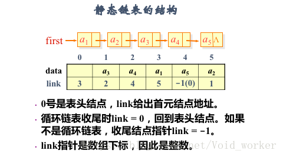

3. 循环链表

   最后一个节点的 index 指针不是空，而是指向头节点。

4. 双向链表

   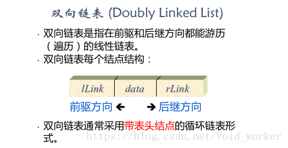

　　单向链表单节点：


　　双向链表单节点：


　　链式存储结构：

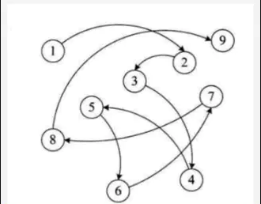

## 2. 单向链表

　　单向链表元素之间的组织形式：

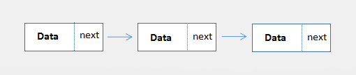

　　单向链表删除节点操作：

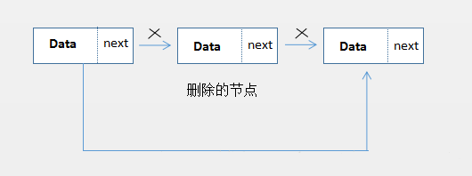

　　为了便于描述把上面三个节点称之为 A、B、C，要删除的节点为 B。要完成删除操作，需要维护节点引用即可：把 B 前一个节点 A 的 next 指向 C 节点，然后把要删除的 B 节点的 next 置为 null。

　　如下图所示：

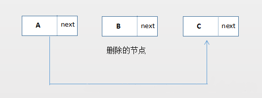

　　这样就完成了删除节点的操作，如果是删除头结点只需要把头结点的 next 置为 null，如果是删除尾节点，只需要把尾节点的上一个节点的 next 置为 null。

　　单向链表添加节点操作（往 A 和 B 之间插入一个新节点）：

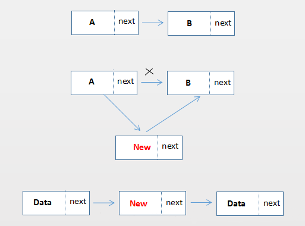

　　小结：对于单向链表，在头部或者尾部添加或删除操作只需要维护一个引用，如果是在中间添加或删除操作需要维护两个引用，如果是对头部操作，需要维护下 head 节点。

### 2.1. 单向链表的代码实现

　　首先来看看单向链表用代码如何实现。

#### 2.1.1. List 接口

　　同样的实现了 List 接口：

```java
/**
 * 链表的接口
 * @param <T>
 */
public interface List<T> extends Iterable<T> {
    /**
     * 添加节点
     * @param t
     */
    void add(T t);

    /**
     * 添加节点到索引 index
     * @param index
     * @param t
     */
    void add(int index, T t);

    /**
     * 获取索引 index 的值
     * @param index
     * @return
     */
    T get(int index);

    /**
     * 获取 t 在链表中的索引
     * @param t
     * @return
     */
    int indexOf(T t);

    /**
     * 移除 t
     * @param t
     * @return
     */
    boolean remove(T t);

    /**
     * 移除索引 index 上的值
     * @param index
     * @return
     */
    T remove(int index);

    /**
     * 清空链表
     */
    void clear();

    /**
     * 链表的大小
     * @return
     */
    int size();
}
```

#### 2.1.2. 单向链表的实现

　　额外的，针对链表还增加了 addFirst、addLast、removeFirst 和 removeLast 方法。

```java
/**
 * 单向链表
 * @param <T>
 */
public class LinkedList<T> implements List<T> {

    private int size; // 链表存储的数据大小
    private Node head; // 头节点
    private Node tail; // 尾节点

    @Override
    public Iterator<T> iterator() {
        return new MyIterator();
    }

    private class MyIterator implements Iterator<T> {
        private Node current = head;

        @Override
        public boolean hasNext() {
            return current != null;
        }

        @Override
        public T next() {
            T element = current.element;
            current = current.next;
            return element;
        }
    }

    /**
     * 用来保存每个节点数据
     */
    private class Node {
        T element; // 数据内容
        Node next; // 指向下一个地址

        Node(T element, Node next) {
            this.element = element;
            this.next = next;
        }
    }

    private void checkIndexOutOfBound(int index, int size) {
        if (index < 0 || index > size) {
            throw new IndexOutOfBoundsException("index large than size");
        }
    }

    /**
     * 采用尾插法，插入新节点
     *
     * @param t
     */
    @Override
    public void add(T t) {
        addLast(t);
    }

    @Override
    public void add(int index, T t) {
        checkIndexOutOfBound(index, size);
        if (head == null) {
            add(t);
        } else {
            if (index == 0) {
                addFirst(t);
            } else {
                Node prevNode = getNode(index - 1);
                prevNode.next = new Node(t, prevNode.next);
                size++;
            }
        }
    }

    public void addLast(T t) {
        // 空链表
        if (head == null) {
            // 首尾都指向新的节点
            tail = head = new Node(t, null);
        } else {
            Node newNode = new Node(t, null);
            // 让尾部的 next 指向新的节点
            tail.next = newNode;
            tail = newNode;
        }
        size++;
    }

    /**
     * 采用头插法，插入新节点
     *
     * @param element
     */
    public void addFirst(T element) {
        head = new Node(element, head);
        if (tail == null) {
            tail = head;
        }
        size++;
    }

    /**
     * 根据索引获取节点
     *
     * @param index
     * @return
     */
    private Node getNode(int index) {
        checkIndexOutOfBound(index, size - 1);
        Node current = head;
        for (int i = 0; i < size; i++, current = current.next) {
            if (index == i) {
                return current;
            }
        }
        return null;
    }

    @Override
    public T get(int index) {
        Node node = getNode(index);
        if (node != null) {
            return node.element;
        }
        return null;
    }

    @Override
    public int indexOf(T t) {
        Node current = head;
        for (int i = 0; i < size; i++, current = current.next) {
            if (t == null && current.element == null) {
                return i;
            }
            if (t != null && t.equals(current.element)) {
                return i;
            }
        }
        return -1;
    }

    /**
     * 删除尾节点
     *
     * @return
     */
    public T removeLast() {
        Node delete = tail;
        if (delete == null) {
            throw new NoSuchElementException();
        }
        // 如果当前只有一个节点
        if (delete == head) {
            head = tail = null;
        } else {
            // 因为是单向链表，无法直接获取最后节点的上一个节点
            Node pre = getNode(size - 2);
            // 解除引用
            pre.next = null;
            // 重新设置 tail 节点
            tail = pre;
        }
        size--;
        return delete.element;
    }

    /**
     * 删除头节点
     *
     * @return
     */
    public T removeFirst() {
        if (head == null) {
            throw new NoSuchElementException();
        }
        Node delete = head;
        // 如果当前只有一个节点
        if (delete == tail) {
            head = tail = null;
        } else {
            // 重新设置 header 节点
            head = delete.next;
            // 解除被删除元素的 next 引用
            delete.next = null;
        }
        size--;
        return delete.element;
    }

    @Override
    public boolean remove(T t) {
        int index = indexOf(t);
        if (index == -1) {
            return false;
        }
        remove(index);
        return true;
    }

    @Override
    public T remove(int index) {
        checkIndexOutOfBound(index, size - 1);
        Node delete;
        // 如果删除的是头部
        if (index == 0) {
            return removeFirst();
        } else {
            Node pre = getNode(index - 1);
            // 待删除的节点
            delete = pre.next;
            // 解除待删除节点和它前一个节点的引用
            pre.next = delete.next;
            // 解除待删除节点和下一个节点的引用
            delete.next = null;
        }
        size--;
        return delete.element;
    }

      /**
     * 是否包含节点
     *
     * @param e
     * @return
     */
    public boolean contains(T e) {
        int index = indexOf(e);
        if (index == -1) {
            return false;
        }
        return true;
    }

    /**
     * 是否为空
     * @return
     */
    public boolean isEmpty() {
        return size == 0;
    }
    
    @Override
    public void clear() {
        head = null;
        tail = null;
        size = 0;
    }

    @Override
    public int size() {
        return size;
    }

    @Override
    public String toString() {
        if (size == 0) {
            return "[]";
        }
        StringBuilder builder = new StringBuilder();
        builder.append("head [");
        Node current = head;
        while (current != null) {
            builder.append(current.element).append("->");
            current = current.next;
        }
        builder.append("null] tail");
        return builder.toString();
    }
}
```

　　从上面的代码可以看出，如果根据索引来添加、删除节点，时间复杂度为 O(N)，需要遍历链表。删除链表的头元素（removeFirst）时间复杂度为 O(1)，但是对于单向链表的 removeLast() 时间复杂度是 O(N)，因为单向列表只保存了下一个元素的引用，无法获取上一个元素，需要遍历才能获取被删除节点的上一个节点，这个时候就需要双向链表。

## 3. 双向链表

　　双向链表组织形式：


　　删除中间一个元素：

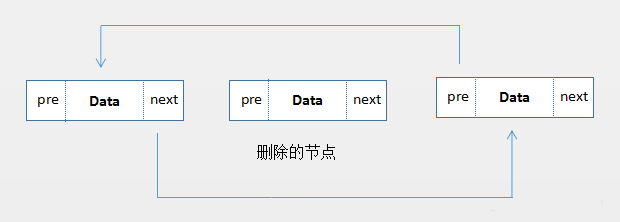

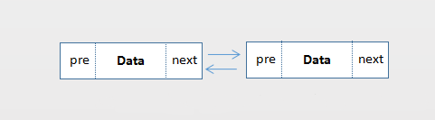

　　往中间添加元素：

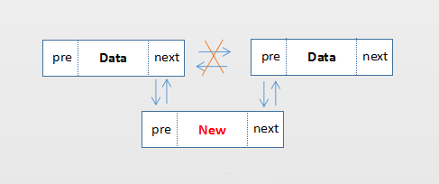

　　双向链表和单向链表类似，只不过要多维护一个引用（前一个元素的引用），每个节点既可以向前引用，也可以向后引用。

　　双向链表删除最后一个节点（removeLast），不用像单向链表用遍历的方式获取前一个节点，它可以直接拿到上一个节点的引用。

　　双向链表根据索引 index 指定位置查找、添加、删除更加高效。单向链表根据索引查找的时候，需要从头结点开始遍历，如果有 100 个节点，用户查找 index=99 位置的节点，需要遍历 100 次，才能找到这个节点。如果是双向链表，可以从为节点开始遍历，只需要判断 index 是否大于 size/2，也就是说如果 index 是在链表的后半部分，那就从尾节点向头结点方向遍历，如果链表有 100 节点，访问 index = 99 的节点，只需要循环一次就找到了。

### 3.1. 双向链表查找的代码

　　代码如下：

```java
    /**
     * 如果需要查找的 index 节点在链表的后半部分，则从后往前遍历，否则按照顺序遍历
     *
     * @param index
     * @return
     */
    private Node getNodeFast(int index) {
        checkIndexOutBound(index, size - 1);
        if (index > size / 2) {
            Node current = tail;
            for (int i = size - 1; i >= 0; i--, current = current.prev) {
                if (index == i) {
                    return current;
                }
            }
        } else {
            // 从头节点向尾节点方法遍历
            return getNode(index);
        }
        return null;
    }

```

　　来看看 JDK 中 LinkedList 是怎么做的：

```java
    Node<E> node(int index) {
        // assert isElementIndex(index);
        if (index < (size >> 1)) {
            Node<E> x = first;
            for (int i = 0; i < index; i++)
                x = x.next;
            return x;
        } else {
            Node<E> x = last;
            for (int i = size - 1; i > index; i--)
                x = x.prev;
            return x;
        }
    }
```

　　这个要巧妙一些，在 for 循环中，不需要判断 index 和 i 是否相等，把 index 作为循环的边界值，最后一次循环就是要找的值。

### 3.2. 双向链表的实现

　　双向链表 DuplexLinkedList 代码：

```java
/**
 * 双向链表
 *
 * @param <T>
 */
public class DuplexLinkedList<T> implements List<T> {

    private int size; // 链表存储的大小
    private Node head; // 头节点
    private Node tail; // 尾节点

    @Override
    public Iterator<T> iterator() {
        return new MyIterator();
    }

    private class MyIterator implements Iterator<T> {
        private Node current = head;

        @Override
        public boolean hasNext() {
            return current != null;
        }

        @Override
        public T next() {
            T element = current.element;
            current = current.next;
            return element;
        }
    }

    /**
     * 用于保存每个节点数据
     */
    private class Node {
        T element; // 节点存储的内容
        Node prev; // 上一个节点
        Node next; // 下一个节点

        Node(T element, Node next, Node prev) {
            this.element = element;
            this.next = next;
            this.prev = prev;
        }

        @Override
        public String toString() {
            return element + "";
        }
    }

    /**
     * 检查是否越界
     *
     * @param index
     * @param size
     */
    private void checkIndexOutBound(int index, int size) {
        if (index < 0 || index > size) {
            throw new IndexOutOfBoundsException("index large than size");
        }
    }

    /**
     * 采用尾插法，插入新节点
     *
     * @param t
     */
    @Override
    public void add(T t) {
        addLast(t);
    }

    @Override
    public void add(int index, T t) {
        checkIndexOutBound(index, size);
        if (head == null) {
            add(t);
        } else {
            if (index == 0) {
                addFirst(t);
            } else {
                Node preNode = getNode(index - 1);
                preNode.next = new Node(t, preNode.next, preNode);
                size++;
            }
        }
    }

    public void addLast(T t) {
        // 空链表
        if (head == null) {
            // 首尾都指向新的节点
            tail = head = new Node(t, null, null);
        } else {
            Node newNode = new Node(t, null, tail);
            // 让尾部的 next 指向新的节点
            tail.next = newNode;
            // 把尾部设置为新的节点
            tail = newNode;
        }
        size++;
    }

    /**
     * 采用头插法，插入新节点
     *
     * @param element
     */
    public void addFirst(T element) {
        Node node = new Node(element, head, null);
        if (head != null) {
            head.prev = node;
        }
        head = node;
        if (tail == null) {
            tail = head;
        }
        size++;
    }

    /**
     * 根据索引获取节点
     *
     * @param index
     * @return
     */
    private Node getNode(int index) {
        checkIndexOutBound(index, size - 1);
        Node current = head;
        for (int i = 0; i < size; i++, current = current.next) {
            if (index == i) {
                return current;
            }
        }
        return null;
    }

    /**
     * 如果需要查找的 index 节点在链表的后半部分，则从后往前遍历，否则按照顺序遍历
     *
     * @param index
     * @return
     */
    private Node getNodeFast(int index) {
        checkIndexOutBound(index, size - 1);
        if (index > size / 2) {
            Node current = tail;
            for (int i = size - 1; i >= 0; i--, current = current.prev) {
                if (index == i) {
                    return current;
                }
            }
        } else {
            // 从头节点向尾节点方法遍历
            return getNode(index);
        }
        return null;
    }

    @Override
    public T get(int index) {
        Node node = getNode(index);
        if (node != null) {
            return node.element;
        }
        return null;
    }

    @Override
    public int indexOf(T t) {
        Node current = head;
        for (int i = 0; i < size; i++, current = current.next) {
            if (t == null && current.element == null) {
                return i;
            }
            if (t != null && t.equals(current.element)) {
                return i;
            }
        }
        return -1;
    }

    @Override
    public boolean remove(T t) {
        int index = indexOf(t);
        System.out.println("remove t:" + t + ",index:" + index);
        if (index == -1) {
            return false;
        }
        remove(index);
        return true;
    }

    @Override
    public T remove(int index) {
        checkIndexOutBound(index, size - 1);
        Node delete;
        // 如果删除的是头部
        if (index == 0) {
            return removeFirst();
        } else {
            delete = getNodeFast(index);
            Node pre = delete.prev;
            Node next = delete.next;
            pre.next = next;
            if (next != null) {
                next.prev = pre;
            } else {
                tail = pre;
            }
            delete.next = null;
            delete.prev = null;
        }
        size--;
        return delete.element;
    }

    /**
     * 删除头结点
     *
     * @return
     */
    public T removeFirst() {
        if (head == null) {
            throw new NoSuchElementException();
        }
        Node delete = head;
        if (head == tail) {
            head = tail = null;
        } else {
            Node next = head.next;
            next.prev = null;
            delete.next = null;
            head = next;
        }
        size--;
        return delete.element;
    }

    /**
     * 删除尾节点
     *
     * @return
     */
    public T removeLast() {
        if (tail == null) {
            throw new NoSuchElementException();
        }
        Node delete = tail;
        // 如果只有一个元素
        if (head == tail) {
            head = tail = null;
        } else {
            Node pre = delete.prev;
            pre.next = null;
            delete.prev = null;
            tail = pre;
        }
        size--;
        return delete.element;
    }

    @Override
    public void clear() {
        head = null;
        tail = null;
        size = 0;
    }

    @Override
    public String toString() {
        if (size == 0) {
            return "[]";
        }
        StringBuilder builder = new StringBuilder();
        builder.append("head [");
        Node current = head;
        while (current != null) {
            builder.append(current.element).append("->");
            current = current.next;
        }
        builder.append("null] tail");
        return builder.toString();
    }

    @Override
    public int size() {
        return size;
    }
}

```

　　链表在插入、删除元素比顺序存储的线性表要快，但是失去了随机访问的能力，所以在查找一个节点或者根据 “ 索引 ” 来访问某个元素要比顺序存储的线性表要慢。

　　JDK LinkedList 底层也是用链表实现的，LinkedList 还是个双端队列（既可以当作栈使用，也可以当作队列使用）。

## 4. 学习例子

### 4.1. 基于系统 API LinkedList 将麻将进行分组排序

#### 4.1.1. 思想

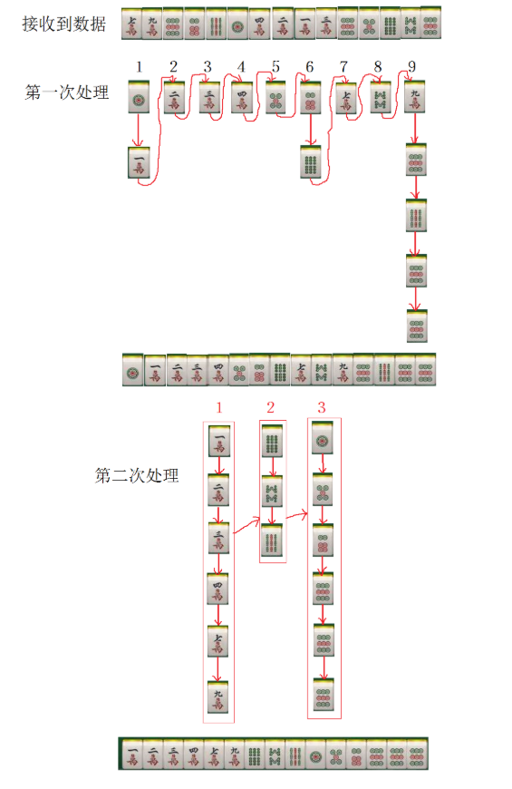

#### 4.1.2. 逻辑步骤

1. 先根据点数把所有的点数分别装入到对应的链表组中。
2. 再把链表中所有的点数合并在一起。
3. 再根据花色把所有的点数分别装在对应的链表中。
4. 最后把对应的点数链表装在一个新的集合中。

#### 4.1.3. 代码编写

```java
/**
 * 麻将数据 Bean
 */
public class Mahjong {
    public int suit; //筒1，万2，索3
    public int rank; //点数 一 二 三

    public Mahjong(int suit,int rank){
        this.suit = suit;
        this.rank = rank;
    }

    @Override
    public String toString() {
        return "Mahjong{" +
                "suit=" + suit +
                ", rank=" + rank +
                '}';
    }
}
/**
 * 基于系统 API LinkedList 将麻将进行分组排序
 */
public class ManjongSort {
    /**
     * 用系统自带的链表结构 LinkedList 来进行将麻将排序
     */
    public static void radixSort(LinkedList<Mahjong> list) {
        // 1. 先把所有的点数分别装入到对应的链表组中
        // 创建一个点数最大的为 9 的集合
        LinkedList[] linkedList = new LinkedList[9];
        // 先初始化这 9 个链表目的是装所有的对应的点数
        for (int i = 0; i < 9; i++) {
            linkedList[i] = new LinkedList();
        }
        while (list.size() > 0) {
            // 取出对应的元素放入到链表中
            Mahjong mahjong = list.remove();
            // mahjong.rank -1 的意思就是对应的集合下标
            linkedList[mahjong.rank - 1].add(mahjong);
        }

        // 2. 然后再把所有的链表中的点数合并在一起
        for (int i = 0; i < linkedList.length; i++) {
            list.addAll(linkedList[i]);
        }

        // 3. 再把所有的点数分别装入到对象的链表中
        // 花色有 3 个，那么就创建 3 个链表来代表装入对应的花色
        LinkedList[] linkedLists = new LinkedList[3];
        for (int i = 0; i < 3; i++) {
            linkedLists[i] = new LinkedList();
        }

        // 把对应的花色装在对应的链表中
        while (list.size() > 0) {
            Mahjong mahjong = list.remove();
            linkedLists[mahjong.suit - 1].add(mahjong);
        }

        // 4. 最后在把对应的点数链表装在一个新的集合中
        for (int i = 0; i < linkedLists.length; i++) {
            list.addAll(linkedLists[i]);
        }
    }

    public static void main(String[] args) {
        LinkedList<Mahjong> list = new LinkedList<>();
        list.add(new Mahjong(2, 7));
        list.add(new Mahjong(2, 9));
        list.add(new Mahjong(1, 9));
        list.add(new Mahjong(1, 6));
        list.add(new Mahjong(3, 9));
        list.add(new Mahjong(1, 1));
        list.add(new Mahjong(2, 4));
        list.add(new Mahjong(2, 2));
        list.add(new Mahjong(2, 1));
        list.add(new Mahjong(2, 3));
        list.add(new Mahjong(1, 9));
        list.add(new Mahjong(1, 5));
        list.add(new Mahjong(3, 6));
        list.add(new Mahjong(3, 8));
        list.add(new Mahjong(1, 9));

        radixSort(list);
        System.out.println("list:" + list);
    }
}
```

　　输出：

```java
list:[Mahjong{suit=1, rank=1}, Mahjong{suit=1, rank=5}, Mahjong{suit=1, rank=6}, Mahjong{suit=1, rank=9}, Mahjong{suit=1, rank=9}, Mahjong{suit=1, rank=9}, Mahjong{suit=2, rank=1}, Mahjong{suit=2, rank=2}, Mahjong{suit=2, rank=3}, Mahjong{suit=2, rank=4}, Mahjong{suit=2, rank=7}, Mahjong{suit=2, rank=9}, Mahjong{suit=3, rank=6}, Mahjong{suit=3, rank=8}, Mahjong{suit=3, rank=9}]

```

#### 4.1.4. 应用

　　数据量几十个，插入操作多的情况。

### 4.2. 编写双向链表 LinkedList CURD

#### 4.2.1. 参考图解

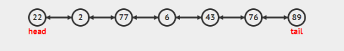

#### 4.2.2. 编写代码

```java
/**
 * 自己定义的双向链表结构 LinkedList
 */
public class CustomLinkedList<E> {
    /**
     * 链表的头部
     */
    transient Node<E> head;

    /**
     * 链表的尾部
     */
    transient Node<E> tail;

    /**
     * 当前链表的大小
     */
    transient int size;

    /**
     * 存入数据
     *
     * @param e
     * @return
     */
    public boolean add(E e) {
        linkLast(e);
        return true;
    }

    /**
     * 返回当前链表的大小
     *
     * @return
     */
    public int getSize() {
        return size;
    }

    /**
     * 将当前数据存入到链表的头部
     *
     * @param e
     */
    public void addFirst(E e) {
        Node<E> h = head;
        // 创建新节点
        Node<E> newNode = new Node<>(null, e, head);
        head = newNode;
        if (h == null) {
            tail = newNode;
        } else {
            h.pre = newNode;
        }
        size++;
    }

    /**
     * 根据索引搜索到的节点数据
     *
     * @param index
     * @return
     */
    public E get(int index) {
        if (isPositionIndex(index)) {
            return searchNode(index).data;
        }
        return null;
    }

    /**
     * 根据索引添加数据
     *
     * @param index
     * @param e
     */
    public void add(int index, E e) {
        addIndex(index, e);
    }

    /**
     * 删除第一个节点
     *
     * @return
     */
    public E remove() {
        return removeFirst();
    }

    /**
     * 删除头节点
     *
     * @return
     */
    private E removeFirst() {
        Node<E> h = head;
        if (h == null) {
            throw new NoSuchElementException();
        }
        return unlinkFirst(h);
    }

    private E unlinkFirst(Node<E> h) {
        // 删除的数据
        E deleData = h.data;
        // 找到要删除的后驱
        Node next = h.next;

        // 清理节点
        h.data = null;
        h.next = null;

        // 将当前要删除的后驱置为链表头
        head = next;
        if (next == null) {
            tail = null;
        } else {
            next.pre = null;
        }
        h = null;
        size--;
        return deleData;
    }

    private void addIndex(int index, E e) {
        if (isPositionIndex(index)) {
            // 找到当前需要插入的索引位置
            if (index == size) {
                linkLast(e);
            } else {
                add(e, searchNode(index));
            }
        }
    }

    /**
     * 添加新节点到 searchNode 前驱
     *
     * @param e
     * @param searchNode
     */
    private void add(E e, Node<E> searchNode) {
        // 找到 searchNode 前驱节点
        Node<E> snPre = searchNode.pre;
        // 创建新节点
        Node<E> newNode = new Node<>(snPre, e, searchNode);
        searchNode.pre = newNode;
        // 这里判断 snPre 是否为空，如果为空说明 head 没有数据，如果有数据就直接把 snPre.next() = newNode
        if (snPre == null) {
            head = newNode;
        } else {
            snPre.next = newNode;
        }
        size++;
    }

    private Node<E> searchNode(int index) {
        // 优化寻找节点
        // 如果 index > size/2 就从尾部开始查询，反之从 head 开始遍历查询
        if (index > (size >> 1)) {
            Node<E> t = tail;
            for (int i = size - 1; i > index; i--) {
                t = t.pre;
            }
            return t;
        } else {
            Node<E> h = head;
            for (int i = 0; i < index; i++) {
                h = h.next;
            }
            return h;
        }
    }

    /**
     * 将数据存入到当前链表尾部
     *
     * @param e
     */
    private void linkLast(E e) {
        // 拿到尾部的节点数据
        Node<E> t = tail;
        // 创建新的节点数据，因为是存在当前节点的尾部
        // 那么直接默认将当前添加进来的 E 的前驱设置为
        // 当前链表中的尾部数据，现在已经形成单链表了
        // 下一步直接形成双向链表
        Node<E> newNode = new Node<>(t, e, null);
        // 现在是双向链表，要把新的节点指向当前的尾部节点，尾部节点指向新的节点
        tail = newNode;

        // 如果尾部节点为空，那么说明 head 也是空数据，那就把新节点数据赋值给 head
        if (t == null) {
            head = newNode;
        } else {
            t.next = newNode;
        }
        size++;
    }

    /**
     * 创建一个空的构造者
     */
    public CustomLinkedList() {

    }

    private boolean isPositionIndex(int index) {
        return index >= 0 && index <= size;
    }

    /**
     * 定义一个内部节点
     * 双向链表需要前驱、后驱、数据
     *
     * @param <E>
     */
    public static class Node<E> {
        /**
         * 当前节点的前驱
         */
        private Node pre;

        /**
         * 当前节点的数据
         */
        private E data;
        /**
         * 当前节点的后驱
         */
        private Node next;

        public Node(Node pre, E data, Node next) {
            this.pre = pre;
            this.data = data;
            this.next = next;
        }

        @Override
        public String toString() {
            return "Node{" +
                    "pre=" + (pre == null ? "null" : pre.data) +
                    ", data=" + data +
                    ", next=" + (next == null ? "null" : next.data) +
                    '}';
        }
    }
}

```

#### 4.2.3. 测试代码

```java
    public static void main(String[] args) {
        CustomLinkedList<Integer> linkedList = new CustomLinkedList<>();
        linkedList.add(22);
        linkedList.add(2);
        linkedList.add(77);
        linkedList.add(6);
        linkedList.add(43);
        linkedList.add(76);
        linkedList.add(89);

        linkedList.add(0, 0);

        for (int i = 0; i < linkedList.size; i++) {
            int integer = linkedList.get(i);
            System.out.println("--CustomLinkedList--CustomLinkedList " + integer + "");
        }
        System.out.println("\n");
        Integer remove = linkedList.remove();
        System.out.println("--CustomLinkedList--CustomLinkedList remove " + remove);
        Integer remove1 = linkedList.remove();
        System.out.println("--CustomLinkedList--CustomLinkedList remove " + remove1 + "");
        Integer remove2 = linkedList.remove();
        System.out.println("--CustomLinkedList--CustomLinkedList remove " + remove2 + "");

        System.out.println("\n");
        for (int i = 0; i < linkedList.size; i++) {
            int integer = linkedList.get(i);
            System.out.println("--CustomLinkedList--CustomLinkedList " + integer + "");
        }
    }
```

#### 4.2.4. 测试结果

```java
--CustomLinkedList--CustomLinkedList 0
--CustomLinkedList--CustomLinkedList 22
--CustomLinkedList--CustomLinkedList 2
--CustomLinkedList--CustomLinkedList 77
--CustomLinkedList--CustomLinkedList 6
--CustomLinkedList--CustomLinkedList 43
--CustomLinkedList--CustomLinkedList 76
--CustomLinkedList--CustomLinkedList 89
--CustomLinkedList--CustomLinkedList remove 0
--CustomLinkedList--CustomLinkedList remove 22
--CustomLinkedList--CustomLinkedList remove 2


--CustomLinkedList--CustomLinkedList 77
--CustomLinkedList--CustomLinkedList 6
--CustomLinkedList--CustomLinkedList 43
--CustomLinkedList--CustomLinkedList 76
--CustomLinkedList--CustomLinkedList 89
```

### 4.3. 编写简单的 ArrayList CURD

#### 4.3.1. 编写代码

```java
/**
 * 简单的 ArrayList
 * @param <E>
 */
public class CustomArrayList<E> {
    /**
     * 默认的空元素对象
     */
    private static final Object[] DEFAULTCAPACITY_EMPTY_ELEMENTDATA = {};

    /**
     * 空元素数据
     */
    private static final Object[] EMPTY_ELEMENTDATA = {};

    /**
     * 默认的元素对象
     */
    private Object[] elementData = null;

    /**
     * 容量大小
     */
    private int size = 0;

    /**
     * 默认的容量大小
     */
    private static final int DEFAULT_CAPACITY = 10;

    /**
     * 最大的数量
     */
    private static final int MAX_ARRAY_SIZE = Integer.MAX_VALUE - 8;

    /**
     * 赋值为一个空对象
     */
    public CustomArrayList() {
        elementData = DEFAULTCAPACITY_EMPTY_ELEMENTDATA;
    }

    /**
     * 外部指定初始化一个容量大小
     *
     * @param initCapacity
     */
    public CustomArrayList(int initCapacity) {
        if (initCapacity > 0) {
            elementData = new Object[initCapacity];
        } else if (initCapacity == 0) {
            elementData = EMPTY_ELEMENTDATA;
        } else {
            throw new IllegalArgumentException("Illegal Capacity:" + initCapacity);
        }
    }

    /**
     * 添加数据
     *
     * @param e
     * @return
     */
    public boolean add(E e) {
        // 判断是否需要开辟容量空间
        checkIsNeedCapacity(size + 1);
        // 添加数据
        elementData[size++] = e;
        return true;
    }

    private void checkIsNeedCapacity(int minCapacity) {
        if (elementData == DEFAULTCAPACITY_EMPTY_ELEMENTDATA) {
            minCapacity = Math.max(DEFAULT_CAPACITY, minCapacity);
        }
        ensureExplicitCapacity(minCapacity);
    }

    private void ensureExplicitCapacity(int minCapacity) {
        if (minCapacity - elementData.length > 0) {
            grow(minCapacity);
        }
    }

    /**
     * 开辟空间的核心代码
     *
     * @param minCapacity
     */
    private void grow(int minCapacity) {
        int oldCapacity = elementData.length;
        int newCapacity = oldCapacity + (oldCapacity >> 1);
        if (newCapacity - minCapacity < 0) {
            newCapacity = minCapacity;
        }
        if (newCapacity - MAX_ARRAY_SIZE > 0) {
            newCapacity = hugeCapacity(minCapacity);
        }
        elementData = Arrays.copyOf(elementData, newCapacity);
    }

    private static int hugeCapacity(int minCapacity) {
        if (minCapacity < 0) {
            throw new OutOfMemoryError();
        }
        return (minCapacity > MAX_ARRAY_SIZE) ? Integer.MAX_VALUE : MAX_ARRAY_SIZE;
    }

    @Override
    public String toString() {
        return "CustomArrayList{" +
                "size=" + size +
                "，elementData=" + Arrays.toString(elementData) +
                '}';
    }
}

```

#### 4.3.2. 测试代码

```java
    public static void main(String[] args) {
        CustomArrayList<Integer> arrayList = new CustomArrayList<>();
        arrayList.add(1);
        arrayList.add(33);
        arrayList.add(45);
        arrayList.add(8);
        arrayList.add(96);
        System.out.println("arrayList：" + arrayList);
    }
```

#### 4.3.3. 测试结果

```java
arrayList：CustomArrayList{size=5，elementData=[1, 33, 45, 8, 96, null, null, null, null, null]}
```

### 4.4. 编写单向链表结构的 CURD

#### 4.4.1. 参考图解

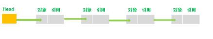

#### 4.4.2. 编写代码

```java
/**
 * 单向链表
 */
public class SingleLinked<T> {
    /**
     * 头结点
     */
    Node<T> head;

    /**
     * 链表长度
     */
    int size = 0;

    /**
     * 将数据添加到链表中
     *
     * @param data
     */
    public void add(T data) {
        Node node = new Node(data);
        if (head == null) {
            head = node;
            return;
        }
        Node<T> tmp = head;
        while (tmp.next != null) {
            tmp = tmp.next;
        }
        tmp.next = node;
        size++;
    }

    /**
     * 将数据添加到第一个位置
     *
     * @param data
     */
    public void addHead(T data) {
        Node node = new Node(data);
        if (head == null) {
            head = node;
            size++;
            return;
        }
        Node n = head;
        node.next = n;
        head = node;

        size++;
    }

    public void add(int index, T data) {
        Node node = new Node(data);
        if (index == 0) {
            addHead(data);
        } else {
            Node tmp = head;
            for (int i = 0; i < index - 1; i++) {
                tmp = tmp.next;
            }
            Node n = tmp.next;
            tmp.next = node;
            node.next = n;
            size++;
        }
    }

    /**
     * 全部清除数据
     */
    public void clear() {
        head = null;
        size = 0;
    }

    public boolean remove(int index) {
        Node<T> tmp = head;
        if (index == 0) {
            Node<T> newHead = tmp.next;
            head = newHead;
            size--;
            return true;
        }
        if (index < size) {
            for (int i = 0; i < index - 2; i++) {
                tmp = tmp.next;
            }
            Node<T> pre = tmp;
            // 要删除的节点
            Node<T> next = tmp.next;
            Node<T> p = tmp.next.next;
            pre.next = p;
            next = null;
            size--;
            return true;
        }
        return false;
    }

    /**
     * 节点数据
     *
     * @param <T>
     */
    private class Node<T> {
        T data;
        Node<T> next;

        public Node(T data, Node<T> next) {
            this.data = data;
            this.next = next;
        }

        public Node(T next) {
            this.data = next;
        }
    }

    private void println() {
        if (head == null) return;
        Node n = head;

        while (n != null) {
            System.out.print(n.data + "=>");
            n = n.next;
        }
    }
}

```

#### 4.4.3. 测试代码

```java
    public static void main(String[] args) {
        SingleLinked singleLinked = new SingleLinked();
        singleLinked.add(22);
        singleLinked.add(2);
        singleLinked.add(77);
        singleLinked.add(6);
        singleLinked.add(43);
        singleLinked.add(76);
        singleLinked.add(89);
        singleLinked.println();
        singleLinked.remove(3);
        System.out.print("\nremove 3:");
        singleLinked.println();
    }
```

#### 4.4.4. 测试结果

```java
22=>2=>77=>6=>43=>76=>89=>
remove 3:22=>2=>6=>43=>76=>89=>
```

## 5. 参考文章

1. [数据结构与算法（二）线性表之链式存储和 LinkedList 实现](https://chiclaim.blog.csdn.net/article/details/80351584)
2. [从零开始学数据结构和算法(二)线性表的链式存储结构](https://juejin.im/post/5c9449dd5188252da22508e3)
3. [数据结构--知识点总结--线性表](https://blog.csdn.net/Void_worker/article/details/81058094)

