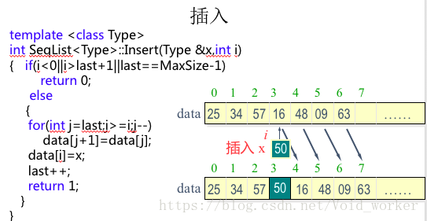
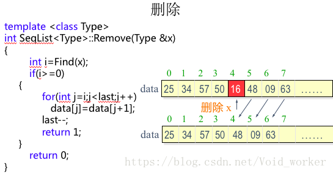
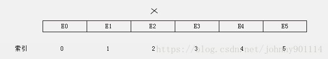
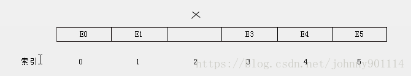
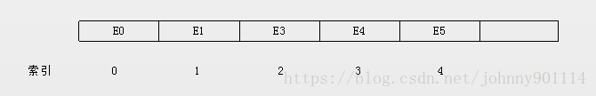

#  线性表顺序存储

## 基本概念

　　何为数据结构？专门研究数据之间的逻辑关系、存储方式及操作的学问就是所谓的数据结构。

### 数据的逻辑结构

　　数据元素之间存在的关联关系（与它们在计算机中的存储位置无关），被称为数据的逻辑结构。

　　从数据的逻辑结构划分大致有如下 4 种逻辑结构：

1. 集合：数据元素之间只有 “ 同属于一个集合 ” 的关系。
2. 线性结构：数据元素之间存在 “ 一对一 ” 的关系。
3. 树形结构：数据元素之间存在 “ 一对多 ” 的关系。
4. 图状结构或网状结构

## 数据的存储结构

　　对于数据不同的逻辑结构，在底层通常有两种物理存储结构（数据元素在计算机存储空间的存放形式）：

1. 顺序存储结构（线性表）
2. 链式存储结构（链表）


## 线性表

　　对于常用的数据结构可以分为线性结构和非线性结构，线性结构主要是线性表，非线性结构主要是树和图。

　　从上面对数据结构的逻辑结构介绍中得知，数据元素之间存在 “ 一对一 ” 的关系，即除了第一个和最后一个数据元素之外，其他数据元素都是首尾相接的（注意循环链表也是线程结构，但是它首尾是相接的）。

　　线性表的每个元素必须有相同的结构（元素可以是简单的数据，也可以是复杂的数据，但复杂的数据内部结构要相同）。

　　线性表：一个线性表是 n 个数据元素的有限序列。

### 线性表的基本操作

1. 线性表初始化
2. 插入元素
3. 向指定位置插入元素
4. 删除元素
5. 删除指定位置的元素
6. 取指定位置的元素
7. 查找元素的位置
8. 返回线性表的长度
9. 判断线性表是否为空
10. 清空线性表

　　线性表主要有两个存储结构：顺序存储（线性表）、链式存储（链表）。

　　顺序结构存储是指用一组地址连续的存储单元一次存放线性表中的元素。也就是说，顺序结构线性表中的数据元素的物理关系和逻辑关系是一致的。所以如果线性表采用顺序存储，让线性表中间的某个位置插入或者删除元素需要对其之后的元素进行移动。

## 线性表的顺序表示

　　线性表的顺序表示指的是用一组地址连续的存储单元一次存储线性表的数据元素。

　　特点：逻辑关系上相邻的两个元素在物理位置上也相邻。

　　优点：随机存取表中任一元素，它的存储位置可用一个简单、直观的公式来表示。

　　缺点：做插入或删除操作时，需移动大量元素。

### 顺序存储结构的线性表中间位置插入新元素



　　首先要把该位置及其之后的元素往后移一位，为新元素腾出空间。

　　往索引 index = 2 的位置插入元素：


　　把索引 index = 2 及其后面的所有元素往后移一格，为新元素腾出位置：


　　插入新元素：


### 删除顺序存储结构的线性表中间位置元素



　　删除顺序存储结构的线性表中间位置的元素，操作类似。

　　删除索引 index = 2 的元素：



　　删除元素：



　　把 index = 2 之后的所有元素向左移动一格：



　　顺序存储的线性表，采用数据存储，插入元素如果容量不够，需要进行扩容。扩容主要时创建一个新的数组，然后把数据从老数组拷贝到新的数组中。

## 实现 ArrayList

　　Java 中的 ArrayList 就是一个顺序存储的线性表。下面来实现一个简易的 ArrayList。

　　可以把上面线性表的基本操作提炼出一个 Java 接口的 List.java：

```java
/**
 * 链表的接口
 * @param <T>
 */
public interface List<T>{
    /**
     * 添加节点
     * @param t
     */
    void add(T t);

    /**
     * 添加节点到索引 index
     * @param index
     * @param t
     */
    void add(int index, T t);

    /**
     * 获取索引 index 的值
     * @param index
     * @return
     */
    T get(int index);

    /**
     * 获取 t 在链表中的索引
     * @param t
     * @return
     */
    int indexOf(T t);

    /**
     * 移除 t
     * @param t
     * @return
     */
    boolean remove(T t);

    /**
     * 移除索引 index 上的值
     * @param index
     * @return
     */
    T remove(int index);

    /**
     * 清空链表
     */
    void clear();

    /**
     * 链表的大小
     * @return
     */
    int size();
}
```

　　实现类如下：

```java
/**
 * 顺序存储的线性表
 */
public class ArrayList<T> implements List<T> {

    private static final int DEFAULT_SIZE = 16;

    private Object[] array;

    private int capacity;

    private int size;

    public ArrayList() {
        capacity = DEFAULT_SIZE;
        array = new Object[capacity];
    }

    public ArrayList(int size) {
        capacity = 1;
        // 把 capacity 设置为大于 size 的最小的 2 的 n 次方
        while (capacity < size) {
            capacity <<= 1;
        }
        array = new Object[capacity];
    }

    /**
     * 扩容
     *
     * @param expectCapacity
     */
    private void ensureSize(int expectCapacity) {
        // 如果当前的通量小于期望的容量
        if (expectCapacity > capacity) {
            // 不断的将  capacity * 2，直到 capacity 大于 expectCapacity
            while (capacity < expectCapacity) {
                capacity <<= 1;
            }
            array = Arrays.copyOf(array, capacity);
        }
    }

    /**
     * 检查是否越界
     *
     * @param index
     * @param size
     */
    private void checkIndexOutOdBound(int index, int size) {
        if (index < 0 || index > size) {
            throw new IndexOutOfBoundsException("index large than size");
        }
    }

    /**
     * 向最后一个位置添加元素
     *
     * @param t
     */
    @Override
    public void add(T t) {
        add(size, t);
    }

    /**
     * 在某个特定的位置添加元素
     *
     * @param index
     * @param t
     */
    @Override
    public void add(int index, T t) {
        checkIndexOutOdBound(index, size);
        ensureSize(capacity + 1);
        System.arraycopy(array, index, array, index + 1, size - index);
        array[index] = t;
        size++;
    }

    /**
     * 获取某个元素的位置
     *
     * @param index
     * @return
     */
    @Override
    public T get(int index) {
        checkIndexOutOdBound(index, size - 1);
        return (T) array[index];
    }

    /**
     * 获取某个元素的位置
     *
     * @param t
     * @return
     */
    @Override
    public int indexOf(T t) {
        for (int i = 0; i < size; i++) {
            Object obj = array[i];
            if (obj == null && t == null) {
                return i;
            }
            if (obj != null && obj.equals(t)) {
                return i;
            }
        }
        return -1;
    }

    /**
     * 删除某个元素
     *
     * @param t
     * @return
     */
    @Override
    public boolean remove(T t) {
        int index = indexOf(t);
        if (index != -1) {
            remove(index);
        }
        return index != -1;
    }

    /**
     * 删除某个位置的元素
     *
     * @param index
     * @return
     */
    @Override
    public T remove(int index) {
        checkIndexOutOdBound(index, size - 1);
        T oldValue = (T) array[index];
        int copySize = size - index - 1;
        // 如果是删除最后一个元素则不需要 copy
        // 或者 index = size -1
        if (copySize > 0) {
            System.arraycopy(array, index + 1, array, index, copySize);
        }
        // index 位置的元素向左移动，则需要把最后一个元素置为 null，避免内存泄漏
        array[--size] = null;
        return oldValue;
    }

    /**
     * 清空所有元素
     */
    @Override
    public void clear() {
        for (int i = 0; i < size; i++) {
            array[i] = null;
        }
        size = 0;
    }

    @Override
    public int size() {
        return size;
    }

    public String toString() {
        if (size == 0) {
            return "[]";
        }
        StringBuilder sb = new StringBuilder();
        sb.append('[');
        for (int i = 0; i < size; i++) {
            sb.append(array[i]).append(',');
        }
        sb.deleteCharAt(sb.length() - 1);
        sb.append(']');
        return sb.toString();
    }
}

```

　　测试：

```java
    public static void main(String[] args) {
        ArrayList<String> arrayList = new ArrayList<>();
        arrayList.add("a");
        arrayList.add("b");
        arrayList.add("c");
        System.out.println(arrayList.size() + "," + arrayList);
        arrayList.remove(1);
        System.out.println("remove:" + arrayList.size() + "," + arrayList);
    }
```

　　输出：

```java
3,[a,b,c]
remove:2,[a,c]
```

## 对比 JDK 中的 ArrayList

　　以上代码实现了线性表的基本操作。下面主要说下和 JDK ArrayList 不同点。

### 1. forEach 迭代

　　以上代码不支持 forEach 迭代，为了实现能够支持 forEach 迭代，需要实现 java.lang.Iterable 接口，如下所示：

```java
    @Override
    public Iterator<T> iterator() {
        return new MyIterator();
    }

    class MyIterator implements Iterator {
        private int index = 0;

        @Override
        public boolean hasNext() {
            return index < size();
        }

        @Override
        public T next() {
            return get(index++);
        }
    }
```

### 2. 扩容机制

　　扩容机制是不断的将 capacity*2，直到 capacity 大于 expectCapacity，JDK 里的 ArrayList 的扩容机制是：默认容量是 10，当需要的通量超过默认容量时，扩容算法为 (int)(oldCapaactty*1.5)，JDK ArrayList 扩容机制：

```java
private void grow(int minCapacity) {
	// overflow-conscious code
	int oldCapacity = elementData.length;
	int newCapacity = oldCapacity + (oldCapacity >> 1);
	if (newCapacity - minCapacity < 0)
		newCapacity = minCapacity;
	if (newCapacity - MAX_ARRAY_SIZE > 0)
		newCapacity = hugeCapacity(minCapacity);
	// minCapacity is usually close to size, so this is a win:
	elementData = Arrays.copyOf(elementData, newCapacity);
}
```

### 3. fail-fast 机制

　　当 foreach 的时候，删除集合元素会抛出 java.util.ConcurrentModificationException 异常。

　　如：

```java
for (int i : list) {
	list.remove(i);
}
```

　　ArrayList 的父类 AbstractList 有个 modCount 字段，每次当 ArrayList 对象进行结构调整时 （structurally modified），结构性调整包括调用 ArrayList 的 add 方法或 remove 方法增删元素，modCount 都会自增。每个 iterator 迭代器都有一个 expectedModCount，初始值为 modCount，调用 iterator 迭代器的 next 和 remove 方法都会去检查 expectedModCount 和 modCount 是否相等，如果不等立即抛出 java.util.ConcurrentModificationException 异常。

　　foreach 迭代本质上就是使用 iterator 迭代，在迭代的时候进行删除，那么 modCount 自增，next 方法检查到 expectedModCount 和 modCount 不相等，抛出异常。

　　解决方法为使用 iterator 进行迭代和删除操作。

```java
Iterator<Integer> iterator = list.iterator();
while (iterator.hasNext()) {
	int i = iterator.next();
	iterator.remove();//迭代器执行删除操作
	System.out.println(i);
}
```

　　这个方案再单线程的是有效的，如果在多线程的情况下，还是会触发 fail-fast，如下面代码：

```java
private static void iteratorMultipleThread() {
	java.util.ArrayList<Integer> list = new java.util.ArrayList<>();
	for (int i = 0; i < 10; i++) {
		list.add(i);
	}

	new Thread(new Runnable() {
		@Override
		public void run() {
			Iterator<Integer> iterator = list.iterator();
			while (iterator.hasNext()) {
				System.out.println("迭代元素：" + iterator.next());
				try {
					Thread.sleep(10);//出让cpu资源
				} catch (InterruptedException e) {
					e.printStackTrace();
				}
			}
		}
	}).start();

	new Thread(new Runnable() {
		@Override
		public void run() {
			Iterator<Integer> iterator = list.iterator();
			while (iterator.hasNext()) {
				int i = iterator.next();
				if (i % 2 == 0) {
					iterator.remove();
					System.out.println("移除元素：" + i);
				}

			}
		}
	}).start();

}
```

　　原因分析：

　　通过 JDK ArrayList 源码得知，list.iterator() 方法会创建一个新的 Iterator 迭代器，从上面对 Iterator 迭代器介绍知道，每个 iterator 迭代器都有一个 expectedModCount，初始值为 modCount。调用 iterator 迭代器的 next 和 remove 方法都会去检查 expectedModCount 和 modCount 是否相等，如果不等立即抛出 java.util.ConcurrentModificationException 异常。

　　启动两个线程，那么会有两个 Iterator，只要一个线程执行了 remove 操作，另一个线程再去迭代的时候（执行 next 方法）就会触发 fail-fast。

　　可以把 iterator 操作放进 synchornized 同步代码块。如：

```java
private static void fixIteratorMultipleThread() {
        java.util.ArrayList<Integer> list = new java.util.ArrayList<>();
        for (int i = 0; i < 10; i++) {
            list.add(i);
        }

        String flag = "flag";

        new Thread(new Runnable() {
            @Override
            public void run() {
                synchronized (flag) {
                    Iterator<Integer> iterator = list.iterator();
                    while (iterator.hasNext()) {
                        System.out.println("迭代：" + iterator.next());
                        try {
                            Thread.sleep(10);//出让cpu资源
                        } catch (InterruptedException e) {
                            e.printStackTrace();
                        }
                    }
                }
            }
        }).start();


        new Thread(new Runnable() {
            @Override
            public void run() {
                synchronized (flag) {
                    Iterator<Integer> iterator = list.iterator();
                    while (iterator.hasNext()) {
                        int i = iterator.next();
                        if (i % 2 == 0) {
                            iterator.remove();
                            System.out.println("移除：" + i);
                        }
                    }
                }
            }
        }).start();

    }
```

　　synchronized 虽然可以解决这个问题，但是失去了并发性，上面虽然有两个线程，但是需要等待一个线程执行完毕，另一个线程才能执行。可以使用支持并发的 CopyOnWriteArrayList 代替 synchronzied 的方式。例如下面的操作，迭代的过程中不断的插入（thread1 插入，thread2 迭代）。

```java
    private static void fixIteratorMultipleThread2() {
        CopyOnWriteArrayList<Integer> list = new CopyOnWriteArrayList<>();
//        java.util.ArrayList<Integer> list = new java.util.ArrayList<>();
        Thread thread = new Thread(new Runnable() {
            @Override
            public void run() {
                int i = 1;
                while (true) {
                    list.add(i++);
                    System.out.println(i + "---------add");
                }
            }
        });
        thread.setDaemon(true);
        thread.start();

        Thread thread2 = new Thread(new Runnable() {
            @Override
            public void run() {
                try {
                    Thread.sleep(1);
                } catch (InterruptedException e) {
                    e.printStackTrace();
                }
                for (int value : list) {
                    System.out.println("------" + value);
                }
            }
        });
        thread2.start();
    }
```

　　下面说一下 Vector 类。

　　Vector 和 ArrayList 非常相似，Vector 是线程安全的，ArrayList 不是线程安全的。

　　Vector 实现线程安全的方式也很简单，把主要的操作方法加上了 synchornized 关键字，包括 iterator。上面 ArrayList 的 fail-fast 演示同样适用于 Vector，就算把 ArrayList 换成 Vector 同样会出现 ConcurrentModificationException 异常（原因一样）。

## 总结

1. 顺序存储的线性表如 ArrayList、Vector 是用一组地址连续的存储单元（数组）来存储元素的。
2. 顺序存储的线性表，因为需要一个固定长度的数组，在空间上存在一定的浪费。
3. 顺寻存储的线性表的逻辑结构和物理结构一致，所以查找和读取的效率很高。
4. 如果在 ArrayList、Vector 的中间对元素进行添加、删除操作，性能是比较差的，因为需要对元素进行整体移动。
5. 如果在开发中知道存储的元素的个数，为了节省内存空间可以在构造 ArrayList 的时候传递容量参数，如 new ArrayList(2)；如果使用的是无参的构造方法，在执行 add 方法的时候，会创建长度为 10 的数组（DEFAULT_CAPACITY=10）。
6. 在不考虑多线程的情况下，尽量使用 ArrayList，效率更高。
7. 线性表应用：一元多项式的表示及相加。

## 参考文章

1. [数据结构与算法（一）线性表之顺序存储和 ArrayList、Vector 源码剖析](https://chiclaim.blog.csdn.net/article/details/80158343)

3. [数据结构--知识点总结--线性表](https://blog.csdn.net/Void_worker/article/details/81058094)

