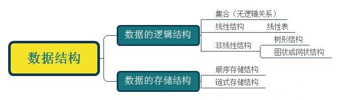
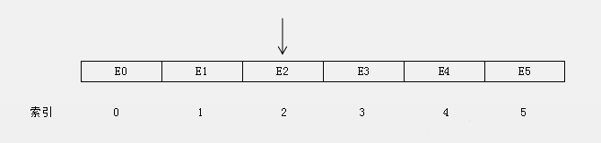
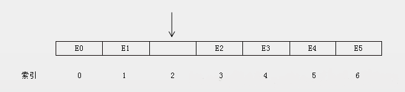
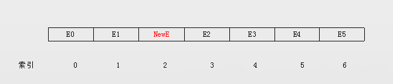

#  线性表顺序存储

## 基本概念

　　何为数据结构？专门研究数据之间的逻辑关系、存储方式及操作的学问就是所谓的数据结构。

### 数据的逻辑结构

　　数据元素之间存在的关联关系（与它们在计算机中的存储位置无关），被称为数据的逻辑结构。

　　从数据的逻辑结构划分大致有如下 4 种逻辑结构：

1. 集合：数据元素之间只有 “ 同属于一个集合 ” 的关系。
2. 线性结构：数据元素之间存在 “ 一对一 ” 的关系。
3. 树形结构：数据元素之间存在 “ 一对多 ” 的关系。
4. 图状结构或网状结构

## 数据的存储结构

　　对于数据不同的逻辑结构，在底层通常有两种物理存储结构（数据元素在计算机存储空间的存放形式）：

1. 顺序存储结构（线性表）
2. 链式存储结构（链表）

## 线性表

　　对于常用的数据结构可以分为线性结构和非线性结构，线性结构主要是线性表，非线性结构主要是树和图。

　　从上面对数据结构的逻辑结构介绍中得知，数据元素之间存在 “ 一对一 ” 的关系，即除了第一个和最后一个数据元素之外，其他数据元素都是首尾相接的（注意循环链表也是线程结构，但是它首尾是相接的）。

　　线性表的每个元素必须有相同的结构（元素可以是简单的数据，也可以是复杂的数据，但复杂的数据内部结构要相同）。

### 线性表的基本操作

1. 线性表初始化
2. 插入元素
3. 向指定位置插入元素
4. 删除元素
5. 删除指定位置的元素
6. 取指定位置的元素
7. 查找元素的位置
8. 返回线性表的长度
9. 判断线性表是否为空
10. 清空线性表

　　线性表主要有两个存储结构：顺序存储（线性表）、链式存储（链表）。

　　顺序结构存储是指用一组地址连续的存储单元一次存放线性表中的元素。也就是说，顺序结构线性表中的数据元素的物理关系和逻辑关系是一致的。所以如果线性表采用顺序存储，让线性表中间的某个位置插入或者删除元素需要对其之后的元素进行移动。

### 顺序存储结构的线性表中间位置插入新元素

　　首先要把该位置及其之后的元素往后移一位，为新元素腾出空间。

　　往索引 index = 2 的位置插入元素：

　　把索引 index = 2 及其后面的所有元素往后移一格，为新元素腾出位置：

　　插入新元素：

### 删除顺序存储结构的线性表中间位置元素

## 实现 ArrayList

## 对比 JDK 中的 ArrayList

### 1. forEach 迭代

### 2. 扩容机制

### 3. fail-fast 机制

## 总结

　　线性表

#### 

## 参考文章

1. [数据结构与算法（一）线性表之顺序存储和 ArrayList、Vector 源码剖析](https://chiclaim.blog.csdn.net/article/details/80158343)

3. [数据结构--知识点总结--线性表](https://blog.csdn.net/Void_worker/article/details/81058094)

