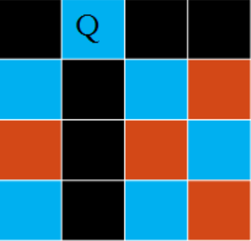
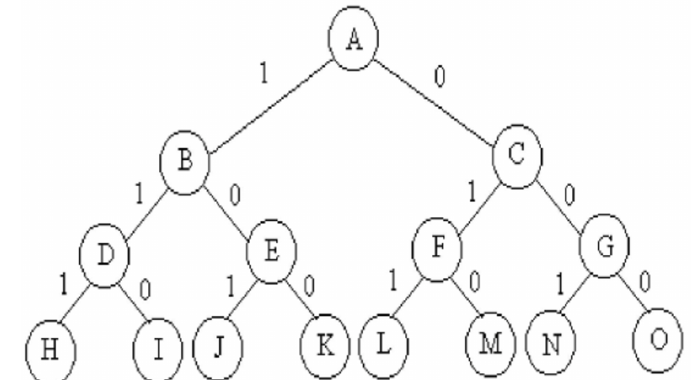
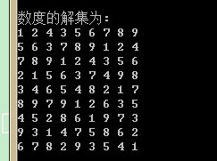

#  回溯算法

## 概念

　　回溯算法实际上一个类似枚举的搜索尝试过程，主要是在搜索尝试过程中寻找问题的解，当发现已不满足求解条件时，就 “ 回溯 ” 返回，尝试别的路径。

　　回溯法是一种选优搜索法，又称为试探发，按选优条件向前搜索，以达到目标。但当探索到某一步时，发现原来选择并不优或达不到目标，就退回一步重新选择，这种走不通就退回再走的技术为回溯法，而满足回溯条件的某个状态的点称为 “ 回溯点 ”。

　　许多复杂的、规模较大的问题都可以使用会所法，有 “通用解题方法 ” 的美称。

　　回溯法可以理解为通过选择不同的岔路口寻找目的地，一个岔路口一个岔路口的去尝试找到目的地。如果走错了路，继续返回来找到岔路口的另一条路，直到找到目的地。

## 基本思想

　　在包含问题的所有解的解空间中，按照深度优先搜索的策略，从根节点出发深度探索解空间树。当探索到某一结点时，要先判断该结点是否包含问题的解，如果包含，就从该结点出发继续探索下去，如果该结点不包含问题的解，则逐层向其祖先结点回溯（其实回溯法就是对隐式图的深度优先搜索算法）。

　　若用回溯法求问题的所有解时，要回溯到根，且根结点的所有可行的子树都已被搜索遍才结束。

　　若使用回溯法求任一解时，主要搜索到问题的一个接就可以结束。

## 用回溯法解题的一般步骤

1. 针对所给问题，确定问题的解空间：

   首先应明确定义问题的解空间，问题的解空间应至少包含问题的一个（最优）解。

2. 缺点节点的扩展搜索法则。

3. 以深度优先方式搜索解空间，并在搜索过程中用剪枝函数避免无效搜索。

## 算法框架

1. 问题框架

　　设问题的解是一个 n 维向量（a1，a2，......，an），约束条件是 ai(i=1,2,3,.....,n) 之间满足某种条件，记为 f(ai)。

2. 非递归回溯框架

```java
int a[n],i;
// 初始化数组 a[]；
i = 1;
while(i>0(有路可走) and (未达到目标)) // 还未回溯到头
{
    if (i > n){// 搜索到叶结点
         // 搜索到一个解，输出
    } 
    else {  // 处理第 i 个元素
    	a[i] 第一个可能的解；
        while(a[i] 在不满足约束条件且在搜索空间内){
            a[i] 下一个可能的值； 
        }
        if（a[i] 在搜索空间内）{
            标识占用的资源；
            i = i+1; // 扩展下一个节点
        } else {
            清理所占的状态空间； // 回溯
            i = i-1;
        }
    }
}
```

3. 递归的算法框架

　　回溯法是对解空间的深度优先搜索，在一般情况下使用递归函数来实现回溯法比较简单，其中 i 为搜索的深度，框架如下：

```java
int a[n];
try(int i){
	if (i>n)
        输出结果;
    else {
        for (j = 下界; j <= 上界; j=j+1) // 枚举 i 所有可能的路径
        {
            if（fun(j)）{ // 满足限界函数和约束条件
				a[i] = j;
                ...       // 其他操作
                try(i+1); 
                回溯前的清理工作（如 a[i] 置控制等）;
            }
        }
    }
}
```


## 实例一：八皇后问题

　　八皇后问题是一个古老而著名的问题，是回溯算法的典型例题。该问题是十九世纪著名的数学家高斯 1850 年提出：在 8X8 格的国际象棋上拜访八个皇后（棋子），使其不能户响攻击，即任意两个皇后都不能处于同一行、同一列或同一斜线上。

### 八皇后问题解题思路

　　问题简化：先将八皇后问题转化为四皇后问题，并用回溯法来找到它的解。

　　目的：在 4X4 期盼上，使得 4 个皇后不能在同行同列以及同斜线上。

　　step1：尝试先放置第一枚皇后，被涂黑的地方是不能放皇后


　　step2：第二行的皇后只能放在第三格或第四格，比如放第三哥，则：


　　可以看到再难以放下第三个皇后，此时就要用到回溯算法了。吧第二个皇后更改位置，此时就能放下第三个皇后了。


　　step4：虽然是能放置第三个皇后，但是第四格皇后又五路可走了。返回上层调用（3 号皇后），而 3 号也别无可去，继续回溯上层调用（2 号），2 号已然无路可去，继续回溯上层（1 号），于是 1 号皇后改变位置如下，继续回溯。



　　这就是回溯算法的精髓，虽然没有最终把问题解决，其实根据这个算法最终是能够把四位皇后放在 4X4 的棋盘里。也能用同样的方法解决了八皇后问题。

### 代码实现八皇后问题

　　将算法也设置称成两步。

1. 第一步，要判断每次输入的皇后是否在同一行同一列，或者同一斜线上。
2. 第二步，进入核心算法。

```java
/**
 * 八皇后问题
 */
public class EightQueens {

    private int t = 0;
    private int n = 4;
    private int[] queen = new int[n];

    /**
     * 判断设置的皇后是否在同一行，同一列，或者同一斜线上
     *
     * @param row
     * @return
     */
    public boolean isOk(int row) {
        for (int j = 0; j < row; j++) {
            if (queen[row] == queen[j]
                    || row - queen[row] == j - queen[row]
                    || row + queen[row] == j + queen[j]) {
                return false;
            }
        }
        return true;
    }

    /**
     * 算法函数
     *
     * @param row
     */
    private void backTracking(int row) {
        if (row == n) {
            t++; // 判断若遍历完成，就进行计数
            System.out.println("t:" + t + ",queen:" + Arrays.toString(queen));
            return;
        }
        for (int col = 0; col < n; col++) { //遍历棋盘每一列
            queen[row] = col; // 将皇后的位置记录在数组
            if (isOk(row)) { // 判断皇后的位置是否有冲突
                backTracking(row + 1); // 递归，计算下一个皇后的位置
            }
        }
    }

    public static void main(String[] args) {
        EightQueens queens = new EightQueens();
        queens.backTracking(0);
    }
}

```

　　输出结果：

```java
t:1,queen:[0, 1, 2, 3]
t:2,queen:[0, 2, 3, 1]
t:3,queen:[0, 3, 1, 2]
t:4,queen:[1, 2, 0, 3]
t:5,queen:[1, 3, 0, 2]
t:6,queen:[2, 0, 1, 3]
t:7,queen:[2, 0, 3, 1]
```

## 实例二：01 背包问题

　　有 N 件物品和一个容量为 V 的背包。第 i 件武平的价格（即体积，下同）为 w[i]，价值为 c[i]。求解将哪些武平装入背包可使这些物品的费用总和不超过背包容量，且价值总和最大。

　　这是最基本的背包问题，总的来说就是：选还是不选，这是个问题。

　　相当于用 f[i] [j] 表示前 i 个物品装入容量为 v 的背包中所可以获得的最大价值。

　　对于一个物品，只有两种情况：

　　情况一：第 i 件不放进去，这时所得价值为：f [i-1] [v]。

　　情况二：第 i 件放进去，这时所得价值为：f[i-1] [v-c[i]] + w[i]

### 问题的解空间

　　用回溯法解问题时，应明确定义问题的解空间。问题的解空间至少包含问题的一个（最优）解。对于 n=3 时的 0/1 背包问题，可用完全二叉树表示解空间，如图所示：



　　1 表示选取，0 表示不选。

### 求解步骤

1. 针对所给问题，定义问题的解空间；
2. 确定易于搜索的解空间结构；
3. 以深度优先方式搜索解空间，并在搜索过程中用剪枝函数避免无效搜索。

　　常用的剪枝函数：用约束函数在扩展结点处减去不满足约束的子树；用限界函数剪去得不到最优解的子树。

　　回溯法对解空间做深度优先搜索时，有递归回溯和迭代回溯（非递归）两种方法，但一般情况下用递归方法实现回溯法。

### 算法描述

　　解 0/1 背包问题的回溯法在搜索解空间树时，只要其左儿子结点是一个可行结点，搜索就进入其左子树。当右子树中有可能包含最优解时才进入右子树搜索，否则将右子树剪去。

　　算法部分：

```

```

　　主函数部分：

```

```

## 回溯算法玩数独

　　数独问题其实就是一个八皇后问题。在 9 宫格数独的约束为每一行每一列不能出现相同的数。

```

```

　　其中 2 行 3 列、6 行 4 列、9 行 9 列、5 行 5 列数字为已知。最后结果：



## 总结

　　回溯法属于深度优先搜索，由于时全局搜索，复杂度相对高。

## 参考文章

1. [五大常用算法之四：回溯法](https://www.cnblogs.com/steven_oyj/archive/2010/05/22/1741376.html)
2. [小白带你学--回溯算法](https://www.jianshu.com/p/dd3c3f3e84c0)

