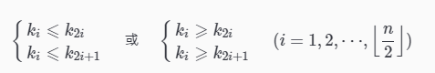

#  堆排序

　　堆的定义如下： n 个元素的序列 {k1,k2,...,kn}，当且仅当满足以下关系时，称之为堆：



　　把此序列对应的二维数组看成一个完全二叉树。那么堆的含义就是：完全二叉树中任何一个非叶子节点的值均不大于（或不小于）其左、右孩子节点的值。由上述性质可知大顶堆的堆顶的关键字肯定是所有关键字中最大的，小顶堆的堆顶的关键字肯定是所有关键字中最小的。因此可使用大顶堆进行升序排序，使用小顶堆进行降序排序。

## 1. 基本思想

　　此处以大顶推为例，堆排序的过程就是将待排序的序列构建成一个堆，选出堆中最大的移走，再把剩余的元素调整成堆，找出最大的再移走，重复直至有序。

　　堆排序的主要思想是：给定一个待排序序列，首先经过一次调整，将序列构建成一个大顶堆，此时第一个元素最大的元素，将其和序列的最后一个元素交换，然后对前 n-1 个元素调整为大顶堆，再将其第一个元素和末尾元素交换，这样最后即可得到有序序列。

## 2. 算法描述

1. 先将初始序列 K[1...n] 建成一个大顶堆，那么此时第一个元素 K1 最大，此堆为初始的无序区。
2. 再将关键字最大的记录 K1（即堆顶，第一个元素）和无序区的最后一个记录 kn 交换，由此得到新的无序区 K[1...n-1] 和有序区 K[n]，且满足 K[1...n-1]。keys <= k[n].key。
3. 交换 k1 和 kn 后，堆顶可能违反堆性质，因此需将 K[1...n-1] 调整为堆。然后重复步骤 2，直到无序区只有一个元素时停止。

　　动画效果如下所示：


## 3. 代码实现

　　从算法描述来看，堆排序需要两个过程，一是建立堆，而是堆顶与堆的最后一个元素交换位置。所以堆排序有两个函数组成。一是建堆函数，二是反复调用建堆函数以选择出剩余未排元素中最大的数来实现排序的函数。

　　总结起来就是定义了以下几种操作：

* 最大堆调整（Max_Heapify）：将堆的末端子节点作调整，使得子节点永远小于父节点。
* 创建最大堆（Build_Max_Heap）：将堆所有数据重新排序。
* 堆排序（HeapSort）：移除位在第一个数据的根节点，并做最大堆调整的递归运算。

　　对于堆节点的访问：

* 父节点 i 的左子节点在位置：（2*i+1）
* 父节点 i 的右子节点在位置：（2*i+2）
* 子节点 i 的父节点在位置：floor((i-1)/2)

```java
/**
 * 堆排序
 */
public class HeapSort {

    public static void sort(int[] a) {
        for (int i = a.length - 1; i > 0; i--) {
            max_heapify(a, i);
            // 栈顶元素（第一个元素）与 Kn 交换
            int temp = a[0];
            a[0] = a[i];
            a[i] = temp;
        }
    }

    /**
     * 将数组堆化
     * i = 第一个非叶子节点
     * 从第一个非叶子节点开始即可，无需从最后一个叶子结点开始。
     * 叶子结点可以看作易符合堆要求的结点，根节点就是它自己且自己以下值为最大。
     *
     * @param a
     * @param n
     */
    public static void max_heapify(int[] a, int n) {
        int child;
        for (int i = (n - 1) / 2; i >= 0; i--) {
            // 左子节点位置
            child = 2 * i + 1;
            // 右子节点存在且大于左子结点，child 变成右子节点
            if (child != n && a[child] < a[child + 1]) {
                child++;
            }
            // 交换父节点与左右子节点中的最大值
            if (a[i] < a[child]) {
                int temp = a[i];
                a[i] = a[child];
                a[child] = temp;
            }
        }
    }
}
```

　　测试：

```java
    public static void main(String[] args) {
        int a[] = new int[]{9, 1, 2, 7, 4, 8, 6, 3, 5};
        sort(a);
        System.out.println("a:" + Arrays.toString(a));
    }
```

　　输出：

```java
a:[1, 2, 3, 4, 5, 6, 7, 8, 9]
```

## 4. 复杂度分析

1. 建立堆的过程，从 length/2 一直处理到 0，时间复杂度为 O(n)；
2. 调整堆的过程是沿着堆的父子节点进行调整，执行次数为堆的深度，时间复杂度为 O(logn)；
3. 堆排序的过程由 n 次第 2 步完成，时间复杂度为 O(nlogn)。

| 平均时间复杂度 | 最好情况   | 最坏情况   | 空间复杂度 |
| -------------- | ---------- | ---------- | ---------- |
| O(nlog2 n)     | O(nlog2 n) | O(nlog2 n) | O(1)       |

## 5. 总结与思考

　　由于堆排序中初始化堆的过程比较次数比较多，因此它不太适用于小序列，也不适宜于记录数较少的文件。同时由于多次任意下标相互交换位置，相同元素之间原本想对的顺序被破坏了，因此，它是不稳定的排序。

　　与快排和归并排序相比，堆排序在最差情况下的时间复杂度优于快排，空间效率高于归并排序。

## 6. 参考文章

1. [Java实现八大排序算法](https://www.cnblogs.com/morethink/p/8419151.html)
3. [常见数据结构与算法整理总结（下）](https://www.jianshu.com/p/42f81846c0fb)

