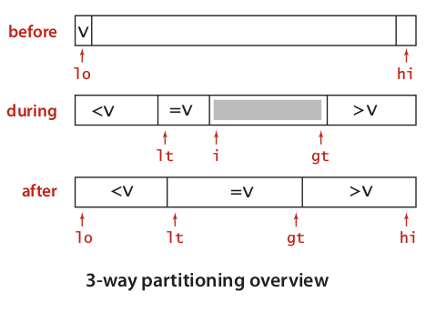

#  快速排序

　　快速排序是由东尼·霍尔所发展的一种排序算法。在平均状况下，排序 n 个项目要 O(nlogn) 次比较。在最坏状况下则需要 O(n^2) 次比较，但这种状况并不常见。事实上，快速排序通常明显比其他 O(nlogn) 算法更快，因为它的内部循环（inner loop）可以在大部分的架构上很有效率地被实现出来。

## 1. 基本思想

　　快速排序的基本思想：挖坑填数 + 分治法。

　　快速排序又是一种分治法思想在排序算法上的典型应用。本质上来看，快速排序应该算是在冒泡排序基础上的递归分治法，是对冒泡排序的一种改进。

　　快速排序的名字起的是简单粗暴，因为一听到这个名字就知道它存在的意义，就是快，而且效率高！

　　它是处理大数据最快的排序算法之一了。虽然在最快的情况下的时间复杂度达到了 O(n^2)，但是就是优秀，在大多数情况下都比平均时间复杂度为 O（nlogn）的排序算法表现要更好。

　　快速排序的主要思想是：在待排序的序列中选择一个称为主元的元素，将数组分为两部分，使得第一部分中的所有元素都小于或等于主元，而第二部分中的所有元素都大于主元，然后对两部分递归地应用快速排序算法，整个排序过程可以递归进行，以此达到整个数据变成有序序列。

## 2. 算法描述

　　快速排序使用分治策略来吧一个序列（list）分为两个子序列（sub-list）。步骤为：

1. 从数列中挑出一个元素，称为 “ 基准 ”（pivot）。
2. 重新排序数列，所有比基准值小的元素排放在基准前面，所有比基准值大的元素摆在基准后面（相同的数可以到任一边）。在这个分区结束之后，该基准就处于数列的中间位置。这个称为分区（partition）操作。
3. 递归地（recursively）把小于基准值元素地子数列和大于基准值元素的子数列排序。

　　递归到最底部时，数列的大小是零或一，也就是已经排序好了。这个算法一定会结束，因为在每次的迭代（iterator）中，它至少会把一个元素摆到它最后的位置去。


## 3. 代码实现

　　用伪代码描述如下：

1. i = L;j = R; 将基准数挖出形成第一个坑 a[i]。
2. j--，由后向前找比它小的数，找到后挖出此数填前一个坑 a[i]中。
3. i++，由前向后找比它大的数，找到后也挖出此数填到前一个坑 a[j] 中。
4. 再重复执行 2、3 二步，直到 i==j，将基准数填入 a[i] 中。

```java
    public static void sort(int[] a, int low, int high) {
        // 已经排完
        if (low >= high) {
            return;
        }
        int left = low;
        int right = high;
        // 保存基准位置
        int pivot = left;
        while (left < right) {
            // 从后往前找到比基准小的元素
            while (left < right && a[right] >= a[pivot]) {
                right--;
            }
            // 从前往后找到比基准大的元素
            while (left < right && a[left] <= a[pivot]) {
                left++;
            }
            if (left < right) {
                int temp = a[left];
                a[left] = a[right];
                a[right] = temp;
            }
        }
        // 放值基准值
        int temp = a[left];
        a[left] = a[pivot];
        a[pivot] = temp;
        // 分支递归快排
        sort(a, low, left - 1);
        sort(a, left + 1, high);
    }
```

　　上面是递归版的快速排序：通过把基准插入到合适的位置来实现分治，并递归地对分治后的两个划分继续快排。那么非递归版的快排如何实现呢？

　　因为递归的本质是栈，所以非递归实现的过程中，可以借助栈来保存中间变量就可以实现非递归了。在这里中间变量也就是通过 Pritation 函数划分取键之后分成左右两部分的首尾指针，只需要保存这两部分的首尾指针即可。

```

```

## 4. 算法改进

### 4.1. 切换到插入排序

　　和大多数递归排序算法一样，改进快速排序性能的一个简单方法基于以下两点：

* 对于小数组，快速排序比插入排序慢
* 因为递归，快速排序的 sort() 方法在小数组中也会调用自己。

　　因此，在排序小数组时应该切换到插入排序。

### 4.2. 三者取中法

　　快速排序是通常被认为在同数量级（O(nlog2n)）的排序方法中平均性能最好的。但若初始序列按关键码有序或基本有序时，快排序反而锐化为冒泡排序。为改进之，通常以 “ 三者取中法 ” 来选取基准记录，即将排序区间的两个端点与中点三个记录关键码居中的调整为支点记录。

### 4.3. 三向快速排序

　　实际应用中经常会出现含有大量重复元素的数组。例如，一个元素全部重复的子数组就不需要继续排序了，但算法还会继续将它切分为更小的数组。在有大量重复元素的情况下，快速排序的递归行会使元素全部重复的子数组经常出现，这就有很大的改进潜力，经当前实现的性能对数级的性能提高到线性级别。

#### 4.3.1. 算法描述

* 在 lt 之前的 （lo ~ lt-1）都小于中间值
* 在 gt 之前的 （gt+1 ~ h）都大于中间值
* 在 lt ~ i-1 的都等于中间值
* 在 i ~ gt 的都还不确定（最终 i 会大于 gt，即不确定的将不复存在）



#### 4.3.2. 代码实现

```java


```

## 5. 复杂度分析

　　在快速排序算法中，比较关键的一个部分是主元的选择。在最差情况下，划分由 n 个元素构成的数组需要进行 n 次比较和 n 次移动，因此划分需要的时间是 O(n)。在最差情况下，每次主元会将数组划分为一个大的子数组和一个空数组，这个大的子数组的规模是在上次划分的子数组的规模上减 1，这样在最差情况下算法需要 (n-1)+(n-2)+...+1=O(n^2) 时间。

　　最佳情况下，每次主元将数组划分为规模大致相同的两部分，时间复杂度为 O(nlogn)。

　　以下是快速排序算法复杂度：

| 平均时间复杂度 | 最好情况    | 最坏情况 | 空间复杂度           |
| -------------- | ----------- | -------- | -------------------- |
| O(nlog2 n)     | O(n log2 n) | O(n^2)   | O(1)(原地分区递归版) |

## 6. 参考文章

1. [Java实现八大排序算法](https://www.cnblogs.com/morethink/p/8419151.html)
2. [从零开始学数据结构和算法 (五) 分治法 (二分查找、快速排序、归并排序)](https://juejin.im/post/5c945c245188252d863cc969)
3. [常见数据结构与算法整理总结（下）](https://www.jianshu.com/p/42f81846c0fb)

