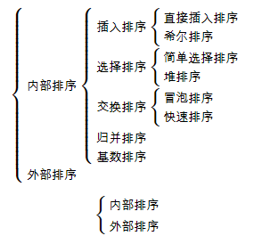

#  排序算法总结

　　常见排序算法如下：

1. 直接插入排序
2. 希尔排序
3. 简单选择排序
4. 堆排序
5. 冒泡排序
6. 快速排序
7. 归并排序
8. 技术排序

　　它们都属于内部排序，也就是只考虑数据量较小仅需要使用内部的排序算法，它们之间关系如下：

　　稳定与非稳定：如果一个排序算法能够保留数组中重复元素的相对位置则可以被称为是稳定的。反之，则是非稳定的。

## 直接插入排序

## 参考文章

1. [Java实现八大排序算法](https://www.cnblogs.com/morethink/p/8419151.html)

1. [从零开始学数据结构和算法(一)冒泡与选择排序](https://juejin.im/post/5c9442cb5188252da9013153)
4. [从零开始学数据结构和算法 (五) 分治法 (二分查找、快速排序、归并排序)](https://juejin.im/post/5c945c245188252d863cc969)
7. [常见数据结构与算法整理总结（下）](https://www.jianshu.com/p/42f81846c0fb)

