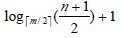

#  B 树和 B+ 树

## 1. B 树和 B+ 树的基本思想

　　平衡查找树中的 2-3 树以及其实现红黑树。2-3 树中，一个节点最多有 2 个 key，而红黑树则使用染色的方式来标识这两个 key。

　　维基百科对 B 树的定义为 ：在计算机科学中，B 树（B-tree）是一种树状数据结构，它能够存储数据、对其进行排序并允许以 O（log n）的时间复杂度运行进行查找、顺序读取、插入和删除的数据结构。B 树，概括来说是一个节点可以拥有多于 2 个子节点的二叉查找树。与自平衡二叉查找树不同，B 树为系统最优化大块数据的读和写操作。B-tree 算法减少定位记录时所经历的中间过程，从而加快存取速度。普遍应用于数据库和文件系统 。

　　B 树定义：

　　B 树可以看作是对 2-3 查找树的一种扩展，即它允许每个节点有 M-1 个子节点。

　　根节点至少有两个子节点。

　　每个节点有 M-1 个 key，并且以升序排列。

　　位于 M-1 和 M key 的子节点的值位于 M-1 和 M key 对应的 value 之间。

　　其他节点至少有 M/2 个子节点。

　　下图是一个 M=4 阶的 B 树：

　　可以看到 B 树是 2-3 树的一种扩展，它允许一个节点有多于 2 个的元素。B 树的插入及平衡化操作和 2-3 树很相似。

　　B+ 树定义：

　　B+ 树是对 B 树的一种变形树，它与 B 树的差异在于：

* 有 k 个子节点的节点必然有 k 个关键码；
* 非叶节点仅具有索引作用，跟记录有关的信息均存放在叶节点中。
* 树的所有叶结点构成一个有序链表，可以按照关键码排序的次序遍历全部记录。

　　如下图，是一个 B+ 树：

　　B 和 B+ 树的区别在于，B+ 树的非叶子节点只包含导航信息，不包含实际的值，所有的叶子节点和相连的节点使用链表相连，便于区间查找和遍历。

　　B+ 树的优点在于：

　　由于 B+ 树在内部节点上不包含数据信息，因此在内存页中能够存放更多的 key。数据存放的更加紧密，具有更好的空间局部性。因此访问叶子节点上关联的数据也具有更好的缓存命中率。

　　B+ 树的叶子节点都是相连的，因此对整棵树的遍历只需要一次性遍历叶子节点即可。而且由于数据顺序排列并且相连，所以便于区间查找和搜索。而 B 树则需要进行每一层的递归遍历。相邻的元素可能在内存中不相邻，所以缓存命中性没有 B+ 树好。

　　但是 B 树也有优点，其优点在于，由于 B 树的每一个节点都包含 key 和 value，因此经常访问的元素可能离根节点更近，因此访问也更迅速。

　　下面是 B 树和 B+ 树的区别图：

　　B/B+ 树常用于文件系统和数据库系统中，它通过对每个结点存储个数的扩展，使得对连续的数据能够进行较快的定位和访问，能够有效减少查找时间，提高存储的空间局部性从而减少 IO 操作，它广泛用于文件系统及数据库中，如：

　　Windows：HPFS 文件系统；

　　Mac：HFS，HFS+ 文件系统；

　　Linux：ResiserFS、XFS、Ext3FS、JFS 文件系统；

　　数据库：ORACLE、MYSQL、SQLSERVER 等中。

## 2. B 树和 B+ 树的复杂度

　　在 n 个关键字的 m 阶 B 树和 B+ 查找，从根节点到关键字所在的节点所涉及的节点数不超过：

　　可以认为时间复杂度就是这个，因为 B 树和 B+ 树一般都是在文件系统中用，io 的速度比在内存中计算的速度慢很多。

　　总时间 = 查询节点次数 * io 单次时间 + 查询节点次数 * log2 阶数 * 内存中比较时间。

　　可以认为总时间约等于查询节点次数 * io 单次时间。

　　可以认为 B 树和 B+ 树，时间复杂度为 O（log m/2 n/2）。

## 3. 树表查找总结

　　二叉查找树平均查找性能不错，为 O(logn)，但是最坏情况会退化为 O(n)。在二叉查找树的基础上进行优化，可以使用平衡查找树。平衡查找树中的 2-3 查找树，这种数据结构在插入之后能够进行自平衡操作，从而保证了树的高度在一定的范围内进而能够保证最坏情况下的时间复杂度。但是 2-3 查找树实现起来比较困难，红黑树是 2-3 树的一种简单高效的实现，他巧妙的使用颜色标记来替代 2-3 树种比较难处理的 3-node 节点问题。红黑树是一种比较高效的平衡查找树，应用非常广泛，很多编程语言的内部实现都或多或少的采用了红黑树。

　　除此之外，2-3查找树的另一个扩展 -- B/B+ 平衡树，在文件系统和数据库系统中有着广泛的应用。

## 4. 参考文章

1. [查找算法总结-java版](https://blog.csdn.net/xushiyu1996818/article/details/90604118)

