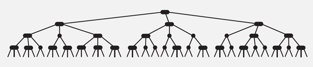
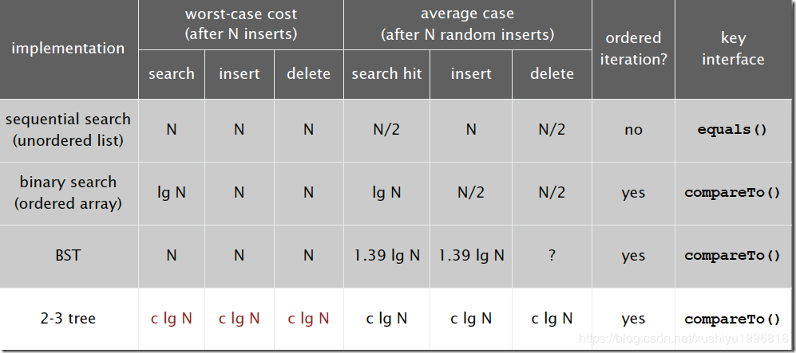

#  平衡查找树之 2-3 查找树

## 2-3 树的基本思想

　　2-3 查找树的定义：和二叉树不一样，2-3树运行每个节点保存 1 个或者两个的值。对于普通的 2 节点（2-nodes），他保存 1 个 key 和左右两个自己点。对应 3 节点（3-nodes），保存两个 key，2-3 查找树的定义如下：

1. 要么为空，要么：
2. 对于 2 节点，该节点保存一个 key 及对应 value，以及两个指向左右节点的节点，左节点也是一个 2-3 节点，所有的值比 key 要大。
3. 对于 3 节点，该结点保存两个 key 及对应 value，以及 三个指向左中右的节点。左节点也是一个 2-3 节点，所有的值均比两个 key 中的最小 key 还要小；中间节点也是一个 2-3 节点，中间节点的 key 值在两个根节点 key 值之间；右节点的所有 key 比两个 key 中的最大的 key 还要大。

## 2-3 查找树的性质

1. 如果中序遍历 2-3 查找树，就可以得到排好序的序列。
2. 在一个完全平衡的 2-3 查找树中，根节点到每一个为空节点的距离都相同。（这也是平衡树中 “ 平衡 ” 一词的概念，根节点到叶节点的最长距离对应于查找算法的最坏情况，而平衡树中根节点到叶结点的距离都一样，最坏情况也具有对数复杂度）。

## 2-3 树的复杂度

　　2-3 树的查找效率与树的高度是息息相关的。

　　在最坏的情况下，也就是所有的节点都是 2-node 节点，查找效率为 lgN。

　　在最好的情况下，所有的节点都是 3-node 节点，查找效率为 log3N 约等于 0.63lgN。

　　距离来说，对于一百万个节点的 2-3 树，树的高度为 12-20 之间，对于 10 亿个节点的 2-3 树，树的高度为 18-30 之间。

　　对于插入来说，只需要常数次操作即可完成，因为他只需要修改与该节点关联的节点即可，不需要检查其他节点，所以效率和查找类似。

## 参考文章

1. [查找算法总结-java版](https://blog.csdn.net/xushiyu1996818/article/details/90604118)

