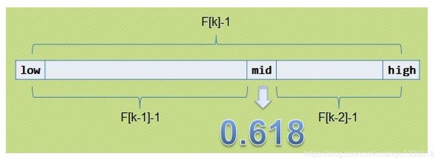

#  斐波那契查找

## 1. 斐波那契查找的基本思想

　　在介绍斐波那契查找算法之前，需要先了解一个概念 -- 黄金分割。

　　黄金分割又称黄金比例，是指事物各部分间一定的数学比例关系，即将整体一分为二，较大部分与较小部分之比，其比值约为 1:0.618 或 1.618：1。

　　0.618 被公认最具有审美意义的比例数字，这个数值的作用不仅仅体现在诸如绘画、雕塑、影月、建筑等艺术领域，而且在管理、工程设计等方面也有着不可忽视的作用，因此被称为黄金分割。

　　斐波那契数列：1，1，2，3，5，8，13，21，34，55，89......（从第三个数开始，后边每一个数都是前两个数的和）。然后会发现，随着斐波那契数列的递增，前后两个数的比值会越来越接近 0.618，利用这个特性，就可以将黄金比例运用到查找技术中。



　　**基本思想**：也是二分查找的一种提升算法，通过运用黄金比例的概念在数列中选择查找点进行查找，提高查找效率。同样地，斐波那契查找也属于一种有序查找算法。

　　斐波那契查找与折半查找很相似，他是根据斐波那契序列的特点对有序表进行分割的。他要求开始表中记录的个数为某个斐波那契数小 1，及 n=F(k)-1。

　　开始将 k 值与第 F(k-1) 位置的记录进行比较（及 mid = low+F(k-1)-1），比较结果也分为三种：

1. 相等，mid 位置的元素即为所求。

2. 大于，low = mid+1，k -= 2；

   说明：low = mid+1 说明带查找的元素在 [mid+1,high] 范围内，k-=2 说明范围 [mid+1,high] 内元素个数为 n-(F(K-1)) = Fk -1 -F(k-1) = Fk - F(k-1)-1 = F(k-2)-1 个，所以可以递归的应用斐波那契查找。

3. 小于，high = mid-1，k-= 1；

   说明：low = mid+1 说明带查找的元素在 [low,mid-1] 范围内，k -= 1 说明范围 [low,mid-1] 内的元素个数为 F(k-1)-1 个，所以可以递归的应用斐波那契查找。

　　为什么 n = F(k)-1，表中记录的个数为某个斐波那契数小 1？是为了格式上的统一，以方便递归或者循环程序的编写。表中的数据是 F(k) -1 个，使用 mid 值进行分割又用掉了一个，那么剩下 F(k)-2 个。正好分给两个子序列，每个子序列的个数分别是 F(k-1) -1 与 F(k-2)-1 个，格式上与之前是统一的。不然的话，每个子序列的元素个数有可能是 F(k-1)、F(k-1)-1、F(k-2)、F(k-2)-1 个，写程序会非常麻烦。

　　注意：斐波那契数列 F(k) = F(k-1)+F(k-2)

　　F(k) -1- 1 = F(k-1)-1 + F(k-2)-1

## 2. 斐波那契查找的复杂度

　　复杂度分析：最坏情况下，时间复杂度为 O(log2 n)，且其期望复杂度也为 O(log2 n)。

## 3. 斐波那契查找的代码

```java
/**
 * 斐波那契查找
 */
public class FibonacciSearch {

    public static int fibonacciSearch(int[] nums, int key) {
        int orginalLength = nums.length;
        // 建立斐波那契数列，用 list 不断加入，直到 > orginalLenght
        List<Integer> fiboList = new ArrayList<>();
        fiboList.add(0);
        fiboList.add(1);
        int i = 2;
        while (true) {
            Integer now = fiboList.get(i - 2) + fiboList.get(i - 1);
            fiboList.add(now);
            i++;
            if (now > orginalLength) {
                break;
            }
        }
        // 斐波那契数列的最后一位 F(k),newLength=F(k)-1>= originalLenght
        int k = fiboList.size() - 1;
        int newLength = fiboList.get(k) - 1;
        // 将原来排序后的数据假如长度为 newLength 的数组中，多出来空位的用最后一位填满
        int[] newNums = new int[newLength];
        for (i = 0; i < newLength; i++) {
            if (i < orginalLength) {
                newNums[i] = nums[i];
            } else {
                newNums[i] = nums[orginalLength - 1];
            }
        }
        // begin = 0,end=newLength-1，k=上面对应的 k
        int begin = 0;
        int end = newLength - 1;
        // 循环，直到 end<begin，返回-1
        while (begin <= end) {
            // 中间值跨度为 fiboList.get(k - 1) - 1
            int mid = begin + fiboList.get(k - 1) - 1;
            int now = nums[mid];
            if (now == key) {
                // 如果相同，返回 index，如果 index >= orginalLength,返回 orginalLength-1
                if (mid >= orginalLength) {
                    return orginalLength - 1;
                }
                return mid;
            }
            if (now < key) {
                // 如果 mid < key，那么 begin = mid+1,k = k-2
                begin = mid + 1;
                k = k - 2;
            }
            if (now > key) {
                // 如果 mid>key，那么 end = mid -1,k = k-1
                end = mid - 1;
                k = k - 1;
            }
        }
        return -1;
    }

    public static void main(String[] args) {
        int a[] = new int[]{0, 1, 2, 3, 4, 5, 6, 7, 8, 9};
        System.out.println("search 7:" + fibonacciSearch(a, 7));
        System.out.println("search 5:" + fibonacciSearch(a, 5));
    }
}
```

　　输出：

```java
search 7:7
search 5:5
```

## 4. 参考文章

1. [查找算法总结-java版](https://blog.csdn.net/xushiyu1996818/article/details/90604118)

