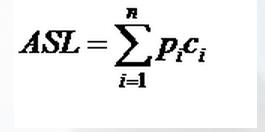

#  查找算法总结

## 查找的定义

　　查找定义：根据给定的某个值，在查找表中切丁一个其关键字等于给定值的数据元素（或记录）。

## 查找算法的分类

### 静态查找和动态查找

　　注：静态或动态都是针对查找表而言的。

　　静态的就是先给一堆值，然后在一堆值中查找元素。

　　动态指查找的过程中，有删除和插入操作。

### 无序查找和有序查找

　　无序查找：被查找数列有序无序均可。

　　有序查找：被查找数列必须为有序数列。

## 平均查找长度（Average Search Lenght，ASL）

　　其中 n 为查找表中元素个数，Pi 为查找第 i 个元素的概率，通常假设每个元素查找概率相同，Pi=1/n，Ci 是找到第 i 个元素的比较次数。

　　当然，有查找成功，就有查找不成功，即要查找元素不在查找表中。

　　一个算法的 ASL 越大，说明时间性能差，反之，时间性能好，这也是显而易见的。

## 树表查找总结

　　二叉查找树平均查找性能不错，为 O(logn)，但是最坏情况会退化为 O(n)。在二叉查找树的基础上进行优化，可以使用平衡查找树。平衡查找树中的 2-3 查找树，这种数据结构在插入之后能够进行自平衡操作，从而保证了树的高度在一定的范围内进而能够保证最坏情况下的时间复杂度。但是 2-3 查找树实现起来比较困难，红黑树是 2-3 树的一种简单高效的实现，他巧妙的使用颜色标记来替代 2-3 树种比较难处理的 3-node 节点问题。红黑树是一种比较高效的平衡查找树，应用非常广泛，很多编程语言的内部实现都或多或少的采用了红黑树。

　　除此之外，2-3查找树的另一个扩展 -- B/B+ 平衡树，在文件系统和数据库系统种有着广泛的应用。

## 查找总结

　　查找分这样积累

1. 统统找一遍：顺序查找
2. 二分法：二分查找、插值查找、斐波那契查找
3. 树表：二叉搜索树、2-3 树、红黑树、B 树、B+树
4. 二分+顺序：区块查找
5. 空间换时间（类似区块）：哈希查找

　　它们的复杂度为：

|                             | 平均时间复杂度  | 最差查找时间    | 查找前提          | 度           | 时间       |
| --------------------------- | --------------- | --------------- | ----------------- | ------------ | ---------- |
| 顺序查找                    | O(n)            | O(n)            | 无                | 无           | O(1)       |
| 二分查找                    | O(log2n)        | O(log2n)        | 排序              | O(nlog2n)    | O(n)       |
| 插值查找                    | O(log2(log2n))  | O(log2(log2n))  | 排序              | O(nlog2 n)   | O(n)       |
| 斐波那契查找                | O(log2n)        | O(log2n)        | 排序+斐波那契数列 | O(nlog2n)    | O(n)       |
| 二叉树查找                  | O(log2n)        | O(n)            | 创建二叉树        | O（nlog2 n） | O(log2 n)  |
| 2-3树(k在2-3之间)           | O(logk n)       | O(logk n)       | 创建 2-3 树       | O(nlogk n)   | O(log2 n)  |
| 红黑树                      | O(log2 n)       | O(2log2 n)      | 创建红黑树        | O(nlog2 n)   | O(log2 n)  |
| B树和B+树(m为阶数)          | O(log m/2 n/2)  | O(log m/2 n/2)  | 创建B树和B+树     | O(nlog m n)  | O(log m n) |
| 区块查找(b为块数)           | O(log2 b + n/b) | O(log2 b + n/b) | 创建区块          | O(nlog2 b)   | O(log2 b)  |
| 哈希查找(k为一格的链表长度) | O(1)            | O(k)            | 创建哈希表        | O(n)         | O(1)       |

## 参考文章

1. [查找算法总结-java版](https://blog.csdn.net/xushiyu1996818/article/details/90604118)

