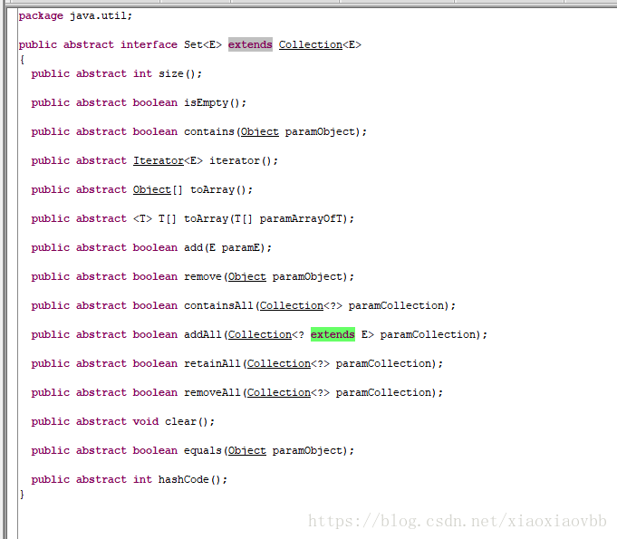

# List 与 Set

## Set 是什么？

　　Java 中的 Set 集合是继承 Cokkection 的接口，是一个不包含重复元素的集合。

　　下图是 Set 集合的源码：



　　Set 和 List 都是以接口的形式来进行声明。Set 主要包含三种存访数据类型的变量，分别是 HashSet、LinkedHashSet、TreeSet。

### HashSet、LinkedHashSet、TreeSet 的主要使用情景

#### HashSet

　　HashSet 从名称就可以看出肯定是和 Hash 这样的数据接口有关，打开 HashSet 源码可以看到一个很熟悉的对象：

```java
public class HashSet<E>
    extends AbstractSet<E>
    implements Set<E>, Cloneable, java.io.Serializable
{
    static final long serialVersionUID = -5024744406713321676L;
	// 是用 HashMap 存储数据的
    private transient HashMap<E,Object> map;

    // Dummy value to associate with an Object in the backing Map
    private static final Object PRESENT = new Object();

    /**
     * Constructs a new, empty set; the backing <tt>HashMap</tt> instance has
     * default initial capacity (16) and load factor (0.75).
     */
    public HashSet() {
        map = new HashMap<>();
    }
    
    public HashSet(Collection<? extends E> c) {
        map = new HashMap<>(Math.max((int) (c.size()/.75f) + 1, 16));
        addAll(c);
    }

    public HashSet(int initialCapacity, float loadFactor) {
        map = new HashMap<>(initialCapacity, loadFactor);
    }
    
    public HashSet(int initialCapacity) {
        map = new HashMap<>(initialCapacity);
    }
    
    HashSet(int initialCapacity, float loadFactor, boolean dummy) {
        map = new LinkedHashMap<>(initialCapacity, loadFactor);
    }
    
    // hashSet 添加元素，即向 hashmap 下 put 元素，这也是为什么 hashSet 不会出现重复的元素
    public boolean add(E e) {
        return map.put(e, PRESENT)==null;
    }
}
```

　　从 HashSet  1.9 版本的构造器可以看出 HashSet 的底层就是 HashMap 来构建的，并可以添加初始容量和加载因子，来调整反应时间或是空间容量。

#### LinkedHashSet

```java
public class LinkedHashSet<E>
    extends HashSet<E>
    implements Set<E>, Cloneable, java.io.Serializable {

    private static final long serialVersionUID = -2851667679971038690L;

    public LinkedHashSet(int initialCapacity, float loadFactor) {
        super(initialCapacity, loadFactor, true);
    }

    public LinkedHashSet(int initialCapacity) {
        super(initialCapacity, .75f, true);
    }

    public LinkedHashSet() {
        super(16, .75f, true);
    }

    public LinkedHashSet(Collection<? extends E> c) {
        super(Math.max(2*c.size(), 11), .75f, true);
        addAll(c);
    }

    @Override
    public Spliterator<E> spliterator() {
        return Spliterators.spliterator(this, Spliterator.DISTINCT | Spliterator.ORDERED);
    }
}

```

　　LinkedHashSet 的构造函数调用了父类 HashSet 的构造方法：

```java
   HashSet(int initialCapacity, float loadFactor, boolean dummy) {
        map = new LinkedHashMap<>(initialCapacity, loadFactor);
    }
```

　　而 map 被初始成成 LinkedHashMap 对象，也就是说这完完全全就是 LinkedHashMap 的数据结构，并且符合其所有属性和性质，有序、不可重复。

#### TreeSet

```java
public class TreeSet<E> extends AbstractSet<E>
    implements NavigableSet<E>, Cloneable, java.io.Serializable
{
    /**
     * The backing map.
     */
    private transient NavigableMap<E,Object> m;

    // Dummy value to associate with an Object in the backing Map
    private static final Object PRESENT = new Object();

    TreeSet(NavigableMap<E,Object> m) {
        this.m = m;
    }

    public TreeSet() {
        this(new TreeMap<E,Object>());
    }

    public TreeSet(Comparator<? super E> comparator) {
        this(new TreeMap<>(comparator));
    }

    public TreeSet(Collection<? extends E> c) {
        this();
        addAll(c);
    }

    public TreeSet(SortedSet<E> s) {
        this(s.comparator());
        addAll(s);
    }
}
```

　　可以看出 TreeSet 同样也是以 TreeMap 作为存储结构，有序，不可重复。

　　实际上，可以看出，Set 的实体类主要就是以 map 为基础，相对应的使用环境也和对应的 map 相同。

### 那为什么会构造 Set 这个集合呢？

　　实际上就是利用 map 的 key-value 键值对的方式，通过 key 的唯一的特性，主要将 set 构建的对象放入 key 中，以这样的方式来使用集合的遍历一些特性，从而可以直接用 Set 来进行调用。

## List、Map、Set 的区别与联系

### 结构特点

1. List 和 Set 是存储单列数据的集合，Map 是存储键值对这样的双列数据的集合；
2. List 中存储的数据是有顺序的，并且值允许重复；Map 中存储的数据是无序的，它的键是不允许重复的，但是值是允许重复的；Set 中存储的数据是无顺序的，并且不允许重复，但元素在集合中的位置是由元素的 hashcode 决定，即位置是固定的（Set 集合是根据 hashcode 来进行数据存储的，所以位置是固定的，但是这个位置不是用户可以控制的，所以对于用户来说 set 中的元素还是无序的）。

### 实现类

1. List 接口有三个实现类：

   1. LinkedList

      基于链表实现，链表内存是散列的，增删块，查找慢；

   2. ArrayList

      基于数组实现，非线程安全，效率高，增删慢，查找快；

   3. Vector

      基于数组实现，线程安全，效率低，增删慢，查找慢。

2. Map 接口有四个实现类：

   1. HashMap

      基于 hash 表的 Map 接口实现，非线程安全，高效，支持 null 值和 null 键；

   2. HashTable

      线程安全，低效，不支持 null 值和 null 键；

   3. LinkedHashMap

      是 HashMap 的一个子类，保存了记录的插入顺序；

   4. SortedMap 接口

      TreeMap，能够把它保存的记录根据键排序，默认是键值的升序排序。

3. Set 接口有两个实现类：

   1. HashSet

      底层是由 HashMap 实现，不允许集合中有重复的值，使用该方式时需要重写 equals() 和 hashCode() 方法。

   2. LinkedHashSet

      继承于 HashSet，同时又基于 LinkedHashMap 来实现，底层使用的是 LinkedHashMap。

### 区别

1. List 集合中对象按照索引位置排序，可以有重复对象，允许按照对象在集合中的索引位置检索对象，例如通过 list.get(i) 方法来获取集合中的元素。
2. Map 中的每一个元素包含一个键和一个值，成对出现，键对象不可以重复，值对象可以重复；
3. Set 集合中的对象不按照特定的方式排序，并且没有重复对象，但它的实现类能对集合中的对象按照特定的方式排序，例如 TreeSet 类，可以按照默认顺序，也可以通过实现 Java.util.Comparator< Type > 接口来自定义排序方式。

### 补充：HashMap 和 HashTable

　　HashMap 是线程不安全的，HashMap 是一个接口，是 Map 的一个子接口，是将键映射到值的对象，不允许键值重复，允许空键和空值；由于非线程安全，HashMap 的效率要较 HashTable 的效率高一些。

　　HashTable 是线程安全的一个集合，不允许 null 值作为一个 key 值或者 value 值。

　　HashTable 是 synchronzied（同步化），多个线程访问时不需要自己为它的方法实现同步，而 HashMap 在被多个线程访问的时候需要自己为它的方法实现同步。


## Set 和 List 的关系与区别介绍

　　两个接口都是继承自 Collection。

### List(interface)

　　次序是 List 的最重要特点，它确保维护元素特定的顺序。

* ArrayList 允许对元素快速随机访问。
* LinkedList 对顺序访问进行优化，向 List 中间插入与移除的开销并不大，具有 addFirst()、addLast()、getFirst()、getLast()、removeFirst() 和 removeLast()。这些方法使得 LinkedList 可当作堆栈 / 队列 / 双向队列。

### Set(interface)

　　存入 Set 的每个元素必须唯一，不保证维护元素的次序。加入 Set 的 Object 必须定义 equals() 方法。

* HashSet 为快速查找而设计的 Set，存入 HashSet 对象必须定义 hashCode()。
* TreeSet 保护次序的 Set，使用它可以从 Set 中提取有序序列。
* LinkedHashSet 具有 HashSet 的查询速度，但内部使用链表维护元素的次序。

### 它们之间的存储方式不一样

　　TreeSet 采用红黑树的数据结构排序元素。

　　HashSet 采用散列函数，这时专门为快速查询而设计的。

　　LinkedHashSet 内部使用散列以加快查询速度，同样使用链表维护元素的次序。

　　使用 HashSet/TreeSet 是，必须为类定义 equals()，而 HashCode() 是针对 HashSet，作为一种编程风格，当覆盖 equals() 的时候，就应该同时覆盖 hashCode()。


## 参考文章

1. [Java Set集合详解及Set与List的区别](https://blog.csdn.net/xiaoxiaovbb/article/details/80439643)
2. [三大集合：List、Map、Set的区别与联系](https://blog.csdn.net/yangxingpa/article/details/81023138)
3. [Java中Set与List的关系与区别介绍](https://www.jb51.net/article/62073.htm)