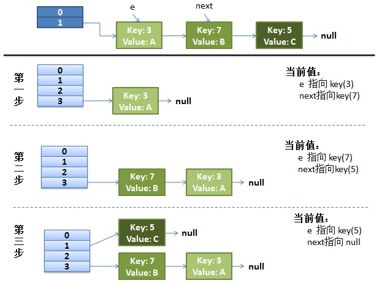
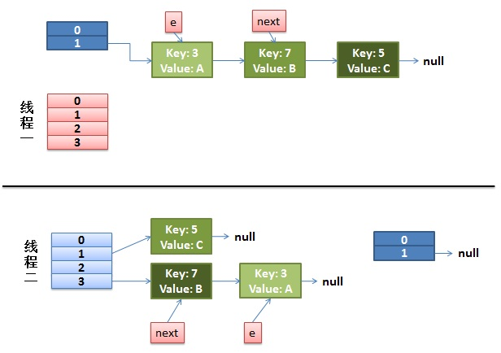
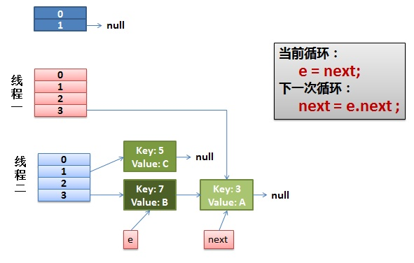
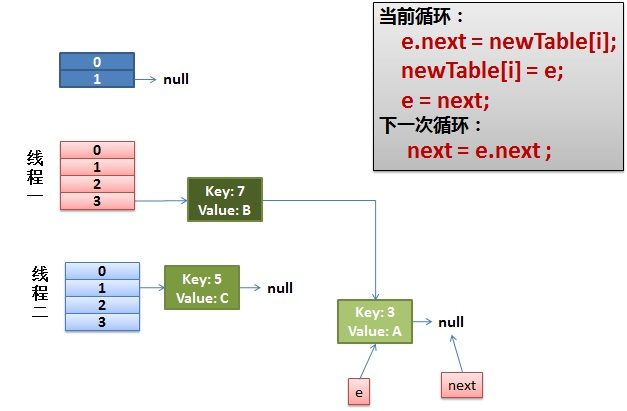
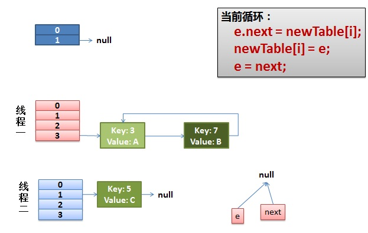
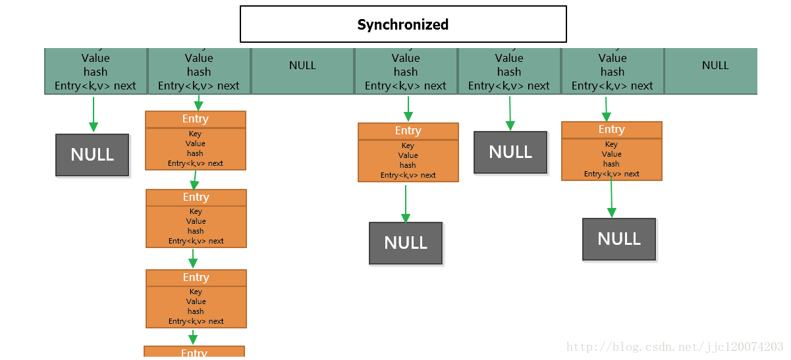

# ConcurrentHashMap

　　ConcurrentHashMap（简称 chm）是 JDK 1.5 新引入的 java.util.concurrent 包的成员，作为 HashTable 的替代。为什么呢，HashTable 采用了同步整个方法的结构，虽然实现了线程安全但是性能也就大大降低了，而 HashMap 在并发情况下会很容易出错。所以就有了安全并且在多线程中使用的 ConcurrentHashMap。

　　ConcurrentHashMap 是线程安全并且高效的一种容器。

## 1. hash 表   

### 1.1. 介绍              

　　哈希表就是一个以键-值（key-value）存储数据的结构，只要输入待查找的值即 key，即可查找到其对应的值。

　　哈希的思路很简单，如果所有的键都是整数，那么就可以使用一个简单的无序数据来实现：将键作为索引，值即为其对应的值，这样就可以快速访问任意键的值。这是对于简单的键的情况，将其扩展到可以处理更加复杂的类型的键。

### 1.2. 链式 hash 表

　　链式哈希表从根本上说是由一组链表构成。每个链表都可以看做是一个 “ 桶 ”，将所有的元素通过散列的方式放到具体的不同的桶中。插入元素时，首先将其键插入一个哈希函数（该过程称为哈希键），函数通过散列的方式告知元素属于哪个 “ 桶 ”，然后在相应的链表头插入元素。查找或删除元素时，用同样的方式先找到元素的 “ 桶 ”，然后遍历相应的链表，直到发现想要的元素。因为每个 “ 桶 ” 都是一个链表，所以链式哈希表并不限制包含元素的个数。然而，如果表变得太大，它的性能将会降低。


### 1.3. 应用场景

　　缓存技术（比如 redis、memcached）的核心其实就是在内存中维护一张巨大的哈希表，还有 HashMap、ConcurrentHashMap 等应用。

### 1.4. ConcurrentHashMap 为什么高效？

　　HashTable 低效主要是因为所有访问 HashTable 的线程都争夺一把锁。如果容器有很多把锁，每一把锁控制容器中的一部分数据，那么当多个线程访问容器里的不同部分的数据时，线程之前就不会存在锁的竞争，这样就可以有效的提高并发的访问效率。

　　这也正是 ConcurrentHashMap 使用的分段锁技术。将 ConcurrentHashMap 容器的数据分段存储，每一段数据存储一部分数据，当线程占用其中一段数据时，其他线程可正常访问其他段数据。

## 2. ConcurrentHashMap 与 HashMap 等区别

### 2.1. HashMap

　　HashMap 是线程不安全的，在多线程环境下，使用 HashMap 进行 put 操作会引起死循环，导致 CPU 利用率接近 100%，所以在并发情况下不能使用 HashMap。至于为什么会引起死循环，是因为 HashMap 的 Entry 链表在并发环境下可能会形成环状链表（扩容时可能造成），导致 get 操作时，cpu 空转，所以，在并发环境中使用 HashMap 是非常危险的。

#### 2.1.1. HashMap 线程不安全的典型表现

　　HashMap 是一个数组链表，当一个 key/value 对被加入时，首先会通过 Hash 算法定位出这个键值对要被放入的桶，然后就把它插到相应的桶中。如果这个桶中已经有元素了，那么发生了碰撞，这样会在这个桶中形成一个链表。

　　一般来说，当有数据要插入 HashMap 时，都会检查容量有没有超过设定的 thredhold，如果超过，需要增大 HashMap 的尺寸，但是这样一来，就需要对整个 HashMap 里的结点进行重哈希操作。

　　HashMap 重哈希的关键源码如下：

```java

 /**
     * Transfers all entries from current table to newTable.
     */
    void transfer(Entry[] newTable) {

        // 将原数组 table 赋给数组 src
        Entry[] src = table;
        int newCapacity = newTable.length;

        // 将数组 src 中的每条链重新添加到 newTable 中
        for (int j = 0; j < src.length; j++) {
            Entry<K,V> e = src[j];
            if (e != null) {
                src[j] = null;   // src 回收

                // 将每条链的每个元素依次添加到 newTable 中相应的桶中
                do {
                    Entry<K,V> next = e.next;

                    // e.hash 指的是 hash(key.hashCode()) 的返回值;
                    // 计算在 newTable 中的位置，注意原来在同一条子链上的元素可能被分配到不同的桶中
                    int i = indexFor(e.hash, newCapacity);   
                    e.next = newTable[i];
                    newTable[i] = e;
                    e = next;
                } while (e != null);
            }
        }
    }

```

**单线程环境下的重哈希过程演示**



　　单线程情况下，rehash 不会出现任何问题，如上图所示。假设 hash 算法就是简单的 key mod table.lenght（也就是桶的个数）。最上面的是 old hash 表，其中的 Hash 表桶的个数为 2，所以对于 key = 3、7、5 的键值对在 mod 2 以后都冲突在 table[1] 这里了。接下来的三个步骤是，Hash 表 resize 成 4，然后对所有的键值对重哈希的过程。

**多线程环境下的重哈希过程演示**

　　假设有两个线程，用红色和蓝色标注一下，被这两个线程共享的资源正是要重哈希的原来 1 号桶中的 Entry 链：

```java
do {
    Entry<K,V> next = e.next;       // <--假设线程一执行到这里就被调度挂起了
    int i = indexFor(e.hash, newCapacity);
    e.next = newTable[i];
    newTable[i] = e;
    e = next;
} while (e != null);
```

　　在线程二执行完成了，于是有下面这个样子：



　　注意，在线程二重哈希后，线程一的指针 e 和指针 next 分别指向了线程二重组后的链表（e 指向了 key(3)，而 next 指向了 key(7)）。此时，线程一被调度回来执行，线程一先是执行 newTable[i] = e，然后是 e = next，导致了 e 指向了 key(7)，而下一次循环的 next = e.next 导致了 next 指向了 key(3)，如下图所示： 



　　这时，一切安好。线程一有条不紊的工作着，把 key(7) 摘下来，放到 newTable[i] 的第一个，然后把 e 和 next 往下移，如下图所示：



　　在此时，特别需要注意的是，当执行 e.next = newTable[i] 后，会导致 key(3).next 指向了 key(7)，而此时的 key(7).next 已经指向了 key(3)，环形链表就这样出现了，如下图所示。于是，当线程一调用 hashMap.get(11) 时，悲剧就出现了 -- Infinite Loop。



　　这是 HashMap 在并发环境下使用中最为典型的一个问题，就是在 HashMap 进行扩容重哈希时导致 Entry 链形成环。一旦 Entry 链中有环，势必会导致在同一个桶中进行插入、查询、删除等操作时陷入死循环。

### 2.2. HashTable

　　HashTable 和 HashMap 的实现原理几乎一样，差别无非是：

1. HashTable 不允许 key 和 value 为 null。
2. HashTable 是线程安全的。




　　但是 HashTable 线程安全的策略实现代价却太大了，get/put 所有相关操作都是 synchronized 的，这相当于给整个哈希表加了一把大锁。

　　多线程访问时候，只要有一个线程访问或操作该对象，那其他线程只能阻塞，相当于将所有的操作串行化，在竞争激烈的并发场景中性能就会非常差。

### 2.3. ConcurrentHashMap

　　主要就是为了应对 HashMap 在并发环境下不安全而诞生的。

　　HashTable 访问效率低下的原因，就是因为所有的线程在竞争同一把锁。如果容器中有多把锁，不同的锁锁定不同的位置，这样线程间就不会存在锁的竞争，这样就可以有效的提高并发访问效率，这就是 ConcurrentHashMap 所使用的锁分段技术。将数据一段一段的存储，然后为每一段都配一把锁，当一个线程只是占用其中的一个数据段时，其他段的数据也能被其他线程访问。

　　Map 一般都是数据 + 链表结构（JDK 1.8 为数组 + 链表 + 红黑树）。


　　ConcurrentHashMap 避免了对全局加锁，修改成了局部加锁操作，这样就极大地提高了并发环境下的操作速度，由于 ConcurrentHashMap 在 JDK 1.7 和 1.8 中的实现非常不同，接下来看一下 JDK 在 1.7 和 1.8 中的区别。

## 3. JDK 1.7 版本的 ConcurrentHashMap 的实现原理


* 在 JDK 1.7 中 ConcurrentHashMap 采用了数组 + Segment + 分段锁的方式实现。其中 Segment 继承于 ReentrantLock，所以它是一种可重入锁（ReentrantLock）。
* Segment 在其中扮演锁的角色，HashEntry 用于存储数据。

* 核心数据如 value 以及链表都是 volatile 修饰的，保证了获取时的可见性。

* ConcurrentHashMap 采用了非常精妙的 “ 分段锁 ” 策略，ConcurrentHashMap 的主干是个 Segment 数组。
* 一个 ConcurrentHashMap 包括一个 Segment 数组，Segment 就是一个子哈希表，一个 Segment 元素包括一个 HashEntry 数组，HashEntry 是一种链表式的结构，每一个 Segment 维护着 HashEntry 数组中的元素。
* 并发环境下，对于不同 Segment 的数据进行操作是不用考虑锁竞争的。所以，对于同一个 Segment 的操作才需考虑线程同步，不同的 Segment 则无需考虑。
* 写操作的时候可以只对元素所在的 Segment 进行加锁即可，不会影响到其他的 Segment，这样，在最理想的情况下，ConcurrentHashMap 可以最高同时支持 Segment 数量大小的写操作（刚好这些写操作都非常平均的分布在所有的 Segment 上）。
* 使用 ConcurrentHashMap 的时候有时候会遇到跨段的问题，跨段的时候（size()、containValue()），可能需要锁定部分段或者全段，当操作结束之后，又会按照顺序进行释放每一段的锁。注意是按照顺序解锁的。
* 得到一个元素需要进行两次 hash 操作，第一次得到 Segment，第二次得到 HashEntry 中的链表头部，这样做会使得 hash 的过程比普通的 HashMap 要长。

### 3.1. Segment（分段锁）- 减少锁的粒度

　　ConcurrentHashMap 中的分段锁称为 Segment ，它即类似于 HashMap 的结构，即内部拥有一个 Entry 数组，数组中的每个元素又是一个链表。同时 Segment 又是一个 ReentrantLock（Segment 继承了 ReentrantLock）。

### 3.2. 内部结构

　　ConcurrentHashMap 使用分段锁技术，将数据分成一段一段的存储，然后给每一段数据配一把锁，当一个线程占用锁访问其中一个段数据的时候，其他段的数据也能被其他线程访问，能够实现真正的并发访问。

　　ConcurrentHashMap 的内部结构图：


　　从上面的结构可以了解到，ConcurrentHashMap 定位一个元素的过程需要进行两次 Hash 操作。

　　第一次 Hash 定位到 Segment，第二次 Hash 定位到元素所在的链表的头部。

### 3.3. 该结构的优劣势

　　**坏处**是这一种结构的带来的副作用是 Hash 的过程要比普通的 HashMap 要长。

　　**好处**是写操作的时候可以只对元素所在的 Segment 进行加锁即可，不会影响到其他的 Segment，这样，在最理想的情况下，ConcurrentHashMap 可以最高同时支持 Segment 数量大小的写操作（刚好这些写操作都非常平均地分布在所有的 Segment 上）。

　　每当一个线程占用锁访问一个 segment 时，不会影响到其他的 Segment。所以，通过这一种结构，ConcurrentHashMap 的并发能力可以大大的提高。

## 4. JDK 1.8 版本的 ConcurrentHashMap 的实现原理

　　JDK 8 中 ConcurrentHashMap 参考了 JDK 8 HashMap 的实现，采用了数组 + 链表 + 红黑树的实现方式来设计，内部大量采用 CAS 操作。

　　JDK 1.8 的实现已经抛弃了 Segment 分段锁机制，利用 CAS + Synchronized 来保证并发更新的安装。数据结构采用：数组 + 链表 + 红黑树。

　　JDK 8 中彻底放弃了 Segment 转而采用的是 Node，其设计思想也不再是 JDK 1.7 中的分段锁思想。

　　Node：保存 key、value 及 key 的 hash 值的数据结构。其中 value 和 next 都用 volatile 修饰，保证并发的可见性。

```java
class Node<K,V> implements Map.Entry<K,V> {
    final int hash;
    final K key;
    volatile V val;
    volatile Node<K,V> next;
    Node(int hash, K key, V val, Node<K,V> next) {
            this.hash = hash;
            this.key = key;
            this.val = val;
            this.next = next;
     }
}
```

　　JDK 1.8 中的 Node 节点，其中的 val 和 next 都通过可见性修饰。

　　JDK 1.8 ConcurrentHashMap 结构基本上和 JDK 1.8 的 HashMap 一样，不过保证线程安全性。

　　在 JDK 1.8 中 ConcurrentHashMap 的结构，由于引入了红黑树，使得 ConcurrentHashMap 的实现非常复杂，红黑树是一种性能非常好的二叉查找树，其查找性能为 O(logN)，但是其实现过程也非常复杂，而且可读性也非常差。

　　JDK 1.8 中 ConcurrentHashMap 在链表的长度大于某个阈值的时候会把链表转换成红黑树进一步提供其查找性能。

### 4.1. CAS

　　CAS 是 compare and swap 的缩写，即比较交换。CAS 是一种基于锁的操作，而且是乐观锁。在 Java 中锁分为乐观锁和悲观锁。悲观锁是将资源锁住，等一个之前获得锁的线程释放锁之后，下一个线程才可以访问。而客观锁采用了一种宽泛的态度，通过某种方式不加锁来处理资源，比如通过给记录加 version 来获得数据，性能较悲观锁有很大的提高。

　　CAS 操作包含三个操作数 -- 内存位置（V）、预期原值（A）和新值（B）。如果内存地址里面的值和 A 的值是一样的，那么就将内存里面的值更新成 B。CAS 是通过无限循环来获取数据的，如果在第一轮循环中，a 线程获取地址里面的值被 b 线程修改了，那么 a 线程需要自旋，到下一次循环才有可能机会执行。

## 5. ReentrantLock 与 Synchronized 有什么区别

* synchronized 是一个同步锁 synchronized(this)

  同步锁，当一个线程 A 访问资源的代码同步块的时候，A 线程就会持续持有当前锁的状态，如果其他线程 B、C 也要访问资源的代码同步块的时候将会收到阻塞，因此需要排队等待 A 线程释放锁的状态。

  但是注意的是，当一个线程 B、C 只是不能访问 A 线程资源的代码同步块，仍然可以访问其他的非资源同步块。

* ReentrantLock 可重入锁  通常有两类：公平性、非公平性。

  * 公平性锁：根据线程请求锁的顺序依次获得锁，当一个线程 A 访问资源的期间，线程 A 获得锁资源，此时内部存在一个计数器 num+1，在访问期间，线程 B、C 请求资源时，发现 A 线程在持有当前资源，因此在后面生成节点排队（B 处于待唤醒状态），假如此时 A 线程再次请求资源时，不需要再次排队，可以直接再次获取当前资源（内部计数器+1，num=2），当 A 线程释放所有锁的时候（num = 0），此时会唤醒 B 线程进行锁的操作，C 线程同理。
  * 非公平性：当 A 线程已经释放锁之后，准备唤醒线程 B 获取资源的时候，此时线程 C 获取请求，此时会出现竞争，线程 B 没有竞争过 C 线程，因此，C 会优先获得资源，B 继续睡眠。

* synchronzied 是一个非公平锁。非公平性会比公平性锁的效率要高很多，原因是不需要通知等待。

* ReentrantLock 提供了 new Condition 可以获得多个 Condition 对象，可以简单的实现比较复杂的线程同步的功能。通过 await()、signal() 以实现。

* ReentrantLock 提供可以中断锁的一个方法 lock.lockInterruptibly() 方法。

* Jdk 1.8 synchronzied 和 ReentrantLock 比较的话，官方比较建议用 synchronized。

## 6. volatile 变量

　　对于 ConcurrentHashMap 而言的话，源码里面有很多地方用到了这个变量。比如 HashEntry、value、Segment 元素个数 Count。

　　volatile 属于 JMM 模型中的一个词语。

　　Java 内存模型中的几个概念：

* 原子性：保证 Java 内存模型中原子变量内存操作的。通常有 read、write、load、use、assign、store、lock、unlock 等这些。
* 可见性：就是当一个线程对一个变量进行了修改，其他线程即可立即得到这个变量最新的修改数据。
* 有序性：如果在本线程内观察，所有操作都是有序的；如果在一个线程中观察另一个线程，所有操作都是无序的。
* 先行发生：happen-before 先行发生原则是指 Java 内存模型中定义的两项操作之间的依序关系，如果说操作 A 先行发生于操作 B，其实就是说发生操作 B 之前。
* 传递性

　　volatile 变量与普通变量的不同之处：

1. volatile 是有可见性，一定程序的有序性。
2. volatile 赋值的时候新值能够立即刷新到主内存中去，每次使用的时候能够立即从内存中刷新。

## 7. JDK 1.7 与 JDK 1.8 的 ConcurrentHashMap 总结

　　可以看出 JDK 1.8 版本的 ConcurrentHashMap 的数据结构已经接近 HashMap，相对而言，ConcurrentHashMap 只是增加了同步的操作来控制并发，从 JDK 1.7 版本的 ReentrantLock + Segment + HashEntry，到 JDK 1.8 版本中 synchronized + CAS + HashEntry + 红黑树。

1. 数据结构：JDK 1.8 取消了 Segment 分段锁的数据结构，取而代之的是数组 + 链表 + 红黑树的结构。
2. 保证线程安全机制：JDK 1.7 采用 segment 的分段锁机制实现线程安全，其中 segment 继承自 ReentrantLock。JDK 1.8 采用 CAS + Synchronized 保证线程安全。
3. 锁的粒度：原来是对需要进行数据操作的 Segment 加锁，现调整为每个数组元素加锁（Node）。
4. 链表转化为红黑树：定位节点的 hash 算法简化会带来弊端，hash 冲突加剧，因此在 JDK 1.8 链表节点数量大于 8 时，会将链表转换为红黑树进行存储。
5. 查询时间复杂度：从原来的遍历链表 O(n)，JDK 1.8  变成遍历红黑树 O(logN)。

## 8. 参考文章 

1. [CurrentHashMap的实现原理](https://blog.csdn.net/qq_22343483/article/details/98510619)
2. [CurrentHashMap源码剖析](https://segmentfault.com/a/1190000015083593)
4. [深入理解currentHashMap(一)](https://www.jianshu.com/p/f9d62bf74b67)
4. [深入理解ConcurrentHashMap实现原理和源码(JDK1.6)](https://www.jianshu.com/p/10335e8365d7)
5. [深入理解ConcurrentHashMap原理分析以及线程安全性问题](https://blog.csdn.net/jjc120074203/article/details/78625433)
