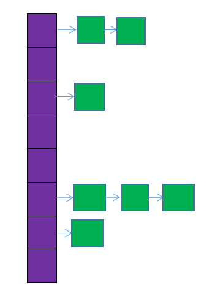
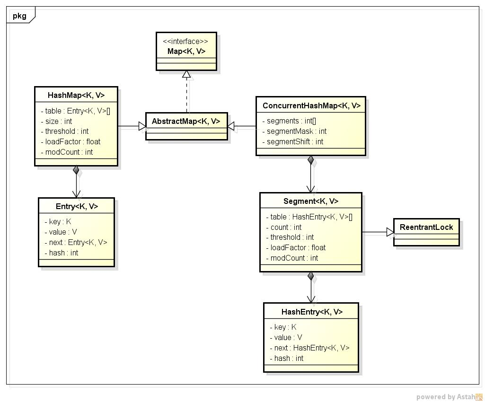

# HashMap 和 HashTable 的区别

## HashMap 简介

　　HashMap 是基于哈希表实现的，每一个元素是一个 key-value 对，其内部通过单链表解决冲突问题，容量不足（超过了阈值）时，同样会自动增长。

　　HashMap 是非线程安全的，只是用于单线程环境下，多线程环境下可以采用 concurrent 并发包下的 ConcurrentHashMap。

　　HashMap 实现了 Serializable 接口，因此它支持序列化，实现了 Cloneable 接口，能被克隆。

　　HashMao 存数据的过程是：

　　HashMap 内部维护了一个存储数据的 Entry 数组，HashMap 采用链表解决冲突，每一个 Entry 本质上是一个单向链表。当准备添加一个 key-value 对时，首先通过 hash(key) 方法计算 hash 值，然后通过 indexFor(hash,length) 求该 key-alue 对的存储位置，计算方法时先用 hash&0x7FFFFFFF 后，再对 length 取模，这就保证每一个 key-value 对都能存入 HashMap 中，当计算出的位置相同时，由于存储位置是一个链表，则把这个 key-value 对插入链表头。

　　HashMap 中 key 和 value 都允许为 null。key 为 null 的键值对永远都放在以 table[0] 为头节点的链表中。

　　HashMap 的存储结构，如下图所示：



　　图中，紫色布恩即代表哈希表，也称为哈希数组，数组的每个元素都是一个单链表的头结点，链表是用来解决冲突的，如果不同的 key 映射到了数组的同一位置处，就将其放入单链表中。

　　HashMap 内存储数据的 Entry 数组默认是 16，如果没有对 Entry 扩容机制的话，当存储的数据一多，Entry 内部的链表会很长，这就失去了 HashMap 的存储意义了。所以 HashMap 内部有自己的扩容机制。HashMap 内部有：

　　变量 size，它记录 HashMap 的底层数组中已用槽的数量；

　　变量 threshold，它是 HashMap 的阈值，用于判断是否需要调整 HashMap 的容量（threshold = 容量*加载因子）。

　　变量 DEFAULT_LOAD_FACTOR = 0.75f，默认加载因子为 0.75。

　　HashMap 扩容的条件是：当 size 大于 threshold 时，对 HashMap 进行扩容。

　　扩容时是新建了一个 HashMap 的底层数组，而后调用 transfer 方法，将就 HashMap 的全部元素添加到新的 HashMap 中（要重新计算元素在新的数组中的索引位置）。很明显，扩容是一个相当耗时的操作，因为它需要重新计算这些元素在新的数组中的位置并进行复制处理。因此，在用 HashMap 的时，最好能提前预估下 HashMap 中元素的个数，这样有助于提高 HashMap 的性能。

　　HashMap 共有四个构造方法。构造方法中提到了两个很重要的参数：初始容量和加载因子。这两个参数时影响 HashMap 性能的重要参数，其中容量表示哈希表中槽的数量（即哈希数组的长度），初始容量是创建哈希表时的容量（从构造函数中可以看出，如果不指明，则默认为 16），加载因子是哈希表在其容量自动增加之前可以达到多满的一种尺度，当哈希表中的条目数超出了加载因子与当前容量的乘积时，则要对该哈希表进行 resize 操作（即扩容）。

　　如果加载因子越大，对空间的利用更充分，但是查找效率会降低（链表长度会越来越长）；如果加载因子太小，那么表中的数据将过于稀疏（很多空间还没用，就可以扩容了），对空间造成严重浪费。如果在构造方法中不指定，则系统默认加载因子为 0.75，这事一个比较理想的值，一般情况下时无需修改的。

　　另外，无论指定的容量为多少，构造方法都会将实际容量设为不小于指定容量的 2 的次方的一个数，且最大值不能超过 2 的 30 次方。

* 底层数组 + 链表实现，可以存储 null 键和 null 值，线程不安全。
* 初始 size 为 16，扩容：newSize = oldSize*2，size 一定为 2 的 n 次幂。
* 扩容针对整个 Map，每次扩容后，原来数组中的元素一次重新计算存访位置，并重新插入。
* 插入元素后才判断该不该扩容，有可能无效扩容（插入后如果扩容，如果没有再次插入，就会产生无效扩容）
* 当 Map 中元素总数超过 Entry 数组的 75%，触发扩容操作，为了减少链表长度，元素分配更均匀。
* 计算 index 方法：index = hash & (tab.lenght-1)。

　　HashMap 的初始值还要考虑加载因子：

* 哈希冲突：若干 key 的哈希值按数组大小取模后，如果落在同一个数组下标上，将组成一条 Entry 链，对 key 的查找需要遍历 Entry 链上的每个元素执行 equals() 比较。
* 加载因子：为了降低哈希冲突的概率，默认当 HashMap 中的键值对达到数组大小的 75% 时，即会触发扩容。因此，如果预估容量是 100，即需要设定 100/0.75 = 134 的数组大小。
* 空间换时间：如果希望加快 key 查找的时间，还可以进一步降低加载因子，加大初始大小，以降低哈希冲突的概率。

　　HashMap 和 HashTable 都是用 hash 算法来决定其元素的存储，因此 HashMap 和 HashTable 的 hash 表包含如下属性：

* 容量（capacity）：hash 表中桶的数量
* 初始化通量（initial capacity）：创建 hash 表时桶的数量，HashMap 允许在构造器中指定初始化容量。
* 尺寸（size）：当前 hash 表中记录的数量。
* 负载因子（load factor）：负载因子等于 "size/capacity"。负载因子为 0，表示空的 hash 表，0.5 表示半满的散列表，以此类推。轻负载的散列表具有冲突少、适宜插入与查询的特点（但是使用Iterator 迭代元素时比较慢）。

　　除此之外，hash 表里还有一个 “ 负载极限 ”，“ 负载极限 ” 是一个 0-1 的数值，“ 负载极限 ” 决定了 hash 表的最大填满程度。当 hash 表中的负载因子达到指定的 “ 负载极限 ” 时，hash 表会自动成倍地增加容量（桶地数量），并将原来地对象重新分配，放入新的桶内，这称为 rehashing。

　　HashMap 和 HashTable 地构造器允许指定一个负载极限，HashMap 和 HashTable 默认的 “ 负载极限 ” 为 0.75，这表明当该 hash 表的 3/4 已经被填满时，hash 表会发生 rehashing。

　　“ 负载极限 ” 的默认值（0.75）是时间和空间成本上的一种折中：

*  较高的 “ 负载极限 ” 可能降低 hash 表所占用的内存空间，但会增加查询数据的时间开销，而查询是最频繁的操作（HashMap 的 get() 与 put() 方法都要用到查询）。
* 较低的 “负载极限” 会提高查询数据的性能，但会增加 hash 表所占用的内存开销。


## HashTable 简介

　　HashTable 同样是基于哈希表实现的，同样每个元素是一个 key-value 对，其内部也是通过单链表解决冲突问题，容量不足（超过了阈值）时，同样会自动增长。

　　HashTable 也是 JDK 1.0 引入的类，是线程安全的，能用于多线程环境中。

　　HashTable 同样实现了 Serializable 接口，它支持序列化，实现了 Cloneable 接口，能被克隆。

* 底层数组+链表实现，无论 key 还是 value 都不能为 null，线程安全，实现线程安全的方式是在修改数据时锁住整个 HashTable，效率低，ConcurrentHashMap 做了相关优化。
* 初始 size 为 11，扩容：newSize = oldSize*2+1。
* 计算 index 的方法：index = (hash & Ox7FFFFFFFF) % tab.lenght。

## ConcurrentHashMap

* 底层采用分段的数组 + 链表实现，线程安全。
* 通过把整个 Map 分为 N 个 Segment，可以提供相同的线程安全，但是效率提升 N 倍，默认提升 16 倍。（读操作不加锁，由于 HashEntry 的 value 变量是 volatile 的，也能保证读取到最新的值。）
* HashTable 的 synchronzied 是针对整个 Hash 表的，即每次锁住整张表让线程独占，ConcurrentHashMap 允许多个修改操作并发执行，其关键在于使用了锁分离技术。
*  有些方法需要跨段，比如 size() 和 containsValue()，它们可能需要锁定整个表而不仅仅是某个段，这需要按顺序锁定所有段，操作完毕后，又按顺序释放所有段的锁。
* 扩容：段内扩容（段内元素超过该段对应 Entry 数组长度的 75% 触发扩容，不会对整个 Map 进行扩容），插入前检查需不需要扩容，有效避免无效扩容。

　　HashTable 和 HashMap 都实现了 Map 接口，但是 HashTable 的实现是基于 Dictionary 抽象类的。Java 5 提供了 ConcurrentHashMap，它是 HashTable 的替代，比 HashTable 的扩展性更好。

　　HashMap 基于哈希思想，实现对数据的读写。当讲键值对传递给 put() 方法时，它调用键对象的 hashCode() 方法来计算 hashCode，然后找到 bucket 位置来存储值对象。当获取对象时，通过键对象的 equals() 方法找到正确的键值对，然后返回值对象。HashMap 使用链表来解决碰撞问题，当发生碰撞时，对象将会储存在链表的下一个节点中。HashMap 在每个链表节点中储存键值对对象。当两个不同的键对象的 hashcode 相同时，它们会储存在同一个 bucket 位置的链表中，可通过键对象的 equals() 方法来找到键值对。如果链表对象超过阈值（TREEIFY_THRESHOLD，8），链表就会倍改造为树形结构。

　　在 HashMap 中，null 可以作为键，这样的键只有一个，但可以有一个或多个键所对应的值为 null。当 get() 方法返回 null 值时，既可以表示 HashMap 中没有该 key，也可以表示该 key 所对应的 value 为 null。因此，在 HashMap 中不能由 get() 方法来判断 HashMap 中是否存在某个 key，应该用 containsKey() 方法来判断。而在 HashTable 中，无论是 key 还是 value 都不能为 null。

　　HashTable 是线程安全的，它的方法是同步的，可以直接用在多线程环境中，而 HashMap 则不是线程安全的，在多线程环境中，需要手动实现同步机制。

　　简单类图：



　　从类图中可以看出来在存储结构中 ConcurrentHashMap 比 HashMap 多出了一个类 Segment，而 Segment 是一个可重入锁。

　　ConcurrentHashMap 是使用了锁分段技术来保证线程安全的。

　　锁分段技术：首先将数据分成一段一段的存储，然后给每一段数据配一把锁，当一个线程占用锁访问其中一个段数据的时候，，其他段的数据也能被其他线程访问。

　　ConcurrentHashMap 提供了与 HashTable 和 synchronizedMap 不同的锁机制。HashTable 中采用的锁机制是一次锁住整个 hash 表，从而在同一时刻只能由一个线程对其进行操作；而 ConcurrentHashMap 中则是一次锁住一个桶。

　　ConcurrentHashMap 默认将 hash 表分为 16 个桶，诸如 get、put、remove 等常用操作只锁住当前需要用到的桶。这样，原来只能一个线程进入，现在却能同时有 16 个写线程执行，并发性能的提升是显而易见的。

## HashTable 和 HashMap 区别

　　主要区别有：线程安全性、同步（synchronized）以及速度。

### 1. 继承的父类不同

　　HashTable 继承自 Dictionary 类，而 HashMap 继承自 AbstractMap 类。但二者都实现了 Map 接口。

### 2. 线程安全性不同

　　javadoc 中关于 HashMap 的一段描述如下：此实现不是同步的。如果多个线程同时访问一个哈希映射，而其中至少一个线程从结构上修改了该映射，则它必须保持外部同步。

　　HashTable 中的方法是 synchronized 的，而 HashMap 中的方法在缺省情况下是非 synchronized 的。在多线程并发的环境下，可以直接使用 HashTable，不需要自己为它的方法是实现同步，但使用 HashMap 时就必须要自己增加同步处理。（结构上的修改是指添加或删除一个或多个映射关系的任何操作；仅改变与实例已经包含的键关联的值不是结构上的修改。）这一般通过对自然封装该映射的对象进行同步操作来完成。如果不存在这样的对象，则应该使用 Collections.synchronziedMap 方法来 “ 包装 ” 该映射。最好在创建时完成这一操作，以防止对映射进行意外的非同步访问，如下所示：

```java
Map m = Collections.synchronizedMap(new HashMap(...));
```

　　HashTable 线程安全很好理解，因为它每个方法中都加入了 synchronized。

　　这里分析一下 HashMap 为什么是线程不安全的：

　　HashMap 底层是一个 Entry 数组，当发生 hash 冲突的时候，HashMap 是采用链表的方式来解决的，在对应的数组位置存访链表的头节点。对链表而言，新加入的节点会从头结点加入。

　　来分析一下多线程访问：

1. 在 HashMap 做 put 操作的时候会调用下面方法：

```java

	// 新增 Entry。将 “key-value” 插入指定位置，bucketIndex 是位置索引。      
    void addEntry(int hash, K key, V value, int bucketIndex) {      
        // 保存 “bucketIndex” 位置的值到 “e” 中      
        Entry<K,V> e = table[bucketIndex];      
        // 设置 “bucketIndex” 位置的元素为 “新 Entry”，      
        // 设置 “e”为“ 新 Entry 的下一个节点”      
        table[bucketIndex] = new Entry<K,V>(hash, key, value, e);      
        // 若 HashMap 的实际大小 不小于 “阈值”，则调整 HashMap 的大小      
        if (size++ >= threshold)      
            resize(2 * table.length);      
    } 
```

　　在 HashMap 做 put 操作的时候会调用到以上的方法。现在假如 A 线程和 B 线程同时对同一个数组调用 addEntry，两个线程会同时得到现在的头结点，然后 A 写入新的头结点之后，B 也写入新的头结点，那 B 的写入操作就会覆盖 A 的写入操作造成 A 的写入操作丢失。

2. 删除键值对的代码

```java
    final Entry<K,V> removeEntryForKey(Object key) {      
        // 获取哈希值。若 key 为 null，则哈希值为 0；否则调用 hash() 进行计算      
        int hash = (key == null) ? 0 : hash(key.hashCode());      
        int i = indexFor(hash, table.length);      
        Entry<K,V> prev = table[i];      
        Entry<K,V> e = prev;      
     
        // 删除链表中 “ 键为 key” 的元素      
        // 本质是 “ 删除单向链表中的节点 ”      
        while (e != null) {      
            Entry<K,V> next = e.next;      
            Object k;      
            if (e.hash == hash &&      
                ((k = e.key) == key || (key != null && key.equals(k)))) {      
                modCount++;      
                size--;      
                if (prev == e)      
                    table[i] = next;      
                else     
                    prev.next = next;      
                e.recordRemoval(this);      
                return e;      
            }      
            prev = e;      
            e = next;      
        }      
     
        return e;      
    }  
```

　　当多个线程同时操作同一个数组位置的时候，也都会先取得现在状态下该位置存储的头节点，然后各自去进行计算操作，之后再把结果写回到该数组位置去，其实写回的时候可能其他的线程已经把这个位置给修改过了，就会覆盖其他线程的修改。

3. addEntry 中当加入新的键值对后键值对总数量超过门限值的时候会调用一个 resize 操作，代码如下：

```java
    // 重新调整 HashMap 的大小，newCapacity 是调整后的容量      
    void resize(int newCapacity) {      
        Entry[] oldTable = table;      
        int oldCapacity = oldTable.length;     
        // 如果就容量已经达到了最大值，则不能再扩容，直接返回    
        if (oldCapacity == MAXIMUM_CAPACITY) {      
            threshold = Integer.MAX_VALUE;      
            return;      
        }      
     
        // 新建一个 HashMap，将 “ 旧 HashMap ” 的全部元素添加到 “ 新 HashMap ” 中，      
        // 然后，将 “ 新 HashMap” 赋值给 “ 旧 HashMap”。      
        Entry[] newTable = new Entry[newCapacity];      
        transfer(newTable);      
        table = newTable;      
        threshold = (int)(newCapacity * loadFactor);      
    }  
```

　　这个操作会生成一个新的容量的数组，然后对原数组的所有键值对重新进行计算和写入新的数组，之后指向新生成的数组。

　　当多个线程同时检测到总数量超过门限值的时候就会调用 resize 操作，各自生成新的数组并 rehash 后赋给该 map 底层的数组 table，结果最终只有最后一个线程生成的新数组被赋给 table 变量，其他线程的均会丢失。而且当某些线程已经完成赋值而其他线程刚开始的时候，就会用已经被赋值的 table 作为原始数组，这样也会有问题。

### 3. 是否提供 contains 方法

　　HashMap 把 HashTable 的 contains 方法去掉了，改成 containsValue 和 containsKey，因为 contains 方法容易让人引起误解。

　　HashTable 则保留了 contains、containsValue 和 containsKey 三个方法，其中 contains 和 containsValue 功能相同。

　　HashTable 的 containsKey 方法和 containsValue 的源码：

```java
public boolean containsValue(Object value) {      
     return contains(value);      
 }  

// 判断Hashtable是否包含“值(value)”      
 public synchronized boolean contains(Object value) {      
     //注意，Hashtable中的value不能是null，      
     // 若是null的话，抛出异常!      
     if (value == null) {      
         throw new NullPointerException();      
     }      
    
     // 从后向前遍历table数组中的元素(Entry)      
     // 对于每个Entry(单向链表)，逐个遍历，判断节点的值是否等于value      
     Entry tab[] = table;      
     for (int i = tab.length ; i-- > 0 ;) {      
         for (Entry<K,V> e = tab[i] ; e != null ; e = e.next) {      
             if (e.value.equals(value)) {      
                 return true;      
             }      
         }      
     }      
     return false;      
 } 

// 判断Hashtable是否包含key      
 public synchronized boolean containsKey(Object key) {      
     Entry tab[] = table;      
/计算hash值，直接用key的hashCode代替    
     int hash = key.hashCode();        
     // 计算在数组中的索引值     
     int index = (hash & 0x7FFFFFFF) % tab.length;      
     // 找到“key对应的Entry(链表)”，然后在链表中找出“哈希值”和“键值”与key都相等的元素      
     for (Entry<K,V> e = tab[index] ; e != null ; e = e.next) {      
         if ((e.hash == hash) && e.key.equals(key)) {      
             return true;      
         }      
     }      
     return false;      
 }  
```

　　看一下 HashMap 的 containsKey 方法和 containsValue 的源码：

```java
	// HashMap是否包含key      
    public boolean containsKey(Object key) {      
        return getEntry(key) != null;      
    }  

	// 返回“键为key”的键值对      
    final Entry<K,V> getEntry(Object key) {      
        // 获取哈希值      
        // HashMap将“key为null”的元素存储在table[0]位置，“key不为null”的则调用hash()计算哈希值      
        int hash = (key == null) ? 0 : hash(key.hashCode());      
        // 在“该hash值对应的链表”上查找“键值等于key”的元素      
        for (Entry<K,V> e = table[indexFor(hash, table.length)];      
             e != null;      
             e = e.next) {      
            Object k;      
            if (e.hash == hash &&      
                ((k = e.key) == key || (key != null && key.equals(k))))      
                return e;      
        }      
        return null;      
    } 

	// 是否包含“值为value”的元素      
    public boolean containsValue(Object value) {      
    // 若“value为null”，则调用containsNullValue()查找      
    if (value == null)      
            return containsNullValue();      
     
    // 若“value不为null”，则查找HashMap中是否有值为value的节点。      
    Entry[] tab = table;      
        for (int i = 0; i < tab.length ; i++)      
            for (Entry e = tab[i] ; e != null ; e = e.next)      
                if (value.equals(e.value))      
                    return true;      
    return false;      
    } 
```

　　通过上面源码的比较，可以得到第四个不同的地方。

### 4. key 和 value 是否允许 null 值

　　其中 key 和 value 都是对象，并且不能包含重复 key，但可以包含重复的 value。

　　通过上面的 containsKey 方法和 ContainsValue 的源码可以很明显的看出：

　　HashTable 中，key 和 value 都不允许出现 null 值。但是如果在 HashTable 中有类似 put(null,null) 的操作，编译同样可以通过，因为 key 和 value 都是 Object 类型，但运行时会抛出 NullPointerException 异常，这是 JDK 的规范规定的。

　　HashMap 中，null 可以作为键，这样的键只有一个；可以有一个或多个键所对应的值为 null。当 get() 方法返回 null 值时，可能是 HashMap 中没有该键，也可能使该键所对应的值为 null。因此，在 HashMap 中不能由 get() 方法来判断 HashMap 中是否存在某个键，而应该用 containsKey() 方法来判断。

### 5. 两个遍历方式的内部实现上不同

　　HashTable、HashMap 都使用了 Iterator。而由于历史原因，HashTable 还使用了 Enumaration 的方式。

　　HashMap 的迭代器（Interator）是 fail-fast 迭代器，而 HashTable 的 enumerator 迭代器不是 fail-fast 的。所以当有其他线程改变了 HashMap 的结构（增加或者移除元素），就会抛出 ConcurrentModificationException，但迭代器本身的 remove() 方法移除元素则不会抛出 ConcurrentModificationException 异常。但这并不是一个一定发生的行为，要看 JVM。这条同样也是 Enumeration 和 Iterator 的区别。

### 6. hash 值不同

　　哈希值的使用不同，HashTable 直接使用对象的 hashCode，而 HashMap 重新计算 hash 值。

　　hashCode 是 jdk 根据对象的地址或者字符串或者数字算出来的 int 类型的数值。

　　HashTable 计算 hash 值，直接用 key 的 hashCode()，而 HashMap 重新计算了 key 的 hash 值，HashTable 在求 hash 值对应的位置索引时，用取模运算，而 HashMap 在求位置索引时，则用与运算，且这里一般先用 hash&0x7FFFFFFF 后，再对 length 取模，&0x7FFFFFFF 的目的时为了将负的 hash 值转化为正值，因为 hash 值有可能为负数，而 &0x7FFFFFFF 后，只有符号外改变，而后面的位都不变。

### 7. 内部实现使用的数组初始化和扩容方式不同

　　HashTable 在不指定容量的情况下的默认容量为 11，而 HashMap 为 16，HashTable 不要求底层数组的容量一定要为 2 的整数次幂，而 HashMap 则要求一定为 2 的整数次幂。

　　HashTable 扩容时，将容量变为原来的 2 倍加 1，而 HashMap 扩容时，将容量变为原来的 2 倍。

　　HashTable 和 HashMap 它们两个内部实现方式的数组的初始大小和扩容的方式。HashTable 中 hash 数组默认大小是 11，增加的方式是 old*2+1。

### 8. 其他

　　由于 HashTable 时线程安全的也是 synchronized，所以在单线程环境下它比 HashMap 要慢。如果不需要同步，只需要单一线程，那么使用 HashMap 性能要好过 HashTable。

　　HashMap 不能保证随着时间的推移 Map 中的元素次序是不变的。

## 其他

1. synchronized 意味着在一次仅有一个线程能够更改 HashTable。就是说任何线程要更新 HashTable 时要首先获得同步锁，其他线程要等到同步锁被释放之后才能再次获得同步锁更新 HashTable。
2. Fail-safe 和 iterator 迭代器相关。如果某个集合对象创建了 Iterator 或者 ListIterator，然后其它的线程视图 “ 结构上 ” 更改集合对象，将会抛出 ConcurrentModificationException 异常。但其他线程可以通过 set() 方法更改集合对象是允许的，因为这并没有从 “ 结构上 ” 更改集合。但是假如已经从结构上进行了更改，再调用 set() 方法，将会抛出 IllegalArgumentException 异常。
3. 结构上的更改指的是删除或者插入一个元素，这样会影响到 map 的结构。

## 能否让 HashMap 同步？

　　HashMap 可以通过下面的语句进行同步：

```java
Map m = Collections.synchronizeMap(hashMap);
```

## 结论

　　HashTable 和 HashMap 有几个主要的不同：线程安全以及速度。仅在需要完全的线程安全的时候使用 HashTable，而如果使用 Java 5 或以上的话，请使用 ConcurrentHashMap 吧。


## 参考文章

1. [HashTable和HashMap的区别详解](https://www.cnblogs.com/williamjie/p/9099141.html)

2. [HashMap和Hashtable的区别](https://www.jianshu.com/p/d3664a1e7c2b)
3. [面试必备：HashMap、Hashtable、ConcurrentHashMap的原理与区别](https://www.cnblogs.com/heyonggang/p/9112731.html)