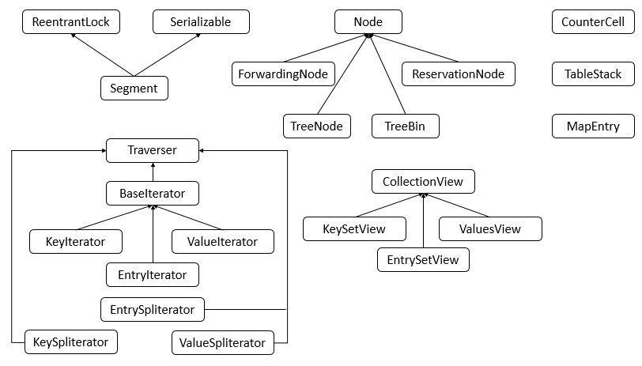
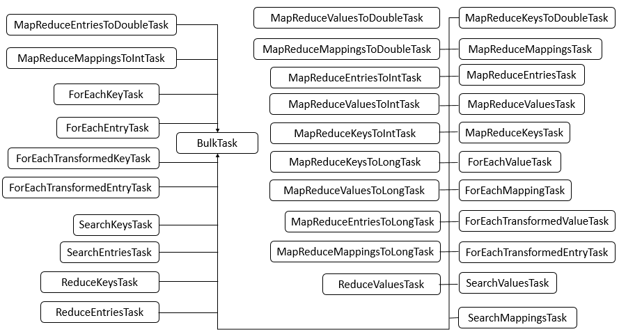

# JDK 1.8 ConcurrentHashMap的源码分析

## 1. 概述

　　ConcurrentHashMap 相比 HashMap 而言，其底层数据与 HashMap 的数据结构相同，数据结构如下：


　　说明：ConcurrentHashMap 的数据结构（数组+链表+红黑树），桶中的结构可能是链表，也可能是红黑树，红黑树是为了提高查找效率。

　　JDK 1.8 的实现已经抛弃了 Segment 分段锁机制，利用 CAS + Synchronized 来保证并发更新的安装。数据结构采用：数组 + 链表 + 红黑树。

## ConcurrentHashMap 类

### 类的继承关系

```java
public class ConcurrentHashMap<K,V> extends AbstractMap<K,V>
    implements ConcurrentMap<K,V>, Serializable {
}
```

　　说明：ConcurrentHashMap 继承了 AbstractMap 抽象类，该抽象类定义了一些基本操作，同时，也实现了 ConcurrentMap 接口，ConcurrentMap 接口也定义了一系列操作，实现了 Serializable 接口表示 ConcurrentHashMap 可以被序列化。

### 类的内部类

　　ConcurrentHashMap 包含了很多内部类，其中主要的内部类框架图如下图所示：





　　说明：可以看到，ConcurrentHashMap 的内部类非常的庞大，第二个图是在 JDK 1.8 下增加的类，下面对其中主要的内部类进行分析和讲解。

* Node 类

  Node 类主要用于存储具体键值对，其子类有 ForwardingNode、ReservationNode、TreeNode 和 TreeBin 四个子类。

* Traverser 类

  Traverser 类主要用于遍历操作，其子类有 BaseIterator、KeySpliterator、ValueSpliterator、EntrySpliterator 四个类，BaseIterator 用于遍历操作。KeySpliterator、ValueSpliterator、EntrySpliterator 则用于键、值、键值对的划分。

* CollectionView 类

  CollectionView 抽象类主要定义了视图操作，其子类 KeySetView、ValueSetView、EntrySetView 分别表示键视图、值视图、键值对视图。对视图均可以进行操作。

* Segment 类

  Segment 类在 JDK 1.8 中与之前的版本的 JDK 作用存在很大的差别，JDK 1.8 下，其在普通的 ConcurrentHashMap 操作中依然没有失效，其在序列化与反序列化的时候会发挥作用。

* CounterCell

  CounterCell 类主要用于对 baseCount 的计数。

### 类的属性

```java
public class ConcurrentHashMap<K,V> extends AbstractMap<K,V>
    implements ConcurrentMap<K,V>, Serializable {
    private static final long serialVersionUID = 7249069246763182397L;
    // 表的最大容量
    private static final int MAXIMUM_CAPACITY = 1 << 30;
    // 默认表的大小
    private static final int DEFAULT_CAPACITY = 16;
    // 最大数组大小
    static final int MAX_ARRAY_SIZE = Integer.MAX_VALUE - 8;
    // 默认并发数
    private static final int DEFAULT_CONCURRENCY_LEVEL = 16;
    // 装载因子
    private static final float LOAD_FACTOR = 0.75f;
    // 转化为红黑树的阈值
    static final int TREEIFY_THRESHOLD = 8;
    // 由红黑树转化为链表的阈值
    static final int UNTREEIFY_THRESHOLD = 6;
    // 转化为红黑树的表的最小容量
    static final int MIN_TREEIFY_CAPACITY = 64;
    // 每次进行转移的最小值
    private static final int MIN_TRANSFER_STRIDE = 16;
    // 生成sizeCtl所使用的bit位数
    private static int RESIZE_STAMP_BITS = 16;
    // 进行扩容所允许的最大线程数
    private static final int MAX_RESIZERS = (1 << (32 - RESIZE_STAMP_BITS)) - 1;
    // 记录 sizeCtl 中的大小所需要进行的偏移位数
    private static final int RESIZE_STAMP_SHIFT = 32 - RESIZE_STAMP_BITS;    
    // 一系列的标识
    static final int MOVED     = -1; // hash for forwarding nodes
    static final int TREEBIN   = -2; // hash for roots of trees
    static final int RESERVED  = -3; // hash for transient reservations
    static final int HASH_BITS = 0x7fffffff; // usable bits of normal node hash
    // 
    /** Number of CPUS, to place bounds on some sizings */
    // 获取可用的CPU个数
    static final int NCPU = Runtime.getRuntime().availableProcessors();
    // 
    /** For serialization compatibility. */
    // 进行序列化的属性
    private static final ObjectStreamField[] serialPersistentFields = {
        new ObjectStreamField("segments", Segment[].class),
        new ObjectStreamField("segmentMask", Integer.TYPE),
        new ObjectStreamField("segmentShift", Integer.TYPE)
    };
    
    // 表
    transient volatile Node<K,V>[] table;
    // 下一个表
    private transient volatile Node<K,V>[] nextTable;

    // 基本计数
    private transient volatile long baseCount;

    // 对表初始化和扩容控制
    private transient volatile int sizeCtl;
    
    /**
     * The next table index (plus one) to split while resizing.
     */
    // 扩容下另一个表的索引
    private transient volatile int transferIndex;

    // 旋转锁
    private transient volatile int cellsBusy;

    // counterCell表
    private transient volatile CounterCell[] counterCells;

    // views
    // 视图
    private transient KeySetView<K,V> keySet;
    private transient ValuesView<K,V> values;
    private transient EntrySetView<K,V> entrySet;
    
    // Unsafe mechanics
    private static final sun.misc.Unsafe U;
    private static final long SIZECTL;
    private static final long TRANSFERINDEX;
    private static final long BASECOUNT;
    private static final long CELLSBUSY;
    private static final long CELLVALUE;
    private static final long ABASE;
    private static final int ASHIFT;

    static {
        try {
            U = sun.misc.Unsafe.getUnsafe();
            Class<?> k = ConcurrentHashMap.class;
            SIZECTL = U.objectFieldOffset
                (k.getDeclaredField("sizeCtl"));
            TRANSFERINDEX = U.objectFieldOffset
                (k.getDeclaredField("transferIndex"));
            BASECOUNT = U.objectFieldOffset
                (k.getDeclaredField("baseCount"));
            CELLSBUSY = U.objectFieldOffset
                (k.getDeclaredField("cellsBusy"));
            Class<?> ck = CounterCell.class;
            CELLVALUE = U.objectFieldOffset
                (ck.getDeclaredField("value"));
            Class<?> ak = Node[].class;
            ABASE = U.arrayBaseOffset(ak);
            int scale = U.arrayIndexScale(ak);
            if ((scale & (scale - 1)) != 0)
                throw new Error("data type scale not a power of two");
            ASHIFT = 31 - Integer.numberOfLeadingZeros(scale);
        } catch (Exception e) {
            throw new Error(e);
        }
    }
}
```

　　说明：ConcurrentHashMap 的属性很多，其中不少属性在 HashMap 中就已经介绍过了，而对于 ConcurrentHashMap 而言，添加了 Unsafe 实例，主要用于反射获取对象相应的字段。

## 类的构造函数

```java
    public ConcurrentHashMap() {
    }
```

　　说明：该构造函数用于创建一个带有默认初始容量（16）、加载因子（0.75）和 concurrencyLevel(16) 的新的空映射。

```java
    public ConcurrentHashMap(int initialCapacity) {
        if (initialCapacity < 0) // 初始化容量小于 0，抛出异常
            throw new IllegalArgumentException();
        int cap = ((initialCapacity >= (MAXIMUM_CAPACITY >>> 1)) ?
                   MAXIMUM_CAPACITY :
                   tableSizeFor(initialCapacity + (initialCapacity >>> 1) + 1)); // 找到最接近该容量的 2 的幂次方数
        this.sizeCtl = cap; // 初始化
    }
```

　　说明：该构造函数用于创建一个带有指定初始容量、默认加载因子（0.75）和 concurrencyLevel（16）的新的空映射。

```java
    public ConcurrentHashMap(Map<? extends K, ? extends V> m) {
        this.sizeCtl = DEFAULT_CAPACITY;
        putAll(m);
    }
```

　　说明：该构造函数用于构造一个与给定映射具有相同映射关系的新映射。

```java
    public ConcurrentHashMap(int initialCapacity, float loadFactor) {
        this(initialCapacity, loadFactor, 1);
    }
```

　　说明：该构造函数用于创建一个带有指定初始容量、加载因子和默认 concurrencyLevel(1) 的新的空映射。

```java
    public ConcurrentHashMap(int initialCapacity,
                             float loadFactor, int concurrencyLevel) {
        if (!(loadFactor > 0.0f) || initialCapacity < 0 || concurrencyLevel <= 0)
            throw new IllegalArgumentException();
        if (initialCapacity < concurrencyLevel)   // Use at least as many bins
            initialCapacity = concurrencyLevel;   // as estimated threads
        long size = (long)(1.0 + (long)initialCapacity / loadFactor);
        int cap = (size >= (long)MAXIMUM_CAPACITY) ?
            MAXIMUM_CAPACITY : tableSizeFor((int)size);
        this.sizeCtl = cap;
    }
```

　　说明：该构造函数用于创建一个带有指定初始容量、加载因子和并发级别的新的空映射。

　　对于构造函数而言，会根据输入的 initialCapacity 的大小来确定一个最小的且大于等于 initialCapacity 大小的 2 的 n 次幂，如 initialCapacity 为 15，则 sizeCtl 为 16，若 initialCapacity 为 16，则 sizeCtl 为 16。若 initialCapacity 大小超过了允许的最大值，则 sizeCtl 为最大值。值得注意的是，构造函数中的 concurrencyLevel 参数以及在 JDK 1.8 中的意义发生了很大的变化，其并不代表所允许的并发数，其只是用来确定 sizeCtl 大小，在 JDK 1.8 中的并发控制都是针对具体的桶而言，既有多少个桶就可以允许多少个并发数。

## put  - 添加

```java
    public V put(K key, V value) {
        return putVal(key, value, false);
    }

    /** Implementation for put and putIfAbsent */
    final V putVal(K key, V value, boolean onlyIfAbsent) {
        if (key == null || value == null) throw new NullPointerException(); // 键或值为空，则抛出异常
        // 键的 hash 值经过计算获得 hash 值
        int hash = spread(key.hashCode());
        int binCount = 0;
        // 无限循环
        for (Node<K,V>[] tab = table;;) {
            Node<K,V> f; int n, i, fh;
            // 表为空或者表的长度为 0
            if (tab == null || (n = tab.length) == 0)
                // 初始化表
                tab = initTable();
            // 表不为空并且表的长度大于 0 ，并且该桶不为空
            else if ((f = tabAt(tab, i = (n - 1) & hash)) == null) {
                // 比较并且交换值，如 tab 的第 i 项为空则用新生成的 node 替换
                if (casTabAt(tab, i, null,
                             new Node<K,V>(hash, key, value, null)))
                    break;                   // no lock when adding to empty bin
            }
            // 该结点的 hash 值为 MOVED
            else if ((fh = f.hash) == MOVED)
                // 进行结点的转移（在扩容的过程中）
                tab = helpTransfer(tab, f);
            else {
                V oldVal = null;
                synchronized (f) { // 加锁同步
                    if (tabAt(tab, i) == f) { // 找到 table 表下表为 i 的结点
                        if (fh >= 0) { // 该 table 表中该结点的 hash 值大于 0
                            // binCount 赋值为 1
                            binCount = 1;
                            // 无限循环
                            for (Node<K,V> e = f;; ++binCount) {
                                K ek;
                                // 结点的 hash 值相等并且 key 也相等
                                if (e.hash == hash &&
                                    ((ek = e.key) == key ||
                                     
                                     (ek != null && key.equals(ek)))) {
                                    // 保存该结点的 cal 值
                                    oldVal = e.val;
                                    // 进行判断
                                    if (!onlyIfAbsent)
                                        // 将指定的 calue 保存至结点，即进行了结点值的更新
                                        e.val = value;
                                    break;
                                }
                                // 保存当前结点
                                Node<K,V> pred = e;
                                // 当前结点的下一个结点为空，即为最后一个结点
                                if ((e = e.next) == null) {
                                    // 新生一个结点并且赋值给 next 域
                                    pred.next = new Node<K,V>(hash, key,
                                                              value, null);
                                    // 退出循环
                                    break;
                                }
                            }
                        }
                        // 结点为红黑树结点类型
                        else if (f instanceof TreeBin) {
                            Node<K,V> p;
                            // binCount 赋值为 2
                            binCount = 2;
                            // 将 hash、key、value 放入红黑树
                            if ((p = ((TreeBin<K,V>)f).putTreeVal(hash, key,
                                                           value)) != null) {
                                // 保存结点的 val
                                oldVal = p.val;
                                // 判断
                                if (!onlyIfAbsent)
                                    // 赋值结点 value 值
                                    p.val = value;
                            }
                        }
                        else if (f instanceof ReservationNode)
                            throw new IllegalStateException("Recursive update");
                    }
                }
                // binCount 不为 0
                if (binCount != 0) {
                    // 如果 binCount 大于等于转换为红黑树的阈值
                    if (binCount >= TREEIFY_THRESHOLD)
                        // 进行转换
                        treeifyBin(tab, i);
                    // 旧值不为空
                    if (oldVal != null)
                        // 返回旧值
                        return oldVal;
                    break;
                }
            }
        }
        // 增加 binCount 的数量
        addCount(1L, binCount);
        return null;
    }
```

　　说明：put 函数底层调用了 putVal 进行数据得插入，对于 putVal 函数得流程大体如下：

1. 判断存储的 key、value 是否为空，若为空，则抛出异常，否则，进入步骤 2。
2. 计算 key 的 hash 值，随后进入无限循环，该无限循环可以确保成功插入数据，若 table 表为空或者长度为 0，则初始化 table 表，否则，进入步骤 3。
3. 根据 key 的 hash 值取出 table 表中的结点元素，若取出的结点为空（该桶为空），则使用 CAS 将 key、value、hash 值生成的结点放入桶中。否则，进入步骤 4。
4. 若该结点的 hash 值为 MOVED，则对该桶中的结点进行转移，否则，进入步骤 5。
5. 对桶中的第一个结点（即 table 表中的结点）进行加锁，对该桶进行遍历，桶中的结点的 hash 值与 key 值与给定的 hash 值和 key 值相等，则根据标识选择是否进行更新操作（用给定的 value 值替换该结点的 value 值），若遍历完桶仍没有找到 hash 值与 key 值和指定的 hash 值与 key 值相等的结点，则直接新生一个结点并赋值为之前最后一个结点的下一个结点。进入步骤 6。
6. 若 binCount 值达到红黑树转换的阈值，则将桶中的结构转换为红黑树存储，最后，增加 binCount 的值。

　　在 putVal 函数中会设计到如下几个函数：initTable、tableAt、casTabAt、helpTransfer、putTreeVal、treeifyVal、treeifyBin、addCount 函数。下面对其中及设计的函数进行分析。

### ConcurrentHashMap#initTable

```java
    private final Node<K,V>[] initTable() {
        Node<K,V>[] tab; int sc;
        // 无限循环
        while ((tab = table) == null || tab.length == 0) {
            // sizeCtl 小于 0，则进行线程让步等待
            if ((sc = sizeCtl) < 0)
                Thread.yield(); // lost initialization race; just spin
            // 比较 sizeCtl 的值与 sc 是否相等，相等则用 -1 替换
            else if (U.compareAndSwapInt(this, SIZECTL, sc, -1)) {
                try {
                    // table 表为空或者大小为 0
                    if ((tab = table) == null || tab.length == 0) {
                        // sc 的值是否大于 0，若是，则 n 为 sc，否则，n 为默认初始容量
                        int n = (sc > 0) ? sc : DEFAULT_CAPACITY;
                        // 新生界定数组
                        @SuppressWarnings("unchecked")
                        Node<K,V>[] nt = (Node<K,V>[])new Node<?,?>[n];
                        // 赋值给 table
                        table = tab = nt;
                        //  sc 为 n * 3/4
                        sc = n - (n >>> 2);
                    }
                } finally {
                    // 设置 sizeCtl 的值
                    sizeCtl = sc;
                }
                break;
            }
        }
        // 返回 table 值
        return tab;
    }
```

　　说明：对于 table 的大小，会根据 sizeCtl 的值进行设置，如果没有设置 sizeCtl 的值，那么默认生成的 table 大小为 16，否则，会根据 sizeCtl 的大小设置 table 大小。

### ConcurrentHashMap#tabAt

```java
    static final <K,V> Node<K,V> tabAt(Node<K,V>[] tab, int i) {
        return (Node<K,V>)U.getObjectVolatile(tab, ((long)i << ASHIFT) + ABASE);
    }
```

　　说明：此函数返回 table 数组中下标为 i 的结点，可以看到是通过 Unsafe 对象通过反射获取的，getObjectVolatile 的第二项参数为小标为 i 的偏移地址。

### ConcurrentHashMap#casTabAt

```java
    static final <K,V> boolean casTabAt(Node<K,V>[] tab, int i,
                                        Node<K,V> c, Node<K,V> v) {
        return U.compareAndSwapObject(tab, ((long)i << ASHIFT) + ABASE, c, v);
    }
```

　　说明：此函数用于比较 table 数组下标为 i 的结点是否为 c，若为 c，则用 v 交换操作。否则，不进行交换操作。

### ConcurrentHashMap#helpTransfer

```java
    final Node<K,V>[] helpTransfer(Node<K,V>[] tab, Node<K,V> f) {
        Node<K,V>[] nextTab; int sc;
        // table 表不为空并且结点类型是 ForwardingNode 类型，并且结点的 nextTable 不为空
        if (tab != null && (f instanceof ForwardingNode) &&
            (nextTab = ((ForwardingNode<K,V>)f).nextTable) != null) {
            int rs = resizeStamp(tab.length);
            // 条件判断
            while (nextTab == nextTable && table == tab &&
                   (sc = sizeCtl) < 0) {
                if ((sc >>> RESIZE_STAMP_SHIFT) != rs || sc == rs + 1 ||
                    sc == rs + MAX_RESIZERS || transferIndex <= 0)
                    break;
                // 比较并交换
                if (U.compareAndSwapInt(this, SIZECTL, sc, sc + 1)) {
                    // 将 table 的结点转移到 nextTab 中
                    transfer(tab, nextTab);
                    break;
                }
            }
            return nextTab;
        }
        return table;
    }
```

　　说明：此函数用于在扩容时将 table 表中的结点转移到 nextTable 中。

### TreeBin#putTreeVal

```java
        final TreeNode<K,V> putTreeVal(int h, K k, V v) {
            Class<?> kc = null;
            boolean searched = false;
            for (TreeNode<K,V> p = root;;) {
                int dir, ph; K pk;
                if (p == null) {
                    first = root = new TreeNode<K,V>(h, k, v, null, null);
                    break;
                }
                else if ((ph = p.hash) > h)
                    dir = -1;
                else if (ph < h)
                    dir = 1;
                else if ((pk = p.key) == k || (pk != null && k.equals(pk)))
                    return p;
                else if ((kc == null &&
                          (kc = comparableClassFor(k)) == null) ||
                         (dir = compareComparables(kc, k, pk)) == 0) {
                    if (!searched) {
                        TreeNode<K,V> q, ch;
                        searched = true;
                        if (((ch = p.left) != null &&
                             (q = ch.findTreeNode(h, k, kc)) != null) ||
                            ((ch = p.right) != null &&
                             (q = ch.findTreeNode(h, k, kc)) != null))
                            return q;
                    }
                    dir = tieBreakOrder(k, pk);
                }

                TreeNode<K,V> xp = p;
                if ((p = (dir <= 0) ? p.left : p.right) == null) {
                    TreeNode<K,V> x, f = first;
                    first = x = new TreeNode<K,V>(h, k, v, f, xp);
                    if (f != null)
                        f.prev = x;
                    if (dir <= 0)
                        xp.left = x;
                    else
                        xp.right = x;
                    if (!xp.red)
                        x.red = true;
                    else {
                        lockRoot();
                        try {
                            root = balanceInsertion(root, x);
                        } finally {
                            unlockRoot();
                        }
                    }
                    break;
                }
            }
            assert checkInvariants(root);
            return null;
        }
```

　　说明：此函数用于将指定的 hash、key、value 值添加到红黑树中，若已经添加了，则返回 null，否则返回该结点。

### ConcurrentHashMap#treeifyBin

```java
    private final void treeifyBin(Node<K,V>[] tab, int index) {
        Node<K,V> b; int n;
        // 表不为空
        if (tab != null) {
            // table 表的长度小于最小的长度
            if ((n = tab.length) < MIN_TREEIFY_CAPACITY)
                // 进行扩容，调整某个桶中结点数量过多的问题（由于某个桶中结点数量超出了阈值，则触发 treeifyBin）
                tryPresize(n << 1);
            // 桶中存在结点并且结点的 hash 值大于等于 0
            else if ((b = tabAt(tab, index)) != null && b.hash >= 0) {
                // 对桶中第一个结点进行加锁
                synchronized (b) {
                    // 第一个结点没有变化
                    if (tabAt(tab, index) == b) {
                        TreeNode<K,V> hd = null, tl = null;
                        // 遍历桶中所有结点
                        for (Node<K,V> e = b; e != null; e = e.next) {
                            // 新生一个 TreeNode 结点
                            TreeNode<K,V> p =
                                new TreeNode<K,V>(e.hash, e.key, e.val,
                                                  null, null);
                            // 该结点前驱为空
                            if ((p.prev = tl) == null)
                                // 设置 p 为头结点
                                hd = p;
                            else
                                // 尾结点的 next 域赋值为 p
                                tl.next = p;
                            // 尾结点赋值为 p
                            tl = p;
                        }
                        // 设置 table 表中下标为 index 的值为 hd
                        setTabAt(tab, index, new TreeBin<K,V>(hd));
                    }
                }
            }
        }
    }
```

　　说明：此函数用于将桶中的数据结构转换为红黑树，其中，值得注意的时，当 table 的长度未达到阈值时，会进行一次扩容操作，该操作会使得触发 treeifyBin 操作的某个桶中的所有元素进行一次重新分配，这样可以避免某个桶中的结点数量太大。

### ConcurrenHashMap#addCount

```java
    private final void addCount(long x, int check) {
        CounterCell[] as; long b, s;
        // connterCells 不为空或者比较交换失败
        if ((as = counterCells) != null ||
            !U.compareAndSwapLong(this, BASECOUNT, b = baseCount, s = b + x)) {
            CounterCell a; long v; int m;
            // 无竞争标识
            boolean uncontended = true;
            if (as == null || (m = as.length - 1) < 0 ||
                (a = as[ThreadLocalRandom.getProbe() & m]) == null ||
                !(uncontended =
                  U.compareAndSwapLong(a, CELLVALUE, v = a.value, v + x))) {
                fullAddCount(x, uncontended);
                return;
            }
            if (check <= 1)
                return;
            s = sumCount();
        }
        if (check >= 0) {
            Node<K,V>[] tab, nt; int n, sc;
            while (s >= (long)(sc = sizeCtl) && (tab = table) != null &&
                   (n = tab.length) < MAXIMUM_CAPACITY) {
                int rs = resizeStamp(n);
                if (sc < 0) {
                    if ((sc >>> RESIZE_STAMP_SHIFT) != rs || sc == rs + 1 ||
                        sc == rs + MAX_RESIZERS || (nt = nextTable) == null ||
                        transferIndex <= 0)
                        break;
                    if (U.compareAndSwapInt(this, SIZECTL, sc, sc + 1))
                        transfer(tab, nt);
                }
                else if (U.compareAndSwapInt(this, SIZECTL, sc,
                                             (rs << RESIZE_STAMP_SHIFT) + 2))
                    transfer(tab, null);
                s = sumCount();
            }
        }
    }
```

　　说明：此函数主要完成 binCount 的值加 1 的操作。


　　put 方法：

1. 根据 key.hashCode() 计算出 hash 值。
2. 通过 key 定位出 node，如果为空表示当前位置可以写入数据，利用循环 CAS 写入，如果不为空，则利用 synchronized 锁写入数据，如果数量大于 TREEIFY_HRESHOLD 则要转换为红黑树。

## get - 获取

```java
    public V get(Object key) {
        Node<K,V>[] tab; Node<K,V> e, p; int n, eh; K ek;
        // 计算 key 的 hash 值
        int h = spread(key.hashCode());
        // 表不为空并且表的长度大于0并且key所在的桶不为空
        if ((tab = table) != null && (n = tab.length) > 0 &&
            (e = tabAt(tab, (n - 1) & h)) != null) {
            // 表中的元素的 hash 值与 key 的 hash 值相等
            if ((eh = e.hash) == h) {
                // 键相等
                if ((ek = e.key) == key || (ek != null && key.equals(ek)))
                    // 返回值
                    return e.val;
            }
            // 结点 hash 值小于 0
            else if (eh < 0)
                // 在桶（链表/红黑树）中查找
                return (p = e.find(h, key)) != null ? p.val : null;
            // 对于结点 hash 值大于 0 的情况
            while ((e = e.next) != null) {
                if (e.hash == h &&
                    ((ek = e.key) == key || (ek != null && key.equals(ek))))
                    return e.val;
            }
        }
        return null;
    }
```

　　说明：get 函数根据 key 的 hash 值来计算在哪个桶中，再遍历桶，查找元素，若找到则返回该结点，否则，返回 null。

　　get 方法：

1. 利用 key.hashCode() 计算出对应的 hash 值，通过计算下标函数寻址，如果就在桶上那么直接返回值。如果是红黑树那就按照树的方式获取值，如果是链表则按照链表方式取值。

## remove - 移除

```java
    public V remove(Object key) {
        return replaceNode(key, null, null);
    }

    /**
     * Implementation for the four public remove/replace methods:
     * Replaces node value with v, conditional upon match of cv if
     * non-null.  If resulting value is null, delete.
     */
    final V replaceNode(Object key, V value, Object cv) {
        // 计算 key 的 hash 值
        int hash = spread(key.hashCode());
        // 无限循环
        for (Node<K,V>[] tab = table;;) {
            Node<K,V> f; int n, i, fh;
            // table 表为空或者表长度为 0 或者 key 所对应的桶为空
            if (tab == null || (n = tab.length) == 0 ||
                (f = tabAt(tab, i = (n - 1) & hash)) == null)
                // 跳出循环
                break;
            // 桶中第一个结点的 hash 值为 MOVED
            else if ((fh = f.hash) == MOVED)
                // 转移
                tab = helpTransfer(tab, f);
            else {
                V oldVal = null;
                boolean validated = false;
                // 加锁同步
                synchronized (f) {
                    // 桶中的第一结点没有变化
                    if (tabAt(tab, i) == f) {
                        // 结点 hash 值大于 0
                        if (fh >= 0) {
                            validated = true;
                            // 无限循环
                            for (Node<K,V> e = f, pred = null;;) {
                                K ek;
                                // 结点的 hash 值与指定的 hash 值相等，并且 key 也相等
                                if (e.hash == hash &&
                                    ((ek = e.key) == key ||
                                     (ek != null && key.equals(ek)))) {
                                    V ev = e.val;
                                    // cv 为空或者与结点 value 相等或者不为空并且等待
                                    if (cv == null || cv == ev ||
                                        (ev != null && cv.equals(ev))) {
                                        // 保存该结点的 val 值
                                        oldVal = ev;
                                        // value 为 null
                                        if (value != null)
                                            // 设置结点 value 值
                                            e.val = value;
                                        // 前驱不为空
                                        else if (pred != null)
                                            // 前驱的后继为 e 的后继，即删除了 e 结点
                                            pred.next = e.next;
                                        else
                                            // 设置 table 表中下标为 index 的值为 e.next
                                            setTabAt(tab, i, e.next);
                                    }
                                    break;
                                }
                                pred = e;
                                if ((e = e.next) == null)
                                    break;
                            }
                        }
                        // 为红黑树结点类型
                        else if (f instanceof TreeBin) {
                            validated = true;
                            // 类型转换
                            TreeBin<K,V> t = (TreeBin<K,V>)f;
                            TreeNode<K,V> r, p;
                            // 根节点不为空并且存在与指定 hash 和 key 相等的结点
                            if ((r = t.root) != null &&
                                (p = r.findTreeNode(hash, key, null)) != null) {
                                // 保存 p 结点的 value
                                V pv = p.val;
                                // cv 为空或者与结点 value 相等或者不为空并且相等
                                if (cv == null || cv == pv ||
                                    (pv != null && cv.equals(pv))) {
                                    oldVal = pv;
                                    if (value != null)
                                        p.val = value;
                                    // 移除 p 结点
                                    else if (t.removeTreeNode(p))
                                        setTabAt(tab, i, untreeify(t.first));
                                }
                            }
                        }
                        else if (f instanceof ReservationNode)
                            throw new IllegalStateException("Recursive update");
                    }
                }
                if (validated) {
                    if (oldVal != null) {
                        if (value == null)
                            // baseCount 值减一
                            addCount(-1L, -1);
                        return oldVal;
                    }
                    break;
                }
            }
        }
        return null;
    }

```

　　remove() 方法调用的时 replaceNode() 方法实现结点的删除。

## ConcurrentHashMap 为什么高效？

　　Hashtable 低效主要时因为所有访问 HashTable 的线程都争夺一把锁。如果容器有很多把锁，每一把锁控制容器中的一部分数据，那么当多个线程访问容器里的不同部分的数据时，线程之前就不会存在锁的竞争，这样就可以有效的提高并发的访问效率。

　　这也正是 ConcurrentHashMap 使用的分段锁技术。将 ConcurrentHashMap 容器的数据分段存储，每一段数据分配一个 Segment（锁），当线程占用其中一个 Segment 时，其他线程可正常访问其他段数据。

## 参考文章 

2. [ConcurrentHashMap底层实现原理(JDK1.8)源码分析](https://www.cnblogs.com/jing99/p/11330348.html)