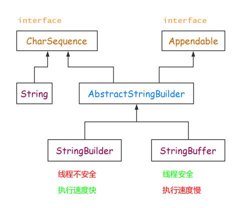

# String、StringBuilder 与 StringBuffer 的区别

## 1. 简介
　　String、StringBuilder 与 StringBuffer 都是 Java 用来处理字符串的类，并且都是 final 类，不允许被继承。

　　三者的继承关系图：


## 2. 区别

　　区别主要在于两个方面，即运行速度和线程安全两个方面。

### 2.1. 运行速度

　　运行速度，也可以说是执行速度。这三者的运行速度从快到慢是：StringBuilder > StringBuffer > String。

　　String 运行速度最慢的原因与 String 的特性有关。String 是字符串常量，即 String 对象一旦创建之后该对象不可更改。对 String 进行操作就是一个不断创建新的对象并将旧的对象回收的过程，这导致效率低，并且会创建大量的内存，所以执行速度很慢。

　　而 StringBuilder 和 StringBuffer 的对象是变量，对变量进行操作就是直接对该对象进行更改，而不进行创建和回收操作，不会创建新的未使用对象，所以速度比 String 快很多。

　　而 StringBuilder 比 StringBuffer 快的原因是，StringBuffer 是需要同步的，所以执行速度慢。

### 2.2. 线程安全

　　在线程安全上，StringBuilder 是线程不安全的，而 StringBuffer 是线程安全的。

　　如果一个 StringBuffer 对象在字符串缓冲区被多个线程使用时，StringBuffer 中很多方法带有 synchronized 关键字，所以可以保证线程是安全的，但 StringBuilder 的方法则没有该关键字，所以不能保证线程安全，有可能会出现一些错误的操作。所以如果要进行的操作是多线程的，那么就要使用 StringBuffer，但是在单线程的情况下，还是建议使用速度比较快的 StringBuilder。

```java
以 StringBuffer 与 StringBuilder 的 append 源码查看差别
StringBuffer：
    //StringBuffer 的方法都加了 synchronized 关键字
    public synchronized StringBuffer append(Object obj) {
        super.append(String.valueOf(obj));
        return this;
    }

StringBuilder：
    //StringBuilder 的方法并没有 synchronized 关键字
    public StringBuilder append(Object obj) {
        return append(String.valueOf(obj));
    }
```

### 2.3. 其他区别

#### 2.3.1. 实现接口

　　StringBuffer 与 StringBuilder 实现了 Serializable 和 CharSequare 两个接口，String 除了这两个接口，还实现了 Comparable< String > 接口，所以 String 的实例可以通过 compareTo 方法进行比较，而 StringBuffer 与 StringBuilder 不行。

```java
public interface CharSequence;

abstract class AbstractStringBuilder implements Appendable, CharSequence;
    
public final class String
    implements java.io.Serializable, Comparable<String>, CharSequence;
    
 public final class StringBuffer
    extends AbstractStringBuilder
    implements java.io.Serializable, CharSequence;
    
public final class StringBuilder
    extends AbstractStringBuilder
    implements java.io.Serializable, CharSequence;
```

#### 2.3.2. 初始化

　　String 可以给字符空赋值，而 StringBuffer 和 StringBuilder 是不可以给字符赋 null 的。

```java
String s = null; // OK 
StringBuffer stringBuffer = null; // OK
StringBuilder stringBuilder = new StringBuilder(null); // Attempt to invoke virtual method 'int java.lang.String.length()' on a null object reference
```

　　看一下 StringBuilder 的构造函数:

```java
    public StringBuilder(String str) {
        super(str.length() + 16);
        append(str);
    }
```

　　所以调用 StringBuilder 的构造函数 StringBuilder(String str) 时，不可以传 null 空字符，StringBuffer 同理。

## 3. 总结
1. **String：**适用于少量的字符串操作的情况。
2. **StringBuilder：**适用单线程下在字符缓冲区进行大量操作的情况。
3. **StringBuffer：**使用多线程下在字符缓冲区进行大量操作的情况。