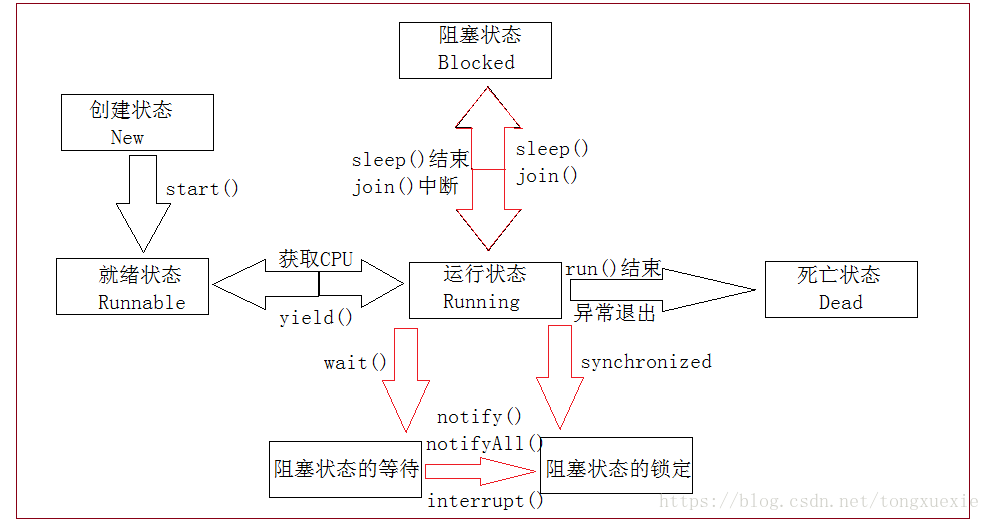

# Java 基础的常见问题

## 1. 面向对象的特性

　　Java 面向对象的四大特性为：封装、继承、抽象、多态。

### 1.1. 封装

　　将类的某些信息隐藏在类内部，不允许外部程序直接访问，而是通过该类提供的方法来实现对隐藏信息的操作和访问。

　　也有包级别的封装，将具有共同特性的类放在一起。

**好处**：

1. 增加复用。
2. 单一职责，减少变动带来的风险。
3. 只能通过规定的方法访问数据。
4. 隐藏类的实例细节，增加安全性、方便修改和实现。

```java
public class Person {
  private String name;
  private int age;

  public Person(String name, int age) {
    this.name = name;
    this age = age;
  }

  public String getName() {
    return this.name;
  }

  public void setName(String name) {
    this.name = name;
  }

  public int getAge() {
    return this.age;
  }

  public void setAge(int age) {
    this.age = age;
  }
}
```

### 1.2. 继承

　　子类就是父类。

　　好处：子类拥有父类的所有属性和方法（除 private 修饰的属性不能拥有）从而实现了代码的复用。

**继承的方式**：

1. 普通类继承普通类、继承抽象类、实现接口
2. 抽象类继承普通类、继承抽象类、实现接口
3. 接口继承接口

**继承的缺点**：

1. 子类依赖于父类，父类发生改变时子类必须改变。
2. 子类会继承一些父类无用的方法，当继承链很长时，子类的方法很臃肿。

```java
public class Student extends Person {
  privete long studentId;
  
  public Student(String name, int age, long studentId) {
    super(name, age);
    this.studentId = studentId;
  }
  
  public long getStudentId() {
    return this.studentId;
  }
  
  public void setStudentId(long studentId) {
    this.studentId = studentId;
  }
}
```

### 1.3. 抽象

　　将具体的物体的特性抽象出来，是对真实世界的一种描述，用于模拟实际事物的特征和行为。

　　抽象最好的体现就是类。

```java
public class Person {
  public String name;
  public int age;

  public Person(String name, int age) {
    this.name = name;
    this age = age;
  }

  public void eat() {}
}
```

### 1.4. 多态

　　不同子类的相同属性的值不同、相同方法的实现不同（通过方法的重写）。

　　好处：避免子类的发展被多态限制。

```java
public interface Cry {
  public void cry();
}

public abstract class Animal implements Cry {
  public void cry();
}

public class Cat extends Animal {
  public void cry() {
    System.out.println("喵喵喵");
  }
}

public class Dog extends Animal {
  public void cry() {
    System.out.println("汪汪汪");
  }
}
```

## 2. switch-case

### 2.1. switch 语句支持的数据类型

　　对于表达式 switch 支持的数据类型：

1. 在 Java 5 之前，switch 只能是 byte、short、char、int 类型，byte、short、char 类型可以在不损失精度的情况下向上转型为 int 类型。

2. 从 Java 5 开始，java 中引入了枚举类型（enum 类型）和 byte、short、char、int 的包装类。

   四个包装类的支持是因为 java 编译器在底层进行了拆箱操作；

   枚举类型的支持是因为枚举类有一个 ordinal 方法，该方法实际上是返回一个 int 类型的数值。

3. 从 Java 7 开始，switch 还可以是 String 类型。

   String 类中因为有一个 hashCode 方法，结果也是返回 int 类型。

　　所以得出的结论是，switch 在底层实现目前只支持整数数据。

## 3. String、StringBuffer、StringBuilder 

　　String、StringBuilder 与 StringBuffer 都是 Java 用来处理字符串的类，并且都是 final 类，不允许被继承。

### 3.1. 三者的区别

1. 运行速度：StringBuilder > StringBuffer > String。

   String 运行速度慢是因为 String 是字符串常量，即 String 对象一旦创建之后该对象不可更改。对 String 进行操作就是一个不断创建新的对象并将旧的对象回收的过程，这导致效率低，并且会创建大量的内存，所以执行速度很慢。

   而 StringBuilder 和 StringBuffer 的对象是变量，对变量进行操作就是直接对该对象进行更改，不需要创建和回收操作，所以比 String 快很多。

   而 StringBuffer 是需要同步的，所以比 StringBuilder 要慢。

2. StringBuffer 是线程安全的，StringBuilder 是线程不安全的。

3. StringBuffer 与 StringBuilder 实现了 Serializable 和 CharSequare 两个接口，String 除了这两个接口，还实现了 Comparable< String > 接口，所以 String 的实例可以通过 compareTo 方法进行比较，而 StringBuffer 与 StringBuilder 不行。

4. String 可以空赋值，而 StringBuffer 和 StringBuilder 是不可以的。

### 3.2. “+” 与 append 的区别

```java
// 相当于 String S1 = “abc”; 运行最快
// 除了结果 S1，没有创建任何新 String 对象
String S1 = “a” + “b” + “c”; 

// 运行最慢
String S1 = “a”; 
      String S2 =  “b”; 
      String S3 =  “c”; 
      String S1=S1+S2+S3；

// 运行中间
StringBuilder Sb = new StringBuilder(“a”).append(“b”).append(“c”);
```

　　String 使用 “+” 来拼接字符串，“+” 的原理是：每遇到一个 “+” ，就创建一个 StringBuilder 对象，然后用 append() 方法，最后调用 StringBuilder 的 toString() 方法返回 String 字符串，在使用之后还需要释放资源，效率低下。而 StringBuilder 的 append 不需要创建新的对象，节省资源。

### 3.3. StringBuffer 是如何实现线程安全的

　　StringBuffer 的方法都加了 synchronzied 关键字。

### 3.4. String 的 concat 方法与 append 的区别

```java
public String concat(String str) {
    int otherLen = str.length();
    if (otherLen == 0) {
        return this;
    }
    int len = value.length;
    /*copyOf数组复制,copyOf()的第二个自变量指定要建立的新e69da5e887aa7a686964616f31333365646261数组长度，
    如果新数组的长度超过原数组的长度，则保留为默认值null或0*/
    char buf[] = Arrays.copyOf(value, len + otherLen);
    //将字符从此字符串复制到目标字符数组,len为数组中的起始偏移量
    str.getChars(buf, len);
    return new String(buf, true);
}
```

　　String 的 concat 使用 copyOf() 和 getChars() 方法来拼接数组的，然后创建新的 String 对象。而 StringBuffer 只会创建一块内存空间，使用 append 添加或 delete 删除其内容时，也是在这一块内存空间中并不会生成多余的空间。

　　所以 StringBuffer 速度是比较快的，而 String 每次生成对象都会对系统性能产生影响，特别当内存中无引用对象多了以后，JVM 的 GC 就会开始工作，对速度的影响一定是相当大的。

## 4. 异常

### 4.1. try-catch-finally

#### 4.1.1. 在 try 中 return 还会不会调用 finally

　　肯定会执行。finally{} 块的代码只有在 try{} 块中包含遇到 System.exit(0); 之类的导致 Java 虚拟机直接退出的语句才会不执行。

　　当程序执行 try{} 遇到 return 时，程序会先执行 return 语句，但并不会立即返回 -- 也就是把 return 语句要做的一切事情都准备好，也就是在将要返回，但未返回的时候，程序把执行流程转去执行 finally 块，当 finally 块执行完成后就直接返回刚才 return 语句已经准备好的结果。

```java
public class Test{
       publicstatic void main(String[] args){
              System.out.println(new Test().test());;
       }

       staticint test(){
              int x = 1;
              try{
                     return x;
              }finally{
                     System.out.println("finally块执行:" + ++x);
              }
       }
}
```

　　输出结果为：

```java
finally块执行:2
1
```

　　因为 Java 会把 return 语句先执行完，把所有需要处理的东西都先处理完成，需要返回的值也都准备好之后，但是还未返回之前，程序流程会转去执行 finally 块，但此时 finally 块中的对 x 变量的修改意见不会影响 return 要返回的值了。

```java
public class Test{
       publicstatic void main(String[] args){
              System.out.println(new Test().test());;
       }
       staticint test(){
              int x = 1;
              try{
                     return x++;
              }finally{
                     System.out.println("finally块执行:" + ++x);
                     return x;
              }
       }
}
```

　　输出结果：

```java
finally 块执行：3
3
```

　　程序在执行 return x++;时，程序会把 return 语句执行完成，知识等待返回，此时 x 的值已经是 2 了，但程序此时准备返回值依然是 1。接下来程序流程转去执行 finally 块，此时程序会再次对 x 自加，于是 x 变成了 3，而且由于 finally 块中也有 return x；语句，因此程序将会直接由这条语句返回了。

#### 4.1.2. throw 和 throws

　　throw 关键字：语句抛出异常；throws 关键字：声明异常（方法抛出异常）。

1. throw 是语句抛出一个异常。

   语法：throw  异常对象；throw e；

2. throws 是方法可能抛出异常的声明。用在声明方法时，表示该方法可能要抛出异常，调用者必须做出处理（捕获或继续抛出）。

   语法：[ ( 修饰符 ]（ 返回值类型 )(方法名)([参数列表])[throws(异常类)]{......}

   public void doA(int a) throws Exception1,Exception3{......}

3. throws 可以单独使用，但 throw 不能。throw 要么和 try-catch-finally 语句配套使用，要么与 throws 配套使用。但 throws 可以单独使用，然后再由处理异常的方法捕获。

4. throw 语句用在方法体内，表示抛出异常，由方法体内的语句处理。

   throws 语句用在方法声明后面，表示再抛出异常，由调用这个方法的上一级方法种的语句来处理，必须做出处理（捕获或继续声明）。

5. throws 主要是声明这个方法会抛出这种类型的异常，使其他地方调用它时知道要捕获这个异常，使得提醒必须做出处理。否则编译时不会通过的。

   throw 是具体向外抛异常的动作，所以它是抛出一个异常实例。

6. throws 表示出现异常的一种可能性，并不一定会发生这些异常；throw 则是抛出了异常，执行 throw 则一定抛出了某种异常对象。

7. 两者都是消极处理异常的方式，只是抛出或者可能抛出异常，但是不会由函数去处理异常，真正的处理异常由函数的上层调用处理。

### 4.2. error 和 exception

#### 4.2.1. Error 和 Exception 的父类子类


#### 4.2.2. Error 和 Exception 的区别

　　Error：Error 类对象由 Java 虚拟机生成并抛出，大多数错误与代码编写者所执行的操作无关。例如，Java 虚拟机运行错误（Virtual MachineError），当 JVM 不再有继续执行操作所需的内存资源时，将出现 OutOfMemoryError。这些异常发生时，Java 虚拟机（JVM）一般会选择线程终止；还有发生在虚拟机视图执行应用时，如类定义错误（NoClassDefFoundError）、链接错误（LinkageError）。这些错误时不可查的，因为它们在应用程序的控制和处理能力之外，而且绝大多数时程序运行时不允许出现的状况。对于设计合理的应用程序来说，即使确实发生了错误，本质上也不应该试图去处理它所引起的异常状态。在 Java 种，错误通常是使用 Error 的子类描述。

　　Exception：在 Exception 分支中有一个重要的子类 RuntimeException（运行时异常），该类型的异常自动为你所编写的程序定义 ArrayIndexOutOfBoundsException（数组下标越界）、NullPointerException（空指针异常）、ArithmeticException（算术异常）、MissingResourceException（丢失资源）、ClassNotFoundException（找不到类）等异常，这些异常是不检查异常，程序中可以选择捕获异常，也可以不处理。这些异常一般是由程序逻辑错误引起的，程序应该从逻辑角度尽可能避免这类异常的发生；而 RuntimeException 之外的异常统称为非运行时异常，类型上属于 Exception 类及其子类，从程序语法角度讲是必须进行处理的异常，如果不处理，程序就不能编译通过。如 IOException、SQLException 等以及用户自定义的 Exception 异常，一般情况下不自定义检查异常。

#### 4.2.2. 常见的 Exception

**运行时异常（RuntimeException）**：

1. NullPointException：空指针异常。
2. ClassCastException：类型强制转换异常。
3. IllegalArgumentException：传递非法参数异常。
4. IndexOutOfBoundsException：下标越界异常。
5. NumberFormatException：数字格式异常。

**非运行时异常**：

1. ClassNotFoundException：找不到指定 class 的异常。
2. IOException：IO 操作异常。

#### 4.2.3. 常见的 Error

1. NoClassDefFoundError：找不到 class 定义异常。
2. StackOverflowException：深递归导致栈被耗尽而抛出的异常。
3. OutOfMemoryError：内存溢出异常。

#### 4.2.4. CheckedException、RuntimeException 的区别

　　异常表示程序运行过程中可能出现的非正常状态，运行时异常表示虚拟机的通常操作中可能遇到的异常，是一种常见运行错误，只要程序设计得没有问题通常就不会发生。受检异常跟程序运行得上下文环境有关，即使程序设计无误，仍然可能因使用得问题而引发。Java 编译器要求方法必须声明抛出可能发生的受检异常，但是并不要求必须声明抛出未被捕获的运行时异常。

#### 4.2.5. 异常处理的注意事项

　　异常和继承一样，是面向对象编程设计中经常被滥用的东西，在 Effective Java 中对异常的使用给出了以下指导原则：

* 不要讲异常处理用于正常的控制流（设计良好的 API 不应该墙皮它的调用者为了正常的控制流而使用异常）
* 对可以恢复的情况使用受检异常，对编程错误使用运行时异常。
* 避免不必要的使用受检异常（可以通过一些状态检测手段来避免异常的发生）
* 优先使用标准的异常
* 每个方法排除的异常都要有文档
* 保持异常的原子性
* 不要在 catch 中忽略捕获到的异常

1. 尽量不要捕获类似 Exception 这样通用的异常，而应该捕获特定的异常。

   软件工程是一门协作的异常，在日常开发中我们有义务使自己的代码能更直观、清晰的表达出我们想要表达的信息，但是如果你什么异常都用了 Exception，那别的开发同事就不能一眼得知这段代码实际翔太捕获的异常，并且这样的代码也会捕获到可能你希望它抛出而不希望捕获的异常。

2. 不要 “吞” 了异常

   如果我们捕获了异常，不把异常抛出，或者没有写到日志里，那会出现什么情况？线上除了 bug 莫名其妙的没有任何的信息，你都不知道哪里出错以及出错的原因。这可能会让一个简单的 bug 变得难以诊断。而且有些同学比较喜欢用 catch 之后用 e.printStackTrace()，在我们产品中通常不推荐用这种方法，一般情况下这样是没有问题的，但是这个方法输出的是个标准错误流。

   比如是在分布式系统中，发生异常但是找不到 stacktrace。所以最好是输入到日志里。我们产品可以自定义一定的格式，将详细的信息输入到日志系统中，适合清晰高效的排查错误。

3. 不要延迟处理异常

   比如有个方法，参数是个 name，喊出内部调用了别的好几个方法，其实 name 传的是 null 值，但是没有在进入这个方法或者这个方法一开始就处理这个情况，而是在调用了别的好几个方法然后爆出这个空指针。这样的话明明出错堆栈信息只需要抛出一点点信息就能定位到这个错误所在的地方，经过了好多方法之后可能就是一坨堆栈信息。

4. 只在需要 try-catch 的地方 try-catch，try-catch 的范围能小则小

   只在必要的代码段使用 try-catch，不要不分青红皂白 try 住一坨代码，因为 try-catch 中的代码会影响 JVM 对代码的优化，例如重排序。

5. 不要通过异常来控制程序流程

   一些可以用 if/else 的条件语句来判断例如 null 值等，就不要用异常，异常肯定是比一些条件语句低效的。而且每实例化一个 Exception 都会对栈进行快照，相对而言这是一个比较重的操作，如果数量过多开销就不能被忽略。

6. 不要在 finally 代码块中处理返回值或者直接 return

   在 finally 中 return 或者处理返回值会让发生很诡异的事情，比如覆盖了 try 中的 return 或者屏蔽的异常。

## 5. Java 的基本数据类型

https://blog.csdn.net/boss2967/article/details/80108112

https://www.cnblogs.com/1130136248wlxk/articles/5105524.html

https://www.cnblogs.com/dubo-/p/5565677.html

## 6. 进程与线程

### 6.1. 线程的状态有哪些？

　　线程的五大状态分别为：创建状态（New）、就绪状态（Runnable）、运行状态（Running）、阻塞状态（Blocked）、死亡状态（Dead）。



1. 新建状态：即单纯地创建一个线程，创建线程有三种方式。
2. 就绪状态：在创建了线程之后，调用 Thread 类的 start() 方法来启动一个线程，即表示线程进入就绪状态！
3. 运行状态：当线程获得 CPU 时间，线程才从就绪状态进入到运行状态！
4. 阻塞状态：线程进入运行状态后，可能由于多种原因让线程进入阻塞状态，如：调用 sleep() 方法让线程睡眠，调用 wait() 方法让线程等待，调用 join() 方法、suspend() 方法（已被弃用）以及阻塞式 IO 方法。
5. 死亡状态：run() 方法的正常退出就让线程进入到死亡状态，还有当一个异常未被捕获而终止了 run() 方法的执行也将进入到死亡状态。

### 6.2. 如何实现线程

#### 6.2.1. 继承 Thread 类创建线程

　　使用继承 Thread 类创建线程时，受限需要创建一个类继承 Thread 类并覆写 Thread 类的 run() 方法，在 run() 方法中，要写线程要执行的任务。

　　具体具体说明，代码如下所示：

```java
class MyThread extends Thread{
	@Override
	public void run() {
		System.out.println("自己创建的线程");
	}
}
```

　　创建了继承于 Thread 类的子类 MyThread 类以及覆写了 Thread 类的 run() 方法后，就相当于有了线程的主体类，接下来需要产生线程类的实例化对象然后调用 run() 方法，但实际上只是嗲用了 run() 方法并不是启动一个线程，真正启动一个线程，需要调用的是 Thread 类的 start() 方法，而 start() 方法会自动调用 run() 方法，从而启动一个线程。

　　代码如下所示：

```java
class MyThread extends Thread{
	@Override
	public void run() {
		System.out.println("自己创建的线程");
	}
}
public class Genericity {
	public static void main(String[] args) {
		//实例化一个对象
		MyThread myThread=new MyThread();
		//调用Thread类的start()方法
		myThread.start();
		//在main方法中打印一条语句
		System.out.println("main方法");
	}
}
```

　　运行结果：

```java
main方法
自己创建的线程
```

　　首先说明一点：main 方法其实也是一个线程，是该进程的住线程。

　　在使用多线程技术时，代码的运行结果与代码调用的顺序无关，因为线程是一个子任务，CPU 以不确定的方式或者说以随机的时间来调用线程中的 run() 方法，所以会出现先执行创建的线程，但是先打印语句 “main 方法”。

　　注意：一个对象多次调用 start() 方法时，会出现 Excepction in thread "main" java.lang.IllegalThreadStateException 异常。

#### 6.2.2. 实现 Runnable 接口创建线程

　　Thred 类的核心功能就是进行线程的启动，但一个类为了实现多线程直接继承 Thread 类时出现的问题就是：单继承的局限性！，所以 Java 中还提供了另一种实现多线程的方法：实现 Runnable 接口来创建多线程。

　　Runnable 接口只有一个抽象方法就是 run() 方法，如何使用 Runnable 接口去创建线程：

1. 第一步：定义一个类来实现 Runnable 接口的抽象方法 run() 方法。Thread 类有一个 Thread 类的构造方法 public Thread(Runnable target) 方法，参数用于接收 Runnable 接口的实例化对象，所以在 Runnable 接口与 Thread 类间就建立起了关系，从而可以调用 Thread 的 start() 方法启动一个线程。
2. 第二步：利用 Thread 类的 public Thread(Runnable target) 构造方法与 Runnable 接口建立关系实例化 Thread 类的对象。
3. 第三步：调用 Thread 类的 start() 方法启动线程。

　　具体代码如下：

```java
//定义一个类MyThread实现Runnable接口，从而覆写run()方法
class MyThread implements Runnable{
	@Override
	public void run() {
		System.out.println("利用Runnable接口创建线程");
	}
}
public class Genericity {
	public static void main(String[] args) {
		//实例化Runnable接口的对象，其实也可以实例化MyThread类的对象，因为可以向上转型
		Runnable runnable=new MyThread();//也可以改为 MyThread runnable=new MyThread();
		//实例化Thread类的对象
		Thread thread=new Thread(runnable);
		//调用Thread类的start()方法
		thread.start();
		//main线程中打印的一条语句
		System.out.println("main方法");
	}
}
```

　　运行结果：

```java
main方法
利用Runnable接口创建线程
```

#### 6.2.3. 实现 Callable 接口的源码

　　Runnable 接口的 run() 方法没有返回值，而 Callable 接口中的 call() 方法有返回值，若某些线程执行完成后需要一些返回值的时候，就需要用 Callable 接口创建线程。

　　使用 Callable 接口创建线程时，需要以下步骤：

1. 自定义一个类 MyThread，实现 Callable 接口并覆写 Callable 接口的 call() 方法。
2. 利用 MyThread 类实例化 Callable 接口的对象。
3. 利用 FutureTask 类的构造方法 public FutureTask(Callable< V >  callable)，将 Callable 接口的对象传给 FutureTask 类。
4. 将 FutureTask 类的对象隐式地向上转型，从而作为 Thread 类的 public Thread(Runnable runnable) 构造方法的传输。
5. 这样就建立了 Callable 接口与 Thread 类之间的关系，再调用 Thread 类的 start() 方法。

　　代码实现如下所示：

```java
import java.util.concurrent.Callable;
import java.util.concurrent.ExecutionException;
import java.util.concurrent.FutureTask;
 
//1.定义一个类MyThread实现Callable接口，从而覆写call()方法
class MyThread implements Callable<String>{
	@Override
	public String call() throws Exception {
		return "Callable接口创建线程";
	}
}
public class Genericity {
	public static void main(String[] args) throws InterruptedException, ExecutionException {
		//2.利用MyThread类实例化Callable接口的对象
		Callable callable=new MyThread();
		//3.利用FutureTask类的构造方法public  FutureTask(Claaable<V> callable)
		//将Callable接口的对象传给FutureTask类
		FutureTask task=new FutureTask(callable);
		//4.将FutureTask类的对象隐式地向上转型
		//从而作为Thread类的public Thread(Runnable runnable)构造方法的参数
		Thread thread=new Thread(task);
		//5.调用Thread类的start()方法
		thread.start();
		//FutureTask的get()方法用于获取FutureTask的call()方法的返回值，为了取得线程的执行结果
		System.out.println(task.get());
	}
}
```

　　运行结果：

```java
Callable接口创建线程
```

### 6.3. start 与 run 的区别

**start()**：

　　使该线程开始执行，Java 虚拟机调用该线程的 run 方法。

　　结果是两个线程并发的运行；当前线程（从调用返回给 start 方法）和另一个线程（执行其 run 方法）。

　　多次启动一个线程是非法的。特别是当线程已经结束执行后，不能再重新启动。

　　用 start 方法来启动线程，真正实现了多线程运行，这是无需等待 run 方法体代码执行完毕，而是直接继续执行下面的代码。

　　通过调用 Thread 类的 start() 方法来启动一个线程，这时此线程处于就绪（可运行）状态，并没有运行，一旦得到 cpu 时间片，就开始执行 run() 方法，这里方法 run() 称为线程体，它包含了要执行的这个线程的内容，Run 方法运行结束，Run 方法运行结束，此线程随即终止。

**run()**

　　如果该线程是使用独立的 Runnable 运行对象构造的，则调用该 Runnable 对象的 run 方法；否则，该方法不执行任何操作并返回。

　　Thread 的子类应该重写该方法。

　　run() 方法只是类的一个普通方法而已，如果直接调用 run 方法，程序中依然只有主线程这一个线程，其程序执行路径还是只有一条，还是要顺序执行，还是要等待 run 方法体执行完毕后才可继续执行下面的代码，这样就没有达到写线程的目的。

**总结**

　　调用 start() 方法方可启动线程，而 run() 方法只是 thread 的一个普通方法调用，还是在主线程里执行。

### 6.4. 线程与进程的区别

https://segmentfault.com/a/1190000018608380?utm_source=tag-newest

　　进程独占内存空间，保持各自运行状态，相互间不干扰且可以互相切换，为并发处理任务提供了可能。

　　线程共享进程的内存资源，相互间切换更快堵，支持更细粒度的任务控制，使进程内的子任务得以并发执行。

　　线程是操作系统中可调度的最小单元，它的资源首先，不可能无限制产生，存在资源消耗，线程的创建和销毁都会有相应的开销。操作系统会通过时间片轮转的方式调度每个线程，因此线程不适绝对的并行，而是因为轮转速度太快，看起来像并行。若频繁创建和销毁线程，会造成大量资源开销，可以通过使用线程池来解决，线程池中会缓存一定数量的线程，当需要使用线程时直接复用而不需要重新创建，这样就避免因频繁创建和销毁线程所带来的资源开销。

　　进程是资源分配的最小单位，线程是程序执行（CPU 调度）的最小单位。所有与进程相关的资源，都被记录在 PCB 中，进程是抢占处理机的调度单元，线程属于某个进程，共享其资源。


1. 进程有自己的独立地址空间，每启动一个进程，系统就会为它分配地址空间，建立数据表来维护代码段、堆栈段和数据段，这种操作非常昂贵。

   线程是共享进程中的数据的，使用相同的地址空间，因此 CPU 切换一个线程的花费远比进程要小芬多，同时创建一个线程的开销也比进程要小很多。

2. 线程之间的通信更方便，同一进程下的线程共享全局变量、静态变量等数据，而进程之间的通信要以通信的方式（IPC）进行。不过如何处理好同步与互斥是编写多线程程序的难点。
3. 但是多进程程序更健壮，多线程程序只要有一个线程死掉，整个进程也死掉了，而一个进程死掉并不会对另外一个进程造成影响，因为进程有自己独立的地址空间。


**总结**

1. 线程不能看做独立应用，而进程可看做独立应用。
2. 进程有独立的地址空间，互相不影响，线程只是进程的不同执行路径。
3. 线程没有独立的地址空间，多进程的程序比多线程程序健壮。
4. 进程的切换比线程的切换开销大。

**Java 进程和线程的关系**

1. Java 对操作系统提供的功能进程封装，包括进程和线程。
2. 运行一个程序会产生一个进程，进程包含至少一个线程。
3. 每个进程对应一个 JVM 实例，多个线程共享 JVM 里的堆。
4. Java 采用单线程编程模型，程序会自动创建主线程。
5. 主线程可以创建子线程，原则上要后于子线程完成执行。

### 6.5. 进程间通信

https://www.cnblogs.com/fnlingnzb-learner/p/11664000.html

https://blog.csdn.net/truong/article/details/39228249/

### 6.6. 线程间通信

https://www.jianshu.com/p/8d40ef55e301

https://blog.csdn.net/wlddhj/article/details/83793709

https://blog.csdn.net/Hadwin1991/article/details/73527835

### 6.7. 线程的常用方法

#### 6.7.1. sleep：线程休眠

https://blog.csdn.net/tongxuexie/article/details/80145663

### 6.8. 线程池是什么？

　　Java 中创建线程池很简单，只需要调用 Executors 中相应的便捷方法即可。

　　线程池的好处就是可以方便的管理线程，也可以减少内存的消耗，使用线程池，主要解决如下问题：

1. 创建/销毁线程伴随着系统开销，过于频繁的创建/销毁线程，会很大程度上影响处理效率。
2. 线程并发数量过多，抢占系统资源，从而导致系统阻塞。
3. 能够容易的管理线程，比如：线程延迟执行、执行策略等。

### 6.9. 线程池分为几类？

#### 6.9.1. CacheThreadPool：可缓存线程池

1. 线程数无限制（没有核心线程，全部都是非核心线程）
2. 有空闲线程则复用空闲线程，若无空闲线程则新建线程。
3. 终止并从缓存中移除那些已有 60 秒钟未被使用的线程。
4. 一定程序上减少频繁创建/销毁线程，减少系统开销。

　　适用场景：适用于耗时少，任务量大的情况。

　　创建方法：

```java
ExecutorService cachedThreadPool = Executors.newCachedThreadPool();
```

#### 6.9.2. FixedThreadPool：定长线程池

1. 有核心线程，核心线程数就是线程的最大数量（没有非核心线程）
2. 可控制线程最大并发数（同时执行的线程数）
3. 超出的线程会在队列中等待。
4. 任意时间点，最多只能有固定数目的活动线程存在，此时如果有新的线程要建立，只能放在另外的队列中等待，直到当前的线程中某个线程终止直接被移出。

　　适用于很稳定很固定的正规并发线程，多用于服务器。

　　创建方法：

```java
//nThreads => 最大线程数即maximumPoolSize
ExecutorService fixedThreadPool = Executors.newFixedThreadPool(int nThreads);
 
//threadFactory => 创建线程的方法！
ExecutorService fixedThreadPool = Executors.newFixedThreadPool(int nThreads, ThreadFactory threadFactory);
```

#### 6.9.3. ScheduledThreadPool：定时线程池

1. 支持定时及周期性任务执行。
2. 有核心线程，也有非核心线程。
3. 非核心线程数量为无限大。

　　适用场景：适用于执行周期性任务。

　　创建方法：

```java
//nThreads => 最大线程数即maximumPoolSize
ExecutorService scheduledThreadPool = Executors.newScheduledThreadPool(int corePoolSize);
```

#### 6.9.4. SingleThreadPool：单线程化的线程池

1. 有且仅有一个工作线程执行任务。
2. 所有任务按照指定顺序执行，即遵循队列的入队出队规则。

　　适用场景：适用于有顺序的任务应用场景。

　　创建方法：

```java
ExecutorService singleThreadPool = Executors.newSingleThreadPool();
```

　　这四种常见的线程池其底部都是使用 ThreadPoolExecutor 来实现的。

## 7. 对象的引用类型有哪些？

　　从 JDK 1.2 开始，Java 中的引用类型分为四种，分别是：1. 强引用（StrongReference）、2. 软引用（SoftReference）、3. 弱引用（WeakReference）、4. 虚引用（PhantomReference）

### 7.1. 强引用 StrongReference

　　这种引用是平时开发中最常用的，例如 String strong = new String ("Strong Reference")，当一个实例对象具有强引用时，垃圾回收器不会回收该对象，当内存不足时，宁愿抛出 OutOfMemoryError 异常也不会回收强引用，因为 JVM 认为强引用的对象是用户正在使用的对象，它无法分辨出到底该回收哪个，强行回收有可能导致系统严重错误。

### 7.2. 软引用 SoftReference

　　如果一个对象只有软引用，那么只有当内存不足时，JVM 才会去回收该对象，其他情况不会回收。

　　软引用可以结合 ReferenceQueue 来使用，当由于系统内存不足，导致软引用的对象被回收了，JVM 把这个软引用加入到与之相关的联的 ReferenceQueue 中。

```java
ReferenceQueue referenceQueue = new ReferenceQueue();
SoftReference<Bppk> softReference = new SoftReference<>(new Book(),referenceQueue);
Book book = softReference.get();
Reference reference = referenceQueue.poll();
```

　　当系统内存不足时，触发 gc，这个 Book 就会被回收，reference 将不为 null。

### 7.3. 弱引用 WeakReference

　　只有弱引用的对象，当 JVM 触发 gc 时，就会回收该对象，与软引用不同的是，不管是否内存不足，弱引用都会被回收。弱引用可以结合 ReferenceQueue 来使用，当由于系统触发 gc，导致软引用的对象被回收了，JVM 会把这个弱引用加入到与之相关联的 ReferenceQueue 中，不过由于垃圾收集线程的优先级很低，所以弱引用不一定会被很快回收。

```java
ReferenceQueue referenceQueue = new ReferenceQueue();
WeakReference<Book> weakReference = new WeakReference(new Book(),referenceQueue);
Book book = softReference.get();
Reference reference = referenceQueue.poll();
```

### 7.4. 虚引用 PhantomReference

　　如果一个对象只有虚引用在引用它，垃圾回收器是可以在任意时候对其进行回收的，虚引用主要用来跟踪对象对垃圾回收器回收的活动，当被回收时，JVM 会把这个弱引用加入到与之相关联的 ReferenceQueue 中。与软引用和弱引用不同的是，虚引用必须有一个与之关联的 ReferenceQueue，通过 phantomReference.get() 得到的值为 null，如果没有 ReferenceQueue 与之关联就没有什么存在的价值了。

```java
PhantomReference<Book> phantomReference = new PhantomReference<>(new Book(), referenceQueue);
Book book = phantomReference.get(); // 此值为 null
Reference reference = referenceQueue.poll();
```


### 2. ArrayList 和 LinkedList 有什么区别？


### 3. 什么是 HashMap


### 4. 用过哪些 Map 类，都有什么区别？


### 5. JAVA 8 的 ConcurrentHashMap 为什么放弃了分段所，有什么问题吗？如果你来设计，你如何设计？


### 6. HashMap、ConcurrentHashMap 原理


### 7. 有没有有顺序的 Map 实现类，如果有，他们是怎么保证有序的。


### 8. 抽象类和接口的区别，类可以集成多个类吗？接口可以继承多个接口吗？类可以实现多个接口吗？


### 9. IO 模型有哪些，讲讲你理解的 nio，它和 bio、aio 的区别是啥？谈谈 reactor 模型。


### 10. 反射的原理，反射创建类实例的三种方式是什么？


### 11. 反射中，Class.forName 和 ClassLoader 区别。


### 12. Java 动态代理实现与原理详细分析。


### 13.描述动态代理的几种实现方式，分别说出相应的优缺点。


### 14. 动态代理与 cglib 实现的区别。


### 15. 为什么 CGlib 方式可以对接口实现代理。


### 16. final 的用途


### 17. 写出三种单例模式实现


### 18. 如何在父类中为子类自动完成所有的 hashcode 和 equals 实现？这么做有何优劣。


### 19. 请结合 OO 设计理念，谈谈访问修饰符 public 、private 、protected、default 在应用设计中的作用。


### 20. 深拷贝和浅拷贝的区别。


### 21. 数组和链表数据结构描述，各自的时间复杂度。


### 23. 在自己的代码中，如果创建一个 java.lang.String 类，这个类是否可以被类加载器加载？为什么？


### 24. 说一说你对 java.lang.Object 对象中 hashcode 和 equals 方法的理解。在什么场景下需要重新实现这两个方法。


### 25. 在 jdk 1.5 中，引入了泛型，泛型的存在是用来解决什么问题的。


### 26. 这样的 a.hashcode() 有什么用，与 a.equals(b) 有什么关系？


### 27. 有没有可能 2 个不想等的对象有相同的 hashcode。


### 28. Java 中的 HashSet 内部是如何工作的。


### 29. 什么是序列化，怎么序列化，为什么序列化，反序列化会遇到什么问题，如何解决？


### 30. Java 8 的新特性


### 31. 强引用、软引用、弱引用、幻想引用有什么区别？


### 32. java 运算符与（&） 、非（～）、或（|）、异或（^）


