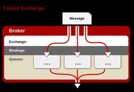
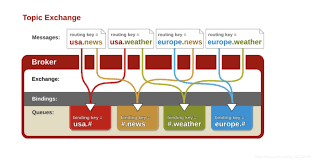

# RabbitMQ 知识

## 概述

　　官方地址：https://www.rabbitmq.com/

　　官方教程：https://www.rabbitmq.com/tutorials/tutorial-one-java.html

　　MQ 全称为 Message Queue，消息队列（MQ）是一种应用程序对应用程序的通信方法，也就是信息中间件。

　　RabbitMQ 则是 MQ 的一种开源实现，遵循 AMQP（高级消息队列协议）协议，特点是消息转发是非同步并且可靠的。

　　MQ 的模型：

　　RabbitMQ 比 MQ 模型有更加详细的模型概念：

　　RabbitMQ 主要用来处理应用程序之间消息的存储与转发，可让消费者和生产者解耦，消息是基于二进制的。

## 概念

### 信道

　　引入信道的原因：RabbitMQ 之间使用 TCP 连接，每次发布消息都要连接 TCP，这样会导致连接资源严重浪费，从而造成服务器性能瓶颈，所以引入信道，将需要发布消息的线程都包装成一条信道在 TCP 中传输，这样 RabbitMQ 为所有的线程只用一条 TCP 连接即可。

　　一条 TCP 连接可以支持多个信道，模型如下：

### 队列

　　消息队列用来保存消息直到发送给消费者。

　　它是消息的容器，也是消息的终点。

　　一个消息可投入一个或多个队列。

　　消息一直在队列里面，等待消费者连接到这个队列将其取走。

### 绑定

　　绑定用于消息队列和交换器之间的关联。

　　一个绑定就是基于路由键将交换器和消息队列连接起来的路由规则，所以可以将交换器理解成一个由绑定构成的路由表，如下：

### 交换器

　　向 RabbitMQ 发送消息，实际上是把消息发到交换器上，再由交换器根据相关路由规则发到特定队列上，在队列上监听的消费者就可以进行消费了。所以生产者发送消息时会经有交换器（Exchange）来决定要给哪个队列（Queue）。

　　目前 RabbitMQ 共有四种烈性：direct、fanot、topic、headers。

#### direct 交换器

　　生产者传送的消息中的路由键（ routing key ）必须和 Queue Binding 中的 Binding key 一致，交换器（exchange）就将消息发到对应的队列（queue）中。它是完全匹配、单播的模式。

#### fanout 交换器

　　每个发送到 fanout 交换器中的消息，它不会去匹配路由键，直接把消息投递到所有绑定到 fanout 交换器中的队列上，它就像一个广播站一样，它会向所有收听广播的用户发送消息。简单来说就是轮流把消息放进每个队列中。

　　对应到系统上，它允许你针对一个消息作不同操作，比如用户上传了一张新的图片，系统要同时对这个事件进行不同的操作，比如删除旧的图片缓存、增加积分奖励等等，这样旧大大降低了系统之间的耦合度。

#### topic 交换器

　　topic 交换器有点类似于 direct 交换器，但是 topic 交换器使用部分匹配比 direct 交换器多了更多弹性。

　　它通过模式匹配分配消息的路由键属性，将路由键和某个模式进行匹配，此时队列需要绑定到一个模式上。它将路由键和绑定键的字符串切分成单词，这些单词之间用点隔开。

　　它同样也会识别两个通配符：符号 “ # ” 和符号 “ * ”：

* “ # ” 匹配 0 个或多个单词。
* “ * ” 匹配不多不少一个单词。

#### header 交换器

　　header 类型路由规则和上面的三个都不一样，header 交换器不是通过路由键（routing key）进行路由的，而是通过消息的 headers。

　　而且 headers 交换器和 direct 交换器完全一致，但性能差很多，目前几乎用不到了。

#### 交换器小结

　　RabbitMQ 的交换器（exchange）的作用是路由消息，可以根据应用场景的不同选择合适的交换机。

　　如果需要精准路由到队列，或者对消息进行单一维度分类（只对日志的严重程度这一维度进行分配）可以使用 direct 类型交换器；如果需要广播消息，可以使用 fanout 类型交换器；如果对消息进行多维度分类，可以使用 topic 交换器；如果消息归类的逻辑包含了较多的 AND/OR 逻辑判断，可以使用 header 交换器（开发中很少用到 header 交换器）。　　

## 消息确认

　　在一些场合，如转账、付费时每一条消息都必须保证成功的被处理。

　　AMQP 时金融级的消息队列协议，有很高的可靠性。

　　RabbitMQ 通过消息确认来保证消息被成功处理。消息确认可以分为两种：

1. 生产者发送消息到服务（ Broker ）时，Broker 给生产者发送确认回执，用于告诉生产者消息已被成功发送到 Broker。
2. 消费者接收到 Broker 发送的消息时，消费者给 Broker 发送确认回执，用于通知消息已成功被消费者接收。

### 生产者端消息确认

　　生产者端的消息确认：当生产者将消息发送给 Broker，Broker 接收到消息给生产者发送确认回执。

　　生产者端的消息确认有两种方式：tx 机制和 confirm 模式。

#### tx 机制

　　tx 机制可以叫做事务机制，RabbitMQ 中有三个与 tx 机制的方法：txSelect()、txCommit() 和  txRollback()。channel.txSelect()  用于将当前 channel 设置成 transaction 模式，channel.txCommit() 提交事务，channel.txRollback() 回滚事务。

　　使用 tx 机制，首先要通过 txSelect 方法开启事务，然后发布消息给 broker 服务器，如果 txCommit 提交成功了，则说明消息成功被 broker 接收了，如果在 txCommit 执行之前 broker 异常奔溃或者由于其他原因抛出异常，这个时候就可以捕获异常，通过 tcRollback 回滚事务。

#### confirm 模式

　　有三个与 confirm 模式像是的方法：ConfirmSelect()、WaitForConfirms() 和 WaitForConfirmsOrDie()。channel.ConfirmSelect() 表示开启 Confirm 模式，channel.WaitForConfirms() 等待所有消息确认，如果所有的消息都被服务端成功接收返回 true，只要有一条没有被成功接收就返回 false。channel.WaitForConfirmsOrDie() 和 WaitForConfirms 作用类似，也是等待所有消息确认，区别在于该方法没有返回值（void），如果有任意一条消息没有被成功接收，还放啊会立即抛出一个 OperationInterrupedException 类型异常。

### 消费者消息确认

　　从 Broker 发送到消费者时，RabbitMQ 提供了两种消息确认的方式：自动确认和显示确认。

#### 自动确认

　　自动确认：当 RabbitMQ 将消息发送给消费者后，消费者端接收到消息后，不等待消息处理结束，立即自动回送一个确认回执。

　　自动确认的用法十分简单，设置消费放啊的参数 autoAck 为 true 即可。

　　Broker 会在接收到确认回执时删除消息，如果消费者接收到消息并返回了确认回执，然后这个消费者在处理消息时挂了，那么这条消息就再也找不回来了。

#### 显示确认

　　自动确认可能会出现消息丢失的问题，而显示确认就会避免这个问题，显示确认可以让消费者在接收消息时不立即返回确认回执，等到消息处理完成后（或者完成一部分的逻辑）再返回确认回执，这样就保证消费端不会丢失消息了！

　　使用显示确认也比较简单，首先将 resume 方法的参数 autoACK 设置为 false，然后在消费端使用代码 channel.BasicAck() / BasicReject() 等方法来确认和拒绝消息。

　　使用显示确认时，如果消费者处理完消息不发送确认回执，那么消息不会被删除，消息的状态一直是 Unacked，这条消息也不会再发送给其他消息者。如果一个消费者在处理消息时尚未发送确认回执的情况下挂掉了，那么消息会被重新放入队列（ 状态从 Unacked 变成 Ready ），有其他消费者时，消息会发送给其他消费者。

## 消息持久化与优先级

### 消息持久化（Persistent）

　　把 exchange 和 queue 的 durable 属性设置为 true，重启 RabbitMQ 服务时，exchange 和 queue 也会恢复。

　　如果 queue 设置 durable = true，RabbitMQ 服务重启后队列虽然会存在，但是队列内的消息会全部丢失。这时就会需要实现消息的持久化。

　　消息的持久化实现的方法很简单：将 exchange 和 queue 都设置 durable = true，然后在消息发布的时候设置 persistent = true 即可。

#### 消息优先级（Priority）

　　queue 时先进先出的，即先发送的消息，先被消费。设置了优先级后，优先级高的消息就会优先被消费。

　　消息实现优先级控制的实现方式是：首先在声明 queue 是设置队列的 x-max-priority 属性，然后在 publish 消息时，设置消息的优先级等级即可。x-max-priority 设置的是队列优先级的最大值。

## RabbitMQ 的消费模式

### EventingBasicConsumer 介绍

### BasicGet 方法介绍

### Qos（服务质量） 介绍

## 参考文章

[快速掌握 RabbitMQ (二)--四种 Exchange 介绍及代码演示](https://www.cnblogs.com/wyy1234/p/10837615.html)