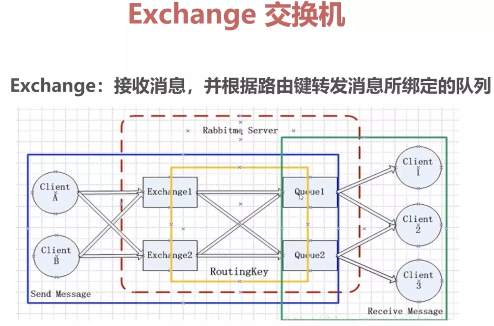

# RabbitMQ 知识

## 1. 概述

　　官方地址：https://www.rabbitmq.com/

　　官方教程：https://www.rabbitmq.com/tutorials/tutorial-one-java.html

### 什么是 MQ

　　MQ 全称为 Message Queue，即消息队列。本质是个队列，FIFO 先进先出，祝不过队列中存放的内容是 message 而已。

　　其主要用途：不同进程 process / 线程 thread 之间通信。

　　为什么会产生消息队列？原用：

1. 不同进程（process）之间传递消息时，两个进程之间耦和程度过高，改动一个进程，引发必须修改另一个进程，为了隔离这两个进程，在两进程间抽离出一层（一个模块），所有两进程之间传递的消息，都必须通过消息队列来传递，单独修改一个进程，不会影响另一个。
2. 不同进程（process）之间传递消息时，为了实现标准化，将消息的格式规范化了，并且某一个进程接收的消息太多，一下子无法处理完，并且也有先后顺序，必须对收到的消息进行排队，因此诞生了事实上的消息队列。

　　MQ 框架非常多，比较流行的有 RabbitMQ、ActiveMq、ZeroMq、Kafka，以及阿里开源的 RocketMQ。

　　消息队列（MQ）是一种应用程序对应用程序的通信方法，也就是信息中间件。应用程序通过读写出入队列的消息（针对应用程序的数据）来通信，而无需专用连接来链接它们。消息传递值得时程序之间通过在消息中发送数据进行通信，而不是通过直接调用彼此来通信，直接调用通常适用于诸如远程过程调用的技术。排队指的是应用程序通过队列来通信。队列的使用除去了接收和发送应用程序同时执行的要求。

　　MQ 的模型：


### RabbitMQ

　　RabbitMQ 则是一个在 AMQP （消息队列的一个协议）基础上完整的、可复用的企业消息系统。

　　RabbitMQ 是使用 Erlang 语言开发的。

　　RabbitMQ 则是 MQ 的一种开源实现，遵循 AMQP（Advanced Message Queue，高级消息队列协议）协议，特点是消息转发是非同步并且可靠的。

　　RabbitMQ 主要用来处理应用程序之间消息的存储与转发，可让消费者和生产者解耦，消息是基于二进制的。

　　RabbitMQ 作为一个消息代理，主要负责接收、存储和转发消息，它提供了可靠的消息机制和灵活的消息路由，并支持消息集群和分布式部署，常用于应用解耦、耗时任务队列、流量削锋等场景。

　　大数据处理场景需要 kafka，如果需要较高性能和确认机制，数据的可靠性和活跃的社区，支持消息的持久化于中间件的高可用部署，就选择 RabbitMQ 来作为应用的中间件。

#### AMQP

　　AMQP 即 Advanced Message Queuing Protocol，一个提供统一消息服务的应用层标准高级消息队列协议，是应用层协议的一个开放标准，为面向消息的中间件设计。

　　基于此协议的客户端与消息中间件可传递消息，并不受客户端 / 中间件不同产品、不同开发语言等条件的限制。

#### Erlang

　　Erlang 是一种通用的面向并发的编程语言，是一个结构化、动态类型编程语言，内建并行计算支持。

　　最初是由爱立信专门为通信应用设计的，比如控制交换机或者变换协议等，因此非常适合于构建分布式，实时软并行计算系统。

　　使用 Erlang 编写出的应用运行时通常由成千上万个轻量级进程组成，并通过消息传递相互通讯。

　　进程间上下文切换对于 Erlang 来说仅仅只是一两个环节，比起 C 程序的线程切换要高效的多得多了。

### 功能

1. 应用解耦

   mq 基于数据的接口层，将耦合的引用来分解开，两边都实现这个接口，这样就允许独立的修改或者扩展两边的处理过程，只要两边遵守相同的接口约束即可。

2. 流量削峰

   在高并发、大刘向的场景下，rabbitmq 可以减少突发访问压力，不回因为突发的超时负荷要求而奔溃。

3. 异步通信

   通过把消息发送给消息中间件，将不是实时的业务异步处理。


### 特点

1. 可靠性

   RabbitMQ 使用一些机制来保证可靠性，如持久性、传输确认及发布确认等。

2. 灵活的路由

   在消息进入队列之前，通过交换器来路由消息。对于典型的路由功能，RabbitMQ 提供了一些内置的交换器来实现。针对更复杂的路由功能，可以将多个交换器绑定在一起，也可以通过插件机制来实现自己的交换器。

3. 扩展性

   多个 RabbitMQ 节点可以组成一个集群，也可以根据实际业务情况动态地扩展集群中节点。

4. 高可用性

   队列可以在集群中的机器上设置镜像，使得在部分节点出现问题的情况下队列依然可用。

5. 多种协议

   RabbitMQ 除了原生支持 AMQP 协议，还支持 STOMP、MQTT 等多种消息中间件协议。

6. 多语言客户端

   RabbitMQ 几乎支持所有常用语言，比如 Java、Python、Ruby、PHP、C#、JavaScript 等。 

7. 管理界面

   RabbitMQ 提供了一个易用的用户界面，使得用户可以监控和管理消息、集群中的节点等。

8. 插件机制

   RabbitMQ 提供了许多插件，以实现从多方面进行扩展，当然也可以编写自己的插件。


## 2. 基本定义

　　RabbitMQ 比 MQ 模型有更加详细的模型概念：




### Broker（Server、vhosts）

　　提供一种传输服务，接收客户端连接，实现 AMQP 消息队列和路由功能的进程，可以把 Broker 叫做 RabbitMQ 服务器。

　　它的角色就是维护一条从 Producer 到 Consumer 的路线，保证数据能够按照指定的方式进行传输。

　　用户与权限设置就是依附于 vhosts。

### Publisher

　　数据的发送方，消息生产者，就是投递消息的程序。

### Message

　　就是消息，由 Header 和 Body 组成，Header 是由生产者添加的各种属性的集合，包括 Message 是否被持久化、由哪个 Message Queue 接收、优先级是多少等，Body 是真正传输的数据，内容格式为 byte[] 。

### Consumer

　　数据的接收方。消息的消费者，就是接收消息的程序。

　　当有 Message 到达时，RabbitMQ 把它发送给它的某个订阅者即 Consumer。当然可能会把同一个 Message 发送给很多的 Consumer。在这个 Message 中，只有 body，header 已经被删除了。对于 Consumer 来说，它是不知道谁发送的这个消息的，就是协议本身不支持。但是如果 Publish 发送的 bidy 中包含了 Publish 的信息就另当别论了。

### Virtual Host

　　虚拟主机，一个 broker 里可以有多个 Virtual Host ，用作不同用户的权限分离。

　　一个虚拟概念，一个 Virtual Host 里面可以有若干个 Exchange 和 Queue，主要用于权限控制，隔离应用。

　　每个 virtual host 本质上都是一个 RabbitMQ Server，拥有它自己的 queue、exchange 和 bings rule 等等，这就保证了可以在多个不同的 Application 中使用 RabbitMQ。

### Connection

　　TCP 连接，对于 RabbitMQ 而言，其实就是一个位于客户端和 Broker 之间 TCP 连接。Publish 和 Consumer 都是通过 TCP 连接到 RabbitMQ Server 的。

### Channel 信道

　　虚拟连接。它建立在 TCP 连接中。数据流动都是在 Channel 中进行的。也就是说，一般情况是程序起始建立 TCP 连接，第二步就是建立这个 Channel。

　　消息通道，在客户端的每个连接里，课建立多个 Channel。

　　引入信道的原因：

1. RabbitMQ 之间使用 TCP 连接，每次发布消息都要连接 TCP，建立和关闭 TCP （三次握手和四次挥手）都是有代价的，频繁的建立关闭 TCP 连接对于系统的性能有很大的影响，导致连接资源严重浪费，从而造成服务器性能瓶颈。
2.  TCP 的连接数也有限制，这也限制了系统处理高并发的能力，如果使用 TCP 连接，高峰期每秒成千上万的连接造成资源浪费。
3. Channel 的原理一个进程一条通道，多条进程多条通道公用一条 TCP 连接，一条 TCP 连接可以容纳无限的 channel，不回有性能瓶颈。

　　仅仅创建了客户端到 Broker 之间的连接 Connection 后，客户端还是不能发送消息的，需要在 Connection 的基础上创建 Channel，AMQP 协议规定只有通过 Channel 才能执行 AMQP 的命令，一个 Connection 可以包含多个 Channel，每个 Channel 代表一个会话任务。

　　一条 TCP 连接可以支持多个信道，模型如下：


### Queue 队列

　　消息队列，提供了 FIFO（先进先出） 的处理机制，具有缓存消息的能力。RabbitMQ 中，队列消息可以设置为持久化、临时或者自动删除。

　　消息队列载体，每个消息都会被投入到一个或多个队列。

　　消息队列用来保存消息直到发送给消费者。

　　它是消息的容器，也是消息的终点。

　　消息一直在队列里面，等待消费者连接到这个队列将其取走。

　　队列是先进先出的，默认情况下先存储的消息先被处理。

　　设置为临时队列，Queue 中的数据在系统重启之后就会丢失。

　　设置为自动删除的队列，当不存在用户连接到 server，队列中的数据会被自动删除。

### Binding 绑定

　　绑定，它的作用就是把 exchange 和 queue 按照与规则绑定起来。

　　绑定用于消息队列和交换器之间的关联。

　　Exchange 和 Queue 的绑定可以是多对多的关系。

　　一个绑定就是基于路由键将交换器和消息队列连接起来的路由规则，所以可以将交换器理解成一个由绑定构成的路由表，如下：


### Routing Key

　　路由关键字，exchange 根据这个关键字进行消息投递。

### Exchange 交换器

　　信息交换机，它指定消息按什么规则，路由到哪个队列。

　　向 RabbitMQ 发送消息，实际上是把消息发到交换器上，再由交换器根据相关路由规则发到特定队列上，在队列上监听的消费者就可以进行消费了。所以生产者发送消息时会经有交换器（Exchange）来决定要给哪个队列（Queue）。

　　接收生产者发送的消息，并根据 Binging 规则将消息路由给服务器中的队列。ExchangeType 决定了 Exchange 路由消息的行为。

　　一个 Exchange 可以和多个 Queue 进行绑定，Producer 在传递消息的时候，会传递一个 routing key，Exchange 会根据这个 routing key 按照特定的路由规则，将消息路由给指定的 queue。和 Queue 一样，Exchange 也可设置吃就会、临时或者自动删除。


#### 交换器小结

　　RabbitMQ 的交换器（exchange）的作用是路由消息，可以根据应用场景的不同选择合适的交换机。

　　如果需要精准路由到队列，或者对消息进行单一维度分类（只对日志的严重程度这一维度进行分配）可以使用 direct 类型交换器；如果需要广播消息，可以使用 fanout 类型交换器；如果对消息进行多维度分类，可以使用 topic 交换器；如果消息归类的逻辑包含了较多的 AND/OR 逻辑判断，可以使用 header 交换器（开发中很少用到 header 交换器）。　　

　　生产者 Producer 和消费者 Consumer 都是 RabbitMQ 的客户端，Producer 负责发送消息，Consumer 负责消费消息。

　　由 Exchange 、Queue、RoutingKey 三个才能决定一个从 Exchange 到 Queue 的唯一的线路。

　　Exchange 和 Queue 实在 RabbitMQ Server（也叫做 Broker）端，Producer 和 Consumer 在应用端。

## 3. 基本概念

　　Connection Factory 、Connection、Cahnnel 都是 RabbitMQ 对外提供的 API 中最基本的对象。Connection 是 RabbitMQ 的 socket 连接，它封装了 socket 协议相关部分逻辑。Connection Factory 则是 Connection 的制造工厂。

　　Channel 是与 RabbitMQ 打交道的最重要的一个借口，大部分的业务操作是在 Channel 这个接口中完成的，包括定义 Queue、定义 Exchange、绑定 Queue 与 Exchange、发布消息等。

### Queue

　　Queue（队列）是 RabbitMQ 的内部对象，用于存储消息。


　　RabbitMQ 中的消息都只能存储在 Queue 中，生产者生产消息并最终投递到 Queue 中，消费者可以从 Queue 中获取消息并消费。


　　多个消费者可以订阅同一个 Queue，这时 Queue 中的消息会被平均分摊给多个消费者进行处理，而不是每一个消费者都收到所有的消息并处理。


### 消息确认

　　RabbitMQ 消息默认是循环分发，RabbitMQ 的分发机制非常适合扩展，而且它是专门为并发程序设计的。

　　在一些场合，如转账、付费时每一条消息都必须保证成功的被处理。

　　AMQP 是金融级的消息队列协议，有很高的可靠性。

　　为了保证数据不被丢失，RabbitMQ 直接消息确人机制。RabbitMQ 通过消息确认来保证消息被成功处理。消息确认可以分为两种：

1. 生产者发送消息到服务（ Broker ）时，Broker 给生产者发送确认回执，用于告诉生产者消息已被成功发送到 Broker。
2. 消费者接收到 Broker 发送的消息时，消费者给 Broker 发送确认回执，用于通知消息已成功被消费者接收。

#### 生产者端消息确认

　　生产者端的消息确认：当生产者将消息发送给 Broker，Broker 接收到消息给生产者发送确认回执。

　　生产者端的消息确认有两种方式：tx 机制和 confirm 模式。

##### tx 机制

　　tx 机制可以叫做事务机制，RabbitMQ 中有三个与 tx 机制的方法：txSelect()、txCommit() 和  txRollback()。channel.txSelect()  用于将当前 channel 设置成 transaction 模式，channel.txCommit() 提交事务，channel.txRollback() 回滚事务。

　　使用 tx 机制，首先要通过 txSelect 方法开启事务，然后发布消息给 broker 服务器，如果 txCommit 提交成功了，则说明消息成功被 broker 接收了，如果在 txCommit 执行之前 broker 异常奔溃或者由于其他原因抛出异常，这个时候就可以捕获异常，通过 tcRollback 回滚事务。

##### confirm 模式

　　有三个与 confirm 模式像是的方法：ConfirmSelect()、WaitForConfirms() 和 WaitForConfirmsOrDie()。channel.ConfirmSelect() 表示开启 Confirm 模式，channel.WaitForConfirms() 等待所有消息确认，如果所有的消息都被服务端成功接收返回 true，只要有一条没有被成功接收就返回 false。channel.WaitForConfirmsOrDie() 和 WaitForConfirms 作用类似，也是等待所有消息确认，区别在于该方法没有返回值（void），如果有任意一条消息没有被成功接收，还放啊会立即抛出一个 OperationInterrupedException 类型异常。

#### 消费者消息确认

　　从 Broker 发送到消费者时，RabbitMQ 提供了两种消息确认的方式：自动确认和显示确认。

##### 自动确认

　　自动确认：当 RabbitMQ 将消息发送给消费者后，消费者端接收到消息后，不等待消息处理结束，立即自动回送一个确认回执。

　　自动确认的用法十分简单，设置消费放啊的参数 autoAck 为 true 即可。

　　Broker 会在接收到确认回执时删除消息，如果消费者接收到消息并返回了确认回执，然后这个消费者在处理消息时挂了，那么这条消息就再也找不回来了。

##### 显示确认

　　自动确认可能会出现消息丢失的问题，而显示确认就会避免这个问题，显示确认可以让消费者在接收消息时不立即返回确认回执，等到消息处理完成后（或者完成一部分的逻辑）再返回确认回执，这样就保证消费端不会丢失消息了！

　　使用显示确认也比较简单，首先将 resume 方法的参数 autoACK 设置为 false，然后在消费端使用代码 channel.BasicAck() / BasicReject() 等方法来确认和拒绝消息。

　　使用显示确认时，如果消费者处理完消息不发送确认回执，那么消息不会被删除，消息的状态一直是 Unacked，这条消息也不会再发送给其他消息者。如果一个消费者在处理消息时尚未发送确认回执的情况下挂掉了，那么消息会被重新放入队列（ 状态从 Unacked 变成 Ready ），有其他消费者时，消息会发送给其他消费者。

　　如果开发人员在处理完业务逻辑后，忘记发送回执给 RabbitMQ，这将会导致严重的 bug - Queue 中堆积的消息会越来越多。消费者重启后会重复消费这些消息并重复执行业务逻辑。

　　消息确认可以起到限流的作用：在 Consumer 处理完成数据后发送消息确认，甚至在额外的延时后发送消息确认，将有效的平衡 Consumer 的加载。

　　在通信过程中，队列对 ACK（消息确人）的处理有以下几种情况：

* 如果 consumer 接受了消息，发送 axk，RabbitMQ 会删除队列中这个消息，发送另一条消息给 consumer。
* 如果 consumer 接受了消息，但在发送 ack 之前断开连接，RabbitMQ 会认为这条消息没有被 deliver，在 consumer 再次连接的时候，这条消息会被 redeliver。
* 如果 consumer 接受了消息，但是程序中有 bug，忘记了 ack，RabbitMQ 不会重复发送消息。

　　RabbitMQ 2.0.0 和之后的版本支持 consumer reject（拒绝）某条（类）消息，可以通过设置 requeue 参数中的 reject 为 true 达到目的，那么 RabbitMQ 将会把消息发送给下一个注册的 consumer。

　　RabbitMQ 没有用到超时机制，RabbitMQ 仅仅通过 Consumer 的连接中断来确认该 Message 并没有正确处理，也就是说 RabbitMQ 给了 Consumer 足够长的时间做数据处理。

### 消息持久化与优先级

#### 消息持久化（Persistent）

　　把 exchange 和 queue 的 durable 属性设置为 true，重启 RabbitMQ 服务时，exchange 和 queue 也会恢复。这样可以保证绝大部分情况下 RabbitMQ 消息不回丢失。

　　如果 queue 设置 durable = true，RabbitMQ 服务重启后队列虽然会存在，但是队列内的消息会全部丢失。这时就会需要实现消息的持久化。

　　消息的持久化实现的方法很简单：将 exchange 和 queue 都设置 durable = true，然后在消息发布的时候设置 persistent = true 即可。

#### 消息优先级（Priority）

　　queue 是先进先出的，即先发送的消息，先被消费。设置了优先级后，优先级高的消息就会优先被消费。

　　消息实现优先级控制的实现方式是：首先在声明 queue 是设置队列的 x-max-priority 属性，然后在 publish 消息时，设置消息的优先级等级即可。x-max-priority 设置的是队列优先级的最大值。


### RabbitMQ 的消费模式

　　RabbitMQ 中的消费模式有：EventingBasicConsumer、BasicGET 和 QueueBasicConsumer。

　　QueueBasicConsumer 的用法和 Get 类似，QueueBasicConsumer 在官方 API 中标记已过时。

　　EventingBasicConsumer 是基于长连接，发布订阅模式的消费方式，节省资源且实时性好，这是开发中最常用的消费模式。在一些消费者主动获取消息的场合，可以使用 Get 方式，Get 方式时基于短连接的，请求响应模式的消费方式。

#### EventingBasicConsumer 介绍

　　EventingBasicConsumer 是发布 / 订阅模式的消费者，即只要订阅的 queue 中有了新消息，Broker 就会立即把消息推送给消费者，这种模式可以保证消息及时地被消费者接收到。

　　EventingBasicConsumer 是长链接：只需要创建一个 Connection，然后在 Connection 的基础上创建通道 channel，消息的发送都是通过 channel 来执行的，这样可以减少 Connection 的创建，比较节省资源。

#### BasicGet 方法介绍

　　使用 EventingBasicConsumer 可以让消费者最及时地获取到消息，使用 EventingBasicConsumer 模式时消费者在被动的接收消息，即消息是推送过来的，Broker 时自动的一方。那么能不能让消费者作为自动的一方，消费者什么时候想要消息了，就自己发送一个请求去找 Broker 要？答案是使用 Get 方式。

　　Get 方式是短连接的，消费者每次想要消息的时候，首先建立一个 Connection，发送一次消息，Broker 接收到请求后，响应一条消息给消费者，然后断开链接。

　　RabbitMQ 中 Get 方式和 HTTP 的请求响应流程基本一样，Get 方式的实时性比较差，也比较耗费资源。

　　channel.BasicGet() 一次只获取一条消息，获取到消息后就把连接断开了。

### Qos（服务质量）prefetchCount 介绍

　　RabbitMQ 默认将消息顺序发送给下一个消费者，这样，每个消费者会得到相同数量的消息，即轮询（round-robin）分发消息。

　　在使用 EventingBasicConsumer 的时候，当生产者发送了 100 条消息到 Broker，消费端采用自动确认，执行生产者程序后，queue 中会有 100 条 ready 状态的消息，然后开始执行消费者，消费者执行后，Broker 会将全部消息发送过去，也就是说消费者可能还没有处理完消息，但是 queue 中的消息都已经删除了。如果在处理消息的途中消费者挂掉了，所有未处理的消息就会丢失。

　　对于上面的问题，可以使用显示确认来保证消息不会丢失：将 BasicConsume 方法的 autoAck 设置为 false，然后处理一条消息后手动确认一下，这样的话一处理的消息在接收到确认回执时被删除，未处理的消息以 Unacked 状态存放在 queue 中。如果消费者挂掉了，Unacked 状态的消息会自动重新变成 Ready 状态，如此依赖就不用担心消息丢失了。

　　通过显式确认的方式可以解决消息丢失的问题，但这种方式也存在问题：

1. 当消息上万时，一股脑的把消息发送给消费者，可能会造成消费者内存爆满；
2. 当消息处理比较慢时，单一的消费者处理这些消息可能很长时间，自然会想要再添加一个消费者加快消息的处理速度，但是这些消息都被原来的消费者接收了，状态为 Unacked，所以这些消息不回再发送给新添加的消费者。

　　轮询分发：使用任务队列的优点之一就是可以轻易的并行工作。如果积压了好多工作，可以通过增加工作者（消费者）来解决这一问题，使得系统的伸缩性更加容易。在默认情况下，RabbitMQ 

　　对于上面的问题，RabbitMQ 提供了 Qos（服务质量）可以解决。使用 Qos 时，Broker 不会再把消息一股脑的发送给消费者，可以设置每次传输给消费者的消息条数 n，消费者把这 n 条消息处理完成后，再获取 n 条数据进行处理，这样就不用担心消息丢失、服务端内存爆满的问题了，因为没有发送的消息状态都是 Ready，所以当新增一个消费者时，消息也可以立马发送给新增的消费者。

　　Qos 只有在消费端使用显示确认时才有效，使用 Qos 的方式非常简单，在消费端调用 channel.BasicQos() 方法即可。

```java
channel.BasicQos(int prefetchSize, int prefetchCount, boolean global)
```

　　prefetchSize：表示预取的长度，一旦设置为 0 即可，表示长度不限。

　　prefetchCount：表示预取的条数，即发送的最大消息条数。

　　global：表示是否在 Connection 中全局设置，true 表示 Connection 下的所有 channel 都设置为这个位置。

　　Qos 可以设置消费者一次接收消息的最大条数，能够解决消息拥堵时造成的消费者内存爆满问题。Qos 也比较适用于好事队列，当任务队列中的任务很多时，使用 Qos 后可以随时添加新的消费者来提高任务的处理效率。

### Exchange

　　生产者将消息发送到 Exchange ，由 Exchange 将消息路由到一个或多个 Queue 中（或者丢弃）。 

#### Rounting key

　　生产者在将消息发送给 Exchange 的时候，一般会指定一个 Rounting key，来指定这个消息的路由规则，而这个 Rounting key 联合使用才能最终生效。

　　在 Exchange Type 与 Binding key 固定的情况下，生产者就可以在发送消息给 Exchange 是，通过指定 Routing key 来决定消息流向哪里。

　　RabbitMQ 为 Routing key 设定的长度限制为 255 bytes。

　　在 queue 创建时，它会自动的以 queue 的名字作为 rounting key 来绑定那个 exchange。

#### Binding

　　RabbitMQ 中通过 Binding 将 Exchange 与 Queue 关联起来，这样 RabbitMQ 就知道如何正确地将消息路由到指定的 Queue 了。

#### Binding key

　　在绑定 Exchange 与 Queue 的同时，一般会指定一个 Binding key。消费者将消息发送给 Exchange 时，一般会自定一个 Routing key。当 Binding key 与 Routing key 相匹配时，消息将会被路由到对应的 Queue 中。

　　在绑定多个 Queue 到同一个 Exchange 的时候，这些 Binding 允许使用相同的 Binding key。

　　Binding key 并不是在所有情况下都生效，它依赖于 Exchange Type，比如 fanout 类型的 Exchange 就会无视 Binding key，而是将消息路由到所有绑定到该 Exchange 的 Queue。

#### Exchange Type 类型

　　目前 RabbitMQ 共有四种类型：direct、fanot、topic、headers，不同的类型有着不同的路由策略。

##### direct 交换器

　　生产者传送的消息中的路由键（ routing key ）必须和 Queue Binding 中的 Binding key 一致，交换器（exchange）就将消息发到对应的队列（queue）中。它是完全匹配、单播的模式。


##### fanout 交换器

　　每个发送到 fanout 交换器中的消息，它不会去匹配路由键，直接把消息投递到所有绑定到 fanout 交换器中的队列上，它就像一个广播站一样，它会向所有收听广播的用户发送消息。简单来说就是轮流把消息放进每个队列中。

　　对应到系统上，它允许你针对一个消息作不同操作，比如用户上传了一张新的图片，系统要同时对这个事件进行不同的操作，比如删除旧的图片缓存、增加积分奖励等等，这样旧大大降低了系统之间的耦合度。


##### topic 交换器

　　topic 交换器有点类似于 direct 交换器，但是 topic 交换器使用部分匹配比 direct 交换器多了更多弹性。

　　它通过模式匹配分配消息的路由键属性，将路由键和某个模式进行匹配，此时队列需要绑定到一个模式上。它将路由键和绑定键的字符串切分成单词，这些单词之间用点隔开。

　　它同样也会识别两个通配符：符号 “ # ” 和符号 “ * ”：

* “ # ” 匹配 0 个或多个单词。
* “ * ” 匹配不多不少一个单词。


##### header 交换器

　　header 类型路由规则和上面的三个都不一样，header 交换器不是通过路由键（routing key）进行路由的，而是通过消息的 headers 属性。

　　在绑定 Queue 与 Exchange 时指定一组键值对，当消息发送到 Exchange 时，RabbitMQ 会取到该消息的 headers (也是一个键值对的形式)，对比其中的键值对是否完全匹配 Queue 与 Exchange 绑定时指定的键值对。如果完全匹配则消息会路由到该 Queue，否则不会路由到该 Queue。

　　而且 headers 交换器和 direct 交换器完全一致，但性能差很多，目前几乎用不到了。

### 消息序列化

　　RabbitMQ 使用 ProtoBuf 序列化消息，它可作为 RabbitMQ 的 Message 的数据格式进行传输，由于是结构化的数据，这样就极大的方便了 Consumer 的数据高效处理，当然也可以使用 XML。

　　与 XML 相比，ProtoBuf 有以下优势：

1. 简单
2. size 小了 3-10 倍
3. 速度快了 20-100 倍
4. 易于编程
5. 减少了语义的歧义

　　另外 ProtoBuf 具有速度和空间的优势，使得它现在应用非常广泛。

### RabbitMQ 组件断联重连机制

1. 方案一

   RabbitMQ 在启动时，为 RabbitMq 设置一个 status，在第一次建立连接的时候将其变为 true，RabbitMQ client 在初始化时启动一个定时器，每隔一段时间开启一个线程，查询当前 status 的状态，如果 status 变为 false，重新建立连接（包括 connect、channel 的连接）。

2. 方案二

   Implement shutdown listener，如果 RabbitMQ 断线，在 shutdowm 方法执行相应的重连方法。

### 关于消息的重复执行

　　首先可以确定的是，触发消息重复执行的条件是很苛刻的，也就是说在大多数场景下不会触发该条件，一般出现任务超时，或者没有及时返回状态，引起任务重新入队列，重新消费，在 RabbitMQ 里连接的断开也会触发消息重新入队列。

　　消息任务的类型最好要支持幂等性，这样的好处是任务执行多少次都没关系，顶多消耗一些性能。

　　幂等性：一个请求，不管重复来多少次，结果是不会改变的。

### RPC 远程过程调用

　　在实际的应用场景中，可能需要一些同步处理，需要同步等待服务端将消息处理完成后再进行下一步处理。这相当于 RPC（Remote Procedure Call，远程过程调用），在 RabbitMQ 中也支持 RPC。

　　RabbitMQ 中实现 RPC 的机制是：客户端发送请求（消息）时，在消息的属性（Message Properties，在 AMQP 协议中定义了 14 种 properties，这些属性会随着消息一起发送）中设置两个 replyTo（一个 Queue 名称，用于告诉服务器处理完成后将通知发送者的消息发送到这个 Queue 中）和 correlationId（此次请求的标识号，服务器处理完成后需要将此属性返还，客户端将根据这个 id 了解哪条请求被成功执行了或执行失败）。服务器端收到消息处理完后，将生成一条应答消息到 replyTo 指定的 Queue，同时带上 correlationId 属性。客户端之前已订阅 replyTo 指定的 Queue，从中收到服务器的应答消息后，根据其中的 correctlationId 属性分析哪条消息被执行了，根据执行结果进行后续业务处理。

### 创建一个队列

　　Consumer 和 Procuder 都可以通过 queue.declare 创建 queue。对于某个 Channel 来说，CONSUMER 不等 declare 一个 queue，却订阅其他的 queue。

　　当然也可以创建私有的 queue，这样只有 APP 本身才可以使用这个 queue，queue 才可以自动删除，被标为 auto-delete 的 queue 在最后一个 Consumer unsubscribe 后就会被自动删除。

　　那么如果时创建一个已经存在的 queue 呢？那么不回有任何的影响。也就是说第二次创建如果参数和第一次不一样，那么该操作虽然成功，但是 queue 的属性并不会被修改。

　　queue 对 load balance（负载均衡）的处理时完美的。对于多个 Consumer 来说，RabbitMQ 使用循环的方式（round-robin）的方式均衡的发送给不同的 Consumer。

### 集群

　　搭建的普通集群中节点可以共享集群中的 exchange、routing key 和 queue，但是 queue 中的消息只保存在首次声明 queue 节点中，而任意节点的消费者都可以消费其他节点的消息。

　　因为 queue 中的消息只保存在首次声明 queue 的节点中，这样就有一个问题：如果某一个 node 节点挂掉了，那么只能等待该节点重新连接才能继续处理该节点内的消息（如果没有设置持久化的话，节点挂掉后消息会直接丢失）。

　　对于上面的问题，如果可以让 RabbitMQ 中的节点像 redis 集群的节点一样，每一个节点都保存所有的消息，这就是 RabbitMQ 的一个功能：镜像队列。镜像队列由一个 master 和多个 slave 组成，使用镜像队列消息会自动在景象节点间同步，而不是在 consumer 取数据时临时拉取。

　　而使用镜像队列，因为各个节点要同步消息，所以比较耗费资源，一般在可靠性比较高的场景使用镜像队列。 

　　RabbitMQ 的集群默认不支持负载均衡的。可以根据设备的性能，使用 Qos 给各个消费者指定合适的最大发送条数，这样可以在一定程度上实现负载均衡，也可以通过 Haproxy 实现 RabbitMQ 集群的负载均衡。为什么使用 Haproxy 而不用 Ngnix 呢？这是因为 Haproxy 支持四层（tcp、udp 等）和七层（http、https、emal 等）的负载均衡，而 Nginx 只支持七层的负载均衡，而 RabbitMQ 时通过 TCP 传输的。

## 参考文章

[快速掌握 RabbitMQ](https://www.cnblogs.com/wyy1234/p/10743567.html)