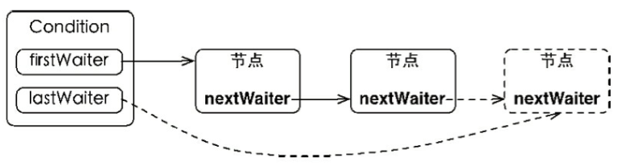
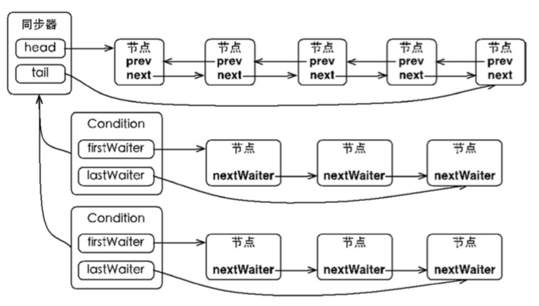
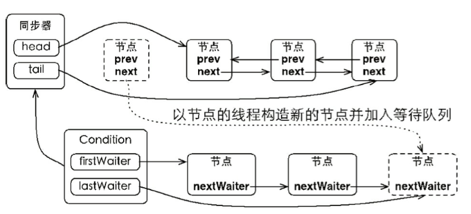
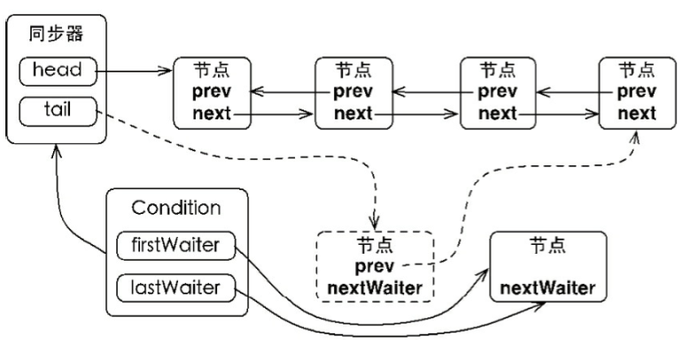

# Condition 知识

## 概述

　　在 Java 中，对于任意一个 java 对象，它都拥有一组定义在 java.lang.Object 上监视器方法，包括 wait()、wait(long timeout)、notify()、notifyAll()，这些方法配合 synchronized 关键字一起使用可以实现等待/通知模式。

　　同样，Condition 接口也提供了类似 Object 监视器的方法，通过与 Lock 配合来实现等待/通知模式。

　　为了更好的了解 Condition 的特性，来对比以下两者的使用以及功能特性：

| 对比项                                             | Object 监视器                  | Condition                                                    |
| -------------------------------------------------- | ------------------------------ | ------------------------------------------------------------ |
| 前置条件                                           | 获取对象的锁                   | 调用 Lock.lock 获取锁，调用 Lock.newCondition 获取 Condition 对象 |
| 调用方式                                           | 直接调用，比如 object.notify() | 直接调用，比如 condition.await()                             |
| 等待队列的个数                                     | 一个                           | 多个                                                         |
| 当前线程释放锁进入等待状态                         | 支持                           | 支持                                                         |
| 当前线程释放锁进入等待状态，在等待状态中不断响中断 | 不支持                         | 支持                                                         |
| 当前线程释放锁并进入超时等待状态                   | 支持                           | 支持                                                         |
| 当前线程释放锁并进入等待状态直到将来的某个时间     | 不支持                         | 支持                                                         |
| 唤醒等待队列中的一个线程                           | 支持                           | 支持                                                         |
| 唤醒等待队列中的全部线程                           | 支持                           | 支持                                                         |

## Condition 使用示例


## Condition 实现分析

　　Condition 可以通俗的理解为条件队列。当一个线程在调用了 await 方法以后，直到线程等待的某个条件为真才会被唤醒。这种方式为线程提供了更加简单的等待/通知模式。Condition 必须要配合锁一起使用，因为对共享状态变量的访问发生在多线程环境下。

　　一个 Condition 的实例必须与 Lock 绑定，因此 Condition 一般都是作为 Lock 的内部实现。 

### Condition api

　　Condition 提供以下接口以供实现：

1. void await() throws InterruptedException

   当前线程进入等待状态，直到被通知（signal）或者被中断时，当前线程进入运行状态，从 await() 返回。

   造成当前线程在接到信号或被中断之前一致处于等待状态。

2. void awaitUninterruptibly()

   当前线程进入等待状态，直到被通知，对中断不做响应；

   造成当前线程在接到信号、被中断或到达指定等待时间之前一直处于等待状态。

3. long awaitNanos(long nanosTimeout) throws InterruptedException

   在接口 1 的返回条件基础上增加了超时响应。

   造成当前线程在接到信号、被中断或到达指定等待时间之前一直处于等待状态。

   返回值表示当前剩余的时间，如果在 nanosTimeout 之前被唤醒，返回值 = nanosTimeout - 实际消耗时间，返回值 <= 0 表示超时。

   

4. boolean await(long time, TimeUnit unit) throws InterruptedException

   同样是在接口 1 的返回条件基础上增加了超时响应，与接口 3 不同的是：

   * 可以自动逸超时时间单位；
   * 返回值返回 true/false，在 time 之前被唤醒，返回 true，超市返回 false。

5. boolean awaitUnitil(Date deadline) throws InterruptedException

   当前线程进入等待状态直到将来的指定时间被通知。造成当前线程在接到信号、被中断或到达指定最后期限之前一直处于等待状态。

   如果没有到指定时间被通知返回 true，否则，到达指定时间，返回 false。

6. void signal()

   唤醒一个等待在 Condition 上的线程。该线程从等待方法返回前必须获得与 Condition 相关的锁。

7. void signalAll()

   唤醒等待在 Condition 上所有的线程。能够从等待方法返回的线程必须获得与 Condition 相关的锁。

## Condition 具体实现分析

　　ConditionObject 是 Condition 在 java 并发中的具体的实现，它是 AQS 的内部类。因为 Condition 相关操作都需要获取锁，所以作为 AQS 的内部类也比较合理。接下来就以 ConditionObject 的等待队列、等待、通知为切入点分析 ConditionObject 的具体实现。

### 等待队列

　　Condition 是 AQS 的内部类。每个 Condition 对象都包含一个队列（等待队列）。

　　ConditionObject 的等待队列是一个 FIFO 队列，队列的每个节点都是等待在 Condition 对象上的线程的引用，在调用 Condition 的 await() 方法之后，线程释放锁，构造成相应的节点进入等待队列等待。其中节点的定义复用 AQS 的 Node 定义。

　　ConditionObject 是 AbstractQueuedSynchronizer 的内部类。

#### 等待队列相关操作实现

```java
    public class ConditionObject implements Condition, java.io.Serializable {
        private static final long serialVersionUID = 1173984872572414699L;
        /** First node of condition queue. */
        private transient Node firstWaiter;
        /** Last node of condition queue. */
        private transient Node lastWaiter;
        public ConditionObject() { }

        // Internal methods

        /**
         * Adds a new waiter to wait queue.
         * @return its new wait node
         */
        private Node addConditionWaiter() {
            if (!isHeldExclusively())
                throw new IllegalMonitorStateException();
            Node t = lastWaiter;
            // If lastWaiter is cancelled, clean out.
            if (t != null && t.waitStatus != Node.CONDITION) {
                unlinkCancelledWaiters();
                t = lastWaiter;
            }

            Node node = new Node(Node.CONDITION);

            if (t == null)
                firstWaiter = node;
            else
                t.nextWaiter = node;
            lastWaiter = node;
            return node;
        }
    }
```

* ConditionObject 包含等待队列的首节点 firstWaiter 和尾节点 lastWaiter；
* 线程调用 await() 方法时，调用 addConditionWaiter() 方法入队；
  * step 1：将线程构造成 Node；
  * step 2：将 Node 加入到等待队列中。

　　在队列的每个结点都包含了一个线程引用，该线程就是在 Condition 对象上等待的线程，如果一个线程调用了 Condition.await() 方法，那么该线程将会释放锁，构造称接待你加入等待队列并进入等待状态。

　　从队列相关操作的具体实现可以知道等待队列的基本结构如下图所示：



　　等待分为首节点和尾节点。当一个线程调用 Condition.await() 方法，将会以当前线程构造结点，并将结点从尾部加入等待队列。新增结点就是将尾部节点指向新增的节点。节点引用更新本来就是在获取锁以后的操作，所以不需要 CAS 保证。同时也是线程安全的操作。

　　插入节点只需要将原有尾节点的 nextWaiter 指向当前节点，并且更新尾节点。更新节点并没有像 AQS 更新同步队列使用 CAS 是因为调用 await() 方法的线程必定是获取了锁的线程，锁保证了操作的线程安全。

　　注：AQS 实质上拥有一个同步队列和多个等待队列，具体对应关系如下图所示：



### 等待

　　调用 Condition 的 await 开头的系列方法，当前线程进入等待队列等待，那么 Condition 的等待实质是 await 系列方法的具体实现。

　　当线程调用了 await 方法以后。线程就作为队列中的一个节点被加入到等待队列中去了。同时会释放锁的拥有。当从 await 方法返回的时候。一定会获取 condition 相关联的锁。当等待队列中的节点被唤醒的时候，则唤醒节点的线程开始尝试获取同步状态。如果不是通过其他线程调用 Condition.signal() 方法唤醒，而是对等待线程进行中断，则会抛出 InterruptedException 异常信息。

#### await 实现

```java
        public final void await() throws InterruptedException {
            if (Thread.interrupted())
                throw new InterruptedException();
            Node node = addConditionWaiter();
            int savedState = fullyRelease(node);
            int interruptMode = 0;
            while (!isOnSyncQueue(node)) {
                LockSupport.park(this);
                if ((interruptMode = checkInterruptWhileWaiting(node)) != 0)
                    break;
            }
            if (acquireQueued(node, savedState) && interruptMode != THROW_IE)
                interruptMode = REINTERRUPT;
            if (node.nextWaiter != null) // clean up if cancelled
                unlinkCancelledWaiters();
            if (interruptMode != 0)
                reportInterruptAfterWait(interruptMode);
        }
```

　　具体执行流程如下：

* 调用 addConditionWaiter 将当前线程加入等待队列；
* 调用 fullyRelease 释放当前线程节点的同步状态，唤醒后继节点；
* 线程进入等待状态；
* 线程被唤醒后，从 while 循环中退出，调用 acquireQueued 尝试获取同步状态；
* 同步状态获取成功后，线程从 await 方法返回。

　　其他以 await 开头的方法具体实现与 await 基本一致，只是在它的基础上增加了超时限制，不管有没有被唤醒，到达指定时间，等待结束，从 await 返回。这个 await 系列方法将线程加入等待队列的流程可以总结为下图：



### 唤醒

　　调用 Condition 的 signal() 方法将会唤醒在等待队列中等待最长时间的节点（条件队列里的首节点），在唤醒节点前，会将节点移到同步队列中。当前线程加入到等待队列中如图所示：


#### singal 实现

```java
        public final void signal() {
            if (!isHeldExclusively())
                throw new IllegalMonitorStateException();
            Node first = firstWaiter;
            if (first != null)
                doSignal(first);
        }
```

* step1：前置检查，判断当前线程是否是获取了锁的线程，如果不是抛出异常 IllegalMonitorStateException，否则，执行 step2；
* step2：取得等待队列的头结点，头结点不为空执行 doSignal，否则，signal 结束。

　　可以看出，doSignal 方法是整个 signal 方法实现的核心，它完成了将线程从唤醒的所有操作。

#### doSignal 实现

```java
        private void doSignal(Node first) {
            do {
                if ( (firstWaiter = first.nextWaiter) == null)
                    lastWaiter = null;
                first.nextWaiter = null;
            } while (!transferForSignal(first) &&
                     (first = firstWaiter) != null);
        }
```

　　整个 doSignal 完成了这两个操作：调用 transferSignal 将结点从等待队列移动到同步队列，并且，将该结点从等待队列删除。

#### transferForSignal 实现

```java
    final boolean transferForSignal(Node node) {
        /*
         * If cannot change waitStatus, the node has been cancelled.
         */
        if (!node.compareAndSetWaitStatus(Node.CONDITION, 0))
            return false;

        /*
         * Splice onto queue and try to set waitStatus of predecessor to
         * indicate that thread is (probably) waiting. If cancelled or
         * attempt to set waitStatus fails, wake up to resync (in which
         * case the waitStatus can be transiently and harmlessly wrong).
         */
        Node p = enq(node);
        int ws = p.waitStatus;
        if (ws > 0 || !p.compareAndSetWaitStatus(ws, Node.SIGNAL))
            LockSupport.unpark(node.thread);
        return true;
    }
```

* step1：将结点 waitStatus 设置为 0，设置成功执行 step2 ，否则返回 false；
* step 2：调用 enq 方法将该结点加入同步队列；
* step3：使用 LockSuppor.unpark() 方法唤醒该结点的线程。

　　在调用 signal() 方法之前必须先判断是否获取到了锁。接着获取等待队列的首节点，将其移动到同步队列并且利用 LockSupport 唤醒节点中的线程。节点从等待队列移动到同步队列如下图所示：

　　Condition 的 signalAll() 方法，将等待队列中的所有结点全部唤醒，相当于将等待队列中的每一个结点都执行一次 signal()。整个 signal 系列方法将线程从等待队列移动到同步队列可以总结为下图：



　　被唤醒的线程将从 await 方法中的 while 循环重瑞出。随后加入到同步状态的竞争中去。成功获取到竞争的线程则会返回到 await 方法之前的状态。

### 总结

　　调用 await 方法后，将当前线程加入 Condition 等待队列中。当前线程释放锁。否则别的线程就无法拿到锁而发生死锁。自旋（while）挂起，不断加测节点是否在同步队列中了，如果是则尝试获取锁，否则挂起。当线程被 signal 方法唤醒，被唤醒的线程将从 await() 方法中的 while 循环中退出来，然后调用 acquireQueued() 方法竞争同步状态。


## 参考文章
1. [java并发编程之Condition](https://www.jianshu.com/p/be2dc7c878dc)

2. [Java并发之Condition](https://www.cnblogs.com/gemine/p/9039012.html)