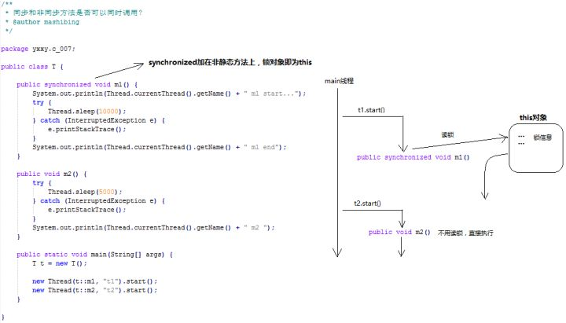
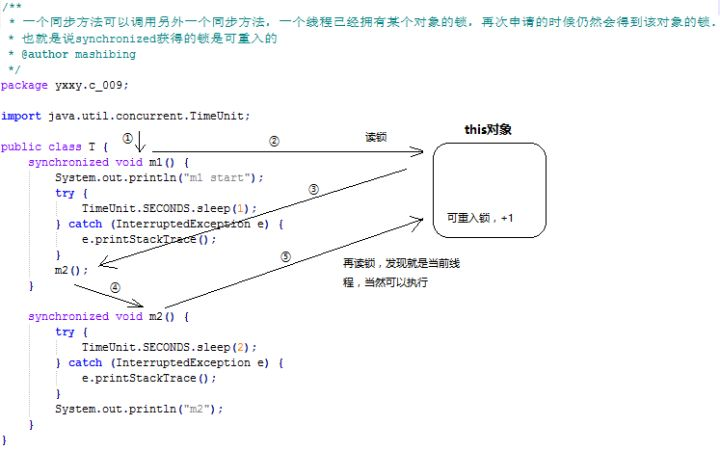
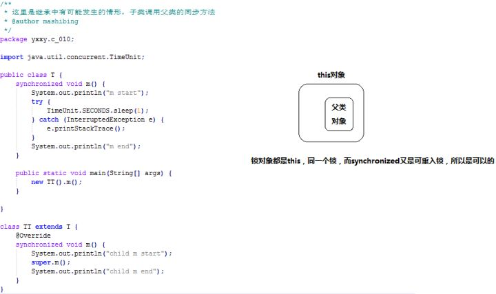
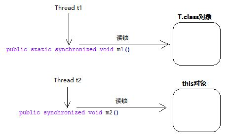

# synchronized 知识

## 1 synchronized 的三种使用方式

### 1.1 修饰实例方法

　　修饰实例方法，作用于当前对象实例加锁，进入同步代码前要获取当前对象**实例**的锁。

### 1.2 修饰静态方法

　　作用于当前类对象加锁，进入同步代码前要获得当前**类对象**的锁。也就是给当前类加锁，会作用于类的所有对象实例，因为静态成员不属于任何一个实例对象，是类成员（static 表明这是该类的一个静态资源，不管 new 了多少个对象，只有一份，所以对该类的所有对象都加了锁）。

　　所以如果一个线程 A 调用一个实例对象的非静态 synchronized 方法，而线程 B 需要调用这个实例对象所属类的静态 synchronized 方法，是允许的，不会发生互斥现象，因为访问静态 synchronized 方法占用的锁是当前类的锁，而访问非静态 synchronized 方法占用的锁是当前实例对象锁。

### 1.3 修饰代码块

　　指定加锁对象，对给定对象加锁，进入同步代码库前要获得给定对象的锁。

　　和 synchronized 方法一样，synchronized (this) 代码块也是锁定当前对象的。而 synchronized 关键字加到 static 静态方法和 synchronized(class) 代码块上都是是给 Class 类上锁。

　　尽量不要使用 synchronized(String a)，因为 JVM 中，字符串常量具有缓冲功能。 

## 2 synchronized 的使用案例

　　注意：synchronized 的锁是不可以为空的。

### 2.1 同一个类中的 synchronized 方法与普通方法之间互斥吗？不互斥



　　输出结果是：

```java
Thread-0 m1 start ...
Thread-1 m2 start ...
Thread-1 m2 end
Thread-0 m1 end
```

　　互斥的基本条件是公用一把锁，synchronized 是加在非静态方法上的，锁对象是 this 对象，t1 线程执行 m1 方法时要去读 this 对象锁，但是 t2 线程并不需要读锁，两者各管各的，没有交集（不共用一把锁），所以不互斥。

### 2.2 同一个类中 synchronized 方法可以调用其他的 synchronized 方法吗？可以



　　synchronized 是可重入锁，可以理解为同一个线程在已经持有该锁的情况下，可以再次获取锁，并且会在某个状态量上做 +1 操作。

### 2.3 子类同步方法 synchronized 方法可以调用父类的 synchronized 方法吗？



　　子类对象初始化前，会调用父类构造方法，在结构上相当于包裹了一个父类对象，用的都是 this 锁对象。

### 2.4 静态同步方法和非静态同步方法互斥吗？

```java
public class T {
    //非静态同步方法
    public synchronized void m1() {
        System.out.println(Thread.currentThread().getName() + " m1 start ...");
        try {
            TimeUnit.SECONDS.sleep(2);
        } catch (InterruptedException e) {
            e.printStackTrace();
        }
        System.out.println(Thread.currentThread().getName() + " m1 end");
    }

    //静态同步方法
    public static synchronized void m2() {
        System.out.println(Thread.currentThread().getName() + " m2 start ...");
        try {
            TimeUnit.SECONDS.sleep(1);
        } catch (InterruptedException e) {
            e.printStackTrace();
        }
        System.out.println(Thread.currentThread().getName() + " m2 end");
    }

    public static void main(String[] args) {
        final T main = new T();
        new Thread(new Runnable() {
            public void run() {
                main.m1();
            }
        }).start();
        new Thread(new Runnable() {
            public void run() {
                main.m2();
            }
        }).start();
    }
}
```

　　输出结果：

```
Thread-0 m1 start ...
Thread-1 m2 start ...
Thread-1 m2 end
Thread-0 m1 end
```




　　同步静态方法的锁是所在类的 Class 对象，而同步普通方法的锁是 this 对象，两个的锁不同，所以不会互斥。

## 3 synchronized 关键字底层原理

　　synchronized 关键字底层原理属于 JVM 层面。

### 3.1 synchronized 同步语句块的情况

```java
public class SyncrhonziedDemo {
	public void method(){
		synchronized (this) {
			System.out.println("synchronized 代码块");
		}
	}
}
```

　　synchronized 同步语句块的实现使用的是 monitorenter 和 monitorexit 指令，其中 monitorenter 指令指向同步代码块的开始位置，monitorexit 指令则指向同步代码块的结束位置。

　　当执行 monitorenter 指令时，线程试图获取锁也是获取 monitor（monitor 对象存在于每个 Java 对象的对象头中，synchronized 锁便是通过这种方式获取锁的，也是为什么 Java 中任意对象可以作为锁的原因）的持有权。

　　当计数器为 0 则可以成功获取，获取后将锁计数器加 1。

　　相应的在执行 monitorexit 指令后，将锁计数器减 1 ，表明当前锁被释放。

　　如果获取对象锁失败，那当前线程就要阻塞等待，直到锁被另外一个线程释放为止。

### 3.2 synchronized 修饰方法的情况

```java
public class SynchronizedDemo2 {
	public synchronized void method() {
		System.out.println("synchronized 方法");
	}
}
```

　　synchronized 修饰的方法并没有 monitorenter 指令和 monitorexit 指令，取而代之的是 ACC_SYNCHRONIZED 标识，该标识指明了该方法是一个同步方法，JVM 通过该 ACC_SYNCHRONIZED 访问标志来辨别一个方法是否声明为同步方法，从而执行相应的同步调用。

## 4 JDK 1.6 之后的底层优化

　　在 Java 早期版本中，synchronized 属于重量级锁，效率低下，因为监视器锁（monitor）是依赖于底层的操作系统的 Mutex Lock 来实现的，Java 的线程是映射到操作系统的原生线程之上的。如果要挂起或者唤醒一个线程，都需要操作系统完成，而操作系统实现线程之间的切换时需要从用户态转换到内核态，这个状态之间的转换需要相对比较长的时间，时间成本相对较高，这也是为什么早期的 synchronized 效率低的原因。

　　在 Java 6 之后 Java 官方从 JVM 层面对 synchronized 做了较大优化，所以现在的 synchronized 锁效率也优化的很不错了。而 JDK 1.6 对锁的优化，增加了自旋锁、适应性自旋锁、锁消除、锁粗化、偏向锁、轻量级锁等技术来减少锁操作的开销。

　　锁主要存在四种状态，依次是：无锁状态、偏向锁状态、轻量级锁状态、重量级锁状态，它们会随着竞争的激烈而逐渐升级。注意锁可以升级不可降级，这种策略是为了提高获得锁和释放锁的效率。

　　Java 锁使用的锁其实是在对象头中的锁标识，下面是锁在对象头中的结构：


　　锁状态：


### 4.1 偏向锁

　　引入偏向锁的目的和引入轻量级锁的目的很像，它们都是为了没有多线程竞争的前提下，减少传统的重量级锁使用操作系统互斥量产生的性能消耗。但是不同的是：轻量级锁在无竞争的情况下使用 CAS 操作去代替使用互斥量，而偏向锁在无竞争的情况下会把整个同步都消除掉。

　　偏向锁会偏向于第一个获得它的线程，如果在接下来的执行中，该锁没有被其他线程获取，那么持有偏向锁的线程就不需要进行同步！

　　但是对于锁竞争比较激烈的场合，偏向锁就失效了，因为这样场合极有可能每次申请锁的线程都是不相同的，因此这种场合下不应该使用偏向锁，否则会得不偿失，需要注意的是，偏向锁失败后，并不会立即膨胀为重量级锁，而是先升级为轻量级锁。

### 4.2 轻量级锁

　　倘若偏向锁失败，虚拟机并不会立即升级为重量级锁，它还会尝试使用一种称为轻量级锁的优化手段（1.6 之后加入的）。

　　轻量级锁不是为了代替重量级锁，它的本意是在没有多线程竞争的前提下，减少传统的重量级锁使用操作系统互斥量产生的性能消耗，因为使用轻量级锁时，不需要申请互斥量。另外，轻量级锁的加锁和解锁都用到了 CAS 操作。

　　轻量级锁能够提升程序同步性能的依据是  “ 对于绝大部分锁，在整个同步周期内都是不存在竞争的 “，这是一个经验数据。如果没有竞争，轻量级锁使用 CAS 操作避免了使用互斥操作的开销。但如果存在锁竞争，除了互斥量开销外，还会额外发生 CAS 操作，因此在有锁竞争的情况下，轻量级锁比传统的重量锁更慢！如果锁竞争激烈，那么轻量级将很快膨胀为重量级锁！

　　当关闭偏向锁功能或者多个线程竞争偏向锁导致偏向锁升级为轻量级锁，则会尝试获取轻量级锁，其步骤如下：

1. 获取锁，判断当前对象是否处于无锁状态（hashcode、0、01）。

   若是，则 JVM 首先将在当前线程的栈帧中建立一个名为锁记录（Lock Record）的空间，用于存储锁对象目前的 Mark Word 的拷贝（官方把这份拷贝加上一个 Displace 前缀，即 Displace Mark Word），否则执行步骤 3。

2. JVM 利用 CAS 操作尝试将对象的 Mark Word 更新为指向 Lock Record 的指针，如果成功表示竞争到锁，则将锁标志位变成 00（表示此对象处于轻量级锁状态），执行同步操作；如果失败则执行步骤 3。

3. 判断当前对象的 Mark Word 是否指向当前线程的栈帧，如果是则表示当前线程已经持有当前对象的锁，则直接执行同步代码块；否则只能说明该锁对象已经被其他线程抢占了，这时轻量级锁需要膨胀为重量级锁，锁标志位变成 10，后面等待的线程将会进入阻塞状态。

### 4.3 重量级锁

　　没有优化过的同步方法或者同步代码块。

### 4.4 自旋锁和自适应自旋

　　轻量级锁失败后，虚拟机为了避免线程真实地在操作系统层面挂起，还会进行一项称为自旋锁的优化手段。

　　互斥同步对性能最大的影响就是阻塞的实现，因为挂起线程 / 恢复线程的操作都需要转入内核态中完成（用户态转换到内核态会耗费时间）。

　　一般线程持有锁的时间都不是太长，所以仅仅为了这一点时间去挂起线程 / 恢复线程是得不偿失的。所以，虚拟机的的开发团队就这样去考虑：”我们能不能让后面来的请求获取锁的线程等待一会而不被挂起呢？看看持有锁的线程是否很快就会释放锁“。为了让一个线程等待，只需要让线程执行一个忙循环（自旋），这项技术就叫做**自旋**。

　　何谓自旋锁？它是为实现保护共享资源而提出一种锁机制。其实，自旋锁与互斥锁比较类似，它们都是为了解决对某项资源的互斥使用。无论是互斥锁，还是自旋锁，在任何时刻，最多只能有一个持有者，也就说，在任何时刻最多只能有一个持有单元获得锁。但是两者在调度机制上略有不同。对于互斥锁，如果资源已经被占用，资源申请者只能进入睡眠状态。但是自旋锁不会引起调用者睡眠，如果自旋锁已经被别的执行单元保持，调用者就一直循环在那里看是否该自旋锁的保持者已经释放了锁。

　　自旋锁在 JDK 1.6 之前其实就已经引入了，不过是默认关闭的，需要通过 --XX:+UseSpinning 参数来开启。JDK 1.6 及 1.6 之后，就改为默认开启的了。需要注意的是：自旋等待不能完全替代阻塞，因为它还是要占用处理器时间。如果锁被占用的时间短，那么效果当然就很好了，反之则相反。自旋锁等待的时间必须要有限度。如果自旋超过了限定次数仍然没有获得锁，就应该挂起线程。自旋次数的默认值是 10 次，用户可以修改 -XX:PreBlockSpin 来更改。

　　另外，在 JDK 1.6 中引入了自适应的自旋锁。自适应的自旋锁带来的改进就是：自旋的时间不在固定了，而是由前一次同一个锁上的自旋时间以及锁的拥有者的状态来决定，虚拟机变得越来越 ” 聪明 “ 了。

### 4.5 锁消除

　　锁消除指的就是虚拟机即使编译器在运行时，如果检测到那些共享数据不可能存在竞争，那么就执行锁消除。

　　锁消除可以节省毫无意义的请求锁的时间。

### 4.6 锁粗化

　　原则上，在编写代码得时候，总是推荐将同步块的作用范围限制得尽量小，直到共享数据的实际作用域才进行同步，这样是为了使得需要同步得操作数量尽可能变小，如果存在锁竞争，那等待线程也能尽快拿到锁。

　　大部分情况下，上面的原则都是没有问题的，但是如果一系列的连续操作都对同一个对象反复加锁和解锁（比如循环），那么代码会有很多不必要的性能消耗，在这种情况下，通过对锁粗化，扩大锁区域的范围，从而减少内存的消耗。

## 5 synchronized 和 ReentrantLock 的对比

### 5.1 两者都是可重入锁

　　synchronized 和 ReentrantLock 都是可重入锁。

　　” 可重入锁 “ 概念是：自己可以再次获取自己的内部锁。比如一个线程获得了某个对象的锁，此时这个对象锁还没有释放，当其再次想要获取这个对象的锁的时候还是可以获取的，如果不可锁重入的话，就会造成死锁。同一个线程每次获取锁，锁的计数器都自增 1 ，所以要等到锁的计数器下降为 0 时才能释放锁。

### 5.2 synchronized 依赖于 JVM 而 ReentrantLock依赖于 API

　　synchronized 是依赖于 JVM 实现的，虚拟机团队在 JDK 1.6 为 synchronized 关键字进行了很多优化，但是这些优化都是在虚拟机里面实现的，并没有直接暴露出来。

　　ReentrantLock 是 JDK 层面实现的（也就是 API 层面，需要 lock() 和 unlock() 方法配合 try/finally 语句块来完成），所以可以通过查看源代码来查看它的具体实现。

### 5.3 ReentrantLock 比 synchronized 增加了一些高级功能

　　相比 synchronized ，ReentrantLock增加了一些高级功能。主要来说有三点：1. 等待可中断；2.可实现公平锁；3.可实现选择性通知（锁可以绑定多个条件）。

* ReentrantLock 提供了一种能够中断等待锁的线程的机制。

  通过 lock.lockInterruptibly() 来实现这个机制。也就是说正在等待的线程可以选择放弃等待，改为处理其他事情。

* ReentrantLock 可以指定是公平锁还是非公平锁。

  而 synchronized 只能是非公平锁。所谓的公平锁就是先等待的线程先获得锁。

  ReentrantLock 默认情况下是非公平的，可以通过 ReentrantLock 类的 ReentrantLock (boolean fair) 构造方法来指定是否是公平的。

* synchronized 关键字与 wait() 和 notify/notifyAll() 方法结合可以实现等待 / 通知机制，ReentrantLock 类当然也可以实现，但是需要借助于 Condition 接口与 newCondition() 方法。

  Condition 是 JDK 1.5 后才有的，它具有很好的灵活性，比如可以实现多路通知功能也就是在一个 Lock 对象中可以创建多个 Condition 实例（即对象监视器），线程对象可以注册在指定的 Condition 中，从而可以有选择性的进行线程通知，在调度线程上更加灵活。

  在使用 notify/notifyAll() 方法进行通知时，被通知的线程是由 JVM 选择的，用 ReentrantLock 类结合 Condition 实例可以实现 ” 选择性通知 “，这个功能非常重要，而且是 Condition 接口默认提供的。

  而 synchronized 关键字就相当于整个 Lock 对象中只有一个 Condition 实例，所有的线程这样会造成很大的效率问题，而 Condition 实例的 singalAll() 方法只会唤醒注册在该 Condition 实例上的所有等待线程。

　　如果想使用上述功能，那么选择 ReentrantLock 是一个不错的选择。

### 5.4 性能已不是选择标准

　　在 JDK 1.6 之前，synchronized 的性能是比 ReentrantLock 差很多。具体表示为 synchronized 关键字吞吐量随线程数的增加，下降得非常严重。而 ReentrantLock 基本保持一个比较稳定的水平。但是在 JDK 1.6 之后 JVM 团队对 synchronized 关键字做了很多优化，所以 JDK 1.6 之后，synchronized 和 ReentrantLock 的性能基本是持平了。

　　在 JDK 1.6 之后，性能已经不是选择 synchronized 和 ReentrantLock 的影响因素了。而且虚拟机在未来的性能改进中会更偏向于原生的 synchronized，所以还是提倡在 synchronized 能满足需求的情况下，优先考虑使用 synchronized 关键来进行同步，优化后的 synchronized 和 ReentrantLock 一样，在很多地方都是用到了 CAS 操作。


## 6 参考文章
[Synchronized 锁定的到底是什么](https://www.zhihu.com/question/57794716?sort=created)

[synchronized详解](https://www.jianshu.com/p/16cec9b50ad2)

[老生常谈为什么需要synchronized，以及synchronized 的注意事项](https://blog.csdn.net/wangyadong317/article/details/84065828)