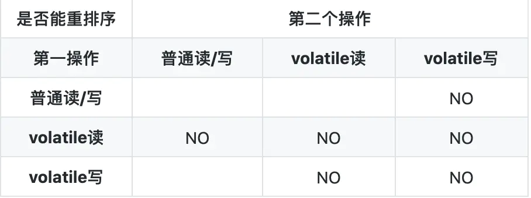
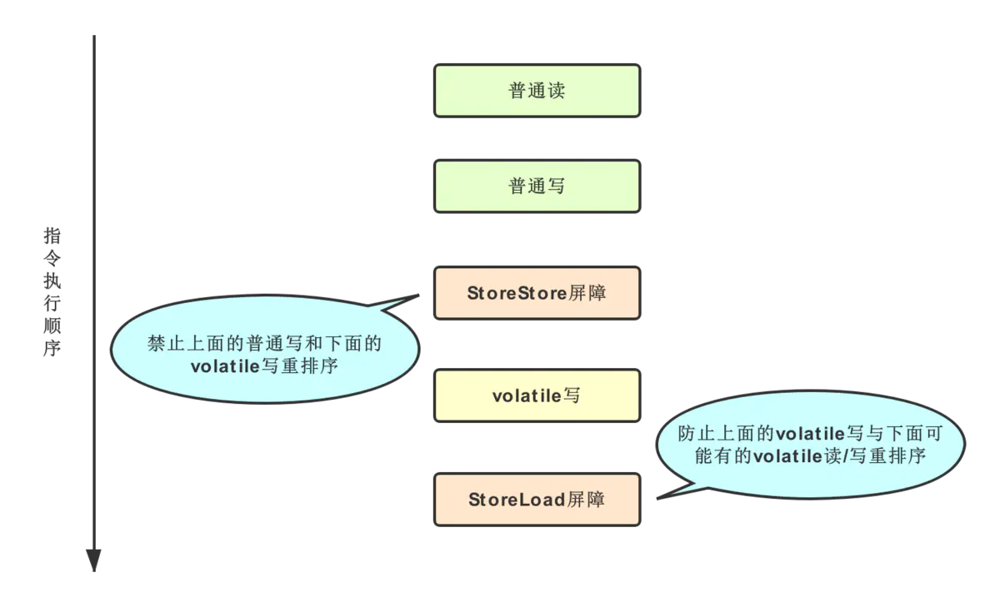
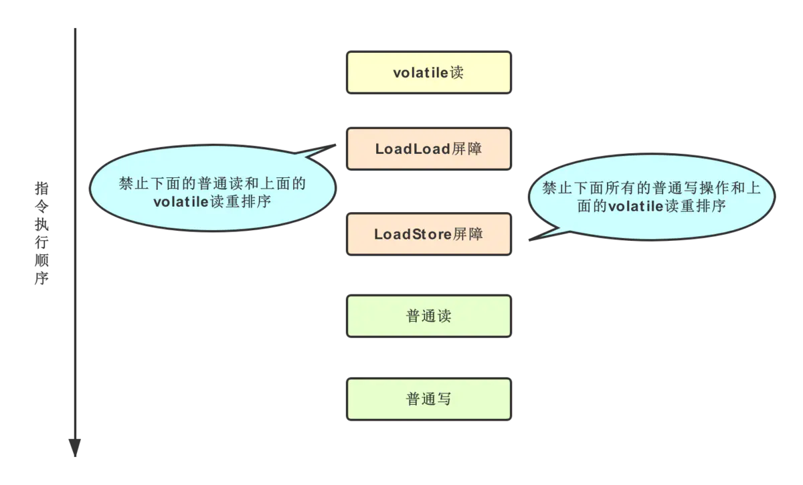
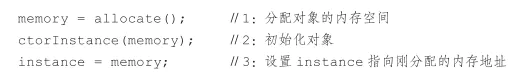
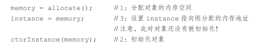

# volatile 知识

## 内存模型的相关概念

　　计算机在执行程序时，每条指令都是在 CPU 中执行的，而执行指令过程中，势必涉及到数据的读写和写入。由于程序运行过程中的临时数据是存放在主存（物理内存）当中的，这时就存在一个问题，由于 CPU 执行速度很快，而从内存读取数据和向内存写入数据的过程跟 CPU 执行指令的速度比起来要慢的多，因此如果任何时候对数据的操作都要通过和内存的交互来机型，会大大降低指令执行的速度。因此在 CPU 里面就有了高速缓存。

　　也就是，当程序在运行过程中，会将运算需要的数据从主存复制一份到 CPU 的告诉缓存当中，那么 CPU 进行计算时就可以直接从它的告诉缓存读取数据和向其中写入数据，当运算结束之后，再将高速缓存中的数据刷新到主内存当中。

　　如果一个变量在多个 CPU 中都存在缓存（一般在多线程编程时才会出现），那么就可能存在缓存不一致的问题。

　　为了解决缓存不一致性问题，通常来说有以下 2 中解决方法：

1. 通过在总线加 LOCK # 锁的方式
2. 通过缓存一致性协议

　　这两种方式都是硬件层面上提供的方式。

　　在早期的 CPU 当中，是通过在总线上加 LOCK# 锁的形式来解决缓存不一致的问题。因为 CPU 和 其他部件进行通信都是通过总线来进行的，如果对总线加 LOCK# 锁的话，也就是说阻塞了其他 CPU 对其他部件访问（如内存），从而使得只能有一个 CPU 能使用这个变量的内存。这样就解决了缓存不一致的问题，但是这样会有一个问题就是，由于在锁住总线期间，其他 CPU 无法访问内存，导致效率低下。

　　然后就出现了缓存一致性协议。最出名的就是 Intel 的 MESI 协议，MESI 协议保证了每个缓存中使用的共享变量的副本是一致的。它核心的思想是：当 CPU 写数据时，如果发现操作的变量是共享变量，即在其他 CPU 也存在该变量的副本，会发出信号通知其他 CPU 将该变量的缓存行置为无效状态，因此当其他 CPU 需要读取这个变量时，发现自己混村中缓存该变量的缓存行是无效的，那么它就会从内存重新读取。


## 并发编程中的三个概念

### 1. 原子性

　　原子性：即一个操作或者多个操作要么全部执行并且执行的过程不会被任何因素打断，要不就都不执行。

### 2. 可见性

　　可见性是指当多个线程访问同一个变量时，一个线程修改了这个变量的值，其他线程能够立即看达到修改的值。

### 3. 有序性

　　有序性：即程序执行的顺序按照代码的先后顺序执行。

　　破坏有序性的原因：处理器为了提高程序运行效率，可能会对输入代码进行优化，它不保证程序中各个语句的执行先后顺序同代码中的顺序一致，但是它会保证程序最终执行结果和代码顺序执行的结果是一致的。

　　指令重排序不会影响单个线程的执行，但是会影响到线程并发执行的正确性。

　　要想并发程序正确地执行，必须要保证原子性、科技按行以及有序性。要是有一个没有被保证，就有可能会导致程序运行不正确。

## Java 内存模型

　　在 Java 虚拟机规范中试图定义一种 Java 内存模型（Java Memory Model，JMM）来屏蔽各个硬件平台和操作系统地内存访问差异，以实现让 Java 程序在各个平台下都能达到一致的内存访问效果。

　　Java 内存模型定义了程序中变量的访问规范，往大一点说是定义了程序执行的次序。

　　注意，为了获得较好的执行性能，Java 内存模型并没有限制执行引擎使用处理器的寄存器或者高速缓存来提升指令执行速度，也没有限制编译器对指令进行重排序。也就是说，在 java 内存模型中，也会存在缓存一致性问题和执行重排序的问题。

　　Java 内存模型规定所有的变量都是存在主存当中（类似于物理内存）。每个线程都有自己的工作内存（类似于高速缓冲）。线程对变量的所有操作都必须在工作内存中进行，而不能直接对主存进行操作，并且每个线程不能访问其他线程的工作内存。

　　Java 语言本身对原子性、一致性以及有序性提供的保证：

1. 原子性

   在 Java 中，对基本数据类型的变量的读取和赋值操作时原子性操作，即这些操作是不可被中断的，要么执行，要么不执行。

   Java 内存模型只保证了基本读取和赋值是原子性操作，如果要实现更大范围的原子性，可以通过 synchronzied 和 Lock 来实现。由于 synchronzied 和 Lock 能够保证任一时刻只有一个线程执行该代码块，那么自然就不存在原子性问题了，从而保证了原子性。 

2. 可见性

   对于可见性，Java 提供了 volatile 关键字来保证可见性。

   当一个共享变量被 volatile 修饰时，它会保证修改的值会立即被更新到主存，当有其他线程需要读取时，它会去内存中读取新值。

   而普通的共享变量不能保证可见性，因为普通共享变量被修改之后，什么时候被写入主存是不确定的，当其他线程去读取时，此时内存中可能还是原来的旧值，因此无法保证可见性。

   另外，通过 synchronized 和 Lock 也能够保证可见性，synchronzied 和 Lock 能保证同一时刻只有一个线程获取锁然后执行同步代码，并且在释放锁之前会将变量的修改刷新到主内存中，因此可以保证可见性。 

3. 有序性

   在 Java 内存模型中，允许编译器和处理器对指令进行重排序，但是重排序过程不会影响到单线程程序的执行，却会影响到多线程并发执行的正确性。

   在 Java 里面，可以通过 volatile 关键字来保证一定的 “ 有序性 ”。另外可以通过 synchronzied 和 Lock 来保证有序性，很显然，synchronized 和 Lock 保证每个时刻只有一个线程执行同步代码，相当于是让线程顺序执行同步diamagnetic，自然旧保证了有序性。

   Java 内存模型具备一些先天的 “ 有序性 ”，既不需要通过任何手段就能够得到保证的有序性，这个通常也称为 happends-before 原则。如果两个操作的执行次序无法从 happends-before 原则推导出来，那么就不能保证它们的有序性，虚拟机可以随意对它们进行重排序。

　　happends-before 原则（先行发生原则）：

* 程序次序规则：一个线程内，按照代码顺序，书写在前面的操作先行发生于书写在后面的操作。
* 锁定规则：一个 unLock 操作先行发生于后面对同一个锁的 lock 操作。
* volatile 变量规则：对一个变量的写操作先行发生于后面对这个变量的读操作。
* 传递规则：如果操作 A 先行发生于操作 B，而操作 B 又先行发生于操作 C，则可以得出操作 A 先行发生于操作 C。
* 线程启动规则：Thread 对象的 start() 放啊先行发生于此线程的每一个动作。
* 线程中断规则：对线程 interrupt() 方法的调用先行发生于被中断线程的代码检测到中断事件的发生。


## volatile 定义

　　Java 语言规范第三版中对 volatile 的定义如下：java 编程语言允许线程访问共享变量，为了确保共享变量能被准确和一致的更新，线程应该确保通过排他锁单独获得这个变量。Java 语言提供了 volatile，在某些情况下比锁更加方便。如果一个字段被声明成 volatile，java 线程内存模型确保所有线程看到这个变量的值是一致的。

　　volatile 声明的变量可以保证多线程对这个变量的可见性。

　　volatile 被称为轻量级的 synchronized，它比 synchronized 的使用和执行成本更低，因为它不会引起线程的阻塞从而导致线程上下文的切换和调度。

## volatile 的内存语义

　　happends-before （先行发生原则）对 volatile 的定义：volatile 变量的写，先发生于后续对这个变量的读。

　　这句话的含义有两层：

1. volatile 的写操作，需要将线程本地内存值，立马刷新到主内存的共享变量上。
2. volatile 的读操作，需要从主内存的共享变量中读取，更新本地内存变量的值。

　　所以 volatile 的内存含义：

1. 当写一个 volatile 变量时，JMM（Java 内存模型） 会把该线程对应的本地内存中的共享变量值刷新到主内存。
2. 当读一个 volatile 变量时，JMM（Java 内存模型）会把该线程对应的本地内存置为无效。小城接下来将从主内存中读取共享变量，并更新本地内存的值。

## volatile 的特性

* **可见性**：对一个 volatile 的变量的读，总是能看到任意线程对这个变量最后的写入。
* **单个读或者写具有原子性**：对于单个 volatile 变量的读或者写具有原子性，复合操作不具有（如 i++）。
* **互斥性**：同一时刻只允许一个线程对变量进行操作（互斥锁的特点）。

## volatile 内存语义的实现

　　volatile 重排序规则：



　　从表中归纳：

* 当第一个操作是 volatile 读时，不管第二个操作是什么，都不能重排序。确保 volatile 读之后的操作不会被重排序到 volatile 读之前。
* 当第二个操作是 volatile 写时，不管第一个操作是什么，都不能重排序。确保 volatile 写之前的操作不会背重排序到 volatile 写之后。
* 当第一个操作是 volatile 写，第二个操作是 volatile 读时，不能重排序。

　　为了实现 volatile 的内存语义，编译器在生成字节码时，会在指令序列中插入内存屏障来禁止特定类型的处理器重排序。

* 在每个 volatile 写操作的前面插入一个 StoreStore 屏障。
* 在每个 volatile 写操作的后面插入一个 StoreLoad 屏障。
* 在每个 volatile 读操作的后面插入一个 LoadLoad 屏障。
* 在每个 volatile 读操作的后面插入一个 LoadStore 屏障。

### volatile 写内存屏障



　　StoreStore 屏障：可以保证在 volatile 写之前，其前面的所有普通写操作已经对任意处理器可见了。

　　StoreLoad 屏障：将 volatile 写操作刷新到内存。

　　由此达到，volatile 写立马刷新到主内存的效果。

### volatile 读内存屏障



　　LoadLoad 屏障：保障后续是读操作时，volatile 读装载到内存数据。

　　LoadStore 屏障：保障后续是写操作时，volatile 读装载到内存数据。

　　由此达到，volatile 读从主内存中读取共享变量，并更新本地内存的值。

## volatile 的使用条件

1. 对变量的写操作不依赖于当前值或能够保证只有单以线程能够改变变量的值。

   如 i++ 操作，变量的写操作依赖当前值，所以不能保证线程安全。

2. 该变量没有包含在具体其他变量的不变式中

   如 i < value ，即使 i 变量声明为 volatile，也不能保证线程安全，value 可能在运行判断的时候发生变化。

## 正确使用 volaitle

　　下面是几种使用 volatile 的场景。

### 1. 状态标志

　　作为一个布尔状态标志，用于指示发生了一个重要的一次性时间，例如完成初始化或任务结束。

　　状态标志并不依赖于程序内任何其他状态，且通常只有一种状态转换。

```java
volatile Boolean shutdowmRequested;
...
public void shutdowm(){ 
	shutdownRequested = true; 
}

public void doWork() {
	while(!shundownResquested){
		...
	}
}
```

### 2. 一次性安全发布（one-time safe publication）（线程安全的单例模式）

　　在缺乏同步的情况下，可能会遇到某个对象引入的更新值（由另一个线程写入）和该对象状态的旧值通知存在。这就是造成著名的双重检查锁定（double-checked-locking）问题的根源。

```java
//基于 volatile 的解决方案
public class SafeDoubleCheckSingleton {
	//通过 volatile 声明，实现线程安全的延迟初始化
	private volatile static SafeDoubleCheckSingleton singleton;
	private SafeDoubleCheckSingleton(){}
	public static SafeDoubleCheckSingleton getInstance(){
		if (singleton == null){
			synchronized(SafeDoubleCheckSingleton.class){
				if (singleton == null){
					//原理利用 volatile 在于 禁止 “初始化对象” 和 “设置 singleton 指向内存空间” 的重排序
					singleton = new SafeDoubleCheckSingleton();
				}
			}
		}
        return singleton;
	}
	
}
```

　　由于对象的创建，可以拆封成以下指令：



　　在多线程环境中，如果没有对对象声明为 volatile，将可能出现以下情况，其他线程可能得到的是 null，而不是完成初始化的对象。



### 3. 独立观察（independent observation）

　　将 volatile 变量用于多个独立观察结果的布局，是 “ 状态标志 ” 的扩展，该值随时会发生变化，同时会被反复使用，前者一般就是用一次，只是简单的赋值操作，不会做复合操作。

```java
class CustomLinkedList{
	public volatile Node lastNode;
	...
	public void add(){
		......
		lastNode = node; //将新节点作为最后一个节点。
	}
}
```

### 4. 开销较低的 读 - 写 锁策略

　　当读远多于写，结合使用内部锁和 volatile 变量来减少同步的开销。

　　利用 volatile 保证读取操作的可见性；利用 sunchronized 保证复合操作的原子性。

```java
public class Counter {
	private volatile int value;
	//利用 volatile 保证读取操作的可见性，读取时无需加锁
	public int getValue() {
		return value;
	}
	//使用 synchronized 加锁
	public synchronized int increment(){
		return value++;
	}
}
```


## 参考文章

[java并发（4）深入理解 volatile](https://www.jianshu.com/p/9e467de97216)

[java并发编程：volatile 关键字解析](https://www.cnblogs.com/dolphin0520/p/3920373.html)

[Java 中 Volatile 关键字详解](https://www.cnblogs.com/zhengbin/p/5654805.html)

[Java 中 volatile 关键字的最全总结](https://blog.csdn.net/u012723673/article/details/80682208)

[【Java 并发笔记】volatile相关整理](https://www.jianshu.com/p/ccfe24b63d87)