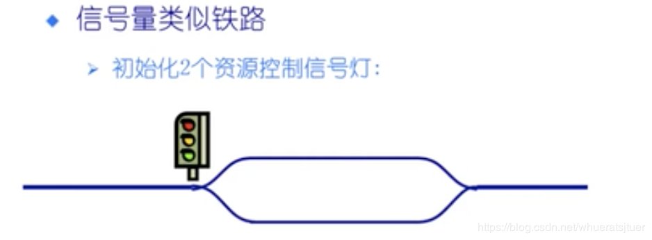
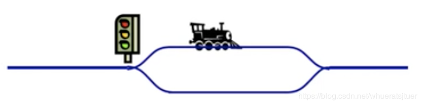

# 使用信号量实现生产者-消费者模式

#### 3.1. 使用信号量实现生产者 - 消费者问题

　　问题描述：使用一个缓冲区来保存物品，只有缓冲区没有满，生产者才可以放入物品；只有缓冲区不为空，消费者才可以拿走物品。

　　因为缓冲区属于临界资源，因此需要使用一个互斥量 mutex 来控制对缓冲区的互斥访问。

　　为了同步生产者和消费者的行为，需要记录缓冲区中物品的数量。数量可以使用信号量来统计，这里需要使用两个信号量：empty 记录空缓冲区的数量，full 记录满缓冲区的数量。其中，empty 信号量是在生产者进程中使用，当 empty 不为 0 时，生产者才可以放入物品；full 信号量是在消费者进程中使用，当 full 信号量不为 0 是，消费者菜可以取走物品。

　　注意，不能先对缓冲区进行加锁，再测试信号量。也就是说，不能先执行 down(mutex) 再执行 down(empty)。如果这么做了，那么可能会出现这种情况：生产者对缓冲区加锁后，执行 down(empty) 操作，发现 empty = 0，此时生产者睡眠。消费者不能进入临界区，因为生产者对缓冲区加锁了，消费者就无法执行 up(empty) 操作，empty 永远都为 0 ，导致生产者永远等待下去，不会释放锁，消费者因此也会永远等待下去。

　　信号量 Semaphore，跟交通信号等非常类似（Semaphore 翻译过来就是信号灯的意思），以下面这幅图为例：

　　如果两个铁轨都是空的，那么此时信号灯是绿色（信号量为 2），允许火车通行。如果有列车请求通行则放行，同时信号灯变为黄色（信号量减一）：



　　当两条铁轨都有列车通行时，信号灯为红色（信号量为 0），不允许火车通过。如果有列车请求通行，则阻塞：


　　当一辆列车离开轻轨后，信号灯变为黄色（信号量为 1），此时等待的通行的列车被放行：


　　这里先用一个二进制信号量来等效互斥操作。

　　由于信号量只能通过 0 值来进行阻塞和唤醒，所以这里必须使用两个信号量来模拟容器空和容器满两种状态。

```java
public class Cache {

    private int cacheSize = 0;
    // 互斥量，控制对缓冲区的互斥访问。
    public Semaphore mutex;

    // empty 记录空缓冲区的数量
    // empty 信号量是在生产者进程中使用，当 empty 不为 0 时，胜差这才可以放入物品
    // 保证了容器空的时候（empty 的信号量 <= 0），消费者等待
    public Semaphore empty;

    // full 记录满缓冲区的数量。
    // full 信号量是在消费者进程中使用，当 full 信号量不为 0 时，消费者才可以取走物品
    // 保证了容器满的时候（full 的信号量 <= 0），生产者等待
    public Semaphore full;

    public Cache(int size) {
        mutex = new Semaphore(1);
        empty = new Semaphore(size);
        full = new Semaphore(0);
    }

    public int getCacheSize() {
        return cacheSize;
    }

    public void produce() throws InterruptedException {
        empty.acquire(); // 消耗一个空位
        mutex.acquire();
        cacheSize++;
        System.out.println("生产了一个产品，当前产品数为：" + cacheSize);
        mutex.release();
        full.release(); // 增加了一个产品
    }

    public void consume() throws InterruptedException {
        full.acquire(); // 消耗了一个产品
        mutex.acquire();
        cacheSize--;
        System.out.println("消费了一个产品，当前产品数为：" + cacheSize);
        mutex.release();
        empty.release(); // 增加了一个空位
    }
}
```


```java
public class ProducerAndConsumer {

    public static void main(String[] args) {
        Cache cache = new Cache(10);

        Producer producer = new Producer(cache);
        int producerCount = 4, consumerCount = 4;
        for (int i = 0; i < producerCount; i++) {
            new Thread(producer).start();
        }
        Consumer consumer = new Consumer(cache);
        for (int i = 0; i < consumerCount; i++) {
            new Thread(consumer).start();
        }

    }

    public static class Producer implements Runnable {
        private Cache cache;

        public Producer(Cache cache) {
            this.cache = cache;
        }

        @Override
        public void run() {
            while (true) {
                try {
                    cache.produce();
                    Thread.sleep(1000);
                } catch (InterruptedException e) {
                    e.printStackTrace();
                }
            }
        }
    }

    private static class Consumer implements Runnable {
        private Cache cache;

        public Consumer(Cache cache) {
            this.cache = cache;
        }

        @Override
        public void run() {
            while (true) {
                try {
                    cache.consume();
                    Thread.sleep(1000);
                } catch (InterruptedException e) {
                    e.printStackTrace();
                }
            }
        }
    }
}
```


## 参考文章
1. [java 使用信号量Semaphore实现生产者-消费者模式](https://blog.csdn.net/whueratsjtuer/article/details/88965300)