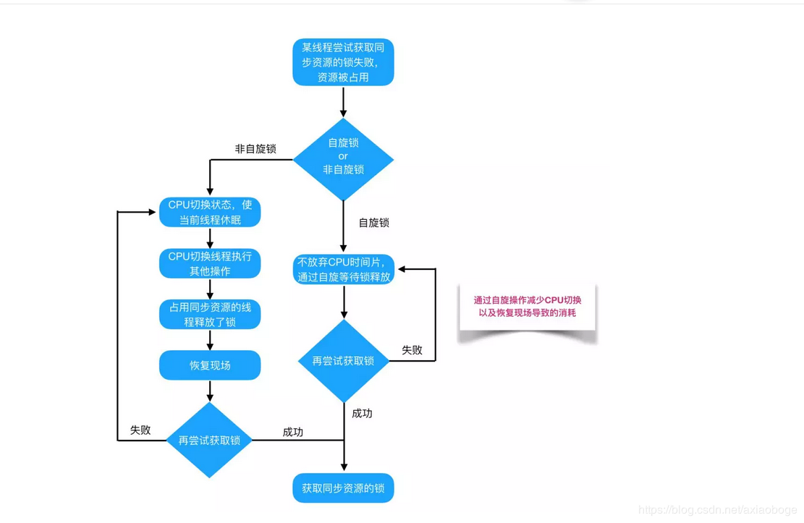
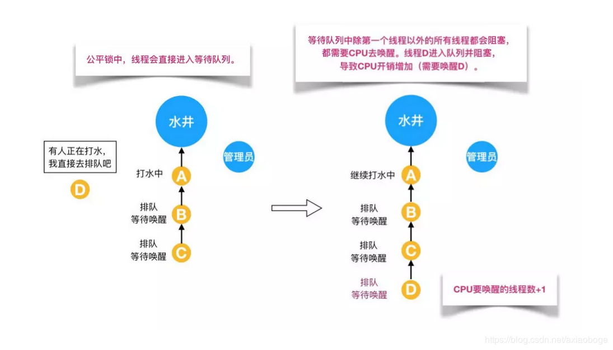

# 锁

　　Java 提供了种类丰富的锁，每种锁因其特性的不同 ，在适当的场景下能够展现出非常高的效率。

## 1. 乐观锁 VS 悲观锁

　　客观所与悲观锁是一种广义上的概念，体现了看待线程同步的不同角度。在 Java 和数据库中都有此概念对应的实际应用。

　　对于同一个数据的并发操作，悲观锁认为自己在使用数据的时候一定有别的线程来修改数据，因此在获取数据的时候会先加索，确保数据不会被别的线程修改。Java 中，synchronized 关键字和 Lock 的实现类都是悲观锁。

　　而乐观锁认为自己在使用数据时不会有别的线程修改数据，所以不会添加锁，只是在更新数据的时候去判断之前有没有别的线程更新了这个数据。如果这个数据没有被更新，当前线程将自己修改的数据成功写入。如果数据已经被其他线程更新，则根据不同的实现方式执行不同的操作（例如报错或者自动重试）。

　　乐观锁在 Java 中是通过使用无锁变成来实现，最长采用的是 CAS 算法，Java 原子类中的递增操作就通过 CAS 自旋实现的。


　　根据从上面的概念描述可以发现：

* 悲观锁适合写操作多的场景，先加锁可以保证写操作时数据正确。
* 乐观锁适合读操作多的场景，不加锁的特点能够使其读操作的性能大幅提升。

```java
    // --------悲观锁的调用方式--------
    // synchronized
    public synchronized void testMethod() {
        // 操作同步资源
    }

    //ReentrantLock
    private ReentrantLock lock = new ReentrantLock();// 需要保证多个线程使用同一个锁

    public void modifyPublicResources() {
        lock.lock();
        // 操作同步资源。
        lock.unlock();
    }

    // --------乐观锁的调用方式--------
    private AtomicInteger atomicInteger = new AtomicInteger(); // 需要保证多个线程使用同一个 AtomicInteger

    public void increment() {
        atomicInteger.incrementAndGet(); // 执行自增1
    }
```

　　通过调用方式示例，可以发现悲观锁基本都是在显示的锁定之后再操作同步资源，而乐观锁则直接去操作同步资源。那么，为何乐观锁能够做到不锁定同步资源也可以正确的实现线程同步呢？通过介绍乐观锁的主要实现方式 “CAS” 的技术原理来解释。

　　CAS 全称 Compare And Swap（比较与交换），是一种无锁算法。在不使用锁（没有线程被阻塞）的情况下实现多线程之间的变量同步。java.util.concurrent 包中的原子类就是通过 CAS 来实现了乐观锁。

　　CAS 算法涉及到三个操作数：

* 需要读写的内存值 V。
* 进行比较的值 A。
* 要写入的新值 B。

　　当且仅当 V 的值等于 A 时，CAS 通过原子方式用新值 B 来更新 V 的值（“比较 + 更新” 整体是一个原子操作），否则不会执行任何操作。一般情况下，“ 更新 ” 是一个不断重试的操作。

　　之前提到 java.util.concurrent 包中的原子类，就是通过 CAS 来实现了乐观锁，那么进入原子类 AtomicInteger 的源码，看一下 AtomicInterfer 的定义：

```java
public class AtomicInteger extends Number implements java.io.Serializable {
    private static final long serialVersionUID = 6214790243416807050L;

    /*
     * This class intended to be implemented using VarHandles, but there
     * are unresolved cyclic startup dependencies.
     */
    private static final jdk.internal.misc.Unsafe U = jdk.internal.misc.Unsafe.getUnsafe();
    private static final long VALUE = U.objectFieldOffset(AtomicInteger.class, "value");

    private volatile int value;
}
```

　　根据定义可以看出个属性的作用：

* U：获取并操作内存的数据。
* VALUE：存储 value 在 AtomicInteger 中的偏移量。
* value：存储 AtomicInteger 的 int 值，该属性需要借助 volatile 关键字保证其在线程间是可见的。

　　接下来，查看 AtomicInteger 的自增函数 incrementAndGet() 的源码时。

```java
    public final int incrementAndGet() {
        return U.getAndAddInt(this, VALUE, 1) + 1;
    }

```

　　发现自增函数底层实现调用的是 U.getAndAddInt()，也就是 Unsafe 的 getAndAddInt() 方法，接着查看 Unsafe 的源码。

```java
    @HotSpotIntrinsicCandidate
    public final int getAndAddInt(Object o, long offset, int delta) {
        int v;
        do {
            v = getIntVolatile(o, offset);
        } while (!weakCompareAndSetInt(o, offset, v, v + delta));
        return v;
    }
```

　　根据 Unsafe 的 getAndAddInt() 方法的源码可以看出，getAndAddInt() 循环获取给定对象 o 中的偏移量处的值 v，然后判断内存值是否等于 v。如果相等则将内存值设置为 v+delta，否则循环仅从重试，直到设置成功才能退出循环，并且将旧值返回。这个 “ 比较+更新 ” 操作封装在 weakCompareAndSetInt() 中，在 JNI 里是借助一个 CPU 指令完成的，属于原子操作，可以保证多个线程都能够看到同一个变量的修改值。

　　后续 JDK 通过 CPU 的 cmpxchg 指令，去比较寄存器中的 A 和内存中的值 V。如果相等，就把要写入的新值 B 写入内存中。如果不相等，九江内存值 V 复制给寄存器中的值 A。然后通过 Java 代码中的 while 循环再次调用 cmpxchg 指令进行重试，直到设置成功为止。

　　CAS 虽然很高效，但是它也存在三大问题，这里也简单说一下：

1. ABA 问题。CAS 需要在操作值得时候检查内存值是否发生变化，没有发生变化才会更新内存值。但是如果内存值原来是 A，后来变成了 B，然后又变成了 A，那么 CAS 进行检查时会发现值没有发生变化，但是实际上是有变化的。ABA 问题的解决思路就是在变量前面添加版本号，每次变量更新的时候都把版本号加一，这样变化过程就从 “ A-B-C ” 变成了 “1A - 2B - 3A”。

   JDK 从 1.5 开始提供了 AtomicStampedReference 类来解决 ABA 问题，具体操作封装在 compareAndSet() 中。compareAndSet() 首先检查当前引用和当前标志与预期引用和于其标志是否相等，如果都相等，则以原子方式将引用值和标志的值设置为给定的更新值。

2. 循环时间长开销大。CAS 操作如果长时间不成功，会导致其一直自旋，给 CPU 带来非常大的开销。

3. 只能保证一个共享变量的原子操作。对一个共享变量执行操作时，CAS 能够保证原子操作，但是对多个共享变量操作时，CAS 是无法保证操作的原子性的。

　　Java 从 1.5 开始 JDK 提供了 AtomicReference 类来保证引用对象之间的原子性，可以把多个变量放在一个对象里来进行 CAS 操作。

## 2. 自旋锁 VS 适应性自旋锁

　　阻塞或唤醒一个 Java 线程需要操作系统切换 CPU 状态来完成，这种状态转换需要耗费处理器时间。如果同步代码块中的内存过于简单，状态转换消耗的时间有可能比用户代码执行的时间还要长。

　　在许多场景中，同步资源的锁定时间很短，为了这一小段时间去却换线程，线程挂起和恢复现场的花费可能会让系统得不偿失。如果物理机器有多个处理器，能够让两个或以上的线程同时并发执行，就可以让后面那个请求锁的线程不放弃 CPU 的执行时间，看看持有锁的线程是否很快就会释放锁。

　　而为了让当前线程 “ 稍等一下 ”，需让当前线程进行自旋，如果在自旋完成后前面锁定同步资源的线程已经释放了锁，那么当前线程就可以不必阻塞而是直接获取同步资源，从而避免切换线程的开销。这就是自旋锁。



　　自旋锁本身是优缺点的，它不能代替阻塞。自旋等待虽然避免了线程切换的开销，但它要占用处理器时间。如果锁被占用的时间很短，自旋等待的效果就会非常好。反之，如果锁被占用的时间很长，那么自旋的线程只会白浪费处理器资源。所以，自旋等待的时间必须要有一定的限度，如果自旋超过了限定次数（默认是 10 次，可以使用 -XX:PreBlockSpin 来更改）没有成功获得锁，就应当挂起线程。

　　自旋锁的实现原理同样也是 CAS，AtomicInteger 中调用 unsafe 进行自增操作的源码中的 do-while 循环就是一个自旋操作，如果修改数值失败则通过循环来执行自旋，直至修改成功。

```java
    @HotSpotIntrinsicCandidate
    public final int getAndAddInt(Object o, long offset, int delta) {
        int v;
        do {
            v = getIntVolatile(o, offset);
        } while (!weakCompareAndSetInt(o, offset, v, v + delta));
        return v;
    }
```

　　自旋锁在 JDK 1.4.2 中引入，使用 -XX:+UseSpinning 来开启。JDK 6 中变为默认开启，并且引入了自适应的自旋锁（适应性自旋锁）。

　　自适应意味着自旋的时间（次数）不再固定，而是由前一次在同一个锁上的自旋时间及锁的拥有者的状态来决定。如果在同一个锁对象上，自旋等待刚刚成功获得过锁，并且持有锁的线程正在运行中，那么虚拟机就会认为这次自旋也是很有可能再次成功，进而它将允许自旋等待持续相对更长的时间。如果对于某个锁，自旋很少成功获得过，拿在以后尝试这个锁时将可能省略掉自旋过程，直接阻塞线程，避免浪费处理器资源。

　　在自旋锁中，另有三种常见的锁形式：TicketLock、CLHlock 和 MCSlock。 

## 3. 无锁 VS 偏向锁 VS 轻量级锁 VS 重量级锁

　　这四种锁是指所得状态，专门针对 synchronzied 的。

　　首先为什么 syynchronized 能实现线程同步？

　　在回答这个问题置线需要了解两个重要的概念：“Java 对象头”、“Monitor”。

### 对象头

　　synchronized 是悲观锁，在操作同步资源之前需要给同步资源先加锁，这把锁就是存在 Java 对象头里的，而 Java 对象头优势什么呢？

　　以 Hotspot 虚拟机为例，Hotspot 的对象头主要包括两部分数据：Mark Word（标记字段）、Klass Pointer（类型指针）。

　　Mark Word：默认存储对象的 HashCode，分代年龄和锁标志位信息。这些信息都是与对象自身定义无关的数据，所以 Mark Word 被设计成毅哥非固定的数据结构以便在极小的空间内存存储尽量多的数据。它会根据对象的状态复用自己的存储空概念，也就是说在运行期间 Mark Word 里存储的数据会随着锁标志位的变化而变化。

　　Klass Point：对象指向它的类元数据的指针，虚拟机通过这个指针来确定这个对象是哪个类的示例。

### Monitor

　　Monitor 是线程私有的数据结构，每一个线程都有一个可用 monitor record 列表，同时还有一个全局的可用列表。每一个被锁住的对象都会和一个 monitor 关联，同时 monitor 中有一个 Owner 字段存放拥有该锁的线程的唯一标识，标识该锁被这个线程占用。

　　synchronzied 通过 Monitor 来实现线程同步，Monitor 是依赖于底层的操作系统的 Mytex Lock（互斥锁）来实现的线程同步。

　　如同在自旋锁中提到的 “ 阻塞或唤醒一个 Java 线程需要操作系统切换 CPU 状态来完成，这种状态转换需要耗费处理器时间。如果同步代码块中的内容过于简单，状态转换消耗的时间有可能比用户代码执行的时间还要长 ”。这种方式就是 synchronized 最初实现同步的方式，这就是 JDK 6 之前 synchronzied 效率低的原因。这种依赖于操作系统 Mutex Lock 所实现的锁称之为 “ 重量级锁 ”，JDK 6 中为了i暗哨获得锁和释放锁带来的性能消耗，引入了 “偏向锁” 和 “轻量级锁”。

　　所以目前锁一共有 4 种状态，级别从低到高依次是：无锁、偏向锁、轻量级锁和重量级锁。锁状态只能升级不能降级。

　　通过上面的介绍，对 synchronized 的加锁机制以及相关只是有了一个了解，那么给出四种锁状态对应的 Mark Word 内容，然后再分别讲解四种锁状态的思路以及特点：

| 锁状态   | 存储内容                                                 | 存储内容 |
| -------- | -------------------------------------------------------- | -------- |
| 无锁     | 对象的hashCode、对象分代年龄、是否是偏向锁（O）          | 01       |
| 偏向锁   | 偏向线程 ID、偏向时间戳、对象分代年龄、是否是偏向锁（1） | 01       |
| 轻量级锁 | 指向栈中锁记录的指针                                     | 00       |
| 重量级锁 | 指向互斥量（重量级锁）的指针                             | 10       |

### 无锁

　　无锁没有对资源进行锁定，所有的线程都能访问并修改同一个资源，但同时只有一个线程能修改成功。

　　无锁的特点就是修改操作在循环内进行，线程会不断的尝试修改共享资源。如果没有冲突就修改成功并退出，否则就会继续循环尝试。如果有多个线程修改同一个值，必定会有一个线程能修改成功，而其他修改失败的线程会不断重试直到修改成功。上面介绍的 CAS 原理及应用即是无锁的实现。无锁无法全面代替有锁，但无锁在某些场合下的性能是非常高的。

### 偏向锁

　　偏向锁是指一段同步代码一直被一个线程所访问，那么该线程会自动获取锁，降低获取锁的代价。

　　在大多数情况下，锁总是由同一个线程多次获得，不存在多线程竞争，所以出现了偏向锁。其目标就是在只有一个线程执行同步代码块时能够提高性能。

　　当一个线程访问同步代码块并获取锁时，会在 Mark Woord 里存储锁偏向的线程 ID。在线程进入和退出同步块时不再通过 CAS 操作来加锁和解锁，而是检测 Mark Word 里是否存储着指向当前线程的偏向锁。引入偏向锁是为了在无多线程竞争的情况下尽量减少不必要的轻量级锁执行路径，因为轻量级锁的获取及释放依赖多次 CAS 原子指令，而偏向锁只需要在置换 ThreadID 的时候依赖多次 CAS 原子指令，而变量所只需要在置换 ThreadID 的时候依赖一次 CAS 原子指令即可。

　　偏向锁只有遇到其他线程尝试竞争偏向锁时，持有偏向锁的线程才会释放锁，线程不会主动释放偏向锁。偏向锁的撤销，需要等待全局安全点（在这个时间点上没有字节码正在执行），它会首先暂停拥有偏向锁的线程，判断锁对象是否处于被锁定状态。撤销偏向锁后恢复到无锁（标志位为 “01” ）或轻量级锁（标志位为 “00” ）的状态。

　　偏向锁在 JDK 6 及以后的 JVM 里是默认启用的。可以通过 JVM 参数关闭偏向锁：-XX:-UseBiasedLocking=false，关闭之后程序默认会进入轻量级锁状态。 

### 轻量级锁

　　是指锁是偏向锁的时候，被另外的线程所访问，偏向锁就会升级为轻量级锁，其他线程会通过自旋的形式尝试获取锁，不会阻塞，从而提高性能。

　　在代码进入同步块的时候，如果同步对象锁状态为无锁状态（锁标志位为 “ 01 ” 状态，是否为偏向锁为 “0”），虚拟机首先将在当前线程的栈帧中建立一个名为锁记录（Lock Record）的空间，用于存储锁对象目前的 Mark Word 的拷贝，然后拷贝对象头中的 Mark Word 复制到锁记录中。

　　拷贝成功后，虚拟机将使用 CAS 操作尝试将对象的 Mark Word 更新为指向 Lock Record 的指针，并将 Lock Record 里的 owner 指针指向对象的 Mark Word。

　　如果这个更新动作成功了，那么这个线程就拥有了该对象的锁，并且对象 Mark Word 的锁标志位设置为 “00”，标识此对象处于轻量级锁定状态。

　　如果轻量级锁的更新操作失败了，虚拟机首先会检查对象的 Mark Word 是否指向当前线程的栈帧，如果是就说明当前线程已经拥有了这个对象的锁，那就可以直接进入同步块继续执行，否则说明多个线程竞争锁。

　　若当前只有一个等待线程，则该线程通过自旋进行等待。但是当自旋超过一定的次数，或者一个线程在持有锁，一个在自旋，又有第三个来访问时，轻量级锁升级为重量级锁。

### 重量解锁

　　升级为重量级锁时，锁标志的状态值变为 "10"，此时 Mark Word 中存储的是指向重量级锁的指针，此时等待锁的线程都会进入阻塞状态。

　　整体的锁状态升级流程图下：


　　综上，偏向锁通过对比 Mark Word 解决加锁问题，避免执行 CAS 操作。而轻量级锁通过用 CAS 操作和自旋来解决加锁问题，避免线程阻塞和唤醒而影响性能。重量级锁是将除了拥有锁的线程以外的线程都阻塞。

## 4. 公平锁 VS 非公平锁

　　公平锁是指多个线程按照申请所得顺序来获取锁，线程直接进入队列中排队，队列中的第一个线程才会获得锁。公平锁的优点是等待锁的线程不会饿死。缺点是整体吞吐效率相对非公平锁要低，等待队列中除了第一个线程以外的所有线程都会阻塞，CPU 唤醒阻塞线程的开销比非公平锁大。

　　非公平锁是多个线程加锁时直接尝试获取锁，获取不到才会到等待队列的队尾等待。但如果此时锁刚好可用，那么这个线程可以无需阻塞直接获取到锁，所以非公平锁有可能出现后申请锁的线程先获取锁的场景。非公平锁的优点是可以减少唤醒线程的开销，整体的吞吐效率高，因为线程有几率不阻塞直接获得锁，CPU 不必唤醒所有线程。缺点是处于等待队列中的线程可能会饿死，或者等很久才会获得锁。

　　用一个例子来讲述一下公平锁和非公平锁。



　　假设有一口水井，有管理员看守，管理员有一把琐，只有拿到锁的人才能够打水，打完水要把锁还给管理员。每个过来打水的人都要管理的允许并拿到锁之后才能去打水，如果前面有人正在打水，那么这个想要打水的人就必须排队。管理员会查看下一个要去打水的人是不是队伍里排最前面的人，如果是的话，才会给你锁让你去打水；如果你不是排第一的人，就必须去队尾排队，这就是公平锁。

　　但是对于非公平锁，管理员对打水的人没有要求。及时等待队列里有排队等待的人，但如果在上一个人刚打完睡把锁还给管理员而且管理员还没有允许等待队伍里下一个人去打水时，正好来了一个插队的人，这个插队的人是可以直接从管理员那里拿到锁去打水，不需要排队，原本排队等待的人只能继续等待。如下图所示：


　　接下来通过 ReentrantLock 的源码来讲解公平锁和非公平锁。

```java
public class ReentrantLock implements Lock, java.io.Serializable {
    private static final long serialVersionUID = 7373984872572414699L;
    /** Synchronizer providing all implementation mechanics */
    private final Sync sync;

    /**
     * Base of synchronization control for this lock. Subclassed
     * into fair and nonfair versions below. Uses AQS state to
     * represent the number of holds on the lock.
     */
    abstract static class Sync extends AbstractQueuedSynchronizer {...}
    
     /**
     * Sync object for non-fair locks
     */
    static final class NonfairSync extends Sync {...}
    
    /**
     * Sync object for fair locks
     */
    static final class FairSync extends Sync {...}
    
    /**
     * Creates an instance of {@code ReentrantLock}.
     * This is equivalent to using {@code ReentrantLock(false)}.
     */
    public ReentrantLock() {
        sync = new NonfairSync();
    }

    /**
     * Creates an instance of {@code ReentrantLock} with the
     * given fairness policy.
     *
     * @param fair {@code true} if this lock should use a fair ordering policy
     */
    public ReentrantLock(boolean fair) {
        sync = fair ? new FairSync() : new NonfairSync();
    }
}
```

　　根据代码可知，ReentrantLock 里面有一个内部类 Sync，Sync 继承 AQS（AbstractQueuedSynchronizer），添加锁和释放锁的大部分操作实际上都是在 Sync 中实现的。它有公平锁 FairSync 和非公平锁 NonfairSyn 两个子类。ReentrantLock 默认使用非公平锁，也可以通过构造器来显示的指定使用公平锁。

　　公平锁与非公平锁的加锁方法的源码：

```java
    /**
     * Sync object for fair locks
     */
    static final class FairSync extends Sync {
        private static final long serialVersionUID = -3000897897090466540L;
        /**
         * Fair version of tryAcquire.  Don't grant access unless
         * recursive call or no waiters or is first.
         */
        @ReservedStackAccess
        protected final boolean tryAcquire(int acquires) {
            final Thread current = Thread.currentThread();
            int c = getState();
            if (c == 0) {
                // hasQueuedPredecessors() 查询是否有任何线程等待获取的时间超过当前线程。
                if (!hasQueuedPredecessors() &&
                    compareAndSetState(0, acquires)) {
                    setExclusiveOwnerThread(current);
                    return true;
                }
            }
            else if (current == getExclusiveOwnerThread()) {
                int nextc = c + acquires;
                if (nextc < 0)
                    throw new Error("Maximum lock count exceeded");
                setState(nextc);
                return true;
            }
            return false;
        }
    }
```


```java
    /**
     * Sync object for non-fair locks
     */
    static final class NonfairSync extends Sync {
        private static final long serialVersionUID = 7316153563782823691L;
        protected final boolean tryAcquire(int acquires) {
            return nonfairTryAcquire(acquires);
        }
    }
    
            /**
         * Performs non-fair tryLock.  tryAcquire is implemented in
         * subclasses, but both need nonfair try for trylock method.
         */
        @ReservedStackAccess
        final boolean nonfairTryAcquire(int acquires) {
            final Thread current = Thread.currentThread();
            int c = getState();
            if (c == 0) {
                if (compareAndSetState(0, acquires)) {
                    setExclusiveOwnerThread(current);
                    return true;
                }
            }
            else if (current == getExclusiveOwnerThread()) {
                int nextc = c + acquires;
                if (nextc < 0) // overflow
                    throw new Error("Maximum lock count exceeded");
                setState(nextc);
                return true;
            }
            return false;
        }
```

　　通过上面的源代码对比，可以明显的看出


```java
// AbstractQueuedSynchronzier.java
	public final boolean hasQueuedPredecessors() {
        Node h, s;
        if ((h = head) != null) {
            if ((s = h.next) == null || s.waitStatus > 0) {
                s = null; // traverse in case of concurrent cancellation
                for (Node p = tail; p != h && p != null; p = p.prev) {
                    if (p.waitStatus <= 0)
                        s = p;
                }
            }
            if (s != null && s.thread != Thread.currentThread())
                return true;
        }
        return false;
    }
```


## 5. 可重入锁 VS 非可重入锁

## 6. 独享锁 VS 共享锁


## 参考文章
1. [java中的各种锁详细介绍](https://www.cnblogs.com/jyroy/p/11365935.html)
2. [Java中的锁分类与使用](https://www.cnblogs.com/hustzzl/p/9343797.html)
3. [java中的几种锁（很详细）-小白收藏](https://blog.csdn.net/Hdu_lc14015312/article/details/100053032)