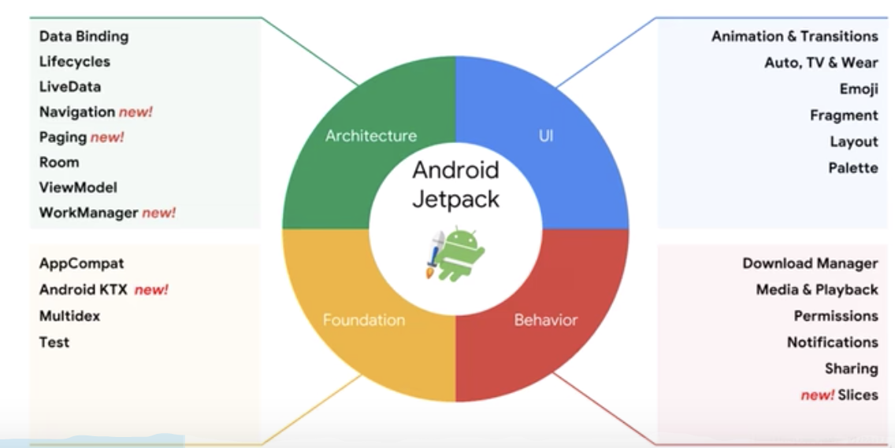
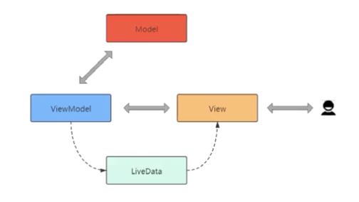

#  01 - 了解 Jetpack

Jetpack 与 MVVM 架构设计

01 - LifeCycle

02 - ViewModel

03 - LiveData

## 初识 Jetpack

* Android App 架构设计标准的缺失

  * MVC、MVP 还是 MVVM
  * 非 Google 官方解决方案
  * 无法辨别最佳解决方案

* 什么是 Jetpack

  Jetpack 是一个由多个库组成的套件，可帮助开发者遵循最佳做法，减少样板代码并编写可在各种 Android 版本和设备中一致运行的代码，让开发者精力集中编写重要的代码。

  
  
* 为何使用 Jetpack

  * 遵循最佳做法

    Android Jetpack 组件采用最新的设计方法构建，具有向后兼容性，可以减少崩溃和内存泄漏。

  * 消除样板代码

    Android Jetpack 可以管理各种繁琐的 Android（如后台任务、导航和生命周期管理），以便您可以专注于打造出色的应用。

  * 减少不一致

    这些库可在各种 Android 版本和设备中以一致的方式运作，助您降低复杂性。

* Jetpack 与 AndroidX
  * AndroidX 命名空间中的包含 Android Jetpack 库
  * AndroidX 代替 Android Support Library
  * AAC（Android Architecture Component）中的组件并入 AndroidX
  * 其他一些需要频繁更新和迭代的特性也被并入了 AndroidX
* 

# 02 - 使用 LifeCycle 解耦界面与组件

## LifeCycle

* LifeCycle 的诞生

  解耦的问题：系统组件与普通组件解耦。

* LifeCycle 应用

  * 使用 LifeCycle 解耦页面与组件
  * 使用 LifecycleService 解耦 Service 与组件
  * 使用 ProcessLifecyleOwner 监听应用程序生命周期

# 03 - 使用 LifeCycle 解耦 Service 与组件

* adb geo 设置 GPS 位置
  * adb -s emulator-5554 emu geo fix 121.4961236714487 31.24010934431376
  * adb -s emulator-5554 emu geo fix 122.4961236714487 31.24010934431376

# 04 - 使用 ProcessLifecycleOwner 监听应用程序生命周期

* ProcessLifecycleOwner
  * 针对整个应用程序的监听，与 Activity 数量无关
  * Lifecycle.ON_CREATE 只会被调用一次，Lifecycle.ON_DESTORY 永远不会被调用。

* 使用

  Application 中使用 ProcessLifecycleOwner.get().getLifecycle().addObserver(new ApplicationObserver());

* LifeCycle 的好处

  * 帮助开发者建立可感知生命周期的组件
  * 组件在其内部管理自己的生命周期，从而降低模块耦合度
  * 降低内存泄漏发生的可能性
  * Activity、Fragment、Service、Application 均有 LifeCycle 支持

# 05 - ViewModel 的诞生与作用

## ViewModel

* ViewModel 的诞生
  * 瞬态数据丢失
  * 异步调用的内存泄漏
  * 类膨胀提高维护难度和测试难度
* ViewModel 的作用
  * 它是介于 View（视图）和 Model（数据模型）之间的桥梁
  * 使视图和数据能够分离，也能保持通信

# 06 - ViewModel 应用与生命周期

* ViewModel 的应用

  * 屏幕旋转之后用户操作数据仍然存在

* 使用

  MyViewModel extends ViewModel。

  Activity 中拿到 ViewModel：

  ```java
  MyViewModel myViewModel = new ViewModelProvider(this,new ViewModelProvider.AndroidViewModelFactory(getApplication())).get(MyViewModel.class);
  ```

  使用：

  ```java
  textView.setText(String.valueOf(viewModel.number));
  viewmodel.number++;
  ```

* ViewModel 的生命周期特性

  独立于配置变化

* AndroidViewModel

  * 不要向 ViewModel 中传入 Context，会导致内存泄漏
  * 如果要使用 Context，请使用 AndroidViewModel 中的 Application

# 07 - LiveData 应用

## LiveData

* LiveData 和 ViewModel 的关系

  在 ViewModel 中的数据发生变化时通知页面。



* LiveData 应用
  * 简单应用
  * ViewModel + LiveData 实现 Fragment 间通信

# 08 - ViewModel+LiveData 实现 Fragment 间通信

* LiveData 的优势
  * 确保界面符合数据状态
  * 不会发生内存泄漏
  * 不会因 Activity 停止而导致崩溃
  * 不再需要手动处理生命周期
  * 数据始终保持最新状态
  * 适当的配置更改
  * 共享资源


