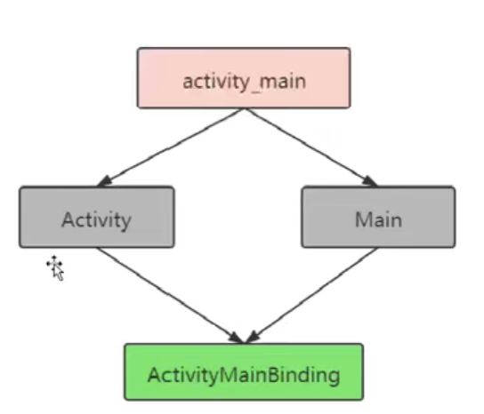
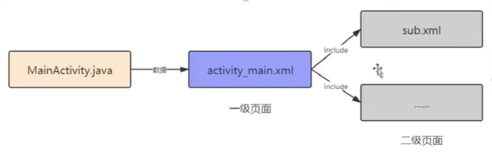
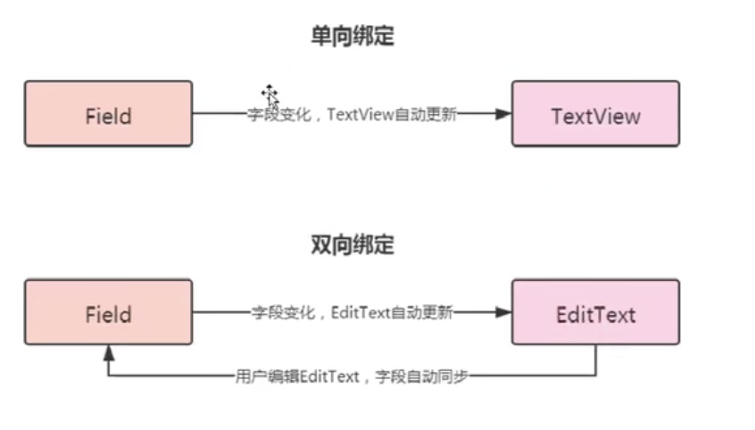

# 09 - DataBinding 的意义与应用

## DataBinding

* DataBinding 的意义

  让布局文件承担了部分原本属于页面的工作，使页面与布局耦合度进一步降低。

* DataBinding 应用

  明星信息展示

* ActivityMainBinding 由来

  

# 10 - import 标签和事件绑定

import 引入辅助类，帮助转换数据。

时间绑定也是用 DataBinding 实现。

# 11 - 二级页面的绑定

* \<include> 标签引用二级页面

include   app:idol = "@{idol}"

# 12 - 自定义 BindingAdapter 加载网络图片

* 自定义 BindingAdapter
  *  加载网络图片
  * 方法重载，加载本地图片
  * 多参数重载

# 13 - 双向绑定 BaseObservable 与 ObservableField

* 双向绑定

  BaseObservable 与 ObservableField

  

  BaseObservable 做双向绑定，notifyPropertyChanged() 通知属性发生变化。@Bindable 绑定数据变化

  android:text = "@={userViewModel.userName}" 双向绑定。userViewModel 继承 BaseObservable。

  使用 ObservableField 实现会更加简洁，更像 LiveData。

  private ObservableField\<User> userObservableField;

# 14 - RecycleView 的绑定

* RecycleView 的绑定

  我的前女友们 - 案例

  RecyclerViewAdapter 中 DataBindingUtil.inflate() 加载布局。

  绑定数据的时候，用 holder.getItemDataBinding.setidol(idol) 绑定数据。

# 15 - DataBinding + ViewModel + LiveData

* DataBinding + ViewModel + LiveData

  篮球比赛分牌 - 案例

  Android:onClick="@{()->viewmodel.aTeamAdd(1)}" // 点击事件

* DataBinding 的优势

  * 不再需要 findViewById，项目更加简洁，可读性更高。
  * 布局文件可以包含简单的业务逻辑。

