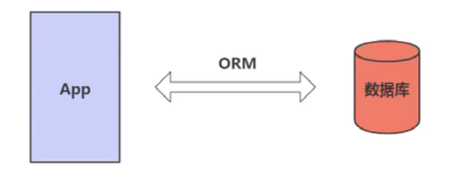
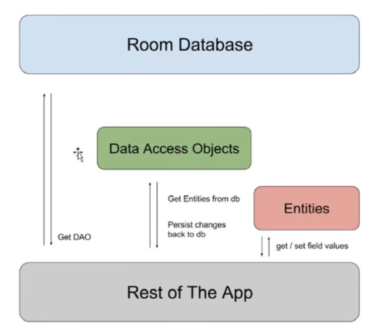
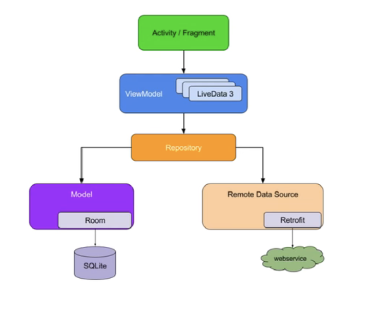
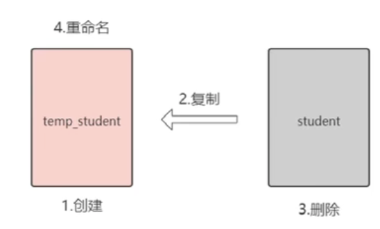

# 16 - Room 的重要概念与关系

## Room 上手

* Android 官方 ORM 库 Room

  Android 采用 SQLite 作为数据库存储，开源社区常见的 ORM（Object Relational Mapping）库有 ORMLite、GreenDAO 等。Room 和其他库一样，也是在 SQLite 上提供了一层封装。

  

* Room 重要概念

  * Entity：实体类，对应的是数据库的一张表结构，使用注解 @Entity 标记。
  * Dao：包含访问一系列访问数据库的方法，使用注解 @Dao 标记。
  * Database：数据库持有者，作为与应用持久化相关数据的底层连接的主要接入点。使用注解 @Database 标记，另外需满足以下条件：定义的类必须是一个继承于 RoomDatabase 的抽象类，在注解中需要定义于数据库相关联的实体类列表。包含一个没有参数的抽象方法并且返回一个 Dao 对象。

* 三者关系

  

# 17 - Room 应用

* Room 应用

  学生信息的 CRUD

# 18 - Room + ViewModel + LiveData

## 优化

* 进一步优化

  * 问题：每当数据库数据发生变化时，都需要开启一个工作线程去重新获取数据库中的数据。
  * 解决：当数据发生变化时，通过 LiveData 通知 View 层，实现数据自动更新。

* Room + ViewModel + LiveData

  

  dao 支持返回 Livedata 数据。

# 19 - 使用 Migration 升级数据库

## 升级与预填充

* 使用 Migration 升级数据库

  问题：如果用户设备上数据库版本为 1，而当前要安装的 App 数据库版本为 3，怎么办？

  * Room 会先判断当前有没有直接从 1 到 3 的升级方案，如果有，就直接执行从1 到 3 的升级方案，如果没有，那么 Room 会按照顺序先后执行 Migration(1,2)、Migration(2,3) 以完成升级。

# 20 - 升级的异常处理

* 异常处理

  假设我们将数据库版本升级到 4，却没有为此写相应的 Migration，则会出现一个 IllegalStateException 异常，加入 fallbackToDestructiveMigration()，该方法在出现升级异常时，重建数据表，同时数据也会丢失。

# 21 - Scheme 文件

*  Scheme 文件

  Room 在每次数据库升级过程中，都会导出一个 Scheme 文件，这是一个 json 格式的文件，其中包含了数据库的基本信息，有个该文件，开发者能清楚的知道数据库的历次变更情况，极大地方便了开发者排查问题。

  在 gradle 中配置 scheme 文件存储的位置。

# 22 - 销毁和重建策略

* 销毁和重建策略

  在 SQLite 中修改表结构比较麻烦，例如，我们想将 Student 表中 sex 字段类型从 INTEGER 改为 TEXT，最好的方式是采用销毁与重建策略，大致分为以下步骤：

  * 创建一张符合表结构要求的临时表 temp_student
  * 将数据从旧表 student 复制到临时表 temp_student
  * 删除旧表 student
  * 将临时表 temp_student 重命名为 student

# 23 - 预填充数据库

* 预填充数据库

  有时候我们希望应用自带一些数据供我们使用，我们可以将数据库文件放入 assets 目录一起打包发布，在用户首次打开 App 时，使用 createFromAssets() 和 createFromFile() 创建 Room 数据库。

