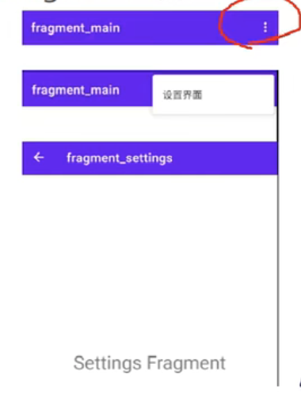

# 24 - Navigation 的诞生与优势

## 认识 Navigation

* Navigation 的诞生
  * Activity 嵌套多个 Fragment 的 UI 架构模式已经非常普遍，但是对 Fragment 的管理一直是一件比较麻烦的事情。我们需要通过 FragmentManager 和 FragmentTransaction 来管理 Fragment 之间的切换。页面的切换通常还包含对应用程序 App bar 的管理、Fragment 间的切换动画，以及 Fragment 间的参数传递。纯代码的方式使用起来不是特别友好，并且 Fragment 和 App bar 在管理和使用的过程中显得混乱。
  * 为此，Jetpack 提供了 Navigation 组件，旨在方便我们管理页面和 App bar。
* Navigation 的优势
  * 可视化的页面导航图，类似于 Apple Xcode 中的 StoryBoard，便于我们理清页面关系。
  * 通过 destination 和 action 完成页面间的导航。
  * 方便添加页面切换动画。
  * 页面间类型安全的参数传递。
  * 通过 NavigationUI，对菜单、底部导航、抽屉菜单导航进行统一的管理。
  * 支持深度链接 DeepLink。

# 25 - Navigation 的主要元素

* Navigation 的主要元素

  * Navigation Graph，一种新的 XML 资源文件，包含应用程序所有的页面，以及页面间的关系。

  * NavHostFragment，一个特殊的 Fragment，可以将它看作是其他 Fragment 的容器，Navigation Graph 的 Fragment 正是通过 NavHostFragment 进行展示的。

  * NavController，用于在代码中完成 Navigation Graph 中具体的页面切换工作。

  * 他们三者之间的关系

    当你想切换 Fragment 时，使用 NavController  对象，告诉它你想要去 Navigation Graph 中的哪个 Fragment，NavController 会将你想去的 Fragment 展示 NavHostFragment 中。

# 26 - Navigation 应用

* Navigation 应用
  * 创建 NavHostFragment
  * 创建 Fragment
  * 创建 Navigation Graph，指定 destination
  * 完成 Fragment 页面切换
  * 使用 NavController 完成导航
  * 添加页面切换动画效果
  * 普通方式与 safe args 插件方式参数传递

# 27 - 动画效果与 safe args 传参

Safe args 传参需要添加插件：navigation-safe-args-fradle-plugin:2.3.0-alpha06

# 28 - NavigationUI 应用

## Navigation UI

* NavigationUI 的作用

  Fragment 的切换，除了 Fragment 页面本身的切换，通常还伴有 App bar 的变化。为了方便统一管理，Naivagation 组件引入了 NavigationUI 类。

  

* 更多支持

  * App bar
    * ActionBar
    * Toolbar
    * CollapsingToolbarLayout
  * menu
    * 抽屉菜单（DrawLayout+Navigation View）
    * 底部菜单（BottomNavigationView）

# 29 - 深层链接 DeepLink 之 PendingIntent

## DeepLink

* 深层链接 DeepLink
  * PendingIntent 方式
    * 当 App 收到某个通知推送，我们希望用户在点击该通知时，能够直接跳转到展示该通知内容的页面，可以通过 PendingIntent 来完成。
    * Navigation.findNavController(getActivity(),R.id.button).createDeepLink().setGraph(R.navigation.my_nav_graph).setDestination(R.id.detailFragment).createPendingIntent();
    * 可以直接跳转到 Fragment
  * URL 方式
    * 当用户通过手机浏览器浏览网站上某个页面时，可以在网页上放置一个类似于 “在应用内打开” 的按钮，如果用户的手机安装有我们的 App，那么通过 DeepLink 就能打开相应的页面；如果没有安装，那么网站可以导航到应用程序的下载页面，引导用户安装应用程序。
    * adb shell am start -a android.intent.action.VIEW -d "http://www.dongnaoedu.com/fromWeb"

# 30 - 深层链接 DeepLink 之 URL

* URL 使用
  * Androidmainfest.xml 中给 activity 配置 \<nav-graph android:value="@navigation/my_nav_graph">
  * my_nav_graph 中给 fragment 配置  \<deeplink app:uri="www.dongnaoedu.com/{params}">