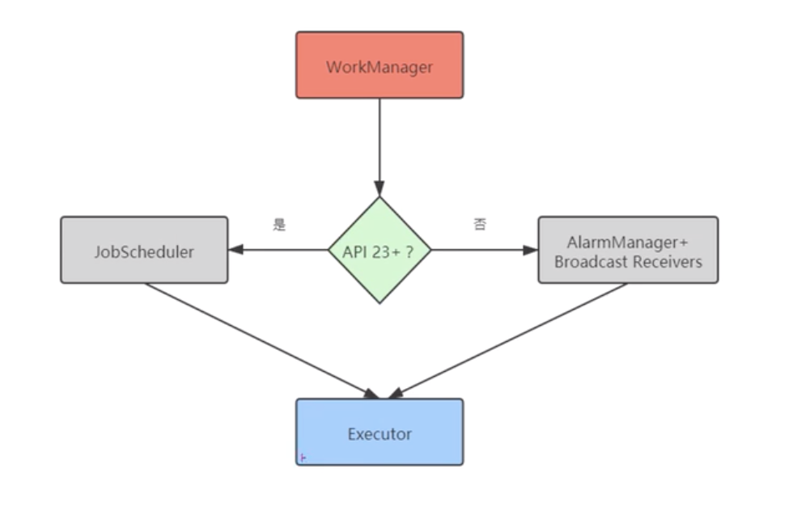
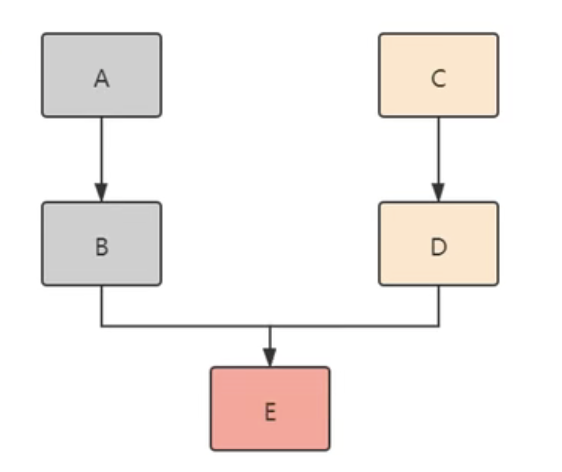

# 31 - WorkManager 作用与特点

## WorkManager 作用与特点

* WorkManager 的作用

  在**后台执行任务**的需求是非常常见的，Android 也提供了多种解决方案，如 JobScheduler、Loader、Service 等，如果这些 API 没有被恰当使用，则可能会消耗大量电量。Android 在解决应用程序耗电问题上做了各种尝试，从 Doze 到 App Standby，通过各种方式限制和管理应用程序，以保证应用程序不会在后台消耗过多的设备电量。WorkManager 为应用程序中那些**不需要及时完成的任务**提供了一个统一的解决方案，以便在**设备电量和用户体验之间达到一个比较好的平衡**。

* WorkManager 的重要特点

  * 针对的是不需要及时完成的任务

    例如，发送应用程序日志、同步应用程序数据、备份用户数据等，这些任务一般都不需要立即完成，如果我们自己来管理这些任务，逻辑可能会非常复杂，若 API 使用不恰当，可能会消耗大量电量。

  * 保证任务一定会执行

    WorkManager 能保证任务一定会被执行，即使应用程序当前不在运行中，甚至在设备重启过后，任务仍然会在恰当的时刻被执行。这是因为 WorkManager 有自己的数据库，关于任务的所有信息和数据都保存在该数据库中。因此只要任务交给了 WorkManager，哪怕应用程序彻底退出，或者设备被重新启动，WorkManager 依然能够保证完成任务。

  * 兼容范围广

    WorkManager 最低能兼容 API Level 14，并且不需要你的设备安装 Google Play Services。因此，不用过于担心兼容性问题，因为 API Level 14 已经能够兼容几乎 100% 的设备了。

# 32 - WorkManager 兼容方案

## WorkManager 兼容方案

* WorkManager 的兼容方案

  

  * WorkManager 能根据设备的情况，选择不同的执行方案。在 API Level 23 以上的设备中，通过 JobScheduler 完成任务，在 API Level 23 以下的设备中，通过 AlarmManager 和 Broadcast Receivers 组合来完成任务。但无论采用哪种方案，任务最终都是由 Executor 来执行的。
  * 另外，WorkManager 不是一种新的工作线程，它的出现不是为了替代其他类型的工作线程。工作线程通常立即运行，并在任务执行完成后给用户反馈。而 WorkManager 不是即时的，**它不能保证任务能立即得到执行**。

  

# 33 - 定义任务与任务执行结果

## WorkManager 使用方法

* WorkManager 的使用方法
  * 添加依赖
  * 使用 Work 类（继承 Worker 类，实现 doWork() 方法）定义任务
  * 使用 WorkRequest 配置任务
    * 设置任务触发条件
    * 将任务触发条件设置到 WorkRequest
    * 设置延迟执行任务
    * 设置指数退避策略
    * 为任务设置 tag 标签
  * 将任务提交给系统
  * 观察任务的状态
  * 取消任务
  * 参数传递
  * 周期性任务
  * 任务链

```java
WorkManager.enqueue(); // 任务提交到 WorkManager
```

# 34 - 设置任务触发条件和延迟执行任务

```java
// 设置触发条件
Constraints constraints = new Constraints.Builder()
  .setRequiredNetworkType(NetworkType.CONNECTED)
  .build();

// 配置任务
// 一次性执行的任务
OneTimeWorkRequest workRequest1 = new OneTimeWorkRequest.Builder(MyWork.class)
  // 设置触发条件
  .setConstraints(constraints)
  // 设置延迟执行，延迟 5 秒执行
  .setInitalDelay(5,TimeUnit.SECONDS)
  .build();

WorkManager.enqueue(workRequest1);
```

注意：不代表恢复网络了，就立马执行。

# 35 - 设置指数退避策略与设置标签

* 指数退避策略

```java
OneTimeWorkRequest workRequest1 = new OneTimeWorkRequest.Builder(MyWork.class)
  // 设置触发条件
  .setConstraints(constraints)
  // 设置延迟执行，延迟 5 秒执行
  .setInitalDelay(5,TimeUnit.SECONDS)
  // 指数退避策略
  .setBackoffCriteria(BackoffPolicy.LINEAR,Duration.ofSeconds(2))
  .build();
```

MyWork 的 doWork() 方法返回 Result.retry()；

隔一段时间重试。

* 设置标签

```java
OneTimeWorkRequest workRequest1 = new OneTimeWorkRequest.Builder(MyWork.class)
  // 设置触发条件
  .setConstraints(constraints)
  // 设置延迟执行，延迟 5 秒执行
  .setInitalDelay(5,TimeUnit.SECONDS)
  // 指数退避策略
  .setBackoffCriteria(BackoffPolicy.LINEAR,Duration.ofSeconds(2))
  // 设置 tag 标签
  .addTag("workRequest1")
  .build();
```

# 36 - 观察任务状态与取消任务

```java
// 观察任务状态
workManager.getWorkInfoByIdLiveData(workRequest.getId()).observe(this,new Observer<WorkInfo>(){
  @Override
  public void onChanged(WorkInfo workInfo){
    
  }
});

// 取消任务
new Timer().schedule(new TimerTask(){
  @Override
  public void run(){
    workManager.cancelWorkById(workRequest1.getId());
  }
},2000);
```

# 37 - 参数传递

```java
Data inputData = new Data.Builder()
  .putString("input_data","jack")
  .build();

OneTimeWorkRequest workRequest1 = new OneTimeWorkRequest.Builder(MyWork.class)
  // 设置触发条件
  .setConstraints(constraints)
  // 设置延迟执行，延迟 5 秒执行
  .setInitalDelay(5,TimeUnit.SECONDS)
  // 指数退避策略
  .setBackoffCriteria(BackoffPolicy.LINEAR,Duration.ofSeconds(2))
  // 设置 tag 标签
  .addTag("workRequest1")
  // 参数传递
  .setInputData(inputData)
  .build();
```

在 MyWork 的 doWork() 方法中就可以拿到数据：

```java
String inputData = getInputData().getString("input_data");
```

返回数据：

在 MyWork 的 doWork() 方法中

```java
public Result doWork(){
  // 任务执行完之后，返回数据
  Data outputData = new Data.Builder()
    .putString("output_data","执行成功")
    .build();
  return Result.success(outputData);
}
```

在监听状态的 onChange() 方法中获取到返回的数据：

```java
// 观察任务状态
workManager.getWorkInfoByIdLiveData(workRequest.getId()).observe(this,new Observer<WorkInfo>(){
  @Override
  public void onChanged(WorkInfo workInfo){
    if (workInfo != nnull && workInfo.getState() == WorkInfo.State.SUCCEEDED){
      String outputData = workInfo.getOutputData().getString("output_data");
    }
  }
});
```

# 38 - 周期性任务

```java
// 周期性任务
// 不能少于 15 分钟
PeriodicWorkRequest workRequest2 = new PeriodicWorkRequest.Builder(MyWork.class,Duration.ofMinutes(15)) // 间隔 15 分钟运行一次
.build();
```

# 39 - 任务链与任务组合

```java
public class AWork extends Worker {
	// .. 构造方法
	
	@NonNull
	@Override
	public Result doWork(){
    Log.d("AWork","doWork")
		return Result.success();
	}
}
```

```java
public class BWork extends Worker {
	// .. 构造方法
	
	@NonNull
	@Override
	public Result doWork(){
    Log.d("BWork","doWork")
		return Result.success();
	}
}
```


```java
public void mAddWork(View view){
	OneTimeWorkRequest workA = new OneTimeWorkRequest.Builder(AWorker.class)
    .build();
  OneTimeWorkRequest workB = new OneTimeWorkRequest.Builder(BWorker.class)
    .build();
  
  WorkManager.getInstance(this)
    .beginWith(workA)
    .then(workB) // 先执行 A，再执行 B
    .enqueue();
}
```

* 任务链组合

  先执行 A、B 和 C、D，再执行 E

  

  ```java
   	OneTimeWorkRequest workA = new OneTimeWorkRequest.Builder(AWorker.class)
      .build();
    OneTimeWorkRequest workB = new OneTimeWorkRequest.Builder(BWorker.class)
      .build();
   	OneTimeWorkRequest workC = new OneTimeWorkRequest.Builder(CWorker.class)
      .build();
    OneTimeWorkRequest workD = new OneTimeWorkRequest.Builder(DWorker.class)
      .build();
    OneTimeWorkRequest workE = new OneTimeWorkRequest.Builder(EWorker.class)
      .build();
  
  // 任务组合
  WorkContinuation workContinuation1 = WorkManager.getInstance(this)
      .beginWith(workA)
      .then(workB);
  
  WorkContinuation workContinuation2 = WorkManager.getInstance(this)
      .beginWith(workC)
      .then(workD);
  
  List<WorkContinuation> taskList = new ArrayList<>();
  taskList.add(workContinuation1);
  taskList.add(workContinuation2);
  
  WorkContinuation.combine(taskList)
    .then(workE)
    .enqueue();
  
  ```

# 40 - WorkManager 回顾总结

