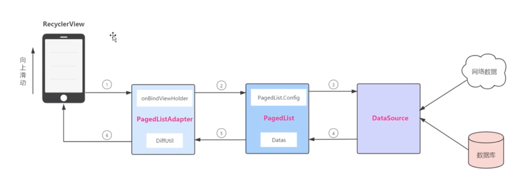
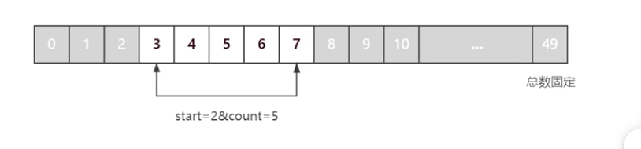
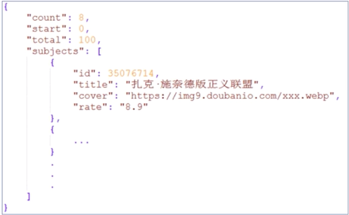
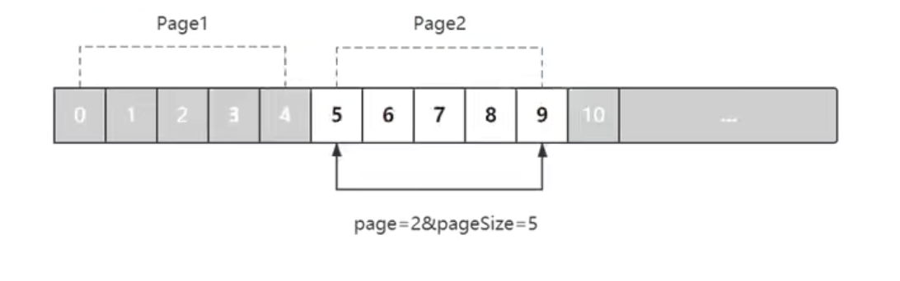
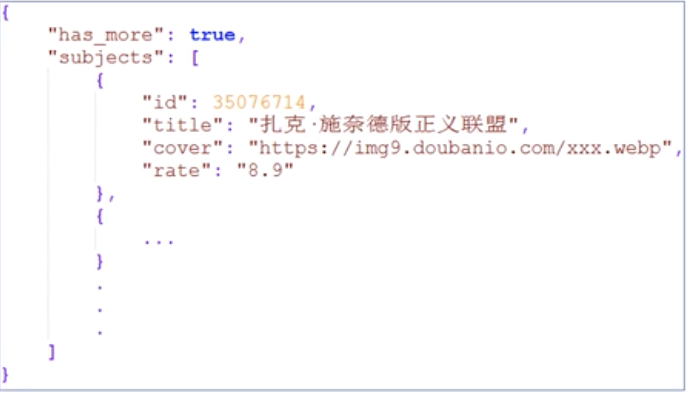
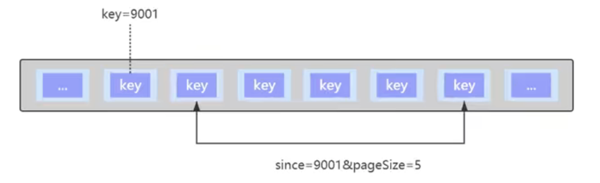
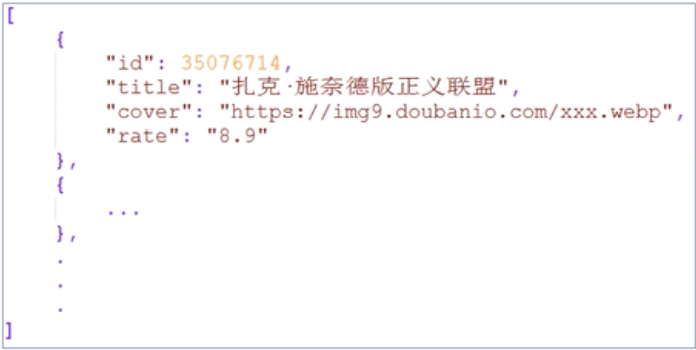
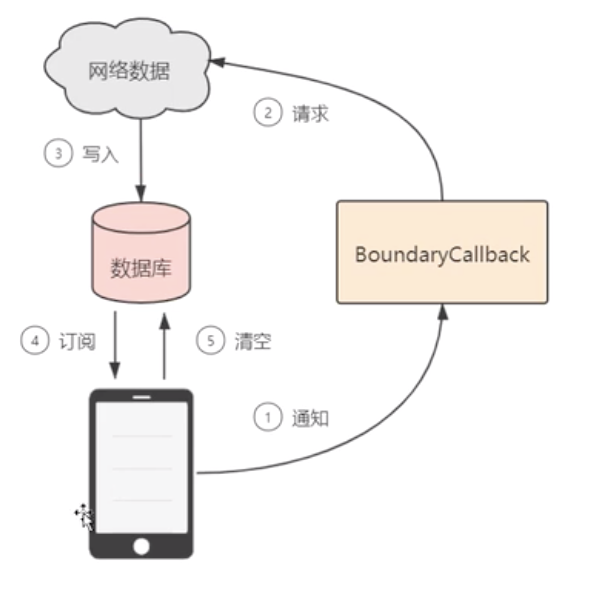

# 41 - Paging 组件的意义与支持的架构类型

## Paging 工作原理

* Paging 组件的意义

  分页加载是在应用程序开发过程中非常常见的需求，Paging 就是 Google 为了方便 Android 开发者完成分页加载而设计的一个组件，它为几种常见的分页机制提供了统一的解决方案，让我们可以把更多的精力专注在业务代码上。

* Paging 支持的架构类型

  

  * 网络

    对网络数据进行分页加载，是最常见的一种分页需求，也是我们学习的重点。不同的公司针对分页机制所设计的 API 接口通常也不太一样，但总体而言可以归纳为 3 种。Paging 组件提供了 3 种不同的方案，以应对不同的分页机制。分别是 PositionDataSource、PageKeyedDataSource、ItemKeyedDataSource。

  * 数据库

    掌握了网络数据分页之后，数据库数据分页将会容易很多，无非就是数据源的替换。

  * 网络+数据库

    由于用户体验的考虑，我们通常会对网络数据进行缓存，以便用户在下次打开应用程序时，应用程序可以先展示缓存数据。我们通常会利用数据库对网络数据进行缓存，这意味着我们需要同时处理好网络和数据库这两个数据源。多数据源会让业务逻辑变得更为复杂，所以，我们通常采用单一数据源作为解决方案。即从网络获取的数据，直接缓存进数据库，列表只从数据库这个唯一的数据源获取数据，这里我们会学习 BundaryCallback。

# 42 - Paging 的工作原理



# 43 - Paging 的 3 个核心类

* Paging 的 3 个核心类

  * PagedListAdapter

    RecyclerView 需要搭配适配器使用，如果希望使用 Paging 组件，适配器需要继承自 PagedListAdapter。

  * PagedList

    PagedList 负责通知 DataSource 何时获取数据，以及如何获取数据。例如，何时加载第一页/下一页，第一页加载的数量、提前多少条数据开始执行预加载等，从 DataSource 获取的数据将存储在 PagedList 中。

  * DataSource

    * 在 DataSource 中执行具体的数据载入工作，数据可以来自网络，也可以来自本地数据库，根据分页机制的不同，Paging 为我们提供了 3 种 DataSource。
    * 数据的载入需要在工作线程中进行。

# 44 - PositionalDataSource 介绍

## DataSource

* PositionalDataSource

  适用于可通过任意位置加载数据，且目标数据源数量固定的情况。例如，请求时携带的参数为 start=2&count=5，则表示向服务器请求从第 2 条数据开始往后的 5 条数据。

  

* PositionalDataSource 使用

  * API 接口

    http://192.168.0.117:8080/pagingserver_war/pds.do?start=0&count=8

  * 接口返回的数据

    

# 45 - 测试所用服务器工程介绍

自己写的服务器代码。

# 46 - Model 与 Retrofit 网络请求代码编写

Movie 是 recyclerview 展示的数据 item，要复写 equals 和 hashcode 方法，因为后面要用 diffutils 方法。

Retrofit 完成网络请求。

# 47 - PositionalDataSource 与 DataSource.Factory 具体实现

```java
public class MovieDataSource extends PositionalDataSource<Movie> {
  public static final int PER_PACE = 8;
	// 页面首次加载数据会调用
  @Override
  public void loadInitial(@NonNull LoadInitialParams params, @NonNull LoadInitialCallback<Movie> callback){
    int startPosition = 0;
    
    RetrofitClient.getIntent()
      .getApi()
      .getMovies(startPosition，PER_PACE)
      .enqueue(new Callback<Movies>() {
        @Override
        public void onResponse(Call<Movies> call, Response<Movies> response) {
          if (response.body() != null){
            // 把数据传递给 PagedList
            callback.onResult(response.body().movieList,response.body().start,response.body().total);
          }
        }
        
        @Override
        public void onFailure(Call<Movies> call, Throwable t){
          
        }
      });
  }
  
  // 加载下一页
  @Override
  public void loadRange(@NonNull LoadRangeParams params, @NonNull LoadRangeCallback<Movie> callback){    
    RetrofitClient.getIntent()
      .getApi()
      .getMovies(params.startPosition，PER_PACE)
      .enqueue(new Callback<Movies>() {
        @Override
        public void onResponse(Call<Movies> call, Response<Movies> response) {
          if (response.body() != null){
            // 把数据传递给 PagedList
            callback.onResult(response.body().movieList);
          }
        }
        
        @Override
        public void onFailure(Call<Movies> call, Throwable t){
          
        }
      });
  }
} 
```

  ```java
public class MovieDataSourceFactory extends DataSource.Factory<Integer, Movie> {
	@NonNull
	@Override
	public DataSource<Integer, Movie> create() {
	return new MovieDataSource();
	}
}
  ```

# 48 - ViewModel 中配置 PagedList

```java
public class MovieViewModel extends ViewModel {
	public LiveData<PagedList<Movie>> moviePagedList;
  
  public MovieViewModel(){
    PagedList.Config config = new PagedList.Config.Builder()
      // 设置控件占位
      .setEnablePlaceholders(false)
      .setPageSize(MovieDataSource.PER_PAGE)
      // 设置当距离底部还有多少条数据时开始加载下一页
      .setPrefetchDistance(2)
      // 设置首次加载的数量
      .setInitialLoadSizeHint(MovieDataSource.PER_PAGE*2)
      .setMaxSize(65536*MovieDataSource.PER_PAGE)
      .build();
    
    moviePagedList = new LivePagedListBuilder<>(
    	new MovieDataSourceFactory(),config)
      .build();
  }
}
```

# 49 - PagedListAdapter 与 Diff  Util

```java
public class MoviePagedListAdapter extends PageListAdapter<Movie,MoviePagedListAdapter.MovieViewHolder> {

	private Context context;
	
  // 差分，只更新需要更新的元素，而不是整个刷新数据源
	private static final DiffUtil.ItemCallback<Movie> DIFF_CALLBACK = new DiffUtil.ItemCallback<Movie>(){
		@Override
		public boolean areItemsTheSame(@NonNull Movie oldItem,@NonNull Movie newItem) {
			return oldItem == newItem;
		}
		
		@Override
		public boolean areContentsTheSame(@NonNull Movie oldItem,@NonNull Movie newItem) {
			return oldItem.equals(newItem);
		}
	}

	protected MovePagedListAdapter(Context context) {
		this.context = context;
		super(DIFF_CALLBACK);
	}

	@NonNull
	@Override
	public MovieViewHolder onCreateViewHolder(@NonNull ViewGroup parent,int viewType){
		View root = LayoutInflater.from(context).inflate(R.layout.item,parent,false);
		return new MovieViewHolder(root);
	}
	
	@Override
	public void onBindViewHolder(@NonNull MovieViewHolder holder, int position) {
	
	}

	public class MovieViewHolder extends RecyclerView.ViewHolder {
	
	}
}
```

MainActivity 设置 RecyclerView 。

```
MovieViewModel movieViewModel = new ViewModelProvider(this,new ViewModelProvider.AndroidViewModelFactory(getApplication())).get(MovieViewModel.class);

movieViewModel.moviePagedList.observe(this,new Observer<PagedList<Movie>>() {
	@Override
	public void onCahnged(PagedList<Movie> movies) {
		adapter.submitList(movies);
	}
})
```

* DissUtil

  DiffUtil 用于计算两个数据列表之间的差异，它只会更新需要更新的数据，而不需要刷新整个数据源。

  * areItemsTheSame：检测两个对象是否代表同一个 item。
  * areContentsTheSame：检测两个 Item 是否存在不一样的数据。

# 50 - PageKeyedDataSource 介绍

* PageKeyedDataSource

  适用于数据源以页的方式进行请求的情况，例如，若请求时携带的参数为 page=2&pageSize=5，则表示数据源以 5 条数据为一页，当前返回第二页的 5 条数据。

  

* API 接口

  http://192.168.0.117:8080/pagingserver_war/pkds.do?page=1&pagesize=8

* 接口返回的数据

  

# 51 - PageKeyedDataSource 具体实现

```java
public class Movies {
	@SerializedName("has_more")
	public boolean hasMore;
	
	@SerializedName("subjects")
	public List<Movie> movieList;
}
```

```java
public class MOvieDataSource extends PageKe yedDataSource<Integer,Movie> {
	public static final int PER_PAGE = 8；
	public static final int FIRST_PAGE = 1；
	
	// 第一页
	@Override
	public void loadInitial(@NonNull LoadInitialParams<Integer> params,@NonNull LoadInitialCallback<Integer,Movie> callback){
	RetrofitClient.getInstance()
	.getApi()
	.getMovies(FIRST_PAGE,PER_PAGE)
	.enqueue(new Callback<Movies>() {
		@Override
		public void onResponse(Call<Movie> call, Response<Movies> response){
			if(response.body() != null){
				// 把数据传递给 PagedList
				callback.onResult(response.body().movieList,null,FIRST_PAGE+1);
			}
		}
		
		@Override
		public void onFailure(Call<Movies> call, Throwable t) {
		
		}
	});
	
	}
	
	@Override
	public void loadBefore(@NonNull LoadParams<Integer> params,@NonNull LoadCallback<Integer,Movie> callback){
	
	}
	
	// 下一页
	@Override
	public void loadAfter(@NonNull LoadParams<Integer> params,@NonNull LoadCallback<Integer,Movie> callback){
		RetrofitClient.getInstance()
	.getApi()
	.getMovies(params.key,PER_PAGE)
	.enqueue(new Callback<Movies>() {
		@Override
		public void onResponse(Call<Movie> call, Response<Movies> response){
			if(response.body() != null){
				// 把数据传递给 PagedList
				Integer nextKey = response.body().hasMore?params.key+1:null;
				callback.onResult(response.body().movieList,nextKey);
			}
		}
		
		@Override
		public void onFailure(Call<Movies> call, Throwable t) {
		
		}
	});
	}
}
```

# 52 - ItemKeyedDataSource 介绍

* ItemKeyedDataSource

  适用于当目标数据的下一页需要依赖于上一页数据中最后一个对象中的某个字段作为 key 的情况，此类分页形式常见于评论功能的实现，例如，若上一页数据中最后一个对象的 key 为 9001，那么在请求下一页时，需要携带参数 since=9001&pageSize=5，则服务器惠返回 key=9001 之后的 5 条数据。



* ItemKeyedDataSource 使用

  * API 接口

    http://192.168.0.117:8080/pagingserver_war/ikds.do?since=0&pagesize=8

  * 接口返回的数据

    

# 53 - ItemKeyedDataSource 具体实现

```java
public class MovieDataSource entends ItemKeyedDataSource<Integer,Movie> {
	public static final int PER_PAGE = 8;
	
	@Override
	public void loadInitial(@NonNull LoadInitialParams<Integer> params, @NonNull LoadInitialCallback<Movie> callback){
		int since = 0;
    RetrofitClient.getInstance()
	.getApi()
	.getMovies(since,PER_PAGE)
	.enqueue(new Callback<List<Movie>>() {
		@Override
		public void onResponse(Call<List<Movie>> call, Response<List<Movie>> response){
			if(response.body() != null){
				// 把数据传递给 PagedList
				callback.onResult(response.body());
			}
		}
		
		@Override
		public void onFailure(Call<List<Movie>> call, Throwable t) {
		
		}
	});
	}
	
  @Override
  public void loadAfter(@NonNull LoadParams<Integer> params, @NonNull LoadCallback<Movie> callback){
        RetrofitClient.getInstance()
	.getApi()
	.getMovies(params.key,PER_PAGE)
	.enqueue(new Callback<List<Movie>>() {
		@Override
		public void onResponse(Call<List<Movie>> call, Response<List<Movie>> response){
			if(response.body() != null){
				// 把数据传递给 PagedList
				callback.onResult(response.body());
			}
		}
		
		@Override
		public void onFailure(Call<List<Movie>> call, Throwable t) {
		
		}
	});
  }
  
  @Override
  public void loadBefore(@NonNull LoadParams<Integer> params, @NonNull LoadCallback<Movie> callback){
    
  }
  
  @NonNull
  @Override
  public Integer getKey(@NonNull Movie movie) {
    return movie.id;
  }
	
}
```

# 54 - BoundaryCallback 使用流程分析

## BoundaryCallback

* BoundaryCallback 使用流程分析

  

# 55 - 数据库的 Room 操作

swipeRefreshLayout - 带刷新的布局

网络获取的数据存储到数据库中，然后从数据库中获取数据。

```java
@Dao
public interface MovieDao {
	@Insert
	void insertMovies(List<Movie> movies);
	
	@Query("DELETE FROM movie")
	void clear();
	
	@Query("SELECT * FROM movie")
	DataSource.Factory<Integer,Movie> getMovieList();
}
```

# 56 - BoundaryCallback 具体实现

```java
public class MovieBoundaryCallback extends PagedList.BoundaryCallback<Movie> {

	private Application application;
	public static final int PER_PAGE = 8;
	
	public MovieBoundaryCallback(Application application){
		this.application = application;
	}

	@Override
	public void onZeroItemsLoaded(){
		super.onZeroItemsLoaded();
		// 加载第一页数据
		getTopData();
		
	}
	
	private void getTopData(){
			int since = 0;
    RetrofitClient.getInstance()
	.getApi()
	.getMovies(since,PER_PAGE)
	.enqueue(new Callback<List<Movie>>() {
		@Override
		public void onResponse(Call<List<Movie>> call, Response<List<Movie>> response){
			if(response.body() != null){
				// 把数据保存到数据库中
				insertMovies(response.body());
				
			}
		}
		
		@Override
		public void onFailure(Call<List<Movie>> call, Throwable t) {
		
		}
	});
	}
	
	// 把网络数据，保存到数据库
	private void insertMovies(List<Movie> movies){
		AsyncTask.execute(new Runnable(){
			@Override
			public void run(){
				MyDatabase.getInstance(application)
					.getMovieDao()
					.insertMovies(movies);
			}
		})
		
	}
	
	@Override
	public void onItemAtEndLoaded(@NonNull Movie movie){
		super.onItemAtEndLoaded(movie);
		// 加载第二页数据
		getTopAfterData(movie);
		
	}
	
	private void getTopData(Movie movie){
		    RetrofitClient.getInstance()
	.getApi()
	.getMovies(movie.id,PER_PAGE)
	.enqueue(new Callback<List<Movie>>() {
		@Override
		public void onResponse(Call<List<Movie>> call, Response<List<Movie>> response){
			if(response.body() != null){
				// 把数据保存到数据库中
				insertMovies(response.body());
				
			}
		}
		
		@Override
		public void onFailure(Call<List<Movie>> call, Throwable t) {
		
		}
	});
	}
	
}
```

# 57 - PagedList 的配置

```java
public class MovieViewModel extends AndroidViewModel {
	public LiveData<PagedList<Movie>> moviePagedList;
	public static final int PER_PAGE = 8;
	
	public MovieViewModel(@NonNull Application application) {
		super(application);
		MovieDao movieDao = MyDatabase.getInstance(application).getMovieDao();
		moviePagedList = new LivePagedListBuilder<>(
		movieDao.getMovieList(),PER_PAGE)
    .setBoundaryCallback(new MovieBoundaryCallback(applicatiom))
		.build();
	}
	
  /**
  * 刷新
  */
  public void refresh(){
    AsyncTask.execute(new Runnable() {
      @Override
      public void run(){
        MyDatabase.getInstance(getApplication())
          .getMovieDao()
          .clear();
      }
    })
  }
}
```


# 58 - 下拉刷新处理

```
swipeRefresh.setOnRefreshListener(new SwipeRefreshLayout.OnRefereshListener(){
	@Override
	public void onRefresh(){
		movieViewModel.refresh();
		swipeRefresh.setRefreshing(false);
	}
})
```

# 59 - BundaryCallback 无网络情况下缓存效果演示

只要有缓存数据，就会展示数据。

# 60 - Paging 回顾总结

  