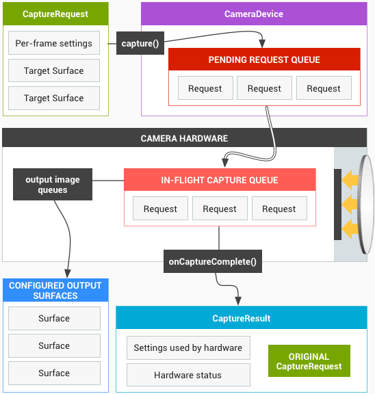
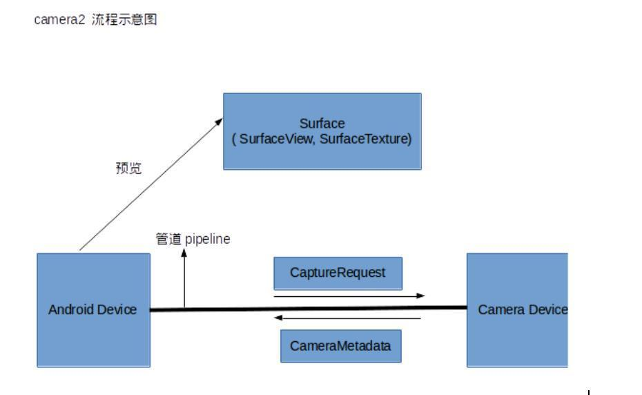
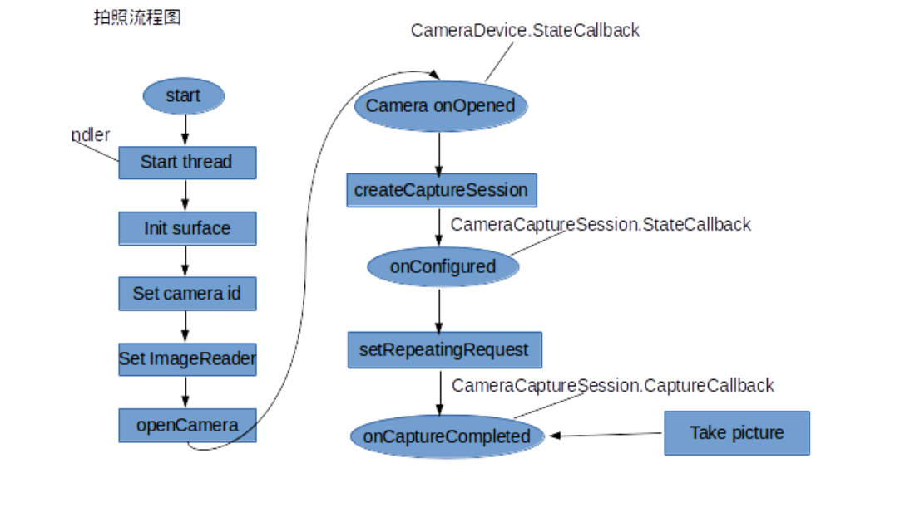

# Camera2
　　Camera2 的出现给相机应用程序带来了巨大的改革，因为它的目的是为了给应用层提供更多的相机控制权限，从而构建出更高质量的相机应用程序。

## Camera2 框架概述

#### Pipeline
　　Camera2 的 API 模型被设计成一个 Pipeline(管道)，它按顺序处理每一帧的请求结果给客户端。

　　Pipeline 的官方工作流程图：



　　当拍摄两张不同尺寸的图片时，在拍摄的过程中闪光灯必须亮起来，整个拍摄流程如下：
1. 创建一个用于从 Pipeline 获取图片的 CaptureRequest。
2. 修改 CaptureRequest 的闪光灯配置，让闪光灯在拍照过程中亮起来。
3. 创建两个不同尺寸的 Surface 用于接收图片数据，并且将它们添加到 CaptureRequest 中。
4. 发送配置好的 CaptureRequest 到 Pipeline 中等待它返回拍照结果。

　　一个新的 CaptureRequest 会被放入一个被称作 Pending Request Queue 的队列中等待被执行，当 In-Flight Capture Queue 队列空闲的时候就会从 Pending Request Queue 获取若干个待处理的 CaptureRequest，并且根据每一个 CaptureRequest 的配置进行 Capture 操作。最后我们从不同尺寸的 Surface 中获取图片数据并且还会得到一个包含了很多与本次拍照相关的信息的 CaptureResult，流程结束。

#### Supported Handware Level
　　相机功能的强大是否和硬件息息相关，不同厂商对 Camera2 的支持程度不同，所以 Camera2 定义了一个叫做 Supported Hardware Level 的重要概念，其作用是将不同设备上的 Camera2 根据功能的支持情况划分成多个不同级别以便开发者能够了解当前设备上 Camera2 的支持情况。截止到 Android P 为止，从低到高一共有 LEGACY、LIMITED、FULL 和 LEVEL_3 四个级别：

1. LEGACY：向后箭筒的级别，处于改级别的设备意味着它只支持 Camera1 的功能，不具备任何 Camera2 高级特性。
2. LIMITED：除了支持 Camera1 的基本功能之外，还支持部分 Camera2 高级特性的级别。
3. FULL：支持所有 Camera2 的高级特性。
4. LEVEL_3：新增更多 Camera2 高级特性，例如 YUV 数据的后处理等。

#### Capture
　　相机的所有操作和参数配置最终都是服务于图像捕获，例如对焦是为了让某一区域的图像更加清晰，调节曝光补偿是为了调节图像的亮度。因此，在 Camera2 里面所有的相机操作和参数配置都被抽象成 Capture(捕获)，所以不要简单的把 Capture 直接理解成拍照，因为 Capture 操作可能仅仅是为了让预览画面更清晰而进行对焦而已。Camera1 的 setFlashMode()、setFocusMode() 和 takePicture() 都是通过 Capture 来实现的。

　　Capture 从执行方式上又被细分为【单次模式】、【多次模式】和【重复模式】三种：
* **单次模式（One-shot）：**指的是只执行一次的 Capture 操作，例如设置闪光灯
模式、对焦模式和拍一张照片等，多个一次性模型的 Capture 会进入队列按顺序执行。

* **多次模式（Burst）：**指的是连续多次执行指定的 Capture 操作，该模式和多次执行单次模式的最大区别是连续多次 Capture 期间不允许插入其他任何 Capture 操作，例如连续拍摄 100 张照片，在拍摄这 100 张图片期间任何新的 Capture 请求都会排队等待，知道拍完 100 张图片。多组多次模式的 Capture 会进入队列按顺序执行。

* **重复模式（Repeating）：**指的是不断重复执行指定的 Capture 操作，当有其他模式的 Capture 提交时会暂停该模式，转而执行其他模式的 Capture，当其他模式的 Capture 执行完毕后又会自动恢复继续执行该模式的 Capture，例如显示预览画面就是不断 Capture 获取每一帧画面。该模式的 Capture 是全局唯一的，也就是新提交的重复模式 Capture 会覆盖旧的重复模式 Capture。

#### Surface
　　Surface 是一块用于填充图像数据的内存空间，例如可以使用 SurfaceView 的 Surface 接收每一帧预览数据用于显示预览画面，也可以使用 ImageReader 的 Surface 接收 JPEG 或 YUV 数据，每一个 Surface 都可以有自己的尺寸和数据格式，可以从 CameraCharacteristics 获取某一个数据格式支持的尺寸列表。


#### Camera2

　　Camera2 架构图：



　　Camera2 引用了管道的概念将安卓设备和摄像头之间联通起来，系统向摄像头发送 Capture 请求，而摄像头会返回 CanmeraMetadata。这一切建立在一个叫作 CameraCaptureSession 的会话中。

　　管道（Pipeline），它按顺序处理每一帧的请求并返回请求结果给客户端。

　　Camera2 拍照流程图：


## camera2 中比较重要的类及方法

#### 1. CameraManager
　　摄像头管理器，用于打开和关闭系统摄像头。

　　CameraManager 是一个负责查询和简历相机连接的系统服务，它的服务不多，列出几个 CameraManager 的关键功能：
1. 将相机信息封装到 CameraCharacteristics 中，并获取 CameraCharacteristics 实例的方式。
2. 根据指定的相机 ID 连接相机设备。
3. 提供将闪光灯设置成手电筒模式的快捷方式。

* getCameraIdList()
	返回当前设备中可用的相机列表。

* getCameraCharacteristics(String cameraId)
	根据摄像头 id 返回该摄像头的相关信息。

* openCamera(String cameraId,final CameraDevice.StateCallback callback,Handler handler);
	打开指定 cameraId 的相机。参数 callback 为相机打开时的回调，参数 handler 为 callback 被调用时所在的线程。

#### 2.CameraDevice
　　描述系统摄像头，类似于早期的 Camera。

　　CameraDevice 代表当前连接的相机设备，它的职责有以下四个：
1.根据指定的参数创建 CameraCaptureSession。
2.根据指定的模板创建 CaptureRequest。
3.关闭相机设备。
4.监听相机设备的状态，例如断开连接、开启成功和开启失败等。


* createCaptureRequest(int templateType)
	创建一个新的 Capture 请求。参数 templateType 代表了请求类型，请求类型一共分为六种，分别是：
1. TEMPLATE_PREVIEW：创建预览的请求。
2. TEMPLATE_STILL_CAPTURE：创建一个适合于静态图像捕获的请求，图像质量优先于帧速率。
3. TEMPLATE_RECORD：创建视频录制的请求。
4. TEMPLATE_VIDEO_SNAPSHOT：创建视频录制时截屏的请求。
5. TEMPLATE_ZERO_SHUTTER_LAG：创建一个适用于零快门延迟的请求。在不影响预览帧率的情况下最大化图像质量。
6. TEMPLATE_MANUAL：创建一个基本捕获请求，这种请求中所有的自动控制都是禁用的（自动曝光、自动白平衡、自动焦点）。

* createCaptureSession(List< Surface > outputs,CameraCaptureSession.StateCallback callback,Handler handler)
	创建 CaptureSession 会话。第一个参数 outputs 是一个 List 数组，相机会把捕捉到的图片数据传递给该参数中的 Surface。第二个参数 StateCallback 是创建会话的状态回调。第三个参数描述了 StateCallback 被调用时所在的线程。

#### 3.CameraCharacteristics
　　描述摄像头的各种特性，类似于 Camera1 中的 CameraInfo 或者 Camera1 的 Parameters。通过 CameraManager 的 getCameraCharacteristics(String CameraId)方法来获取。

　　CameraCharacteristics 是一个只读的相机信息提供者，其内部携带大量的相机信息，包括代表相机朝向的 LENS_FACING；判断闪光灯是否可用的 FLASH_INFO_AVAILABLE；获取所有可用 AE 模式的 CONTROL_AE_AVAILABLE_MODES 等等。

* get(Key< T > key)
	通过制定的 key 获取相应的相机参数。

　　常用的 key 值有：
1. CameraCharacteristics.LENS_FACING：
	获取摄像头方向。前置摄像头（LENS_FACING_FRONT）或 后置摄像头（LENS_FACING_BACK）。
2. CameraCharacteristics.INFO_SUPPORTED_HARDWARE_LEVEL：
	获取当前设备支持的相机特性。
3. CameraCharacteristics.SENSOR_ORIENTATION：
	获取摄像头方向。
4. CameraCharacteristics.SCALER_STREAM_CONFIGURATION_MAP：
	获取 StreamConfigurationMap，它是管理摄像头支持的所有输出格式和尺寸。
5. CameraCharacteristics.FLASH_INFO_AVAILABLE：
	是否支持闪光灯。
6. CameraCharacteristics.STATISTICS_INFO_MAX_FACE_COUNT：
	同时检测到人脸的数量。
7. CameraCharacteristics.STATISTICS_INFO_AVAILABLE_FACE_DETECT_MODES：
	相机支持的人脸检测模式。

#### 4. CaptureRequest
　　CaptureRequest 是向 CameraCaptureSession 提交 Capture 请求时的信息载体，其内部包括了本次 Capture 的参数配置和接收图像数据的 Surface。CaptureRequest 可以配置的信息非常多，包括图像格式、图像分辨率、传感器控制、闪光灯控制、3A 控制等等，可以说绝大部分的相机参数都是通过 CaptureRequest 配置的。值得注意的是每一个 CaptureRequest 表示一帧画面的操作，这意味着可以精确控制每一帧的 Capture 操作。

　　描述了一次操作请求，拍照、预览等操作都需要先传入 CaptureRequest 参数，具体的参数控制也是通过 CameraRequest 的成员变量来设置。

* addTarget(Surface outputTarget)：
	给此次请求添加一个 Surface 对象作为图像的输出目标。

* set(Ket< T > key,T value)
	设置执行的参数值。
```
//自动对焦
captureRequestBuilder.set(Cap)

```
//自动对焦
captureRequestBuilder.set(CaptureRequest.CONTROL_AF_MODE,CaptureRequest.CONTROL_AF_MODE_CONTINUOUS_PICTURE);

//闪光灯
captureRequestBuilder.set(CaptureRequest.CONTROL_AE_MODE,CaptureRequest.CONTROL_AE_MODE_ON_AUTO_FLASH);

//根据摄像头方向对保存的照片进行旋转，使其为“自然方向”
captureRequestBuilder.set(CaptureRequest.JPEG_ORIENTATION,mCameraSensorOrientation);

//人脸检测模式
captureRequestBuilder.set(CaptureRequest.STATISTICS_FACE_DETECT_MODE,CameraCharacteris.STATISTICS_FACE_DETECT_MODE_SIMPLE);

```

#### 5.CameraCaptureSession
　　CameraCaptureSession 实际上就是配置了目标 Surface 的 Pipeline 的实例，在使用相机功能之前必须先创建 CameraCaptureSession 实例。一个 CameraDevice 一次只能开启一个 CameraCaptureSession，绝大部分的相机操作都是通过向 CameraCaptureSession 提交一个 Capture 请求实现的，例如拍照、连拍、设置闪光灯模式、触摸对焦、显示预览画面等等。

　　当需要拍照、预览等功能时，需要先创建该类的实例，然后通过该实例里的方法进行控制（例如：拍照 capture()）。

* setRepeatingRequest(CaptureRequest request,CaptureCallback listener,Handler handler)
	根据传入的 CaptureRequest 对象开始一个无限循环的捕捉图像的请求。第二个参数 listener 为捕捉图像的回调，在回调中可以拿到捕捉到的图像信息。

* capture(CaptureRequest request,CaptureCallback listener,Handler handler)
	拍照。第二个参数为拍照的结果回调。

#### 6. CaptureResult
　　描述拍照完成后的结果。

　　CaptureResult 是每一次 Capture 操作的结果，里面包括了很多状态信息，包括闪光灯状态、对焦状态、时间戳等等。例如可以在拍照完成的是偶，通过 CaptureResult 获取本次拍照时的对焦状态和时间戳。需要注意的是，CaptureResult 并不包含任何图像数据，图像数据都是从 Surface 获取的。
#### 7.ImageReader
　　用于接收拍照结果和访问拍摄照片的图像数据。

　　得到一个 ImagerEADER 对象的方法为 newInstance(int width,int height,int format,int maxImages)。前两个参数是保存图片的宽高，第三个参数为保存图片的格式，第四个参数代表用户可以同时访问到的最大图片数量。

　　注意：这个参数应该根据具体业务需求尽可能的小，因为它的数值越大意味着需要消耗的内存就越高。

* acquireNextImage()
	得到 ImageReader 图像队列中的下一张图片，返回值是一个 Image 对象。

#### 8.Image
　　一个完成的图片缓存。

* getPlanes()
	获取该图像的像素平面数组。这个数组的大小跟图片的格式有关，如 JPEG 格式数组大小为 1。

#### 9.Plane
　　图像数据的单色平面。

* getBuffer()
	获取包含帧数据的 ByteBuffer。通过这个 ByteBuffer 就可以吧图片保存下来。

## 一些只有 Camera2 才支持的高级特性
1. 在开始相机之前检查相机信息
	处于某些原因，可能需要先检查相机信息再决定是否开始相机，例如检查闪光灯是否可用。在 Camera1 上，无法在开启相机之前检查详细的相机信息，因为这些信息都是通过一个已经开始的相机实例提供的。在 Camera2 上，有了和相机实例完全剥离的 CameraCharateristics 实例专门提供相机信息，所以可以在不开启相机的前提下检查几乎所有的相机信息。

2. 在不开去预览的情况下拍照
	在 Camera1 上，开启预览是一个很重要的环节，因为只有在开启预览之后才能进行拍照，因此即使显示预览画面与实际业务需要相违背的时候，也不得不开启预览。而 Camera2 则不强制要求必须先开始预览才能拍照。

3. 一次拍摄多张不同格式和尺寸的图片
	在 Camera1 上，一次只能拍摄一张图片，更不用谈不同格式和尺寸的图片了。而 Camera2 则支持一次拍摄多张图片，甚至是多张格式和尺寸都不同的图片。

4. 控制曝光时间
	在暗环境下拍照的时候，如果能够适当延长曝光时间，就可以让图像画面的亮度得到提高。在 Camera2 上，可以在规定的曝光市场范围内配置拍照的曝光时间，从而实现拍摄长曝光图片，甚至可以延长每一帧预览画面的曝光时间让整个预览画面在暗环境下也能保证一定的亮度。

5. 连拍
	连拍 30 张图片这样的功能在 Camera2 出现之前只有系统相机才能做到（通过 OpenGL 截取预览画面的做法除外），也可能是出于这个原因，市面上的第三方相机无一例外都不支持连拍。有了 Camera2，完全可以让你的相机应用程序支持连拍功能，甚至是连续拍 30 张使用不同曝光时间的图片。

6. 灵活的 3A 控制
	3A （AF(自动曝光)、AE（自动对焦）、AWB（自动白平衡））的控制在 Camera2 上得到了最大化的放权，应用层可以根据业务需求灵活配置 3A 流程并且实时获取 3A 状态，而 Camera1 在 3A 的控制和监控当面提供的接口则要少了很多。例如可以在拍照前进行 AE 操作，并且监听本次拍照是否点亮闪光灯。

## 一些从 Camera1 迁移到 Camera2 的建议
1.Camera1 严格区分了预览和拍照两个流程，而 Camera2 则把这两个流程都抽象成了 Capture 行为，只不过一个是不断重复的 Capture，一个是一次性的 Capture 而已，所以建议不要带着过多的 Camera1 思维使用 Camera2，避免因为思维上的束缚而无法充分利用 Camera2 灵活的 API。
2.如同 Camera1 一样，Camera2 的一些 API 调用也会耗时，所以建议使用独立的线程执行所有的相机操作，尽量避免直接在主线程调用 Camera2 的 API，HandlerThread 是一个不错的选择。
3.Camera2 所有的相机操作都可以注册相关的回调接口，然后在不同的回调方法里写业务逻辑，这可能会让代码因为不够线性而错综复杂，建议可以尝试使用子线程的阻塞方式来尽可能地保证代码的线性执行。例如在子线程阻塞等到 CaptureResult，然后继续执行后续的操作，不是将代码拆分到 CaptureCallback.onCaptureComplete() 方法里面。
4.可以认为 Camera1 是 Camera2 的一个子集，也就是说 Camera2 能做的事情 Camera2 一定能做，反过来咋不一定行得通。
5.如果应用程序需要同时兼容 Camera1 和 Camera2，建议分开维护，因为 Camera1 的 API 设计很可能让 Camera2 灵活的 API 无法得到充分的发挥，另外将两个设计上完全不兼容发的东西搅和在一起带来的痛苦可能远大于其带来的便利性。
6.官方说 Camera2 的性能会更好，但是在较早期的一些机器上运行 Camera2 的性能并没有比 Camera1 好。
7.当设备的 Supported Handware Level 低于 FULL 的时候，建议还是使用 Camera1，因为 FULL 级别以下的 Camera2 能提供的功能几乎和 Camera1 一样，所以倒不如选择更加稳定的 Camera1。


## 其他
　　因为打开相机和创建会话等都是耗时操作，所以需要启动一个 HandlerThread 在子线程中处理。

　　Camera2 在一些低端机器上会出现预览画面拉伸问题。

　　在 android 5.0 ，硬件兼容级别为 legacy 时，Camera2 输出的宽高比和 Camera Sensor 保持一致。也就是说我们设置的预览宽高 720 * 1280 并不比作用，所以出现了画面拉伸。

　　对于这个问题，网上的答案是如果遇到这种情况放弃使用 Camera2，使用旧的 Camera1。

　　
## 查阅资料
1.[Android Camera2 教程 · 第一章 · 概览](https://www.jianshu.com/p/9a2e66916fcb)
2.[Android Camera2 教程 · 第二章 · 开关相机](https://www.jianshu.com/p/df3c8683bb90)
3.[Android Camera2 教程 · 第三章 · 预览](https://www.jianshu.com/p/067889611ae7)
4.[Android Camera2 教程 · 第四章 · 拍照](https://www.jianshu.com/p/2ae0a737c686)
5.[Android:Camera2开发详解(上)：实现预览、拍照、保存照片等功能](https://www.jianshu.com/p/0ea5e201260f) - 已阅读
6.[Android:Camera2开发详解(下)：实现人脸检测功能并实时显示人脸框](https://www.jianshu.com/p/331af6dc2772) - 已阅读