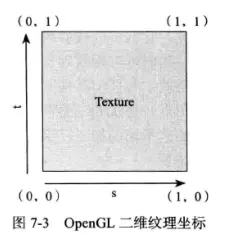
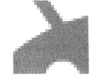
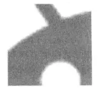
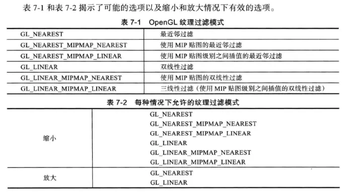

# OpenGL ES 使用
　　

　　


## 判断是否支持 OpenGL ES 2
```

public static boolean isSupportEs2(Context context){
    //检查是够支持 2.0
    ActivityManager activityConfigurationInfo = actiivtyManager.getDeviceConfigurationInfo();
    if (activityManager != null){
        ConfigurationInfo  deviceConfigurationInfo = activityManager.getDeviceConfigurationInfo()；
        int reqGlEsVersion = deviceConfigurationInfo.reqGlEsVersion;
        return reqGlEsVersion >= GLES_VERSION_2 || 
        (Build.VERSION_SDK_INT >= Build.VERSION_CODES.ICE_CREAM_SANDWICH_MR1
        && (Build.FINGERPRINT.startsWith("generic")
        || Build.FINGERPRINT.startsWith("unknow")
        || Build.MODEL.contains("google_sdk")
        || Build.MODEL.contains("Emulator")
        || Build.MODEL.contains("Android SDK build for x86")
        ));
    } else {
        return false;
    }
}
```

## 创建 GLSurfaceView
```
//创建一个 GLSurfaceView
glSurfaceView = new GLSurfaceView(this);
glSurfaceView.setEGLContextClientVersion(2);
//设置自己的 Render，Render 内进行图形的绘制
glSurfaceView.setRenderer(new TriangleShapeRender(this));
isRenderSet = true;
setContextView(glSurfaceView);
```

　　在 Activity 对应的生命周期内，来调用 GLSurfaceView 的方法：

```
    @Override
    protected void onPause() {
        super.onPause();
        if (isRenderSet) {
            glSurfaceView.onPause();
        }

    }

    @Override
    protected void onResume() {
        super.onResume();
        if (isRenderSet) {
            glSurfaceView.onResume();
        }

    }
```

　　因为 Android 中的 GLSurfaceView 的操作，都是在 GLThread 中进行，所以生命周期的毁掉也都在 GLThread 线程中，所有 OpenGL 的操作也都需要在该线程中。

## 绘制方法

#### 绘制正方形方法
　　因为 OpenGL 只提供画三角形的方式，所以想要正方形的画，其实就是画两个三角形拼在一起。

* GL_TRIANGLES
将传入的顶点作为单独的三角形绘制，ABCDEF 绘制 ABC、DEF 两个三角形。

* GL_TRIANGLE_FAN
将传入的顶点作为扇面绘制，ABCDEF 绘制 ABC、ACD、AEF 四个三角形。

* GL_TRIANGLE_STRIP
将传入的顶点作为三角条带绘制，ABCDEF 绘制 ABC、BCD、CDE、DEF 四个三角形。

#### 绘制圆方法
　　绘制圆形是通过绘制切分的三角形来形成的。三角形切分的越细，越接近圆。

　　使用 GL_TRIANGLE_FAN 绘制圆。分割无数个三个角绘制。


## 纹理
　　OpenGL 中的纹理可以用来表示图像。图片甚至数学算法生成的分形数据。

　　每个二维的纹理都由许多小的纹理元素（text1）组成，它们是小块的数据。

#### 纹理的坐标
　　每个二维的纹理都由自己的坐标控件。其范围是从一个拐角（0,0）到另外一个拐角（1,1）。一个维度叫做 S，而另一个拐角叫做 T。



##### 对比 Android 系统的 Y 轴
　　Android 系统中的 y 轴也是向下的，但是纹理坐标是向上的。

##### 纹理的大小
　　在标准的 OpenGL ES 2.0 中，纹理不必是正方形，但是每个纬度都应该是 2 的幂。POT 纹理适用于各种情况。

　　纹理也有一个最大值，但是会根据不同的实现而变化。

#### 理解纹理过滤模式
　　当我们在渲染表面上绘制一个纹理时，那么纹理的纹理元素可能无法精确的映射到 OpenGL 生成的片段上，有两种情况：缩小或者方法。通过纹理过滤（texture filtering），来控制产生的效果。

放大：一个纹理放到多个片段时，就会放大。

缩小：当我们尽力把几个纹理元素放到一个片段时，缩小发生。

##### 最近邻过滤


缺点：放大时，锯齿相当的明显。

##### 双线性过滤
　　双线性过滤会进行插值。



优点：适合于放大的情况。

缺点：不适合缩小。因为 OpenGL 的双线性过滤只给每个片段使用四个纹理元素，这样会失去很多细节。

##### MIP 贴图
　　可以生成一组优化过的不同大小的纹理。当生成这组纹理的时候，OpenGL 会使用所有的纹理元素生成每个级别的纹理，当过滤纹理时，还要确保所有的纹理元素能被使用。在渲染时，会根据每个片段的纹理元素数量为每个片段选择最合适的级别。

　　缺点：会占用很多内存。

　　优点：渲染会更快。因为在较小级别的纹理在 GPU 的纹理缓存中占用较少的空间。

##### 三线性过滤
　　如果 OpenGL 在不同的 MIP 贴图级别中来回切换。当我们用双线性过滤使用 MIP 贴图时，在起渲染的场景中，在不同界别的切换时，就会看到明显的跳跃，我们就可以切换到三线性过滤，告诉 OpenGl 两个最邻近的 MIP 贴图级别之间也要插值，这样每个片段总共要使用 8 个纹理元素插值，有助于消除每个 MIP 贴图级别中间的过渡，得到一个更平滑的图像。

#### 过滤模式总结



## 查阅资料
1. [Android OpenGL ES(一)-开始描绘一个平面三角形](https://www.jianshu.com/p/4a014afde409)
2. [Android OpenGL ES(二)-正交投影](https://www.jianshu.com/p/7e0471100605)
3. [Android OpenGL ES(三)-平面图形](https://www.jianshu.com/p/320980800358)
4. [Android OpenGL ES(四)-为平面图添加滤镜](https://www.jianshu.com/p/7bcdb68823cb)
5. [Android OpenGL ES(五)-结合相机进行预览/录制及添加滤镜](https://www.jianshu.com/p/b36b6e17e818)
6. [Android OpenGL ES(六) - 将输入源换成视频](https://www.jianshu.com/p/9c616616f95a)
7. [Android OpenGL ES(七) - 生成抖音照片电影](https://www.jianshu.com/p/dac18f4ee3e9)
8. [Android OpenGL ES(八) - 简单实现绿幕抠图](https://www.jianshu.com/p/159744875386)
