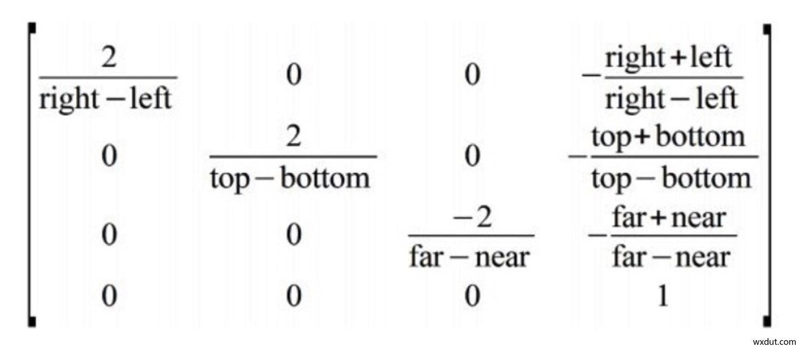
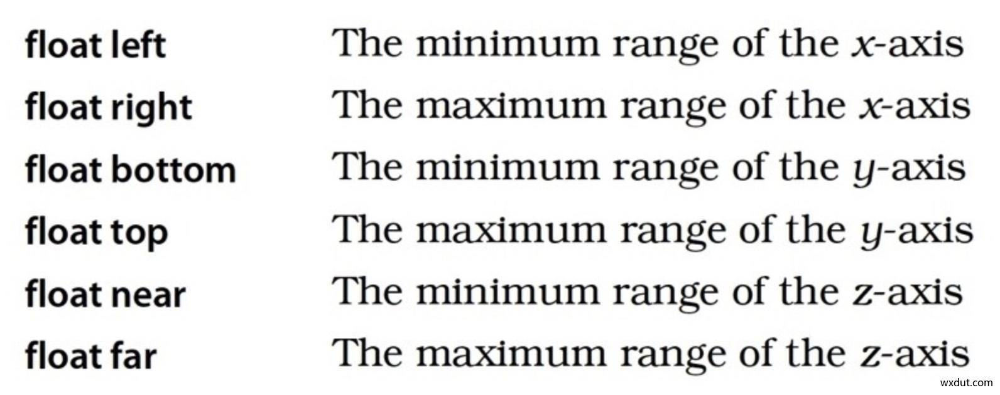
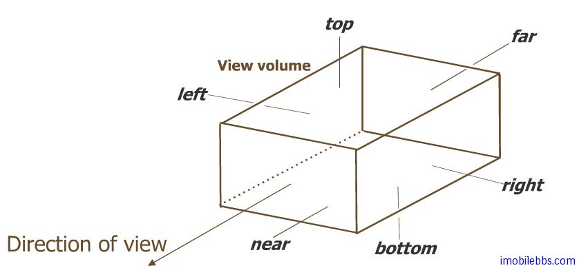
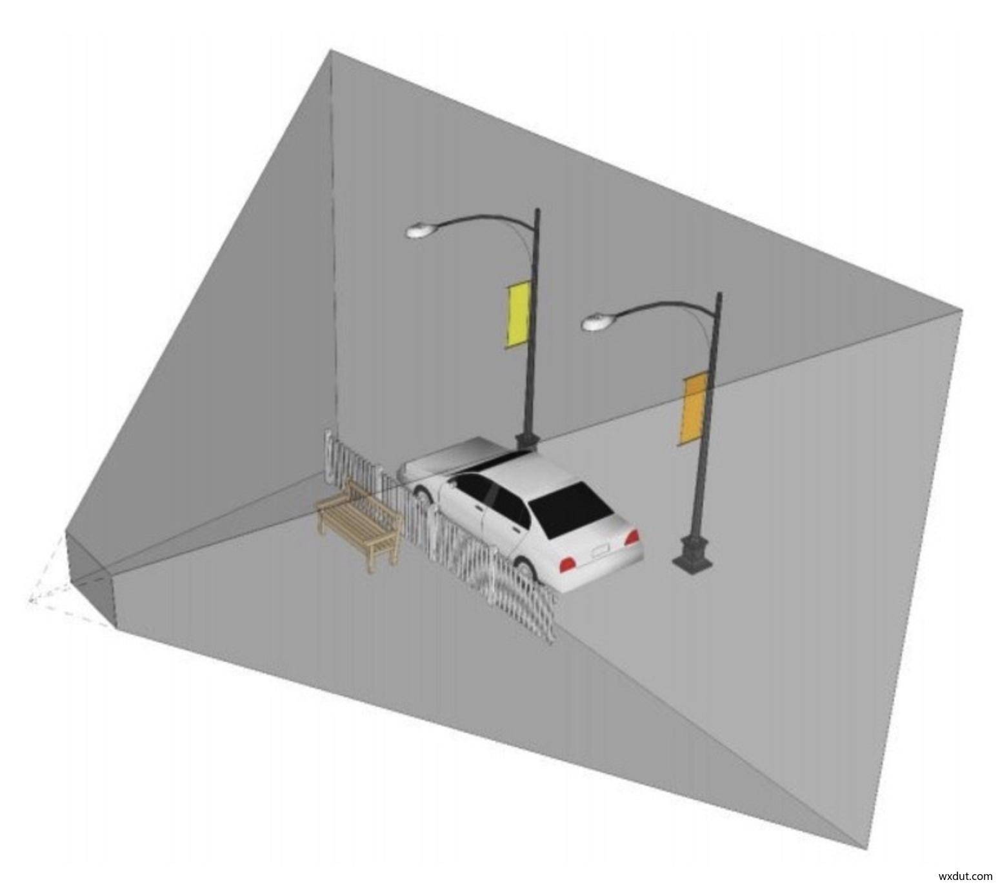
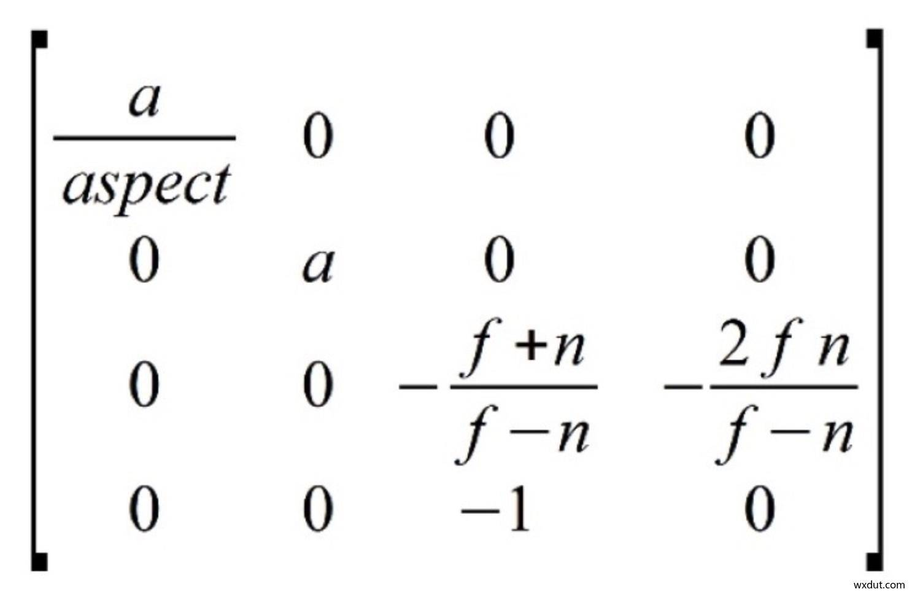
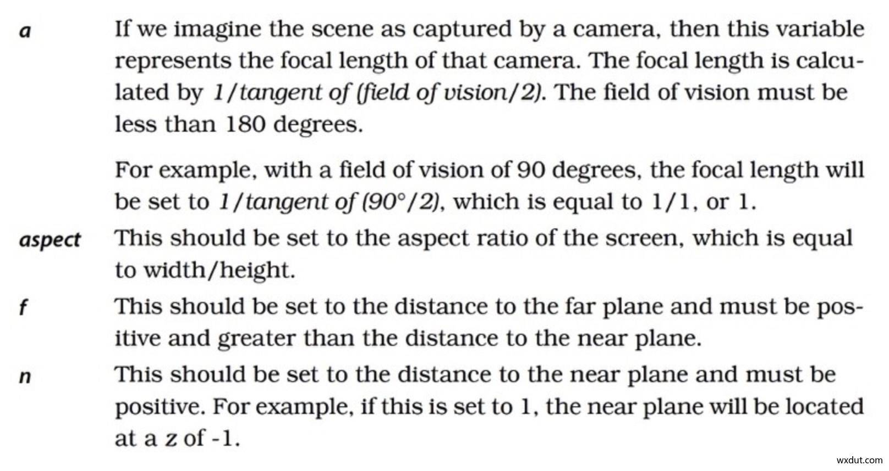

# OpenGL ES 透视投影和正交投影

　　在 OpenGL 中有两个重要的投影变换：正交投影（Orthographic Projection） 和透视投影（Perspective Projection） ，二者各有对应的变换矩阵。

　　正交投影和透视投影的作用都是把用户坐标映射到 OpenGL 的可视区域。如果能根据二者的变换矩阵来推出最终经过映射的坐标范围恰好是 OpenGL 的可视区域，也就是反向推导出了这两个投影矩阵。

　　OpenGL 的可视区域的坐标范围是一个边长为 2 的立方体。每个维度上的大小是 2，范围是 [-1,+1]。经过各种变换之后的坐标超出 [-1,+1] 范围的部分将不会显示在屏幕上。

## 投影知识

#### 摄像机位置

摄像机参数：

1. 摄像机位置：摄像机的三维坐标位置 x,y,z 坐标。
2. 观察方向：摄像机镜头的朝向，是一个三维向量，指向一个三维坐标方向。
3. up 方向：有了位置和朝向，此时摄像机可以 360 度旋转，这就需要一个 up 方向，将摄像机固定在一个位置一个方向。

设置摄像机的方法：

```java
void android.opengl.Matrix.setLookAtM(float[] rm, int rmOffset, float eyeX, float eyeY, float eyeZ, float centerX, float centerY, float centerZ, float upX, float upY, float upZ)
```

参数解释：

float[] rm：生成矩阵元素的 float[] 数组。

int rmOffset 参数：矩阵元素数组的起始偏移量。

float eyeX,float eyeY,float eyeZ：摄像机位置的 x,y,z 三维坐标。

float centerX,float centerY,float centerZ 参数：摄像机镜头朝向的点，该点与摄像机位置连线的方向就是摄像机方向。

float upX,flaot upY,float upZ 参数：摄像机 up 方向，该点与摄像机连线的方向，就是摄像机的 up 方法。


#### 投影简介

**视景体：**管线会缺点的一个可视空间区域，由上平面（up）、下平面（down）、左平面（left）、右平面（right）、远平面（far）、近平面（nea）六个平面组成。

**视景体与投影：**视景体内的物体会投影到近平面，视景体之外的内容会被裁剪掉，例如眼睛看不到的范围就是处于视景体外即被裁剪掉的。

## 正交投影

　　正交投影在 OpenGL 中的作用是调整屏幕宽高比，并将实际定义的坐标转换成 [-1,+1] 范围内的对应的坐标。

　　OpenGL ES 2.0 中，根据应用程序提供的投影矩阵，管线会确定一个可视空间区域，称之为视景体。视景体是由 6 个平面确定的，这 6 个平面分别为：上平面（up），下平面（down)，左平面（left)，远平面（right），远平面（far），近平面（near）。

　　场景中处于视景体内的物体会被投影到进平面上（视景体外的物体将被裁剪掉），然后再将近平面上投影出的内容映射到屏幕上的视口上。

**投影线：**物体顶点与近平面的对应的物体顶点投影的连线。

**视口：**视景体中的物体投影到近平面后，最终会映射到显示屏的视口中，视口就相当于眼睛或者手机屏幕的一部分。

　　视口并不占手机全部屏幕，是显示投影的部分，也可以是一个 View 组件。

　　正交投影是平行投影的一种，其视镜体是长方体，投影到进平面上的图形不会产生 “近大远小”的效果。

　　正交投影矩阵：



　　参数解释：



　　通过上面的矩阵，就可以转换成 [-1,+1] 范围内的对应的坐标。

　　进行正交投影的设置：

```java
Matrix.orthoM(
            mProjectMatirx, //投影矩阵
            0, //偏移量
            left,right,//near面的left，right
            bottom,top,//near面的bottom，top
            near,far//near面，far面与视点的距离
    );
```





## 透视投影

　　现实世界中，人眼观察物体时会有“近大远小”的效果，这种效果，是不能用正交投影来实现的，可以采用透视投影。透视投影的投影线是不平行的，它们相交于视点。

　　在用 2D 屏幕展示 3D 场景时，会有一种近大远小的感觉。OpenGL 也是利用这一原理实现的在 2D 屏幕上的 3D 效果。透视投影会相乘一个视锥体，在视锥体内的坐标都是可以绘制到屏幕上的，也就是说，在视锥体上的坐标范围都会被调整到 [-1,+1] 的区间。

**投影线介绍：**透视投影的投影线不平行，相较于视点。

**视景体：**透视投影中视景体是锥台形区域。




矩阵定义：





　　透视投影的设置：

```java
Matrix.frustumM(
            mProjectMatirx, //投影矩阵
            0, //偏移量
            left,right,//near面的left，right
            bottom,top,//near面的bottom，top
            near,far//near面，far面与视点的距离
    );
```


　　视锥由 （left,bottom,-near） 和 （right,top,-near） 定义了靠近观测点的裁剪面，near 和 far 定义了观测点和两个创建面直接的近距离和远距离。

　　在实际写代码时，Android OpenGL ES 提供了一个辅助方法 gluPrepective() 可以更简单的来定义透视投影变换。


## 查阅资料

1. [【Android应用开发】 OpenGL ES -- 透视投影 和 正交投影]( https://blog.csdn.net/shulianghan/article/details/46680803 ) - 简单解释+源码介绍
4. [Android OpenGL ES 投影矩阵的设置]( https://blog.csdn.net/z896435317/article/details/77711905 ) - 图片解释
5. [OpenGL ES 之投影及各种变换及绘制方式]( https://blog.csdn.net/qq_36391075/article/details/81543772 ) - 简单知识
6. [OpenGL中投影变换矩阵的数学推导]( https://wxdut.com/15122236968685.html ) -- 简单知识

