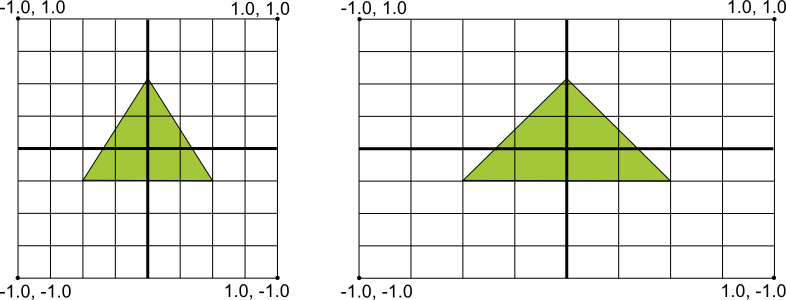

# OpenGL

## OpenGL 简述
　　Android 使用 OpenGL 图形库支持高性能的 2D 和 3D 图形，特别是 OpenGL ES API。OpenGL 是一个跨平台的图形 API，它为 3D 图形处理硬件指定了标准的软件接口。 Opengl ES 是面向嵌入式设备的 OpenGL 规范的一种风格。Android 支持多种版本的 OpenGL ES API:

　　OpenGL SE 1.0 和 1.1 - Android 1.0 以及更高版本支持此 API 规范。

　　OpenGL ES 2.0 - Android 2.2(API level 8) 以及更高版本支持此 API 规范。

　　OpenGL ES 3.0 - Android 4.3（API level 18）以及更高支持此 API 规范。

　　OpenGL ES 3.1 - Android 5.0(API level 21)以及更高版本支持此 API 规范。

　　注意：在设备上支持 OpenGL ES 3.0 API 需要设备制造商提供图形管道的实现。运行 Android 4.3 或更低版本的设备可能不支持 OpenGL ES 3.0 API。

　　在 Android 应用程序中使用 OpenGL ，有两个基础类：GLSurfaceView 和 GLSurfaceView.Renderer，用于创建和操作图形。

**GLSurfaceView**

　　GLSurfaceView 是一个 View，在使用 OpenGl API 时调用用于绘制和操作对象，和 SurfaceView 类似。可以通过创建 GLSurfaceView 并且为它添加 Renderer 来使用它。但是，如果箱套捕获触摸事件，则需要扩展 GLSurfaceView 类实现触摸监听器。

**GLSurfaceView.Renderer**

　　此接口定义了在 GLSurfaceView 绘制图形所需要的方法。必须将该接口的实现类作为单独的类，并调用 GLSurfaceView.setRenderer() 方法将其附加给 GLSurfaceView 实例上。

　　GLSurfaceView.Renderer 接口要求实现以下方法：

* onSurfaceCreated()：系统只会在创建 GLSurfaceView 的时候调用此方法一次。使用此方法执行只需要执行一次的操作，例如设置 OpenGL 的环境参数或者初始化 OpenGL 图形对象。
* onDrawFrame()：系统在 GLSurfaceView 的每一次重绘时调用此方法，使用此方法作为绘制（和重绘）图形对象的主要执行点。
* onSurfaceChanged()：系统在 GLSurfaceView 集合变化时调用此方法，包括改变 GLSurfaceView 的大小，或者设备屏幕方向变化。举例，当设备屏幕方向从纵向改变为横向是系统会调用此方法。使用此方法去响应 GLSurfaceView 容器的变化。


## 使用

#### 声明 OpenGL 要求

##### OpenGL ES 版本要求

　　如果应用使用在并非所有设备都支持 OpenGL 功能，就需要在 AndroidManifest.xml 文件中声明该要求，下面是最常见的 OpenGL 清单声明：

　　对于 OpenGL ES 2.0：

```
<!-- Tell the system this app requires OpenGL ES 2.0. -->
<uses-feature android:glEsVersion="0x00020000" android:required="true" />

```
　　添加此声明后，如果设备不支持 OpenGL ES 2.0 ，Google Play 将拒绝你的应用安装到设备上。

　　如果你的应用程序需要支持 OpenGL ES 3.0，则需要在清单中添加如下：

　　对于 OpenGL ES 3.0：
```
<!-- Tell the system this app requires OpenGL ES 3.0. -->
<uses-feature android:glEsVersion="0x00030000" android:required="true" />

```

　　对于 OpenGL ES 3.1：
```
<!-- Tell the system this app requires OpenGL ES 3.1. -->
<uses-feature android:glEsVersion="0x00030001" android:required="true" />

```

　　注意：OpenGL 3.x API 是向后兼容 2.0 API，这意味着你可以更加灵活的在应用程序中使用 OpenGL ES。在清单中声明 OpenGL ES 2.0 API 为必需项，将 2.0 版本作为默认版本，在运行时检查 3.x API 的可用性，然后在设备支持的情况下使用 OpenGL ES 3.x 功能。

##### 纹理压缩要求
　　如果应用程序使用纹理压缩格式，则必须使用 < supports-gl-texture > 在清单文件中声明应用程序支持的格式。

　　在清单中声明纹理压缩会要求向不具有支持至少一种声明压缩类型的设备用户隐藏应用程序。

##### 绘制对象的映射坐标
　　在 Android 设备上显示徒刑又一个基本问题就是它们的屏幕大小和形状可能是不同的。OpenGL 假设的是一个正方形、同一的坐标系，并且在通常情况下，将典型的非正方形的屏幕上，将它作为完美的正方形一样将左边绘制上去。



　　上图左侧显示了 OpenGL 框架的同一坐标系，以及这些坐标实际上是如何映射到右侧横向的典型设备屏幕上。为了解决这个问题，你需要应用 OpenGL 投影模式和相机视图来变换坐标，以便你的图形对象在任何显示上都有一个正确的比例。

　　为了使用投影和相机视图，需要你创建一个投影矩阵和一个相机视图举证，并且在 OpenGL 渲染管道上应用它们。投影矩阵重新计算图形的坐标，以便它们正确的映射到 Android 设备屏幕上。相机视图矩阵创建了一个变换，该变换从从特定的眼睛位置渲染对象。

###### OpenGL ES 1.0 中的投影和相机视图
　　在 ES 1.0 API 中，通过创建每个矩阵，将它们添加到 OpenGL 环境中，使用投影和相机视图。

1.投影矩阵--使用设备屏幕的几何图形创建一个投影矩阵，为了计算对象坐标以便正确的比例绘制它们。下面的示例代码演示如何去实现 GLSurfaceView.Renderder 的 onSurfaceChanged() 方法，创建一个根据屏幕纵横比的映射矩阵，并且在 OpenGL 渲染环境下使用它。
```
public void onSurfaceChanged(GL10 gl, int width, int height) {
    gl.glViewport(0, 0, width, height);

    // make adjustments for screen ratio
    float ratio = (float) width / height;
    gl.glMatrixMode(GL10.GL_PROJECTION);        // set matrix to projection mode
    gl.glLoadIdentity();                        // reset the matrix to its default state
    gl.glFrustumf(-ratio, ratio, -1, 1, 3, 7);  // apply the projection matrix
}
```

2.相机变换矩阵--使用投影举证调整过坐标系之后，你还必须使用相机视图。下面的示例代码展示了如何去实现 GLSurfaceView.Renderer 的 onDrawFrame() 方法去饮用一个模型视图，并使用 GLU.gluLookAt() 模拟一个相机位置的视图转换。

```
public void onDrawFrame(GL10 gl) {
    ...
    // Set GL_MODELVIEW transformation mode
    gl.glMatrixMode(GL10.GL_MODELVIEW);
    gl.glLoadIdentity();                      // reset the matrix to its default state

    // When using GL_MODELVIEW, you must set the camera view
    GLU.gluLookAt(gl, 0, 0, -5, 0f, 0f, 0f, 0f, 1.0f, 0.0f);
    ...
}
```

##### OpenGL ES 2.0 以及更高版本的映射和相机视图
　　在 ES 2.0 和 3.0 API 上，你使用映射和相机视图，首先需要将矩阵成员添加到图形对象的顶点着色器，添加矩阵成员后，可以生成并且使用映射和相机视图矩阵到对象上。

1.添加矩阵到顶点着色器--为视图投影矩阵创建一个变量，并且将它作为着色器位置的倍增。在下面的顶点着色器示例代码中，报刊的 uMVPMatrix 成员允许将映射和相机视图矩阵应用于使用找色齐的对象坐标。

```
private final String vertexShaderCode =

    // This matrix member variable provides a hook to manipulate
    // the coordinates of objects that use this vertex shader.
    "uniform mat4 uMVPMatrix;   \n" +

    "attribute vec4 vPosition;  \n" +
    "void main(){               \n" +
    // The matrix must be included as part of gl_Position
    // Note that the uMVPMatrix factor *must be first* in order
    // for the matrix multiplication product to be correct.
    " gl_Position = uMVPMatrix * vPosition; \n" +

    "}  \n";
```

　　注意：上面的示例定义了顶点找色齐的一个单例转换举证成员，你可以使用组合投影举证和相机视图举证。根据你应用需要，可能需要在顶点着色器中定义单独的投影矩阵和相机视图矩阵成员，方便独立的去改变它们。

2.访问着色器矩阵--在对你的顶点着色器使用映射和相机视图创建一个钩（hook）之后，你就可以访问应用投影和相机视图矩阵的比边框。下面的代码展示了如何去实现 GLSurfaceView.Renderer 的 onSurfaceCreated() 方法，以访问上面顶点着色器定义的矩阵变量。
```
public void onSurfaceCreated(GL10 unused, EGLConfig config) {
    ...
    muMVPMatrixHandle = GLES20.glGetUniformLocation(program, "uMVPMatrix");
    ...
}
```

3.创建投影和相机视图矩阵-生成投影和视图剧中应用于图形对象。下面的示例代码展示了如何使用 GLSurfaceView.Renderer 的 onSurfaceCreate() 和 onSurfaceChanged() 方法，创建根据设备屏幕纵横比的相机视图矩阵和投影矩阵。
```
public void onSurfaceCreated(GL10 unused, EGLConfig config) {
    ...
    // Create a camera view matrix
    Matrix.setLookAtM(vMatrix, 0, 0, 0, -3, 0f, 0f, 0f, 0f, 1.0f, 0.0f);
}

public void onSurfaceChanged(GL10 unused, int width, int height) {
    GLES20.glViewport(0, 0, width, height);

    float ratio = (float) width / height;

    // create a projection matrix from device screen geometry
    Matrix.frustumM(projMatrix, 0, -ratio, ratio, -1, 1, 3, 7);
}
```

4.应用投影和相机视图矩阵--为了使用投影和相机视图转换，将矩阵相乘，然后设置给顶点着色器。下面的示例代码展示了如何使用 GLSurfaceView.Renderer 的 onDraeFrame() 方法，将创建的投影矩阵和相机视图组合起来，然后将其应用于由 OpenGL 呈现的图形对象。

```
public void onDrawFrame(GL10 unused) {
    ...
    // Combine the projection and camera view matrices
    Matrix.multiplyMM(vPMatrix, 0, projMatrix, 0, vMatrix, 0);

    // Apply the combined projection and camera view transformations
    GLES20.glUniformMatrix4fv(muMVPMatrixHandle, 1, false, vPMatrix, 0);

    // Draw objects
    ...
}
```

#### 成形面（shape faces）和扭曲（winding）
　　在 OpenGL，形状的面是由三维空间中的三个或者多个点定义的曲面。一组三个或者多个三维点（在 OpenGL 中称为顶点）由一个正面和一个反面。你如何知道哪个是正面和哪个是反面？答案是与扭曲有关，或者与定义形状点的方向有关。


　　在示例中，三角形的点是按逆时针方向定义的顺序绘制的。这个坐标的绘制顺序定义了形状的扭曲方向。默认情况下，在 OpenGL，逆时针绘制的面是正面。上图中所示的三角形定义是：你可以看到形状的正面（由 OpenGL 解释），而另一边是反面。

　　为什么知道一个形状的哪个面是正面很重要？答案与 OpenGL 的一个常用特性有关，称为面剔除（face culling）。面剔除是 OpenGL 环境的一个选项，它允许渲染管道忽略（不计算和绘制）形状的反面，节省时间、内存和处理周期。

```
// enable face culling feature
gl.glEnable(GL10.GL_CULL_FACE);
// specify which faces to not draw
gl.glCullFace(GL10.GL_BACK);
```

## 查阅资料
1. [Learn OpenGL](learnopengl.com)
2. [Android OpenGL 的基本使用](https://www.jianshu.com/p/6581703e1d98)
3. [Android OpenGL 顶点及绘制基础知识](https://www.jianshu.com/p/0701d9c7f01b)
4. [Android openGL 开发详解（1） - 绘制简单图形](https://blog.csdn.net/qq_32175491/article/details/79091647#4-glsurfaceviewrenderer%E6%98%AF%E4%BB%80%E4%B9%88glsurfaceviewrenderer%E7%9A%84%E4%BD%9C%E7%94%A8glsurfaceviewrenderer%E7%9A%84%E7%94%A8%E6%B3%95)
5. [SurfaceView、TextureView、GLSurfaceView 显示相机预览](https://blog.csdn.net/qq_32175491/article/details/79755424)
6. [通俗易懂的Android OpenGL入门 ](http://dy.163.com/v2/article/detail/E9TAA40N0511IFOV.html)
7. [android opengl教程](https://blog.csdn.net/lf12345678910/article/details/73832423)
8. [Android 开发之 OpenGL、OpenGL ES 的概念和实例讲解](https://www.2cto.com/kf/201806/752471.html)
8. [android opengl | Android Developers](https://developer.android.google.cn/reference/android/opengl/package-summary.html)

