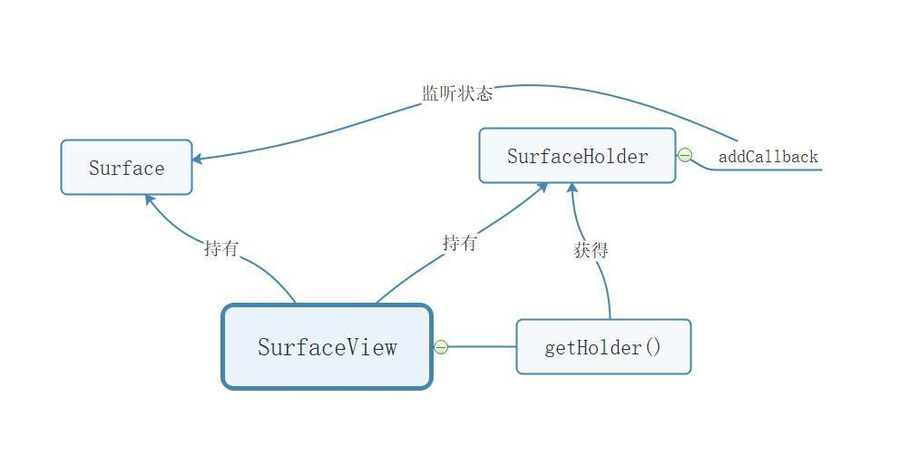
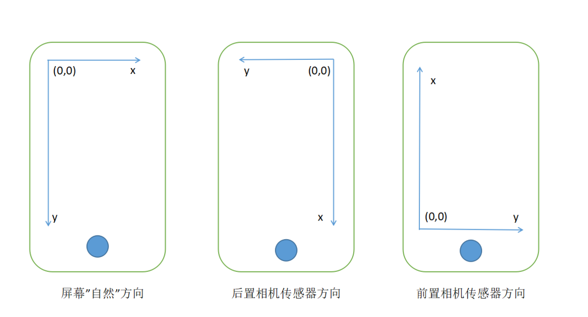
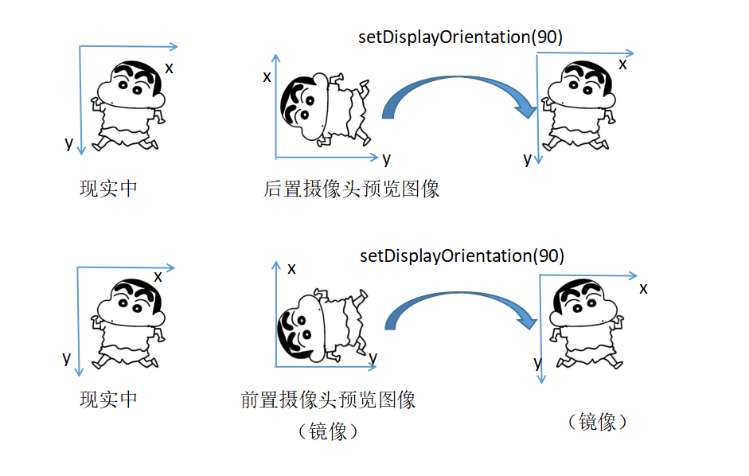

# Camera
　　进行 Camera 开发主要用到了两个类：Camera，SurfaceView（当然也可以是 TextureView）。

　　SurfaceView：显示效果，Camera：底层硬件。

## SurfaceView、Surface、SurfaceHolder

#### 关系图

#### Surface
　　Surface 是用来处理屏幕显示内容合成器所管理的原始缓存区的工具。它通常由图像缓冲区的消费者来创建（如：SurfaceTexture，MediaRecoder），然后被移交给生产者（如：MediaPlayer）或者是显示在其上（如：CameraDevice）。

#### SurfaceHolder
　　SurfaceHolder 是一个抽象接口，给持有 surface 的对象使用。它可以控制 surface 的大小和格式，编辑 surface 中的像素，以及监听 surface 的变化。这个接口通常通过 SurfaceView 类获得。

　　SurfaceHolder 中有一个 Callback 接口，它有 3 个回调方法：
* surfaceCreated(SurfaceHolder holder)
  surface 第一次创建时回调
* surfaceChanged(SurfaceHolder holder,int format,int width,int height)
  surface 变化的时候回调（格式/大小）
* surfaceDestoryed(SurfaceHolder holder)
  surface 销毁的时候回调

#### SurfaceView
　　SurfaceView 提供了嵌入视图层级中的专用 surface。你可以控制 surface 的格式或大小。SurfaceView 复制把 surface 显示在屏幕的正确位置。

　　SurfaceView 继承自 View，其中有两个成员变量，一个是 Surface 对象，一个是 SurfaceHolder 对象。
* SurfaceView 把 Surface 显示在屏幕上。
* SurfaceView 通过 SurfaceHolder 告诉我们 Surface 的状态（创建、变化、销毁）。
* 通过 getHolder() 方法获得当前 SurfaceView 的 SurfaceHolder 对象，然后就可以对 SurfaceHolder 对象添加回调来监听 Surface 的状态。

#### SurfaceView 小结
1. SurfaceView 是一个 view 对象，用于在屏幕上显示相机的预览画面。
2. SurfaceView 中有两个对象，Surface 和 SurfaceHolder。通过 SurfaceHolder 中的回调可以知道 Surface 的状态（创建、变化、销毁）、
3. 通过 getHolder() 方法获得当前 SurfaceView 的 SurfaceHolder 对象。

## Camera

#### 概览图
　　Camera 类中主要的内部类和接口，如下图：

#### Camera 类中的内部类

##### CameraInfo
　　CameraInfo 类用来描述相机信息，通过 Camera 类中的 getCameraInfo(int cameraId,CameraInfo cameraInfo) 方法获得，主要包括以下两个成员变量：

* facing
　　facing 代表相机的方向，它的值只能是 CAMERA_FACING_BACK(后置摄像头) 或者 CAMERA_FACING_FRONT(前置摄像头)。

　　CAMERA_FACING_BACK 和 CAMERA_FACING_FRONT 是 CameraInfo 类中的静态变量。

* orientation
　　orientation 是相机采集图片的角度。这个值是相机所采集的图片需要顺时针旋转至自然方向的角度值。它必须是0,90,180 或 270 中的一个。

　　例子说明一下：自然地竖着拿着手机（就是自拍的样子），后置摄像头的传感器在手机里是水平方向的，现在看着手机，如果传感器的顶部在自然方向上手机屏幕的右边（此时，手机是竖屏，传感器是横屏），那么这个 orientation 的值就是 90，如果前置摄像头的传感器顶部在手机屏幕右边，那么这个值就是 270。

* setDisplayOrientation
　　设置预览画面顺时针旋转的角度。这个方法会影响预览图像和拍照后显示的照片。这个方法对竖屏应用非常有用。注意，前置摄像头在进行角度旋转之前，图像会进行一个水平的镜像反转。所以用户在看预览图像的时候就像照镜子，看到的是现实的水平方向的镜像。

　　注：setDisplayOrientation(int degrees) 是 Camera 类中的一个方法。

　　注：如果是第一次使用 Camera 的话，首先要了解以下几点：

1. 相机图像数据都是来自于相机硬件的图像传感器（Image Sensor），这个 Sensor 被固定到手机之后是有一个默认的取景方向，且不会改变。
2. 相机在预览的时候是有一个预览方向的，可以通过 setDisplayOrientation() 设置。
3. 相机所采集的相片也是有一个方向的（就是上面的 orientation），这个方向与预览时的方向互不相干。

* **屏幕坐标：**在 Android 系统中，屏幕的左上角是坐标系统的原点（0,0）坐标。

* **自然方向：**每个设备都有一个自然方向，手机和平板的自然方向不同。手机的自然方向是 protrait(竖屏)，平板的自然方向是 landscape(横屏)。

* **图像传感器（Image Sensor） 方法：**手机相机的图像数据都是来自于摄像头硬件的图像传感器，这个传感器在被固定到手机上后有一个默认的取景方向。

* **相机的预览方向：**将图像传感器捕获的图像，显示在屏幕上的方向。在默认情况下，这个值为 0，与图像传感器方向一致。

* **相机采集的图像方向：**相机采集图像后需要进行顺时针旋转的角度，即上面介绍的 orientation 的值：

小结：
* 绝大部分安卓手机中图像传感器方向是横向的，且不能改变，所以 orientation 是 90 或是 270，也就是说，当点击拍照后保存图片的时候，需要对图像做旋转处理，使其为“自然方向”。（可能存在一些特殊的定制或是能外接摄像头的安卓机，他们的 orientation 会是 0 或者 180）。
* 通过 setDisplayOrientation 方法设置预览方向，使预览画面为“自然方向”。前置摄像头在进行角度旋转之前，图像会进行一个水平的镜像翻转，所以用户在看预览图像的时候就像照镜子一样。

##### Size
　　图片大小，里面包含两个变量：width 和 height(图片的宽和高)。

##### Parameters
　　Parameters 是相机服务设置，不同的相机可能是不相同的。比如相机所支持的图片大小，对焦模式等等。下面是这个类中常用的方法：

* getSupportedPreviewSizes()
	获得相机支持的预览图片大小，返回值是一个 List < Size > 数组。

* setPreviewSize(int width,int height)
	设置相机预览图片的大小。

* getSupportedPreviewFormats()
	获得相机支持的图片预览格式，所有的相机都支持 ImageFormat.NV21。

* getPreviewFormat(int picel_format)
	设置预览图片的格式。

* getSupportedPictureSizes()
	获得相机支持的采集的图片大小（即拍照后保存的图片的大小）。

* setPictureSize(int width,int height)
	设置保存的图片的大小。

* getSupportedPictureFormats()
	获得相机支持的图片格式。

* setPictureFormat(int pixel_format)
	设置保存的图片的格式。

* getSupportedFocusModes()
	获得相机支持的对焦模式。

* getMaxNumDetectedFaces()
	返回当前相机所支持的最大的人脸检测个数。

##### PreviewCallback
　　PreviewCallback 是一个抽象接口。

* void onPreviewFrame(byte[] data,Camera camera)
	通过 onPreviewFrame 方法来获取到相机预览的数据，第一个参数 data，就是相机预览到的原始数据。

　　这些预览到的原始数据是非常有用的，比如可以保存下来当做一张图片，还有很多第三方的人脸检测及静默活体检测的 sdk，都需要把相机预览的数据实时地传递过去。

##### Face
　　Face 类用来描述通过 Camera 的人脸检测功能检测到的人脸信息。

* rect
	rect 是一个 Rect 对象，它所表示的就是检测到的人脸的区域。
注意：这个 Rect 对象中的坐标系并不是安卓屏幕的坐标系，需要进行转换后才能使用。

* score
	检测到的人脸的可信度，范围是 1 到 100。

* leftEye
	leftEye 是一个 Point 对象，表示检测到的左眼的位置坐标。

* rightEye
	rightEye 是一个 Point 对象，表示检测到的右眼的位置坐标。

* mouth
	mouth 是一个 Point 对象，表示检测到的嘴的位置坐标。

leftEye、rightEye 和 mouth 是 3 个人脸中关键点，并不是所有相机都支持的，如果相机不支持的话，这 3 个的值为 null。

##### FaceDetectionListener
　　这是一个抽象接口，当开始人脸检测时开始回调。

* onFaceDetection(Face[] faces，Camera camera)
	第一参数代表检测到的人脸，是一个 Face 数组（画面内可能存在多张人脸）。

## 查阅资料
1.[Android: Camera相机开发详解(上) —— 知识储备](https://www.jianshu.com/p/f8d0d1467584)
2.[Android: Camera相机开发详解(中) ——实现预览、拍照、保存照片等功能](https://www.jianshu.com/p/e20a2ad6ad9a)
3.[Android: Camera相机开发详解(下) —— 实现人脸检测功能](https://www.jianshu.com/p/3bb301c302e8)
4.[Android Camera1 教程 · 第一章 · 开启相机](https://www.jianshu.com/p/3440d82545f6)
5.[Android Camera1 教程 · 第二章 · 预览](https://www.jianshu.com/p/705d4792e836)

