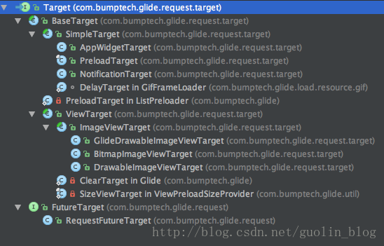

# Glide 回调与监听

# 1. 回调的源码分析

　　使用 Glide 在界面上加载并展示一张图片只需要一行代码：

```java
Glide.with(this).load(url).into(imageView);
```

　　这行代码的后面 Glide  执行了成千上万行的逻辑。

　　首先来看一下 into() 方法，在这里将 ImageView 的实例传入到 into() 方法当中，Glide 将图片加载完成之后，图片就能显示到 ImageView 上了。

## 1.1. GenericRequestBuilder#into

```java
    /**
     * Sets the {@link ImageView} the resource will be loaded into, cancels any existing loads into the view, and frees
     * any resources Glide may have previously loaded into the view so they may be reused.
     *
     * @see Glide#clear(android.view.View)
     *
     * @param view The view to cancel previous loads for and load the new resource into.
     * @return The {@link com.bumptech.glide.request.target.Target} used to wrap the given {@link ImageView}.
     */
    public Target<TranscodeType> into(ImageView view) {
        Util.assertMainThread();
        if (view == null) {
            throw new IllegalArgumentException("You must pass in a non null View");
        }

        if (!isTransformationSet && view.getScaleType() != null) {
            switch (view.getScaleType()) {
                case CENTER_CROP:
                    applyCenterCrop();
                    break;
                case FIT_CENTER:
                case FIT_START:
                case FIT_END:
                    applyFitCenter();
                    break;
                //$CASES-OMITTED$
                default:
                    // Do nothing.
            }
        }

        return into(glide.buildImageViewTarget(view, transcodeClass));
    }
```

　　可以看到，最后一行代码会调用 glide.buildImageViewTarget() 方法构建出一个 Target 对象，然后再将它传入到另一个接收 Target 参数的 into() 方法中。Target 对象则是用来最终展示图片用的，如果跟进到 glide.buildImageViewTarget() 方法，glide.buildImageViewTarget() 方法中会调用 imageViewTargetFactory.buildTarget() 方法。

## 1.2. ImageViewTargetFactory#buildTarget

```java
/**
 * A factory responsible for producing the correct type of {@link com.bumptech.glide.request.target.Target} for a given
 * {@link android.view.View} subclass.
 */
public class ImageViewTargetFactory {

    @SuppressWarnings("unchecked")
    public <Z> Target<Z> buildTarget(ImageView view, Class<Z> clazz) {
        if (GlideDrawable.class.isAssignableFrom(clazz)) {
            return (Target<Z>) new GlideDrawableImageViewTarget(view);
        } else if (Bitmap.class.equals(clazz)) { // asBitmap()
            return (Target<Z>) new BitmapImageViewTarget(view);
        } else if (Drawable.class.isAssignableFrom(clazz)) {
            return (Target<Z>) new DrawableImageViewTarget(view);
        } else {
            throw new IllegalArgumentException("Unhandled class: " + clazz
                    + ", try .as*(Class).transcode(ResourceTranscoder)");
        }
    }
}
```

　　buildTarget() 方法会根据传入的 class 参数来构建不同的 Target 对象。如果在使用 Glide 加载图片的时候调用了 asBitmap() 方法，那么这里就会构建出 BitmapImageViewTarget 对象，否则的话构建的都是 GlideDrawableImageViewTarget 对象。

　　之后就会把这里构建出来的 Target 对象传入到 GenericRequest 当中，而 Glide 在图片加载完成之后又会回调 GenericReqeust 的 onResourceReady() 方法。

## 1.3. GenericRequest#onResourceReady

```java
/**
 * A {@link Request} that loads a {@link com.bumptech.glide.load.engine.Resource} into a given {@link Target}.
 *
 * @param <A> The type of the model that the resource will be loaded from.
 * @param <T> The type of the data that the resource will be loaded from.
 * @param <Z> The type of the resource that will be loaded.
 * @param <R> The type of the resource that will be transcoded from the loaded resource.
 */
public final class GenericRequest<A, T, Z, R> implements Request, SizeReadyCallback,
        ResourceCallback {
            
    /**
     * Internal {@link #onResourceReady(Resource)} where arguments are known to be safe.
     *
     * @param resource original {@link Resource}, never <code>null</code>
     * @param result object returned by {@link Resource#get()}, checked for type and never <code>null</code>
     */
    // 获取数据后，会回调这个方法
    private void onResourceReady(Resource<?> resource, R result) {
        // We must call isFirstReadyResource before setting status.
        boolean isFirstResource = isFirstReadyResource();
        status = Status.COMPLETE;
        this.resource = resource;

        if (requestListener == null || !requestListener.onResourceReady(result, model, target, loadedFromMemoryCache,
                isFirstResource)) {
            GlideAnimation<R> animation = animationFactory.build(loadedFromMemoryCache, isFirstResource);
            // 调用 target 的 onResourceReady() 方法
            target.onResourceReady(result, animation);
        }

        notifyLoadSuccess();

        if (Log.isLoggable(TAG, Log.VERBOSE)) {
            logV("Resource ready in " + LogTime.getElapsedMillis(startTime) + " size: "
                    + (resource.getSize() * TO_MEGABYTE) + " fromCache: " + loadedFromMemoryCache);
        }
    }
            
}
```

　　可以看到，这里在 onResourceReady() 方法中处理了图片展示，还有 GIF 播放的逻辑。

　　在 onResourceReady() 方法中调用了 target.onResourceReady() 方法，而这里的 target 就是 GlideDrawableImageViewTarget 对象。

## 1.4. GlideDrawableImageViewTarget#onResourceReady

```java
/**
 * A {@link com.bumptech.glide.request.target.Target} that can display an {@link android.graphics.drawable.Drawable} in
 * an {@link android.widget.ImageView}.
 */
public class GlideDrawableImageViewTarget extends ImageViewTarget<GlideDrawable> {
    
    /**
     * {@inheritDoc}
     * If no {@link com.bumptech.glide.request.animation.GlideAnimation} is given or if the animation does not set the
     * {@link android.graphics.drawable.Drawable} on the view, the drawable is set using
     * {@link android.widget.ImageView#setImageDrawable(android.graphics.drawable.Drawable)}.
     *
     * @param resource {@inheritDoc}
     * @param animation {@inheritDoc}
     */
    @Override
    public void onResourceReady(GlideDrawable resource, GlideAnimation<? super GlideDrawable> animation) {
        if (!resource.isAnimated()) {
            //TODO: Try to generalize this to other sizes/shapes.
            // This is a dirty hack that tries to make loading square thumbnails and then square full images less costly
            // by forcing both the smaller thumb and the larger version to have exactly the same intrinsic dimensions.
            // If a drawable is replaced in an ImageView by another drawable with different intrinsic dimensions,
            // the ImageView requests a layout. Scrolling rapidly while replacing thumbs with larger images triggers
            // lots of these calls and causes significant amounts of jank.
            float viewRatio = view.getWidth() / (float) view.getHeight();
            float drawableRatio = resource.getIntrinsicWidth() / (float) resource.getIntrinsicHeight();
            if (Math.abs(viewRatio - 1f) <= SQUARE_RATIO_MARGIN
                    && Math.abs(drawableRatio - 1f) <= SQUARE_RATIO_MARGIN) {
                resource = new SquaringDrawable(resource, view.getWidth());
            }
        }
        super.onResourceReady(resource, animation);
        this.resource = resource;
        resource.setLoopCount(maxLoopCount);
        resource.start();
    }
    
}
```

　　在 GlideDrawableImageView  的 onResourceReady() 方法里面调用了父类 ImageViewTarget 的 onResourceReady() 方法。

## 1.5. ImageViewTarget#onResourceReady

```java
/**
 * A base {@link com.bumptech.glide.request.target.Target} for displaying resources in
 * {@link android.widget.ImageView}s.
 *
 * @param <Z> The type of resource that this target will display in the wrapped {@link android.widget.ImageView}.
 */
public abstract class ImageViewTarget<Z> extends ViewTarget<ImageView, Z> implements GlideAnimation.ViewAdapter {
    @Override
    public void onResourceReady(Z resource, GlideAnimation<? super Z> glideAnimation) {
        if (glideAnimation == null || !glideAnimation.animate(resource, this)) {
            setResource(resource);
        }
    }

    protected abstract void setResource(Z resource);
    
}
```

　　在 ImageViewTarget 的 onResourceReady() 方法中调用了抽象方法 setResource()，再来看 GlideDrawImageViewTarget 的 setResource() 方法。

## 1.6. GlideDrawableImageViewTarget#setResource

```java
/**
 * A {@link com.bumptech.glide.request.target.Target} that can display an {@link android.graphics.drawable.Drawable} in
 * an {@link android.widget.ImageView}.
 */
public class GlideDrawableImageViewTarget extends ImageViewTarget<GlideDrawable> {

     /**
     * Sets the drawable on the view using
     * {@link android.widget.ImageView#setImageDrawable(android.graphics.drawable.Drawable)}.
     *
     * @param resource The {@link android.graphics.drawable.Drawable} to display in the view.
     */
    @Override
    protected void setResource(GlideDrawable resource) {
        // 将图片数据设置给控件
        view.setImageDrawable(resource);
    }
    
}
```

　　这样一张图片就显示出来了，这就是 Glide 回调的基本实现原理。

　　原理分析完了，接着看一下在回调和监听方面还有哪些扩展知识。

# 2. into() 方法

　　into() 方法除了可以传入 ImageView ，还可以传入别的参数。into() 方法还有一个接收 Target 参数的重载。即使传入的参数是 ImageView，Glide 也会在内部自动构建一个 Target 对象，而如果能够掌握自定义 Target 技术的话，就可以更加随心所欲地控制 Glide 回调了。

　　先来看一下 Glide 中 Target 的继承结构图：



　　可以看到，Target 的继承结构还是相当复杂的，实现 Target 接口的子类非常多，这些大多数都是 Glide 已经实现好的具备完整功能的 Target 子类。

　　如果要进行自定的话，通常只需要在两种 Target 的基础上去自定义就可以了，一种是 SimpleTarget，一种是 ViewTarget。

## 2.1. SimpleTarget

　　首先来看 SimpleTarget，顾名思义，它是一种极为简单的 Target，使用它可以将 Glide 加载出来的图片对象获取到，而不是像之前那样只能将图片在 ImageView 上显示出来。

### 2.1.1. SimpleTarget 使用

　　SimpleTarget 的用法示例：

```java
SimpleTarget<GlideDrawable> simpleTarget = new SimpleTarget<GlideDrawable>() {
    @Override
    public void onResourceReady(GlideDrawable resource, GlideAnimation glideAnimation) {
        imageView.setImageDrawable(resource);
    }
};

public void loadImage(View view) {
    String url = "http://cn.bing.com/az/hprichbg/rb/TOAD_ZH-CN7336795473_1920x1080.jpg";
    Glide.with(this)
         .load(url)
         .into(simpleTarget);
}
```

　　在这里创建了一个 SimpleTarget 的实例，并且指定它的泛型是 GlideDrawable，然后重写了 onResourceReady() 方法。在 onResourceReady() 方法中，就可以获取到 Glide 加载出来的图片对象了，也就是方法参数中传过来的 GlideDrawable 对象。有了这个对象之后就可以使用它进行任意的逻辑操作，这里只是简单地把它显示到了 ImageView 上。

　　虽然这个实现地效果和直接在 into() 方法中传入 ImageView 并没有什么区别，但是可以拿到图片对象的实例，然后就可以随意做更多的事情了。

　　当然，SimpleTarget 中的泛型不一定只能是 GlideDrawable，如果能确定正在加载的是一张静态图还是 GIF 图的话，就能直接拿到这张图的 Bitmap 对象，如下所示：

```java
SimpleTarget<Bitmap> simpleTarget = new SimpleTarget<Bitmap>() {
    @Override
    public void onResourceReady(Bitmap resource, GlideAnimation glideAnimation) {
        imageView.setImageBitmap(resource);
    }
};

public void loadImage(View view) {
    String url = "http://cn.bing.com/az/hprichbg/rb/TOAD_ZH-CN7336795473_1920x1080.jpg";
    Glide.with(this)
         .load(url)
         .asBitmap()
         .into(simpleTarget);
}
```

　　可以看到，这里将 SimpleTarget 的泛型指定成 Bitmap，然后在加载图片的时候调用了 asBitmap() 方法强制指定这是一张静态图，这样就能在 onResourceReady() 方法中获取到这张图的 Bitmap 对象了。

## 2.2. ViewTarget

　　事实上，从上面的继承结构图上就能看出，Glide 的内部自动创建的 GlideDrawableImageViewTarget 就是 ViewTarget 的子类。只不过 GlideDrawableImageViewTarget 被限定只能作用在 ImageView 上，而 ViewTarget 的功能更加广泛，它可以作用在任意的 View 上。

### 2.2.1. 定义 ViewTarget 对象

　　创建一个自定义布局的 MyLayout：

```java
public class MyLayout extends LinearLayout {

    private ViewTarget<MyLayout, GlideDrawable> viewTarget;

    public MyLayout(Context context, AttributeSet attrs) {
        super(context, attrs);
        viewTarget = new ViewTarget<MyLayout, GlideDrawable>(this) {
            @Override
            public void onResourceReady(GlideDrawable resource, GlideAnimation glideAnimation) {
                MyLayout myLayout = getView();
                myLayout.setImageAsBackground(resource);
            }
        };
    }

    public ViewTarget<MyLayout, GlideDrawable> getTarget() {
        return viewTarget;
    }

    public void setImageAsBackground(GlideDrawable resource) {
        setBackground(resource);
    }

}
```

　　在 MyLayout 的构造函数中，创建了一个 ViewTarget 的实例，并将 MyLayout 当前的实例 this 传了进去。ViewTarget 中需要指定两个泛型，一个是 View 的类型，一个图片的类型（GlideDrawable 或 Bitmap）。然后在 onResourceReady() 方法中，就可以通过 getView() 方法获取到 MyLayout 的实例，并调用它的任意接口了。比如调用 setImageAsBackgorund() 方法来将加载出来的图片作为 MyLayout 布局的背景图。

### 2.2.2. 使用 ViewTarget

　　接下来看一下如何使用这个 Target，由于 MyLayout 中已经提供了 getTarget() 接口，只需要在加载图片的地方这样写就可以了：

```java
public class MainActivity extends AppCompatActivity {

    MyLayout myLayout;

    @Override
    protected void onCreate(Bundle savedInstanceState) {
        super.onCreate(savedInstanceState);
        setContentView(R.layout.activity_main);
        myLayout = (MyLayout) findViewById(R.id.background);
    }

    public void loadImage(View view) {
        String url = "http://cn.bing.com/az/hprichbg/rb/TOAD_ZH-CN7336795473_1920x1080.jpg";
        Glide.with(this)
             .load(url)
             .into(myLayout.getTarget());
    }

}
```

　　就是这么简单，在 into() 方法中传入 myLayout.getTarget() 即可。

# 3. preload() 方法

　　Glide 加载图片会自动判断该图片是否已经有缓存了，如果有的话就直接从缓存中读取，没有得话再从网络去下载。但是如果希望提前对图片进行一个预加载，等真正需要加载图片得时候就直接从缓存中读取，不想再等待漫长得网络加载时间了。

　　对于上面的方法，target 就可以解决，因为 into() 方法中除了传入 ImageView 之后还可以传入 Target 对象，那么在 Target 对象的 onResourceReady() 方法中做一个空实现，也就是不做任何逻辑处理，那么图片自然也就显示不出来了，而 Glide 的缓存机制却依然还会正常工作，这样就实现了预加载功能了。

　　事实上，Glide 专门提供了预加载的接口，也就是 preload() 方法，只需要直接使用就可以了。

## 3.1. preload 的使用

　　preload() 方法有两个方法重载，一个不带参数，表示将会加载图片的原始尺寸，另一个可以通过参数指定加载图片的宽和高。

　　preload() 方法的用法也非常简单，直接使用它来替换 into() 方法即可，如下：

```java
Glide.with(this)
     .load(url)
     .diskCacheStrategy(DiskCacheStrategy.SOURCE)
     .preload();
```

　　需要注意的是，如果使用了 preload() 方法，最好要将 diskCacheStrategy 的缓存策略指定成 DiskCacheStrategy.SOURCE。因为 preload() 方法默认是预加载的原始图片大小，而 into() 方法则默认会根据 ImageView 控件的大小来动态决定加载图片的大小。因此，如果不将 diskCacheStrategy() 的策略指定成 DiskCacheStrategy.SOURCE 的话，很容易会造成在预加载完成之后再使用 into() 方法加载图片，却仍然还是要从网络上去请求图片这种现象。

　　调用了预加载之后，以后想再去加载这张图片就会非常快了，因为 Glide 会直接从缓存当中去读取图片并显示出来，代码如下：

```java
Glide.with(this)
     .load(url)
     .diskCacheStrategy(DiskCacheStrategy.SOURCE)
     .into(imageView);
```

　　注意，这里仍然需要使用 diskCacheStrategy() 方法将硬盘缓存策略指定成 DiskCacheStrategy.SOURCE，以保证 Glide 一定会去读取刚才预加载的图片缓存。

　　preload() 方法的用法大概就是这么简单。

## 3.2. preload 的源码分析

　　和 into() 方法一样，preload() 方法也是在 GenericRequestBuilder 类当中的。

### 3.2.1. GenericRequestBuilder#preload

```java
/**
 * A generic class that can handle setting options and staring loads for generic resource types.
 * 一个泛型类，可以处理泛型资源类型的设置选项和启动加载。
 * @param <ModelType> The type of model representing the resource.
 * @param <DataType> The data type that the resource {@link com.bumptech.glide.load.model.ModelLoader} will provide that
 *                  can be decoded by the {@link com.bumptech.glide.load.ResourceDecoder}.
 * @param <ResourceType> The type of the resource that will be loaded.
 * @param <TranscodeType> The type of resource the decoded resource will be transcoded to.
 */
public class GenericRequestBuilder<ModelType, DataType, ResourceType, TranscodeType> implements Cloneable {
	/**
     * Preloads the resource into the cache using the given width and height.
     *
     * <p>
     *     Pre-loading is useful for making sure that resources you are going to to want in the near future are
     *     available quickly.
     * </p>
     *
     *
     * @see com.bumptech.glide.ListPreloader
     *
     * @param width The desired width in pixels, or {@link Target#SIZE_ORIGINAL}. This will be overridden by
     *             {@link #override * (int, int)} if previously called.
     * @param height The desired height in pixels, or {@link Target#SIZE_ORIGINAL}. This will be overridden by
     *              {@link #override * (int, int)}} if previously called).
     * @return A {@link Target} that can be used to cancel the load via
     *        {@link Glide#clear(com.bumptech.glide.request.target.Target)}.
     */
    public Target<TranscodeType> preload(int width, int height) {
        final PreloadTarget<TranscodeType> target = PreloadTarget.obtain(width, height);
        return into(target);
    }

    /**
     * Preloads the resource into the cache using {@link Target#SIZE_ORIGINAL} as the target width and height.
     * Equivalent to calling {@link #preload(int, int)} with {@link Target#SIZE_ORIGINAL} as the width and height.
     *
     * @see #preload(int, int)
     *
     * @return A {@link Target} that can be used to cancel the load via
     *        {@link Glide#clear(com.bumptech.glide.request.target.Target)}.
     */
    public Target<TranscodeType> preload() {
        return preload(Target.SIZE_ORIGINAL, Target.SIZE_ORIGINAL);
    }
}
```

　　preload() 方法有两个方法重载，可以调用带参数的 preload() 方法来明确指定图片的宽和高，也可以调用不带参数的 preload() 方法，它会在内部自动将图片的宽和高都指定成 Target.SIZE_ORIGINAL，也就是图片的原始尺寸。

　　然后可以看到，在 preload() 方法种调用了 PreloadTarget.obtail() 方法获取一个 PreloadTarget 的实例，并把它传入到了 into() 方法当中，从继承结构图种可以看出，PreloadTarget 是 SimpleTarget 的子类，因此它是可以直接传入到 into() 方法中的。

### 3.2.2. PreloadTarget 类

```java
/**
 * A one time use {@link com.bumptech.glide.request.target.Target} class that loads a resource into memory and then
 * clears itself.
 *
 * @param <Z> The type of resource that will be loaded into memory.
 */
public final class PreloadTarget<Z> extends SimpleTarget<Z> {

    /**
     * Returns a PreloadTarget.
     *
     * @param width The width in pixels of the desired resource.
     * @param height The height in pixels of the desired resource.
     * @param <Z> The type of the desired resource.
     */
    public static <Z> PreloadTarget<Z> obtain(int width, int height) {
        return new PreloadTarget<Z>(width, height);
    }

    private PreloadTarget(int width, int height) {
        super(width, height);
    }

    @Override
    public void onResourceReady(Z resource, GlideAnimation<? super Z> glideAnimation) {
        Glide.clear(this);
    }
}
```

　　PreloadTarget 的源码非常简单，obtail() 方法中就是 new 了一个 PreloadTarge 的实例而已，而 onResourceReady() 方法中只是调用了 Glide.clear() 方法。

　　这里的 Glide.clear() 并不是清空缓存的意思，而是表示加载已完成，释放资源的意思。

　　PreloadTarget 的思想就是什么都不做就可以了，因为加载完成之后只将它缓存而不去显示它，就相当于预加载了。

# 4. downloadOnly() 方法

　　如果想要去访问图片的缓存文件需要用到 downloadOnly() 方法。

　　和 preload() 方法类似，downloadOnly() 方法也是可以替换 into() 方法的，不过 downloadOnly() 方法的用法明显要比 preload() 方法复杂不少。顾名思义，downloadOnly() 方法表示只会下载图片，而不会对图片进行加载。当图片下载完成之后，就可以得到图片的存储路径，以便后续进行操作。

　　downloadOnly() 方法是定义在 DrawableTypeRequest 类当中的，它有两个方法重载，一个接收图片的宽度和高度，另一个接收一个泛型对象，如下所示：

```java
public FutureTarget<File> downloadOnly(int width, int height);
public <Y extends Target<File>> Y downloadOnly(Y target)
```

　　这两个方法各自有各自的应用场景，其中 downloadOnly(int width, int height) 用于在子线程中下载图片，而 downloadOnly(Y target) 是用于在主线程中下载图片的。

## 4.1. downloadOnly(int width, int height)

### 4.1.1. downloadOnly(int width, int height) 的用法

　　先来看 downloadOnly(int width, int height) 的用法。

　　当调用了 downloadOnly(int width, int height) 方法后立即返回一个 FutureTarget 对象，然后 Glide 会在后台开始下载图片文件。接下来调用 FutureTarget 的 get() 方法就可以去获取下载好的图片文件了，如果此时图片还没有下载完，那么 get() 方法就会阻塞住，一直等到图片下载完成才会有值返回。

```java
public void downloadImage(View view) {
    new Thread(new Runnable() {
        @Override
        public void run() {
            try {
                String url = "http://cn.bing.com/az/hprichbg/rb/TOAD_ZH-CN7336795473_1920x1080.jpg";
                final Context context = getApplicationContext();
                FutureTarget<File> target = Glide.with(context)
                                                 .load(url)
                                                 .downloadOnly(Target.SIZE_ORIGINAL, Target.SIZE_ORIGINAL);
                final File imageFile = target.get();
                runOnUiThread(new Runnable() {
                    @Override
                    public void run() {
                        Toast.makeText(context, imageFile.getPath(), Toast.LENGTH_LONG).show();
                    }
                });
            } catch (Exception e) {
                e.printStackTrace();
            }
        }
    }).start();
}
```

　　首先，downloadOnly(int width, int height) 方法必须要用在子线程当中，因此这里的第一步就是 new 了一个 Target。在子线程当中，先获取了一个 Application Context，这个时候不能再用 Activity 作为 Context，因为会有 Activity 销毁了但子线程还没执行完这种可能出现。

　　接下来就是 Glide 的基本用法，只不过将 into() 方法替换成了 downloadOnly() 方法。downloadOnly() 方法会返回一个 FutureTarget 对象，这个时候其实 Glide 已经开始在后台下载图片了，就可以随时调用 FutureTarget 的 get() 方法来获取下载的图片文件，只不过如果图片还没下载好线程会暂时阻塞住，等下载完成了才会把图片的 File 对象返回。

　　最后，使用 runOnUiThread() 切回到主线程，然后使用 Toast 将下载好的图片文件路径显示出来。

　　这样就能清晰地看出来图片完整地缓存路径是什么了。

　　之后就可以使用如下代码去加载这张图片，图片就会立即显示出来，而不是再去网络上请求了：

```java
public void loadImage(View view) {
    String url = "http://cn.bing.com/az/hprichbg/rb/TOAD_ZH-CN7336795473_1920x1080.jpg";
    Glide.with(this)
            .load(url)
            .diskCacheStrategy(DiskCacheStrategy.SOURCE)
            .into(imageView);
}
```

　　需要注意的是，这里必须将硬盘存储策略指定成 DiskCacheStrategy.SOURCE 或者 DiskCacheStrategy.ALL，否则 Glide 将无法使用刚才下载好的图片缓存文件。

　　这个时候图片的加载和显示是非常快的，因为 Glide 直接使用的是刚才下载好的缓存文件。

### 4.1.2. downloadOnly(int width, int height) 工作原理

　　首先在 DrawableTypeRequest 类当中可以找到定义这个方法的地方。

#### 4.1.2.1. DrawableTypeRequest#downloadOnly

```java
/**
 * A class for creating a load request that loads either an animated GIF drawable or a Bitmap drawable directly, or
 * adds an {@link com.bumptech.glide.load.resource.transcode.ResourceTranscoder} to transcode the data into a
 * resource type other than a {@link android.graphics.drawable.Drawable}.
 *
 * @param <ModelType> The type of model to use to load the {@link android.graphics.drawable.BitmapDrawable} or
 * {@link com.bumptech.glide.load.resource.gif.GifDrawable}.
 */
public class DrawableTypeRequest<ModelType> extends DrawableRequestBuilder<ModelType> implements DownloadOptions {

    /**
     * {@inheritDoc}
     */
    public FutureTarget<File> downloadOnly(int width, int height) {
        return getDownloadOnlyRequest().downloadOnly(width, height);
    }

    private GenericTranscodeRequest<ModelType, InputStream, File> getDownloadOnlyRequest() {
        return optionsApplier.apply(new GenericTranscodeRequest<ModelType, InputStream, File>(File.class, this,
                streamModelLoader, InputStream.class, File.class, optionsApplier));
    }

}
```

　　这里会先调用 getDownkiadOnlyRequest() 方法得到一个 GenericTranscodeRequest 对象，然后再调用它的 downloadOnly() 方法。

#### 4.1.2.2. GenericTranscodeRequest#downloadOnly

```java
/**
 * A class for handling requests to load a generic resource type or transcode the generic resource type into another
 * generic resource type.
 *
 * <p>
 *     Warning - It is <em>not</em> safe to use this builder after calling <code>into()</code>, it may be pooled and
 *     reused.
 * </p>
 *
 * @param <ModelType> The type of the model used to retrieve data.
 * @param <DataType> The type of data retrieved.
 * @param <ResourceType> The type of resource to be decoded from the the data.
 */
public class GenericTranscodeRequest<ModelType, DataType, ResourceType>
        extends GenericRequestBuilder<ModelType, DataType, ResourceType, ResourceType> implements DownloadOptions {
        
    /**
     * {@inheritDoc}
     */
    public FutureTarget<File> downloadOnly(int width, int height) {
        return getDownloadOnlyRequest().into(width, height);
    }

    private GenericRequestBuilder<ModelType, DataType, File, File> getDownloadOnlyRequest() {
        ResourceTranscoder<File, File> transcoder = UnitTranscoder.get();
        DataLoadProvider<DataType, File> dataLoadProvider = glide.buildDataProvider(dataClass, File.class);
        FixedLoadProvider<ModelType, DataType, File, File> fixedLoadProvider =
                new FixedLoadProvider<ModelType, DataType, File, File>(modelLoader, transcoder, dataLoadProvider);
        return optionsApplier.apply(new GenericRequestBuilder<ModelType, DataType, File, File>(fixedLoadProvider,
                File.class, this))
                .priority(Priority.LOW)
                .diskCacheStrategy(DiskCacheStrategy.SOURCE)
                .skipMemoryCache(true);
    }
        
}
```

　　这里又是调用了一个 getDownloadOnlyRequest() 方法来构建了一个图片下载的请求。

　　getDownloadOnlyRequest() 方法会返回一个 GenericRequestBuilder 对象，接着调用它的 into(width, height) 方法。

#### 4.1.2.3. GenericRequestBuilder#into

```java
/**
 * A generic class that can handle setting options and staring loads for generic resource types.
 *
 * @param <ModelType> The type of model representing the resource.
 * @param <DataType> The data type that the resource {@link com.bumptech.glide.load.model.ModelLoader} will provide that
 *                  can be decoded by the {@link com.bumptech.glide.load.ResourceDecoder}.
 * @param <ResourceType> The type of the resource that will be loaded.
 * @param <TranscodeType> The type of resource the decoded resource will be transcoded to.
 */
public class GenericRequestBuilder<ModelType, DataType, ResourceType, TranscodeType> implements Cloneable {

    /**
     * Returns a future that can be used to do a blocking get on a background thread.
     *
     * @param width The desired width in pixels, or {@link Target#SIZE_ORIGINAL}. This will be overridden by
     *             {@link #override * (int, int)} if previously called.
     * @param height The desired height in pixels, or {@link Target#SIZE_ORIGINAL}. This will be overridden by
     *              {@link #override * (int, int)}} if previously called).
     *
     * @see Glide#clear(com.bumptech.glide.request.FutureTarget)
     *
     * @return An {@link com.bumptech.glide.request.FutureTarget} that can be used to obtain the
     *         resource in a blocking manner.
     */
    public FutureTarget<TranscodeType> into(int width, int height) {
        final RequestFutureTarget<ModelType, TranscodeType> target =
                new RequestFutureTarget<ModelType, TranscodeType>(glide.getMainHandler(), width, height);

        // TODO: Currently all loads must be started on the main thread...
        glide.getMainHandler().post(new Runnable() {
            @Override
            public void run() {
                if (!target.isCancelled()) {
                    into(target);
                }
            }
        });

        return target;
    }
    
}
```

　　可以看到，这里首先是 new 出了一个 RequestFutureTarget 对象，RequestFutureTarget 也是 Target 的子类之一，然后通过 Handler 将线程切回到主线程当中，再将这个 RequestFutureTarget 传入到 into() 方法当中。

　　那么也就是说，其实这里就是调用了接收 Target 参数的 into() 方法，然后 Glide 就开始执行正常的图片加载逻辑了。

#### 4.1.2.4. RequestFutureTarget 类

```java
/**
 * A {@link java.util.concurrent.Future} implementation for Glide that can be used to load resources in a blocking
 * manner on background threads.
 *
 * <p>
 *     Note - Unlike most targets, RequestFutureTargets can be used once and only once. Attempting to reuse a
 *     RequestFutureTarget will probably result in undesirable behavior or exceptions. Instead of reusing
 *     objects of this class, the pattern should be:
 *
 *     <pre>
 *     {@code
 *      RequestFutureTarget target = Glide.load("")...
 *     Object resource = target.get();
 *     // Do something with resource, and when finished:
 *     Glide.clear(target);
 *     }
 *     </pre>
 *     The {@link com.bumptech.glide.Glide#clear(FutureTarget)} call will make sure any resources used are recycled.
 * </p>
 *
 * @param <T> The type of the data to load.
 * @param <R> The type of the resource that will be loaded.
 */
public class RequestFutureTarget<T, R> implements FutureTarget<R>, Runnable {
    ...

    @Override
    public R get() throws InterruptedException, ExecutionException {
        try {
            return doGet(null);
        } catch (TimeoutException e) {
            throw new AssertionError(e);
        }
    }

    @Override
    public R get(long time, TimeUnit timeUnit) throws InterruptedException, ExecutionException, TimeoutException {
        // 调用 doGet() 方法
        return doGet(timeUnit.toMillis(time));
    }

    /**
     * A callback that should never be invoked directly.
     */
    @Override
    public void getSize(SizeReadyCallback cb) {
        cb.onSizeReady(width, height);
    }

    ...

    /**
     * A callback that should never be invoked directly.
     */
    @Override
    public synchronized void onLoadFailed(Exception e, Drawable errorDrawable) {
         // We might get a null exception.
        exceptionReceived = true;
        this.exception = e;
        waiter.notifyAll(this);
    }

    /**
     * A callback that should never be invoked directly.
     */
    @Override
    public synchronized void onResourceReady(R resource, GlideAnimation<? super R> glideAnimation) {
        // We might get a null result.
        // 资源下载好了
        resultReceived = true;
        this.resource = resource;
        // 唤醒等待线程
        waiter.notifyAll(this);
    }

    private synchronized R doGet(Long timeoutMillis) throws ExecutionException, InterruptedException, TimeoutException {
        // 判断是否是子线程
        if (assertBackgroundThread) {
            Util.assertBackgroundThread();
        }

        if (isCancelled) {
            throw new CancellationException();
        } else if (exceptionReceived) {
            throw new ExecutionException(exception);
        } else if (resultReceived) {
            return resource;
        }
		// 阻塞等到资源获取
        if (timeoutMillis == null) {
            waiter.waitForTimeout(this, 0);
        } else if (timeoutMillis > 0) {
            waiter.waitForTimeout(this, timeoutMillis);
        }

        if (Thread.interrupted()) {
            throw new InterruptedException();
        } else if (exceptionReceived) {
            throw new ExecutionException(exception);
        } else if (isCancelled) {
            throw new CancellationException();
        } else if (!resultReceived) { // 资源还没有下载好
            throw new TimeoutException();
        }

        return resource;
    }

    ...

    // Visible for testing.
    static class Waiter {

        public void waitForTimeout(Object toWaitOn, long timeoutMillis) throws InterruptedException {
            toWaitOn.wait(timeoutMillis);
        }

        public void notifyAll(Object toNotify) {
            toNotify.notifyAll();
        }
    }
}
```

　　这里对 RequestFutureTarget 的源码做了一些精简，只看最主要的逻辑就可以了。

　　在使用 downloadOnly() 方法时，会在调用了 downloadOnly() 方法之后，再调用 FutureTarget 的 get() 方法，就能获取到下载的图片文件了。而 downloadOnly() 方法返回的 FutureTarget 对象其实就是这个 RequestFutureTarget。

　　RequestFutureTarget 的 get() 方法中又调用了一个 doGet() 方法，而 doGet() 方法才是真正处理具体逻辑的地方。首先在 doGet() 方法中会判断当前是否是在子线程当中，如果不是的话会直接抛出一个异常。然后下面会判断下载是否已取消、或者已失败，如果是已取消或者已失败的话都会直接抛出一个异常。接下来会根据 resultReceiverd 这个变量来判断下载是否已完成，如果这个变量为 true 的话，就直接把结果进行返回。

　　如果下载还没有完成，接下来就进入到一个 wait() 当中，把当前线程给阻塞住，从而阻止代码继续往下执行。这也是为什么 downloadOnly(int width, int height) 方法要求必须在子线程当中使用，因为它会对当前线程进行阻塞，如果在主线程当中使用的话，那么就会让主线程卡死，从而用于无法进行任何其他操作。

　　线程被阻塞住后，会在 onResourceReady() 方法中恢复。可以看到，onResourceReady() 方法中只有三行代码，第一行把 resultReceived 赋值成 true，说明图片文件已经下载好了，这样下次再调用 get() 方法时就不回再阻塞线程，而是可以直接将结果返回。第二行把下载好的图片文件赋值到一个全局的 resource 变量上面，这样 doGet() 方法就也可以访问到它，第三行 notifyAll 一下，通知所有 wait 的线程取消阻塞，这个时候图片文件已经下载好了，因此 doGet() 方法也就可以返回结果了。

　　这就是 downloadOnly(int width, int height) 方法的基本用法和实现原理。

## 4.2. downloadOnly(Y target)

　　接下来看一下 downloadOnly(Y target) 方法。

　　回想一下，其实 downloadOnly(int width, int height) 方法必须使用在子线程当中，最主要还是因为它在内部自动创建了一个 RequestFutureTarget，是这个 RequestFutureTarget 要求必须在子线程当中执行。而 downloadOnly(Y target) 方法则要求传入一个自己创建的 Target，因此就不受 RequestFutureTarget 的限制了。

　　但是 downloadOnly(Y target) 方法的用法也会相对复杂一些，因此又要自己创建一个 Target 了，而且这次必须直接去实现最顶层的 Target 接口，比之前的 SimpleTarget 和 ViewTarget 都要复杂不少。

### 4.2.1. downloadOnly(Y target) 的用法

　　举例实现一个简单的 DownloadImageTarget ，注意 Target 接口的泛型必须指定成 File 对象，这是 downloadOnly(Y target) 方法要求的。

```java
public class DownloadImageTarget implements Target<File> {

    private static final String TAG = "DownloadImageTarget";

    @Override
    public void onStart() {
    }

    @Override
    public void onStop() {
    }

    @Override
    public void onDestroy() {
    }

    @Override
    public void onLoadStarted(Drawable placeholder) {
    }

    @Override
    public void onLoadFailed(Exception e, Drawable errorDrawable) {
    }

    @Override
    public void onResourceReady(File resource, GlideAnimation<? super File> glideAnimation) {
        Log.d(TAG, resource.getPath());
    }

    @Override
    public void onLoadCleared(Drawable placeholder) {
    }

    @Override
    public void getSize(SizeReadyCallback cb) {
        cb.onSizeReady(Target.SIZE_ORIGINAL, Target.SIZE_ORIGINAL);
    }

    @Override
    public void setRequest(Request request) {
    }

    @Override
    public Request getRequest() {
        return null;
    }
}
```

　　由于是要直接实现 Target 接口，因此需要重写的方法非常多。这些方法大多数是 Glide 加载图片生命周期的一些回调，可以不用管它们，其中只有两个方法是必须实现的，一个是 getSize() 方法，一个是 onResourceReady() 方法。

　　Glide 在开始加载图片之前会先计算图片的大小，然后回调到 onSizeReady() 方法当中，之后才会开始执行图片加载。而这里，计算图片大小的任务就需要自行处理一下。上面在 getSize() 方法中直接回调了 Target.SIZE_ORIGINL，表示图片的原始尺寸。

　　onResourceReady() 方法图片下载完成之后就会回调到这里。

　　这样一个最简单的 DownloadImageTarget 就定义好了，使用它也非常简单，不用考虑什么线程的问题了，而是直接把它的实例传入 downloadOnly(Y target) 方法中即可，如下所示：

```java
public void downloadImage(View view) {
    String url = "http://cn.bing.com/az/hprichbg/rb/TOAD_ZH-CN7336795473_1920x1080.jpg";
    Glide.with(this)
            .load(url)
            .downloadOnly(new DownloadImageTarget());
}
```

　　这样就使用了 downloadOnly(Y target) 方法同样获取到下载的图片文件的缓存路径了。

# 5. listener() 方法

　　listener() 方法可以用来监听 Glide 加载图片的状态。

### 5.1. listener() 的基本用法

　　首先来看下 listener() 方法的基本用法，listener() 是结合 into() 方法一起使用的，当然也可以结合 preload() 方法一起使用。

　　最基本的用法如下所示：

```java
public void loadImage(View view) {
    String url = "http://cn.bing.com/az/hprichbg/rb/TOAD_ZH-CN7336795473_1920x1080.jpg";
    Glide.with(this)
            .load(url)
            .listener(new RequestListener<String, GlideDrawable>() {
                @Override
                public boolean onException(Exception e, String model, Target<GlideDrawable> target,
                    boolean isFirstResource) {
                    return false;
                }

                @Override
                public boolean onResourceReady(GlideDrawable resource, String model,
                    Target<GlideDrawable> target, boolean isFromMemoryCache, boolean isFirstResource) {
                    return false;
                }
            })
            .into(imageView);
}
```

　　在 into() 方法之前串接了一个 listener() 方法，然后实现了一个 RequestListener 的实例。其中 RequestListener 需要实现两个方法，一个 onResourceRead() 方法，一个 onException() 方法。从方法名上就可以看出来了，当图片加载完成的时候就会回调 onResourceReady() 方法，而当图片加载失败的时候就会回调 onException() 方法，onException() 方法中会将失败的 Exception 参数传进来，这样就可以定位具体失败的原因了。

　　listener() 方法就是这么简单。不过还有一点需要处理，onResourceReady() 方法和 onException() 方法都有一个布尔值的返回值，返回 false 就表示这个事件没有被处理，还会继续向下传递，返回 true 就表示这个事件已经被处理掉了，从而不会再继续向下传递。

## 5.2. listener 源码分析

　　首先，listener() 方法是定义在 GenericRequestBuilder 类当中的，而传入到 listener() 方法中的实例则会赋值到一个 requestListener 变量当中。

### 5.2.1. GenericRequestBuilder#listener

```java
/**
 * A generic class that can handle setting options and staring loads for generic resource types.
 *
 * @param <ModelType> The type of model representing the resource.
 * @param <DataType> The data type that the resource {@link com.bumptech.glide.load.model.ModelLoader} will provide that
 *                  can be decoded by the {@link com.bumptech.glide.load.ResourceDecoder}.
 * @param <ResourceType> The type of the resource that will be loaded.
 * @param <TranscodeType> The type of resource the decoded resource will be transcoded to.
 */
public class GenericRequestBuilder<ModelType, DataType, ResourceType, TranscodeType> implements Cloneable {

    private RequestListener<? super ModelType, TranscodeType> requestListener;
    
    /**
     * Sets a RequestBuilder listener to monitor the resource load. It's best to create a single instance of an
     * exception handler per type of request (usually activity/fragment) rather than pass one in per request to
     * avoid some redundant object allocation.
     *
     * @param requestListener The request listener to use.
     * @return This request builder.
     */
    public GenericRequestBuilder<ModelType, DataType, ResourceType, TranscodeType> listener(
            RequestListener<? super ModelType, TranscodeType> requestListener) {
        this.requestListener = requestListener;

        return this;
    }

}
```

　　在 listener() 方法中，会设置 GenericRequestBuilder 的 requestLister 成员为传递进来的 requestListener ，接下来在在构建 GenericRequest 的时候这个变量也会被一起传进入。

### 5.2.2. GenericRequest#onResourceReady

```java
/**
 * A {@link Request} that loads a {@link com.bumptech.glide.load.engine.Resource} into a given {@link Target}.
 *
 * @param <A> The type of the model that the resource will be loaded from.
 * @param <T> The type of the data that the resource will be loaded from.
 * @param <Z> The type of the resource that will be loaded.
 * @param <R> The type of the resource that will be transcoded from the loaded resource.
 */
public final class GenericRequest<A, T, Z, R> implements Request, SizeReadyCallback,
        ResourceCallback {
 
    private RequestListener<? super A, R> requestListener;
            
    /**
     * Internal {@link #onResourceReady(Resource)} where arguments are known to be safe.
     *
     * @param resource original {@link Resource}, never <code>null</code>
     * @param result object returned by {@link Resource#get()}, checked for type and never <code>null</code>
     */
    private void onResourceReady(Resource<?> resource, R result) {
        // We must call isFirstReadyResource before setting status.
        boolean isFirstResource = isFirstReadyResource();
        status = Status.COMPLETE;
        this.resource = resource;
		// 调用了 requestListener 的 onResourceReady() 方法
        if (requestListener == null || !requestListener.onResourceReady(result, model, target, loadedFromMemoryCache,
                isFirstResource)) {
            GlideAnimation<R> animation = animationFactory.build(loadedFromMemoryCache, isFirstResource);
            target.onResourceReady(result, animation);
        }

        notifyLoadSuccess();

        if (Log.isLoggable(TAG, Log.VERBOSE)) {
            logV("Resource ready in " + LogTime.getElapsedMillis(startTime) + " size: "
                    + (resource.getSize() * TO_MEGABYTE) + " fromCache: " + loadedFromMemoryCache);
        }
    }       
            
}
```

　　最后在图片加载完成的时候，调用到 GenericRequest 的 onResourceReady() 方法，而 onResourceReady() 方法会先回调 requestListener 的 onResourceReady() 方法，只有当这个 onResourceReady() 方法返回 false 的时候，才会继续调用 Target 的 onResourceReady() 方法，这也就是 listener() 方法的实现原理。

　　另一个 onException() 方法的实现机制也是一摸一样的，代码同样是在 GenericRequest 类中。

### 5.2.3. GenericRequest#onException

```java
/**
 * A {@link Request} that loads a {@link com.bumptech.glide.load.engine.Resource} into a given {@link Target}.
 *
 * @param <A> The type of the model that the resource will be loaded from.
 * @param <T> The type of the data that the resource will be loaded from.
 * @param <Z> The type of the resource that will be loaded.
 * @param <R> The type of the resource that will be transcoded from the loaded resource.
 */
public final class GenericRequest<A, T, Z, R> implements Request, SizeReadyCallback,
        ResourceCallback {
        
    /**
     * A callback method that should never be invoked directly.
     */
    @Override
    public void onException(Exception e) {
        if (Log.isLoggable(TAG, Log.DEBUG)) {
            Log.d(TAG, "load failed", e);
        }

        status = Status.FAILED;
        //TODO: what if this is a thumbnail request?
        // 调用 requestListener 的 onException() 方法
        if (requestListener == null || !requestListener.onException(e, model, target, isFirstReadyResource())) {
            setErrorPlaceholder(e);
        }
    }
        
}
```

　　可以看到，会回调 requestListener 的 onException() 方法，只有在 onException() 方法返回 false 的情况下才会继续调用 setErrorPlaceholder() 方法。也就是说，如果在 onException() 方法中返回了 true，那么 Glide 请求中使用 error(int resourceId) 方法设置的异常占位图就失效了。

# 6. 参考文章

1. [Android图片加载框架最全解析（四），玩转Glide的回调与监听](https://blog.csdn.net/guolin_blog/article/details/70215985)
