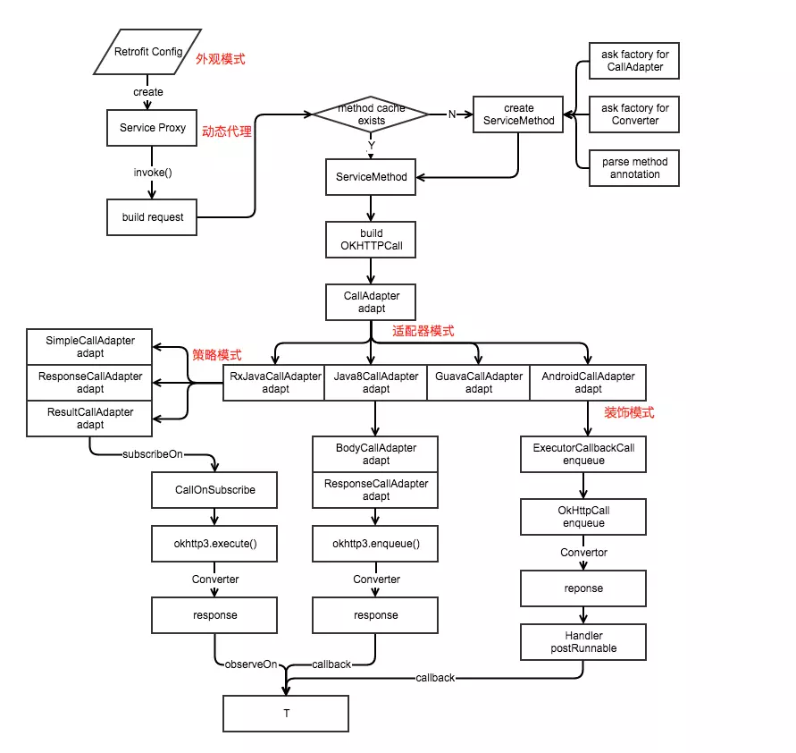

# Retrofit 源码分析

　　Retrofit 的主要原理是利用了 Java 的动态代理技术，把 ApiService 的方法调用集中到了 InvocationHandler.invoke，在构建了 ServiceMethod 、OkHttpClient，返回 callAdapter.adapter 的结果。

　　Retrofit 的最大特点就是解耦。

## 基本使用

```java
        OkHttpClient okHttpClient = new OkHttpClient.Builder()
                .connectTimeout(10, TimeUnit.SECONDS)
                .readTimeout(10, TimeUnit.SECONDS)
                .retryOnConnectionFailure(true)
                .writeTimeout(10, TimeUnit.SECONDS)
                .build();

        Retrofit retrofit = new Retrofit.Builder()
                .baseUrl("http://test")
                .addConverterFactory(GsonConverterFactory.create(new GsonBuilder().create()))
                .addCallAdapterFactory(RxJavaCallAdapterFactory.create())
                .client(okHttpClient)
                .build();

        ApiService service = retrofit.create(ApiService.class);
        Observable<ApiService.BaseResponse> observable = service.getMessage(1);
		...

```

　　Retrofit 就这样经过简单的配置后就可以向服务器请求数据了，超级简单。

## 分析

### Retrofit.create 方法分析

　　Retrofit 的 create 方法作为 Retrofit 的入口。

```java
  public <T> T create(final Class<T> service) {
    // 验证接口是否合理
    Utils.validateServiceInterface(service);
    // 默认 false
    if (validateEagerly) {
      eagerlyValidateMethods(service);
    }
    // 动态代理
    return (T) Proxy.newProxyInstance(service.getClassLoader(), new Class<?>[] { service },
        new InvocationHandler() {
          // 平台的抽象，指定默认的 CallbackExecutor CallAdapterFactory 用，这里 Android 平台是 Android（还有 Java8 和 ios）
          private final Platform platform = Platform.get();
		  // ApiService 中的方法调用会走到这里
          @Override public Object invoke(Object proxy, Method method, @Nullable Object[] args)
              throws Throwable {
            // If the method is a method from Object then defer to normal invocation.
            // Object 的方法不管
            if (method.getDeclaringClass() == Object.class) {
              return method.invoke(this, args);
            }
            // java8 的默认方法，Android 暂不支持默认方法，所以暂时也需要管
            if (platform.isDefaultMethod(method)) {
              return platform.invokeDefaultMethod(method, service, proxy, args);
            }
            //重点
            // 为 Method 生成一个 ServiceMethod
            ServiceMethod<Object, Object> serviceMethod =
                (ServiceMethod<Object, Object>) loadServiceMethod(method);
            // 再包装成 OkHttpCall
            OkHttpCall<Object> okHttpCall = new OkHttpCall<>(serviceMethod, args); // 请求
            return serviceMethod.callAdapter.adapt(okHttpCall);
          }
        });
  }
```

　　从 create 方法中可以看出，Retrofit 的主要原理是利用了 Java 的动态代理技术，把 ApiService 的 方法调用集中到了 InvocationHandler.invoke，再构建了 ServiceMethod、OkHttpCall，返回 callAdapter.adapt() 的结果。

### ServiceMethod 的职责以及 loadServiceMethod 分析

　　ServiceMethod 是接口方法的抽象，主要负责解析它对应的 method 的各种参数（它有各种如 parseHeaders 的方法），比如注解（@GET）、入参，另外还负责获取 callAdapter、responseConverter 等 Retrofit 配置，好为后面的 pkhttp3/Request 做好参数准备，它的 toRequest 为 OkHttp 提供 Request，可以说它承载了后续 Http 请求所需的一切参数。

#### loadServiceMethod 方法

```java
// serviceMethodCache 的定义
ServiceMethod<?, ?> loadServiceMethod(Method method) {
    // 获取 method 对应的 ServiceMethod
    ServiceMethod<?, ?> result = serviceMethodCache.get(method);
    if (result != null) return result;

    synchronized (serviceMethodCache) {
      // 先从缓存去获取
      result = serviceMethodCache.get(method);
      if (result == null) {
        // 缓存中更没有则新建，并存入缓存
        result = new ServiceMethod.Builder<>(this, method).build();
        serviceMethodCache.put(method, result);
      }
    }
    return result;
  }
```

　　loadServiceMethod 方法，负责为 method 生成一个 ServiceMethod，并且给 ServiceMethod 做了缓存。

　　动态代理是有一定的性能损耗的，并且 ServiceMethod 的创建伴随着各种注解参数解析，这也是耗时间的，再加上一个 App 调用接口是非常频繁的，如果每次接口请求都需要重新生成那么有浪费资源损害性能的可能，所以做了一份缓存来提供效率。

### OkHttpCall

　　将 serviceMethod 和 args 作为参数生成了一个 OkHttpCall。

```java
OkHttpCall okHttpCall = new OkHttpCall<>(serviceMethod,args);
```

　　OkHttpCall 是对 OkHttp3.call 的组合包装，OkHttpCall 中有一个成员 OkHttp3.Call rawCall。

### callAdapter.adapt 流程分析

　　这里涉及到的 callAdapter 是由配置 Retrofit 的 addCallAdapterFactory 方法中传入的 RxJavaCallAdapterFactory.create() 生成，实例为 RxJavaCallAdapterFactory。

　　实例的生成大致流程为：ServiceMethod.Build() -> ServiceMethod.createCallAdapter() -> retrofit.callAdapter() -> adapterFactories 遍历 -> 最终到 RxJavaCallAdapterFactory.get() # getCallAdapter() -> return new RxJavaCallAdapter(Observable,scheduler)；

　　由于使用了 RxJava，所以最终得到的 callAdapter 为 RxJavaCallAdapter。

#### RxJavaCallAdapter 的 adap 方法

```java
  @Override public Object adapt(Call<R> call) {
    // 这个 call 是 OkHttpCall
    // OkHttpCall = new OkHttpCall<>(serviceMethod, args) 生成的 OkHttpCall
    //是否是异步，异步就是CallEnqueueOnSubscribe，同步是 CallExecuteOnSubscribe
    OnSubscribe<Response<R>> callFunc = isAsync
        ? new CallEnqueueOnSubscribe<>(call)
        : new CallExecuteOnSubscribe<>(call);

    OnSubscribe<?> func;
    if (isResult) {
      func = new ResultOnSubscribe<>(callFunc);
    } else if (isBody) {
      func = new BodyOnSubscribe<>(callFunc);
    } else {
      func = callFunc;
    }
    Observable<?> observable = Observable.create(func);

    if (scheduler != null) {
      observable = observable.subscribeOn(scheduler);
    }

    if (isSingle) {
      return observable.toSingle();
    }
    if (isCompletable) {
      return observable.toCompletable();
    }
    return observable;
  }
```

　　查看 CallEnqueueOnSubscribe 类：

```java
final class CallEnqueueOnSubscribe<T> implements OnSubscribe<Response<T>> {
  private final Call<T> originalCall;

  CallEnqueueOnSubscribe(Call<T> originalCall) {
    this.originalCall = originalCall;
  }

  @Override public void call(Subscriber<? super Response<T>> subscriber) {
    // Since Call is a one-shot type, clone it for each new subscriber.
    Call<T> call = originalCall.clone();
    final CallArbiter<T> arbiter = new CallArbiter<>(call, subscriber);
    subscriber.add(arbiter);
    subscriber.setProducer(arbiter);
	// 进行异步请求。call 是 OkHttpCall 的实例
    call.enqueue(new Callback<T>() {
      @Override public void onResponse(Call<T> call, Response<T> response) {
        arbiter.emitResponse(response);
      }

      @Override public void onFailure(Call<T> call, Throwable t) {
        Exceptions.throwIfFatal(t);
        arbiter.emitError(t);
      }
    });
  }
}
```

　　RxJavaCallAdapter 的 adap 方法很简单，创建一个 Observable 获取 CallOnSubscribe 中的 Response < T > 通过  observable.toSingle() 或者 toCompletable() 转为 Object 返回。这里取发送请求获取数据的任务在 OnSubscribe 的实现类中（例如 CallEnqueueOnSubscribe），并且最后走到了 okHttpCall.execute 或者 okHttpCall.enqueue 中去了。

#### OkHttpCall 的 enqueue 方法

```java
  @Override public void enqueue(final Callback<T> callback) {
    checkNotNull(callback, "callback == null");

    okhttp3.Call call;
    Throwable failure;

    synchronized (this) {
       // 同一个请求，不能执行两次
      if (executed) throw new IllegalStateException("Already executed.");
      executed = true;

      call = rawCall;
      failure = creationFailure;
      if (call == null && failure == null) {
        try {
          // 创建 okHttp3.call
          call = rawCall = createRawCall();
        } catch (Throwable t) {
          failure = creationFailure = t;
        }
      }
    }

    if (failure != null) {
      callback.onFailure(this, failure);
      return;
    }

    if (canceled) {
      call.cancel();
    }
	//请求
    call.enqueue(new okhttp3.Callback() {
      @Override public void onResponse(okhttp3.Call call, okhttp3.Response rawResponse)
          throws IOException {
        Response<T> response;
        try {
          // 解析 rawResponse
          response = parseResponse(rawResponse);
        } catch (Throwable e) {
          callFailure(e);
          return;
        }
        callSuccess(response);
      }

      @Override public void onFailure(okhttp3.Call call, IOException e) {
        try {
          callback.onFailure(OkHttpCall.this, e);
        } catch (Throwable t) {
          t.printStackTrace();
        }
      }

      private void callFailure(Throwable e) {
        try {
          callback.onFailure(OkHttpCall.this, e);
        } catch (Throwable t) {
          t.printStackTrace();
        }
      }

      private void callSuccess(Response<T> response) {
        try {
          callback.onResponse(OkHttpCall.this, response);
        } catch (Throwable t) {
          t.printStackTrace();
        }
      }
    });
  }
```

#### OkHttpCall 的 parseResponse

　　解决请求数据得到的响应结果：

```java
  Response<T> parseResponse(okhttp3.Response rawResponse) throws IOException {
    ResponseBody rawBody = rawResponse.body();

    // Remove the body's source (the only stateful object) so we can pass the response along.
    rawResponse = rawResponse.newBuilder()
        .body(new NoContentResponseBody(rawBody.contentType(), rawBody.contentLength()))
        .build();

    int code = rawResponse.code();
    if (code < 200 || code >= 300) {
      try {
        // Buffer the entire body to avoid future I/O.
        ResponseBody bufferedBody = Utils.buffer(rawBody);
        return Response.error(bufferedBody, rawResponse);
      } finally {
        rawBody.close();
      }
    }

    if (code == 204 || code == 205) {
      rawBody.close();
      return Response.success(null, rawResponse);
    }

    ExceptionCatchingRequestBody catchingBody = new ExceptionCatchingRequestBody(rawBody);
    try {
      // 调用 ServideMthod 的 toResponse 方法，将其转为 T 类型
      T body = serviceMethod.toResponse(catchingBody);
      return Response.success(body, rawResponse);
    } catch (RuntimeException e) {
      // If the underlying source threw an exception, propagate that rather than indicating it was
      // a runtime exception.
      catchingBody.throwIfCaught();
      throw e;
    }
  }
```

　　ServiceMethod 的 toResponse 方法最终会调用到调用设置的 GsonRequestBodyConverter的 convert 方法，将 response 处理后返回。

　　经过一连串的处理，最终在 OkHttpCall.enqueue() 方法中生成 okhttp3.call 交给 OkHttpClient 去发送请求，再由配置的 Converter 处理 Response，返回给 SimpleCallAdapter 处理，返回最终所需要的 Observable。

## 问题

1. 调用接口的方法后是怎么发送请求的？这背后发生了什么？

   Retrofit 使用了动态代理给定义的接口设置了代理，当调用接口的方法时，Retrofit 会拦截下来，然后经过一系列处理，比如解析方法的注解等，生成了 call Request 等 OkHttp 所需的资源，最后交给 OkHttp 去发送请求，此间经过 callAdapter、converter 的处理，最后拿到所需要的数据。

2. Retrofit 与 OkHttp 是怎么合作的？

   在 Retrofit 中，ServiceMethod 承载了一个 Http 请求的所有参数，OkHttpCall 为 okhttp3.call 的组合包装，由它们两合作，生成用于 OkHttp 所需的 Request 以及 okhttp3.call，交给 OkHttp 去发送请求。

   可以说 Retrofit 为 OkHttp 再封装了一层，并添加了不少功能以及扩展，减少了开发使用成本。

3. Retrofit 中的数据究竟是怎么处理的？它是怎么返回 RxJava.Observable 的?

   Retrofit 中的数据其实是交给了 callAdapter 以及 converter 去处理，callAdapter 负责把 okHttpCall 转为用户所需的 Observable 类型，converter 负责把服务器返回的数据专程具体的实体类。


## 流程图



　　

## 流程

1. 通过门面 Retrofit 来 build 一个 Service Interface 的 proxy

```java
  public <T> T create(final Class<T> service) {
    Utils.validateServiceInterface(service);
    if (validateEagerly) {
      eagerlyValidateMethods(service);
    }
    return (T) Proxy.newProxyInstance(service.getClassLoader(), new Class<?>[] { service },
        new InvocationHandler() {
          private final Platform platform = Platform.get();

          @Override public Object invoke(Object proxy, Method method, @Nullable Object[] args)
              throws Throwable {
            // If the method is a method from Object then defer to normal invocation.
            if (method.getDeclaringClass() == Object.class) {
              return method.invoke(this, args);
            }
            if (platform.isDefaultMethod(method)) {
              return platform.invokeDefaultMethod(method, service, proxy, args);
            }
            ServiceMethod<Object, Object> serviceMethod =
                (ServiceMethod<Object, Object>) loadServiceMethod(method);
            OkHttpCall<Object> okHttpCall = new OkHttpCall<>(serviceMethod, args);
            return serviceMethod.callAdapter.adapt(okHttpCall);
          }
        });
  }
```

2. 当调用这个 Service Interface 中的某个请求方法，会被 proxy 拦截。

```java
    @POST("v1/student/wrong")
    Observable<BaseResponse> postClassroomWorngNoteAnswer(@Query("F_student_id") String studentId,
                                                          @Query("F_accesstoken") String accesstoken,
                                                          @Query("F_resource_id") String resourceId);
```

3. 通过 ServiceMethod 来解析 invoke 的那个方法，通过解析注解，传参，将它们封装成熟悉的 reequest，然后通过具体的返回值类型，让之前配置的工厂生成具体的 CallAdapter、ResponseConveter。

4. new 一个 OkHttpCall，这个 OkHttpCall 算是 OkHttp 的包装类，用它跟 OkHttp 对接，所有 OkHttp 需要的参数都可以看这个类。当然还可以扩展一个新的 Call ，比如 HttpUrlConnectionCall，但是有些耦合。

   ```java
   // Retrofic 的 create 方法中的部分代码
   ServiceMethod<Object, Object> serviceMethod =
                   (ServiceMethod<Object, Object>) loadServiceMethod(method);
               OkHttpCall<Object> okHttpCall = new OkHttpCall<>(serviceMethod, args);
               return serviceMethod.callAdapter.adapt(okHttpCall);
   ```

   明确的指明了 OkHttpCall，而不是通过工厂来生成 Call。所以如果不想改源码，重新编译，那就只能使用 OkHttp 了。

5. 生成的 CallAdapter 有四个工厂，分别对应不同的平台：RxJava、Java8、Guava 还有一个 Retrofit 默认的。简单来说就是用来将 Call 转成 T 的一个策略。因为这里具体请求时耗时操作，所以需要 CallAdapter 去管理线程。

6. 比如 RxJava 会根据调用方法的返回值，如 Response < T > | Result < T > | Observable < T >，生成不同的 CallAdapter。实际上就是对 RxJava 的回调方式做封装。比如将 response 再拆解为 success 和 error 等。

7. 在第 5 步中，说的 CallAdapter 还管理线程。比如说 RxJava，它最大的优点是可以指定方法在什么县城下执行。

   ```java
    Observable.interval(1, 1, TimeUnit.SECONDS)
   		.subscribeOn(Schedulers.computation())
           .observeOn(AndroidSchedulers.mainThread())
   ...
   ```

   在计算线程订阅（subscribeOn），在主线程观察（observeOn）。而这些是如何做的呢，可以看一下源码：

   ```java
   final class RxJavaCallAdapter<R> implements CallAdapter<R, Object> {
       
     ...
     @Override public Type responseType() {
       return responseType;
     }
   
     @Override public Object adapt(Call<R> call) {
       OnSubscribe<Response<R>> callFunc = isAsync
           ? new CallEnqueueOnSubscribe<>(call)
           : new CallExecuteOnSubscribe<>(call);
       ...
       Observable<?> observable = Observable.create(func);
   
       if (scheduler != null) {
         observable = observable.subscribeOn(scheduler);
       }
   
       if (isSingle) {
         return observable.toSingle();
       }
       if (isCompletable) {
         return observable.toCompletable();
       }
       return observable;
     }
   }
   ```

   在 adapt call 时，subscribeOn 了，所以就切换到子线程中了。

8. 在 adapt cal  中，具体的调用了 Call execute()，execute() 是同步的，enqueue() 是异步的。因为 RxJava 已经切换了线程，所以这里用同步方法 execute()。

   ```java
   final class CallExecuteOnSubscribe<T> implements OnSubscribe<Response<T>> {
     private final Call<T> originalCall;
   
     CallExecuteOnSubscribe(Call<T> originalCall) {
       this.originalCall = originalCall;
     }
   
     @Override public void call(Subscriber<? super Response<T>> subscriber) {
       // Since Call is a one-shot type, clone it for each new subscriber.
       Call<T> call = originalCall.clone();
       CallArbiter<T> arbiter = new CallArbiter<>(call, subscriber);
       subscriber.add(arbiter);
       subscriber.setProducer(arbiter);
   
       Response<T> response;
       try {
         response = call.execute();
       } catch (Throwable t) {
         Exceptions.throwIfFatal(t);
         arbiter.emitError(t);
         return;
       }
       arbiter.emitResponse(response);
     }
   }
   
   ```

9. 接下来的具体请求，就是 OkHttp 的事情了，retrofit 要做的就是等待返回值，在第 4步中，说到 OkHttpCall 是 OkHttp 的包装类，所以将 OkHttp 的 response 转换称需要的 T，就是在 OkHttpCall 中执行的。

10. 当然具体的解析转换操作也不是 OkHttpCall 来做的，因为它也不知道数据格式是什么样的，所以它知识将 response 包装成 retrofit 标准下的 response。

11. Converter -> ResponseConverter，很明显，它是数据转换器。它将 response 转换称具体想要的 T。Retrofit 提供了很多的 converter factory，比如 Gson、Jackson、xml、protobuff 等等，需要什么，就配置相对应的工厂，在 Service 方法上声明泛型具体类型就可以了。

12. 最后，通过声明的 observeOn 线程回调给上层，这样上层就拿到了最终结果。至于结果再如何处理，那就是上层的事情了。

## 参考文章
[Retrofit分析-漂亮的解耦套路](https://www.jianshu.com/p/45cb536be2f4)

[Retrofit是如何工作的？](https://www.jianshu.com/p/cb3a7413b448)

[拆轮子系列：拆 Retrofit](https://blog.piasy.com/2016/06/25/Understand-Retrofit/index.html)

