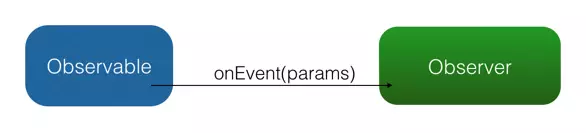

# RxJava

## 观察者模式

### 传统观察者模式

　　观察者模式面向的需求时： A 对象（观察者）对 B 对象（被观察者）的某种变化高度敏感，需要在 B 变化的一瞬间做出反应。

　　在程序中，观察者采用注册（Register）或者称为订阅（Subscribe）的方式，告诉被观察者：我需要你的某某状态，你要在它变化的时候通知我。

　　Android 开发中一个比较典型的例子是点击监听器 onClickListener。对设置 onClickListener 来说，View 是被观察者，onClickListener 是观察者，二者通过 setOnClickListener() 方法达到订阅关系。订阅之后用户点击按钮的瞬间，Android Framework 就会将点击事件发送给已经注册的 onClickListener。

　　采取这样被动的观察方式，即省去了反复检索状态的资源消耗，ye能够得到最高的反馈速度。

　　观察者模式：



　　而 RxJava 作为一个工具库，使用的就是通用形式的观察者模式。

### RxJava 中观察者模式

　　RxJava 有四个基本概念：Observable（可观察者，即被观察者）、Observer（观察者）、subscribe（订阅）、事件。Observable 和 Observer 通过 subscribe() 放啊实现订阅关系，从而 Observable 可以在需要的时候发出事件来通知 Observer。

　　与传统观察者模式不同，RxJava 的事件回调方法除了普通的 onNext 之外，还定义了两个特殊的事件：onCompleted() 和 onError()。

* onCompleted()：事件队列完结。RxJava 不仅把每个事件单独处理，还会把它们看做一个队列。RxJava 规定，当不会再有新的 onNext() 发出时，需要触发 onCompleted() 方法作为标志。
* onError()：事件队列异常。在事件处理过程中出异常时，onError() 会被触发，同时队列自动终止，不允许再有事件发出。
* 在一个正确运行的事件序列中，onCompleted() 和 onError() 有且只有一个，并且是事件序列中的最后一个。需要注意的是，omCompleted() 和 onError() 二者也是互斥的，即在队列中调用了其中一个，就不应该再调用另一个。并且只要 onCompleted() 和 onError() 中有一个调用了，都会中止 onNext() 的调用。

　　RxJava 的观察者模式大致如下图：


## 基本实现

### 创建 Observer

　　Observer 即观察者，它决定事件触发的时候将有怎样的行为。RxJava 中的 Observer 接口的实现方式：

```java
        Observer<String> observer = new Observer<String>() {
            @Override
            public void onCompleted() {
                Log.d(TAG, "onCompleted");
            }

            @Override
            public void onError(Throwable e) {
                Log.d(TAG, "onError");
            }

            @Override
            public void onNext(String s) {
                Log.d(TAG, "onNext");
            }
        };
```

　　除了 Observer 接口之外，RxJava 还内置了一个实现了 Observer 的抽象类：Subscriber。

　　Subscriber 对 Observer 接口进行了一些扩展，但他们的基本使用方式是完全一样的：

```java
        Subscriber<String> subscriber = new Subscriber<String>() {
            @Override
            public void onCompleted() {
                Log.d(TAG, "onCompleted");
            }

            @Override
            public void onError(Throwable e) {
                Log.d(TAG, "onError");
            }

            @Override
            public void onNext(String s) {
                Log.d(TAG, "onNext");
            }
        };
```

　　不仅基本使用方式一样，实质上，再 RxJava 的 subscribe 过程中，Observer 也总是会先被转换成一个 Subscriber 再使用。

　　如果只是使用基本功能，选择 Observer 和 Subscriber 是完全一样的。它们的区别对于使用者来说主要有两点：

1. onStart()：这是 Subscriber 增加的方法。它会在 subscribe 刚开始，而事件还未发送之前被调用，可以用于做一些准备工作。例如数据的清零或重置。这是一个可选方法，默认情况下它的实现为空。需要注意的是，如果对准备工作的线程有要求（例如弹出一个显示进度的对相框，这必须在主线程执行），onStart() 就不适用了，因为它总是在 subscribe 所发生的线程被调用，而不能指定线程。要在指定的线程来做准备工作，可以使用 doOnSubscribe() 方法。
2. unsubscribe()：这是 Subscriber 所实现的另一个接口 Subscription 的方法，用于取消订阅。在这个方法被调用后，Subscriber 将不再接受事件。一般在这个方法调用前，可以使用 isUnsubscribed() 先判断一下状态。unsubscribe() 这个方法很重要，因为在 subscribe() 之后，Observable 会持有 Subscriber 的引用，这个引用如果不能及时被释放，将有内存泄漏的风险。所以最好保持一个原则：要在不再使用的时候尽快在可是的地方（例如 onPause()、onStop() 等方法中）调用 unsubscribe() 来解除引用关系，以避免内存泄漏的发生。

### 创建 Observable

　　Observable 即被观察者，它决定什么时候触发事件以及触发怎样的事件。例如 create() 方法：

```java
        Observable.create(new Observable.OnSubscribe<String>() {
            @Override
            public void call(Subscriber<? super String> subscriber) {
                subscriber.onNext("1");
                subscriber.onNext("2");
                subscriber.onNext("3");
                subscriber.onCompleted();
            }
        });
```

　　可以看到，这里传入了一个 OnSubscribe 对象作为参数。OnSubscribe 会被存储在返回的 Observable 对象中，它的作用相当于一个计划表，当 Observable 被订阅的时候，OnSubscribe 的 call() 方法会自动被调用，事件序列就会以找设定一次触发。这样，由被观察者调用了观察者的回调方法，就实现了由被观察者向观察者的事件传递，即观察者模式。

　　create() 方法是 RxJava 最基本的创造事件序列的方法。基于这个方法，RxJava 还提供了一些方法用来快捷创建事件队列。例如 just()、from()。

### 订阅 Subscribe

　　创建了 Observable 和 Observer 之后，再用 subscribe() 方法将它们联结起来，整条链子就可以工作了。

　　代码形式很简单：

```java
observable.subscribe(observer);

// 或者
observable.subscribe(subscribe);
```

## 1. RxJava 的基本订阅流程

　　一个简单的 RxJava 的使用：
```java
        Observable.create(new Observable.OnSubscribe<String>() {
            @Override
            public void call(Subscriber<String> subscriber) {
                subscriber.onNext("next");
				subscriber.onCompleted();
            }
        })
        .subscribe(new Subscriber<String>() {
        	@Override
        	public void onCompleted() {
        		Log.d(TAG, "onCompleted");
        	}

        	@Override
        	public void onError(Throwable e) {
        		Log.d(TAG, "showQuestionView onError");
        	}

        	@Override
        	public void onNext(String string) {
        		Log.d(TAG, "onNext string:"+string);
        	}
       });
```

### 1.1. 先看 Observable.create（） 方法做了什么

```java
public class Observable< T > {

    final OnSubscribe<T> onSubscribe;
    public static <T> Observable<T> create(OnSubscribe<T> f) {
        return new Observable<T>(hook.onCreate(f)); //返回 Observable 的实例
    }

	protected Observable(OnSubscribe<T> f) {
        this.onSubscribe = f; //设置 onSubscribe 的值
    }
	...
}
```
　　Observable.create() 方法返回了一个 Observable 实例对象，并且将参数 OnSubscribe< T > f 存储为成员 onSubscribe。


### Observable#just

```java
    public static <T> Observable<T> just(final T value) {
        return ScalarSynchronousObservable.create(value);
    }

    public static <T> ScalarSynchronousObservable<T> create(T t) {
        return new ScalarSynchronousObservable<T>(t);
    }

    protected ScalarSynchronousObservable(final T t) {
        super(RxJavaHooks.onCreate(new JustOnSubscribe<T>(t)));
        this.t = t;
    }
```

　　创建的是 ScalarSynchronousObservable ，是一个 Observable 的子类。

　　所以传给父类构造函数的就是 JustOnSubscribe，一个 onSubscribe 的实现类。

　　just() 方法将传入的参数依次发送出来。

　　Observable 的构造函数接受一个 OnSubscribe，它是一个回调，会在 Observable#subscribe 中使用，同于通知 observable 自己被订阅。

### 1.2 Obervable#subscribe()

```java
public class Observable< T > {

	...
    public final Subscription subscribe(final Action1<? super T> onNext) {
        if (onNext == null) {
            throw new IllegalArgumentException("onNext can not be null");
        }

        Action1<Throwable> onError = InternalObservableUtils.ERROR_NOT_IMPLEMENTED;
        Action0 onCompleted = Actions.empty();
        // 对传入的 Action 进行包装，包装为 ActionSubscriber，一个 Subscriber 的实现类。
        return subscribe(new ActionSubscriber<T>(onNext, onError, onCompleted));
    }
    
    public final Subscription subscribe(final Action1<? super T> onNext, final Action1<Throwable> onError) {
        if (onNext == null) {
            throw new IllegalArgumentException("onNext can not be null");
        }
        if (onError == null) {
            throw new IllegalArgumentException("onError can not be null");
        }

        Action0 onCompleted = Actions.empty();
        return subscribe(new ActionSubscriber<T>(onNext, onError, onCompleted));
    }

    public final Subscription subscribe(final Action1<? super T> onNext, final Action1<Throwable> onError, final Action0 onCompleted) {
        if (onNext == null) {
            throw new IllegalArgumentException("onNext can not be null");
        }
        if (onError == null) {
            throw new IllegalArgumentException("onError can not be null");
        }
        if (onCompleted == null) {
            throw new IllegalArgumentException("onComplete can not be null");
        }

        return subscribe(new ActionSubscriber<T>(onNext, onError, onCompleted));
    }
    
    public final Subscription subscribe(final Observer<? super T> observer) {
        // 如果是 Subscriber 的子类，直接转化为 SUbscriber
        if (observer instanceof Subscriber) {
            return subscribe((Subscriber<? super T>)observer);
        }
        if (observer == null) {
            throw new NullPointerException("observer is null");
        }
        // ObserverSubscriber 是 Subscriber 的子类
        return subscribe(new ObserverSubscriber<T>(observer));
    }
    
    public final Subscription subscribe(Subscriber<? super T> subscriber) {
        return Observable.subscribe(subscriber, this);
    }

	static <T> Subscription subscribe(Subscriber<? super T> subscriber, Observable<T> observable) {
        ...

        // new Subscriber so onStart it
        // 调用 subscriber.onStart() 通知 subscriber 它已经和 onservable 连接起来了。在这里就直到，onStart() 就是在调用 subscriber() 的线程执行的。
        // 可以用于一些准备工作，例如数据的清零或重制，默认情况下它的实现为空
        subscriber.onStart();

        /*
         * See https://github.com/ReactiveX/RxJava/issues/216 for discussion on "Guideline 6.4: Protect calls
         * to user code from within an Observer"
         */
        // if not already wrapped
        // 如果传入的 subscriber 不是 SafeSubscriber，那就把它包装为一个 SafeSubscriber
        if (!(subscriber instanceof SafeSubscriber)) {
            // assign to `observer` so we return the protected version
          	// 强制转化为 SafeSubscriber 是为了保证 onCompleted 或 onError 调用的时候会中止 onNext 的调用
            subscriber = new SafeSubscriber<T>(subscriber);
        }

        // The code below is exactly the same an unsafeSubscribe but not used because it would
        // add a significant depth to already huge call stacks.
        try {
            // allow the hook to intercept and/or decorate
            // 调用的其实就是 observable.onSubscribe.call(subscribe)。
            // 在调用 subscribe() 的线程执行 call 回调
          	// onObservableStart() 默认返回的就是 observable.onSubscribe
            hook.onSubscribeStart(observable, observable.onSubscribe).call(subscriber);
            // 返回 subscriber，subscriber 继承了 Subscription，用于取消订阅。
          	// onObservableReturn() 默认也是返回 subscriber
            return hook.onSubscribeReturn(subscriber);
        } catch (Throwable e) {
            ...
        }
    }
	...
}
```
　　SafeSubscriber 的作用：保证 Subscriber 实例遵循 Observable contract。

　　subscribe() 的重载方法很多，但是最后都会调用到 Subscription subscribe(Subscriber<? super T> subscriber) 方法中。

　　通过源码可以看到：subscriber() 实际就做了 4 件事情：

1. 调用 Subscriber.onSTart() 。
2. 将传入的 Subscriber 转化为 SafeSubscriber，为了保证 onCompleted 或 onError 调用的时候会中止 onNext() 的调用。
3. 调用 Observable 中的 OnSubscribe.call(Subscriber)。在这里，事件发送的逻辑开始运行。从这也可以看出，在 RxJava 中，Observable 并不是在创建的时候就立即开始发送事件，而是在它被订阅的时候，即当 subscribe() 方法执行的时候。
4. 被传入的 Subscriber 作为 Subscription 返回。这是为了方便 unsubscribe()。

　　调用 subscribe() 方法时，如果 subscriber 不是 SafeSubscriber 类型，就会将 subscriber 设置为 subscriber 对象，之后 hook.onSubscribeStart(observable, observable.onSubscribe) 返回的就是是 observable 的 onSubscribe 变量，而 observable 就是调用上一步 create 返回的 Observable 的实例对象，而它的 onSubscribe 变量就是我们自己传入 create() 方法的参数：

```java
new Observable.OnSubscribe<String>() {
            @Override
            public void call(Subscriber<String> subscriber) {
                subscriber.onNext("next");
				subscriber.onCompleted();
            }
        }
```
　　所以调用 subscribe() 方法之后就会调用到 observable 的 onSubscribe 变量的 call() 方法，而在 call() 方法中的参数 subscriber 是刚才创建的 SafeSubscriber 对象，调用 SafeSubscribe 的 onNext、onComplete 方法，会调用 SafeSubscribe 的 actual 变量的 onNext、onComplete 方法，而 actual 就是 SafeSubcribe 构造方法中传入的参数，也就是调用 Observable 的 subscribe() 的参数，所以 onSubscribe 变量的 call() 方法会调用Observable 的 subscribe() 的参数的方法，也就是：
```java
new Subscriber<String>() {
        	@Override
        	public void onCompleted() {
        		Log.d(TAG, "onCompleted");
        	}

        	@Override
        	public void onError(Throwable e) {
        		Log.d(TAG, "showQuestionView onError");
        	}

        	@Override
        	public void onNext(String string) {
        		Log.d(TAG, "onNext string:"+string);
        	}
       }
```
　　到这里流程就过完了。方法的主导只要由 Observable 来，在创建 Observable 的时候，会将 OnSubscribe(订阅操作)传给 Observable(被观察者) 作为成员变量，在调用 subscribe 的方法（订阅）时，将 Subscriber (观察者)作为变量传入，将 Subscriber （观察者）作为参数调用 onSubscribe 的 call 方法来处理订阅的事件，并且会调用 Subcriber 的相关方法（通知观察者）。

### SafeSubscriber

```java
public class SafeSubscriber<T> extends Subscriber<T> {

    private final Subscriber<? super T> actual;

    boolean done; // 通过改标志来保证 onCompleted 或 onError 调用的时候会中止 onNext 的调用

    public SafeSubscriber(Subscriber<? super T> actual) {
        super(actual);
        this.actual = actual;
    }

    @Override
    public void onCompleted() {
        if (!done) {
            done = true;
            try {
                actual.onCompleted();
            } catch (Throwable e) {
                Exceptions.throwIfFatal(e);
                RxJavaHooks.onError(e);
                throw new OnCompletedFailedException(e.getMessage(), e);
            } finally { // NOPMD
                try {
                    unsubscribe(); // 取消订阅，结束事务
                } catch (Throwable e) {
                    RxJavaHooks.onError(e);
                    throw new UnsubscribeFailedException(e.getMessage(), e);
                }
            }
        }
    }

    @Override
    public void onError(Throwable e) {
        Exceptions.throwIfFatal(e);
        if (!done) {
            done = true;
            _onError(e);
        }
    }

    @Override
    public void onNext(T t) {
        try {
          	// done 为 true 时，中止传递
            if (!done) {
                actual.onNext(t);
            }
        } catch (Throwable e) {
            Exceptions.throwOrReport(e, this);
        }
    }

    @SuppressWarnings("deprecation")
    protected void _onError(Throwable e) { // NOPMD
        RxJavaPlugins.getInstance().getErrorHandler().handleError(e);
        try {
            actual.onError(e);
        } catch (OnErrorNotImplementedException e2) { // NOPMD
            try {
              	// 取消订阅
                unsubscribe();
            } catch (Throwable unsubscribeException) {
                RxJavaHooks.onError(unsubscribeException);
                throw new OnErrorNotImplementedException("Observer.onError not implemented and error while unsubscribing.", new CompositeException(Arrays.asList(e, unsubscribeException))); // NOPMD
            }
            throw e2;
        } catch (Throwable e2) {
            RxJavaHooks.onError(e2);
            try {
                unsubscribe();
            } catch (Throwable unsubscribeException) {
                RxJavaHooks.onError(unsubscribeException);
                throw new OnErrorFailedException("Error occurred when trying to propagate error to Observer.onError and during unsubscription.", new CompositeException(Arrays.asList(e, e2, unsubscribeException)));
            }

            throw new OnErrorFailedException("Error occurred when trying to propagate error to Observer.onError", new CompositeException(Arrays.asList(e, e2)));
        }
        try {
            unsubscribe();
        } catch (Throwable unsubscribeException) {
            RxJavaHooks.onError(unsubscribeException);
            throw new OnErrorFailedException(unsubscribeException);
        }
    }
    public Subscriber<? super T> getActual() {
        return actual;
    }
}

```

　　通过 SafeSubscriber 中的布尔变量 done 来做标记保证 onCompleted() 和 onError() 二者的互斥性，即在队列中调用了其中一个，就不应该再调用另一个。并且只要 onCompleted() 和 onError() 中有一个调用了，都会中止 onNext() 的调用。


### JustOnSubscribe#call

　　在 just() 的实现里面，创建了一个 JustOnSubscribe，在 subscribe() 方法中执行 hook.onSubscribeStart(observable, observable.onSubscribe).call(subscriber) 方法实际执行的就是 JustOnSubscribe 的 call 方法。

```java
    static final class JustOnSubscribe<T> implements OnSubscribe<T> {
        final T value;

        JustOnSubscribe(T value) {
            this.value = value;
        }

        @Override
        public void call(Subscriber<? super T> s) {
            s.setProducer(createProducer(s, value));
        }
    }

    static <T> Producer createProducer(Subscriber<? super T> s, T v) {
        if (STRONG_MODE) {
            return new SingleProducer<T>(s, v);
        }
        return new WeakSingleProducer<T>(s, v);
    }
```

　　在 RxJava 1.x 中，数据都是从  observable push 到 subscriber 的，但要是 observable 发的太快，subscriber 处理不过来，该怎么办？一种办法是，把数据保存起来，但这显然可能导致内存耗尽；另一种办法是，多余的数据来了之后就丢掉，至于丢掉和保留的策略可以按需指定；还有一种办法就是让 subscriber 向  observale 主动请求数据，subscriber 不请求，onservable 就不发出数据。它两互相协调，避免出现过多的数据，而协调的桥梁，就是 producer。

### Subscriber#setProducer

```java
    public void setProducer(Producer p) {
        long toRequest;
        boolean passToSubscriber = false;
        synchronized (this) {
            toRequest = requested;
            producer = p;
            // 一次包装，ActionSubscriber 包装为 SafeSubscriber
            if (subscriber != null) {
                // middle operator ... we pass through unless a request has been made
                if (toRequest == NOT_SET) {
                    // we pass through to the next producer as nothing has been requested
                    passToSubscriber = true;
                }
            }
        }
        // do after releasing lock
        // 发生一次 pass through ，然后回进入 else 代码块
        if (passToSubscriber) {
            subscriber.setProducer(producer);
        } else {
            // we execute the request with whatever has been requested (or Long.MAX_VALUE)
            // 这列所有的 requested 初始值都是 NOT_SET,所以回请求 Long.MAX_VALUE ，即无限个数据。
            if (toRequest == NOT_SET) {
                producer.request(Long.MAX_VALUE);
            } else {
                producer.request(toRequest);
            }
        }
    }
```

　　最后调用了 producer 的 request() 方法。

### WeakSingleProducer#request

```java
    static final class WeakSingleProducer<T> implements Producer {
        final Subscriber<? super T> actual;
        final T value;
        boolean once;

        public WeakSingleProducer(Subscriber<? super T> actual, T value) {
            this.actual = actual;
            this.value = value;
        }

        @Override
        public void request(long n) {
            if (once) {
                return;
            }
            if (n < 0L) {
                throw new IllegalStateException("n >= required but it was " + n);
            }
            if (n == 0L) {
                return;
            }
            once = true;
            Subscriber<? super T> a = actual;
            if (a.isUnsubscribed()) {
                return;
            }
            T v = value;
            try {
                a.onNext(v);
            } catch (Throwable e) {
                Exceptions.throwOrReport(e, a, v);
                return;
            }

            if (a.isUnsubscribed()) {
                return;
            }
            a.onCompleted();
        }
    }
```

　　在 request() 中，调用了 subscriiber 的 onNext() 和 onCompleted()，那么 Hello World 就传递到了 Action 中，并被打印出来了。

### just 为例的完成过程


　　一切行为都由 subscribe 触发，而且都是直接的函数调用，所以在调用 subscribe 的线程执行。


## 2. subscribeOn(Schedulers.computation()) 流程分析
　　RxJava 进行异步非常简单，只需要使用 subscribeOn 和 onserveOn 这两个操作符即可。


　　subscribeOn(Schedulers.computation()) 方法让 OnSubscribe()（订阅操作） 运行在计算线程。
　　简单使用：

```java
        Thread th=Thread.currentThread();
        System.out.println("onResume Tread name:"+th.getName()); //out:onResume Tread name:main
        Observable.create(new Observable.OnSubscribe<String>() {
            @Override
            public void call(Subscriber<? super String> subscriber) {
                Log.d(TAG, "call subscriber:" + subscriber );
                Thread th=Thread.currentThread();
                System.out.println("call Tread name:"+th.getName()); //out:call Tread name:RxComputationScheduler-1
                subscriber.onNext("Hello");
                subscriber.onCompleted();
            }
        })
                .subscribeOn(Schedulers.computation())
                .subscribe(new Subscriber<String>() {
                    @Override
                    public void onCompleted() {
                        Log.d(TAG, "onCompleted");
                    }

                    @Override
                    public void onError(Throwable e) {
                        Log.d(TAG, "onError");
                    }

                    @Override
                    public void onNext(String s) {
                        Thread th=Thread.currentThread();
                        System.out.println("onNext Tread name:"+th.getName()); //out:onNext Tread name:RxComputationScheduler-1
                        Log.d(TAG, "onNext s:" + s);
                    }
                });
```

#### 2.1. create() 方法
　　create() 方法与上面的流程是相同的，会创建一个 Observable 对象，并设置 onSubscribe 成员的值，这里为了下面流程看起来清晰，我把 create() 方法创建的 Observable 对象称为 Observable1，它的 onSubscribe 成员称为 onSubscribe1。

#### 2.2. subscribeOn() 方法
```java
public class Observable<T> {
	...
    public final Observable<T> subscribeOn(Scheduler scheduler) {
        if (this instanceof ScalarSynchronousObservable) {
            return ((ScalarSynchronousObservable<T>)this).scalarScheduleOn(scheduler);
        }
        return create(new OperatorSubscribeOn<T>(this, scheduler));
    }
	...
}
```
　　在 subscribeOn() 方法里再次调用了 create() 方法，不过这次是一个 OperatorSubscribeOn 对象，所以当前 Observable 的 onSubscribe 的值被设置为了 OperatorSubscribeOn 对象，并且将之前的 Observable1 作为参数传递过去。调用 subscribeOn() 方法后会返回一个新的 Observable 对象，也就是当前 Observable，在这里为了区分，将它称之为 Observable2。

　　普通情况：通过 create + OperatorSubscribeOn 实现。

#### 2.2.1. OperatorSubscribeOn

```java
public final class OperatorSubscribeOn<T> implements OnSubscribe<T> {

    final Scheduler scheduler;
    final Observable<T> source; //Observable1

    public OperatorSubscribeOn(Observable<T> source, Scheduler scheduler) {
        this.scheduler = scheduler;
        this.source = source;
    }

    @Override
    public void call(final Subscriber<? super T> subscriber) {
        final Worker inner = scheduler.createWorker(); 			//线程池
        subscriber.add(inner); // 1
        //启动线程
        inner.schedule(new Action0() {
            @Override
            public void call() {
                final Thread t = Thread.currentThread();

                Subscriber<T> s = new Subscriber<T>(subscriber) {
                    @Override
                    public void onNext(T t) {
                        subscriber.onNext(t); // 2
                    }

                    @Override
                    public void onError(Throwable e) {
                        try {
                            subscriber.onError(e);
                        } finally {
                            inner.unsubscribe();
                        }
                    }

                    @Override
                    public void onCompleted() {
                        try {
                            subscriber.onCompleted();
                        } finally {
                            inner.unsubscribe();
                        }
                    }
					//同时设置了 observeOn() 方法，setProducer 方法会被调用，从而确保 OnSubscribe 的 call 方法运行在指定的线程中
                    @Override
                    public void setProducer(final Producer p) {
                        subscriber.setProducer(new Producer() {
                            @Override
                            public void request(final long n) {
                                if (t == Thread.currentThread()) {
                                    p.request(n); // 3
                                } else {
                                    inner.schedule(new Action0() {
                                        @Override
                                        public void call() {
                                            p.request(n); // 4
                                        }
                                    });
                                }
                            }
                        });
                    }
                };

                source.unsafeSubscribe(s); // 5
            }
        });
    }
}

```
　　也可以看到 OperatorSubscribeOn 对象会持有 Observable1 成员。

　　在这里理清一下 create() 方法返回的 Observable1，它的 onSubscribe 值是我们调用 create() 方法是传入的 Observable.OnSubscribe< String >() 对象（也就是 onSubscribe1），而调用 subscribeOn() 方法后返回的是 Observable2，它的onSubscribe 值是 OperatorSubscribeOn 对象，并且 OperatorSubscribeOn 对象持有 Observable1 成员。

1. Worker 也实现了 Subscription，所以可以加入到 SUbscriber 中，用于集体取消订阅。
2. 在匿名 Subscriber 中，收到上游的数据后，转发给下游。
3. Producer#request 被调用时，如果调用线程就是 worker 的线程（t），就直接把请求转发给上游。
4. 否则还需要进行一次调度，确保调用上游的 request 一定是在 worker 的线程。
5. 在 worker 线程中，把自己（匿名 Subscriber）和上游连接起来。

　　连接上游（可能会触发请求）、向上游发请求，都是在 worker 的线程上执行的，所以如果上游处理请求的代码没有进行异步操作，那上游的代码就是在 subscribeOn 指定的线程上执行的。即 subscribeOn 影响它上面的调用执行时所在的线程。

　　关于使用多次调用 subscribeOn 的效果，后面的 subscribeOn 只会改变前面的 subscribeOn 调度操作所在的线程，并不能改变最终被调度的代码执行的线程，但对于中途的代码执行的线程，还是会影响到的。

#### 2.3. subscribe() 方法
　　从 1.x 的简单流程可以得知，subscribe() 方法会调用 Observable 的 onSubscribe 的 call() 方法，当前的 Observable 是 Observable2，Observable2 的 onSubscribe 的值是 OperatorSubscribeOn 对象，所以就会调用 OperatorSubscribeOn 对象的方法，从 2.2.1 的 OperatorSubscribeOn 的代码可以看到，OperatorSubscribeOn 的 call() 方法会在线程池中调用 `source.unsafeSubscribe(s);`这句代码，s是在 call 方法中生成的，我们称他为 Subscriber3，而 source 是 Observable1，所以查看 Observable 的 unsafeSubscribe(s) 方法：
```java
    public final Subscription unsafeSubscribe(Subscriber<? super T> subscriber) {
        try {
            // new Subscriber so onStart it
            subscriber.onStart();
            // allow the hook to intercept and/or decorate
            hook.onSubscribeStart(this, onSubscribe).call(subscriber);
            return hook.onSubscribeReturn(subscriber);
        } catch (Throwable e) {
            ...
        }
    }
```
　　在 Observable1 的 unsafeSubscribe() 方法中调用了 onSubscribe 的 call() 方法，也就是 onSubscribe1 的 call 方法（也就是自己调用 create() 传入的参数），并且将 subscriber3 作为参数进行了传递：
```java
new Observable.OnSubscribe<String>() {
            @Override
            public void call(Subscriber<? super String> subscriber) {
                Log.d(TAG, "call subscriber:" + subscriber );
                Thread th=Thread.currentThread();
                System.out.println("call Tread name:"+th.getName());
                subscriber.onNext("Hello"); //subscribe:Subscribe3
                subscriber.onCompleted();
            }
        }
```
　　在 onSubscribe1 的 call 方法中调用了 subscriber.onNext() 方法，也就是 Subscribe3 的 onNext() 方法，所以回到 OperatorSubscribeOn 的 call() 方法中查看 Subscribe3 的 onNext() 方法：
```java
                    public void onNext(T t) {
                        subscriber.onNext(t);
                    }
```
　　在 Subscribe3 的 onNext() 方法中调用了 subscriber.next() 方法，而 subscriber 是什么？就是我们调用 subscriber() 方法是传递的参数，就是：
```java
new Subscriber<String>() {
                    @Override
                    public void onCompleted() {
                        Log.d(TAG, "onCompleted");
                    }

                    @Override
                    public void onError(Throwable e) {
                        Log.d(TAG, "onError");
                    }

                    @Override
                    public void onNext(String s) {
                        Thread th=Thread.currentThread();
                        System.out.println("onNext Tread name:"+th.getName());
                        Log.d(TAG, "onNext s:" + s);
                    }
                }
```
　　到这里流程就走完了，注意一下，从调用 OperatorSubscribeOn 的 call 方法，我们自己写的 OnSubscribe1 对象的 call() 方法和 Subscriber 的 onNext() 方法都是在线程中运行，所以如果你只设置一个 subscribeOn 会导致 OnSubscribe1 对象的 call() 方法和 Subscriber 的 onNext() 方法都在线程中运行，而且 subscribeOn() 方法的 OnSubscribe1 只是指调用 subscribeOn() 方法的 Observable 对象，之后的 Observable 对象是没有用的。

## 3. observeOn(AndroidSchedulers.mainThread()) 流程分析

```java
        Observable.create(new Observable.OnSubscribe<String>() {
            @Override
            public void call(Subscriber<? super String> subscriber) {
                Log.d(TAG, "call subscriber:" + subscriber );
                Thread th=Thread.currentThread();
                System.out.println("call Tread name:"+th.getName());
                subscriber.onNext("Hello");
                subscriber.onCompleted();
            }
        })
                .subscribeOn(Schedulers.computation())
                .observeOn(AndroidSchedulers.mainThread())
                .subscribe(new Subscriber<String>() {
                    @Override
                    public void onCompleted() {
                        Log.d(TAG, "onCompleted");
                    }

                    @Override
                    public void onError(Throwable e) {
                        Log.d(TAG, "onError");
                    }

                    @Override
                    public void onNext(String s) {
                        Thread th=Thread.currentThread();
                        System.out.println("onNext Tread name:"+th.getName());
                        Log.d(TAG, "onNext s:" + s);
                    }
                });
```
　　将 create() 方法传入的参数 Observable.OnSubscribe 记为 OnSubscribe1，将 subscribe() 方法的参数 Subscriber 记为 Subscriber1（为了后面的分析）。

### 3.1. AndroidSchedulers.mainThread() 返回的是什么？

```java
public final class AndroidSchedulers {
	//单例模式，返回 AndroidSchedulers 的实例
    private static AndroidSchedulers getInstance() {
        for (;;) {
            AndroidSchedulers current = INSTANCE.get();
            if (current != null) {
                return current;
            }
            current = new AndroidSchedulers();
            if (INSTANCE.compareAndSet(null, current)) {
                return current;
            }
        }
    }

    private AndroidSchedulers() {
        RxAndroidSchedulersHook hook = RxAndroidPlugins.getInstance().getSchedulersHook();

        Scheduler main = hook.getMainThreadScheduler();
        if (main != null) {
            mainThreadScheduler = main;
        } else {
			// 设置 mainThreadScheduler 为 LooperScheduler 的实例对象
			// 将住线程的 Looper 传入 LooperScheduler 的构造方法作为参数
            mainThreadScheduler = new LooperScheduler(Looper.getMainLooper());
        }
    }

    public static Scheduler mainThread() {
        return getInstance().mainThreadScheduler;
    }


}
```
　　mainThread 返回的是一个 LooperScheduler(Looper.getMainLooper()) 的实例对象。
```java
class LooperScheduler extends Scheduler {
    private final Handler handler;

    LooperScheduler(Looper looper) {
		// 创建一个 handler ，用于发送和处理消息
		// 再次强调，looper 是主线程的 looper
        handler = new Handler(looper);
    }

    LooperScheduler(Handler handler) {
        this.handler = handler;
    }

    @Override
    public Worker createWorker() {
        return new HandlerWorker(handler);
    }

    static class HandlerWorker extends Worker {
        private final Handler handler;
        private final RxAndroidSchedulersHook hook;
        private volatile boolean unsubscribed;

        HandlerWorker(Handler handler) {
            this.handler = handler;
            this.hook = RxAndroidPlugins.getInstance().getSchedulersHook();
        }

        @Override
        public void unsubscribe() {
            unsubscribed = true;
            handler.removeCallbacksAndMessages(this /* token */);
        }

        @Override
        public boolean isUnsubscribed() {
            return unsubscribed;
        }

        @Override
        public Subscription schedule(Action0 action, long delayTime, TimeUnit unit) {
            if (unsubscribed) {
                return Subscriptions.unsubscribed();
            }

            action = hook.onSchedule(action);

            ScheduledAction scheduledAction = new ScheduledAction(action, handler);

            Message message = Message.obtain(handler, scheduledAction);
            message.obj = this; // Used as token for unsubscription operation.
			//使用 handler 发送消息出去
			//发送的消息会进入主线程的 MessageQueue 中，在 Looper.loop() 方法中会将 message 取出，然后调用 scheduledAction 的 run() 方法对消息进行处理
            handler.sendMessageDelayed(message, unit.toMillis(delayTime));

            if (unsubscribed) {
                handler.removeCallbacks(scheduledAction);
                return Subscriptions.unsubscribed();
            }

            return scheduledAction;
        }

        @Override
        public Subscription schedule(final Action0 action) {
            return schedule(action, 0, TimeUnit.MILLISECONDS);
        }
    }

    static final class ScheduledAction implements Runnable, Subscription {
        private final Action0 action;
        private final Handler handler;
        private volatile boolean unsubscribed;

        ScheduledAction(Action0 action, Handler handler) {
            this.action = action;
            this.handler = handler;
        }

		//接收到消息进行处理
        @Override public void run() {
            try {
				// 调用 ScheduledAction 的 call 方法
                action.call();
            } catch (Throwable e) {
                // nothing to do but print a System error as this is fatal and there is nowhere else to throw this
                IllegalStateException ie;
                if (e instanceof OnErrorNotImplementedException) {
                    ie = new IllegalStateException("Exception thrown on Scheduler.Worker thread. Add `onError` handling.", e);
                } else {
                    ie = new IllegalStateException("Fatal Exception thrown on Scheduler.Worker thread.", e);
                }
                RxJavaPlugins.getInstance().getErrorHandler().handleError(ie);
                Thread thread = Thread.currentThread();
                thread.getUncaughtExceptionHandler().uncaughtException(thread, ie);
            }
        }

        @Override public void unsubscribe() {
            unsubscribed = true;
            handler.removeCallbacks(this);
        }

        @Override public boolean isUnsubscribed() {
            return unsubscribed;
        }
    }
}

```

### 3.2. observeOn(AndroidSchedulers.mainThread()) 方法：

```java
public class Observable<T> {
    public final Observable<T> observeOn(Scheduler scheduler) {
        return observeOn(scheduler, RxRingBuffer.SIZE);
    }

    public final Observable<T> observeOn(Scheduler scheduler, int bufferSize) {
        return observeOn(scheduler, false, bufferSize);
    }

    public final Observable<T> observeOn(Scheduler scheduler, boolean delayError, int bufferSize) {
        if (this instanceof ScalarSynchronousObservable) {
            return ((ScalarSynchronousObservable<T>)this).scalarScheduleOn(scheduler);
        }
        return lift(new OperatorObserveOn<T>(scheduler, delayError, bufferSize));
    }
}
```
　　observeOn(AndroidSchedulers.mainThread()) 方法最后返回了 lift(new OperatorObserveOn<T>(scheduler, delayError, bufferSize)) 方法的返回值。

　　onserveOn 有好几个重载版本，支持指定 buffer 大小、是否延迟 Error 事件，这个 delayError 是从 v1.1.1 引入的。

　　普通情况：利用 lift + operator 实现的情况。

### 3.3. lift() 方法

```java
public class Observable<T> {
    public final <R> Observable<R> lift(final Operator<? extends R, ? super T> operator) {
        return new Observable<R>(new OnSubscribeLift<T, R>(onSubscribe, operator));
    }
}
```
　　将 onSubscribe （也就是 onSubscribe1 ）与 operator (也就是 OperatorObserveOn )作为参数，创建 onSubscribeList，当前的 Observable 的 onSubscribe 成了 OnSubscribeLift 对象，而 onSubscribe1 成为 OnSubscribeLift 的 parent 变量，而 OperatorObserOn 成为 OnSubscribeLift 的 operator 变量。

### 3.4. OnSubscribeLift

　　从 RxJava 的简单流程可知 subscribe() 方法调用 Observable 的 onSubscribe 的 call() 方法，也就是  OnSubscribeLift 的 call() 方法。
```java
public final class OnSubscribeLift<T, R> implements OnSubscribe<R> {

    static final RxJavaObservableExecutionHook hook = RxJavaPlugins.getInstance().getObservableExecutionHook();

    final OnSubscribe<T> parent;

    final Operator<? extends R, ? super T> operator;

    public OnSubscribeLift(OnSubscribe<T> parent, Operator<? extends R, ? super T> operator) {
        this.parent = parent;
        this.operator = operator;
    }

    @Override
    public void call(Subscriber<? super R> o) {
        try {
            Subscriber<? super T> st = hook.onLift(operator).call(o);
            try {
                // new Subscriber created and being subscribed with so 'onStart' it
                st.onStart();
                parent.call(st);
            } catch (Throwable e) {
                ...
            }
        } catch (Throwable e) {
            ...
        }
    }
}
```
　　先调用了 OperatorObserOn 的 call 方法，然后又调用了 onSubscribe1 的 call 方法。而参数 o 就是自己写的 Subscriber1。将这里生成的 Subscriber st 记录为 Subscriber2。

　　先对下游 subscriber 用操作符进行处理（跳过 hook），然后通知处理后的 subscriber，它将要和 observable 连接起来了，最后把它和上游连接起来。

　　这里并没有线程调度的逻辑，接着看 OperatorObserveOn。

#### 3.4.1. OperatorObserOn 

　　OperatorObserveOn 类是 OperatorObserveOn 的内部类
```java
 /** Observe through individual queue per observer. */
    private static final class ObserveOnSubscriber<T> extends Subscriber<T> implements Action0 {
        final Subscriber<? super T> child; //Subscriber1
        final Scheduler.Worker recursiveScheduler; //HandlerWorker

        public ObserveOnSubscriber(Scheduler scheduler, Subscriber<? super T> child, boolean delayError, int bufferSize) {
            this.child = child;
            this.recursiveScheduler = scheduler.createWorker();
            this.delayError = delayError;
            this.on = NotificationLite.instance();
            int calculatedSize = (bufferSize > 0) ? bufferSize : RxRingBuffer.SIZE;
            // this formula calculates the 75% of the bufferSize, rounded up to the next integer
            this.limit = calculatedSize - (calculatedSize >> 2);
            if (UnsafeAccess.isUnsafeAvailable()) {
                queue = new SpscArrayQueue<Object>(calculatedSize);
            } else {
                queue = new SpscAtomicArrayQueue<Object>(calculatedSize);
            }
            // signal that this is an async operator capable of receiving this many
			//在构造方法中调用了 Subscriber 类实现的 request() 方法
            request(calculatedSize);
        }

        void init() {
            // don't want this code in the constructor because `this` can escape through the 
            // setProducer call
            Subscriber<? super T> localChild = child;
			//调用 Subscriber 的
            localChild.setProducer(new Producer() {

                @Override
                public void request(long n) {
                    if (n > 0L) {
                        BackpressureUtils.getAndAddRequest(requested, n);
                        schedule();
                    }
                }

            });
            localChild.add(recursiveScheduler);
            localChild.add(this);
        }
    @Override
    public Subscriber<? super T> call(Subscriber<? super T> child) {
        if (scheduler instanceof ImmediateScheduler) {
            // avoid overhead, execute directly
            return child;
        } else if (scheduler instanceof TrampolineScheduler) {
            // avoid overhead, execute directly
            return child;
        } else {
			//创建 ObserveOnSubscriber 对象
            ObserveOnSubscriber<T> parent = new ObserveOnSubscriber<T>(scheduler, child, delayError, bufferSize);
			//调用 init() 方法
            parent.init();
            return parent;
        }
    }   
}
```
　　创建了 ObserveOnSubscriber 实例对象，调用 init() 方法主要是做了一下初始化工作，启动 ObserveOnSubScriber 的 child 变量是 Subscriber1。

　　OperatorObserveOn 的 call 方法创建了一个 ObserveOnSubscriber 实例对象，并且调用 init() 方法。child 参数就是 Subscriber1。而 scheduler 是 调用 observeOn()传入的 Scheduler 参数，也就是 LooperScheduler 对象，将创建的 ObserveOnSubscriber 返回了，而上面提到的 Subscriber2 就是 ObserveOnSubscriber。

　　作为操作符的逻辑，还是很简单的，如果 scheduler 是 ImmediateScheduler/TrampolineScheduler，就什么都不做，否则就把  subscriber 包装为 ObserveOnSubscriber。

#### 3.4.2. parent 的 call() 方法
　　调用 parent 的 call() 方法其实调用的就是 onSubscribe1 的 call 方法，传递的参数是 ObserveOnSubscriber 对象：
```java
new Observable.OnSubscribe<String>() {
            @Override
            public void call(Subscriber<? super String> subscriber) {
                Log.d(TAG, "call subscriber:" + subscriber );
                Thread th=Thread.currentThread();
                System.out.println("call Tread name:"+th.getName());
                subscriber.onNext("Hello");
                subscriber.onCompleted();
            }
        }
```
　　解决查看 ObserveOnSubscriber 的 onNext() 方法：

#### 3.4.3. ObserveOnSubscriber

　　ObserveOnSubscriber 除了负责把向下游发送数据的操作调度到指定的线程，还负责 backpressure 支持，这导致它的实现比较复杂，所以这里只展示和分析最简单的调度功能。

```java
        @Override
        public void onNext(final T t) {
            if (isUnsubscribed() || finished) {
                return;
            }
            if (!queue.offer(on.next(t))) {
                onError(new MissingBackpressureException());
                return;
            }
            schedule();
        }

```
　　调用了 schedule() 方法(onError() 与 onComplete() 方法都会调用 schedule() 方法)，而 schedule() 方法会在主线程发送 message 出去，最终会调用 ObserveOnSubscriber 的 call() 方法：
```java
    private static final class ObserveOnSubscriber<T> extends Subscriber<T> implements Action0 {
        // only execute this from schedule()
        @Override
        public void call() {
            long missed = 1L;
            long currentEmission = emitted;

            // these are accessed in a tight loop around atomics so
            // loading them into local variables avoids the mandatory re-reading
            // of the constant fields
            final Queue<Object> q = this.queue;
            final Subscriber<? super T> localChild = this.child;
            final NotificationLite<T> localOn = this.on;
            
            // requested and counter are not included to avoid JIT issues with register spilling
            // and their access is is amortized because they are part of the outer loop which runs
            // less frequently (usually after each bufferSize elements)
            
            for (;;) {
                long requestAmount = requested.get();
                
                while (requestAmount != currentEmission) {
                    boolean done = finished;
                    Object v = q.poll();
                    boolean empty = v == null;
                    
                    if (checkTerminated(done, empty, localChild, q)) {
                        return;
                    }
                    
                    if (empty) {
                        break;
                    }
                    //调用了 localChild.onNext()方法
                    localChild.onNext(localOn.getValue(v));

                    currentEmission++;
                    if (currentEmission == limit) {
                        requestAmount = BackpressureUtils.produced(requested, currentEmission);
                        request(currentEmission);
                        currentEmission = 0L;
                    }
                }
                
                ...
            }
        }
	}
```
　　在 ObserveOnSubscriber 的 call() 方法中调用了 localChild 的 onNext() 方法，而 localChild 是什么呢？就是在创建 ObserveOnSubscriber 时传递的参数，也就是 Subscriber1。
```java
new Subscriber<String>() {
                    @Override
                    public void onCompleted() {
                        Log.d(TAG, "onCompleted");
                    }

                    @Override
                    public void onError(Throwable e) {
                        Log.d(TAG, "onError");
                    }

                    @Override
                    public void onNext(String s) {
                        Thread th=Thread.currentThread();
                        System.out.println("onNext Tread name:"+th.getName());
                        Log.d(TAG, "onNext s:" + s);
                    }
                }
```
　　这样也就调用到了我们自己书写的代码，而 ObserveOnSubscriber 的 onNext 是通过 handler 向主线程发送消息，处理消息是在主线程，所以 Subscriber1 的 onNext() 就会运行在主线程（onError() 与 onComplete() 方法相同）。

　　observable 调度了每个单独的 subscriber.onXXX() 调用，使得数据向下游传递的时候可以切换到指定的线程，即 observeOn 影响它下面的调用执行时所在的线程。

　　多次调用 observable 的效果，每次调用都会改变数据向下传递时所在的线程。

#### 完整过程


　　**总结：ObserveOn() 方法会生成 OperatorObserveOn 对象，并且将其设置为 Observable 的 onSubscribe 对象，并且将下游的 Subscriber 作为对象进行封装，在调用 onNext()、onError()、onComplete() 方法时通过向主线程发送 message 消息，在主线程中处理消息，从而确保Subscriber 的 onNext()、onError()、onComplete() 运行在主线程。**

### 4. map 操作符

　　使用 map 操作符：

```java
        Observable.just("hello word")
                .map(new Func1<String, Long>() {
                    @Override
                    public Long call(String s) {
                        return s != null ? s.length() : 0l;
                    }
                })
                .subscribe(new Action1<Long>() {
                    @Override
                    public void call(Long s) {
                        Log.d(TAG, "get " + s + " @ " + Thread.currentThread().getName());
                    }
                });
```

　　使用 map 操作符，把字符串转换为它的长度。

#### Observable#map

```java
    public final <R> Observable<R> map(Func1<? super T, ? extends R> func) {
      	// 新建了一个 Observable 并使用新的 OnSubscribeMap 来封装传入的数据
        return unsafeCreate(new OnSubscribeMap<T, R>(this, func));
    }
    public static <T> Observable<T> unsafeCreate(OnSubscribe<T> f) {
        return new Observable<T>(RxJavaHooks.onCreate(f));
    }
```

　　map 的实现本来是利用 lift + Operator 实现的，但是后来改成了 create + OnSubscribe(RxJava #4097)；二是 lift 的实现本来是直接调用 observable 构造函数，后来改成了调用 create（RxJava #4007）。后者先发生，引入了新的 hook 机制，前者则是为了提升一点性能。

　　所以这里实际上是 OnSubscribeMap 干活了。

#### OnSubscribeMap

```java
// OnSubscribeMap 是 OnSubscribe 的子类
public final class OnSubscribeMap<T, R> implements OnSubscribe<R> {

    final Observable<T> source;

    final Func1<? super T, ? extends R> transformer;

    public OnSubscribeMap(Observable<T> source, Func1<? super T, ? extends R> transformer) {
      	// 经过 Observable.interval() 函数生成的 Observable
        this.source = source;
        this.transformer = transformer;
    }

  	// 传入的 o 就是 subscribe() 处传入的 Subscriber
    @Override
    public void call(final Subscriber<? super R> o) {
      	// 对传入的 Subscriber 进行再次封装成 MapSubscriber
      	// 具体 Observable.map() 的逻辑是在 MapSubscriber 中
        MapSubscriber<T, R> parent = new MapSubscriber<T, R>(o, transformer);  //1
        // 加入到 SubscriptionList 中，为了之后取消订阅
      	o.add(parent);                //2
      	// Observable.interval() 返回的 Observable 进行订阅
        source.unsafeSubscribe(parent); //3
    }

}
```

　　它的实现很直观：

1. 利用传入的 subscriber 以及我们进行转换的 Func1 构造一个 MapSubscriber。
2. 把一个 subscriber 加入到另一个 subscriber 中，是为了让它们可以一起取消订阅。
3. unsafeSubscribe 相较于前面的 subscribe，可想而知就是少了一层 SafeSubscriber 的包装。为什么不要包装？因为会在最后调用 Observable#subscribe 时进行包装，只需要包装一次即可。

　　call() 方法的逻辑很简单，只是将例子中 Observable.subscribe() 传入的 Subscriber 进行封装后，再将上流传入的 Observable 进行订阅。

#### MapSubscriber

```java
		static final class MapSubscriber<T, R> extends Subscriber<T> {

        final Subscriber<? super R> actual;

        final Func1<? super T, ? extends R> mapper;

        boolean done;

        public MapSubscriber(Subscriber<? super R> actual, Func1<? super T, ? extends R> mapper) {
          	// Observable.subscribe() 传入的 Subscriber
            this.actual = actual;
            this.mapper = mapper;
        }

        @Override
        public void onNext(T t) {
            R result;

            try {
              	// 数据进行了交换
                result = mapper.call(t);  //1
            } catch (Throwable ex) {
                Exceptions.throwIfFatal(ex);
                unsubscribe();
                onError(OnErrorThrowable.addValueAsLastCause(ex, t));
                return;
            }
						// 往下流传
            actual.onNext(result); //2
        }

        @Override
        public void onError(Throwable e) {
            if (done) {
                RxJavaHooks.onError(e);
                return;
            }
            done = true;

            actual.onError(e);
        }


        @Override
        public void onCompleted() {
            if (done) {
                return;
            }
            actual.onCompleted();
        }

        @Override
        public void setProducer(Producer p) {
            actual.setProducer(p);
        }
    }
```

　　MapSubscriber 依然很直观：

1. 上游每新来一个数据，就用 mapper 进行数据转换。
2. 再把转换之后的数据发送给下游。

　　just 在 map 的上面，Action1 在 map 的下面，数据从 just 传递到 map 再传递到 Action1，所以对于 map 来说，just 就是上游，Action1 就是下游。数据是从上游（Observable）一路传递到下游（Subscriber）的，请求则相反，从下游传递到上游。

#### 完整的过程

　　map 的完整调用过程图：


　　上面的流程依然由 subscribe 触发，而且都是直接的函数调用，所以都在调用 subscribe 的线程执行。

#### Observable.interval

```java
    public static Observable<Long> interval(long initialDelay, long period, TimeUnit unit, Scheduler scheduler) {
        return unsafeCreate(new OnSubscribeTimerPeriodically(initialDelay, period, unit, scheduler));
    }
```

　　可以看出 interval() 和 map() 一样都是通过生成新的 Observable 并向 Observable 中传入与之对应的 OnSubscribe 的子类来完成具体操作。

##### OnSubscribeTimerPeriodically

```java
public final class OnSubscribeTimerPeriodically implements OnSubscribe<Long> {
    final long initialDelay;
    final long period;
    final TimeUnit unit;
    final Scheduler scheduler;

    public OnSubscribeTimerPeriodically(long initialDelay, long period, TimeUnit unit, Scheduler scheduler) {
        this.initialDelay = initialDelay;
        this.period = period;
        this.unit = unit;
        this.scheduler = scheduler;
    }
		
  	// 传入的 Subscriber 为 OnSubscribeMap.call() 方法中 source.unsafeSubscribe(parent)；
    @Override
    public void call(final Subscriber<? super Long> child) {
        final Worker worker = scheduler.createWorker();
        child.add(worker);
        worker.schedulePeriodically(new Action0() {
            long counter;
            @Override
            public void call() {
                try {
                    child.onNext(counter++);
                } catch (Throwable e) {
                    try {
                        worker.unsubscribe();
                    } finally {
                        Exceptions.throwOrReport(e, child);
                    }
                }
            }

        }, initialDelay, period, unit);
    }
}

```


## 5. backpressure

　　在 RxJava 1.x 中，数据都是从 observable push 到 subscriber 的，但要是 observable 发的太快，subscriber 处理不过来，该怎么办？一种办法是，把数据保存起来，但这显然可能导致内存耗尽；另一种办法是，多余的数据来了之后就丢掉，至于丢掉和保留的策略可以按需制定；还有一种办法就是额昂 subscriber 向 observable 主动请求数据，subscriber 不请求，observable 就不发出数据。它两相互协调，避免出现过多的数据，而协调的桥梁，就是 producer。


## 6.hook

　　在多种重要的节点上，都有 hook，例如创建 Observable（create）时，有 onCreate，可以进行任意想要的操作，记录、修饰、甚至抛出异常；以及和 scheduler 相关的内容，获取 scheduler 时，都可以继续宁想要的操作，例如让 Scheduler.io() 返回立即执行的 scheduler。

　　这些内容可以执行高度自定义的操作，其中就包括便于测试。

　　其实 hook 的原理并不复杂，在关心的节点（hook point）插桩，让我们可以操控程序在这些节点的行为，至于操控的策略，有一系列函数进行设置以及清理。

　　目前和 hok 相关的内容主要在 RxJavaPlugins 和 RxJavaHooks 这两个类中，后者在 v1.1.7 引入，功能更加强大，使用更加方便。

## 7. 测试

　　RxJava 项目本身测试覆盖率高达 84%，为了便于对使用 RxJava 的代码进行测试，它还专门提供了 TestSubscriber，可以用它来获取事件流中的事件、进行验证、进行等待，使用起来非常简便。

　　此外，hook 机制也可以用来帮助进行测试，例如对线程调度进行一些操控。


## 概括
　　RxJava 主要采用的是观察者模式，Observable 作为被观察者，负责接收原始的 Observable 发出的事件，并在处理后发送给给 Observer，Observer 作为观察者。Observable 并不是在创建的时候就立即开始发送事件，而是在它被订阅的时候，也就是 subscribe() 方法执行的时候开始。subscribeOn() 方法会使用 OperatorSubscribeOn 类作为 Observable 的 onSubscribe 对象，将上游的 Observable 进行封装，从而确保上游的 OnSubscribe 的 call() 方法运行在指定线程。ObserveOn() 方法会使用 OperatorObserveOn 类作为 Observable 的 onSubscribe 对象，将下游的 Subscriber 进行封装，从而确保 Subscriber 的 onNext()、onError()、onComplete() 运行在指定的线程。


## 参考文章
[拆轮子系列：拆 RxJava](https://blog.piasy.com/2016/09/15/Understand-RxJava/index.html)

[RxJava 源码解析之观察者模式](https://juejin.im/post/58dcc66444d904006dfd857a)

[友好 RxJava2.x 源码解析（一）基本订阅流程](https://juejin.im/post/5a209c876fb9a0452577e830)

[友好 RxJava2.x 源码解析（二）线程切换](https://juejin.im/post/5a248206f265da432153ddbc)

[友好 RxJava2.x 源码解析（三）zip 源码分析](https://juejin.im/post/5ac16a2d6fb9a028b617a82a)