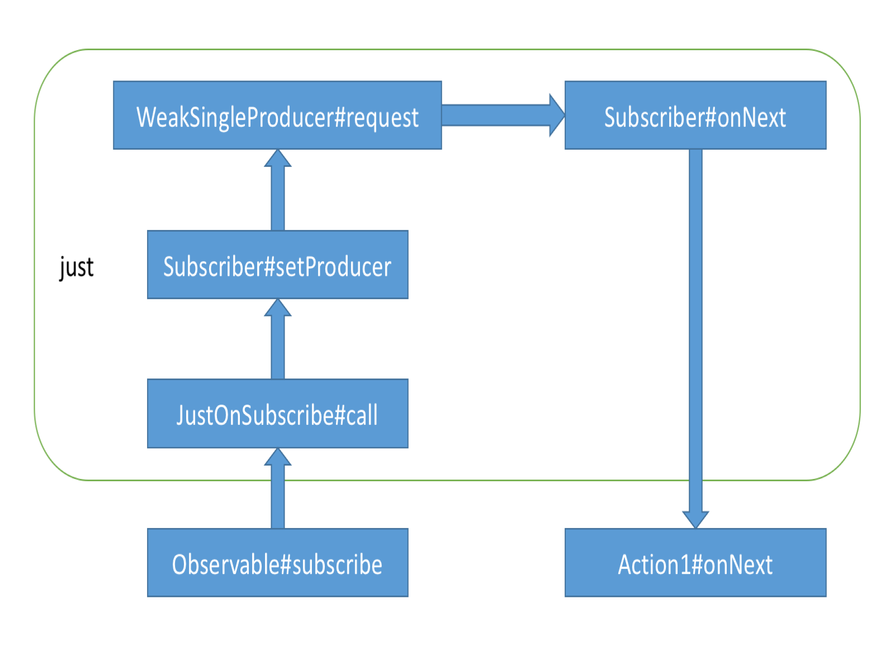
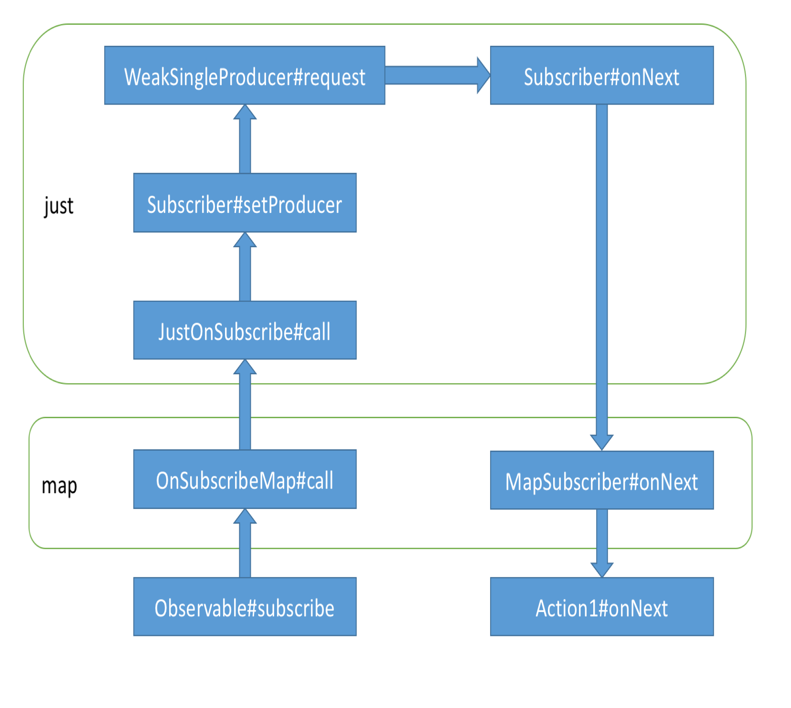
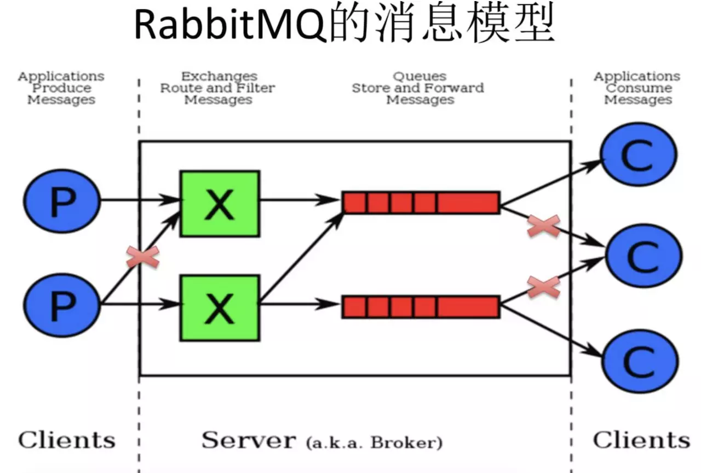

# 开源库常见的问题

# 1. 网络库

　　解决各种协议（GET,POST,PUT,HEAD,DELETE...）的网络数据的获取及请求，支持异步、同步请求；文件多线程下载断点续传、上传；请求自动重试，gzip 压缩，Cookies 自动解析并持久化，数据的缓存。目标是让网络请求更方便、简洁、高效、稳定。

| 名称                                                         | 概要                                                | 详情                                                         |
| ------------------------------------------------------------ | --------------------------------------------------- | ------------------------------------------------------------ |
| [Retrofit2.0]()                                              | 以接口/注解的形式定义请求和响应                     | Square 开源的项目。是一套 RESTful 家口的 Android(Java) 客户端实现，基于注解，提供 JSON to POJO(Plain Ordinary Java Object，简单的 Java 对象)，POJO to JSON，网络请求（POST,GET,PUT,DELETE等）封装。本身的网络核心可以替换，如 Apache HTTP Client,URL connection,OKHTTP 等，数据解析核心也可以替换如 Gson,Jackson,fastjson,xStream等。力求用最少的代码，实现最强大的功能。 |
| [okhttp](https://github.com/square/okhttp)                   | 一个为安卓和 java 应用诞生的 Http+SPDY 的网络处理库 | square 开源项目。支持 HTTP,HYTTPS,HTTP/2.0 和 SPDY 协议；自动缓存数据，节省流量；内部自动 GZIP 压缩内容。 |
| [android-async-http](https://github.com/loopj/android-async-http) | 一个异步的 AndroidHttp 库                           | 比较经典的网络请求库，基于 Apache 的 HttpClient 库实现，但是由于 Android M(6.0)去除了对 HttpClient 相关 API，意味着 google 不再推荐使用。 |
| [Volley](https://github.com/mcxiaoke/android-volley)         | 一个能让 Android 的网络请求更简单快捷的 Http 库     | Volley 集成了 AsyncHttpClient 和 Universal-Image-Loader 的优点，既可以像 AsyncHttpClient 一样非常简单地进行 HTTP 通信，也可以像 Universal-Image-Loader 一样轻松加载网络上的图片。但是对大数据量的网络操作如文件的下载支持较差。 |

# 2. 图片库

　　解决网络、文件、res、assets 等图片的获取、解析、展示、缓存等需求...

| 名称                                                         | 概要                                  | 详情                                                         |
| ------------------------------------------------------------ | ------------------------------------- | ------------------------------------------------------------ |
| [Picasso](https://github.com/square/picasso)                 | 强大的图片下载和缓存库                | Square 开源的项目，主导者是 JakeWharton。不支持 gif 的显示。 |
| [Glide](https://github.com/bumptech/glide)                   | Google 推荐的图片加载和缓存的库       | 专注于平滑滚动时的流畅加载，Google 开源项目，2014 年 Google I/O 上被推荐 |
| [Fresco](https://github.com/facebook/fresco)                 | Facebook 推荐的 Android 图片加载库    | 自动管理图片的加载和图片的缓存。Facebook 在 2015 年上半年开源的图片加载库 |
| [Android-Universal-Image-Loader](https://github.com/nostra13/Android-Universal-Image-Loader) | 早期广泛使用的开源图片加载库          | 强大又灵活的 Adroid 库，用于加载、缓存、显示图片。           |
| [Volley](https://github.com/mcxiaoke/android-volley)         | 2013 年 Google I/O 推荐的网络通讯框架 | 使用 Volley 加载网络图片，主要用到其中的 ImageLoader，NetworkImageView 类，注意它不仅仅是个图片加载库。 |
| [Cube-sdk](https://github.com/etao-open-source/cube-sdk)     | 轻量级的 Android 开发框架             | 高效方便地加载网络图片，更简易地处理网络 API 请求。          |

# 3. OkHttp 原理

　　OkHttp 是一个非常强大而有效的网络架构，其主要特点在于：

* 对于同一个主机的所有请求，允许其在 Http /Http2 上共享同一个套接字，这就避免了重复的 TCP 连接带来的 3 次握手的时间。
* 对于 Http 协议，其支持连接池用于减少请求延迟。
* 数据都使用了 gzip 压缩传输，从而减少网络传输 size 的大小。
* 对响应进行缓存，避免缓存有效期内重复的网络请求。
* 弱网情况下，在连接失败后，OkHttp 会自动进行重试，特别是有备用地址时还会通过备用地址进行连接。而安全上，其支持新一代的 TLS 功能、SNL 和 ALPN，如果服务器不支持的化则会自动降级到 TLS 1.0。

## 3.1. OkHttp 请求网络的流程图


## 3.2. OkHttp 原理

　　OkHttp 有同步和异步的两种请求。

　　当调用 OkHttpClient 的 newCall() 时返回的是一个 RealCall 对象，ReadCall 对象主要负责网络的请求。

　　在 OkHttpClient 的异步请求时调用的就是 RealCall 的 enqueue() 方法，而 RealCall 的 enqueue() 方法调用的是 OkHttpClient 的 Dispatcher 对象的 enqueue () 方法执行 AsyncCall 的任务。在 Dispatcher 的 enqueue 中如果当前还可以运行线程任务，则将 AsyncCall 任务加入运行队列，并将 AsyncCall 任务放入线程池中去执行，如果不能放入运行队列中，则加入等待队列中。运行队列中的任务完成后会从运行队列中移除任务，如果运行队列中没有了任务，则将等待队列中的任务移到运行队列中。

　　AsyncCall 处理网络请求任务是通过责任链模式来完成的，会先去初始化责任链，责任链初始化完成后，就执行责任链。

　　OkHttp 里面的拦截器有：

1. 在配置 OkHttpClient 时设置的 interceptors（addInterceptor），自定义拦截器。
2. 负责失败重试以及重定向的 RetryAndFollowUpInterceptor。
3. 负责把用户构造的请求转换为发送服务器的请求、把服务器返回的响应转换为用户友好的响应的 BridgeInterceptor。
4. 负责读取缓存直接返回、更新缓存的 CacheInterceptor。
5. 负责和服务器建立连接的 ConnectInterceptor。
6. 配置 OkHttpClient 时设置的 networkInterceptors（addNetworkInterceptor）。
7. 负责向服务器发送请求数据、从服务器读取响应数据的 CallServerInterceptor。

　　位置决定了功能，最后一个 CallServerInterceptor 负责和服务器实际通讯，重定向、缓存等一定是在实际通讯之前的。

　　执行责任链是从第一个到最后一个，每一个拦截器都会被执行，执行的处理步骤基本是：1.请求数据前的处理，2.调用下一个责任，并获得请求结果，3.对请求结果进行处理。这样每一个拦截器都可以对请求处理也可以获取到请求结果。

　　OkHttp 的同步请求调用的是 RealCall 的 execute() 方法，同步请求是直接交给 Dispatcher 来处理请求的，将 RealCall 加入 Dispatcher 的同步队列中，并执行责任链，请求网络得到响应数据，完成后，从同步队列中移除任务。

# 4. Retrofit

　　Retrofit 是一个网络请求框架的封装。网络请求的工作本质上是 OkHttp 完成的，而 Retrofit 仅负责网络请求接口的封装。

　　Retrofit 支持多种数据解析方式，比如 GSON、Protobuf、Jackson 等。也支持多种网络请求适配方式：RxJava、Guava、Java8。

## 4.1. Retrofit 原理

　　Retrofit 的主要原理是利用了 Java 的动态代理技术，把 ApiService 的方法调用集中到了 InvocationHandler.invoke，再构建了 ServiceMethod 、OkHttpClient，返回 callAdapter.adapter 的结果。

　　Retrofit 的最大特点就是解耦。

　　Retrofit 源码流程图：


使用

```java
//构建 OkHttpClient 对象
OkHttpClient okHttpClient = new OkHttpClient.Builder()
                .connectTimeout(10, TimeUnit.SECONDS) // 连接超时
                .readTimeout(10, TimeUnit.SECONDS) // 读取超时
                .retryOnConnectionFailure(true) // 是否重试
                .writeTimeout(10, TimeUnit.SECONDS) // 写入超时
                .build();
// 创建 Retrofit 对象，外观模式
Retrofit retrofit = new Retrofit.Builder()
                .baseUrl("http://test")
				.addConverterFactory(GsonConverterFactory.create(new GsonBuilder().create())) // 解析使用 GsonConverterFactory
                .addCallAdapterFactory(RxJavaCallAdapterFactory.create()) // 返回使用 RxJavaCallAdapterFactory
                .client(okHttpClient) // 请求使用 OkHttpClient
                .build();
```


```java
public interface ApiService {
    @GET("data/")
    Observable<BaseResponse> getMessage(@Path("page") int page);

    public static class BaseResponse {

        /**
         * 业务错误码
         */
        @SerializedName("F_responseNo")
        public int responseNo;

        /**
         * 业务错误描述
         */
        @SerializedName("F_responseMsg")
        public String responseMsg;

        @Override
        public String toString() {
            return "BaseResponse{" +
                    "responseNo=" + responseNo +
                    ", responseMsg='" + responseMsg + '\'' +
                    '}';
        }
    }
}
```


```java
// 获取 API 实例
ApiService service = retrofit.create(ApiService.class);
// 调用 getMessage 的方法请求数据
Observable<ApiService.BaseResponse> observable = service.getMessage(1);
```

retrofit.create 源码

```java
ServiceMethod<Object, Object> serviceMethod =
                (ServiceMethod<Object, Object>) loadServiceMethod(method);
// 再包装成 OkHttpCall
OkHttpCall<Object> okHttpCall = new OkHttpCall<>(serviceMethod, args); // 请求
return serviceMethod.callAdapter.adapt(okHttpCall);
```

1. Retrofit 是使用动态代理 Proxy 对定义的接口进行处理的，当调用接口的方法时，会在动态代理的 InvocationHandler # invoke 方法对请求进行处理。 
2. ServiceMethod 会解析接口的方法，将方法的注解解析为请求的 Request，根据用户设置配置生成具体的 CallAdapter（负责发送 HTTP 请求）、ResponseConverter（负责把服务器返回的数据转为想要的对象格式），将请求的结果使用 ResponseConverter 转为合适的 R 对象。 ServiceMethod 类的作用就是把对接口方法的调用转为一次 HTTP 调用，而且 ServiceMethod 有缓存，减少了一定的消耗。
3. 实际是调用了 call 的 exercute()（同步） 或者 enqueue()（异步） 来完成请求。OkHttpCall 算是 OkHttp 的包装类，用它跟 OkHttp 对接。会在 OkHttpCall 中将 OkHttp 的 response 包装成 retrofit 标准下的 response，再使用 RespouseConverter 转成想要的 R 对象。默认是 OkHttpClient，当然还可以扩展一个新的 Call ，比如 HttpUrlConnectionCall。
4. Retrofit 提供了很多的 ConverterFactory，比如 Gson、Jackson、xml、protobuff 等等，需要什么，就配置相对应的工厂，在 Service 方法上声明泛型具体类型就可以了。
5. 生成的 CallAdapter （负责发送 HTTP 请求）有四个工厂，分别对应不同的平台：RxJava、Java8、Guava 还有一个 Retrofit 默认的。简单来说就是用来将 Call 转成 T 的一个策略。因为这里具体请求时耗时操作，所以需要 CallAdapter 去管理线程。比如 RxJava 会根据调用方法的返回值，如 Response < T > | Result < T > | Observable < T >，生成不同的 CallAdapter。实际上就是对 RxJava 的回调方式做封装。比如将 response 再拆解为 success 和 error 等。

　　动态代理技术就是动态生成接口的实例类（当然生成实现类由缓存机制），并创建其实例（称之为代理），代理把对接口的调用转发给 InvocationHandler 实例，而在 InvocationHandler 的实现中，处理执行真正的逻辑（例如再次转发给真正的实现类对象），还可以进行一些有用的操作，例如统计执行时间，进行初始化和清理、对接口调用进行检查等。

　　为什么要用动态代理？因为对接口所有方法的调用都会集中转发到 InvocationHandler#invoke 函数中，这样就可以集中进行处理，更方便了。

　　ServiceMethod 是接口方法的抽象，主要负责解析它对应的 method 的各种参数（它有各种如 parseHeaders 的方法），比如注解（@GET）、入参，另外还负责获取 callAdapter（请求适配）、responseConverter（解析适配） 等 Retrofit 配置，好为后面的 okhttp3/Request 做好参数准备，它的 toRequest 为 OkHttp 提供 Request，toResponse 将请求结果转换为想要的数据类，可以说它承载了后续 Http 请求所需的一切参数。总的来说就是 ServiceMethod 类的作用就是把对接口方法的调用转为一次 HTTP 调用。

　　一个 ServiceMethod 对象对应于一个 API interface 的一个方法。

# 5. Glide 原理

　　Glide 最简单的使用案例就是从远程服务器或者本地文件系统加载图片，把他们放在磁盘与内存缓存中，然后加载到 view 上。它可以用在全是图片的 app 中，Glide 为包含图片的滚动列表做了尽可能流畅的优化。


## Glide 自定义适配器

## Glide 应用遇到的问题

　　使用阿里的 oss 存储图片，在后面显示 oss 的地址图片无法显示。解决方法：自定义适配器。

# 6. RxJava 原理

　　RxJava 就是一个实现异步操作的库。

　　RxJava 最大的优点就是简洁。

　　RxJava 是响应式编程（Reactive Extensions）在 JVM 平台上的实现，即用 Java 语言实现的一套基于观察者模式的异步编程接口。

　　RxJava 是使用观察者模式实现的。

　　RxJava 有四个基本概念：Observable（可观察者，即被观察者）、Observer（观察者）、subscribe（订阅）、事件。Observable 和 Observer 通过 subscribe() 方法实现订阅关系，从而 Observable 可以在需要的时候发出事件来通知 Observer。

## 6.1. Observer 和 Subscriber 的区别（观察者）

　　如果只是使用基本功能，选择 Observer 和 Subscriber 是完全一样的。它们的区别对于使用者来说主要有两点：

1. onStart()：这是 Subscriber 增加的方法。

   它会在 subscribe 刚开始，而事件还未发送之前被调用，可以用于做一些准备工作。例如数据的清零或重置。

   这是一个可选方法，默认情况下它的实现为空。

   需要注意的是，如果对准备工作的线程有要求（例如弹出一个显示进度的对相框，这必须在主线程执行），onStart() 就不适用了，因为它总是在 subscribe 所发生的线程被调用，而不能指定线程。

   要在指定的线程来做准备工作，可以使用 doOnSubscribe() 方法。

2. unsubscribe()：这是 Subscriber 所实现的另一个接口 Subscription 的方法，用于取消订阅。

   在这个方法被调用后，Subscriber 将不再接受事件。

   一般在这个方法调用前，可以使用 isUnsubscribed() 先判断一下状态。

   unsubscribe() 这个方法很重要，因为在 subscribe() 之后，Observable 会持有 Subscriber 的引用，这个引用如果不能及时被释放，将有内存泄漏的风险。

   所以最好保持一个原则：要在不再使用的时候尽快在合适的地方（例如 onPause()、onStop() 等方法中）调用 unsubscribe() 来解除引用关系，以避免内存泄漏的发生。

## 6.2. 基本原理

1. RxJava 主要采用的是观察者模式，Obervable 作为被观察者，负责接收原始的 Observable 发出的事件，并在处理后发送给 Observer，Observer 作为观察者。

2. Observable 并不是在创建的时候就立即开始发送事件，而是在它被订阅的时候，也就是 subscribe() 方法执行的时候开始。

3. subscribe() 方法里会调用 OnSubscribe#call 方法，在 OnSubscribe 的 call 方法会把消息传递给观察者 Subscriber。

4. subscribeOn() 操作符使用的是 OperatorSubscribeOn（OnSubscribe 的实现类）来完成对 OnSubscribe 的运行线程的控制，在 OperatorSubscribeOn 的 call 方法中，启动线程，在线程中完成调用上流（调用 subscribeOn() 方法前面生成的 Observable 对象的 OnSubscribe 成员）的 call() 方法进行逻辑的处理，保证了上流的工作在指定的线程工作。

5. observerOn() 操作符使用的是 OperatorObserveOn（Operator 的实现类）来完成对 Observer 的运行线程的控制，在 OperatorObserveOn 的 call 方法中，创建了一个 ObserveOnSubscriber 对象（Subscriber 的子类，实现 Action0），在 ObserveOnSubscriber 的 onError()、onComplete() 方法中会将 ObserveOnSubscriber 发送给主线程的 handle，处理这个消息就会调用 ObserveOnSubscriber 的 call() 方法，在 call() 方法中调用下游的 onNext()、onError()、onComplete() 方法就是在主线程中了。

   

6. just() 操作符是依次向 Observer 发送数据。just() 操作符使用 JustOnSubscribe(OnSubscribe 的实现类)来处理，在 JustOnSubscribe 的 call() 方法中，会调用 subscriber 的 setProducer(Producer) 方法，而 subscriber 的 setProducer() 方法会调用 Producer 的 request() 方法，在 request() 方法中会调用 Subscriber 的 onNext() 系列方法。

   

7. map(Func 1) 操作符是转换数据格式。map() 操作符使用 OnSubscribeMap（OnSubscribe 的实现类），在 MapSubscriber 的 onNext() 方法中调用了 Func1 的 call() 方法，将数组进行转换。

   

8. interval() 操作符是创建一个按固定时间间隔发送整数序列的 Observable。interval 操作符使用 OnSubscribeTimerPeriodically（OnSubscribe 的实现类），在 OnSubscribeTimerPeriodically 的 call() 方法中，定时调用下流的 onNext() 方法。

## 6.3. 背压

　　异步环境下产生的问题：同步环境下会等待一件事处理完后再进行下一步，而异步环境下是处理完一件事，未等它得出结果接着处理下一步，在获得结果之后进行回调，再处理结果。

　　发送和处理速度不统一：例如生产者生产的产品放置到缓存队列中，供消费者消费。若生产者生产的速度大于消费者消耗的速度，则会出现缓存队列溢出的问题。

　　背压是一种流速控制即解决策略，例如背压中的丢弃策略，一旦发现缓存队列已满，为了整个过程顺利进行，则会丢弃最新产生的产品，避免溢出，因此背压也是一种流速控制的解决策略。

# 7. RabbitMQ 知识

## 7.1. MQ

　　MQ 全称为 Message Queue，即消息队列。本质是个队列，FIFO 先进先出，只不过队列中存放的内容是 message 而已。

　　其主要用途：不同进程 process / 线程 thread 之间通信。

　　MQ 框架非常多，比较流行的有 RabbitMQ、ActiveMq、ZeroMq、Kafka，以及阿里开源的 RocketMQ。

　　消息队列（ MQ ）是一种应用程序对应用程序的通信方法，也就是信息中间件。应用程序通过读写出入队列的消息（ 针对应用程序的数据 ）来通信，而无需专用连接来链接它们。消息传递指的是程序之间通过在消息中发送数据进行通信，而不是通过直接调用彼此来通信，直接调用通常适用于诸如远程过程调用的技术。排队指的是应用程序通过队列来通信。队列的使用除去了接收和发送应用程序同时执行的要求。

　　消息发出后可以立即返回，由消息系统来确保消息的可靠传递。消息发布者只管把消息发布到 MQ 中而不用管谁来取，消息使用者只管从 MQ 中取消息而不管消息是谁发布的。这样发布者和使用者都不用知道对方的存在。

　　MQ 的模型：所有 MQ 产品从模型抽象上来说都是一样的过程，消费者（ consumer ）订阅某个队列。生产者 ( producer ) 创建消息，然后发布到队列（queue）中，最后将消息发送到监听的消费者。


　　MQ 常用于业务解耦的情况，其他常见使用场景包括最终一致性、广播、错峰流控等等。

## 7.2. 为什么会产生消息队列

　　原因：

1. 不同进程（ process ）之间传递消息时，两个进程之间耦和程度过高，改动一个进程，引发必须修改另一个进程，为了隔离这两个进程，在两进程间抽离出一层（一个模块），所有两进程之间传递的消息，都必须通过消息队列来传递，单独修改一个进程，不会影响另一个。
2. 不同进程（ process ）之间传递消息时，为了实现标准化，将消息的格式规范化了，并且某一个进程接收的消息太多，一下子无法处理完，并且也有先后顺序，必须对收到的消息进行排队，因此诞生了事实上的消息队列。

## 7.3. RabbitMQ

　　RabbitMQ 则是 MQ 的一种开源实现，遵循 AMQP（Advanced Message Queue，高级消息队列协议）协议，特点是消息转发是非同步并且可靠的。

　　RabbitMQ 作为一个消息代理，主要用来处理应用程序之间消息的存储与转发，可让消费者和生产者解耦，消息是基于二进制的。它提供了可靠的消息机制和灵活的消息路由，并支持消息集群和分布式部署，常用于应用解耦、耗时任务队列、流量削锋等场景。在易用性、扩展性、高可用性等方面表现不俗。

　　大数据处理场景需要 kafka，如果需要较高性能和确认机制，数据的可靠性和活跃的社区，支持消息的持久化于中间件的高可用部署，就选择 RabbitMQ 来作为应用的中间件。

### 7.3.1 AMQP

　　AMQP 即 Advanced Message Queuing Protocol，一个提供统一消息服务的应用层标准高级消息队列协议，是应用层协议的一个开放标准，为面向消息的中间件设计。

　　消息中间件主要用于组件之间的解耦，消息的发送者无需知道消息使用者的存在，反之亦然。

　　AMQP 的主要特征是面向消息、队列、路由（包括点对点和发布 / 订阅）、可靠性、安全。

　　基于此协议的客户端与消息中间件可传递消息，并不受客户端 / 中间件不同产品、不同开发语言等条件的限制。

### 7.1.2. 功能

1. 应用解耦

   MQ 基于数据的接口层，将耦合的引用来分解开，两边都实现这个接口，这样就允许独立的修改或者扩展两边的处理过程，只要两边遵守相同的接口约束即可。

2. 流量削峰

   在高并发、大流向的场景下，RabbitMQ 可以减少突发访问压力，不会因为突发的超时负荷要求而崩溃。

3. 异步通信

   通过把消息发送给消息中间件，将不是实时的业务异步处理。

### 7.1.3. 特点

1. 可靠性（Reliability）

   RabbitMQ 使用一些机制来保证可靠性，如持久性、传输确认及发布确认等。

2. 灵活的路由（Flexible Routing）

   在消息进入队列之前，通过交换器来路由消息。对于典型的路由功能，RabbitMQ 提供了一些内置的交换器来实现。针对更复杂的路由功能，可以将多个交换器绑定在一起，也可以通过插件机制来实现自己的交换器。

3. 扩展性、消息集群（Clustering）

   多个 RabbitMQ 节点可以组成一个集群，形成一个逻辑 Broker。也可以根据实际业务情况动态地扩展集群中节点。

4. 高可用性（Highly Avaliable Queues）

   队列可以在集群中的机器上设置镜像，使得在部分节点出现问题的情况下队列依然可用。

5. 多种协议（Multi-protocol）

   RabbitMQ 除了原生支持 AMQP 协议，还支持 STOMP、MQTT 等多种消息中间件协议。

6. 多语言客户端（Many Clients）

   RabbitMQ 几乎支持所有常用语言，比如 Java、Python、Ruby、PHP、C#、JavaScript、.NET 等。 

7. 管理界面（Management UI）

   RabbitMQ 提供了一个易用的用户界面，使得用户可以监控和管理消息、集群中的节点等。

8. 跟踪机制（Tracing）

   如果消息异常，RabbitMQ 提供了消息跟踪机制，使用者可以找出发生了什么。

9. 插件机制（Plugin System）

   RabbitMQ 提供了许多插件，以实现从多方面进行扩展，当然也可以编写自己的插件。

## 7.4. RabbitMQ 基本定义

　　RabbitMQ 比 MQ 模型有更加详细的模型概念：




* Broker 服务：RabbitMQ 服务器，提供一种传输服务，接收客户端连接，实现 AMQP 消息队列和路由功能的进程 。

  它的角色就是维护一条从 Publisher 到 Consumer 的路线，保证数据能够按照指定的方式进行传输。

  用户与权限设置就是依附于 Broker。

* Publisher 生产者：数据的发送方，消息生产者，就是一个向交换器发布消息的客户端应用程序。

* Message 消息：消息，消息是不具名的，由 Header 和 Body 组成，Header 是由生产者添加的各种属性的集合，包括 Message 是否被持久化（delivery-mode）、由哪个 Message Queue 接收（routing-key）、优先级是多少（priority）等，Body 是真正传输的数据，是不透明的，内容格式为 byte[] 。

* Consumer 消费者：数据的接收方。消息的消费者，就是接收消息的程序。

  当有 Message 到达时，RabbitMQ 把它发送给它的某个订阅者即 Consumer。当然可能会把同一个 Message 发送给很多的 Consumer。在这个 Message 中，只有 body，header 已经被删除了。对于 Consumer 来说，它是不知道谁发送的这个消息的，就是协议本身不支持。但是如果 Publish 发送的 bidy 中包含了 Publish 的信息就另当别论了。

  一个队列可以绑定多个消费者，但是只有其中的一个消费者会消费消息。

  生产者 Producer 和消费者 Consumer 都是 RabbitMQ 的客户端，Producer 负责发送消息，Consumer 负责消费消息。

* Virtual Host 虚拟主机：虚拟主机，表示一批交换器、消息队列和相关对象。虚拟主机是共享相同的身份认证和加密环境的独立服务器域。一个 broker 里可以有多个 Virtual Host ，用作不同用户的权限分离。

  一个 Virtual Host 里面可以有若干个 Exchange 和 Queue，主要用于权限控制，隔离应用。

  每个 virtual host 本质上都是一个 RabbitMQ Server，拥有它自己的 queue、exchange 和 binds rule 等等，这就保证了可以在多个不同的 Application 中使用 RabbitMQ。

* Connection 连接：TCP 连接，对于 RabbitMQ 而言，其实就是一个位于客户端和 Broker 之间 TCP 连接。Publisher 和 Consumer 都是通过 TCP 连接到 RabbitMQ Server 的。

* Channel 信道：信道，多路复用连接中的一条独立的双向数据流通道。它建立在 TCP 连接中，数据流动都是在 Channel 中进行的。也就是说，一般情况是程序起始建立 TCP 连接，第二步就是建立这个 Channel。

  AMQP 命令都是通过信道发出去的，不管是发布消息、订阅队列还是接收消息，这个动作都是通过信道完成。

  仅仅创建了客户端到 Broker 之间的连接 Connection 后，客户端还是不能发送消息的，需要在 Connection 的基础上创建 Channel，AMQP 协议规定只有通过 Channel 才能执行 AMQP 的命令，一个 Connection 可以包含多个 Channel，每个 Channel 代表一个会话任务。

  一条 TCP 连接可以支持多个信道。

* Queue 队列：消息队列，提供了 FIFO（先进先出） 的处理机制，具有缓存消息的能力。RabbitMQ 中，队列消息可以设置为持久化、临时或者自动删除。是 RabbitMQ 的内部消息，用于存储消息。

  队列是消息载体，每个消息都会被投入到一个或多个队列，队列会保存消息直到发送给消费者，它是消息的容器，也是消息的终点。

  队列是先进先出的，默认情况下先存储的消息先被处理。

  设置为临时队列，Queue 中的数据在系统重启之后就会丢失。

  设置为自动删除的队列，当不存在用户连接到 server，队列中的数据会被自动删除。

  RabbitMQ 中的消息都只能存储在 Queue 中，生产者生产消息并最终投递到 Queue 中，消费者可以从 Queue 中获取消息并消费。

  多个消费者可以订阅同一个 Queue，这时 Queue 中的消息会被平均分摊给多个消费者进行处理，而不是每一个消费者都收到所有的消息并处理。


* Binding 绑定：绑定，它的作用就是把 exchange 和 queue 按照与规则绑定起来。

  绑定用于消息队列和交换器之间的关联。

  Exchange 和 Queue 的绑定可以是多对多的关系。

  一个绑定就是基于路由键将交换器和消息队列连接起来的路由规则，所以可以将交换器理解成一个由绑定构成的路由表，如下：


* Routing Key 路由键：路由关键字，exchange 根据这个关键字进行消息投递。

* Exchange 交换器：信息交换器，路由消息，用来接收生产者发送的消息并将这些消息路由给服务器中的队列，可以根据应用场景的不同选择合适的交换机。

  向 RabbitMQ 发送消息，实际上是把消息发到交换器上，再由交换器根据相关路由规则发到特定队列上，在队列上监听的消费者就可以进行消费了。所以生产者发送消息时会经有交换器（ Exchange ）来决定要给哪个队列（ Queue ）。ExchangeType 决定了 Exchange 路由消息的行为。

  一个 Exchange 可以和多个 Queue 进行绑定，和 Queue 一样，Exchange 也可设置持久化、临时或者自动删除。

  如果需要精准路由到队列，或者对消息进行单一维度分类可以使用 direct 类型交换器；如果需要广播消息，可以使用 fanout 类型交换器；如果对消息进行多维度分类，可以使用 topic 交换器；如果消息归类的逻辑包含了较多的 AND/OR 逻辑判断，可以使用 header 交换器（开发中很少用到 header 交换器）。　

  消息发送到没有队列绑定的交换机时，消息将丢失，因为交换机没有存储消息的能力，消息只能存在于队列中。　

  由 Exchange 、Queue、RoutingKey 三个才能决定一个从 Exchange 到 Queue 的唯一的线路。

  Exchange 和 Queue 是在 RabbitMQ Server（ 也叫做 Broker ）端，Producer 和 Consumer 在应用端。

### 7.4.1. 引入信道的原因

1. RabbitMQ 之间使用 TCP 连接，每次发布消息都要连接 TCP，建立和关闭 TCP （ 三次握手和四次挥手 ）都是有代价的，频繁的建立关闭 TCP 连接对于系统的性能有很大的影响，导致连接资源严重浪费，造成服务器性能瓶颈。
2. TCP 的连接数也有限制，这也限制了系统处理高并发的能力，如果使用 TCP 连接，高峰期每秒成千上万的连接造成资源浪费。
3. Channel 的原理一个进程一条通道，多条进程多条通道公用一条 TCP 连接，一条 TCP 连接可以容纳无限的 channel，不会有性能瓶颈。

## 7.5. 基本概念

　　Connection Factory 、Connection、Cahnnel 都是 RabbitMQ 对外提供的 API 中最基本的对象。

* Connection 是 RabbitMQ 的 socket 连接，它封装了 socket 协议相关部分逻辑。
* Connection Factory 则是 Connection 的制造工厂。
* Channel 是与 RabbitMQ 打交道的最重要的一个接口，大部分的业务操作是在 Channel 这个接口中完成的，包括定义 Queue、定义 Exchange、绑定 Queue 与 Exchange、发布消息等。

### 7.5.1. 消息确认

　　为了保证数据不被丢失，RabbitMQ 有消息确人机制。RabbitMQ 通过消息确认来保证消息被成功处理。消息确认可以分为两种：

1. 生产者发送消息到服务（ Broker ）时，Broker 给生产者发送确认回执，用于告诉生产者消息已被成功发送到 Broker。
2. 消费者接收到 Broker 发送的消息时，消费者给 Broker 发送确认回执，用于通知消息已成功被消费者接收。

#### 7.5.1.1. 生产者端消息确认

　　生产者端的消息确认：当生产者将消息发送给 Broker，Broker 接收到消息给生产者发送确认回执。

　　生产者端的消息确认有两种方式：事务机制（ tx 机制 ）和确认机制（ confirm 模式）。

##### 7.5.1.1.1. 事务机制

　　RabbitMQ 中有三个与事务机制的方法：txSelect()、txCommit() 和  txRollback()。

　　channel.txSelect()  用于将当前 channel 设置成 transaction 模式，channel.txCommit() 提交事务，channel.txRollback() 回滚事务。

　　使用事务机制，首先要通过 txSelect 方法开启事务，然后发布消息给 broker 服务器，如果 txCommit 提交成功了，则说明消息成功被 broker 接收了，如果在 txCommit 执行之前 broker 异常奔溃或者由于其他原因抛出异常，这个时候就可以捕获异常，通过 tcRollback 回滚事务。

##### 7.5.1.1.2. 确认模式

　　有三个与 confirm 模式相关的方法：ConfirmSelect()、WaitForConfirms() 和 WaitForConfirmsOrDie()。

　　channel.ConfirmSelect() 表示开启 Confirm 模式，channel.WaitForConfirms() 等待所有消息确认，如果所有的消息都被服务端成功接收返回 true，只要有一条没有被成功接收就返回 false。

　　channel.WaitForConfirmsOrDie() 和 WaitForConfirms() 作用类似，也是等待所有消息确认，区别在于该方法没有返回值（void），如果有任意一条消息没有被成功接收，会立即抛出一个 OperationInterrupedException 类型异常。

#### 7.5.1.2. 消费者消息确认

　　从 Broker 发送到消费者时，RabbitMQ 提供了两种消息确认的方式：自动确认和显示确认。

##### 7.5.1.2.1. 自动确认

　　自动确认：当 RabbitMQ 将消息发送给消费者后，消费者端接收到消息后，不等待消息处理结束，立即自动回送一个确认回执。

　　自动确认的用法十分简单，设置消费者的参数 autoAck 为 true 即可。

　　Broker 会在接收到确认回执时删除消息，如果消费者接收到消息并返回了确认回执，然后这个消费者在处理消息时挂了，那么这条消息就再也找不回来了。

##### 7.5.1.2.2. 显示确认

　　自动确认可能会出现消息丢失的问题，而显示确认就会避免这个问题，显示确认可以让消费者在接收消息时不立即返回确认回执，等到消息处理完成后（ 或者完成一部分的逻辑 ）再返回确认回执，这样就保证消费端不会丢失消息了！

　　使用显示确认也比较简单，首先将 resume 方法的参数 autoACK 设置为 false，然后在消费端使用代码 channel.BasicAck() / BasicReject() 等方法来确认和拒绝消息。

　　使用显示确认时，如果消费者处理完消息不发送确认回执，那么消息不会被删除，消息的状态一直是 Unacked，这条消息也不会再发送给其他消息者。如果一个消费者在处理消息时尚未发送确认回执的情况下挂掉了，那么消息会被重新放入队列（ 状态从 Unacked 变成 Ready ），有其他消费者时，消息会发送给其他消费者。

　　如果开发人员在处理完业务逻辑后，忘记发送回执给 RabbitMQ，这将会导致严重的 bug - Queue 中堆积的消息会越来越多。消费者重启后会重复消费这些消息并重复执行业务逻辑。

　　消息确认可以起到限流的作用：在 Consumer 处理完成数据后发送消息确认，甚至在额外的延时后发送消息确认，将有效的平衡 Consumer 的加载。

　　在通信过程中，队列对 ACK（消息确认）的处理有以下几种情况：

* 如果 consumer 接受了消息，发送 ack，RabbitMQ 会删除队列中这个消息，发送另一条消息给 consumer。
* 如果 consumer 接受了消息，但在发送 ack 之前断开连接，RabbitMQ 会认为这条消息没有被 deliver，在 consumer 再次连接的时候，这条消息会被 redeliver。
* 如果 consumer 接受了消息，但是程序中有 bug，忘记了 ack，RabbitMQ 不会重复发送消息。

　　RabbitMQ 2.0.0 和之后的版本支持 consumer reject（拒绝）某条（类）消息，可以通过设置 requeue 参数中的 reject 为 true 达到目的，那么 RabbitMQ 将会把消息发送给下一个注册的 consumer。

　　RabbitMQ 没有用到超时机制，RabbitMQ 仅仅通过 Consumer 的连接中断来确认该 Message 并没有正确处理，也就是说 RabbitMQ 给了 Consumer 足够长的时间做数据处理。

### 7.5.2. 消息持久化与优先级

#### 7.5.2.1. 消息持久化（Persistent）

　　把 exchange 和 queue 的 durable 属性设置为 true，重启 RabbitMQ 服务时，exchange 和 queue 也会恢复。这样可以保证绝大部分情况下 RabbitMQ 消息不会丢失。

　　如果 queue 设置 durable = true，RabbitMQ 服务重启后队列虽然会存在，但是队列内的消息会全部丢失。这时就会需要实现消息的持久化。

　　消息的持久化实现的方法很简单：将 exchange 和 queue 都设置 durable = true（注意队列的名字一定要是 Broker 中不存在的，不然不能改变该队列的任何属性），然后在消息发布的时候设置 persistent = true 即可。

　　消息持久化包括 3 个部分：

1. exchange 持久化，在声明交换器时指定 durable = true 。
2. queue 持久化，在声明队列时指定 durable = true。
3. 消息持久化，在投递消息时指定 delivery_mode 持久化。

　　如果 exchange 和 queue 都是持久化，那么它们之间的 binding 也是持久化的，如果 exchange 和 queue 两者之间有一个持久化，一个非持久化，则不允许建立绑定。

　　一旦创建了队列和交换器，就不能修改其标志了，例如，创建了一个 no-durable 的队列，然后想把它改变成 durable，唯一的办法就是删除这个队列然后重新创建。

#### 7.5.2.2. 消息优先级（Priority）

　　queue 是先进先出的，即先发送的消息，先被消费。设置了优先级后，优先级高的消息就会优先被消费。

　　消息实现优先级控制的实现方式是：首先在声明 queue 是设置队列的 x-max-priority 属性，然后在 publish 消息时，设置消息的优先级等级即可。x-max-priority 设置的是队列优先级的最大值。

### 7.5.3. RabbitMQ 的消费模式

　　RabbitMQ 中的消费模式有：EventingBasicConsumer、BasicGET 和 QueueBasicConsumer。

　　QueueBasicConsumer 的用法和 Get 类似，QueueBasicConsumer 在官方 API 中标记已过时。

　　EventingBasicConsumer 是基于长连接，发布订阅模式的消费方式，节省资源且实时性好，这是开发中最常用的消费模式。在一些消费者主动获取消息的场合，可以使用 Get 方式，Get 方式是基于短连接的，请求响应模式的消费方式。

#### 7.5.3.1 EventingBasicConsumer 介绍

　　EventingBasicConsumer 是发布 / 订阅模式的消费者，即只要订阅的 queue 中有了新消息，Broker 就会立即把消息推送给消费者，这种模式可以保证消息及时地被消费者接收到。

　　EventingBasicConsumer 是长链接：只需要创建一个 Connection，然后在 Connection 的基础上创建通道 channel，消息的发送都是通过 channel 来执行的，这样可以减少 Connection 的创建，比较节省资源。

#### 7.5.3.2 BasicGet 方法介绍

　　使用 EventingBasicConsumer 可以让消费者最及时地获取到消息，使用 EventingBasicConsumer 模式时消费者在被动的接收消息，即消息是推送过来的，Broker 是自动的一方。那么能不能让消费者作为自动的一方，消费者什么时候想要消息了，就自己发送一个请求去找 Broker 要？答案是使用 Get 方式。

　　Get 方式是短连接的，消费者每次想要消息的时候，首先建立一个 Connection，发送一次消息，Broker 接收到请求后，响应一条消息给消费者，然后断开链接。

　　channel.BasicGet() 一次只获取一条消息，获取到消息后就把连接断开了。

　　RabbitMQ 中 Get 方式和 HTTP 的请求响应流程基本一样，Get 方式的实时性比较差，也比较耗费资源。

### 7.5.4 Qos（服务质量）prefetchCount 介绍

#### 7.5.4.1 轮询分发

　　使用任务队列的优点之一就是可以轻易的并行工作。如果积压了好多工作，可以通过增加工作者（ 消费者 ）来解决这一问题，使得系统的伸缩性更加容易。在默认情况下，RabbitMQ 将逐个发送消息到在序列中的下一个消费者（而不考虑每个任务的时长等等，且是提前一次性分配，并非一个一份分配）。平均每个消费者获得相同数量的消息，这种方式分发消息机制称为 Round-Robin（轮询）分发。

　　通过轮询分发存在的一些问题：

1. 当消息上万时，一股脑的把消息发送给消费者，可能会造成消费者内存爆满；
2. 当消息处理比较慢时，单一的消费者处理这些消息可能很长时间，自然会想要再添加一个消费者加快消息的处理速度，但是这些消息都被原来的消费者接收了，状态为 Unacked，所以这些消息不会再发送给新添加的消费者。
3. 分发消息不公平。比如，现在有 2 个消费者，所有的奇数的消息都是繁忙的，而偶数则是轻松的。按照轮询的方式，奇数的任务交给了第一个消费者，所以一直在忙个不停。偶数的任务交给另一个消费者，则立即完成任务，然后闲的不行。而 RabbitMQ 则是不了解这些的，这是因为当消息进入队列，RabbitMQ 就会分派消息，它不看消费者未应答的数目，只是盲目的将消息发给轮询指定的消费者。

#### 7.5.4.2. preferchCount

　　对于上面的问题，RabbitMQ 提供了 Qos（ 服务质量，preferchCount = 1 ）可以解决。

　　通过设置 prefetchCount 来限制 Queue 每次发送给每个消费者的消息数。

　　使用 Qos 时，Broker 不会再把消息一股脑的发送给消费者，可以设置每次传输给消费者的消息条数 n，消费者把这 n 条消息处理完成后，再获取 n 条数据进行处理，这样就不用担心消息丢失、服务端内存爆满的问题了，因为没有发送的消息状态都是 Ready，所以当新增一个消费者时，消息也可以立马发送给新增的消费者。在收到 Consumer 的 ack 前，它不会将新的 Message 分发给它。

　　Qos 只有在消费端使用显示确认时才有效，使用 Qos 的方式非常简单，在消费端调用 channel.BasicQos() 方法即可。

```java
channel.BasicQos(int prefetchSize, int prefetchCount, boolean global)
```

　　prefetchSize：表示预取的长度，一旦设置为 0 即可，表示长度不限。

　　prefetchCount：表示预取的条数，即发送的最大消息条数。

　　global：表示是否在 Connection 中全局设置，true 表示 Connection 下的所有 channel 都设置为这个数值。

　　Qos 可以设置消费者一次接收消息的最大条数，能够解决消息拥堵时造成的消费者内存爆满问题。Qos 也比较适用于耗时队列，当任务队列中的任务很多时，使用 Qos 后可以随时添加新的消费者来提高任务的处理效率。

　　这种方法可能会导致 queue 满，当然，也可以添加更多的 Consumer，或者创建更多的 Virtual Host 来细化设计。

### 7.5.5. Exchange

　　生产者将消息发送到 Exchange ，由 Exchange 将消息路由到一个或多个 Queue 中（或者丢弃）。 

#### 7.5.5.1 Rounting key

　　生产者在将消息发送给 Exchange 的时候，一般会指定一个 Rounting key，来指定这个消息的路由规则。

　　在 Exchange Type 与 Binding key 固定的情况下，生产者就可以在发送消息给 Exchange 时，通过指定 Routing key 来决定消息流向哪里。

　　RabbitMQ 为 Routing key 设定的长度限制为 255 bytes。

　　在 queue 创建时，它会自动的以 queue 的名字作为 rounting key 来绑定哪个 exchange。

#### 7.5.5.2. Binding

　　RabbitMQ 中通过 Binding 将 Exchange 与 Queue 绑定起来，这样 RabbitMQ 就知道如何正确地将消息路由到指定的 Queue 了。

#### 7.5.5.3. Binding key

　　在绑定 Exchange 与 Queue 的同时，一般会指定一个 Binding key。消费者将消息发送给 Exchange 时，一般会指定一个 Routing key。当 Binding key 与 Routing key 相匹配时，消息将会被路由到对应的 Queue 中。

　　在绑定多个 Queue 到同一个 Exchange 的时候，这些 Binding 允许使用相同的 Binding key。

　　Binding key 并不是在所有情况下都生效，它依赖于 Exchange Type，比如 fanout 类型的 Exchange 就会无视 Binding key，而是将消息路由到所有绑定到该 Exchange 的 Queue。

#### 7.5.5.4. Exchange Type 类型

　　Exchange 分发消息时根据类型的不同分发策略有区别，目前 RabbitMQ 共有四种类型：direct、fanot、topic、headers，不同的类型有着不同的路由策略。

##### 7.5.5.4.1. direct 交换器

　　生产者传送的消息中的路由键（ routing key ）必须和 Queue Binding 中的 Binding key 一致，交换器（exchange）就将消息发到对应的队列（queue）中。它是完全匹配、单播的模式。


##### 7.5.5.4.2. fanout 交换器

　　每个发送到 fanout 交换器中的消息，它不会去匹配路由键，直接把消息投递到所有绑定到 fanout 交换器中的队列上，它就像一个广播站一样，它会向所有收听广播的用户发送消息。简单来说就是轮流把消息放进每个队列中。

　　对应到系统上，它允许你针对一个消息作不同操作，比如用户上传了一张新的图片，系统要同时对这个事件进行不同的操作，比如删除旧的图片缓存、增加积分奖励等等，这样就大大降低了系统之间的耦合度。

　　fanout 类型转发消息是最快的。


##### 7.5.5.4.3. topic 交换器

　　topic 交换器有点类似于 direct 交换器，但是 topic 交换器使用部分匹配比 direct 交换器多了更多弹性。

　　它通过模式匹配分配消息的路由键属性，将路由键和某个模式进行匹配，此时队列需要绑定到一个模式上。它将路由键和绑定键的字符串切分成单词，这些单词之间用点隔开。

　　它同样也会识别两个通配符：符号 “ # ” 和符号 “ * ”：

* “ # ” 匹配 0 个或多个单词。
* “ * ” 匹配不多不少一个单词。


##### 7.5.5.4.4. header 交换器

　　header 类型路由规则和上面的三个都不一样，header 交换器不是通过路由键（ routing key ）进行路由的，而是通过消息的 headers 属性。

　　在绑定 Queue 与 Exchange 时指定一组键值对，当消息发送到 Exchange 时，RabbitMQ 会取到该消息的 headers ( 也是一个键值对的形式 )，对比其中的键值对是否完全匹配 Queue 与 Exchange 绑定时指定的键值对。如果完全匹配则消息会路由到该 Queue，否则不会路由到该 Queue。

　　而且 headers 交换器和 direct 交换器完全一致，但性能差很多，目前几乎用不到了。

### 7.5.6. 消息序列化

　　RabbitMQ 使用 ProtoBuf 序列化消息，它可作为 RabbitMQ 的 Message 的数据格式进行传输，由于是结构化的数据，这样就极大的方便了 Consumer 的数据高效处理，当然也可以使用 XML。

　　与 XML 相比，ProtoBuf 有以下优势：

1. 简单。
2. size 小了 3-10 倍。
3. 速度快了 20-100 倍。
4. 易于编程。
5. 减少了语义的歧义。

　　另外 ProtoBuf 具有速度和空间的优势，使得它现在应用非常广泛。

### 7.5.7. RabbitMQ 组件断联重连机制

1. 方案一

   RabbitMQ 在启动时，为 RabbitMq 设置一个 status，在第一次建立连接的时候将其变为 true，RabbitMQ client 在初始化时启动一个定时器，每隔一段时间开启一个线程，查询当前 status 的状态，如果 status 变为 false，重新建立连接（ 包括 connect、channel 的连接 ）。

2. 方案二

   Implement shutdown listener，如果 RabbitMQ 断连，在 shutdown 方法执行相应的重连方法。

### 7.5.8. 关于消息的重复执行

　　首先可以确定的是，触发消息重复执行的条件是很苛刻的，也就是说在大多数场景下不会触发该条件，一般出现任务超时，或者没有及时返回状态，引起任务重新入队列，重新消费，在 RabbitMQ 里连接的断开也会触发消息重新入队列。

　　消息任务的类型最好要支持幂等性，这样的好处是任务执行多少次都没关系，顶多消耗一些性能。

　　幂等性：一个请求，不管重复来多少次，结果是不会改变的。

### 7.5.9. RPC 远程过程调用

　　在实际的应用场景中，可能需要一些同步处理，需要同步等待服务端将消息处理完成后再进行下一步处理。这相当于 RPC（Remote Procedure Call，远程过程调用），在 RabbitMQ 中也支持 RPC。

　　**RabbitMQ 中实现 RPC 的机制**是：客户端发送请求（消息）时，在消息的属性（Message Properties，在 AMQP 协议中定义了 14 种 properties，这些属性会随着消息一起发送）中设置两个 replyTo（一个 Queue 名称，用于告诉服务器处理完成后将通知发送者的消息发送到这个 Queue 中）和 correlationId（此次请求的标识号，服务器处理完成后需要将此属性返还，客户端将根据这个 id 了解哪条请求被成功执行了或执行失败）。服务器端收到消息处理完后，将生成一条应答消息到 replyTo 指定的 Queue，同时带上 correlationId 属性。客户端之前已订阅 replyTo 指定的 Queue，从中收到服务器的应答消息后，根据其中的 correctlationId 属性分析哪条消息被执行了，根据执行结果进行后续业务处理。

### 7.5.10. 创建一个队列

　　Consumer 和 Procuder 都可以通过 queue.declare 创建 Queue。

　　当然也可以创建私有的 Queue，这样只有 APP 本身才可以使用这个 Queue，Queue 才可以自动删除，被标为 auto-delete 的 Queue 在最后一个 Consumer unsubscribe 后就会被自动删除。

　　那么如果时创建一个已经存在的 queue 呢？那么不会有任何的影响。也就是说第二次创建如果参数和第一次不一样，那么该操作虽然成功，但是 queue 的属性并不会被修改。

　　queue 对 load balance（负载均衡）的处理是完美的。对于多个 Consumer 来说，RabbitMQ 使用循环的方式（round-robin）的方式均衡的发送给不同的 Consumer。

### 7.5.11. 集群

　　RabbitMQ 最优秀的功能之一就是内建集群，这个功能设计的目的是允许消费者和生产者在节点崩溃的情况下继续运行，以及通过添加更多的节点来先行扩展消息通信吞吐量。RabbitMQ 内部利用 Erlang 提供的分布式通信框架 OTP 来满足上述需求，使客户端在失去一个 RabbitMQ 节点连接的情况下，还是能够连接到集群中的任何其他节点继续生产、消费消息。

　　RabbitMQ 会始终记录一下四种类型的内部元数据：

1. 队列元数据

   包括队列名称和它们的属性，比如是否可持久化，是否自动删除。

2. 交换器元数据

   交换器名称、类型、属性。

3. 绑定元数据

   内部是一张表格记录如何将消息路由到队列。

4. vhost 元数据

   为 vhost 内部的队列、交换器、绑定提供命名空间和安全属性。

　　在单一节点中，RabbitMQ 会将所有这些信息存储在内存中，同时将标记为可持久化的队列、交换器、绑定存储到硬盘上。存在硬盘上可以确保队列和交换器在节点重启后能够重建，而在集群模式下同样也提供两种选择：存在硬盘上（独立节点的默认设置），存在内存中。

　　搭建的普通集群中节点可以共享集群中的 exchange、routing key 和 queue，所有的数据和状态都是必须在所有节点上复制的。queue 中的消息只保存在首次声明 queue 节点中，而任意节点的消费者都可以消费其他节点的消息。RabbitMQ 节点可以动态的加入到集群中。

　　当在集群中声明队列、交换器、绑定的时候，这些操作会直到所有集群节点都成功提交元数据变更后才返回。集群中有内存节点和磁盘节点两种类型，内存节点虽然不写入磁盘，但是它的执行比磁盘节点要好。内存节点可以提供出色的性能，磁盘节点能保障配置信息在节点重启后仍然可用，那集群中如何平衡这两者？

　　RabbitMQ 只要求集群中至少有一个磁盘节点，所有其他节点可以是内存节点，当节点加入或离开集群时，它们必须要将该变更通知到至少一个磁盘节点。如果只有一个磁盘节点，刚好又是该节点崩溃了，那么集群可以继续路由消息，但不能创建队列、创建交换器、创建绑定、添加用户、更改权限、添加或删除集群节点。换句话说，集群中的唯一磁盘节点奔溃的话，集群仍然可以运行，但直到该节点恢复，否则无法更改任何东西。

### 7.5.11.1 镜像队列

　　如果在集群中创建队列，集群只会在单个节点而不是所有节点上创建完整的队列信息（元数据、状态、内容），结果是只有队列的所有者节点知道有关队列的所有信息，因此当集群节点奔溃时，那么只能等待该节点重新连接才能继续处理该节点内的消息（如果没有设置持久化的话，该节点的队列和绑定就消失了，并且任何匹配该队列的绑定的新消息也丢失了）。

　　对于上面的问题，如果可以让 RabbitMQ 中的节点像 redis 集群的节点一样，每一个节点都保存所有的消息，这就是 RabbitMQ 的一个功能：**镜像队列**。镜像队列由一个 master 和多个 slave 组成，使用镜像队列消息会自动在镜像节点间同步，而不是在 consumer 取数据时临时拉取。

　　而使用镜像队列，因为各个节点要同步消息，所以比较耗费资源，一般在可靠性比较高的场景使用镜像队列。 

　　RabbitMQ 的集群默认不支持负载均衡的。可以根据设备的性能，使用 Qos 给各个消费者指定合适的最大发送条数，这样可以在一定程度上实现负载均衡，也可以通过 Haproxy 实现 RabbitMQ 集群的负载均衡。为什么使用 Haproxy 而不用 Ngnix 呢？这是因为 Haproxy 支持四层（tcp、udp 等）和七层（http、https、emal 等）的负载均衡，而 Nginx 只支持七层的负载均衡，而 RabbitMQ 是通过 TCP 传输的。

## 7.6. MQ 选型与对比

1. 从社区活跃度

   按照目前网络上的资料，RabbitMQ 、ActiveM、ZeroMQ 三者中，综合来看，RabbitMQ 是首选。

2. 持久化消息比较

   ZeroMQ 不支持，ActiveMQ 和 RabbitMQ 都支持。持久化消息主要是指机器在不可抗力因素等情况下挂掉了，消息不会丢失的机制。

3. 综合技术实现

   可靠性、灵活的路由、集群、事务、高可用的队列、消息排序、问题追踪、可视化管理工具、插件系统等等。

   RabbitMQ / Kafka 最好，AcitveMQ 次之，ZeroMQ 最差。当然 ZeroMQ 也可以做到，不过自己必须手动写代码实现，代码量不小。尤其是可靠性中的：持久性、投递确认、发布者证实和高可用性。

4. 高并发

   RabbitMQ 最高，原因是它的实现语言是天生具备高并发高可用的 erlang 语言。

5. 比较关注的比较，RabbitMQ 和 Kafka

   RabbitMQ 比 Kafka 成熟，在可用性上，稳定性上，可靠性上，RabbitMQ 胜于 Kafka （理论上）。

   另外，Kafka 的定位主要在日志等方面，因为 Kafka 设计的初衷就是处理日志的，可以看做是一个日志（消息）系统一个重要组件，针对性很强，所以如果业务方面还是建议选择 RabbitMQ。

   还有就是，Kafka 的性能（吞吐量、TPS）比 RabbitMQ 要高出来很多。

## 7.7. 提高 RabbitMQ 传输消息数据的可靠性途径

　　从生产者发送消息到消费者消费消息，RabbitMQ 有四种丢失消息的情况：

1.  RabbitMQ 生产者不知道发布的消息是否已经正确到达服务器，如果中间发生网络异常等情况，消息丢失。
2.  RabbitMQ 没有设置持久化，RabbitMQ 服务器重启后消息丢失。
3.  RabbitMQ 消费者是自动确认，消息发出后就会从队列中移除，如果消费者出现异常挂掉的情况，消息丢失。
4.  RabbitMQ 的消息没有匹配队列，消息丢失。

### 7.7.1. 问题一：生产者确认消息机制

　　问题一是生产者不确定发布的消息已经到达了 RabbitMQ 服务器，可以通过生产者的**确认消息机制**来解决。

　　如果不进行特殊配置，默认情况下发送消息的操作是不会返回任何消息给生产者的，也就是默认情况下生产者是不知道消息有没有正确的到达服务器。

　　确认消息机制主要分为两种：

1. 事务机制
2. 发送方确认机制

#### 7.7.1.1. 事务机制

　　与事物机制相关的有三个方法，分别是：

1. channel.txSelect 设置当前信道为事务模式。
2. channel.txCommit 提交事务。
3. channel.txRollback 事务回滚。

　　如果事务提交成功，则消息一定是到达了 RabbitMQ 中，如果事务提交之前由于发送异常或者其他原因，捕获异常后可以进行 channel.txRollback 回滚。

#### 7.7.1.2. 确认机制

　　生产者将信道设置为 confirm 确认模式，确认之后所有在信道上的消息将会被指派一个唯一的从 1 开始的 ID，一旦消息被正确匹配到所有队列后，RabbitMQ 就会发送一个确认 Basic.Ack 给生产者（包含消息的唯一 ID），生产者便知晓消息是否正确到达目的地了。 

　　如果 RabbitMQ 因为自身错误导致消息丢失，就会发送一条 nack（Basic.Nack）命令，生产者应用程序同样可以在回调方法中处理该 nack 指令。

　　消息如果是持久化的，那么确认消息会在消息写入磁盘之后发出。RabbitMQ 中的 deliveryTag 包含了确认消息序号，还可以设置 multiple 参数，表示到这个序号之前的所有消息都已经得到处理。

　　确认机制相对事务机制来说，相比较代码来说比较复杂，但会经常使用。

　　确认机制主要有单条确认、批量确认、异步批量确认三种方式。

##### 7.7.1.2.1. 单条确认

　　此种方式比较简单，一般都是一条条的发送。

　　单条确认模式是每发送一条消息后就调用 channel.waitForConfirms() 方法，之后等待服务器的确认，这实际上是一种串行同步等待的方式。

　　相比较事务机制，性能提升的并不多。

##### 7.7.1.2.2. 批量确认

　　批量确认模式是每发送一批消息后，调用 channel.waitForConfirms() 方法，等待服务器的确认返回。

　　相比较单挑确认模式，性能好一些。

　　批量确认 confirm 需要解决出现返回的 Basic.Nack 或者超时情况的话，生产者需要将这一批次消息全部重发，可以通过增加一个缓存，将发送成功并且 Ack 之后的消息去除，剩下 Nack 或者超时的消息，这样就能合适地将需要重发的消息筛选出来。

　　如果消息经常丢失，批量确认模式的性能应该是不升反降的。

##### 7.7.1.2.3. 异步批量确认

　　异步确认方式通过在生产者 addConfirmListener 增加 ConfirmListener 回调接口，重写 handleAck() 与 handleNack() 方法，分别用来处理 RabbitMQ 回传的 Basic.Ack 和 Basic.Nack 。

　　这两个方法都有两个参数，第一个参数 deliveryTag 用来标记消息的唯一序列号，第二个参数 multiple 表示是否为多条确认，值为 true 表示是多条确认，值为 false 表示单条确认。

　　和批量确认一样，也需要增加一个缓存，将发送成功并 Ack 的消息去除，便于处理 Nack 和超时的消息。存储缓存最好采用 SortedSet 数据结构。

#### 7.7.1.3. 确认消息机制比较

     　　1. 事务机制在一条消息发送之后会使发送端阻塞，以等待 RabbitMQ 的回应，之后才能继续发送下一条消息。确认机制相对于事务机制，最大的好处就是可以异步处理提高吞吐量，不需要额外等待消耗资源。
     　　2. 事务机制和确认机制是互斥的，不能共存。
     　　3. 确认机制的三种方式中，批量确认的最大问题在于返回的 Nack 消息需要重新发送，异步确认消息在实际生产环境中是最推荐的。

### 7.7.2. 问题二：持久化

　　问题二主要是在 RabbitMQ 没有设置持久化时，RabbitMQ 服务器出现异常，重启后，消息丢失。可以通过**增加持久化**来避免。

　　所谓**持久化**，就是 RabbitMQ 会将内存中的数据（Exchange 交换器、Queue 队列、Message 消息）固化到磁盘，以防异常情况发生时，数据丢失。

　　其中，RabbitMQ 的持久化分为三个部分：

1. 交换器（Exchange）的持久化。
2. 队列（Queue）的持久化。
3. 消息（Message）的持久化。

#### 7.7.2.1. 交换器的持久化

　　如果交换器不设置持久化，那么在 RabbitMQ 服务器重启之后，相关的交换器元数据会丢失，消息不会丢失，只是不能将消息发送到这个交换器上，因此，建议将其设置为持久化。

　　交换器的持久化时通过声明交换器 durable 参数为 true 实现的。

　　durable：设置是否持久化，durable 设置为 true 表示持久化，反之时非持久化。

　　持久化可以将交换器存盘，在服务器重启的时候不会丢失相关信息。

```java
public DeclareOk exchangeDeclare(String exchange, String type, boolean durable) throws IOException {
    return this.exchangeDeclare(exchange, (String)type, durable, false, (Map)null);
}
```

#### 7.7.2.2. 队列的持久化

　　在 RabbitMQ 服务器重启之后，相关的元数据会丢失，数据也会跟着丢失，消息也就丢失了。

　　队列的持久化时通过声明队列 durable 参数为 true 实现的。

　　durable：设置是否持久化。为 true 则设置队列为持久化。持久化的队列会存盘，在服务器重启的时候可以保证不丢失相关信息。

```java
public com.rabbitmq.client.impl.AMQImpl.Queue.DeclareOk queueDeclare(String queue, boolean durable, boolean exclusive, boolean autoDelete, Map<String, Object> arguments) throws IOException {
    validateQueueNameLength(queue);
    return (com.rabbitmq.client.impl.AMQImpl.Queue.DeclareOk)this.exnWrappingRpc((new com.rabbitmq.client.AMQP.Queue.Declare.Builder()).queue(queue).durable(durable).exclusive(exclusive).autoDelete(autoDelete).arguments(arguments).build()).getMethod();
}
```

#### 7.7.2.3. 消息的持久化

　　队列的持久化不能保证内存存储的消息不会丢失，要确保消息不会丢失，需要将消息也设置为持久化。也就是说只有实现了队列与消息的持久化，才能保证消息不会丢失。

　　通过设置 BasicProperties 中的 deliveryMode 属性为 2 可实现消息的持久化。

```java
AMQP.BasicProperties props = new AMQP.BasicProperties().builder().deliveryMode(2).build();

public void basicPublish(String exchange, String routingKey, BasicProperties props, byte[] body) throws IOException {
    this.basicPublish(exchange, routingKey, false, props, body);
}
```

#### 7.7.2.4. 注意事项

　　理论上可以将所有的消息都设置为持久化，但是这样会严重影响 RabbitMQ 的性能。因为写入磁盘的速度比写入内存的速度慢的不止一点点。对于可靠性不是那么高的消息可以不采用持久化处理以提高整体的吞吐量。在选择是否要将消息持久化时，需要在可靠性和吞吐量之间做一个权衡。

　　将交换器、队列、消息都设置了持久化后仍然不能百分之百保证数据不丢失，因为持久化的消息正确存入 RabbitMQ 之后，还需要一段时间才能存入磁盘之中（虽然很短），如果 RabbitMQ 这个时间段内出现宕机、异常、重启等情况，消息也会丢失，解决方法是引入 RabbitMQ 的镜像队列（类似于集群，Master 挂了切换到 Slave）。

### 7.7.3. 问题三：消费者确认消息

　　RabbitMQ 默认情况下时自动确认，那么不管消费者发生什么情况，消息发出后会自动从队列中移除，但是如果消费者出现异常，比如挂掉了，那么消息就丢失了。可以通过设置消息**手动确认**来解决该问题。

#### 7.7.3.1. 手动确认

　　设置 autoAck 参数为 false 时，是手动确认。

　　在手动确认模式下，RabbitMQ 会等待消费者显式的回复确认信号后从内存（或者磁盘）中移出消息。此时消息会分为两类：

1. 等待投递给消费者的消息。
2. 已经投递给消费者但还没有收到收费这确认信号的消息。

　　设置 autoAck 参数为 true 时，是自动确认。

　　在自动确认模式下，RabbitMQ 会自动把发送出去的消息置为确认，然后将消息从内存（或者磁盘）中移去，而不管消费者接收到消息是否处理成功。

#### 7.7.3.2. 重新投递

　　在手动确认模式下，如果消费者由于某些原因断开了，RabbitMQ 会重新安排消息进入队列，等待投递给下一个消费者，也就是 RabbitMQ 不会设置消息的过期时间，它只判断是否需要安排消息重新投递，而判断的唯一标准是消费此消息的消费者连接是否已经断开。

#### 7.7.3.3. 消费者拒绝消息

　　消费者拒绝消息的方式有两种：

1. 使用 channel.basicReject() 方法，但只能拒绝一条。

   ```java
   void basicReject(long deliveryTag, boolean requeue) throws IOException;
   ```

   deliveryTag：消息的唯一标识。是一个 64 位的长整形值。

   requeue：表示拒绝的消息是否重新入队。

2. 使用 channel.basicNack()，不同于前者，此方法可以批量拒绝。

   ```java
   void basicNack(long deliveryTag, boolean multiple , boolean requeue) throws IOException;
   ```

   multiple：设置为 true，则表示拒绝 deliverTag 编号之前所有未被当前消费者确认的消息。

　　两个方法中的 requeue 参数决定了消息被拒绝后，是否投递给下一个消费者。如果为 true ，可以重新投递给下一个消费者，如果为 false，消息就会把队列中的消息立马移除。

### 7.7.4. 问题四：没有匹配队列

　　交换器在发送消息给队列时，如果没有相对应的消息，这条消息就会被丢弃。可以通过**设置 mandotory 参数与 AE 备份交换器**来解决。

#### 7.7.4.1. mandotory 参数

　　mandotory 当为 true 时，交换器无法根据自身的类型和路由器找到一个符合条件的队列，此时 RabbitMQ 会调用 Basic.Return 命令将消息返回给生产者，消息将不会丢失。当为 false 时，消息将会被直接丢弃。

　　RabbitMQ 通过 addReturnListener 添加 ReturnLisenter 监听器监听获取没有被正确路由到合适队列的消息。

#### 7.7.4.2. AE 备份交换器

　　Alternate Exchange，简称 AE，不设置 mandatory 参数，那么消息将会被丢失，设置 mandatory 参数的话，需要添加 ReturnListener 监听器，增加复杂代码，如果既不想增加代码又不想消息丢失，则使用 AE，将没有被路由的消息存储于 RabbitMQ 中。

　　当 mandatory 参数用 AE 一起使用时，mandatory 将失效。

##### 7.7.4.2.1. TTL 过期时间设置

　　可以对队列和消息分别设置 TTL ，其中消息设置 TTL 进场用于死信队列、延迟队列等高级应用中。

###### 7.7.4.2.1.1. 设置消息 TTL

　　设置 TTL 过期时间一般有两种方式：

1. 通过队列属性，对队列中所有消息设置相同的 TTL。
2. 对消息本身单独设置，每条消息 TTL 不同。

　　如果一起使用的时候，TTL 小的为准，当一旦超过设置的 TTL 时间时，就会变成 “ 死信 ”。

　　方式一是针对每条消息设置 TTL 是通过 expiration 的属性参数实现的，不可能像方式二一样扫描整个队列再判断是否过期，只有当该消息即将被消费时再判定是否过期即可删除，也就是消息即使已经过期，但不一定立马被删除。

```java
AMQP.BasicProperties.Builder builder = new AMQP.BasicProperties.Builder(); 
// 持久化消息
builder deliveryMode(2);
// 设置 TTL=60000ms
builder expiration( 60000 ); 
AMQP.BasicProperties properties = builder. build(); 
channel.basicPublish(exchangeName, routingKey, mandatory, properties, "ttlTestMessage".getBytes());
```

　　方式二通过队列属性设置消息 TTL 是增加 x-message-ttl 参数实现的，只需要扫描整个队列头部即可立即删除，也就是消息一旦过期就会被删除。

```java
Map<String, Object> argss = new HashMap<String , Object>(); 
argss.put("x-message-ttl", 6000); 
channel.queueDeclare(queueName, durable, exclusive, autoDelete, argss) ;
```

###### 7.7.4.2.1.2. 设置队列 TTL

　　通过在队列中添加参数 x-expires 参数实现，设置队列被自动删除前处于未被使用状态的时间，注意是队列的使用状态，并不是消息是否被消费的状态。

```java
Map<String, Object> args = new HashMap<String, Object>{); 
args.put("x-expires", 1800000);
channel.queueDeclare("myqueue", false, false, false, args);
```

##### 7.7.4.2.2. AE 备份交换器的使用

　　如果 Exchange 能找到匹配的队列，则将消息入队，如果没有找到，则将消息发给备份交换器。

　　声明备份交换器的时候，通过添加 alternate-exchange 参数或者通过策略实现，前者优先级高。

```java
Map<String, Object> args = new HashMap<String, Object>(); 
args.put("a1ternate-exchange", "myAe"); 
channe1.exchangeDec1are("norma1Exchange", "direct", true, fa1se, args); 
channe1.exchangeDec1are("myAe", "fanout", true, fa1se, nu11) ; 
channe1.queueDec1are( "norma1Queue", true, fa1se, fa1se, nu11); 
channe1.queueBind("norma1Queue", "norma1Exchange", "norma1Key"); 
channe1.queueDec1are("unroutedQueue", true, fa1se, fa1se, nu11);
```


## 7.8. RabbitMQ 消息幂等性

　　简单来说就是用户对于同一操作发起的一次请求或多次请求的结果是一致的。

　　可以类比数据库的乐观锁机制，在并发场景，为了性能和数据可靠性，会在更新时加上查询时的版本，并且更新这个版本的信息。执行更新语句，以 version 作为条件，UPDATE T_REPS SET COUNT = COUNT -1，VERSION = VERSION + 1 WHERE VERSION = 1，如果执行更新时有其他人先更新了这张表的数据，那么这个条件就不生效了，也就不会执行操作了，通过这种乐观锁的机制来保障幂等性。

### 7.8.1. 出现非幂等性的情况

　　为了保证消息必达，一般会使用消息超时、重传和确认机制。而超时、重传、确认机制可能导致消息总线或者业务方收到重复的消息，从而对业务产生影响。

　　消息发送的过程：


1. 消息生产者（Producer）将消息发送给 RabbitMQ 服务器。
2. RabbitMQ 服务器收到消息，将消息放入队列中。
3. RabbitMQ 服务器发送确认消息给生产者。
4. RabbitMQ 服务器将消息发送给消息消费者（Consumer）。
5. 消息消费者发送确认消息给 RabbitMQ 服务器。
6. RabbitMQ 服务器将消息从队列中移除。

　　在 RabbitMQ 从消息创建到销毁这个过程中，会有两次确认接收的过程：一次是生产者确认发出的消息被服务器接收，一次是服务器确认消息者消费了发出的消息，而在这两个确认过程中如果出现异常就会重发：

1. 如果在第 3 步的时候由于网络不可达等原因，生产者没有收到确认消息，但是服务器已经成功的接收了消息，在网络重连后，重复向 RabbitMQ 发送消息，造成了服务器接收了重复的消息；
2. 如果在第 5 步的由于网络不可达、消费者故障或者异常等原因，消费者断开了，服务器没有收到确认消息，消息会重新发送给下一个消费者（有的话），或者在网络重连后再次发送消息给该消费者，但是消费者已经成功的消费了这条消息，造成了消费者消费了重复的消息。

### 7.8.2. 解决方法

#### 7.8.2.1. 服务端实现幂等性

　　对于每一条消息，RabbitMQ 内部生成一个全局唯一、与业务无关的 ID：inner-msg-id。当服务器接收到消息时，根据 inner-msg-id 判断消息是否重复发送，再决定是否将消息发送到队列。这样，有了这个 inner-msg-id 作为去重的依据就能保证一条消息只能一次发送到绑定的队列。

#### 7.8.2.2. 消费端实现幂等性

　　消费者实现幂等性，就意味着，消息永远不会消费多次，即使收到了多条一样的消息。

　　业界主流的幂等性操作：

1. 唯一 ID + 指纹码机制，利用数据库主键去重

   思路就是首先需要根据消息生成一个全局唯一的 ID，然后还需要加上一个指纹码。

   唯一 ID：如数据库的主键 id。

   指纹码：业务规则标识唯一的。如时间戳 + 银行返回的唯一码。这个指纹码它并不一定是系统去生成的，而是一些外部的规则或者内部的业务规则去拼接，它的目的就是为了保障这次操作是绝对唯一的。

   为什么需要指纹码？为了应对用户在一瞬间的频繁操作。

   将 ID + 指纹码拼接好的值作为数据库主键，就可以进行去重了。即在消费消息之前，先去数据库查询这条消息的指纹码标识是否存在，没有就执行 insert 操作，如果有就代表已经被消费了，就不需要管了。

   优点：实现简单。就一个拼接，然后查询判断是否重复。

   缺点：高并发下有数据写入的性能瓶颈。

   缺点解决方案：对于高并发下的数据库性能瓶颈，可以跟进 ID 进行分库分表策略，采用一些路由算法去进行分压分流。应该保证 ID 通过这种算法，消息即使投递多次都落到同一个数据库分片上，这样就由单库数据库幂等变成多库的幂等，分摊数据流量压力，提高性能。

2. 利用 Redis 的原子性去实现

   redis 是 单线程的，并且性能也非常好，提供了很多原子性的命令，比如可以使用 setnx 命令。

   在接收到消息后将消息 ID 作为 key 执行 setnx 命令，如果执行成功就表示没有处理过这条消息，可以进行消费了，执行失败表示消息已经被消费了。

   使用 redis 的原子性去实现主要需要考虑两个点：

   * 是否要进行数据落库，如果落库的话，关键解决的问题是数据库和缓存如何做到原子性？数据库与缓存进行同步肯定要进行写操作，到底先写 redis 还是先写数据库，这是个问题，涉及到缓存更新与淘汰的问题。
   * 如果不进行落库，那么都存储在缓存中，如何设置定时同步的策略（ 同步到关系型数据库 ）？缓存又如何做到数据可靠性保障呢？

   关于不落库，定时同步的策略，目标主流方案有两种，第一种为双缓存模式，异步写入到缓存中，也可以异步写到数据库，但是最终会有一个回调函数检查，这样能保证最终一致性，不能保证 100% 的实时性。第二种是定时同步，比如 databus 同步。

　　对于非幂等性业务可不实现幂等性业务：权衡去重所花的代码决定是否需要实现幂等性，如：购买会员卡成功，向用户发送通知消息，发送一次或者多次影响不大，不做幂等性可以省掉写去重日志的操作。