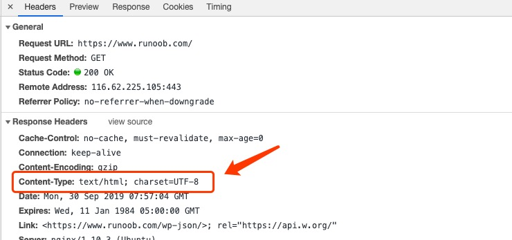

# HTTP

## HTTP 简介
　　HTTP 协议是 Hyper Text Transfer Protocol(超文本传输协议)的缩写，是用于从万维网（WWW:World Wide Web）服务器传输超文本到本地浏览器的传送协议。

　　HTTP 是基于 TCP/IP 通信协议来传输数据（HTML 文件，图片文件，查询结果等）。

　　HTTP 是面向事务的应用层协议。

　　所谓面向事务就是指一系列的信息交换，这些交换的信息是一个整体，要么这些信息全部交换，要么就不交换。

　　HTTP 不仅能传送文本跳转所必须的信息，而且也能传输任何能在互联网上得到的信息。

　　HTTP 协议主要就是用来进行客户端和服务器端之间进行通信的标准协议。HTTP 主要规定了客户端如何与服务器端建立链接，客户端如何从服务器请求数据，服务器如何响应请求，以及最后连接如何关闭。

　　每个万维网网点都有一个服务器进程，用来监视 TCP 的端口 80，以便发现是否有浏览器向它发出建立连接请求，一旦监听到需要建立 TCP 连接，浏览器就会向万维网发出浏览某个页面的请求，而万维网对这个请求的页面做出响应，最后，TCP 连接释放。在浏览器和服务器之间的请求与响应的交互，必须按照一定的格式和规则，这些格式和规则就是超文本传输协议 HTTP。

#### HTTP 工作原理
　　HTTP 协议工作于客户端-服务端架构上。浏览器作为 HTTP 客户端通过 URL 向 HTTP 服务端发送所有请求。

　　Web 服务器有：Apache 服务器，IIS 服务器（Internet Information Service）等。

　　Web 服务器根据接收到的请求后，向客户端发送响应信息。

　　HTTP 默认端口号为 80，也可以改为 8080 或者其他端口。

**一次网络请求的过程：**
1. 浏览器向 DNS 服务器请求解析该 URL 中的域名所对应的 IP 地址。
2. 解析出 IP 地址后，根据该 IP 地址和默认端口 80，和服务器建立 TCP 连接。
3. 浏览器发出读取文件（URL 中域名后面部分对应的文件）的 HTTP 请求，该请求报文作为 TCP 三次握手的第三个报文的数据发送给服务器。
4. 服务器对浏览器请求作出响应，并把对应的 html 文本发送给浏览器。
5. 释放 TCP 连接
6. 浏览器将该 html 文本显示内容

**HTTP 三点注意事项：**
* HTTP 是无连接：无连接的含义是限制每次连接只处理一个请求。服务端处理完客户的请求，并收到客户的应答后，即断开连接。采用这种方式可以节省传输时间。虽然 HTTP 需要用到 TCP 作为传输层协议，但是在通信双方交换 HTTP 报文之前不需要建立 HTTP 连接。
* HTTP 是媒体独立的：这意味着，只要客户端和服务端知道如何处理的数据内容，任何类型的数据都可以通过 HTTP 发送。客户端以及服务端指定使用合适的 MIME-type 内容类型。
* HTTP 是无状态：HTTP 协议是无状态协议。无状态是指协议对于事务处理没有记忆能力。缺少状态意味着如果后续处理需要前面的信息，则它必须重传，这样可能导致每次连接传送的数据量增大。另一方面，在服务器不需要先前信息时它的应答就较快。

　　下图是 HTTP 协议通信流程：


　　浏览器显示的内容都有 HTML、XML、GIF、FLASH 等，浏览器是通过 MIME Type 区分它们，决定用什么内容什么形式来显示。

　　MIME Type 是该资源的媒体类型，MIME Type 不是个人指定的，是通过互联网（ IETF ）组织协商，以 RFC（ 是一系列以编号排定的文件，几乎所有的互联网标准都有收录在其中 ） 的形式作为建议的标准发布在网上的，大多数的 Web 服务器和用户代理都会支持这一规范（ 顺便说一句，Email 附件的类型也是通过 MIME Type 指定的 ）。

　　媒体类型通常通过 HTTP 协议，由 Web 服务器告知浏览器的，更准确的说，是通过 Content-Type 来表示的。

　　如果是某个客户端自己定义的格式，MIME Type 一点只能以 application/x- 开头。

#### HTTP 的版本
　　HTTP/1.0 的主要缺点：每当请求一个文档，就需要两倍的 RTT （ Round-Trip Time，往返时延，是指数据从网络一端传到另一端所需的时间) 的开销（一个 RTT 时用来 TCP 的连接，另一个 RTT 用来请求和接收万维网文档），如果有很多个对象需要建立连接，那么每一次连接都需要 2* RTT 的时间开销。另一方面，每一次请求都需要建立 TCP 连接，并且万维网通常都服务于大量的请求，所以这种非持续性的连接会导致万维网的负荷过大。HTTP/1.0 中浏览器与服务器只保持短暂的连接，连接无法复用。也就说每个 TCP 连接只能发送一个请求。发送数据完毕，连接就关闭，如果还要请求其他资源，就必须再新建一个连接。

　　HTTP/1.1 采用的是持续连接，就是在建立连接后的一段时间内仍然保持连接，使用同一个客户和服务器传送后续的请求和响应。客户端和服务器发现对方一段时间没有活动，就可以主动关闭连接。或者客户端在最后一个请求时，主动告诉服务端要关闭连接。HTTP/1.1 版还引入了管道机制（pipelining） ，即在同一个 TCP 连接里面，客户端可以同时发送多个请求。但是对于执行者来说，还是需要按照顺序，先执行完一件事以后再执行另外一件事。

　　HTTP/2 采用了多路复用，即在一个连接里，客户端和浏览器都可以同时发送多个请求或回应，而且不用按照顺序一一对应。能这样做有一个前提，就是 HTTP/2 进行了二进制分帧，即 HTTP/2 会将所有传输的信息分割为更小的消息和帧（frame），并对它们采用二进制格式的编码。除此之外，还有一些其他的优化，比如做 Header 压缩、服务端推送等。

　　持续连接有两种工作方式，非流水线和流水线。

　　非流水线：客户在收到上一个响应才能发出下一个请求。缺点：服务器在发送了一个对象后，TCP 处于空闲状态，浪费资源。

　　流水线：客户在收到 HTTP 的响应报文之前，就能够接着发送新的请求。


## HTTP 消息结构
　　HTTP 是基于客户端/服务端（C/S）的架构模型，通过一个可靠的链接来交换信息，是一个无状态的请求/响应协议。

　　一个 HTTP "客户端"是一个应用程序（Web 浏览器或其他任何客户端），通过链接服务器达到发送一个或多个 HTTP 的请求的目的。

　　一个 HTTP “服务器”同样也是一个应用程序（通常是一个 Web 服务，如 Apache Web 服务器或 IIS 服务器等），通过接收客户端的请求并向客户端发送 HTTP 响应数据。

　　HTTP 使用统一资源标识符（Uniform Resource Identifiers,URL） 来传输数据和建立连接。

　　一旦建立连接后，数据消息就通过类似 Internet 邮件所适用的格式和多用途 Internet 邮件扩展（MIME）来传送。

#### 客户端请求消息
　　客户端发送一个 HTTP 请求到服务器的请求消息包括以下格式：请求行（request line）（方法+URL+版本）、请求头部（header）、空行和请求数据四个部分组成，下图给出了请求报文的一般格式：


　　请求行：用来说明请求类型，要访问的资源以及所使用的 HTTP 版本。

　　请求头部：紧接着请求行之后的部分，用来说明服务器要使用的附加信息。

　　空行：请求头部后面的空行是必须的。

　　请求数据：也称为请求主体，可以添加任意的其他数据。

　　请求头部的首部字段名和含义：

| 字段名 | 含义 |
| -------- | -------- |
| **Accept** | 浏览器可接受的 MIME 类型。 |
| Accept-Charset | 浏览器可接受的字符集。 |
| Accept-Encoding | 浏览器能够进行解码的数据编码方式，比如 gzip。Servlet 能够向支持 gzip 的浏览器返回经 gzip 编码的 HTML 页面。许多情形下这可以减少 5 到 10 倍的下载时间。 |
| Accept-Language | 浏览器所希望的语言种类，当服务器能够提供一种以上的语言版本时要用到。 |
| Authorization | 授权信息，通常出现在对服务器发送的 WWW-Authorizate 头的应答中。 |
| Content-Length | 表示请求消息正文的长度。 |
| Host | 客户机通过这个头告诉服务器，要访问的主机名。Host 头域指定请求资源的 Intenet 主机和端口号，必须表示请求 url 的原始服务器或网管的位置。HTTP/1.1 请求必须包含主机头域，否则系统会以 400 状态码返回。 |
| If-Modified-Since | 客户机通过这个头告诉服务器，资源的缓存时间。只有当所请求的内容在指定的时间后又经过修改才返回它，否则返回 304 “Not Modified” 应答。 |
| Referer | 客户机通过这个头告诉服务器，它是从哪个资源来访问服务器的（防盗链）。包含一个 URL，用户从该 URL 代表的页面出发访问当前请求的页面。 |
| User-Agent | User-Agent 头域的内容包含发出请求的用户信息。浏览器类型，如果 Servlet 返回的内容与浏览器类型有关则该值非常有用。 |
| **Cookie** | 客户机通过这个头可以向服务器带数据，这是最重要的请求头信息之一。 |
| Pragma | 指定 “no-cache” 值表示服务器必须返回一个刷新后的文档，即使它是代理服务器而且已经有了页面的本地拷贝。  |
| From | 请求发送者的 email 地址，由一些特殊的 Web 客户程序使用，浏览器不会用到它。 |
| **Connection** | 处理完这次请求后是否断开连接还是继续保持连接。如果 Servlet 看到这里的值为 “Keep-Alive” ，或者看到请求使用的是 HTTP 1.1(HTTP 1.1 默认进行持久连接)，它就可以利用持久连接的优点，当页面包含多个元素时（例如 Applet、图片），显著地减少下载所需要的时间。要实现这一点，Servlet 需要在应答中发送一个 Content-Length 头，最简单的实现方法是：先把内容写入 ByteArrayOutputStream，然后在正式写出内容之前计算它的大小。 |
| Range | Range 头域可以请求实体的一个或者多个子范围，例如，表示头 500 个字节：bytes=0-499,表示第二个 500 字节：bytes=500-999,表示最后 500 个字节：bytes=-500，表示 500 字节以后的范围：bytes=500-，第一个和最后一个字节：bytes=0-0,-1，同时指定几个范围：bytes=500-600,601-999，但是服务器可以忽略此请求头，如果无条件 GET 包含 Range 请求头，响应会以状态吗 206（PartialContent）返回而不是以 200（OK）。 |
| UA-Pixels,UA-Color,UA-OS,UA-CPU | 由某些版本的 IE 浏览器所发送的非标准的请求头，表示屏幕大小、屏幕深度、操作系统和 CPU 类型。 |


#### 服务器响应消息
　　HTTP 响应也由四个部分组成，分别是：状态行（版本+状态+短语）、消息报头、空行和响应正文。


　　状态行：由 HTTP 协议版本号、状态码、状态消息三部分组成。

　　消息报头：用来说明客户端要使用的一些附加信息。

　　空行：消息报头后面的空行是必须的。

　　响应正文：服务器返回给客户端的文本信息。

#### 实例
　　下面实例是一些典型的使用 GET 来传递数据的实例：

　　客户端请求：
```
GET /hello.txt HTTP/1.1
User-Agent: curl/7.16.3 libcurl/7.16.3 OpenSSL/0.9.7l zlib/1.2.3
Host: www.example.com
Accept-Language: en, mi
```

　　服务端响应：
```
HTTP/1.1 200 OK
Date: Mon, 27 Jul 2009 12:28:53 GMT
Server: Apache
Last-Modified: Wed, 22 Jul 2009 19:15:56 GMT
ETag: "34aa387-d-1568eb00"
Accept-Ranges: bytes
Content-Length: 51
Vary: Accept-Encoding
Content-Type: text/plain
```

　　输出结果：
```
Hello World! My payload includes a trailing CRLF.
```

## HTTP 请求方法
　　根据 HTTP 标准，HTTP 请求可以使用多种请求方法。

　　HTTP 1.0 定义了三种请求方法：GET、POST 和 HEAD 方法。

　　HTTP 1.1 新增了六种请求方法：OPTIONS、PUT、PATCH、DELETE、TRACE 和 CONNECT 方法。

| 方法 | 描述 |
| -------- | -------- |
| GET（获取资源） | 请求指定的页面信息，并返回实体主体。 |
| HEAD（获取报文首部） | 类似于 GET 请求，只不过返回的响应中没有具体的内容，用于获取报头。 |
| POST（传输实体文本） | 向指定资源提交数据进行处理请求（例如提交表单或者上传文件）。数据被包含在请求体中。POST 请求可能会导致新的资源的建立或已有资源的修改。 |
| PUT（传输文件） | 从客户端向服务器传送的数据取代指定的文档的内容。 |
| DELETE（删除文件） | 请求服务器删除指定的页面。 |
| CONNECT（要求用隧道协议连接代理） | HTTP/1.1 协议中预留给能够将连接改为管道方式的代理服务器。要求在与代理服务器通信时建立隧道，实现用隧道协议进行 TCP 通信。主要使用 SSL(安全套接层)和 TSL（传输层安全）协议把通信内容加密后经网络隧道传输。 |
| OPTIONS（询问支持的方法） | 允许客户算查看服务器的性能。用于查询针对请求 URL 指定资源支持的方法（客户端询问服务器可以提交哪些请求方法）。 |
| TRACE（追踪路径） | 回显服务器收到的请求，主要用于测试或诊断。 |
| PATCH（补充） | 是对 PUT 方法的补充，用来对已知资源进行局部更新。 |

　　GET 方法用来请求已被 URL 识别的资源。指定的资源经服务器端解析后返回响应内容（也就是说，如果请求的资源是文本，那就保持原样返回；如果是 CGI[通用网关接口]那样的程序，则返回经过执行后的输出结果）。

　　POST 方法用来传输实体的主体。虽然用 GET 方法也可以传输实体的主体，但一般不用 GET 方法进行传输，而是用 POST 方法；虽然 GET 方法和 POST 方法很相似，但是 POST 的主要目的并不是获取相应的主体内容。

　　GET 方法和 POST 方法的区别：
1. GET 方法用于信息获取，它是安全的（安全：指非修改信息，如数据库方面的信息），而 POST 方法是用于修改服务器上资源的请求；
2. GET 请求的数据会附在 URL 之后，而 POST 方法提交的数据则放置在 HTTP 报文实体的主体里，所以 POST 方法的安全性比 GET 方法要高；
3. GET 方法传输的数据量一般限制在 2 KB，其原因在于：GET 是通过 URL 提交数据，而 URL 本身对于数据没有限制，但是不同的浏览器对于 URL 是有限制的，比如 IE 浏览器对于 URL 的限制为 2 KB，而 chrome,FireFox 浏览器理论上对于 URL 是没有限制的，它真正的限制取决于操作系统本身；POST 方法对于数据大小是无限制的，真正影响到数据大小的是服务器处理程序的能力。

　　HEAD 方法与 GET 方法的区别：GET 方法有实体，HEAD 方法无实体。

　　HEAD 方法的主要用途：1.判断类型；2.查看响应中的状态码，看对象是否存在（响应：请求执行成功了，但是无数据返回）；3.测试资源是否被修改过。

## HTTP 响应头信息
　　HTTP 响应头提供了关于请求、响应或者其他的发送实体的信息。

| 应答头 | 说明 |
| -------- | -------- |
| Allow | 服务器支持哪些请求方法（如 GET、POST 等） |
| Content-Encoding | 文档的编码（Encode）方法。只有在解码之后才可以得到 Content-Type 头指定的内容类型。利用 gzip 压缩文档能够显著地减少 HTML 文档的下载时间。Java 的 GZIPOutputStream 可以很方便地进行 gzip 压缩，但只有 Unix 上的 Netscape 和 Windows 上的 IE 4、IE 5 才支持它。因此，Servlet 应该通过查看 Accept-Encoding 头（即 request.getHeader("Accept-Encoding")）检查浏览器是否支持 gzip，为支持 gzip 的浏览器返回经 gzip 压缩的 HTML 页面，为其他浏览器返回普通页面。 |
| Content-Length | 表示内容长度。只有当浏览器使用持久 HTTP 连接时才需要这个数据。 如果你想要利用持久连接的优势，可以把输出文档写入 ByteArrayOutputStream，完成后查看其大小，然后把该值放入 Content-Length 头，最后通过 byteArrayStream.write(response.getOutputStream))发送内容。|
| Content-Type | 表示后面的文档属于什么 MIME 类型。Servlet 默认为 text/plain，但通常需要显式地指定为 text/html。由于经常要设置 Content-Type，因此 HttpServletResponse 提供了一个专用的方法 setContentType。 |
| Date | 当前的 GMT 时间。你可以用 setDateHeader 来设置这个头以避免转换时间格式的麻烦。 |
| Expires | 应该在什么时候认为文档已经过期，从而不再缓存它。 |
| Last-Modified | 文档的最后改动时间。客户可以通过 If-Modified-Since 请求头提供一个日期，该请求将被视为一个条件 GET，只有改动时间迟于指定时间的文档才会返回，否则返回一个 304（Not Modified）状态。Last-Modified 也可用 setDateHeader 方法来设置。 |
| Location | 表示客户应当到哪里去提取文档。Location 通常不是直接设置的，而是通过 HttpServletResponse 的 sendRedirect 方法，该方法同时设置状态代码为 302。 |
| Refresh | 表示浏览器应该在多少时间之后刷新文档，以秒计。除了刷新当前文档之外，你还可以通过 setHeader("Refresh","5;URL=http://host/path") 让浏览器读取指定的页面。注意这种功能通常是通过设置 HTML 页面 HEAD 区的 < META HTTP-EQUIV="Refresh" CONTENT="5;URL=http://host/path"> 实现，这是因为，自动刷新或重定向对于那些不能使用 CGI 或 Servlet 的 HTML 编写者十分重要。但是，对于 Servlet 来说，直接设置 Refresh 头更加方便。
注意 Refresh 的意义是 “N 秒之后刷新本页面或访问指定页面”，而不是“每隔 N 秒刷新本页面或访问指定页面”。因此，连续刷新要求每次都发送一个 Refresh 头，而发送 204 状态代码则可以阻止浏览器继续刷新，不管是使用 Refresh 头还是 < META HTTP-EQUIV="Refrsh"... > 。注意 Refrsh 头不属于 HTTP 1.1 正式规范的一部分，而是一个扩展，但 Netscape 和 IE 都支持它。|
| Server | 服务器名字。Servlet 一般不设置这个值，而是由 Web 服务器自己设置。 |
| Set-Cookie | 设置和页面关联的 Cookie。Servlet 不应使用 response.setHeader("Set-Cookie",...)，而是应使用 HttpServletResponse 提供的专用方法 addCookie。|
| WWW-Authenticate | 客户应该在 Authorization 头中提供什么类型的授权信息？在包含 401 （Unauthorized） 状态行的应答中这个头是必须的。例如，response.setHeader("WWW-Authenticate","BASIC realm="executives")。注意 Servlet 一般不进行这方面的处理，而是让 Web 服务器的专门机制来控制受密码保护页面的访问（例如 htaccess）。 |

## HTTP 状态码
　　当浏览器访问一个网页时，浏览者的浏览器会向网页所在服务器发出请求。当浏览器接收并显示网页前，此网页所在的服务器会返回一个包含 HTTP 状态码的信息头（server header）用以响应浏览器的请求。

　　下面是常见的 HTTP 状态码：
* 200 - 请求成功
* 301 - 资源（网页等）被永久转义到其他 URL
* 404 - 请求的资源（网页等）不存在
* 500 - 内部服务器错误

#### HTTP 状态码分类
　　HTTP 状态码由三个十进制数字组成，第一个十进制数字定义了状态码的类型，后两个数字没有分类的作用。HTTP 状态码共分为 5 种类型：

　　HTTP 状态码分类：

| 分类 | 分类描述 |
| -------- | -------- |
| 1xx | 信息，服务器收到请求，需要请求者继续执行操作 |
| 2xx | 成功，操作被成功接收并处理 |
| 3xx | 重定向，需要进一步的操作以完成请求 |
| 4xx | 客户端错误，请求包含语法错误或无法完成请求 |
| 5xx | 服务器错误，服务器在处理请求的过程中发生了错误 |

　　HTTP 状态码列表：

| 状态码 | 状态码英文名称 | 中文描述 |
| -------- | -------- | -------- |
| 100 | Continue | 继续，客户端应继续其请求 |
| 101 | Switching Protocols | 切换协议。服务器根据客户端的请求切换协议。只能切换到更高级的协议，例如，切换到 HTTP 的新版本协议 |
| 200 | OK | 请求成功。一般用于 GET 与 POST 请求 |
| 201 |  Created | 已创建。成功请求并创建了新的资源 |
| 202 | Accepted | 已接受。已经接受请求，但未处理完成 |
| 203 | Non-Authoritative Information | 非授权信息。请求成功。但返回的 meta 信息不在原始的服务器，而是一个副本 |
| 204 | No Content | 无内容。服务器成功处理，但未返回内容。在未更新网页的情况下，可确保浏览器继续显示当前文档 |
| 205 | Reset Content | 重置内容。服务器处理成功，用户终端（例如：浏览器）应重置文档视图。可通过此返回码清楚浏览器的表单域 |
| 206 | Partial Content | 部分内容。服务器成功处理了部分 GET 请求 |
| 300 | Multiple Choices | 多种选择。请求的资源可包括多个位置，相应可返回一个资源特征与地址的列表用于用户终端（例如浏览器）选择 |
| 301 | Moved Permanently | 永久移动。请求的资源已被永久的移动到新 URL，返回信息会包括新的 URL，浏览器会自动定向到新 URL。今后任何新的请求都应使用新的 URL 代替。 |
| 302 | Found | 临时移动。与 301 类似。但资源只是临时被移动。客户端应继续使用原有 URL |
| 303 | See Other | 查看其他地址。与 301 类似。使用 GET 和 POST 请求查看 |
| 304 | Not Modified | 未修改。所请求的资源未修改，服务器返回此状态码时，不会返回任何资源。客户端通常会缓存访问过的资源，通过提供一个头信息指出客户端希望只返回在指定日期之后修改的资源 |
| 305 | Use Proxy | 使用代理。所请求的资源必须通过代理访问 |
| 306 | Unused | 已经被废弃的 HTTP 状态码 |
| 307 | Temporary Redirect | 临时重定向。与 302 类似。使用 GET 请求重定向 |
| 400 | Bad Request | 客户端请求的语法错误，服务器无法理解 |
| 401 | Unauthorized | 请求要求用户的身份认证 |
| 402 | Payment Required | 保留，将来使用 |
| 403 | Forbidden | 服务器理解请求客户端的请求，但是拒绝执行此请求 |
| 404 | Not Found | 服务器无法根据客户端的请求找到资源（网页）。通过此代码，网站设计人员可设置“您所请求的资源无法找到”的个性页面 |
| 405 | Method Not Allowed | 客户端请求中的方法被禁止 |
| 406 | Not Acceptable | 服务器无法根据客户端请求的内容特性完成请求 |
| 407 | Proxy Authentication required | 请求要求代理的身份认证，与 401 类似，但请求者应当使用代理进行授权 |
| 408 | Request Timeout | 服务端等待客户端发送的请求时间过长，超时 |
| 409 | Conflict | 服务器完成客户端的 PUT 请求时可能返回此代码，服务器处理请求时发生了冲突 |
| 410 | Gone | 客户端请求的资源已经不存在。410 不同于 404，如果资源以前有现在被永久删除了可使用 404 代码，网站设计人员可通过 301 代码指定资源的位置 |
| 411 | Length Required | 服务器无法处理客户端发送的不带 Content-Length 的请求信息 |
| 412 | Precondition Failed | 客户端请求信息的先决条件错误 |
| 413 | Request Enity Too Large | 由于请求的实体过大，服务器无法处理，因此拒绝请求。为防止客户端的连续请求，服务器可能会关闭连接。如果只是服务器暂时无法处理，则会包含一个 Retry-After 的响应信息 |
| 414 | Request-URL Too Large | 请求的 URL（URL 通常为网址）过长，服务器无法处理 |
| 415 | Unsupported Media Type | 服务器无法处理请求附带的媒体格式 |
| 416 | Requested rang not satisfiable | 客户端请求的范围无效 |
| 417 | Expectation Failed | 服务器无法满足 Expect 的请求头信息 |
| 500 | Internal Server Error | 服务器内部错误，无法完成请求 |
| 501 | Not Implemented | 服务器不支持请求的功能，无法完成请求 |
| 502 | Bad Gateway | 作为网关或者代理服务器尝试执行请求时，从远程服务器接收到了一个无效的响应 |
| 503 | Service Unavailable | 由于超载或系统维护，服务器暂时的无法处理客户端的请求。延时的长度可包含在服务器的 Retry-After 头信息中 |
| 504 | Gateway Timeout | 充当网关或代理的服务器，未及时从远程服务器获取请求 |
| 505 | HTTP Version not supported | 服务器不支持请求的 HTTP 协议的版本，无法完成处理 |

## HTTP content-type
　　Content-Type (内容类型)，一般是指网页中存在的 Content-Type，用来定义网络文件的类型和网页的编码，决定浏览器将以什么形式、什么编码读取这个文件，这就是经常看到一些 PHP 网页点击的结果却是下载一个文件或一张图片的原因。

　　Content-Type 标头告诉客户端实际返回的内容的内容类型。

　　语法格式：
```
Content-Type: text/html; charset=utf-8
Content-Type: multipart/form-data; boundary=something
```

　　实例：


　　常见的媒体格式类型如下：
* text/html：HTML 格式
* text/plain：纯文本格式
* text/xml：XML 格式
* image/gif：gif 图片格式
* image/jpeg：jpg 图片格式
* image/png：png 图片格式

　　以 application 开头的媒体格式类型：
* application/xhtml+xml：XHTML 格式
* application/xml：XML 数据格式
* application/auto+xml：Atom XML 聚合格式
* application/json：JSON 数据格式
* application/pdf：pdf 格式
* application/msword：Word 文档格式
* application/octet-stream：二进制流数据（如常见的文件下载）
* application/x-www-form-urlencoded：< form encType="">种默认的 encType，form 表单数据被编码为 key/value 格式发送到服务器（表单默认的提交数据的格式）

　　另外一种常见的媒体格式是上传文件之时使用的：
* multipart/form-data：需要在表单中进行文件上传时，就需要使用该格式。

#### HTTP content-type 对照表
| 文件扩展名 |	Content-Type(Mime-Type)	 |文件扩展名 |	Content-Type(Mime-Type) |
| ------ | ------ | ------ | ------ |
| .*（ 二进制流，不知道下载文件类型） |	application/octet-stream | .tif	| image/tiff |
| .001 | application/x-001 | .301 | application/x-301 |
| .323 | text/h323 | .906 | application/x-906 |
| .907 | drawing/907 | .a11 | application/x-a11 |
| .acp | audio/x-mei-aac | .ai | application/postscript |
| .aif | audio/aiff | .aifc | audio/aiff |
| .aiff | audio/aiff | .anv | application/x-anv |
| .asa | text/asa | .asf | video/x-ms-asf |
| .asp | text/asp | .asx | video/x-ms-asf |
| .au | audio/basic | .avi | video/avi |
| .awf | application/vnd.adobe.workflow | .biz | text/xml |
| .bmp | application/x-bmp | .bot | application/x-bot |
| .c4t | application/x-c4t | .c90 | application/x-c90 |
| .cal | application/x-cals | .cat | application/vnd.ms-pki.seccat |
| .cdf | application/x-netcdf | .cdr | application/x-cdr |
| .cel | application/x-cel | .cer | application/x-x509-ca-cert |
| .cg4 | application/x-g4 | .cgm | application/x-cgm |
| .cit | application/x-cit | .class | java/* |
| .cml | text/xml | .cmp | application/x-cmp |
| .cmx | application/x-cmx | .cot | application/x-cot |
| .crl | application/pkix-crl | .crt | application/x-x509-ca-cert |
| .csi | application/x-csi | .css | text/css |
| .cut | application/x-cut | .dbf | application/x-dbf |
| .dbm | application/x-dbm | .dbx | application/x-dbx |
| .dcd | text/xml | .dcx | application/x-dcx |
| .der | application/x-x509-ca-cert | .dgn | application/x-dgn |
| .dib | application/x-dib | .dll | application/x-msdownload |
| .doc | application/msword | .dot | application/msword |
| .drw | application/x-drw | .dtd | text/xml |
| .dwf | Model/vnd.dwf | .dwf | application/x-dwf |
| .dwg | application/x-dwg | .dxb | application/x-dxb |
| .dxf | application/x-dxf | .edn | application/vnd.adobe.edn |
| .emf | application/x-emf | .eml | message/rfc822 |
| .ent | text/xml | .epi | application/x-epi |
| .eps | application/x-ps | .eps | application/postscript |
| .etd | application/x-ebx | .exe | application/x-msdownload |
| .fax | image/fax | .fdf | application/vnd.fdf |
| .fif | application/fractals | .fo	text/xml |
| .frm |application/x-frm | .g4	application/x-g4 |
| .gbr |application/x-gbr | .	application/x- |
| .gif |image/gif | .gl2 | application/x-gl2 |
| .gp4 | application/x-gp4 | .hgl | application/x-hgl |
| .hmr | application/x-hmr | .hpg | application/x-hpgl |
| .hpl | application/x-hpl | .hqx | application/mac-binhex40 |
| .hrf | application/x-hrf | .hta | application/hta |
| .htc | text/x-component | .htm | text/html |
| .html | text/html | .htt | text/webviewhtml |
| .htx | text/html | .icb | application/x-icb |
| .ico | image/x-icon | .ico | application/x-ico |
| .iff | application/x-iff | .ig4 | application/x-g4 |
| .igs | application/x-igs | .iii | application/x-iphone |
| .img | application/x-img | .ins | application/x-internet-signup |
| .isp | application/x-internet-signup | .IVF | video/x-ivf |
| .java | java/* | .jfif | image/jpeg |
| .jpe | image/jpeg	.jpe | application/x-jpe |
| .jpeg | image/jpeg | .jpg | image/jpeg |
| .jpg | application/x-jpg | .js | application/x-javascript |
| .jsp | text/html | .la1 | audio/x-liquid-file |
| .lar | application/x-laplayer-reg | .latex | application/x-latex |
| .lavs | audio/x-liquid-secure | .lbm | application/x-lbm |
| .lmsff | audio/x-la-lms | .ls | application/x-javascript |
| .ltr | application/x-ltr | .m1v | video/x-mpeg |
| .m2v | video/x-mpeg | .m3u | audio/mpegurl |
| .m4e | video/mpeg4 | .mac | application/x-mac |
| .man | application/x-troff-man | .math | text/xml |
| .mdb | application/msaccess | .mdb | application/x-mdb |
| .mfp | application/x-shockwave-flash | .mht | message/rfc822 |
| .mhtml | message/rfc822 | .mi | application/x-mi |
| .mid | audio/mid | .midi | audio/mid |
| .mil | application/x-mil | .mml | text/xml |
| .mnd | audio/x-musicnet-download | .mns | audio/x-musicnet-stream |
| .mocha | application/x-javascript | .movie | video/x-sgi-movie |
| .mp1 | audio/mp1 | .mp2 | audio/mp2 |
| .mp2v | video/mpeg | .mp3 | audio/mp3 |
| .mp4 | video/mpeg4 | .mpa | video/x-mpg |
| .mpd | application/vnd.ms-project | .mpe | video/x-mpeg |
| .mpeg | video/mpg | .mpg | video/mpg |
| .mpga | audio/rn-mpeg | .mpp | application/vnd.ms-project |
| .mps | video/x-mpeg | .mpt | application/vnd.ms-project |
| .mpv | video/mpg | .mpv2 | video/mpeg |
| .mpw |application/vnd.ms-project | .mpx | application/vnd.ms-project |
| .mtx | text/xml | .mxp | application/x-mmxp |
| .net | image/pnetvue | .nrf | application/x-nrf |
| .nws | message/rfc822 | .odc | text/x-ms-odc |
| .out | application/x-out | .p10 | application/pkcs10 |
| .p12 | application/x-pkcs12 | .p7b |application/x-pkcs7-certificates |
| .p7c | application/pkcs7-mime | .p7m | application/pkcs7-mime |
| .p7r | application/x-pkcs7-certreqresp | .p7s | application/pkcs7-signature |
| .pc5 | application/x-pc5 | .pci | application/x-pci |
| .pcl | application/x-pcl | .pcx | application/x-pcx |
| .pdf | application/pdf | .pdf | application/pdf |
| .pdx | application/vnd.adobe.pdx | .pfx | application/x-pkcs12 |
| .pgl | application/x-pgl | .pic | application/x-pic |
| .pko | application/vnd.ms-pki.pko | .pl | application/x-perl |
| .plg | text/html | .pls | audio/scpls |
| .plt | application/x-plt | .png | image/png |
| .png | application/x-png | .pot | application/vnd.ms-powerpoint |
| .ppa | application/vnd.ms-powerpoint | .ppm | application/x-ppm |
| .pps | application/vnd.ms-powerpoint | .ppt | application/vnd.ms-powerpoint |
| .ppt | application/x-ppt | .pr | application/x-pr |
| .prf | application/pics-rules | .prn | application/x-prn |
| .prt | application/x-prt | .ps | application/x-ps |
| .ps | application/postscript | .ptn | application/x-ptn |
| .pwz | application/vnd.ms-powerpoint | .r3t | text/vnd.rn-realtext3d |
| .ra | audio/vnd.rn-realaudio | .ram | audio/x-pn-realaudio |
| .ras | application/x-ras | .rat | application/rat-file |
| .rdf | text/xml | .rec | application/vnd.rn-recording |
| .red | application/x-red | .rgb | application/x-rgb |
| .rjs | application/vnd.rn-realsystem-rjs | .rjt | application/vnd.rn-realsystem-rjt |
| .rlc | application/x-rlc | .rle | application/x-rle |
| .rm | application/vnd.rn-realmedia | .rmf | application/vnd.adobe.rmf |
| .rmi | audio/mid | .rmj | application/vnd.rn-realsystem-rmj |
| .rmm | audio/x-pn-realaudio | .rmp | application/vnd.rn-rn_music_package |
| .rms | application/vnd.rn-realmedia-secure | .rmvb | application/vnd.rn-realmedia-vbr |
| .rmx | application/vnd.rn-realsystem-rmx | .rnx | application/vnd.rn-realplayer |
| .rp | image/vnd.rn-realpix | .rpm | audio/x-pn-realaudio-plugin |
| .rsml | application/vnd.rn-rsml | .rt | text/vnd.rn-realtext |
| .rtf | application/msword | .rtf | application/x-rtf |
| .rv | video/vnd.rn-realvideo | .sam | application/x-sam |
| .sat | application/x-sat | .sdp | application/sdp |
| .sdw | application/x-sdw | .sit | application/x-stuffit |
| .slb | application/x-slb | .sld | application/x-sld |
| .slk | drawing/x-slk | .smi | application/smil |
| .smil | application/smil | .smk | application/x-smk |
| .snd | audio/basic | .sol | text/plain |
| .sor | text/plain | .spc | application/x-pkcs7-certificates |
| .spl | application/futuresplash | .spp | text/xml |
| .ssm | application/streamingmedia | .sst | application/vnd.ms-pki.certstore |
| .stl | application/vnd.ms-pki.stl | .stm | text/html |
| .sty | application/x-sty | .svg | text/xml |
| .swf | application/x-shockwave-flash | .tdf | application/x-tdf |
| .tg4 | application/x-tg4 | .tga | application/x-tga |
| .tif | image/tiff | .tif | application/x-tif |
| .tiff | image/tiff | .tld | text/xml |
| .top | drawing/x-top | .torrent | application/x-bittorrent |
| .tsd | text/xml | .txt | text/plain |
| .uin | application/x-icq | .uls | text/iuls |
| .vcf | text/x-vcard | .vda | application/x-vda |
| .vdx | application/vnd.visio | .vml | text/xml |
| .vpg | application/x-vpeg005 | .vsd | application/vnd.visio |
| .vsd | application/x-vsd | .vss | application/vnd.visio |
| .vst | application/vnd.visio | .vst | application/x-vst |
| .vsw | application/vnd.visio | .vsx | application/vnd.visio |
| .vtx | application/vnd.visio | .vxml | text/xml |
| .wav | audio/wav | .wax | audio/x-ms-wax |
| .wb1 | application/x-wb1 | .wb2 | application/x-wb2 |
| .wb3 | application/x-wb3 | .wbmp | image/vnd.wap.wbmp |
| .wiz | application/msword | .wk3 | application/x-wk3 |
| .wk4 | application/x-wk4 | .wkq | application/x-wkq |
| .wks | application/x-wks | .wm | video/x-ms-wm |
| .wma | audio/x-ms-wma | .wmd | application/x-ms-wmd |
| .wmf | application/x-wmf | .wml | text/vnd.wap.wml |
| .wmv | video/x-ms-wmv | .wmx | video/x-ms-wmx |
| .wmz | application/x-ms-wmz | .wp6 | application/x-wp6 |
| .wpd | application/x-wpd | .wpg | application/x-wpg |
| .wpl | application/vnd.ms-wpl | .wq1 | application/x-wq1 |
| .wr1 | application/x-wr1 |.wri | application/x-wri |
| .wrk | application/x-wrk | .ws | application/x-ws |
| .ws2 | application/x-ws | .wsc | text/scriptlet |
| .wsdl | text/xml | .wvx | video/x-ms-wvx |
| .xdp | application/vnd.adobe.xdp | .xdr | text/xml |
| .xfd | application/vnd.adobe.xfd | .xfdf | application/vnd.adobe.xfdf |
| .xhtml | text/html | .xls | application/vnd.ms-excel |
| .xls | application/x-xls | .xlw | application/x-xlw |
| .xml | text/xml | .xpl | audio/scpls |
| .xq | text/xml | .xql | text/xml |
| .xquery | text/xml | .xsd | text/xml |
| .xsl | text/xml | .xslt | text/xml |
| .xwd | application/x-xwd | .x_b | application/x-x_b |
| .sis | application/vnd.symbian.install | .sisx | application/vnd.symbian.install |
| .x_t | application/x-x_t | .ipa | application/vnd.iphone |
| .apk | application/vnd.android.package-archive | .xap | application/x-silverlight-app |


## Session 与 Cookie

#### cookie 是什么
　　在网站中，http 请求时无状态的。也就是说即使第一次和服务器连接后并且登陆成功后，第二次请求服务器依然不能知道当前请求是哪个用户。cookie 的出现就是为了解决这个问题，第一次登陆后服务器返回一个数据（cookie）给浏览器，然后浏览器保存在本地，当该用户发送第二次请求的时候，就会自动的把上次请求存储的 cookie 数据自动的携带给服务器，服务器通过浏览器携带的数据就能判断当前用户是哪个了。cookie 存储的数据量有限，不同的浏览器有不同的存储大小，但一般不超过 4KB。因此使用 cookie 只能存储一些小量的数据。

#### session 是什么
　　session 和 cookie 的作用有点类似，都是为了存储用户相关的信息。不同的是，cookie 是存储在本地浏览器，而 session 存储在服务器。存储在服务器的数据会更加的安全，不容易被窃取。但存储在服务器也有一定的弊端，就是会占用服务器的资源。

　　session 的目的：弥补 HTTP 无状态特性，服务器可以利用 session 存储客户端在同一个会话期间的一些操作记录。

#### cookie 和 session 结合使用
　　在如今的市场或者企业里，一般有两种存储方式：
1. 存储在服务端：通过 cookie 存储一个 session_id，然后具体的数据则是保存在 session 中。如果用户已经登陆，则服务器会在 cookie 中保存一个 session_id，下次再次请求的时候，会把该 session_id 携带上来，服务器根据 session_id 在 session 库中获取用户的 session 数据，就能知道该用户到底是谁，以及之前保存的一些状态信息。这种专业术语叫做 server side session。
2. 将 session 数据加密，然后存储在 cookie 中。这种专业术语叫做 client side session。

#### session 的实现机制
1. 服务器如何判断客户端发送过来的请求术语同一个会话？

　　用 session id 区分；session id 相同即认为是同一个会话。

　　在 tomcat 中 session id 中用 JSESSIONID 来表示。

2. 服务器、客户端如何获取 sessionID?SessionID 在期间是如何传输的？

　　服务器第一次接收到请求时，开辟了一块 Session 空间（创建了 Session 对象），同时生成一个 Session id，并通过响应头的 Set-Cookie：“JSESSIONID=XXXXXXX”命令，向客户端发送要求设置 cookie 的响应；客户端收到响应后，在本机客户端设置了一个 JSESSIONID=XXXXXXX 的 cookie 信息，该 cookie 的过期时间为浏览器会话结束。

　　接下来客户端每次向同一个网站发送请求时，请求头都会带上该 cookie 信息（包含 Session id）；然后，服务器通过读取请求头中的 Cookie 信息，获取名称为 JSESSIONID 的值，得到此次请求的 Session id。

　　注意：服务器只会在客户端第一次请求响应的时候，在响应头上添加 Set-Cookie:"JSESSIONID=XXXXXXX" 信息，接下来在同一个会话的第二第三次响应头里，是不会添加 Set-Cookie:"JSESSIONID=XXXXXXX" 信息的；而客户端是会在每次请求头的 cookie 中带上 JSESSION 信息。

#### cookie 与 session 的区别
1. cookie 以文本文件格式存储在浏览器中，而 session 存储在服务端。
2. cookie 的存储限制了数据量，只允许 4kb，而 session 是无限量的。
3. 可以轻松访问 cookie 值，但无法轻松访问 session，因为 session 更安全。
4. 设置 cookie 时间可以使 cookie 过期，但是使用 session-destory()，将会销毁会话。

　　如果需要经常登陆一个站点，最好用 cookie 来保存信息，不然每次登陆会特别麻烦，但是对于需要安全性高的站点以及控制数据的能力时需要用 session 效果更佳。

## 参考文章
1. [HTTP 教程](https://www.runoob.com/http/http-tutorial.html) - 详细内容
2. [网络：HTTP](https://blog.csdn.net/oldwang1999/article/details/98526414) - 介绍
3. [网络之 HTTP 协议](https://blog.csdn.net/qq_42725815/article/details/87892480) - 介绍
4. [session 与 cookie 之间的关系](https://blog.csdn.net/qq_28296925/article/details/80921585) - 简单介绍
5. [cookie 与 session 的区别是什么](https://baijiahao.baidu.com/s?id=1619095369231494766&wfr=spider&for=pc) - 区别
