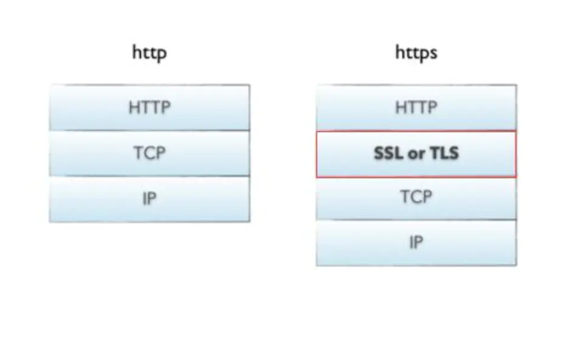
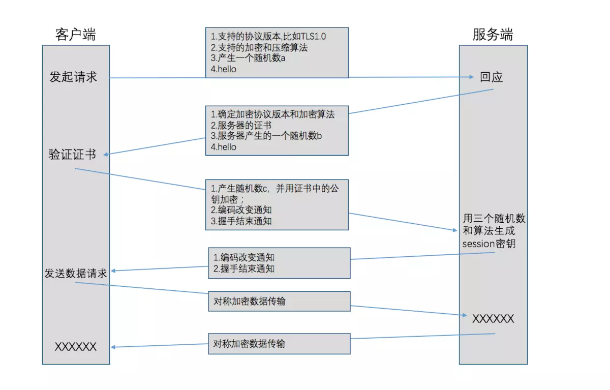
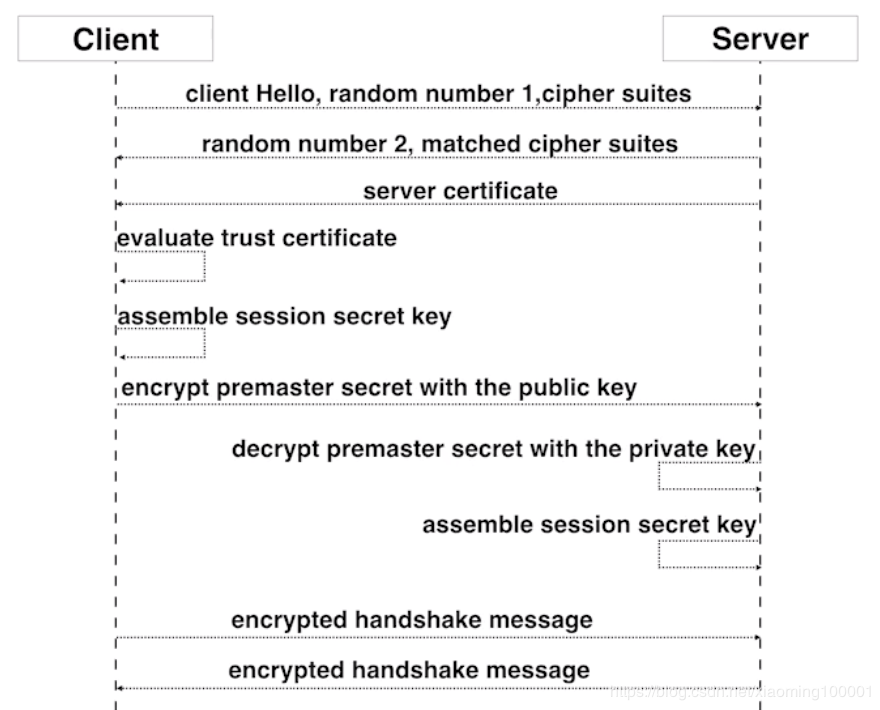

# HTTPS

## 1. 基本概念

### 1.1. HTTP

　　HTTP（HyperText Transfer Protocol：超文本传输协议）是一个基于请求与响应、无状态的、应用层协议，用于分布式、协作式和超媒体信息系统。简单来说就是一种发布和接收 HTML 页面的方法，被用于在 Web 浏览器和网站服务器之间传递消息。

　　HTTP 是互联网上应用最为广泛的一种网络协议，所有的 WWW 文件都必须遵守这个标准。设计 HTTP 的初衷是为了提供一种发布和接收 HTML 页面的方法。

　　HTTP 常基于 TCP/IP 协议传输数据，默认工作在 TCP 协议 80 端口，用户访问网站 http:// 大头的都是标准 HTTP 服务。

　　HTTP 协议以明文方式发送内容，不提供任何方式的数据加密，如果攻击者截取了 Web 浏览器和网站服务器之间的传输报文，就可以直接读懂其中的信息，因此，HTTP 协议不适合传输一些敏感信息，比如：信用卡号、密码等支付信息。

#### 1.1.1. HTTP 的发展历史

| 版本     | 产生时间 | 内容                                                         | 发展现状           |
| -------- | -------- | ------------------------------------------------------------ | ------------------ |
| HTTP/0.9 | 1991年   | 不涉及数据包传输，规定客户端和服务器之间通信格式，只能 GET 请求 | 没有作为正式的标准 |
| HTTP/1.0 | 1996年   | 传输内容格式不限制，增加 PUT、PATCH、HEAD、OPTIONS、DELETE命令 | 正式作为标准       |
| HTTP/1.1 | 1997年   | 持久连接（长连接）、节约宽带、HOST域、管道机制、分块传输编码 | 2015年前使用最广泛 |
| HTTP/2   | 2015年   | 多路复用、服务器推送、头信息压缩、二进制协议等               | 逐渐覆盖市场       |

　　多路复用：通过单一的 HTTP/2 连接请求发起多重的请求 - 响应消息，多个请求 stream 共享一个 TCP 连接，实现多路并行而不是依赖建立多个 TCP 连接。

#### 1.1.2. HTTP 报文格式


#### 1.1.3. HTTP 特点

1. 无状态：协议对客户端没有状态存储，对事物处理没有 “ 记忆 ” 能力，比如访问一个网站需要反复进行登录操作。
2. 无连接：HTTP/1.1 之前，由于无状态特点，每次请求需要通过 TCP 三次握手四次挥手和服务器重新建立连接。比如某个客户机在短时间多次请求同一个资源，服务器并不能区别是否已经响应过用户的请求，所以每次需要重新响应请求，需要耗费不必要的时间和流量。
3. 基于请求和响应：基本的特性，由客户端发起请求，服务端响应。
4. 简单快速、灵活。
5. 通信使用明文，请求和响应不会对通信方进行确认、无法保护数据的完整性。

　　针对无状态的一些解决策略：

　　场景：逛电商商场用户需要使用的时间比较长，需要对用户一段时间的 HTTP 通信状态进行保存，比如执行一次登录操作，在 30 分钟内所有的请求都不需要再次登录。

1. 通过 Cookie/Session 技术。
2. HTTP/1.1 持久连接（HTTP keep-alive）方法，只要任意一端没有明确提出断开连接，则保持 TCP 连接状态，在请求首部字段中的 Connection:keep-alive 即为表明使用了持久连接。

### 1.2. HTTPS

　　https 协议（Hypertext Transfer Protocol Secure）：超文本传输安全协议。缩写为：HTTPS，常称为 HTTP over TLS，HTTP over SSL 或 HTTP source，是一种通过计算机网络进行安全通信的传输协议。这个协议由网景公司（Netscapt）在 1994 年首次题出，随后扩展到互联网上，随后扩展到互联网上。

　　在计算机网络上，HTTPS 经由 HTTP 进行通信，但利用 SSL/TLS 来加密数据包。HTTPS 开发的主要目的，是提供对网站服务器的身份认证，保护交换数据的隐私与完整性。

　　HTTP 协议传输的数据都是未加密的，也就是明文，因此试用 HTTP 协议传输隐私信息非常不安全。HTTP 使用 80 端口通讯，而 HTTPS 占用 443 端口通讯。

　　简单来说，HTTPS 是 HTTP 的安全版，是使用 SSL/TLS 加密的 HTTP 协议。通过 TSL/SSL 协议的身份验证、信息加密和完整性校验的功能，从而避免信息窃听、信息篡改和信息劫持的风险。

　　HTTPS 提供了加密（Encryption）、认证（Verification）、鉴定（Identification）三种功能。

　　HTTPS 就是在应用层和传输层中间加了一道验证的门槛以保证数据安全。



#### 1.2.1. HTTPS 特点

　　HTTPS 协议基于 HTTP 协议，通过 SSL 或 TLS 提供加密处理数据、验证双方身份以及数据完整性保护。

　　HTTPS 不是明文传递，而且 HTTPS 有如下特点：

1. 私密性（Confidentiality/Privacy）：内容加密，也就是提供信息加密，保证数据传输的安全。采用混合加密技术，中间者无法直接查看明文内容。
2. 可信性（Authentication）：身份验证，主要是服务器端的，确认网站的真实性，有些银行也会对客户端进行认证。通过证书认证客户端访问的是自己的服务器。
3. 完整性（Message Integrity）：保证信息传输过程中的完整性，防止传输的内容被中间人冒充或者篡改。
   * 收方能够证实发送方的真实身份；
   * 发送方事后不能否认所发送过的报文；
   * 收方或非法者不能伪造、篡改报文。

　　**混合加密**：结合非对称加密和对称加密技术。客户端使用对称加密生成密钥对传输数据进行加密，然后使用非对称加密的公钥再对密钥进行加密，所以网络上传输的数据是被密钥加密的密文和用公钥加密后的秘密密钥，因此即使被黑客截取，由于没有私钥，无法获取到加密明文的密钥，便无法获取到明文数据。

　　**数字摘要**：通过单向 hash 函数对原文进行哈希，将需加密的明文 “ 摘要 ” 成一串固定长度（如 128bit）的密文，不同的明文摘要成的密文其结果总是不相同，同样的明文其摘要必定一致，并且即使知道了摘要也不能反推出明文。

　　**数字签名技术**：数字签名建立在公钥加密机制基础上，是公钥加密技术的另一类应用。它把公钥加密技术和数字摘要结合起来，形成了实用的数字签名技术。


　　非对称加密过程需要用到公钥进行加密，而公钥被包含在数字证书中，数字证书通常来说是由受信任的数字证书颁发机构 CA，在验证服务器身份后颁发，证书中包含了一个密钥对（公钥和私钥）和所有者的识别信息。数字证书被放到服务端，具有服务端身份验证和数据传输加密功能。

## 2. SSL/TLS 协议

　　SSL（Secure Socket Layer）安全套接层。

　　TLS（Transport Layer Security）传输层安全。

　　1996 年 NetScape 公司发布 SSL V3.0；1999 年互联网标准化组织 ISOC 接替 NetScape 公司，发布了 SSL 的升级版 TLS 1.0 版；2006 年和 2008 年，TLS 进行了两次升级，分别为 TLS 1.1 版和 TLS 1.2 版。

　　TLS 是传输层加密协议，前身是 SSL 协议，由网景公司 1995 年发布，有时候两者不区分。

　　SSL 及其继任者 TLS 是为网络通信提供安全及数据完整性的一种安全协议。TLS 与 SSL 在传输层对网络连接进行加密。

### 2.1. SSL 协议主要服务

1. 认证用户和服务器，确保数据发送到正确的客户机和服务器。
2. 加密数据以防止数据中途被窃取。
3. 维护数据的完整性，确保数据在传输过程中不被改变。

## 3. HTTP 通信传输


　　客户端输入 URL 回车，DNS 解析域名得到服务器的 IP 地址，服务器在 80 端口监听客户端请求，端口通过 TCP/IP 协议（可以通过 Sokcet 实现）建立连接。HTTP 属于 TCP/IP 模型中的应用层协议，所以通信的过程其实是对应数据的入栈和出栈。


## 4. HTTPS 通信传输

　　HTTPS 能够加密信息，以免敏感信息被第三方获取，所以很多银行网站或电子邮箱等等安全级别较高的服务都会采用 HTTPS 协议。


1. 客户端发送 HTTPS 请求

   就是用户在浏览器里输入一个 https 网址，然后连接到 server 的 443 端口。

2. 服务端的配置

   采用 HTTPS 协议的服务器必须要有一套数字证书，可以自己制作，也可以向组织申请，区别就是自己颁发的证书需要客户端验证通过，才可以继续访问，而使用受信任的公司申请的证书申请的证书则不会弹出提示页面。

　　这套证书其实就是一对公钥和私钥。

3. 传送证书

   这个证书其实就是公钥，只是包含了很多信息，如证书的颁发机构、过期时间等等。

4. 客户端解析证书

   这部分工作是由客户端的 TLS 来完成的，首先会验证公钥是否有效，比如颁发机构、过期时间等等，如果发现异常，则会弹出一个警告框，提示证书存在问题。

   如果证书没有问题，那么就生成一个随机值，然后用证书对该随机值进行加密。

5. 传送加密信息

   这部分传送的是用证书加密后的随机值，目的就是让服务端得到这个随机值，以后客户端和服务端的通信就可以通过这个随机值进行加密解密了。

6. 服务端解密信息

   服务端用私钥解密后，得到了客户端传过来的随机值（私用），然后把内容通过该值进行对称加密，所谓对称加密就是，将信息和私钥通过某种算法混合在一起，这样除非知道私钥，不然无法获取内容，而正好客户端和服务端都知道这个私钥，所以只要加密算法够彪悍，私钥够复杂，数据就够安全。

7. 传输加密后的信息

　　这部分信息是服务端用私钥加密后的信息，可以在客户端被还原。

8. 客户端解密信息

   客户端用之前生成的私钥解密服务端传过来的信息，于是获取了解密后的内容，整个过程第三方即使监听了数据，也束手无策。

### 4.1. 基本的运行过程

　　HTTPS 默认工作在 TCP 协议 443 端口，它的工作流程一般如以下方式：

1. TCP 三次同步握手
2. 客户端验证服务器数字证书
3. DH 算法协商对称加密算法的密钥、hash 算法的密钥
4. SSL 安全加密隧道协商完成
5. 网页以加密的方式传输，用协商的对称加密算法和密钥加密，保证数据机密性；用协商的 hash 算法进行数据完整性保护，保证数据不被篡改。

　　SSL/TLS 协议的基本思路是采用公钥加密法，也就是说，客户端先向服务器索要公钥，然后用公钥加密信息，服务器收到密文件后，用自己的私钥解密。

1. 如何保证公钥不被篡改？

   解决方法：将公钥放在数字证书中。只要证书是可信的，公钥就是可信的。

2. 公钥加密计算量太大，如何减少耗用的时间？

   解决方法：每一次对话（seesion），客户端和服务器端都生成一个 “对话密钥”（session key），用它来加密信息。由于 “ 对话密钥 ” 是对称加密，所以运算速度非常快，而服务器公钥只用于加密 “ 对话密钥 ” 本身，这样就减少了加密运算的消耗时间。

### 4.2. SSL/TSL 协议的基本过程

　　SSL/TLS 协议的基本过程是这样的：

1. 客户端向服务器端索要并验证公钥。
2. 双方协商生成 “ 对话密钥 ”。
3. 双方采用 “ 对话密钥 ” 进行加密通信。

　　前两步，又称为 “ 握手阶段 ”（handshake）。

### 4.3. SSL、TLS 的握手过程



　　SSL 协议在握手阶段使用的是非对称加密，在传输节点使用的是对称加密，也就是说在 SSL 上传送的数据是使用对称密钥加密的。

　　因为非对称加密的速度缓慢，浪费资源。其实当客户端和主机使用非对称加密方式建立连接后，客户端和主机已经决定好了在传输过程使用的对称加密算法和关键的对称加密密钥，由于这个过程本身是安全可靠的，也即对称加密密钥是不可能被窃取盗用的，因此，保证了在传输过程中对数据进行对称加密也是安全可靠的，因为出了客户端和自己之外，不可能有第三方窃听并解密出对称加密密钥。如果有人窃听通信，它可以知道双方选择的加密方法，以及三个随机数中的两个。整个通话的安全，只取决于第三个随机数（pre-master secret）能不能被破解。

　　第三个随机数 c，又称 “ pre-master key ”。有了它以后，客户端和服务器就同时有了三个随机数，接着双方就用实现商定的加密方法，各自生成本次会话所用的同一把 " session key（会话密钥）"。

　　为什么一定要用三个随机数，来生成 “ 会话密钥 ”，SSL 协议不信任每个主机都能产生完全随机的随机数，如果随机数不随机，那么会话密钥就有可能被猜出来，一个伪随机可能完全不随机，可是三个伪随机就十分接近随机了，每增加一个自由度，随机性增加的可不是一。

　　客户端收到服务器第一次的回应以后，首先验证服务器证书。如果证书不是可信机构颁布、或者证书中的域名与实际域名不一致、或者证书已经过期，就会向访问者显示一个警告，由其选择是否还要继续通信。

　　服务器收到客户端的三个随机数之后，计算生成本次会话所用的 “ 会话密钥 ”。然后，向客户端最后发送下面信息：

1. 编码改变通知，表示随后的信息都将用双方商定的加密方法和密钥发送。
2. 服务器握手结束通知，表示服务器的握手阶段已经结束，这一项同时也是前面发送的所有内容的 hash 值，用于供客户端校验。

　　至此，整个握手阶段全部结束。接下来，客户端与服务器进入加密通信，就完全是使用普通的 HTTP 协议，只不过用 “ 会话密钥 ” 加密内容。

　　HTTPS 在传输数据之前需要客户端（浏览器）与服务端（网站）之前进行一次握手，在握手过程中将确立双方加密传输数据的密码信息。TLS/SSL 中使用了非对称加密、对称加密以及 HASH 算法。

#### 4.3.1. 握手过程的具体描述如下

1. 浏览器将自己支持的一套加密规则发送给网站。
2. 网站从中选出一组加密算法与 HASH 算法，并将自己的身份信息以证书的形式发回给浏览器。证书里面包含了网站地址、加密公钥以及证书的颁发机构等信息。
3. 浏览器获得网站证书之后浏览器要做一下工作：
   * a. 验证证书的合法性（验证证书的机构是否合法，证书中包含的网站地址是否与正在访问的地址一致等），如果证书受信任，则浏览器栏里面会显示一个小锁头，否则会给出证书不受信的提示。
   * b. 如果证书受信任，或者是用户接受了不受信的证书，浏览器会生成一串随机数的密码，并用证书中提供的公钥加密。
   * c. 使用约定好的 HASH 算法计算握手消息，并使用生成的随机数对消息进行加密，最后将之前生成的所有信息发送给网站。
4. 网站接收浏览器发来的数据之后要做以下操作：
   * a. 使用自己的私钥将信息解密取出密码，使用密码解密浏览器发来的握手信息，并验证 HASH 是否与浏览器发来的一致。
   * b. 使用密码加密一段握手消息，发送给浏览器。
5. 浏览器解密并计算握手消息的 HASH，如果与服务段发来的 HASH 一直，此时握手过程结束，之后所有的通信数据将由之前浏览器生成的随机密码并利用对称加密算法进行加密。

　　这里浏览器与网站互相发送加密的握手消息并验证，目的是为了保证双方都获得了一致的密码，并且可以正常地加密解密数据，为后续真正数据地传输做一次测试。

#### 4.3.2. HTTPS 一般使用的加密与 HASH 算法如下

* 非对称加密算法：RSA、DSA/DSS
* 对称加密算法：AES、RC4、3DES
* HASH 算法：MD5、SHA1、SHA256

#### 4.3.3. HTTPS 对应的通信时序图


#### 4.3.4. SSL 建立连接过程



1. client 向 server 发送请求 https://baidu.com，然后连接到 server 的 443 端口，发送的信息主要是随机值 1 和客户端支持的加密算法。
2. server 接收到消息之后给予 client 响应握手信息，包括随机值 2 和匹配好的协商加密算法，这个加密算法一定是 client 发送给 server 加密算法的子集。
3. 随即 server 给 client 发送第二个响应报文时数字证书。传送证书，这个证书其实就是公钥，只是包含了很多信息，如证书的颁发机构、过期时间、服务端的公钥、第三方证书认证机构（CA）的签名、服务端的域名信息等内容。
4. 客户端解析证书，这部分工作是由客户端的 TLS 来完成的，首先会验证公钥是否有效，比如颁发机构、过期时间等等，如果发现异常，则会弹出一个警告框，提示证书存在问题。如果证书没有问题，那么就生成一个随机值（预主密钥）。
5. 客户端认证证书之后，接下来是通过随机值 1、随机值 2 和预主密钥组装会话密钥，然后通过证书的公钥加密会话密钥。
6. 传送加密信息，这部分传送的是用证书加密后的会话密钥，目的就是让服务端使用密钥解密得到随机值 1、随机值 2 和预主密钥。
7. 服务端解密得到随机值 1、随机值 2 和预主密钥，然后组装会话密钥，跟客户端会话密钥相同。
8. 客户端通过会话密钥加密一条消息发送给服务端，主要验证服务端是否正常接收客户端加密的消息。
9. 同样服务端也会通过会话密钥加密一条消息回传给客户端，如果客户端能够正常接受的话表明 SSL 层连接建立完成了。

## 5. 数字证书

　　数字证书内容包括了加密后服务器的公钥、权威机构的信息、服务器域名，还有经过 CA 私钥签名之后的证书内容（经过先通过 Hash 函数计算得到证书数字摘要，然后用权威机构私钥加密数字摘要得到数字签名）、签名计算方法以及证书对应的域名。

### 5.1. 验证证书安全性过程

1. 当客户端收到这个证书之后，使用本地配置的权威机构的公钥对证书进行解密得到服务器的公钥和证书的数字签名，数字签名经过 CA 公钥解密得到证书信息摘要。
2. 然后证书签名的方法计算一下当前证书的信息摘要，与收到的信息摘要作对比，如果一样，表示证书一定是服务器下发的，没有被中间人篡改过，因为中间人虽然有权威机构的公钥，能够解析证书内容并篡改，但是篡改完成之后中间人需要将证书重新加密，但是中间人没有权威机构的私钥，无法加密，强行加密只会导致客户端无法解密，如果中间人强行乱修改证书，就会导致证书内容和证书签名不匹配。

　　那第三方攻击者能否让自己的证书显示出来的信息也是服务端呢？（伪装服务端一样的配置）显然这个是不行的，因为当第三方攻击者去 CA 那边寻求认证的时候 CA 会要求其提供域名的 whois 信息、域名管理邮箱等证明是服务端域名的拥有者，而第三方攻击者是无法提供这些信息所以就无法骗 CA 拥有属于服务端的域名。

## 6. 对客户端的验证

　　对于非常重要的保密数据，服务端还需要对客户端进行验证，以保证数据传送给了安全的合法的客户端。服务端可以向客户端发出 Cerficate Request 消息，要求客户端发送证书给客户端的合法性进行验证。比如，金融机构往往只允许认证客户连入自己的网络，就会向正式客户提供 USB 密钥，里面就包含了一张客户端证书。

## 7. Session 的恢复

　　有两个方法可以恢复原来的 session：一种叫做 session ID，另一种叫做 session ticket。

### 7.1. session ID

　　session ID 的思想很简单，就是每一次对话都有一个编号（session ID）。如果对话中断，下次重连的时候，只要客户端给出这个编号，且服务器有这个编号的记录，双方就可以重新使用已有的 “ 对话密钥 ”，而不必重新生成一把。

　　session ID 是目前所有浏览器都支持的方法，但是它的缺点在于 session ID 往往只保留在一台服务器上。所以，如果客户端的请求发到另一台服务器，就无法恢复对话。

### 7.2. session ticket

　　客户端发送一个服务器在上一次对话中发送过来的 session ticket。这个 session ticket 是加密的，只有服务器才能解密，其中包括本次对话的主要信息，比如对话密钥和加密方式。当服务器收到 session ticket 以后，解密后就不必重新生成对话密钥了。目前只有 Firefox 和 Chrome 浏览器支持。

## 8. HTTPS 协议和 HTTP 协议的区别

1. 使用 HTTPS 协议需要到 ca （Certificate Authority，数字证书认证机构）申请证书，一般免费证书很少，因此需要一定费用。证书颁发机构如：Symantec、Comodo、GoDaddy 和 GlobalSign 等。
2. http 是超文本传输协议，信息是明文传输，数据都是未加密的，安全性较差，连接很简单，是无状态的；https 协议是由 SSL+HTTP 协议构建的具有安全性的 ssl 加密、身份认证的传输协议，数据传输过程是加密的，安全性较好。
3. http 和 https 使用的是完全不同的连接方式，用的端口也不一样，前者是 80，后者是 443。
6. HTTP 页面响应速度比 HTTPS 快，主要是因为 HTTP 使用 TCP 三次握手建立连接，客户端和服务器需要交换 3 个包，而 HTTPS 除了 TCP 的三个包，还要加上 ssl 握手需要的 9 个包，所以一共是 12 个包。
7. HTTPS 其实就是建构在 SSL/TLS 之上的 HTTP 协议，所以，HTTPS 要比 HTTP 更耗费服务器资源。

## 9. SSL 证书

　　HTTPS 核心的一个部分是数据传输之前的握手，握手过程中确定了数据加密的密码。

　　在握手过程中，服务器会向浏览器发送 SSL 证书，SSL 证书是一个支持 HTTPS 网站的身份证明，SSL 证书里面包含了网站的域名、证书有效期、证书的颁发机构以及用于加密传输密码的公钥等信息，由于公钥加密的密码只能被在申请证书时生成的私钥解密，因此浏览器在生成密码之前需要先核对当前访问的域名与证书上绑定的域名是否一致，同时还要对证书的颁发机构进行验证，如果验证失败浏览器会给出证书错误的提示。

### 9.1. 证书的类型

　　实际上，使用的证书分很多种类型，SSL 证书只是其中的一种。证书的格式是由 X.509 标准定义。SSL 证书负责传输公钥，是一种 PKI（Public Key Infrastructure，公钥基础结构）证书。

　　常见的证书根据用途不同大致有以下几种：

1. SSL 证书，用于加密 HTTP 协议，也就是 HTTPS。
2. 代码签名证书，用于签名二进制文件，比如 Windows 内核驱动、Firefox 插件、Java 代码签名等等。
3. 客户端证书，用于加密邮件。
4. 双因素证书，网银专业版使用的 USB Key 里面用的就是这种类型的证书。

　　这些证书都是由受认证的证书颁发机构 -- CA（Certificate Authority）机构来颁发，针对企业与个人的不同，可申请的证书的类型也不同，价格也不同。CA 机构颁发的证书都是受信任的证书，对于 SSL 证书来说，如果访问的网站与证书绑定的网站一致就可以通过浏览器的验证而不会提示错误。

### 9.2. SSL 证书申请与规则

　　SSL 证书可以向 CA 机构通过付费的方式申请，也可以自己制作。CA 机构颁发的证书价格非常昂贵，而且有效期一般只有一年到三年不等（年数不同，价格也不同），过期之后还要再次交钱申请，因此一般只有企业才能申请证书。但是随着个人网站的增多，目前也有针对个人的 SSL 证书服务，价格相对便宜一些，国内的话 400 多块钱就能申请到一个，国外更是有免费的 SSL 证书可以申请。

　　在申请 SSL 证书时需要向 CA 机构提供网站域名、营业执照以及申请人的身份信息等。网站的域名非常重要，申请人必须证明自己对域名有所有权，如果支持 Hotmail.com、Gmail.com 的 SSL 证书都可以随便申请，黑客们就不用做假证书欺骗了。

　　此外，一个证书一般只绑定一个域名，如果 CA 机构心情好的话，会免费再绑一个，比如要申请域名时绑定的域名是 www.runoob.com，那么只有在浏览器地址是 https://www.runoob.com 的时候，这个证书才是受信任的，如果地址是 https://rr.runoob.com 或者 https://login.runoob.com ，那么这个证书由于访问的域名与证书绑定的域名不同，仍然会被浏览器显示为不受信任的。

　　CA 机构也提供申请通配符域名（例如，*.runoob.com），通配符域名相当于绑定了主域名下的所有域名，因此使用起来非常方便，但是价格也超级昂贵，一个通配符域名一年大概得 5000 块钱，只有企业才可以申请。

　　EV SSL 证书（扩展验证 SSL 证书），EV SSL 证书有个特点是可以让浏览器的地址变绿，同时显示出来证书所属公司的名称，而 EV SSL 证书与其他证书相比，费用更高。

　　以上说的是向 CA 机构申请证书的情况，如果个人网站只为加密传输也可以自己制作 SSL 证书，自己制作的证书不会受到浏览器的信任，在访问的时候由于证书验证失败而给出警告。

### 9.3. 证书的验证过程

　　证书以证书链的形式组织，在颁布证书的时候首先要有根 CA 机构颁布的根证书，再由根 CA 结构颁发一个中级 CA 机构的证书，最后由中级 CA 机构颁发具体的 SSL 证书。

　　可以这样理解，根 CA 机构就是一个公司，根证书就是他的身份凭证，每个公司由不同的部门来颁发不同用途的证书，这些不同的部门就是中级 CA 机构，这些中级 CA 机构使用中级证书作为自己的身份凭证，其中有一个部门是专门颁发 SSL 证书，当把根证书、中级证书以及最后申请的 SSL 证书连在一起就形成了证书链，也称为证书路径。

　　在验证证书的时候，浏览器回调用系统的证书管理器接口对证书路径中的所有证书一级一级的进行验证，只有路径中所有的证书都是受信的，整个验证的结果才是受信。

　　根证书是最关键的一个证书，如果根证书不受信任，它下面颁发的所有证书都不受信任。操作系统在安装过程中会默认安装一些受信任的 CA 机构的根证书，可以在 “ 运行 ” 里面运行 “ certmgr.msc ” 启动证书管理器。

　　根证书的有效期长，支持的用途多以方便颁发不同用途类型的中级证书；中级证书用途单一，有效期相对短一些，但是比具体的 SSL 证书要长很多。

　　如果 SSL 证书验证失败根据浏览器的不同会有以下的错误提示：

```
There is a problem with this website's security certificate.
或者
The site's security certificate is not trusted!
```

　　SSL 证书验证失败有以下三点原因：

1. SSL 证书不是由受信任的 CA 机构颁发的。
2. 证书过期。
3. 访问的网站域名与证书绑定的域名不一致。

　　这三点原因也是 IE 浏览器给出的提示。

### 9.4. SSL 证书的安全问题

　　对 HTTPS 最常见的攻击手段就是 SSL 证书欺骗或者叫 SSL 劫持，是一种典型的中间人攻击。不过 SSL 劫持并非只是用于攻击目的，在一些特殊情况下利用 SSL 劫持我们可以更流畅的访问网络。

　　以攻击为目的的 SSL 劫持如果不注意浏览器安全提示的话，很容易就中招。当网络中有中间人发起 SSL 劫持攻击时，攻击者需要伪造一个 SSL 证书发给浏览器，这个时候由于伪造的 SSL 证书不受信任，浏览器会给出提示。

　　这里有一个误区，当 SSL 证书不受信任的时候，并不一定就是有 SSL 挟持发生，有种例外情况是：一些个人网站买不起合法的 SSL 证书，因此会自己制作一个 SSL 证书来加密传输的数据。如果经常访问某个个人网站，而且知道这个网站是干什么的，那么这种情况可以不用担心。但是如果访问的是网银、在线支付或者是 hotmail.com、gmail.com 等，这类公司性质的网站一定会申请合法的 SSL 证书（12306.cn 除外），一旦 SSL 证书不受信任，应该果断地终止访问，这个时候网络中一定会存在异常行为，对于一些小区宽带地用户一定要注意这点。

　　最后总结以下使用 SSL 证书要注意的问题：

1. 除非必要，不要随意安装根证书。安装根证书的时候一定要明确证书的来源。
2. 对于网银、在线支付、重要邮箱等网站，一定要确保 SSL 证书是没有问题的，如果浏览器给出 SSL 证书错误的警告，一定要拒绝访问。一些小区宽带用户一定要注意这点。
3. 由于现在个人申请 SSL 证书比较便宜，一定要注意悬挂着合法 SSL 证书的钓鱼网站（国外比较常见）。对于钓鱼网站，一定要看清域名，另外别相信什么中奖的消息，同时要安装带有钓鱼防护功能的安全软件。

### 9.5. 运用与总结

#### 9.5.1. 安全性考虑

1. HTTPS 协议的加密范围也比较有限，在黑客攻击、拒绝服务攻击、服务器劫持等方面几乎起不到什么作用。
2. SSL 证书的信用链体系并不安全，特别是在某些国家可以控制 CA 根证书的情况下，中间人攻击一样可行。

　　中间人攻击（MITM 攻击）是指，黑客拦截并篡改网络中的通信数据。又分为被动 MITM 和主动 MITM，被动 MITM 只窃取通信数据而不修改，而主动 MITM 不但能窃取数据，还会篡改通信数据。最常见的中间人攻击常常发生在公共 wifi 或者公共路由上。

#### 9.5.2. 成本考虑

1. SSL 证书需要购买申请，功能越强大的证书费用越高。
2. SSL 证书通常需要绑定 IP，不能在同一 IP 上绑定多个域名，IPv4 资源不可能支撑这个消耗（SSL 有扩展可以部分解决这个问题，但是比较麻烦，而且要求浏览器、操作系统支持，Windows XP 就不支持这个扩展，考虑到 XP 的装机量，这个特性几乎没用）。
3. 根据 ACM CoNEXT 数据显示，使用 HTTPS 协议会使页面的加载时间延长近 50%，增加 10% 到 20% 的耗电。
4. HTTPS 连接缓存不如 HTTP 高效，流量成本高。
5. HTTPS 连接服务器端资源占用高很多，支持访问多的网站需要投入更大的成本。
6. HTTPS 协议握手阶段比较费时，对网站的响应速度有影响，影响用户体验。比较好的方式是采用分而治之，类似 12306 网站的直接使用 HTTP 协议，有关于用户信息等方面使用 HTTPS。

## 10. 参考文章

1. [https协议](https://www.jianshu.com/p/f9b8a3e62af1)
2. [HTTPS 与 SSL 证书概要](https://www.runoob.com/w3cnote/https-ssl-intro.html)
3. [HTTP 与 HTTPS 的区别](https://www.runoob.com/w3cnote/http-vs-https.html)
4. [HTTP和HTTPS协议，看一篇就够了](https://blog.csdn.net/xiaoming100001/article/details/81109617)