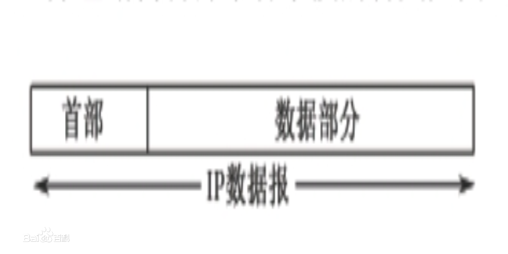

# IP 协议

　　IP 是 Internet Protocol（网络互联协议）的缩写，是 TCP/IP 体系中的网络层协议。设计 IP 的目的是提高网络的可扩展性：一是解决互联网问题，实现大规模、异构网络的互联互通；二是分割顶层网络应用和底层网络技术之间的耦合关系，以利于两者的独立发展。根据端对端的设计原则，IP 只为主机提供一种无连接、不可靠的、尽力而为的数据报传输服务。

## 1. 简介

　　IP 是整个 TCP/IP 协议族的核心，也是构成互联网的基础。IP 位于 TCP/IP 模型的网络层（相当于 OSI 模型的网络层），对上可载送传输层各种协议的信息，例如 TCP、UDP 等；对下可将 IP 信息包放到链路层，通过以太网、令牌环网络等各种技术来传送。

　　为了能适应异构网络，IP 强调适应性、简洁性和可操作性，并在可靠性做了一定的牺牲。IP 不保证分组的交付时限和可靠性，所传送分组可能出现丢失、重复、延迟或乱序等问题。

## 2. 主要内容

　　IP 主要包含三方面内容：IP 编址方案、分组封装格式及分组转发规则。

### 2.1. IP 分组的转发规则

　　路由器仅根据网络地址进行转发。当 IP 数据包经由路由器转发时，如果目标网络与本地路由器直接相连，则直接将数据报交付给目标主机，这称为直接交付；否则，路由器通过路由表查找路由信息，并将数据报转交给指明的下一跳路由器，这称为间接交付。路由器在间接交付中，若路由表中有到达目标网络的路由，则把数据包传送给路由表指明的下一跳路由器；如果没有路由，但路由表中有一个默认路由，则把数据报传送给指明的默认路由器；如果两者都没有，则丢弃数据包并报告错误。

### 2.2. IP 分片

　　一个 IP 包从源主机传输到目标主机可能需要经过多个不同的物理网络。由于各种网络的数据帧都有一个最大传输单元（MTU）的限制，如以太网帧的 MTU 是 1500；因此，当路由器在转发 IP 包时，如果数据包的大小超过了出口链路的最大传输单元时，则会将该 IP 分组分解成很多足够小的片段，以便能够在目标链路上进行传输。这种 IP 分片重新封装一个 IP 包独立传输，并在到大目标主机时才会被重组起来。

### 2.3. IP 分组结构

　　一个 IP 分组由首部和数据两部分组成。首部的前 20 字节是所有 IP 分组必须具备的，也称固定首部。在首部固定部分的后面是一些可选字段，其长度是可变的。

　　IP 分组结构：

### 2.4. IP数据包首部各字段的含义

## 3. 提供的服务

　　IP 所提供的服务大致可归纳为两类：

1. IP 信息包的传送。
2. IP 信息包的分割和重组。

### 3.1. IP 信息包传送

### 3.2. IP 信息包的分割和重组

## 4. IP 信息包的传送方式

## 5. 协议版本

## 6. IP 地址

## 7. IP 传输工作原理

## 8. 重要作用及优势

## 参考文章
1. [IP](https://baike.baidu.com/item/IP/224599)