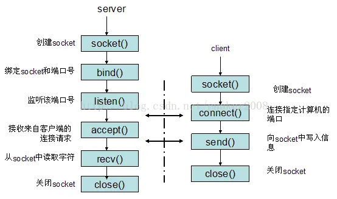
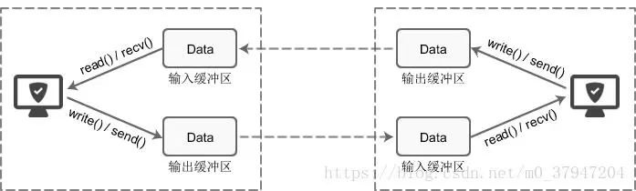

# Socket 常用函数接口详解

　　图解 socket 函数：




　　先从服务器端说起。服务器先初始化 Socket，然后与端口绑定（bind），对端口进行监听（listen），调用 accept 阻塞，等待客户端连接。在这时如果有个客户初始化一个 Socket，然后连接服务器（connect），如果连接成功，这时客户端与服务器端的连接就建立了。客户端发送数据请求，服务器端接收请求并处理请求，然后把回应数据发送给胡端端，客户端读取数据，最后关闭连接，一次交互结束。

## 1. socket()：创建套接字

```c++
// 成功返回非负描述符，失败返回 -1
int socket(int af, int type, int protocol);
```

　　socket 函数对应于普通文件的打开操作。普通文件的打开操作返回一个文件描述字，而 socket() 用于创建一个 socket 描述符（socket descriptor），它唯一标识一个 socket。这个 socket 描述符跟文件描述符一样，后续的操作都有用到它，把它作为参数，通过它来进行一些读写操作。

　　正如可以给 fopen 的传入不同参数值，以打开不同的文件。创建 socket 的时候，也可以指定不同的参数创建不同的 socket 描述符，socket 函数的三个参数分别为：

1. af 即协议域，又称为协议族（Family），也就是 IP 地址类型，常用的有 AF_INET 、AF_INET6、AF_LOCAL（或称 AF_UNIX、Unix 或 socket）、AF_ROUTE 等等。

   AF 是 “Address Family” 的简写，INET 是 “Inetnet” 的简写。

   协议族决定了 socket 的地址类型，在通信中必须采用对应的地址，如 AF_INET 决定了要用 ipv4 地址（32 位的）与端口号（16 位的）的组合，例如 127.0.0.1；AF_INET6 表示 IPv6 地址，例如 1030:C9B4:FF12:48AA:1A2B；AF_UNIX 决定了要用一个绝对路径名作为地址。

   127.0.0.1 是一个特殊 IP 地址，表示本机地址。

2. type ：指定 socket 类型，信息传送方式，也就是数据传输方式，常用的是 SOCK_STREAM 、 SOCK_DGRAM、SOCK_RAW、SOCK_PACKET、SOCK_SEQPACKET 等等。

3. protocol 表示传输协议，常用的有 IPPROTO_TCP 、 IPPROTO_UDP、IPPROTO_SCTP、IPPROTO_TIPC 等，分别表示 TCP 传输协议、UDP 传输协议、STCP 传输协议、TIPC 传输协议，通常为 0，让其自动匹配。

　　注意，并不是上面的 type 和 protocol 可以随意组合的，如 SOCK_STREAM 不可以跟 IPPROTO_UDP 组合。当 protocol 为 0 时，会自动选择 type 类型对应的默认协议。

　　当调用 socket() 创建一个 socket 时，返回的 socket 描述字它存在于协议族（address family，AF_XXX）空间中，但没有一个具体的地址。如果想要给它赋值一个地址，就必须调用 bind() 函数，否则当调用 connect()、listen() 时系统会自动随机分配一个端口。

## 2. bind() ：绑定

　　socket() 函数用来创建套接字，确定套接字的各种属性，然后服务器端要用 bind() 函数将套接字与特定的 IP 地址和端口绑定起来，只有这样，流经该 IP 地址和端口的数据才能交给套接字处理；而客户端要用 connect() 函数建立连接：

```c++
// 返回值：成功则为 0，失败为 -1
int bind(int sock, struct sockaddr *addr, socklen_t addrlen);  
```

　　函数的三个参数分别为：

1. sock：socket 文件描述符，它是通过 socket() 函数创建的，唯一标识一个 socket。bind() 函数就是将这个描述字绑定一个名字。一般服务器才需要绑定，客户端由系统内核解决。

2. addr：一个 const struct sockaddt* 指针，指向要绑定给 sock 的协议地址。这个地址结构根据地址创建 socket 时的地址协议族的不同而不同。所有的协议都有一个功能的结构叫做 const struct sockaddr，不同协议对应不同的具体结构。结构如下：

   ```c++
   struct sockaddr {  
        sa_family_t sin_family;//地址族
   　　  char sa_data[14]; //14字节，包含套接字中的目标地址和端口信息               
   　　 }; 
   ```

   可以看出，端口和目标地址放在同一个数组，不太容易使用。对于不同的协议，会通过另一种特定的结构体来完成初始化，再通过强制类型转换，来使用 bind 函数。

   强制转换第二个地址参数为 const sockaddr*：

   ```c++
   (const sockaddr *)sockaddr_in;
   (const sockaddr *)sockaddr_in6;
   (const sockaddr *)sockaddr_un;
   ```

   ipv4 结构体：

   ```c++
   struct sockaddr_in {
       sa_family_t    sin_family; 
       in_port_t      sin_port;   
       struct in_addr sin_addr;   
   };
   struct in_addr {
       uint32_t       s_addr;     
   };
   ```

   ipv6 结构体：

   ```c++
   struct sockaddr_in6 { 
       sa_family_t     sin6_family;    
       in_port_t       sin6_port;      
       uint32_t        sin6_flowinfo;  
       struct in6_addr sin6_addr;      
       uint32_t        sin6_scope_id;  
   };
   struct in6_addr { 
       unsigned char   s6_addr[16];    
   };
   ```

   Unix 结构体：

   ```c++
   #define UNIX_PATH_MAX    108
   struct sockaddr_un { 
       sa_family_t sun_family;                
       char        sun_path[UNIX_PATH_MAX];   
   };
   ```

3. addrlen：对应的是地址的长度，协议结构体大小，为 addr 变量的大小，可由 sizeof() 计算得出。

　　bind() 函数把一个地址族中的特定地址赋给 socket。

　　通常服务器在启动的时候都会绑定一个众所周知的地址（如 ip 地址 + 端口号），用于提供服务，客户就可以通过它来接连服务器；而客户端就不用指定，有系统自动分配一个端口号和自身的 ip 地址组合。这就是为什么通常服务器端在 listen 之前会调用 bind()，而客户端就不会调用，而是在 connect() 时由系统随机生成一个。

### 2.1. 网络字节序与主机字节序

　　主机字节序就是平常说的大端和小端模式：不同的 CPU 有不同的字节序类型，这些字节序是指整数在内存中保存的顺序，这个叫主机序。引用标准的 Big-Endian 和 Little-Endian 的定义如下：

1. Little-Endian 就是低位字节在内存的低地址端，高位字节排放在内存的高地址端。
2. Big-Endian 就是高位字节排放在内存的低地址端，低位字节排放在内存的高地址端。

　　网络字节序：4 个字节的 32 bit 值以下面的次序传输：首先是 0-7 bit，其次 8~15 bit，然后 16-23 bit，最后是 24~31 bit。这种传输次序称作大端字节序。由于 TCP/IP 首部中所有的二进制整数在网络中传输时都要求以这种次序，因此它又称作网络字节序。字节序，顾名思义字节的顺序，就是大于一个字节类型的数据在内存中的存访顺序，一个字节的数据没有顺序的问题了。

　　所以在将一个地址绑定到 socket 的时候，请先将主机字节序转换成为网络字节序，而不要假定主机字节序跟网络字节序一样使用的是 Big-Endian。有序这个问题会导致很多莫名其妙的问题，所以请谨记对主机字节序不要做任何假定，务必将其转换为网络字节序再赋给 socket。

　　将创建的套接字与 IP 地址 127.0.0.1、端口 1234 绑定：

```c++
//创建套接字
int serv_sock = socket(AF_INET, SOCK_STREAM, IPPROTO_TCP);
//创建sockaddr_in结构体变量
struct sockaddr_in serv_addr;
memset(&serv_addr, 0, sizeof(serv_addr));  //每个字节都用0填充
serv_addr.sin_family = AF_INET;  //使用IPv4地址
serv_addr.sin_addr.s_addr = inet_addr("127.0.0.1");  //具体的IP地址
serv_addr.sin_port = htons(1234);  //端口
//将套接字和IP、端口绑定
bind(serv_sock, (struct sockaddr*)&serv_addr, sizeof(serv_addr));
```

## 3. listen()：进入监听

　　于服务器端程序，使用 bind() 绑定套接字后，还需要使用 listen() 函数让套接字进入被动监听状态。

　　通过 listen() 函数可以让套接字进入被动监听状态，它的原型为：

```c++
// 返回值，成功则为 0，失败为 -1
int listen(int sock, int backlog); 
```

　　sock 为要监听的 socket 描述字，backlog 为相应 socket 可以排队的最大连接个数。socket() 函数创建的 socket 模式是一个主动类型的，listen 函数将 socket 变为被动类型的，等待客户的连接请求。

　　所谓被动监听，是指当没有客户端请求时，套接字处于 “ 睡眠 ” 状态，只有当接收到客户端请求时，套接字才会被 “ 唤醒 ” 来响应请求。

　　请求队列：当套接字正在处理客户端请求时，如果有新的请求进来，套接字是没法处理的，只能把它放进缓冲区，待当前请求处理完毕后，再从缓冲区读取出来处理。如果不断有新的请求进来，它们就按照先来后到的顺序在缓冲区中排队，直到缓冲区满。这个缓冲区，就称为请求队列（Request Queue）。

　　缓冲区的长度（能存放多少个客户端请求）可以通过 listen() 函数的 backlog 参数指定，但究竟为多少并没有什么标准，可以根据需求来定，并发量小的话可以是 10 或者 20。

　　如果将 backlog 的值设置为 SOMAXCONN，就由系统来决定请求队列长度，这个值一般比较大，可能是几百，或者更多。

　　当请求队列满时，就不再接收新的请求，对于 Linux，客户端会收到 ECONNREFUSED 错误。

## 4. connect() ：连接请求

　　connet() 函数用来建立连接，它的原型为：

```java
// 返回值：成功则为 0，失败为 -1
int connect(int sock, struct sockaddr *serv_addr, socklen_t addrlen); 
```

　　在服务器调用 socket()、bind() 之后就会调用 listen() 来监听这个 socket，如果客户端这时调用 connect() 发出连接请求，服务器端就会接收到这个请求。

　　connect() 函数的第一个参数即为客户端的 socket 描述字，第二个参数为服务器的 socket 地址，第三个参数为 socket 地址的长度。客户端通过调用 connect 函数来建立与 TCP 服务器的连接。

## 5. accept() ：接收请求

　　对于服务器端程序，使用 bind() 绑定套接字后，使用 listen() 函数让套接字进入被动监听状态后，还要调用 accept() 函数，这样就可以随时响应客户端的请求了。

　　注意：listen() 只是让套接字处于监听状态，并没有接收请求。接收请求需要使用 accept() 函数。

　　listen() 只是让套接字进入监听状态，并没有真正接收客户端请求，listen() 后面的代码会继续执行，直到遇到 accept()。accept() 会阻塞程序执行（后面代码不能被执行），直到有新的请求到来。

　　TCP 服务器端依次调用 socket()、bind()、listen() 之后，就会监听指定的 socket 地址了。TCP 客户端依次调用 socket()、connect() 之后就向 TCP 服务器发送了一个连接请求。TCP 服务器监听到这个请求之后，就会调用 accept() 函数去接收请求，这样连接就建立好了。之后就开始网络 I/O 操作了，即类同于普通文件的独写 I/O 操作。

　　当套接字处于监听状态时，可以通过 accept() 函数来接收客户端请求。它的原型为：

```c++
int accept(int sock, struct sockaddr *addr, socklen_t *addrlen); 
```

　　accept 函数的第一个参数为服务器的 socket 描述字，第二个参数为指向 struct sockaddr* 的指针，用于返回客户端的协议地址，第三个参数为协议地址的长度，就是参数 addr 的长度，可由 sizeof() 求得。如果 accept 成功，那么其返回值是由内核自动生成的一个全新的描述字，代表与返回客户的 TCP 连接。

　　注意：accept 的第一个参数为服务器的 socket 描述字，是服务器开始调用 socket() 函数成的，称为监听 socket 描述字，而 accept 函数返回的是已连接的 socket 描述字，是由内核自动生成的一个全新的描述字，代表与返回客户的 TCP 连接。后面的读写操作都是根据这个返回值来完成的。一个服务器通常仅仅只创建一个监听 socket 描述字，它在该服务器的生命周期内一直存在。内核为每个由服务器进程接受的客户连接创建了一个已连接 socket 描述字，当服务器完成了对某个客户的服务，相应的已连接 socket 描述字就被关闭。

　　accept() 返回一个新的套接字来和客户端通信，addr 保存了客户端的 IP 地址和端口号，而 sock 是服务器端的套接字。后面和客户端通信时，要使用这个新生成的套接字，而不是原来服务器端的套接字。

## 6. write()/read()： socket 数据的接收和发送

　　调用网络 I/O 进行独写操作，就可以实现网络中不同进程之间的通信！网络 I/O 操作有以下几组：

* read()/write()
* recv()/send()
* readv()/writev()
* recvmsg()/sendmsg()
* recvfrom()/sendto()

　　推荐使用 recvmsg()/sendmsg() 函数，这两个函数是最通用的 I/O 函数，实际上可以把上面的其他函数都替换成这两个函数。它们的声明如下：

```c++
ssize_t read(int fd, void *buf, size_t count);
ssize_t write(int fd, const void *buf, size_t count);

ssize_t send(int sockfd, const void *buf, size_t len, int flags);
ssize_t recv(int sockfd, void *buf, size_t len, int flags);

ssize_t sendto(int sockfd, const void *buf, size_t len, int flags,const struct sockaddr *dest_addr, socklen_t addrlen);
ssize_t recvfrom(int sockfd, void *buf, size_t len, int flags,struct sockaddr *src_addr, socklen_t *addrlen);

ssize_t sendmsg(int sockfd, const struct msghdr *msg, int flags);
ssize_t recvmsg(int sockfd, struct msghdr *msg, int flags);
```

　　read 函数的参数：fd 为要读取的文件的描述符，buf 为要接收数据的缓冲区地址，count 为要读取的数据的字节数。

　　read 函数是负责从 fd 文件中读取 nbytes 个字节并保存到缓存区 buf。当读成功时，read 返回实际所读的字节数，如果返回的值是 0 标识已经读到文件的结束了，小于 0 表示出现了错误。如果错误为 EINTR 说明读是由中断引起的，如果是 ESONNRESE 表示网络连接出了问题。

　　write 函数的参数：fd 为要写入的文件的描述符，buf 为要写入的数据的缓冲区地址，count 为要写入的数据的字节数。

　　write 函数将 buf 中的 nbytes 字节内容写入文件描述符 fd。成功时返回写的字节数，失败时返回 -1，并设置 errno 变量。

　　在网络程序中，向套接字文件描述符写是有两种可能：

1. write 的返回值大于 0，表示写了部分或者是全部的数据。
2. 返回的值小于 0，此时出现了错误。要根据错误类型来处理。如果错误为 EINTR 表示在写的时候出现了中断错误。如果为 EPIPE 表示网络连接出现了问题（对方已经关闭了连接）。

　　Linux 下数据的接收和发送：Linux 不区分套接字文件和普通文件，使用 write() 可以向套接字中写入数据，使用 read() 可以从套接字中读取数据。

　　两台计算机之间的通信相当于两个套接字之间的通信，在服务器端用 write() 向套接字写入数据，客户端就能收到，然后再使用 read() 从套接字中读取出来，就完成了一次通信。

## 7. close() 函数

　　在服务器与客户端建立连接之后，会进行一些读写操作，完成了读写操作就要关闭相应的 socket 描述字，好比操作完打开的文件要调用 fclose 关闭打开的文件。

```c++
int close(int fd);
```

　　close 一个 TCP socket 的其实就是把该 socket 标记关闭，然后立即返回到调用进程。该描述字不能再由调用过程使用，也就是说不能再作为 read 或 write 的第一个参数。

　　注意：close 操作只是使相应 socket 描述字的引用计数 -1，只有当引用计数为 0 的时候，才会触发 TCP 客户端向服务器发送终止连接请求。

## 8. socket 缓冲区以及阻塞模式

　　socket 缓冲区：每个 socket 被创建后，都会分配两个缓冲区，输入缓冲区和输出缓冲区。

　　write()、send() 并不立即向网络中传输数据，而是先将数据写入缓冲区中，再由 TCP 协议将数据从缓冲区发送到目标机器。一旦将数据写入到缓冲区，函数就可以成功返回，不管它们有没有达到目标机器，也不管它们何时被发送到网络，这些都是 TCP 协议负责的事情。

　　TCP 协议独立于 write()、send() 函数，数据有可能刚被写入缓冲区就发送到网络，也可能在缓冲区中不断积压，多次写入的数据被一次性发送到网络，这取决于当前的网络情况、当前线程是否空闲等诸多因素，不由程序员控制。

　read()、recv() 函数也是如此，也从输入缓冲区中读取数据，而不是直接从网络中读取：



　　这些 I/O 缓冲区特性可整理如下：

1. I/O 缓冲区在每个 TCP 套接字中单独存在；
2. I/O 缓冲区在创建套接字时自动生成；
3. 即使关闭套接字也会继续传送输出缓冲区中遗留的数据；
4. 关闭套接字将丢失输入缓冲区中的数据。

　　输入输出缓冲区的默认大小一般都是 8K，可以通过 getsockopt() 函数获取：

```c++
unsigned optVal;
int optLen = sizeof(int);
getsockopt(servSock, SOL_SOCKET, SO_SNDBUF, (char*)&optVal, &optLen);
printf("Buffer length: %d\n", optVal);
```

　　阻塞模式：对于 TCP 套接字（默认情况下），当使用 write()、send() 方法数据时：

1. 首先会检查缓冲区，如果缓冲区的可用空间长度小于要发送的数据，那么 write()、send() 会被阻塞（暂停执行），直到缓冲区中的数据被发送到目标机器，腾出足够的空间，才唤醒 write()、send() 函数继续写入数据。
2. 如果 TCP 协议正在向网络发送数据，那么输出缓冲区会被锁定，不允许写入，write()、send() 也会被阻塞，直到数据发送完毕缓冲区解锁，write()、send() 才会被唤醒。
3. 如果要写入的数据大于缓冲区的最大长度，那么将分批写入。
4. 直到所有数据被写入缓冲区 write()、send() 才能返回。

　　当使用 read()、recv() 读取数据时：

1. 首先会先查缓冲区，如果缓冲区中有数据，那么就读取，否则函数会被阻塞，直到网络上有数据到来。
2. 如果要读取的数据长度小于缓冲区中的数据长度，那么就不能一次性将缓冲区中的所有数据读出，剩余数据将不断积压，直到有 read()、recv() 函数再次读取。
3. 直到读取到数据后 read()、recv() 函数才会返回，否则就一直被阻塞。

　　这就是 TCP 套接字的阻塞模式。所谓阻塞，就是上一步动作没有完成，下一步动作将暂停，直到上一步动作完成后才能继续，以保证同步性。

　　TCP 套接字默认情况下是阻塞模式。

## 9. 参考文章

1. [Socket 技术详解](https://www.jianshu.com/p/066d99da7cbd)
2. [Socket 通信原理](https://www.cnblogs.com/wangcq/p/3520400.html)
4. [Socket 的学习（1）什么是 Socket？](https://blog.csdn.net/weixin_39258979/article/details/80835555)