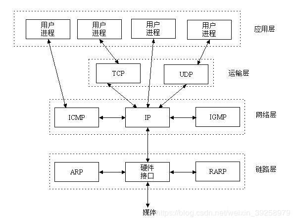
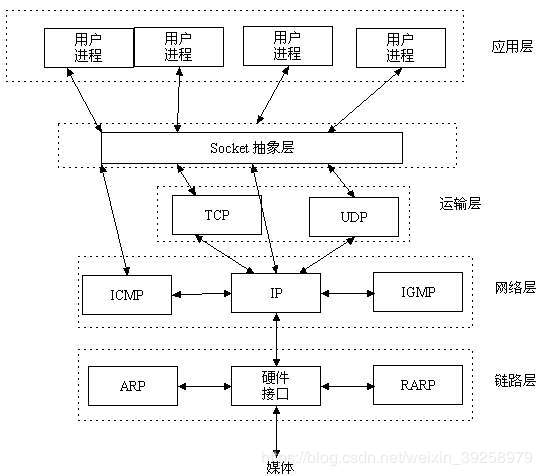
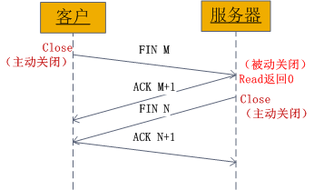

# Socket 知识

## 1. TCP/IP是什么？

　　TCP/IP（Transmission Control Protocol/Internet Protocol）即传输控制协议/网间协议，是一个工业标准的协议集，它为广域网（WANs）设计的。UDP （User Data Protocol，用户数据报协议）是与 TCP 相对应的协议。它是属于 TCP/IP 协议族中的一种。下面是它们三者的关系：

　　可以看出 TCP/IP 协议族包括运输层、网络层、链路层。而 socket 是一个接口，在用户进程与 TCP/IP 协议之间充当中间人，完成 TCP/IP 协议的书写，用户只需要理解接口即可。

## 2. 什么是 Socket

　　在计算机通信领域，socket 被翻译为 “ 套接字 ”，它是计算机之间进行通信的一种约定或一种方式。通过 socket 这种约定，一台计算机可以接收其他计算机的数据，也可以向其他计算机发送数据。

　　socket 起源于 Unix，而 Unix/Linux 基本哲学之一就是 “ 一切皆文件 ”，都可以用 " 打开 open -> 读写 write/read -> 关闭 close " 模式来操作。

　　Socket 就是该模式的一种实现：即 socket 是一种特殊的文件，一些 sockte 函数就是对其进行的操作（读/写 IO、打开、关闭）。

　　Sokcet() 函数返回一个整型的 Socket 描述符，随后的连接建立、数据传输等操作都是通过该 Sokcet 实现的。

　　Socket 是应用层与 TCP/IP 协议族通信的中间软件抽象层，它是一组接口。在设计模式中，Socket 其实就一个门面模式，它把复杂的 TCP/IP 协议族隐藏在 Socket 接口后面，对用户来说，一组简单的接口就是全部，让 Socket 去组织数据，以符合指定的协议。

## 3. 网络中进程如何通信

　　既然 Sokcet 主要是用来解决网络通信的，那么就来理解网络中进程是如何通信的。

### 3.1. 本地进程间通信

1. 消息传递（管道、消息队列、FIFO）
2. 同步（互斥量、条件变量、读写锁、文件和写记录锁、信号量）
3. 共享内存（匿名的和具名的，eg:channel）
4. 远程过程调用（RPC）

### 3.2. 网络中进程如何通信

　　要理解网络中进程如何通信，得解决两个问题：

1. 要如何标识一台主机，即怎样确定将要通信的进程是在那一台主机上运行。
2. 要如何标识唯一进程，本地通过 pid 标识，网络中应该怎样标识？

　　解决方法：

1. TCP/IP 协议族已经解决了这个问题，网络层的 “ ip 地址 ” 可以唯一标识网络中的主机。
2. 传输层的 “ 协议+端口 ” 可以唯一标识主机中的应用程序（进程），因此，利用三元组（ ip 地址、协议、端口 ）就可以标识网络的进程了，网络中的进程通信就可以利用这个标志与其他进程进行交互。

## 4. Socket 怎么通信

　　利用三元组【 ip 地址，协议，端口 】可以进行网络通信了，而 Socket 就是利用三元组解决网络通信的一个中间件工具，就目前而言，几乎所有的应用程序都是采用 socket，如 UNIX BSD 的套接字（socket）和 UNIX System V 的 TLI（已经被淘汰了）。

　　Socket 通信的数据传输方式，常用的有两种：

1. SOCK_STREAM：表示面向连接的数据传输方式。数据可以准确无误地到达另一台计算机，如果损坏或丢失，可以重新发送，但效率相对较慢。常用的 http 协议就是用 SOCK_STREAM 传输数据，因为要确保数据的正确性，否则网页不能正常解析。
2. SOCK_DGRAM：表示无连接的数据传输方式。计算机只管传输数据，不做数据校验，如果数据在传输中损坏，或者没有达到另一台计算机，是没有办法补救的。也就是说，数据错了就错了，无法重传。因为 SOCK_DGRAM 所做的校验工作少，所以效率比 SOCK_STREAM 高。

　　例如：QQ 视频聊天和语音聊天就是用 SOCK_DGRAM 传输数据，因为首先要保证通信的效率，尽量减少延迟，而数据的正确性是次要的，即使丢失很小的一部分数据，视频和音频也可以正常解析，最多出现噪点或杂音，不会对通信质量有实质的影响。

## 5. Socket 常用函数接口

　　图解 socket 函数：

　　先从服务器端说起，服务器先初始化 Socket，然后与端口绑定（bind），对端口进行监听（listen），调用 accept 阻塞，等待客户端连接。在这时如果有个客户初始化一个 Socket，然后连接服务器（connect），如果连接成功，这是客户端与服务器端的连接就建立了。客户端发送数据请求，服务器端接收请求并处理请求，然后把回应数据发送给客户端，客户端读取数据，最后关闭连接，一次交互结束。

## 6. Socket 中 TCP 的三次握手建立连接详解

　　TCP 建立连接要进行 “ 三次握手 ”，即交换三个分组。大致流程如下：

* 客户端向服务器发送一个 SYN J；
* 服务器向客户端响应一个 SYN K，并对 SYN J 进行确认 ACK J+1；
* 客户端再向服务器发一个确认 ACK K+1。

　　这样就完成了三次握手，而这个三次握手发生在 socket 的几个函数如下：

　　从图中可以看出，当客户端调用 connect 时，触发了连接请求，向服务器发送了 SYN J 包，这时 connect 进入阻塞状态；服务器监听到连接请求，即收到 SYN J 包，调用 accept 函数接收请求向客户端发送 SYN K，ACK J+1，这时 accept 进入阻塞状态；客户端收到服务器的 SYN K、ACK J+1 之后，这时 connect 返回，并对 SYN K 进行确认；服务器收到 ACK K+1 时，accept 返回，至此三次握手完毕，连接建立。

　　总结：客户端的 connect 在三次握手的第二次返回，而服务器端的 accept 在三次握手的第三次返回。

## 7. socket 中 TCP 的四次握手释放连接详解

　　socket 中的四次挥手释放连接的过程，如下图：

 

　　图示过程如下：

1. 某个应用进程首先调用 close 主动关闭连接，这时 TCP 发送一个 FIN M。
2. 另一端接收到 FIN M 之后，执行被动关闭，发送 ACK M+1 对这个 FIN 进行确认。它的接收也作为文件结束符传递给应用进程，因为 FIN 的接收意味着应用进程在相应的连接上再也接收不到额外数据。
3. 一段时间之后，接收到文件结束符的应用进程调用 close 关闭它的 socket。这导致它的 TCP 也发送一个 FIN N。
4. 接收到这个 FIN 的原发送端 TCP 对它进行确认。

　　这样每个方向上都有一个 FIN 和 ACK。

## 8. 参考文章

1. [Socket 技术详解](https://www.jianshu.com/p/066d99da7cbd)
2. [Socket 通信原理](https://www.cnblogs.com/wangcq/p/3520400.html)
4. [Socket 的学习（1）什么是 Socket？](https://blog.csdn.net/weixin_39258979/article/details/80835555)