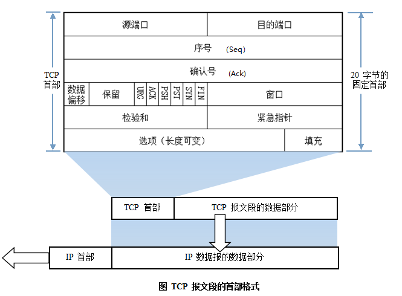

# TCP 与 UDP

## 1. TCP 协议

　　TCP （Transmission Control Protocal，传输控制协议）是面向连接、可靠的、基于字节流的通信协议，数据在传输前通过三次握手建立连接，传输完成后要断开连接，由于 TCP 是面向连接的所以只能用于端到端的通讯。

　　TCP 提供的是一种可靠的数据流服务，采用 “ 带重传的肯定确认 ” 技术来实现传输的可靠性，在收发时候时，都需要与对面建立可靠的连接。TCP 还采用一种称为 “ 滑动窗口 ” 的方式进行流量控制，所谓窗口实际表示接收能力，用以限制发送方的发送速度。

　　客户端在收发数据前要使用 connect() 函数和服务器建立连接。建立连接的目的是保证 IP 地址、端口、物理链路等正确无误，为数据的传输开辟通道。

　　TCP 报文首部格式：

1. 序号：Seq（Sequence Number）序号占 32 位，用来标识从计算机 A 发送到计算机 B 的数据包的序号，计算机发送数据时对此进行标记。
2. 确认号：Ack（Acknowledge Number）确认号占 32 位，客户端和服务器端都可以发送，Ack = Seq + 1。
3. 标志位：每个标志位占用 1 Bit，共有 6 个，分别为 URG、ACK、PSH、RST、SYN、FIN，具体含义如下：
   * URG：紧急指针（urgent pointer）有效。
   * ACK：确认序号有效。
   * PSH：接收方应该尽快将这个报文交给应用层。
   * RST：重置连接。
   * SYN：建立一个新连接。
   * FIN：断开一个连接。

　　TCP 协议的三次握手和四次挥手：

　　注：seq：“ sequance ” 序列号；ack：" acknowledge " 确认号；SYN：“ synchronize ” 请求同步标志；ACK：“ acknowledge ” 确认标志；FIN：" Finally " 结束标志。

### 1.1. 三次握手

　　三次握手（Three-way Handshaking）：建立一个 TCP 连接时，需要客户端和服务端总共发送 3 个包以确认连接的建立，在 Socket 编程中，这一过程由客户端执行 connect 来发起，具体流程图如下：

1. 第一次握手：TCP 协议会组建一个数据包，并将标志位 SYN 置为 1，标识该数据包是用来建立同步连接的。同时生成一个随机数字 J，填充 “ 序号（Seq）” 字段  Seq= J，标识该数据包的序号。完成这些工作，将该数据包发送给服务器端，客户端就进入了 SYN_SEND 状态，等待 Server 确认。

2. 第二次握手：服务器收到数据包，检测到已经设置了 SYN 标志位，就知道这是客户端发来的建立连接的 “ 请求包 ”。服务器端也会组建一个数据包，并将标志位 SYN 和 ACK 置为 1，填充序号字段 Ack = J+1，随机产生一个值 Seq = K，并将数据包发送给 Client 已确认连接请求，Server 进入 SYN_RECV 状态，并为这次连接分配资源。

   SYN 标识该数据包用来建立连接，ACK 用来确认收到了刚才客户端发送的数据包。

3. 第三次握手：客户端收到数据包，检测到已经设置了 SYN 和 ACK 标志位，就知道这是服务器发来的 “ 确认包 ”。客户端会检测 “ 确认号（Ack）” 字段，看它的值是否为 J+1，如果是就说明连接建立成功，接着，客户端会继续组建数据包，并将标志位 ACK 设置为 1，表示客户端正确接收了服务器发来的 “ 确认包 ”。同时，将刚才服务器发来的数据包序号 K 加 1，用这个数字来填充 “确认号（Ack）” 字段。最后客户端将数据包发出，进入 ESTABLISED 状态，并分配资源，表示连接已经成功建立。

   服务器端收到数据包，检测到已经设置了 ACK 标志位，就知道这是客户端发来的 “ 确认包 ”。服务器会检测 “ 确认号（Ack）” 字段，看它的值是否为 K + 1，如果是就说明连接连接成功，服务器进入 ESTABLISED 状态。

　　至此，客户端和服务器都进入了 ESTABLISED 状态，完成了三次握手，连接建立成功，接下来客户端和服务器之间就可以传输数据了。

#### 1.1.1. 为什么要三次握手

　　三次握手就是为了防止已失效的连接请求报文段突然又传送到了服务端，因而产生错误。

　　比如：client 发出的第一个连接请求报文段并没有丢失，而是在某个网络节点长时间的滞留了，以致延误到连接释放以后的某个时间才到达Server。本来这是一个早已失效的报文段，但是 server 收到此失效的连接请求报文段后，就误认为是 client 再次发出的一个新的连接请求，于是就向 client 发出确认报文段，同意建立连接。假设不采用 “ 三次握手 ”，那么只要 server 发出确认，新的连接就建立了，由于 client  并没有发出建立连接的请求，因此不理睬 server 的确认，也不会向 server 发送数据，但 server 却认为新的传输连接已经建立，并一直等待 client 发来数据。所以没有采用 “三次握手”，这种情况下 server 的很多资源就白白浪费掉了。

### 1.2. 四次挥手

　　建立连接非常重要，它是数据正确传输的前提；断开连接同样重要，它让计算机释放不再使用的资源。如果连接不能正常断开，不仅会造成数据传输错误，还会导致套接字不能关闭，持续占用资源，如果并发量高，服务器压力堪忧。

　　四次挥手：终止 TCP 连接，就是指断开一个 TCP 连接时，需要客户算和服务端总共发送 4 个包以确认连接的断开。在 Socket 编程中，这一过程由客户端或服务端任一方执行 close 来触发，具体流程图如下：

　　建立连接后，客户端和服务器都处于 ESTABLISED 状态。这时，假设客户端发起断开连接请求：

1. 第一次挥手：客户端向服务器发送 FIN 数据包，用来关闭客户端到服务器的数据发送，客户端进入 FIN_WAIT_1 状态。

   FIN 是 Finish 的缩写，表示完成任务需要断开连接。

2. 第二次挥手：服务器收到数据包后，检测到设置了 FIN 标志位，知道要断开连接，于是向客户端发送 “ 确认包 ”，确认包设置标志位 ACK 为 1，确认序号为收到序号+1（与 SYN 相同，一个 FIN 占用一个序号），服务器进入 LAST_ACK 状态。

   注意：服务器收到请求后并不是立即断开连接，而是先向客户端发送 “ 确认包 ”，告诉它知道了，需要准备一下才能断开连接。 

   这时服务器还是可以继续向客户端发送数据的。

   客户端收到 “ 确认包 ” 后进入 FIN_WAIT_2 状态，等待服务器准备完毕后发送 FIN 数据包。

3. 第三次挥手：等待片刻后，服务器准备完毕，可以断开连接，于是再主动向客户端发送 FIN 包，用于关闭服务器到客户端的数据传送，然后进入 LAST_ACK 状态。

4. 第四次挥手：客户端收到服务器的 FIN 包后，会再向服务器发送 ACK 包，确认序号为收到序号+1，告诉服务器断开连接吧，客户端然后进入 TIME_WAIT 状态。

   服务器收到客户端的 ACK 包后，就断开连接，关闭套接字，进入 CLOSED 状态，完成四次挥手。

　　另外也可能是同时发起主动关闭的情况：

#### 1.2.1. 为什么要四次挥手

　　试想一下，加入现在客户端想断开跟 Server 的所有连接该怎么做？第一步，先停止向 Server 端发送数据，并等待 Server 的回复。但事情还没完，虽然 Client 不往 Server 发送数据了但是因为之前已经建立好平等的连接了，所以此时 Server 也有主动权向 Client 发送数据，故 Server 端还得终止主动向 Client 发送数据，并等待 Client 的确认。其实就是保证双方的一个合约的完整执行。

#### 1.2.2. 为什么连接是三次握手，而关闭连接却是四次挥手

　　因为服务器在 LISTEN 状态下，收到建立连接请求的 SYN 报文后，把 ACK 和 SYN 放在一个报文里发送给客户端。而关闭连接时，当收到对方的 FIN 报文时，仅仅标识对方不再发送数据了但是还能接收数据，服务器也未必全部数据都发送给对方了，所以服务器可以立即 close，也可以发送一些数据给对方后，再发送 FIN 报文给对方来表示同意现在关闭连接，因此，服务器 ACK 和 FIN 一般都会分开发送。

#### 1.2.3. 关于 TIME_WAIT 状态的说明

　　客户端最后一次发送 ACK 包后进入 TIME_WAIT 状态，而不是直接进入 CLOSED 状态关闭连接，这是为什么呢？

　　TCP 是面向连接的传输方式，必须保证数据能够正确到达目标机器，不能丢失或出错，而网络是不稳定的，随时可能会毁坏数据，所以机器 A 每次向机器 B 发送数据包后，都要求机器 B “ 确认 ”，回传 ACK 包，告诉机器 A 收到了，这样机器 A 才能知道数据传送成功了。如果机器 B 没有回传 ACK 包，机器 A 会重新发送，直到机器 B 回传 ACK 包。

　　客户端最后一次向服务器回传 ACK 包时，有可能会因为网络问题导致服务器收不到，服务器会再次发送 FIN 包，如果这时客户端完全关闭了连接，那么服务器无论如何也收不到 ACK 包了，所以客户端需要等待片刻、确认对方收到 ACK 包后才能进入 CLOSED 状态，TCP 连接就关闭了。那么，要等待多久呢？

　　数据包在网络中是有生存时间的，超过这个时间还未到达目标主机就会被丢弃，并通知源主机。这称为报文最大生存时间（MSL，Maximum Segment Lifetime）。TIME_WAIT 要等待 2MSL 才会进入  CLOSED 状态。ACK 包到达服务器需要 MSL 时间，服务器重传 FIN 包也需要 MSL 时间，2MSL 是数据报往返的最大时间，如果 2MSL 后还未收到服务器重传的 FIN 包，就说明服务器已经收到了 ACK 包。

### 1.5. 使用 TCP 的协议

　　使用 TCP 的协议：FTP （文件传输协议）、Telnet（远程登录协议）、SMTP（简单邮件传输协议）、POP3（和 SMTP 协议，用于接收邮件）、HTTP 协议等。

## 2. UDP 协议

　　UDP（User Datagram Protocol） 用户数据报协议，是面向无连接的通讯协议，传输数据之前源端和终端不建立连接，所以可以实现广播发送。当它想传送时就简单地去抓取来自应用程序的数据，并尽可能快地把它扔到网络上。

　　在发送端，UDP 传送数据地速度仅仅是受应用程序生成数据的速度、计算机的能力和传输带宽的限制，在接收端，UDP 把每个消息段放在队列中，应用程序每次从队列中读一个消息段。

　　相比 TCP，UDP 通讯时不需要接收方确认，也无需建立连接，属于不可靠的传输，结构简单，但是无法保证正确性，可能会出现丢包现象，实际应用中要求程序员编码验证。

　　UDP 和 TCP 位于同一层，但它不管数据包的顺序、错误或重发。因此，UDP 不被应用于那些使用虚电路的面向连接的服务，UDP 主要用于那些面向查询-应答的服务，例如 NFS，相对于 FTP 或 Telent，这些服务需要交换的信息量较小。

　　每个 UDP 报文分 UDP 报头和 UDP 数据区两部分。UDP 报头由 4 个域组成，其中每个域个占用 2 个字节（16 位），具体如下：

1. 源端口号
2. 目的端口号
3. 数据报长度
4. 校验值

### 2.1. 使用 UDP 的协议

　　使用 UDP 协议包括：TETP（简单文件传输协议）、SNMP（简单网络管理协议）、DNS（域名解析协议）、NFS、BOOTP。

## 3. TCP 与 UDP 的区别

1. TCP 是面向连接的，可靠的字节流服务；
2. UDP 是面向无连接的，不可靠的数据报服务。　　

## 4. 参考文章

1. [计算机网络基础知识总结](https://www.runoob.com/w3cnote/summary-of-network.html)
2. [Socket 技术详解](https://www.jianshu.com/p/066d99da7cbd)