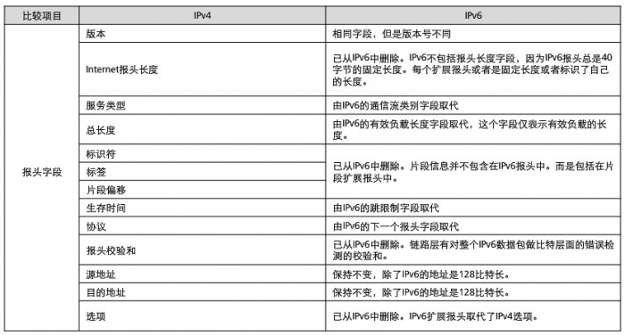

# 网络常见问题

### 1. GET 和 POST 的区别，还有哪些其他请求？

#### 1.1. GET 和 POST 的区别

1. GET 方法用于信息获取，它对于数据库方面是安全的（没有修改信息），而 POST 方法是用于修改服务器上资源的请求。
2. GET 请求的数据会附在 URL 之后，而 POST 方法提交的数据则放置在 HTTP 报文实体的实体中，所以 POST 方法的安全性比 GET 方法要高。
3. GET 方法传输的数据量一般限制在 2 KB，其原因在于：GET 式通过 URL 提交数据，而 URL 本身对数据没有限制，但是不同的浏览器对于 URL 是有限制的，真正的限制取决于操作系统本身；而 POST 方法对于数据大小是无限制的，真正影响到数据大小的是服务器处理程序的能力。

#### 1.2. 其他请求

1. GET：请求指定的页面信息，并返回实体主体。
2. HEAD：类似于 GET 请求，只不过返回的响应中没有具体的内容，用于获取报头。
3. POST：向指定资源提交数据进行处理请求（例如提交表单或者上传文件）。数据被包含在请求体中。POST 请求可能会导致新的资源的建立或已有资源的修改。
4. PUT：从客户端向服务器传送的数据取代指定的文档的内容。
5. DELETE：请求服务器删除指定的页面。
6. CONNECT：要求用隧道协议连接代理。
7. OPTIONS：询问支持的方法，允许客户端查看服务器性能。用于查询针对请求 URL 指定资源支持的方法（客户端询问服务器可以提交哪些请求方法）。
8. TRACE：追踪路径，回显服务器收到的请求，主要用于测试或诊断。
9. PATCH：是对 PUT 方法的补充，用于已知资源进行局部更新。

### 2. HTTP 和 HTTPS 的区别

1. HTTP 是超文本传输协议，信息是明文传输，数据都是未加密的，安全性较差，连接很简单，是无状态的；HTTPS 协议是由 SSL+HTTP 协议构建的具有安全性的传输协议，数据传输过程是加密的，安全性较好。
2. HTTP 使用的端口是 80，HTTPS 使用的端口是 443。
3. HTTP 页面响应速度比 HTTPS 快，主要是因为 HTTP 使用 TCP 三次握手建立连接，客户端和服务器需要交换 3 个包，而 HTTPS 除了 TCP 的三个包，还要加上 ssl 握手需要的 9 个包，所以一共是 12 个包。
4. HTTPS 其实就是建构在 SSL/TLS 之上的 HTTP 协议，所以，HTTPS 要比 HTTP 更耗费服务器资源。
5. 使用 HTTPS 协议需要到 CA（Certificate Authority，数字证书认证机构）申请证书，一般免费证书很少，因此需要一定费用。

### 3. IPv4 和 IPv6 的区别，特点

　　IPv4 和 IPv6 都属于 “互联网协议”。

　　IP 地址有两个标准：IP 版本 4（IPv4）和 IP 版本 6（IPv6）。所有有 IP 地址的计算机都有 IPv4 地址，许多机器也开始使用新的 IPv6 地址系统。

　　IPv4 是互联网协议（Internet Protocol，IP）的第四版。IPv6 是 互联网协议（Internet Protocol，IP）的第六版，IPv6 是 IETF（互联网工作任务组，Internet Engineering Task Force）设计的用于替代现行版本 IP 协议（IPv4）的下一代 IP 协议。

　　IPv4 头结构：

　　IPv6 头结构：

#### 3.1. IPv4 和 IPv6 头部对比

#### 3.2. IPv4 和 IPv6 的区别 

1. IPv6 的地址空间更大。

   （1）IPv4 中规定 IP 地址长度为 32，即有 2^32 -1 个地址。

   （2）IPv6 中 IP 地址的长度为 128，即有 2^128 -1 个地址。

2. IPv6 的路由表更小。

   IPv6 的地址一开始就遵循聚类（Aggregation）的原则，这可使路由器能在路由表中，用一条记录标识一片子网。大大减少了路由器中路由表的长度，提高了路由器转发数据包的速度。

3. IPv6 增强了组播（Multicast）支持以及对流的控制（Flow Control）。

   这使得网络上的多媒体应用有了长足发展的机会，为服务质量控制（Qos，Quality of Service）提供了良好的网络平台。

4. IPv6 加入了对自动配置（Auto Configuration）的支持。

   这是对 DHCP（动态主机配置协议，用于动态获取 IP 地址及其他配置信息） 协议的改进和扩展，使得网络（尤其是局域网）的管理更加方便和快捷。

5. IPv6 具有更高的安全性。

   在使用 IPv6 网络中，用户可以对网络层的数据进行加密并对 IP 报文进行校验，这极大地增强了网络安全。

6. IPv6 允许协议扩充。

7. IPv6 使用新的头部格式，简化和加速了路由选择过程，因为大多数的现象不需要由路由选择。

### 4. TCP 三次握手和四次挥手

#### 4.1. 三次握手

1. 第一次握手：TCP 协议会组建一个数据包，并将标志位 SYN 置为 1，标识该数据包是用来建立同步连接的。同时生成一个随机数字 J，填充 ” 序号（Seq）“ 字段 Seq = J，标识该数据包的序号。完成这些工作，将该数据包发送给服务器端，客户端就进入了 SYN_SEND 状态，等待 Server 确认。

2. 第二次握手：服务器收到数据包，检测到已经设置了 SYN 标志位，就知道这是客户端发来的建立连接的 ”请求包“。服务器端也会组建一个数据包，并将标志位 SYN 和 ACK 置为 1，填充序号字段 Ack = J+1，随机产生一个值 Seq = K，并将数据包发送给 Client 以确认连接请求，Server 进入 SYN_RECV 状态。

   SYN 标识该数据包用来建立连接，ACK 用来确认收到了刚才客户端发送的数据包。

3. 第三次握手：客户端收到数据包，检测到已经设置了 SYN 和 ACK 标志位，就知道这是服务器发来的 ” 确认包 “。客户端会检测 ” 确认号（Ack）“ 字段，看它的值是否为 J+1，如果是就说明连接建立成功，接着，客户端会继续组建数据包，并将标志位 ACK 设置为 1，标识客户端正确接受了服务器发来的 ” 确认号 “。同时，将刚才服务器发来的数据包序号 K 加 1，用这个数字来填充 ” 确认号（Ack） “ 字段。最后客户端将数据包发出，进入 ESTABLISED 状态，并分配资源，标识连接已经成功建立。

   服务端收到数据包，检测到已经设置了 ACK 标志位，就知道这是客户端发来的 ” 确认包 “。服务器会检测 ” 确认号（Ack）“ 字段，看它的值是否为 K+1，如果是就说明连接成功，服务器进入 ESTABLISED 状态。

　　至此，客户端和服务器都进入了 ESTABLISED 状态，完成了三次握手，连接建立成功，接下来客户端和服务器之间就可以传输数据了。

##### 4.1.1. 为什么是三次握手

　　三次握手是为了防止已失效的连接请求报文段突然又传送到服务端，因此产生错误。

　　比如：client 发出的第一个连接请求报文段并没有丢失，而是在某个网络节点长时间的滞留了，以致延误到连接释放以后的某个时间才到达 Server。本来这是一个早已失效的报文段，但是 server 收到此失效的连接请求报文段后，就误认为是 client 再次发出的一个新的连接请求，于是就向 client 发出确认报文段，同意建立连接。假设不采用 “ 三次握手 ”，那么只要 server 发出确认，新的连接就建立了，由于 client 并没有发出建立连接的请求，因此不理睬 server 的确认，也不会向 server 发送数据，但 server 却认为新的传输连接已经建立，并一直等待 client 发来数据。所以没有采用 “ 三次握手 ”，这种情况下 server 的很多资源就白白浪费掉了。

#### 4.2. 四次挥手

1. 第一次挥手：客户端向服务器发送 FIN 数据包，设置 FIN 标志位，序号为 M，用来关闭客户端到服务器的数据发送，客户端进入 FIN_WAIT_1 状态。

   FIN 是 Finish 的缩写，表示完成任务需要断开连接。

2. 第二次挥手：服务器收到数据包后，检测到设置了 FIN 标志位，知道要断开连接，于是向客户端发送 “ 确认包 ”，确认包设置标志位 ACK 为 1，确认序号为 M+1，服务器进入 CLOSED_WAIT 状态。

   注意：服务器收到 FIN 请求后并不是立即断开连接，而是先向客户端发送 “ 确认包 ”，告诉客户端知道了，需要准备一下才能断开连接。

   客户端收到 “ 确认包 ” 后进入 FIN_WAIT_2 状态，等待服务器准备完毕后发送 FIN 数据包。

   这个时候服务器还是可以向客户端发送数据的。客户端也是会接收服务器发送来的数据，但是客户端不会再向服务器发送数据。

3. 第三次挥手：等待片刻后，服务器准备完毕，可以断开连接，于是再主动向客户端发送 FIN 包，设置标志位 FIN，序号为 N，用于关闭服务器到客户端的数据传送，然后进入 LAST_ACK 状态。

4. 第四次挥手：客户端收到服务器的 FIN 包后，会再向服务器发送 ACK 包，确认序号为 N+1，告诉服务器断开连接，客户端进入 TIME_WAIR 状态。

   服务器收到客户端的 ACK 包后，就断开连接，关闭套接字，进入 CLOSED 状态，完成四次挥手。

   而客户端在等待 2MSL(报文最大生存时间) 后没有再次收到服务器发来的 FIN 消息（如果服务器没有收到客户端的确认包，就会重传），就会关闭连接，进入 CLOSED 状态。

#### 4.2.1. 为什么是四次挥手

　　因为在客户端向服务器发送 FIN 报文时，仅仅标识对象不再发送数据了但是还能接收数据，服务器也未必全部数据都发送给对方了，也可能还有部分数据需要发送，所以需要等待服务器将数据发送完毕，再发送 FIN 报文给客户端表示服务器数据也发送完了，这时客户端和服务器才可以关闭连接。

### 5. TCP 和 UDP 是什么？区别？

1. TCP 是传输控制协议，UDP 是用户数据报协议。

2. TCP 是面向连接的、可靠的、基于字节流的通信协议，数据在传输前通过三次握手建立连接，传输完成后要四次挥手断开连接；UDP 是面向无连接的通信协议，传输数据之前源端和终端不建立连接，在通讯时不需要接收方确认，属于不可靠的传输，无法保证正确性，可能会出现丢包现象。
3. TCP 是面向连接的，只能用于一对一的通讯；UDP 可以用于一对多、多对多的通讯。

### 6. 四层协议分别是什么？以及说明具有代表性的协议？

1. 应用层：包括所有的高层协议，不断增加新的协议。

   DNS：域名解析协议，通过用户友好的名称查找其对应的 IP 地址。

   HTTP：超文本传输协议，互联网上应用最为广泛的一种网络协议。

   DHCP：动态主机设置协议，是一个局域网的网络协议，使用 UDP 协议工作，主要有两个用途：给内部网络或网络服务供应商自动分配 IP 地址，给用户或者内部网络管理员作为对所有计算机做中央管理的手段。

2. 传输层：负责进程中端对端通信。

   TCP：传输控制协议，一种面向连接、可靠的、基于字节流的通信协议，通过三次握手建立连接，通讯完成时通过四次挥手断开连接。

   UDP：用户数据报协议，是面向无连接的通信协议。

3. 网络层：服务把报文分组发送到目的主机（1. 处理来自传输层的发送请求，2.处理接收的数据，3.处理互联的路径、流控和拥塞问题）

   IP：因特网互联协议，为上可载送传输层各种协议的信息，例如 TCP、UDP 等，对下可将 IP 信息包放到链路层，通过以太网、令牌环网络等各种技术来传送。设计 IP 的目的是提供网络的可扩展性：1.解决互联网问题，实现大规模、异构网络的互联互通；2.分割顶层网络应用和底层网络技术之间的耦合关系，以利于两者的独立发展。IP 为主机提供一种无连接、不可靠的、尽力而为的数据报传输服务。

   ARP：地址解析协议，根据 IP 地址获取物理地址的一个 TCP/IP 协议。

   RARP：逆地址解析协议，将局域网中某个已知的物理地址转换为 IP 地址。

4. 网络接口层：负责通过网络发送数据和接收 IP 报文。

   各种物理网协议，如 FDDI、PPP 、PPPOE等。

   PPP 协议：用于通过拨号或专线方式建立点对点连接发送数据，使其成为各种主机、网桥和路由器之间简单连接的一种共通的解决方案。

   PPPOE 协议：实现出传统以太网不能提供的身份验证、加密以及压缩等功能，也可用于缆线调制解调器（cable modem）和数字用户线路（DSL）等以以太网协议向用户提供接入服务的协议体系。

   FDDI 协议：光纤分布式数据接口（Fiber Distributed Data Interface，缩写 FDDI）是美国国家标准学会指定的在光缆网络上发送数字和音频信号的一组协议。是光纤数据在 200 公里内局域网内传输的标准。FDDI 协议基于令牌环协议。不但可以支持长距离传输，而且还支持多用户。

### 7. 一次网络请求的过程

　　大概经历了域名解析、TCP的三次握手、建立 TCP 连接后发起 HTTP 请求、服务器响应 HTTP 请求、浏览器解析 html 代码，同时请求 html 代码中的资源（如 js、css、图片等）、最后浏览器对页面进行渲染并呈现给用户。

#### 7.1. 域名解析

　　以 Chrome 浏览器为例，Chrome 会解析域名对应的 IP 地址。

1. Chrome 浏览器会首先搜索浏览器自身的 DNS 缓存（可以使用 chrome://net-internals/#dns 来进行查看），浏览器自身的 DNS 缓存有效期比较短，且容纳有限，大概是 1000 条。如果自身的缓存中存在 blog.csdn.net 对应的 IP 地址并且没有过期，则解析成功。
2. 如果 1 中未找到，那么 Chrome 会搜索操作系统自身的 DNS 缓存（可以在命令行下使用 ipconfig /displaydns 查看）。如果找到且没有过期则成功。
3. 如果 2 中未找到，那么尝试读取位于 C:\Windows\System32\drivers\etc 下的 hosts 文件，如果找到对应的 IP 地址则解析成功。
4. 如果 3 中未找到。浏览器首先会找 TCP/IP 参数中设置的本地 DNS 服务器，如果要查询的域名包含在本地配置的区域资源中，则完成域名解析，否则根据本地 DNS 服务器会请求根 DNS 服务器。
5. 本地 DNS 会把请求发至 13 台根 DNS，根 DNS 服务器收到请求后会返回负责这个域名（.net）的服务器的一个 IP，本地 DNS 服务器使用该 IP 信息联系负责 .net 域的这台服务器。这台负责 .net 域的服务器收到请求后，如果自己无法解析，会返回 .net 域的下一级 DNS 服务器地址（blog.csdn.net）给本地 DNS 服务器。以此类推，直至找到。

#### 7.2. TCP 的三次握手

　　HTTP 是基于 TCP 的，在传送数据之前会通过三次握手浏览器和服务器建立连接。

#### 7.3. 建立 TCP 连接后发起 HTTP 请求

　　TCP 三次握手建立连接成功后，客户端按照指定的格式开始向服务端发送 HTTP 请求，服务端接收请求后，解析 HTTP 请求，处理完业务逻辑，最后返回一个具有标准格式的 HTTP 响应给客户端。

##### 7.3.1. HTTP 请求格式

　　HTTP 请求格式由四部分组成，分别是请求行、请求头、空行、消息体，每部分内容占一行。

　　请求行：由三部分组成，分别是请求方法（GET/POST/DELETE/PUT/HEAD）、URI 路径、HTTP 版本号。

　　请求头：缓存相关信息（Cache-Control，If-Modified-Since）、客户端身份信息（User-Agent）等键值对信息。

　　空行。

　　主体：客户端发给服务端的请求数据，这部分数据并不是每个请求必须的。

##### 7.3.2. 服务器响应 HTTP 请求

　　服务器接收处理完请求后返回一个 HTTP 响应消息给客户端。HTTP 响应消息的格式包括：状态行、响应头、空行、消息体。每部分内容占一行。

　　状态行：有 HTTP 协议版本号、状态码和状态说明三部分构成。

　　响应头：用于说明数据的一些信息，比如数据类型、内容长度等键值对。

　　空行。

　　消息体：服务端返回给客户端的 HTML 文本内容，或者其他格式的数据，比如：视频流、图片或者音频数据。

#### 7.4. 浏览器解析 html 代码，并请求 html 代码中的资源

　　浏览器拿到 html 文件后，就开始解析其中的 html 代码，遇到 js/css/image 等静态资源时，向服务器发起一个 HTTP 请求，如果服务器端返回 304 状态吗（告诉浏览器服务器端没有修改该资源），那么浏览器会直接读取本地的该资源的缓存文件。否则开启新线程向服务器端去请求下载。

　　最后，浏览器利用自己内部的工作机制，把请求到的静态资源和 html 代码进行渲染，再呈现给用户。

### 8. HTTP 是无状态的？为什么无状态？有什么意义？

　　HTTP 协议是无状态的，同一个客户第二次访问同一个服务器上的页面时，服务器的响应与第一次被访问时的相同，因为服务器并不记得曾经访问过这个客户，也不记得为该客户曾经服务过多少次。HTTP 的无状态特性简化了服务器的设计，使服务器更容易支持大量并发的 HTTP 请求。直观的说，就是每个请求都是独立的，与前面的请求和后面的请求都是没有直接联系的。

　　消费者只需知道服务器的根资源的 URI，就可以由根资源引导所需的资源。换句话说，消费者和发布者的耦合只在于根资源的 URL 以及各资源及其操作的语义。这样做的好处如下：

1. 服务自解释
2. 降低服务的版本粒度
3. 降低消费者对服务内部实现细节的耦合，不需要考虑上下文以及当前状态，极大的降低了耦合。
4. 无状态基于 HTTP，HTTP 本身提供了丰富的内容协商手段，无论是缓存还是资源修改的乐观并发控制，都可以以业务无关的中间件来实现。

　　如果需要前面的信息，则前面的信息必须重传，这样可能导致每次连接传送的数据量增大，另一方面，在服务器不需要前面信息时，应答就较快。

　　HTTP 的无状态性将协议设计为请求时建立连接、请求完释放连接，以尽快将资源释放出来服务其他客户端。

### 9. Session 和 Cookie 

　　Session 和 Cookie 是为了解决 http 请求的无状态问题。

　　Cookie：第一次登录后服务器返回一个数据（Cookie）给浏览器，然后浏览器保存在本地，当该用户发送第二次请求的时候，就会自动的把上次请求存储的 Cookie 数据自动的携带给服务器，服务器通过浏览器携带的数据就能判断当前用户是哪个了。

　　Session：服务器第一次收到请求时，开辟一块 Session 空间（创建了 Session 对象），同时生成一个 Session id，并通过响应头的 Set_Cookie:“JSEESIONID=XXXXX” 命令，向客户端发送要求设置 Cookie 的响应，客户端收到响应后，在本机客户端设置了一个 JESSIONID=XXXXX 的 cookie 信息，该 cookie 的过期时间为浏览器会话结束。接下来客户端每次向同一个网站发送请求时，请求头都会带上该 Cookie 信息（包含 Session id）；然后，服务器通过读取请求头中的 Cookie 信息，获取名称为 JSESSIONID 的值，得到此次请求的 Session id。

#### 9.1. Session 与 Cookie 的区别

1. Cookie 以文本文件格式存储在浏览器中，而 Session 存储在服务端。
2. Cookie 的存储限制了数据量，只允许 4k，而 Session 是无限量的。
3. 可以轻松访问 Cookie 值，但无法轻松访问 Session，Session 更安全。
4. 设置 Cookie 时间可以使 cookie 过期，但是使用 session-destory() 将会销毁会话。

### 10. 常见的网络攻击的方法

　　网络攻击的方式主要分为四类：

1. 第一类是服务拒绝攻击，包括死亡之 ping（ping of death）、泪滴（teardrop）、UDP 洪水（UDP flood）、SYN 洪水（SYN flood）、Land 攻击、Smurf 攻击、Fraggle 攻击、电子邮件炸弹、畸形消息攻击等。
2. 第二类是利用型攻击，包括口令猜测、特洛伊木马、缓冲区溢出。
3. 第三类是信息收集型攻击，包括地址扫描、端口扫描、慢速扫描、体系结构探测、DNS 域转换，Finger 服务，LDAP 服务等。
4. 第四类是假消息攻击，主要包括：DNS 高速缓存污染，伪造电子邮件。

#### 10.1. DOS 攻击

##### 10.1.1. 攻击描述

　　DOS 攻击通过协议方式或抓住系统漏洞，借助代理服务器模拟多个用户不停的对网站进行访问请求，集中对目标进行网络攻击，让目标计算机或网络无法提供正常的服务或资源访问，使目标系统服务系统停止响应甚至崩溃，例如疯狂 Ping 攻击。

##### 10.1.2. 危害说明

　　服务器资源耗尽，停止响应；技术门槛较低，效果明显。

##### 10.1.3. 处理方法

1. 扩展访问列表是防止 DOS 攻击的有效工具，例如 Show IP access-list。
2. 让路由器具备 TCP 拦截功能，在对方发送数据流时可以很好的监控和拦截。
3. 防止 DOS 攻击的根本是利用设备规则来合理的屏蔽持续的、高频度的数据冲击。
4. 对用户操作进行记录，高于一定频率则禁封访问 IP。

#### 10.2. ARP 攻击

##### 10.2.1. 攻击描述

　　通过伪造 IP 地址和 MAC 地址实现 ARP 欺骗，能够在网络中产生大量的 ARP 通信量使网络阻塞，能更改目标主机 ARP 缓存中的  IP-MAC 条目，造成网络中断或中间人攻击。

##### 10.2.2. 危害说明

　　攻击者计算机不堪重负，网段中其他计算机联网时断时续（因为有时能收到真实的网关 ARP 信息）。网段所属的计算机不堪重负，其他计算机完全无法上网。

##### 10.2.3. 处理方法

1. 安装 ARP 防火墙：360 安全卫士（内置）、金山贝壳 ARP 专杀、金山卫士。
2. 安装专门的杀毒软件：利用局域网 ARP 欺骗检测工具来确定 ARP 攻击源，然后利用 ARP 专杀工具进行杀毒。
3. 通过 “ 网络参数 ” - “ LAN 口参数 ” 来查找路由器的 MAC 地址和 IP 地址，在局域网中的每台电脑中实现静态 ARP 绑定。

#### 10.3. XSS 攻击

##### 10.3.1. 攻击描述

　　攻击者通过在链接中插入恶意代码，用户一旦点开链接，攻击者能够盗取用户信息。攻击者通常会用十六进制链接编码，提供可信度。网站在接收到包含恶意代码的请求之后会产生一个看似合法实则包含恶意代码的页面。

##### 10.3.2. 危害说明

　　攻击者通常会在有漏洞的程序中插入 JavaScript、VBScript、ActiveX 或 Flash 以欺骗用户。一旦得手，他们可以盗取用户名，修改用户设置，盗取/污染 cookie，做虚假广告等。

##### 10.3.3. 处理方法

1. 网站开发者：验证所有输入数据，检查攻击；对所有输出数据进行适当的编码。
2. 用户：在浏览器设置中关闭 JavaScript。如果使用 IE 浏览器，将安全级别设置为 “ 高 ”。

　　在防护时应在客户端、服务器均做防护，因为客户端很容易绕过，攻击者找到后台接口之后仍然可以进行 XSS 注入。防护时要么对 <、>、script、div 等等字符直接屏蔽，要么对其进行编码转换。

#### 10.4. SQL 注入

##### 10.4.1. 攻击描述

　　通过把 SQL 命令插入到 Web 表单提交或输入域名或页面请求的查询字符串，最终达到欺骗服务器执行恶意的 SQL 命令，" # "、“ ‘ ”、“ - ”、“ ’ or 1=1 ' ”等 sql 注入最常见。 

##### 10.4.2. 危害说明

　　数据路入侵，用户信息泄露，数据表被篡改，数据库被篡改比网页文件被篡改危害大得多。

##### 10.4.3. 处理方法

1. 在客户端、服务器、数据库均进行 SQL 敏感字符过滤。
2. 限制 Web 应用程序所用的数据库访问账号权限。

　　在做防护时同样可以有直接屏蔽和 sql 转码两种方式，要么直接屏蔽掉含有 sql 敏感字符的传入并予以警告，要么对其 sql 敏感字符进行转码，用 &+ 自定义字母等字符进行替换。

#### 10.5. 域名攻击

##### 10.5.1. 攻击描述

　　通过攻击域名解析服务器（DNS）或伪造域名解析服务器（DNS）的方法，把目标网站域名解析到错误的地址，使得域名被盗或 DNS 域名劫持，主要用来阻止用户访问某些特定的网站或者是将用户引导到广告页面。

##### 10.5.2. 危害说明

　　失去域名控制权，域名会被绑定解析到黑客网站，被反解析权重会分散，引起搜索引擎、安全平台不信任从而降权标黑。

##### 10.5.3. 处理方法

1. 选择大型知名域名注册商，填写真实信息，锁定域名禁止转移。
2. 保证域名注册邮箱安全；
3. 选择大型稳定域名解析商，锁定解析。

#### 10.6. 嗅探扫描

##### 10.6.1. 攻击描述

　　网络嗅探也叫网络监听，是将网络上传输的数据未经用户许可进行捕获并进行分析的一种行为。许多网络入侵往往伴随着网络嗅探行为，许多网络攻击也都借助于网络嗅探，如著名的会话劫持。

##### 10.6.2. 危害说明

　　攻击者窃取数据包，而数据包中一般会包含很多重要的隐私信息。这些信息主要包括账号名称、口令密码信息、捕获专用的或者机密的信息、私人信息数据等。

##### 10.6.3. 处理方法

1. 探测网卡是否处于混杂模式；通过防火墙，实时观看目前网络带宽的分布情况。
2. 数据加密技术：对账号、口令和那些敏感数据进行加密传输，网站中使用 HTTPS 最好。
3. 使用安全拓扑结构，但开销很大。

#### 10.7. 病毒攻击

##### 10.7.1. 攻击描述

　　黑客向宿主计算机中插入病毒，病毒通过复制对系统禁止破坏，计算机病毒有许多感染方式，可以通过文件（宏病毒）、硬盘和网络等。

##### 10.7.2. 危害说明

　　被攻击计算机直接被病毒侵害，系统无法正常运行甚至直接宕机。如果中了蠕虫病毒危害将会更大，同一个域的计算机或与被攻击计算机有数据交易的计算机都将可能被入侵，并且传播迅速不可控。

##### 10.7.3. 处理方法

1. 开启网络防火墙；
2. 关闭不常用端口，只开启平时使用的端口，减少病毒攻击的可能；
3. 定时打补丁，修复计算机漏洞。