* Android
  * Activity


## Andriod

### Activity

#### 生命周期

| 生命周期方法 | 作用                       | 说明                                                         |
| ------------ | -------------------------- | ------------------------------------------------------------ |
| onCreate     | 表示 Activity 正在被创建   | activity 被创建时调用，一般在这个方法中进行活动的初始化工作，如设置布局工作、加载数据、绑定控件等。 |
| onRestart    | 表示 Activity 正在重新启动 | 这个回调代表了 Activity 由完全不可见重新变为可见的过程，当 Activity 经历了 onStop() 回调变为完全不可见后，如果用户返回原 Activity，便会触发该回调，并且紧接着会触发 onStart() 来使活动重新可见。 |
| onStart      | 表示 Activity 正在被启动   | 经历该回调后，Activity 由不可见变为可见，但此时处于后台可见，还不能和用户进行交互。 |
| onResume     | 表示 Activity 已经可见     | 已经可见的 Activity 从后台来到前台，可以和用户进行交互。     |
| onPause      | 表示 Activity 正在停止     | 当用户启动了新的 Activity ，原来的 Activity 不再处于前台，也无法与用户进行交互，并且紧接着就会调用 onStop() 方法，但如果用户这时立刻按返回键回到原 Activity ，就会调用 onResume() 方法让活动重新回到前台。而且在官方文档中给出了说明，不允许在 onPause() 方法中执行耗时操作，因为这会影响到新 Activity 的启动。<br /><br />一般会导致变为 onPause 状态的原因除了 onStop 中描述的四个原因外，还包括当用户按 Home 键出现最近任务列表时。 |
| onStop       | 表示 Activity 即将停止     | 这个回调代表了 Activity 由可见变为完全不可见，在这里可以进行一些稍微重量级的操作。需要注意的是，处于 onPause() 和 onStop() 回调后的 Activity 优先级很低，当有优先级更高的应用需要内存时，该应用就会被杀死，那么当再次返回原 Activity 的时候，会重新调用 Activity 的onCreate()方法。<br /><br />一般会导致变为 stop 状态的原因：1.用户按 Back 键后、用户正在运行 Activity 时，按 Home 键、程序中调用 finish() 后、用户从 A 启动 B 后，A 就会变为 stop 状态。 |
| onDestroy    | 表示 Activity 即将被销毁   | 来到了这个回调，说明 Activity 即将被销毁，应该将资源的回收和释放工作在该方法中执行。<br /><br />当 Activity 被销毁时，销毁的情况包括：当用户按下 Back 键后、程序中调用 finish() 后。 |
| onNewIntent  | 重用栈中 Activity          | 当在 AndroidManifest 里面声明 Activty 的时候设置了 launchMode 或者调用 startActivity 的时候设置了 Intent 的 flag ，当启动 Activity 的时候，复用了栈中已有的 Activity，则会调用 Activity 的该回调。 |

* 关于生命周期常见的问题：

| 问题                                                         | 回调                                                        |
| ------------------------------------------------------------ | ----------------------------------------------------------- |
| 由活动 A 启动活动 B时，活动 A 的 onPause() 与 活动 B 的 onResume() 哪一个先执行？ | 活动 A 的 onPause() 先执行，活动 B 的 onResume() 方法后执行 |
| 标准 Dialog 是否会对生命周期产生影响                         | 没有影响                                                    |
| 全屏 Dialog 是否会对生命周期产生影响                         | 没有影响                                                    |
| 主题为 Dialog 的 Activity 是否会对生命周期产生影响           | 有影响，与跳转 Activity 一样                                |

* 异常状态下活动的生命周期：

在发生异常情况后，用户再次回到 Activity，原 Activity 会重新建立，原已有的数据就会丢失，比如用户操作改变了一些属性值，重建之后用户就看不到之前操作的结果，在异常的情况下如何给用户带来好的体验，有两种办法：1. 系统提供的 **onSaveInstanceState** 和 **onRestoreInstanceState** 方法，onSaveInstanceState 方法会在 Activity 异常销毁之前调用，用来保存需要保存的数据，onRestoreInstanceState 方法在 Activity 重建之后获取保存的数据。2.在默认情况下，资源配置改变会导致活动的重新创建，但是可以通过对活动的 android:configChanges 属性的设置使活动防止重新被创建。

#### 启动模式

* standard(标准模式)：Activity 的默认启动模式，不设置启动模式时，就是标准模式。只要启动 Activity 就会创建一个新实例，并将该 Activity 添加到当前任务栈中。

  标准模式的应用场景：正常打开一个新的页面，这种启动模式使用最多，最普通。一般没有特殊需求都是使用标准模式。

* singleTop(栈顶复用)：在这种启动模式下，首先会判断要启动的活动是否已经存在于栈顶，如果是的话就不创建新实例，直接复用栈顶活动，并且调用 activity 的 onNewIntent() 方法。如果要启动的活动不位于栈顶，则会创建新实例入栈。

  栈顶复用模式的应用场景：栈顶复用模式避免了同一个页面被重复打开，应用场景例如一个新闻客户端，在通知栏收到多条推送，点击一条推送就会打开新闻的详情页，如果是默认的启动模式，点击一次将会打开一个详情页，栈中就会有三个详情页，如果使用栈顶复用模式，点击第一条推送之后，接着点击其他的推送，都只会有一个详情页，可以避免重复打开页面。

* singleTask(栈内复用)：singleTask 是一种栈内单例模式，当一个 activity 启动时，如果栈中没有 activity 则会创建 activity 并让它入栈；如果栈中有 activity ，则会将位于 activity 之上的 activities 出栈，然后复用栈中的 activity ，调用 activity 的 onNewIntent() 方法。

  这种模式会保证 Activity 在栈内只有一个或者没有。

  栈内复用模式的应用场景：栈内复用模式适合作为程序的入口。最常用的就是一个 APP 的首页，一般 App 的首页长时间保留在栈内，并且是栈的第一个 activity。例如浏览器的主界面，不管从多少个应用启动浏览器，只会启动主界面一次，并清空主界面上面的其他页面，根据 onNewIntent 方法传递的数值，显示新的界面。

* singleInstance(单例模式)：这种模式是真正的单例模式，以这种模式启动的活动会单独创建一个任务栈，并且依然遵循栈内复用的特性，保证了这个栈中只能存在这一个活动。并且系统不会在这个单例模式的 Activity 的实例所在栈中中启动任何其他的 Activity 。单例模式的 Activity 的实例永远是这个栈中的唯一一个成员。

  单例模式的应用场景：单例模式使用需要与程序分离开的页面。电话拨号页面，通过自己的应用或者其他应用打开拨打电话页面，只要系统的栈中存在该实例，那么就会直接调用，还有闹铃提醒。

#### Intent 的 flags

* FLAG_ACTIVITY_CLEAR_TOP：设置此标志，如果 activity 已经在栈中，会将栈中 activity 之上的 activities 进行出栈关闭，如果启动模式是默认的（标准模式），设置了 FLAG_ACTIVITY_CLEAR_TOP 标志的 activity 会结束并重新创建；如果是其他模式或者 Intent 设置了 FLAG_ACTIVITY_SINGLE_TOP，则 activity 会将新的 intent 传递给栈中的 activity 的 onNewIntent() 方法。

* FLAG_ACTIVITY_NO_HISTORY：如果这只此 flag，则启动的 activity 将不会保留在历史栈中，一旦用户离开它，activity 将结束。

* FLAG_ACTIVITY_NO_ANIMATION：设置此标签，则跳转启动的 activity 动画不会显示。

* FLAG_ACTIVITY_NEW_TASK：设置 FLAG_ACTIVITY_NEW_TASK 标签后，首先会查找是否存在和被启动的 activity 具有相同亲和性的任务栈，如果没有，则新建一个栈让 activity 入栈；如果有，则保持栈中 activity 的顺序不变，如果栈中没有 activity，将 activity 入栈，如果栈中有 activity，则将整个栈移动到前台。

* FLAG_ACTIVITY_NEW_TASK 与 FLAG_ACTIVITY_CLEAR_TASK：FLAG_ACTIVITY_NEW_TASK 与 FLAG_ACTIVITY_CLEAR_TASK 联合使用时，首先会查找是否存在和被启动的 activity 具有相同亲和性的任务栈，如果有则先将栈清空，将被启动的 activity 会入栈，并将栈整体移动到前台；如果没有，则新建栈来存放被启动的 activity。

* FLAG_ACTIVITY_NEW_TASK 与 FLAG_ACTIVITY_CLEAR_TOP：FLAG_ACTIVITY_NEW_TASK 与 FLAG_ACTIVITY_CLEAR_TOP 联合使用时，首先会查找是否存在和被启动的 activity 具有相同亲和性的任务栈，如果有，栈中如果包含 activity ，则将栈中 activity 之上包括栈中的 activity 移除，将被启动的 activity 入栈，并将栈整体移动到前台，如果栈中没有要启动 activity，则直接将 activity 入栈；如果没有，则新建栈来存放被启动的 activity。

* FLAG_ACTIVITY_NEW_TASK 与 FLAG_ACTIVITY_EXCLUDE_FROM_RECENTS：如果设置 FLAG_ACTIVITY_EXCLUDE_FROM_RECENTS，则新的 activity 将不会被保留在最近启动 activities 的列表中。

  FLAG_ACTIVITY_EXCLUDE_FROM_RECENTS 与使用 FLAG_ACTIVITY_NO_HISTORY 标志不同，使用 FLAG_ACTIVITY_NO_HISTORY 标志时，在经过 A -> B -> C 的界面跳转后，在 C 界面点击 back 键就会回到 A 界面，而 FLAG_ACTIVITY_NEW_TASK 和 FLAG_ACTIVITY_EXCLUDE_FROM_RECENTS 一起使用时，在经过 A -> B -> C 的界面跳转后 ，在 C 点击 back 返回，还是会回到 B 界面的。

* FLAG_ACTIVITY_REORDER_TO_FRONT：设置此标志，如果 activity 已经在栈中运行，将会把 activity 带到栈的顶部。

* FLAG_ACTIVITY_FORWARD_RESULT：如果设置这个标志并用于启动一个新的 activity，则回复对象从本 activity 移动到新的 activity 上。

* FLAG_ACTIVITY_NEW_DOCUMENT：被用于基于 Intent 的 activity 活动开一个新的任务。同一个 activity 的不同实例将会在最近的任务列表中显示不同的记录。

* FLAG_ACTIVITY_NEW_DOCUMENT 与 FLAG_ACTIVITY_MULITIPLE_TASK：单独使用 FLAG_ACTIVITY_NEW_DOCUMENT 时，会先从存在的任务栈中搜索匹配 Intent 的栈，如果没有任务栈被发现则创建新的任务栈，当与 FLAG_ACTIVITY_MULTIPLE_TASK 配合使用时，会跳过搜索匹配任务栈而是直接开启一个新的任务栈。

* FLAG_ACTIVITY_NEW_TASK 与 FLAG_ACTIVITY_MULITIPLE_TASK：单独使用  FLAG_ACTIVITY_NEW_TASK 时，会先从存在的任务栈中搜索匹配 Intent 的栈，如果没有任务栈被发现则创建新的任务栈，当与 FLAG_ACTIVITY_MULTIPLE_TASK 配合使用时，会跳过搜索匹配任务栈而是直接开启一个新的任务栈。

* FLAG_ACTIVITY_RETAIN_IN_RECENTS：默认情况下，进入最近任务栈的记录由 FLAG_ACTIVITY_NEW_DOCUMENT 创建，当用户关闭 activity 时任务栈就会被移除，如果想要允许任务栈保留方便它能被重新启动，可以使用此标志。

*  FLAG_ACTIVITY_NO_USER_ACTION：如果设置此标志，在 activity 被前台的新启动的 activity 造成 paused 之前，将会阻止当前最顶部的 activity 的 onUserLeaveHint 回调。通常，当 activity 在用户的操作下被移除栈顶则会调用 onUserLeaveHint 回调，这个回调标志着 activity 生命周期的一个点，以便隐藏任何 “ 直到用户看到它们 ” 的通知，比如闪烁的 LED 灯。 

#### onNewIntent 的回调时机

onNewIntent() 方法会在 activity 复用的时候调用，也就是说调用 activity ，并不会创建 activity 的新实例，而是复用栈中的 activity ，复用时就会调用 onNewIntent() 方法，将新的 Intent 传递给 oNewIntent() 方法。

#### Activity 的启动流程（重新梳理）

##### 冷启动

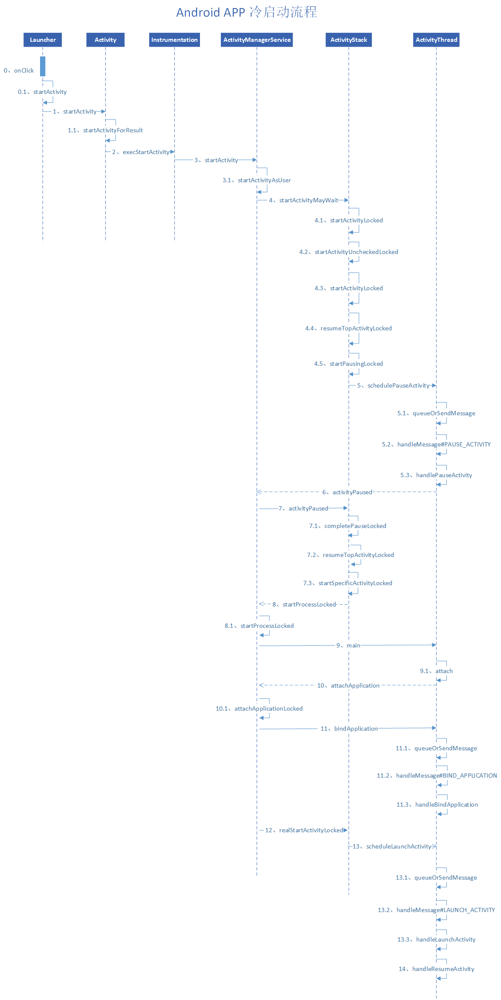

图中涉及的几个类：

（1）Launcher：Launcher 本质上也是一个应用程序，和一个简单的 App 一样，也继承自 Activity，实现了点击、长按等回调接口，来接收用户的输入。

（2）ActivityManagerServices：简称 AMS，服务端对象，负责系统中所有 Activity 的生命周期。

（3）ActivityThread：App 的真正入口。当开启 App 之后，会调用 main() 开始运行，开启消息循环队列，这就是 UI 线程（主线程）。与 ActivityManagerService 配合，一起完成 Activity 的管理工作。

（4）ApplicationThread：用来实现 ActivityManangerService 与 ActivityThread 之间的交互。在 ActivityManangerService 需要管理相关 Application 中的 Activity 的生命周期时，通过 ApplicationThread 的代理对象与 ActivityThread 通讯。

（5）ApplicationThreadProxy：是 ApplicationThread 在服务器端的代理，负责和客户端的 ApplicationThread 通讯。AMS 就是通过该代理与 ActivityThread 进行通信的。

（6）Instrumentation：每一个应用程序只有一个 Instrumentation 对象，每个 Activity 内都有一个对该对象的引用。Instrumentation 可以理解为应用进程的管家，ActivityThread 要创建或暂停某个 Activity 时，都需要通过 Instrumentation 来进行具体的操作。

（7）ActivityStack：Activity 在 AMS 的栈管理，用来记录已经启动的 Actiivty 的先后关系，状态信息等。通过 ActivityStack 决定是否需要启动新的进程。

（8）ActivityRecord：ActivityStack 的管理对象，每个 Activity 在 AMS 对应一个 ActivityRecord，来记录 Activity 的状态以及其他的管理信息。其实就是服务端的 Activity 对象的映像。

（9）TaskRecord：AMS 抽象出来的一个“任务”的概念，是记录 ActivityReacord 的栈，一个“Task”包含若干个 ActivityRecord 。AMS 用 TaskRecord 确保 Activity 启动和退出的顺序。


Activity 冷启动过程（app 进程不存在）：在 launch 点击触发了打开应用后，会先通过调用 AMS 的 startActivity() 方法，而 AMS 会调用 ActivityStack 的 resumeTopActivityInnerLocked 方法，在该方法中会先 pause 当前显示的 activity，在处理完 pause activity 之后，会判断启动 app 的进程是否存在，判断如果 Activity 所在进程存在且 Activity 之前启动过，则直接发送 ResumeActivityItem 请求通知 APP 进程进行 resume，否则调用 **ActivityStackSupervisor** 的 **startSpecificActivityLocked方法** 继续执行去启动目标进程（通过 **Process.start** 请求 ZYGOTE 创建子 APP 进程）。

##### 热启动

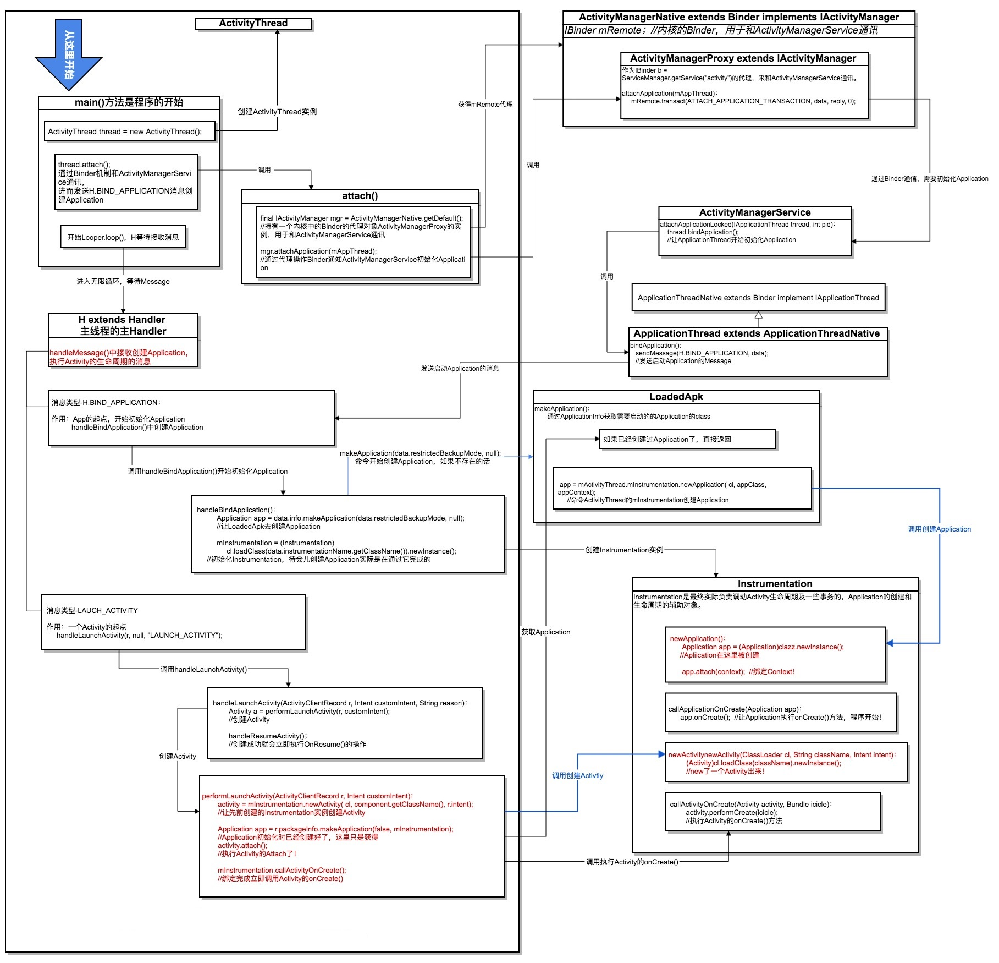

Activity 热启动过程：ActivityThread 的 main() 方法作为程序的入口，在 main() 方法中，初始化了主线程的 Looper，主 Handler，并使主线程进入等待接收 Message 消息的无限循环状态，调用 attach() 方法，而 attach() 方法通过调用 ActivityManager 的 attachApplication() 方法，最后调用到 ApplicationThread 的 bindApplication() 方法，在 bindApplication() 方法中发送出 BIND_APPLICATION 的消息，ActivityThread 类处理 BIND_APPLICATION 消息，接收到 BIND_APPLICATION 消息之后，创建一个 Application 实例，初始化一个 Instrumentation 对象，通过 Instrumentation 的 callApplicationOnCreate() 方法去调用 Application 的 onCreate() 方法。ApplicationThread 发出 LAUNCH_ACTIVITY 消息来启动 activity，通过反射机制创建 activity 实例，创建完成之后就会调用 onCreate() 方法。

#####  关于 IActivityManager、ActivityManagerNative、ActivityManagerProxy、ActivityManagerService

　　IActivityManager 是一个接口，用于与活动管理服务通讯。ActivityManagerProxy 实现了 IActivityManager 接口，ActivityManagerProxy 主要代理了内核中与 ActivityManager 通讯的 Binder 实例。ActivityManagerProxy 持有一个 ActivityManagerNative 的对象实例，当调用 IActivityManager 的方法时，调用 ActivityManagerNative 的实例来完成。ActivityManagerNative 是一个抽象类，实现 IActivityManager 接口，并且继承 Binder 类，提供 ActivityManagerProxy 实例供外部使用。ActivityManagerService 类继承 ActivityManagerNative 类，真正实现 IActivityManager 接口的方法。

　　很明显 ActivityManager 使用的是代理模式，ActivityManagerProxy 代理了与活动管理服务通讯。

##### 关于 ApplicationThread

　　ApplicationThread 作为 IApplicationThread 的一个实例，承担了发送 Activity 生命周期以及它一些消息的任务，也就是说发送消息。

　　至于为什么在 ActivityThread 中已经创建出了 ApplicationThread 了还要绕弯路发消息，是为了让系统根据情况来控制这个过程。

##### 关于 Instrumentation

Instrumentation 会在应用程序的任何代码运行之前被实例化，它能够允许你监视应用程序和系统的所有交互。

在 Application 的创建、Activity 的创建和生命周期过程中都会调用 Instrumentation 的方法，Application 的创建是调用 ActivityManagerService 的方法来实现，而 Activity 的创建是反射实现，Activity 的生命周期调用了 activity 的相关方法。

Instrumentation 是如何实现监视应用程序和系统交互的？Instrumentation 类将 Application 的创建、Activity 的创建以及生命周期这些操作包装起来，通过操作 Instrumentation 进而实现上述操作。

Instrumentation 封装有什么好处？Instrumentation 作为抽象，在约定好需要实现的功能之后，只需要给 Instrumentation 添加这些抽象功能，然后调用就好了。关于怎么实现这些功能，都会交给 Instrumentation 的实现对象就好了。这就是多态的运用，依赖抽象，不依赖具体的实践。就是上层提出需求，底层定义接口，即依赖倒置原则的践行。


1. 先讲下普通的activity的启动流程吧，涉及到应用的本地进程和系统进程（AMS）。

   首先调用startActivity启动新的activity，这个方法其实调用了startActivityForResult方法。里面向instrumentation请求创建，调用execActivity方法，通过AMS在本地进程的IBinder接口（IActivityManager）（AIDL通信，用该AIDL的代理类）向AMS发起远程请求创建Activity，

   AMS首先调用startActivity方法，里面校验了要启动的activity是否注册、确定启动模式等信息，如果启动的activity合法，然后会调用ActivityTaskSuperVisitor，找出对应的activityTask。如果activityTask栈顶上存在处于resume状态的activity，则让该activity调用其onPause方法；接下来判断应用进程是否已启动，如果没有就启动应用的进程，创建ActivityThread对象，并调用其main方法；

   在 ActivityThread 的 main() 方法中会初始化主线程的 Looper，并且发出创建 Application 的消息，最后开启 Looper，等待接收消息。创建 application 是利用本地进程在AMS的IBinder接口（IApplicationThread）直接调用本地的ActivityThread的内部类ApplicationThread对象的ScheduleActivity方法，通过叫H的handler对象，切换到主线程调用handleLaunchActivity方法，最后把逻辑处理交给performLaunchActivity。这个方法主要干了几个事情：（1）获取待启动activity的信息；（2）通过instrumentation利用类加载器创建待启动activity对象；（3）判断是否已经有创建Application对象，没有则创建并调用其onCreate方法。（3）调用Activity对象的attach方法来初始化一些重要数据（创建PhoneWindow和WindowManager、主线程的赋值等）；（4）然后调用activity的onCreate方法。接着跳出performLaunchActivity调用handleStartActivity方法（这里应该调用了activity的onStart方法），然后调用handleResumeActivity方法，通过activity的performResume方法调用了activity的onResume方法；接着通过WindowManagerImpl里面的WindowGlobal创建要添加的view对应的viewRootImp对象，然后WindowSession将phoneWindow添加到WMS中。WMS把相应的DecorView添加到该window，并用对应的viewRootImp对象完成对view的绘制，然后设置view可见了。最后通知AMS执行前一个activity（如果有的话）的stop方法。

2. 根activity的启动：
   （1）Launcher进程请求AMS创建activity
     （2）AMS请求Zygote创建进程。
     （3）Zygote通过fork自己来创建进程。并通知AMS创建完成。
     （4）AMS通知应用进程创建根Activity。
     （5）创建过程和上面说过的普通activity的流程是一样的

### Service

　　Service 是可以在后台执行长时间运行操作并且不需要和用户交互的应用组件。服务是由其他应用组件启动，依赖于启动服务所在的应用程序进程，服务一旦被启动将在后台一直运行，即使启动服务的组件已销毁也不受影响。此外，服务也可以绑定到组件上，以与之进行交互。

​		服务可以在很多场合使用，比如播放多媒体的时候用户启动了其他 activity，此时要在后台继续播放；比如检测 sd 卡上文件的变化；比如在后台记录你的地理位置的改变；也可以执行进程间通信（IPC）等等。

#### 两种启动方式

服务有两种启动方式，一种是启动服务，一种就是绑定服务。

1. 启动服务：当应用组件（如 Activity）通过调用 `startService()` 启动服务时，服务即处于 “ 启动 ” 状态。一旦启动，服务即可在后台无限期运行，即使启动服务的组件已被销毁也不受影响，除非手动调用才能停止服务，已启动的服务通常是执行单一操作，而且不会将结果返回给调用方。
2. 绑定服务：当应用组件通过调用 `bindService()` 绑定到服务时，服务即处于“绑定”状态。绑定服务提供了一个客户端 - 服务端接口，允许组件与服务进行交互、发送请求、获取结果，甚至是利用进程间通信（IPC）执行这些操作。仅当与另一个应用组件绑定时，绑定服务才会运行。多个组件可以同时绑定到该服务，但全部取消绑定后，该服务即会被销毁。

#### 生命周期

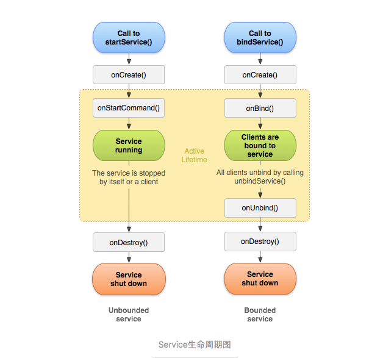

Call to startService()：onCreate() -> onStartCommand()->onDestory()

Call to bindService()：onCreate() -> onBind() -> onUnbind() -> onDestory()

onCreate()：首次创建服务时，系统将调用此方法来执行一次性设置程序（在调用 `onStartCommand()` 或 `onBind()` 之前），如果服务已在运行，则不会调用此方法，该方法只调用一次。

onBind()：当另一个组件想通过调用 `bindService()` 与服务绑定（例如执行 RPC）时，系统将调用此方法。在此方法实现中，必须返回一个 IBinder 接口的实现类，供客户端用来与服务进行通信。无论是启动状态还是绑定状态，此方法必须重写，但在启动状态就会直接返回 null 。

onStartCommand()：当另一个组件（Activity）通过调用 `startService()` 请求启动服务时系统将调用此方法，一旦执行此方法，服务即会启动并可在后台无限期运行。如果自己实现此方法，则需要在服务工作完成后，通过调用 `stopSelf()` 或 `stopService()` 来停止服务（在绑定状态无需实现此方法）。

onUnbind()：当另一个组件通过调用 `unbindServicer()` 与服务解绑时，系统将调用此方法。

onDestroy()：当服务不再使用且被销毁时，系统将调用此方法，服务应该实现此方法来清理所有的资源，如线程、注册的监听器、接收器等，这是服务接收的最后一个调用。

#### 启动服务与绑定服务

##### 启动服务和绑定服务的生命周期

* 启动服务生命周期：第一次调用 `startService()` 启动服务，会调用 `onCreate()` 和 `onStartCommand()` 方法，之后再次调用 `startService()` 启动服务，只会调用 `onStartCommand()` 方法。调用 `stopService()` 方法停止服务，会调用 `onDestory()` 方法。停止服务之后再次 `startService()` 启动服务，会再次调用 `onCreate()` 和 `onStartCommand()` 方法。
* 绑定服务生命周期：第一次调用 `bindService()` 启动服务，调用 `onCreate() `和 `onBind()` 方法，之后调用 `bindService()` 没有任何方法调用，调用 `unbindService()` 方法解绑服务，会调用 `onUnbind()` 和 `onDestory()` 方法。在 Activity 退出的时候不调用 `unbindService()` 解绑的话会报错。
* 启动并绑定服务生命周期
  * 先绑定服务后启动服务：先调用 `bindService()` 方法，调用 `onCreate()` 和 `onBind()` 方法，再调用 `startService()` 方法，调用 `onStartCommand()` 方法，调用 `unbindService()` 方法解绑，调用 `onUnbind()` 方法，再调用 `stopService()` 方法，调用 `onDestory()` 方法，如果是先调用 `stopService()` 没有方法回调，再调用 `unbindService()` 方法解绑会调用 `onUnbind()` 和 `onDestory()` 方法。
  * 先启动服务后绑定服务：先调用 `startService()` 方法，调用 `onCreate()` 和 `onStartCommand()` 方法，（之后再调用 `startService()` 方法，只会回调 `onStartCommand()` 方法）再调用 `bindService()` 方法，调用 `onBind()` 方法，调用 `unbindService()` 方法解绑，调用 `onUnbind()` 方法，再调用 `stopService()` 方法，调用 `onDestory()` 方法，如果是先调用 `stopService()` 没有方法回调，再调用 `unbindService()` 方法解绑会调用 `onUnbind()` 和 `onDestory()` 方法。

##### 启动服务与绑定服务的区别

**区别一：生命周期**
　　通过 start 方式的服务会一直运行在后台，需要由组件本身或外部组件来停止服务才会结束。

　　bind 方式的服务，生命周期就会依赖绑定的组件。

**区别二：参数传递**
　　start 服务可以给启动的服务对象传递参数，但无法获取服务中方法的返回值。

　　bind 服务可以给启动的服务对象传递参数，也可以用过绑定的业务对象获取返回结果。

#### IntentService

服务不会自动开启线程，服务中的代码默认是运行在主线程中，如果直接在服务里执行一些耗时操作，容易造成 ANR(Application Not Responding)异常，为了可以简单的创建一个异步的、会自动停止的服务，Android 专门提供了一个 **IntentService** 类。可以启动 IntentService 多次，而每一个耗时操作会以工作队列的方式在 IntentService 的 onHandleIntent() 回调方法中执行，并且每次只会执行一个工作线程，执行完第一个，再执行第二个，以此类推。

#### 前台服务

前台服务被认为是用户主动意识到的一种服务，因此在内存不足时，系统也不会考虑将其终止。前台服务必须为状态栏提供通知，状态栏位于 “ 正在进行 ” 标题下方，这意味着除非服务停止或从前台删除，否则不能清除通知。例如将从服务播放音乐的音乐播放器设置在前台运行，这是因为用户明确意识到其操作。状态栏中的通知可能表示正在播放的歌曲，并允许用户启动 Activity 来与音乐播放器进行交互。

`startForeground()` 和` stopForeground()` 方法分别将服务设置为前台服务和从前台删除服务。`startForeground(int id, Notification notification)`的作用是把当前服务设置为前台服务，其中 `id` 参数代表唯一标识通知的整型数，需要注意的是提供给 `startForeground()` 的整型 ID 不得为 0 ，而 notification 是一个状态栏的通知。`stopForeground(boolean removeNotification)`用来从前台删除服务，此方法传入一个布尔值，指示是否也删除状态栏通知，true 为删除。注意该方法并不会停止服务，但是，如果在服务正在前台运行时将其停止，则通知也会被删除。

### BroadcastReceiver

BroadcastReceiver ，广播接收者，用来接收来自系统和应用中的广播，是 Android 四大组件之一。

#### BroadcastReceiver 的两种常用类型

* Normalbroadcasts（默认广播）:发送一个默认广播使用 `Context.sendBroadcast()` 方法，普通广播对于多个接受者来说是完全异步的，通常每个接受者都无需等待即可接收到广播，接受者相互之间不会有影响。对于这种广播，接收者无法终止广播，即无法阻止其他接收者的接收动作。
* Orderedbroadcasts（有序广播）：发送一个有序广播使用 `Context.sendorderedBroadcast()` 方法，有序广播比较特殊，它每次只发送到优先级较高的接受者那里，然后由优先级高的接受者再传播到优先级低的接受者那里，优先级高的接受者有能力终止这个广播。

#### 静态和动态注册方式

构建 Intent ，使用 sendBroadcast 方法发出广播定义一个广播接收器，该广播接收器继承 BroadcastReceiver，并且覆盖 onReceive() 方法来接收事件。注册该广播接收器，可以在代码中注册（动态注册），也可以在 AndroidManifest.xml 配置文件中注册（静态注册）。

##### 两种注册方式区别

　　广播接收器注册一种有两种形式：静态注册和动态注册。

　　两者及其接收广播的区别：

　　（1）动态注册广播不是常驻型广播，也就是说广播跟随 Activity 的生命周期。注意在 Activity 结束前，移除广播接收器。静态注册是常驻型，也就是说当应用程序关闭后，如果有信息广播来，程序也会被系统调用自动运行。

　　（2）当广播为有序广播时：优先级高的先接收（不分静态和动态）。同优先级的广播接收器，动态优先于静态。当广播为默认广播时：无视优先级，动态广播接收器优先于静态广播接收器。

　　（3）同优先级的同类广播接收器，静态：先扫描的优先于后扫描的。动态：先注册优先于后注册的。

　　（4）静态注册是在 AndroidManifesy.xml 里通过< receive > 标签声明的。不受任何组件的生命周期影响，缺点是耗电和占内存，适合在需要时刻监听使用。动态注册在代码中调用 `Context.registerReceiver()` 方法注册，比较灵活，适合在需要特定时刻监听使用。

#### BroadcastReceiver 的实现原理

　广播队列传送广播给 Receiver 的原理其实就是将 BroadcastReceiver 和消息都放到 BroadcastRecord 里面，然后通过 Handler 机制遍历 BroadcastQueue 里面的 BroadcastRecord ，将消息发送给 BroadcastReceiver：


　　整个广播的机制总结成下图：


### ContentProvider

　　ContentProvider 可以实现在应用程序之间共享数据。

　　Android 为常见的一些数据提供了默认的 ContentProvider（包括音频、视频、图片和通讯录等）。所以可以在其他应用中通过那些 ContentProvider 获取这些数据。

　　Android 所提供的 ContentProvider 都存放在 android.provider 包中。

#### 为什么要选择 ContentProvider

　　虽然也可以通过文件等其他方式来达到在不同程序之间共享数据，但是会很复杂，而 ContentProvider 也是可以实现应用程序之间共享数据的，除了可以在不同程序之间共享数据之外，还有其他优点。

##### ContentProvider 的 特点

1. ContentProvider 为存储和获取数据提供了统一的接口。ContentProvider 对数据进行了封装，不用关心数据存储的细节。统一了数据的访问方式。
2. 使用 ContentProvider 可以在不同的应用程序之间共享数据。
3. Android 为常见的一些数据提供了默认的 ContentProvider（包括音频、视频、图片和通讯录等）。
4. 不同于文件存储和 SharedPreferences 存储中的两种全局可读写操作模式，ContentProvider 可以选择只对哪一部分进行共享，从而保证程序中的隐私数据不会有泄漏的风险。

##### 对 ContentProvider 封装的理解

　　继承 ContentProvider 的类在 onCreate()、insert()、delete()、update()、query()、getType() 方法中实现对数据增删改查的操作，而数据的存储可以使用文件、数据库、网络等各种方式去实现。而对数据的操作使用的是 ContentResolver 类，不管 ContentProvider 如何对数据进行实质操作，ContentReselver 的使用都是一样的。将实现与使用进行了分割，完成了对数据的封装，也统一了对数据的使用方式。

#### * ContentProvier 运行过程源码分析


#### * ContentProvider 的共享数据更新通知机制


### IntentFilter 的匹配规则

　　隐式调用需要 Intent 能够匹配目标组件的 IntentFilter 中所设置的过滤信息，如果匹配不成功就不能启动目标 Actiivty。

　　IntentFilter 中过滤的信息包括：action、category、data。

　　关于 IntentFilter 的一些描述：

* 匹配过滤列表时需要同时匹配过滤列表中的 action、category、data。
* 一个 Activity 中可以有多组 intent-filter。
* 一个 intent-filter 可以有多个 action、category、data，并各自构成不同类别，一个 Intent 必须同时匹配 action 类别、category 类别和 data 类别才算完全匹配。
* 一个 Intent 只要能匹配任何一组 intent-filter 就算匹配成功。

#### action 的匹配规则

1. Intent 中必须存在 action，这一点和 category 不同。
2. action 的字符串严格区分大小写，intent 中的 action 必须和过滤规则中的 action 完全一致才能匹配成功。
3. 匹配规则中可以同时有多个 action，但是 Intent 中的 action 只需与其中一只相同即可匹配成功。

#### category 匹配规则

1. 匹配规则中必须添加 “action.intent.category.DEFAULT” 这个过滤条件。
2. Intent 中可以不设置 category，系统会自动添加 “action.intent.category.DEFAULT” 这个默认的 category。
3. Intent 中可以同时设置多个 category，一旦设置多个 category，那么每个 category 都必须能够和过滤条件中的某个 category 匹配成功。

　　category 的第 3 个规则和 action 的匹配规则有所不同，action 有多个的时候，主要其中之一能够匹配成功即可，但是 category 必须是每一个都需要匹配成功。

#### data 的匹配规则

1. Intent 中必须有 data 数据。
2. Intent 中的 data 必须和过滤规则中的某一个 data 完全匹配。
3. 过滤规则中可以有多个 data 存在，但是 Intent 中的 data 只需匹配其中的任意一个 data 即可。
4. 过滤规则中可以没有指定 URI，但是系统会赋予其默认值：content 和 file，这一点在 Intent 中需要注意。
5. 为 Intent 设定 data 和 type 的时候必须要调用 setDataAndType() 方法，而不能先 setData 再 setType，因为这两个方法是互斥的，都会清除对方的值。
6. 在匹配规则中，data 的 scheme、host、post、path 等属性可以写在同一个 < / > 中，也可以分来单独写，其功效是一样的。

### * ActivityManagerService


### * WindowManagerService


### * PackageManagerService 之启动解析


### 守护进程

　　守护进程的实现思想分为两方面：

​	1.	保活。通过提高进程优先级，降低进程被杀死的概率。当前业界的 Andriod 进程保活手段主要分为 黑、白、灰三种。

​	2.	拉起。进程被杀死后，进行拉起。

　　守护进程的实现方法如下：

​	•	黑色保活：不同的 app 进程，用广播相互唤醒（包括利用系统提供的广播进行唤醒）。

​	•	白色保活：通过启动前台 Service 使得进程优先级提高到前台进程。

​	•	灰色保活：利用系统的漏洞启动前台 Service。

​	•	双进程守护：两个进程互相拉起。

​	•	JobService 轮询：关闭后自动拉起。

#### 1. 黑色保活

　　所谓黑色保活，就是利用不同的 app 进程使用广播来进行相互唤醒。

　　适用对象：腾讯系全家桶、阿里系全家桶、应用之间互相拉起。

　　举 3 个比较常见的场景：

​	1.	开机、网络切换、拍照、拍视频的时候，利用系统产生的广播唤醒 app。

​	2.	接入第三方 SDK 也会唤醒相应的 app 进程，如微信 sdk 会唤醒微信，支付宝 sdk 会唤醒支付宝。

​	3.	假如手机里装了支付宝、淘宝、天猫、UC 等阿里系的 app，那么打开任意一个阿里系的 app 后，有可能就顺便把其他阿里系的 app 给唤醒了。

　　对于场景 1，在最新的 Android N 取消了 ACTION_NEW_PICTURE（拍照）、ACTION_NEW_VIDEO（拍视频）、CONNECTIVITY_ACTION（网络切换）等三种广播。而开机广播，有一些定制 ROM 的厂商会将其去掉。

#### 2. 白色保活

　　白色保活手段非常简单，就是调用系统 api 启动一个前台的 Service 进程，这样会在系统的通知栏生成一个 Notification，用来让用户知道有这样一个 app 在运行着，哪怕当前的 app 推到了后台。

　　比如 LBE 和 QQ 音乐就是这样。

　　优点：写法简单、处理方便。

　　缺点：前台服务和通知绑定在一起，意味着开启服务要伴随一条通知在通知栏，用户有感知。

#### 3. 灰色保活

　　灰色保活，这种保活手段是应用范围最广泛。

　　它是利用系统的漏洞来启动一个前台的 Service 进程，与普通的启动方式区别在于，它不会在系统通知栏处出现一个 Notification，看起来就如同运行着一个后台 Service 进程一样。这样做带来的好处就是，用户无法察觉到应用运行着一个前台进程（因为看不到 Notification），但是应用的进程优先级又是高于普通后台进程的。

　　大致的实现思路如下：

​	1.	思路一： API level < 18，启动前台 Service 时直接传入 new Notification。

​	2.	思路二：API level >= 18，同时启动两个 id 相同的前台 Service，然后再将后启动的 Service 做 stop 处理。。

　　使用灰色保活并不代表 Service 就永久不死了，只能说是提高了进程的优先级。如果 app 进程占用了大量的内存，按照回收进程的策略，同样会干掉 app。

　　优点：开启前台服务的情况下，可以去掉通知，使得用户无感知。

　　缺点：target26 8.0 以上的系统该漏洞已修复，因此不适用。

#### 4. 双进程守护

　　所谓双进程守护，就是指两个进程互相监视，一旦有一个进程死了，另一个进程监听到就拉起。

　　依托这个原理，衍生出的双进程守护的方案有很多，比如利用监听 socket 连接中断实现，利用文件锁实现，利用 android 的绑定服务实现。

　　以服务绑定为例：

context.bindService(intent, serviceConnection, flag);

　　这里的 serviceconnection 就是监听回调，回调中有 onServiceConnected 方法和 onServiceDisconnected 这两个方法，通过 onServiceDisconnected 可以监听到另一个服务是否还存活。把两个服务放在两个进程就能够做到监听并拉起进程。

#### 5. JobService

　　通过定时触发任务，判定进程是否存活，如果不存活了，则拉起。

　　优点：5.0 以后出现的 JobService 是官方推荐的方式，比较稳定。

　　缺点：触发时机不够实时，JobService 的触发时机会是充电时，闲暇时等特殊时机或者时周期性运行。

### Fragment

　　Fragment 真正的强大之处在于可以动态地添加到 Activity 当中，程序的界面可以定制的更加多样化，更加充分地利用平板的屏幕空间。　

#### Fragment 的生命周期


* onAttach()：Fragment 和 Activity 建立关联的时候调用。需要使用 Activity 的引用或者使用 Activity 作为其操作的上下文，将在此回调方法中实现。
* onCreate(Bundle savedInstanceState)：此时的 Fragment 的 onCreate 回调时，该 fragment 还没有获得 Activity 的 onCreate() 已完成的通知，所以不能将依赖于 Activity 视图层次结构的代码放入此回调方法中。在 OnCreate() 回调方法中，应该尽量避免耗时操作。
* onCreateView(LayoutInflater inflater,ViewGroup container,Bundle savedInstanceState) ：为 Fragment 加载布局时调用。不要将视图层次结构附加到传入的 ViewGroup 父元素中（就是不要把初始化的 view  视图主动添加到 container 里面，不能出现 container.addView(v) 的操作），该关联会自动完成，如果在此回调中将碎片的视图层次结构附加到父元素，很可能会出现异常。
* onActivityCreated() ：当 Activty 中的 onCreate 方法执行完后调用。在调用 onActivityCreated() 之前，Activity 的视图层次结构已经准备好了。如果 Activity 和它的 Fragment 是从保存的状态重新创建的，此回调尤其重要，也可以在这里保证此 Activity 的其他所有 Fragment 已经附加到该 Activity 中了。
* onStart()\onResume()\onPause()\onStop() ：这些回调方法和 Activity 的回调方法进行绑定，也就是说与 Activity 中对应的生命周期相同。
* onDestoryView()：该回调方法在视图层次结构与 Fragment 分离之后调用。
* onDestory()：不再使用 Fragment 时调用。Fragment 仍然附加到 Activity 并依然可以找到，但是不能执行其他操作。
* onDetach()：Fragment 和 Activity 解除关联的时候调用。

#### setRetainInstance() 方法

　　此方法可以有效地提高系统的运行效率，对流畅性要求较高的应用可以适当采用此方法进行设置。

　　Fragment 有一个强大的功能，可以在 Activity 重新创建时可以不完全销毁 Fragment，以便 Fragment 可以恢复。在 onCreate() 方法中调用 setRetainInstance(true/false) 方法是最佳位置。

　　当在 onCreate() 方法中调用了 setRetainInstance(true) 后，Fragment 恢复时会跳过 onCreate() 和 onDestory() 方法，因此不能在 onCreate() 中放置一些初始化逻辑。

#### FragmentPagerAdapter 与 FragmentStatePagerAdapter 区别

使用 ViewPager 再结合 FragmentPagerAdapter 或者 FragmentStatePagerAdapter 可以制作一个 App 的主页。

　　而 FragmentPagerAdapter 和 FragmentStatePagerAdapter 的区别在于对于 Fragment 是否销毁：

* FragmentPagerAdapter：对于不再需要的 Fragment，选择调用 detach() 方法，仅销毁视图，并不会销毁 fragment 实例。
* FragmentStatePagerAdapter：会销毁不再需要的 Fragment，当当前事务提交以后，会彻底的将 fragment 从当前 Activity 的 FragmentManager 中移除，state 标明，销毁时，会将其 onSaveInstanceState(Bundle outState) 中的 bundle 信息保存下来，当用户切换回来，可以通过该 bundle 恢复生成新的 Fragment，也就是说，可以在 onSaveInstanceState(Bundle outState) 方法中保存一些数据，在 onCreate 中进行恢复创建。

　　使用 FragmentStatePagerAdapter 更省内存，但是销毁新建也是需要时间的。一般情况下，如果是制作主界面，就 3-4 个 Tab，那么可以选择使用 FragmentPagerAdapter，如果是用于 ViewPager 展示数量特别多的条目时，建议使用 FragmentStatePagerAdapter。

#### replace 与 add 的区别

两个方法不同之处：是否要清空容器再添加 Fragment 的区别，用法上 add 配合 hide 或是 remove 使用，replace 一般单独出现。

##### 添加

一般会配合 hide 使用：transaction.add(R.id.fragment_container, oneFragment).hide(twoFragment).commit();

1. 第一个参数是容器 id，第二个参数是要添加的 fragment，添加不会清空容器中的内容，不停的往里面添加。
2. 不允许添加同一个 fragment 实例，这是非常重要的特点。如果一个 fragment 已经进来的话，再次添加会报异常错误的。
3. 添加进来的 fragment 都是可见的（visible），后添加的 fragment 会展示在先添加的 fragment 上面，在绘制界面的时候会会址所有可见的 view。
4. 所以大多数 add 都是和 hide 或者是 remove 同时使用的。这样可以节省绘制界面的时间，节省内存消耗，是推荐的用法。

##### 替换

transaction.replace(R.id.fragment_container, oneFragment).commit();

1. 替换会把容器中的所有内容全部替换掉，有一些 app 会使用这样的做法，保持只有一个 fragment 在显示，减少了界面的层级关系。

相同之处：每次 add 和 replace 都要走一遍 fragment 的周期。

 其实fragment一般不会这么简单使用，replace的使用场景一般不多，大多数是添加（add）和显示（show）配合隐藏（hide）来使用，这样首先避免相同类型的fragment的重复添加，提示开发者使用单例模式，已经添加过的fragment很多情况没有必要再次添加，而且还有把生命周期再走一遍，这是一种比较浪费的做法。

最合适的处理方式是这样的：

1.在add的时候，加上一个tab参数
transaction.add(R.id.content, IndexFragment,”Tab1″);
2.然后当IndexFragment引用被回收置空的话，先通过
IndexFragment＝FragmentManager.findFragmentByTag(“Tab1″);
找到对应的引用，然后继续上面的hide,show;

### Binder 机制

　　是一种实现 android 跨进程通讯的方式，由物理上的虚拟物理设备驱动，和 Binder 类组成。

　　android是基于linux内核的。

#### Linux 进程空间划分

* 一个进程空间分为 用户空间 & 内核空间（`Kernel`），即把进程内用户 & 内核隔离开来，所有进程共用1个内核空间。

* 二者区别：

  1. 进程间，用户空间的数据不可共享，所以用户空间 = 不可共享空间
  2. 进程间，内核空间的数据可共享，所以内核空间 = 可共享空间

* 进程内用户空间 & 内核空间进行交互需通过系统调用，

  主要通过函数：
   copy_from_user（）：将用户空间的数据拷贝到内核空间
   copy_to_user（）：将内核空间的数据拷贝到用户空间


#### 进程隔离

　　为了保证安全性 & 独立性，一个进程不能直接操作或者访问另一个进程，即 Android 的进程是相互独立、隔离的。

#### 跨进程通信（IPC）

- 隔离后，由于某些需求，进程间需要合作 / 交互
- 跨进程间通信的原理
  1. 先通过进程间的内核空间进行数据交互
  2. 再通过进程内的用户空间 & 内核空间进行数据交互，从而实现进程间的用户空间的数据交互


　　而`Binder`，就是充当 连接 两个进程（内核空间）的通道。

#### 传统跨进程通信的基本原理


　　而 Binder 的作用则是：连接两个进程，实现了mmap() 系统调用，主要负责创建数据接收的缓存空间 & 管理数据接收缓存，传统的跨进程通信需拷贝数据 2 次，但 Binder 机制只需 1 次，主要是使用到了内存映射。

#### 什么是内存映射？

　　内存映射是关联 进程中的1个虚拟内存区域 & 1个磁盘上的对象，使得二者存在映射关系。


　　内存映射的实现过程主要是通过 Linux 系统下的系统调用函数： mmap（），该函数的作用 = 创建虚拟内存区域 + 与共享对象建立映射关系。

#### 内存映射的作用

1. 实现内存共享：如跨进程通信
2. 提高数据读 / 写效率 ：如文件读 / 写操作

#### Binder


　　所以 Binder 驱动一共有两个作用

1. 创建接受缓存区
2. 通知 client 和 service 数据准备就绪
3. 管理线程

　　Binder驱动属于进程空间的内核空间，可进行进程间 & 进程内交互

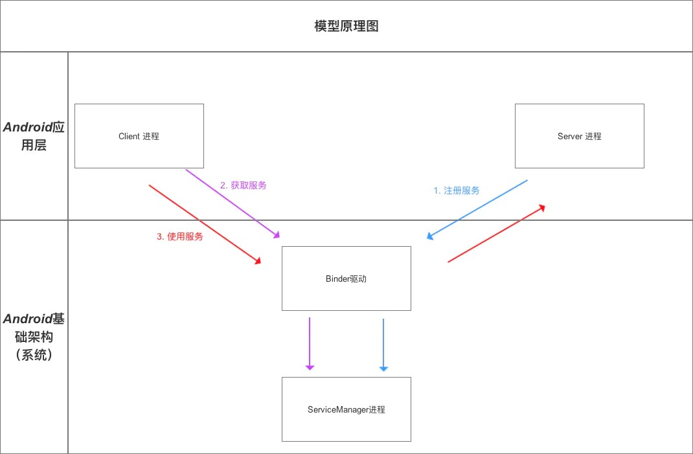

#### Binder请求的线程管理

　　Binder 模型的线程管理采用 Binder 驱动的线程池，并由 Binder 驱动自身进行管理。

　　一个进程的 Binder 线程数默认最大是 16，超过的请求会被阻塞等待空闲的 Binder 线程。

#### Android中的Binder实现机制

　　android 中提供了 Binder 实体类，Binder 实体是 Server进程在 Binder 驱动中的存在形式。

　　该对象保存 Server 和 ServiceManager 的信息（保存在内核空间中），Binder 驱动通过内核空间的 Binder 实体找到用户空间的 Server 对象，注册服务后，Binder 驱动持有 Server 进程创建的 Binder 实体。

```java
public class Binder implement IBinder{
    // Binder 机制在 Android 中的实现主要依靠的是 Binder 类，其实现了 IBinder 接口
    // IBinder 接口：定义了远程操作对象的基本接口，代表了一种跨进程传输的能力
    // 系统会为每个实现了 IBinder 接口的对象提供跨进程传输能力
    // 即 Binder 类对象具备了跨进程传输的能力

        void attachInterface(IInterface plus, String descriptor)；
       	  // 作用：
          // 1. 将（descriptor，plus）作为（key,value）对存入到 Binder 对象中的一个 Map<String,IInterface> 对象中
          // 2. 之后，Binder 对象可根据 descriptor 通过 queryLocalIInterface（） 获得对应 IInterface 对象（即 plus）的引用，可依靠该引用完成对请求方法的调用

        IInterface queryLocalInterface(Stringdescriptor) ；
        // 作用：根据 参数 descriptor 查找相应的 IInterface 对象（即plus引用）

        boolean onTransact(int code, Parcel data, Parcel reply, int flags)；
        // 定义：继承自 IBinder 接口的
        // 作用：执行 Client 进程所请求的目标方法（子类需要复写）
        // 参数说明：
        // code：Client 进程请求方法标识符。即 Server 进程根据该标识确定所请求的目标方法
        // data：目标方法的参数。（Client 进程传进来的，此处就是整数 a 和 b）
        // reply：目标方法执行后的结果（返回给 Client 进程）
        // 注：运行在 Server 进程的 Binder 线程池中；当 Client 进程发起远程请求时，远程请求会要求系统底层执行回调该方法

        final class BinderProxy implements IBinder {
         // 即 Server 进程创建的 Binder 对象的代理对象类
         // 该类属于 Binder 的内部类
        }
        // 回到分析1原处
}
```

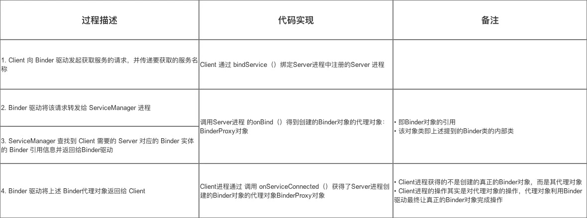

　　流程总结：客户端通过 bindService，通过 Binder 驱动查询 ServiceManager 是否已经注册该服务，如果没有注册，Service 进程会向 Binder 驱动发起服务注册请求，一旦注册，调用该服务的 onBind 返回一个 Binder 对象到 Binder 驱动，已经注册则意味着 Binder 驱动内包含这个 Binder 对象，Binder 驱动返回一个 BinderProxy 对象，并通过回调，传递给客户端，客户端通过这个 BinderProxy( 在 java 层仍然是 Binder 对象)操作 Binder 驱动内的 Binder 对象（transact 方法），Binder 驱动含有很多的 Binder 对象，它们是通过 InterfaceToken 区分不同服务的。


### Handler

#### 消息机制的架构

　　消息机制的运行流程：在子线程执行完耗时操作，当 Handler 发送消息时，将会调用 MessageQueue.enqueueMessae，向消息队列中添加消息。当通过 Looper.loop 开启循环后，会不断地从线程池中读取消息，即调用 MessageQueue.next，然后调用目标 Handler ( 即发送该消息的 Handler ) 的 dispatchMessage 方法传递消息，然后返回到 Handler 所在线程，目标 Handler 收到消息，调用 handleMessage 方法，接收消息并处理消息。


　　Message、Handler 和 Looper 三者之间的关系：每个线程中只能存在一个 Looper，Looper 是保存在 ThreadLocal 中的。

　　主线程（UI 线程）已经创建了一个 Looper，所以在主线程不需要再创建 Looper，但是在其他线程中需要创建 Looper。

　　每个线程中可以有多个 Handler，即一个 Looper 可以处理来自多个 Handler 的消息。

　　Looper 中维护一个 MessageQueue，来维护消息队列，消息队列中的 Message 可以来自不同的 Handler。

1. Handler 的背后有着 Looper 以及 MessageQueue 的协助，三者通力合作。

2. Looper 负责关联线程以及消息的分发。在该线程下循环从 MessageQueue 获取 Message，分发给 Handler。在创建 Handler 之前一定需要先创建 Looper。Looper 有退出的功能，但是主线程的 Looper 不允许退出。异步线程的 Looper 需要自己调用 `Looper.myLooper().quit()；`退出。

3. MessageQueue 负责消息的存储与管理。负责管理由 Handler 发送过来的 Message。

4. Handler 负责发送并处理消息。面向开发者，提供 API，并隐藏背后实现的细节。

5. Looper.loop() 是个死循环，会不断调用 MessageQueue.next() 获取 Message，并调用 msg.target.dispatchMessage(msg) 回到了 Handler 来分发消息，以此来完成消息的回调。

6. Runnable 被封装进了 Messgage，可以说是一个特殊的 Message。

7. Handler 发送的消息由 MessageQueue 存储管理，并由 Looper 负责回调消息到 handleMessage()。

8. 消息处理的方法调用栈：Looper.loop() -> MessageQueue.next() -> Message.target.dispatchMessage() -> Handler.handleMessage() ，所以Handler.handleMessage() 所在的线程是 Looper.loop()  方法被调用的线程，也可以说成 Looper 所在的线程，并不是创建 Handler 的线程。

   平时使用 Handler 的时候会从异步发送消息到 Handler，而 Handler 的 handleMessage() 方法是在主线程调用的，所以消息就从异步线程切换到了主线程。最终又调用到了重写的 handleMessage(Message msg) 方法来做处理子线程发来的消息或者调用 handleCallback(Message message) 去执行子线程中定义并传过来的操作。

9. 使用内部类的方式使用 Handler 可能会造成内存泄漏，即便在 Activity.onDestory 里移除延时消息，必须要写成静态内部类。

#### Handler 引起的内存泄漏原因以及最佳解决方案

　　Handler 允许发送延时消息，如果在延时期间用户关闭了 Activity，那么该 Activity 会泄漏。

　　这个泄漏是因为 Message 会持有 Handler，而又因为 Java 的特性，内部类会持有外部类，使得 Activity 会被 Handler 持有，这样最终就导致 Activity 泄漏。

　　解决该问题的最有效的方法是：将 Handler 定义成静态的内部类，在内部持有 Activity 的弱引用，并及时移除所有消息。

　　而单纯的在 onDestory 中移除消息并不保险，因为 onDestory 并不一定执行。

#### 为什么主线程不会因为 Looper.loop() 里的死循环卡死或者不能处理其他事务？

##### 为什么不会卡死？

　　handler 机制是使用 pipe 来实现的，主线程没有消息处理时会阻塞在管道的读端。

　　binder 线程会往主线程消息队列里添加消息，然后往管道写端写一个字段，这样就能唤醒主线程从管道读端返回，也就是说 queue.next() 会调用返回。

　　主线程大多数都是出于休眠状态，并不会消耗大量 CPU 资源。

##### 既然是死循环又如何去处理其他事务呢？

　　答案是通过创建新线程的方式。

　　在 main() 方法里调用了 thread.attach(false)，这里便会创建一个 Binder 线程（具体是指 ApplicationThread，Binder 的服务端，用于接收系统服务 AMS 发送来的事件），该 Binder 线程通过 Handler 将 Message 发送给主线程。

　　ActivityThread 对应的 Handler 是一个内部类 H，里面包含了启动 Acitivity、处理 Activity 生命周期等方法。

#### ThreadLocal

　　ThreadLocal 并不是一个 Thread，而是 Thread 的局部变量，它的作用是可以在每个线程中存储数据。

　　ThreadLocal 是一个线程内部的数据存储类，通过它可以在指定的线程中存储数据，数据存储以后，只是在指定线程中可以获取到存储的数据，对于其他线程来说无法获取到数据。

　　当使用 ThreadLocal 维护变量时，ThreadLocal 为每个使用该变量的线程提供独立的变量副本，所以每一个线程都可以独立地改变自己的副本，而不会影响其他线程所对应的副本。

#### AsyncTask 的知识

　　Android UI 是线程不安全的，如果想要在子线程里进行 UI 操作，就需要借助 Android 的异步消息处理机制 ，为了更加方便在子线程中更新 UI 元素，Android 5.1 版本就引入了一个 AsyncTask 类，使用它就可以非常灵活方便的从子线程切换到 UI 线程。

　　AsyncTask 内部封装了 Thread 和 Handler ，可以在后台进行计算并且把计算的结果及时更新到 UI 上，而这些正是 Thread + Handler 所做的事情，AsyncTask 的作用就是简化 Thread + Handler，能够通过更少的代码来完成一样的功能。

重写 AsyncTask 中的几个方法才能完成对任务的定制。经常需要去重写的方法有以下四个：

1. onPreExecute

   这个方法会在后台任务开始执行之前调用，用于进行一些界面上的初始化操作，比如显示一个进度条对话框等。

   所在线程：UI 线程

2. doInBackground(Params ...)

   这个方法中的所有代码都会在子线程中运行，应该在这里处理所有的耗时任务。任务一旦完成就可以通过 return 语句来将任务的执行结果进行返回，如果 AsyncTask 的第三个泛型参数执行的 Void，就可以不返回任务执行结果。注意，在这个方法中是不可以进行 UI 操作的，如果需要更新 UI 元素，比如说反馈当前任务的执行进度，可以调用 publishProgress(Progress...) 方法来完成。

   所在线程：后台线程

3. onProgressUpdate(Progress...)

   当在后台任务中调用了 publishProgress(Progress...) 方法后，这个方法就很快会被调用，方法中携带的参数就是在后台任务中传递过来的。这个方法中可以对 UI 进行操作，利用参数中的数值就可以对界面元素进行相应的更新。

   所在线程：UI 线程

4. onPostExecute(Boolean result)

   运行结果。

   所在线程：UI 线程

### View

#### Activity 的布局绘制过程

setContentView 会将整个布局文件都解析完成并形成一个完整的 Dom 结构，并设置最顶部的根布局。在 resume 的时候才会进行视图的绘制操作，通过调用 requestLayout() 最终调用到 performTraversales() 方法，performTraversales() 方法会依次调用 View 的 measure、layout、draw 步骤将视图显示在屏幕上。

#### View 绘制流程

　　Android 中的任何一个布局、任何一个控件其实都是直接或间接继承自 View 的，如 TextView、Button、ImageView、ListView 等。

　　每一个视图的绘制过程都必须经历三个最主要的阶段，即 onMeasure()、onLayout() 和 onDraw()。

##### onMeasure()

　　measure 是测量的意思，那么 onMeasure() 方法顾名思义就是用来测量视图的大小的。

　　View 系统的绘制流程会从 ViewRoot 的 performTravesals() 方法中开始，在其内部调用 View 的 measure() 方法。measure() 方法接收两个参数，widthMeasureSpec 和 heightMeasureSpec，这两个值分别用于确定视图的宽度和高度的规格和大小。

　　MeasureSpec 的值由 specSize 和 specMode 共同组成的，其中 specSize 记录的是大小，specMode 记录的是规格。

　　specMode 一共有三种类型：

1. EXACTLY

   表示父视图希望子视图的大小应该是由 specSize 的值来决定的。

   系统默认会按照这个规则来设置子视图的大小，开发人员当然也可以按照自己的意愿设置成任意的大小。

2. AT_MOST

   表示子视图最多只能是 specSize 中指定的大小，开发人员应该尽可能小的去设置这个视图，并且保证不会超过 specSize。

   系统默认会按照这个规则来设置子视图的大小，开发人员当然也可以按照自己的意愿设置成任意的大小。

3. UNSPECIFIED

   表示开发人员可以将视图按照自己的意愿设置成任意的大小，没有任何限制。

   这种情况比较少见，不太会用到。

WRAP_CONTENT 对应的是 AT_MOST，MATCH_PARENT 与具体的数值对应的是 EXACTLY。

ViewRootImpl 的 performTraversals 方法中会performMeasure() 方法，在 performMeasure() 方法中调用了 View 的 measure() 方法。而 View 的 measure() 方法调用了 onMeasure() 方法去真正测量宽高。onMeasure 方法默认会调用 getDefaultSize() 方法来获取视图的大小。之后会在 onMeasure() 方法中调用 setMeasuredDimension() 方法来设定测量出的大小。

视图大小的控制是由父视图、布局文件以及视图本身共同完成的，父视图会提供给子视图参考的大小，而开发人员可以在 XML 文件中指定视图的大小，然后视图本身会对最终的大小进行拍板。

##### onLayout()

　　measure 过程结束后，视图的大小就已经测量好了，接下来就是 layout 的过程了。正如其名字所描述的一样，这个方法是用于给视图进行布局的，也就是确定视图的位置。

　　ViewRoot 的 performTraversals() 方法会在 measure 结束后继续执行，会调用 performLayout() 方法，在 performLayout() 方法中会调用 View 的 layout() 方法来执行此过程。

ViewRootImple 的 performLayout() 方法中调用了 view 的 layout 方法。

　　在 layout() 方法中，首先会调用 setFrame() 方法来判断视图的大小是否发生过变化，以确定有没有必要对当前的视图进行重绘，同时还会在这里把传递过来的四个参数分别赋值给 mLeft、mTop、mRight 和 mBottom 这几个变量。接下来会调用 onLayout() 方法。

　　View 的 onLayout 是一个空方法，因为 onLayout() 过程是为了确定视图在布局中所在的位置，而这个操作应该是由布局来完成的，即父视图决定子视图的显示位置，那么就是 ViewGroup 的 onLayout() 方法。

　　在 FrameLayout 的 onLayout() 方法中，对子视图进行循环处理，调用子视图的 layout() 方法来确定它在 FrameLayout 布局中的位置，传入的 childLeft、childTop、childLeft + width、childTop + height，分别代表着子视图在 FrameLayout 中左上右下四个点的坐标。其中，调用 childView.getMeasuredWidth() 和 childView.getMeasuredHeight() 方法得到的值就是在 onMeasure() 方法中测量出的宽和高。

　　在 onLayout() 过程结束后，就可以调用 getWidth() 方法和 getHeight() 方法来获取视图的宽高了。

###### getMeasureWidth() 和 getWidth() 方法的区别

1. 首先 getMeasureWidth() 方法在 measure() 过程结束后就可以获取到了，而 getWidth() 方法要在 layout() 过程结束后才能获取到。
2. 另外，getMeasureWidth() 方法中的值是通过 setMeasuredDimension() 方法来进行设置的，而 getWidth() 方法中值则是通过视图右边的坐标减去左边的坐标计算出来的。

##### onDraw()

　　ViewRootImpl 的 performTravers() 方法在调用了 performLayout() 方法之后，会调用 performDraw() 方法。

　　在 performDraw() 方法中，调用了 ViewRootImpl 的 draw() 方法。

　　在 draw() 方法中，调用了 ViewRootImpl 的 drawSoftware() 方法。

　　drawSoftware() 方法中创建出一个 Canvas 对象，然后调用 View 的 draw() 方法来执行具体的绘制工作。

　　draw() 方法内部的绘制过程总共可以分为六部，其中第二步和第五步在一般情况下很少用到。

* 第一步：绘制背景

  第一步的作用是对视图的背景进行绘制。调用了 drawBackground() 方法来绘制。

* 第二步：如果有必要，保存画布层以准备褪色（不常用）

* 第三步：绘制视图的内容

  第三步的作用是对视图的内容进行绘制。调用了 onDraw() 方法。

  而 onDraw() 是一个空方法，因为每个视图的内容部分肯定都是各不相同的，这部分的功能交给子类来实现是理所当然的。

* 第四步：绘制子视图

  第四步的作用是对当前视图的所有子视图进行绘制。调用了 dispatchDraw() 方法。

  dispatchDraw() 方法也是一个空方法，也是交由子类去实现，如果当前的视图没有子视图，那么就不需要进行绘制了。比如 TextView 继承 View，但是没有重写 dispatchDraw() 方法，它没有子视图，也就没有必要实现这个方法，而 ViewGroup 类就重写了 dispatchDraw() 方法，去实现子视图的绘制。

* 第五步：如果有必要，绘制褪色边缘并恢复层（不常用）

  绘制装饰（例如滚动条）：第六步的作用是对视图的滚动条进行绘制。任何一个视图都是有滚动条的，只是一般情况下都没有让它显示出来。

　　通过以上流程分析，发现 View 是不会绘制内容部分的，因此需要每个视图根据想要展示的内容来自行绘制。绘制的方式主要是借助 Canvas 这个类，它会作为参数传入到 onDraw() 方法中，供给每个视图使用。

#### 视图状态与重绘流程

invalidate() 方法虽然最终会调用 performTraversals() 方法中，但这时 measure 和 layout 流程是不会重新执行的，因为视图没有强制重新测量的标志位，而且大小也没有发生过变化，所以这时只有 draw 流程可以得到执行。

　　而如果希望视图的绘制流程可以完完整整地重新走一遍，就不能使用 invalidate() 方法，而应该调用 requestLayout() 了。

#### View 事件分发机制

　　Android 的事件分发机制基本会遵从 Activity -> ViewGroup -> View 的顺序进行事件分发，然后通过调用 onTouchEvent() 方法进行事件的处理。

　　一般情况下，事件列都是从用户按下（ACTION_DOWN）的那一刻产生的，不得不提到，三个非常重要的于事件相关的方法。

* dispatchTouchEvent() - 分发事件
* onTouchEvent() - 处理事件
* onInterceptTouchEvent() - 拦截事件

##### Activity 的事件分发


　　不管是 DOWN、MOVE 还是 UP 都是按照下面的顺序执行：

1. dispatchTouchEvent
2. setOnTouchListener 的 onTouch
3. onTouchEvent

　　onTouch 方法里能做的事情比 onClick 要多一些，比如判断手指按下、抬起、移动等事件。

　　那么如果两个事件都注册了，onTouch 是优先于 onClick 执行的，并且 onTouch 执行了两次，一次是 ACTION_DOWN，一次是 ACTION_UP。因此事件传递的顺序是先经过 onTouch，再传递给 onClick。

　　onTouch 方法是有返回值的，如果把 onTouch 方法里的返回值改成 true，onClick 方法不再执行了。

##### onTouch 和 onTouchEvent 有什么区别，又该如何使用？

​          这两个方法都是在 View 的 dispatchTouchEvent 中调用的，onTouch 优先于 onTouchEvent 执行。如果在 onTouch 方法中通过返回 true 将事件消费掉，onTouchEvent 将不会再执行。

　　另外需要注意的是，onTouch 能够得到执行需要两个前提条件，第一 mOnTouchListener 的值不能为空，第二当前点击的控件必须是 enable 的。因此如果有一个控件是非 enable 的，那么给它注册 onTouch 事件将永远得不到执行。对于这一类控件，如果想要监听它的 touch 事件，就必须通过在该控件中重写 onTouchEvent 方法来实现。

View的事件分发示意图：


整个 View 的事件转发流程是View.dispatchTouchEvent -> View.setOnTouchListener -> View.onTouchEvent

　　在 dispatchTouchEvent 中会进行 OnTouchListener 的判断，如果 onTouchEvent 不为 null 且返回 true，则表示事件被消费，onTouchEvent 不会被执行，否则执行 onTouchEvent。

##### onTouchEvent 中的 DOWN、MOVE、UP

###### 1. DOWN

　　如果父控件支持滑动，首先设置标志为 PFLAG_PREPRESSED，设置 mHasPerformedLongPress = false，然后发出了一个 100ms 后的 mPendingCheckForTag。

　　如果 100ms 内没有触发 UP，则将标志置为 PFLAG_PRESSED，清除 PREPRESSED 标志，同时发出一个延时为 500-100 ms 的检查长按任务的消息。

　　如果父控件不支持滑动，则是将标记置为 PFLAG_PRESSED，同时发出一个延时为 500ms 的检查长按任务的消息。

　　检查长按任务的消息时间到了后，则会触发 LongClickListener。

　　此时如果 LongClickListener 不为 null，则会执行回调，但是如果 LongClickListener.onClick 返回 true，才把 mHasPerformedLongPress 设置为 true，否则 mHasPerformedLongPress 依然为 false。

###### 2. MOVE

　　主要就是检查用户是否滑出了控件，如果触摸的位置已经不在当前 view 上了，则移除点击和长按的回调。

###### 3. UP

　　如果 100ms 内，触发 UP，此时标志为 PFLAG_PREPRESSED ，则执行 UnSetPressedState，setPressed(false)，会把 setPress 转发下去，可以在 View 中复写 dispatchSetPressed 方法接收。

　　如果是 100ms - 500ms 之间，即长按还未发生，则首先移除长按检测，执行 onClick 回调；

　　如果是 500ms 以后，那么有两种情况：

* 设置了 onLongClickListener，且 onLongClickListener.onClick 返回 true，则点击事件 onClick 无法触发。
* 没有设置 onLongClickListener 或者 onLongClickListener.onClick 返回 false，则点击事件 onClick 事件触发。
* 最后执行 mUnSetPressedState.run()，将 setPressed 传递下去，然后将 PFLAG_PRESSED 标识清除。

#### ViewGroup 事件分发机制

dispatchTouchEvent 方法：

　　**ACTION_DOWN 总结**：ViewGroup 实现捕获 DOWN 事件，如果代码中不做 TOUCH 事件拦截，则判断当前子 View 是否在当前 x,y 的区域内，如果在，将其添加到 mFirstTouchTarget 链表的头部，并且调用子 View 的 dispatchTouchEvent() 方法把事件分发下去。

　　**ACTION_MOVE 总结**：ACTION_MOVE 在检测完是否拦截以后，直接调用了子 View 的 dispatchTouchEvent，事件分发下去。

　　**ACTION_UP 总结**：ACTION_UP 在检测完是否拦截以后，直接调用了子 View 的 dispatchTouchEvent，事件分发下去，最后重置触摸状态，将 mFirstTouchTarget 清空。

1. ViewGroup 实现捕获 DOWN 事件，如果代码中不做 TOUCH 事件拦截，则开始查找当前 x,y 是否在某个子 View 的区域内，如果在，将其添加到 mFirstTouchTarget 链表的头部，并且调用子 View 的 dispatchTouchEvent() 方法把事件分发下去。
2. ACTION_MOVE 中，ViewGroup 捕获到事件，然后判断是否拦截，如果没有拦截，则直接调用子 View 的 dispatchTouchEvent(ev) 将事件分发下去。
3. ACTION_UP 中，ViewGroup 捕获到事件，然后判断是否拦截，如果没有拦截，则直接调用子 View 的 dispatchTouchEvent(ev) 将事件分发小区，最后重置触摸状态，将 mFirstToychTarget 清空。

　　在分发之前都会修改一下坐标系统，把当前的 x,y 分别减去 child.left 和 child.top，然后传给 child。

　　ViewGroup事件分发示意图


1. Android 事件分发是先传递给 ViewGroup，再由 ViewGroup 传递给 View 的。
2. 在 ViewGroup 中可以通过 onInterceptTouchEvent() 方法对事件传递进行拦截，onInterceptTouchEvent() 方法返回 true 代表不允许事件继续向子 View 传递，返回 false 代表不对事件进行拦截，默认返回 false。
3. 子 View 中如果将传递的事件消费掉，ViewGroup 中将无法接收到任何事件。

4. 如果 ViewGroup 找到了能够处理该事件的 View，则直接交给子 View 处理，自己的 onTouchEvent() 不会被触发。

5. 可以通过复写 onInterceptTouchEvent(ev) 方法，拦截子 View 的事件（即 return true），把事件交给自己处理，则会执行自己对应的 onTouchEvent() 方法。

6. 子 View 可以通过调用 getParent().requestDisallowInterceptTouchEvent(true); 阻止 ViewGroup 对其 ACTION_MOVE 或者 ACTION_UP 事件进行拦截。

#### 自定义 View 的实现方式

　　如果要按类型来划分的话，自定义 View 的实现方式大概可以分为三种，自绘控件、组合控件以及继承控件。

* 自绘组件

  自绘控件的意思就是，这个 View 上所展现的内容全部都是自己绘制出来的。

　　绘制的代码是写在 onDraw() 方法中的。

* 组合控件

  组合控件的意思就是，并不需要自己去绘制视图上显示的内容，而只是用系统原生的控件就好了，但可以将几个系统原生的控件组合在一起，这样创建出的控件就被称为组合控件。

* 继承控件

  继承控件的意思就是并不需要自己从头去实现一个控件，只需要去继承一个现有的控件，然后在这个空间上增加一些新的功能，就可以形成一个自定义的控件了。

  这种自定义控件的特点就是不仅能够按照需求加入相应的功能，还可以保留原生控件的所有功能。

  


#### * RecyclerView

##### RecyclerView 的 getLayoutPosition 和 getAdapterPosition

- getLayoutPosition 和 getAdapterPosition 通常情况下是一样的，只有当 Adapter 里面的内容改变了，而 Layout 还没来得及绘制的这段时间之内才有可能不一样，这个时间小于16ms
- 如果调用的是 notifyDataSetChanged()，因为要重新绘制所有 Item，所以在绘制完成之前 RecyclerView 是不知道 adapterPosition 的，这时会返回-1（NO_POSITION）
- 但如果用的是 notifyItemInserted(0)，那立即就能获取到正确的 adapterPosition，即使新的 Layout 还没绘制完成，比如之前是0的现在就会变成1，因为插入了0, 相当于 RecyclerView 提前帮你计算的，此时getLayoutPosition 还只能获取到旧的值。
- 总的来说，大多数情况下用 getAdapterPosition，只要不用 notifyDataSetChanged() 来刷新数据就总能立即获取到正确 position 值。

##### 设计结构


##### RecyclerView 的使用总结以及常见问题解决方案


##### RecyclerView 动画源码浅析


##### RecyclerView 复用机制


##### RecyclerView 刷新机制


##### RecyclerView 原理


#### * List 原理解析

### 缓存

#### 缓存机制

　　把不需要实时更新的数据缓存下来，通过时间或者其他因素来判别是读缓存还是网络请求，这样可以缓解服务器压力，一定程度上提高应用响应速度，并且支持离线阅读。

　　访问网络的数据常见返回格式有图片、文件和数据库，因此从这几个方向考虑缓存的实现。

##### 图片缓存

　　常见的优化就是子项不可见时，所占用的内存会被回收以供正在前台显示子项使用。如果想让 UI 运行流畅的话，就不应该每次显示时都去重新加载图片。保持一些内存和文件缓存就变得很有必要了。

###### 内存缓存

　　通过预先消耗应用的一点内存来存储数据，便可快速的为应用中的组件提供数据，是一种典型的以空间换时间的策略。

　　LruCache 类（Android v4 Support Library 类库中开始提供）非常适合来做图片缓存任务，它可以使用一个 LinkedHashMap 的强引用来保存最近使用的对象，并且当它保存的对象占用的内存总和超出了为它设计的最大内存时会把不经常使用的对象踢出以供垃圾回收器回收。

　　给 LruCache 设置一个合适的内存大小，需考虑如下因素：

* 还剩余多少内存给 activity 或应用使用
* 屏幕上需要一次性显示多少张图片和多少图片在等待显示
* 手机的大小和密度是多少（密度越高的设备需要越大的缓存）
* 图片的尺寸（决定了所占用的内存大小）
* 图片的访问频率（频率高的在内存中一直保存）
* 保存图片的质量（不同像素在不同情况下显示）

###### 磁盘缓存

　　内存缓存能够快速的获取到最近显示的图片，但不一定就能够获取到需要的图片缓存。当数据集过大时很容易把内存缓存填满（如 GridView）。应用也有可能被其他的任务（比如来电）中断进行到后台，后台应用有可能会被杀死，那么相应的内存缓存对象也会被销毁。当应用重新回到前台显示时，应用又需要一张一张的去加载图片了。

　　硬盘文件缓存能够用来处理这些情况，保存处理好的图片，当内存缓存不可用的时候，直接读取在硬盘中保存好的图片，这样可以有效的减少图片加载的次数。读取磁盘文件要比直接从内存缓存中读取要慢一些，而且需要在一个 UI 主线程外的线程中进行，因为磁盘的读取速度是不能够保证的，磁盘文件缓存显然也是一种以空间换时间的策略。

DiskLruCache

##### 使用 SQLite 进行缓存

　　网络请求数据完成后，把文件的相关信息（如 url （一般作为唯一标示）、下载时间、过期时间）等存放到数据库。下次加载的时候根据 url 先从数据库中查询，如果查询到并且时间未过期，就根据路径读取本地文件，从而实现缓存的效果。

　　注意：缓存的数据库是存放在 /data/data/databases/ 目录下，是占用内存空间的，如果缓存累积，容易浪费内存，需要及时清理缓存。

##### 文件缓存

　　思路和一般缓存一样，把需要的数据存储在文件中，下次加载时判断文件是否存在和过期（使用 File.lastModified() 方法得到文件的最后修改时间，与当前时间判断），存在并未过期加载文件中的数据，否则请求服务器重新下载。

　　注意，无网络环境下就默认读取文件缓存中的。

#### LruCache 知识

LRU 是近期最少使用的算法，它的核心思想是当缓存满时，会优先淘汰那些近期最少使用的缓存对象。采用 LRU 算法的缓存有两种：LruCache 和 DisLruCache，分别用于实现内存缓存和硬盘缓存，其核心思想都是 LRU 缓存算法。

##### LruCache 的实现原理

　　LruCache 的核心思想很好理解，就是要维护一个缓存对象列表，其中对象列表的排列方式是按照访问顺序实现的，即一直没访问的对象，将放在队尾，即将被淘汰。而最近访问的对象将放在对头，最后被淘汰。

　　LruCache 中维护了一个集合 LinkedHashMap，该 LinkedHashMap 是以访问顺序排序的。当调用 put() 方法时，就会在集合中添加元素，并调用 trimToSize() 判断缓存是否已满，如果满了就用 LinkedHashMap 的迭代器删除队尾元素，即近期最少访问的元素。当调用 get() 方法访问缓存对象时，就会调用 LinkedHashMap 的 get() 方法获得对应集合元素，同时会更新该元素到队头。

### 优化

#### ANR 相关知识

ANR 全称是 Application Not Responding，意思就是应用程序未响应。如果一个应用无法响应用户的输入，系统就会弹出一个 ANR 对话框，用户可以自行选择继续等待或者是停止当前程序。

##### ANR 的发生原因

1. 代码自身引起，例如：

   * 主线程阻塞、IOWait 等；


   - 主线程进行耗时计算；
   - 错误的操作，比如调用了 Thread.wait 或者 Thread.sleep 等。

2. 其他进程间接引起，例如：

   * 当前应用进程进行进程间通信请求其他进程，其他进程的操作长时间没有反馈；
   * 其他进程的 CPU 占用率高，使得当前应用进程无法抢占到 CPU 时间片。

##### 发生 ANR 的条件

　　Andriod 系统中，ActivityManangerService(简称 AMS) 和 WindowManangerService(简称 WMS) 会检测 App 的响应事件，如果 App 在特定时间无法响应屏幕触摸或键盘输入事件，或者特定事件没有处理完毕，就会出现 ANR。

* InputDispatching Timeout：输入事件分发或屏幕触摸事件超时 5s 未响应完毕；
* BroadcastQueue Timeout：前台广播在 10秒 内、后台广播在 60 秒内未执行完成；
* Service Timeout：前台服务在 20 秒内、后台服务在 200 秒内未执行完成；
* ContentProvider Timeout：内容提供者，在 publish 超时 10s；

##### 分析 ANR 的方法

* ANR 分析方法一：Log

  可以看到 logcat 清晰地记录了 ANR 发生的时间，发生 ANR 所在的报名、类名以及线程的 tid 和一句话概括原因：WaitingInMainSignalCatcherLoop，大概意思为主线程等待异常。

* ANR 分析方法二：traces.txt

  ANR 异常已经输出到 trances.txt 文件，使用 adb 命令把这个文件从手机里导出来。

* ANR 分析方法三：Java 线程调用分析

  通过 JDK 提供的命令可以帮助分析和调试 Java 应用，命令是： jstack {pid}

* ANR 分析方法四：DDMS 分析 ANR 问题

  * 使用 DDMS-----Update Threads 工具
  * 阅读 Update Threads 的输出

##### 如何避免 ANR

　　不是所有的 ANR 都可找到原因，也受限于当时发生的环境或系统 bug，因此对 ANR ，是避免而不是分析。

​		基本的思路就是尽量避免在主线程（UI 线程）中做耗时操作，将耗时操作放在子线程中。将 IO 操作在工作线程来处理，减少其他耗时操作和错误操作。

* 使用 AsyncTask 处理耗时 IO 操作。
* 使用 Thread 或者 HandlerThread 时，调用 Process.setThreadPriority(Process.THREAD_PRIORITY_BACKGROUND)设置优先级，否则仍然会降低程序响应，因为默认 Thread 的优先级和主线程相同。
* 使用 Handler 处理工作线程结果，而不是使用 Thread.wait() 或者 Thread.sleep() 来阻塞主线程。
* 四大组件的生命周期方法中尽量避免耗时的代码。
* 如果要在后台进行耗时操作，建议使用 IntentService 处理。
* 在程序启动时，如果要做一些耗时操作，可以选择加上欢迎界面，避免用户察觉卡顿。
* 主程序需要等待其他线程返回结果时，可以加上进度显示，比如使用 ProgressBar 控件，让用户得知进度。
* 使用 Systrace 和 TraceView 找到影响响应的问题，进一步优化。
* 如果是由于内存不足引起的问题，AndroidManifest.xml 文件 < application > 中可以设置 android:largeHeap="true"，以此增大 App 使用内存。不过不建议使用此法，从根本上防止内存泄漏，优化内存使用才是正确的做法。

#### 发生 ANR 条件的源码分析

##### Service 造成的 Service Timeout

1. Service 创建之前会延迟发送一个消息，而这个消息就是 ANR 的起源；
2. Service 创建完毕，在规定的时间之内执行完毕 onCreate() 方法就移除这个消息，就不会产生 ANR 了；
3. 在规定的时间之内没有完成 onCreate() 的调用，消息被执行，ANR 发生。

##### BroadcastReceiver 造成的 BroadcastQueue Timeout

1. BroadcastReceiver 在获取广播接收者后，会延迟发送一个消息，而这个消息就是 ANR 的起源，前台广播延时 10 秒，后台广播延时 60 秒；
2. 处理广播消息之后就会移除延时消息，就不会产生 ANR 了；
3. 如果在延时时间之内没有处理完广播消息，延时消息被执行，ANR 发生。

​		四大组件发生 ANR 的流程基本都是：

1.  发送延时消息
2.  执行相应方法
3.  方法在延时时间内执行完成，取消消息
4.  方法在延时时间内未执行完成，消息触发
5.  接收延时消息，发生 ANR ，调用 AMS.appNotResponding 方法。

#### 性能优化

##### 内存优化

###### 内存泄漏

　　内存泄漏：内存不在 GC 的掌控范围之内了。

　　java 的 GC 内存回收机制：某对象不再有任何引用的时候才会进行回收。

**GC 的引用点**

1. Java 栈中引用的对象
2. 方法静态引用的对象
3. 方法常量引用的对象
4. Native 中 JNI 引用的对象
5. Thread -  " 活着的 " 线程

###### 内存溢出

　　内存泄漏一般导致应用卡顿，极端情况会导致项目 boom。Boom 的原因是因为超过内存的阈值。原因只要有两方面：

1. 代码存在泄漏，内存无法及时释放导致 oom。

2. 一些逻辑消耗了大量内存，无法及时释放或者超过导致 oom。

　　所谓消耗大量的内存的，绝大多数是因为图片加载。这是 oom 出现最频繁的地方。

**如何查看内存溢出**

1. 确定是否存在内存溢出的问题

　　方法有两种：

* Android -> SystemInformation -> Memory Usage 查看 Object 里面是否有没有被释放的 Views 和 Activity。
* 命令 `adb shell dumpsys meminfo 包名 -d`。

2. 通过看 Memory Montor 工具，检查动作，反复多次执行某一个操作，查看内存的大概变化情况。
3. 使用 Heap SnapShot 工具（堆栈快照）更仔细地查找泄漏的位置。

　　点击 -> 进行一段时间的监控，生成一个文件 -> package treeview 会出现一些信息，信息内容如下：

* Total count：内存中该类的对象个数
* Heap count：堆内存中该类的对象个数
* Size of：物理大小
* Shallow size：该对象本身占有内存大小
* Retained size：释放该对象后，节省的内存大小
* Depth：深度
* Shadow size：对象本身内存大小
* Domination size：管辖的内存大小

###### 内存分析工具

　　性能优化工具：

* Heap SnapShot 工具
* Head Views 工具
* LeakCanary 工具
* MAT 工具
* TraceView 工具（Device Monitor）

　　第三方分析工具：

* Memory Analyzer
* GT Home
* iTest

######  注意事项

* 长生命周期的对象使用 Application 的上下文，而不是 Activity 的上下文（Context）。
* Animation 会导致内存溢出。 view 显示动画时，View 会持有 Activity 对象，而动画持有 View，动画不 cancel 就会一直去执行 view 的 onDraw 方法，那么 Activity 就会被一直持有，不能被释放，导致内存泄漏。解决方法是在 Activity 的 onDestory() 方法中调用 Animation.cancle() 进行停止，也可以通过自定义 view 来代替动画。

##### UI 优化

　　UI 优化主要包括**布局优化**以及 **view 的绘制优化**。

　　一般会导致卡顿的情况：

1. 人为在 UI 线程中做轻微耗时操作，导致 UI 线程卡顿；
2. 布局 Layout 过于复杂，无法在 16 ms 内完成渲染；
3. 同一时间动画执行的次数过多，导致 CPU 或 GPU 负载过重；
4. View 过度绘制，导致某些像素在同一帧时间内被绘制多次，从而使 CPU 或 GPU 负载过重；
5. View 频繁的触发 measure、layout，导致 measure、layout 累计耗时过多及整个 View 频繁的重新渲染；
6. 内存频繁触发 GC 过多（同一帧中频繁创建内存），导致暂时阻塞渲染操作；
7. 冗余资源及逻辑等导致加载和执行缓慢；
8. ANR；

###### 布局优化

　　屏幕上的某个像素在同一帧的时间内被绘制了多次，在多层次的 UI 结构里面，如果不可见的 UI 也在做绘制的操作，这就会导致某些像素区域被绘制了多次，这就浪费了大量的 CPU 以及 GPU 资源。

**关于布局优化的方法**

1. 如果父控件有颜色，也有自己需要的颜色，那么就不必在子控件加背景颜色。

2. 如果每个子控件的颜色不太一样，而且可以完全覆盖父控件，那么就不需要在子控件上加背景颜色。

3. 尽量避免不必要的嵌套。

4. 能用 LinearLayout 和 FrameLayout，就不要用 RelativeLayout，因为 RelativeLayout 控件相对比较复杂，测试也相对耗时。

5. 使用 include 和 merge 增加复用，减少层级。

   针对嵌套布局，google 提出了 include、merge 和 ViewStub 。

   include 可以提高布局的复用性，大大方便开发，include 没有减少布局的嵌套，但是 include 和 merge 联手搭配，还是不错的。

   merge 的布局取决于父控件是哪个布局，使用 merge 相当于减少了自身的一层布局，直接采用父 include 的布局，当然直接在父布局里面使用意义不大，所以会和 include 配合使用，即增加了布局的复用性，也减少了一层布局嵌套。

6. ViewStub 按需加载，更加轻便。

   ViewStub 可以按需加载，在需要的时候 ViewStub 中的布局才加载到内存。对于一些进度条，提示信息等等少次数使用的功能，使用 ViewStub 很合适。

7. 复杂界面可选择 ConstraintLayout，可有效减少层级。

   ConstraintLayout 可以有效地解决布局嵌套过多的问题。ConstraintLayout 使用约束的方式来指定各个控件的位置和关系，有点类似于 RelativeLayout，但远比 RelativeLayout 要更强大。所以简单布局简单处理，复杂布局 ConstraintLayout 很好使。

###### 绘制优化

　　平时感觉的卡顿问题最主要的原因之一是因为渲染性能，因为越来越复杂的界面交互，其中可能添加了动画、图片等等。希望创造出越炫的交互界面，同时也希望可以流畅显示，但是往往卡顿就会发生在这里。

　　这个是 Android 的渲染机制造成的，Android 系统每隔 16ms 发出 VSYNC 信号，触发对 UI 进行渲染，但是渲染未必成功，如果成功了那么代表一切顺利，但是失败了可能就要延误时间，或者直接跳过去，给人视觉上的表现就是要么卡了一会，要么跳帧。

　　View 的绘制频率保证 60 fps 是最佳的，这就要求每帧绘制时间不超过 16ms ( 16ms = 1000 / 60 ) ，虽然程序很难保证 16 ms 这个时间，但是尽量降低 onDraw 方法中的复杂度总是切实有效的。

　　解决方法：
**第一点：**onDraw 方法中不要做耗时的任务，也不做过多的循环操作，特别是嵌套循环，虽然每次循环耗时很小，但是大量的循环势必霸占 CPU 的时间片，从而造成 View 的绘制过程不流畅。

**第二点：**除了循环之外，onDraw() 中不要创建新的布局对象，因为 onDraw() 方法一般都会频繁大量调用，就意味着会产生大量的临时对象，不仅占用内存，而且会导致系统更加频繁的 GC，大大降低程序的执行速度和效率。

**关于绘制优化的方法**

1. onDraw 中不要创建新的布局对象。
2. onDraw 方法中不要做耗时的任务，少使用循环。

###### 检查 UI 优化的方法

　　对于 UI 性能的优化可以通过开发者选项中的 GPU 过度绘制工具来进行分析。在设置 -> 开发者选项 -> 调试 GPU 过度绘制中打开调试。

　　目标就是尽量减少红色 Overdraw，看到更多的蓝色区域。

**查看每帧的渲染时长**

　　可以打开设置 -> 开发者选项 -> GPU 呈现模式分析 -> 在屏幕上显示为条形图。

　　随着界面的刷新，界面上会以实时柱状图来显示每帧的渲染时间，柱状图越高表示渲染时间越长，每个柱状图偏上都有一根表示 16 ms 基准的绿色横线，每一条竖着的柱状线都包含三部分（蓝色代表测量绘制 Display List 的时间，红色代表 OpenGL 渲染 Display List 所需要的时间，黄色代表 CPU 等待 GPU 处理的时间），只要每一帧的总时间低于基准线就不会发生 UI 卡顿问题（个别超出基准线其实也不算什么问题的）。

　　也可以在执行完 UI 滑动操作后在命令行输入如下命令查看命令行打印的 GPU 渲染数据：

```
	adb shell dumpsys gfxinfo [应用包名]
```

　　分析依据：Draw + Process + Execute = 完整的显示一帧时间 < 16ms。

##### 内存泄漏

　　内存泄漏：程序不再使用的对象无法被 GC 识别，导致对象一直留在内存当中，占用了内存空间。

　　内存泄漏分为 4 种：

1. 集合类泄漏
2. 单例 / 静态变量造成的内存泄漏
3. 匿名内部类 / 非静态内部类
4. 资源未关闭造成的内存泄漏

###### 集合类泄漏

　　集合类（List 等）添加元素后，仍引用着集合元素对象，导致该集合中的元素对象无法被回收，从而导致内存泄漏。

　　**解决方法**：使用 clear 清理集合，并释放其引用（list = null）。

###### 单例 / 静态变量造成的内存泄漏

　　单例模式具有其静态特性，它的生命周期等于应用程序的生命周期，所以容易造成内存泄漏。

　　当一个生命周期长的对象持有了生命周期短的对象的引用，这就造成了内存泄漏。

　　Context 和 Toast 是容易出现内存泄漏的，如果生命周期长，可以使用 Application 的 Content。

　　**解决方法**：生命周期长的引用生命周期长的，不要引用生命周期短的。

###### 匿名内部类 / 非静态内部类

　　如果非静态内部类的生命周期长于外部类，再加上自动持有外部类的强引用，就会发生内存泄漏。解决方法就是改为静态内部类。

　　匿名内部类也会持有外部类的强引用，解决方法也是改为静态内部类。

　　静态持有非静态类的引用，就会导致内存泄漏，解决方法是使用弱引用。

　　引用分为强引用、软引用、弱引用、虚引用，强度依次递减。

* 强引用：不做特殊处理的一般都是强引用，如果一个对象具有强引用，GC 绝不会回收它。
* 软引用（SoftReference）：如果内存空间足够，GC 就不会回收它，如果内存空间不足了，就会回收这些对象的内存。
* 弱引用（WeakReference）：弱引用要比软引用更弱一个级别，内存不够回收，GC 的时候不管内存够不够也回收。不过 GC 是一个优先级很低的线程，所以也不会随便就被回收了。
* 虚引用

###### 资源未关闭造成的内存泄漏

　　资源为关系的情况有：

1. 网络、文件等流忘记关闭
2. 手动注册广播时，退出时忘记 unregisterReceiver()
3. Service 执行完后忘记 stopSelf()
4. EventBus 等观察者模式的框架忘记手动解除注册

　　检查内存泄漏的工具：1. leakcanary；2.Memory Monitor；3. Android Lint。

##### 启动优化

　　安卓应用的启动方式分为三种：冷启动（Cold start）、暖启动（Warm start）、热启动（Hot start）。不同的启动方式决定了应用 UI 对用户可见所需要花费的时间长短。冷启动消耗的时间最长，基于冷启动方式的优化工作也是最考验产品用户体验的地方。

###### 启动方式

**冷启动**

　　冷启动是指应用程序从头开始，系统没有获取到当前 app 的 activity、Service 等等。例如第一次启动 app 或者杀死进程后第一次启动。那么对比其他两种当时，冷启动是耗时最长的。

　　应用发生冷启动时，系统一定会执行下面的三个任务：

1. 开始加载并启动应用

2. 应用启动后，显示一个空白的启动窗口（启动闪屏页）

3. 创建应用程序进程

　　那么创建应用程序进程之后，开始创建应用程序对象：

4.  启动 UI 线程
5.  创建主 Activity
6.  加载布局
7.  屏幕布局
8.  执行初始化绘制

　　应用程序进程完成第一次绘制后，系统进程会交换当前显示的背景窗口，将其替换为主活动。此时，用户可以开始使用该应用进程，至此启动完成。

　　在冷启动过程中有两个 creation 工作，分别是 Application 和 Activity creation，它们均在 View 绘制展示之前。所以，在应用自定义的 Application 类和第一个 Activity 类中，onCreate() 方法做的事情越多，冷启动消耗的时间越长。

**Application 创建**

　　当 Application 启动时，空白的启动窗口将保留在屏幕上，直到系统首次完成绘制应用程序。此时，系统进程会交换应用程序的启动窗口，允许用户开始与应用程序进行交互。（为什么程序启动时会出现一段时间的黑屏或白屏）。

　　如果有自己的 Application，系统会调用 Application 对象的 onCreate() 方法，之后，应用程序会生成主线程（UI 线程），并通过创建主要活动来执行任务。

**Activity 创建**

　　应用程序进程创建 Activity 后，Activity 将执行以下操作：

1. 初始化值
2. 调用构造函数
3. 调用回调方法（例如 Activity.onCreate），对应 Activity 的当前生命周期状态。

　　通常，onCreate() 方法对加载时间的影响最大，因为它以最高的开销执行工作：加载和渲染视图以及初始化 Activity 运行所需的对象。 

**暖启动**

　　当应用中的 Activities 被销毁，但在内存中常驻时，应用的启动方式就会变为暖启动。相比冷启动，暖启动过程减少了对象初始化、布局加载等工作，启动时间更短。但启动时，系统依然会展示闪屏页，直到第一个 Activity 的内容呈现为止。

　　暖启动的场景有：

1. 用户退出应用，但随后重新启动它。该过程可能已继续运行，但应用程序必须通过调用从头开始重新创建 Activity 的 onCreate()。
2. 系统将您的应用程序从内存中逐出，然后用户重新启动它。需要重新启动进程和活动，但是在调用 onCreate() 的时候可以从 Bundle(savedInstanceState) 获取数据。

**热启动**

　　相比暖启动，热启动时应用做的工作更少，启动时间更短。在一个热启动中，系统会把你的 Activity 带到前台，如果应用程序的 Activity 仍然驻留在内存中，那么引用程序可以避免重复对象初始化、布局加载和渲染。产生热启动的场景有：用户使用返回键退出应用，然后马上又重新启动应用。

　　热启动和冷启动一样系统进程显示空白屏幕，直到应用程序完成呈现活动。

###### 如何优化

1. 利用提前展示出来的 Window，快速展示出来一个界面。

   使用 Activity 的 windowBackground 主题属性来为启动的 Activity 提供一个简单的 drawable。

2. 避免在启动时做密集沉重的初始化

   对于一些必须去初始化的，可以使用异步加载。一些初始化的情况：a.比如像友盟，bugly 这样的业务非必要的可以异步加载；b.比如地图、推送等，非第一时间需要的可以在主线程做延时启动。当程序以及启动起来之后，再进行初始化。c.对于图片、网络请求框架必须在主线程初始化。 

3. 避免 I/O 操作、反序列化、网络操作、布局嵌套等

##### 网络优化

　　可以通过 Memory 下面的 Net 进行网络的监听。

###### 线程优化

　　大多数就是因为线程阻塞导致的 ANR。

　　ANR：application not responding，应用程序无响应。

　　ANR 出现的时机：

1. activity 如果在 5s 内无响应事件（屏幕触摸事件或者键盘输入事件）；
2. BroadcastReceiver 如果在 10s 内无法处理完成；
3. Service 如果在 20s 内无法处理完成。

　　Android 系统提供了一些工具类来解决此问题：

* Asynctask：为 UI 线程与工作线程之间进行快速处理的切换提供一种简单边界的机制。适用于当下立即需要启动，但是异步执行的生命周期短暂的场景。
* HandlerThread：为某些回调方法或者等待某些执行任务设置一个专属的线程，并提供线程任务的调度机制。
* ThreadPool：把任务分解成不同的单元，分发到各个不同的线程上，进行同时并发处理。
* IntentService：适合执行由 UI 触发的后台任务。并可以把这些任务执行的情况进行一定的机制反馈给 UI。

　　一般多线程的情况可以通过 Asynctask 处理，也可以使用 annotation。

###### 网络优化

　　网络优化的重点：时间、速度和成功率。

**图片优化**

　　图片现在在应用中很常见，所以对图片优化也是对网络优化的一种方式。

1. 使用 WebP 格式。同样的图片，采用 WebP 格式可大幅节省流量，相对于 JPG 格式的图片，流量能节省将近 25% 到 35%；相对于 PNG 格式的图片，流量可以节省将近 80%。最重要的是使用 WebP 之后图片质量也没有改变。
2. 使用缩略图。可以控制 inside 和 option，进行图片缩放。

**网络请求处理的优化**

1. 对服务器返回数据进行缓存，设定有效时间，有效时间之内不走网络请求，读取缓存显示，从而减少流量消耗。可以使用 HttpResponseCache 进行数据缓存。
2. 尽量少使用 GPS 定位，如果条件允许，尽可能使用网络定位。
3. 下载和上传尽可能使用断点。
4. 刷新数据时，尽可能使用局部刷新，而不是全局刷新。第一、界面会闪屏一下，网差的时候界面可能会直接白屏一段时间；第二，节省流量。

##### 包体优化

apk文件：

　　**AndroidManifest.xml**：这个文件用来描述 Android 应用的配置信息，一些组件的注册信息、可使用权限等。

　　 **assets 文件夹**：存放一些配置文件、资源文件，assets 不会自动生成对应的 ID，而是通过 AssetManager 类的接口获取。

　　**classes.dex**：Dalvik 字节码程序，让 Dalvik 虚拟机可执行，一般情况下，Android 应用在打包时通过 Android SDK 中的 dx 工具将 Java 字节码转换为 Dalvik 字节码。

　　**META-INF**：保存应用的签名信息，签名信息可以验证 APK 文件的完整性。

　　**res 目录**：res 是 resource 的缩写，这个目录存放资源文件，会自动生成对应的 ID 并映射到 .R 文件中，访问直接使用资源 ID。

　　**resources.arsc**：记录着资源文件和资源 ID 之间的映射关系，用来根据资源 ID 寻找资源。

###### 包体优化的方式

　　从代码和资源两个方面去减少 APK 的大小。

1. 使用可绘制对象，某些图像不需要静态图片资源；框架可以在运行时动态绘制图像。Drawable 对象（< shape > 以 XML 格式）可以占用 APK 中的少量空间。此外，XML Drawbale 对象产生符合材料设计准则的单色图像。

2. 可以使用自己用 XML 写 Drawable，就使用自己写的，这种图片占用空间会很小。

3. 重用资源。可以使用旋转等方法去重用（比如三角按钮，三角朝上代表收起，三角朝下表示展开，就可以通过旋转重用一张图片）。

   统一图像的着色不同，可以使用 android:tint（将图片渲染成指定的颜色） 和 tintMode 属性，低版本（5.0 以下）可以使用 ColorFilter（图片减半处理，可以修改图片每个像素的颜色）。

4. 压缩 PNG 和 JPEG 文件。可以减少 PNG 文件的大小，而不会丢失图像质量。使用工具如 pngcrush、pngquant 或 zopfliping，这些工具都可以减少 PNG 文件的大小，同时保持感知的图像质量。

5. 使用 WebP 文件格式。可以使用 Webp 文件格式，而不是使用 PNG 或 JPEG 文件。Webp 格式提供有损压缩（如 JPEG）以及透明度（如 PNG），但可以提供比 JPEG 、PNG 更好的压缩。

   可以使用 Android Studio 将现有的 BMP、JPG、PNG 或静态 GIF 图像转换为 WebP 格式。

6. 使用矢量图像。可以使用矢量图形来创建与分辨率无关的图标和其他可伸缩 Image。使用这些图像可以大大减少 APK 大小。一个 100 字节的文件可以生成与屏幕大小相关的清晰图像。

   但是，系统渲染每个 VectorDrawable 对象需要花费大量时间，而较大的图像需要更长的时间才能显示在屏幕上。因此，仅在显示小图像时使用矢量图形。

   不要把 AnimationDrawable 用于创建逐帧动画，因为这样做需要为动画的每个帧包含一个单独的位图文件，这会大大增加 APK 的大小。

7. 代码混淆。使用 proGuard 代码混淆器工具，包括压缩、优化、混淆等功能。

8. 插件化。比如功能模块放在服务器上，按需下载，可以减少安装包大小。

###### 检查包体的工具

lint 工具，没有使用过的资源就会打印信息

```
res/layout/preferences.xml: Warning: The resource R.layout.preferences appears
    to be unused [UnusedResources]
```

　　开启资源压缩，就会自动删除无用的代码

```
android {
    ...
    buildTypes {
        release {
            shrinkResources true
            minifyEnabled true
            proguardFiles getDefaultProguardFile('proguard-android.txt'),
                    'proguard-rules.pro'
        }
    }
}
```

2. Android Studio 有自带的代码检查工具。打开 Analyze -> Run Inspection by Name... -> unused resource 点击开始检测。
3. 也可以将鼠标放在代码区点击右键 -> Analyze -> Inspect Code -> 界面选择你要检测的模块 ->点击确认开始检测。

　　上面的方法是最容易找到代码缺陷以及无用代码的地方。

##### 电量优化

　　Battery Historian 是由 Google 提供的 Android 系统电量分析工具，从手机中导出 bugreport 文件上传至页面，在网页中生成详细的图标数据来展示手机上各模块电量消耗过程，最后通过 App 数据的分析制定出相应的电量优化的方法。

　　谷歌推荐使用 JobScheduler 来调整任务优先级等策略来达到降低损耗的目的。JobScheduler 可以避免频繁的唤醒硬件模块，造成不必要的电量消耗。避免在不合适的时间（例如低电量情况下、弱网络或者移动网络情况下）执行过多的任务从而消耗电量。

###### 具体实践

1. 可以退出非面向用户的任务（如定期数据库数据更新）；
2. 当充电时才希望执行的工作（如备份数据）；
3. 需要访问网络或 Wi-Fi 连接的任务（如向服务器拉取配置数据）；
4. 零散任务合并到一个批次取定期运行；
5. 当设备空闲时启动某些任务；
6. 只有当条件得到满足，系统才会启动计划中的任务（充电、WIFI）。
7. 需要进行网络请求时，首先判断网络当前的状态。
8. 在同时有 wifi 和移动数据的情况下，应该直接屏蔽移动数据的网络请求，只有当 wifi 断开时再调用，因为 wifi 请求的耗电量远比移动数据的耗电量低的低。
9. 后台任务要尽可能少的唤醒 CPU。

###### 电量优化的法则

　　谷歌对电量优化提出了一个懒惰第一的法则：

　　**减少**：应用可以删除冗余操作吗？例如，是否可以缓存下载的数据而不是重复唤醒无线电以重新下载数据。

　　**推迟**：应用是否需要立即执行操作？例如，可以等到设备充电时把数据备份到云端。

　　**合并**：可以批处理工作，而不是多次将设备至于活动状态吗？例如，几十个应用程序是否真的有必要在不同时间打开收音机发送邮件，在依次唤醒收音机期间，是否可以传输消息。

###### 电量优化的方法

1. 使用 JobScheduler 调度任务。
2. 使用懒惰法则

##### 其他优化

###### ListView 优化

1. 复用 `public View getView(int position, View convertView, ViewGroup parent)`的 convertView，不必每次创建新的 View。
2. 使用 ViewHolder，减少每次初始化子 View。
3. 分段、分页加载。

###### Bitmap 优化

　　Bitmap 优化就是压缩。

　　三种压缩方式：

1. 对图片质量进行压缩。
2. 对图片尺寸进行压缩。
3. 使用 libjpeg.so 库进行压缩。

###### 线程有优化

　　线程优化的思想是采用线程池，避免在程序中存在大量的 Thread。线程池可以重用内部的线程，从而避免了线程的创建和销毁所带来的性能开销，同时线程池还能有效地控制线程池地最大并发数，避免大量地线程因互相抢占系统资源从而导致阻塞线程发生。

　　**线程池的优点**

1. 减少在创建和销毁线程上所花的时间以及系统资源的开销。
2. 如不使用线程池，有可能造成系统创建大量线程而导致消耗完系统内存以及 ” 过度切换 “。

　　**注意**

1. 如果线程池中的数量未达到核心线程的数量，则直接会启动一个核心线程来执行任务。
2. 如果线程池中的数量已经达到或超过核心线程的数量，则任务会被插入到任务队列中等待执行。
3. 如果 2 中的任务无法插入到任务队列中，等待任务队列已满，这时候如果线程数量未达到线程池规定最大值，则回启动一个非核心线程来执行任务。
4. 如果 3 中线程数量已经达到线程池最大值，则会拒绝执行此任务，ThreadPoolExecutor 会调用 RejectedExecutionHandler 的 rejectedExecution 方法通知调用者。

###### 高效代码

　　编写高效代码的有个基本规则：1.不要做不需要做的工作；2.如果可以避免，请不要分配内存。

1. 避免创建不必要的对象。
2. 首选静态。如果不需要访问对象的字段，请使方法保持静态。调用速度将提高约 15% - 20%。
3. 对常量使用 static final，此优化仅适用于基本类型和 String 常量，而不适用于任意引用类型。
4. 使用增加的 for 循环语句。增强 for 循环（for-each）可用于实现 Iterator 接口和数组的集合。
5. 避免使用浮点数。根据经验，浮点数比 Android 设备上的整数慢约 2 倍。

#### Android 内存知识

　　Android 应用层是由 java 开发的，Android 的 davlik 虚拟机与 jvm 也类似，只不过它是基于寄存器的。

　　在 java 中，通过 new 为对象分配内存，所有对象在 java 堆内分配空间，而内存的释放是由垃圾收集器（GC）来回收的。

　　Java 采用了有向图的原理来判断对象是否可以被回收。Java 将引用关系考虑为图的有向边，有向边从应用者指向引用对象。线程对象可以作为有向图的起始顶点，该图就是从起始顶点（GC roots）开始的一棵树，根顶点可以到达的对象都是有效对象，GC 不会回收这些对象。如果某个对象（连通子图）与这个根顶点不可达，那么认为这个对象不再被引用，可以被 GC 回收。

##### Android 的内存管理机制

　　Android 系统的 Dalvik 虚拟机扮演了常规的内存垃圾自动回收的角色，Android 系统没有为内存提供交换区，它使用 paging 与 memory-mapping(mmaping) 的机制来管理内存。

###### 共享内存

　　Android 系统通过下面几种方式来实现共享内存：

* Android 应用的进程都是从一个叫做 Zygote 的进程 fork 出来的。Zygote 进程在系统启动并且载入通用的 framework 的代码与资源之后开始启动。

  为了启动一个新的程序进程，系统会 fork Zygote 进程生成一个新的进程，然后在新的进程中加载并运行应用程序的代码。这使得大多数的 RAM pages 被用来分配给 framework 的代码，同时使得 RAM 资源能够在应用的所有进程之间进行共享。

* 大多数 static 的数据被 mmapped 到一个进程中。这不仅仅使得同样的数据能够在进程间进行共享，而且使得它能够在需要的时候被 paged out。

  常见的 static 数据包括 Dalvik Code、app resources、so 文件等。

* 大多数情况下，Android 通过显式的分配共享内存数据（例如 ashmem 或者 gralloc）来实现动态 RAM 区域能够在不同进程之间进行共享的机制。

  例如，Window Surface 在 App 与 Screen Compositor 之间使用共享的内存，Cursor Buffers 在 Content Provider 与 Clients 之间共享内存。

###### 分配与回收内存

* 每一个进程的 Dalvik heap 都反映了使用内存的占用范围。这就是通常逻辑意义上提到的 Davlik Heap Size，它可以随着需要进行增长，但是增长行为会有一个系统为它设置的上限。

* 逻辑上讲的 Heap Size 和实际物理意义上使用的内存大小是不对等的，Proportional Set Size(PSS) 记录了应用程序自身占用以及和其他进程进行共享的内存。

* Android 系统并不会对 Heap 中空闲内存区域做碎片整理。

  系统仅仅在新的内存分配之前判断 Heap 的尾端剩余空间是否足够，如果空间不够会触发 gc 操作，从而腾出更多空闲的内存空间。

  在 Android 的高级系统版本里面针对 Heap 空间有一个 Generational Heap Memory 的模型，最近分配的对象会存放在 Young Generation 区域，当这个对象在这个区域停留的时间达到一定程度，它会被移动到 Old Generation，最后累积一定时间再移动到 Permanent Generation 区域。

  系统会根据内存中不同的内存数据类型分别执行不同的 gc 操作。例如，刚分配到 Young Generation 区域的对象通常更容易被销毁回收，同时在 Young Generation 区域的 gc 操作速度会比 Old Generation 区域的 gc 操作速度更快。

　　每个 Generation 的内存区域都有固定的大小，随着新的对象陆续被分配到此区域，当这些对象总的大小快达到这一级别内存区域的阈值时，会触发 GC 的操作，以便腾出空间来存放其他新的对象。

　　通常情况下，GC 发生的时候，所有的线程都是会被暂停的。执行 GC 所占用的时间和它发生在哪一个 Generation 也有关系，Young Generation 中的每次 GC 操作时间是最短的，Old Generation 其次，Permanent Generation 最长。执行时间的长短也和当前 Generation 中的对象数量有关。

###### 限制应用的内存

* 为了整个 Android 系统的内存控制需要，Android 系统为每一个应用程序都设置了一个硬性的 Dalvik Heap Size 最大限制阈值，这个阈值在不同的设备上会因为 RAM 大小不同而各有差异。

  如果应用占用内存空间已经接近这个阈值，此时再尝试分配内存的话，很容易引起 OutOfMemoryError 的错误。

* ActivityManager.getMemoryClass() 可以用来查询当前应用的 Heap Size 阈值，这个方法会返回一个整数，表明应用的 Heap Size 阈值是多少 Mb(megabates)。

###### 应用切换操作

* Android 系统并不会在用户切换应用的时候做交换内存的操作。

  Android 会把那些不包含 Foreground 组件的应用进程放到 LRU Cache 中。

  例如，当用户开始开启了一个应用，系统会为它创建一个进程，但是当用户离开这个应用，此进程并不会立即被销毁，而是会被放到系统的 Cache 当中，如果用户后台再切换回到这个应用，此进程就能够被马上完整的恢复，从而实现应用的快速切换。

* 如果应用中有一个被缓存的进程，这个进程会占用一定的内存空间，它会对系统的整体性能有影响。

  因此当系统开始进入 Low Memory 的状态时，它会由系统根据 LRU 的规则、应用的优先级、内存占用情况以及其他因素的影响综合评估之后决定是否被杀死。

##### 什么是内存抖动

　　内存抖动是指在短时间内有大量的对象被创建或者被回收的现象。

　　内存抖动出现原因主要是频繁创建对象，导致大量对象在短时间内被创建，由于新对象要占用内存空间而且很频繁。

　　如果一次或者两次创建对象对内存影响不大，不会造成严重内存抖动，这样可以接受也不可避免，频繁的话就会内存抖动严重。

　　内存抖动的影响是：如果抖动很频繁，会导致垃圾回收机制频繁运行，短时间内产生大量对象，需要大量内存，而且还是频繁抖动，就可能会需要回收内存以用于产生对象，垃圾回收机制就自然会频繁运行了。

　　所以频繁内存抖动会导致垃圾回收频繁运行。

#### * 内存泄漏


#### * 内存溢出


#### 布局优化之 include 

##### 概述

　　include 标签常用于将布局中的公共部分提取出来供其他 layout 共用，以实现布局模块化，也是平常设计布局时用的最多的。

　　include 就是为了解决重复定义相同布局的问题。

##### include 使用注意

1. 一个 xml 布局文件有多个 include 标签需要设置 ID，才能找到相应子 View 的控件，否则只能找到第一个 include 的 layout 布局，以及该布局的控件。
2. include 标签如果使用 layout_xx 属性，会覆盖被 include 的 xml 文件根节点对应的 layout_xx 属性，建议在 include 标签调用的布局设置好宽高位置，防止不必要的 bug。
3. 如果要在 include 标签下使用 RelativeLayout，如 layout_margin 等其他属性，记得要同时设置 layout_margin 等其他属性，记得要同时设置 layout_width 和 layout_height，不然其它属性会没反应。
4. include 添加 id，会覆盖被 include 的 xml 文件根节点 id，建议 include 和被 include 覆盖的 xml 文件根节点设置同名的 id，不然有可能会报空指针异常。
5. 如果 include 中设置了 id，那么就通过 include 的 id 来查找被 include 布局根元素的 View；如果 include 中没有设置 id，而被 include 的布局的根元素设置了 id，那么通过该根元素的 id 来查找该 view 即可。拿到根元素后查找其子控件都是一样的。

##### 源码分析

　　为什么使用根元素的 id 查找 view 就会报空指针呢？分析一下源码来查看。对于布局文件的解析，最终都会调用 LayoutInflater 的 inflater 方法。

1. 在 inflate() 方法中调用了 rInflateChildren() 方法去加载布局的子 View。

2. rInflateChildren 就是调用 rInflate() 方法。

3. 　　rInflate() 方法其实就是遍历 xml 中的所有元素，然后挨个进行解析。

   　　例如解析到一个标签，那么就根据用户设置的一些 layout_width、layout_height、id 等属性来构造一个 TextView 对象，然后添加到父控件（ViewGroup 类型）中。

   　　include 标签也是一样的，当遇到 include 标签时，就调用了 parseInclude() 方法，就会对 include 标签进行解析。

4. 　　整个过程就是根据不同的标签解析不同的元素，首先会解析 include 元素，然后再解析被 include 进来的布局的 root view 元素。然后再解析 root view 下面的所有元素，这个过程是从上面注释的 2-4 的过程，然后是设置布局参数。

5. 　　注视 5 处解释了为什么 include 标签和被引入的布局的根元素都设置了 id 的情况下，通过被引入的根元素的 id 来查找子控件会找不到的情况。可以看到，注释 5 处会判断 include 标签的 id 如果不是 View.NO_ID 的话会把该 id 设置给被引入的布局根元素的 id，因此再通过引入的根元素的 id 来查找根元素就会找不到了。

　　所以结论就是：如果 include 中设置了 id，那么就通过 include 的 id 来查找被 include 布局根元素的 View；如果 include 中没有设置 id，而被 include 的布局的根元素设置了 id，那么通过该根元素的 id 来查找该 View 即可。拿到根元素后查找其子控件都是一样的。

#### 布局优化之 merge

##### 概述

　　merge 标签主要用于辅助 include 标签，在使用 include 后可能导致布局嵌套过多，多余的 layout 节点或导致解析变慢（可通过 hierarchy viewer 工具查看布局的嵌套情况）。

　　官方文档说明：merge 用于视图层级结构中的冗余视图，例如根布局是 LinearLayout，那么又 include 一个 LinearLayout 布局就没意义了，反而会减慢 UI 加载速度。

　　merge 就是为了减少在使用 include 布局文件时的层级。

##### merge 标签常用场景

1. 根布局是 FrameLayout 且不需要设置 background 或 padding 等属性，可以用 merge 代替，因为 Activity 的 ContentView 父元素就是 FrameLayout，所以可以用 merge 消除只剩一个。
2. 某布局作为子布局被其他布局 include 时，使用 merge 当做该布局的顶节点，这样在被引入时顶节点会自动被忽略，而将其子节点全部合并到主布局中。
3. 自定义 View 如果继承 LinearLayout(ViewGroup)，建议让自定义 View 的布局文件根布局设置成 merge，这样能少一层节点。

##### merge 使用注意

1. 因为 merge 标签并不是 View，所以在通过 LayoutInflate.inflate() 方法渲染的时候，第二个参数必须指定一个父容器，且第三个参数必须为 true，也就是必须为 merge 下的视图指定一个父亲节点。
2. 因为 merge 不是 View，所以对 merge 标签设置的所有属性都是无效的。
3. 注意如果 include 的 layout 用了 merge，调用 include 的根布局也使用了 merge 标签，那么就失去布局的属性了。
4. merge 标签必须使用在根布局。
5. ViewStub 标签中的 layout 布局不能使用 merge 标签。

##### merge 源码分析

　　相关的代码还是从 LayoutInflate 的 inflate() 函数中开始，从 include 的源码分析贴出的 inflate() 代码可以看到，如果标签是 merge 的话就会调用 rInflate() 方法解析子 view。

　　如果是 merge 标签，那么直接将其中的子元素添加到 merge 标签的 parent 中，这样就保证了不会引入额外的层级。

#### 布局优化之 ViewStub

##### 概述

　　ViewStub 标签最大的优点是当需要时才会加载，所以使用它并不会影响 UI 初始化的性能。各种不常用的布局像加载条、显示错误信息等可以使用 ViewStub 标签，以减少内存使用量，加快渲染速度。

　　ViewStub 是一个不可见的，实际上是把宽高设置为 0 的 View。效果有点类似普通的 view.setVisible()，但性能体验提高不少。

　　ViewStub 默认是不可见的，只有通过调用 setVisibility 函数或者 Inflate 函数才会将其要装载的目标布局给加载出来，从而达到延迟加载的效果，这个要被加载的布局通过 android:layout 属性来设置。

　　第一次初始化时，初始化的是 ViewStub View，当调用 inflate() 或 setVisibility() 后会被 remove 掉，然后再将其中的 layout 加到当前 view hierarchy 中。

##### 判断 ViewStub 是否已经加载过

1. 如果通过 setVisibility 来加载，那么通过判断可见性即可。
2. 如果通过 inflate() 来加载，判断 ViewStub 是否为 null 来判断。

##### ViewStub 标签使用注意

1. ViewStub 标签不支持 merge 标签
2. ViewStub 的 inflate 只能被调用一次，第二次调用会抛出异常，setVisibility 可以被调用多次，但不建议这么做（ViewStub 调用过后，可能给 GC 掉，再调用 setVisiblity() 会报异常）。
3. 为 ViewStub 赋值的 android:layout_xx 属性会替换待加载布局文件的根节点对应的属性。
4. 判断是否已经加载过，如果通过 setVisibility 来加载，那么通过判断可见性即可；如果通过 inflate() 来加载是不可以通过判断可见性来处理的，而需要判断 view 是否为 null 来进行判断。
5. findViewById 的问题，注意 ViewStub 中是否设置了 inflatedId，如果设置了则需要通过 inflateId 来查找目标布局的根元素。

##### ViewStub 源码分析

　　可以看出，其实最终加载目标布局的还是 inflate() 函数，在该函数中将加载目标布局，获取到根元素后，如果 mInflatedId 不为 NO_ID 则把 mInflatedId 设置为根元素的 id，这也是为什么在获取根元素时会使用 ViewStub 的 inflatedId。如果没有设置 inflatedId 的话可以通过根元素的 id 来获取。

　　然后将 ViewStub 从 parent 中移除，将目标布局的根元素添加到 parent 中。最后会把目标布局的根元素返回。因此在调用 inflate() 函数时可以直接获得根元素，省掉了 findViewById 的过程。

##### Space 组件

　　在 ConstaintLayout 出来前，写布局会使用大量的 margin 或 padding，但是这种方式可读性会很差，加一个布局嵌套又会损耗性能，鉴于这种情况，可以使用 space，使用方式和 View 一样，不过主要用来占位置，不会有任何显示效果。

### 架构与设计模式

#### 设计模式选择

##### MVC


　　视图层（View）对应于 xml 布局文件和 java 代码动态 view 部分。

　　控制层（Controller）MVC 中 Android 的控制层是由 Activity 来承担的，Activity 本来主要是作为初始化页面，展示数据的操作，但是因为 XML 视图功能太弱，所以 Activity 既要负责视图的显示又要加入控制逻辑，承担的功能太多。

　　模型层（Model）针对业务模型，建立的数据结构和相关的类，它主要负责网络请求、数据库处理、I/O 操作。

* 总结
  * 具有一定的分层，mode 彻底解耦，controller 和 view 并没有解耦。
  * 层与层之间的交互尽量使用回调或者使用消息机制去完成，尽量避免直接持有。
  * controller 和 view 在 android 中无法做到彻底分离，但在代码逻辑层面一定要分清。
  * 业务逻辑被放置在 mode 层，能够更好的复用和修改增加业务。

##### MVP

　　MVP 和 MVC 很像，MVP 也是三层，唯一的差别是 Mode 和 View 之间不进行通讯，都是通过 Presenter 完成。MVC 有一个缺点就是在 Android 中由于 Activity 的存在，Controller 和 View 很难做到完全解耦，但在 MVP 中就可以很好的解决这个问题。


　　MVP 中也有一个 Contract 类，Contract 在 MVP 中是一个契约类，契约类用于定义同一个界面的 view 接口和 presenter 的具体实现，好处是通过规范的方法命名和注释可以清晰的看到整个页面的逻辑。

* 总结

  通过引入接口 BaseView，让相应的视图组件如 Activity、Fragment 去实现 BaseView，实现了视图层的独立，通过中间层 Preseter 实现了 Model 和 View 的完全解耦。MVP 彻底解决了 MVC 中 View 和 Controller 傻傻分不清楚的问题，但是随着业务逻辑的增加，一个页面可能会非常复杂，UI 的改变是非常多的，会有非常多的 case，这样就会造成 View 接口会很庞大。

##### MVVM

　　MVP 会随着业务逻辑的增加、UI 的改变多的情况下，会有非常多的跟 UI 相关的 case，这样就会造成 View 的接口会很庞大。而 MVVM 就解决了这个问题，通过双向绑定的机制，实现数据和 UI 内容，只要想改其中一方，另一方都能及时更新的一种设计理念，这样就省去了很多在 View 层中写很多 case 的情况，只需要改变数据就行。MVVM 的设计图：


　　一般情况就这两种情况，看起来跟 MVP 好像没什么差别，其实区别还是挺大的，在 MVP 中 View 和 Presenter 要相互持有，方便调用对方，而在 MVP 中 View 和 ViewModel 通过 Binding 进行关联，他们之间的关联处理通过 DataBinding 完成。

* 总结

  看起来 MVVM 很好的解决了 MVC 和 MVP 的不足，但是由于数据和视图的双向绑定，导致出现问题时不太好定位来源，有可能数据问题导致，也有可能业务逻辑中对视图属性的修改导致。如果项目中打算用 MVVM 的话可以考虑使用官方的架构组件 ViewModel、LiveData、DataBinding 去实现 MVVM 。

##### 关于 MVC、MVP、MVVM 如何选择

　　在 MVP 中要实现根据业务逻辑和页面逻辑做很多 Present 和 View 的具体实现，如果这些 case 太多，会导致代码的可读性变差，但是通过引入 contract 契约类，会让业务逻辑变得清晰许多。因此不管是用哪种设计模式，只要运用得当，都可以达到想要的结果。

　　简单建议：

1. 如果项目简单，没什么复杂性，未来改动也不大的话，那就不要用设计模式或者架构方法，只需要将每个模块封装好，方便调用即可，不要为了使用设计模式或架构方法而使用。
2. 对于偏向展示型的 app，绝大多数业务逻辑都在后端，app 主要功能就是展示数据、交互等，建议使用 mvvm。
3. 对于工具类或者需要写很多业务逻辑 app，使用 mvp 或者 mvvm 都可。

##### * MVI

MVI：Model-View-Intent

MVI 在隔离 View 和 Model 的基础上，实现了响应式编程。

MVVM 的核心是在 MVC 的思想上实现了数据驱动 UI。

通过 ViewModel 将数据（Model）和UI（View）隔离，再通过 LiveData 将数据和 UI 的绑定，实现数据驱动UI，只需要 liveData 的数据修改 UI 能自动响应更新。

MVI 与 MVVM 很相似，其借鉴了前端框架的思想，更加强调数据的单向流动和唯一数据源。

其主要分为以下几部分：

\1. Model: 与MVVM中的Model不同的是，MVI的Model主要指UI状态（State）。例如页面加载状态、控件位置等都是一种UI状态。

\2. View: 与其他MVX中的View一致，可能是一个Activity或者任意UI承载单元。MVI中的View通过订阅Intent的变化实现界面刷新。（注意：这里不是Activity的Intent）

\3. Intent: 此Intent不是Activity的Intent，用户的任何操作都被包装成Intent后发送给Model层进行数据请求。

MVI强调数据的单向流动，主要分为以下几步：

\1. 用户操作以Intent的形式通知Model。

\2. Model基于Intent更新State。

\3. View接收到State变化刷新UI。


### IPC

####  Android 中的多进程模式

　　通过给四大组件指定 android:process 属性，就可以轻易地开启多进程模式。

　　但是有时候通过多进程得到的好处甚至都不足以弥补使用多进程所带来的代码层面的负面影响。

#### 开启多进程模式

　　首先，在 Android 中使用多进程只有一种方法，那就是给四大组件（Activity、Service、Receiver、ContentProvider）在 AndroidMenifest 中指定 android:process 属性，除此之外没有其他办法，也就是说我们无法给一个线程或者一个实体类指定其运行时所在的进程。

　　其实还有另一种非常规的多进程方法，那就是通过 JNI 在 native 层去 fork 一个新的进程，但是这种方法属于特殊情况，也不是常用的创建多进程的方式。

　　下面是一个示例，描述了如何在 Android 中创建多进程：

```xml

< activity

       android:name="com.ryg.chapter_2.MainActivity"

       android:configChanges="orientation|screenSize"

       android:label="@string/app_name"

       android:launchMode="standard" >

       <intent-filter>

         <action android:name="android.intent.action.MAIN" />

         <category android:name="android.intent.category.LAUNCHER" />

       </intent-filter>

     </activity

     <activity

       android:name="com.ryg.chapter_2.SecondActivity"

       android:configChanges="screenLayout"

       android:label="@string/app_name"

       android:process=":remote" />

     <activity

       android:name="com.ryg.chapter_2.ThirdActivity"

       android:configChanges="screenLayout"

       android:label="@string/app_name"

       android:process="com.ryg.chapter_2.remote" />
```


< activity

​       android:name="com.ryg.chapter_2.MainActivity"

​       android:configChanges="orientation|screenSize"

​       android:label="@string/app_name"

​       android:launchMode="standard" >

​       <intent-filter>

​         <action android:name="android.intent.action.MAIN" />

​         <category android:name="android.intent.category.LAUNCHER" />

​       </intent-filter>

​     </activity

​     <activity

​       android:name="com.ryg.chapter_2.SecondActivity"

​       android:configChanges="screenLayout"

​       android:label="@string/app_name"

​       android:process=":remote" />

​     <activity

​       android:name="com.ryg.chapter_2.ThirdActivity"

​       android:configChanges="screenLayout"

​       android:label="@string/app_name"

​       android:process="com.ryg.chapter_2.remote" />

　　默认进程的进程名是包名。

　　除了在 Eclipse 的 DDMS 视图中查看进程信息，还可以用 shell 来查看，命令为：adb shell ps 或者 adb shell ps | grep com.ryg.chapter_2。其中 com.ryg.chapter_2 是包名，通过 ps 命令也可以查看一个包名中当前所存在的进程信息。

　　进程分别为 “:remote” 和 “com.ryg.chapter_2.remote” ，那么这两种方式是有区别的，区别有两方面：

​	1.	首先，“:” 的含义是指要在当前的进程名前面附加上当前的包名，这是一种简写的方法。而 “com.ryg.chapter_2.remote” 是一种完整的命名方式，不会附加包名信息。

​	2.	其次，进程名以 “:” 开头的进程属于当前应用的私有进程，其他应用的组件不可以和它跑在同一个进程中，而进程名不以 “:” 开头的进程属于全局进程，其他应用通过 ShareUID 方式可以和它跑在同一个进程中。

　　Android 系统会为每个应用分配一个唯一的 UID，具有相同 UID 的应用才能共享数据。这里要说明的是，两个应用通过 ShareUID 跑在同一个进程中是有要求的，需要这两个应用有相同的 ShareUID 并且签名相同才可以。在这种情况下，它们可以互相访问对方的私有数据，比如 data 目录、组件信息等，不管它们是否跑在同一个进程中。当然如果它们跑在同一个进程中，那么除了能共享 data 目录、组件信息，还可以共享内存数据，或者说它们看起来就像是一个应用的两个部分。

#### 多进程模式的运行机制

　　Android 为每一个应用分配了一个独立的虚拟机，或者说为每个进程都分配一个独立的虚拟机，不同的虚拟机在内存分配上有不同的地址空间，这就导致在不同的虚拟机中访问同一个类的对象会产生多份副本。

　　所有运行在不同进程中的四大组件，只要它们之间需要通过内存来共享数据，都会共享失败，这也是多进程所带来的主要影响。正常情况下，四大组件中间不可能不通过一些中间层来共享数据，那么通过简单地指定进程名来开启多进程都会无法正确运行。当然，特殊情况下，某些组件之间不需要共享数据，这个时候可以直接指定 android:process 属性来开启多进程，但是这种场景是不常见的，几乎所有情况都需要共享数据。

　　一般来说，使用多进程会造成如下几方面的问题：

​	1.	静态成员和单例模式完全失效。

​	2.	线程同步机制完全失效。

​	3.	SharedPreferences 的可靠性下降。

​	4.	Application 会多次创建。

　　SharedPreferences 的可靠性下降是因为 SharedPreferences 不支持两个进程同时去执行写操作，否则会导致一定几率的数据丢失，这是因为SharedPreferences 底层是通过读/写 XML 文件来实现的，并发写显然是可能出问题的，甚至并发读/写都有可能出问题。

　　Application 会多次创建问题也是显而易见的，当一个组件跑在一个新的进程中的时候，由于系统要在创建新的进程同时分配独立的虚拟机，所以这个过程其实就是启动一个应用的过程。因此，相当于系统又把这个应用重新启动了一遍，既然重新启动了，那么自然会创建新的 Application。这个问题其实可以这么理解，运行在同一个进程中的组件是属于同一个虚拟机和同一个 Application 的，同理，运行在不同进程中的组件是属于两个不同的虚拟机和 Application 的。

　　既然 Parcelable 和 Serializable 都能实现序列化并且都可用于Intent间的数据传递，那么二者该如何选取呢？

​	1.	Serializable 是 Java 中的序列化接口，其使用起来简单但是开销很大，序列化和反序列化过程需要大量 I/O 操作。

​	2.	而 Parcelable 是 Android 中的序列化方式，因此更适合用在 Android 平台上，它的缺点就是使用起来稍微麻烦点，但是它的效率很高，这是 Android 推荐的序列化方式，因此要首选 Parcelable。

​	3.	Parcelable 主要用在内存序列化上，通过 Parcelable 将对象序列化到存储设备中或者将对象序列化后通过网络传输也都是可以的，但是这个过程会稍显复杂，因此在这两种情况下建议大家使用 Serializable。

　　以上就是 Parcelable 和 Serializable 的区别。

#### Android 中的 IPC 方式

##### 1. 使用 Bundle

　　四大组件中的三大组件（Activity、Service、Receiver）都是支持在 Intent 中传递 Bundle 数据的，由于 Bundle 实现了 Parcelable 接口，所以它可以方便地在不同的进程间传输。基于这一点，当在一个进程中启动了另一个进程的 Activity、Service 和 Receiver，就可以在 Bundle 中附加需要传输给远程进程的信息并通过 Intent 发送出去。当然，传输的数据必须能够被序列化，比如基本类型、实现了 Parcellable 接口的对象、实现了 Serializable 接口的对象以及一些 Android 支持的特殊对象，具体内容可以看 Bundle 这个类，就可以看到所有它支持的类型。

　　Bundle 不支持的类型无法通过它在进程间传递数据。

　　这是一种最简单的进程间通信方式。

##### 2. 使用文件共享

　　共享文件也是一种不错的进程间通信方式，两个进程通过读/写同一个文件来交换数据。

　　在 Windows 上，一个文件如果被加了排斥锁将会导致其他线程无法对其进行访问，包括读和写，而由于 Android 系统基于 Linux，使得其并发读/写文件可以没有限制地进行，甚至两个线程同时对同一个文件进行写操作都是允许的，尽管这可能出问题。

　　通过文件交换数据很好使用，除了可以交换一些文本信息外，还可以序列化一个对象到文件系统中的同时从另一个进程中恢复这个对象。

　　通过文件共享这种方式来共享数据对文件格式是没有具体要求的，比如可以是文本文件，也可以是 XML 文件，只要读/写双方约定数据格式即可。

　　通过文件共享的方式也是有局限性的，比如并发读/写的问题，如果并发读/写，那么读出的内容就有可能不是最新的，如果是并发写的话那就更严重了。

　　因此要尽量避免并发写这种情况的发生或者考虑使用线程同步来限制多个线程的写操作。

　　文件共享方式适合在对数据同步要求不高的进程之间进行通信，并且要妥善处理并发读/写的问题。

　　当然，SharedPreferences 是个特例，众所周知，SharedPreferences 是 Android 中提供的轻量级存储方案，它通过键值对的方式来存储数据，在底层实现上它采用 XML 文件来存储键值对，每个应用的 SharedPreferences 文件都可以在当前包所在的 data目录 下查看到。一般来说，它的目录位于 /data/data/package name/shared_prefs 目录下，其中 package name 表示的是当前应用的包名。

　　从本质上来说，SharedPreferences 也属于文件的一种，但是由于系统对它的读/写有一定的缓存策略，即在内存中会有一份 SharedPreferences 文件的缓存，因此在多进程模式下，系统对它的读/写就变得不可靠，当面对高并发的读/写访问，Sharedpreferences 有很大几率会丢失数据，因此，不建议在进程间通信中使用 SharedPreferences。

##### 3. 使用 Messenger

　　Messenger 可以翻译为信使，顾名思义，通过它可以在不同进程中传递 Message 对象，在 Message 中放入需要传递的数据，就可以轻松地实现数据的进程间传递了。

　　Messenger 是一种轻量级的 IPC 方案，它的底层实现是 AIDL。

　　Messenger 的使用方法很简单，它对 AIDL 做了封装，使得可以更简便地进行进程间通信。同时，由于它一次处理一个请求，因此在服务端不用考虑线程同步的问题，这是因为服务端中不存在并发执行的情形。

　　Message 中所支持的数据类型就是 Messenger 所支持的传输类型。

　　实际上，通过 Messenger 来传输 Message, Message 中能使用的载体只有 what、arg1、arg2、Bundle 以及replyTo。Message 中的另一个字段 object 在同一个进程中是很实用的，但是在进程间通信的时候，在 Android 2.2 以前 object 字段不支持跨进程传输，即便是 2.2 以后，也仅仅是系统提供的实现了 Parcelable 接口的对象才能通过它来传输。这就意味着自定义的 Parcelable 对象是无法通过 object 字段来传输的。

　　非系统的 Parcelable 对象的确无法通过 object 字段来传输，这也导致了 object 字段的实用性大大降低，所幸还有 Bundle, Bundle 中可以支持大量的数据类型。

##### 4. 使用 AIDL

　　Messenger 是以串行的方式处理客户端发来的消息，如果大量的消息同时发送到服务端，服务端仍然只能一个个处理，如果有大量的并发请求，那么用 Messenger 就不太合适了。

　　Messenger 的作用主要是为了传递消息，很多时候可能需要跨进程调用服务端的方法，这种情形用 Messenger 就无法做到了，但是可以使用 AIDL 来实现跨进程的方法调用。

　　AIDL 也是 Messenger 的底层实现，因此 Messenger 本质上也是 AIDL，只不过系统做了封装从而方便上层的调用而已。

　　AIDL 文件支持哪些数据类型呢？如下所示。·

​	•	基本数据类型（ int、long、char、boolean、double 等）；

​	•	String 和 CharSequence；·

​	•	List：只支持 ArrayList，里面每个元素都必须能够被 AIDL 支持；

​	•	Map：只支持 HashMap，里面的每个元素都必须被 AIDL 支持，包括 key 和 value；

​	•	Parcelable：所有实现了 Parcelable 接口的对象；·

​	•	AIDL：所有的 AIDL 接口本身也可以在 AIDL 文件中使用。

　　以上 6 种数据类型就是 AIDL 所支持的所有类型，其中自定义的 Parcelable 对象和 AIDL 对象必须要显式 import 进来，不管它们是否和当前的 AIDL 文件位于同一个包内。

　　如果 AIDL 文件中用到了自定义的 Parcelable 对象，那么必须新建一个和它同名的 AIDL 文件，并在其中声明它为 Parcelable 类型。

　　除此之外，AIDL 中除了基本数据类型，其他类型的参数必须标上方向：in、out 或者 inout, in 表示输入型参数，out 表示输出型参数，inout 表示输入输出型参数，

　　要根据实际需要去指定参数类型，不能一概使用 out 或者 inout，因为这在底层实现是有开销的。

　　AIDL 接口中只支持方法，不支持声明静态常量，这一点区别于传统的接口。

　　为了方便 AIDL 的开发，建议把所有和 AIDL 相关的类和文件全部放入同一个包中，这样做的好处是，当客户端是另外一个应用时，可以直接把整个包复制到客户端工程中。

　　AIDL 的包结构在服务端和客户端要保持一致，否则运行会出错，这是因为客户端需要反序列化服务端中和 AIDL 接口相关的所有类，如果类的完整路径不一样的话，就无法成功反序列化，程序也就无法正常运行。

　　Binder 会把客户端传递过来的对象重新转化并生成一个新的对象。

##### 5. 使用 ContentProvider

　　ContentProvider 是 Android 中提供的专门用于不同应用间进行数据共享的方式，从这一点来看，它天生就适合进程间通信。

　　和 Messenger 一样，ContentProvider 的底层实现同样也是 Binder，由此可见，Binder 在 Android 系统中是何等的重要。

　　虽然 ContentProvider 的底层实现是 Binder，但是它的使用过程要比 AIDL 简单许多，这是因为系统已经做了封装，使得无须关心底层细节即可轻松实现 IPC。

　　创建一个自定义的 ContentProvider 很简单，只需要继承 ContentProvider 类并实现六个抽象方法即可：onCreate、query、update、insert、delete和getType。这六个抽象方法都很好理解：

​	1.	onCreate 代表 ContentProvider 的创建，一般来说需要做一些初始化工作；

​	2.	getType 用来返回一个 Uri 请求所对应的 MIME 类型（媒体类型），比如图片、视频等，这个媒体类型还是有点复杂的，如果应用不关注这个选项，可以直接在这个方法中返回 null 或者 “/”；

​	3.	剩下的四个方法对应于 CRUD 操作，即实现对数据表的增删改查功能。

　　通过 ContentResolver 的 notifyChange 方法来通知外界当前 ContentProvider 中的数据已经发生改变。要观察一个 ContentProvider 中的数据改变情况，可以通过 ContentResolver 的 registerContentObserver 方法来注册观察者，通过 unregisterContentObserver 方法来解除观察者。

##### 6. 使用 Socket

　　Socket 也称为“套接字”，是网络通信中的概念，它分为流式套接字和用户数据报套接字两种，分别对应于网络的传输控制层中的 TCP 和 UDP 协议。

　　TCP 协议是面向连接的协议，提供稳定的双向通信功能，TCP 连接的建立需要经过 “三次握手” 才能完成，为了提供稳定的数据传输功能，其本身提供了超时重传机制，因此具有很高的稳定性。

　　而 UDP 是无连接的，提供不稳定的单向通信功能，当然 UDP 也可以实现双向通信功能。

　　在性能上，UDP 具有更好的效率，其缺点是不保证数据一定能够正确传输，尤其是在网络拥塞的情况下。

　　Socket 本身可以支持传输任意字节流。

#### Binder连接池

　　使用 AIDL 的流程：首先创建一个 Service 和一个 AIDL 接口，接着创建一个类继承自 AIDL 接口中的 Stub 类并实现 Stub 中的抽象方法，在 Service 的 onBind 方法中返回这个类的对象，然后客户端就可以绑定服务端 Service，建立连接后就可以访问远程服务端的方法了。

　　多个不同的业务模块都需要使用 AIDL 来进行进程间痛惜，为了减少 Service 的数量，将所有的 AIDL 放在同一个 Service 中去管理。

　　在这种模式下，整个工作机制是这样的：每个业务模块创建自己的 AIDL 接口并实现此接口，这个时候不同业务模块之间是不能有耦合的，所有实现细节要单独开来，然后向服务端提供自己的唯一标识和其对应的 Binder 对象；对于服务端来说，只需要一个 Service 就可以了，服务端提供一个 queryBinder 接口，这个接口能够根据业务模块的特征来返回相应的 Binder 对象给它们，不同的业务模块拿到所需的 Binder 对象后就可以进行远程方法调用了。

　　由此可见，Binder 连接池的主要作用就是将每个业务模块的 Binder 请求统一转发到远程 Service 中去执行，从而避免了重复创建 Service 的过程，

#### 选用合适的 IPC 方式

　　通过下表，可以明确地看出不同 IPC 方式的优缺点和适用场景，那么在实际的开发中，只要选择合适的 IPC 方式就可以轻松完成多进程的开发场景。

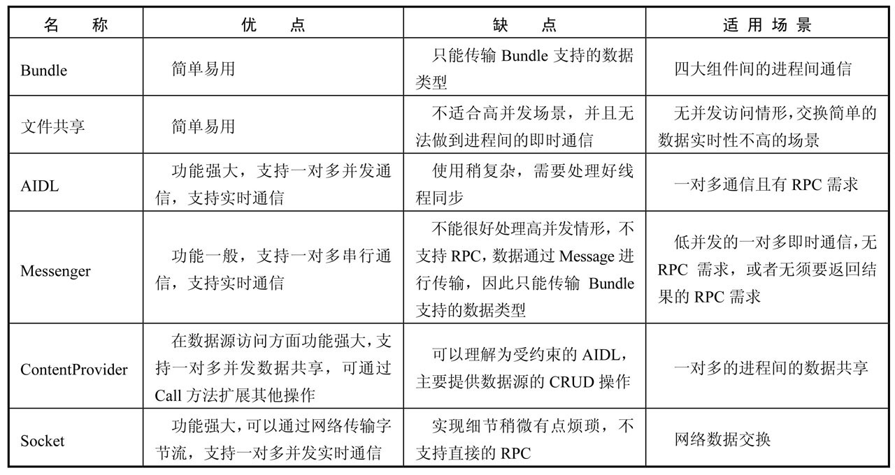


## Java

### Java 泛型

　　Java 泛型（generic）是 JDK 5 中引入的一个新特性，泛型提供了编译时类型安全检测机制，该机制允许程序员在编译时检测非法的类型。使用泛型机制编写的程序代码要比那些杂乱地使用 Object 变量，然后再进行强制类型转换地代码具有更好的安全性和可读性。泛型对于集合类尤其有用，例如，ArrayList 就是一个无处不在的集合类。

　　泛型的本质是参数化类型，也就是所操作的数据类型被指定为一个参数。

　　参数化类型就是将类型由原来的具体的类型参数化，类似于方法中的变量参数，此时类型也定义成参数形式（可以称之为类型形参）。

　　在使用 / 调用时传入具体的类型（类型实参）。

　　泛型的本质是为了参数化类型，在不创建新的类型情况下，通过泛型指定的不同类型来控制形参具体限制的类型。

　　操作的数据类型被指定为一个参数，这种参数类型可以用在类、接口和方法中，分别被称为泛型类、泛型接口、泛型方法。

* 泛型的特性：泛型只在编译阶段有效。

  在编译之后程序会采取去泛型化的措施。也就是说 Java 中的泛型，只在编译阶段有效。在编译过程中，正确检验泛型结果后，会将泛型的相关信息擦除，并且在对象进入和离开方法的边界处添加类型检查和类型转换的方法。也就是说，泛型信息不会进入到运行时阶段。

  对此总结成一句话：泛型类型在逻辑上看成是多个不同的类型，实际上都是相同的数据结构。

```java
List<String> stringArrayList = new ArrayList<String>();
List<Integer> integerArrayList = new ArrayList<Integer>();

Class classStringArrayList = stringArrayList.getClass();
Class classIntegerArrayList = integerArrayList.getClass();

if(classStringArrayList.equals(classIntegerArrayList)){
    Log.d("泛型测试","类型相同"); // 输出 泛型测试：类型相同
}
```

###  Java 代理

#### 代理模式

　　代理（Proxy）是一种设计模式。提供了间接对目标对象进行访问的方式，即通过代理对象访问目标对象。这样做的好处是：可以在目标对象实现的基础上，增强额外的功能操作，即扩展目标对象的功能。

　　这就符合了设计模式的开闭原则，即在对既有代码不改动的情况下进行功能的扩展。

　　这里使用到编程的一个思想：不要随意去修改别人已经写好的代码或者方法，如果需修改，可以通过代理的方式来扩展该方法。

　　代理模式的关键点是：代理对象与目标对象。代理对象是对目标对象的扩展，并会调用目标对象。

#### 三种代理模式

　　三种代理模式：静态代理、动态代理、Cglib 代理。

##### 静态代理

　　静态代理在使用时，需要定义接口或者父类，被代理对象与代理对象一起实现相同的接口或者是继承相同的父类。

　　需要注意的是：代理对象与目标对象要实现相同的接口，然后通过调用相同的方法来调用目标对象的方法。

　　在使用静态代理时，被代理对象与代理对象需要一起实现相同的接口或者是继承相同的父类，因此要定义一个接口或抽象类。

###### 静态代理总结

1. 优点：可以做到不修改目标对象的功能前提下，对目标功能扩展。
2. 缺点：因为代理对象需要与目标对象实现一样的接口，所以会有很多代理类，类太多。同时，一旦接口增加方法，目标对象与代理对象都要维护。

##### 动态代理

　　动态代理的主要特点就是能够在程序运行时 JVM 才为被代理对象生成代理对象。

　　动态代理有以下特点：

1. 代理对象，不需要实现接口。
2. 代理对象的生成，是利用 JDK 的 API，动态的在内存中构建代理对象，需要执行创建代理对象/目标对象实现的接口的类型。
3. 动态代理也叫做：JDK 代理、接口代理。

　　常说的动态代理也叫做 JDK 代理也是一种接口代理，JDK 中生成代理对象的代理类就是 Proxy，所在包是 java.lang.reflect。

　　JDK 实现代理只需要使用 Proxy 的 newProxyInstance 方法，该方法需要接收三个参数，完整的写法是：

```
static Object newProxyInstance(ClassLoader loader, Class<?>[] interfaces,InvocationHandler h )
```

　　注意该方法是在 Proxy 类中是静态方法，且接收的三个参数依次为：

1. ClassLoader load：指定当前目标对象使用类加载器，获取类加载器的方法是固定的。
2. Class< ? >[] interface：目标对象实现的接口的类型，使用泛型方式确认类型。
3. InvocationHandler h：事件处理，执行目标对象的方法时，会触发事件处理器的方法，会把当前执行目标对象的方法作为参数传入。

###### 动态代理总结

　　代理对象不需要实现接口，但是目标对象一定要实现接口，否则不能用动态代理，因此这也算是这种方式的缺陷。

##### Cglib 代理

　　上面的静态代理和动态代理模式有个共同点就是都是要求目标对象是实现一个接口的目标对象，然而并不是任何对象都会实现一个接口，有时候目标对象只是一个单独的对象，并没有实现任何的接口，这个时候就可以使用继承以目标对象子类的方式来实现代理，这种方法就叫做：Cglib 代理。

　　Cglib 代理，也叫做子类代理，它是在内存中构建一个子类对象从而实现对目标对象功能的扩展。

1. JDK 的动态代理有一个限制，就是使用动态代理的对象必须实现一个或多个接口，如果想代理没有实现接口的类，就可以使用 Cglib 实现。
2. Cglib 是一个强大的高性能的代码生成包，它可以在运行期扩展 java 类与实现 java 接口。它广泛的被许多 AOP 的框架使用，例如 Spring AOP 和 synaop，为他们提供方法的 interception（拦截）。
3. Cglib 包的底层是通过使用一个字节码处理框架 ASM 来转换字节码并生成新的类。不鼓励直接使用 ASM，因为他要求必须对 JVM 内部接口包括 class 文件的格式和指令集都很熟悉。

　　Cglib 子类代理实现方法：

1. 需要引入 cglib 的 jar 文件。
2. 引入功能包后，就可以在内存中动态创建子类。
3. 代理的类不能为 final，否则报错。
4. 目标对象的方法如果为 final static，那么就不会被拦截，即不会执行目标对象额外的业务方法。

　　在 Spring 的 AOP 编程中：如果加入容器的目标对象有实现接口，用 JDK 代理，如果目标对象没有实现接口，用 Cglib 代理。

### Java 反射

　　Java 中创建对象大概有这几种方式：

1. 使用 new 关键字：这是最常见的也是最简单的创建对象的方式。
2. 使用 Clone 的方法：无论何时调用一个对象的 clone 方法，JVM 就会创建一个新的对象，将前面的对象的内容全部拷贝进去。
3. 使用反序列化：当序列化和反序列化一个对象，JVM 会创建一个单独的对象。

　　上边是 Java 中常见的创建对象的三种方式，其实除了上面的三种还有反射。

　　Java 反射机制是在运行状态中，对于任意一个类，都能够知道这个类的所有属性和方法，对于任意一个对象，都能够调用它的任意方法和属性，这种动态获取信息以及动态调用对象方法的功能称为 Java 语言的反射机制。

　　反射就是把 Java 类中各个部分，映射成一个个的 Java 对象，拿到这些对象后可以做一些事情。

#### 用途

　　在日常的第三方应用开发过程中，经常会遇到某个类的某个成员变量、方法或是属性是私有的或是只对系统应用开放，这时候就可以利用 Java 的反射机制通过反射来获取所需的私有成员或方法。当然，也不是所有的都适合反射。有的类会在最终返回结果的地方对应用的权限进行校验，对于没有权限的应用返回值是没有意义的缺省值，否则返回实际值，这种就起到保护用户的隐私目的，这样通过反射得到的结果与预期不符。

　　一般来说反射是用来做框架的，或者说可以做一些抽象度比较高的底层代码，反射在日常的开发中用到的不多，但是搞懂了反射以后，可以帮助理解框架的一些原理，反射是框架设计的灵魂。

#### 反射原理

　　要想通过反射获取一个类的信息，首先要获取该类对应的 Class 类实例，Class 类的实例代表了正在运行中的 Java 应用的类和接口。Class 类没有公共的构造方法，Class 类对象是在二进制字节流（一般是 .class 文件，也可通过网络或 zip 包等路径获取）被 JVM 加载时，通过调用类加载器的 defineClass() 方法来构建的。

　　《 深入理解 Java 虚拟机 》一文中介绍，类从被加载到虚拟机内存中开始，到卸载出内存位置，它的整个生命周期包括：加载、连接、初始化、使用、卸载。而 JVM 在加载阶段要完成的 3 件事情中正好有 Class 对象的生成：

1. 通过一个类的全限定名来获取定义此类的二进制字节流。
2. 将这个字节流所代表的静态存储结构转换为方法区的运行时数据结构。
3. 在内存中生成一个代表这个类的 java.lang.Class 对象，作为方法区这个类的各种数据的访问入口。

#### 创建类实例的三种方式

1. Book.class
2. book1.getClass()
3. Class.forName("Book")

#### 反射机制的相关类

　　与 Java 反射相关的类如下：

| 类名           | 用途                                               |
| -------------- | -------------------------------------------------- |
| Class 类       | 代表类的实体，在运行的 Java 应用程序中表示类和接口 |
| Field 类       | 代表类的成员变量（成员变量也称为类的属性）         |
| Method 类      | 代表类的方法                                       |
| Constructor 类 | 代表类的构造方法                                   |

##### Class 类

　　一般写的代码是存储在后缀名是 .java 的文件里的，但是被编译后，最终真正去执行的是编译后的 .class 文件。Java 是面向对象的语言，一切皆对象，所以 java 认为这些编译后的 class 文件，这种事物也是一种对象，它也给抽象成了一种类，这个类就是 Class。

　　Class 代表类的实体，在运行的 Java 应用程序中表示类和接口。在这个类中提供了很多有用的方法。

##### Field 类

　　Field 代表类的成员变量（成员变量也称为类的属性）。

##### Method 类

　　Method 代表类的方法。

#### Constructor 类

　　Constructor 代表类的构造方法。

#### 在 Java 反射中 Class.forName 和 ClassLoader 的区别

##### Java 类加载过程

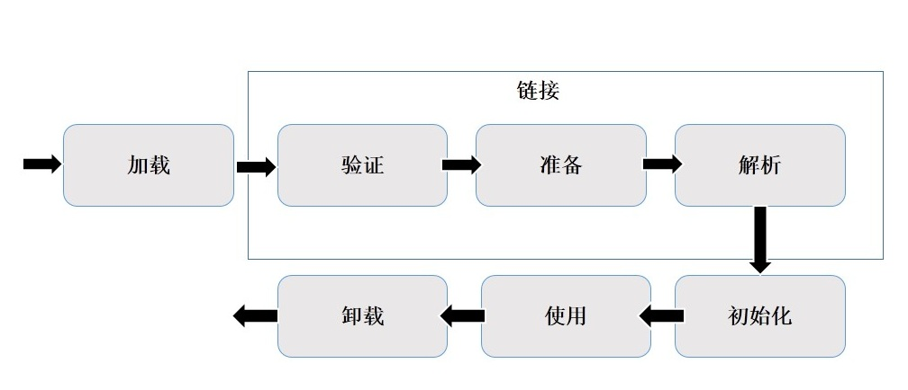

1. 装载：通过类的全限定名获取二进制字节流，将二进制字节流转换成方法区中的运行时数据结构，在内存中生成 Java.lang.class 对象。

2. 链接：执行下面的校验、准备和解析步骤，其中解析步骤是可以选择的。

* 校验：检查导入类或接口的二进制数据的正确性（文件格式验证、元数据验证、字节码验证、符号引用验证）。
* 准备：给类的静态变量分配并初始化存储空间；
* 解析：将常量池中的符号引用转成直接引用。

3. 初始化：激活类的静态变量的初始化 Java 代码和静态 Java 代码块，并初始化程序员设置的变量值。

##### 分析 Class.forName() 和 ClassLoader

　　在 java 中 Class.forName() 和 ClassLoader.loadClass() 都可以对类进行加载。ClassLoader 就是遵循双亲委派模型最终调用启动类加载器的类加载器，实现的功能是 “ 通过一个类的全限定名来获取此类的二进制字节流 ”，获取到二进制流后放到 JVM 中。

　　Class.forName() 方法实际上也是调用的 ClassLoader 来实现的。

##### Class.forName 和  ClassLoader 的区别

1. Class.forName 加载类时将类进行了初始化。
2. ClassLoader 的 loadClass 并没有对类进行初始化，只是把类加载到了虚拟机中。

### * Java 注解


### * Collection 与 Collections


### * ArrayList 与 LinkedList


### String、StringBuffer 与 StringBuilder 的区别

　　String、StringBuilder 与 StringBuffer 都是 Java 用来处理字符串的类，并且都是 final 类，不允许被继承。

#### 区别

　　区别主要在于两个方面，即运行速度和线程安全两个方面。

##### 运行速度

　　运行速度，也可以说是执行速度。这三者的运行速度从快到慢是：StringBuilder > StringBuffer > String。

　　String 运行速度最慢的原因与 String 的特性有关。String 是字符串常量，即 String 对象一旦创建之后该对象不可更改。对 String 进行操作就是一个不断创建新的对象并将旧的对象回收的过程，这导致效率低，并且会创建大量的内存，所以执行速度很慢。

　　而 StringBuilder 和 StringBuffer 的对象是变量，对变量进行操作就是直接对该对象进行更改，而不进行创建和回收操作，不会创建新的未使用对象，所以速度比 String 快很多。

　　而 StringBuilder 比 StringBuffer 快的原因是，StringBuffer 是需要同步的，所以执行速度慢。

##### 线程安全

　　在线程安全上，StringBuilder 是线程不安全的，而 StringBuffer 是线程安全的。

　　如果一个 StringBuffer 对象在字符串缓冲区被多个线程使用时，StringBuffer 中很多方法带有 synchronized 关键字，所以可以保证线程是安全的，但 StringBuilder 的方法则没有该关键字，所以不能保证线程安全，有可能会出现一些错误的操作。所以如果要进行的操作是多线程的，那么就要使用 StringBuffer，但是在单线程的情况下，还是建议使用速度比较快的 StringBuilder。

##### 其他区别

###### 实现接口

　　StringBuffer 与 StringBuilder 实现了 Serializable 和 CharSequare 两个接口，String 除了这两个接口，还实现了 Comparable< String > 接口，所以 String 的实例可以通过 compareTo 方法进行比较，而 StringBuffer 与 StringBuilder 不行。

###### 初始化

　　String 可以给字符空赋值，而 StringBuffer 和 StringBuilder 是不可以给字符赋 null 的。

#### 总结

1. **String：**适用于少量的字符串操作的情况。
2. **StringBuilder：**适用单线程下在字符缓冲区进行大量操作的情况。
3. **StringBuffer：**使用多线程下在字符缓冲区进行大量操作的情况。

### * List 的 remove 问题

### * Map

#### * HashMap

#### * HashMap 不是线程安全的分析

#### * HashMap 和 HashTable 的区别

#### * ConcurrentHashMap

#### * JDK1.7ConcurrentHashMap的源码分析

#### * JDK1.8ConcurrentHashMap的源码分析

### 线程

#### Executor、Executors、ExecutorService 知识

　　Executor 框架是 Java 5 中引入的，其内部使用了线程池机制，它在 java.util.cocurrent 包中，通过该框架来控制线程的启动、执行和关闭，可以简化并发编程的操作。因此，在 java 5 之后，通过 Executor 来启动线程比使用 Thread 的 start 方法更好，除了更易管理，效率更好（用线程池实现，节约开销）外，还有关键的一点：有助于避免 this 逃逸问题 -- 如果在构造器中启动一个线程，因为另一个任务可能会在构造器结束之前开始执行，此时可能会访问到初始化了一半的对象用 Executor 在构造器中。Executor 作为灵活且强大的异步执行框架，其支持多种不同类型的任务执行策略，提供了一种标准的方法将任务的提交过程和执行过程解耦开发，基于生产者-消费者模式，其提交任务的线程相当于生产者，执行任务的线程相当于消费者，并用 Runnable 来表示任务，Executor 的实现还提供了对生命周期的支持，以及统计信息收集、应用程序管理机制和性能监视等机制。

##### Executor 的 UML 图（常用的几个接口和子类）

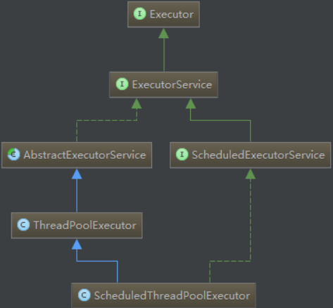

　　Executor 框架包括：线程池、Executor、Executors、ExecutorService、CompletionService、Future、Callable 等。

#####  Executor 和 ExecutorService

　　Executor：一个接口，其定义了一个接收 Runnable 对象的方法 executor，其方法签名为 executor(Runnable command)，该方法接收一个 Runable 实例，它用来执行一个任务，任务即一个实现了 Runnable 接口的类，一般来说，Runnable 任务开辟在新线程中的使用方法为：new Thread(new RunnableTask()).start()，但在 Executor 中，可以使用 Executor 而不用显示地创建线程：executor.execute(new RunnableTask());(异步处理)。

　　ExecutorService：是一个比 Executor 使用更广泛的子类接口，其提供了生命周期管理的方法，返回 Future 对象，以及可跟踪一个或多个异步任务执行状况返回 Future 的方法；可以调用 ExecutorService 的 shutdowm() 方法来平滑地关闭 ExecutorService，调用该方法后，将导致 ExecutorService 停止接收任何新的任务且等待已经提交的任务执行完成（已经提交的任务会分两类：一类是已经在执行的，另一类是还没有开始执行的），当所有已经提交的任务完毕后将会关闭 ExecutorService。因此一般用该接口来实现和管理多线程。

　　通过 ExecutorService.submit() 方法返回的 Future 对象，可以调用 isDone() 方法查询 Future 是否已经完成。当任务完成时，它具有一个结果，可以调用 get() 方法来获取该结果。也可以不用 isDone() 进行检查就直接调用 get() 获取结果，在这种情况下，get() 将阻塞，直到结果准备就绪，还可以取消任务的执行。Future 提供了 cancel() 方法用来取消执行 pending 中的任务。

##### Executors 类：主要用于提供线程池相关的操作

　　Executor 类，提供了一系列工厂方法用于创建线程池，返回的线程池都实现了 ExecutorService 接口。

1. public static ExecutorService newFiexedThreadPool(int Threads) 创建固定数目线程的线程池。
2. public static ExecutorService newCachedThreadPool()：创建一个可缓存的线程池，调用 execute 将重用以前构造的线程（如果线程可用）。如果没有可用的线程，则创建一个新线程并添加到池中。终止并从缓存中移除那些已有 60 秒钟未被使用的线程。
3. public static ExecutorService newSingleThreadExecutor()：创建一个单线程化的 Executor。
4. public static ScheduledExecutorService newScheduledThreadPool(int corePoolSize)：创建一个支持定时及周期性的任务执行的线程池，多数情况下可用来替代 Timer 类。

| 方法                        | 解释                                                         |
| --------------------------- | ------------------------------------------------------------ |
| newCachedThreadPool()       | 缓存型池子，先查看池中有没有以前建立的线程，如果有，就 reuse。如果没有，就建一个新的线程加入池中。<br /><br />缓存型池子通常用于执行一个生存期很短的异步型任务。因此在一些面向连接的 daemon 型 SERVER 中用得不多。但对于生存期短的异步任务，它是 Executor 的首选。<br /><br />能 reuse 的线程，必须是 timeout IDLE 内的池中线程，缺省 timeout 是 60s，超过这个 IDLE（空闲） 时长，线程实例将被终止及移出池。<br />注意，放入 ChachedThreadPool 的线程不必担心其结果，超过 TIMEOUT 不活动，其会自动被终止。 |
| newFixedThreadPool(int)     | newFixedThreadPool 与 cacheThreadPool 差不多，也是能 reuse 就用，但不能随时建新的线程。<br />其独特之处：任意时间点，最多只能有固定数目的活动线程存在，此时如果有新的线程要建立，只能放在另外的队列中等待，直到当前的线程中某个线程终止直接被移出池子。<br />和 cacheThreadPool 不同，FixedThreadPool 没有 IDLE 机制（可能也有，但既然文档没提，肯定非常长，类似依赖上层的 TCP 或 UDP IDLE 机制之类的），所以 FixedThreadPool 多数针对一些很稳定很固定的正规并发线程，多用于服务器。<br />从方法的源代码看，cache 池和 fixed 池调用的是同一个底层池，只不过参数不同：fixed 池线程数固定，并且是 0 秒 IDLE（无 IDLE）；cache 池线程数支持 0-Integer.MAX_VALUE（显然完全没考虑主机的资源承受能力），60 秒 IDLE。 |
| newScheduledThreadPool(int) | 调度型线程池。<br />这个池子里的线程可以按 schedule 依次 delay 执行，或周期执行。 |
| SingleThreadExecutor()      | 单例线程，任意时间池中只能有一个线程。<br />用的是和 cache 池和 fixed 池相同的底层池，但线程数目是 1，0 秒 IDLE（无 IDLE）。 |

##### Executor VS ExecutorService VS Executors

　　这三者均是 Executor 框架中的一部分。以下是这三者间的区别：

* Executor 和 ExecutorService 这两个接口主要的区别是：ExecutorService 接口继承了 Executor 接口，是 Executor 的子接口。
* Executor 和 ExecutorService 第二个区别是：Executor 接口定义了 execute() 方法用来接收一个 Runnable 接口的对象，而 ExecutorService 接口中的 submit() 方法可以接受 Runnable 和 Callable 接口的对象。 Executor 中的 execute() 方法不返回任何结果，而 ExecutorService 中的 submit() 方法可以通过一个 Future 对象返回运算结果。
* Executor 和 ExecutorService 接口第三个区别是除了允许客户端提交一个任务，ExecutorService 还提供用来控制线程池的方法。比如：调用 shutDown() 方法终止线程池。
* Executors 类提供工厂方法用来创建不同类型的线程池。比如：newSingleThreadExecutor() 创建一个只有一个线程的线程池，newFixedThreadPool(int numOfThreads) 来创建固定线程数的线程池，newCachedThreadPool() 可以根据需要创建新的线程，但如果已有线程是空闲的会重用已有线程。

##### 自定义线程池

　　自定义线程池，可以用 ThreadPoolExecutor 类创建，它有多个构造方法来创建线程池，用该类很容易实现自定义的线程池。

　　ThreadPoolExecutor 类的构造方法中各个参数的函数：

```java
public ThreadPoolExecutor(int corePoolSize,
                     int maximumPoolSize,
                     long keepAliveTime,
                     TimeUnit unit,
                     BlockingQueue<Runnable> workQueue);
```

coorPoolSize：线程池中所保存的核心线程数，包括空闲线程。

maximumPoolSize：池中允许的最大线程数。

keepAliveTime：线程池中的空闲线程所能持续的最长时间。

unit：持续时间的单位。

workQueue：任务执行前保存任务的队列，仅保存由 execute 方法提交的 Runnable 任务。

　　当试图通过 excute 方法将一个 Runnable 任务添加到线程池中时，按照如下顺序来处理：

1. 如果线程池中的线程数量少于 corePoolSize，即使线程池中有空闲线程，也会创建一个新的线程来执行新添加的任务；
2. 如果线程池中的线程数量大于等于 corePoolSize，但缓冲队列 workQueue 未满，则将新添加的任务放到 workQueue 中，按照 FIFO（先进先出）的原则依次等待执行（线程池中有线程空闲出来后依次将缓冲队列中的任务交付给空闲的线程执行）；
3. 如果线程池中的线程数量大于等于 corePoolSize，且缓冲队列 workQueue 已满，但线程池中的线程数量小于 maximumPoolSize，则会创建新的线程来处理新添加的任务；
4. 如果线程池中的线程数量等于了 maxmumPoolSize，有 4 种处理方式（该构造方法调用了含有 5 个参数的构造方法，并将最后一个构造方法设置为 RejectedExecutionHandler 类型，它在处理线程溢出时有 4 种方式）。

　　总结起来，也就是说，当有新的任务要处理时，先看线程池中的线程数量是否大于 corePoolSize，再看缓冲队列 workQueue 是否满，最后看线程池中的线程数量是否大于 maxmumPoolSize。

　　另外，当线程池中的线程数量大于 corePoolSize 时，如果里面有线程的空闲时间超过了 keepAliveTime，就将其移除线程池，这样，可以动态地调整线程池中线程的数量。

###### newChachedThreadPool() 方法

```java
public static ExecutorService newCachedThreadPool() {
   	return new ThreadPoolExecutor(0, Integer.MAX_VALUE,
                 60L, TimeUnit.SECONDS,
                 new SynchronousQueue<Runnable>());
    }
```

　　newCacheThreadPool() 方法调用的 ThreadPoolExecutor 的构造方法中：将 corePoolSize 设定为 0 ，而将 maximumPoolSize 设定为了 Integer 的最大值，线程空闲超过 60 秒，将会从线程池中移除。由于核心线程数为 0 ，因此每次添加任务，都会先从线程池中找空闲线程，如果没有就会创建一个线程来执行新的任务，并将该线程加入到线程池中，而最大允许的线程数为 Integer 的最大值，因此这个线程池理论上可以不断扩大。

###### newFixedThreadPool(int nThreads) 方法

```java
public static ExecutorService newFixedThreadPool(int nThreads) {
	return new ThreadPoolExecutor(nThreads, nThreads,
                  0L, TimeUnit.MILLISECONDS,
                  new LinkedBlockingQueue<Runnable>());
    }
```

　　newFixedThreadPool() 方法调用的 ThreadPoolExector 的构造方法中，将 corePoolSize 和 maximumPoolSize 都设定为了 nThreads，这样便实现了线程池的大小的固定，不会动态地扩大，另外，keepAliveTime 设定为了 0 ，也就是说线程只要空闲下来，就会被移除线程池。

###### 几种排队的策略

1. 直接提交。缓冲队列采用 synchronousQueue，它将任务直接交给线程处理而不保持它们。如果不存在可用于立即运行任务的线程（即线程池中的线程都在工作），则试图把任务加入缓冲队列将会失败，因此会构建一个新的线程来处理新添加的任务，并将其加入到线程池中。直接提交通常要求无界 maximumPoolSizes（integer.MAX_VALUE）以避免拒绝新提交的任务。newCachedThreadPool 采用的便是这种策略。
2. 无界队列。使用无界队列（典型的便是采用预定义容量的 LinkedBlockingQueue，理论上时该缓冲队列可以对无限多的任务排队）将导致在所有 corePoolSize 线程都工作的情况下将新任务加入到缓冲队列中。这样，创建的线程就不会超过 corePoolSize ，也因此，maximumPoolSize 的值就无效了。当每个任务完全独立于其他任务，即任务执行互不影响时，适合于使用无界队列。newFixedThreadPool 采用的便是这种策略。
3. 有界队列。当使用有限的 maximumPoolSIze 时，有界队列（一般缓冲队列使用 ArrayBlockingQueue，并制定队列的最大长度）有助于防止资源耗尽，但是可能较难调整和控制，队列大小和最大池大小需要互相折衷，需要设定合理的参数。

##### 比较 Executor 和 new Thread()

　　new Thread 的弊端如下：

1. 每次 new Thread 新建对象性能差。

2. 线程缺乏统一管理，可能无限制新建线程，相互之间竞争，极可能占用过多系统资源导致死机或 oom。

3. 缺乏更多功能，如定时执行、定期执行、线程中断。

   相比 new Thread，Java 提供的四种线程池的好处在于：

1. 重用存在的线程，减少对象创建、消亡的开销，性能佳。
2. 可有效控制最大并发线程数，提高系统资源的使用率，同时避免过多资源竞争，避免阻塞。
3. 提供定时执行、定期执行、单线程、并发控制等功能。

#### AtomicBoolean

##### 为什么使用 AtomicBoolean？

　　平时一般使用的 boolean 来表示布尔变量，但是在多线程框架下 boolean 是非线程安全的。

　　**boolean 非线程安全原因**：对于 boolean 变量主要有两个值，true 和 false。但是 true 和 false 是两个不同的常量对象，使用 synchronized 关键字时锁住的只是常量 true 或者常量 false。并没有锁住 boolean 变量。

　　使用 AutomicBoolean 类就可以解决 boolean 非线程安全的问题。

##### AtomicBoolean 的源码分析

　　在使用时，是通过调用 AtomicBoolean 的 compareAndSet(boolean expect， boolean update) 方法进行同步的。接下来查看该方法的代码：

```java
    public final boolean compareAndSet(boolean expect, boolean update) {
        int e = expect ? 1 : 0;
        int u = update ? 1 : 0;
        return unsafe.compareAndSwapInt(this, valueOffset, e, u);
    }
```

　　在 compareAndSet() 方法里面调用了 unsafe 的 compareAndSwapInt 方法，也就是使用了 CAS 机制。expect 和 update 的意思是现在的 boolean 如果不是 except 那就不更新，如果是我们预期的 except，那就更新，更新的值就是 update，也就是 CAS 原理。

　　在源码中还会发现，boolean 其实转换成了 int 类型，1 表示 true，0 表示 false。

##### CAS 原理

　　比较和交换（Compare And Swap）是用于实现多线程同步的原子指令。它将内存位置的内容与给定值进行比较，只有在相同的情况下，将该内存位置的内容修改为新的给定值，这是作为单个原子操作完成的，原则性保证新值基于最新信息计算。如果该值在同一时间被另一个线程更新，则写入将失败。操作结果必须说明是否进行替换，这可以通过一个简单的布尔响应（这个变体通常称为比较和设置），或通过返回从内存位置读取的值来完成。

　　**ABA 问题：**CAS 可以有效的提升并发的效率，但同时也会引入 ABA 问题。如线程 1 从内存 X 中取出 A，这时候另一个线程 2 也从内存 X 中取出 A ，并且线程 2 进行了一些操作将内存 X 中的值变成了 B，然后线程 2 又将内存 X 中的数据变成 A，这时候线程 1 进行 CAS 操作发现内存 X 中仍然是 A ，然后线程 1 操作成功。虽然线程 1 的 CAS 操作成功，但是整个过程就是有问题的。比如链表的头在变化了两次后恢复了原值，但是不代表链表没有变化。所以 Java 中提供了 **AtomicStampedReference** / **AtomicMarkableReference** 来处理会发生 ABA 问题的场景，主要是在对象中额外再增加一个标记来标识对象是否有过变更。

##### unsafe的知识

　　Unsafe 类在 jdk 源码的多个类中用到，这个类提供了一些绕开 JVM 的更底层功能，基于它的实现可以提供效率。但是它所分配的内存需要手动 free（不被 GC 回收）。Unsafe 类，提供了 JNI 某些功能的简单替代：确保高效性的同时，使事情变得更简单。

　　这类使属于 sun.* API 中的类，并且它不是 J2ES 中真正的一部分，因此可能会找不到任何的官方文档。

　　Unsafe API 的大部分方法都是 native 实现，它由 105 个方法组成，主要包括以下几类：

　　（1）Info 相关。主要返回某些低级别的内存信息：addressSize()、pageSize()。
　　（2）Object 相关。主要提供 Object 和它的域操作方法：allocateInstance()、objectFieldOffset()。
　　（3）Class 相关。主要提供 Class 和它的静态操纵方法：staticFieldOffset()、defineClass()、defineAnonymousClass()、ensureClassInitialized()。
　　（4）Arrays 相关。数据操纵方法：arrayBaseOffset()、arrayIndexScale()。
　　（5）Synchronization 相关。主要提供低级别同步原语（如基于 CPU 的 CAS(Compare-And-Swap)原语）：monitorEnter()、tryMonitorEnter()、monitorExit()、**compareAndSwapInt()**、putOrderedInt()。
　　（6）Memory 相关。直接内存访问方法（绕过 JVM 堆直接操纵本地内存）：allocateMemory()、copyMemory()、getAddress()、getInt()、putInt()。

　　Unsafe 分配的内存，不受 Integer.MAX_VALUE 的限制，并且分配到非堆内存，使用它时，需要非常谨慎：忘记手动回收时，会产生内存泄漏；非法的地址访问时，会导致 JVM 崩溃。在需要分配大的连续区域、实时编程（不能容忍 JVM 延迟）时，可以使用它。java.nio 使用这一技术。

　　通过使用 Unsafe.compareAndSwap() 可以用来实现高效的无锁数据结构。

　　Unsafe 的 compareAndSwap() 方法最终会对应到 cpu 的对应原语，因此，它的效率非常高。

#### 同步的知识

##### 内存模型的相关概念

　　计算机在执行程序时，每条指令都是在 CPU 中执行的，而执行指令过程中，势必涉及到数据的读写和写入。

　　由于程序运行过程中的临时数据是存放在主存（物理内存）当中的，而 CPU 执行速度很快，而从内存读取数据和向内存写入数据的过程跟 CPU 执行指令的速度比起来要慢的多，因此如果任何时候对数据的操作都要通过和主内存的交互来执行，会大大降低指令执行的速度。因此在 CPU 里面就有了高速缓存。

　　也就是，当程序在运行过程中，会将运算需要的数据从主存复制一份到 CPU 的高速缓存当中，那么 CPU 进行计算时就可以直接从它的高速缓存读取数据和向其中写入数据，当运算结束之后，再将高速缓存中的数据刷新到主内存当中。

　　如果一个变量在多个 CPU 中都存在缓存（一般在多线程编程时才会出现），那么就可能存在缓存不一致的问题。

　　为了解决缓存不一致性问题，通常来说有以下 2 中解决方法：

1. 通过在总线加 LOCK # 锁的方式

   在早期的 CPU 当中，是通过在总线上加 LOCK# 锁的形式来解决缓存不一致的问题。因为 CPU 和 其他部件进行通信都是通过总线来进行的，如果对总线加 LOCK# 锁的话，也就是说阻塞了其他 CPU 对其他部件访问（如内存），从而使得只能有一个 CPU 能使用这个变量的内存。这样虽然解决了缓存不一致的问题，但是由于在锁住总线期间，其他 CPU 无法访问内存，导致效率低下。

2. 通过缓存一致性协议

   由于总线加 LOCK# 锁导致效率低下，然后就出现了缓存一致性协议。最出名的就是 Intel 的 MESI 协议，MESI 协议保证了每个缓存中使用的共享变量的副本是一致的。

   缓存一致性核心的思想是：当 CPU 写数据时，如果发现操作的变量是共享变量，即在其他 CPU 也存在该变量的副本，会发出信号通知其他 CPU 将该变量的缓存行置为无效状态，因此当其他 CPU 需要读取这个变量时，发现自己缓存中缓存该变量的缓存行是无效的，那么它就会从内存重新读取。

   

　　这两种方式都是硬件层面上提供的方式。

##### 并发编程中的三个概念

###### 原子性

　　原子性：即一个操作或者多个操作要么全部执行并且执行的过程不会被任何因素打断，要不就都不执行。

　　原子性是拒绝多线程操作的，不论是多核还是单核，具有原子性的量，同一时刻只能有一个线程来对它进行操作。简而言之，在整个操作过程中不会被线程调度器中断的操作，都可认为是原子性。

　　而非原子性操作都会存在线程安全问题，需要使用同步技术来让它变成一个原子操作。

###### 可见性

　　可见性是指当多个线程访问同一个变量时，一个线程修改了这个变量的值，其他线程能够立即看达到修改的值。

###### 有序性

　　有序性：即程序执行的顺序按照代码的先后顺序执行。

　　Java 内存模型中的有序性可以总结为：如果在本线程内观察，所有操作都是有序的，如果在一个线程中观察另一个线程，所有操作都是无序的。

　　破坏有序性的原因：处理器为了提高程序运行效率，可能会对输入代码进行指令重排序优化，它不保证程序中各个语句的执行先后顺序同代码中的顺序一致，但是它会保证程序最终执行结果和代码顺序执行的结果是一致的，。

　　而指令重排序不会影响单个线程的执行，但是会影响到线程并发执行的正确性。

　　要想并发程序正确地执行，必须要保证原子性、可见性以及有序性。要是有一个没有被保证，就有可能会导致程序运行不正确。

##### Java 内存模型（JMM）

　　在 Java 虚拟机规范中试图定义一种 Java 内存模型（Java Memory Model，JMM）来屏蔽各个硬件平台和操作系统的内存访问差异，以实现让 Java 程序在各个平台下都能达到一致的内存访问效果。

　　JMM 定义了线程和主内存之间的抽象关系：Java 内存模型规定所有的变量都是存在主存当中（类似于物理内存）。每个线程都有自己的工作内存（类似于高速缓冲）。线程对变量的所有操作都必须在工作内存中进行，而不能直接对主存进行操作，并且每个线程不能访问其他线程的工作内存。

　　注意，为了获得较好的执行性能，Java 内存模型并没有限制执行引擎使用处理器的寄存器或者高速缓存来提升指令执行速度，也没有限制编译器对指令进行重排序。也就是说，在 java 内存模型中，也会存在缓存一致性问题和指令重排序的问题。

##### Java 语言本身对原子性、一致性以及有序性提供的保证

###### 原子性

　　Java 中的原子性操作包括：

1. 基本类型的读取和赋值操作，且赋值必须是数字赋值给变量，变量之间的相互赋值不是原子性操作。
2. 所有引用 reference 的赋值操作。
3. Java.concurrent.Atomic.* 包中所有类的一切操作，比如：AtomicInteger、AtomicLong、AtomicReference 等。

　　Java 内存模型只保证了上面的操作是原子性操作，如果要实现更大范围的原子性，可以通过 synchronized 和 Lock 来实现。由于 synchronized 和 Lock 能够保证任一时刻只有一个线程执行该代码块，那么自然就不存在原子性问题了，从而保证了原子性。 

###### 可见性

　　在多线程环境中，一个线程对共享变量的操作对其他线程是不可见的。Java 提供了 volatile 关键字来保证可见性。

　　当一个共享变量被 volatile 修饰时，表示线程本地内存无效，当一个线程修改共享变量后，它会保证修改的值会立即被更新到主存，当有其他线程需要读取时，它会去内存中读取新值。

　　而普通的共享变量不能保证可见性，因为普通共享变量被修改之后，什么时候被写入主存是不确定的，当其他线程去读取时，此时内存中可能还是原来的旧值，因此无法保证可见性。i

　　另外，通过 synchronized 和 Lock 也能够保证可见性，synchronized 和 Lock 能保证同一时刻只有一个线程获取锁然后执行同步代码，并且在释放锁之前会将变量的修改刷新到主内存中，因此可以保证可见性。 final 也是保证可见性的。

###### 有序性

 　　在 Java 内存模型中，允许编译器和处理器对指令进行重排序，但是重排序过程不会影响到单线程程序的执行，却会影响到多线程并发执行的正确性。

　　在 Java 里面，可以通过 volatile 关键字来保证一定的 “ 有序性 ”，因为 volatile 其本身包含 “ 禁止指令重排序 ” 的语义。另外可以通过 synchronized 和 Lock 来保证有序性，很显然，synchronized 和 Lock 保证每个时刻只有一个线程执行同步代码，相当于是让线程顺序执行同步代码，自然就保证了有序性。

　　Java 内存模型具备一些先天的 “ 有序性 ”，既不需要通过任何手段就能够得到保证的有序性，这个通常也称为 happends-before 原则（先行发生原则）。如果两个操作的执行次序无法从 happends-before 原则推导出来，那么就不能保证它们的有序性，虚拟机可以随意对它们进行重排序。

　　happends-before 原则（先行发生原则）：

* 程序次序规则：一个线程内，按照代码顺序，书写在前面的操作先行发生于书写在后面的操作。
* 锁定规则：一个 unLock 操作先行发生于后面对同一个锁的 lock 操作。
* volatile 变量规则：对一个变量的写操作先行发生于后面对这个变量的读操作。
* 传递规则：如果操作 A 先行发生于操作 B，而操作 B 又先行发生于操作 C，则可以得出操作 A 先行发生于操作 C。
* 线程启动规则：Thread 对象的 start() 方法先行发生于此线程的每一个动作。
* 线程中断规则：对线程 interrupt() 方法的调用先行发生于被中断线程的代码检测到中断事件的发生。
* 线程终结规则：线程中所有的操作都先行发生于线程的终止检测，可以通过 Thread.join() 方法结束、Thread.isAlive() 的返回值手段检测到线程已经终止执行。
* 对象终结规则：一个对象的初始化完成先行发生于它的 finalize() 方法的开始。

##### 锁的互斥与可见性

　　锁提供了两种主要特性：**互斥**（mutual exclusion）和**可见性**（visibility）。

1. 互斥即一次只允许一个线程持有某个特定的锁，一次就只有一个线程能够使用该共享锁。

2. 可见性必须确保释放锁之前对共享数据做出的更改对于随后获得该锁的另一个线程是可见的。也即当一条线程改变了共享变量的值，新值对于其他线程来说是可以立即得知的。

   如果没有同步机制提供的这种可见性保证，线程看到的共享变量可能是修改前的值或不一致的值，这将引发许多严重问题。

#### volatile 知识

##### volatile 定义

　　Java 语言规范第三版中对 volatile 的定义如下：java 编程语言允许线程访问共享变量，为了确保共享变量能被准确和一致的更新，线程应该确保通过排他锁单独获得这个变量。Java 语言提供了 volatile，在某些情况下比锁更加方便。如果一个字段被声明成 volatile，java 线程内存模型确保所有线程看到这个变量的值是一致的。

　　volatile 是一个类型修饰符，volatile 的作用是作为指令关键字，确保本条指令不会因编译器的优化而忽略。

　　一旦一个共享变量（类的成员变量、类的静态成员变量）被 volatile 修饰之后，那么就具备了两层语义：

1. 保证了不同线程对这个变量进行操作时的可见性，即一个线程修改了某个变量的值，那新值对其他线程来说是立即可见的。
2. 禁止进行指令重排序。

##### volatile 的内存语义

　　happends-before （先行发生原则）对 volatile 的定义：volatile 变量的写，先发生于后续对这个变量的读。

　　所以 volatile 的内存含义：

1. 当写一个 volatile 变量时，JMM（Java 内存模型） 会把该线程对应的本地内存中的共享变量值刷新到主内存。
2. 当读一个 volatile 变量时，JMM（Java 内存模型）会把该线程对应的本地内存置为无效，接下来将从主内存中读取共享变量，并更新本地内存的值。

##### volatile 的特性

* **可见性**：对一个 volatile 的变量的读，总是能看到任意线程对这个变量最后的写入。在写一个 volatile 变量时，JMM 会把该线程本地内存中的变量强制刷新到住内存中去，即一个线程修改了某个变量的值，这新值对其他线程来说是立即可见的。

* **单个读或者写具有原子性**：对于单个 volatile 变量的读或者写具有原子性，复合操作不具有（如 i++）。

* **互斥性**：同一时刻只允许一个线程对变量进行操作（互斥锁的特点）， volatile 写操作会导致其他线程中的缓存无效。

* **有序性**：禁止指令重排序。

  重排序是指编译器和处理器为了优化程序性能而对指令序列进行排序的一种手段。

  重排序需要遵守一定规则：

  * 重排序操作不会对存在数据依赖关系的操作进行重排序。
  * 重排序是为了优化性能，但是不管怎么重排序，单线程下程序的执行结果不能被改变。

##### volatile 的原理和实现机制

　　为了提高处理速度，处理器不直接和内存进行通信，而是先将系统内存的数据读到内部缓存后再进行操作，但操作完不知道何时会写到系统内存。

　　如果对声明了 volatile 的变量进行写操作，JVM 就会向处理器发送一条 lock 前缀的指令，将这个变量所在缓存行的数据写回到系统内存。

　　为了保证各个处理器的缓存是一致的，实现了缓存一致性协议（MESI），每个处理器通过嗅探在总线上传播的数据来检查自己缓存的值是不是过期了，当处理器发现自己缓存行对应的内存地址被修改，就会将当前处理器的缓存行设置为无效状态，当处理器对这个数据进行修改操作的时候，如果发现本地缓存失效，会重新从系统内存中把数据读到处理器缓存里，既可以获取当前最新值。

　　volatile 变量通过这样的机制就使得每个线程都能获得该变量的最新值

###### 1. lock 指令

　　《深入理解 Java 虚拟机》的一段话：“ 观察加入 volatile 关键字和没有加入 volatile 关键字时所生成的汇编代码发现，加入 volatile 关键字时，会多出一个 lock 前缀指令 ”。

　　lock 前缀指令实际上相当于一个内存屏障。内存屏障，又称内存栅栏，是一个 CPU 指令。

　　lock 前缀的指令在多核处理器下会引发两件事情：

1. 将当前处理器缓存行的数据写回到系统内存。
2. 写回内存的操作会使在其他 CPU 里缓存了该内存地址的数据无效。

　　在 Pentium 和早期的 IA-32 处理器中，lock 前缀会使处理器执行当前指令时产生一个 LOCK# 信号，会对总线进行锁定，其他 CPU 对内存的读写请求都会被阻塞，直到锁释放。因为锁总线的开销比较大，锁总线期间其他 CPU 没法访问内存。后来的处理器，加锁操作是由高速缓存锁代替总线锁来处理。

　　这种场景多缓存的数据一致通过缓存一致性协议（MESI）来保证。

###### 2. 缓存一致性

　　缓存是分段（line）的，一个段对应一块存储空间，称之为缓存行，它是 CPU 缓存中可分配的最小存储单元，大小 32 字节、64 字节、128 字节不等，这与 CPU 架构有关，通常来说是 64 字节。

　　LOCK# 因为锁总线效率太低，因此使用了多组缓存。

　　为了使其行为看起来如同一组缓存那样，因而设计了缓存一致性协议。

　　缓存一致性协议有很多，但是日常处理的大多数计算机设备都属于 “ 嗅探 ” 协议。

　　所有内存的传输都发生在一条共享的总线上，而所有的处理器都能看到这条总线。

　　缓存本身是独立的，但是内存是共享资源，所有的内存访问都要经过仲裁（同一个指令周期中，只有一个 CPU 缓存可以读写内存）。

　　CPU 缓存不仅仅在做内存传输的时候才与总线打交道，而是不停的嗅探总线上发生的数据交换，跟踪其他缓存在做什么。

　　当一个缓存代表它所属的处理器去读写内存时，其他处理器都会得到通知，它们以此来使自己的缓存保持同步。

　　只要某个处理器写内存，其他处理器马上知道这块内存在它们的缓存段中已经失效。

###### 3. volatile 禁止重排序

**volatile 禁止重排序的语义实现**

　　在程序运行时，为了提高执行性能，JMM 在不改变正确语义的前提下，会允许编译器和处理器对指令进行重排序，JMM 为了保证在不同的编译器和 CPU 上有相同的结果，会在生成指令序列时在适当的位置插入特定类型的内存屏障指令来禁止特定类型的编译器重排序和处理器重排序，告诉编译器和 CPU：不管什么指令都不能和这条 Memory Barrier 指令重排序。

　　内存屏障会提供 3 个功能：

1. 它确保指令重排序时不会把其后面的指令排到内存屏障之前的位置，也不会把前面的指令排到内存屏障的后面；即在执行到内存屏障这句指令时，在它前面的操作已经全部完成。
2. 它会强制将对缓存的修改操作立即写入主存。
3. 如果是写操作，它会导致其他 CPU 中对应的缓存行无效。

　　而为了实现 volatile 的内存语义，编译器在生成字节码时，就会在指令序列中插入内存屏障来禁止特定类型的处理器重排序。

**volatile 禁止重排序的意思**

　　volatile 关键字禁止指令重排序有两层意思：

1. 当程序执行到 volatile 变量的读操作或者写操作时，在其前面的操作更改肯定全部已经进行，且结果已经对后面的操作可见，在其后面的操作肯定还没有进行。
2. 在进行指令优化时，不能将在对 volatile 变量访问的语句放在其后面执行，也不能把 volatile 变量后面的语句放到其前面执行。

**volatile 重排序规则**

　　从表中归纳：

* 当第一个操作是 volatile 读时，不管第二个操作是什么，都不能重排序。确保 volatile 读之后的操作不会被重排序到 volatile 读之前。
* 当第二个操作是 volatile 写时，不管第一个操作是什么，都不能重排序。确保 volatile 写之前的操作不会背重排序到 volatile 写之后。
* 当第一个操作是 volatile 写，第二个操作是 volatile 读时，不能重排序。

　　对于编译器来说，发现一个最优布置来最小化插入屏障的总数几乎是不可能的，为此，JMM 采取了保守的策略。volatile 指令序列中插入内存屏障：

* 在每个 volatile 写操作的前面插入一个 StoreStore 屏障。
* 在每个 volatile 写操作的后面插入一个 StoreLoad 屏障。
* 在每个 volatile 读操作的后面插入一个 LoadLoad 屏障。
* 在每个 volatile 读操作的后面插入一个 LoadStore 屏障。

　　volatile 写是在前面和后面分别插入内存屏障，而 volatile 读操作是在后面插入两个内存屏障。

* StoreStore 屏障：禁止上面的普通写和下面的 volatile 写重排序。
* StoreLoad 屏障：防止上面的 volatile 写于下面可能有的 volatile 读/写重排序。
* LoadLoad 屏障：禁止下面所有的普通读操作和上面的 volatile 读重排序。
* LoadStore 屏障：禁止下面所有的普通写操作和上面的 voaltile 读重排序。

**volatile 写内存屏障**

　　StoreStore 屏障：可以保证在 volatile 写之前，其前面的所有普通写操作已经对任意处理器可见了。

　　StoreLoad 屏障：将 volatile 写操作刷新到内存。

　　由此达到，volatile 写立马刷新到主内存的效果。

**volatile 读内存屏障**

　　LoadLoad 屏障：保障后续是读操作时，volatile 读装载到内存数据。

　　LoadStore 屏障：保障后续是写操作时，volatile 读装载到内存数据。

　　由此达到，volatile 读从主内存中读取共享变量，并更新本地内存的值。

##### volatile 与 synchronized

　　synchronized 关键字是防止多个线程同时执行一段代码，但是这样会影响程序执行效率，而 volatile 关键字在某些情况下性能要优于 synchronzied，但是要注意 volatile 关键字是无法替代 synchronized 关键字的，因为 volatile 关键字无法保证操作的原子性。

　　相比于 synchronized （synchronized 通常称为重量级锁），volatile 更轻量级（也被称为轻量级的 synchronzied），因为它不会引起线程的阻塞从而导致上下文的切换和调度，但是 volatile 比 synchronized 的同步性较差。

##### volatile 的使用条件

　　通常来说，使用 volatile 必须具备以下 2 个条件：

1. 对变量的写操作不依赖于当前值或能够保证只有单线程改变变量的值。

   如 i++ 操作（包括读取变量的初始值、进行加 1 操作、写入工作内存三个操作），变量的写操作依赖当前值，所以不能保证线程安全。可以通过使用 synchronized、Lock、AtomicInteger 来解决 i++ 同步的问题。

   可见性只能保证每次读取的是最新的值，但是 volatile 没办法保证对变量的操作的原子性。

2. 该变量没有包含在具体其他变量的不变式中

   如 i < value ，即使 i 变量声明为 volatile，但是 value 可能在运行判断的时候发生变化，所以也不能保证线程安全。

　　实际上，这些条件表明，可以被写入 volatile 变量的这些有效值独立于任何程序的状态，包括变量的当前状态，也就是保证操作是原子性操作，才能保证使用 volatile 关键字的程序在并发时能够正确执行。

##### 开销较低的 读 - 写 锁策略

　　volatile 的功能还不足以实现计数器，因为 ++x 实际上是三种操作（读、添加、存储）的简单组合，如果多个线程凑巧试图同时对 volatile 计数器执行增量操作，那么它的更新值有可能会丢失。

　　当读远多于写，结合使用内部锁和 volatile 变量来减少同步的开销。

　　利用 volatile 保证读取操作的可见性；利用 synchronized 保证复合操作的原子性。

　　如果更新不频繁的话，该方法可实现更好的性能，因为读路径的开销仅仅涉及 volatile 读操作，这通常要优于一个无竞争的锁获取的开销。

```java
public class Counter {
	private volatile int value;
	//利用 volatile 保证读取操作的可见性，读取时无需加锁
	public int getValue() {
		return value;
	}
	//使用 synchronized 加锁
	public synchronized int increment(){
		return value++;
	}
}
```

##### 双重检查（double - checked）

　　线程安全的单例模式实现方式就是双重检查。

```java
//基于 volatile 的解决方案
public class SafeDoubleCheckSingleton {
	//通过 volatile 声明，实现线程安全的延迟初始化
	private volatile static SafeDoubleCheckSingleton singleton;
	private SafeDoubleCheckSingleton(){}
	public static SafeDoubleCheckSingleton getInstance(){
		if (singleton == null){
			synchronized(SafeDoubleCheckSingleton.class){
				if (singleton == null){
					//原理利用 volatile 在于 禁止 “初始化对象” 和 “设置 singleton 指向内存空间” 的重排序
					singleton = new SafeDoubleCheckSingleton();
				}
			}
		}
        return singleton;
	}
	
}
```

　　在多线程环境中，如果没有对对象声明为 volatile，将可能出现以下情况，其他线程可能得到的是 null，而不是完成初始化的对象。

　　也推荐单例模式的懒加载优雅写法 Initialization on Demand Holder(IODH)：

```java
public class Singleton {  
    static class SingletonHolder {  
        static Singleton instance = new Singleton();  
    }  
      
    public static Singleton getInstance(){  
        return SingletonHolder.instance;  
    }  
}
```

#### synchronized 知识

##### synchronized 的三种使用方式

###### 1. 修饰实例方法

　　修饰实例方法，作用于当前对象实例加锁，进入同步代码前要获取当前对象**实例**的锁。

###### 2. 修饰静态方法

　　作用于当前类对象加锁，进入同步代码前要获得当前**类对象**的锁。也就是给当前类加锁，会作用于类的所有对象实例，因为静态成员不属于任何一个实例对象，是类成员（static 表明这是该类的一个静态资源，不管 new 了多少个对象，只有一份，所以对该类的所有对象都加了锁）。

　　所以如果一个线程 A 调用一个实例对象的非静态 synchronized 方法，而线程 B 需要调用这个实例对象所属类的静态 synchronized 方法，是允许的，不会发生互斥现象，因为访问静态 synchronized 方法占用的锁是当前类的锁，而访问非静态 synchronized 方法占用的锁是当前实例对象锁。

###### 3. 修饰代码块

　　指定加锁对象，对给定对象加锁，进入同步代码库前要获得给定对象的锁。

　　和 synchronized 方法一样，synchronized (this) 代码块也是锁定当前对象的。而 synchronized 关键字加到 static 静态方法和 synchronized(class) 代码块上都是是给 Class 类上锁。

　　尽量不要使用 synchronized(String a)，因为 JVM 中，字符串常量具有缓冲功能。 

##### synchronized 的使用案例

* 同一个类中的 synchronized 方法与普通方法之间互斥吗？不互斥

* 同一个类中 synchronized 方法可以调用其他的 synchronized 方法吗？可以

  synchronized 是可重入锁，可以理解为同一个线程在已经持有该锁的情况下，可以再次获取锁，并且会在某个状态量上做 +1 操作。

* 子类同步方法 synchronized 方法可以调用父类的 synchronized 方法吗？可以

* 静态同步方法和非静态同步方法互斥吗？不

  同步静态方法的锁是所在类的 Class 对象，而同步普通方法的锁是 this 对象，两个的锁不同，所以不会互斥。

##### synchronized 关键字底层原理

　　synchronized 关键字底层原理属于 JVM 层面。

###### synchronized 同步语句块的情况

```java
public class SyncrhonziedDemo {
	public void method(){
		synchronized (this) {
			System.out.println("synchronized 代码块");
		}
	}
}
```

　　synchronized 同步语句块的实现使用的是 monitorenter 和 monitorexit 指令，其中 monitorenter 指令指向同步代码块的开始位置，monitorexit 指令则指向同步代码块的结束位置。

　　当执行 monitorenter 指令时，线程试图获取锁也是获取 monitor（monitor 对象存在于每个 Java 对象的对象头中，synchronized 锁便是通过这种方式获取锁的，也是为什么 Java 中任意对象可以作为锁的原因）的持有权。

　　当计数器为 0 则可以成功获取，获取后将锁计数器加 1。

　　相应的在执行 monitorexit 指令后，将锁计数器减 1 ，表明当前锁被释放。

　　如果获取对象锁失败，那当前线程就要阻塞等待，直到锁被另外一个线程释放为止。

###### synchronized 修饰方法的情况

```java
public class SynchronizedDemo2 {
	public synchronized void method() {
		System.out.println("synchronized 方法");
	}
}
```

　　synchronized 修饰的方法并没有 monitorenter 指令和 monitorexit 指令，取而代之的是 ACC_SYNCHRONIZED 标识，该标识指明了该方法是一个同步方法，JVM 通过该 ACC_SYNCHRONIZED 访问标志来辨别一个方法是否声明为同步方法，从而执行相应的同步调用。

##### JDK 1.6 之后的底层优化

　　在 Java 早期版本中，synchronized 属于重量级锁，效率低下，因为监视器锁（monitor）是依赖于底层的操作系统的 Mutex Lock 来实现的，Java 的线程是映射到操作系统的原生线程之上的。如果要挂起或者唤醒一个线程，都需要操作系统完成，而操作系统实现线程之间的切换时需要从用户态转换到内核态，这个状态之间的转换需要相对比较长的时间，时间成本相对较高，这也是为什么早期的 synchronized 效率低的原因。

　　在 Java 6 之后 Java 官方从 JVM 层面对 synchronized 做了较大优化，所以现在的 synchronized 锁效率也优化的很不错了。而 JDK 1.6 对锁的优化，增加了自旋锁、适应性自旋锁、锁消除、锁粗化、偏向锁、轻量级锁等技术来减少锁操作的开销。

　　锁主要存在四种状态，依次是：无锁状态、偏向锁状态、轻量级锁状态、重量级锁状态，它们会随着竞争的激烈而逐渐升级。注意锁可以升级不可降级，这种策略是为了提高获得锁和释放锁的效率。

##### synchronized 和 ReentrantLock 的对比

###### 1. 两者都是可重入锁

　　synchronized 和 ReentrantLock 都是可重入锁。

　　” 可重入锁 “ 概念是：自己可以再次获取自己的内部锁。比如一个线程获得了某个对象的锁，此时这个对象锁还没有释放，当其再次想要获取这个对象的锁的时候还是可以获取的，如果不可锁重入的话，就会造成死锁。同一个线程每次获取锁，锁的计数器都自增 1 ，所以要等到锁的计数器下降为 0 时才能释放锁。

###### 2. synchronized 依赖于 JVM 而 ReentrantLock 依赖于 API

　　synchronized 是依赖于 JVM 实现的，虚拟机团队在 JDK 1.6 为 synchronized 关键字进行了很多优化，但是这些优化都是在虚拟机里面实现的，并没有直接暴露出来。

　　ReentrantLock 是 JDK 层面实现的（也就是 API 层面，需要 lock() 和 unlock() 方法配合 try/finally 语句块来完成），所以可以通过查看源代码来查看它的具体实现。

###### 3.ReentrantLock 比 synchronized 增加了一些高级功能

　　相比 synchronized ，ReentrantLock增加了一些高级功能。主要来说有三点：1. 等待可中断；2.可实现公平锁；3.可实现选择性通知（锁可以绑定多个条件）。

* ReentrantLock 提供了一种能够中断等待锁的线程的机制。

  通过 lock.lockInterruptibly() 来实现这个机制。也就是说正在等待的线程可以选择放弃等待，改为处理其他事情。

* ReentrantLock 可以指定是公平锁还是非公平锁。

  而 synchronized 只能是非公平锁。所谓的公平锁就是先等待的线程先获得锁。

  ReentrantLock 默认情况下是非公平的，可以通过 ReentrantLock 类的 ReentrantLock (boolean fair) 构造方法来指定是否是公平的。

* synchronized 关键字与 wait() 和 notify/notifyAll() 方法结合可以实现等待 / 通知机制，ReentrantLock 类当然也可以实现，但是需要借助于 Condition 接口与 newCondition() 方法。

  Condition 是 JDK 1.5 后才有的，它具有很好的灵活性，比如可以实现多路通知功能也就是在一个 Lock 对象中可以创建多个 Condition 实例（即对象监视器），线程对象可以注册在指定的 Condition 中，从而可以有选择性的进行线程通知，在调度线程上更加灵活。

  在使用 notify/notifyAll() 方法进行通知时，被通知的线程是由 JVM 选择的，用 ReentrantLock 类结合 Condition 实例可以实现 ” 选择性通知 “，这个功能非常重要，而且是 Condition 接口默认提供的。

  而 synchronized 关键字就相当于整个 Lock 对象中只有一个 Condition 实例，所有的线程这样会造成很大的效率问题，而 Condition 实例的 singalAll() 方法只会唤醒注册在该 Condition 实例上的所有等待线程。

　　如果想使用上述功能，那么选择 ReentrantLock 是一个不错的选择。

###### 4. 性能已不是选择标准

　　在 JDK 1.6 之前，synchronized 的性能是比 ReentrantLock 差很多。具体表示为 synchronized 关键字吞吐量随线程数的增加，下降得非常严重。而 ReentrantLock 基本保持一个比较稳定的水平。但是在 JDK 1.6 之后 JVM 团队对 synchronized 关键字做了很多优化，所以 JDK 1.6 之后，synchronized 和 ReentrantLock 的性能基本是持平了。

　　在 JDK 1.6 之后，性能已经不是选择 synchronized 和 ReentrantLock 的影响因素了。而且虚拟机在未来的性能改进中会更偏向于原生的 synchronized，所以还是提倡在 synchronized 能满足需求的情况下，优先考虑使用 synchronized 关键来进行同步，优化后的 synchronized 和 ReentrantLock 一样，在很多地方都是用到了 CAS 操作。

**第2种答案**

**ReentrantLock**

* ReentrantLock 是 JDK 方法，需要手动声明加锁和释放锁，因此语法相对复杂些，如果忘记释放锁容易导致死锁。
* ReentrantLock 具有更好的细粒度，可以在 ReentrantLock 里面设置内部 Condition 类，可以实现分组唤醒需要唤醒的线程。
* ReentrantLock 能实现非公平锁和公平锁。

**synchronized**

* synchronized 语法上简洁方便。
* synchronized 是 JVM 方法，由编辑器保证加锁和释放锁。
* sunchronized 只能实现非公平锁。

**第3中答案**

###### 1. 中断等待

　　ReentrantLock 拥有 synchronized 相同的并发性和内存语义，此外还多了锁投票，定时锁等待和中断锁等候。

　　线程 A 和 B 都要获取对象 O 的锁定，假设 A 获取了对象 O 锁，B 将等待 A 释放对 O 的锁定。

* 如果使用 synchronized，如果 A 不释放，B 将一直等下去，不能被中断。
* 如果使用 ReentrantLock，如果 A 不释放，可以使 B 在等待了足够长的时间以后，中断等待，而干别的事情。

ReentrantLock 获取锁定有三种方式

1. lock()，如果获取了锁立即返回，如果别的线程持有锁，当前线程则一直处于休眠状态，直到获取锁。
2. tryLock()，如果获取了锁立即返回 true，如果别的线程正持有锁，立即返回 false。
3. tryLock(long timeout, TimeUnit unit)，如果获取了锁立即返回 true，如果别的线程正持有锁，会等待参数给定的时间，在等待的过程中，如果获取了锁，就返回 true，如果等待超时，返回 false。
4. lockInterruptibly：如果获取了锁立即返回，如果没有获取锁，当前线程处于休眠状态，直到获取锁定，或者当前线程被别的线程中断。

###### 2. 可实现公平锁

　　对于 Java ReentrantLock 而言，通过构造函数指定该锁是否是公平锁，默认是非公平锁。非公平锁的优点在于吞吐量比公平锁大。

###### 3. 锁绑定多个条件

　　锁绑定多个条件是指一个 ReentrantLock 对象可以同时绑定多个 Condition 对象，而在 synchronized 中，锁对象的 wait() 和 notify() 或 notifyAll() 方法可以实现一个隐含的条件，如果要和多于一个的条件关联的时候，就不得不额外地添加一个锁，而 ReentrantLock 则无须这样做，只需要多次调用 newCondition() 方法即可。

###### synchronized 的优势

　　synchronized 是在 JVM 层面上实现的，不但可以通过一些监控工具监控 synchronized 的锁定，而且在代码执行时出现异常，JVM 会自动释放锁，但是使用 Lock （ReentrantLock、ReentrantReadWriteLock ）则不行，Lock 是通过代码实现的，要保证锁一定会被释放，就必须将 unLock() 放到 finally{} 中。

###### 应用场景

　　在资源竞争不是很激烈的情况下，synchronized 的性能要优于 ReentrantLock，但是在资源竞争很激烈的情况下，synchronized 的性能会下降几十倍，但是 ReentrantLock 的性能能维持常态。

#### * Condition 知识

　　在 Java 中，对于任意一个 java 对象，它都拥有一组定义在 java.lang.Object 上监视器方法，包括 wait()、wait(long timeout)、notify()、notifyAll()，这些方法配合 synchronized 关键字一起使用可以实现等待/通知模式。

　　同样，Condition 接口也提供了类似 Object 监视器的方法，通过与 Lock 配合来实现等待/通知模式。

##### Condition 与 Object 监视器对比

　　为了更好的了解 Condition 的特性，来对比一下两者的使用以及功能特性：

| 对比项                                             | Object 监视器                  | Condition                                                    |
| -------------------------------------------------- | ------------------------------ | ------------------------------------------------------------ |
| 前置条件                                           | 获取对象的锁                   | 调用 Lock.lock 获取锁，调用 Lock.newCondition 获取 Condition 对象 |
| 调用方式                                           | 直接调用，比如 object.notify() | 直接调用，比如 condition.await()                             |
| 等待队列的个数                                     | 一个                           | 多个                                                         |
| 当前线程释放锁进入等待状态                         | 支持                           | 支持                                                         |
| 当前线程释放锁进入等待状态，在等待状态中不响应中断 | 不支持                         | 支持                                                         |
| 当前线程释放锁并进入超时等待状态                   | 支持                           | 支持                                                         |
| 当前线程释放锁并进入等待状态直到将来的某个时间点   | 不支持                         | 支持                                                         |
| 唤醒等待队列中的一个线程                           | 支持                           | 支持                                                         |
| 唤醒等待队列中的全部线程                           | 支持                           | 支持                                                         |

#### * 锁的知识

##### AQS

　　AbstractQueuedSynchronzied 抽象对象式的同步器，AQS 定义了一套多线程访问共享资源的同步器框架，许多同步类实现都依赖于它，如常用的 ReentrantLock/Semaphore/CountDownLatch 等。

　　AQS 维护了一个 volatile int state（代表共享资源）和一个 FIFO 线程等待队列（多线程争用资源被阻塞时会进入此队列）。

　　state 的访问方式有三种：

```java
getState()
setState()
compareAndSetState()
```

　　AQS 定义两种资源共享方式：Exclusive（独占，只有一个线程能执行，如 ReentrantLock）和 Share（共享，多个线程可同时执行，如 Semaphore/CountDownLatch）。

　　不同的自定义同步器争用共享资源的方式也不同。自定义同步器在实现时只需要实现共享资源 state 的获取与释放方式即可，至于具体线程等待队列的维护（如获取资源失败入队/唤醒出队等），AQS 已经在顶层实现好了。自定义同步器实现时主要实现以下几种方法：

```java
isHeldExclusively()：该线程是否正在独占资源。只有用到 condition 才需要去实现它。
tryAquire(int)：独占方式。尝试获取资源，成功则返回 true，失败则返回 false.
tryRelease(int)：独占方式。尝试释放资源，成功则返回 true，失败则返回 false。
tryAcquireShared(int)：共享方式。尝试获取资源。负数表示失败；0 表示成功，但没有剩余可用资源；正数表示成功，且有剩余资源。
tryReleaseShared(int)：共享方式。尝试释放资源，如果释放后允许唤醒后续等待节点返回 true，否则返回 false。
```

　　以 ReentrantLock 为例，state 初始化为 0，表示未锁定状态。A 线程 lock() 时，会调用 tryAcquire() 独占该锁并将 state+1。此后，其他线程再 tryAcquire() 时就会失败，直到 A 线程 unlock() 到 state = 0 （即释放锁）为止，其他线程才有机会获取该锁。当然，释放锁之前，A 线程自己是可以重复获取此锁的（state 会累加），这就是可重入的概念。但要注意，获取多少次就要释放多少次，这样才能保证 state 是能回到零态的。

　　再以 CountDownLatch 为例，任务分为 N 个子线程去执行，state 初始化为 N（注意 N 要与线程个数一致）。这 N 个子线程是并行执行的，每个子线程执行完后 countDown() 一次，state 会 CAS 减一。等到所有子线程都执行完后（即 state = 0），会 unpark() 主调用线程，然后主调用线程就会 await() 函数返回，继续后余动作。

　　一般来说，自定义同步器要么是独占方法，要么是共享方式，它们只需实现 tryAcquire-tryRelease、tryAcquireShared-tryReleaseShared 中的一种即可。但 AQS 也支持自定义同步器同时实现独占和共享两种方式，如 ReentrantReadWriteLock。

##### CAS

　　CAS 全称 Compare And Swap（比较与交换），是一种无锁算法，在不使用锁（没有线程被阻塞）的情况下实现多线程之间的变量同步。

　　CAS 是乐观锁技术，当多个线程尝试使用 CAS 同时更新同一个变量时，只有其中一个线程能更新变量的值，而其他线程都失败，失败的线程并不会被挂起，而是被告知这次竞争中失败，并可以再次尝试。java.util.concurrent 包中的原子类就是通过 CAS 来实现了乐观锁。

　　CAS 操作中包含三个操作数：

1. 需要读写的内存位置（V）
2. 进行比较的预期原值（A）
3. 拟写入的新值（B）

　　当且仅当内存位置 V 的值与预期原值 A 相匹配，那么处理器会自动将该位置值更新为新值 B（“比较 + 更新” 整体是一个原子操作），否则处理器不做任何操作。一般情况下，“ 更新 ” 是一个不断重试的操作。无论哪种情况，它都会在 CAS 指令之前返回该位置的值（在 CAS 的一些特殊情况下将仅返回 CAS 是否成功，而不提取当前值）。CAS 有效地说明了 “ 我认为位置 V 应该包含值 A；如果包含该值，则将 B 放到这个位置；否则，不要更改该位置，只告诉这个位置现在的值即可”。这其实和乐观锁的冲突检查 + 数据更新的原理是一样的。

##### 乐观锁 VS 悲观锁

　　乐观锁与悲观锁是一种广义上的概念，并不是特指某两种类型的锁，是人们定义出来的概念或思想，主要是体现了看待线程并发同步的不同角度。在 Java 和数据库中都有此概念对应的实际应用。

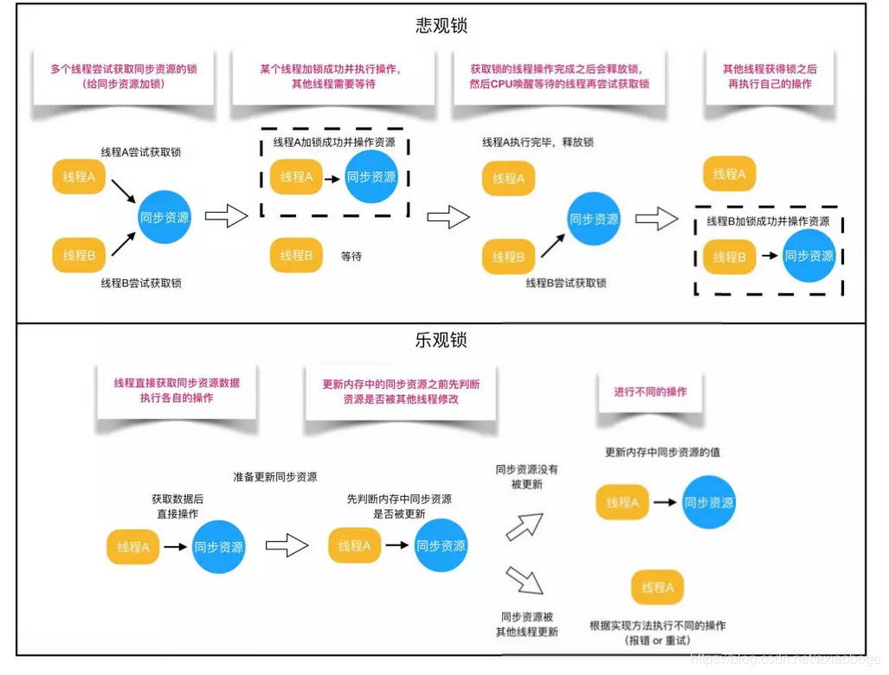

　　根据从上面的概念描述可以发现：

* 悲观锁适合写操作多的场景，先加锁可以保证写操作时数据正确。
* 乐观锁适合读操作多的场景，不加锁的特点能够使其读操作的性能大幅提升，提高吞吐量。

###### 乐观锁

　　乐观锁：顾名思义，就是很乐观，乐观锁总是认为不存在并发问题，每次去拿数据的时候都认为别人不会修改，所以不会上锁，但是在更新的时候会判断一下之前有没有去更新这个数据。如果这个数据没有被更新，当前线程将自己修改的数据成功写入。如果数据已经被其他线程更新，则根据不同的实现方式执行不同的操作（例如报错或者自动重试）。

　　乐观锁在 Java 中的使用，是无锁编程，常常采用的是 CAS 算法，在 Java 中 java.util.concurrent.atomic 包下面的原子变量类就是使用了乐观锁的一种实现方式 CAS(Compare and Swap 比较并交换)实现的，通过 CAS 自旋实现原子操作的更新。

　　在更新时会判断线程在这之前有没有对数据进行修改，一般会使用 “ 数据版本机制 ” 或 “ CAS操作 ” 来实现。

###### 悲观锁

　　悲观锁：对于同一个数据的并发操作，总是假设最坏的情况，每次去拿数据的时候都认为别人会修改，因此在获取数据的时候会先加锁，确保数据不会被别的线程修改，这样别人想拿这个数据就会阻塞直到它拿到锁。Java 中，synchronized 关键字和 Lock 的实现类都是悲观锁。

　　在对任意记录进行修改前，先尝试为该记录加上排他锁（exclusive locking）。

　　如果加锁失败，说明该记录正在被修改，那么当前查询可能要等待或者抛出异常。具体响应方式由开发者根据实际需要决定。

　　如果成功加锁，那么就可以对记录做修改，事务完成后就会解锁了。

　　期间如果有其他对该记录做修改或加排他锁的操作，都会等待解锁或直接抛出异常。

　　悲观锁在 Java 中的使用，就是利用各种锁。

###### 悲观锁与乐观锁的调用

```java
    // --------悲观锁的调用方式--------
    // synchronized
    public synchronized void testMethod() {
        // 操作同步资源
    }

    //ReentrantLock
    private ReentrantLock lock = new ReentrantLock();// 需要保证多个线程使用同一个锁

    public void modifyPublicResources() {
        lock.lock();
        // 操作同步资源。
        lock.unlock();
    }

    // --------乐观锁的调用方式--------
    private AtomicInteger atomicInteger = new AtomicInteger(); // 需要保证多个线程使用同一个 AtomicInteger

    public void increment() {
        atomicInteger.incrementAndGet(); // 执行自增1
    }
```

　　通过调用方式示例，可以发现悲观锁基本都是在显示的锁定之后再操作同步资源，而乐观锁则直接去操作同步资源。而乐观锁之所以可以做到不锁定同步资源也可以正确的实现线程同步，是因为 CAS 在当前内存值 V 等于比较的值 A 值，才会通过原子操作将 V 更新为新值 B，如果不相等，则自旋重试。　

##### 自旋锁 VS 适应性自旋锁


#### Java 中常见的锁

1. synchronized：可重入、非公平、独占锁。
2. ReentrantLock：既可以构造公平锁又可以构造非公平锁，默认为非公平锁，可重入锁、独占锁。
3. ReentrantReadWriteLock：读写锁的性能都会比排他锁要好，因为大多数场景读是多于写的。在读多于写的情况下，读写锁能够提供比排他锁更好的并发性和吞吐量。Java 并发包提供读写锁的实现是 ReentrantReadWriteLock。

　　ReentrantReadriteLock 的特性：

| 特性       | 说明                                                         |
| ---------- | ------------------------------------------------------------ |
| 公平性选择 | 支持非公平（默认）和公平的锁获取方式，吞吐量还是非公平优于公平。 |
| 重进入     | 该锁支持重进入，以读写线程为例：读线程在获取了读锁之后，能够再次获取读锁。而写线程在获取了写锁之后能够再次获取写锁，同时也可以获取读锁。 |
| 锁降级     | 遵循获取写锁、获取读锁在释放写锁的次序，写锁能够降级成为读锁 |

　　总结

* synchronized，它就是一个：非公平、悲观、独享、互斥、可重入的重量级锁。
* ReentrantLock，它是一个默认非公平但可实现公平的、悲观、独享、互斥、可重入的重量级锁。
* ReentrantReadWriteLock，它是一个默认非公平但可实现公平的、悲观、写独享、读共享、读写互斥、可重入的重量级锁。


#### 死锁

　　死锁是指多个进程同时阻塞，并循环等待彼此占用的资源而无限期的僵持等待下去的局面，这样程序不可能正常终止。

　　造成死锁的原因是：

1. 系统提供的资源太少了，远不能满足并发进程对资源的需求。
2. 进程推进顺序不合适，互相占用彼此需要的资源，同时请求对方占用的资源，这往往是因为程序设计不合理。

##### java 死锁产生的四个必要条件

1. 互斥条件：即当资源被一个线程使用时，别的线程不能被使用。即某个资源在一段时间内只能由一个进程占用，不能同时被两个或两个以上的进程占用。
2. 不可抢占条件：进程所获得的资源在未使用完毕之前，资源请求者不能强制从资源占用者手中夺取资源，资源只能由资源占用者主动释放。
3. 请求和保持条件：占用且等待，即当资源请求者在请求其他资源的同时保持对原有资源的占用。
4. 循环等待条件：即存在一个等待队列，P1 占用 P2 的资源，P2 占用 P3 的资源，P3 占用 P1 的资源。这样就形成了一个等待环路。也就是若干个进程形成环形链，每个都占用对方申请的下一个资源。

　　当上述四个条件都成立的时候，便形成死锁。当然，死锁的情况下如果打破上述任何一个条件，便可让死锁消失。

##### 解决死锁的方法

　　为使系统不发生死锁，必须设法破坏产生死锁的四个必要条件之一，或者允许死锁产生，但当死锁发生时能检测出死锁，并有能力实现恢复。

　　一般有死锁的预防、死锁避免、死锁检测与死锁解除三种方法。

1. 死锁预防：破坏导致死锁必要条件中的任意一个就可以预防死锁。

   例如，要求用户申请资源时一次性申请所需要的全部资源，这就破坏了保持和等待的条件；将资源分层，得到上一层资源后，才能够申请下一层资源，它破坏了环路等待条件。

   预防通常会降低系统的效率。

2. 死锁避免：避免是指进程在每次申请资源时判断这些操作是否安全。

   例如，使用银行家算法。一个小城镇的银行家，他向一群客户分别承诺了一定的贷款额度，算法要做的是判断对请求的满足是否会进入不安全状态，如果是，就拒绝请求；否则予以分配。

   死锁避免算法的执行会增加系统的开销。

3. 死锁检测：死锁预防和避免都是事前措施，而死锁的检测则是判断系统是否处于死锁状态，如果是，则执行死锁解除策略。

4. 死锁解除：这是与死锁检测结合使用的，它使用的方式就是剥夺，即将某进程所拥有的资源强行回收，分配给其他的进程。

　　很多时候实际锁的交叉可能涉及很多个，要想很好的避免只能认真仔细检查，一旦在一个同步方法中，或者说在一个锁的保护的范围中，调用了其他对象的方法时，就要十分的小心：

1. 如果其他对象的这个方法会消耗比较长的时间，那么就会导致锁被持有了很长的时间。
2. 如果其他对象的这个方法是一个同步方法，那么就要注意避免发生死锁的可能性了。

　　总之是尽量避免在一个同步方法中调用其他对象的延时方法和同步方法。

###### 1. 死锁预防

* 打破互斥条件：允许进程同时访问资源（有些资源就是不可以同时访问的，无实用价值）。
* 打破不可抢占条件：比如给进程设置优先级，高优先级的可以抢占资源（实现困难，降低系统性能）。
* 打破请求和保持条件：实行资源预分配策略，即进程在运行前一次性的向系统申请它所需要的全部资源（不可预测资源的实用、利用率低、降低并发性）。
* 破坏循环等待条件：采用这种策略，即把资源事先分类编号，按号分配，使进程在申请、占用资源时不会形成环路。所有进程对资源的请求必须严格按资源序号递增的顺序提出（限制和编号实现困难，增加系统开销，有些资源暂时不用也需要先申请，增加了进程对资源的占用时间）。

###### 2. 死锁避免

　　允许进程动态的申请资源，但系统在进行资源分配前，应先计算此次资源分配的安全性。若此次分配不会导致系统进入不安全状态，则将资源分配给进程，否则，让进程等待。

　　所谓安全状态，是指系统能按某种进程推进顺序，为每个进程分配其所需要的资源，直至满足每个进程对资源的最大需求，是每个进程都可以顺序的完成。此时 P1P2P3... 为安全序列，如果系统无法找到一个安全序列，则称系统处于不安全状态。

　　并非所有的不安全状态都是死锁状态，但当系统进入不安全状态后，便可能进入死锁状态，反之，只要系统处于安全状态，系统便可以避免进入死锁状态。

　　银行家算法是著名的死锁避免算法。

###### 3. 死锁检测

　　不试图阻止死锁，而是当检测到死锁发生时，采取措施进行恢复。

###### 4.死锁解除

1. 资源剥夺法。挂起某些死锁进程，并抢占它的资源，将这些资源分配给其他的死锁进程。但应防止被挂起的进程长时间得不到资源时，而处于资源匮乏的状态。
2. 资源撤销法。强制撤销一个或一部分进程并剥夺这些进程的资源，撤销的原则可以按进程的优先级和撤销进程代价的高低进行。
3. 进程回退法。让一个或多个进程回退到足以回避死锁的地步，进程回退时资源被释放而不是被剥夺。要求系统保持进程的历史信息，设置还原点。

#### 使用 synchronized\wait、notifyAll 实现生产者-消费者模式

　　对于任何一种模式，在实现之前都应该明确这种模式对线程同步及互斥的要求。对于生产者-消费者模式，有如下同步及互斥要求：

1. 线程互斥要求
   * 生产者之间是互斥的，即同时只能有一个生产者进行生产
   * 消费者之间是互斥的，即同时只能有一个消费者进行消费
   * 生产者消费者之间是互斥的，也即生产者消费者不能同时进行生产和消费
2. 线程同步要求
   * 容器满时，生产者进行等待。
   * 容器空时，消费者进行等待。

　　有了上述需求，就可以选择互斥及同步工具了。对于互斥，采用 synchornized 关键字，对于线程同步，采用 wait()、notifyAll()。

```java
/**
 * 使用 synchronized, wait(), notifyAll() 实现生产者-消费者模式
 */
public class syncTest {

    public static void main(String[] args) {
      	// 仓库
        Cache cache = new Cache(10);
        Producer p = new Producer(cache);
        Consumer c = new Consumer(cache);
        int producerCount = 4,consumerCount = 4;
      	// 4 个生产者
        for (int i = 0; i<producerCount;i++){
            new Thread(p).start();
        }
      	// 4 个消费者
        for (int i = 0; i<consumerCount;i++){
            new Thread(c).start();
        }
    }

    public static class Consumer implements Runnable {
        private Cache cache; // 仓库
        public Consumer(Cache cache){
            this.cache = cache;
        }

        @Override
        public void run() {
            while (true){
              	// 消费
                cache.consume();
                try {
                    Thread.sleep(100);
                } catch (InterruptedException e){
                    e.printStackTrace();
                }
            }
        }
    }

    public static class Producer implements Runnable {
        private Cache cache; // 仓库
        public Producer(Cache cache){
            this.cache = cache;
        }

        @Override
        public void run() {
            while (true){
              	// 生产
                cache.produce();
                try {
                    Thread.sleep(100);
                } catch (InterruptedException e){
                    e.printStackTrace();
                }
            }
        }
    }

    public static class Cache {
        private final static int MAX_SIZE = 10; // 最多容纳 10 个产品
        private int cacheSize = 0; // 当前产品的数量

        public Cache() {
            cacheSize = 0;
        }

        public Cache(int size) {
            cacheSize = size;
        }

      	// 生产
        public void produce() {
            synchronized (this) {
                while (cacheSize >= MAX_SIZE) { // 生产时，库存已满则等待
                    try {
                        System.out.println("缓存已满，生产者需要等待");
                        wait();
                    } catch (InterruptedException e) {
                        e.printStackTrace();
                    }
                }
                cacheSize++;
                System.out.println("生产了一个产品。当前产品数量为：" + cacheSize);
              	// 生产之后，唤醒等待的消费者
                notifyAll();
            }
        }

      	// 消费
        public void consume() {
            synchronized (this) {
              	// 如果库存为空，则等待
                while (cacheSize <= 0) {
                    try {
                        System.out.println("缓存为空，消费者需要等待");
                        wait();
                    } catch (InterruptedException e) {
                        e.printStackTrace();
                    }
                }
                cacheSize--;
                System.out.println("消费了一个产品。当前产品数量为：" + cacheSize);
                // 消费之后，唤醒等待的生产者。
              	notifyAll();
            }
        }
    }
    
}
```

#### * 使用信号量实现生产者-消费者模式


#### * 使用管程实现生产者-消费者模式


#### 哲学家就餐问题

　　哲学家就餐问题是 1965 年由 Dijkstra 提出的一种线程同步的问题。

　　问题描述：一圆桌前坐着 5 位哲学家，两个人中间有一只筷子，桌子中央有面条，哲学家思考问题，当饿了的时候拿起左右两只筷子吃饭，并且一次只能拿起一根筷子，必须拿到两只筷子才能吃饭。

　　如果所有哲学家同时拿起左手边的筷子，那么所有哲学家都在等待其他哲学家吃完并释放自己手中的筷子，导致死锁。

　　解决办法：

1. 添加一个服务生，只有当经过服务生同意之后才能拿筷子，服务生负责避免死锁产生。
2. 每个哲学家必须确定自己左右手的筷子都可用的时候，同时拿起两只筷子进餐，吃完之后同时放下两只筷子。
3. 规定每个哲学家拿筷子时必须拿序号小的那只，这样最后一位未拿到筷子的哲学家只剩下序号大的那只筷子，不能拿起，剩下的这只筷子就可以被其他哲学家使用，避免了死锁。这种情况不能很好的利用资源。

代码实现：实现第 2 种方案

```java
/**
 * 每个哲学家相当于一个线程
 */
public class Philosopher extends Thread {
    private String name;
    private Fork fork;

    public Philosopher(String name, Fork fork) {
        super(name);
        this.name = name;
        this.fork = fork;
    }

    @Override
    public void run() {
        while (true) {
            thinking();
            fork.takeFork();
            eating();
            fork.putFork();
        }
    }

    public void eating() {
        System.out.println("I am Eating:" + name);
        try {
            sleep(1000); // 模拟吃饭，占用一段时间资源
        } catch (InterruptedException e) {
            e.printStackTrace();
        }
    }

    public void thinking() {
        System.out.println("I am Thinking:" + name);
        try {
            sleep(1000); // 模拟思考
        } catch (InterruptedException e) {
            e.printStackTrace();
        }
    }
·		// 筷子
    public static class Fork {
        // 6 只筷子，初始为都未被用
        private boolean[] used = {false, false, false, false, false, false};

        public synchronized void takeFork() {
            String name = Thread.currentThread().getName();
            int i = Integer.parseInt(name);
          	// 左边的筷子可用或者右边的筷子可用
            while (used[i] || used[(i + 1) % 5]) {
                try {
                    wait();// 如果左右手有一只正被使用，等待
                } catch (InterruptedException e) {
                    e.printStackTrace();
                }
            }
          	// 两边的筷子都可用
            used[i] = true;
            used[(i + 1 % 5)] = true;
        }

        /**
         * 必须同时释放左右手的筷子
         */
        public synchronized void putFork() {
            String name = Thread.currentThread().getName();
            int i = Integer.parseInt(name);
            used[i] = false;
            used[(i + 1) % 5] = false;
            notifyAll(); // 唤醒其他线程
        }
    }

    public static void main(String[] args) {
        Fork fork = new Fork();
        new Philosopher("0",fork).start();
        new Philosopher("1",fork).start();
        new Philosopher("2",fork).start();
        new Philosopher("3",fork).start();
        new Philosopher("4",fork).start();
    }
}
```

　　分析：上述解决方案解决了死锁问题。可以看到最多只能有两条相邻的 eating 结果，因为每个时刻最多能够满足两个人同时进餐，且两人座位不相邻。

#### 读者写者问题

　　这是一个非常经典的题目，题目大意如下：有一个写者很多读者，多个读者可以同时读文件，但写者在写文件时不允许有读者在读文件，同样有读者读时也不能写。

　　允许多个进程同时对数据进行读操作，但是不允许读和写以及写和写操作同时发生。

　　一个整形变量 count 记录在对数据进行读操作的进程数量，一个互斥量 count_mutex 用于对 count 加锁，一个互斥量 data_mutex 用于对读写的数据加锁。思路：

　　利用 java.util.concurrent.locks.ReentrantReadWriteLock（读写锁）。

　　写者写文件时持有写锁，此时只能有唯一一个写者写文件，且读者不能读文件。

　　读者读文件时持有读锁，此时多个读者可以同时读取文件，但写者不能写文件。

```java
/**
 * 读者写者问题
 */
public class ReaderWriter {

    public static void main(String[] args) {
        // 一个读写锁
        ReentrantReadWriteLock lock = new ReentrantReadWriteLock();
        for (int i = 0; i < 10; i++) {
            // 10 个读者
            new Thread(new Reader(lock)).start();
        }
        // 1 个写者
        new Thread(new Writer(lock)).start();
    }
    
    public static class Reader implements Runnable {
        private ReentrantReadWriteLock lock;

        public Reader(ReentrantReadWriteLock lock) {
            this.lock = lock;
        }

        @Override
        public void run() {
            while (true) {
                try {
                  	// 读锁锁住
                    lock.readLock().lock();
                    System.out.println(Thread.currentThread().getName() + " reading");
                    TimeUnit.SECONDS.sleep(3);
                } catch (InterruptedException e) {
                    e.printStackTrace();
                } finally {
                  	// 读锁解锁
                    lock.readLock().unlock();
                }
            }
        }
    }

    public static class Writer implements Runnable {
        private ReentrantReadWriteLock lock;

        public Writer(ReentrantReadWriteLock lock) {
            this.lock = lock;
        }

        @Override
        public void run() {
            while (true) {
                try {
                    Thread.sleep(1000L);
                } catch (InterruptedException e) {
                    e.printStackTrace();
                }
                try {
                  	// 写锁锁住
                    lock.writeLock().lock();
                    System.out.println(Thread.currentThread().getName() + " writing");
                    TimeUnit.SECONDS.sleep(10);
                } catch (InterruptedException e) {
                    e.printStackTrace();
                } finally {
                  	// 写锁释放
                    lock.writeLock().unlock();
                }
            }
        }
    }
}
```


## JVM

### Jvm 运行时数据区

　　Java 虚拟机在执行 Java 程序的过程中会把它所管理的内存划分为若干个不同的数据区域。这些区域都有各自的用途，以及创建和销毁的时间，有的区域随着虚拟机进程的启动而存在，有的区域则是依赖用户线程的启动和结束而建立和销毁。根据《 Java 虚拟机规范（第 2 版）》的规定，Java 虚拟机所管理的内存将会包括以下几个运行时数据区域：


#### 程序计数器

　　程序计数器（Program Counter Register）是一块较小的内存空间，它可以看作是当前线程所执行的字节码的行号指示器。在虚拟机的概念模型里，字节码解释器工作时就是通过改变这个计数器的值来选取下一条需要执行的字节码指令，分支、循环、跳转、异常处理、线程恢复等基础功能都需要依赖这个计数器来完成。

　　由于 Java 虚拟机的多线程是通过线程轮流切换、分配处理器执行时间的方式来实现的，在任何一个确定的时刻，一个处理器（对于多核处理器来说是一个内核）都只会执行一条线程中的指令。因此，为了线程切换后能恢复到正确的执行位置，每条线程都需要有一个独立的程序计数器，各个线程之间计数器互不影响、独立存储，我们称这类内存区域为 “ 线程私有 ” 的内存。

　　如果线程正在执行的是一个 Java 方法，这个计数器记录的是正在执行的虚拟机字节码指令的地址；如果正在执行的是本地（Native）方法，这个计数器值则应为空（Undefined）。此内存区域是唯一一个在 《 Java 虚拟机规范 》中没有规定任何 OutOfMemoryError 情况的区域。

#### java 虚拟机栈

　　与程序计数器一样，Java 虚拟机栈（Java Virtual Machine Stack）也是线程私有的，它的生命周期与线程相同。虚拟机栈描述的是 Java 方法执行的线程内存模型：每个方法被执行的时候，Java 虚拟机都会同步创建一个栈帧（Stack Frame）用于存储局部变量表、操作数栈、动态连接、方法出口等信息。每一个方法被调用直至执行完毕的过程，就对应着一个栈帧在虚拟机栈中从入栈到出栈的过程。

　　局部变量表存放了编译器可知的各种 Java 虚拟机基本数据类型（boolean、byte、char、short、int、float、long、double）、对象引用（reference 类型，它并不等同于对象本身，可能是一个指向对象起始地址的引用指针，也可能是指向一个代表对象的句柄或者其他与此对象相关的位置）和 returnAddress 类型（指向了一条字节码指令的地址）。

　　这些数据类型在局部变量表中的存储空间以局部变量槽（Slot）来表示，其中 64 位长度的 long 和 double 类型的数据会占用两个变量槽，其余的数据类型只占用一个。局部变量表所需的内存空间在编译期间完成分配，当进入一个方法时，这个方法需要在栈帧中分配多大的局部变量空间是完全确定的，在方法运行期间不会改变局部变量表的大小。请注意，这里的 “ 大小 ” 是指变量槽的数量，虚拟机真正使用多大的内存空间（譬如按照 1 个变量槽占用 32 个比特、64 个比特或者更多）来实现一个变量槽，这是完全由具体的虚拟机实现自行决定的事情。

　　在 《 Java 虚拟机规范 》中，对这个内存区域规定了两类异常状态：如果线程请求的栈深度大于虚拟机所允许的深度，将抛出 StackOverflowError 异常；如果 Java 虚拟机栈容量可以动态扩展，当栈扩展时无法申请到足够的内存会抛出 OutOfMemory 异常。

#### 本地方法栈

　　本地方法栈（Native Method Stacks）与虚拟机栈所发挥的作用是非常相似的，其区别只是虚拟机栈为虚拟机执行 Java 方法（也就是字节码）服务，而本地方法栈则是为虚拟机使用到的本地（Native）方法服务。

　　《 Java 虚拟机规范》对本地方法栈中方法使用的语言、使用方式与数据结构并没有任何强制规定，因此具体的虚拟机可以根据需要自由实现它，甚至有的 Java 虚拟机（譬如 Hot-Spot 虚拟机）直接就把本地方法栈和虚拟机栈合二为一。与虚拟机栈一样，本地方法栈也会在栈深度溢出或者栈扩展失败时分别抛出 StackOverflowError 和 OutOfMemoryError 异常。

#### Java 堆

　　对于 Java 应用程序来说，Java 堆（Java Heap）是虚拟机所管理的内存中最大的一块。

　　Java 堆是被所有线程共享的一块内存区域，在虚拟机启动时创建。

　　此内存区域的唯一目的就是存放对象实例，Java 世界里 “ 几乎 ” 所有的对象实例都在这里分配内存。

　　在《 Java 虚拟机规范》中对 Java 堆的描述是：“ 所有的对象实例以及数组都应当在堆上分配 ”，但是随着 Java 语言的发展，现在已经能看到些许迹象表明日后可能出现值类型的支持，即使只考虑现在，由于即时编译技术的进步，尤其是逃逸分析技术的日渐强大，栈上分配、标量替换优化手段已经导致一些微妙的变化悄然发生，所以说 Java 对象实例都分配在堆上也渐渐变得不是那么绝对了。

　　Java 堆是垃圾收集器管理的内存区域，因此一些资料中它也被称作 “ GC 堆 ”。

　　如果从分配内存的角度看，所有线程共享的 Java 堆中可以划分出多个线程私有的分配缓冲区（Thread Local Allocation Buffer，TLAB），以提升对象分配时的效率。 

　　不过无论从什么角度，无论如何划分，都不会改变 Java 堆中存储内容的共性，无论是哪个区域，存储的都只能是对象的实例，将 Java 堆细分的目的只是为了更好地回收内存，或者更快地分配内存。 

　　根据《 Java 虚拟机规范》的规定，Java 堆可以处于物理上不连续的内存空间中，但在逻辑上它应该被视为连续的。但对于大对象（典型的如数组对象），多数虚拟机实现出于实现简单、存储高效的考虑，很可能会要求连续的内存空间。

　　Java 堆既可以被实现成固定大小的，也可以是可扩展的，不过当前主流的 Java 虚拟机都是按照可扩展来实现的（通过参数 -Xmx 和 -Xms 设定）。

　　如果在 Java 堆中没有内存完成实例分配，并且堆也无法再扩展时，Java 虚拟机将会抛出 OutOfMemoryError 异常。

#### 方法区

　　方法区（Method Area）与 Java 堆一样，是各个线程共享的内存区域，它用于存储已被虚拟机加载的类型信息、常量、静态变量、即时编译器编译后的代码缓存等数据。

　　原则上如何实现方法区属于虚拟机实现细节，不受《 Java 虚拟机规范》管束，并不要求统一。 

　　《 Java 虚拟机规范》对方法区的约束是非常宽松的，除了和 Java 堆一样不需要连续的内存和可以选择固定大小或者可扩展外，甚至还可以选择不实现垃圾收集。

　　相对而言，垃圾收集行为在这个区域的确是比较少出现的，但并非数据进入了方法区就如永久代的名字一样 “ 永久 ” 存在了。这区域的内存回收目标主要是针对常量池的回收和对类型的卸载，一般来说这个区域的回收效果比较难令人满意，尤其是类型的卸载，条件相当苛刻，但是这部分区域的回收有时又确实是必要的。

　　根据《 Java 虚拟机规范》的规定，如果方法区无法满足新的内存分配需求时，将抛出 OutOfMemoryError 异常。

#### 运行时常量池

　　运行时常量池（Runtime Constant Pool）是方法区的一部分。 

　　Class 文件中除了有类的版本、字段、方法、接口等描述信息外，还有一项信息是常量池表（Constant Pool Table），用于存放编译期生成的各种字面量与符号引用，这部分内容将在类加载后存放到**方法区的运行时常量池**中。 

　　Java 虚拟机对于 Class 文件每一部分（自然也包括常量池）的格式都有严格规定，如每一个字节用于存储哪种数据都必须符合规范上的要求才会被虚拟机认可、加载和执行，但对于运行时常量池，《 Java 虚拟机规范》并没有做任何细节的要求，不同提供商实现的虚拟机可以按照自己的需要来实现这个内存区域，不过一般来说，除了保存 Class 文件中描述的符号引用外，还会把由符号引用翻译出来的直接引用也存储在运行时常量池中。

　　运行时常量池相对于 Class 文件常量池的另外一个重要特征是**具备动态性**，Java 语言并不要求常量一定只有编译期才能产生，也就是说，并非预置入 Class 文件中常量池的内容才能进入方法区运行时常量池，运行期间也可以将新的常量放入池中，这种特性被开发人员利用得比较多的便是 String 类的 intern() 方法。

　　既然运行时常量池是方法区的一部分，自然受到方法区内存的限制，当常量池无法再申请到内存时会抛出 OutOfMemoryError 异常。 

#### 直接内存

　　直接内存（Direct Memory）并不是虚拟机运行时数据区的一部分，也不是《 Java 虚拟机规范》中定义的内存区域。但是这部分内存也被频繁地使用，而且也可能导致 OutOfMemoryError 异常出现。

　　在 JDK 1.4 中新加入了 NIO（New Input/Output）类，引入了一种基于通道（Channel）与缓冲区（Buffer）的 I/O 方式，它可以使用 Native 函数库直接分配堆外内存，然后通过一个存储在 Java 堆里面的 DirectByteBuffer 对象作为这块内存的引用进行操作。这样能在一些场景中显著提高性能，因为避免了在 Java 堆和 Native 堆中来回复制数据。

　　显然，本机直接内存的分配不会受到 Java 堆大小的限制，但是，既然是内存，则肯定还是会受到本机总内存（包括物理内存、SWAP 分区或者分页文件）大小以及处理器寻址空间的限制，一般服务器管理员配置虚拟机参数时，会根据实际内存去设置 -Xmx 等参数信息，但经常忽略掉直接内存，使得各个内存区域总和大于物理内存限制（包括物理的和操作系统级的限制），从而导致动态扩展时出现 OutOfMemoryError 异常。

### 什么情况下会发生栈内存溢出

　　如果线程请求的栈深度大于虚拟机所允许的深度，将抛出StackOverflowError 异常。 如果虚拟机在动态扩展栈时无法申请到足够的内存空间，则抛出 OutOfMemoryError 异常。

　　StackOverflowError 异常：Java 虚拟机栈，本地方法栈 。

　　递归可能会引起栈溢出。

### JVM 的内存结构，Eden 和 Survivor 比例。

#### 为什么会有年轻代

  其实不分代完全可以，分代的唯一理由就是优化 GC 性能。如果没有分代，那所有的对象都在一块，GC 的时候要找到哪些对象没用，这样就会对堆的所有区域进行扫描。而很多对象都是朝生夕死的，如果分代的话，把新创建的对象放到某一地方，当 GC 的时候先把这块存 “ 朝生夕死 ” 对象的区域进行回收，这样就会腾出很大的空间出来。

#### 年轻代中的 GC

  HotSpot JVM把年轻代分为了三部分：1个 Eden 区和 2个 Survivor 区（分别叫 from 和 to），默认比例为 8：1。一般情况下，新创建的对象都会被分配到 Eden 区 ( 一些大对象特殊处理 )，这些对象经过第一次 Minor GC 后，如果仍然存活，将会被移到 Survivor 区。对象在 Survivor 区中每熬过一次 Minor GC，年龄就会增加 1 岁，当它的年龄增加到一定程度时，就会被移动到年老代中。

  因为年轻代中的对象基本都是朝生夕死的 ( 80% 以上 )，所以在年轻代的垃圾回收算法使用的是复制算法，复制算法的基本思想就是将内存分为两块，每次只用其中一块，当这一块内存用完，就将还活着的对象复制到另外一块上面。复制算法不会产生内存碎片。

  在 GC 开始的时候，对象只会存在于 Eden 区和名为 “From” 的 Survivor 区，Survivor 区 “To” 是空的。紧接着进行 GC，Eden 区中所有存活的对象都会被复制到 “To”，而在 “From” 区中，仍存活的对象会根据他们的年龄值来决定去向。年龄达到一定值 ( 年龄阈值，可以通过-XX:MaxTenuringThreshold 来设置 ) 的对象会被移动到年老代中，没有达到阈值的对象会被复制到 “To” 区域。经过这次 GC 后，Eden 区和 From 区已经被清空。这个时候，“From” 和 “To” 会交换他们的角色，也就是新的 “To” 就是上次 GC 前的 “From”，新的 “From” 就是上次 GC 前的 “To”。不管怎样，都会保证名为 To 的 Survivor 区域是空的。Minor GC 会一直重复这样的过程，直到 “To” 区被填满，“To” 区被填满之后，会将所有对象移动到年老代中。

#### 有关年轻代的 JVM 参数

1. -XX:NewSize 和 -XX:MaxNewSize

  用于设置年轻代的大小，建议设为整个堆大小的 1/3 或者 1/4，两个值设为一样大。

2. -XX:SurvivorRatio

  用于设置 Eden 和其中一个 Survivor 的比值，这个值也比较重要。

3. -XX:+PrintTenuringDistribution

  这个参数用于显示每次 Minor GC 时 Survivor 区中各个年龄段的对象的大小。

4. -XX:InitialTenuringThreshol 和 -XX:MaxTenuringThreshold

  用于设置晋升到老年代的对象年龄的最小值和最大值，每个对象在坚持过一次 Minor GC 之后，年龄就加 1。

### JVM 内存为什么要分成新生代、老年代、持久代。新生代中为什么要分为 Eden 和 Survivor。

  分代的唯一理由就是优化 GC 性能。如果没有分代，那所有的对象都在一块，GC 的时候要找到哪些对象没用，这样就会对堆的所有区域进行扫描。而很多对象都是朝生夕死的，如果分代的话，把新创建的对象放到某一地方，当 GC 的时候先把这块存 “ 朝生夕死 ” 对象的区域进行回收，这样就会腾出很大的空间出来。

  因为年轻代中的对象基本都是朝生夕死的 ( 80% 以上 )，所以在年轻代的垃圾回收算法使用的是复制算法，复制算法的基本思想就是将内存分为两块，每次只用其中一块，当这一块内存用完，就将还活着的对象复制到另外一块上面。复制算法不会产生内存碎片。

  如果只有 1 个 Survivor 区，那当 Eden 区满了之后，就会复制对象到 Survivor 区，容易产生内存碎片化，严重影响性能。所以使用 2 个 Survivor 区，始终保持有一个空的 Survivor 区，可以避免内存碎片化。

  Survivor 减少被送到老年代的对象，进而减少 Full GC 的发生， Survivor 的预筛选保证，只有经历多次 Minor GC 还能在新生代中存活的对象，才会被送到老年代。

### JVM 中一次完整的 GC 流程是怎么样的，对象如何晋升到老年代，说说你知道的几种主要的 JVM 参数。

  对象优先在新生代区中分配，若没有足够空间，Minor GC； 

  大对象（需要大量连续内存空间）直接进入老年代；长期存活的对象进入老年代。如果对象在新生代出生并经过第一次 MGC 后仍然存活，年龄 +1，若年龄超过一定限制（15），则被晋升到老年态。

  对象诞生即新生代->eden，在进行 minor gc 过程中，如果依旧存活，移动到 from，变成 Survivor，进行标记代数，如此检查一定次数后，晋升为老年代。

### * 讲下 cms 和 G1，包括原理、流程、优缺点。

### 垃圾回收算法的实现原理

#### 哪些内存需要回收？

  JVM 的内存结构包括五大区域：程序计数器、虚拟机栈、本地方法栈、堆区、方法区。其中程序计数器、虚拟机栈、本地方法栈 3 个区域随线程而生、随线程而灭，因此这几个区域的内存分配和回收都具备确定性，就不需要过多考虑回收的问题，因为方法结束或者线程结束时，内存自然就跟随着回收了。而 Java 堆区和方法区则不一样，这部分内存的分配和回收是动态的，正是垃圾收集器所需关注的部分。

  垃圾收集器在对堆区和方法区进行回收前，首先要确定这些区域的对象哪些可以被回收，哪些暂时还不能回收，这就要用到判断对象是否存活的算法。

#### 引用计数算法

##### 算法分析

  引用计数是垃圾收集器中的早期策略。在这种方法中，堆中每个对象实例都有一个引用计数。当一个对象被创建时，就将该对象实例分配给一个变量，该变量计数设置为 1。当任何其它变量被赋值为这个对象的引用时，计数加 1（a = b,则 b 引用的对象实例的计数器 +1），但当一个对象实例的某个引用超过了生命周期或者被设置为一个新值时，对象实例的引用计数器减 1。任何引用计数器为 0 的对象实例可以被当作垃圾收集。当一个对象实例被垃圾收集时，它引用的任何对象实例的引用计数器减 1。

##### 优缺点

  **优点**：引用计数收集器可以很快的执行，交织在程序运行中。对程序需要不被长时间打断的实时环境比较有利。

  **缺点**：无法检测出循环引用。如父对象有一个对子对象的引用，子对象反过来引用父对象。这样，他们的引用计数永远不可能为0。

#### 可达性分析算法

  程序把所有的引用关系看作一张图，从一个节点 GC ROOT 开始，寻找对应的引用节点，找到这个节点以后，继续寻找这个节点的引用节点，当所有的引用节点寻找完毕之后，剩余的节点则被认为是没有被引用到的节点，即无用的节点，无用的节点将会被判定为是可回收的对象。

  在 Java 语言中，可作为 GC Roots 的对象包括下面几种：

1. 虚拟机栈中引用的对象（栈帧中的本地变量表）；
2. 方法区中类静态属性引用的对象；
3. 方法区中常量引用的对象；
4. 本地方法栈中 JNI（Native方法）引用的对象。

####  Java中的引用

  无论是通过引用计数算法判断对象的引用数量，还是通过可达性分析算法判断对象的引用链是否可达，判定对象是否存活都与 “ 引用 ” 有关。在 Java 语言中，将引用又分为强引用、软引用、弱引用、虚引用4种，这四种引用强度依次逐渐减弱。

- 强引用

  在程序代码中普遍存在的，类似 `Object obj = new Object()` 这类引用，只要强引用还存在，垃圾收集器永远不会回收掉被引用的对象。

- 软引用

  用来描述一些还有用但并非必须的对象。对于软引用关联着的对象，在系统将要发生内存溢出异常之前，将会把这些对象列进回收范围之中进行第二次回收。如果这次回收后还没有足够的内存，才会抛出内存溢出异常。

- 弱引用

  也是用来描述非必需对象的，但是它的强度比软引用更弱一些，被弱引用关联的对象只能生存到下一次垃圾收集发生之前。当垃圾收集器工作时，无论当前内存是否足够，都会回收掉只被弱引用关联的对象。

- 虚引用

  也叫幽灵引用或幻影引用（名字真会取，很魔幻的样子），是最弱的一种引用关系。一个对象是否有虚引用的存在，完全不会对其生存时间构成影响，也无法通过虚引用来取得一个对象实例。它的作用是能在这个对象被收集器回收时收到一个系统通知。

#### 对象死亡（被回收）前的最后一次挣扎

  即使在可达性分析算法中不可达的对象，也并非是 “ 非死不可 ”，这时候它们暂时处于 “ 缓刑 ” 阶段，要真正宣告一个对象死亡，至少要经历两次标记过程。

  **第一次标记**：如果对象在进行可达性分析后发现没有与 GC Roots 相连接的引用链，那它将会被第一次标记；

  **第二次标记**：第一次标记后接着会进行一次筛选，筛选的条件是此对象是否有必要执行`finalize()`方法。在`finalize()`方法中没有重新与引用链建立关联关系的，将被进行第二次标记。

  第二次标记成功的对象将真的会被回收，如果对象在 `finalize()` 方法中重新与引用链建立了关联关系，那么将会逃离本次回收，继续存活。

#### 方法区如何判断是否需要回收

  方法区存储内容是否需要回收的判断可就不一样咯。方法区主要回收的内容有：废弃常量和无用的类。对于废弃常量也可通过引用的可达性来判断，但是对于无用的类则需要同时满足下面3个条件：

- 该类所有的实例都已经被回收，也就是 Java 堆中不存在该类的任何实例；
- 加载该类的`ClassLoader`已经被回收；
- 该类对应的`java.lang.Class`对象没有在任何地方被引用，无法在任何地方通过反射访问该类的方法。

### 常用的垃圾收集算法

#### 标记-清除算法

  标记-清除算法采用从根集合（GC Roots）进行扫描，对存活的对象进行标记，标记完毕后，再扫描整个空间中未被标记的对象，进行回收，如下图所示。标记-清除算法不需要进行对象的移动，只需对不存活的对象进行处理，在存活对象比较多的情况下极为高效，但由于标记-清除算法直接回收不存活的对象，因此会造成内存碎片。


#### 标记-复制算法

  复制算法的提出是为了克服句柄的开销和解决内存碎片的问题。它开始时把堆分成 一个对象面和多个空闲面， 程序从对象面为对象分配空间，当对象满了，基于 copying 算法的垃圾收集就从根集合（GC Roots）中扫描活动对象，并将每个 活动对象复制到空闲面(使得活动对象所占的内存之间没有空闲洞)，这样空闲面变成了对象面，原来的对象面变成了空闲面，程序会在新的对象面中分配内存。


#### 标记-整理算法

  标记-整理算法采用标记-清除算法一样的方式进行对象的标记，但在清除时不同，在回收不存活的对象占用的空间后，会将所有的存活对象往左端空闲空间移动，并更新对应的指针。标记-整理算法是在标记-清除算法的基础上，又进行了对象的移动，因此成本更高，但是却解决了内存碎片的问题。具体流程见下图：


#### 分代收集算法

  分代收集算法是目前大部分 JVM 的垃圾收集器采用的算法。它的核心思想是根据对象存活的生命周期将内存划分为若干个不同的区域。一般情况下将堆区划分为老年代（Tenured Generation）和新生代（Young Generation），在堆区之外还有一个代就是永久代（Permanet Generation）。老年代的特点是每次垃圾收集时只有少量对象需要被回收，而新生代的特点是每次垃圾回收时都有大量的对象需要被回收，那么就可以根据不同代的特点采取最适合的收集算法。


##### 年轻代（Young Generation）的回收算法

1. 所有新生成的对象首先都是放在年轻代的。年轻代的目标就是尽可能快速的收集掉那些生命周期短的对象。

2. 新生代内存按照 8:1:1 的比例分为一个 eden 区和两个 survivor (survivor0,survivor1) 区。一个 Eden 区，两个 Survivor 区(一般而言)。大部分对象在 Eden 区中生成。回收时先将 eden 区存活对象复制到一个 survivor0 区，然后清空 eden 区，当这个 survivor0 区也存放满了时，则将 eden 区和 survivor0 区存活对象复制到另一个 survivor1 区，然后清空 eden 和这个 survivor0 区，此时 survivor0 区是空的，然后将 survivor0 区和 survivor1 区交换，即保持 survivor1 区为空， 如此往复。

3. 当 survivor1 区不足以存放 eden 和 survivor0 的存活对象时，就将存活对象直接存放到老年代。若是老年代也满了就会触发一次 Full GC，也就是新生代、老年代都进行回收。

  若 Servivor 及 Old 区仍然无法存放从 Eden 复制过来的部分对象，导致 JVM 无法在 Eden 区为新对象创建内存区域，则出现 " Out of memroy 错误"。

4. 新生代发生的 GC 也叫做 Minor GC，MinorGC 发生频率比较高(不一定等 Eden 区满了才触发)。

##### 年老代（Old Generation）的回收算法

1. 在年轻代中经历了 N 次垃圾回收后仍然存活的对象，就会被放到年老代中。因此，可以认为年老代中存放的都是一些生命周期较长的对象。
2. 内存比新生代也大很多 ( 大概比例是 1:2 )，当老年代内存满时触发Major GC 即 Full GC，Full GC 发生频率比较低，老年代对象存活时间比较长，存活率标记高。

##### 持久代（Permanent Generation）的回收算法

  用于存放静态文件，如 Java 类、方法等。持久代对垃圾回收没有显著影响，但是有些应用可能动态生成或者调用一些 class，例如 Hibernate 等，在这种时候需要设置一个比较大的持久代空间来存放这些运行过程中新增的类。持久代也称方法区。

#### 常见的垃圾收集器

  下面一张图是 HotSpot 虚拟机包含的所有收集器，图是借用过来滴：


- Serial 收集器（复制算法)
  新生代单线程收集器，标记和清理都是单线程，优点是简单高效。是 client 级别默认的 GC 方式，可以通过`-XX:+UseSerialGC`来强制指定。
- Serial Old 收集器 ( 标记 - 整理算法 )
  老年代单线程收集器，Serial 收集器的老年代版本。
- ParNew 收集器 ( 停止-复制算法 )　
  新生代收集器，可以认为是 Serial 收集器的多线程版本，在多核 CPU 环境下有着比 Serial 更好的表现。
- Parallel Scavenge收集器 ( 停止-复制算法 )
  并行收集器，追求高吞吐量，高效利用 CPU。吞吐量一般为 99%， 吞吐量= 用户线程时间 / ( 用户线程时间+ GC 线程时间 )。适合后台应用等对交互相应要求不高的场景。是 server 级别默认采用的 GC 方式，可用`-XX:+UseParallelGC`来强制指定，用`-XX:ParallelGCThreads=4`来指定线程数。
- Parallel Old 收集器 ( 停止-复制算法 )
  Parallel Scavenge 收集器的老年代版本，并行收集器，吞吐量优先。
- CMS(Concurrent Mark Sweep) 收集器（标记-清理算法）
  高并发、低停顿，追求最短 GC 回收停顿时间，cpu 占用比较高，响应时间快，停顿时间短，多核 cpu 追求高响应时间的选择。

#### GC是什么时候触发的

  由于对象进行了分代处理，因此垃圾回收区域、时间也不一样。GC 有两种类型：Scavenge GC 和 Full GC。

##### Scavenge GC

  一般情况下，当新对象生成，并且在 Eden 申请空间失败时，就会触发 Scavenge GC，对 Eden 区域进行 GC，清除非存活对象，并且把尚且存活的对象移动到 Survivor 区。然后整理 Survivor 的两个区。这种方式的 GC 是对年轻代的 Eden 区进行，不会影响到年老代。因为大部分对象都是从 Eden 区开始的，同时 Eden 区不会分配的很大，所以 Eden 区的 GC 会频繁进行。因而，一般在这里需要使用速度快、效率高的算法，使 Eden 去能尽快空闲出来。

#### Full GC

  对整个堆进行整理，包括 Young、Tenured 和 Perm。Full GC 因为需要对整个堆进行回收，所以比 Scavenge GC 要慢，因此应该尽可能减少 Full GC 的次数。在对 JVM 调优的过程中，很大一部分工作就是对于 Full GC 的调节。有如下原因可能导致 Full GC：

a) 年老代（Tenured）被写满；

b) 持久代（Perm）被写满；

c) System.gc() 被显示调用；

d) 上一次 GC 之后 Heap 的各域分配策略动态变化；

### 当出现了内存溢出，你怎么排错

　　内存泄漏一般可以理解为系统资源（各方面的资源，堆、栈、线程等）在错误使用的情况下，导致使用完毕的资源无法回收（或没有回收），从而导致新的资源分配请求无法完成，引起系统错误。`整个JVM内存大小=年轻代大小 + 年老代大小 + 持久代大小`,目前来说，常遇到的泄漏问题如下：

#### 年老代堆空间被占满

```
 年老代堆空间被占满
 异常： java.lang.OutOfMemoryError: Java heap space
```

　　这是最典型的内存泄漏方式，简单说就是所有堆空间都被无法回收的垃圾对象占满，虚拟机无法再在分配新空间。

1. 这种情况一般来说是因为内存泄漏或者内存不足造成的。某些情况因为长期的无法释放对象，运行时间长了以后导致对象数量增多，从而导致的内存泄漏。
2. 另外一种就是因为系统的原因，大并发加上大对象，`Survivor Space`区域内存不够，大量的对象进入到了老年代，然而老年代的内存也不足时，从而产生了 Full GC，但是这个时候 Full GC 也无法回收。这个时候就会产生`java.lang.OutOfMemoryError: Java heap space`

　　解决方案如下：

1. 代码内的内存泄漏可以通过一些分析工具进行分析，然后找出泄漏点进行改善。
2. 第二种原因导致的 OutOfMemoryError 可以通过，优化代码和增加`Survivor Space`等方式去优化。

#### 持久代被占满

```
持久代被占满
异常：java.lang.OutOfMemoryError: PermGen space
```

　　Perm 空间被占满。无法为新的 class 分配存储空间而引发的异常。这个异常以前是没有的，但是在 Java 反射大量使用的今天这个异常比较常见了。主要原因就是大量动态反射生成的类不断被加载，最终导致 Perm 区被占满。 解决方案：

1. 增加持久代的空间 -XX:MaxPermSize=100M。
2. 如果有自定义类加载的需要排查下自己的代码问题。

#### 堆栈溢出

```
堆栈溢出
异常：java.lang.StackOverflowError
```

　　一般就是递归没返回，或者循环调用造成。

#### 线程堆栈满

```
线程堆栈满
异常：Fatal: Stack size too small
```

　　java 中一个线程的空间大小是有限制的。JDK5.0 以后这个值是 1M。与这个线程相关的数据将会保存在其中。但是当线程空间满了以后，将会出现上面异常。 解决：增加线程栈大小 -Xss2m，但这个配置无法解决根本问题，还要看代码部分是否有造成泄漏的部分。

#### 系统内存被占满

```
系统内存被占满
异常：java.lang.OutOfMemoryError: unable to create new native thread
```

　　这个异常是由于操作系统没有足够的资源来产生这个线程造成的。系统创建线程时，除了要在 Java 堆中分配内存外，操作系统本身也需要分配资源来创建线程。因此，当线程数量大到一定程度以后，堆中或许还有空间，但是操作系统分配不出资源来了，就出现这个异常了。 分配给 Java 虚拟机的内存愈多，系统剩余的资源就越少，因此，当系统内存固定时，分配给 Java 虚拟机的内存越多，那么，系统总共能够产生的线程也就越少，两者成反比的关系。同时，可以通过修改 -Xss 来减少分配给单个线程的空间，也可以增加系统总共内生产的线程数。 解决：

```
1. 重新设计系统减少线程数量。
2. 线程数量不能减少的情况下，通过-Xss减小单个线程大小。以便能生产更多的线程。
```

### JVM 内存模型的相关知识了解多少，比如重排序、内存屏障、happen-before、主内存、工作内存等。

　　内存屏障：为了保障执行顺序和可见性的一条 cpu 指令。

　　重排序：为了提高性能，编译器和处理器会对执行进行重排序。

　　happen-before：操作间执行的顺序关系。有些操作先发生。

　　主内存：共享变量存储的区域即是主内存。

　　工作内存：每个线程 copy 的本地内存，存储了该线程以读/写共享变量的副本。

#### 并发编程模型的分类

　　在并发编程中，我们需要处理两个关键问题：线程之间如何通信及线程之间如何同步（这里的线程是指并发执行的活动实体）。通信是指线程之间以何种机制来交换信息。在命令式编程中，线程之间的通信机制有两种：共享内存和消息传递。

　　在共享内存的并发模型里，线程之间共享程序的公共状态，线程之间通过写-读内存中的公共状态来隐式进行通信。在消息传递的并发模型里，线程之间没有公共状态，线程之间必须通过明确的发送消息来显式进行通信。

　　同步是指程序用于控制不同线程之间操作发生相对顺序的机制。在共享内存并发模型里，同步是显式进行的。程序员必须显式指定某个方法或某段代码需要在线程之间互斥执行。在消息传递的并发模型里，由于消息的发送必须在消息的接收之前，因此同步是隐式进行的。

　　Java 的并发采用的是共享内存模型，Java 线程之间的通信总是隐式进行，整个通信过程对程序员完全透明。如果编写多线程程序的 Java 程序员不理解隐式进行的线程之间通信的工作机制，很可能会遇到各种奇怪的内存可见性问题。

####  Java 内存模型的抽象

　　在 java 中，所有实例域、静态域和数组元素存储在堆内存中，堆内存在线程之间共享（本文使用 “ 共享变量 ” 这个术语代指实例域，静态域和数组元素）。局部变量（Local variables），方法定义参数（ java 语言规范称之为 formal method parameters）和异常处理器参数（exception handler parameters）不会在线程之间共享，它们不会有内存可见性问题，也不受内存模型的影响。

　　Java 线程之间的通信由 Java 内存模型（本文简称为 JMM）控制，JMM 决定一个线程对共享变量的写入何时对另一个线程可见。从抽象的角度来看，JMM 定义了线程和主内存之间的抽象关系：线程之间的共享变量存储在主内存（main memory）中，每个线程都有一个私有的本地内存（local memory），本地内存中存储了该线程以读/写共享变量的副本。本地内存是 JMM 的一个抽象概念，并不真实存在。它涵盖了缓存，写缓冲区，寄存器以及其他的硬件和编译器优化。

　　Java 内存模型的抽象示意图如下：


　　从上图来看，线程 A 与线程 B 之间如要通信的话，必须要经历下面 2 个步骤：

1. 首先，线程 A 把本地内存 A 中更新过的共享变量刷新到主内存中去。
2. 然后，线程 B 到主内存中去读取线程 A 之前已更新过的共享变量。
   下面通过示意图来说明这两个步骤：

[

如上图所示，本地内存 A 和 B 有主内存中共享变量 x 的副本。假设初始时，这三个内存中的 x 值都为0。线程 A 在执行时，把更新后的 x 值（假设值为 1）临时存放在自己的本地内存 A 中。当线程 A 和线程 B 需要通信时，线程 A 首先会把自己本地内存中修改后的 x 值刷新到主内存中，此时主内存中的 x 值变为了 1。随后，线程 B 到主内存中去读取线程 A 更新后的 x 值，此时线程 B 的本地内存的 x 值也变为了 1。

从整体来看，这两个步骤实质上是线程 A 在向线程 B 发送消息，而且这个通信过程必须要经过主内存。JMM 通过控制主内存与每个线程的本地内存之间的交互，来为 java 程序员提供内存可见性保证。

#### 重排序

　　在执行程序时为了提高性能，编译器和处理器常常会对指令做重排序。

　　重排序分三种类型：

1. 编译器优化的重排序。编译器在不改变单线程程序语义的前提下，可以重新安排语句的执行顺序。

2. 指令级并行的重排序。现代处理器采用了指令级并行技术（Instruction-Level Parallelism， ILP）来将多条指令重叠执行。如果不存在数据依赖性，处理器可以改变语句对应机器指令的执行顺序。

3. 内存系统的重排序。由于处理器使用缓存和读 / 写缓冲区，这使得加载和存储操作看上去可能是在乱序执行。

   从 java 源代码到最终实际执行的指令序列，会分别经历下面三种重排序：
   [](http://ifeve.com/wp-content/uploads/2013/01/331.png)
   上述的 1 属于编译器重排序，2 和 3 属于处理器重排序。这些重排序都可能会导致多线程程序出现内存可见性问题。对于编译器，JMM 的编译器重排序规则会禁止特定类型的编译器重排序（ 不是所有的编译器重排序都要禁止 ）。对于处理器重排序，JMM 的处理器重排序规则会要求 java 编译器在生成指令序列时，插入特定类型的内存屏障（memory barriers，intel称之为memory fence）指令，通过内存屏障指令来禁止特定类型的处理器重排序（ 不是所有的处理器重排序都要禁止 ）。

   JMM 属于语言级的内存模型，它确保在不同的编译器和不同的处理器平台之上，通过禁止特定类型的编译器重排序和处理器重排序，为程序员提供一致的内存可见性保证。

#### * 处理器重排序与内存屏障指令

　　现代的处理器使用写缓冲区来临时保存向内存写入的数据。写缓冲区可以保证指令流水线持续运行，它可以避免由于处理器停顿下来等待向内存写入数据而产生的延迟。同时，通过以批处理的方式刷新写缓冲区，以及合并写缓冲区中对同一内存地址的多次写，可以减少对内存总线的占用。虽然写缓冲区有这么多好处，但每个处理器上的写缓冲区，仅仅对它所在的处理器可见。这个特性会对内存操作的执行顺序产生重要的影响：处理器对内存的读/写操作的执行顺序，不一定与内存实际发生的读/写操作顺序一致！为了具体说明，请看下面示例：


#### happens-before

　　从 JDK5 开始，java 使用新的 JSR -133 内存模型（本文除非特别说明，针对的都是 JSR- 133 内存模型）。JSR-133 使用 happens-before 的概念来阐述操作之间的内存可见性。在 JMM 中，如果一个操作执行的结果需要对另一个操作可见，那么这两个操作之间必须要存在 happens-before 关系。这里提到的两个操作既可以是在一个线程之内，也可以是在不同线程之间。

　　与程序员密切相关的 happens-before 规则如下：

- 程序顺序规则：一个线程中的每个操作，happens- before 于该线程中的任意后续操作。
- 监视器锁规则：对一个监视器锁的解锁，happens- before 于随后对这个监视器锁的加锁。
- volatile变量规则：对一个 volatile 域的写，happens- before 于任意后续对这个 volatile 域的读。
- 传递性：如果 A happens- before B，且 B happens- before C，那么 A happens- before C。

　　注意，两个操作之间具有 happens-before 关系，并不意味着前一个操作必须要在后一个操作之前执行！happens-before 仅仅要求前一个操作（执行的结果）对后一个操作可见，且前一个操作按顺序排在第二个操作之前（the first is visible to and ordered before the second）。

　　happens-before 与 JMM 的关系如下图所示：

 [

　　如上图所示，一个 happens-before 规则通常对应于多个编译器和处理器重排序规则。对于 java 程序员来说，happens-before 规则简单易懂，它避免 java 程序员为了理解 JMM 提供的内存可见性保证而去学习复杂的重排序规则以及这些规则的具体实现。

#### 什么是 Memory Barrier（内存屏障）？

内存屏障，又称内存栅栏，是一个 CPU 指令，基本上它是一条这样的指令：
1、保证特定操作的执行顺序。
2、影响某些数据（或则是某条指令的执行结果）的内存可见性。

　　编译器和 CPU 能够重排序指令，保证最终相同的结果，尝试优化性能。插入一条 Memory Barrier 会告诉编译器和 CPU：不管什么指令都不能和这条 Memory Barrier 指令重排序。

　　Memory Barrier 所做的另外一件事是强制刷出各种 CPU cache，如一个 Write-Barrier（写入屏障）将刷出所有在 Barrier 之前写入 cache 的数据，因此，任何 CPU 上的线程都能读取到这些数据的最新版本。

如果写入一个 volatile 变量 a，可以保证：
 1、一个线程写入变量 a 后，任何线程访问该变量都会拿到最新值。
 2、在写入变量 a 之前的写入操作，其更新的数据对于其他线程也是可见的。因为 Memory Barrier 会刷出 cache 中的所有先前的写入。

#### 抽象结构

java 线程之间的通信由 java 内存模型（JMM）控制，JMM 决定一个线程对共享变量（实例域、静态域和数组）的写入何时对其它线程可见。

　　从抽象的角度来看，JMM 定义了线程和主内存 Main Memory（堆内存）之间的抽象关系：线程之间的共享变量存储在主内存中，每个线程都有自己的本地内存 Local Memory（只是一个抽象概念，物理上不存在），存储了该线程的共享变量副本。

　　所以，线程 A 和线程 B 之前需要通信的话，必须经过一下两个步骤：

1. 线程 A 把本地内存中更新过的共享变量刷新到主内存中。
2. 线程 B 到主内存中读取线程 A 之前更新过的共享变量。

### 简单说说你了解的类加载器，可以打破双亲委派吗，怎么打破

#### 类的加载过程

　　JVM将类加载过程分为三个步骤：装载（Load），链接（Link）和初始化(Initialize)，链接又分为三个步骤。

1) 装载：查找并加载类的二进制数据；

2)链接：

> 验证：确保被加载类的正确性；
>
> 准备：为类的静态变量分配内存，并将其初始化为默认值；
>
> 解析：把类中的符号引用转换为直接引用；

3)初始化：为类的静态变量赋予正确的初始值；

　　那为什么要有验证这一步骤呢？首先如果由编译器生成的class文件，它肯定是符合JVM字节码格式的，但是万一有高手自己写一个class文件，让JVM加载并运行，用于恶意用途，就不妙了，因此这个class文件要先过验证这一关，不符合的话不会让它继续执行的，也是为了安全考虑吧。

　　准备阶段和初始化阶段看似有点矛盾，其实是不矛盾的，如果类中有语句：private static int a = 10，它的执行过程是这样的，首先字节码文件被加载到内存后，先进行链接的验证这一步骤，验证通过后准备阶段，给a分配内存，因为变量a是static的，所以此时a等于int类型的默认初始值0，即a=0，然后到解析（后面在说），到初始化这一步骤时，才把a的真正的值10赋给a,此时a=10。

#### 类的初始化

　　类什么时候才被初始化：

> 1）创建类的实例，也就是new一个对象

> 2）访问某个类或接口的静态变量，或者对该静态变量赋值
>
> 3）调用类的静态方法
>
> 4）反射（Class.forName("com.lyj.load")）

> 5）初始化一个类的子类（会首先初始化子类的父类）
>
> 6）JVM 启动时标明的启动类，即文件名和类名相同的那个类

　　只有这 6 种情况才会导致类的类的初始化。

　　类的初始化步骤：

1. 如果这个类还没有被加载和链接，那先进行加载和链接
2. 假如这个类存在直接父类，并且这个类还没有被初始化（注意：在一个类加载器中，类只能初始化一次），那就初始化直接的父类（不适用于接口）
3. 加入类中存在初始化语句（如 static 变量和 static 块），那就依次执行这些初始化语句。

#### 类的加载

　　类的加载指的是将类的 .class 文件中的二进制数据读入到内存中，将其放在运行时数据区的方法区内，然后在堆区创建一个这个类的 java.lang.Class 对象，用来封装类在方法区类的对象。

　　类的加载的最终产品是位于堆区中的 Class 对象。

　　Class 对象封装了类在方法区内的数据结构，并且向 Java 程序员提供了访问方法区内的数据结构的接口。

　　加载类的方式有以下几种：

>  1）从本地系统直接加载
>
>  2）通过网络下载 .class 文件
>
>  3）从 zip，jar 等归档文件中加载 .class 文件
>
>  4）从专有数据库中提取 .class 文件
>
>  5）将 Java 源文件动态编译为 .class 文件（服务器）

#### 加载器

　　JVM 的类加载是通过 ClassLoader 及其子类来完成的，类的层次关系和加载顺序可以由下图来描述：

1）Bootstrap ClassLoader

　　负责加载$JAVA_HOME中jre/lib/rt.jar 里所有的 class，由 C++ 实现，不是 ClassLoader 子类。

2）Extension ClassLoader

　　负责加载 java 平台中扩展功能的一些 jar 包，包括$JAVA_HOME中jre/lib/*.jar或-Djava.ext.dirs指定目录下的jar包

3）App ClassLoader

　　负责加载 classpath 中指定的 jar 包及目录中 class。

4）Custom ClassLoader

　　属于应用程序根据自身需要自定义的 ClassLoader，如 tomcat、jboss都会根据 j2ee 规范自行实现 ClassLoader

　　加载过程中会先检查类是否被已加载，检查顺序是自底向上，从Custom ClassLoader到BootStrap ClassLoader逐层检查，只要某个 classloader 已加载就视为已加载此类，保证此类只所有 ClassLoader 加载一次。而加载的顺序是自顶向下，也就是由上层来逐层尝试加载此类。

### 讲讲 JAVA 的反射机制。

　　Java 程序在运行状态可以动态的获取类的所有属性和方法，并实例化该类，调用方法的功能。

1. JAVA 反射机制是在运行状态中，对于任意一个类，都能够知道这个类的所有属性和方法。
2. 对于任意一个对象，都能够调用它的任意方法和属性。
3. 这种动态获取信息以及动态调用对象方法的功能称为 java 语言的反射机制。

### Java 类加载的方式

#### 三种类加载方式

1. 由 new 关键字创建一个类的实例（静态加载）

   在由运行时刻用 new 方法载入

   如：Dog dog ＝ new Dog（）；

2. 调用 Class.forName() 方法
   通过反射加载类型，并创建对象实例
   如：Class clazz ＝ Class.forName（“Dog”）；
   Object dog ＝clazz.newInstance（）；

3. 调用某个 ClassLoader 实例的 loadClass() 方法
   通过该 ClassLoader 实例的 loadClass() 方法载入。应用程序可以通过继承 ClassLoader 实现自己的类装载器。
   如：Class clazz ＝ classLoader.loadClass（“Dog”）；
   Object dog ＝clazz.newInstance（）；

#### 三者的区别

　　1 和 2 使用的类加载器是相同的，都是当前类加载器。（即：this.getClass.getClassLoader）。
　　3 由用户指定类加载器。如果需要在当前类路径以外寻找类，则只能采用第 3 种方式。第 3 种方式加载的类与当前类分属不同的命名空间。
　　另外：1 是静态加载，2、3 是动态加载。

　　两个异常(exception)：

- 静态加载的时候如果在运行环境中找不到要初始化的类，抛出的是 NoClassDefFoundError，它在 JAVA 的异常体系中是一个Error。
- 动态态加载的时候如果在运行环境中找不到要初始化的类，抛出的是 ClassNotFoundException，它在 JAVA 的异常体系中是一个 checked 异常。

#### Class.forName与ClassLoader.loadClass 区别

　　Class 的装载包括 3 个步骤：加载（loading）,连接（link）,初始化（initialize）。

　　Class.forName(className) 实际上是调用 Class.forName(className, true, this.getClass().getClassLoader())。第二个参数，是指 Class 被 loading 后是不是必须被初始化。
ClassLoader.loadClass(className) 实际上调用的是 ClassLoader.loadClass(name, false)，第二个参数指 Class 是否被 link。

　　Class.forName(className) 装载的 class 已经被初始化，而 ClassLoader.loadClass(className) 装载的 class 还没有被 link。一般情况下，这两个方法效果一样，都能装载 Class。但如果程序依赖于 Class 是否被初始化，就必须用 Class.forName(name) 了。

　　对于相同的类，JVM 最多会载入一次。但如果同一个 class 文件被不同的 ClassLoader 载入，那么载入后的两个类是完全不同的。因为已被加载的类由该类的类加载器实例与该类的全路径名的组合标识。设有 packagename.A Class ，分别被类加载器 CL1 和 CL2 加载，所以系统中有两个不同的 java.lang.Class 实例： <CL1, packagename.A> 和 <CL2, packagename.A>。

### Java 对象的创建过程

　　对象的创建过程：类加载检查、分配内存、初始化零值、设置对象信息、执行构造函数。

#### 类加载检查

　　当 Java 虚拟机遇到一条字节码 new 指令时，首先将去检查这个指令的参数是否能在常量池中定位到一个类的符号引用，并且检查这个符号引用代表的类是否已被加载、解析和初始化过。

　　如果没有，那必须先执行相应的类加载过程。

#### 分配内存

　　在类加载检查通过后，接下来虚拟机将为新生对象分配内存。

　　对象所需内存的大小在类加载完成后便可完全确定，为对象分配空间的任务实际上便等同于把一块确定大小的内存块从 Java 堆中划分出来。

　　假设 Java 堆中内存是绝对规整的，所有被使用过的内存都被放在一边，空闲的内存被放在另一边，中间放着一个指针作为分界点的指示器，那所分配内存就仅仅是把那个指针向空闲空间方向挪动一段与对象大小相等的距离，这种分配方式称为 “ **指针碰撞** ”（Bump The Pointer）。

　　但如果 Java 堆中的内存并不是规整的，已被使用的内存和空闲的内存相互交错在一起，那就没有办法简单地进行指针碰撞了，虚拟机就必须维护一个列表，记录上哪些内存块是可用的，在分配的时候从列表中找到一块足够大的空间划分给对象实例，并更新列表上的记录，这种分配方式称为 “ **空闲列表** ”（Free List）。

　　选择哪种分配方式由 Java 堆是否规整决定，而 Java 堆是否规整又由所采用的垃圾收集器是否带有空间压缩整理（Compact）的能力决定。

　　因此，当使用 Serial、ParNew 等带压缩整理过程的收集器时，系统采用的分配算法是指针碰撞，既简单又高效；而当使用 CMS 这种基于清除（Sweep）算法的收集器时，理论上就只能采用较为复杂的空闲列表来分配内存。

　　除如何划分可用空间外，还有另外一个问题：对象创建在虚拟机中是非常频繁的行为，即使仅仅修改一个指针所指向的位置，在并发情况下也并不是线程安全的。解决这个问题有两种可选方案：

1. 一种是对分配内存空间的动作进行同步处理

   实际上虚拟机是采用 CAS 配上失败重试的方式保证更新操作的原子性；

2. 另外一种是把内存分配的动作按照线程划分在不同的空间之中进行，即每个线程在 Java 堆中预先分配一小块内存，称为**本地线程分配缓冲**（Thread Local Allocation Buffer，TLAB）。

   哪个线程要分配内存，就在哪个线程的本地缓冲区中分配，只有本地缓冲区用完了，分配新的缓存区时才需要同步锁定。

   虚拟机是否使用 TLAB（本地线程分配缓冲），可以通过 -XX：+/-UseTLAB 参数来设定。

#### 初始化零值

　　内存分配完成之后，虚拟机必须将分配到的内存空间（但不包括对象头）都初始化为零值，如果使用了 TLAB（本地线程分配缓冲） 的话，这一项工作也可以提前至 TLAB（本地线程分配缓冲） 分配时顺便进行。这步操作保证了对象的实例字段在 Java 代码中可以不赋初始值就直接使用，使程序能访问到这些字段的数据类型所对应的零值。

#### 设置对象信息

　　接下来，Java 虚拟机还要对对象进行必要的设置，例如这个对象是哪个类的实例、如何才能找到类的元数据信息、对象的哈希码（实际上对象的哈希码会延后到真正调用 Object::hashCode() 方法时才计算）、对象的 GC 分代年龄等信息。

　　这些信息存放在对象的对象头（ObjectHeader）之中。

　　根据虚拟机当前运行状态的不同，如是否启用偏向锁等，对象头会有不同的设置方式。

#### 构造函数

　　从虚拟机的视角来看，一个新的对象已经产生了。但是从 Java 程序的视角看来，对象创建才刚刚开始——构造函数，即 Class 文件中的 < init >() 方法还没有执行，所有的字段都为默认的零值，对象需要的其他资源和状态信息也还没有按照预定的意图构造好。

　　一般来说（由字节码流中 new 指令后面是否跟随 invokespecial 指令所决定，Java 编译器会在遇到 new 关键字的地方同时生成这两条字节码指令，但如果直接通过其他方式产生的则不一定如此），new 指令之后会接着执行 < init >() 方法，按照程序员的意愿对对象进行初始化，这样一个真正可用的对象才算完全被构造出来。

### 线上应用的 JVM 参数有哪些？

　　-Xms：设置堆的最小值。

　　-Xmx：设置堆的最大值。

　　-XX：+HeapDumpOnOutOfMemoryError 让虚拟机在出现内存溢出异常的时候 Dump 出当前的内存堆转储快照以便进行事后分析。

　　-Xss：设置栈容量。

 　　-XX：+/-UseTLAB：虚拟机是否使用 TLAB（本地线程分配缓冲）

 　　+XX：CompactFields：设置为 true，那子类之中较窄的变量也允许插入父类变量的空隙之中，以节省出一点点空间。

 　　-XX:PermSize：表示非堆区初始内存分配大小，其缩写为permanent size（持久化内存）。

 　　-XX:MaxPermSize：表示对非堆区分配的内存的最大上限。

 　　-XX:+HeapDumpOnOutOfMemoryError：当堆内存空间溢出时输出堆的内存快照。

 　　-Dfile.encoding：文件编码。

```
# gradle.properties
org.gradle.jvmargs=-Xmx4096m -XX:MaxPermSize=4096m -XX:+HeapDumpOnOutOfMemoryError -Dfile.encoding=UTF-8
```

### gl 和 cms 区别，吞吐量优先和响应优先的垃圾收集器选择。

　　Cms 是以获取最短回收停顿时间为目标的收集器。基于标记-清除算法实现。比较占用 cpu 资源，切易造成碎片。

　　G1 是面向服务端的垃圾收集器，是 jdk9 默认的收集器，基于标记-整理算法实现。可利用多核、多 cpu，保留分代，实现可预测停顿，可控。

### 怎么打出线程栈信息

　　Linux下：

1. 第一步：在终端运行 Java 程序

2. 第二步：通过命令 pidof java 找到已经启动的 java 进程的ID，选择需要查看的 java 程序的进程ID

3. 第三步：使用命令 kill -3 <java进行的 pid> 打印出 java 程序的线程堆栈信息

4. 第四步：通常情况下运行的项目可能会比较大，那么这个时候打印的堆栈信息可能会有几千到几万行，为了方便查看，我们往往需要将输出内容进行重定向
   使用 linux 下的重定向命令方式即可：例如： demo.sh > run.log 2>&1 将输出信息重定向到 run.log中。

   注：在操作系统中，0 1 2 分别对应着不同的含义， 如下：
   0 ： 标准输入，即：C 中的stdin ， java 中的 System.in
   1 ： 标准输出， 即：C 中的stdout ，java 中的 System.out
   2 ： 错误输出， 即：C 中的stderr ， java 中的 System.err

　　使用命令：kill -3 {pid}，可以打印指定线程的堆栈信息到 tomcat 的 catalina.out 日志中。在性能测试过程中，可以观察响应时间的曲线，如果突然出现波峰则抓取当前时间点 tomcat 线程的堆栈信息供后续分析。

### 类加载机制

双亲委派机制，子类在加载类的时候会将类交给父类区加载，只有在父类无法加载的时候，才会交给子类去加载。

## 开源库

### Retrofit

#### Retrofit 知识

|          | Retrofit 简介                                                |
| -------- | ------------------------------------------------------------ |
| 介绍     | 一个 RESTful 的 HTTP 网络请求框架（基于 OKHTTP）             |
| 作者     | Square                                                       |
| 功能     | 1.基于 okhttp & 遵循 Restful API 设计风格；   <br />2.通过注解配置网络请求参数； <br />3.支持同步 & 异步网络请求； <br />4.支持多种数据的解析 & 序列化格式（Gson、Json、XML、Protobuf）；<br /> 5.提供对 RxJava 支持。 |
| 优点     | 1.功能强大：支持同步 & 异步、支持多种数据的解析 & 序列化格式、支持 RxJava；<br />2.简洁易用：通过注解配置网络请求参数、采用大量设计模式简化使用；<br />3.可扩展性好：功能模块高度封装、解耦彻底，如自定义 Converters （自定义转换器）等等。 |
| 应用场景 | 任何网络请求的需求场景都应优先选择（特别是后台 API 遵循 Resful API 设计风格 & 项目中使用到 RxJava）。 |

　　特别注意：

* 准确来说，Retrofit 是一个 RESTful 的 HTTP 网络请求框架的封装。
* 原因：网络请求的工作本质上是 OkHttp 完成，而 Retrofit 仅负责网络请求接口的封装。
  
* App 应用程序通过 Retrofit 请求网络，实际上是使用 Retrofit 接口层封装请求参数、Header、Url 等信息，之后由 OkHttp 完成后续的请求操作。
* 在服务端返回数据之后，OkHttp 将原始的结构交给 Retrofit，Retrofit 根据用户的需求对结果进行解析。

##### 与其他开源请求库对比

　　除了 Retrofit，如今 Android 中主流的网络请求框架有：

* Android-Asynv-Http
* Volley
* OkHttp

　　网络请求开源库对比：

| 网络请求库/对比                | android-async-http                                           | Volley                                                       | OkHttp                                                       | Retrofit                                                     |
| :----------------------------- | ------------------------------------------------------------ | ------------------------------------------------------------ | ------------------------------------------------------------ | ------------------------------------------------------------ |
| 作者                           | Loopj                                                        | Google                                                       | Square                                                       | Square                                                       |
| 面世时间                       | 1（最早）                                                    | 2                                                            | 3                                                            | 4（最晚）                                                    |
| 人们使用情况（GitHub start书） | 2                                                            | 1（最多）                                                    | 3                                                            | 4（最少）                                                    |
| 功能                           | 1.基于 HttpClient；<br />2.在 UI 线程外、异步处理 Http 请求；<br />3.在匿名回调中处理请求结果，callback 使用了 Android 的 Handler 发送消息机制在创建它的线程中执行；<br />4.自动智能请求重试；<br />5.持久化 cookie 存储，保存 cookie 到你的应用程序的 SharedPreferences。 | 1.基于 HttpUrlConnection；<br />2.封装了 URL 图片加载框架，支持图片加载；<br />3.网络请求的排序、优先级处理；<br />4.缓存；<br />5.多级别取消请求；<br />6.Activity 和生命周期的联动（Activity 结束时同时取消所有网络请求）。 | 1.高性能 Http 请求库，可把它理解成一个封装之后的类似 HttpUrlConnection 的一个东西，属于同级并不属于上述两种；<br />2.支持 SPDY，共享同一个 Socket 来处理同一个服务器的所有请求；<br />3.支持 http 2.0、websocket；<br />4.支持同步、异步；<br />5.封装了线程池、数据转换、参数使用、错误处理等；<br />6.无缝的支持 GZIP 来减少数据流量；<br />7.缓存响应数据来减少重复的网络请求；<br />8.能从很多常用的连接问题中自动恢复；<br />9.解决了代理服务器问题和 SSL 握手失败问题。 | 1.基于 OkHttp；<br />2.RESTful API 设计风格；<br />3.支持同步、异步；<br />4.通过注解配置请求，包括请求方法、请求参数、请求头、返回值等；<br />5.可以搭配多种 Converter （转换器）将获得的数据解析 & 序列化，支持 Gson(默认)、Jackson、Protobuf 等；<br />6.提供对 RxJava 的支持。 |
| 性能                           | 1.作者已经停止对该项目维护；<br />2.Android 5.0 后不推荐使用 HttpClient；所以不推荐在项目中使用。 | 1.可扩展性好：可支持 HttpClient、HttpUrlConnection 和 OkHttp。 | 1.基于 NIO 和 Okio，所以性能更好：请求、处理速度快（IO：阻塞式；NIO：非阻塞式；Okio 是 Square 公司基于 IO 和 NIO 基础上做的一个更简单、高效处理数据流的一个库）。 | 1.性能最好，处理最快；<br />2.扩展性差，高度封装所带来的必然后果；解析数据都是使用的统一的 converter（转换器），如果服务器不能给出统一的 API 的形式，将很难进行处理。 |
| 开发者使用                     | 1.作者已经停止对该项目维护；<br />2.Android 5.0 后不推荐使用 HttpClient；所以不推荐在项目中使用。 | 1.封装性好：简单易用。                                       | 1. API 调用更加简单、方便；<br />2.使用时需要进行多一层封装。 | 1.简洁易用（RestfulAPI 设计分割）；<br />2.代码简洁（更加高度的封装性和注解用法）；<br />3.解耦的更彻底、职责更细分；<br />4.易与其他框架联合使用（RxJava）；<br />5.使用方法较多，原理复杂，存在一定门槛。 |
| 应用场景                       | 1.作者已经停止对该项目维护；<br />2.Android 5.0 后不推荐使用 HttpClient；所以不推荐在项目中使用。 | 1.适合轻量级网络交互：网络请求频繁、传输数据量小；<br />2.不能进行大数据量的网络操作（比如下载视频、音频），所以不适合用来上传文件。 | 1.重量级网络交互场景：网络请求频繁、传输数据量大（其实会更推荐 Retrofit，反正 Retrofit 是基于 Okhttp 的）。 | 1.任何场景下优先选择，特别是：后台 Api 遵循 RESTful 的风格 & 项目中使用 RxJava。 |
| 备注                           |                                                              | Volley 的 request 和 response 都是把数据放到 byte 数组里，不支持输入输出流，把数据放到数组中，如果大文件多了，数组就会非常的大且多，消耗内存，所以不如直接返回 Stream 那样具备可操作性，比如下载一个大文件，不可能把整个文件都缓存内存之后再写到文件里。 | Android 4.4 的源码中可以看到 HttpURLConnection 已经替换成 OkHttp 实现了，所以有理由相信 OkHttp 的强大。 |                                                              |

#### Retrofit 源码分析

　　Retrofit 的主要原理是利用了 Java 的动态代理技术，把 ApiService 的方法调用集中到了 InvocationHandler.invoke，再构建了 ServiceMethod 、OkHttpClient，返回 callAdapter.adapter 的结果。

　　Retrofit 的最大特点就是解耦。

##### 基本使用

* 创建 Retrofit 对象

```java
//构建 OkHttpClient 对象
OkHttpClient okHttpClient = new OkHttpClient.Builder()
                .connectTimeout(10, TimeUnit.SECONDS) // 连接超时
                .readTimeout(10, TimeUnit.SECONDS) // 读取超时
                .retryOnConnectionFailure(true) // 是否重试
                .writeTimeout(10, TimeUnit.SECONDS) // 写入超时
                .build();
// 创建 Retrofit 对象，外观模式
Retrofit retrofit = new Retrofit.Builder()
                .baseUrl("http://test")
				.addConverterFactory(GsonConverterFactory.create(new GsonBuilder().create())) // 解析使用 GsonConverterFactory
                .addCallAdapterFactory(RxJavaCallAdapterFactory.create()) // 返回使用 RxJavaCallAdapterFactory
                .client(okHttpClient) // 请求使用 OkHttpClient
                .build();
```

* 定义 API

```java
public interface ApiService {
    @GET("data/")
    Observable<BaseResponse> getMessage(@Path("page") int page);

    public static class BaseResponse {

        /**
         * 业务错误码
         */
        @SerializedName("F_responseNo")
        public int responseNo;

        /**
         * 业务错误描述
         */
        @SerializedName("F_responseMsg")
        public String responseMsg;

        @Override
        public String toString() {
            return "BaseResponse{" +
                    "responseNo=" + responseNo +
                    ", responseMsg='" + responseMsg + '\'' +
                    '}';
        }
    }
}
```

* 获取 API 实例

```java
// 获取 API 实例
ApiService service = retrofit.create(ApiService.class);
// 调用 getMessage 的方法请求数据
Observable<ApiService.BaseResponse> observable = service.getMessage(1);
...
```

　　Retrofit 就这样经过简单的配置后就可以向服务器请求数据了，超级简单。

##### 流程图


##### 源码分析

###### Retrofit.create 方法（ 创建 API 实例 ）分析

Retrofit 的 create 方法作为 Retrofit 的入口。

```java
  public <T> T create(final Class<T> service) {
    // 验证接口是否合理
    Utils.validateServiceInterface(service);
    // 默认 false
    if (validateEagerly) {
      eagerlyValidateMethods(service);
    }
    // 动态代理
    return (T) Proxy.newProxyInstance(service.getClassLoader(), new Class<?>[] { service },
        new InvocationHandler() {
          // 平台的抽象，指定默认的 CallbackExecutor CallAdapterFactory 用，这里 Android 平台是 Android（还有 Java8 和 ios）
          private final Platform platform = Platform.get();
		  		// ApiService 中的方法调用会走到这里
          @Override public Object invoke(Object proxy, Method method, @Nullable Object[] args)
              throws Throwable {
            // If the method is a method from Object then defer to normal invocation.
            // Object 的方法不管
            if (method.getDeclaringClass() == Object.class) {
              return method.invoke(this, args);
            }
            // java8 的默认方法，Android 暂不支持默认方法，所以暂时也需要管
            if (platform.isDefaultMethod(method)) {
              return platform.invokeDefaultMethod(method, service, proxy, args);
            }
            // 重点
            // 为 Method 生成一个 ServiceMethod
            ServiceMethod<Object, Object> serviceMethod =
                (ServiceMethod<Object, Object>) loadServiceMethod(method); // 4
            // 再包装成 OkHttpCall
            OkHttpCall<Object> okHttpCall = new OkHttpCall<>(serviceMethod, args); // 请求 5
            return serviceMethod.callAdapter.adapt(okHttpCall);
          }
        });
  }
```

　　从 create 方法中可以看出，Retrofit 的主要原理是利用了 Java 的**动态代理**技术创建了 API 实例，把 ApiService 的 方法调用集中到了 InvocationHandler.invoke，再构建了 ServiceMethod、OkHttpCall，返回 callAdapter.adapt() 的结果。

　　也就是当调用前面写的 ApiService Interface 中的请求方法，会被 proxy 拦截，调用 InvocationHandler.invoke 的方法：

```java
    @GET("data/")
    Observable<BaseResponse> getMessage(@Path("page") int page);
```

　　动态代理技术就是动态生成接口的实例类（当然生成实现类有缓存机制），并创建其实例（称之为代理），代理把对接口的调用转发给 InvocationHandler 实例，而在 InvocationHandler 的实现中，处理执行真正的逻辑（例如再次转发给真正的实现类对象），还可以进行一些有用的操作，例如统计执行时间，进行初始化和清理、对接口调用进行检查等。

　　在 invoke 方法处理方法调用的过程中，如果调用的是 Object 的方法，例如 equals、toString，那就直接调用。如果是 default ，就调用 default 方法。而真正重要的代码只有三行：

```java
ServiceMethod<Object, Object> serviceMethod =
                (ServiceMethod<Object, Object>) loadServiceMethod(method);
// 再包装成 OkHttpCall
OkHttpCall<Object> okHttpCall = new OkHttpCall<>(serviceMethod, args); // 请求
return serviceMethod.callAdapter.adapt(okHttpCall);
```

　　ServiceMethod 是接口方法的抽象，主要负责解析它对应的 method 的各种参数（它有各种如 parseHeaders 的方法），比如注解（@GET）、入参，另外还负责获取 callAdapter、responseConverter 等 Retrofit 配置，好为后面的 okhttp3/Request 做好参数准备，它的 toRequest 为 OkHttp 提供 Request，toResponse 将请求结果转换为想要的数据类，可以说它承载了后续 Http 请求所需的一切参数。总的来说就是 ServiceMethod 类的作用就是把对接口方法的调用转为一次 HTTP 调用。

　　一个 ServiceMethod 对象对应于一个 API interface 的一个方法。

##### 总结

1. Retrofit 是使用动态代理 Proxy 对定义的接口进行处理的，当调用接口的方法时，会在动态代理的 InvocationHandler # invoke 方法对请求进行处理。 
2. ServiceMethod 会解析接口的方法，将方法的注解解析为请求的 Request，根据用户设置配置生成具体的 CallAdapter、ResponseConverter，将请求的结果使用 ResponseConverter 转为合适的 R 对象。 ServiceMethod 类的作用就是把对接口方法的调用转为一次 HTTP 调用，而且 ServiceMethod 有缓存，减少了一定的消耗。
3. 实际是调用了 call 的 exercute()（同步） 或者 enqueue()（异步） 来完成请求。OkHttpCall 算是 OkHttp 的包装类，用它跟 OkHttp 对接。会在 OkHttpCall 中将 OkHttp 的 response 包装成 retrofit 标准下的 response，再使用 RespouseConverter 转成想要的 R 对象。默认是 OkHttpClient，当然还可以扩展一个新的 Call ，比如 HttpUrlConnectionCall。
4. Retrofit 提供了很多的 ConverterFactory，比如 Gson、Jackson、xml、protobuff 等等，需要什么，就配置相对应的工厂，在 Service 方法上声明泛型具体类型就可以了。
5. 生成的 CallAdapter 有四个工厂，分别对应不同的平台：RxJava、Java8、Guava 还有一个 Retrofit 默认的。简单来说就是用来将 Call 转成 T 的一个策略。因为这里具体请求时耗时操作，所以需要 CallAdapter 去管理线程。比如 RxJava 会根据调用方法的返回值，如 Response < T > | Result < T > | Observable < T >，生成不同的 CallAdapter。实际上就是对 RxJava 的回调方式做封装。比如将 response 再拆解为 success 和 error 等。

### * RabbitMQ

#### * RabbitMQ 知识

##### 什么是 MQ

　　MQ 全称为 Message Queue，即消息队列。本质是个队列，FIFO 先进先出，只不过队列中存放的内容是 message 而已。

　　其主要用途：不同进程 process / 线程 thread 之间通信。

　　为什么会产生消息队列？原因：

1. 不同进程（ process ）之间传递消息时，两个进程之间耦和程度过高，改动一个进程，引发必须修改另一个进程，为了隔离这两个进程，在两进程间抽离出一层（一个模块），所有两进程之间传递的消息，都必须通过消息队列来传递，单独修改一个进程，不会影响另一个。
2. 不同进程（ process ）之间传递消息时，为了实现标准化，将消息的格式规范化了，并且某一个进程接收的消息太多，一下子无法处理完，并且也有先后顺序，必须对收到的消息进行排队，因此诞生了事实上的消息队列。

　　MQ 框架非常多，比较流行的有 RabbitMQ、ActiveMq、ZeroMq、Kafka，以及阿里开源的 RocketMQ。

　　消息队列（ MQ ）是一种应用程序对应用程序的通信方法，也就是信息中间件。应用程序通过读写出入队列的消息（ 针对应用程序的数据 ）来通信，而无需专用连接来链接它们。消息传递指的是程序之间通过在消息中发送数据进行通信，而不是通过直接调用彼此来通信，直接调用通常适用于诸如远程过程调用的技术。排队指的是应用程序通过队列来通信。队列的使用除去了接收和发送应用程序同时执行的要求。

　　消息发出后可以立即返回，由消息系统来确保消息的可靠传递。消息发布者只管把消息发布到 MQ 中而不用管谁来取，消息使用者只管从 MQ 中取消息而不管消息是谁发布的。这样发布者和使用者都不用知道对方的存在。

　　MQ 的模型：所有 MQ 产品从模型抽象上来说都是一样的过程，消费者（ consumer ）订阅某个队列。生产者 ( producer ) 创建消息，然后发布到队列（queue）中，最后将消息发送到监听的消费者。

　　MQ 常用于业务解耦的情况，其他常见使用场景包括最终一致性、广播、错峰流控等等。

###### RabbitMQ

　　RabbitMQ 则是 MQ 的一种开源实现，遵循 AMQP（Advanced Message Queue，高级消息队列协议）协议，特点是消息转发是非同步并且可靠的。

　　RabbitMQ 作为一个消息代理，主要用来处理应用程序之间消息的存储与转发，可让消费者和生产者解耦，消息是基于二进制的。它提供了可靠的消息机制和灵活的消息路由，并支持消息集群和分布式部署，常用于应用解耦、耗时任务队列、流量削锋等场景。在易用性、扩展性、高可用性等方面表现不俗。

　　大数据处理场景需要 kafka，如果需要较高性能和确认机制，数据的可靠性和活跃的社区，支持消息的持久化于中间件的高可用部署，就选择 RabbitMQ 来作为应用的中间件。

**AMQP**

　　AMQP 即 Advanced Message Queuing Protocol，一个提供统一消息服务的应用层标准高级消息队列协议，是应用层协议的一个开放标准，为面向消息的中间件设计。

　　消息中间件主要用于组件之间的解耦，消息的发送者无需知道消息使用者的存在，反之亦然。

　　AMQP 的主要特征是面向消息、队列、路由（包括点对点和发布 / 订阅）、可靠性、安全。

　　基于此协议的客户端与消息中间件可传递消息，并不受客户端 / 中间件不同产品、不同开发语言等条件的限制。

**Erlang**

　　RabbitMQ 是使用 Erlang 语言开发的。

　　Erlang 是一种通用的面向并发的编程语言，是一个结构化、动态类型编程语言，内建并行计算支持。

　　最初是由爱立信专门为通信应用设计的，比如控制交换机或者变换协议等，因此非常适合于构建分布式，实时软并行计算系统。

　　使用 Erlang 编写出的应用运行时通常由成千上万个轻量级进程组成，并通过消息传递相互通讯。

　　进程间上下文切换对于 Erlang 来说仅仅只是一两个环节，比起 C 程序的线程切换要高效的多得多了。

**功能**

1. 应用解耦

   mq 基于数据的接口层，将耦合的引用来分解开，两边都实现这个接口，这样就允许独立的修改或者扩展两边的处理过程，只要两边遵守相同的接口约束即可。

2. 流量削峰

   在高并发、大流向的场景下，RabbitMQ 可以减少突发访问压力，不会因为突发的超时负荷要求而崩溃。

3. 异步通信

   通过把消息发送给消息中间件，将不是实时的业务异步处理。

**特点**

1. 可靠性（Reliability）

   RabbitMQ 使用一些机制来保证可靠性，如持久性、传输确认及发布确认等。

2. 灵活的路由（Flexible Routing）

   在消息进入队列之前，通过交换器来路由消息。对于典型的路由功能，RabbitMQ 提供了一些内置的交换器来实现。针对更复杂的路由功能，可以将多个交换器绑定在一起，也可以通过插件机制来实现自己的交换器。

3. 扩展性、消息集群（Clustering）

   多个 RabbitMQ 节点可以组成一个集群，形成一个逻辑 Broker。也可以根据实际业务情况动态地扩展集群中节点。

4. 高可用性（Highly Avaliable Queues）

   队列可以在集群中的机器上设置镜像，使得在部分节点出现问题的情况下队列依然可用。

5. 多种协议（Multi-protocol）

   RabbitMQ 除了原生支持 AMQP 协议，还支持 STOMP、MQTT 等多种消息中间件协议。

6. 多语言客户端（Many Clients）

   RabbitMQ 几乎支持所有常用语言，比如 Java、Python、Ruby、PHP、C#、JavaScript、.NET 等。 

7. 管理界面（Management UI）

   RabbitMQ 提供了一个易用的用户界面，使得用户可以监控和管理消息、集群中的节点等。

8. 跟踪机制（Tracing）

   如果消息异常，RabbitMQ 提供了消息跟踪机制，使用者可以找出发生了什么。

9. 插件机制（Plugin System）

   RabbitMQ 提供了许多插件，以实现从多方面进行扩展，当然也可以编写自己的插件。

###### 基本定义

　　RabbitMQ 比 MQ 模型有更加详细的模型概念：


###### Broker 服务

　　RabbitMQ 服务器，提供一种传输服务，接收客户端连接，实现 AMQP 消息队列和路由功能的进程 。

　　它的角色就是维护一条从 Publisher 到 Consumer 的路线，保证数据能够按照指定的方式进行传输。

　　用户与权限设置就是依附于 Broker。

###### Publisher 生产者

　　数据的发送方，消息生产者，就是一个向交换器发布消息的客户端应用程序。

###### Message 消息

　　消息，消息是不具名的，由 Header 和 Body 组成，Header 是由生产者添加的各种属性的集合，包括 Message 是否被持久化（delivery-mode）、由哪个 Message Queue 接收（routing-key）、优先级是多少（priority）等，Body 是真正传输的数据，是不透明的，内容格式为 byte[] 。

###### Consumer 消费者

　　数据的接收方。消息的消费者，就是接收消息的程序。

　　当有 Message 到达时，RabbitMQ 把它发送给它的某个订阅者即 Consumer。当然可能会把同一个 Message 发送给很多的 Consumer。在这个 Message 中，只有 body，header 已经被删除了。对于 Consumer 来说，它是不知道谁发送的这个消息的，就是协议本身不支持。但是如果 Publish 发送的 bidy 中包含了 Publish 的信息就另当别论了。

　　一个队列可以绑定多个消费者，但是只有其中的一个消费者会消费消息。

　　生产者 Producer 和消费者 Consumer 都是 RabbitMQ 的客户端，Producer 负责发送消息，Consumer 负责消费消息。

###### Virtual Host 虚拟主机

　　虚拟主机，表示一批交换器、消息队列和相关对象。虚拟主机是共享相同的身份认证和加密环境的独立服务器域。一个 broker 里可以有多个 Virtual Host ，用作不同用户的权限分离。

　　一个 Virtual Host 里面可以有若干个 Exchange 和 Queue，主要用于权限控制，隔离应用。

　　每个 virtual host 本质上都是一个 RabbitMQ Server，拥有它自己的 queue、exchange 和 binds rule 等等，这就保证了可以在多个不同的 Application 中使用 RabbitMQ。

###### Connection 连接

　　TCP 连接，对于 RabbitMQ 而言，其实就是一个位于客户端和 Broker 之间 TCP 连接。Publisher 和 Consumer 都是通过 TCP 连接到 RabbitMQ Server 的。

###### Channel 信道

　　信道，多路复用连接中的一条独立的双向数据流通道。它建立在 TCP 连接中，数据流动都是在 Channel 中进行的。也就是说，一般情况是程序起始建立 TCP 连接，第二步就是建立这个 Channel。

　　AMQP 命令都是通过信道发出去的，不管是发布消息、订阅队列还是接收消息，这个动作都是通过信道完成。

　　引入信道的原因：

1. RabbitMQ 之间使用 TCP 连接，每次发布消息都要连接 TCP，建立和关闭 TCP （ 三次握手和四次挥手 ）都是有代价的，频繁的建立关闭 TCP 连接对于系统的性能有很大的影响，导致连接资源严重浪费，造成服务器性能瓶颈。
2. TCP 的连接数也有限制，这也限制了系统处理高并发的能力，如果使用 TCP 连接，高峰期每秒成千上万的连接造成资源浪费。
3. Channel 的原理一个进程一条通道，多条进程多条通道公用一条 TCP 连接，一条 TCP 连接可以容纳无限的 channel，不会有性能瓶颈。

　　仅仅创建了客户端到 Broker 之间的连接 Connection 后，客户端还是不能发送消息的，需要在 Connection 的基础上创建 Channel，AMQP 协议规定只有通过 Channel 才能执行 AMQP 的命令，一个 Connection 可以包含多个 Channel，每个 Channel 代表一个会话任务。

###### Queue 队列

　　消息队列，提供了 FIFO（先进先出） 的处理机制，具有缓存消息的能力。RabbitMQ 中，队列消息可以设置为持久化、临时或者自动删除。是 RabbitMQ 的内部消息，用于存储消息。

　　队列是消息载体，每个消息都会被投入到一个或多个队列，队列会保存消息直到发送给消费者，它是消息的容器，也是消息的终点。

　　队列是先进先出的，默认情况下先存储的消息先被处理。

　　设置为临时队列，Queue 中的数据在系统重启之后就会丢失。

　　设置为自动删除的队列，当不存在用户连接到 server，队列中的数据会被自动删除。

　　RabbitMQ 中的消息都只能存储在 Queue 中，生产者生产消息并最终投递到 Queue 中，消费者可以从 Queue 中获取消息并消费。

　　多个消费者可以订阅同一个 Queue，这时 Queue 中的消息会被平均分摊给多个消费者进行处理，而不是每一个消费者都收到所有的消息并处理。

###### Binding 绑定

　　绑定，它的作用就是把 exchange 和 queue 按照与规则绑定起来。

　　绑定用于消息队列和交换器之间的关联。

　　Exchange 和 Queue 的绑定可以是多对多的关系。

　　一个绑定就是基于路由键将交换器和消息队列连接起来的路由规则，所以可以将交换器理解成一个由绑定构成的路由表。

###### Routing Key 路由键

　　路由关键字，exchange 根据这个关键字进行消息投递。

###### Exchange 交换器

　　信息交换器，路由消息，用来接收生产者发送的消息并将这些消息路由给服务器中的队列，可以根据应用场景的不同选择合适的交换机。

　　向 RabbitMQ 发送消息，实际上是把消息发到交换器上，再由交换器根据相关路由规则发到特定队列上，在队列上监听的消费者就可以进行消费了。所以生产者发送消息时会经有交换器（ Exchange ）来决定要给哪个队列（ Queue ）。ExchangeType 决定了 Exchange 路由消息的行为。

　　一个 Exchange 可以和多个 Queue 进行绑定，和 Queue 一样，Exchange 也可设置持久化、临时或者自动删除。

　　如果需要精准路由到队列，或者对消息进行单一维度分类可以使用 direct 类型交换器；如果需要广播消息，可以使用 fanout 类型交换器；如果对消息进行多维度分类，可以使用 topic 交换器；如果消息归类的逻辑包含了较多的 AND/OR 逻辑判断，可以使用 header 交换器（开发中很少用到 header 交换器）。　

　　消息发送到没有队列绑定的交换机时，消息将丢失，因为交换机没有存储消息的能力，消息只能存在于队列中。　

　　由 Exchange 、Queue、RoutingKey 三个才能决定一个从 Exchange 到 Queue 的唯一的线路。

　　Exchange 和 Queue 是在 RabbitMQ Server（ 也叫做 Broker ）端，Producer 和 Consumer 在应用端。


#### * 提高 RabbitMQ 传输消息数据的可靠性途径


#### * RabbitMQ 消息幂等性

### OkHttp

#### OkHttp 基础知识

　　OkHttp 是一个用于进行 Http / Http2 通信的客户端，并且同时适用于 Android 和 Java。　　OkHttp 是一个用于进行 Http / Http2 通信的客户端，并且同时适用于 Android 和 Java。

##### 特点

　　OkHttp 是一个非常强大而有效的网络架构，其主要特点在于：

* 对于同一个主机的所有请求，允许其在 Http /Http2 上共享同一个套接字，这就避免了重复的 TCP 连接带来的 3 次握手的时间。
* 对于 Http 协议，其支持连接池用于减少请求延迟。
* 数据都使用了 gzip 压缩传输，从而减少网络传输 size 的大小。
* 对响应进行缓存，避免缓存有效期内重复的网络请求。
* 弱网情况下，在连接失败后，OkHttp 会自动进行重试，特别是有备用地址时还会通过备用地址进行连接。而安全上，其支持新一代的 TLS 功能、SNL 和 ALPN，如果服务器不支持的化则会自动降级到 TLS 1.0。

　　OkHttp 的使用是很简单的，它在 request/reponse API 上采用了链式 Builder 的设计模式，使得它具备一旦构建便不可修改性。

　　OkHttp 还支持同步和异步请求。其实网络请求的实现原理上也是一次 I/O 通信，并且还是同步的 I/O。

##### 使用

###### Http Get

```java
// 创建 okHttpClient 实例
OkHttpClient mOkHttpClient = new OkHttpClient();
// 通过链式 Builder 设计提的 Builder 创建一个Request
final Request request = new Request.Builder()
             .url("https://github.com/hongyangAndroid")
             .build();
// new call
Call call = mOkHttpClient.newCall(request); 
// 请求加入调度
// 异步请求
call.enqueue(new Callback()
        {
          	// 请求失败
            @Override
            public void onFailure(Request request, IOException e)
            {
            }
			// 请求成功
            @Override
            public void onResponse(final Response response) throws IOException
            {
               String htmlStr =  response.body().string();
            }
        }); 
```

###### Http Post

```java
Request request = buildMultipartFormRequest(
        url, new File[]{file}, new String[]{fileKey}, null);
// 构建 Body
FormEncodingBuilder builder = new FormEncodingBuilder();   
builder.add("username","张三");
// 构建 Request，对于 post 请求，除了设置 url 还需要设置 post(body)
Request request = new Request.Builder()
                   .url(url)
               	   .post(builder.build())
                   .build();
//执行一个异步请求。
 mOkHttpClient.newCall(request).enqueue(new Callback(){});
```

　　post 的时候，参数是包含在请求体中的，通过 FormEncodingBuilder 添加多个 String 键值对，然后去构造 RequestBody，最后完成 Request 的构造。 

###### 基于 Http 的文件上传

```java
// 文件
File file = new File(Environment.getExternalStorageDirectory(), "balabala.mp4");
// 构建 Body
RequestBody fileBody = RequestBody.create(MediaType.parse("application/octet-stream"), file);

RequestBody requestBody = new MultipartBuilder()
     .type(MultipartBuilder.FORM) // 表单上传
     .addPart(Headers.of(
          "Content-Disposition", 
              "form-data; name=\"username\""), 
          RequestBody.create(null, "张三"))
     .addPart(Headers.of(
         "Content-Disposition", 
         "form-data; name=\"mFile\"; 
         filename=\"wjd.mp4\""), fileBody)
     .build();

Request request = new Request.Builder()
    .url("http://192.168.1.103:8080/okHttpServer/fileUpload")
    .post(requestBody)
    .build();
// 发送异步请求
Call call = mOkHttpClient.newCall(request);
call.enqueue(new Callback()
{
    //...
});
```

　　通过 MultipartBuilder 的 addPart 方法可以添加键值对或者文件。

#### OkHttp 设置自定义拦截器

　　OkHttp 的使用是支持用户自定义拦截器的，而且自定义的拦截器会最先执行，并最后处理响应结果。

##### 自定义拦截器

　　自定义拦截器主要的逻辑就是：

1. 实现 Interceptor 接口，重写 intercept(Interceptor.Chain chain) 方法，在使用责任链的时候，可以调用自定义拦截器的处理。

2. 调用 Response response = chain.proceed(request) 调用下一个拦截器，并获取响应结果。

　　下面是一个 log 拦截器的实现，在 intercept 的操作分为三部分：

1. 获取请求信息，打印
2. 调用下一个拦截器
3. 获取响应信息，打印

```java
    /**
     * 打印日志使用
     */
    public static final class LoggerInterceptor implements Interceptor {
        private String tag;

        public LoggerInterceptor(String tag) {
            this.tag = tag;
        }
		
        // 重写 intercept 方法
        @Override
        public Response intercept(Chain chain) throws IOException {
            // 1.获取请求信息，打印
            Request request = chain.request();

            long t1 = System.nanoTime();
            LogUtil.i(tag, String.format("Sending request %s on %s%n%s\n%s",
                    request.url(), chain.connection(), request.headers(), request.body()));
						// 2. 调用下一个拦截器
            // response 就是响应信息
            Response response = chain.proceed(request);
						// 3. 获取响应信息，打印
            long t2 = System.nanoTime();
            LogUtil.i(tag, String.format("Received response for %s in %.1fms%n%s\n%s",
                    response.toString(), (t2 - t1) / 1e6d, response.headers(),response.body()));
            return response;
        }
    }
```

##### 使用自定义拦截器

　　使用自定义拦截器是通过 OkHttpCilent.Builder() 来配置的，有两种方式：

1. addInterceptor()

```java
client = new OkHttpClient.Builder()
        .addInterceptor(new LoggerInterceptor())
        .build();
```

　　addInterceptor() 方法无需担心中间响应，例如重定向和重试。即使从缓存提供 HTTP 响应，也会被调用一次。遵守应用程序的原始意图，不关心 OkHttp 注入的标头，例如 If-None-Match，允许短路不被调用 chain.proceed()，也允许重试并多次调用 chain.proceed()。

addNetworkInterceptor()

```java
client = new OkHttpClient.Builder()
        .addNetworkInterceptor(new LoggerInterceptor())
        .build();
```

　　addNetworkInterceptor() 方法能够对诸如重定向和重试之类的中间响应进行操作，在读取缓存时不会被调用到，可以观察具体的请求数据，就像通过网络传输数据一样带有请求的访问 Connection。

　　addInterceptor 和 addNetworkInterceptor 主要的区别是 addInterceptor 是最先执行的拦截器，addNetworkInterceptor 是在 ConnectInterceptor 之后执行的拦截器。

#### OkHttp 源码解析


　　简述 OkHttp 的执行流程：

1. OkHttpClient 实现了 Call.Factory，负责为 Request 创建 call；
2. RealCall 为 Call 的具体实现，其  enqueue() 异步请求接口通过 Dispatcher() 调度器利用 ExcutorService 实现，而最终进行网络请求时和同步的 execute() 接口一致，都是通过 getResponseWithInterceptorChain() 函数实现。
3. getResponseWithInterceptorChain() 中利用 Interceptor 链条，分层实现缓存、透明压缩、网络 IO 等功能，最终将响应数据返回给用户。
4. OkHttp 的实现采用了责任链模式，它包含了一些命令对象和一系列的处理对象，每一个处理对象决定它能处理哪些命令对象，它也知道如何将它不能处理的命令对象传递给该链中的下一个处理对象，该模式还描述了往该处理链的末尾添加新的处理对象的方法。


　　OkHttp 里面的拦截器有：

1. 在配置 OkHttpClient 时设置的 interceptors（addInterceptor）。
2. 负责失败重试以及重定向的 RetryAndFollowUpInterceptor。
3. 负责把用户构造的请求转换为发送服务器的请求、把服务器返回的响应转换为用户友好的响应的 BridgeInterceptor。
4. 负责读取缓存直接返回、更新缓存的 CacheInterceptor。
5. 负责和服务器建立连接的 ConnectInterceptor。
6. 配置 OkHttpClient 时设置的 networkInterceptors（addNetworkInterceptor）。
7. 负责向服务器发送请求数据、从服务器读取响应数据的 CallServerInterceptor。

　　位置决定了功能，最后一个 CallServerInterceptor 负责和服务器实际通讯，重定向、缓存等一定是在实际通讯之前的。

### RxJava

　　RxJava 就是一个实现异步操作的库。

　　RxJava 最大的优点就是简洁。

　　异步操作很关键的一点是程序的简洁性，因为在调度过程比较复杂的情况下，异步代码经常会既难写也难被读懂。Android 创造的 AsyncTask 和 Handler，其实都是为了让异步代码更加简洁。RxJava 的优势也是简洁，但它的简洁与众不同在于：随着程序逻辑变得越来越复杂，它依然能够保持简洁。

#### 源码分析

　　RxJava 是响应式编程（Reactive Extensions）在 JVM 平台上的实现，即用 Java 语言实现的一套基于观察者模式的异步编程接口。

　　RxJava 是使用观察者模式实现的。

##### RxJava 中观察者模式

　　RxJava 有四个基本概念：Observable（可观察者，即被观察者）、Observer（观察者）、subscribe（订阅）、事件。Observable 和 Observer 通过 subscribe() 方法实现订阅关系，从而 Observable 可以在需要的时候发出事件来通知 Observer。

　　与传统观察者模式不同，RxJava 的事件回调方法除了普通的 onNext 之外，还定义了两个特殊的事件：onCompleted() 和 onError()。

* onCompleted()：事件队列完结。RxJava 不仅把每个事件单独处理，还会把它们看做一个队列。RxJava 规定，当不会再有新的 onNext() 发出时，需要触发 onCompleted() 方法作为标志。
* onError()：事件队列异常。在事件处理过程中出异常时，onError() 会被触发，同时队列自动终止，不允许再有事件发出。
* 在一个正确运行的事件序列中，onCompleted() 和 onError() 有且只有一个，并且是事件序列中的最后一个。需要注意的是，omCompleted() 和 onError() 二者也是互斥的，即在队列中调用了其中一个，就不应该再调用另一个。并且只要 onCompleted() 和 onError() 中有一个调用了，都会中止 onNext() 的调用。

##### 基本实现

　　Observer 即观察者，它决定事件触发的时候将有怎样的行为。RxJava 中的 Observer 接口的实现方式：

```java
        Observer<String> observer = new Observer<String>() {
            @Override
            public void onCompleted() {
                Log.d(TAG, "onCompleted");
            }

            @Override
            public void onError(Throwable e) {
                Log.d(TAG, "onError");
            }

            @Override
            public void onNext(String s) {
                Log.d(TAG, "onNext");
            }
        };
```

　　除了 Observer 接口之外，RxJava 还内置了一个实现了 Observer 的抽象类：Subscriber。

　　Subscriber 对 Observer 接口进行了一些扩展，但他们的基本使用方式是完全一样的：

```java
        Subscriber<String> subscriber = new Subscriber<String>() {
            @Override
            public void onCompleted() {
                Log.d(TAG, "onCompleted");
            }

            @Override
            public void onError(Throwable e) {
                Log.d(TAG, "onError");
            }

            @Override
            public void onNext(String s) {
                Log.d(TAG, "onNext");
            }
        };
```

　　不仅基本使用方式一样，实质上，在 RxJava 的 subscribe 过程中，Observer 也总是会先被转换成一个 Subscriber 再使用。

##### Observer 和 Subscriber 的区别

　　如果只是使用基本功能，选择 Observer 和 Subscriber 是完全一样的。它们的区别对于使用者来说主要有两点：

1. onStart()：这是 Subscriber 增加的方法。

   它会在 subscribe 刚开始，而事件还未发送之前被调用，可以用于做一些准备工作。例如数据的清零或重置。

   这是一个可选方法，默认情况下它的实现为空。

   需要注意的是，如果对准备工作的线程有要求（例如弹出一个显示进度的对相框，这必须在主线程执行），onStart() 就不适用了，因为它总是在 subscribe 所发生的线程被调用，而不能指定线程。

   要在指定的线程来做准备工作，可以使用 doOnSubscribe() 方法。

2. unsubscribe()：这是 Subscriber 所实现的另一个接口 Subscription 的方法，用于取消订阅。

   在这个方法被调用后，Subscriber 将不再接受事件。

   一般在这个方法调用前，可以使用 isUnsubscribed() 先判断一下状态。

   unsubscribe() 这个方法很重要，因为在 subscribe() 之后，Observable 会持有 Subscriber 的引用，这个引用如果不能及时被释放，将有内存泄漏的风险。

   所以最好保持一个原则：要在不再使用的时候尽快在合适的地方（例如 onPause()、onStop() 等方法中）调用 unsubscribe() 来解除引用关系，以避免内存泄漏的发生。

##### RxJava 的基本订阅流程

　　一个简单的 RxJava 的使用：

```java
        Observable.create(new Observable.OnSubscribe<String>() {
            @Override
            public void call(Subscriber<String> subscriber) {
                subscriber.onNext("next");
								subscriber.onCompleted();
            }
        })
        .subscribe(new Subscriber<String>() {
        	@Override
        	public void onCompleted() {
        		Log.d(TAG, "onCompleted");
        	}

        	@Override
        	public void onError(Throwable e) {
        		Log.d(TAG, "showQuestionView onError");
        	}

        	@Override
        	public void onNext(String string) {
        		Log.d(TAG, "onNext string:"+string);
        	}
       });
```

* 　　Observable.create() 方法返回了一个 Observable 实例对象，并且将参数 OnSubscribe< T > f 存储为成员 onSubscribe。
* subscriber() 实际就做了 4 件事情：
  1. 调用 Subscriber.onStart() 。
  2. 如果 subscriber 不是 SafeSubscriber 类型，将传入的 Subscriber 转化为 SafeSubscriber，这是为了保证 onCompleted 或 onError 调用的时候会中止 onNext() 的调用，而将 subscriber 作为 SafeSubscriber 的 actual 成员。
  3. 调用 Observable 中的 OnSubscribe.call(Subscriber)。在这里，事件发送的逻辑开始运行。从这也可以看出，在 RxJava 中，Observable 并不是在创建的时候就立即开始发送事件，而是在它被订阅的时候，即当 subscribe() 方法执行的时候开始运行。
  4. 被转化后的 SafeSubscriber 作为 Subscription 返回。这是为了方便 unsubscribe()。
* 通过 SafeSubscriber 中的布尔变量 done 来做标记保证 onCompleted() 和 onError() 二者的互斥性，即在队列中调用了其中一个，就不应该再调用另一个。并且只要 onCompleted() 和 onError() 中有一个调用了，都会中止 onNext() 的调用。

##### 基本订阅流程总结

　　方法的主导只要由 Observable（被观察者） 来，在创建 Observable 的时候，会将 OnSubscribe(订阅操作)传给 Observable(被观察者) 作为成员变量，在调用 subscribe 的方法（订阅）时，将 Subscriber (观察者)作为参数传入，调用 onSubscribe 的 call 方法来处理订阅的事件，OnSubscribe 的 call 方法中调用 Subcriber 的相关方法来通知观察者。

##### 概括

1. RxJava 主要采用的是观察者模式，Observable 作为被观察者，负责接收原始的 Observable 发出的事件，并在处理后发送给 Observer，Observer 作为观察者。
2. Observable 并不是在创建的时候就立即开始发送事件，而是在它被订阅的时候，也就是 subscribe() 方法执行的时候开始。
3. subscribe() 方法里会调用 OnSubscribe#call 方法，在 OnSubscribe 的 call 方法会把消息传递给观察者 Subscriber。

#### 线程切换源码分析

　　RxJava 进行异步非常简单，只需要使用 subscribeOn 和 observeOn 这两个操作符即可。

　　subscribeOn 操作 OnSubscribe （订阅操作）的运行线程。

　　observeOn 操作观察者的运行线程。一般都是主线程，也就是 UI 线程。

##### subscribeOn 流程分析

###### 简单使用

　　subscribeOn(Schedulers.computation()) 方法让 OnSubscribe()（订阅操作） 运行在计算线程。

　　简单使用：

```java
        Thread th=Thread.currentThread();
        System.out.println("onResume Tread name:"+th.getName()); //out:onResume Tread name:main
        Observable.create(new Observable.OnSubscribe<String>() { // OnSubscribe1
            @Override
            public void call(Subscriber<? super String> subscriber) { 
                Log.d(TAG, "call subscriber:" + subscriber );
                Thread th=Thread.currentThread();
                System.out.println("call Tread name:"+th.getName()); //out:call Tread name:RxComputationScheduler-1
                subscriber.onNext("Hello");
                subscriber.onCompleted();
            }
        }) //Observable1
                .subscribeOn(Schedulers.computation())
                .subscribe(new Subscriber<String>() {
                    @Override
                    public void onCompleted() {
                        Log.d(TAG, "onCompleted");
                    }

                    @Override
                    public void onError(Throwable e) {
                        Log.d(TAG, "onError");
                    }

                    @Override
                    public void onNext(String s) {
                        Thread th=Thread.currentThread();
                        System.out.println("onNext Tread name:"+th.getName()); //out:onNext Tread name:RxComputationScheduler-1
                        Log.d(TAG, "onNext s:" + s);
                    }
                });
```

###### 总结

subscribeOn 就是 create + OperatorSubscribeOn 实现。

　　从调用 OperatorSubscribeOn 的 call 方法，自己实现的 OnSubscribe1 对象的 call() 方法是在指定线程中运行，所以如果设置一个 subscribeOn 会导致 OnSubscribe1 对象的 call() 方法在指定线程中运行，而且 subscribeOn() 方法的 OnSubscribe1 只是指调用 subscribeOn() 方法的 Observable 对象，之后的 Observable 对象是没有用的。而 Subscriber 的 onNext() 方法也在指定线程运行，是因为在 call 中调用的时候没有切换线程，所以 onNext() 方法也在指定线程中运行。

##### observeOn 流程分析

###### 简单使用

```java
        Observable.create(new Observable.OnSubscribe<String>() { // Observable 1
            @Override
            public void call(Subscriber<? super String> subscriber) {
                Log.d(TAG, "call subscriber:" + subscriber );
                Thread th=Thread.currentThread();
                System.out.println("call Tread name:"+th.getName());
                subscriber.onNext("Hello");
                subscriber.onCompleted();
            }
        })
          			// 订阅操作的运行线程
                .subscribeOn(Schedulers.computation())
          			// 观察者运行线程
                .observeOn(AndroidSchedulers.mainThread())
                .subscribe(new Subscriber<String>() { // Subscriber 1
                    @Override
                    public void onCompleted() {
                        Log.d(TAG, "onCompleted");
                    }

                    @Override
                    public void onError(Throwable e) {
                        Log.d(TAG, "onError");
                    }

                    @Override
                    public void onNext(String s) {
                        Thread th=Thread.currentThread();
                        System.out.println("onNext Tread name:"+th.getName());
                        Log.d(TAG, "onNext s:" + s);
                    }
                });
```

###### AndroidSchedulers.mainThread() 返回的是什么？

　　AndroidSchedulers.mainThread 就是通过向主线程的 MessageQueue 中发消息，主线程的 Looper 会从 MessageQueue 取出来进行消费，处理消息也就到了主线程。

###### 总结

observeOn 就是 lift + OperatorObserveOn 实现。

```java
public class Observable<T> {
    public final <R> Observable<R> lift(final Operator<? extends R, ? super T> operator) {
        return new Observable<R>(new OnSubscribeLift<T, R>(onSubscribe, operator));
    }
}
```

　　将 onSubscribe （也就是 onSubscribe1 ）与 operator (也就是 OperatorObserveOn )作为参数，创建 onSubscribeList，当前的 Observable 的 onSubscribe 成了 OnSubscribeLift 对象，而 onSubscribe1 成为 OnSubscribeLift 的 parent 变量，而 OperatorObserverOn 成为 OnSubscribeLift 的 operator 变量。

　　ObserveOn() 方法会生成 OperatorObserveOn 对象，并且将其设置为 Observable 的 onSubscribe 对象，并且将下游的 Subscriber 作为对象进行封装，在调用 onNext()、onError()、onComplete() 方法时通过向主线程发送 message 消息，在主线程中处理消息，从而确保 Subscriber 的 onNext()、onError()、onComplete() 运行在主线程。

##### 完整过程


　　subscribeOn() 方法会使用 OperatorSubscribeOn 类作为 Observable 的 onSubscribe 对象，将上游的 Observable 进行封装，从而确保上游的 OnSubscribe 的 call() 方法运行在指定线程。ObserveOn() 方法会使用 OperatorObserveOn 类作为 Observable 的 onSubscribe 对象，将下游的 Subscriber 进行封装，从而确保 Subscriber 的 onNext()、onError()、onComplete() 运行在指定的线程。

#### * 操作符源码分析


#### RxJava1 与 RxJava2 的对比

##### 1. 接口变化

　　RxJava 2.x 拥有了新的特性，其依赖于 4 个基本接口，它们分别是：

* Publisher
* Subscriber
* Subscription
* Processor

　　其中最核心的莫过于 Publisher 和 Subscriber。Publisher 可以发出一系列的事件，而 Subscriber 负责和处理这些事件。

　　其中用的比较多的自然是 Publisher 的 Flowable，它支持背压。

　　很明显，RxJava 2.x 最大的改动就是对于 backpressure 的处理，为此将原来的 Observable 拆分成了新的 Observable 和 Flowable，同时其他相关部分也同时进行了拆分。

##### 2. 背压概念

　　异步环境下产生的问题：同步环境下会等待一件事处理完后再进行下一步，而异步环境下是处理完一件事，未等它得出结果接着处理下一步，在获得结果之后进行回调，再处理结果。

　　发送和处理速度不统一：例如生产者生产的产品放置到缓存队列中，供消费者消费。若生产者生产的速度大于消费者消耗的速度，则会出现缓存队列溢出的问题。

　　背压是一种流速控制即解决策略，例如背压中的丢弃策略，一旦发现缓存队列已满，为了整个过程顺利进行，则会丢弃最新产生的产品，避免溢出，因此背压也是一种流速控制的解决策略。

#### * RxJava2 背压源码分析

### Glide

Picasso 比 Glide 更加简洁和轻量，Glide 比 Picasso 功能更为丰富。

#### Glide 3 的用法

在 Activity 中使用 Glide 显示图片：

```java
Glide.with(Context context).load(Strint url).into(ImageView imageView);
```

　　首先调用 Glide.with() 方法用于创建一个加载图片的实例。

　　with() 方法可以接收 Context、Activity 或者 Fragment 类型的参数。也就是说选择的范围非常广，不管是在 Activity 还是 Fragment 中调用 with() 方法，都可以直接传 this。那如果调用的地方既不在 Activity 中也不在 Fragment 中也没有关系，可以获取当前应用程序的 ApplicationContext，传入到 with() 方法当中。

　　注意 with() 方法中传入的实例会决定 Glide 加载图片的生命周期，如果传入的是 Activity 或者 Fragment 的实例，那么当这个 Activity 或 Fragment 被销毁的时候，图片加载也会停止。如果传入的是 ApplicaationContext，那么只有当应用程序被杀掉的时候，图片加载才会停止。

　　load() 方法用于指定待加载的图片资源。Glide 支持加载各种各样的图片资源，包括网络图片、本地图片、应用资源、二进制流、Uri 对象等的。因此 load() 方法也有很多个方法重载。

　　into() 方法中传入图片显示的 ImageView 的实例，将图片显示在这个 ImageView 上。into() 方法不仅仅是只能接收 ImageView 类型的参数，还支持很多更丰富的用法。

　　Glide 的关键三步是：先 with()、再 load()、最后 into()。

* 加载占位图：placeholder
* 异常占位图：error

　　Glide 是支持 GIF 图片的，而 Picasso 是不支持加载 GIF 图片的。

* 指定图片大小：override

  实际上，使用 Glide 在绝大多数情况下都是不需要指定图片大小的。

  Glide 从来都不会直接将图片的完整尺寸全部加载到内存中，而是用多少加载多少。Glide 会自动判断 ImageView 的大小，然后只将这么大的图片像素加载到内存当中，从而节省内存开支。

  所以说 Glide 在绝大多数情况下都是不需要指定图片大小的，因为  Glide 会自动根据 ImageView 的大小来决定图片的大小。

* 关闭硬件缓存：diskCacheStrategy(DiskCacheStrategy.NONE)

  Glide 有非常强大的缓存机制，第一次加载的时候会把图片缓存下来，下次加载的时候将会直接从缓存中读取，不会再去网络下载，因而加载的速度非常快。

#### Glide 执行基本流程源码分析 1

##### with

　　可以看到，with() 方法的重载方法非常多，既可以传入 Activity，也可以传入 Fragment 或者是 Context。但是每一个 with() 方法重载的代码都非常简单：

1. 先调用 RequestManagerRetriever 的静态 get() 方法得到一个 RequestManagerRetriever 对象，这个静态 get() 方法就是一个单例实现。
2. 再调用 RequestManagerRetriever 的实例 get() 方法，去获取 RequestManager 对象。

　　所以 with() 方法返回的就是一个 RequestManager 对象。

　　RequestManagerRetriever 类中有很多个 get() 方法的重载，Context 参数、Activity 参数、Fragment 参数等等，但是实际上只有两种情况而已：

1. 传入 Application 类型的参数。
2. 传入非 Application 类型的参数。

　　传入 Application 参数的 get() 方法：如果在 Glide.with() 方法中传入的是一个 Application 对象，那么这里就会调用带有 Context 参数的 get() 方法重载，然后会调用 getApplicationManager() 方法来获取一个 RequestManager 对象。其实这是最简单的一种情况，因为 Application 对象的生命周期即应用程序的生命周期，因此 Glide 并不需要做什么特殊的处理，它自动就是和应用程序的生命周期是同步的，如果应用程序关闭的话，Glide 的加载也会同时终止。

　　传入非 Application 参数的 get() 方法：在使用 Glide.with() 方法中不管传入的是 Activity、FragmeActivity、v4 包下的 Fragment 还是 app 包下的 Fragment，最终的流程都是一样的，那就是调用 getSupportRequestManagerFragment 方法向当前的 Activity 当中添加一个隐藏的 Fragment。为什么要添加一个隐藏的 Fragment ? 因为 Glide 需要知道加载的生命周期。Glide 并没有办法知道 Activity 的生命周期，于是 Glide 就是用了添加隐藏 Fragment 这种小技巧，因为 Fragment 的生命周期和 Activity 是同步的，如果 Activity 被销毁了，Fragment 是可以监听到的，这样 Glide 就可以捕获这个事件并停止图片加载了。

##### load

　　ModelLoader 是一个工厂接口，只有一个 getResourceFetcher() 方法。而 getResourceFacher() 方法用于获取 DataFetcher 对象，DaraFetcher 对象可以获取解码资源的数据。

　　load() 方法会先调用其父类 GenericRequestBuilder 的 load() 方法，然后将自己返回，也就是说，最终 load() 方法返回的其实就是一个 DrawableRequestBuilder 对象，并且 DrawableRequestBuilder 类中有一个 into() 方法。

#### Glide 执行基本流程源码分析 2

　　into() 方法实现在 DrawableRequestBuilder 的父类 GenericRequestBuilder 类中。

　into() 方法的实现代码很长，只跟着请求网络图片的代码看 Glide 执行流程，并且在这里分为三部分来解析：

1. 网络请求；
2. 解析网络结果；
3. 将图片显示到界面上。

##### 网络请求

1. 工厂模式，根据不同的图片类型（GlideDrawable、Bitmap、Drawable），创建不同的 target（GlideDrawableImageViewTarget、BitmapImageViewTarget、DrawableImageViewTarget）
2. into 方法中创建一个请求（Request request = buildRequest(target)），并执行这个请求（requestTracker.runRequest(request);）
3. runRequest 有一个简单的逻辑判断，就是先判断 Glide 当前是不是处于暂停状态，如果不是暂停状态就调用 Request 的 begin() 方法来执行 Request，否则的话就先将 Request 添加到待执行队列里面，等暂停状态解除了之后再执行。
4. 在 beigin() 方法中，具体的图片加载是由 onSizeReady() 和 target.getSize() 两个方法来完成的。这里分为两种情况，一种是使用了 override() API 为图片指定了一个固定的宽高，一种是没有指定。如果指定了的话，就会执行 onSizeReady() 方法。如果没指定的话，就会执行 target.getSize() 方法。而 target.getSize() 方法的内部会根据 ImageView 的 layout_width 和 layout_height 值做一系列的计算，来算出图片应该的宽高，在计算完之后，它也会调用 onSizeReady() 方法。也就是说，不管是哪种情况，最终都会调用到 onSizeReady() 方法。
5. 在 onSizeReady() 方法中先是处理缓存，如果有缓存，就调用回调的 onResourceReady(cached) 方法，并返回，如果没有缓存就先构建了一个 EngineJob，它的主要作用就是用来开启线程的，为后面的异步加载图片做准备。接着创建了一个 DecodeJob 对象，主要用来对图片进行解码的，然后创建了一个 EngineRunnable 对象，并且调用了 EngineJob 的 start() 方法来运行 EngineRunnable 对象，这实际上就是让 EngineRunnable 的 run() 方法在子线程当中执行了。
6. 调用到了HttpUrlFetcher 的 load 方法进行网络请求（urlConnection.connect()），返回了一个 InputStream，服务器返回的数据还没有开始读。回到 ImageVideoFetcher 的 loadData() 方法中，在这个方法的最后一行，创建了一个 ImageVideoWrapper 对象，并将得到的 InputStream 作为参数传了进去。

##### 解析请求结果

1. 从 ImageVideoFetcher 的 loadData() 方法返回到 DecodeJob 的 decodeSource() 方法中，在得到了这个 ImageVideoWrapper 对象之后，紧接着又将这个对象传入到了 decodeFromSourceData() 当中，去解码这个对象。

2. 在 DecodeJob 的 decodeFromSourceData() 方法中，调用了 loadProvider.getSourceDecoder().decode() 方法来进行解析。loadProvider 就是在 onSizeReady() 方法中得到的 FixedLoadProvider，而 getSourceDecoder() 得到的则是一个 GifBitmapWrapperResourceDecoder 对象，也就是要调用这个对象的 decode() 方法来对图片进行解码。

3. 在 decode 方法中调用 decodeStream() 方法，decodeStream() 方法中会先从流中读取 2 个字节的数据，来判断这张图是 GIF 图还是普通的静图，如果是 GIF 图就调用 decodeGifWrapper() 方法来进行解码，如果是普通的静图就调用 decodeBitmapWrapper() 方法来进行解码。而 decodeBitmapWrapper() 方法调用了 bitmapDecoder.decode() 方法。这个 bitmapDecoder 是一个 ImageVideoBitmapDecoder 对象。

4. ImageVideoBitmapDecoder 的 decode() 方法先调用了 source.getStream() 来获取服务器返回的 InputStream，然后调用了 streamDecoder.decode() 方法进行解码。stramDecode 是一个 StreamBitmapDecoder 对象。

5. StreamBitmapDecoder 的 decode 方法又去调用了 DownSampler 的 decode() 方法。

6. 在 DownSampler 的 decode() 方法中，对服务器返回的 InputStream 的读取，以及转换为图片格式全都在这里了。当然这里其实处理了很多的逻辑，包括对图片的压缩，甚至还有旋转、圆角等逻辑处理。decode() 方法执行之后，会返回一个 Bitmap 对象，那么图片在这里其实也就已经被解析出来了，剩下的工作就是如何让这个 Bitmap 显示到界面上。

7. 回到 StreamBitmapDecoder 当中，decode() 方法返回的是一个 Resource< Bitmap > 对象。而从 DownSampler 中得到的是一个 Bitmap。因此在 StreamBitmapDecoder 的 decode 方法中又调用了 BitmapResource.obtain() 方法，将 Bitmap 对象包装成了 Resource< Bitmap > 对象。

8. 　　BitmapResource 的源码也非常简单，经过这样一层包装之后，如果还需要获取 Bitmap，只需要调用 Resource< Bitmap > 的 get() 方法就可以了。

      　　然后一层一层的向上返回，StreamBitmapDecoder 会将值返回到 ImageVideoBitmapDecoder 当中，而 ImageVideoBitmapDecoder 又会将值返回到 GifBitmapWrapperResourceDecoder 的 decodeBitmapWrapper() 方法当中。

      　　而 GifBitmapWrapperResourceDecoder 的 decodeBitmapWrapper() 方法中又将 Resource< Bitmap > 封装到了一个 GifBitmapWrapper 对象当中，并且返回的也是一个 GifBitmapWrapper 对象。

      　　GifBitmapWrapper 就是既能封装 GIF，又能封装 Bitmap，从而保证了不管什么类型的图片 Glide 都能从容应对。

9. GifBitmapWrapper 类比较简单，就是分别对 gifResource 和 bitmapResource 做了一层封装而已。

   　　然后这个 GifBitmapWrapper 对象会一直向上返回，返回到 GifBitmapWrapperResourceDecoder 最外层的 decode() 方法的时候，会对它再做一次封装，将 GifBitmapWrapper 封装到了一个 GifBitmapWrapperResource 对象当中，最终返回的是一个 Respurce< GifBitmapWrapper > 对象。这个 GifBitmapResource 和 BitmapResource 是相似的，它们都实现了 Resource 接口，都可以通过 get() 方法来获取封装起来的具体内容。

##### 将图片展示到界面上

1. 接着回到 DecodeJob 当中，它的 decodeFromSourceData() 方法返回的是一个 Resource< T > 对象，其实也就是 Resource< GifBitmapWrapper > 对象了。接着继续向上返回，最终返回到 DecodeJob 的 decodeFromSource() 方法当中，接着调用 transformEncodeAndTranscode() 方法， 而且 decodeFromSource() 方法最终返回的是一个 Resource< Z > 对象，注意传入的参数是 Resource< T >。

2. 　　GifBitmapWrapperDrawableTranscoder 的核心作用就是用来转码的。因为 GifBitmapWrapper 是无法直接显示到 ImageView 上面的，只有 Bitmap 或者 Drawable 才能显示到 ImageView 上。因此，这里的 transcode() 方法先从 Resource< GifBitmapWrapper > 中取出 GifBitmapWrapper 对象，然后再从 GifBitmapWrapper 中取出 Resource< Bitmap >对象。

      　　接下来做了一个判断，如果 Resource< Bitmap > 为空，那么说明此时加载的是 GIF 图，直接调用 getGifResource() 方法将图片取出即可，因为 Glide 用于加载 GIF 图片使用的是 GifDrawable 这个类，它本身就是一个 Drawable 对象了。而如果 Resource< Bitmap > 不为空，那么就需要再做一次转码，将 Bitmap 转换成 Drawable 对象才行，因为要保证静图和动图的类型一致性，方便逻辑上处理的。

      　　这里又进行了一次转码，是调用的 GlideBitmapDrawableTranscoder 对象的 transcode() 方法。

3. 在 EngineRunnable 的 run 方法中 decode() 方法执行之后最终得到了 Resource< GlideDrawable > 对象，那么接下来就是如何将它显示出来了。

   在 EngineRunnable 的 run 方法中调用了 onLoadComplete() 方法，表示图片加载已经完成了。

4. EngineRunnable 的  onLoadComplete() 方法中调用了manager.onResourceReady(resource)，这个 manager 就是 EngineJob 对象，因此这里实际上调用的是 EngineJob 的 onResourceReady() 方法。

5.  EngineJob 的 onResourceReady() 方法中使用 Handler 发出了一条 MSG_COMPLETE 消息，那么在 MainThreadCallback 的 handleMessage() 方法中就会收到这条消息。从这里开始，所有的逻辑又回到主线程当中进行了，因为很快就需要更新 UI 了。

   在 MainThreadCallback 的 handleMessage 方法中，如果收到完成的消息，就会调用 EngineJob 的 handleResultOnMainThread 方法。

6. 在 handleResultOnMainThread() 方法通过一个循环调用了所有 ResourceCallback 的 onResourceReady() 方法，而 ResourceCallback 是通过 addCallback() 方法向 cbs 集合中去添加的 ResourceCallback 。

   　　而 addCallback() 方法是在 Engine 的 load() 方法中调用的。在 Engine 的 load() 方法里调用了 EngineJob 的 addCallback() 方法来注册的一个 ResourceCallback。而 Engine.load() 方法的 ResourceCallback 参数是在 GenericRequest 的 onSizeReady() 方法中调用 engine.load() 方法的时候传入的 GenericRequest 本身对象。GenericRequest 本身就实现了 ResourceCallback 的接口，所以 handleResultOnMainThread() 方法中调用的 ResourceCallback 的 onResourceReady 就是 GenericRequest  的 onResourceReady 方法。

7. 首先在第一个 onResourceReady() 方法当中，调用 resource.get() 方法获取到了封装的图片对象，也就是 GlideBitmapDrawable 对象，或者是 GifDrawable 对象，然后将这个值传入到了第二个 onResourceReady() 方法当中，并且调用了 target.onResourceReady() 方法。

   　　而这个 target 是在 into() 方法的最后一行调用了 glide.buildImageViewTarget() 方法来构建出一个 Target，而这个 Target 就是一个 GlideDrawableImageViewTarget 对象。

8. 在 GlideDrawableImageViewTarget 的 onResourceReady() 方法中做了一些逻辑处理，包括如果是 GIF 图片的话，就调用 resource.start() 方法开始播放图片。其中还调用了 super.onResourceReady() 方法，GlideDrawableImageViewTraget 的父类是 ImageViewTarget。

9. 可以看到，在 ImageViewTarget 的 onResourceReady() 方法当中调用了 setResource() 方法，而 ImageViewTarget 的 setResource() 方法是一个抽象方法，具体的实现还是在子类那边实现的。

10. 调用了 view.setImageDrawable() 方法，而这个 view 就是使用 Glide 时传递进来的 ImageView。这样图片就显示出来了。

##### 总结

　　对 Glide 的基本执行流程总结如下：

1. with() 方法如果传入的不是 Application 的 Context，就会向当前的 Context 添加一个隐藏的 fragment，这主要是为了知道加载的生命周期，而 with() 会返回一个 RequestManager 对象。

2. load() 方法会创建 Glide 的实例，并调用了 Glide 的初始化，对缓存、下载等对象进行初始化，注册好 ModelLoader 的工厂模式，创建 DrawableTypeRequest 对象并返回，DrawableTypeRequest 包含 streamModelLoader 和 fileDescriptorModelLoader 两个 ModelLoader。

   ModelLoader 是一个工厂接口，主要目标是：1. 将特定的模型转换为可解码为资源的数据类型；2. 允许模型与视图的纬度组合以获得特定大小的资源。有一个接口是 getResourceFetcher() 返回 DataFetcher。

   DataFetcher 是用于延迟检索加载资源的数据的接口。方法 loadData() 用于异步从解码资源中获取数据。

3. into() 方法主要分为三个部分：1. 请求数据；2. 将请求的数据解析转换为图片格式；3. 将图片显示到 ImageView 上。请求数据是使用 Engine 来开启线程来调用 Fetcher 接口的 loadData 来获取数据的。数据转码是通过 ResourceDecoder 接口的 decoder() 方法来实现的，将数据转换为图片或者 Gif 格式，并将结果封装为 Resouce 对象。将图片显示到 ImageView 的过程是先使用 ResourceTranscode 接口的 transcode() 方法将 Resouce 包含的 Bitmap 转换为可以显示的 Drawable 格式，转换完成后使用 Handle 进入 UI 线程，然后显示图片。

#### Glide 缓存机制源码分析

　　Glide 的缓存设计可以说是非常先进的，考虑的场景也很周全。在缓存这一功能上，Glide 又将它分成了两个模块，一个是内存缓存，一个是硬件缓存。

　　这两个缓存模块的作用各不相同，内存缓存的主要作用是防止应用重复将图片数据读取到内存当中，而硬盘缓存的主要作用是防止应用重复从网络或其他地方重复下载和读取数据。

　　内存缓存和硬盘缓存的相互结合才构成了 Glide 极佳的图片缓存效果。

##### 缓存 key

　　既然是缓存功能，就必然会有用于进行缓存的 Key。那么 Glide 的缓存 Key 是怎么生成的呢？Glide 的缓存 Key 生成规则非常繁琐，决定缓存 Key 的参数竟然有 10 个之多。不过逻辑还是比较简单的。

　　生成缓存 Key 的代码在 Engine 类的 load() 方法当中开始。

在 lode() 方法里面调用了 fetcher.getId() 方法获得了一个 id 字符串，这个字符串就是要加载的图片的唯一标识，比如说如果是一张网络上的图片的话，那么这个 id 就是这张图片的 url 地址。

　　接下来将这个 id 连同着 signature、width、height 等等 10 个参数一起传入到 EngineKeyFactory 的 buildKey() 方法当中，从而构建出了一个 EngineKey 对象，这个 EngineKey 也就是 Glide 中的缓存 Key 了。

　　可见，决定缓存 Key 的条件非常多，即使用 override() 方法改变了一下图片的 width 或者 height，也会生成一个完全不同的缓存 Key。

　　EngineKey 的源码主要就是重写了 enquals() 和 hashCode() 方法，保证只有传入 EngineKey 的所有参数都相同的情况下才认为是同一个 EngineKey 对象。

##### 内存缓存

###### 从内存缓存中获取

　　有了缓存 Key，接下来就开始进行缓存了，先看内存缓存。

　　在默认情况下，Glide 自动就是开启内存缓存的。也就是说，当使用 Glide 加载了一张图片之后，这张图片就会被缓存到内存当中，主要在它还没从内存中被清除之前，下次使用 Glide 再加载这张图片都会直接从内存当中读取，而不用重新从网络或硬盘上读取了，这样无疑就可以大幅度提升图片的加载效率。比如再一个 RecyclerView 当中反复上下滑动，RecyclerView 中只要是 Glide 加载过的图片都可以直接从内存当中迅速读取并展示出来，从而大大提升了用户体验。

　　而 Glide 最为人性化的是，甚至不需要编写任何额外的代码就能自动享受到这个极为便利的内存缓存功能，因为 Glide 默认就已经将它开启了。

　　Glide 也提供了接口来关闭 Glide 的默认内存缓存：

```java
Glide.with(this)
     .load(url)
     .skipMemoryCache(true)
     .into(imageView);
```

　　只需要调用 skipMemoryCache() 方法并传入 true，就标识禁用了 Glide 的内存缓存功能。

　　Glide 内存缓存的实现是使用的 LruCache 算法，LruCache 算法（Least Recently Used）也叫近期最少使用算法。它的主要算法原理就是把最近使用的对象用强引用存储在 LinkedHashMap 中，并且把最近最少使用的对象在缓存值达到预设定值之前从内存中移除。Glide 还结合了一种弱引用的机制，共同完成了内存缓存功能。

就是如果能从内存缓存当中读取到要加载的图片，那么就直接进行回调，如果读取不到的话，才会开启线程执行后面的图片加载逻辑。

###### 写入内存缓存

　　在图片加载完成之后，会在 EngineJob 当中通过 Handler 发送一条消息将执行逻辑切回到主线程当中，从而执行 handleResultOnMainThread() 方法。

handleResultOnMainThread() 方法中通过 EngineResourceFactory 构建出了一个包含图片资源的 EngineResource 对象，然后将这个对象回调到了 Engine 的 onEngineJobComplete() 方法当中。

Engine 的 onEngineJobComplete() 方法当中，回调回来的 EngineResource 被 put 到了 activeResources 方法，也就是在这里写入的缓存。

###### LruCache 缓存

EngineResource 中的一个引用机制：观察刚才的 handleResultOnMainThread() 方法，有调用 EngineResource 的 acquire() 方法，接着又调用了 EngineResource 的 release() 方法。其实，EngineResource 是用一个 acquired 变量用来记录图片被引用的次数，调用 acquire() 方法会让变量加 1，调用 release() 方法会让变量减 1。

当 acquired 变量大于 0 的时候，说明图片正在使用中，也就应该放在 activeResources 弱引用缓存当中，而经过 release() 之后，如果 acquired 变量等于 0 了，说明图片已经不再被使用了，那么此时会调用 listener 的 onResourceReleased() 方法来释放资源，这个 listener 就是 Engine 对象。

　　Engine的onResourceReleased中会将缓存图片从 activeResources 中删除，然后再将它 put 到 LruResourceCache 当中。这样也就实现了正在使用中的图片使用弱引用来进行缓存，不在使用中的图片使用 LruCache 来进行缓存的功能。

##### 硬盘缓存

###### 从磁盘缓存中读取

　　禁止 Glide 对图片进行硬件缓存使用的代码是：

```java
Glide.with(this)
     .load(url)
     .diskCacheStrategy(DiskCacheStrategy.NONE)
     .into(imageView);
```

　　调用 diskCacheStrategy() 方法并传入 DiskCacheStrategy.NONE，就可以禁用掉 Glide 的硬盘缓存功能了。

　　这个 diskCacheStrategy() 方法基本就是 Glide 硬盘缓存功能的一切，它可以接收四种参数：

* DiskCacheStrategy.NONE：表示不缓存任何内容。
* DiskCacheStrategy.SOURCE：表示只缓存原始图片。
* DiskCacheStrategy.RESULT：表示只缓存转换过后的图片（默认选项）。
* DiskCacheStrategy.ALL：表示既缓存原始图片，也缓存转换过后的图片。

　　用 Glide 去加载一张图片的时候，Glide 默认并不会将原始图片展示出来，而是会对图片进行压缩和转换。总之就是经过种种一系列操作之后得到的图片，就叫转换过后的图片，而 Glide 默认情况下在硬盘缓存的就是转换过后的图片，通过调用 diskCacheStrategy() 方法则可以改变这一默认行为。

　　和内存缓存类似，硬盘缓存的实现也是使用 LruCache 算法，而且 Google 还提供了一个现成的工具类 DiskLruCache。

Glide 开启线程来加载图片后会执行 EngineRunnable 的 run 方法，run() 方法中又会调用一个 decode() 方法。

　　EngineRunnable 的 decode() 方法中，会分为两种情况，一种是调用 decodeFromCache() 方法从硬盘缓存当中读取图片，一种是调用 decodeFromSource() 方法读取原始图片。

　　默认情况下 Glide 会优先从缓存当中读取，只有缓存中不存在要读取的图片时，才会去读取原始图片。

EngineRunnable 的 decodeFromSource() 方法中会先去调用 DecodeJob 的 decodeResultFromCache() 方法来获取缓存，如果获取不到，会再调用 decodeSourceFromCache() 方法获取缓存，这两个方法的区别其实就是 DiskCacheStrategy.RESULT 和 DiskCacheStrategy.SOURCE 这两个参数的区别。

DecodeJob的decodeResultFromCache和decodeSourceFromCache方法都是调用了 loadFromCache() 方法从缓存当中读取数据，如果是 decodeResultFromCache() 方法就直接将数据解析并返回，如果是 decodeSourceFromCache() 方法，还要调用一下 transformEncodeAndTranscode() 方法先将数据转换一下再解析并返回。

　　这两个方法中在调用 loadFromCache() 方法时传入的参数却不一样，一个传入的是 resultKey，另外一个却又调用了 resultKey 的 getOriginalKey() 方法。Glide 的缓存 Key 是由 10 个参数共同组成的，包括图片的 width、height 等等。但如果要缓存的原始图片，其实并不需要这么多的参数，因为不用对图片做任何的变化。

getOriginalKey只使用了 id 和 signature 这两个参数来构成缓存 Key。

DecodeJob的loadFromCache方法调用 getDiskCache() 方法获取到的就是 Glide 自己编写的 DiskLruCache 工具类的实例，然后调用它的 get() 方法并把缓存 Key 传入，就能得到硬件缓存的文件了。如果文件为空就返回 null，如果文件不为空则将它解码成 Resource 对象后返回即可。

###### 写入磁盘缓存

　　在 EngineRunnable 的 decode() 方法中，在没有缓存的情况下，会调用 decodeFromSource() 方法来读取原始图片，而 deocderFromSource() 方法调用了 DecodeJob 的 decodeFromSource() 方法。

DecodeJob的decodeFromSource方法中调用了 decodeSource() 方法解析原图片，调用transformEncodeAndTranscode() 则是用来对图片进行转码和解码的。

　　在 decodeSource() 方法中会先调用 fetcher 的 loadData() 方法读取图片数据，然后调用 decodeFromSourceData() 方法来对图片进行解码。

　　在 decodeFromSourceData() 方法中先判断是否允许缓存原始图片，如果允许的话又会调用 cacheAndDecodeSourceData() 方法。而在这个方法中同样调用了 getDiskCache() 方法来获取 DiskLruCache 实例，接着调用它的 put() 方法就可以写入磁盘缓存了，注意原始图片的缓存 Key 使用的 result.getOriginalKey()。

　　原始图片的缓存写入就是这么简单。接着来看 transformEncodeAndTranscode() 方法如何写入转换过后的图片缓存。

　　在 transformEncodeAndTranscode() 方法中先是调用 transform() 方法来对图片进行转换，然后在 writeTransformedToCache() 方法中将转换过后的图片写入到硬盘缓存中，调用的同样是 DiskLruCache 实例的 put() 方法，不过这里用的缓存 Key 是 resultKey。


#### * Glide 回调与监听

#### * Glide 图片变化功能


#### Glide 自定义模块功能 

##### 自定义模块的基本用法

　　首先需要定义一个自己的模块类，并让它实现 GlideModule 接口，如下所示：

```java
public class MyGlideModule implements GlideModule {
    @Override
    public void applyOptions(Context context, GlideBuilder builder) {
    }

    @Override
    public void registerComponents(Context context, Glide glide) {
    }
}
```

　　可以看到，在 MyGlideModule 类当中，重写了 applyOptions() 和 registerComponents() 方法，这两个方法分别就是用来更改 Glide 配置以及替换 Glide 组件的。只需要在这两个方法中加入具体的逻辑，就能实现更改 Glide 配置或者替换 Glide 组件的功能了。

　　不过，目前 Glide 还无法识别自定义的 MyGlideModule，如果想要让它生效，还得在 AndroidManifest.xml 文件当中加入如下配置才行：

```xml
<manifest>

    ...

    <application>

        <meta-data
            android:name="com.example.glidetest.MyGlideModule"
            android:value="GlideModule" />

        ...

    </application>
</manifest>
```

　　在 < application > 标签中加入一个 meta-data 配置项，其中 android:name 指定成自定义的这个 MyGlideModule 了。 

Glide 使用的是基于原生 HttpURLConnection 进行订制的 HTTP 通讯组件。

#### * Glide 带进度的图片加载

#### * Glide 4 的使用


## 数据结构与算法

### * 数据结构

#### 线性表

#### 堆

#### set 集合

#### 树

#### 常见编程题

##### 如何判断链表中是否有环

* 方法一：暴力双重循环

* 方法二：使用 HashSet

  在方法一的基础上进行优化降低复杂度，使用hashSet作为额外缓存，可以减少一层循环，具体思路如下:
  首先创建一个以节点ID为Key的HashSet集合，用来存储曾经遍历过的节点。然后同样从头节点开始，依次遍历单链表中的每一个节点。每遍历一个新节点，都用新节点和HashSet集合中存储的节点进行比较，如果发现HashSet中存在与之相同的节点ID，则说明链表有环，如果HashSet中不存在与新节点相同的节点ID，就把这个新节点ID存入HashSet中，之后进入下一节点，继续重复刚才的操作。
  使用HashSet将算法的时间复杂度降为了O（n）.

* 方法三：利用两个指针

  首先创建两个指针p1和p2（在Java里就是两个对象引用），让它们同时指向这个链表的头节点。然后开始一个大循环，在循环体中，让指针p1每次向后移动1个节点，让指针p2每次向后移动2个节点，然后比较两个指针指向的节点是否相同。如果相同，则可以判断出链表有环，如果不同，则继续下一次循环。

```java
public static boolean isLinkCycle(Node head){
	Node p1 = head;
	Node p2 = head;
	while(p2 != null && p2.next != null){
		p1 = p1.next;
		p2 = p2.next.next;
		if(p1 == p2){
			return true;
		}
		return false;
}


```

##### 判断链表是否有环以及找入口

##### 双指针：快慢指针

变量：首先定义 fast 和 slow 快慢指针。

操作：从头结点出发，fast指针每次移动两个结点，slow指针每次移动一个结点。如果fast和slow指针在途中相遇，说明这个链表有环返回true。如果fast最后走到了空结点，说明这个链表没有环返回false。

为什么fast一次走两个结点，slow一次走一个结点，如果有环的话，一定会在环内相遇呢，而不会永远的错开？

首先明确一点：如果有环，fast指针一定是先入环，slow指针后入环，如果要相遇那么一定会在环内相遇。fast指针一定会在slow指针的前面。
其次：为什么fast指针和slow指针一定会相遇呢？

我们知道 fast 指针一次移动两个结点，slow指针一次移动一个结点。fast 指针相对于 slow 指针每次移动一个结点，然后又是在环内，fast 又在 slow 的 前 面，就相当于fast在slow后面追赶slow,每次向slow靠近一步。所以最后一定就会把slow指针追上。

**slow指针在环内走过的结点会不会超过一圈？**

设环的长度为 C 时，考虑极限最大情况下fast和slow指针相差C-1个结点。当在slow指针进入环后，设fast指针走了Y的长度，slow指针走了X的长度，所以有等式 Y-X=C-1, Y=2*X, ==> X = C-1。所以在极限情况下慢指针进入环内最多在环中走了C-1个结点，所以不会超过一圈。

* fast 指针在环内走过的结点最少是多少呢？

设环的长度为 C 时，考虑极限最小情况下fast和slow指针相差0个结点，即慢指针刚刚进入环就遇见快指针。当在slow指针进入环后，设fast指针走了Y的长度，slow指针走了X的长度，所以有等式 Y-X=0, Y=2*X, ==> Y= 0。但是之前快指针最少已经走了C个节点，因此快指针进入环后相遇慢指针最少走了C个节点。

**fast 指针为什么要一次走两个节点，一次走三步节点，一次走四个节点，最终还会不会和slow指针相遇呢？**

答案是：可能会相遇，当快指针走三步时，快指针就相对于慢指针走2步，当最后慢指针和快指针刚刚相差一个节点时，这时快指针就刚刚跨过慢指针，所以这次就不会相遇了。走四步也是一样的。所以当快指针走两步时，就一定会相遇，因为快指针只相对于慢指针走一步，每次靠近一步，所以最后一定会相遇慢指针。

找到环之后怎么样找第一个入口，以及怎么证明。

当我们能够判断链表有环时，这下我们的目的就是怎样找到环的入口结点了。


变量：假设头节点到环的第一个入口节点的节点数为X。环形入口结点到fast指针和slow指针相遇节点 节点数为Y。环的节点数为C。那么相遇节点到环第一个入口节点的节点数为 C-Y。

证明：
■相遇时慢指针走过的节点数为X+Y：我在上面已经给出了证明慢指针在环内走过的节点数不会超过一圈。所以慢指针在环中走过的长度就是Y.
■相遇时快指针走过的节点数为X+NC+Y(N>=1)：我们不知道环的大小，当环很小时，快指针可能在环内已经走了很多圈了。
■相遇时有等式 X+NC+Y = 2(X+Y)：因为快指针是慢指针速度的两倍。解得等式有 X = NC-Y==>X = (N-1)C+C-Y。
■最后推出来的等式说明：从头节点出发一个指针，从相遇节点出发一个指针，这两个指针每次走一步，那么当这两个指针相遇时**就是环形入口的节点。因为当N=1时，等式刚刚是X = C-Y，所以刚好相遇时就是环形入口节点。当N>1时，也能找到相遇节点，如果N>1就是一个指针在环内多绕 N-1 圈最后还是找到了环形的入口节点。**


 ### 算法

#### 递归

　　程序调用自身的编程技巧称为递归（recursion）。

　　在计算机科学领域中，递归是通过函数调用本身来实现的。每次成功调用都使得问题的答案范围越来越小，越来越接近问题的答案。

##### 递归的优点与不足

　　递归的优点，在多数情况下，递归的实现更加优雅，代码逻辑的可读性更强。但是，如果递归的次数达到一定的数量就会抛出栈溢出错误。

　　如果使用循环，程序的性能可能更高；如果使用递归，程序可能更容易理解。

#### 分治算法

　　分治法的设计思想是：将一个难以直接解决的大问题，分割成一些规模较小的相同问题，以便各个击破，分而治之。

　　分治策略是：对于一个规模为 n 的问题，若该问题可以容易的解决（比如说规模 n 较小）则直接解决，否则将其分解为 k 个规模较小的子问题，这些子问题互相独立且与原问题相似相同，递归地解这些子问题，然后将各子问题的解合并得到原问题的解。这种算法设计策略叫做分治法。

##### 分治法的基本步骤

　　分治法在每一次递归上都有三个步骤：

1. step 1 分解：将原问题分解为若干个规模较小，相互独立，与原问题形式相同的子问题；
2. step 2 解决：若子问题规模较小而容易被解决则直接解，否则递归地解各个子问题；
3. step 3 合并：将各个子问题的解合并为原问题的解。

##### 分治法的复杂性分析

　　一个分治法将规模为 n 的问题分成 k 个规模为 n/m 的子问题去解。设分解阈值 n0 = 1，且 adhoc 解规模为 1 的问题耗费 1 个单位时间。再设将原问题分解为 k 个子问题以及用 merge 将 k 个子问题的解合并为原问题的解需用 f(n) 个单位时间。用 T(n) 表示分治法解规模为 |P|=n 的问题所需的计算时间，则有：

　　T(n) = k T(n/m) +f(n)

　　通过迭代法求得方程的解。

　　递归方程及其解只给出 n 等于 m 的方幂时 T(n) 的值，但是如果认为 T(n) 足够平滑，那么由 n 等于 m 的方幂时 T(n) 的值可以估计T(n) 的增长速度。通常假定 T(n) 是单调上升的，从而当 mi<=n<mi+1 时，T(mi) <= T(n) < T(mi+1)。

##### 可使用分治法求解的一些经典问题

1. 二分搜索
2. 大整数乘法
3. Strassen 矩阵乘法
4. 棋盘覆盖
5. 合并排序
6. 快速排序
7. 线性时间选择
8. 最接近点对问题
9. 循环赛日程表
10. 汉诺塔

#### 分支定界法

　　类似于回溯法，也是一种在问题的解空间树 T 上搜索问题解的算法，但在一般情况下，分支限界法与回溯法的求解目标不同。回溯法的求解目标是找出 T 中满足约束条件的所有解，而分支限界法的求解目标则是找出满足约束条件的一个解，或是在满足约束条件的解中找出使某一目标函数值达到极大或极小的解，即在某种意义下的最优解。

##### 回溯法与分支限定法的一些区别

　　有一些问题其实无论用回溯法还是分支限界法都可以得到很好的解决，但是另外一些则不然。也许需要具体一些的分析 -- 到底何时使用分支限界而何时使用回溯呢？

　　回溯法和分支限界法的一些区别：

* 方法对解空间树的搜索方式
* 存储结点的常用数据结构
* 结点存储特性常用应用

　　回溯法深度优先搜索堆栈活结点的所有可行子节点，被遍历后才被从栈中弹出找出满足约束条件的所有解。

　　分支限界法广度优先或最小消耗优先搜索队列、优先队列每个结点只有一次成为活结点的机会，找出满足约束条件的一个解或特定意义下的最优解。

#### 贪心算法

　　所谓贪心算法是指，在对问题求解时，总是做出在当前看来是最好的选择。也就是说，不从整体最优上加以考虑，它所做出的仅是在某种意义上的局部最优解。

必须注意的是，贪心算法不是对所有问题都能得到整体最优解，选择的贪心策略必须具备无后效性，即某个状态以后的过程不会影响以前的状态，只与当前状态有关。

　　所以对所采用的贪心策略一定要仔细分析其是否满足无后效性。

##### 贪心算法适用的问题

　　贪心策略适用的前提是：局部最优策略能导致产生全局最优解。

　　实际上，贪心算法适用的情况很少。一般，对一个问题分析是否适用于贪心算法，可以先选择该问题下的几个实际数据进行分析，就可做出判断。

##### 贪心策略的选择

　　因为用贪心算法只能通过解局部最优解的策略来达到全局最优解，因此，一定要注意判断问题是否适合采用贪心策略，找到的解是否一定是问题的最优解。

#### 动态规划

动态规划（dynamic programming,DP）：将一个问题拆成几个子问题，分别求解这些子问题，即可推断出大问题的解。

 **DP 的核心思想：尽量缩小可能解空间**。

#### 查找算法

##### 顺序查找

###### 顺序查找的基本思想

　　顺序查找也称为线性查找，属于无序查找算法。从数据结构线性表的一端开始，顺序扫描，依次将扫描到的节点关键字和给定关键字 k 相比较，若相等则表示查找成功，若扫描结束仍没有找到关键字等于 k 的节点，表示查找失败。

　　顺序查找适合于存储结构为顺序存储或链式存储的线性表。

###### 顺序查找的复杂度

　　查找成功时平均查找长度为：（假设每个元素的概率是相等的） ASL = 1/n(1+2+3+...+n) = (n+1)/2。

　　当查找不成功时，需要 n+1 比较，时间复杂度为 O(n)。

　　所以，顺序查找的时间复杂度为 O(n)。

##### 二分查找

###### 基本思想

　　二分查找（binary search），也称折半查找，是一种在有序数组中查找某一特定元素的搜索算法，属于有序查找算法。搜索过程从数组的中间元素开始，如果中间元素正好是要查找的元素，则搜索过程结束；如果某一特定元素大于或者小于中间元素，则在数组大小或小于中间元素的那一半中查找，而且跟开始一样从中间元素开始比较。如果在某一步骤数组为空，则代表找不到，这种搜索算法每一次比较都使搜索范围缩小一半。

　　元素必须是有序的，如果是无序的则要先进行排序操作。

　　注：折半查找的前提条件是需要有序表顺序存储，对于静态查找表，一次排序后不再变化，折半查找能得到不错的效率。但对于需要频繁执行插入或删除操作的数据集来说，维护有序的排序会带来不小的工作量，那就不建议使用。

* 时间复杂度：这种搜索每次都把搜索区域减少一半，时间复杂度为 O(logN)(N 代表集合中元素的个数)。
* 空间复杂度：O(1)。虽以递归形式定义，但是尾递归，可改写尾循环。

```java
/**
 * 二分查找
 */
public class BinarySearch {

    /**
     * 递归
     *
     * @param array
     * @param low
     * @param high
     * @param key
     * @return
     */
    public static int binarySearch(int array[], int low, int high, int key) {
        if (low > high) return -1;
        int mid = low + (high - low) / 2;
        if (array[mid] > key) {
            return binarySearch(array, low, mid - 1, key);
        } else if (array[mid] < key) {
            return binarySearch(array, mid + 1, high, key);
        } else {
            return mid;
        }
    }

    /**
     * 非递归
     *
     * @param a
     * @param key
     * @return
     */
    public static int binarySearchWithoutRecusion(int a[], int key) {
        int low = 0;
        int high = a.length - 1;
        while (low <= high) {
            int mid = low + (high - low) / 2;
            if (a[mid] > key) {
                high = mid - 1;
            } else if (a[mid] < key) {
                low = mid + 1;
            } else {
                return mid;
            }
        }
        return -1;
    }

    public static void main(String[] args) {
        int a[] = new int[]{0, 1, 2, 3, 4, 5, 6, 7, 8, 9};
        System.out.println("search 7:" + binarySearch(a, 0, a.length - 1, 7));
        System.out.println("search 5:" + binarySearchWithoutRecusion(a, 5));
    }
}
```

###### 复杂度

　　最坏情况下，关键字比较次数为 log2(n+1)，且期望时间复杂度为 O(log2n)。

###### 二分查找中值的计算

　　如何计算二分查找中的中值，有两种计算方法：

1. 算法一：mid = (low+high)/2
2. 算法二：mid = low+(hight-low)/2

　　看起来是算法一简洁，算法二提取之后，跟算法一没有什么区别，但是实际上，区别是存在的。算法一的做法，在极端情况下，(low+high) 存在着溢出的风险，进而得到错误的 mid 结果，导致程序错误。而算法二能够保证计算出来的 mid，一定大于 low，小于 high，不存在溢出的问题。

###### 二分查找的缺陷

　　二分查找法的 O(logN) 让它成为十分高效的算法。不过它的缺陷却也是那么明显的。就在它的限定之上：必须有序，很难保证数组都是有序的。当然可以在构建数组的时候进行排序，可是又落到了第二个瓶颈上：它必须是数组。

　　数组读取效率是 O(1)，可是它的插入和删除某个元素的效率却是 O(n)，因此导致构建有序数组变成低效的事情。

　　解决这些缺陷问题更好的方法应该是使用二叉查找树，最好自然是自平衡二叉查找树了，即能高效的（O(NlogN)）构建有序元素集合，又能如同二分查找法一样快速（O(logN)）的搜寻目标数。

##### 插值查找

###### 插值查找的基本思想

　　二分查找是折半查找，而不是折四分之一或者折更多。

　　在字典里面查 “ apple ”，肯定是有目的的往前翻，而查找 “ zoo ”，那肯定是往后翻，绝对不会从中间开始查起。

　　同样的，比如要在取值范围 1~10000 之间 100 个元素从小到大均匀分布的数组中查找 5，自然会考虑从数组下标较小的开始查找。

　　经过以上分析，折半查找这种查找方式，不是自适应的。二分查找中查找点计算如下：

　　mid = (low+high)/2，即 mid = low + 1/2*(high-low)。

　　通过类比，可以将查找的点改进为如下：

　　mid = low + (key-a[low])/(a[high]-a[low])*(high-low)。

　　也就是将上述的比例参数 1/2 改进为自适应的，根据关键字在整个有序表中所处的位置，让 mid 值的变化更靠近关键字 key，这样也就间接地减少了比较次数。

　　基本思想：基于二分查找算法，将查找点的选择改进为自适应选择，可以提高查找效率。当然，插值查找也属于有序查找。

　　注：对于表长较大，而关键字分布又比较均匀的查找表来说，插值查找算法的平均性能比折半查找要好的多。反之，数组中如果分布非常不均匀，那么插值查找未必是很合适的选择。

###### 插值查找的时间复杂度

　　查找成功或者失败的时间复杂度均为 O(log2(log2n))。

###### 插值查找的代码

　　与二分查找基本一样，就 mid 的计算方式不一样。

　　mid = begin + (key-a[begin])/(a[end]-a[begin])*(end-begin)。

```java
/**
 * 插值查找
 */
public class InsertionSearch {
    /**
     * 用插值查找查找在 nums 数组中查找 key 的 index
     * 先用快排对数组进行排序，然后设定 begin = 0,end = length-1
     * mid = begin+(key-nums[begin])/(nums[end]-nums[begin])*(end-begin)，查找 mid 的值与 key 的大小
     * 如果相同，返回 index
     * 如果 mid < key，那么 begin = mid+1，如果 mid > key，那么 end = mid-1
     * 然后循环，直到 end < begin，返回 -1
     *
     * @param nums
     * @param key
     * @return 返回 key 在 nums 数组中的下标，没有数组中没有这个 key，返回 -1
     */
    public static int insertionSearch(int[] nums, int key) {
        int length = nums.length;
        Arrays.sort(nums);
        // begin  = 0,end = length-1
        int begin = 0;
        int end = length - 1;
        // 循环，直到 end<begin，返回 -1
        while (begin <= end) {
            int mid = begin + (key - nums[begin]) / (nums[end] - nums[begin]) * (end - begin);
            int now = nums[mid];
            if (now == key) {
                // 如果相同，返回 index
                return mid;
            }
            if (now < key) {
                // 如果 mid < key，那么 begin = mid+1
                begin = mid + 1;
            }
            if (now > key) {
                // 如果 mid > key，那么 end = mid-1
                end = mid - 1;
            }
        }
        return -1;
    }
}
```


##### 斐波那契查找


##### 二叉树查找

###### 二叉树查找的基本思想

　　二叉查找树是先对待查找的数据进行生成树，确保树的左分支的值小于右分支的值，然后再进行和每个结点的父节点比较大小，查找最适合的范围。这个算法的查找效率很高，但是如果使用这种查找方法要首先创建树。

　　二叉查找树（BinarySearch Tree，也叫二叉搜索树，或称二叉排序树 Binary Sort Tree）或者是一棵空树，或者是具有下列性质的二叉树：

1. 若任意节点的左子树不空，则左子树上所有结点的值均小于它的根结点的值。
2. 若任意节点的右子树不空，则右子树上所有节点的值均大于它的根节点的值。
3. 任意节点的左、右子树叶分别为二叉查找树。

　　二叉查找树性质：对二叉查找树进行中序遍历，即可得到有序的数列。

　　根据二叉查找树的性质，可以从根根据大小比较，然后到左右孩子搜索到对应的节点。

###### 二叉树查找的复杂度

　　它和二分查找一样，插入和查找的时间复杂度均为 O(log2 n)，但是在最坏的情况下仍然会有 O(n) 的时间复杂度。原因在于插入和删除元素的时候，树没有保持平衡。为了追求的是在最坏的情况下仍然有较好的时间复杂度，引入了平衡查找树。

##### 平衡查找数之2-3查找树

###### 2-3 树的基本思想

　　2-3 查找树的定义：和二叉树不一样，2-3 树每个节点保存 1 个或者 2 个的值。对于普通的 2 节点（2-nodes），它保存 1 个 key 和左右 2 个子节点。对应 3 节点（3-nodes），保存两个 key，2-3 查找树的定义如下：

1. 要么为空，要么就是 2 节点或者 3 节点。
2. 对于 2 节点，该节点保存一个 key 及对应 value，以及 2 个指向左右节点的节点，左节点也是一个 2-3 节点，所有的值比 key 要小，右节点也是一个 2-3 节点，所有的值比 key 要大。
3. 对于 3 节点，该结点保存两个 key 及对应 value，以及三个指向左中右的节点。左节点也是一个 2-3 节点，所有的值均比两个 key 中的最小 key 还要小；中间节点也是一个 2-3 节点，中间节点的 key 值在两个根节点 key 值之间；右节点的所有 key 比两个 key 中的最大的 key 还要大。

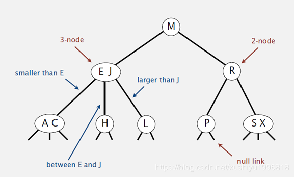

###### 2-3 查找树的性质

1. 如果中序遍历 2-3 查找树，就可以得到排好序的序列。
2. 在一个完全平衡的 2-3 查找树中，根节点到每一个为空节点的距离都相同。（这也是平衡树中 “ 平衡 ” 一词的概念，根节点到叶节点的最长距离对应于查找算法的最坏情况，而平衡树中根节点到叶结点的距离都一样，最坏情况也具有对数复杂度）。

###### 2-3 树的复杂度

　　2-3 树的查找效率与树的高度是息息相关的。

　　在最坏的情况下，也就是所有的节点都是 2-node 节点，查找效率为 lgN。

　　在最好的情况下，所有的节点都是 3-node 节点，查找效率为 log3N 约等于 0.631lgN。

　　距离来说，对于一百万个节点的 2-3 树，树的高度为 12-20 之间，对于 10 亿个节点的 2-3 树，树的高度为 18-30 之间。

　　对于插入来说，只需要常数次操作即可完成，因为他只需要修改与该节点关联的节点即可，不需要检查其他节点，所以效率和查找类似。

##### 平衡查找树之红黑树

###### 红黑树的基本思想

　　2-3 查找树能保证在插入元素之后能保持树的平衡状态，最坏情况下即所有的子节点都是 2-nodes，树的高度为 lgn，从而保证了最坏情况下的时间复杂度。但是 2-3 树实现起来比较复杂，于是就有了一种简单实现 2-3 树的数据结构，即红黑树（Red-Black Tree）。

　　基本思想：红黑树的思想就是对 2-3 查找树进行编码，尤其是对 2-3 查找树中的 3-nodes 节点添加额外的信息。红黑树中将节点之间的链接分为两种不同类型，红色链接，他用来链接两个 2-nodes 节点来表示一个 3-nodes 节点。黑色链接用来链接普通的 2-3 节点。特别的，使用红色链接的两个 2-nodes 来表示一个 3-nodes 节点。特别的，使用红色链接的两个 2-nodes 来表示一个 3-nodes 节点，并且向左倾斜，即一个 2-node 是另一个 2-node 的左子节点。这种做法的好处是查找的时候不用做任何修改，和普通的二叉查找树相同。

###### 红黑树的定义

　　红黑树是一种具有红色和黑色链接的平衡查找树，同时满足：

* 红色节点向左倾斜
* 一个节点不可能有两个红色链接
* 整个树完全黑色平衡，即从根节点到叶子节点的路径上，黑色链接的个数都相同。

　　红黑树的性质：这个树完全黑色平衡，即从根节点到叶子节点的路径上，黑色链接的个数都相同（2-3 树的第 2 个性质，从根节点到叶子节点的距离都相等）。

　　复杂度分析：最坏的情况就是，红黑树中除了最左侧路径全部是由 3-node 节点组成，即红黑相间的路径长度是全黑路径长度的 2 倍。

##### B 树和 B+ 树

###### B 树和 B+ 树的基本思想

　　平衡查找树中的 2-3 树以及其实现红黑树。2-3 树中，一个节点最多有 2 个 key，而红黑树则使用染色的方式来标识这两个 key。

　　维基百科对 B 树的定义为 ：在计算机科学中，B 树（B-tree）是一种树状数据结构，它能够存储数据、对其进行排序并允许以 O（log n）的时间复杂度运行进行查找、顺序读取、插入和删除的数据结构。B 树，概括来说是一个节点可以拥有多于 2 个子节点的二叉查找树。与自平衡二叉查找树不同，B 树为系统最优化大块数据的读和写操作。B-tree 算法减少定位记录时所经历的中间过程，从而加快存取速度。普遍应用于数据库和文件系统 。

　　B 树定义：

　　B 树可以看作是对 2-3 查找树的一种扩展，即它允许每个节点有 M-1 个子节点。

　　根节点至少有两个子节点。

　　每个节点有 M-1 个 key，并且以升序排列。

　　位于 M-1 和 M key 的子节点的值位于 M-1 和 M key 对应的 value 之间。

　　其他节点至少有 M/2 个子节点。

B 树是 2-3 树的一种扩展，它允许一个节点有多于 2 个的元素。B 树的插入及平衡化操作和 2-3 树很相似。

　　B+ 树定义：

　　B+ 树是对 B 树的一种变形树，它与 B 树的差异在于：

* 有 k 个子节点的节点必然有 k 个关键码；
* 非叶节点仅具有索引作用，跟记录有关的信息均存放在叶节点中。
* 树的所有叶结点构成一个有序链表，可以按照关键码排序的次序遍历全部记录。

　　B 和 B+ 树的区别在于，B+ 树的非叶子节点只包含导航信息，不包含实际的值，所有的叶子节点和相连的节点使用链表相连，便于区间查找和遍历。


　　B+ 树的优点在于：

　　由于 B+ 树在内部节点上不包含数据信息，因此在内存页中能够存放更多的 key。数据存放的更加紧密，具有更好的空间局部性。因此访问叶子节点上关联的数据也具有更好的缓存命中率。

　　B+ 树的叶子节点都是相连的，因此对整棵树的遍历只需要一次性遍历叶子节点即可。而且由于数据顺序排列并且相连，所以便于区间查找和搜索。而 B 树则需要进行每一层的递归遍历。相邻的元素可能在内存中不相邻，所以缓存命中性没有 B+ 树好。

　　但是 B 树也有优点，其优点在于，由于 B 树的每一个节点都包含 key 和 value，因此经常访问的元素可能离根节点更近，因此访问也更迅速。

　　B/B+ 树常用于文件系统和数据库系统中，它通过对每个结点存储个数的扩展，使得对连续的数据能够进行较快的定位和访问，能够有效减少查找时间，提高存储的空间局部性从而减少 IO 操作，它广泛用于文件系统及数据库中，如：

　　Windows：HPFS 文件系统；

　　Mac：HFS，HFS+ 文件系统；

　　Linux：ResiserFS、XFS、Ext3FS、JFS 文件系统；

　　数据库：ORACLE、MYSQL、SQLSERVER 等中。

###### B 树和 B+ 树的复杂度

　　在 n 个关键字的 m 阶 B 树和 B+ 查找，从根节点到关键字所在的节点所涉及的节点数不超过：


　　可以认为时间复杂度就是这个，因为 B 树和 B+ 树一般都是在文件系统中用，io 的速度比在内存中计算的速度慢很多。

　　总时间 = 查询节点次数 * io 单次时间 + 查询节点次数 * log2 阶数 * 内存中比较时间。

　　可以认为总时间约等于查询节点次数 * io 单次时间。

　　可以认为 B 树和 B+ 树，时间复杂度为 O（log m/2 n/2）。

###### 树表查找总结

　　二叉查找树平均查找性能不错，为 O(logn)，但是最坏情况会退化为 O(n)。在二叉查找树的基础上进行优化，可以使用平衡查找树。平衡查找树中的 2-3 查找树，这种数据结构在插入之后能够进行自平衡操作，从而保证了树的高度在一定的范围内进而能够保证最坏情况下的时间复杂度。但是 2-3 查找树实现起来比较困难，红黑树是 2-3 树的一种简单高效的实现，他巧妙的使用颜色标记来替代 2-3 树种比较难处理的 3-node 节点问题。红黑树是一种比较高效的平衡查找树，应用非常广泛，很多编程语言的内部实现都或多或少的采用了红黑树。

　　除此之外，2-3查找树的另一个扩展 -- B/B+ 平衡树，在文件系统和数据库系统中有着广泛的应用。

##### 分块查找

###### 分块查找的基本思想

　　对于需要经常增加或减少数据的数据元素列表，每次增加或减少数据之后排序，或者每次查找前排序都不是很好的选择，这样无疑会增加查找的复杂度，在这种情况下可以采用分块查找。

　　分块查找又称为索引顺序查找，是结合二分查找和顺序查找的一种改进方法，在分块查找里有索引表和分块的概念。索引表就是帮助分块查找的一个分块依据，其实就是一个数组，用来存储每块的最大存储值，也就是范围上限，分块就是通过索引表把数据分为几块。

　　在每需要增加一个元素的时候，就需要首先根据索引表，知道这个数据应该在哪一块，然后直接把这个数据加到相应的块里面，而块内的元素之间本身不需要有序。因为块内无须有序，所以分块查找特别适合元素经常动态变化的情况。

　　分块查找只需要索引表有序，当索引表比较大的时候，可以对索引表进行二分查找，锁定块的位置，然后对块内的元素使用顺序查找。这样的总体性能虽然不会比二分查找好，却比顺序查找好很多，最重要的是不需要数列完全有序。

　　分块查找要求把一个数据分为若干块，每一块里面的元素可以是无序的，但是块与块之间的元素需要是有序的。

　　算法思想：将 n 个数据元素 “ 按块有序 ” 划分为 m 块（m<=n）。每一块中的节点不必有序，但块与块之间必须 “ 按块有序 ”；即第 1 块中任一元素的关键字都必须小于第 2 块中任一元素的关键字；而第 2 块中的任一元素又都必须小于第 3 块中的任一元素，......，以此类推。同时，分块查找需要一个索引表，用来限定每一块的范围。在增加、删除、查找元素时都需要用到。

　　算法流程：

1. 先选取各块中的最大关键字构成一个索引表；
2. 查找分两个部分：先对索引表进行二分查找或顺序查找，以确定待查记录在哪一块中；然后，在已确定的块中用顺序法进行查找。


　　所示是一个已经分好块的数据，同时有个索引表，现在要在数据中插入一个元素：


　　首先，看到索引表是 10、20、30，对于元素 15 来说，应该将其放在分块 2 中。于是，分块 2 的数据变为 12、18、15、12、15，直接把 15 插入分块 2 的最后就好了。

　　接下来就是查找操作。如果要查找上图中的 27 这个数，则首先通过二分查找索引表，发现 27 在分块 3 里，然后在分块 3 中顺序查找，得到 27 存在于数列中。

###### 分块查找的复杂度

　　分块查找由于只需要索引表有序，所以特别适合用于在动态变化的数据元素序列中查找。但是如何分块比较复杂。如果分块过于稀疏，则可能导致每一块的内容过多，在顺序查找时效率很低；如果分块过密，则又会导致块数很多，无论是插入还是删除数据，都会频繁地进行二分查找；如果块数特别多，则基本上和直接二分查找的动态插入数据类似，这样分块查找就没有意义了。

　　所以对于分块查找来说，可以根据数据量的大小及数据的区间来进行对分块的选择。

　　分块查找的平均查找长度为索引查找和块内查找的平均长度之和，设索引查找和块内查找的平均查找长度分别为 L1,Ls，则分块查找的平均查找长度为：

　　ASL = L1+Ls

　　设将长度为 n 的查找表均匀的分为 b 块，每块有 s 个记录，在等概率的情况下，若在块内和索引表中均采用顺序查找，则平均查找长度为：

　　此时，若 s=√n，则平均查找长度取最小值：√n+1，若对索引表采用折半查找时，则平均查找长度为：

　　ASL = L1+Ls = log2(b+1)+(s+1)/2

　　时间复杂度：假设有 b 块，查询哪个块：log2b，在块中查找 n/b，总共 O(log2b+n/b)。

##### 哈希查找

###### 哈希查找的基本思想

　　算法思想：哈希的思路很简单，如果所有的键都是整数，那么就可以使用一个简单的无序数组来实现：将键作为索引，值即为其对应的值，这样就可以快速访问任意键的值。这是对于简单的键的情况，将其扩展到可以处理更加复杂的类型的键。

　　算法流程：

1. 用给定的哈希函数构造哈希表；
2. 根据选择的冲突处理方法解决地址冲突；
3. 在哈希表的基础上执行哈希查找。

　　哈希表是一个在时间和空间上做出权衡的经典例子。如果没有内存限制，那么可以直接将键作为数组的索引。那么所有的查找时间复杂度为 O(1)，如果没有时间限制，那么可以使用无序数组进行顺序查找，这样只需要很少的内存。哈希表使用了适度的时间和空间来在这两个计算之间找到了平衡。只需要调整哈希函数算法即可在时间和空间上做出取舍。

###### 哈希查找的复杂度

　　单纯论查找复杂度：对于无冲突的 hash 表而言，查找复杂度为 O(1)（注意，在查找之前需要构建相应的 Hash 表）。

　　Hash 是一个典型以空间换时间的算法，比如原来一个长度为 100 的数组，对其查找，只需要遍历且匹配相应记录即可。从空间复杂度上来说，假如数组存储的是 byte 类型数据，那么该数组占 100 byte 空间。现在采用 Hash 算法，Hash 必须有一个规则，约束键与存储位置的关系，那么就需要一个固定长度的 hash 表，此时，仍然是 100byte 的数组，假设需要的 100byte 用来记录键与位置的关系，那么总的空间为 200bytes，而且用于记录规则的表大小会根据规则，大小可能是不定的。

#### * 排序算法

##### 直接插入排序

###### 基本思想

　　通常人们整理桥牌的方法是一张一张的来，将每一张牌插入到其他已经有序的牌中的适当位置。在计算机的实现中，为了要给插入的元素腾出空间，需要将其余所有元素在插入之前都向右移动一位。

　　直接插入的思想是：将一个记录插入到已排好序的有序表中，从而得到一个新的、记录数增 1 的有序表。

　　例如，排序序列（3，2，1，5）的过程是，初始时有序序列为（3），然后从位置 1 开始，先访问到 2，将 2 插入到 3 前面，得到有序序列（2，3），之后访问 1，找到合适的插入位置后得到有序序列（1，2，3），最后访问 5，得到最终有序序列（1，2，3，5）。

###### 算法描述

　　一般来说，插入排序都采用 in-place 在数组上实现。具体算法描述如下：

1. 从第一个元素开始，该元素可以认为已经被排序。
2. 取出下一个元素，在已经排序的元素序列中从后向前扫描。
3. 如果该元素（已排序）大于新元素，将该元素移到下一位置。
4. 重复步骤 3，直到找到已排序的元素小于或者等于新元素的位置。
5. 将新元素插入到该位置后。
6. 重复步骤 2~5。

　　注意：如果比较操作的代价比交换操作大的话，可以采用二分查找法来减少比较操作的数目。该算法可以认为是插入排序的一个变种，称为二分查找插入排序。

```java
/**
 * 直接插入排序
 */
public class InsertSort {

    /**
     * 通过交换进行插入排序，借鉴冒泡排序
     *
     * @param a
     */
    public static void sort(int[] a) {
        for (int i = 0; i < a.length - 1; i++) {
          	// 插入前面已经排好序的序列
            for (int j = i + 1; j > 0; j--) {
                if (a[j] < a[j - 1]) {
                    int temp = a[j];
                    a[j] = a[j - 1];
                    a[j - 1] = temp;
                }
            }
        }
    }

    /**
     * 通过将较大的元素都向右移动而不总是交换两个元素
     *
     * @param a
     */
    public static void sort2(int[] a) {
        for (int i = 1; i < a.length; i++) {
            int num = a[i];
            int j;
          	// 插入前面已经排好序的序列
            for (j = i; j > 0 && num < a[j - 1]; j--) {
                a[j] = a[j - 1];
            }
            a[j] = num;
        }
    }
}
```

###### 复杂度分析

　　直接插入排序复杂度如下：

| 平均时间复杂度 | 最好情况 | 最坏情况 | 空间复杂度 |
| -------------- | -------- | -------- | ---------- |
| O(n^2)         | O(n)     | O(n^2)   | O(1)       |

　　最好情况下，当待排序序列中记录已经有序时，则需要 n-1 次比较，不需要移动，时间复杂度为 O(n)。最差情况下，待排序序列中所有记录正好逆序时，则比较次数和移动次数都达到最大值，时间复杂度为 O(n^2)，平均情况下，时间复杂度为 O(n^2)。

###### 比较与总结

　　插入排序所需的时间取决于输入元素的初始顺序。例如，对一个很大且其中的元素已经有序（或接近有序）的数组进行排序将会比随机顺序的数组或是逆序数组进行排序要快得多。

##### 希尔排序

　　希尔排序，也称递减增量排序算法、“ 缩小增量 ” 排序，是插入排序的一种更高效的改进版本。希尔排序是非稳定排序算法。

　　希尔排序是基于插入排序的以下两点性质而提出改进方法的：

* 直接插入排序在对几乎已经排好序的数据操作时，效率高，即可以达到线性排序的效率。
* 直接插入排序一般来说是低效的，因为插入排序每次只能将数据移动一位。

　　希尔排序是先将整个待排序的记录序列分割成为若干子序列分别进行直接插入排序，待整个序列中的记录 “ 基本有序 ” 时，再对全体记录进行依次直接插入排序。

###### 基本思想

　　将待排序数组按照步长 gap 进行分组，然后将每组的元素利用直接插入排序的方法进行排序；每次再将 gap 折半减少，循环上述操作；当 gap = 1 时，利用直接插入，完成排序。

　　可以看到步长的选择是希尔排序的重要部分。只要最终步长为 1 任何步长序列都可以工作。一般来说最简单的步长取值是初次取数组长度的一半为增量，之后每次再减半，直到增量为 1。

###### 算法描述

1. 选择一个增量序列 t1,t2,......,tk，其中 ti > tj，tk=1；
2. 按增量序列个数 k，对序列进行 k 趟排序；
3. 每趟排序，根据对应的增量 ti，将待排序序列分割成若干长度为 m 的子序列，分别对各子表进行直接插入排序。仅增量因子为 1 时，整个序列作为一个表来处理，表长度即为整个序列的长度。

　　效果如下：

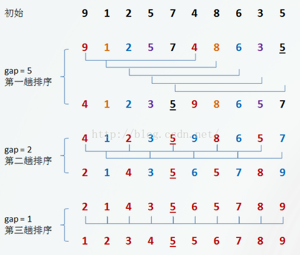

###### 代码实现

```java
/**
 * 希尔排序
 */
public class HiliSort {
    public static void sort(int[] a) {
        int length = a.length;
        int h = 1;
        while (h < length / 3) h = 3 * h + 1;
        for (; h >= 1; h /= 3) { // 步长的循环
            System.out.println();
            System.out.println("h:" + h);
            // 分块
            for (int i = 0; i < a.length - h; i += h) {
                System.out.println("i:" + i);
                // 对分块的内容进行排序
                for (int j = i + h; j > 0; j -= h) {
                    System.out.print("j:" + j+",");
                    if (a[j] < a[j-h]) {
                        int temp = a[j];
                        a[j] = a[j - h];
                        a[j - h] = temp;
                    }
                }
                System.out.println();
            }
        }
    }

    public static void main(String[] args) {
        int a[] = new int[]{9, 1, 2,  7, 4, 8, 6, 3, 5};
        sort(a);
        System.out.println("a:" + Arrays.toString(a));
    }
}
```


##### 简单选择排序


##### 堆排序


##### 冒泡排序


##### 归并排序


##### 基数排序


##### 快速排序

在平均状况下，排序 n 个项目要 O(nlogn) 次比较。在最坏状况下则需要 O(n^2) 次比较，但这种状况并不常见。事实上，快速排序通常明显比其他 O(nlogn) 算法更快，因为它的内部循环（inner loop）可以在大部分的架构上很有效率地被实现出来。

###### 基本思想

　　快速排序的基本思想：挖坑填数 + 分治法。

　　快速排序又是一种分治法思想在排序算法上的典型应用。本质上来看，快速排序应该算是在冒泡排序基础上的递归分治法，是对冒泡排序的一种改进。

　　快速排序的主要思想是：在待排序的序列中选择一个称为主元的元素，将数组分为两部分，使得第一部分中的所有元素都小于或等于主元，而第二部分中的所有元素都大于主元，然后对两部分递归地应用快速排序算法，整个排序过程可以递归进行，以此达到整个数据变成有序序列。

###### 算法描述

　　快速排序使用分治策略来把一个序列（list）分为两个子序列（sub-list）。步骤为：

1. 从数列中挑出一个元素，称为 “ 基准 ”（pivot）。
2. 重新排序数列，所有比基准值小的元素排放在基准前面，所有比基准值大的元素摆在基准后面（相同的数可以到任一边）。在这个分区结束之后，该基准就处于数列的中间位置。这个称为分区（partition）操作。
3. 递归地（recursively）把小于基准值元素地子数列和大于基准值元素的子数列排序。

　　递归到最底部时，数列的大小是零或一，也就是已经排序好了。这个算法一定会结束，因为在每次的迭代（iterator）中，它至少会把一个元素摆到它最后的位置去。

###### 代码实现

　　用伪代码描述如下：

1. i = L;j = R; 将基准数挖出形成第一个坑 a[i]。
2. j--，由后向前找比它小的数，找到后挖出此数填前一个坑 a[i]中。
3. i++，由前向后找比它大的数，找到后也挖出此数填到前一个坑 a[j] 中。
4. 再重复执行 2、3 二步，直到 i==j，将基准数填入 a[i] 中。

```java
    public static void sort(int[] a, int low, int high) {
        // 已经排完
        if (low >= high) {
            return;
        }
        int left = low;
        int right = high;
        // 保存基准位置
        int pivot = left;
        while (left < right) {
            // 从后往前找到比基准小的元素
            while (left < right && a[right] >= a[pivot]) {
                right--;
            }
            // 从前往后找到比基准大的元素
            while (left < right && a[left] <= a[pivot]) {
                left++;
            }
            if (left < right) {
                int temp = a[left];
                a[left] = a[right];
                a[right] = temp;
            }
        }
        // 放值基准值
        int temp = a[left];
        a[left] = a[pivot];
        a[pivot] = temp;
        // 分支递归快排
        sort(a, low, left - 1);
        sort(a, left + 1, high);
    }
```

　　上面是递归版的快速排序：通过把基准插入到合适的位置来实现分治，并递归地对分治后的两个划分继续快排。那么非递归版的快排如何实现呢？

　　因为递归的本质是栈，所以非递归实现的过程中，可以借助栈来保存中间变量就可以实现非递归了。在这里中间变量也就是通过 Pritation 函数划分取键之后分成左右两部分的首尾指针，只需要保存这两部分的首尾指针即可。

###### 复杂度分析

　　在快速排序算法中，比较关键的一个部分是主元的选择。在最差情况下，划分由 n 个元素构成的数组需要进行 n 次比较和 n 次移动，因此划分需要的时间是 O(n)。在最差情况下，每次主元会将数组划分为一个大的子数组和一个空数组，这个大的子数组的规模是在上次划分的子数组的规模上减 1，这样在最差情况下算法需要 (n-1)+(n-2)+...+1=O(n^2) 时间。

　　最佳情况下，每次主元将数组划分为规模大致相同的两部分，时间复杂度为 O(nlogn)。

　　以下是快速排序算法复杂度：

| 平均时间复杂度 | 最好情况    | 最坏情况 | 空间复杂度           |
| -------------- | ----------- | -------- | -------------------- |
| O(nlog2 n)     | O(n log2 n) | O(n^2)   | O(1)(原地分区递归版) |

## 设计模式

### 设计模式的六大原则

#### 单一职责原理

应该有且仅有一个原因引起类的变更。

单一职责适用于接口、类，同时也适用于方法，什么意思呢？一个方法尽可能做一件事情。

　　单一职责原则有什么好处：

* 类的复杂性降低，实现什么职责都有清晰明确的定义；
* 可读性提高，复杂性降低，那当然可读性提高了；
* 可维护性提高，可读性提高，那当然更容易维护了；
* 变更引起的风险降低，变更是必不可少的，如果接口的单一原则做的好，一个接口修改只对相应的实现类有影响，对其他的接口无影响，这对系统的扩展性、维护性都有非常大的帮助。

　　单一职责原则最难划分的就是职责。一个职责一个接口，但问题是“职责”没有一个量化的标准，一个类到底要负责那些职责？这些职责该怎么细化？细化后是否都要有一个接口或类？这些都需要从实际的项目去考虑。

　　单一职责适用于接口、类，同时也适用于方法，什么意思呢？一个方法尽可能做一件事情。

　　对于单一职责原理，我的建议是接口一定要做到单一职责，类的设计尽量做到只有一个原因引起变化。

#### 里氏替换原则

　　为了让单一继承原则的优势发挥最大的作用，减少弊端，解决方案就是引入里氏置换原则（Lishov Substitution Principle,LSP）。

　　什么是里氏置换原则？它有两种定义：

* 第一种定义，也是最正宗的定义：If for each  object o1 of type S there is an object o2 of type T such that for all programs P defined in terms of T,the behavior of P is unchanged when o1 is substituted for o2 then S is a subtype of T.（如果对每一个类型为 S 的对象 o1，都有类型为 T 的对象 o2，使得以 T 定义的所有程序 P 在所有的对象 o1 都代换成 o2 时，程序 P 的行为没有发生变化，那么类型 S 是类型 T 的子类型）。
* 第二种定义：Functions that use pointers or references to base classes must be able to use objects of derived classes without knowing it.（所有引用基类的方法必须能透明地使用其子类的对象）。

　　第二个定义是最清晰明确的，通俗点讲，只要父类能出现的地方子类就可以出现，而且替换为子类也不会产生任何错误或异常，使用者可能根本就不需要知道是父类还是子类。但是，反过来就不行了，有子类出现的地方，父类未必就能适应。

#### 依赖倒置原则

　　翻译过来，包含三层含义：

* 高层模块不应该依赖低层模块，两者都应该依赖其抽象；
* 抽象不应该依赖细节；
* 细节应该依赖抽象。

　　依赖倒置原则在 Java 语言中的表现就是：

* 模块间的依赖通过抽象发生，实现类之间不发生直接的依赖关系，其依赖关系是通过接口或抽象类产生的；
* 接口或抽象类不依赖于实现类；
* 实现类依赖接口或抽象类。

#### 接口隔离原则

建立单一接口，不要建立臃肿庞大的接口。通俗讲就是：接口尽量细化，同时接口中的方法尽量少。

　　接口隔离原则与单一职责的不同：接口隔离原则与单一职责的审视角度不相同，单一职责要求的是类和接口职责单一，注重的是职责，这是业务逻辑上的划分，而接口隔离原则要求接口的方法尽量少。

#### 迪米特法则

　　迪米特法则（Law of Demeter, Lod，也称为最少知识原则（Least Knowledge Principle，LKP）：一个对象应该对其他对象有最少的了解。通俗地讲，一个类应该对自己需要耦合或调用地类知道得最少。

#### 开闭原则

　　一个软件实体如类、模块和函数应该对扩展开放，对修改关闭。 

### 简单工厂模式

#### 模式动机

　　考虑一个简单的软件应用场景，一个软件系统可以提供多个外观不同的按钮（如圆形按钮、矩形按钮、菱形按钮等），这些按钮都源自同一个基类，不过在继承基类后不同的子类修改了部分属性从而使得它们可以呈现不同的外观，如果希望在使用这些按钮时，不需要知道这些具体按钮类的名字，只需要知道表示该按钮类的一个参数，并提供一个调用方便的方法，把该参数传入方法即可返回一个相应的按钮对象，此时，就可以使用简单工厂模式。

#### 模式定义

　　简单工厂模式（Simple Factory Pattern）：又称为静态工厂方法（Static Factory Method）模式，它属于类创建型模式。在简单工厂模式中，可以根据参数的不同返回不同类的实例。简单工厂模式专门定义一个类来负责创建其他类的实例，被创建的实例通常都具有共同的父类。

#### 模式结构

　　简单工厂模式包含如下角色：

* Factory：工厂角色
  工厂角色负责实现创建所有实例的内部逻辑。
* Product：抽象产品角色
  抽象产品角色是所创建的所有对象的父类，负责描述所有实例所共有的公共接口。
* ConcreteProduct：具体产品角色
  具体产品角色是创建目标，所有创建的对象都充当这个角色的某个具体类的实例。


#### 模式分析

* 将对象的创建和对象本身业务处理分离，可以降低系统的耦合度，使得两者修改起来都相对容易。
* 在调用工厂类的工厂方法时，由于工厂方法是静态方法，使用起来很方便，可通过类名直接调用，而且只需要传入一个简单的参数即可，在实际开发中，还可以在调用时将所传入的参数保存在 XML 等格式的配置文件中，修改参数时无须修改任何源代码。
* 简单工厂模式最大的问题在于工厂类的职责相对过重，增加新的产品需要修改工厂类的判断逻辑，这一点与开闭原则是相违背的。
* 简单工厂模式的要点在于：当你需要什么，只需要传入一个正确的参数，就可以获取你所需要的对象，而无须知道其创建细节。

#### 简单工厂模式的优点

* 工厂类含有必要的判断逻辑，可以决定在什么时候创建哪一个产品类的实例，客户端可以免除直接创建产品对象的责任，仅仅 “ 消费 ” 产品即可，简单工厂模式通过这种做法实现了对责任的分割，它提供了专门的工厂类用于创建对象。
* 客户端无须知道所创建的具体产品类的类名，只需要知道具体产品类所对应的参数即可，对于一些复杂的类名，通过简单工厂模式可以减少使用者的记忆量。
* 通过引入配置文件，可以在不修改任何客户端代码的情况下更换和增加新的具体产品类，在一定程度上提高了系统的灵活性。

#### 简单工厂模式的缺点

* 由于工厂类集中了所有产品创建逻辑，一旦不能正常工作，这个系统都要受到影响。
* 使用简单工厂模式将会增加系统中类的个数，在一定程度上增加了系统的复杂度和理解难度。
* 系统扩展困难，一旦添加新产品就不得不修改工厂逻辑，在产品类型较多时，有可能造成工厂逻辑过于复杂，不利于系统的扩展和维护。
* 简单工厂模式由于使用了静态工厂方法，造成工厂角色无法形成基于继承的等级结构。

#### 适用环境

在以下情况下可以使用简单工厂模式：

* 工厂类负责创建的对象比较少：由于创建的对象较少，不会造成工厂方法中的业务逻辑太过复杂。
* 客户端只知道传入工厂类的参数，对于如何创建对象不关心：客户端既不需要关心创建细节，甚至连类名都不需要记住，只需要知道类型所对应的参数。


### 工厂方法模式

#### 模式动机

　　对系统进行修改，不再设计一个按钮工厂类来统一负责所有产品的创建，而是将具体按钮的创建过程交给专门的工厂子类去完成，先定义一个抽象的按钮工厂类，再定义具体的工厂类来生成圆形按钮、矩形按钮、菱形按钮等，它们实现在抽象按钮工厂类中定义的方法。这种抽象化的结果使这种结构可以在不修改具体的工厂类的情况下引进新的产品，如果出现新的按钮类型，只需要为这种新类型的按钮创建一个具体的工厂类就可以获得该新按钮的实例，这一特点无疑使得工厂方法模式具有超越简单工厂模式的优越性，更加符合 “ 开闭原则 ” 。

#### 模式定义

　　工厂方法模式（Factory Method Pattern）又称为工厂模式，也叫虚拟构造器（Virtual Constructor）模式或者多态工厂（Polumorphic Factory）模式，它属于类创建型模式。在工厂方法模式中，工厂父类负责定义创建产品对象的公共接口，而工厂子类则负责生成具体的产品对象，这样做的目的是将产品类的实例化操作延迟到工厂子类中完成，即通过工厂子类来确定究竟应该实例化哪一个具体产品类。

#### 模式结构

　　工厂方法模式包含如下角色：

* Product：抽象产品
* ConcreateProduct：具体产品
* Factory：抽象工厂
* ConcreateFactory：具体工厂


#### 模式分析

　　工厂方法模式是简单工厂模式的进一步抽象和推广。由于使用了面向对象的多态性，工厂方法模式保持了简单工厂模式的优点，而且克服了它的缺点。在工厂方法模式中，核心的工厂类不再负责所有产品的创建，而是将具体创建工作交给子类去做。这个核心类仅仅负责给出具体工厂必须实现的接口，而不负责哪一个产品类被实例化这种细节，这使得工厂方法模式可以允许系统在不修改工厂角色的情况下引进新产品。

#### 实例

　　日志记录器

　　某系统日志记录器要求支持多种日志记录方式，如文件记录、数据库记录等，且用户可以根据要求动态选择日志记录方式，现使用工厂方法模式设计该系统。

　　结构图：


#### 工厂方法模式的优点

* 在工厂方法模式中，工厂方法用来创建客户所需要的产品，同时还向客户隐藏了哪种具体产品类将被实例化这一细节，用户只需要关心所需产品对应的工厂，无需关心创建细节，甚至无须知道具体产品类的类名。
* 基于工厂角色和产品角色的多态性设计是工厂方法模式的关键。它能够使工厂可以自主确定创建何种产品对象，而如何创建这个对象的细节则完全封装在具体工厂内部。工厂方法模式之所以又被称为多态工厂模式，是因为所有的具体工厂类都具有同一抽象父类。
* 使用工厂方法模式的另一个优点是在系统中加入新产品时，无需修改抽象工厂和抽象产品提供的接口，无需修改客户端，也无需修改其他的具体工厂和具体产品，而只要添加一个具体工厂和具体产品就可以了。这样，系统的可扩展性也就变得非常好，完全符合 “ 开闭原则 ” 。

#### 工厂模式的缺点

* 在添加新产品时，需要编写新的具体产品类，而且还要提供与之对应的具体工厂类，系统中类的个数将成对增加，在一定程序上增加了系统的复杂度，有更多的类需要编译和运行，会给系统带来一些额外的开销。
* 由于考虑到系统的可扩展性，需要引入抽象层，在客户端代码中均使用抽象层进行定义，增加了系统的抽象性和理解难度，且在实现时可能需要用到 DOM、反射等技术，增加了系统的实现难度。

#### 适用环境

　　在以下情况下可以使用工厂方法模式：

* 一个类不知道它所需要的对象的类：在工厂方法模式中，客户端不需要知道具体产品类的类名，只需要知道所对应的工厂即可，具体的产品对象由具体的工厂类创建；客户端需要知道创建具体产品的工厂类。
* 一个类通过其子类来指定创建哪个对象：在工厂方法模式中，对于抽象工厂类只需要提供一个创建产品的接口，而由其子类来确定具体要创建的对象，利用面向对象的多态性和里氏代换原则，在程序运行时，子类对象将覆盖父类对象，从而使得系统更容易扩展。
* 将创建对象的任务委托给多个工厂子类中的某一个，客户端在使用时可以无须关心是哪一个工厂子类创建产品子类，需要时再动态指定，可将具体工厂类的类名存储在配置文件或数据库中。

#### 模式扩展

* 使用多个工厂方法：在抽象工厂角色中可以定义多个工厂方法，从而使具体工厂角色实现这些不同的工厂方法，这些方法可以包含不同的业务逻辑，以满足对不同的产品对象的需求。
* 产品对象的重复使用：工厂对象将已经创建过的产品保存到一个集合（如数组、List等）中，然后根据客户对产品的请求，对集合进行查询。如果有满足要求的产品对象，就直接将该产品返回客户端；如果集合中没有这样的产品对象，那么就创建一个新的满足要求的产品对象，然后将这个对象在增加到集合中，再返回给客户端。
* 多态性的丧失和模式的退化：如果工厂仅仅返回一个具体产品对象，便违背了工厂方法的用意，发生退化，此时就不再是工厂方法模式了。一般来说，工厂对象应当有一个抽象的父类型，如果工厂等级结构中只有一个具体工厂类的话，抽象工厂应当有一个抽象的父类型，如果工厂等级结构中只有一个具体工厂类的话，抽象工厂就可以省略，也将发生了退化。当只有一个具体工厂，在具体工厂中可以创建所有的产品对象，并且工厂方法设计为静态方法时，工厂方法模式就退化为简单工厂模式。

### 抽象工厂模式

#### 模式动机

* 在工厂方法模式中具体工厂负责生产具体的产品，每一个具体工厂对应一种具体产品，工厂方法也具有唯一性，一般情况下，一个具体工厂中只有一个工厂方法或者一组重载的工厂方法。但是有时候需要一个工厂可以提供多个产品对象，而不是单一的产品对象。
  为了更清晰地理解工厂方法模式，需要先引入两个概念：
  - **产品等级结构**：产品等级结构即产品的继承结构，如一个抽象类是电视机，其子类有海尔电视机、海信电视机、TCL 电视机，则抽象电视机与具体品牌的电视机之间构成了一个产品等级结构，抽象电视机是父类，而具体品牌的电视机是其子类。
  - **产品族**：在抽象工厂模式中，产品族是指有同一个工厂生产的，位于不同产品等级结构中的一组产品，如海尔电器工厂生产的海尔电视机、海尔电冰箱，海尔电视机位于电视机产品等级结构中，海尔电冰箱位于电冰箱产品等级结构中。
* 当系统所提供的的工厂所需生产的具体产品并不是一个简单的对象，而是多个位于不同产品等级结构中属于不同类型的具体产品时需要使用抽象工厂模式。
* 抽象工厂模式是所有形式的工厂模式中最为抽象和最具一般性的一种形态。
* 抽象工厂模式与工厂方法模式最大的区别在于：工厂方法模式针对的是一个产品等级结构，而抽象工厂模式则需要面对多个产品等级结构，一个工厂等级结构可以负责多个不同产品等级结构中的产品对象的创建。当一个工厂等级结构可以创建出分属于不同产品等级结构的一个产品族中的所有对象时，抽象工厂模式比工厂方法模式更为简单、有效率。

#### 模式定义

　　抽象工厂模式（Abstract Factory Pattern）：提供一个创建一系列相关或相互依赖对象的接口，而无须指定它们具体的类。抽象工厂模式又称为 Kit 模式，属于对象创建型模式。

#### 模式结构

　　抽象工厂模式包含如下角色：

* AbstractFactory：抽象工厂
* ConcreateFactory：具体工厂
* AbstractProduct：抽象产品
* Product：具体产品


#### 优点

* 抽象工厂模式隔离了具体类的生成，使得客户并不需要知道什么被创建。由于这种隔离，更换一个具体工厂就变得相对容易。所有的具体工厂都实现了抽象工厂中定义的那些公共接口，因此只需改变具体工厂的实例，就可以在某种程度上改变整个软件系统的行为。另外，应用抽象工厂模式可以实现高内聚低耦合的设计目的，因此抽象工厂模式得到了广泛的应用。
* 当一个产品族中的多个对象被设计成一起工作时，它能够保证客户端始终只使用同一个产品族中的对象。这对一些需要根据当前环境来决定其行为的软件系统来说，是一种非常实用的设计模式。
* 增加新的具体工厂和产品族很方便，无需修改已有系统，符合 “ 开闭原则 ” 。

#### 缺点

* 在添加新的产品对象时，难以扩展抽象工厂来生产新种类的产品，这是因为在抽象工厂角色中规定了所有可能被创建的产品集合，要支持新种类的产品就意味着要对该接口进行扩展，而这将涉及到对抽象工厂角色及其所有子类的修改，显然会带来较大的不便。
* 开闭原则的倾斜性（增加新的工厂和产品族容易，增加新的产品等级结构麻烦）。

#### 适用模式

　　在以下情况下可以使用抽象工厂模式：

* 一个系统不应当依赖于产品类实例如何被创建、组合和表达的细节，这对于所有类型的工厂模式都是重要的。
* 系统中有多于一个的产品族，而每次只是用其中某一个产品族。
* 属于同一个产品族的产品将在一起使用，这一约束必须在系统的设计中体现出来。
* 系统提供一个产品类的库，所有的产品以同样的接口出现，从而使客户端不依赖于具体实现。

#### 模式应用

　　在很多软件系统中需要更换界面主题，要求界面中的按钮、文本框、背景色等一起发生改变时，可以使用抽象工厂模式进行设计。

#### 模式扩展

**“ 开闭原则 ” 的倾斜性**

* “ 开闭原则 ” 要求系统对扩展开放，对修改封闭，通过扩展达到增强其功能的目的。对于涉及到多个产品族与多个产品等级结构的系统，其功能增强包括两方面：
  * 1.增加产品族：对于增加新的产品族，工作方法模式很好的支持了 “ 开闭原则 ” ，对于新增加的产品族，只需要对应增加一个新的具体工厂即可，对已有代码无需做任何修改。
  * 2.增加新的产品等级结构：对于增加新的产品等级结构，需要修改所有的工厂角色，包括抽象工厂类，在所有的工厂类中都需要增加生产新产品的方法，不能很好的支持“开闭原则”。

* 抽象工厂模式的这种性质称为 “ 开闭原则 ” 的倾斜性，抽象工厂模式以一种倾斜的方式支持增加新的产品，它为新产品族的增加提供方便，但不能为新的产品等级结构的增加提供这样的方便。

**工厂模式的退化**

* 当抽象工厂模式中每一个具体工厂类只创建一个产品对象，也就是只存在一个产品等级结构时，抽象工厂模式退化成工厂方法模式；当工厂方法模式中抽象工厂与具体工厂合并，提供一个统一的工厂来创建产品对象，并将创建对象的工厂方法设计为静态方法时，工厂方法模式退化成简单工厂模式。

### 单例模式

#### 模式动机

　　对于系统中的某些类来说，只有一个实例很重要。例如，一个系统中可以存在多个打印任务，但是只能有一个正在工作的任务；一个系统只能有一个窗口管理器或文件系统；一个系统只能有一个计时工具或 ID(序号)生成器。

　　如何保证一个类只有一个实例，并且这个实例易于被访问呢？定义一个全局变量可以确保对象随时可以被访问，但不能防止实例化多个对象。一个更好的解决方法是让类自身负责保存它的唯一实例，这个类可以保证没有其他实例被创建，并且它可以提供一个访问该实例的方法，这就是单例模式的模式动机。

#### 模式定义

　　单例模式（Singleton Pattern）：单例模式确保某一个类只有一个实例，而且自行实例化并向整个系统提供这个实例，这个类称为单例类，它提供全局访问的方法。

　　单例模式的要点有三个：一是某个类只能有一个实例；二是它必须自行创建这个实例；三是它必须自行向整个系统提供这个实例。单例模式是一种对象创建型模式。单例模式又名单件模式或单态模式。

#### 模式结构


#### 模式分析

　　单例模式的目的是保证一个类仅有一个实例，并提供一个访问它的全局访问点。单例模式包含的角色只有一个，就是单例类 -- Singleton。单例类拥有一个私有构造函数，确保用户无法通过 new 关键字直接实例化它。除此之外，该模式中包含一个静态私有成员变量与静态公有的工厂方法，该工厂方法负责检验实例的存在性并实例化自己，然后存储在静态成员变量中，以确保只有一个实例被创建。

　　在单例模式的实现过程中，需要注意如下三点：

* 单例类的构造函数为私有；
* 提供一个自身的静态私有成员变量；
* 提供一个公有的静态工厂方法。

#### 优点

* 提供了唯一实例的受控访问。因为单例类封装了它的唯一实例，所以它可以严格控制客户怎样以及何时访问它，并为设计及开发团队提供了共享的概念。
* 由于在系统内存中只存在一个对象，因此可以节约系统资源，对于一些需要频繁创建和销毁的对象，单例模式无疑可以提供系统的性能。
* 允许可变数目的实例。可以基于单例模式进行扩展，使用与单例控制相似的方法来获得指定个数的对象实例。

#### 缺点

* 由于单例模式中没有抽象层，因此单例类的扩展有很大的困难。
* 单例类的职责过重，在一定程度上违背了 “ 单一职责原则 ” 。因为单例类即充当了工厂角色，提供了工厂方法，同时又充当了产品角色，包含一些业务方法，将产品的创建和产品本身的功能融合在一起。
* 滥用单例将带来一些负面问题，如为了节省资源将数据库连接池对象设计为单例类，可能会导致共享连接池对象的程序过多而出现连接池溢出；现在很多面向对象语言（如 Java、c#）的运行环境都提供了自动垃圾回收的技术，因此，如果实例化的对象长时间不被利用，系统会认为它是垃圾，会自动销毁并回收资源，下次利用时又将重新实例化，这将导致对象状态的丢失。

#### 适用环境

　　在以下情况下可以使用单例模式：

* 系统只需要一个实例对象，如系统要求提供一个唯一的序列号生成器，或者需要考虑资源消耗太大而只允许创建一个对象。
* 客户调用类的单个实例只允许使用一个公共访问点，除了该公共访问点，不能通过其他途径访问该实例。
* 在一个系统中要求一个类只有一个实例时才应当使用单例模式。反过来，如果一个类可以有几个实例共存，就需要对单例模式进行改进，使之成为多例模式。

#### 模式应用

　　一个具有自动编号主键的表可以有多个用户同时使用，但数据库中只能有一个地方分配下一个主键编号，否则会出现主键重复，因此该主键编号生成器必须具备唯一性，可以通过单例模式来实现。

### 适配器模式

#### 模式动机

　　在软件开发中采用类似于电源适配器的设计和编码技巧被称为适配器模式。

　　通常情况下，客户端可以通过目标类的接口访问它所提供的服务。有时，现有的类可以满足客户类的功能需要，但是它所提供的接口不一定是客户类所期望的，这可能是因为现有类中方法名与目标类中定义的方法名不一致等原因所导致的。

　　在这种情况下，现有的接口需要转化为客户类期望的接口，这样保证了对现有类的重用。如果不进行这样的转化，客户类就不能利用现有类所提供的功能，适配器模式可以完成这样的转化。

　　在适配器模式中可以定义一个包装类，包装不兼容接口的对象，这个包装类指的就是适配器（Adapter），它所包装的对象就是是适配者（Adaptee），即被适配的类。

　　适配器提供客户类需要的接口，适配器的实现就是把客户类的请求转化为对适配者的相应接口的调用。也就是说：当客户类调用适配器的方法时，在适配器类的内部将调用适配者类的方法，而这个过程对客户类是透明的，客户类并不直接访问适配者类。因此，适配器可以使由于接口不兼容而不能交互的类可以一起工作。这就是适配器模式的模式动机。

#### 模式定义

　　适配器模式（Adapter Pattern）：将一个接口转换成客户希望的另一个接口，适配器模式使接口不兼容的那些类可以一起工作中，其别名为包装器（Wrapper）。适配器模式既可以作为类结构性模式，也可以作为对象结构型模式。

#### 模式结构

　　适配器模式包含如下角色：

* Target：目标抽象类
* Adapter：适配器类
* Adaptee：适配者类
* Client：客户类

　　适配器模式有对象适配器和类适配器两种实现：

　　对象适配器：


　　类适配器：


#### 优点

* 将目标类和适配者类解耦，通过引入一个适配器类来重现现有的适配者类，而无须修改原有代码。
* 增加了类的透明性和复用性，将具体的实现封装在适配者类中，对于客户款来说是透明的，而且提高了适配者的复用性。
* 灵活性和扩展性都非常好，通过使用配置文件，可以很方便地更换适配器，也可以在不修改原有代码的基础上增加新的适配器类，完全符合“开闭原则”。

　　**类适配器模式还具有如下优点：**由于适配器类是适配者类的子类，因此可以在适配器类中置换一些适配者的方法，使得适配器的灵活性更强。

　　**对象适配器模式还具有如下优点：**一个对象适配器可以把多个不同的适配者适配到同一个目标，也就是说，同一个适配器可以把适配者类和它的子类都适配到目标接口。

#### 缺点

　　**类适配器模式的缺点：**对于 Java 、C# 等不支持多重继承的语言，一次最多只能适配一个适配者类，而且目标抽象类只能为抽象类，不能为具体类，其使用有一定的局限性，不能将一个适配者类和它的子类都适配到目标接口。

　　**对象适配器模式的缺点如下：**与类适配器模式相比，要想置换适配者类的方法就不容易。如果一定要置换掉适配者类的一个或多个方法，就只好先做一个适配者类的子类，将适配者类的方法置换掉，然后再把适配者类的子类当做真正的适配者进行适配，实现过程较为复杂。

#### 适用环境

　　在以下情况下可以使用适配器模式：

* 系统需要使用现有的类，而这些类的接口不符合系统的需要。
* 想要建立一个可以重复使用的类，用于与一些彼此之间没有太大关联的一些类，包括一些可能在将来引进的类一起工作。

#### 模式扩展

**默认适配器模式**（Default Adapter Pattern） 或**缺省适配器模式**
当不需要全部实现接口提供的方法时，可先设计一个抽象类实现接口，并为该接口中每个方法提供一个默认实现（空方法），那么该抽象类的子类可有选择地覆盖父类的某些方法来实现需求，它适用于一个接口不想使用其所有的方法的情况。因此也称为 **单接口适配器模式** 。

### 代理模式

#### 模式动机

　　在某些情况下，一个客户不想或者不能直接引用一个对象，此时可以通过一个称之为“代理”的第三者来实现间接引用。代理对象可以在客户端和目标对象之间起到中介的作用，并且可以通过代理对象去掉客户不能看到的内容和服务或者添加客户需要的额外服务。

　　通过引入一个新的对象（如小图片和远程代理对象）来实现对真实对象的操作或者将新的对象作为真实对象的一个替身，这种实现机制即为代理模式，通过引入代理对象来间接访问一个对象，这就是代理模式的模式动机。

#### 模式定义

　　代理模式（Proxy Pattern）：给某一个对象提供一个代理，并由代理对象控制对原对象的引用。代理模式的英文叫做 Proxy 或 Surrogate，它是一种对象结构型模式。

#### 模式结构

　　代理模式包含如下角色：

* Subject：抽象主题角色
* Proxy：代理主题角色
* RealSubject：真实主题角色


#### 优点

　　代理模式的优点：

* 代理模式能够协调调用者和被调用者，在一定程度上降低了系统的耦合度。
* 远程代理使得客户端可以访问在远程机器上的对象，远程机器可能具有更好的计算性能与处理速度，可以快速响应并处理客户端请求。
* 虚拟代理通过使用一个小对象来代表一个大对象，可以减少系统资源的消耗，对系统进行优化并提高运行速度。
* 保护代理可以控制对真实对象的使用权限。

#### 缺点

　　代理模式的缺点：

* 由于在客户端和真实主题之间增加了代理对象，因此有些类型的代理模式可能会造成请求的处理速度变慢。
* 实现代理模式需要额外的工作，有些代理模式的实现非常复杂。

#### 适用环境

　　根据代理模式的使用目的，常见的代理模式有以下几种类型：

* 远程（Remote）代理：为一个位于不同的地址空间的对象提供一个本地的代理对象，这个不同的地址空间可以是在同一台主机中，也可是在另一台主机中，远程代理又叫做大使（Ambassador）。
* 虚拟（Virtual）代理：如果需要创建一个资源消耗较大的对象，先创建一个消耗相对较小的对象来表示，真实对象只在需要时才会被真正创建。
* Copy-on-Write 代理：它是虚拟代理的一种，把复制（克隆）操作延迟到只有在客户端真正需要时才执行。一般来说，对象的深克隆是一个开销较大的操作，Copy-on-Write 代理可以让这个操作延迟，只有对象被用到的时候才被克隆。
* 保护（Protect or Access）代理：控制对一个对象的访问，可以给不同的用户提供不同级别的使用权限。
* 缓冲（Cache）代理：为某一个目标操作的结果提供临时的存储空间，以便多个客户端可以共享这些结果。
* 防火墙（Firewall）代理：保护目标不让恶意用户接近。
* 同步化（Synchronization）代理：使几个用户能够同时使用一个对象而没有冲突。
* 智能引用（Smart Reference）代理：当一个对象被引用时，提供一些额外的操作。如将此对象被调用的次数记录下来等。

#### 模式扩展

　　几种常见的代理模式：

* 图片代理：一个很常见的代理模式的应用实例就是对大图浏览的控制。

  用户通过浏览器访问网页时先不加载真实的大图，而是通过代理对象的方法来进行处理，在代理对象的方法中，先使用一个线程向客户端浏览器加载一个小图片，然后在后台使用另一个线程来调用大图片的加载方法将大图片加载到客户端。当需要浏览大图片时，再将大图片在新网页中显示。如果用户在浏览大图时加载工作还没有完成，可以再启动一个线程来显示相应的提示信息。通过代理技术结合多线程编程将真实图片的加载放到后台来操作，不影响前台图片的浏览。

* 远程代理：远程代理可以将网络的细节隐藏起来，使得客户端不必考虑网络的存在。客户完全可以认为被代理的远程业务对象是局域的而不是远程的，而远程代理对象承担了大部分的网络通信工作。

* 虚拟代理：当一个对象的加载非常耗费资源的时候，虚拟代理的优势就非常明显地体现出来了。虚拟代理模式是一种内存节省技术，那些占用大量内存或处理复杂的对象将推迟到使用它的时候才创建。

　　在应用程序启动的时候，可以用代理对象代理真正对象初始化，节省了内存的占用，并大大加速了系统的启动时间。

　　动态代理：

* 动态代理是一种较为高级的代理模式，它的典型应用就是 Spring AOP.
* 在传统的代理模式中，客户端通过 Proxy 调用 RealSubject 类的 request() 方法，同时还在代理类中封装了其他方法（如 preRequest() 和 postRequest()），可以处理一些其他问题。
* 如果按照这种方法使用代理模式，那么真实主题角色必须是事先已经存在的，并将其作为代理对象的内部成员属性。如果一个真实主题角色必须对应一个代理主题角色，这将导致系统中的类个数急剧增加，因此需要想办法减少系统中类的个数，此外，如何在实现不知道真实主题角色的情况下使用代理主题角色，这都是动态代理需要解决的问题。

### 责任链模式

#### 介绍

　　责任链模式（Chain of Responsibility Pattern）为请求创建了一个接收者对象的链。责任链模式给与请求的类型，对请求的发送者和接收者进行解耦。责任链模式属于行为型模式。

　　在责任链模式中，通常每个接收者都包含对另一个接收者的引用。如果一个对象不能处理该请求，那么它会把相同的请求传给下一个接收者，依次类推。

#### 意图

　　避免请求发送者与接收者耦合在一起，并且让多个对象都有可能接收请求，沿着这条责任链传递请求，直到有对象处理它为止。

#### 主要解决

　　责任链上的处理者负责处理请求，客户只需要将请求发送到责任链上即可，无需关心请求的处理细节和请求的传递，所以责任链将请求的发送者和请求的处理者解耦了。

#### 使用

　　如何使用：在处理消息的时候经过多个拦截类处理。

　　如何解决：拦截的类都实现统一接口。

　　关键代码：在处理端自由的添加或删除拦截类，拦截类提供统一的接口接收传递的消息，拦截者自行判断是否可以处理消息，并将消息传递给下一个拦截者。

#### 优点

1. 降低耦合度。它将请求的发送者和接收者解耦。
2. 简化了对象。使得对象不需要知道链的结构，每个链（处理类）也只需要处理自己负责的部分。
3. 增强给对象指派职责的灵活性。通过改变链内的成员或者调动它们的次序，允许动态地增加或者删除责任。
4. 增加新的请求处理类很方便。

#### 缺点

1. 不能保证请求一定被接收。可能一个处理者就拦截消息直接返回了，或者出现了异常，导致消息无法发送给下一个处理者。
2. 系统性能将受到一定影响，并且在进行代码调试时不太方便，可能会造成循环调用。
3. 可能不容易观察运行时的特征，有碍于除错。

#### 使用场景

1. 有多个对象可以处理同一个请求，具体哪个对象处理该请求由运行时刻自动确定。
2. 在不明确指定接收者的情况下，向多个对象中的一个提交一个请求。
3. 可动态指定一组对象处理请求。

### 观察者模式

#### 模式动机

　　建立一种对象与对象之间的依赖关系，一个对象发生改变时将自动通知其他对象，其他对象将相应作出反应。在此，发生改变的对象称为**观察目标**，而被通知的对象称为**观察者**，一个观察目标可以对应多个观察者，而且这些观察者之间没有相互联系，可以根据需要增加和删除观察者，使得系统更易于扩展，这就是观察者模式的模式动机。

#### 模式定义

　　观察者模式（Observer Pattern）：定义对象间的一种一对多依赖关系，使得每当一个对象状态发生改变时，其相关依赖对象皆得到通知并被自动更新。观察者又叫做发布-订阅（Publish/Subscribe）模式、模型-视图（Model/View）模式、源-监听器（Source/Listener）模式或从属者（Dependents）模式。

　　观察者模式是一种对象行为型模式。

#### 模式结构

　　观察者模式包含如下角色：

* Subject：目标
* ConcreteSubject：具体目标
* Observer：观察者
* ConcreteObserver：具体观察者


#### 模式分析

* 观察者模式描述了如何建立对象与对象之间的依赖关系，如何构造满足这种需求的系统。
* 这一模式中的关键对象是观察目标和观察者，一个目标可以有任意数目的与之相依赖的观察者，一旦目标的状态发生改变，所有的观察者都将得到通知。
* 作为对这个通知的响应，每个观察者都将即时更新自己的状态，以与目标状态同步，这种交互也称为发布-订阅（publish - subscribe）。目标是通知的发布者发出通知时并不需要知道谁是它的观察者，可以有任意数目的观察者订阅它并接收通知。

#### 优点

　　观察者模式的优点：

* 观察者模式可以实现表示层和数据逻辑层的分离，并定义了稳定的消息更新传递机制，抽象了更新接口，使得可以有各种各样不同的表示层作为具体观察者角色。
* 观察者模式在观察目标和观察者之间建立一个抽象的耦合。
* 观察者模式支持广播通信。
* 观察者模式符合 “ 开闭原则 ” 的要求。

#### 缺点

　　观察者模式的缺点：

* 如果一个观察目标对象有很多直接和间接的观察者的话，将所有的观察者都通知到会花费很多时间。
* 如果在观察者和观察目标之间有循环依赖的话，观察目标会触发它们之间进行循环调用，可能导致系统奔溃。
* 观察者模式没有相应的机制让观察者知道所观察的目标对象是怎么发生变化的，而仅仅只是知道观察目标发生了变化。

#### 适用环境

　　在以下情况可以使用观察者模式：

* 一个抽象模型有两个方面，其中一个方面依赖于另一个方面，将这些方面封装在独立的对象中，使它们可以各自独立地改变和复用。
* 一个对象的改变将导致其他一个或多个对象也发生改变，而不知道具体有多少对象将发生改变，可以降低对象之间的耦合度。
* 一个对象必须通知其他对象，而并不知道这些对象是谁。
* 需要在系统中创建一个触发链，A 对象的行为将影响 B 对象，B对象的行为将影响 C 对象...，可以使用观察者模式创建一种链式触发机制。

### 装饰者模式

#### 模式动机

一般有两种方式可以实现给一个类或对象增加行为：

- 继承机制，使用继承机制是给现有类添加功能的一种有效途径，通过继承一个现有类可以使得子类在拥有自身方法的同时还拥有父类的方法。但是这种方法是静态的，用户不能控制增加行为的方式和时机。
- 关联机制，即将一个类的对象嵌入另一个对象中，由另一个对象来决定是否调用嵌入对象的行为以便扩展自己的行为，我们称这个嵌入的对象为装饰器(Decorator)

装饰模式以对客户透明的方式动态地给一个对象附加上更多的责任，换言之，客户端并不会觉得对象在装饰前和装饰后有什么不同。装饰模式可以在不需要创造更多子类的情况下，将对象的功能加以扩展。这就是装饰模式的模式动机。

#### 模式定义

装饰模式(Decorator Pattern) ：动态地给一个对象增加一些额外的职责(Responsibility)，就增加对象功能来说，装饰模式比生成子类实现更为灵活。其别名也可以称为包装器(Wrapper)，与适配器模式的别名相同，但它们适用于不同的场合。根据翻译的不同，装饰模式也有人称之为“油漆工模式”，它是一种对象结构型模式。

#### 模式结构

装饰模式包含如下角色：

- Component: 抽象构件
- ConcreteComponent: 具体构件
- Decorator: 抽象装饰类
- ConcreteDecorator: 具体装饰类


#### 模式分析

- 与继承关系相比，关联关系的主要优势在于不会破坏类的封装性，而且继承是一种耦合度较大的静态关系，无法在程序运行时动态扩展。在软件开发阶段，关联关系虽然不会比继承关系减少编码量，但是到了软件维护阶段，由于关联关系使系统具有较好的松耦合性，因此使得系统更加容易维护。当然，关联关系的缺点是比继承关系要创建更多的对象。
- 使用装饰模式来实现扩展比继承更加灵活，它以对客户透明的方式动态地给一个对象附加更多的责任。装饰模式可以在不需要创造更多子类的情况下，将对象的功能加以扩展。

#### 优点

- 装饰模式与继承关系的目的都是要扩展对象的功能，但是装饰模式可以提供比继承更多的灵活性。
- 可以通过一种动态的方式来扩展一个对象的功能，通过配置文件可以在运行时选择不同的装饰器，从而实现不同的行为。
- 通过使用不同的具体装饰类以及这些装饰类的排列组合，可以创造出很多不同行为的组合。可以使用多个具体装饰类来装饰同一对象，得到功能更为强大的对象。
- 具体构件类与具体装饰类可以独立变化，用户可以根据需要增加新的具体构件类和具体装饰类，在使用时再对其进行组合，原有代码无须改变，符合“开闭原则”。

#### 缺点

- 使用装饰模式进行系统设计时将产生很多小对象，这些对象的区别在于它们之间相互连接的方式有所不同，而不是它们的类或者属性值有所不同，同时还将产生很多具体装饰类。这些装饰类和小对象的产生将增加系统的复杂度，加大学习与理解的难度。
- 这种比继承更加灵活机动的特性，也同时意味着装饰模式比继承更加易于出错，排错也很困难，对于多次装饰的对象，调试时寻找错误可能需要逐级排查，较为烦琐。

#### 适用环境

- 在不影响其他对象的情况下，以动态、透明的方式给单个对象添加职责。
- 需要动态地给一个对象增加功能，这些功能也可以动态地被撤销。
- 当不能采用继承的方式对系统进行扩充或者采用继承不利于系统扩展和维护时。不能采用继承的情况主要有两类：第一类是系统中存在大量独立的扩展，为支持每一种组合将产生大量的子类，使得子类数目呈爆炸性增长；第二类是因为类定义不能继承（如final类）.

#### 模式扩展

装饰模式的简化-需要注意的问题:

- 一个装饰类的接口必须与被装饰类的接口保持相同，对于客户端来说无论是装饰之前的对象还是装饰之后的对象都可以一致对待。
- 尽量保持具体构件类Component作为一个“轻”类，也就是说不要把太多的逻辑和状态放在具体构件类中，可以通过装饰类对其进行扩展。 
- 如果只有一个具体构件类而没有抽象构件类，那么抽象装饰类可以作为具体构件类的直接子类。

### 关于设计模式的常见编程题

#### 替换多重嵌套的 if-else 写法

使用工厂模式来实现对多重嵌套的 if else 的替换。

根据不同的条件，使用不同的方法。

```java
public class StrategyFactory {
    public static final int KEY_GESTURE_PWD = R.id.tv_forget_gestrue_pwd;
    public static final int KEY_OTHER_ACCOUNT_LOGIN = R.id.tv_other_account_login;
 
    private static StrategyFactory factory = new StrategyFactory();
    private StrategyFactory(){
    }
    private static Map<Integer,Strategy> strategyMap = new HashMap<Integer,Strategy>();
    static{
        strategyMap.put(KEY_GESTURE_PWD, new GesturePwdStrategy());
        strategyMap.put(KEY_OTHER_ACCOUNT_LOGIN, new OtherAccountLoginStrategy());
    }
    public Strategy creator(int pType){
        return strategyMap.get(pType);
    }
    public static StrategyFactory getInstance(){
        return factory;
    }
}
```

#### 写一个单例

```java
public class Single {
    /**
     * 懒汉模式，线程不安全
     * 这种方式是最基本的实现方式，这种实现最大的问题就是不支持多线程。因为没有加锁 synchronized，所以严格意义上它并不算单例模式。
     * 这种方式 lazy loading 很明显，不要求线程安全，在多线程不能正常工作。
     */
    public static class Single1 {
        private static Single1 instance;

        private Single1() { }

        public static Single1 getInstance() {
            if (instance == null) {
                instance = new Single1();
            }
            return instance;
        }
    }

    /**
     * 饿汉模式，线程安全
     * 这种方式比较常用，但容易产生垃圾对象。 　　
     * 优点：没有加锁，执行效率会提高。 　　
     * 缺点：类加载时就初始化，浪费内存。 　　
     * 它基于 classloder 机制避免了多线程的同步问题，不过，instance 在类装载时就实例化，虽然导致类装载的原因有很多种，在单例模式中大多数都是调用 getInstance 方法，
     * 但是也不能确定有其他的方式（或者其他的静态方法）导致类装载，这时候初始化 instance 显然没有达到 lazy loading 的效果。
     */
    public static class Single2 {
        private static Single2 instance = new Single2();

        private Single2() { }

        public static Single2 getInstance() {
            return instance;
        }
    }

    /**
     * 线程安全,双重锁
     * 这种方式采用双锁机制，安全且在多线程情况下能保持高性能。
     * getInstance() 的性能对应用程序很关键。
     */
    public static class Single3 {
        private volatile static Single3 instance;

        private Single3() { }

        public static Single3 getInstance() {
            if (instance == null) {
                synchronized (Single3.class) {
                    if (instance == null) {
                        instance = new Single3();
                    }
                }
            }
            return instance;
        }
    }

    /**
     * 静态内部类
     * 这种方式能达到双检锁方式一样的功效，但实现更简单。
     * 对静态域使用延迟初始化，应使用这种方式而不是双检锁方式。
     * 这种方式只适用于静态域的情况，双检锁方式可在实例域需要延迟初始化时使用。
     * 这种方式同样利用了 classloder 机制来保证初始化 instance 时只有一个线程，
     * 它跟饿汉模式方式不同的是：饿汉模式方式只要 Singleton 类被装载了，那么 instance 就会被实例化（没有达到 lazy loading 效果），
     * 而这种方式是 SingletonHolder 类被装载了，instance 不一定被初始化。因为 SingletonHolder 类没有被主动使用，只有显示通过调用 getInstance 方法时，
     * 才会显示装载 SingletonHolder 类，从而实例化 instance。想象一下，如果实例化 instance 很消耗资源，所以想让它延迟加载，
     * 另外一方面，又不希望在 Singleton 类加载时就实例化，因为不能确保 Singleton 类还可能在其他的地方被主动使用从而被加载，那么这个时候实例化 instance 显然是不合适的。
     * 这个时候，这种方式相比饿汉模式方式就显得很合理。
     */
    public static class Single5 {

        private static class SingleHolder {
            private static final Single5 instance = new Single5();
        }

        private Single5() { }

        public static final Single5 getInstance() {
            return SingleHolder.instance;
        }
    }


    /**
     * 懒汉模式，线程安全
     * 这种方式具备很好的 lazy loading，能够在多线程中很好的工作，但是，效率很低，99% 情况下不需要同步。 　　
     * 优点：第一次调用才初始化，避免内存浪费。 　　
     * 缺点：必须加锁 synchronized 才能保证单例，但加锁会影响效率。getInstance() 的性能对应用程序不是很关键（该方法使用不太频繁）。
     */
    public static class Single6{
        private static Single6 instance;
        private Single6(){}
        public static synchronized Single6 getInstance(){
            if (instance == null){
                instance = new Single6();
            }
            return instance;
        }

    }

    /**
     * 枚举
     *
     * 这种实现方式还没有被广泛采用，但这是实现单例模式的最佳方法。它更简洁，自动支持序列化机制，绝对防止多次实例化。
     * 这种方式是 Effective Java 作者 Josh Bloch 提倡的方式，它不仅能避免多线程同步问题，而且还自动支持序列化机制，
     * 防止反序列化重新创建新的对象，绝对防止多次实例化。
     * 不过，由于 JDK1.5 之后才加入 enum 特性，用这种方式写不免让人感觉生疏，在实际工作中，也很少用。 　　
     * 不能通过 reflection attack 来调用私有构造方法。
     */
    public enum Single7{
        INSTANCE;
        private void method(){

        }
    }
    /**
     * 一般情况下，不建议使用懒汉方式，建议使用第 3 种饿汉方式。
     * 只有在要明确实现 lazy loading 效果时，才会使用静态内部类登记方式。
     * 如果涉及到反序列化创建对象时，可以尝试使用枚举方式。如果有其他特殊的需求，可以考虑使用双检锁方式。
     */
}


```


## 网络

### 计算机网络基础知识

#### 网络层次划分

　　为了使不同计算机厂家生产的计算机能够相互通信，以便在更大的范围内建立计算机网络，国际标准化组织（ISO）在 1978 年提出了 “开放系统互联参考模型”，即著名的 OSI/RM 模型（Open System Interconnection/Reference Model）。它将计算机网络体系结构的通信协议划分为七层，自下而上依次为：物理层（Physics Layer）、数据链路层（Data Link Layer）、网络层（Network Layer）、传输层（Transport Layer）、会话层（Session Layer）、表示层（Presentation Layer）、应用层（Application Layer）。其中第四层完成数据传输服务，上面三层面向用户。

　　除了标准的 OSI 七层模型以外，常见的网络层划分还有 TCP/IP 四层协议以及 TCP/IP 五层协议，它们之间的对应关系如下图所示：


##### OSI 七层网络模型

　　TCP/IP 协议毫无疑问是互联网的基础协议，没有它就根本不可能上网，任何和互联网有关的操作都离不开 TCP/IP 协议。不管是 OSI 七层模型还是 TP/IP 的四层、五层模型，每一层中都要自己的专属协议，完成自己相应的工作以及与上下层级之间进行沟通。由于 OSI 七层模型为网络的标准层次划分，所以以 OSI 七层模型为例从下向上进行一一介绍。


　　TCP/IP 协议参考模型把所有的 TCP/IP 系列协议归类到四个抽象层中：

* 应用层：TETP、HTTP、SNMP、FTP、SMTP、DNS、Telnet 等。
* 传输层：TCP、UDP。
* 网络层：IP、ICMP、OSPF、EIGRP、IGMP。
* 数据链路层：SLIP、CSLIP、PPP、MTU。

　　会话层、表示层和应用层重点：

1. 数据传输基本单位为报文；
2. 包含的主要协议：FTP（文件传送协议）、Telnet（远程登录协议）、DNS（域名解析协议）、SMTP（邮件传送协议）、POP3（邮局协议）、HTTP 协议（Hyper Text Transfer Protocal）。

　　OSI 是一个理想的模型，一般的网络系统只涉及其中的几层，在七层模型中，每一层都提供一个特殊的网络功能，从网络功能角度观察：

* 下面 4 层（物理层、数据链路层、网络层和输出层）主要提供数据传输和交换功能，即以节点到节点之间的通信为主
* 第 4 层作为上下两部分的桥梁，是整个网络体系结构中最关键的部分
* 上 3 层（会话层、表示层和应用层）则以提供用户与应用程序之间的信息和数据处理功能为主。

　　简而言之，下 4 层主要完成通信子网的功能，上 3 层主要完成资源子网的功能。

#### 物理层

　　设备之间的数据通信提供传输媒体及互连设备，为数据传输提供可靠的环境。激活、维持、关闭通信端点之间的机械特性、电气特性、功能特性以及过程特性。物理层确保原始的数据可在各种物理媒体上传输。

　　可以理解为网络传输的物理媒体部分，比如网卡、网线、集线器、中继器、调制解调器等！

　　在这一层，数据还没有被组织，仅作为原始的位流或电气电压处理，这一层的单位是：bit 比特。

#### 数据链路层

　　数据链路层在物理层提供的服务的基础上向网络层提供服务，**其最基本的服务是将源自网络层来的数据可靠地传输到相邻节点的目标机网络层**。所以数据链路层在不可靠的物理介质上提供可靠的传输。

　　该层的作用包括：物理地址寻址、数据的成帧（帧是数据链路层的传送单位）、流量控制、数据的检错、重发等。

　　可以理解为数据通道，主要功能是如何在不可靠的物理线路上进行数据的可靠传递。

　　数据链路指的是：物理层要为终端设备间的数据通信提供传输媒体及其连接。媒体是长期的，连接是有生存期的。在连接生存期内，收发两端可以进行不等的一次或多次数据通信。每次通信都要经过建立通信联络和拆除通信联络两过程！这种建立起来的数据收发关系。

　　该层的设备有：网卡、网桥、网路交换机，另外这层的单位为：帧。

1. 数据链路层为网络层提供可靠的数据传输；
2. 基本数据单位为帧；
3. 主要的协议：以太网协议；
4. 两个重要设备名称：网桥和交换机；

#### 网络层

　　网络层的目的是将网络地址翻译成对应的物理地址，并决定如何将数据从发送方路由到接收方，具体功能包括寻址和路由选择以及连接的建立、保持和终止等。它提供的服务使传输层不需要了解网络中的数据传输和交换技术。简单来说网络层，那就是 ： 路径选择、路由及逻辑寻址 ，建立网络连接和为上层提供服务。

　　另外 IP 协议就在这一层。网络层中设计众多的协议，其中包括最重要的协议，也是 TCP/IP 的核心协议 -- IP 协议。IP 协议非常简单，仅仅提供不可靠、无连接的传送服务。

　　IP 协议的主要功能有：无连接数据报传输、数据报路由选择和差错控制。

　　与 IP 协议配套使用实现其功能的还有地址解析协议 ARP、逆地址解析协议 RARP、因特网报文协议 ICMP、因特网组管理协议 IGMP。

1. 网络层负责对子网间的数据包进行路由选择。此外，网络层还可以实现拥塞控制、网际互连等功能；
2. 基本数据单位为 IP 数据包；
3. 包含的主要协议：
   * IP 协议（Internet Protocal，因特网互联协议）；
   * ICMP 协议（Internet Control Message Protocal，因特网控制报文协议）；
   * ARP 协议（Address Resolution Protocol，地址解析协议）；
   * RARP 协议（Reverse Address Resolution Protocal，逆地址解析协议）。
4. 重要的设备：路由器。

##### ARP 协议

　　地址解析协议，即 ARP（Address Resolution Protocol），是根据 IP 地址获取物理地址的一个 TCP/IP 协议。

　　主机发送消息时将包含目标 IP 地址的 ARP 请求广播到网络上的所有主机，并接收返回消息，以此确定目标的物理地址；收到返回消息后将该 IP 地址和物理地址存入本地 ARP 缓存中并保留一定时间，下次请求时直接查询 ARP 缓存以节约资源。

　　地址解析协议是建立在网络上各个主机互相信任的基础上的，网络上的主机可以自主发送 ARP 应答消息，其他主机收到应答报文时不会检测该报文的真实性就会将其计入本机 ARP 缓存；由此攻击者就可以向某一主机发送伪 ARP 应答报文，使其发送的消息无法达到预期的主机或达到错误的主机，这就构成了一个 ARP 欺骗。

　　ARP 命令可用于查询本机 ARP 缓存中 IP 地址和 MAC 地址的对应关系、添加或删除静态对应关系等。

##### RARP 协议

　　逆地址解析协议，即 RARP，功能和 ARP 协议相对，其将局域网中某个主机的物理地址转换为 IP 地址。

　　比如局域网中有一台主机只知道物理地址而不知道 IP 地址，那么可以通过 RARP 协议发出征求自身 IP 地址的广播请求，然后由 RARP 服务器负责回答。

#### 传输层

　　第一个端到端，即主机到主机的层次。传输层负责将上层数据分段并提供端到端、可靠的或不可靠的传输。

　　此外，传输层还要处理端到端的差错控制和流量控制问题。传输层的任务是根据通信子网的特性，最佳的利用网络资源，为两个端系统的会话层之间，提供建立、维护和取消传输连接的功能，负责端到端的可靠数据传输。

　　在这一层，信息传送的协议单元称段或报文。网络层只是根据网络地址将源结点发出的数据包传送给到目的结点，而传输层则负责将数据可靠的传送到相应的端口。

　　向上面的应用层提供通信服务，面向通信部分的最高层，同时也是用户功能中的最底层。

　　接收会话层数据，在必要时将数据进行分割，并将这些数据交给网络层，并且保证这些数据段有效的到达对端。

1. 传输层负责将上层数据分段并提供端到端、可靠的或不可靠的传输以及端到端的差错控制和流量控制问题。
2. 包含的主要协议：TCP 协议（Transmission Control Protocol，传输控制协议）、UDP 协议（User Datagram Protocal，用户数据报协议）；
3. 重要设备：网关。
4. 传递的协议单元：段或报文。

##### TCP 协议

　　TCP（Transmission Control Protocol，传输控制协议）是一种面向连接的、可靠的、基于字节流的通信协议，通过三次握手建立连接，通讯完成时要断开连接，由于 TCP 是面向连接的所以只能用于端到端的通讯。建立连接的目的是保证 IP 地址、端口、物理链路等正确无误，为数据的传输开辟通道。

　　TCP 提供的是一种可靠的数据流服务，采用 “ 带重传的肯定确认” 技术来实现传输的可靠性。TCP 还采用一种称为 “ 滑动窗口 ” 的方式进行流量控制，所谓窗口实际表示接收能力，用以限制发送方的发送速度。

　　TCP 报文首部格式：


　　TCP 协议的通信过程：

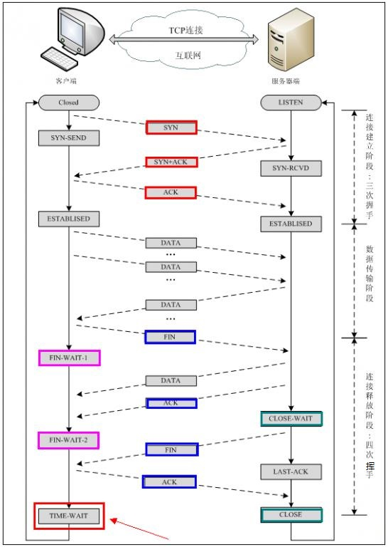

　　注：seq：“sequance” 序列号；ack："acknowledge" 确认号；SYN：“synchronize” 请求同步标志；ACK：“acknowledge” 确认标志；FIN："Finally" 结束标志。

　　使用 TCP 的协议：FTP （文件传输协议）、Telnet（远程登录协议）、SMTP（简单邮件传输协议）、POP3（和 SMTP 协议，用于接收邮件）、HTTP 协议等。

##### UDP 协议

　　UDP 用户数据报协议，是面向无连接的通讯协议，UDP 数据包括目的端口号和源端口号信息，由于通讯不需要连接，所以可以实现广播发送。

　　UDP 通讯时不需要接收方确认，属于不可靠的传输，可能会出现丢包现象，实际应用中要求程序员编码验证。

　　UDP （User Datagram Protocol）用户数据包协议，非连接的协议，传输数据之前源端和终端不建立连接，当它想传送时就简单地去抓取来自应用程序的数据，并尽可能快地把它扔到网络上。在发送端，UDP 传送数据地速度仅仅是受应用程序生成数据的速度、计算机的能力和传输带宽的限制；在接收端，UDP 把每个消息段放在队列中，应用程序每次从队列中读一个消息段。相比 TCP 就是无需建立连接，结构简单，但是无法保证正确性，容易丢包。

　　UDP 和 TCP 位于同一层，但它不管数据包的顺序、错误或重发。因此，UDP 不被应用于那些使用虚电路的面向连接的服务，UDP 主要用于那些面向查询-应答的服务，例如 NFS。相对于 FTP 或 Telent。这些服务需要交换的信息量较小。

　　每个 UDP 报文分 UDP 报头和 UDP 数据区两部分。报头由四个 16 位长（2 字节）字段组成，分别说明该报文的源端口、目的端口、报文长度以及校验值。UDP 报头由 4 个域组成，其中每个域个占用 2 个字节，具体如下：

1. 源端口号
2. 目的端口号
3. 数据报长度
4. 校验值

　　使用 UDP 协议包括：TETP（简单文件传输协议）、SNMP（简单网络管理协议）、DNS（域名解析协议）、NFS、BOOTP。

　　TCP 与 UDP 的区别：TCP 是面向连接的，可靠的字节流服务；UDP 是面向无连接的，不可靠的数据包服务。　

#### 会话层

　　会话层管理主机之间的会话进程，即负责在网络中的两节点之间建立、管理、终止进程之间的会话。建立通信链接，保持会话过程通信链接的畅通，同步两个节点之间的对话，决定通信是否被中断以及通信中断时决定从何处重新发送，即不同机器上的用户之间会话的建立及管理。会话层还利用在数据中插入校验点来实现数据的同步。

#### 表示层

　　表示层对来自应用层的数据或信息进行解释，对各种语法赋予相应的含义，并按照一定的格式传送给会话层，以保证一个主机应用层信息可以被另一个主机的应用程序理解。表示层的数据转换包括数据的加密、压缩、格式转换等。

　　其主要功能是 “ 处理用户信息的表示问题，如编码、数据格式转换和加密解密、压缩解压缩 ” 等。

#### 应用层

　　OSI 参考模型的最高层，为操作系统或网络应用程序提供访问网络服务的接口。它在其他 6 层工作的基础上，负责完成网络中应用程序与网络操作系统之间的联系，建立与结束使用者之间的联系，并完成网络用户提出的各种网络服务及应用所需的监督、管理和服务等各种协议。此外，该层还负责协调各个应用程序间的工作。

　　应用层为用户提供的服务和协议有：文件服务、目录服务、文件传输服务（FTP）、远程登录服务（Telnet）、电子邮件服务（E-mail）、打印服务、安全服务、网络管理服务、数据库服务等等。

##### DNS 协议

　　DNS 是域名系统（DomainNameSystem）的缩写，该系统用于命名组织到域层次结构中的计算机和网络服务，可以简单地理解为将 URL 转换为 IP 地址。

　　域名是由圆点分开一串单词或缩写组成地，每一个域名都对应一个唯一的 IP 地址，在 Internet 上域名与 IP 地址之间是一一对应的，DNS 就是进行域名解析的服务器。

　　DNS 命名用于 Internet 等 TCP/IP 网络中，通过用户友好的名称查找计算机和服务。

##### HTTP 协议

　　超文本传输协议（HTTP，HyperText Transfer Protocol）是互联网上应用最为广泛的一种网络协议。所有的 WWW 文件都必须遵守这个标准。

###### HTTP 协议包括的请求

1. GET：请求读取由 URL 所标志的信息。
2. POST：给服务器添加信息（如注释）。
3. PUT：在给定的 URL 下存储一个文档。
4. DELETE：删除给定的 URL 所标志的资源。

###### POST 与 GET 的区别

1. GET 是从服务器上获取数据，POST 是向服务器传输数据。
2. GET 是把参数数据队列加到提交表单的 Action 属性所指向的 URL 中，值和表单内各个字段一一对应，在 URL 中可以看到。
3. GET 传送的数据量小，不能大于 2 KB；POST 传送的数据量较大，一般被默认为不受限制。
4. 根据 HTTP 规范，GET 用于信息获取，而且应该是安全的和幂等的。

　　所谓安全的意味着该操作用于获取信息而非修改信息。换句话说，GET 请求一般不应产生副作用。就是说，它仅仅是获取资源信息，就像数据库查询一样，不会修改、增加数据，不会影响资源的状态。

　　幂等的意味着对同一 URL 的多个请求应该返回同样的结果。

##### DHCP 协议

　　DHCP 动态主机设置协议（Dynamic Host Configuration Protocol）是一个局域网的网络协议，使用 UDP 协议工作，主要有两个用途：给内部网络或网络服务供应商自动分配 IP 地址，给用户或者内部网络管理员作为对所有计算机作中央管理的手段。

#### IP 地址

　　为了实现网络中不同终端之间的通信，每个终端都必须有一个唯一的标识 -- IP 地址。

##### 端口

1. 用于区分不同的应用程序
2. 端口号的范围为 0-65535，其中 0-1023 为系统的保留端口，程序尽可能别使用这些端口。
3. IP 地址和端口号组成了 Socket，Socket 是网络运行程序间双向通信链路的终结点，是 TCP 和 UDP 的基础。
4. 常用协议使用的端口：HTTP:80，FTP:21，TELNET：23。

##### 网络地址

　　IP 地址由网络号（包括子网号）和主机号组成，网络地址的主机号为全 0，网络地址代表着整个网络。

##### 广播地址

　　广播地址通常称为直接广播地址，是为了区分受限广播地址。

　　广播地址与网络地址的主机号正好相反，广播地址中，主机号为全 1。当向某个网络的广播地址发送消息时，该网络内的所有主机都能收到该广播消息。

##### 组播地址

　　D 类地址就是组播地址。

　　A、B、C、D 类地址：

1. A 类地址以 0 开头，第一个字节作为网络号，地址范围为： 0.0.0.0 ~ 127.255.255.255；
2. B 类地址以 10 开头，前两个字节作为网络号，地址范围是：128.0.0.0 ~ 191.255.255.255；
3. C 类地址以 110 开头，前三个字节作为网络号，地址范围是：192.0.0.0 ~ 223.255.255.255；
4. D 类地址以 1110 开头，地址范围是 224.0.0.0 ~ 239.255.255.255，D 类地址作为组播地址（一对多的通信）；
5. E 类地址以 1111 开头，地址范围是 240.0.0.0 ~ 255.255.255.255，E 类地址为保留地址，供以后使用。

　　注：只有 A、B、C 有网络号和主机号之分，D 类地址和 E 类地址没有划分网络号和主机号。

##### 255.255.255.255

　　该 IP 地址指的是受限的广播地址。受限广播地址与一般广播地址（直接广播地址）的区别在于，受限广播地址只能用于本地网络，路由器不会转发以受限广播地址为目的地址的分组；一般广播地址即可在本地广播，也可跨网段广播。例如：主机 192.168.1.1/30 发送一般广播数据包后，另外一个网段 192.168.1.5/30 也能收到该数据包；若发送受限广播数据包，则不能收到。

　　注：一般的广播地址（直接广播地址）能够通过某些路由器（当然不是所有的路由器），而受限的广播地址不能通过路由器。

##### 0.0.0.0

　　常用于寻找自己的 IP 地址，例如在 RARP、BOOTP 和 DHCP 协议中，若某个未知 IP 地址的无盘机想要自己的 IP 地址，它就以 255.255.255.255 为目的地址，向本地范围（具体而言是被各个路由器屏蔽的范围内）的服务器发送 IP 请求分组。

##### 回环地址

　　127.0.0.0/8 被作为回环地址，回环地址表示本机的地址，常用于对本机的测试，用的最多的是 127.0.0.1。

##### A、B、C 类私有地址

　　私有地址（private address）也叫专用地址，它们不会在全球使用，只具有本地意义。

　　A 类私有地址：10.0.0.0/8。范围是：10.0.0.0 ~ 10.255.255.255。

　　B 类私有地址：172.16.0.0/12，范围是：172.16.0.0 ~ 172.31.255.255。

　　C 类私有地址：192.168.0.0/16，范围是：192.168.0.0 ~ 192.168.255.255。

#### 子网掩码及网络划分

　　随着互联网应用的不断扩大，原先的 IPv4 的弊端就逐渐暴露出来，即网络号占位太多，而主机号位太少，所以其能提供的主机地址也越来越稀缺，目前除了使用 NAT 在企业内部利用保留地址自行分配以外，通常都对一个高类别的 IP 地址进行再划分，以形成多个子网，提供给不同规模的用户群使用。

　　这里主要是为了在网络分段情况下有效地利用 IP 地址，通过对主机号的高位部分取作为子网号，从通常的网络位界限中扩展或压缩子网掩码，用来创建某类地址的更多子网。但创建更多的子网时，在每个子网上的可用主机地址数目会比原先减少。

##### 什么是子网掩码

　　子网掩码是标志两个 IP 地址是否同属于一个子网的，也是 32 位二进制地址，其每一个为 1 代表该位的网络位，为 0 表示主机位。它和 IP 地址一样也是使用点式十进制来表示的。如果两个 IP 地址在子网掩码的按位与的计算下所得结果相同，即表明它们共属于同一子网中。

　　在计算子网掩码时，要注意 IP 地址中的保留地址，即 “0” 地址和广播地址，它们是指主机地址或网络地址全为 “0” 或 “1” 时的 IP 地址，它们代表着本地网络地址和广播地址，一般是不能被计算在内的。

##### 子网掩码的计算

　　对于无须再划分成子网的 IP 地址来说，其子网掩码非常简单，即按照其定义即可写出：如果 B 类 IP 地址为 10.12.3.0，无需再分割子网，则该 IP 地址的子网掩码 255.255.0.0。如果它是一个 C 类地址，则其子网掩码为 255.255.255.0。其他类推。

#### 路由选择协议

　　常见的路由选择协议有：RIP 协议、OSPF 协议。

　　RIP 协议：底层是贝尔曼福特算法，它选择路由的度量标准（metric）是跳数，最大跳数是 15 跳，如果大于 15 跳，它就会丢弃数据包。

　　OSPF 协议：Open Shortest Path First，开放式最短路径优化，底层是迪杰特拉算法，是链路状态路由选择协议，它选择路由的度量标准是带宽、延迟。

#### TCP/IP 协议

　　TCP/IP 协议是 Internet 最基本的协议、Internet 国际互联网络的基础，是一个协议簇，里面包含很多协议的。之所以命名为 TCP/IP 协议，因为 TCP 、IP 协议是两个很重要的协议，就用它两命名了。它是为广域网（WANs）设计的。

　　而 TCP 负责发现传输的问题，一有问题就发出信号，要求重新传输，直到所有数据安全正确地传输到目的地。 IP 是给因特网的每一台联网设备规定一个地址。

　　UDP （User Data Protocol，用户数据报协议）是与 TCP 相对应的协议。它也是属于 TCP/IP 协议族的一种。

　　下图表明了这些协议的关系：


　　TCP/IP 协议族包括运输层、网络层、链路层。

　　IP 层接收由更底层（网络接口层，例如以太网设备驱动程序）发来的数据包，并把该数据包发送到更高层 -TCP 或 UDP 层；相反，IP 层也把从 TCP 或 UDP 层接收来的数据包传送到更底层。IP 数据包是不可靠的，因为 IP 并没有做任何事情来确认数据包是否按顺序发送的或者有没有被破坏，IP 数据包中含有发送它的主机的地址（源地址）和接收他的主机的地址（目的地址）。

　　TCP/IP 提供点对点的连接机制，将数据应该如何封装、定址、传输、路由以及在目的地如何接收，都加以标准化。它将软件通信过程抽象化为四个抽象层，采取协议堆栈的方式，分别实现出不同通信协议。协议族下的各种协议，依其功能不同，被分别归属到这四个层次结构之中，常被视为是简化的七层 OSI 模型。它们之间好比送信的线路和驿站的作用，比如要建议送信驿站，必须要了解送信的各个细节。

#### NAT 协议

　　NAT 网络地址转换（Network Address Translation）属接入广域网（WAN）技术，是一种将私有（保留）地址转化为合法 IP 地址的转换技术，它被广泛应用于各种类型 Internet 接入方式和各种类型的网络中。原因很简单，NAT 不仅完美地解决了 IP 地址不足的问题，而且还能够有效地避免来自网络外部的攻击，隐藏并保护网络内部的计算机。

#### 网络时延

　　RTT(Round-Trip Time)：往返时延，在计算机网络中它是一个重要的性能指标，它表示从发送端发送数据开始，到发送端收到来自接收端的确认（接收端收到数据后便立即发送确认），总共经历的时延。

　　通常，时延由发送时延、传播时延、排队时延、处理时延四个部分组成。

##### 发送时延

　　发送时延是节点将数据分组发送到传播媒介所需要的时间，也就是从分组的第一个比特开始发送算起，到最后一个比特发送完毕所需要的时间。显然，发送时延与网络接口 / 信道的传输速率成反比，与数据分组的长度成正比。

##### 传播时延

　　传播时延是电磁波在信道中传播一定距离所需要花费的时间，传播时延和信道的传输速率无关，而是取决于传输媒介的长度，以及某种物理形式的信号在传输媒介中的传播速度。

　　如电磁波在自由空间的传播速度是光速，即 3x105 km/s。电磁波在网络传输媒体中的传播速度比在自由空间中的传播速度要略低一些，在铜线中的传播速度约为 2.3x105 km/s，在光纤中的传播速度约为 2.0x105 km/s。

##### 排队时延

　　排队时延是分组在所经过的网络结点的缓存队列所经历的时延，排队时延的长短主要取决于网络中当时的通信量，当网络的通信流量大时，排队时间就长，极端情况下，当网络发生阻塞导致分组丢失时，该结点的排队时延视为无穷大。

　　此外，在有优先级算法的网络中，排队时延还取决于数据的优先级和结点的队列调度算法。

##### 处理时延

　　处理时延是分组在中间结点的存储转发过程中而进行的一些必要的处理所花费的时间，这些处理包括提取分部的首部，进行差错校验，为分组寻址和选路等。

　　网络端到端的时延是几种时延的总和，其计算公式是：总时延=传播时延+发送时延+排队时延+处理时延。

　　根据网络的不同情况，有时有些时延可以忽略不计，如在局域网中，传播时延很小可以忽略不计，当网络没有拥塞时，分组在各个结点的排队时延可以忽略不计。

　　往返时延（Round-Trip Time,RRT）是一个重要的性能指标，它表示从发送方发送数据开始，到发送方收到来自接收方的确认，总共经历的时延。对于负责的网络，往返时延要包括各中间结点的处理时延和转发数据时的发送时延。

#### 在浏览器输入网址后执行的全部过程

　　现在假设如果在客户端浏览器中输入 http://www.baidu.com ，而 baidu.com 为要访问的服务器，下面详细分析客户端为了访问服务器而执行的一系列关于协议的操作：

1. 客户端浏览器通过 DNS 解析到 www.baidu.com 的 IP 地址 220.181.27.48，通过这个 IP 地址找到客户端到服务器的路径。客户端浏览器发起一个 HTTP 会话到 220.161.27.48，然后通过 TCP 进行封装数据包，输入到网络层。
2. 在客户端的传输层，将 HTTP 会话请求分成报文段，添加源和目的端口，如服务器使用 80 端口监听客户端的请求，客户端由系统随机选择一个端口如 5000，与服务器进行交换，服务器把相应的请求返回给客户端的 5000 端口，然后使用 IP 层的 IP 地址查找目的端。
3. 客户端的网络层不用关心应用层或者传输层的东西，主要做的是通过查找路由表确定如何达到服务器，期间可能经过多个路由器，这些都是由路由器来完成的工作，就是通过查找路由表决定通过哪个路径达到服务器。
4. 客户端的链路层，包通过链路层发送到路由器，先在本地 ARP 缓存中查找 IP 对应的 MAC 地址 ，如果没有则通过邻居协议查找给定 IP 地址的 MAC 地址，然后发送 ARP 请求查找目的地址，如果得到回应后（会将结果缓存一份），就可以使用 ARP 的请求应答交换的 IP 数据包进行传输了，然后发送 IP 数据到到达服务器的地址。

### TCP 和 UDP

#### TCP 协议

　　TCP （Transmission Control Protocal，传输控制协议）是面向连接、可靠的、基于字节流的通信协议，数据在传输前通过三次握手建立连接，传输完成后要断开连接，由于 TCP 是面向连接的所以只能用于端到端的通讯。

　　TCP 提供的是一种可靠的数据流服务，采用 “ 带重传的肯定确认 ” 技术来实现传输的可靠性，在收发时候时，都需要与对面建立可靠的连接。TCP 还采用一种称为 “ 滑动窗口 ” 的方式进行流量控制，所谓窗口实际表示接收能力，用以限制发送方的发送速度。

　　客户端在收发数据前要使用 connect() 函数和服务器建立连接。建立连接的目的是保证 IP 地址、端口、物理链路等正确无误，为数据的传输开辟通道。

##### 三次握手

　　三次握手（Three-way Handshaking）：建立一个 TCP 连接时，需要客户端和服务端总共发送 3 个包以确认连接的建立，在 Socket 编程中，这一过程由客户端执行 connect 来发起，具体流程图如下：


1. 第一次握手：TCP 协议会组建一个数据包，并将标志位 SYN 置为 1，标识该数据包是用来建立同步连接的。同时生成一个随机数字 J，填充 “ 序号（Seq）” 字段  Seq= J，标识该数据包的序号。完成这些工作，将该数据包发送给服务器端，客户端就进入了 SYN_SEND 状态，等待 Server 确认。

2. 第二次握手：服务器收到数据包，检测到已经设置了 SYN 标志位，就知道这是客户端发来的建立连接的 “ 请求包 ”。服务器端也会组建一个数据包，并将标志位 SYN 和 ACK 置为 1，填充序号字段 Ack = J+1，随机产生一个值 Seq = K，并将数据包发送给 Client 已确认连接请求，Server 进入 SYN_RECV 状态，并为这次连接分配资源。

   SYN 标识该数据包用来建立连接，ACK 用来确认收到了刚才客户端发送的数据包。

3. 第三次握手：客户端收到数据包，检测到已经设置了 SYN 和 ACK 标志位，就知道这是服务器发来的 “ 确认包 ”。客户端会检测 “ 确认号（Ack）” 字段，看它的值是否为 J+1，如果是就说明连接建立成功，接着，客户端会继续组建数据包，并将标志位 ACK 设置为 1，表示客户端正确接收了服务器发来的 “ 确认包 ”。同时，将刚才服务器发来的数据包序号 K 加 1，用这个数字来填充 “确认号（Ack）” 字段。最后客户端将数据包发出，进入 ESTABLISED 状态，并分配资源，表示连接已经成功建立。

   服务器端收到数据包，检测到已经设置了 ACK 标志位，就知道这是客户端发来的 “ 确认包 ”。服务器会检测 “ 确认号（Ack）” 字段，看它的值是否为 K + 1，如果是就说明连接连接成功，服务器进入 ESTABLISED 状态。

　　至此，客户端和服务器都进入了 ESTABLISED 状态，完成了三次握手，连接建立成功，接下来客户端和服务器之间就可以传输数据了。

###### 为什么要三次握手

　　三次握手就是为了防止已失效的连接请求报文段突然又传送到了服务端，因而产生错误。

　　比如：client 发出的第一个连接请求报文段并没有丢失，而是在某个网络节点长时间的滞留了，以致延误到连接释放以后的某个时间才到达Server。本来这是一个早已失效的报文段，但是 server 收到此失效的连接请求报文段后，就误认为是 client 再次发出的一个新的连接请求，于是就向 client 发出确认报文段，同意建立连接。假设不采用 “ 三次握手 ”，那么只要 server 发出确认，新的连接就建立了，由于 client  并没有发出建立连接的请求，因此不理睬 server 的确认，也不会向 server 发送数据，但 server 却认为新的传输连接已经建立，并一直等待 client 发来数据。所以没有采用 “三次握手”，这种情况下 server 的很多资源就白白浪费掉了。

##### 四次挥手

　　建立连接非常重要，它是数据正确传输的前提；断开连接同样重要，它让计算机释放不再使用的资源。如果连接不能正常断开，不仅会造成数据传输错误，还会导致套接字不能关闭，持续占用资源，如果并发量高，服务器压力堪忧。

　　四次挥手：终止 TCP 连接，就是指断开一个 TCP 连接时，需要客户算和服务端总共发送 4 个包以确认连接的断开。在 Socket 编程中，这一过程由客户端或服务端任一方执行 close 来触发，具体流程图如下：


　　建立连接后，客户端和服务器都处于 ESTABLISED 状态。这时，假设客户端发起断开连接请求：

1. 第一次挥手：客户端向服务器发送 FIN 数据包，用来关闭客户端到服务器的数据发送，客户端进入 FIN_WAIT_1 状态。

   FIN 是 Finish 的缩写，表示完成任务需要断开连接。

2. 第二次挥手：服务器收到数据包后，检测到设置了 FIN 标志位，知道要断开连接，于是向客户端发送 “ 确认包 ”，确认包设置标志位 ACK 为 1，确认序号为收到序号+1（与 SYN 相同，一个 FIN 占用一个序号），服务器进入 LAST_ACK 状态。

   注意：服务器收到请求后并不是立即断开连接，而是先向客户端发送 “ 确认包 ”，告诉它知道了，需要准备一下才能断开连接。 

   这时服务器还是可以继续向客户端发送数据的。

   客户端收到 “ 确认包 ” 后进入 FIN_WAIT_2 状态，等待服务器准备完毕后发送 FIN 数据包。

3. 第三次挥手：等待片刻后，服务器准备完毕，可以断开连接，于是再主动向客户端发送 FIN 包，用于关闭服务器到客户端的数据传送，然后进入 LAST_ACK 状态。

4. 第四次挥手：客户端收到服务器的 FIN 包后，会再向服务器发送 ACK 包，确认序号为收到序号+1，告诉服务器断开连接吧，客户端然后进入 TIME_WAIT 状态。

   服务器收到客户端的 ACK 包后，就断开连接，关闭套接字，进入 CLOSED 状态，完成四次挥手。

###### 为什么要四次挥手

　　试想一下，加入现在客户端想断开跟 Server 的所有连接该怎么做？第一步，先停止向 Server 端发送数据，并等待 Server 的回复。但事情还没完，虽然 Client 不往 Server 发送数据了但是因为之前已经建立好平等的连接了，所以此时 Server 也有主动权向 Client 发送数据，故 Server 端还得终止主动向 Client 发送数据，并等待 Client 的确认。其实就是保证双方的一个合约的完整执行。

###### 为什么连接是三次握手，而关闭连接却是四次挥手

　　因为服务器在 LISTEN 状态下，收到建立连接请求的 SYN 报文后，把 ACK 和 SYN 放在一个报文里发送给客户端。而关闭连接时，当收到对方的 FIN 报文时，仅仅标识对方不再发送数据了但是还能接收数据，服务器也未必全部数据都发送给对方了，所以服务器可以立即 close，也可以发送一些数据给对方后，再发送 FIN 报文给对方来表示同意现在关闭连接，因此，服务器 ACK 和 FIN 一般都会分开发送。

###### 关于 TIME_WAIT 状态的说明

　　客户端最后一次发送 ACK 包后进入 TIME_WAIT 状态，而不是直接进入 CLOSED 状态关闭连接，这是为什么呢？

　　TCP 是面向连接的传输方式，必须保证数据能够正确到达目标机器，不能丢失或出错，而网络是不稳定的，随时可能会毁坏数据，所以机器 A 每次向机器 B 发送数据包后，都要求机器 B “ 确认 ”，回传 ACK 包，告诉机器 A 收到了，这样机器 A 才能知道数据传送成功了。如果机器 B 没有回传 ACK 包，机器 A 会重新发送，直到机器 B 回传 ACK 包。

　　客户端最后一次向服务器回传 ACK 包时，有可能会因为网络问题导致服务器收不到，服务器会再次发送 FIN 包，如果这时客户端完全关闭了连接，那么服务器无论如何也收不到 ACK 包了，所以客户端需要等待片刻、确认对方收到 ACK 包后才能进入 CLOSED 状态，TCP 连接就关闭了。那么，要等待多久呢？

　　数据包在网络中是有生存时间的，超过这个时间还未到达目标主机就会被丢弃，并通知源主机。这称为报文最大生存时间（MSL，Maximum Segment Lifetime）。TIME_WAIT 要等待 2MSL 才会进入  CLOSED 状态。ACK 包到达服务器需要 MSL 时间，服务器重传 FIN 包也需要 MSL 时间，2MSL 是数据报往返的最大时间，如果 2MSL 后还未收到服务器重传的 FIN 包，就说明服务器已经收到了 ACK 包。

#####  使用 TCP 的协议

　　使用 TCP 的协议：FTP （文件传输协议）、Telnet（远程登录协议）、SMTP（简单邮件传输协议）、POP3（和 SMTP 协议，用于接收邮件）、HTTP 协议等。

#### UDP 协议

　　UDP（User Datagram Protocol） 用户数据报协议，是面向无连接的通讯协议，传输数据之前源端和终端不建立连接，所以可以实现广播发送。当它想传送时就简单地去抓取来自应用程序的数据，并尽可能快地把它扔到网络上。

　　在发送端，UDP 传送数据地速度仅仅是受应用程序生成数据的速度、计算机的能力和传输带宽的限制，在接收端，UDP 把每个消息段放在队列中，应用程序每次从队列中读一个消息段。

　　相比 TCP，UDP 通讯时不需要接收方确认，也无需建立连接，属于不可靠的传输，结构简单，但是无法保证正确性，可能会出现丢包现象，实际应用中要求程序员编码验证。

　　UDP 和 TCP 位于同一层，但它不管数据包的顺序、错误或重发。因此，UDP 不被应用于那些使用虚电路的面向连接的服务，UDP 主要用于那些面向查询-应答的服务，例如 NFS，相对于 FTP 或 Telent，这些服务需要交换的信息量较小。

　　每个 UDP 报文分 UDP 报头和 UDP 数据区两部分。UDP 报头由 4 个域组成，其中每个域个占用 2 个字节（16 位），具体如下：

1. 源端口号
2. 目的端口号
3. 数据报长度
4. 校验值

##### 使用 UDP 的协议

　　使用 UDP 协议包括：TETP（简单文件传输协议）、SNMP（简单网络管理协议）、DNS（域名解析协议）、NFS、BOOTP。

##### TCP 与 UDP 的区别

1. TCP 是面向连接的，可靠的字节流服务；
2. UDP 是面向无连接的，不可靠的数据报服务。

### TCP 粘包

#### 长连接与短连接

长连接：Client 方与 Server 方先建立通讯连接，连接建立后不断开，然后再进行报文发送和接收。

短连接：Client 方与 Server 进行一次报文收发交易时才进行通讯连接，交易完毕后立即断开连接。此种方式常用于一点对多点通讯，比如多个 Client 连接一个 Server。

#### 什么时候需要考虑粘包问题

1. 如果利用 TCP 每次发送数据，就与对方建立连接，然后双方发送完一段数据后，就关闭连接，这样就不会出现粘包问题（因为只有一种包结构，类似于 HTTP 协议）。关闭连接主要要双方都发送 close 连接（参考 TCP 关闭连接）。

   如： A 需要发送一段字符串给 B，那么 A 与 B 建立连接，然后发送双方都默认好的协议字符如 “hello give me sth abour yourself”，然后 B 收到报文后，就将缓冲区数据接收，然后关闭连接，这样粘包问题不用考虑到，因为大家都知道是发送一段字符。

2. 如果发送数据无结构，如文件传输，这样发送方只管发送，接收方只管接收存储就 ok，也不用考虑粘包。

3. 如果双方建立连接，需要在连接后一段时间内发送不同结构数据，如连接后，有好几种结构：

   1. hello give me sth abour yourself
   2. Don't give me sth abour yourself

   那这样的话，如果发送方连续发送这两个包出去，接收方一次接收可能会是 "hello give me sth abour yourselfDon't give me sth abour yourself"，这样接收方就无法分辨了到底是要干嘛了，因为协议没有规定这样的字符串，所以要处理把它分包，怎么分也需要双方组织一个比较好的包结构，所以一般可能会在头加一个数据长度之类的包，以确保接收。

#### 粘包出现的原因

　　在流传输中出现，UDP 不会出现粘包，因为它有消息边界。

1. 发送端需要等缓冲区满才发送出去，造成粘包。
2. 接收方不及时接收缓冲区的包，造成多个包接收。

#### 解决方法

　　为了避免粘包问题，可采取以下几种措施：

1. 一是对于发送方引起的粘包现象，用户可通过编程设置来避免，TCP 提供了强制数据立即传送的操作指令 push，TCP 软件收到该操作指令后，就立即将本段数据发送出去，而不必等待发送缓冲区满；
2. 二是对于接收方引起的粘包，则可通过优化程序设计、精简接收进程工作量、提高接收进程优先级等措施，使其及时接收数据，从而尽量避免出现粘包现象；
3. 三是由接收方控制，将一包数据按结构字段，人为控制分多次接收，然后合并，通过这种手段来避免粘包。

　　以上提到的三种措施，都有不足之处：

1. 第一种编程设置方法虽然可以避免发送方引起的粘包，但它关闭了优化算法，降低了网络发送效率，影响应用程序的性能，一般不建议使用。
2. 第二种方法只能减少出现粘包的可能性，但并不能完全避免粘包，当发送频率较高时，或由于网络突发可能使某个时间段数据包到达接收方较快，接收方还是有可能来不及接收，还是导致粘包。
3. 第三种方法虽然避免了粘包，但应用程序的效率较低，对实时应用的场合不适合。

　　而对于解决粘包问题，基于 TCP 开发的通讯程序，有个很重要的问题需要解决，就是封包和拆包。

##### 为什么基于 TCP 的通讯程序需要进行封包和拆包

　　TCP 是个 “ 流 ” 协议，所谓流，就是没有界限的一串数据，是连成一片的，其间是没有分界线的。但一般通讯程序开发是需要定义一个个相互独立的数据包的，比如用于登录的数据包、用于注销的数据包。由于 TCP " 流 " 的特性以及网络状况，在进行数据传输时会出现以下几种情况。

　　假设连续调用两次 send 分别发送两端数据 data1 和 data2，在接收端有以下几种接收情况：

1. 先接收到 data1，然后接收到 data2；
2. 先接收到 data1 的部分数据，然后接收到 data1 余下的部分以及 data2 的全部；
3. 先接收到了 data1 的全部数据和 data2 的部分数据，然后接收到了 data2 的余下的数据。
4. 一次性接收到了 data1 和 data2 的全部数据。

　　对于 2、3、4 的情况就是经常说的 “ 粘包 ”，就需要把接收到的数据进行拆包，拆成一个独立的数据包。为了拆包就必须在发送端进行封包。

　　另：对于 UDP 来说就不存在拆包的问题，因为 UDP 是个 “ 数据包 ” 协议，也就是两段数据间是有界限的，在接收端要么接收不到数据要么就是接收一个完整的一段数据，不会少接收也不会多接收。

##### 为什么会出现 2、3、4 的情况

　　“ 粘包 ” 可能发生在发送端也可发生在接收端。

1. 由 Nagle 算法造成的发送端的粘包：Nagle 算法是一种改善网络传输效率的算法。简单的说，当提交一段数据给 TCP 发送时，TCP 并不立刻发送此段数据，而是等待一小段时间，看看在等待期间是否还有要发送的数据，若有则会一次把这两段数据发送出去。这是对 Nagle 算法一个简单的解释，像 3 和 4 的情况就有可能是 Nagle 算法造成的。
2. 接收端接收不及时造成的接收端粘包：TCP 会把接收到的数据存在自己的缓冲区中，然后通知应用层取数据。当应用层由于某些原因不能及时的把 TCP 的数据取出来，就会造成 TCP 缓冲区中存放了几段数据。

#### 怎样封包和拆包

　　在遇到 “ 粘包 ” 的问题时，有一个笨办法就是：通过在两次 send 之间调用 sleep 来休眠一小段时间来解决。这个解决方法的缺点是显而易见的，使传输效率大大降低，而且也并不可靠。然后通过应答得方式来解决，尽管在大多数时候是可行的，但是不能解决像 2 的那种情况，而且采用应答方式增加了通讯量，加重了网络负荷。最后就是对数据包进行封包和拆包的操作。

##### 封包

　　封包就是给一段数据加上包头，这样一来数据包就分为包头和包体两部分内容了。包头其实上是个大小固定的结构体，其中有个结构体成员变量表示包体的长度，这是个很重要的变量，其他的结构体成员可根据需要自己定义。

　　根据包头长度固定以及包头中含有包体长度的变量就能正确的拆分出一个完整的数据包。

##### 拆包

　　对于拆包目前最常用的是以下两种方式：

###### 动态缓冲区暂存方式

　　之所以说缓冲区是动态的是因为当需要缓冲的数据长度超出缓冲区的长度时会增大缓冲区长度。

　　大概过程描述如下：

1. 为每一个连接动态分配一个缓冲区，同时把此缓冲区和 SOCKET 关联，常用的是通过结构体关联。
2. 当接收到数据时首先把此段数据存放在缓存区中。
3. 判断缓冲区中的数据长度是否够一个包头的长度，如不够，则不进行拆包操作。
4. 根据包头数据解析出里面代表包体长度的变量。
5. 判断缓冲存区除包头外的数据长度是否够一个包体的长度，如不够，则不进行拆包操作。
6. 取出整个数据包。这里的 “ 取 ” 的意思是不光从缓冲区中拷贝出数据包，而且要把此数据包从缓冲区中删除掉。删除的办法就是把此包后面的数据移动到缓冲区的起始地址。

　　这个方法有两个缺点：1. 为每个连接动态分配一个缓冲区增大了内存的使用。2. 有三个地方需要拷贝数据，一个地方是把数据存放在缓冲区，一个地方是把完整的数据包从缓冲区取出来，一个地方是把数据包从缓冲区中删除。

　　对于这些缺点，可以采用环形缓冲来改进。但是这种改进方法还是不能解决第一个缺点以及第一个数据拷贝，只能解决第三个地方的数据拷贝（这个地方是拷贝数据最多的地方），第 2 种拆包方式会解决这两个问题。

　　环形缓冲实现方式是定义两个指针，分别指向有效数据的头和尾。在存放数据和删除数据时只是进行头尾指针的移动。

###### 利用底层的缓冲区来进行拆包

　　由于 TCP 也维护了一个缓冲区，所以完全可以利用 TCP 的缓冲区来缓存数据，这样一来就不需要为每一个连接分配一个缓冲区了。另一方面 recv 或者 wsarecv 都有一个参数，用来表示要接收多少长度的数据，利用这两个条件就可以对第一种方法进行优化。

　　对于阻塞 SOCKET 来说，可以利用一个循环来接收包头长度的数据，然后解析出代表包体长度的那个变量，再用一个循环来接收包体长度的数据。

　　对于非阻塞的 SOCKET，比如完成端口，可以提交接收包头长度的数据的请求，然后判断接收的数据长度是否等于包头长度，若等于，则提交接收包体长度的数据的请求，若不等于则提交接收剩余数据的请求。当接收包体时，采用类似的方法。

　　一个包没有固定长度，以太网限制在 46-1500 字节，1500 就是以太网的 MTU，超过这个量，TCP 会为 IP 数据包设置偏移量进行分片传输，现在一般可允许应用层设置 8k （NTFS 系）的缓冲区，8k 的数据由底层分片，而应用看来只是一次发送。windows 的缓冲区经验值是 4k，Socket 本身分为两种，流（TCP）和数据报（UDP）。

1. 通信长度，这个是自己决定的，没有系统强迫要发多大的包，实际应该根据需求和网络状况来决定。

   对于 TCP ，这个长度可以大点，但要知道，Socket 内部默认的收发缓冲区大小大概是 8K，可以用 SetSockOpt 来改变。

   但对于 UDP 而言，就不要太大，一般在 1024 至 10K。

   注意一点，无论发多大的包，IP 层和链路层都会把包进行分片发送，一般局域网就是 1500 左右，广域网就只有几十字节。分片后的包将经过不同的路由到达接收方，对于 UDP 而言，要是其中一个分片丢失，那么接收方的 IP 层将把这个发送包丢弃，这就形成丢包。

   显然，要是一个 UDP 发包很大，它被分片后，链路层丢失分片的几率就很大，这个 UDP 包，就很容易丢失，但是太小又影响效率。

   配置这个值，最好可以根据不同的环境来调整到最佳状态。

   send() 函数返回了实际发送的长度，在网络不断的情况下，它绝不会返回（发送失败的）错误，最多就是返回 0。

   对于 TCP 可以自己写一个循环发送。当 send 函数返回 SOCKET_ERROR 时，才标志着有错误。

   但对于 UDP ，不要写循环发送，否则将给接收带来极大的麻烦。所以 UDP 需要用 SetSockOpt 来改变 Socket 内部 Buffer 的大小，以能容纳发包。

   明确一点，TCP 作为流，发包是不会整包到达的，而是源源不断的到，那接收方就必须组包。

   而 UDP 作为消息或数据报，它一定是整包到达接收方。

2. 关于接收，一般的发包都有包边界，首要的就是这个包的长度要让接收方知道，于是就有个包头信息。

   对于 TCP，接收方先收这个包头信息，然后再收包数据。一次收齐整个包也可以，可要对结果是否收齐进行验证。这也就完成了组包过程。UDP 只能整包接收。

   要是提供的接收 Buffer 过小，TCP 将返回实际接收的长度，余下的还可以收，而 UDP 不同的是，余下的数据被丢弃并返回 WSAEMSGSIZE 错误。

   注意 TCP，要是提供的 Buffer 很大，那么可能收到的就是多个发包，必须分离它们，还有就是当 Buffer 太小，而一次收不完 Socket 内部的数据，那么 Socket 接收事件（OnReceive），可能不会再触发。使用事件方式进行接收时，密切注意这点。这些特性就是体现了流和数据报的区别。

### TCP 的可靠传输机制

　　TCP 的报文是交给 IP 层传送的，但是 IP 层只能提供尽最大努力交付的服务，也就是说，TCP 下面的网络所提供的是不可靠传输，其实就是传输信道是不可靠的（所谓的信道，就是指连接信号发送方和接收方的传输线路，包括双绞铜线、同轴电缆、光纤、陆地无线电或者卫星无线电等物理媒体）这时，传输层的可靠传输机制就显得特别重要。

#### 可靠传输的要求

　　所谓的可靠，就是能保证数据的正确性，无差错、不丢失、不重复、并且按序达到。

#### TCP 可靠传输的机制原理

　　TCP 首先采用三次握手来建立连接、四次挥手来释放连接。其次 TCP 采用了连续 ARQ 协议，即自动重传请求（Automatic Repeat-reQuest）来保证数据传输的正确性，使用滑动窗口协议来保证接收方能够及时处理接收到的数据，进行流量控制。最后 TCP 使用慢开始、拥塞避免、快重传、快恢复来进行拥塞控制，避免网络拥堵。下面我们将分别介绍三次握手、四次挥手、连续ARQ、拥塞控制。

##### 三次握手的重要性

假如只进行一次握手，客户端发送连接请求后，没有收到服务端的应答，是没法判断连接是否成功的。

假如只进行两次握手，客户端发送连接请求后，会等待服务器端的应答。但是会出现的问题是，假如客户端的SYN迟迟没有到达服务器端，此时客户端超时后，会重新发送一次连接，假如重发的这次服务器端收到了，且应答客户端了，连接建立了。但是建立后，第一个 SYN 也到达服务端了，这时服务端会认为这是一个新连接，会再给客户端发送一个 ACK，这个 ACK 当然会被客户端丢弃。但是此时服务器端已经为这个连接分配资源了，而且服务器端会一直维持着这个资源，会造成浪费。

三次握手，两次握手的问题在于服务器端不知道 SYN 的有效性，所以如果是三次握手，服务器端会等待客户端的第三次握手，如果第三次握手迟迟不来，服务器端就会释放相关资源。但是有人会问，假如第三次握手没有到达服务器端呢？但是这时客户端认为连接已经建立了。但是其实这种情况下，只要客户端向服务器端写数据，就会收到服务器端的 RST 应答，这时客户端就能知道出现问题了。

RST：在 TCP 协议中，rst 段标识复位，用来异常的关闭连接。在 TCP 的设计中它是不可或缺的，发送 rst 段关闭连接时，不必等缓冲区的数据都发送出去，直接丢弃缓冲区中的数据。而接收端收到 rst 段后，也不必发送 ack 来确认。

##### 四次挥手的原因

其实是客户端和服务端的两次挥手，也就是客户端和服务端分别释放连接的过程。可以看到，客户端在发送完最后一次确认之后，还要等待2MSL的时间。主要有两个原因，一个是为了**让B能够按照正常步骤进入CLOSED状态**，二是**为了防止已经失效的请求连接报文出现在下次连接中**。

解释：

1）、由于客户端最后一个 ACK 可能会丢失，这样 B 就无法正常进入 CLOSED 状态。于是 B 会重传请求释放的报文，而此时 A 如果已经关闭了，那就收不到 B 的重传请求，就会导致 B 不能正常释放。而如果 A 还在等待时间内，就会收到 B 的重传，然后进行应答，这样 B 就可以进入 CLOSED 状态了。

2）、在这 2MSL 等待时间里面，本次连接的所有的报文都已经从网络中消失，从而不会出现在下次连接中。

#### 连接 ARQ 协议

在介绍连续ARQ协议之前，我们要先说一下停止等待协议。停止等待协议的优点就是比较简单，好实现。基本原理是A发送一个分组，发送完就暂停发送，然后一直等待接收方B的应答。A在收到B的应答之后，再发送下一个分组。如果中途B发现包有错或者就没有收到包，那么也就不会向A发送应答包。此时A规定时间内要是没有等到应答包，就会重新传送刚才的分组，也就是所谓的**超时重传。**从这个过程也可以看出，假如A发送分组的时间为Ta，B发送确认的时间为Tb，往返时间为Tr，那么完整发送一个分组的时间为Ta+Tb+Tr。过了这个时间后，第二个分组才开始发送。这样子的信道利用率和传输效率就比较低了。这时就引入**连续ARQ**了。


从上面的图来看，图（a）是发送方维持的发送窗口，它的意义是：位于发送窗口内的5个分组都可以连续发送出去，而不需要等待对方的确认，这样就提高了信道利用率。

​    连续ARQ协议规定，发送方没法送一个确认，就把发送窗口向前滑动一个分组的位置。例如上面的图（b），当发送方收到第一个分组的确认，就把发送窗口向前移动一个分组的位置。如果已经发送了前5个分组，则现在可以发送窗口内的第6个分组。

​    接收方一般都是采用**累积确认**的方式。也就是说接收方不必对收到的分组逐个发送确认。而是在收到几个分组后，对按序到达的最后一个分组发送确认。如果收到了这个分组确认信息，则表示到这个分组为止的所有分组都已经正确接收到了。

​    累积确认的优点就不用多说了，缺点是，不能正确的反映收到的分组，比如发送方发送了前5个分组，而中间的第3个分组丢失了，这时候接收方只能对前2个发出确认。而不知道后面3个分组的下落，因此只能把后面的3个分组都重传一次，这种机制叫**Go-back-N(回退N)**，表示需要再退回来重传已发送过的N个分组。

#### 拥塞控制

1）TCP流量控制

拥塞控制就是防止过多的数据注入到网络中，这样可以使网路中的路由器或链路不致于过载。而流量控制往往是指点对点通信量的控制，是个端到端的问题。流量控制所要做的就是控制发送端发送速率，以便使接收端来得及接受。利用滑动窗口机制就可以实现流量的控制。原理就是运用TCP报文中的窗口大小字段来控制，发送的发送窗口不可以大于接收方的接收窗口大小。如果接收方没有足够的缓存来接收数据，发送方就会收到一个零窗口的通知。此时发送方停止发送。并且定时发送一个窗口探测报文来探测接收方的接收能力。

2）TCP拥塞控制

在某段时间内，若对网络中的某一资源的需求超过了该资源所能提供的可用部分，网络的性能就要变差，这种叫做拥塞。

拥塞控制就是防止过多的数据注入到网络中，这样可以使网路中的路由器或链路不致于过载。RFC2581定义了四种拥塞控制算法，即**慢开始，拥塞避免、快重传、快恢复**。

下图是慢启动和拥塞避免的一个可视化描述。我们以段为单位来显示cwnd和ssthresh，但它们实际上都是以字节为单位进行维护的。


**拥塞窗口的概念：**

发送报文段速率的确定，纪要根据接收端的能力，又要从全局考虑不要使网路发生拥塞，这由接收窗口和拥塞窗口两个状态量来决定。**接收窗口**又称通知窗口，是**接收端**根据目前接收缓存大小所许诺的最新窗口值，是来自接收端的流量控制。**拥塞窗口cwnd**是发送端根据自己估计的网络拥塞程度而设置的窗口值，是来自**发送端**的流量控制。

**慢启动原理：**

当主机开始发送数据时，如果立即将较大的发送窗口的全部数据注入网路中，那么由于不清楚网络的情况，有可能引起拥塞。比较好的方式是试探一下，即从小到大逐渐增大发送端的拥塞控制窗口数值。当窗口值逐渐增大时，为了防止cwind的增长导致网络拥塞，还需要一个变量--慢开始门限ssthresh

**拥塞控制**

具体过程为：

TCP连接初始化，将拥塞窗口设置为1。接下来执行**慢开始算法，**当cwind==ssthresh时，开始执行**拥塞避免算法**：cwnd按照现行规律增长。当网络发生拥塞时，吧ssthresh值更新为拥塞前ssthresh的一半，cwnd重新设置为1。重复执行上个步骤。

**快重传和快恢复**

一条TCP连接有时会因等待重传计时器的超时而空闲较长的时间，慢开始和拥塞避免无法很好的解决这类问题，因此提出了快重传和快恢复的拥塞控制方法。

   **快重传算法**并非取消了**重传机制**，只是在某些情况下更早的重传丢失的报文段（如果当发送端接收到三个重复的确认ACK时，则断定分组丢失，立即重传丢失的报文段，而不必等待重传计时器超时）。

  例如：M1，M2，M3 -----> M1,M3,缺失M2，则接收方向发送方持续发送M2重复确认，当发送方收到M2的三次重复确认，则认为M2报文丢失，启动快重传机制，重传数据，其他数据发送数据放入队列，待快重传结束后再正常传输。

   **快恢复算法**有以下两个要点：

   1）当发送方连续收到接收方发来的三个重复确认时，就执行“乘法减小”算法，把慢开始门限减半，这是为了预防网络发生拥塞。

   2）由于发送方现在认为网络很可能没有发生拥塞，因此现在不执行慢开始算法，而是把**cwnd(拥塞窗口)**值设置为慢开始门限减半后的值，然后开始执行拥塞避免算法**，使拥塞窗口的线性增大**。

# 

### * Socket 知识

　　Socket 是应用层与 TCP/IP 协议族通信的中间软件抽象层，它是一组接口。在设计模式中，Socket 其实就一个门面模式，它把复杂的 TCP/IP 协议族隐藏在 Socket 接口后面，对用户来说，一组简单的接口就是全部，让 Socket 去组织数据，以符合指定的协议。

### * Socket 常用函数接口详解


### HTTP

　　HTTP 协议是 Hyper Text Transfer Protocol ( 超文本传输协议 ) 的缩写。基于 TCP/IP 通信协议来传输数据（HTML 文件，图片文件，查询结果等）。HTTP 不仅能传送文本跳转所必须的信息，而且也能传输任何能在互联网上得到的信息。

　　HTTP 是面向事务的应用层协议。所谓面向事务就是指一系列的信息交换，这些交换的信息是一个整体，要么这些信息全部交换，要么就不交换。

　　HTTP 协议主要就是用来进行客户端和服务器端之间进行通信的标准协议。HTTP 主要规定了客户端如何与服务器端建立链接，客户端如何从服务器请求数据，服务器如何响应请求，以及最后连接如何关闭。

　　HTTP 协议用于从万维网（WWW:World Wide Web）服务器传输超文本到本地浏览器的传送协议。每个万维网网点都有一个服务器进程，用来监视 TCP 的端口 80，以便发现是否有浏览器向它发出建立连接请求，一旦监听到需要建立 TCP 连接，浏览器就会向万维网发出浏览某个页面的请求，而万维网对这个请求的页面做出响应，最后，TCP 连接释放。在浏览器和服务器之间的请求与响应的交互，必须按照一定的格式和规则，这些格式和规则就是超文本传输协议 HTTP。

#### HTTP 工作原理

　　HTTP 协议工作于客户端 - 服务端架构上。浏览器作为 HTTP 客户端通过 URL 向 HTTP 服务端发送所有请求。

　　Web 服务器有：Apache 服务器，IIS 服务器（Internet Information Service）等。

　　Web 服务器根据接收到的请求后，向客户端发送响应信息。

　　HTTP 默认端口号为 80，也可以改为 8080 或者其他端口。

#### 一次网络请求的过程

1. 浏览器向 DNS 服务器请求解析该 URL 中的域名所对应的 IP 地址。
2. 解析出 IP 地址后，根据该 IP 地址和默认端口 80，和服务器建立 TCP 连接。
3. 浏览器发出读取文件（URL 中域名后面部分对应的文件）的 HTTP 请求，该请求报文作为 TCP 三次握手的第三个报文的数据发送给服务器。
4. 服务器对浏览器请求作出响应，并把对应的 html 文本发送给浏览器。
5. 释放 TCP 连接。
6. 浏览器将该 html 文本显示内容。

#### HTTP 三点注意事项

1. **HTTP 是无连接**：无连接的含义是限制每次连接只处理一个请求。服务端处理完客户的请求，并收到客户的应答后，即断开连接。采用这种方式可以节省传输时间。虽然 HTTP 需要用到 TCP 作为传输层协议，但是在通信双方交换 HTTP 报文之前不需要建立 HTTP 连接。
2. **HTTP 是媒体独立的**：这意味着，只要客户端和服务端知道如何处理的数据内容，任何类型的数据都可以通过 HTTP 发送。客户端以及服务端指定使用合适的 MIME-type 内容类型。
3. **HTTP 是无状态**：HTTP 协议是无状态协议。无状态是指协议对于事务处理没有记忆能力。缺少状态意味着如果后续处理需要前面的信息，则它必须重传，这样可能导致每次连接传送的数据量增大。另一方面，在服务器不需要先前信息时它的应答就较快。

　　浏览器显示的内容都有 HTML、XML、GIF、FLASH 等，浏览器是通过 MIME Type 区分它们，决定用什么内容什么形式来显示。

　　MIME Type 是该资源的媒体类型，MIME Type 不是个人指定的，是通过互联网（ IETF ）组织协商，以 RFC（ 是一系列以编号排定的文件，几乎所有的互联网标准都有收录在其中 ） 的形式作为建议的标准发布在网上的，大多数的 Web 服务器和用户代理都会支持这一规范（ 顺便说一句，Email 附件的类型也是通过 MIME Type 指定的 ）。

　　媒体类型通常通过 HTTP 协议，由 Web 服务器告知浏览器的，更准确的说，是通过 Content-Type 来表示的。

　　如果是某个客户端自己定义的格式，MIME Type 一点只能以 application/x- 开头。

#### HTTP 的版本

　　HTTP/1.0 的主要缺点：每当请求一个文档，就需要两倍的 RTT （ Round-Trip Time，往返时延，是指数据从网络一端传到另一端所需的时间) 的开销（一个 RTT 时用来 TCP 的连接，另一个 RTT 用来请求和接收万维网文档），如果有很多个对象需要建立连接，那么每一次连接都需要 2* RTT 的时间开销。另一方面，每一次请求都需要建立 TCP 连接，并且万维网通常都服务于大量的请求，所以这种非持续性的连接会导致万维网的负荷过大。HTTP/1.0 中浏览器与服务器只保持短暂的连接，连接无法复用。也就说每个 TCP 连接只能发送一个请求。发送数据完毕，连接就关闭，如果还要请求其他资源，就必须再新建一个连接。

　　HTTP/1.1 采用的是持续连接，就是在建立连接后的一段时间内仍然保持连接，使用同一个客户和服务器传送后续的请求和响应。客户端和服务器发现对方一段时间没有活动，就可以主动关闭连接。或者客户端在最后一个请求时，主动告诉服务端要关闭连接。HTTP/1.1 版还引入了管道机制（pipelining） ，即在同一个 TCP 连接里面，客户端可以同时发送多个请求。但是对于执行者来说，还是需要按照顺序，先执行完一件事以后再执行另外一件事。

　　HTTP/2 采用了多路复用，即在一个连接里，客户端和浏览器都可以同时发送多个请求或回应，而且不用按照顺序一一对应。能这样做有一个前提，就是 HTTP/2 进行了二进制分帧，即 HTTP/2 会将所有传输的信息分割为更小的消息和帧（frame），并对它们采用二进制格式的编码。除此之外，还有一些其他的优化，比如做 Header 压缩、服务端推送等。

　　持续连接有两种工作方式，非流水线和流水线。

　　非流水线：客户在收到上一个响应才能发出下一个请求。缺点：服务器在发送了一个对象后，TCP 处于空闲状态，浪费资源。

　　流水线：客户在收到 HTTP 的响应报文之前，就能够接着发送新的请求。

#### HTTP 消息结构

　　HTTP 是基于客户端/服务端（C/S）的架构模型，通过一个可靠的链接来交换信息，是一个无状态的请求 / 响应协议。

　　一个 HTTP " 客户端 "是一个应用程序（ Web 浏览器或其他任何客户端 ），通过连接服务器达到发送一个或多个 HTTP 的请求的目的。

　　一个 HTTP “ 服务器 ” 同样也是一个应用程序（通常是一个 Web 服务，如 Apache Web 服务器或 IIS 服务器等），通过接收客户端的请求并向客户端发送 HTTP 响应数据。

　　HTTP 使用统一资源标识符（Uniform Resource Identifiers,URL） 来传输数据和建立连接。

　　一旦建立连接后，数据消息就通过类似 Internet 邮件所适用的格式和多用途 Internet 邮件扩展（MIME）来传送。

##### 客户端请求消息

　　客户端发送一个 HTTP 请求到服务器的请求消息包括以下格式：**请求行**（request line）（ 方法 + URL + 版本 ）、**请求头部**（ header ）、**空行**和**请求数据**四个部分组成，下图给出了请求报文的一般格式：


　　**请求行**：用来说明请求类型，要访问的资源以及所使用的 HTTP 版本。

　　**请求头部**：紧接着请求行之后的部分，用来说明服务器要使用的附加信息。

　　**空行**：请求头部后面的空行是必须的。

　　**请求数据**：也称为请求主体，可以添加任意的其他数据。

##### 请求头部的首部字段名和含义

| 字段名                          | 含义                                                         |
| ------------------------------- | ------------------------------------------------------------ |
| **Accept**                      | 浏览器可接受的 MIME 类型。                                   |
| Accept-Charset                  | 浏览器可接受的字符集。                                       |
| Accept-Encoding                 | 浏览器能够进行解码的数据编码方式，比如 gzip。Servlet 能够向支持 gzip 的浏览器返回经 gzip 编码的 HTML 页面。许多情形下这可以减少 5 到 10 倍的下载时间。 |
| Accept-Language                 | 浏览器所希望的语言种类，当服务器能够提供一种以上的语言版本时要用到。 |
| Authorization                   | 授权信息，通常出现在对服务器发送的 WWW-Authorizate 头的应答中。 |
| Content-Length                  | 表示请求消息正文的长度。                                     |
| Host                            | 客户机通过这个头告诉服务器，要访问的主机名。Host 头域指定请求资源的 Intenet 主机和端口号，必须表示请求 url 的原始服务器或网管的位置。HTTP/1.1 请求必须包含主机头域，否则系统会以 400 状态码返回。 |
| If-Modified-Since               | 客户机通过这个头告诉服务器，资源的缓存时间。只有当所请求的内容在指定的时间后又经过修改才返回它，否则返回 304 “Not Modified” 应答。 |
| Referer                         | 客户机通过这个头告诉服务器，它是从哪个资源来访问服务器的（防盗链）。包含一个 URL，用户从该 URL 代表的页面出发访问当前请求的页面。 |
| User-Agent                      | User-Agent 头域的内容包含发出请求的用户信息。浏览器类型，如果 Servlet 返回的内容与浏览器类型有关则该值非常有用。 |
| **Cookie**                      | 客户机通过这个头可以向服务器带数据，这是最重要的请求头信息之一。 |
| Pragma                          | 指定 “ no-cache ” 值表示服务器必须返回一个刷新后的文档，即使它是代理服务器而且已经有了页面的本地拷贝。 |
| From                            | 请求发送者的 email 地址，由一些特殊的 Web 客户程序使用，浏览器不会用到它。 |
| **Connection**                  | 处理完这次请求后是否断开连接还是继续保持连接。如果 Servlet 看到这里的值为 “Keep-Alive” ，或者看到请求使用的是 HTTP 1.1(HTTP 1.1 默认进行持久连接)，它就可以利用持久连接的优点，当页面包含多个元素时（例如 Applet、图片），显著地减少下载所需要的时间。要实现这一点，Servlet 需要在应答中发送一个 Content-Length 头，最简单的实现方法是：先把内容写入 ByteArrayOutputStream，然后在正式写出内容之前计算它的大小。 |
| Range                           | Range 头域可以请求实体的一个或者多个子范围，例如，表示头 500 个字节：bytes=0-499,表示第二个 500 字节：bytes=500-999,表示最后 500 个字节：bytes=-500，表示 500 字节以后的范围：bytes=500-，第一个和最后一个字节：bytes=0-0,-1，同时指定几个范围：bytes=500-600,601-999，但是服务器可以忽略此请求头，如果无条件 GET 包含 Range 请求头，响应会以状态码 206（PartialContent）返回而不是以 200（OK）。 |
| UA-Pixels,UA-Color,UA-OS,UA-CPU | 由某些版本的 IE 浏览器所发送的非标准的请求头，表示屏幕大小、屏幕深度、操作系统和 CPU 类型。 |

#### 服务器响应消息

　　HTTP 响应也由四个部分组成，分别是：**状态行**（版本+状态+短语）、**消息报头**、**空行**和**响应正文**。


　　**状态行**：由 HTTP 协议版本号、状态码、状态消息三部分组成。

　　**消息报头**：用来说明客户端要使用的一些附加信息。

　　**空行**：消息报头后面的空行是必须的。

　　**响应正文**：服务器返回给客户端的文本信息。

　　下面实例是一些典型的使用 GET 来传递数据的实例：

　　客户端请求：

```http
GET /hello.txt HTTP/1.1
User-Agent: curl/7.16.3 libcurl/7.16.3 OpenSSL/0.9.7l zlib/1.2.3
Host: www.example.com
Accept-Language: en, mi
```

　　服务端响应：

```http
HTTP/1.1 200 OK
Date: Mon, 27 Jul 2009 12:28:53 GMT
Server: Apache
Last-Modified: Wed, 22 Jul 2009 19:15:56 GMT
ETag: "34aa387-d-1568eb00"
Accept-Ranges: bytes
Content-Length: 51
Vary: Accept-Encoding
Content-Type: text/plain
```

　　输出结果：

```
Hello World! My payload includes a trailing CRLF.
```

#### HTTP 请求方法

　　根据 HTTP 标准，HTTP 请求可以使用多种请求方法。

　　HTTP 1.0 定义了三种请求方法：**GET**、**POST** 和 **HEAD** 方法。

　　HTTP 1.1 新增了六种请求方法：**OPTIONS**、**PUT**、**PATCH**、**DELETE**、**TRACE** 和 **CONNECT** 方法。

| 方法                                    | 描述                                                         |
| --------------------------------------- | ------------------------------------------------------------ |
| GET<br />（获取资源）                   | 请求指定的页面信息，并返回实体主体。                         |
| HEAD<br />（获取报文首部）              | 类似于 GET 请求，只不过返回的响应中没有具体的内容，用于获取报头。 |
| POST<br />（传输实体文本）              | 向指定资源提交数据进行处理请求（例如提交表单或者上传文件）。数据被包含在请求体中。POST 请求可能会导致新的资源的建立或已有资源的修改。 |
| PUT<br />（传输文件）                   | 从客户端向服务器传送的数据取代指定的文档的内容。             |
| DELETE<br />（删除文件）                | 请求服务器删除指定的页面。                                   |
| CONNECT<br />（要求用隧道协议连接代理） | HTTP/1.1 协议中预留给能够将连接改为管道方式的代理服务器。要求在与代理服务器通信时建立隧道，实现用隧道协议进行 TCP 通信。主要使用 SSL ( 安全套接层 ) 和 TSL（ 传输层安全 ）协议把通信内容加密后经网络隧道传输。 |
| OPTIONS<br />（询问支持的方法）         | 允许客户端查看服务器的性能。用于查询针对请求 URL 指定资源支持的方法（客户端询问服务器可以提交哪些请求方法）。 |
| TRACE<br />（追踪路径）                 | 回显服务器收到的请求，主要用于测试或诊断。                   |
| PATCH<br />（补充）                     | 是对 PUT 方法的补充，用来对已知资源进行局部更新。            |

　　GET 方法用来请求已被 URL 识别的资源。指定的资源经服务器端解析后返回响应内容（也就是说，如果请求的资源是文本，那就保持原样返回；如果是 CGI [ 通用网关接口 ] 那样的程序，则返回经过执行后的输出结果）。

　　POST 方法用来传输实体的主体。虽然用 GET 方法也可以传输实体的主体，但一般不用 GET 方法进行传输，而是用 POST 方法；虽然 GET 方法和 POST 方法很相似，但是 POST 的主要目的并不是获取相应的主体内容。

##### GET 方法和 POST 方法的区别

1. GET 方法用于信息获取，它是安全的（安全：指非修改信息，如数据库方面的信息），而 POST 方法是用于修改服务器上资源的请求；
2. GET 请求的数据会附在 URL 之后，而 POST 方法提交的数据则放置在 HTTP 报文实体的主体里，所以 POST 方法的安全性比 GET 方法要高；
3. GET 方法传输的数据量一般限制在 2 KB，其原因在于：GET 是通过 URL 提交数据，而 URL 本身对于数据没有限制，但是不同的浏览器对于 URL 是有限制的，比如 IE 浏览器对于 URL 的限制为 2 KB，而 chrome 、 FireFox 浏览器理论上对于 URL 是没有限制的，它真正的限制取决于操作系统本身；POST 方法对于数据大小是无限制的，真正影响到数据大小的是服务器处理程序的能力。

　　HEAD 方法与 GET 方法的区别：GET 方法有实体，HEAD 方法无实体。

　　HEAD 方法的主要用途：

1. 判断类型；
2. 查看响应中的状态码，看对象是否存在（响应：请求执行成功了，但是无数据返回）；
3. 测试资源是否被修改过。

#### HTTP 响应头信息

　　HTTP 响应头提供了关于请求、响应或者其他的发送实体的信息。

| 应答头           | 说明                                                         |
| ---------------- | ------------------------------------------------------------ |
| Allow            | 服务器支持哪些请求方法（如 GET、POST 等）                    |
| Content-Encoding | 文档的编码（Encode）方法。只有在解码之后才可以得到 Content-Type 头指定的内容类型。利用 gzip 压缩文档能够显著地减少 HTML 文档的下载时间。Java 的 GZIPOutputStream 可以很方便地进行 gzip 压缩，但只有 Unix 上的 Netscape 和 Windows 上的 IE 4、IE 5 才支持它。因此，Servlet 应该通过查看 Accept-Encoding 头（即 request.getHeader("Accept-Encoding")）检查浏览器是否支持 gzip，为支持 gzip 的浏览器返回经 gzip 压缩的 HTML 页面，为其他浏览器返回普通页面。 |
| Content-Length   | 表示内容长度。只有当浏览器使用持久 HTTP 连接时才需要这个数据。 如果你想要利用持久连接的优势，可以把输出文档写入 ByteArrayOutputStream，完成后查看其大小，然后把该值放入 Content-Length 头，最后通过 byteArrayStream.write(response.getOutputStream))发送内容。 |
| **Content-Type** | 表示后面的文档属于什么 MIME 类型。Servlet 默认为 text/plain，但通常需要显式地指定为 text/html。由于经常要设置 Content-Type，因此 HttpServletResponse 提供了一个专用的方法 setContentType。 |
| Date             | 当前的 GMT 时间。你可以用 setDateHeader 来设置这个头以避免转换时间格式的麻烦。 |
| Expires          | 应该在什么时候认为文档已经过期，从而不再缓存它。             |
| Last-Modified    | 文档的最后改动时间。客户可以通过 If - Modified - Since 请求头提供一个日期，该请求将被视为一个条件 GET，只有改动时间迟于指定时间的文档才会返回，否则返回一个 304（Not Modified）状态。Last - Modified 也可用 setDateHeader 方法来设置。 |
| Location         | 表示客户应当到哪里去提取文档。Location 通常不是直接设置的，而是通过 HttpServletResponse 的 sendRedirect 方法，该方法同时设置状态代码为 302。 |
| Refresh          | 表示浏览器应该在多少时间之后刷新文档，以秒计。除了刷新当前文档之外，你还可以通过 setHeader("Refresh","5;URL = http://host/path") 让浏览器读取指定的页面。注意这种功能通常是通过设置 HTML 页面 HEAD 区的 < META HTTP-EQUIV="Refresh" CONTENT="5;URL = http://host/path">  实现，这是因为，自动刷新或重定向对于那些不能使用 CGI 或 Servlet 的 HTML 编写者十分重要。但是，对于 Servlet 来说，直接设置 Refresh 头更加方便。注意 Refresh 的意义是 “N 秒之后刷新本页面或访问指定页面”，而不是“每隔 N 秒刷新本页面或访问指定页面”。因此，连续刷新要求每次都发送一个 Refresh 头，而发送 204 状态代码则可以阻止浏览器继续刷新，不管是使用 Refresh 头还是 < META HTTP-EQUIV="Refrsh"... > 。注意 Refrsh 头不属于 HTTP 1.1 正式规范的一部分，而是一个扩展，但 Netscape 和 IE 都支持它。 |
| Server           | 服务器名字。Servlet 一般不设置这个值，而是由 Web 服务器自己设置。 |
| **Set-Cookie**   | 设置和页面关联的 Cookie。Servlet 不应使用 response.setHeader("Set-Cookie",...)，而是应使用 HttpServletResponse 提供的专用方法 addCookie。 |
| WWW-Authenticate | 客户应该在 Authorization 头中提供什么类型的授权信息？在包含 401 （Unauthorized） 状态行的应答中这个头是必须的。例如，response.setHeader("WWW-Authenticate","BASIC realm="executives")。注意 Servlet 一般不进行这方面的处理，而是让 Web 服务器的专门机制来控制受密码保护页面的访问（例如 htaccess）。 |

#### HTTP 状态码

　　当浏览器访问一个网页时，浏览者的浏览器会向网页所在服务器发出请求。当浏览器接收并显示网页前，此网页所在的服务器会返回一个包含 HTTP 状态码的信息头（server header）用以响应浏览器的请求。

　　下面是常见的 HTTP 状态码：

* 200 - 请求成功
* 301 - 资源（网页等）被永久转义到其他 URL
* 404 - 请求的资源（网页等）不存在
* 500 - 内部服务器错误

##### HTTP 状态码分类

　　HTTP 状态码由三个十进制数字组成，第一个十进制数字定义了状态码的类型，后两个数字没有分类的作用。HTTP 状态码共分为 5 种类型：

　　HTTP 状态码分类：

| 分类 | 分类描述                                       |
| ---- | ---------------------------------------------- |
| 1xx  | 信息，服务器收到请求，需要请求者继续执行操作   |
| 2xx  | 成功，操作被成功接收并处理                     |
| 3xx  | 重定向，需要进一步的操作以完成请求             |
| 4xx  | 客户端错误，请求包含语法错误或无法完成请求     |
| 5xx  | 服务器错误，服务器在处理请求的过程中发生了错误 |

##### HTTP content-type

　　Content-Type (内容类型)，一般是指网页中存在的 Content-Type，用来定义网络文件的类型和网页的编码，决定浏览器将以什么形式、什么编码读取这个文件，这就是经常看到一些 PHP 网页点击的结果却是下载一个文件或一张图片的原因。

　　Content-Type 标头告诉客户端实际返回的内容的内容类型。

　　语法格式：

```
Content-Type: text/html; charset=utf-8
Content-Type: multipart/form-data; boundary=something
```

#### Session 与 Cookie

##### cookie 是什么

　　在网站中，http 请求是无状态的。也就是说即使第一次和服务器连接后并且登陆成功后，第二次请求服务器依然不能知道当前请求是哪个用户。cookie 的出现就是为了解决这个问题，第一次登陆后服务器返回一个数据（cookie）给浏览器，然后浏览器保存在本地，当该用户发送第二次请求的时候，就会自动的把上次请求存储的 cookie 数据自动的携带给服务器，服务器通过浏览器携带的数据就能判断当前用户是哪个了。cookie 存储的数据量有限，不同的浏览器有不同的存储大小，但一般不超过 4KB。因此使用 cookie 只能存储一些小量的数据。

##### session 是什么

　　session 和 cookie 的作用有点类似，都是为了存储用户相关的信息。不同的是，cookie 是存储在本地浏览器，而 session 存储在服务器。存储在服务器的数据会更加的安全，不容易被窃取。但存储在服务器也有一定的弊端，就是会占用服务器的资源。

　　**session 的目的**：弥补 HTTP 无状态特性，服务器可以利用 session 存储客户端在同一个会话期间的一些操作记录。

##### cookie 和 session 结合使用

　　在如今的市场或者企业里，一般有两种存储方式：

1. 存储在服务端：通过 cookie 存储一个 session_id，然后具体的数据则是保存在 session 中。如果用户已经登陆，则服务器会在 cookie 中保存一个 session_id，下次再次请求的时候，会把该 session_id 携带上来，服务器根据 session_id 在 session 库中获取用户的 session 数据，就能知道该用户到底是谁，以及之前保存的一些状态信息。这种专业术语叫做 server side session。
2. 将 session 数据加密，然后存储在 cookie 中。这种专业术语叫做 client side session。

##### session 的实现机制

1. 服务器如何判断客户端发送过来的请求术语同一个会话？

　　用 session id 区分；session id 相同即认为是同一个会话。

　　在 tomcat 中 session id 中用 JSESSIONID 来表示。

2. 服务器、客户端如何获取 sessionID ? SessionID 在期间是如何传输的？

　　服务器第一次接收到请求时，开辟了一块 Session 空间（创建了 Session 对象），同时生成一个 Session id，并通过响应头的 Set-Cookie：“JSESSIONID=XXXXXXX” 命令，向客户端发送要求设置 cookie 的响应；客户端收到响应后，在本机客户端设置了一个 JSESSIONID=XXXXXXX 的 cookie 信息，该 cookie 的过期时间为浏览器会话结束。

　　接下来客户端每次向同一个网站发送请求时，请求头都会带上该 cookie 信息（包含 Session id）；然后，服务器通过读取请求头中的 Cookie 信息，获取名称为 JSESSIONID 的值，得到此次请求的 Session id。

　　注意：服务器只会在客户端第一次请求响应的时候，在响应头上添加 Set-Cookie : " JSESSIONID=XXXXXXX " 信息，接下来在同一个会话的第二第三次响应头里，是不会添加 Set-Cookie : " JSESSIONID=XXXXXXX " 信息的；而客户端是会在每次请求头的 cookie 中带上 JSESSION 信息。

##### cookie 与 session 的区别

1. cookie 以文本文件格式存储在浏览器中，而 session 存储在服务端。
2. cookie 的存储限制了数据量，只允许 4kb，而 session 是无限量的。
3. 可以轻松访问 cookie 值，但无法轻松访问 session，因为 session 更安全。
4. 设置 cookie 时间可以使 cookie 过期，但是使用 session-destory()，将会销毁会话。

　　如果需要经常登陆一个站点，最好用 cookie 来保存信息，不然每次登陆会特别麻烦，但是对于需要安全性高的站点以及控制数据的能力时需要用 session 效果更佳。

### * HTTPS

#### HTTP 的特点

1. 无状态：协议对客户端没有状态存储，对事物处理没有 “ 记忆 ” 能力，比如访问一个网站需要反复进行登录操作。
2. 无连接：HTTP/1.1 之前，由于无状态特点，每次请求需要通过 TCP 三次握手四次挥手和服务器重新建立连接。比如某个客户机在短时间多次请求同一个资源，服务器并不能区别是否已经响应过用户的请求，所以每次需要重新响应请求，需要耗费不必要的时间和流量。
3. 基于请求和响应：基本的特性，由客户端发起请求，服务端响应。
4. 简单快速、灵活。
5. 通信使用明文，请求和响应不会对通信方进行确认、无法保护数据的完整性。

　　针对无状态的一些解决策略：

　　场景：逛电商商场用户需要使用的时间比较长，需要对用户一段时间的 HTTP 通信状态进行保存，比如执行一次登录操作，在 30 分钟内所有的请求都不需要再次登录。

1. 通过 Cookie/Session 技术。
2. HTTP/1.1 持久连接（HTTP keep-alive）方法，只要任意一端没有明确提出断开连接，则保持 TCP 连接状态，在请求首部字段中的 Connection:keep-alive 即为表明使用了持久连接。

#### HTTPS

　　https 协议（Hypertext Transfer Protocol Secure）：超文本传输安全协议。缩写为：HTTPS，常称为 HTTP over TLS，HTTP over SSL 或 HTTP source，是一种通过计算机网络进行安全通信的传输协议。这个协议由网景公司（Netscapt）在 1994 年首次题出，随后扩展到互联网上，随后扩展到互联网上。

　　在计算机网络上，HTTPS 经由 HTTP 进行通信，但利用 SSL/TLS 来加密数据包。HTTPS 开发的主要目的，是提供对网站服务器的身份认证，保护交换数据的隐私与完整性。

　　HTTP 协议传输的数据都是未加密的，也就是明文，因此使用 HTTP 协议传输隐私信息非常不安全。HTTP 使用 80 端口通讯，而 HTTPS 占用 443 端口通讯。

　　简单来说，HTTPS 是 HTTP 的安全版，是使用 SSL/TLS 加密的 HTTP 协议。通过 TSL/SSL 协议的身份验证、信息加密和完整性校验的功能，从而避免信息窃听、信息篡改和信息劫持的风险。

　　HTTPS 提供了加密（Encryption）、认证（Verification）、鉴定（Identification）三种功能。

　　HTTPS 就是在应用层和传输层中间加了一道验证的门槛以保证数据安全。

#### HTTPS 特点

　　HTTPS 协议基于 HTTP 协议，通过 SSL 或 TLS 提供加密处理数据、验证双方身份以及数据完整性保护。

　　HTTPS 不是明文传递，而且 HTTPS 有如下特点：

1. 私密性（Confidentiality/Privacy）：内容加密，也就是提供信息加密，保证数据传输的安全。采用混合加密技术，中间者无法直接查看明文内容。
2. 可信性（Authentication）：身份验证，主要是服务器端的，确认网站的真实性，有些银行也会对客户端进行认证。通过证书认证客户端访问的是自己的服务器。
3. 完整性（Message Integrity）：保证信息传输过程中的完整性，防止传输的内容被中间人冒充或者篡改。
   * 收方能够证实发送方的真实身份；
   * 发送方事后不能否认所发送过的报文；
   * 收方或非法者不能伪造、篡改报文。

　　**混合加密**：结合非对称加密和对称加密技术。客户端使用对称加密生成密钥对传输数据进行加密，然后使用非对称加密的公钥再对密钥进行加密，所以网络上传输的数据是被密钥加密的密文和用公钥加密后的秘密密钥，因此即使被黑客截取，由于没有私钥，无法获取到加密明文的密钥，便无法获取到明文数据。

　　**数字摘要**：通过单向 hash 函数对原文进行哈希，将需加密的明文 “ 摘要 ” 成一串固定长度（如 128bit）的密文，不同的明文摘要成的密文其结果总是不相同，同样的明文其摘要必定一致，并且即使知道了摘要也不能反推出明文。

　　**数字签名技术**：数字签名建立在公钥加密机制基础上，是公钥加密技术的另一类应用。它把公钥加密技术和数字摘要结合起来，形成了实用的数字签名技术。


　　非对称加密过程需要用到公钥进行加密，而公钥被包含在数字证书中，数字证书通常来说是由受信任的数字证书颁发机构 CA，在验证服务器身份后颁发，证书中包含了一个密钥对（公钥和私钥）和所有者的识别信息。数字证书被放到服务端，具有服务端身份验证和数据传输加密功能。

#### SSL/TLS 协议

　　SSL（Secure Socket Layer）安全套接层。

　　TLS（Transport Layer Security）传输层安全。

　　TLS 是传输层加密协议，前身是 SSL 协议，由网景公司 1995 年发布，有时候两者不区分。

　　SSL 及其继任者 TLS 是为网络通信提供安全及数据完整性的一种安全协议。TLS 与 SSL 在传输层对网络连接进行加密。

##### SSL 协议主要服务

1. 认证用户和服务器，确保数据发送到正确的客户机和服务器。
2. 加密数据以防止数据中途被窃取。
3. 维护数据的完整性，确保数据在传输过程中不被改变。

#### HTTP 通信传输


　　客户端输入 URL 回车，DNS 解析域名得到服务器的 IP 地址，服务器在 80 端口监听客户端请求，端口通过 TCP/IP 协议（可以通过 Sokcet 实现）建立连接。HTTP 属于 TCP/IP 模型中的应用层协议，所以通信的过程其实是对应数据的入栈和出栈。


#### HTTPS 通信传输

　　HTTPS 能够加密信息，以免敏感信息被第三方获取，所以很多银行网站或电子邮箱等等安全级别较高的服务都会采用 HTTPS 协议。


1. 客户端发送 HTTPS 请求

   就是用户在浏览器里输入一个 https 网址，然后连接到 server 的 443 端口。

2. 服务端的配置

   采用 HTTPS 协议的服务器必须要有一套数字证书，可以自己制作，也可以向组织申请，区别就是自己颁发的证书需要客户端验证通过，才可以继续访问，而使用受信任的公司申请的证书申请的证书则不会弹出提示页面。

　　这套证书其实就是一对公钥和私钥。

3. 传送证书

   这个证书其实就是公钥，只是包含了很多信息，如证书的颁发机构、过期时间等等。

4. 客户端解析证书

   这部分工作是由客户端的 TLS 来完成的，首先会验证公钥是否有效，比如颁发机构、过期时间等等，如果发现异常，则会弹出一个警告框，提示证书存在问题。

   如果证书没有问题，那么就生成一个随机值，然后用证书对该随机值进行加密。

5. 传送加密信息

   这部分传送的是用证书加密后的随机值，目的就是让服务端得到这个随机值，以后客户端和服务端的通信就可以通过这个随机值进行加密解密了。

6. 服务端解密信息

   服务端用私钥解密后，得到了客户端传过来的随机值（私用），然后把内容通过该值进行对称加密，所谓对称加密就是，将信息和私钥通过某种算法混合在一起，这样除非知道私钥，不然无法获取内容，而正好客户端和服务端都知道这个私钥，所以只要加密算法够彪悍，私钥够复杂，数据就够安全。

7. 传输加密后的信息

　　这部分信息是服务端用私钥加密后的信息，可以在客户端被还原。

8. 客户端解密信息

   客户端用之前生成的私钥解密服务端传过来的信息，于是获取了解密后的内容，整个过程第三方即使监听了数据，也束手无策。

##### 基本的运行过程

　　HTTPS 默认工作在 TCP 协议 443 端口，它的工作流程一般如以下方式：

1. TCP 三次同步握手
2. 客户端验证服务器数字证书
3. DH 算法协商对称加密算法的密钥、hash 算法的密钥
4. SSL 安全加密隧道协商完成
5. 网页以加密的方式传输，用协商的对称加密算法和密钥加密，保证数据机密性；用协商的 hash 算法进行数据完整性保护，保证数据不被篡改。

　　SSL/TLS 协议的基本思路是采用公钥加密法，也就是说，客户端先向服务器索要公钥，然后用公钥加密信息，服务器收到密文件后，用自己的私钥解密。

1. 如何保证公钥不被篡改？

   解决方法：将公钥放在数字证书中。只要证书是可信的，公钥就是可信的。

2. 公钥加密计算量太大，如何减少耗用的时间？

   解决方法：每一次对话（seesion），客户端和服务器端都生成一个 “对话密钥”（session key），用它来加密信息。由于 “ 对话密钥 ” 是对称加密，所以运算速度非常快，而服务器公钥只用于加密 “ 对话密钥 ” 本身，这样就减少了加密运算的消耗时间。

##### SSL/TSL 协议的基本过程

　　SSL/TLS 协议的基本过程是这样的：

1. 客户端向服务器端索要并验证公钥。
2. 双方协商生成 “ 对话密钥 ”。
3. 双方采用 “ 对话密钥 ” 进行加密通信。

　　前两步，又称为 “ 握手阶段 ”（handshake）。

##### SSL、TLS 的握手过程

　 SSL 协议在握手阶段使用的是非对称加密，在传输节点使用的是对称加密，也就是说在 SSL 上传送的数据是使用对称密钥加密的。

　　因为非对称加密的速度缓慢，浪费资源。其实当客户端和主机使用非对称加密方式建立连接后，客户端和主机已经决定好了在传输过程使用的对称加密算法和关键的对称加密密钥，由于这个过程本身是安全可靠的，也即对称加密密钥是不可能被窃取盗用的，因此，保证了在传输过程中对数据进行对称加密也是安全可靠的，因为除了客户端和自己之外，不可能有第三方窃听并解密出对称加密密钥。如果有人窃听通信，它可以知道双方选择的加密方法，以及三个随机数中的两个。整个通话的安全，只取决于第三个随机数（pre-master secret）能不能被破解。

　　第三个随机数 c，又称 “ pre-master key ”。有了它以后，客户端和服务器就同时有了三个随机数，接着双方就用实现商定的加密方法，各自生成本次会话所用的同一把 " session key（会话密钥）"。

　　为什么一定要用三个随机数，来生成 “ 会话密钥 ”，SSL 协议不信任每个主机都能产生完全随机的随机数，如果随机数不随机，那么会话密钥就有可能被猜出来，一个伪随机可能完全不随机，可是三个伪随机就十分接近随机了，每增加一个自由度，随机性增加的可不是一。

　　客户端收到服务器第一次的回应以后，首先验证服务器证书。如果证书不是可信机构颁布、或者证书中的域名与实际域名不一致、或者证书已经过期，就会向访问者显示一个警告，由其选择是否还要继续通信。

　　服务器收到客户端的三个随机数之后，计算生成本次会话所用的 “ 会话密钥 ”。然后，向客户端最后发送下面信息：

1. 编码改变通知，表示随后的信息都将用双方商定的加密方法和密钥发送。
2. 服务器握手结束通知，表示服务器的握手阶段已经结束，这一项同时也是前面发送的所有内容的 hash 值，用于供客户端校验。

　　至此，整个握手阶段全部结束。接下来，客户端与服务器进入加密通信，就完全是使用普通的 HTTP 协议，只不过用 “ 会话密钥 ” 加密内容。

　　HTTPS 在传输数据之前需要客户端（浏览器）与服务端（网站）之前进行一次握手，在握手过程中将确立双方加密传输数据的密码信息。TLS/SSL 中使用了非对称加密、对称加密以及 HASH 算法。

#### 数字证书

　　数字证书内容包括了加密后服务器的公钥、权威机构的信息、服务器域名，还有经过 CA 私钥签名之后的证书内容（经过先通过 Hash 函数计算得到证书数字摘要，然后用权威机构私钥加密数字摘要得到数字签名）、签名计算方法以及证书对应的域名。

##### 验证证书安全性过程

1. 当客户端收到这个证书之后，使用本地配置的权威机构的公钥对证书进行解密得到服务器的公钥和证书的数字签名，数字签名经过 CA 公钥解密得到证书信息摘要。
2. 然后证书签名的方法计算一下当前证书的信息摘要，与收到的信息摘要作对比，如果一样，表示证书一定是服务器下发的，没有被中间人篡改过，因为中间人虽然有权威机构的公钥，能够解析证书内容并篡改，但是篡改完成之后中间人需要将证书重新加密，但是中间人没有权威机构的私钥，无法加密，强行加密只会导致客户端无法解密，如果中间人强行乱修改证书，就会导致证书内容和证书签名不匹配。

　　那第三方攻击者能否让自己的证书显示出来的信息也是服务端呢？（伪装服务端一样的配置）显然这个是不行的，因为当第三方攻击者去 CA 那边寻求认证的时候 CA 会要求其提供域名的 whois 信息、域名管理邮箱等证明是服务端域名的拥有者，而第三方攻击者是无法提供这些信息所以就无法骗 CA 拥有属于服务端的域名。

#### 对客户端的验证

　　对于非常重要的保密数据，服务端还需要对客户端进行验证，以保证数据传送给了安全的合法的客户端。服务端可以向客户端发出 Cerficate Request 消息，要求客户端发送证书给客户端的合法性进行验证。比如，金融机构往往只允许认证客户连入自己的网络，就会向正式客户提供 USB 密钥，里面就包含了一张客户端证书。

#### Session 的恢复

　　有两个方法可以恢复原来的 session：一种叫做 session ID，另一种叫做 session ticket。

#####  session ID

　　session ID 的思想很简单，就是每一次对话都有一个编号（session ID）。如果对话中断，下次重连的时候，只要客户端给出这个编号，且服务器有这个编号的记录，双方就可以重新使用已有的 “ 对话密钥 ”，而不必重新生成一把。

　　session ID 是目前所有浏览器都支持的方法，但是它的缺点在于 session ID 往往只保留在一台服务器上。所以，如果客户端的请求发到另一台服务器，就无法恢复对话。

##### session ticket

　　客户端发送一个服务器在上一次对话中发送过来的 session ticket。这个 session ticket 是加密的，只有服务器才能解密，其中包括本次对话的主要信息，比如对话密钥和加密方式。当服务器收到 session ticket 以后，解密后就不必重新生成对话密钥了。目前只有 Firefox 和 Chrome 浏览器支持。

#### HTTPS 协议和 HTTP 协议的区别

1. 使用 HTTPS 协议需要到 ca （Certificate Authority，数字证书认证机构）申请证书，一般免费证书很少，因此需要一定费用。证书颁发机构如：Symantec、Comodo、GoDaddy 和 GlobalSign 等。
2. http 是超文本传输协议，信息是明文传输，数据都是未加密的，安全性较差，连接很简单，是无状态的；https 协议是由 SSL+HTTP 协议构建的具有安全性的 ssl 加密、身份认证的传输协议，数据传输过程是加密的，安全性较好。
3. http 和 https 使用的是完全不同的连接方式，用的端口也不一样，前者是 80，后者是 443。
4. HTTP 页面响应速度比 HTTPS 快，主要是因为 HTTP 使用 TCP 三次握手建立连接，客户端和服务器需要交换 3 个包，而 HTTPS 除了 TCP 的三个包，还要加上 ssl 握手需要的 9 个包，所以一共是 12 个包。
5. HTTPS 其实就是建构在 SSL/TLS 之上的 HTTP 协议，所以，HTTPS 要比 HTTP 更耗费服务器资源。

### * IP 协议

　　IP 是 Internet Protocol（网络互联协议）的缩写，是 TCP/IP 体系中的网络层协议。设计 IP 的目的是提高网络的可扩展性：一是解决互联网问题，实现大规模、异构网络的互联互通；二是分割顶层网络应用和底层网络技术之间的耦合关系，以利于两者的独立发展。根据端对端的设计原则，IP 只为主机提供一种无连接、不可靠的、尽力而为的数据报传输服务。

### * IPv4 和 IPv6

　　IP 地址有两个标准：IP 版本 4 （IPv4）和 IP 版本 6（IPv6）。所有有 IP 地址的计算机都有 IPv4 地址，许多计算机也开始使用新的 IPv6 地址系统。

#### 电脑如何得到它的 IP 地址

　　IP 地址可以是动态的，也可以是静态的。静态地址是通过编辑计算机的网络设置来配置自己的地址。这种类型的地址很少见，如果在不了解 TCP/IP 的情况下使用它，可能会造成网络问题。动态地址是最常见的。它们由运行在网络上的服务动态主机配置协议（DHCP）分配。DHCP 通常运行在网络硬件上，如路由器或专用的 DHCP 服务器。

　　动态 IP 地址是使用租赁系统发出的，这意味着 IP 地址只在有限的时间内有效。如果租约到期，计算机将自动请求新的租约。有时，这意味着计算机也将获得一个新的 IP 地址，特别是在计算机在租约之间断开网络连接的情况下。这个过程通常对用户是透明的，除非计算机警告网络上的 IP 地址冲突（两台具有相同 IP 地址的计算机）。地址冲突很少见，而今天的技术通常会自动修复问题。

### 常见的网络攻击类型

　　网络攻击的方式主要分为四类：

1. 第一类是服务拒绝攻击，包括死亡之 ping（ping of death）、泪滴（teardrop）、UDP 洪水（UDP flood）、SYN 洪水（SYN flood）、Land 攻击、Smurf 攻击、Fraggle 攻击、电子邮件炸弹、畸形消息攻击等。
2. 第二类是利用型攻击，包括口令猜测、特洛伊木马、缓冲区溢出。
3. 第三类是信息收集型攻击，包括地址扫描、端口扫描、慢速扫描、体系结构探测、DNS 域转换、Finger 服务、LDAP 服务等。
4. 第四类是假消息攻击，主要包括：DNS 高速缓存污染、伪造电子邮件。

#### DOS 攻击

##### 攻击描述

　　DOS 攻击通过协议方式或抓住系统漏洞，借助代理服务器模拟多个用户不停的对网站进行访问请求，集中对目标进行网络攻击，让目标计算机或网络无法提供正常的服务或资源访问，使目标系统服务系统停止响应甚至崩溃，例如疯狂 Ping 攻击。

##### 危害说明

　　服务器资源耗尽，停止响应；技术门槛较低，效果明显。

##### 处理方法

1. 扩展访问列表是防止 DOS 攻击的有效工具，例如 Show IP access-list。
2. 让路由器具备 TCP 拦截功能，在对方发送数据流时可以很好的监控和拦截。
3. 防止 DOS 攻击的根本是利用设备规则来合理的屏蔽持续的、高频度的数据冲击。
4. 对用户操作进行记录，高于一定频率则禁封访问 IP。

#### ARP 攻击

##### 攻击描述

　　通过伪造 IP 地址和 MAC 地址实现 ARP 欺骗，能够在网络中产生大量的 ARP 通信量使网络阻塞，能更改目标主机 ARP 缓存中的 IP-MAC 条目，造成网络中断或中间人攻击。

##### 危害说明

　　攻击者计算机不堪重负，网段中其他计算机联网时断时续（因为有时能收到真实的网关 ARP 信息）。网段所属的计算机不堪重负，其他计算机完全无法上网。

##### 处理方法

1. 安装 ARP 防火墙：360 安全卫士（内置）、金山贝壳 ARP 专杀、金山卫士。
2. 安装专门的杀毒软件：利用局域网 ARP 欺骗检测工具来确定 ARP 攻击源，然后利用 ARP 专杀工具进行杀毒。
3. 通过 “ 网络参数 ” - “ LAN 口参数 ” 来查找路由器的 MAC 地址和 IP 地址，在局域网中的每台电脑中实现静态 ARP 绑定。

#### XSS 攻击

##### 攻击描述

　　攻击者通过在链接中插入恶意代码，用户一旦点开链接，攻击者能够盗取用户信息。攻击者通常会用十六进制链接编码，提供可信度。网站在接收到包含恶意代码的请求之后会产生一个看似合法实则包含恶意代码的页面。

##### 危害说明

　　攻击者通常会在有漏洞的程序中插入 JavaScript、VBScript、ActiveX 或 Flash 以欺骗用户。一旦得手，他们可以盗取用户名，修改用户设置，盗取/污染 cookie，做虚假广告等。

##### 处理方法

1. 网站开发者：验证所有输入数据，检测攻击；对所有输出数据进行适当的编码。
2. 用户：在浏览器设置中关闭 JavaScript。如果使用 IE 浏览器，将安全级别设置到 “高”。

　　在防护时应在客户端、服务器均做防护，因为客户端很容易绕过，攻击者找到后台接口之后仍然可以进行 XSS 注入。防护时要么对 <、>、script、div 等等字符直接屏蔽，要么对其进行编码转换。

#### SQL 注入

##### 攻击描述

　　通过把 SQL 命令插入到 Web 表单提交或输入域名或页面请求的查询字符串，最终达到欺骗服务器执行恶意的 SQL 命令，“#”、“ ’  ”、"-"、" ' or 1 = 1' " 等 sql 注入最常见。

##### 危害说明

　　数据库入侵，用户信息泄露，数据表被篡改，数据库被篡改比网页文件被篡改危害大得多。

##### 处理方式

1. 在客户端、服务器、数据库均进行 SQL 敏感字符过滤。
2. 限制 Web 应用程序所用的数据库访问账号权限。

　　在做防护时同样可以有直接屏蔽和 sql 转码两种方式，要么直接屏蔽掉含有 sql 敏感字符的传入并予以警告，要么对其 sql 敏感字符进行转码，用 &+ 自定义字母等字符进行替换。

#### 域名攻击

##### 攻击描述

　　通过攻击域名解析服务器（DNS）或伪造域名解析服务器（DNS）的方法，把目标网站域名解析到错误的地址，使得域名被盗或 DNS 域名劫持，主要用来阻止用户访问某些特定的网站或者是将用户引导到广告页面。

##### 危害说明

　　失去域名控制权，域名会被绑定解析到黑客网站，被反解析权重会分散，引起搜索引擎、安全平台不信任从而降权标黑。

##### 处理方式

1. 选择大型知名域名注册商，填写真实信息，锁定域名禁止转移。
2. 保证域名注册邮箱安全；
3. 选择大型稳定域名解析商：锁定解析。

　　这种攻击如果是选用亚马逊、阿里云、腾讯云等知名云计算服务平台的云主机一般不会出现域名攻击，因为这些公司都把这些安全措施做好了，但是如果是自己搭建云服务器那就得注意了，特别是学校、企业等。

#### 嗅探扫描

##### 攻击描述

　　网络嗅探也叫网络监听，是将网络上传输的数据未经用户许可进行捕获并进行分析的一种行为。许多网络入侵往往伴随着网络嗅探行为，许多网络攻击也都借助于网络嗅探，如著名的会话劫持。

##### 危害说明

　　攻击者窃取数据包，而数据包中一般会包含很多重要的隐私信息。这些信息主要包括账号名称、口令密码信息、捕获专用的或者机密的信息、私人信息数据等。

##### 处理方式

1. 探测网卡是否处于混杂模式；通过防火墙，实时观看目前网络带宽的分布情况。
2. 数据加密技术：对账号、口令和那些敏感数据进行加密传输，网站中使用 HTTPS 最好。
3. 使用安全拓扑结构，但开销很大。

#### 病毒攻击

##### 攻击描述

　　黑客向宿主计算机中插入病毒，病毒通过复制对系统进行破坏，计算机病毒有许多感染方式，可以通过文件（宏病毒）、硬盘和网络等。

##### 危害说明

　　被攻击计算机直接被病毒侵害，系统无法正常运行甚至直接宕机。如果中了蠕虫病毒危害将会更大，同一个域的计算机或与被攻击计算机有数据交易的计算机都将可能被入侵，并且传播迅速不可控。

##### 处理方式

1. 开启网络防火墙；
2. 关闭不常用端口，只开启平时使用的端口，减少病毒攻击的可能；
3. 定时打补丁，修复计算机漏洞。

## 操作系统

### 操作系统概述

#### 操作系统分类

　　操作系统分为：批处理操作系统（单道、多道）、分时操作系统（Unix）、实时操作系统（MsgOS）、网络操作系统、分布式操作系统、微机操作系统（Linux、Windows、IOS 等）、嵌入式操作系统（Android、IOS）。

#### 操作系统的 4 个特性

1. 并发性

   　　区别于并行性，并发是指宏观上在一段时间内能同时运行多个程序，而并行则指同一时刻能运行多个指令。

      　　并行需要硬件支持，如多流水线、多核处理器或者分布式计算系统。

      　　操作系统通过引入进程和线程，使得程序能够并发运行。

2. 共享性

   　　一般的共享是指某种资源可以被大家使用，在 OS 下的资源共享称为资源复用，具体含义是：系统中的资源可供内存中多个并发的执行的进程共同使用。

      　　系统中的资源可以被内存中多个并发执行的进线程共同使用。

      　　共享是指系统中的资源可以被多个并发进程共同使用。

      　　有两种共享方式：互斥共享和同时共享。

      　　互斥共享的资源称为临界资源，例如打印机等，在同一时刻只允许一个进程访问，需要用同步机制来实现互斥访问。

3. 虚拟性

   　　通过某种技术将一个物理实体变为若干个逻辑上的对应物的功能即为虚拟，也就是虚拟技术把一个物理实体转换为多个逻辑实体。

      　　主要有两种虚拟技术：时（时间）分复用技术（如分时系统）和空（空间）分复用技术（如虚拟内存）。

      　　多个进程能在同一个处理器上并发执行使用了时分复用技术，让每个进程轮流占用处理器，每次只执行一小个时间片并快速切换。

      　　虚拟内存使用了空分复用技术，它将物理内存抽象为地址空间，每个进程都有各自的地址空间。地址空间的页被映射到物理内存，地址空间的页并不需要全部在物理内存中，当使用到一个没有在物理内存的页时，执行页面置换算法，将该页置换到内存中。

4. 异步

   　　异步指进程不是一次性执行完毕，而是走走停停，每道程序完成的时间都是不可预知的，进程是以不可知的速度向前推进。

#### 操作系统的基本功能

　　操作系统的功能有：进程管理、文件管理、存储管理、设备管理、作业管理。

##### 进程管理

　　也称处理机管理，实质上是对处理机执行时间进行管理，采用多道程序等技术将 CPU 的时间真正合理地分配给每个任务。

　　主要包括进程管理、进程同步、进程通信和进程调度。

##### 文件管理

　　又称信息管理，主要包括文件存储空间管理、目录管理、文件读写管理和存取管理。

##### 内存管理

　　也称为存储管理，是对主存储器空间的管理。

　　主要包括存储分配与回收、存储保护与共享、地址映射（变换）和主存扩充。

##### 设备管理

　　实质上是对硬件设备进行管理，完成用户的 I/O 请求，方便用户使用各种设备，并提高设备的利用率。

　　其中包括缓冲管理、输入输出设备的分配、启动、完成和回收、设备处理、虚拟设备。

##### 作业管理

　　包括人物、人机交互和用户界面管理等。

### 进程与线程

#### 进程

　　进程是具有一定独立功能的程序关于某个数据集合上地一次运行活动，是系统进行资源分配和调度的一个独立基本单位。

##### 进程的特征

1. 结构特征：程序段、相关数据段和 PCB 三部分构成进程实体。
2. 动态性：进程实体的一次执行过程，具有生命期，而程序是有序指令集合，是静态的。
3. 并发性：多个进程同时存于内存，在一段时间内同时运行。
4. 独立性：进程实体是一个能独立运行、独立分配资源和独立接收调度的基本单位。
5. 异步性：进程按各自独立的、不可预知的速度向前推进。

##### 多进程的组织形式包括下面 3 个关键部分

1. PCB（Process Control Block）：进程控制块，用来记录进程信息的数据结构（管理进程的核心，包含了 PID 等进程的所有关键信息）。

   描述进程的基本信息和运行状态，所谓的创建进程和撤销进程，都是指对 PCB 的操作。

   为了便于系统描述和管理进程，在 OS 的核心为每个进程专门定义了一个数据结构，进程控制块 PCB。PCB 是进程的唯一标志。

2. 进程的状态：

   * （1）就绪状态
   * （2）执行状态
   * （3）阻塞状态（多线程时也是这些状态）

3. 队列：就绪队列，等待（阻塞）队列。

##### 进程的状态

　　三态模型（左图）、五态模型（右图）

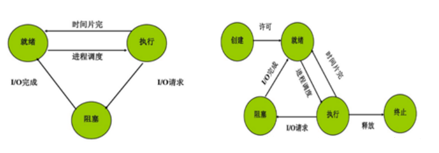

* 就绪状态（ready）：等待被调度。
* 运行状态（running）
* 阻塞状态（waiting）：等待资源。

　　处于就绪状态的进程，在调度程序为之分配了处理机之后便开始执行，就绪 -> 执行。

　　正在执行的进程如果因为分配它的时间片已经用完，而被剥夺处理器，执行 -> 就绪。

　　如果因为某种原因致使当前的进程执行受阻，使之不能执行。执行 -> 阻塞。

　　应该注意以下内容：

* 只有就绪态和运行态可以互相转换，其它的都是单向转换。就绪状态的进程通过调度算法从而获得 CPU 时间，转为运行状态；而运行状态的进程，在分配给它的 CPU 时间片用完之后就会转为就绪状态，等待下一次调度。
* 阻塞状态是缺少需要的资源从而由运行状态转换而来，但是该资源不包括 CPU 时间，减少 CPU 时间会从运行态转换为就绪态。

#### 线程

　　线程是进程的一个实体，是 CPU 独立调度和分派的基本单位，它是比进程更小的能独立运行的基本单位。线程自己基本上不拥有系统资源，只拥有一点在运行中必不可少的资源（如程序计数器、一组寄存器和栈），但是它可与同属一个进程的其他的线程共享进程所拥有的全部资源，也有就绪、运行、阻塞三态。

　　一个进程中可以有多个线程，它们共享进程资源。

　　一个线程可以创建和撤销另一个线程，同一个进程中的多个线程之间可以并发执行。相对进程而言，线程是一个更加接近于执行体的概念，它可以与同进程中的其他线程共享数据，但拥有自己的栈空间，拥有独立的执行序列。

　　线程有自己的 TCB （thread control block 线程控制块），只负责这条流程的信息，包括 PC 程序计数器，SP 栈、State 状态、寄存器、线程 id。

##### 线程分类

　　线程有内核级线程和用户级线程，一般说的都是用户级线程，内核级线程由内核管理。

1. 只有内核级线程才能发挥多核性能，因为内核级线程共用一套 MMU（即内存映射表），统一分配核 1 核 2 （即有多个 CPU，可以一个 CPU 执行一个内核级线程），进程无法发挥多核性能，因为进程切换都得切 MMU。
2. 为什么需要内核级线程？如果只有用户级线程，在内核中只能看到进程，所以当用户级线程中一个线程进行 IO 读写阻塞时，内核会将该线程所在的进程直接切换。例如当用浏览器打开网页，这个进程中有下载数据线程，有显示数据线程，当数据下载读写阻塞时，内核直接切到 qq（这些切换是指在 CPU 上运行的程序）。

#### 进程与线程

##### 区别

1. 拥有资源

   进程是资源分配调度的基本单位，但是线程不拥有资源，线程可以访问隶属进程的资源。

   进程 = 资源（包括寄存器值，PCB，内存映射表）+ TCB（栈结构）。

2. 调度

   线程是独立调度的基本单位，在同一进程中，线程的切换不会引起进程切换，从一个进程中的线程切换到另一个进程中的线程时，会引起进程切换。

   线程 = TCB（栈结构）。

3. 系统开销

   由于创建或撤销进程时，系统都要为之分配或回收资源，如内存空间、I/O 设备等，所付出的开销远大于创建或撤销线程时的开销。类似地，在进行进程切换时，涉及当前执行进程 CPU 环境的保护及新调度进程 CPU 环境的设置，而线程切换时只需保存和设置少量寄存器的内容，开销很小。

   线程的切换只是切换 PC，切换了 TCB（栈结构）。

   进程的切换不仅要切换 PC，还包括切换资源，即切换内存映射表。

4. 通信方面

   进程在执行过程中拥有独立的内存单元，而多个线程共享内存，从而极大地提高了程序的运行效率。

   线程的资源是共享的。

   进程间的资源是分隔独立的，内存映射表不同，占用物理内存地址是分隔的。

   线程间可以通过直接读写同一进程中的数据进行通信，但是进程通信需要借助 IPC。

5. 执行过程

   线程在执行过程中与进程还是有区别的。每个独立的线程有一个程序运行的入口、顺序执行序列和程序的出口。但是线程不能够独立执行，必须依存在应用程序中，由应用程序提供多个线程执行控制。

6. 其他

   一个程序至少有一个进程，一个进程至少有一个线程。

   线程的划分尺度小于进程，使得多线程程序的并发性高。

　　从逻辑角度来看，多线程的意义在于一个应用程序中，有多个执行部分可以同时执行。但操作系统并没有将多个线程看做多个独立的应用，用来实现进程的调度和管理以及资源分配。这就是进程和线程的重要区别。

##### 优缺点

　　线程执行开销小，但不利于资源的管理和保护；而进程正相反。同时，线程适合于在 SMP 机器上运行，而进程则可以跨机器迁移。

#### 进程同步

　　经典的进程同步问题：生产者-消费者问题；哲学家进餐问题；读者-写者问题。

　　同步的解决方案：管程、信号量。

##### 临界区

　　对临界资源进行访问的那段代码称为临界区。

　　为了互斥访问临界资源，每个进程在进入临界区之前，需要先进行检查。

##### 同步与互斥

　　同步：多个进程因为合作产生的直接制约关系，使得进程有一定的先后执行关系。

　　互斥：多个进程在同一时刻只有一个进程能进入临界区。

##### 信号量 Semaphore

　　信号量机制：即利用 PV 操作来对信号量进行处理。

　　信号量（Semaphore）的数据结构为一个值和一个指针，指针指向等待该信号量的下一个进程。信号量的值与相应资源的使用情况有关。

　　当它的值大于 0 时，表示当前可用资源的数量。

　　当它的值小于 0 时，其绝对值表示等待使用该资源的进程个数。

　　注意，信号量的值仅能由 PV 操作来改变。

　　 P 和 V 操作，也就是常见的 down 和 up 操作：

* P：如果信号量大于 0，执行 -1 操作；如果信号量等于 0，进程睡眠，等待信号量大于 0；
* V：对信号量执行 +1 操作，唤醒睡眠的进程让其完成 down 操作。

　　P和 V 操作需要被设计成原语，不可分割，通常的做法是在执行这些操作的时候屏蔽中断。

　　一般来说，信号量 S >= 0 时，S 表示可用资源的数量。执行一次 P 操作意味着请求分配一个单位资源，因此 S 的值减 1；当 S < 0 时，表示已经没有可用资源，请求者必须等待别的进程释放该类资源，它才能运行下去。而执行一个 V 操作意味着释放一个单位资源，因此 S 的值加 1；若 S <= 0，表示有某些进程正在等待该资源，因此要唤醒一个等待状态的进程，使之运行下去。 

　　如果信号量的取值只能为 0 或者 1，那么就成为了互斥量（Mutex），0 表示临界区已经加锁，1 表示临界区解锁。

##### 管程

　　使用信号量机制实现的生产者消费者问题需要客户端代码做很多控制，而管程把控制的代码独立出来，不仅不容易出错，也使得客户端代码调用更容易。

　　管程有一个重要特性：在一个时刻只能有一个进程使用管程。进程在无法继续执行的时候不能一直占用管程，否则其他进程永远不能使用管程。

　　管程引入了条件变量以及相关的操作：wait() 和 signal() 来实现同步操作。对条件变量执行 wait() 操作会导致调用进程阻塞，把管程让出来给另一个进程持有。signal() 操作用于唤醒被阻塞的进程。

#### 进程通信

　　进程通信是一种手段，而进程同步是一种目的。也就是说，为了能够达到进程同步的目的，需要让进程进行通信，传输一些进程同步所需要的信息。

　　由于多个进程可以并发执行，所以进程间必然存在资源共享和相互合作的问题。进程通信是指各个进程交换信息的过程。

　　同步是合作进程间直接制约问题，互斥是申请临界资源进程间的间接制约问题。

　　临界资源（Critical Resource,CR）：在同一时间只能供一个进程使用的资源，例如：打印机、磁带机等硬件资源。

　　临界区：每个进程中访问临界资源的那段代码。

　　临界区管理 4 条原则：

1. 有空即进。
2. 无空则等。
3. 有限等待：要求访问临界区的进程，保证有限时间内进入临界区，避免死等。
4. 让权等待：进程不能进入临界区时，应立即释放处理机，避免忙等。

　　进程同步与进程通信很容易混淆，它们的区别在于：

* 进程同步：控制多个进程按一定顺序执行。
* 进程通信：进程间传输信息。

　　进程间通信的手段有：管道、FIFO（命名管道）、消息队列、信号量、共享存储、套接字。

##### 管道

　　管道是通过调用 pipe 函数创建的，fd[0] 用于读，fd[1] 用于写。

　　它具有以下限制：

* 只支持半双工通信（单向交替传输）；
* 只能在父子进程或者兄弟进程中使用。

##### FIFO

　　也称为命名管道，去除了管道只能在父子进程中使用的限制。

　　FIFO 常用于客户-服务器应用程序中，FIFO 用作汇聚点，在客户进程和服务器进程之间传递数据。

##### 消息队列

　　相比于 FIFO，消息队列具有以下有点：

1. 消息队列可以独立于读写进程存在，从而避免了 FIFO 中同步管道的打开和关闭时可能产生的困难；
2. 避免了 FIFO 的同步阻塞问题，不需要进程自己提供同步方法；
3. 读进程可以根据消息类型有选择地接收消息，而不像 FIFO 那样只能默认地接收。

##### 信号量

　　它是一个计数器，用于为多个进程提供对共享数据对象的访问。

##### 共享存储

　　允许多个进程共享一个给定的存储区。因为数据不需要再进程之间复制，所以这是最快的一种 IPC。

　　需要使用信号量来同步对共享存储的访问。

　　多个进程可以将同一个文件映射到它们的地址空间从而实现共享内存。另外 XSI 共享内存不是使用文件，而是使用内存的匿名段。

##### 套接字

　　与其他通信机制不同的是，它可用于不用机器间的进程通信。

#### 池

　　所谓池的概念，一般是指应用提前向内核批量申请资源，用于接下来的使用和回收，减少资源的初始化和销毁次数等开销，以达到提高系统性能的目标。

　　内存池：真正使用前申请一片内存区域，有新需求时取出其中一部分使用，不够用时再重新申请新内存。

　　进程池：应用预先创建一组子进程，所有子进程运行相同代码，拥有相同属性，比如 PGID 和优先级等。

　　常见两种工作方式：

1. 主进程通过随机或 round robin 算法来选择子进程作为新任务的服务进程；
2. 通过一个共享队列来进行同步，所有子进程从该队列中获取任务，不过同时只能有一个子进程能成功获得新任务处理权。

　　线程池：主要应用于任务小而多，处理时间短的场景，比如简单网页请求等。

### 死锁

#### 死锁概念

　　两个以上的进程互相要求双方释放已经占用的资源导致无法继续运行下去的现象。

　　在两个或多个并发进程中，如果每个进程持有某种资源而又等待别的进程释放它或它们现在保持着的资源，在未改变这种状态之前都不能向前推进，称这一组进程产生了死锁。通俗地讲，就是两个或多个进程被无限期地阻塞、相互等待地一种状态。

　　例如：一个系统有一台扫描仪 R1，一台刻录机 R2，有两个进程 P1、P2，他们都准备将扫描的文档刻录到 CD 上，P1 先请求 R1 成功，P2 先请求 R2 并成功，后来，P1 又请求 R2，但却因为已经分配而阻塞，P2 请求 R1，也因分配而阻塞，此时，双方都被阻塞，都希望双方释放自己所需的资源，但又谁都不能得到自己所需的资源而继续进程，从而一直占用自己所占的资源，就形成死锁。

#### 可抢占性资源和不可抢占性资源

　　可抢占性资源：某进程获得这类资源后，该资源可以在被其他进程或系统抢占。

　　不可抢占性资源：一旦系统将资源分配给一个进程以后，就不能把它强行收回，只能等它用完自行释放。

#### 产生死锁的原因

1. 竞争不可抢占性资源。
2. 进程运行推进的顺序不合适。
3. 竞争可消耗资源。

　　如果系统资源充足，进程的资源请求都能够得到满足，死锁出现的可能性就很低，否则就会因抢夺优先的资源而陷入死锁。其次，进程运行推进顺序与速度不同，也可能产生死锁。

#### 产生死锁的四个必要条件

　　产生死锁的四个必要条件：互斥条件、请求与保持条件、不可剥夺条件、循环等待条件。

##### 互斥条件

　　一个资源一次只能被一个进程使用。

　　每个资源要么已经分配给了一个进程，要么就是可用的。

##### 请求与保持条件

　　一个进程因请求资源而阻塞时，对已获得的资源保持不放。

　　已经得到了某个资源的进程可以再请求新的资源。

##### 不可剥夺条件

　　进程已获取的资源，在未使用完之前，不能强行剥夺。

　　已经分配给一个进程的资源不能强制性地被抢占，它只能被占用它的进程显式地释放。

##### 循环等待条件

　　若干进程之间形成一种头尾相连的循环等待资源关系。

　　有两个或者两个以上的进程组成一条环路，该环路中的每个进程都在等待下一个进程所占用的资源。

　　这四个条件是死锁的必要条件，只要系统发生死锁，这些条件必然成立，而只要上述条件之一不满足，就不会发生死锁。

#### 处理方法

　　解决死锁的 4 种处理策略：鸵鸟策略（即不理睬策略）、预防策略、避免策略、检测与解除策略。

1. 鸵鸟策略：Windows、Linux 个人版都不做死锁处理，直接忽略，大不了重启就好了，小概率事件，代价可以接受。

2. 预防死锁：破坏产生死锁的 4 个必要条件中的一个或者多个；实现起来比较简单，但是如果限制过于严格会降低系统资源利用率以及吞吐量。

   　　死锁预防的方法有：

   1. 预先静态分配法：破坏不可剥夺条件。

   2. 资源有序分配法：将资源分类按顺序排列，保证不形成环路。

      破坏互斥条件：例如打印技术允许若干个进程同时输出，唯一真正请求物理打印机的进程是打印守护进程。

      破坏占有和等待条件：一种实现方式是规定所有进程在开始执行前请求所需要的全部资源。

      破坏不可抢占条件：进程可以抢占其他进程持有的资源。

      破坏环路等待：给资源同一编号，进程只能按编号顺序来请求资源。

3. 避免死锁：在资源的动态分配中，防止系统进入不安全状态（可能产生死锁的状态），如银行家算法。

   银行家算法可以对每个资源请求进行检测，确保安全，在程序运行时避免发生死锁。

   单个资源的银行家算法：一个小城镇的银行家，他向一群客户分别承诺了一定的贷款额度，算法要做的是判断对请求的满足是否会进入不安全状态，如果是，就拒绝请求；否则予以分配。

4. 检测死锁：允许系统运行过程中产生死锁，在死锁发生之后，采用一定的算法进行检测，并确定与死锁相关的资源和进程，采取相关方法清除检测到的死锁。实现难度大。

5. 解除死锁：与死锁检测配合，将系统从死锁中解脱出来（撤销进程或者剥夺资源）。对检测到的和死锁相关的进程以及资源，通过撤销或者挂起的方式，释放一些资源并将其分配给处于阻塞状态的进程，使其转变为就绪态。实现难度大。


## flutter

### state 的生命周期

* initState：当 widget 第一次插入到 widget 树时会被调用，对于每一个State对象，Flutter 框架只会调用一次该回调，所以，通常在该回调中做一些一次性的操作，如状态初始化、订阅子树的事件通知等。不能在该回调中调用BuildContext.dependOnInheritedWidgetOfExactType（该方法用于在 widget 树上获取离当前 widget 最近的一个父级InheritedWidget，关于InheritedWidget我们将在后面章节介绍），原因是在初始化完成后， widget 树中的InheritFrom widget也可能会发生变化，所以正确的做法应该在在build（）方法或didChangeDependencies()中调用它。

* didChangeDependencies()：当State对象的依赖发生变化时会被调用；例如：在之前build() 中包含了一个InheritedWidget （第七章介绍），然后在之后的build() 中Inherited widget发生了变化，那么此时InheritedWidget的子 widget 的didChangeDependencies()回调都会被调用。典型的场景是当系统语言 Locale 或应用主题改变时，Flutter 框架会通知 widget 调用此回调。需要注意，组件第一次被创建后挂载的时候（包括重创建）对应的didChangeDependencies也会被调用。

* build()：它主要是用于构建 widget 子树的，会在如下场景被调用：

​	1.	在调用initState()之后。

​	2.	在调用didUpdateWidget()之后。

​	3.	在调用setState()之后。

​	4.	在调用didChangeDependencies()之后。

​	5.	在State对象从树中一个位置移除后（会调用deactivate）又重新插入到树的其它位置之后。

* reassemble()：此回调是专门为了开发调试而提供的，在热重载(hot reload)时会被调用，此回调在Release模式下永远不会被调用。

* didUpdateWidget ()：在 widget 重新构建时，Flutter 框架会调用widget.canUpdate来检测 widget 树中同一位置的新旧节点，然后决定是否需要更新，如果widget.canUpdate返回true则会调用此回调。正如之前所述，widget.canUpdate会在新旧 widget 的 key 和 runtimeType 同时相等时会返回true，也就是说在在新旧 widget 的key和runtimeType同时相等时didUpdateWidget()就会被调用。

* deactivate()：当 State 对象从树中被移除时，会调用此回调。在一些场景下，Flutter 框架会将 State 对象重新插到树中，如包含此 State 对象的子树在树的一个位置移动到另一个位置时（可以通过GlobalKey 来实现）。如果移除后没有重新插入到树中则紧接着会调用dispose()方法。

* dispose()：当 State 对象从树中被永久移除时调用；通常在此回调中释放资源。