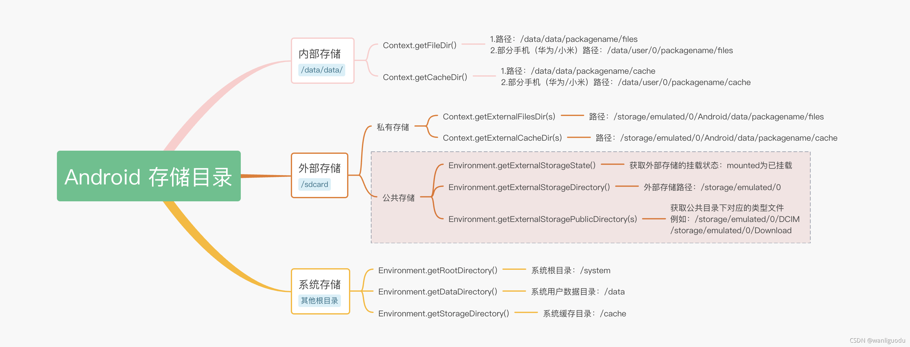
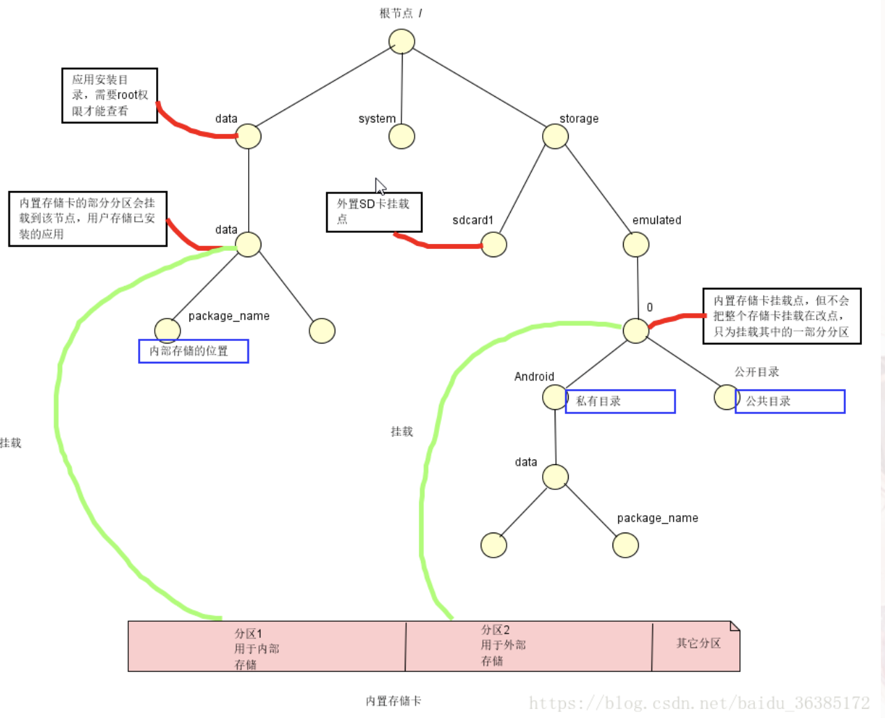

## 面试宝典-Android

```
1.Activity
	1.1.生命周期
	1.2.启动模式
	1.3.Intent 的 flags
	1.4.onNewIntent 的回调时机
	1.5.Activity 的启动流程
		1.5.1.冷启动
		1.5.2.热启动
		1.5.3.关于 IActivityManager、ActivityManagerNative、ActivityManagerProxy、ActivityManagerService
		1.5.4.关于 ApplicationThread
		1.5.5.关于 Instrumentation
		1.5.6.先讲下普通的 activity 的启动流程吧，设计到应用的本地进程和系统进程（AMS）
	1.6.根 Activity 的启动
2.Service
	2.1.两种启动方式
	2.2.生命周期
	2.3.启动服务与绑定服务
		2.3.1.启动服务和绑定服务的生命周期
		2.3.2.启动服务与绑定服务的区别
	2.4.IntentService
	2.5.前台服务
3.BroadcastReceiver
	3.1.BroadcastReceiver 的两种常用类型
	3.2.静态和动态注册方式
		3.2.1.两种注册方式区别
	3.3.BroadcastReceiver 的实现原理
4.ContentProvider
	4.1.为什么选择 ContentProvider
	4.2.ContentProvider 的特点
	4.3.对 ContentProvider 封装的理解
	4.4.ContentProvider 运行过程源码分析 * （未整理）
	4.5.ContentProvider 的共享数据更新通知机制 * （未整理）
5.IntentFilter 的匹配规则
	5.1.action 的匹配规则
	5.2.category 的匹配规则
	5.3.data 的匹配规则
6.ActivityManagerService * （未整理）
7.WindowManagerService * （未整理）
8.PackageMAnagerService 之启动解析 * （未整理）
9. 守护进程
	9.1.黑色保活
	9.2.白色保活
	9.3.灰色保活
	9.4.双进程守护
	9.5.JobService
10.Fragment
	10.1.Fragment 的生命周期
	10.2.setRetainInstance() 方法
	10.3.FragmentPageAdapter 与 FragmentStatePageAdapter 的区别
	10.4.replace 与 add 的区别
		10.4.1.添加 add
		10.4.2.替换 replace
11.Binder 机制
	11.1.Linux 进程空间划分
	11.2.进程隔离
	11.3.跨进程通信（IPC）
	11.4.传统跨进程通信的基本原理
	11.5.什么是内存映射？
	11.6.内存映射的作用
	11.7.Binder
	11.8.Binder 请求的线程管理
	11.9.Android 中的 Binder 实现机制
12.Handler
	12.1.消息机制的架构
	12.2.handler 机制原理
		12.2.1.Looper
		12.2.2.Handler
		12.2.3.发送消息
		12.2.4.获取消息
		12.2.5.分发消息
	12.3.Handler 引起的内存泄漏原因以及最佳解决方案
	12.4.为什么主线程不会因为 Looper.loop() 里的死循环卡斯或者不能处理其他事务？
		12.4.1.为什么不会卡死？
		12.4.2.既然是死循环又如何去处理其他事务呢？
	12.5.ThreadLocal
	12.6.AsyncTask 的知识
13.View
	13.1.Activity 的布局绘制过程
	13.2.View 绘制流程
		13.2.1.onMeasure()
		13.2.2.onLayout()
			13.2.2.1.getMeasureWidth() 和 getWidth() 方法的区别
		13.2.3.onDraw()
		13.2.4.视图状态与重绘流程
	13.3.View 事件分发机制
		13.3.1.Activity 的事件分发
		13.3.2.onTouch 和 onTouchEvent 有什么区别，又该如何使用？
		13.3.3.onTouchEvent 中的 DOWN、MOVE、UP
			13.3.3.1.DOWN
			13.3.3.2.MOVE
			13.3.3.3.UP
	13.4.ViewGroup 事件分发机制
	13.5.自定义 View 的实现方式
14.RecyclerView
	14.1.RecyclerView 的 getLayoutPosition 和 getAdapterPosition
	14.2.原理
	14.3.设计结构
		14.3.1.ViewHolder
		14.3.2.Adapter
		14.3.3.AdapterDataObservable
		14.3.4.RecyclerViewDataObserver
		14.3.5.LayoutManager
		14.3.6.Recycler
			14.3.6.1.scrap list
	14.4.RecyclerView 刷新机制
		14.4.1.adapter.notifyDataSetChanged 引起的刷新
			14.4.1.1.RecyclerView.onLayout
			14.4.1.2.dispatchLayoutStep2()
			14.4.1.3.LinearLayoutMAnager.onLayoutChildren()
		14.4.2.RecyclerView 滑动时的刷新逻辑
			14.4.2.1.LinearLayoutManager.scrollBy
			14.4.2.2.根据布局方向和滑动的距离来确定可用布局空间
			14.4.2.3.滚动 RecyclerView
	14.5.RecyclerView 复用机制
		14.5.1.从 Recycler 中获取一个 ViewHolder 的逻辑
			14.5.1.1.情形一：由无到有
			14.5.1.2.情形二：在原有数据的情况下进行整体刷新
			14.5.1.3.情形三：滚动复用
	14.6.RecyclerView 动画源码浅析
		14.6.1.AdapterHelper
		14.6.2.RecyclerView.layout
			14.6.2.1.dispatchLayoutStep1(保存动画线程)
			14.6.2.2.dispatchLayoutStep2
			14.6.2.3.dispatchLayoutStep3(执行删除动画)
			14.6.2.4.把 item view 动画前的起始状态准备好
	14.7.RecyclerView 的使用总结以及常见问题解决方案
		14.7.1.RecyclerView 设置了数据不显示
		14.7.2.RecyclerView 数据多次滚动后出现混乱
		14.7.3.如何获取当前 ItemView 展示的位置
		14.7.4.如何在固定时间内滚动一段距离
		14.7.5.如何测量当前 RecyclerView 的高度
		14.7.6.IndexOutOfBoundException
	14.8.RecyclerView 优化
15.ListView
	15.1.ListView 的优化
	
	
```

## 1. Activity

### 1.1.生命周期

| 生命周期方法 | 作用                       | 说明                                                         |
| ------------ | -------------------------- | ------------------------------------------------------------ |
| onCreate     | 表示 Activity 正在被创建   | activity 被创建时调用，一般在这个方法中进行活动的初始化工作，如设置布局工作、加载数据、绑定控件等。 |
| onRestart    | 表示 Activity 正在重新启动 | 这个回调代表了 Activity 由完全不可见重新变为可见的过程，当 Activity 经历了 onStop() 回调变为完全不可见后，如果用户返回原 Activity，便会触发该回调，并且紧接着会触发 onStart() 来使活动重新可见。 |
| onStart      | 表示 Activity 正在被启动   | 经历该回调后，Activity 由不可见变为可见，但此时处于后台可见，还不能和用户进行交互。 |
| onResume     | 表示 Activity 已经可见     | 已经可见的 Activity 从后台来到前台，可以和用户进行交互。     |
| onPause      | 表示 Activity 正在停止     | 当用户启动了新的 Activity ，原来的 Activity 不再处于前台，也无法与用户进行交互，并且紧接着就会调用 onStop() 方法，但如果用户这时立刻按返回键回到原 Activity ，就会调用 onResume() 方法让活动重新回到前台。而且在官方文档中给出了说明，不允许在 onPause() 方法中执行耗时操作，因为这会影响到新 Activity 的启动。<br /><br />一般会导致变为 onPause 状态的原因除了 onStop 中描述的四个原因外，还包括当用户按 Home 键出现最近任务列表时。 |
| onStop       | 表示 Activity 即将停止     | 这个回调代表了 Activity 由可见变为完全不可见，在这里可以进行一些稍微重量级的操作。需要注意的是，处于 onPause() 和 onStop() 回调后的 Activity 优先级很低，当有优先级更高的应用需要内存时，该应用就会被杀死，那么当再次返回原 Activity 的时候，会重新调用 Activity 的 onCreate() 方法。<br /><br />一般会导致变为 stop 状态的原因：1.用户按 Back 键后、用户正在运行 Activity 时，按 Home 键、程序中调用 finish() 后、用户从 A 启动 B 后，A 就会变为 stop 状态。 |
| onDestroy    | 表示 Activity 即将被销毁   | 来到了这个回调，说明 Activity 即将被销毁，应该将资源的回收和释放工作在该方法中执行。<br /><br />当 Activity 被销毁时，销毁的情况包括：当用户按下 Back 键后、程序中调用 finish() 后。 |
| onNewIntent  | 重用栈中 Activity          | 当在 AndroidManifest 里面声明 Activty 的时候设置了 launchMode 或者调用 startActivity 的时候设置了 Intent 的 flag ，当启动 Activity 的时候，复用了栈中已有的 Activity，则会调用 Activity 的该回调。 |

* 关于生命周期常见的问题：

| 问题                                                         | 回调                                                        |
| ------------------------------------------------------------ | ----------------------------------------------------------- |
| 由活动 A 启动活动 B 时，活动 A 的 onPause() 与 活动 B 的 onResume() 哪一个先执行？ | 活动 A 的 onPause() 先执行，活动 B 的 onResume() 方法后执行 |
| 标准 Dialog 是否会对生命周期产生影响                         | 没有影响                                                    |
| 全屏 Dialog 是否会对生命周期产生影响                         | 没有影响                                                    |
| 主题为 Dialog 的 Activity 是否会对生命周期产生影响           | 有影响，与跳转 Activity 一样                                |

* 异常状态下活动的生命周期：

在发生异常情况后，用户再次回到 Activity，原 Activity 会重新建立，原已有的数据就会丢失，比如用户操作改变了一些属性值，重建之后用户就看不到之前操作的结果，在异常的情况下如何给用户带来好的体验，有两种办法：

1. 系统提供的 **onSaveInstanceState** 和 **onRestoreInstanceState** 方法，onSaveInstanceState 方法会在 Activity 异常销毁之前调用，用来保存需要保存的数据，onRestoreInstanceState 方法在 Activity 重建之后获取保存的数据。
2. 在默认情况下，资源配置改变会导致活动的重新创建，但是可以通过对活动的 android:configChanges 属性的设置使活动防止重新被创建。

### 1.2.启动模式

* standard(标准模式)：Activity 的默认启动模式，不设置启动模式时，就是标准模式。只要启动 Activity 就会创建一个新实例，并将该 Activity 添加到当前任务栈中。

  标准模式的应用场景：正常打开一个新的页面，这种启动模式使用最多，最普通。一般没有特殊需求都是使用标准模式。

* singleTop(栈顶复用)：在这种启动模式下，首先会判断要启动的活动是否已经存在于栈顶，如果是的话就不创建新实例，直接复用栈顶活动，并且调用 activity 的 onNewIntent() 方法。如果要启动的活动不位于栈顶，则会创建新实例入栈。

  栈顶复用模式的应用场景：栈顶复用模式避免了同一个页面被重复打开，应用场景例如一个新闻客户端，在通知栏收到多条推送，点击一条推送就会打开新闻的详情页，如果是默认的启动模式，点击一次将会打开一个详情页，栈中就会有三个详情页，如果使用栈顶复用模式，点击第一条推送之后，接着点击其他的推送，都只会有一个详情页，可以避免重复打开页面。

* singleTask(栈内复用)：singleTask 是一种栈内单例模式，当一个 activity 启动时，如果栈中没有 activity 则会创建 activity 并让它入栈；如果栈中有 activity ，则会将位于 activity 之上的 activities 出栈，然后复用栈中的 activity ，调用 activity 的 onNewIntent() 方法。

  这种模式会保证 Activity 在栈内只有一个或者没有。

  栈内复用模式的应用场景：栈内复用模式适合作为程序的入口。最常用的就是一个 APP 的首页，一般 App 的首页长时间保留在栈内，并且是栈的第一个 activity。例如浏览器的主界面，不管从多少个应用启动浏览器，只会启动主界面一次，并清空主界面上面的其他页面，根据 onNewIntent 方法传递的数值，显示新的界面。

* singleInstance(单例模式)：这种模式是真正的单例模式，以这种模式启动的活动会单独创建一个任务栈，并且依然遵循栈内复用的特性，保证了这个栈中只能存在这一个活动。并且系统不会在这个单例模式的 Activity 的实例所在栈中中启动任何其他的 Activity 。单例模式的 Activity 的实例永远是这个栈中的唯一一个成员。

  单例模式的应用场景：单例模式使用需要与程序分离开的页面。电话拨号页面，通过自己的应用或者其他应用打开拨打电话页面，只要系统的栈中存在该实例，那么就会直接调用，还有闹铃提醒。

### 1.3.Intent 的 flags

* FLAG_ACTIVITY_CLEAR_TOP：设置此标志，如果 activity 已经在栈中，会将栈中 activity 之上的 activities 进行出栈关闭，如果启动模式是默认的（标准模式），设置了 FLAG_ACTIVITY_CLEAR_TOP 标志的 activity 会结束并重新创建；如果是其他模式或者 Intent 设置了 FLAG_ACTIVITY_SINGLE_TOP，则 activity 会将新的 intent 传递给栈中的 activity 的 onNewIntent() 方法。

* FLAG_ACTIVITY_NO_HISTORY：如果这只此 flag，则启动的 activity 将不会保留在历史栈中，一旦用户离开它，activity 将结束。

* FLAG_ACTIVITY_NO_ANIMATION：设置此标签，则跳转启动的 activity 动画不会显示。

* FLAG_ACTIVITY_NEW_TASK：设置 FLAG_ACTIVITY_NEW_TASK 标签后，首先会查找是否存在和被启动的 activity 具有相同亲和性的任务栈，如果没有，则新建一个栈让 activity 入栈；如果有，则保持栈中 activity 的顺序不变，如果栈中没有 activity，将 activity 入栈，如果栈中有 activity，则将整个栈移动到前台。

* FLAG_ACTIVITY_NEW_TASK 与 FLAG_ACTIVITY_CLEAR_TASK：FLAG_ACTIVITY_NEW_TASK 与 FLAG_ACTIVITY_CLEAR_TASK 联合使用时，首先会查找是否存在和被启动的 activity 具有相同亲和性的任务栈，如果有则先将栈清空，将被启动的 activity 会入栈，并将栈整体移动到前台；如果没有，则新建栈来存放被启动的 activity。

* FLAG_ACTIVITY_NEW_TASK 与 FLAG_ACTIVITY_CLEAR_TOP：FLAG_ACTIVITY_NEW_TASK 与 FLAG_ACTIVITY_CLEAR_TOP 联合使用时，首先会查找是否存在和被启动的 activity 具有相同亲和性的任务栈，如果有，栈中如果包含 activity ，则将栈中 activity 之上包括栈中的 activity 移除，将被启动的 activity 入栈，并将栈整体移动到前台，如果栈中没有要启动 activity，则直接将 activity 入栈；如果没有，则新建栈来存放被启动的 activity。

* FLAG_ACTIVITY_NEW_TASK 与 FLAG_ACTIVITY_EXCLUDE_FROM_RECENTS：如果设置 FLAG_ACTIVITY_EXCLUDE_FROM_RECENTS，则新的 activity 将不会被保留在最近启动 activities 的列表中。

  FLAG_ACTIVITY_EXCLUDE_FROM_RECENTS 与使用 FLAG_ACTIVITY_NO_HISTORY 标志不同，使用 FLAG_ACTIVITY_NO_HISTORY 标志时，在经过 A -> B -> C 的界面跳转后，在 C 界面点击 back 键就会回到 A 界面，而 FLAG_ACTIVITY_NEW_TASK 和 FLAG_ACTIVITY_EXCLUDE_FROM_RECENTS 一起使用时，在经过 A -> B -> C 的界面跳转后 ，在 C 点击 back 返回，还是会回到 B 界面的。

* FLAG_ACTIVITY_REORDER_TO_FRONT：设置此标志，如果 activity 已经在栈中运行，将会把 activity 带到栈的顶部。

* FLAG_ACTIVITY_FORWARD_RESULT：如果设置这个标志并用于启动一个新的 activity，则回复对象从本 activity 移动到新的 activity 上。

* FLAG_ACTIVITY_NEW_DOCUMENT：被用于基于 Intent 的 activity 活动开一个新的任务。同一个 activity 的不同实例将会在最近的任务列表中显示不同的记录。

* FLAG_ACTIVITY_NEW_DOCUMENT 与 FLAG_ACTIVITY_MULITIPLE_TASK：单独使用 FLAG_ACTIVITY_NEW_DOCUMENT 时，会先从存在的任务栈中搜索匹配 Intent 的栈，如果没有任务栈被发现则创建新的任务栈，当与 FLAG_ACTIVITY_MULTIPLE_TASK 配合使用时，会跳过搜索匹配任务栈而是直接开启一个新的任务栈。

* FLAG_ACTIVITY_NEW_TASK 与 FLAG_ACTIVITY_MULITIPLE_TASK：单独使用  FLAG_ACTIVITY_NEW_TASK 时，会先从存在的任务栈中搜索匹配 Intent 的栈，如果没有任务栈被发现则创建新的任务栈，当与 FLAG_ACTIVITY_MULTIPLE_TASK 配合使用时，会跳过搜索匹配任务栈而是直接开启一个新的任务栈。

* FLAG_ACTIVITY_RETAIN_IN_RECENTS：默认情况下，进入最近任务栈的记录由 FLAG_ACTIVITY_NEW_DOCUMENT 创建，当用户关闭 activity 时任务栈就会被移除，如果想要允许任务栈保留方便它能被重新启动，可以使用此标志。

* FLAG_ACTIVITY_NO_USER_ACTION：如果设置此标志，在 activity 被前台的新启动的 activity 造成 paused 之前，将会阻止当前最顶部的 activity 的 onUserLeaveHint 回调。通常，当 activity 在用户的操作下被移除栈顶则会调用 onUserLeaveHint 回调，这个回调标志着 activity 生命周期的一个点，以便隐藏任何 “ 直到用户看到它们 ” 的通知，比如闪烁的 LED 灯。 

### 1.4.onNewIntent 的回调时机

onNewIntent() 方法会在 activity 复用的时候调用，也就是说调用 activity ，并不会创建 activity 的新实例，而是复用栈中的 activity ，复用时就会调用 onNewIntent() 方法，将新的 Intent 传递给 oNewIntent() 方法。

### 1.5.Activity 的启动流程（重新梳理）

#### 1.5.1.冷启动


图中涉及的几个类：

（1）Launcher：Launcher 本质上也是一个应用程序，和一个简单的 App 一样，也继承自 Activity，实现了点击、长按等回调接口，来接收用户的输入。

（2）ActivityManagerServices：简称 AMS，服务端对象，负责系统中所有 Activity 的生命周期。

（3）ActivityThread：App 的真正入口。当开启 App 之后，会调用 main() 开始运行，开启消息循环队列，这就是 UI 线程（主线程）。与 ActivityManagerService 配合，一起完成 Activity 的管理工作。

（4）ApplicationThread：用来实现 ActivityManangerService 与 ActivityThread 之间的交互。在 ActivityManangerService 需要管理相关 Application 中的 Activity 的生命周期时，通过 ApplicationThread 的代理对象与 ActivityThread 通讯。

（5）ApplicationThreadProxy：是 ApplicationThread 在服务器端的代理，负责和客户端的 ApplicationThread 通讯。AMS 就是通过该代理与 ActivityThread 进行通信的。

（6）Instrumentation：每一个应用程序只有一个 Instrumentation 对象，每个 Activity 内都有一个对该对象的引用。Instrumentation 可以理解为应用进程的管家，ActivityThread 要创建或暂停某个 Activity 时，都需要通过 Instrumentation 来进行具体的操作。

（7）ActivityStack：Activity 在 AMS 的栈管理，用来记录已经启动的 Activity 的先后关系、状态信息等。通过 ActivityStack 决定是否需要启动新的进程。

（8）ActivityRecord：ActivityStack 的管理对象，每个 Activity 在 AMS 对应一个 ActivityRecord，来记录 Activity 的状态以及其他的管理信息。其实就是服务端的 Activity 对象的映像。

（9）TaskRecord：AMS 抽象出来的一个“任务”的概念，是记录 ActivityReacord 的栈，一个“Task”包含若干个 ActivityRecord 。AMS 用 TaskRecord 确保 Activity 启动和退出的顺序。


Activity 冷启动过程（app 进程不存在）：

1. 在 launch 点击触发了打开应用后，会先通过调用 AMS 的 startActivity() 方法，而 AMS 会调用 ActivityStack 的 resumeTopActivityInnerLocked 方法，在该方法中会先 pause 当前显示的 activity。
2. 在处理完 pause activity 之后，会判断启动 app 的进程是否存在，判断如果 Activity 所在进程存在且 Activity 之前启动过，则直接发送 ResumeActivityItem 请求通知 APP 进程进行 resume，否则调用 **ActivityStackSupervisor** 的 **startSpecificActivityLocked方法** 继续执行去启动目标进程（通过 **Process.start** 请求 ZYGOTE 创建子 APP 进程）。

#### 1.5.2.热启动


Activity 热启动过程：ActivityThread 的 main() 方法作为程序的入口，在 main() 方法中，初始化了主线程的 Looper，主 Handler，并使主线程进入等待接收 Message 消息的无限循环状态，调用 attach() 方法，而 attach() 方法通过调用 ActivityManager 的 attachApplication() 方法，最后调用到 ApplicationThread 的 bindApplication() 方法，在 bindApplication() 方法中发送出 BIND_APPLICATION 的消息，ActivityThread 类处理 BIND_APPLICATION 消息，接收到 BIND_APPLICATION 消息之后，创建一个 Application 实例，初始化一个 Instrumentation 对象，通过 Instrumentation 的 callApplicationOnCreate() 方法去调用 Application 的 onCreate() 方法。ApplicationThread 发出 LAUNCH_ACTIVITY 消息来启动 activity，通过反射机制创建 activity 实例，创建完成之后就会调用 onCreate() 方法。

#### 1.5.3.关于 IActivityManager、ActivityManagerNative、ActivityManagerProxy、ActivityManagerService

　　IActivityManager 是一个接口，用于与活动管理服务通讯。ActivityManagerProxy 实现了 IActivityManager 接口，ActivityManagerProxy 主要代理了内核中与 ActivityManager 通讯的 Binder 实例。ActivityManagerProxy 持有一个 ActivityManagerNative 的对象实例，当调用 IActivityManager 的方法时，调用 ActivityManagerNative 的实例来完成。ActivityManagerNative 是一个抽象类，实现 IActivityManager 接口，并且继承 Binder 类，提供 ActivityManagerProxy 实例供外部使用。ActivityManagerService 类继承 ActivityManagerNative 类，真正实现 IActivityManager 接口的方法。

　　很明显 ActivityManager 使用的是代理模式，ActivityManagerProxy 代理了与活动管理服务通讯。

#### 1.5.4.关于 ApplicationThread

　　ApplicationThread 作为 IApplicationThread 的一个实例，承担了发送 Activity 生命周期以及它一些消息的任务，也就是说发送消息。

　　至于为什么在 ActivityThread 中已经创建出了 ApplicationThread 了还要绕弯路发消息，是为了让系统根据情况来控制这个过程。

#### 1.5.5.关于 Instrumentation

Instrumentation 会在应用程序的任何代码运行之前被实例化，它能够允许你监视应用程序和系统的所有交互。

在 Application 的创建、Activity 的创建和生命周期过程中都会调用 Instrumentation 的方法，Application 的创建是调用 ActivityManagerService 的方法来实现，而 Activity 的创建是反射实现，Activity 的生命周期调用了 activity 的相关方法。

Instrumentation 是如何实现监视应用程序和系统交互的？Instrumentation 类将 Application 的创建、Activity 的创建以及生命周期这些操作包装起来，通过操作 Instrumentation 进而实现上述操作。

Instrumentation 封装有什么好处？Instrumentation 作为抽象，在约定好需要实现的功能之后，只需要给 Instrumentation 添加这些抽象功能，然后调用就好了。关于怎么实现这些功能，都会交给 Instrumentation 的实现对象就好了。这就是多态的运用，依赖抽象，不依赖具体的实践。就是上层提出需求，底层定义接口，即依赖倒置原则的践行。

#### 1.5.6.先讲下普通的activity的启动流程吧，涉及到应用的本地进程和系统进程（AMS）

首先调用 startActivity 启动新的activity，这个方法其实调用了 startActivityForResult 方法。里面向 instrumentation 请求创建，调用 execActivity 方法，通过 AMS 在本地进程的 IBinder 接口（IActivityManager）（AIDL 通信，用该AIDL的代理类 ActivityManagerProxy）向 AMS 发起远程请求创建 Activity。

AMS 首先调用 startActivity 方法，里面校验了要启动的 activity 是否注册、确定启动模式等信息，如果启动的 activity 合法，然后会调用ActivityTaskSuperVisitor，找出对应的 activityTask。如果 activityTask 栈顶上存在处于 resume 状态的 activity，则让该 activity 调用其 onPause 方法；接下来判断应用进程是否已启动，如果没有就启动应用的进程，创建 ActivityThread 对象，并调用其 main 方法；

在 ActivityThread 的 main() 方法中会初始化主线程的 Looper，并且发出创建 Application 的消息，最后开启 Looper，等待接收消息。创建 application 是利用本地进程在 AMS 的 IBinder 接口（IApplicationThread）直接调用本地的 ActivityThread 的内部类，ApplicationThread 对象的 ScheduleActivity 方法，通过叫 H 的 handler 对象，切换到主线程调用 handleLaunchActivity 方法，最后把逻辑处理交给 performLaunchActivity。这个方法主要干了几个事情：（1）获取待启动 activity 的信息；（2）通过 instrumentation 利用类加载器创建待启动 activity 对象；（3）判断是否已经有创建 Application 对象，没有则创建并调用其 onCreate 方法。（3）调用 Activity 对象的 attach 方法来初始化一些重要数据（创建 PhoneWindow 和 WindowManager、主线程的赋值等）；（4）然后调用 activity 的 onCreate 方法。接着跳出 performLaunchActivity 调用 handleStartActivity 方法（这里应该调用了 activity 的 onStart 方法），然后调用 handleResumeActivity 方法，通过 activity 的 performResume 方法调用了 activity 的 onResume 方法；接着通过 WindowManagerImpl 里面的 WindowGlobal 创建要添加的 view 对应的 viewRootImp 对象，然后 WindowSession 将 phoneWindow 添加到 WMS 中。WMS 把相应的 DecorView 添加到该 window，并用对应的 viewRootImp 对象完成对 view 的绘制，然后设置 view 可见了。最后通知 AMS 执行前一个 activity（如果有的话）的 stop 方法。

### 1.6. 根 activity 的启动：
（1）Launcher 进程请求 AMS 创建 activity
（2）AMS 请求 Zygote 创建进程。
（3）Zygote 通过 fork 自己来创建进程。并通知 AMS 创建完成。
（4）AMS 通知应用进程创建根 Activity。
（5）创建过程和上面说过的普通 activity 的流程是一样的。

## 2.Service

　　Service 是可以在后台执行长时间运行操作并且不需要和用户交互的应用组件。服务是由其他应用组件启动，依赖于启动服务所在的应用程序进程，服务一旦被启动将在后台一直运行，即使启动服务的组件已销毁也不受影响。此外，服务也可以绑定到组件上，以与之进行交互。

​		服务可以在很多场合使用，比如播放多媒体的时候用户启动了其他 activity，此时要在后台继续播放；比如检测 sd 卡上文件的变化；比如在后台记录你的地理位置的改变；也可以执行进程间通信（IPC）等等。

### 2.1.两种启动方式

服务有两种启动方式，一种是启动服务，一种就是绑定服务。

1. 启动服务：当应用组件（如 Activity）通过调用 `startService()` 启动服务时，服务即处于 “ 启动 ” 状态。一旦启动，服务即可在后台无限期运行，即使启动服务的组件已被销毁也不受影响，除非手动调用才能停止服务，已启动的服务通常是执行单一操作，而且不会将结果返回给调用方。
2. 绑定服务：当应用组件通过调用 `bindService()` 绑定到服务时，服务即处于 “ 绑定 ” 状态。绑定服务提供了一个客户端 - 服务端接口，允许组件与服务进行交互、发送请求、获取结果，甚至是利用进程间通信（IPC）执行这些操作。仅当与另一个应用组件绑定时，绑定服务才会运行。多个组件可以同时绑定到该服务，但全部取消绑定后，该服务即会被销毁。

### 2.2.生命周期


Call to startService()：onCreate() -> onStartCommand()->onDestory()

Call to bindService()：onCreate() -> onBind() -> onUnbind() -> onDestory()

* onCreate()：首次创建服务时，系统将调用此方法来执行一次性设置程序（在调用 `onStartCommand()` 或 `onBind()` 之前），如果服务已在运行，则不会调用此方法，该方法只调用一次。

* onBind()：当另一个组件想通过调用 `bindService()` 与服务绑定（例如执行 RPC）时，系统将调用此方法。在此方法实现中，必须返回一个 IBinder 接口的实现类，供客户端用来与服务进行通信。无论是启动状态还是绑定状态，此方法必须重写，但在启动状态就会直接返回 null 。

* onStartCommand()：当另一个组件（Activity）通过调用 `startService()` 请求启动服务时系统将调用此方法，一旦执行此方法，服务即会启动并可在后台无限期运行。如果自己实现此方法，则需要在服务工作完成后，通过调用 `stopSelf()` 或 `stopService()` 来停止服务（在绑定状态无需实现此方法）。

* onUnbind()：当另一个组件通过调用 `unbindServicer()` 与服务解绑时，系统将调用此方法。

* onDestroy()：当服务不再使用且被销毁时，系统将调用此方法，服务应该实现此方法来清理所有的资源，如线程、注册的监听器、接收器等，这是服务接收的最后一个调用。

### 2.3.启动服务与绑定服务

#### 2.3.1. 启动服务和绑定服务的生命周期

* 启动服务生命周期：第一次调用 `startService()` 启动服务，会调用 `onCreate()` 和 `onStartCommand()` 方法，之后再次调用 `startService()` 启动服务，只会调用 `onStartCommand()` 方法。调用 `stopService()` 方法停止服务，会调用 `onDestory()` 方法。停止服务之后再次 `startService()` 启动服务，会再次调用 `onCreate()` 和 `onStartCommand()` 方法。
* 绑定服务生命周期：第一次调用 `bindService()` 启动服务，调用 `onCreate() `和 `onBind()` 方法，之后调用 `bindService()` 没有任何方法调用，调用 `unbindService()` 方法解绑服务，会调用 `onUnbind()` 和 `onDestory()` 方法。在 Activity 退出的时候不调用 `unbindService()` 解绑的话会报错。
* 启动并绑定服务生命周期
  * 先绑定服务后启动服务：先调用 `bindService()` 方法，调用 `onCreate()` 和 `onBind()` 方法，再调用 `startService()` 方法，调用 `onStartCommand()` 方法，调用 `unbindService()` 方法解绑，调用 `onUnbind()` 方法，再调用 `stopService()` 方法，调用 `onDestory()` 方法，如果是先调用 `stopService()` 没有方法回调，再调用 `unbindService()` 方法解绑会调用 `onUnbind()` 和 `onDestory()` 方法。
  * 先启动服务后绑定服务：先调用 `startService()` 方法，调用 `onCreate()` 和 `onStartCommand()` 方法，（之后再调用 `startService()` 方法，只会回调 `onStartCommand()` 方法）再调用 `bindService()` 方法，调用 `onBind()` 方法，调用 `unbindService()` 方法解绑，调用 `onUnbind()` 方法，再调用 `stopService()` 方法，调用 `onDestory()` 方法，如果是先调用 `stopService()` 没有方法回调，再调用 `unbindService()` 方法解绑会调用 `onUnbind()` 和 `onDestory()` 方法。

#### 2.3.2.启动服务与绑定服务的区别

**区别一：生命周期**
　　通过 start 方式的服务会一直运行在后台，需要由组件本身或外部组件来停止服务才会结束。

　　bind 方式的服务，生命周期就会依赖绑定的组件。

**区别二：参数传递**
　　start 服务可以给启动的服务对象传递参数，但无法获取服务中方法的返回值。

　　bind 服务可以给启动的服务对象传递参数，也可以用过绑定的业务对象获取返回结果。

### 2.4.IntentService

服务不会自动开启线程，服务中的代码默认是运行在主线程中，如果直接在服务里执行一些耗时操作，容易造成 ANR(Application Not Responding)异常，为了可以简单的创建一个异步的、会自动停止的服务，Android 专门提供了一个 **IntentService** 类。可以启动 IntentService 多次，而每一个耗时操作会以工作队列的方式在 IntentService 的 onHandleIntent() 回调方法中执行，并且每次只会执行一个工作线程，执行完第一个，再执行第二个，以此类推。

### 2.5.前台服务

前台服务被认为是用户主动意识到的一种服务，因此在内存不足时，系统也不会考虑将其终止。前台服务必须为状态栏提供通知，状态栏位于 “ 正在进行 ” 标题下方，这意味着除非服务停止或从前台删除，否则不能清除通知。例如将从服务播放音乐的音乐播放器设置在前台运行，这是因为用户明确意识到其操作。状态栏中的通知可能表示正在播放的歌曲，并允许用户启动 Activity 来与音乐播放器进行交互。

`startForeground()` 和` stopForeground()` 方法分别将服务设置为前台服务和从前台删除服务。`startForeground(int id, Notification notification)`的作用是把当前服务设置为前台服务，其中 `id` 参数代表唯一标识通知的整型数，需要注意的是提供给 `startForeground()` 的整型 ID 不得为 0 ，而 notification 是一个状态栏的通知。`stopForeground(boolean removeNotification)`用来从前台删除服务，此方法传入一个布尔值，指示是否也删除状态栏通知，true 为删除。注意该方法并不会停止服务，但是，如果在服务正在前台运行时将其停止，则通知也会被删除。

## 3. BroadcastReceiver

BroadcastReceiver ，广播接收者，用来接收来自系统和应用中的广播，是 Android 四大组件之一。

### 3.1.BroadcastReceiver 的两种常用类型

* Normalbroadcasts（默认广播）:发送一个默认广播使用 `Context.sendBroadcast()` 方法，普通广播对于多个接受者来说是完全异步的，通常每个接受者都无需等待即可接收到广播，接受者相互之间不会有影响。对于这种广播，接收者无法终止广播，即无法阻止其他接收者的接收动作。
* Orderedbroadcasts（有序广播）：发送一个有序广播使用 `Context.sendorderedBroadcast()` 方法，有序广播比较特殊，它每次只发送到优先级较高的接受者那里，然后由优先级高的接受者再传播到优先级低的接受者那里，优先级高的接受者有能力终止这个广播。

### 3.2.静态和动态注册方式

构建 Intent ，使用 sendBroadcast 方法发出广播定义一个广播接收器，该广播接收器继承 BroadcastReceiver，并且覆盖 onReceive() 方法来接收事件。注册该广播接收器，可以在代码中注册（动态注册），也可以在 AndroidManifest.xml 配置文件中注册（静态注册）。

#### 3.2.1.两种注册方式区别

　　广播接收器注册一种有两种形式：静态注册和动态注册。

　　两者及其接收广播的区别：

　　（1）动态注册广播不是常驻型广播，也就是说广播跟随 Activity 的生命周期。注意在 Activity 结束前，移除广播接收器。静态注册是常驻型，也就是说当应用程序关闭后，如果有信息广播来，程序也会被系统调用自动运行。

　　（2）当广播为有序广播时：优先级高的先接收（不分静态和动态）。同优先级的广播接收器，动态优先于静态。当广播为默认广播时：无视优先级，动态广播接收器优先于静态广播接收器。

　　（3）同优先级的同类广播接收器，静态：先扫描的优先于后扫描的。动态：先注册优先于后注册的。

　　（4）静态注册是在 AndroidManifesy.xml 里通过< receive > 标签声明的。不受任何组件的生命周期影响，缺点是耗电和占内存，适合在需要时刻监听使用。动态注册在代码中调用 `Context.registerReceiver()` 方法注册，比较灵活，适合在需要特定时刻监听使用。

### 3.3.BroadcastReceiver 的实现原理

广播队列传送广播给 Receiver 的原理其实就是将 BroadcastReceiver 和消息都放到 BroadcastRecord 里面，然后通过 Handler 机制遍历 BroadcastQueue 里面的 BroadcastRecord ，将消息发送给 BroadcastReceiver：


整个广播的机制总结成下图：


## 4. ContentProvider

　　ContentProvider 可以实现在应用程序之间共享数据。

　　Android 为常见的一些数据提供了默认的 ContentProvider（包括音频、视频、图片和通讯录等）。所以可以在其他应用中通过那些 ContentProvider 获取这些数据。

　　Android 所提供的 ContentProvider 都存放在 android.provider 包中。

### 4.1.为什么要选择 ContentProvider

　　虽然也可以通过文件等其他方式来达到在不同程序之间共享数据，但是会很复杂，而 ContentProvider 也是可以实现应用程序之间共享数据的，除了可以在不同程序之间共享数据之外，还有其他优点。

### 4.2.ContentProvider 的 特点

1. ContentProvider 为存储和获取数据提供了统一的接口。ContentProvider 对数据进行了封装，不用关心数据存储的细节。统一了数据的访问方式。
2. 使用 ContentProvider 可以在不同的应用程序之间共享数据。
3. Android 为常见的一些数据提供了默认的 ContentProvider（包括音频、视频、图片和通讯录等）。
4. 不同于文件存储和 SharedPreferences 存储中的两种全局可读写操作模式，ContentProvider 可以选择只对哪一部分进行共享，从而保证程序中的隐私数据不会有泄漏的风险。

### 4.3.对 ContentProvider 封装的理解

　　继承 ContentProvider 的类在 onCreate()、insert()、delete()、update()、query()、getType() 方法中实现对数据增删改查的操作，而数据的存储可以使用文件、数据库、网络等各种方式去实现。而对数据的操作使用的是 ContentResolver 类，不管 ContentProvider 如何对数据进行实质操作，ContentReselver 的使用都是一样的。将实现与使用进行了分割，完成了对数据的封装，也统一了对数据的使用方式。

### 4.4.ContentProvier 运行过程源码分析 *

### 4.5.ContentProvider 的共享数据更新通知机制 *

## 5. IntentFilter 的匹配规则

　　隐式调用需要 Intent 能够匹配目标组件的 IntentFilter 中所设置的过滤信息，如果匹配不成功就不能启动目标 Actiivty。

　　IntentFilter 中过滤的信息包括：action、category、data。

　　关于 IntentFilter 的一些描述：

* 匹配过滤列表时需要同时匹配过滤列表中的 action、category、data。
* 一个 Activity 中可以有多组 intent-filter。
* 一个 intent-filter 可以有多个 action、category、data，并各自构成不同类别，一个 Intent 必须同时匹配 action 类别、category 类别和 data 类别才算完全匹配。
* 一个 Intent 只要能匹配任何一组 intent-filter 就算匹配成功。

### 5.1.action 的匹配规则

1. Intent 中必须存在 action，这一点和 category 不同。
2. action 的字符串严格区分大小写，intent 中的 action 必须和过滤规则中的 action 完全一致才能匹配成功。
3. 匹配规则中可以同时有多个 action，但是 Intent 中的 action 只需与其中一只相同即可匹配成功。

### 5.2.category 的匹配规则

1. 匹配规则中必须添加 “action.intent.category.DEFAULT” 这个过滤条件。
2. Intent 中可以不设置 category，系统会自动添加 “action.intent.category.DEFAULT” 这个默认的 category。
3. Intent 中可以同时设置多个 category，一旦设置多个 category，那么每个 category 都必须能够和过滤条件中的某个 category 匹配成功。

　　category 的第 3 个规则和 action 的匹配规则有所不同，action 有多个的时候，主要其中之一能够匹配成功即可，但是 category 必须是每一个都需要匹配成功。

### 5.3.data 的匹配规则

1. Intent 中必须有 data 数据。
2. Intent 中的 data 必须和过滤规则中的某一个 data 完全匹配。
3. 过滤规则中可以有多个 data 存在，但是 Intent 中的 data 只需匹配其中的任意一个 data 即可。
4. 过滤规则中可以没有指定 URI，但是系统会赋予其默认值：content 和 file，这一点在 Intent 中需要注意。
5. 为 Intent 设定 data 和 type 的时候必须要调用 setDataAndType() 方法，而不能先 setData 再 setType，因为这两个方法是互斥的，都会清除对方的值。
6. 在匹配规则中，data 的 scheme、host、post、path 等属性可以写在同一个 < / > 中，也可以分来单独写，其功效是一样的。

## 6.ActivityManagerService *

## 7. WindowManagerService *

## 8.PackageManagerService 之启动解析 * 

## 9.守护进程

　　守护进程的实现思想分为两方面：

​	1.	保活。通过提高进程优先级，降低进程被杀死的概率。当前业界的 Andriod 进程保活手段主要分为 黑、白、灰三种。

​	2.	拉起。进程被杀死后，进行拉起。

　　守护进程的实现方法如下：

​	•	黑色保活：不同的 app 进程，用广播相互唤醒（包括利用系统提供的广播进行唤醒）。

​	•	白色保活：通过启动前台 Service 使得进程优先级提高到前台进程。

​	•	灰色保活：利用系统的漏洞启动前台 Service。

​	•	双进程守护：两个进程互相拉起。

​	•	JobService 轮询：关闭后自动拉起。

### 9.1.进程划分

Android 系统将进程划分为如下几种（重要性从高到低）。

#### 9.1.1. 前台进程（Foreground process）

用户正在使用的程序，一般系统是不会杀死前台进程的，除非用户强制停止应用或系统内存不足等极端情况会杀死。

* 常见场景

1. 某个进程持有一个正在与用户交互的 Activity 并且该 Activity 正处于 resume 的状态。
2. 某个进程持有一个 Service，并且该 Service 与用户正在交互的 Activity 绑定。
3. 某个进程持有一个 Service，并且该 Service 调用 startForground() 方法使之位于前台运行。
4. 某个进程持有一个 Service，并且该 Service 正在执行它的某个生命周期回调方法，比如 onCreate()、onStary() 或 onDestory()。
5. 某个进程持有一个 BroadcastReceiver，并且该 BroadcastReceiver 正在执行其 onReceiver() 方法。

#### 9.1.2.可见进程

用户正在使用，看得到但是摸不着，显示界面没有覆盖到整个屏幕，只有屏幕的一部分。可见进程不包含任何前台组件，一般系统也是不会杀死可见进程的，除非要在资源吃紧的情况下，要保持某个或多个前台进程存活。

* 常见场景

1. 拥有不在前台、但仍对用户可见的 Activity（已调用 onPause()）。
2. 拥有绑定到可见（或前台）Activity 的 Service。

#### 9.1.3.服务进程

在内存不足以维持所有前台进程和可见进程同时运行的情况下，服务进程会被杀死。

* 常见场景

1. 某个进程中运行着一个 Service 且该 Service 是通过 startService() 启动的，与用户看见的界面没有直接关联。

#### 9.1.4.后台进程

系统可能随时终止它们，回收内存。

* 常见场景

1. 在用户按了 “ back ” 或者 “ home ” 后，程序本身看不到了，但是其实还在运行的程序，比如 Activity 调用了 onPause 方法。

#### 9.1.5.空进程

会被直接杀死的进程。

* 常见场景

1. 某个进程不包含任何活跃的组件时该进程就会被置为空进程，完全没用，杀了它只有好处没坏处，内存不足时会第一个杀死它。

### 9.2. 黑色保活

　　所谓黑色保活，就是利用不同的 app 进程使用广播来进行相互唤醒。

　　适用对象：腾讯系全家桶、阿里系全家桶、应用之间互相拉起。

　　举 3 个比较常见的场景：

​	1.	开机、网络切换、拍照、拍视频的时候，利用系统产生的广播唤醒 app。

​	2.	接入第三方 SDK 也会唤醒相应的 app 进程，如微信 sdk 会唤醒微信，支付宝 sdk 会唤醒支付宝。

​	3.	假如手机里装了支付宝、淘宝、天猫、UC 等阿里系的 app，那么打开任意一个阿里系的 app 后，有可能就顺便把其他阿里系的 app 给唤醒了。

　　对于场景 1，在最新的 Android N 取消了 ACTION_NEW_PICTURE（拍照）、ACTION_NEW_VIDEO（拍视频）、CONNECTIVITY_ACTION（网络切换）等三种广播。而开机广播，有一些定制 ROM 的厂商会将其去掉。

### 9.3. 白色保活

　　白色保活手段非常简单，就是调用系统 api 启动一个前台的 Service 进程，这样会在系统的通知栏生成一个 Notification，用来让用户知道有这样一个 app 在运行着，哪怕当前的 app 推到了后台。

　　比如 LBE 和 QQ 音乐就是这样。

　　优点：写法简单、处理方便。

　　缺点：前台服务和通知绑定在一起，意味着开启服务要伴随一条通知在通知栏，用户有感知。

### 9.3. 灰色保活

　　灰色保活，这种保活手段是应用范围最广泛。

　　它是利用系统的漏洞来启动一个前台的 Service 进程，与普通的启动方式区别在于，它不会在系统通知栏处出现一个 Notification，看起来就如同运行着一个后台 Service 进程一样。这样做带来的好处就是，用户无法察觉到应用运行着一个前台进程（因为看不到 Notification），但是应用的进程优先级又是高于普通后台进程的。

　　大致的实现思路如下：

​	1.	思路一： API level < 18，启动前台 Service 时直接传入 new Notification。

​	2.	思路二：API level >= 18，同时启动两个 id 相同的前台 Service，然后再将后启动的 Service 做 stop 处理。。

　　使用灰色保活并不代表 Service 就永久不死了，只能说是提高了进程的优先级。如果 app 进程占用了大量的内存，按照回收进程的策略，同样会干掉 app。

　　优点：开启前台服务的情况下，可以去掉通知，使得用户无感知。

　　缺点：target26 8.0 以上的系统该漏洞已修复，因此不适用。

### 9.4. 双进程守护

　　所谓双进程守护，就是指两个进程互相监视，一旦有一个进程死了，另一个进程监听到就拉起。

　　依托这个原理，衍生出的双进程守护的方案有很多，比如利用监听 socket 连接中断实现，利用文件锁实现，利用 android 的绑定服务实现。

　　以服务绑定为例：

context.bindService(intent, serviceConnection, flag);

　　这里的 serviceconnection 就是监听回调，回调中有 onServiceConnected 方法和 onServiceDisconnected 这两个方法，通过 onServiceDisconnected 可以监听到另一个服务是否还存活。把两个服务放在两个进程就能够做到监听并拉起进程。

### 9.5. JobService

　　通过定时触发任务，判定进程是否存活，如果不存活了，则拉起。

　　优点：5.0 以后出现的 JobService 是官方推荐的方式，比较稳定。

　　缺点：触发时机不够实时，JobService 的触发时机会是充电时，闲暇时等特殊时机或者时周期性运行。

## 10.Fragment

　　Fragment 真正的强大之处在于可以动态地添加到 Activity 当中，程序的界面可以定制的更加多样化，更加充分地利用平板的屏幕空间。　

### 10.1.Fragment 的生命周期


* onAttach()：Fragment 和 Activity 建立关联的时候调用。需要使用 Activity 的引用或者使用 Activity 作为其操作的上下文，将在此回调方法中实现。
* onCreate(Bundle savedInstanceState)：此时的 Fragment 的 onCreate 回调时，该 fragment 还没有获得 Activity 的 onCreate() 已完成的通知，所以不能将依赖于 Activity 视图层次结构的代码放入此回调方法中。在 OnCreate() 回调方法中，应该尽量避免耗时操作。
* onCreateView(LayoutInflater inflater,ViewGroup container,Bundle savedInstanceState) ：为 Fragment 加载布局时调用。不要将视图层次结构附加到传入的 ViewGroup 父元素中（就是不要把初始化的 view  视图主动添加到 container 里面，不能出现 container.addView(v) 的操作），该关联会自动完成，如果在此回调中将碎片的视图层次结构附加到父元素，很可能会出现异常。
* onActivityCreated() ：当 Activty 中的 onCreate 方法执行完后调用。在调用 onActivityCreated() 之前，Activity 的视图层次结构已经准备好了。如果 Activity 和它的 Fragment 是从保存的状态重新创建的，此回调尤其重要，也可以在这里保证此 Activity 的其他所有 Fragment 已经附加到该 Activity 中了。
* onStart()\onResume()\onPause()\onStop() ：这些回调方法和 Activity 的回调方法进行绑定，也就是说与 Activity 中对应的生命周期相同。
* onDestoryView()：该回调方法在视图层次结构与 Fragment 分离之后调用。
* onDestory()：不再使用 Fragment 时调用。Fragment 仍然附加到 Activity 并依然可以找到，但是不能执行其他操作。
* onDetach()：Fragment 和 Activity 解除关联的时候调用。

### 10.2.setRetainInstance() 方法

　　此方法可以有效地提高系统的运行效率，对流畅性要求较高的应用可以适当采用此方法进行设置。

　　Fragment 有一个强大的功能，可以在 Activity 重新创建时可以不完全销毁 Fragment，以便 Fragment 可以恢复。在 onCreate() 方法中调用 setRetainInstance(true/false) 方法是最佳位置。

　　当在 onCreate() 方法中调用了 setRetainInstance(true) 后，Fragment 恢复时会跳过 onCreate() 和 onDestory() 方法，因此不能在 onCreate() 中放置一些初始化逻辑。

### 10.3.FragmentPagerAdapter 与 FragmentStatePagerAdapter 区别

使用 ViewPager 再结合 FragmentPagerAdapter 或者 FragmentStatePagerAdapter 可以制作一个 App 的主页。

　　而 FragmentPagerAdapter 和 FragmentStatePagerAdapter 的区别在于对于 Fragment 是否销毁：

* FragmentPagerAdapter：对于不再需要的 Fragment，选择调用 detach() 方法，仅销毁视图，并不会销毁 fragment 实例。
* FragmentStatePagerAdapter：会销毁不再需要的 Fragment，当当前事务提交以后，会彻底的将 fragment 从当前 Activity 的 FragmentManager 中移除，state 标明，销毁时，会将其 onSaveInstanceState(Bundle outState) 中的 bundle 信息保存下来，当用户切换回来，可以通过该 bundle 恢复生成新的 Fragment，也就是说，可以在 onSaveInstanceState(Bundle outState) 方法中保存一些数据，在 onCreate 中进行恢复创建。

　　使用 FragmentStatePagerAdapter 更省内存，但是销毁新建也是需要时间的。一般情况下，如果是制作主界面，就 3-4 个 Tab，那么可以选择使用 FragmentPagerAdapter，如果是用于 ViewPager 展示数量特别多的条目时，建议使用 FragmentStatePagerAdapter。

### 10.4.replace 与 add 的区别

两个方法不同之处：是否要清空容器再添加 Fragment 的区别，用法上 add 配合 hide 或是 remove 使用，replace 一般单独出现。

#### 10.4.1.添加 add

一般会配合 hide 使用：

```java
transaction.add(R.id.fragment_container, oneFragment).hide(twoFragment).commit();
```

1. 第一个参数是容器 id，第二个参数是要添加的 fragment，添加不会清空容器中的内容，不停的往里面添加。
2. 不允许添加同一个 fragment 实例，这是非常重要的特点。如果一个 fragment 已经进来的话，再次添加会报异常错误的。
3. 添加进来的 fragment 都是可见的（visible），后添加的 fragment 会展示在先添加的 fragment 上面，在绘制界面的时候会会址所有可见的 view。
4. 所以大多数 add 都是和 hide 或者是 remove 同时使用的。这样可以节省绘制界面的时间，节省内存消耗，是推荐的用法。

#### 10.4.2.替换 replace

```java
transaction.replace(R.id.fragment_container, oneFragment).commit();
```

1. 替换会把容器中的所有内容全部替换掉，有一些 app 会使用这样的做法，保持只有一个 fragment 在显示，减少了界面的层级关系。

相同之处：每次 add 和 replace 都要走一遍 fragment 的周期。

 其实 fragment 一般不会这么简单使用，replace 的使用场景一般不多，大多数是添加（add）和显示（show）配合隐藏（hide）来使用，这样首先避免相同类型的 fragment 的重复添加，提示开发者使用单例模式，已经添加过的 fragment 很多情况没有必要再次添加，而且还有把生命周期再走一遍，这是一种比较浪费的做法。

最合适的处理方式是这样的：

1. 在 add 的时候，加上一个 tab 参数

   ```java
   transaction.add(R.id.content, IndexFragment,”Tab1″);
   ```

2. 然后当 IndexFragment 引用被回收置空的话，先通过

   ```java
   IndexFragment＝FragmentManager.findFragmentByTag(“Tab1″);
   ```

   找到对应的引用，然后继续上面的 hide、show;

## 11.Binder 机制

　　是一种实现 android 跨进程通讯的方式，由物理上的虚拟物理设备驱动，和 Binder 类组成。

　　android 是基于 linux 内核的。

### 11.1.Linux 进程空间划分

* 一个进程空间分为 用户空间 & 内核空间（`Kernel`），即把进程内用户 & 内核隔离开来，所有进程共用 1 个内核空间。

* 二者区别：

  1. 进程间，用户空间的数据不可共享，所以用户空间 = 不可共享空间
  2. 进程间，内核空间的数据可共享，所以内核空间 = 可共享空间

* 进程内用户空间 & 内核空间进行交互需通过系统调用，

  主要通过函数：
   copy_from_user（）：将用户空间的数据拷贝到内核空间
   copy_to_user（）：将内核空间的数据拷贝到用户空间


### 11.2.进程隔离

　　为了保证安全性 & 独立性，一个进程不能直接操作或者访问另一个进程，即 Android 的进程是相互独立、隔离的。

### 11.3.跨进程通信（IPC）

- 隔离后，由于某些需求，进程间需要合作 / 交互
- 跨进程间通信的原理
  1. 先通过进程间的内核空间进行数据交互
  2. 再通过进程内的用户空间 & 内核空间进行数据交互，从而实现进程间的用户空间的数据交互


　　而`Binder`，就是充当连接两个进程（内核空间）的通道。

### 11.4.传统跨进程通信的基本原理


　　而 Binder 的作用则是：连接两个进程，实现了mmap() 系统调用，主要负责创建数据接收的缓存空间 & 管理数据接收缓存，传统的跨进程通信需拷贝数据 2 次，但 Binder 机制只需 1 次，主要是使用到了内存映射。

### 11.5.什么是内存映射？

　　内存映射是关联进程中的 1 个虚拟内存区域 & 1 个磁盘上的对象，使得二者存在映射关系。


　　内存映射的实现过程主要是通过 Linux 系统下的系统调用函数： mmap（），该函数的作用 = 创建虚拟内存区域 + 与共享对象建立映射关系。

### 11.6.内存映射的作用

1. 实现内存共享：如跨进程通信
2. 提高数据读 / 写效率 ：如文件读 / 写操作

### 11.7.Binder


　　所以 Binder 驱动一共有两个作用

1. 创建接收缓存区
2. 通知 client 和 service 数据准备就绪
3. 管理线程

　　Binder 驱动属于进程空间的内核空间，可进行进程间 & 进程内交互。


### 11.8.Binder 请求的线程管理

　　Binder 模型的线程管理采用 Binder 驱动的线程池，并由 Binder 驱动自身进行管理。

　　一个进程的 Binder 线程数默认最大是 16，超过的请求会被阻塞等待空闲的 Binder 线程。

### 11.9.Android 中的 Binder 实现机制

　　android 中提供了 Binder 实体类，Binder 实体是 Server 进程在 Binder 驱动中的存在形式。

　　该对象保存 Server 和 ServiceManager 的信息（保存在内核空间中），Binder 驱动通过内核空间的 Binder 实体找到用户空间的 Server 对象，注册服务后，Binder 驱动持有 Server 进程创建的 Binder 实体。

```java
public class Binder implement IBinder{
    // Binder 机制在 Android 中的实现主要依靠的是 Binder 类，其实现了 IBinder 接口
    // IBinder 接口：定义了远程操作对象的基本接口，代表了一种跨进程传输的能力
    // 系统会为每个实现了 IBinder 接口的对象提供跨进程传输能力
    // 即 Binder 类对象具备了跨进程传输的能力

        void attachInterface(IInterface plus, String descriptor)；
       	  // 作用：
          // 1. 将（descriptor，plus）作为（key,value）对存入到 Binder 对象中的一个 Map<String,IInterface> 对象中
          // 2. 之后，Binder 对象可根据 descriptor 通过 queryLocalIInterface（） 获得对应 IInterface 对象（即 plus）的引用，可依靠该引用完成对请求方法的调用

        IInterface queryLocalInterface(Stringdescriptor) ；
        // 作用：根据 参数 descriptor 查找相应的 IInterface 对象（即plus引用）

        boolean onTransact(int code, Parcel data, Parcel reply, int flags)；
        // 定义：继承自 IBinder 接口的
        // 作用：执行 Client 进程所请求的目标方法（子类需要复写）
        // 参数说明：
        // code：Client 进程请求方法标识符。即 Server 进程根据该标识确定所请求的目标方法
        // data：目标方法的参数。（Client 进程传进来的，此处就是整数 a 和 b）
        // reply：目标方法执行后的结果（返回给 Client 进程）
        // 注：运行在 Server 进程的 Binder 线程池中；当 Client 进程发起远程请求时，远程请求会要求系统底层执行回调该方法

        final class BinderProxy implements IBinder {
         // 即 Server 进程创建的 Binder 对象的代理对象类
         // 该类属于 Binder 的内部类
        }
        // 回到分析1原处
}
```


　　流程总结：客户端通过 bindService，通过 Binder 驱动查询 ServiceManager 是否已经注册该服务，如果没有注册，Service 进程会向 Binder 驱动发起服务注册请求，一旦注册，调用该服务的 onBind 返回一个 Binder 对象到 Binder 驱动，已经注册则意味着 Binder 驱动内包含这个 Binder 对象，Binder 驱动返回一个 BinderProxy 对象，并通过回调，传递给客户端，客户端通过这个 BinderProxy( 在 java 层仍然是 Binder 对象)操作 Binder 驱动内的 Binder 对象（transact 方法），Binder 驱动含有很多的 Binder 对象，它们是通过 InterfaceToken 区分不同服务的。


## 12.Handler

### 12.1.消息机制的架构

消息机制的运行流程：在子线程执行完耗时操作，当 Handler 发送消息时，将会调用 MessageQueue.enqueueMessae，向消息队列中添加消息。当通过 Looper.loop 开启循环后，会不断地从线程池中读取消息，即调用 MessageQueue.next，然后调用目标 Handler ( 即发送该消息的 Handler ) 的 dispatchMessage 方法传递消息，然后返回到 Handler 所在线程，目标 Handler 收到消息，调用 handleMessage 方法，接收消息并处理消息。


　　Message、Handler 和 Looper 三者之间的关系：每个线程中只能存在一个 Looper，Looper 是保存在 ThreadLocal 中的。

　　主线程（UI 线程）已经创建了一个 Looper，所以在主线程不需要再创建 Looper，但是在其他线程中需要创建 Looper。

　　每个线程中可以有多个 Handler，即一个 Looper 可以处理来自多个 Handler 的消息。

　　Looper 中维护一个 MessageQueue，来维护消息队列，消息队列中的 Message 可以来自不同的 Handler。

1. Handler 的背后有着 Looper 以及 MessageQueue 的协助，三者通力合作。

2. Looper 负责关联线程以及消息的分发。在该线程下循环从 MessageQueue 获取 Message，分发给 Handler。在创建 Handler 之前一定需要先创建 Looper。Looper 有退出的功能，但是主线程的 Looper 不允许退出。异步线程的 Looper 需要自己调用 `Looper.myLooper().quit()；`退出。

3. MessageQueue 负责消息的存储与管理。负责管理由 Handler 发送过来的 Message。

4. Handler 负责发送并处理消息。面向开发者，提供 API，并隐藏背后实现的细节。

5. Looper.loop() 是个死循环，会不断调用 MessageQueue.next() 获取 Message，并调用 msg.target.dispatchMessage(msg) 回到了 Handler 来分发消息，以此来完成消息的回调。

6. Runnable 被封装进了 Messgage，可以说是一个特殊的 Message。

7. Handler 发送的消息由 MessageQueue 存储管理，并由 Looper 负责回调消息到 handleMessage()。

8. 消息处理的方法调用栈：Looper.loop() -> MessageQueue.next() -> Message.target.dispatchMessage() -> Handler.handleMessage() ，所以Handler.handleMessage() 所在的线程是 Looper.loop()  方法被调用的线程，也可以说成 Looper 所在的线程，并不是创建 Handler 的线程。

   平时使用 Handler 的时候会从异步发送消息到 Handler，而 Handler 的 handleMessage() 方法是在主线程调用的，所以消息就从异步线程切换到了主线程。最终又调用到了重写的 handleMessage(Message msg) 方法来做处理子线程发来的消息或者调用 handleCallback(Message message) 去执行子线程中定义并传过来的操作。

9. 使用内部类的方式使用 Handler 可能会造成内存泄漏，即便在 Activity.onDestory 里移除延时消息，必须要写成静态内部类。

### 12.2.handle 机制原理

#### 12.2.1. Looper

* 初始化 Looper

```java
public final class Looper {
    private static void prepare(boolean quitAllowed) {
        // 一个线程只能有一个 looper
        // 使用 ThreadLocal 来存储 Looper 对象
        sThreadLocal.set(new Looper(quitAllowed));
    }
    
   	private Looper(boolean quitAllowed) {
        mQueue = new MessageQueue(quitAllowed);
        mThread = Thread.currentThread();
    }
}
```

Looper 提供了 Looper.prepare() 方法来创建 Looper，并且会借助 ThreadLocal 来实现与当前线程的绑定功能。Looper.loop() 则会开始不断尝试从 MessageQueue 中获取 Message，并且分发给对应的 Handler。

* 开启 Looper

```java
public final class Looper {
    public static void loop() {
				// 获取 TLS 存储的当前线程的 Looper 对象
        final Looper me = myLooper();

				// 获取当前 Looper 对象中的消息队列
        final MessageQueue queue = me.mQueue;

				// 进入 loop 的主循环方法
        for (;;) {
						// 不断从 MessageQueue 获取消息，可能会阻塞，因为 next() 方法可能会无限循环
            Message msg = queue.next(); // might block
						// 消息为空，则退出循环
            if (msg == null) {
                // No message indicates that the message queue is quitting.
                // 没有消息表示消息队列正在退出
                return;
            }
            try {
                // 将真正的处理工作交给 message 的 target，即 Handler，用于分发 Message
                msg.target.dispatchMessage(msg);
            } finally {
                if (traceTag != 0) {
                    Trace.traceEnd(traceTag);
                }
            }
						// 回收消息资源
            msg.recycleUnchecked();
        }
    }
}
```

调用 loop 方法后，Looper 线程就开始真正工作了，loop() 进入循环模式，不断重复下面的操作：读取 MessageQueue 的下一条 Message，如果为空则退出循环，不为空则把 Message 分发给相应的 target。

#### 12.2.2. Handler

* 创建 Handler

```java
public class Handler {
    
  final Looper mLooper;
  final MessageQueue mQueue;

    public Handler(@Nullable Callback callback, boolean async) {
      	// 从当前线程的 TLS 中获取 Looper 对象
				// 必须先执行 Looper.prepare()，才能获取 Looper 对象，否则为 null。
        mLooper = Looper.myLooper(); 
        // Looper 持有一个 MessageQueue
        // 消息队列，来自 Looper 对象
        mQueue = mLooper.mQueue;
        mCallback = callback; // 回调方法
        mAsynchronous = async; // 设置消息是否为异步处理方式
    }
}
```

构造方法里面的重点就是初始化了两个变量，把关联 looper 的 messageQueue 作为自己的 MessageQueue，因此它的消息将发送到关联 looper 的 MessageQueue 上。

#### 12.2.3.发送消息

　　发送消息有几种方式，但是归根结底都是调用了 sendMessageAtTime() 方法。

　　在子线程中通过 Handler 的 post() 方式或 send() 方式发送消息，最终都是调用了 sendMessageAtTime() 方法。

```java
    public boolean sendMessageAtTime(@NonNull Message msg, long uptimeMillis) {
        // 其中 mQueue 是消息队列，从 Looper 中获取
        MessageQueue queue = mQueue;
        ...
        // 调用 enqueueMessage 方法
        return enqueueMessage(queue, msg, uptimeMillis);
    }

    private boolean enqueueMessage(@NonNull MessageQueue queue, @NonNull Message msg,
            long uptimeMillis) {
        msg.target = this;
        msg.workSourceUid = ThreadLocalWorkSource.getUid();
        if (mAsynchronous) {
            msg.setAsynchronous(true);
        }
        // 调用 MessageQueue 的 enqueueMessage 方法
        return queue.enqueueMessage(msg, uptimeMillis);
    }
```

sendMessageAtTime() 方法接收两个参数，其中 msg 参数就是发送的 Message 对象，而 uptimeMillis 参数则标识发送消息的时间，它的值等于自系统开机到当前时间的毫秒数再加上延迟时间。如果调用的不是 sendMessageDelayed() 方法，延迟时间就为 0 ，然后将这两个参数都传递到 MessageQueue 的 enqueueMessage() 方法中。

* MessageQueue#enqueueMessage

```java
    boolean enqueueMessage(Message msg, long when) {
        synchronized (this) {

            msg.markInUse();
            msg.when = when;
            Message p = mMessages;
            boolean needWake;
            // p 为 null （代表 MessageQueue 没有消息）或者 msg 的触发时间是队列中最早的，则进入该分支
            if (p == null || when == 0 || when < p.when) {
                // New head, wake up the event queue if blocked.
                msg.next = p;
                mMessages = msg;
                needWake = mBlocked;
            } else {
                // 将消息按时间顺序插入到 MessageQueue。一般地，不需要唤醒事件队列，除非消息队头存在 barrier，并且同时 Message 是队列中最早的异步消息。
                needWake = mBlocked && p.target == null && msg.isAsynchronous();
                Message prev;
                for (;;) {
                    prev = p;
                    p = p.next;
                    if (p == null || when < p.when) {
                        break;
                    }
                    if (needWake && p.isAsynchronous()) {
                        needWake = false;
                    }
                }
                msg.next = p; // invariant: p == prev.next
                prev.next = msg;
            }
            // We can assume mPtr != 0 because mQuitting is false.
            if (needWake) {
                nativeWake(mPtr);
            }
        }
        return true;
    }
```

MessageQueue 并没有使用一个集合把所有的消息都保存起来，它只使用了一个 mMessages 对象表示当前待处理的消息。所谓的入队其实就是将所有的消息按时间来进行排序，这个时间就是 uptimeMillis 参数。具体的操作方法就根据时间的顺序调用 msg.next，从而为每一个消息指定它的下一个消息是什么。当通过 sendMessageAtFrointOfQueue() 方法来发送消息时，它也会调用 enqueueMessage() 来让消息入队，只不过时间为 0，这时会把 mMessages 赋值为新入队的这条消息，然后将这条消息的 next 指定为刚才的 mMessages，这样也就完成了添加消息到队列头部的操作。

#### 12.2.4.获取消息

　　当发送了消息后，在 MessageQueue 维护了消息队列，然后在 Looper 中通过 loop() 方法，不断地获取消息。

　　loop() 方法中最重要的是调用了 queue.next() 方法，通过该方法来提取下一条信息。

* MessageQueue#next()

```java
    Message next() {
        for (;;) {
            if (nextPollTimeoutMillis != 0) {
                Binder.flushPendingCommands();
            }
			
            // 阻塞操作，当等待 nextPollTimeoutMillis 时长，或者消息队列被唤醒，都会返回
            nativePollOnce(ptr, nextPollTimeoutMillis);

            synchronized (this) {
                // Try to retrieve the next message.  Return if found.
                final long now = SystemClock.uptimeMillis();
                Message prevMsg = null;
                Message msg = mMessages;
                if (msg != null && msg.target == null) {
                    // Stalled by a barrier.  Find the next asynchronous message in the queue.
                    // 当消息 Handler 为空时，查询 MessageQueue 中的下一条异步消息 msg，为空则退出循环。
                    do {
                        prevMsg = msg;
                        msg = msg.next;
                    } while (msg != null && !msg.isAsynchronous());
                }
                if (msg != null) {
                    if (now < msg.when) {
                        // Next message is not ready.  Set a timeout to wake up when it is ready.
                        // 当异步消息触发时间大于当前时间，则设置下一次轮询的超时时长
                        nextPollTimeoutMillis = (int) Math.min(msg.when - now, Integer.MAX_VALUE);
                    } else {
                        // Got a message.
                        // 获取一条消息，并返回
                        mBlocked = false;
                        if (prevMsg != null) {
                            prevMsg.next = msg.next;
                        } else {
                            mMessages = msg.next;
                        }
                        msg.next = null;
                        // 设置消息的使用状态，即 flags != FLAG_IN_USE
                        msg.markInUse();
                        // 成功地获取 MessageQueue 中的下一条即将要执行的消息
                        return msg; 
                    }
                } else {
                }
            }

            // While calling an idle handler, a new message could have been delivered
            // so go back and look again for a pending message without waiting.
            nextPollTimeoutMillis = 0;
        }
    }
```

　　nativePollOnce 是阻塞操作，启动 nextPollTimeoutMillis 代表下一个消息到来前，还需要等待的时长；当 nextPollTimeoutMillis =-1 时，表示消息队列中无消息，会一直等待下去。

　　可以看出 next() 方法根据消息的触发时间，获取下一条需要执行的消息，队列中消息为空时 ，则会进行阻塞操作。

#### 12.2.5.分发消息

　　在 loop() 方法中，获取到下一条消息后，执行 msg.target.dispatchMessage(msg)，来分发消息到目标 Handler 对象。

　　message.target 为该 handler 对象，这就确保了 looper 执行到该 message 时能找到处理它的 handler，即 loop() 方法中的关键代码。

*  Handler#dispatchMessage()

```java
    public void dispatchMessage(Message msg) {
        // msg.callback 是 Runnable，如果是 post 方法则会走这个 if
        if (msg.callback != null) {
            // 当 Message 存在回调方法，回调 msg.callback.run() 方法
            handleCallback(msg);
        } else {
            if (mCallback != null) {
                // 当 Handler 存在 Callback 成员变量时，回调方法 handleMessage()
                if (mCallback.handleMessage(msg)) {
                    return;
                }
            }
            // 回调到 Handler 的 handleMessage 方法
            handleMessage(msg);
        }
    }

    private static void handleCallback(Message message) {
      	// meesage.callback 就是 post 的 runnable 对象
        message.callback.run();
    }
```

　　dispatchMessage() 方法针对 Runnable 的方法做了特殊处理，如果是，则会直接执行 Runnable.run()。

　　分发消息流程：

1. 当 Message 的 msg.callback 不为空时，则回调方法 msg.callback.run()。
2. 当 Handler 的 mCallback 不为空时，则回调 mCallback.handleMessage(msg) 。
3. 最后调用 Handler 自身的回调方法 handleMessage()，该方法默认为空，Handler 子类通过覆写该方法完成具体的逻辑。

　　消息分发的优先级：

1. Message 的回调方法：message.callback.run()，优先级最高。
2. Handler 中 Callback 的回调方法：Handler.mCallback.handleMessage(msg)，优先级仅次于 1。
3. Handler 的默认方法：Handler.handleMessage(msg)，优先级最低。

　　对于很多情况下，消息分发后的处理方法是第 3 种情况，即 Handler.handleMessage()，一般地往往通过覆写该方法从而实现自己的业务逻辑。

### 12.3.Handler 引起的内存泄漏原因以及最佳解决方案

　　Handler 允许发送延时消息，如果在延时期间用户关闭了 Activity，那么该 Activity 会泄漏。

　　这个泄漏是因为 Message 会持有 Handler，而又因为 Java 的特性，内部类会持有外部类，使得 Activity 会被 Handler 持有，这样最终就导致 Activity 泄漏。

　　解决该问题的最有效的方法是：将 Handler 定义成静态的内部类，在内部持有 Activity 的弱引用，并及时移除所有消息。

　　而单纯的在 onDestory 中移除消息并不保险，因为 onDestory 并不一定执行。

### 12.4.为什么主线程不会因为 Looper.loop() 里的死循环卡死或者不能处理其他事务？

#### 12.4.1.为什么不会卡死？

　　handler 机制是使用 pipe 来实现的，主线程没有消息处理时会阻塞在管道的读端。

　　binder 线程会往主线程消息队列里添加消息，然后往管道写端写一个字段，这样就能唤醒主线程从管道读端返回，也就是说 queue.next() 会调用返回。

　　主线程大多数都是出于休眠状态，并不会消耗大量 CPU 资源。

#### 12.4.2.既然是死循环又如何去处理其他事务呢？

　　答案是通过创建新线程的方式。

　　在 main() 方法里调用了 thread.attach(false)，这里便会创建一个 Binder 线程（具体是指 ApplicationThread，Binder 的服务端，用于接收系统服务 AMS 发送来的事件），该 Binder 线程通过 Handler 将 Message 发送给主线程。

　　ActivityThread 对应的 Handler 是一个内部类 H，里面包含了启动 Acitivity、处理 Activity 生命周期等方法。

### 12.5.ThreadLocal

　　ThreadLocal 并不是一个 Thread，而是 Thread 的局部变量，它的作用是可以在每个线程中存储数据。

　　ThreadLocal 是一个线程内部的数据存储类，通过它可以在指定的线程中存储数据，数据存储以后，只是在指定线程中可以获取到存储的数据，对于其他线程来说无法获取到数据。

　　当使用 ThreadLocal 维护变量时，ThreadLocal 为每个使用该变量的线程提供独立的变量副本，所以每一个线程都可以独立地改变自己的副本，而不会影响其他线程所对应的副本。

### 12.6.AsyncTask 的知识

　　Android UI 是线程不安全的，如果想要在子线程里进行 UI 操作，就需要借助 Android 的异步消息处理机制 ，为了更加方便在子线程中更新 UI 元素，Android 5.1 版本就引入了一个 AsyncTask 类，使用它就可以非常灵活方便的从子线程切换到 UI 线程。

　　AsyncTask 内部封装了 Thread 和 Handler ，可以在后台进行计算并且把计算的结果及时更新到 UI 上，而这些正是 Thread + Handler 所做的事情，AsyncTask 的作用就是简化 Thread + Handler，能够通过更少的代码来完成一样的功能。

重写 AsyncTask 中的几个方法才能完成对任务的定制。经常需要去重写的方法有以下四个：

1. onPreExecute

   这个方法会在后台任务开始执行之前调用，用于进行一些界面上的初始化操作，比如显示一个进度条对话框等。

   所在线程：UI 线程

2. doInBackground(Params ...)

   这个方法中的所有代码都会在子线程中运行，应该在这里处理所有的耗时任务。任务一旦完成就可以通过 return 语句来将任务的执行结果进行返回，如果 AsyncTask 的第三个泛型参数执行的 Void，就可以不返回任务执行结果。注意，在这个方法中是不可以进行 UI 操作的，如果需要更新 UI 元素，比如说反馈当前任务的执行进度，可以调用 publishProgress(Progress...) 方法来完成。

   所在线程：后台线程

3. onProgressUpdate(Progress...)

   当在后台任务中调用了 publishProgress(Progress...) 方法后，这个方法就很快会被调用，方法中携带的参数就是在后台任务中传递过来的。这个方法中可以对 UI 进行操作，利用参数中的数值就可以对界面元素进行相应的更新。

   所在线程：UI 线程

4. onPostExecute(Boolean result)

   运行结果。

   所在线程：UI 线程

## 13.View

### 13.1.Activity 的布局绘制过程

setContentView 会将整个布局文件都解析完成并形成一个完整的 Dom 结构，并设置最顶部的根布局。在 resume 的时候才会进行视图的绘制操作，通过调用 requestLayout() 最终调用到 performTraversales() 方法，performTraversales() 方法会依次调用 View 的 measure、layout、draw 步骤将视图显示在屏幕上。

### 13.2.View 绘制流程

　　Android 中的任何一个布局、任何一个控件其实都是直接或间接继承自 View 的，如 TextView、Button、ImageView、ListView 等。

　　每一个视图的绘制过程都必须经历三个最主要的阶段，即 onMeasure()、onLayout() 和 onDraw()。

#### 13.2.1.onMeasure()

　　measure 是测量的意思，那么 onMeasure() 方法顾名思义就是用来测量视图的大小的。

　　View 系统的绘制流程会从 ViewRoot 的 performTravesals() 方法中开始，在其内部调用 View 的 measure() 方法。measure() 方法接收两个参数，widthMeasureSpec 和 heightMeasureSpec，这两个值分别用于确定视图的宽度和高度的规格和大小。

　　MeasureSpec 的值由 specSize 和 specMode 共同组成的，其中 specSize 记录的是大小，specMode 记录的是规格。

　　specMode 一共有三种类型：

1. EXACTLY

   表示父视图希望子视图的大小应该是由 specSize 的值来决定的。

   系统默认会按照这个规则来设置子视图的大小，开发人员当然也可以按照自己的意愿设置成任意的大小。

2. AT_MOST

   表示子视图最多只能是 specSize 中指定的大小，开发人员应该尽可能小的去设置这个视图，并且保证不会超过 specSize。

   系统默认会按照这个规则来设置子视图的大小，开发人员当然也可以按照自己的意愿设置成任意的大小。

3. UNSPECIFIED

   表示开发人员可以将视图按照自己的意愿设置成任意的大小，没有任何限制。

   这种情况比较少见，不太会用到。

WRAP_CONTENT 对应的是 AT_MOST，MATCH_PARENT 与具体的数值对应的是 EXACTLY。

ViewRootImpl 的 performTraversals 方法中会调用 performMeasure() 方法，在 performMeasure() 方法中调用了 View 的 measure() 方法。而 View 的 measure() 方法调用了 onMeasure() 方法去真正测量宽高。onMeasure 方法默认会调用 getDefaultSize() 方法来获取视图的大小。之后会在 onMeasure() 方法中调用 setMeasuredDimension() 方法来设定测量出的大小。

视图大小的控制是由父视图、布局文件以及视图本身共同完成的，父视图会提供给子视图参考的大小，而开发人员可以在 XML 文件中指定视图的大小，然后视图本身会对最终的大小进行拍板。

#### 13.2.2.onLayout()

　　measure 过程结束后，视图的大小就已经测量好了，接下来就是 layout 的过程了。正如其名字所描述的一样，这个方法是用于给视图进行布局的，也就是确定视图的位置。

　　ViewRoot 的 performTraversals() 方法会在 measure 结束后继续执行，会调用 performLayout() 方法，在 performLayout() 方法中会调用 View 的 layout() 方法来执行此过程。

ViewRootImple 的 performLayout() 方法中调用了 view 的 layout 方法。

　　在 layout() 方法中，首先会调用 setFrame() 方法来判断视图的大小是否发生过变化，以确定有没有必要对当前的视图进行重绘，同时还会在这里把传递过来的四个参数分别赋值给 mLeft、mTop、mRight 和 mBottom 这几个变量。接下来会调用 onLayout() 方法。

　　View 的 onLayout 是一个空方法，因为 onLayout() 过程是为了确定视图在布局中所在的位置，而这个操作应该是由子 view 来完成。

　　在 FrameLayout 的 onLayout() 方法中，对子视图进行循环处理，调用子视图的 layout() 方法来确定它在 FrameLayout 布局中的位置，传入的 childLeft、childTop、childLeft + width、childTop + height，分别代表着子视图在 FrameLayout 中左上右下四个点的坐标。其中，调用 childView.getMeasuredWidth() 和 childView.getMeasuredHeight() 方法得到的值就是在 onMeasure() 方法中测量出的宽和高。

　　在 onLayout() 过程结束后，就可以调用 getWidth() 方法和 getHeight() 方法来获取视图的宽高了。

##### 13.2.2.1.getMeasureWidth() 和 getWidth() 方法的区别

1. 首先 getMeasureWidth() 方法在 measure() 过程结束后就可以获取到了，而 getWidth() 方法要在 layout() 过程结束后才能获取到。
2. 另外，getMeasureWidth() 方法中的值是通过 setMeasuredDimension() 方法来进行设置的，而 getWidth() 方法中值则是通过视图右边的坐标减去左边的坐标计算出来的。

#### 13.2.3.onDraw()

　　ViewRootImpl 的 performTravers() 方法在调用了 performLayout() 方法之后，会调用 performDraw() 方法。

　　在 performDraw() 方法中，调用了 ViewRootImpl 的 draw() 方法。

　　在 draw() 方法中，调用了 ViewRootImpl 的 drawSoftware() 方法。

　　drawSoftware() 方法中创建出一个 Canvas 对象，然后调用 View 的 draw() 方法来执行具体的绘制工作。

　　draw() 方法内部的绘制过程总共可以分为六部，其中第二步和第五步在一般情况下很少用到。

* 第一步：绘制背景

  第一步的作用是对视图的背景进行绘制。调用了 drawBackground() 方法来绘制。

* 第二步：如果有必要，保存画布层以准备褪色（不常用）

* 第三步：绘制视图的内容

  第三步的作用是对视图的内容进行绘制。调用了 onDraw() 方法。

  而 onDraw() 是一个空方法，因为每个视图的内容部分肯定都是各不相同的，这部分的功能交给子类来实现是理所当然的。

* 第四步：绘制子视图

  第四步的作用是对当前视图的所有子视图进行绘制。调用了 dispatchDraw() 方法。

  dispatchDraw() 方法也是一个空方法，也是交由子类去实现，如果当前的视图没有子视图，那么就不需要进行绘制了。比如 TextView 继承 View，但是没有重写 dispatchDraw() 方法，它没有子视图，也就没有必要实现这个方法，而 ViewGroup 类就重写了 dispatchDraw() 方法，去实现子视图的绘制。

* 第五步：如果有必要，绘制褪色边缘并恢复层（不常用）

* 第六步绘制装饰（例如滚动条）：第六步的作用是对视图的滚动条进行绘制。任何一个视图都是有滚动条的，只是一般情况下都没有让它显示出来。

　　通过以上流程分析，发现 View 是不会绘制内容部分的，因此需要每个视图根据想要展示的内容来自行绘制。绘制的方式主要是借助 Canvas 这个类，它会作为参数传入到 onDraw() 方法中，供给每个视图使用。

#### 13.2.4. 视图状态与重绘流程

invalidate() 方法虽然最终会调用 performTraversals() 方法中，但这时 measure 和 layout 流程是不会重新执行的，因为视图没有强制重新测量的标志位，而且大小也没有发生过变化，所以这时只有 draw 流程可以得到执行。

而如果希望视图的绘制流程可以完完整整地重新走一遍，就不能使用 invalidate() 方法，而应该调用 requestLayout() 了。

### 13.3.View 事件分发机制

　　Android 的事件分发机制基本会遵从 Activity -> ViewGroup -> View 的顺序进行事件分发，然后通过调用 onTouchEvent() 方法进行事件的处理。

　　一般情况下，事件列都是从用户按下（ACTION_DOWN）的那一刻产生的，不得不提到，三个非常重要的于事件相关的方法。

* dispatchTouchEvent() - 分发事件
* onTouchEvent() - 处理事件
* onInterceptTouchEvent() - 拦截事件

#### 13.3.1.Activity 的事件分发


　　不管是 DOWN、MOVE 还是 UP 都是按照下面的顺序执行：

1. dispatchTouchEvent
2. setOnTouchListener 的 onTouch
3. onTouchEvent

　　onTouch 方法里能做的事情比 onClick 要多一些，比如判断手指按下、抬起、移动等事件。

　　那么如果两个事件都注册了，onTouch 是优先于 onClick 执行的，并且 onTouch 执行了两次，一次是 ACTION_DOWN，一次是 ACTION_UP。因此事件传递的顺序是先经过 onTouch，再传递给 onClick。

　　onTouch 方法是有返回值的，如果把 onTouch 方法里的返回值改成 true，onClick 方法不再执行了。

#### 13.3.2.onTouch 和 onTouchEvent 有什么区别，又该如何使用？

​          这两个方法都是在 View 的 dispatchTouchEvent 中调用的，onTouch 优先于 onTouchEvent 执行。如果在 onTouch 方法中通过返回 true 将事件消费掉，onTouchEvent 将不会再执行。

　　另外需要注意的是，onTouch 能够得到执行需要两个前提条件，第一 mOnTouchListener 的值不能为空，第二当前点击的控件必须是 enable 的。因此如果有一个控件是非 enable 的，那么给它注册 onTouch 事件将永远得不到执行。对于这一类控件，如果想要监听它的 touch 事件，就必须通过在该控件中重写 onTouchEvent 方法来实现。

View的事件分发示意图：


整个 View 的事件转发流程是 View.dispatchTouchEvent -> View.setOnTouchListener -> View.onTouchEvent

在 dispatchTouchEvent 中会进行 OnTouchListener 的判断，如果 onTouch 不为 null 且返回 true，则表示事件被消费，onTouchEvent 不会被执行，否则执行 onTouchEvent。

#### 13.3.3.onTouchEvent 中的 DOWN、MOVE、UP

##### 13.3.3.1. DOWN

　　如果父控件支持滑动，首先设置标志为 PFLAG_PREPRESSED，设置 mHasPerformedLongPress = false，然后发出了一个 100ms 后的 mPendingCheckForTag。

　　如果 100ms 内没有触发 UP，则将标志置为 PFLAG_PRESSED，清除 PREPRESSED 标志，同时发出一个延时为 500-100 ms 的检查长按任务的消息。

　　如果父控件不支持滑动，则是将标记置为 PFLAG_PRESSED，同时发出一个延时为 500ms 的检查长按任务的消息。

　　检查长按任务的消息时间到了后，则会触发 LongClickListener。

　　此时如果 LongClickListener 不为 null，则会执行回调，但是如果 LongClickListener.onClick 返回 true，才把 mHasPerformedLongPress 设置为 true，否则 mHasPerformedLongPress 依然为 false。

##### 13.3.3.2. MOVE

　　主要就是检查用户是否滑出了控件，如果触摸的位置已经不在当前 view 上了，则移除点击和长按的回调。

##### 13.3.3.3. UP

　　如果 100ms 内，触发 UP，此时标志为 PFLAG_PREPRESSED ，则执行 UnSetPressedState，setPressed(false)，会把 setPress 转发下去，可以在 View 中复写 dispatchSetPressed 方法接收。

　　如果是 100ms - 500ms 之间，即长按还未发生，则首先移除长按检测，执行 onClick 回调；

　　如果是 500ms 以后，那么有两种情况：

* 设置了 onLongClickListener，且 onLongClickListener.onClick 返回 true，则点击事件 onClick 无法触发。
* 没有设置 onLongClickListener 或者 onLongClickListener.onClick 返回 false，则点击事件 onClick 事件触发。
* 最后执行 mUnSetPressedState.run()，将 setPressed 传递下去，然后将 PFLAG_PRESSED 标识清除。

### 13.4.ViewGroup 事件分发机制

dispatchTouchEvent 方法：

　　**ACTION_DOWN 总结**：ViewGroup 实现捕获 DOWN 事件，如果代码中不做 TOUCH 事件拦截，则判断当前子 View 是否在当前 x,y 的区域内，如果在，将其添加到 mFirstTouchTarget 链表的头部，并且调用子 View 的 dispatchTouchEvent() 方法把事件分发下去。

　　**ACTION_MOVE 总结**：ACTION_MOVE 在检测完是否拦截以后，直接调用了子 View 的 dispatchTouchEvent，事件分发下去。

　　**ACTION_UP 总结**：ACTION_UP 在检测完是否拦截以后，直接调用了子 View 的 dispatchTouchEvent，事件分发下去，最后重置触摸状态，将 mFirstTouchTarget 清空。

　　在分发之前都会修改一下坐标系统，把当前的 x,y 分别减去 child.left 和 child.top，然后传给 child。

ViewGroup 事件分发示意图：


1. Android 事件分发是先传递给 ViewGroup，再由 ViewGroup 传递给 View 的。
2. 在 ViewGroup 中可以通过 onInterceptTouchEvent() 方法对事件传递进行拦截，onInterceptTouchEvent() 方法返回 true 代表不允许事件继续向子 View 传递，返回 false 代表不对事件进行拦截，默认返回 false。
3. 子 View 中如果将传递的事件消费掉，ViewGroup 中将无法接收到任何事件。

4. 如果 ViewGroup 找到了能够处理该事件的 View，则直接交给子 View 处理，自己的 onTouchEvent() 不会被触发。

5. 可以通过复写 onInterceptTouchEvent(ev) 方法，拦截子 View 的事件（即 return true），把事件交给自己处理，则会执行自己对应的 onTouchEvent() 方法。

6. 子 View 可以通过调用 getParent().requestDisallowInterceptTouchEvent(true); 阻止 ViewGroup 对其 ACTION_MOVE 或者 ACTION_UP 事件进行拦截。

### 13.5.自定义 View 的实现方式

　　如果要按类型来划分的话，自定义 View 的实现方式大概可以分为三种，自绘控件、组合控件以及继承控件。

* 自绘组件

  自绘控件的意思就是，这个 View 上所展现的内容全部都是自己绘制出来的。

　　绘制的代码是写在 onDraw() 方法中的。

* 组合控件

  组合控件的意思就是，并不需要自己去绘制视图上显示的内容，而只是用系统原生的控件就好了，但可以将几个系统原生的控件组合在一起，这样创建出的控件就被称为组合控件。

* 继承控件

  继承控件的意思就是并不需要自己从头去实现一个控件，只需要去继承一个现有的控件，然后在这个空间上增加一些新的功能，就可以形成一个自定义的控件了。

  这种自定义控件的特点就是不仅能够按照需求加入相应的功能，还可以保留原生控件的所有功能。


## 14.RecyclerView

### 14.1.RecyclerView 的 getLayoutPosition 和 getAdapterPosition

- getLayoutPosition 和 getAdapterPosition 通常情况下是一样的，只有当 Adapter 里面的内容改变了，而 Layout 还没来得及绘制的这段时间之内才有可能不一样，这个时间小于16ms。
- 如果调用的是 notifyDataSetChanged()，因为要重新绘制所有 Item，所以在绘制完成之前 RecyclerView 是不知道 adapterPosition 的，这时会返回-1（NO_POSITION）
- 但如果用的是 notifyItemInserted(0)，那立即就能获取到正确的 adapterPosition，即使新的 Layout 还没绘制完成，比如之前是 0 的现在就会变成 1，因为插入了 0，相当于 RecyclerView 提前计算的，此时 getLayoutPosition 还只能获取到旧的值。
- 总的来说，大多数情况下用 getAdapterPosition，只要不用 notifyDataSetChanged() 来刷新数据就总能立即获取到正确 position 值。

### 14.2.原理

* 与 ListView 不同的是，ListView 的适配器是直接返回一个 View，将这个 View 加入到 ListView 内部。而 RecyclerView 是返回一个 ViewHolder 并且不是直接将这个 holder 加入到视图内部，而是加入到一个缓存区域，在视图需要的时候去缓存区域找到 holder 再间接的找到 holder 包裹的 View。
* RecyclerView 拥有**四级缓存**：

  1. **屏幕内缓存** ：指在屏幕中显示的 ViewHolder，这些 ViewHolder 会缓存在 **mAttachedScrap**、**mChangedScrap** 中 。
     - mChangedScrap 表示数据已经改变的 ViewHolder 列表。
     - mAttachedScrap 未与 RecyclerView 分离的 ViewHolder 列表。
  2. **屏幕外缓存**：当列表滑动出了屏幕时，ViewHolder 会被缓存在 **mCachedViews**，其大小由 mViewCacheMax 决定，默认 DEFAULT_CACHE_SIZE 为 2，可通过 Recyclerview.setItemViewCacheSize() 动态设置。
  3. **自定义缓存**：可以自己实现 **ViewCacheExtension **类实现自定义缓存，可通过  Recyclerview.setViewCacheExtension() 设置。通常也不会去设置他，系统已经预先提供了两级缓存了，除非有特殊需求，比如要在调用系统的缓存池之前，返回一个特定的视图，才会用到他。
  4. **缓存池** ：ViewHolder 首先会缓存在 mCachedViews 中，当超过了 2 个（默认为2），就会添加到 mRecyclerPool 中。mRecyclerPool 会根据 ViewType 把 ViewHolder 分别存储在不同的集合中，每个集合最多缓存 5 个 ViewHolder。

### 14.3.设计结构

#### 14.3.1.ViewHolder

对于`Adapter`来说，一个`ViewHolder`就对应一个`data`。它也是`Recycler缓存池`的基本单元。

`ViewHolder`最重要的4个属性:

- itemView : 会被当做`child view`来`add`到`RecyclerView`中。
- mPosition : 标记当前的`ViewHolder`在`Adapter`中所处的位置。
- mItemViewType : 这个`ViewHolder`的`Type`，在`ViewHolder`保存到`RecyclerPool`时，主要靠这个类型来对`ViewHolder`做复用。
- mFlags : 标记`ViewHolder`的状态，比如 `FLAG_BOUND(显示在屏幕上)`、`FLAG_INVALID(无效，想要使用必须rebound)`、`FLAG_REMOVED(已被移除)`等。

#### 14.3.2.Adapter

它的工作是把`data`和`View`绑定，即上面说的一个`data`对应一个`ViewHolder`。主要负责`ViewHolder`的创建以及数据变化时通知`RecycledView`。

#### 14.3.3.AdapterDataObservable

`Adapter`是数据源的直接接触者，当数据源发生变化时，它需要通知给`RecyclerView`。这里使用的模式是`观察者模式`。`AdapterDataObservable`是数据源变化时的被观察者。`RecyclerViewDataObserver`是观察者。
 在开发中我们通常使用`adapter.notifyXX()`来刷新UI，实际上`Adapter`会调用`AdapterDataObservable`的`notifyChanged()`。

```java
    public void notifyChanged() {
        for (int i = mObservers.size() - 1; i >= 0; i--) {
            mObservers.get(i).onChanged();
        }
    }
```

#### 14.3.4.RecyclerViewDataObserver

它是`RecycledView`用来监听`Adapter`数据变化的观察者。

```java
    public void onChanged() {
        mState.mStructureChanged = true; // RecycledView 每一次 UI 的更新都会有一个 State
        processDataSetCompletelyChanged(true);
        if (!mAdapterHelper.hasPendingUpdates()) {
            requestLayout();
        }
    }
```

#### 14.3.5.LayoutManager

它是`RecyclerView`的布局管理者，`RecyclerView`在`onLayout`时，会利用它来`layoutChildren`，它决定了`RecyclerView`中的子 View 的摆放规则。但不止如此， 它做的工作还有:

1. 测量子 View
2. 对子 View 进行布局
3. 对子 View 进行回收
4. 子 View 动画的调度
5. 负责`RecyclerView`滚动的实现

#### 14.3.6.Recycler

对于`LayoutManager`来说，它是`ViewHolder`的提供者。对于`RecyclerView`来说，它是`ViewHolder`的管理者，是`RecyclerView`最核心的实现。下面这张图大致描述了它的组成：


- `mChangedScrap` : 用来保存`RecyclerView`做动画时，被 detach 的`ViewHolder`。
- `mAttachedScrap` : 用来保存`RecyclerView`做数据刷新(`notify`)，被 detach 的`ViewHolder`
- `mCacheViews` : `Recycler`的一级`ViewHolder`缓存。
- `RecyclerViewPool` : `mCacheViews`集合中装满时，会放到这里。

##### 14.3.6.1.scrap list

```java
final ArrayList<ViewHolder> mAttachedScrap = new ArrayList<>();
ArrayList<ViewHolder> mChangedScrap = null;
```

* view scrap 状态

  它是指`View`在`RecyclerView`布局期间进入分离状态的子视图。即它已经被`deatach`(标记为`FLAG_TMP_DETACHED`状态)了。这种`View`是可以被立即复用的。它在复用时，如果数据没有更新，是不需要调用`onBindViewHolder`方法的。如果数据更新了，那么需要重新调用`onBindViewHolder`。

  `mAttachedScrap`和`mChangedScrap`中的 View 复用主要作用在`adapter.notifyXXX`时。这时候就会产生很多`scrap`状态的`view`。 也可以把它理解为一个`ViewHolder`的缓存。不过在从这里获取`ViewHolder`时完全是根据`ViewHolder`的`position`而不是`item type`。如果在`notifyXX`时 data 已经被移除掉了，那么其中对应的`ViewHolder`也会被移除掉。

* mCacheViews

  可以把它理解为`RecyclerView`的一级缓存。它的默认大小是 3， 从中可以根据`item type`或者`position`来获取`ViewHolder`。可以通过`RecyclerView.setItemViewCacheSize()`来改变它的大小。

* RecyclerViewPool

  它是一个可以被复用的`ViewHolder`缓存池。即可以给多个`RecycledView`来设置统一个`RecycledViewPool`。这个对于`多tab feed流`应用可能会有很显著的效果。它内部利用一个`ScrapData`来保存`ViewHolder`集合：

  ```java
  class ScrapData {
      final ArrayList<ViewHolder> mScrapHeap = new ArrayList<>();
      int mMaxScrap = DEFAULT_MAX_SCRAP;   //最多缓存5个
      long mCreateRunningAverageNs = 0;
      long mBindRunningAverageNs = 0;
  }
  
  SparseArray<ScrapData> mScrap = new SparseArray<>();  //RecycledViewPool 用来保存 ViewHolder 的容器
  ```

  一个`ScrapData`对应一种`type`的`ViewHolder`集合。看一下它的获取`ViewHolder`和保存`ViewHolder`的方法：

  ```java
  //存
  public void putRecycledView(ViewHolder scrap) {
      final int viewType = scrap.getItemViewType();
      final ArrayList<ViewHolder> scrapHeap = getScrapDataForType(viewType).mScrapHeap;
      if (mScrap.get(viewType).mMaxScrap <= scrapHeap.size())  return; //到最大极限就不能放了
      scrap.resetInternal();  //放到里面，这个 view 就相当于和原来的信息完全隔离了，只记得他的 type，清除其相关状态
      scrapHeap.add(scrap);
  }
  
  //取
  private ScrapData getScrapDataForType(int viewType) {
      ScrapData scrapData = mScrap.get(viewType);
      if (scrapData == null) {
          scrapData = new ScrapData();
          mScrap.put(viewType, scrapData);
      }
      return scrapData;
  }
  ```

### 14.4.RecyclerView 刷新机制

#### 14.4.1.adapter.notifyDataSetChanged() 引起的刷新

Adapter.notifyDataSetChanged() 方法会引起 RecyclerView 重新布局（requestLayout），因此从 onLayout() 方法开始。

##### 14.4.1.1.RecyclerView.onLayout

onLayout() 方法调用了 diapatchLayout() 方法：

```java
    void dispatchLayout() {
        if (mAdapter == null) {
            Log.e(TAG, "No adapter attached; skipping layout");
            // leave the state in START
            return;
        }
        if (mLayout == null) {
            Log.e(TAG, "No layout manager attached; skipping layout");
            // leave the state in START
            return;
        }
        mState.mIsMeasuring = false;
        if (mState.mLayoutStep == State.STEP_START) {
            dispatchLayoutStep1();
            mLayout.setExactMeasureSpecsFrom(this);
            dispatchLayoutStep2();
        } else if (mAdapterHelper.hasUpdates() || mLayout.getWidth() != getWidth()
                || mLayout.getHeight() != getHeight()) { // 数据变化 || 布局变化
            // First 2 steps are done in onMeasure but looks like we have to run again due to
            // changed size.
            mLayout.setExactMeasureSpecsFrom(this);
            dispatchLayoutStep2();
        } else {
            // always make sure we sync them (to ensure mode is exact)
            mLayout.setExactMeasureSpecsFrom(this);
        }
        dispatchLayoutStep3();
    }
```

可以看到整个布局过程总共分为 3 步：

* STEP_START -> dispatchLayoutStep1
* STEP_LAYOUT -> dispatchLayoutStep2
* STEP_ANIMATIONS -> dispatchLayoutStep2()、dispatchLayoutStep3()

第一步`STEP_START`主要是来存储当前`子View`的状态并确定是否要执行动画。 而第 3 步`STEP_ANIMATIONS`是来执行动画的。

##### 14.4.1.2.dispatchLayoutStep2()

```java
    /**
     * The second layout step where we do the actual layout of the views for the final state.
     * This step might be run multiple times if necessary (e.g. measure).
     */
    private void dispatchLayoutStep2() {
        eatRequestLayout();
        onEnterLayoutOrScroll();
        mState.assertLayoutStep(State.STEP_LAYOUT | State.STEP_ANIMATIONS); // 方法执行期不能重入
        mAdapterHelper.consumeUpdatesInOnePass();
      	// 设置到初始状态
        mState.mItemCount = mAdapter.getItemCount();
        mState.mDeletedInvisibleItemCountSincePreviousLayout = 0;

        // Step 2: Run layout
        mState.mInPreLayout = false;
      	// 调用布局管理器去布局
        mLayout.onLayoutChildren(mRecycler, mState);

        mState.mStructureChanged = false;
        mPendingSavedState = null;

        // onLayoutChildren may have caused client code to disable item animations; re-check
        mState.mRunSimpleAnimations = mState.mRunSimpleAnimations && mItemAnimator != null;
        mState.mLayoutStep = State.STEP_ANIMATIONS; // 接下来执行布局的第三步
        onExitLayoutOrScroll();
        resumeRequestLayout(false);
    }
```

`mState`是一个`RecyclerView.State`对象。它是用来保存`RecyclerView`状态的一个对象，主要是用在`LayoutManager、Adapter等`组件之间共享`RecyclerView状态`的。可以看到这个方法将布局的工作交给了`mLayout`。这里它的实例是`LinearLayoutManager`，因此接下来看一下`LinearLayoutManager.onLayoutChildren()`。

##### 14.4.1.3.LinearLayoutManager.onLayoutChildren()

布局逻辑还是很简单的:

1. 确定锚点`(Anchor)View`，设置好`AnchorInfo`
2. 根据`锚点View`确定有多少布局空间`mLayoutState.mAvailable`可用
3. 根据当前设置的`LinearLayoutManager`的方向开始摆放子 View

* 确定锚点 View

  `锚点View`大部分是通过`updateAnchorFromChildren`方法确定的，这个方法主要是获取一个 View，把它的信息设置到`AnchorInfo`中 :

  ```java
  mAnchorInfo.mLayoutFromEnd = mShouldReverseLayout   // 即和你是否在 manifest中设置了布局 rtl 有关
  
  private boolean updateAnchorFromChildren(RecyclerView.Recycler recycler, RecyclerView.State state, AnchorInfo anchorInfo) {
      ...
      View referenceChild = anchorInfo.mLayoutFromEnd
              ? findReferenceChildClosestToEnd(recycler, state) //如果是从 end(尾部)位置开始布局，那就找最接近 end 的那个位置的 View 作为锚点 View
              : findReferenceChildClosestToStart(recycler, state); //如果是从 start(头部)位置开始布局，那就找最接近 start 的那个位置的 View 作为锚点 View
  
      if (referenceChild != null) {
          anchorInfo.assignFromView(referenceChild, getPosition(referenceChild)); 
          ...
          return true;
      }
      return false;
  }
  ```

  如果是`start to end`, 那么就找最接近 start ( RecyclerView 头部 )的 View 作为布局的锚点View。如果是`end to start (rtl)`, 就找最接近 end 的 View 作为布局的锚点。

  `AnchorInfo`最重要的两个属性是`mCoordinate`和`mPosition`，找到锚点 View 后就会通过`anchorInfo.assignFromView()`方法来设置这两个属性:

  ```java
  public void assignFromView(View child, int position) {
      if (mLayoutFromEnd) {
          mCoordinate = mOrientationHelper.getDecoratedEnd(child) + mOrientationHelper.getTotalSpaceChange();
      } else {
          mCoordinate = mOrientationHelper.getDecoratedStart(child);  
      }
      mPosition = position;
  }
  ```

  - `mCoordinate`其实就是`锚点View`的`Y(X)`坐标去掉`RecyclerView`的 padding。
  - `mPosition`其实就是`锚点View`的位置。

* 确定有多少布局空间可用并拜访子 view

  当确定好`AnchorInfo`后，需要根据`AnchorInfo`来确定`RecyclerView`当前可用于布局的空间，然后来摆放子 View。以布局方向为`start to end (正常方向)`为例，这里的`锚点View`其实是`RecyclerView`最顶部的 View：

  ```java
      // fill towards end  (1)
      updateLayoutStateToFillEnd(mAnchorInfo);     //确定 AnchorView 到 RecyclerView 的底部的布局可用空间
      ...
      fill(recycler, mLayoutState, state, false); //填充 view, 从 AnchorView 到 RecyclerView 的底部
      endOffset = mLayoutState.mOffset; 
  
      // fill towards start (2)
      updateLayoutStateToFillStart(mAnchorInfo); //确定 AnchorView 到 RecyclerView 的顶部的布局可用空间
      ...
      fill(recycler, mLayoutState, state, false); //填充 view,从 AnchorView 到 RecyclerView 的顶部
  ```

  上面标注了`(1)和(2)`，1 次布局是由这两部分组成的，具体如下图所示 :

  

* fill towards end

  * 确定可用布局空间

    在`fill`之前，需要先确定`从锚点View`到`RecyclerView底部`有多少可用空间。是通过`updateLayoutStateToFillEnd`方法：

    ```java
    updateLayoutStateToFillEnd(anchorInfo.mPosition, anchorInfo.mCoordinate);
    
    void updateLayoutStateToFillEnd(int itemPosition, int offset) {
        mLayoutState.mAvailable = mOrientationHelper.getEndAfterPadding() - offset;
        ...
        mLayoutState.mCurrentPosition = itemPosition;
        mLayoutState.mLayoutDirection = LayoutState.LAYOUT_END;
        mLayoutState.mOffset = offset;
        mLayoutState.mScrollingOffset = LayoutState.SCROLLING_OFFSET_NaN;
    }
    ```

    `mLayoutState`是`LinearLayoutManager`用来保存布局状态的一个对象。`mLayoutState.mAvailable`就是用来表示`有多少空间可用来布局`。`mOrientationHelper.getEndAfterPadding() - offset`其实大致可以理解为`RecyclerView`的高度。**所以这里可用布局空间`mLayoutState.mAvailable`就是RecyclerView的高度**

  * 摆放子 View

    接下来继续看`LinearLayoutManager.fill()`方法，这个方法是布局的核心方法，是用来向`RecyclerView`中添加子 View 的方法：

    ```java
    int fill(RecyclerView.Recycler recycler, LayoutState layoutState, RecyclerView.State state, boolean stopOnFocusable) {
        final int start = layoutState.mAvailable;  //前面分析，其实就是 RecyclerView 的高度
        ...
        int remainingSpace = layoutState.mAvailable + layoutState.mExtra;  //extra 是你设置的额外布局的范围, 这个一般不推荐设置
        LayoutChunkResult layoutChunkResult = mLayoutChunkResult; //保存布局一个 child view 后的结果
        while ((layoutState.mInfinite || remainingSpace > 0) && layoutState.hasMore(state)) { //有剩余空间的话，就一直添加 childView
            layoutChunkResult.resetInternal();
            ...
            layoutChunk(recycler, state, layoutState, layoutChunkResult);   //布局子 View 的核心方法
            ...
            layoutState.mOffset += layoutChunkResult.mConsumed * layoutState.mLayoutDirection; // 一次 layoutChunk 消耗了多少空间
            ...
            // 子 View 的回收工作
        }
        ...
    }
    ```

    这个方法的核心是调用`layoutChunk()`来不断消耗`layoutState.mAvailable`，直到消耗完毕。继续看一下`layoutChunk()方法`，这个方法的主要逻辑是:

    1. 从`Recycler`中获取一个`View`
    2. 添加到`RecyclerView`中
    3. 调整`View`的布局参数，调用其`measure、layout`方法。

    ```java
    void layoutChunk(RecyclerView.Recycler recycler, RecyclerView.State state,LayoutState layoutState, LayoutChunkResult result) {
            View view = layoutState.next(recycler);  //这个方法会向 recycler view 要一个 holder 
            ...
            if (mShouldReverseLayout == (layoutState.mLayoutDirection == LayoutState.LAYOUT_START)) { //根据布局方向，添加到不同的位置
                addView(view);   
            } else {
                addView(view, 0);
            }
            measureChildWithMargins(view, 0, 0);    //调用 view 的 measure
            
            ...// measure 后确定布局参数 left/top/right/bottom
    
            layoutDecoratedWithMargins(view, left, top, right, bottom); // 调用 view 的 layout
            ...
        }
    ```

    到这里其实就完成了上面的`fill towards end`。`fill towards start`就是从`锚点View`向`RecyclerView顶部`来摆放子View，具体逻辑类似`fill towards end`。

#### 14.4.2.RecyclerView 滑动时的刷新逻辑

`RecyclerView`在滑动时是如何展示`子View`的，即下面这种状态 :


`RecyclerView`在`OnTouchEvent`对滑动事件做了监听，然后派发到`scrollStep()`方法：

```java
void scrollStep(int dx, int dy, @Nullable int[] consumed) {
    startInterceptRequestLayout(); //处理滑动时不能重入
    ...
    if (dx != 0) {
        consumedX = mLayout.scrollHorizontallyBy(dx, mRecycler, mState);
    }
    if (dy != 0) {
        consumedY = mLayout.scrollVerticallyBy(dy, mRecycler, mState);
    }
    ...
    stopInterceptRequestLayout(false);

    if (consumed != null) { //记录消耗
        consumed[0] = consumedX;
        consumed[1] = consumedY;
    }
}
```

即把滑动的处理交给了`mLayout`，继续看`LinearLayoutManager.scrollVerticallyBy`，它直接调用了`scrollBy()`，这个方法就是`LinearLayoutManager`处理滚动的核心方法。

##### 14.4.2.1.LinearLayoutManager.scrollBy

```java
int scrollBy(int dy, RecyclerView.Recycler recycler, RecyclerView.State state) {
    ...
    final int layoutDirection = dy > 0 ? LayoutState.LAYOUT_END : LayoutState.LAYOUT_START;
    final int absDy = Math.abs(dy);
    updateLayoutState(layoutDirection, absDy, true, state); //确定可用布局空间
    final int consumed = mLayoutState.mScrollingOffset + fill(recycler, mLayoutState, state, false); //摆放子View
    ....
    final int scrolled = absDy > consumed ? layoutDirection * consumed : dy;
    mOrientationHelper.offsetChildren(-scrolled); // 滚动 RecyclerView
    ...
}
```

这个方法的主要执行逻辑是:

1. 根据布局方向和滑动的距离来确定可用布局空间`mLayoutState.mAvailable`
2. 调用`fill()`来摆放子 View
3. 滚动 RecyclerView

##### 14.4.2.2.根据布局方向和滑动的距离来确定可用布局空间

以向下滚动为为例，看一下`updateLayoutState`方法：

```java
// requiredSpace 是滑动的距离;  canUseExistingSpace 是 true
void updateLayoutState(int layoutDirection, int requiredSpace,boolean canUseExistingSpace, RecyclerView.State state) {

    if (layoutDirection == LayoutState.LAYOUT_END) { //滚动方法为向下
        final View child = getChildClosestToEnd(); //获得 RecyclerView 底部的 View
        ...
        mLayoutState.mCurrentPosition = getPosition(child) + mLayoutState.mItemDirection; //view 的位置
        mLayoutState.mOffset = mOrientationHelper.getDecoratedEnd(child); //view 的偏移 offset
        scrollingOffset = mOrientationHelper.getDecoratedEnd(child) - mOrientationHelper.getEndAfterPadding();
    } else {
       ...
    }
    
    mLayoutState.mAvailable = requiredSpace;  
    if (canUseExistingSpace)  mLayoutState.mAvailable -= scrollingOffset;
    mLayoutState.mScrollingOffset = scrollingOffset;
}
```

**所以可用的布局空间就是滑动的距离**。mLayoutState.mScrollingOffset = `（childView 的 bottom + childView 的 margin） - RecyclerView 的 Padding`。

##### 14.4.2.3.滚动 RecyclerView

对于`RecyclerView`的滚动，最终调用到了`RecyclerView.offsetChildrenVertical()`：

```java
//dy 这里就是滚动的距离
public void offsetChildrenVertical(@Px int dy) {
    final int childCount = mChildHelper.getChildCount();
    for (int i = 0; i < childCount; i++) {
        mChildHelper.getChildAt(i).offsetTopAndBottom(dy);
    }
}
```

可以看到逻辑很简单，就是**改变当前子View布局的top和bottom**来达到滚动的效果。

### 14.5.RecyclerView 复用机制

#### 14.5.1.从 Recycler 中获取一个 ViewHolder 的逻辑

`LayoutManager`会调用`Recycler.getViewForPosition(pos)`来获取一个指定位置 ( 这个位置是子 View 布局所在的位置 ) 的`view`。`getViewForPosition()`会调用`tryGetViewHolderForPositionByDeadline(position...)`， 这个方法是从`Recycler`中获取一个`View`的核心方法。它就是`如何从Recycler中获取一个ViewHolder`的逻辑，即`怎么取`。

```java
ViewHolder tryGetViewHolderForPositionByDeadline(int position, boolean dryRun, long deadlineNs) {
    ...
    if (mState.isPreLayout()) {     //动画相关
        holder = getChangedScrapViewForPosition(position);  //从缓存中拿吗？不应该不是缓存？
        fromScrapOrHiddenOrCache = holder != null;
    }
    // 1) Find by position from scrap/hidden list/cache
    if (holder == null) {
        holder = getScrapOrHiddenOrCachedHolderForPosition(position, dryRun); //从 attach 和 mCacheViews 中获取
        if (holder != null) {
            ... //校验这个 holder 是否可用
        }
    }
    if (holder == null) {
        ...
        final int type = mAdapter.getItemViewType(offsetPosition); // 获取这个位置的数据的类型。  子 Adapter 复写的方法
        // 2) Find from scrap/cache via stable ids, if exists
        if (mAdapter.hasStableIds()) {    //stable id 就是标识一个 viewholder 的唯一性， 即使它做动画改变了位置
            holder = getScrapOrCachedViewForId(mAdapter.getItemId(offsetPosition),  // 根据 stable id 从 scrap 和  mCacheViews 中获取
                    type, dryRun);
            ....
        }
        if (holder == null && mViewCacheExtension != null) { // 从用户自定义的缓存集合中获取
            final View view = mViewCacheExtension
                    .getViewForPositionAndType(this, position, type);  //你返回的 View 要是 RecyclerView.LayoutParams 属性的
            if (view != null) {
                holder = getChildViewHolder(view);  //把它包装成一个 ViewHolder
                ...
            }
        }
        if (holder == null) { // 从 RecyclerViewPool 中获取
            holder = getRecycledViewPool().getRecycledView(type);
            ...
        }
        if (holder == null) { 
            ...
            //实在没有就会创建
            holder = mAdapter.createViewHolder(RecyclerView.this, type);
            ...
        }
    }
    ...
    boolean bound = false;
    if (mState.isPreLayout() && holder.isBound()) { //动画时不会想去调用 onBindData
        ...
    } else if (!holder.isBound() || holder.needsUpdate() || holder.isInvalid()) {
        ...
        final int offsetPosition = mAdapterHelper.findPositionOffset(position);
        bound = tryBindViewHolderByDeadline(holder, offsetPosition, position, deadlineNs);  //调用 bindData 方法
    }

    final ViewGroup.LayoutParams lp = holder.itemView.getLayoutParams();
    final LayoutParams rvLayoutParams;
    ...//调整 LayoutParams
    return holder;
}
```

即大致步骤是:

1. 如果执行了`RecyclerView`动画的话，尝试`根据position`从`mChangedScrap集合`中寻找一个`ViewHolder`
2. 尝试`根据position`从`scrap集合`、`hide的view集合`、`mCacheViews(一级缓存)`中寻找一个`ViewHolder`
3. 根据`LayoutManager`的`position`更新到对应的`Adapter`的`position`。 (这两个`position`在大部分情况下都是相等的，不过在`子view删除或移动`时可能产生不对应的情况)
4. 根据`Adapter position`，调用`Adapter.getItemViewType()`来获取`ViewType`
5. 根据`stable id(用来表示ViewHolder的唯一，即使位置变化了)`从`scrap集合`和`mCacheViews(一级缓存)`中寻找一个`ViewHolder`
6. 根据`position和viewType`尝试从用户自定义的`mViewCacheExtension`中获取一个`ViewHolder`
7. 根据`ViewType`尝试从`RecyclerViewPool`中获取一个`ViewHolder`
8. 调用`mAdapter.createViewHolder()`来创建一个`ViewHolder`
9. 如果需要的话调用`mAdapter.bindViewHolder`来设置`ViewHolder`。
10. 调整`ViewHolder.itemview`的布局参数为`Recycler.LayoutPrams`，并返回 Holder。

逻辑还是很简单的，即从几个缓存集合中获取`ViewHolder`，如果实在没有就创建。

##### 14.5.1.1.情形一：由无到有

即一开始`RecyclerView`中没有任何数据，添加数据源后`adapter.notifyXXX`。

很明显在这种情形下`Recycler`中是不会存在任何可复用的`ViewHolder`。所以所有的`ViewHolder`都是新创建的。即会调用`Adapter.createViewHolder()和Adapter.bindViewHolder()`。

这时候新创建的这些`ViewHolder`是不会被缓存起来的。 即在这种情形下: **Recycler只会通过Adapter创建ViewHolder，并且不会缓存这些新创建的ViewHolder。**

##### 14.5.1.2.情形二：在原有数据的情况下进行整体刷新

其实就是相当于用户在 feed 中做了下拉刷新。实现中的伪代码如下: 

```java
dataSource.clear()
dataSource.addAll(newList)
adapter.notifyDatasetChanged()
```

`Recycler`肯定复用了老的卡片(卡片的类型不变)，那么问题是 : 在用户刷新时`旧ViewHolder`保存在哪里？ 如何调用`旧ViewHolder`的`Adapter.bindViewHolder()`来重新设置数据的？

`LinearLayoutManager`在确定好`布局锚点View`之后就会把当前`attach`在`RecyclerView`上的`子View`全部设置为`scrap状态`：

```java
void onLayoutChildren(RecyclerView.Recycler recycler, RecyclerView.State state) {
    ...
    onAnchorReady(recycler, state, mAnchorInfo, firstLayoutDirection);  // RecyclerView 指定锚点，要准备正式布局了
    detachAndScrapAttachedViews(recycler);   // 在开始布局时，把所有的 View 都设置为 scrap 状态
    ...
}
```

什么是 scrap 状态呢？ ViewHolder 被标记为`FLAG_TMP_DETACHED`状态，并且其`itemview`的`parent`被设置为`null`。

`detachAndScrapAttachedViews`就是把所有的 view 保存到`Recycler`的`mAttachedScrap`集合中：

```java
public void detachAndScrapAttachedViews(@NonNull Recycler recycler) {
    for (int i = getChildCount() - 1; i >= 0; i--) {
        final View v = getChildAt(i);
        scrapOrRecycleView(recycler, i, v);
    }
}
private void scrapOrRecycleView(Recycler recycler, int index, View view) {
    final ViewHolder viewHolder = getChildViewHolderInt(view);
    ...//删去了一些判断逻辑
    detachViewAt(index);  //设置 RecyclerView 这个位置的 view 的 parent 为 null， 并标记 ViewHolder 为 FLAG_TMP_DETACHED
    recycler.scrapView(view); //添加到 mAttachedScrap 集合中  
    ...
}
```

**所以在这种情形下`LinearLayoutManager`在真正摆放`子View`之前，会把所有`旧的子View`按顺序保存到`Recycler`的`mAttachedScrap集合`中**

`LinearLayoutManager`在布局时如何复用`mAttachedScrap集合`中的`ViewHolder`。

前面已经说了`LinearLayoutManager`会根据当前布局子 View 的位置向`Recycler`要一个子 View，即调用到`tryGetViewHolderForPositionByDeadline(position..)`。上面已经列出了这个方法的逻辑，其实在前面的第二步:

**尝试`根据position`从`scrap集合`、`hide的view集合`、`mCacheViews(一级缓存)`中寻找一个`ViewHolder`**

即从`mAttachedScrap`中就可以获得一个`ViewHolder`:

```java
ViewHolder getScrapOrHiddenOrCachedHolderForPosition(int position, boolean dryRun) {
    final int scrapCount = mAttachedScrap.size();
    for (int i = 0; i < scrapCount; i++) {
        final ViewHolder holder = mAttachedScrap.get(i);
        if (!holder.wasReturnedFromScrap() && holder.getLayoutPosition() == position
                && !holder.isInvalid() && (mState.mInPreLayout || !holder.isRemoved())) {
            holder.addFlags(ViewHolder.FLAG_RETURNED_FROM_SCRAP);
            return holder;
        }
    }
    ...
}
```

即如果`mAttachedScrap中holder`的位置和`入参position`相等，并且`holder`是有效的话这个`holder`就是可以复用的。所以综上所述，在情形二下所有的`ViewHolder`几乎都是复用`Recycler中mAttachedScrap集合`中的。
 并且重新布局完毕后`Recycler`中是不存在可复用的`ViewHolder`的。

##### 14.5.1.3.情形三：滚动复用

这个情形分析是在`情形二`的基础上向下滑动时`ViewHolder`的复用情况以及`Recycler`中`ViewHolder`的保存情况。

在这种情况下滚出屏幕的 View 会优先保存到 `mCacheViews`，如果`mCacheViews`中保存满了，就会保存到`RecyclerViewPool`中。

在`RecyclerView刷新机制`中分析过，`RecyclerView`在滑动时会调用`LinearLayoutManager.fill()`方法来根据滚动的距离来向`RecyclerView`填充子 View，其实在个方法在填充完子 View 之后就会把滚动出屏幕的 View 做回收：

```java
int fill(RecyclerView.Recycler recycler, LayoutState layoutState,RecyclerView.State state, boolean stopOnFocusable) {
    ...
    int remainingSpace = layoutState.mAvailable + layoutState.mExtra;
    ...
    while ((layoutState.mInfinite || remainingSpace > 0) && layoutState.hasMore(state)) {
        ...
        layoutChunk(recycler, state, layoutState, layoutChunkResult); //填充一个子 View

        if (layoutState.mScrollingOffset != LayoutState.SCROLLING_OFFSET_NaN) {
            layoutState.mScrollingOffset += layoutChunkResult.mConsumed;
            if (layoutState.mAvailable < 0) {
                layoutState.mScrollingOffset += layoutState.mAvailable;
            }
            recycleByLayoutState(recycler, layoutState); //根据滚动的距离来回收 View
        }
    }
}
```

即`fill`每填充一个`子View`都会调用`recycleByLayoutState()`来回收一个`旧的子View`，这个方法在层层调用之后会调用到`Recycler.recycleViewHolderInternal()`。这个方法是`ViewHolder`回收的核心方法，不过逻辑很简单:

1. 检查`mCacheViews集合`中是否还有空位，如果有空位，则直接放到`mCacheViews集合`。
2. 如果没有的话就把`mCacheViews集合`中最前面的`ViewHolder`拿出来放到`RecyclerViewPool`中，然后再把最新的这个 ViewHolder 放到`mCacheViews集合`。
3. 如果没有成功缓存到`mCacheViews集合`中，就直接放到`RecyclerViewPool`。

`mCacheViews集合`为什么要这样缓存?

往上滑动一段距离，被滑动出去的`ViewHolder`会被缓存在`mCacheViews集合`，并且位置是被记录的。如果用户此时再下滑的话，从Recycler  中获取 ViewHolder 的逻辑：

1. 先按照位置从`mCacheViews集合`中获取
2. 按照`viewType`从`mCacheViews集合`中获取

上面对于`mCacheViews集合`两步操作，其实第一步就已经命中了缓存的`ViewHolder`。并且这时候都不需要调用`Adapter.bindViewHolder()`方法的。即是十分高效的。

**所以在普通的滚动复用的情况下，`ViewHolder`的复用主要来自于`mCacheViews集合`，旧的`ViewHolder`会被放到`mCacheViews集合`， `mCacheViews集合`挤出来的更老的`ViewHolder`放到了`RecyclerViewPool`中。**

### 14.6.RecyclerView 动画源码浅析

可以通过下面这两个方法触发`RecyclerView`的删除动画：

```java
    //一个item的删除动画
    dataSource.removeAt(1)
    recyclerView.adapter.notifyItemRemoved(1)

    //多个item的删除动画
    dataSource.removeAt(1)
    dataSource.removeAt(1)
    recyclerView.adapter.notifyItemRangeRemoved(1,2)
```

`adapter.notifyItemRemoved(1)`会回调到`RecyclerViewDataObserver`的 onItemRangeRemoved 方法：

```java
    public void onItemRangeRemoved(int positionStart, int itemCount) {
        if (mAdapterHelper.onItemRangeRemoved(positionStart, itemCount)) {
            triggerUpdateProcessor();
        }
    }
```

其实按照`onItemRangeRemoved()`这个的执行逻辑方法可以将`Item删除动画`分为两个部分:

1. 添加一个`UpdateOp`到`AdapterHelper.mPendingUpdates`中。
2. `triggerUpdateProcessor()`调用了`requestLayout`, 即触发了`RecyclerView`的重新布局。

#### 14.6.1.AdapterHelper

这个类可以理解为是用来记录`adapter.notifyXXX`动作的，即每一个`Operation(添加、删除)`都会在这个类中有一个对应记录`UpdateOp`，`RecyclerView`在布局时会检查这些`UpdateOp`，并做对应的操作。
 `mAdapterHelper.onItemRangeRemoved`其实是添加一个`Remove UpdateOp`:

```java
mPendingUpdates.add(obtainUpdateOp(UpdateOp.REMOVE, positionStart, itemCount, null));
mExistingUpdateTypes |= UpdateOp.REMOVE;
```

即把一个`Remove UpdateOp`添加到了`mPendingUpdates`集合中。

#### 14.6.2.RecyclerView.layout

`RecyclerView`的布局一共分为 3 步骤:`dispatchLayoutStep1()、dispatchLayoutStep2()、dispatchLayoutStep3()`。

##### 14.6.2.1.dispatchLayoutStep1(保存动画现场)

直接从`dispatchLayoutStep1()`开始看，这个方法是`RecyclerView`布局的第一步：

```java
    private void dispatchLayoutStep1() {
        ...
        processAdapterUpdatesAndSetAnimationFlags();
        ...
        if (mState.mRunSimpleAnimations) {
            ...
        }
        ...
    }
```

`processAdapterUpdatesAndSetAnimationFlags()`最终其实是调用到`AdapterHelper.postponeAndUpdateViewHolders()`:

```java
private void postponeAndUpdateViewHolders(UpdateOp op) {
    mPostponedList.add(op); //op 其实是从 mPendingUpdates 中取出来的
    switch (op.cmd) {
        case UpdateOp.ADD:
            mCallback.offsetPositionsForAdd(op.positionStart, op.itemCount); break;
        case UpdateOp.MOVE:
            mCallback.offsetPositionsForMove(op.positionStart, op.itemCount); break;
        case UpdateOp.REMOVE:
            mCallback.offsetPositionsForRemovingLaidOutOrNewView(op.positionStart, op.itemCount); break;  
        case UpdateOp.UPDATE:
            mCallback.markViewHoldersUpdated(op.positionStart, op.itemCount, op.payload); break;    
        ...
    }
}
```

即这个方法做的事情就是把`mPendingUpdates中的UpdateOp`添加到`mPostponedList`中，并回调根据`op.cmd`来回调`mCallback`，其实这个`mCallback`是回调到了`RecyclerView`中：

```java
 void offsetPositionRecordsForRemove(int positionStart, int itemCount, boolean applyToPreLayout) {
        final int positionEnd = positionStart + itemCount;
        final int childCount = mChildHelper.getUnfilteredChildCount();
        for (int i = 0; i < childCount; i++) {
            final ViewHolder holder = getChildViewHolderInt(mChildHelper.getUnfilteredChildAt(i));
            ...
            if (holder.mPosition >= positionEnd) {
                holder.offsetPosition(-itemCount, applyToPreLayout);
                mState.mStructureChanged = true;
            }
            ...
        }
        ...
    }
```

`offsetPositionRecordsForRemove`方法：**主要是把当前显示在界面上的`ViewHolder`的位置做对应的改变，即如果item位于删除的item之后，那么它的位置应该减一**，比如原来的位置是 3 现在变成了 2。

接下来继续看`dispatchLayoutStep1()`中的操作：

```java
    if (mState.mRunSimpleAnimations) {
        int count = mChildHelper.getChildCount();
        for (int i = 0; i < count; ++i) {
            final ViewHolder holder = getChildViewHolderInt(mChildHelper.getChildAt(i));
            // 根据当前的显示在界面上的 ViewHolder 的布局信息创建一个 ItemHolderInfo
            final ItemHolderInfo animationInfo = mItemAnimator
                    .recordPreLayoutInformation(mState, holder,
                            ItemAnimator.buildAdapterChangeFlagsForAnimations(holder),
                            holder.getUnmodifiedPayloads());
            mViewInfoStore.addToPreLayout(holder, animationInfo); // 把 holder 对应的 animationInfo 保存到  mViewInfoStore 中
            ...
        }
    }
```

即就做了两件事:

1. 为当前显示在界面上的每一个`ViewHolder`创建一个`ItemHolderInfo`，`ItemHolderInfo`其实就是保存了当前显示`itemview`的布局的`top、left`等信息。
2. 拿着`ViewHolder`和其对应的`ItemHolderInfo`调用`mViewInfoStore.addToPreLayout(holder, animationInfo)`。

`mViewInfoStore.addToPreLayout()`就是把这些信息保存起来：

```java
void addToPreLayout(RecyclerView.ViewHolder holder, RecyclerView.ItemAnimator.ItemHolderInfo info) {
    InfoRecord record = mLayoutHolderMap.get(holder);
    if (record == null) {
        record = InfoRecord.obtain();
        mLayoutHolderMap.put(holder, record);
    }
    record.preInfo = info;
    record.flags |= FLAG_PRE;
}
```

即把`holder 和 info`保存到`mLayoutHolderMap`中。可以理解为它是**用来保存动画执行前当前界面 ViewHolder 的信息**一个集合。

执行`Items删除动画`时`AdapterHelper`和`dispatchLayoutStep1()`的执行逻辑：

1. 创建一个 REMOVE OP
2. 当前的 ViewHolder 的位置做相应的变化
3. 保存当前显示的 ViewHolder 的信息

其实这些操作可以简单的理解为**保存动画前View的现场** 。其实这里有一次**预布局**，预布局也是为了保存动画前的 View 信息。

##### 14.6.2.2.dispatchLayoutStep2

这一步就是摆放当前`adapter`中剩余的 Item。

`LinearLayoutManager`会向`Recycler`要`View`来填充`RecyclerView`，所以`RecyclerView`中填几个`View`，其实和`Recycler`有很大的关系，因为`Recycler`不给`LinearLayoutManager`的话，`RecyclerView`中就不会有`View`填充。那`Recycler`给`LinearLayoutManager View`的边界条件是什么呢？
 来看一下`tryGetViewHolderForPositionByDeadline()`方法：

```java
ViewHolder tryGetViewHolderForPositionByDeadline(int position, boolean dryRun, long deadlineNs) {
        if (position < 0 || position >= mState.getItemCount()) {
            throw new IndexOutOfBoundsException("Invalid item position " + position
                    + "(" + position + "). Item count:" + mState.getItemCount()
                    + exceptionLabel());
        }
}
```

即如果位置大于`mState.getItemCount()`，那么就不会再向`RecyclerView`中填充子 View。而这个`mState.getItemCount()`一般就是`adapter`中当前数据源的数量。所以经过这一步布局后，View 的状态就成了最终形态。

##### 14.6.2.3.dispatchLayoutStep3(执行删除动画)

接下来`dispatchLayoutStep3()`就会做删除动画：

```java
private void dispatchLayoutStep3() {
    ...
    if (mState.mRunSimpleAnimations) {
        ...
        mViewInfoStore.process(mViewInfoProcessCallback); //触发动画的执行
    }
    ...
}
```

可以看到主要涉及到动画的是`mViewInfoStore.process()`，其实这一步可以分为两个操作:

1. 先把`Item View`动画前的起始状态准备好。
2. 执行动画使`Item View`到目标布局位置。

##### 14.6.2.4.把 item view 动画前的起始状态准备好

```java
 void process(ProcessCallback callback) {
        for (int index = mLayoutHolderMap.size() - 1; index >= 0; index--) { //对 mLayoutHolderMap 中每一个 Holder 执行动画
            final RecyclerView.ViewHolder viewHolder = mLayoutHolderMap.keyAt(index);
            final InfoRecord record = mLayoutHolderMap.removeAt(index);
            if ((record.flags & FLAG_APPEAR_AND_DISAPPEAR) == FLAG_APPEAR_AND_DISAPPEAR) {
                callback.unused(viewHolder);
            } else if ((record.flags & FLAG_DISAPPEARED) != 0) {
                callback.processDisappeared(viewHolder, record.preInfo, record.postInfo);  //被删除的那个 item 会回调到这个地方
            }else if ((record.flags & FLAG_PRE_AND_POST) == FLAG_PRE_AND_POST) {
                callback.processPersistent(viewHolder, record.preInfo, record.postInfo);   //需要上移的 item 会回调到这个地方
            }  
            ...
            InfoRecord.recycle(record);
        }
    }
```

这一步就是遍历`mLayoutHolderMap`对其中的每一个 ViewHolder 做对应的动画。这里`callback`会调到了`RecyclerView`,`RecyclerView`会对每一个`Item`执行相应的动画：

```java
ViewInfoStore.ProcessCallback mViewInfoProcessCallback =
        new ViewInfoStore.ProcessCallback() {
            @Override
            public void processDisappeared(ViewHolder viewHolder, @NonNull ItemHolderInfo info,@Nullable ItemHolderInfo postInfo) {
                mRecycler.unscrapView(viewHolder);   //从 scrap 集合中移除,
                animateDisappearance(viewHolder, info, postInfo);
            }

            @Override
            public void processPersistent(ViewHolder viewHolder, @NonNull ItemHolderInfo preInfo, @NonNull ItemHolderInfo postInfo) {
                ...
                if (mItemAnimator.animatePersistence(viewHolder, preInfo, postInfo)) {
                    postAnimationRunner();
                }
            }
            ...
        }
}
```

先分析被删除那那个`Item`的消失动画：

* 将 Item 的动画消失动画放入到`mPendingRemovals`待执行队列

  ```java
  void animateDisappearance(@NonNull ViewHolder holder, @NonNull ItemHolderInfo preLayoutInfo, @Nullable ItemHolderInfo postLayoutInfo) {
      addAnimatingView(holder);
      holder.setIsRecyclable(false);
      if (mItemAnimator.animateDisappearance(holder, preLayoutInfo, postLayoutInfo)) {
          postAnimationRunner();
      }
  }
  ```

  先把`Holder`attch到`RecyclerView`上 ( 这是因为在`dispatchLayoutStep1`和`dispatchLayoutStep2`中已经对这个`Holder`做了 Dettach)。即它又重新出现在了`RecyclerView`的布局中 ( 位置当然还是未删除前的位置 )。然后调用了`mItemAnimator.animateDisappearance()`执行这个删除动画，`mItemAnimator`是`RecyclerView`的动画实现者，它对应的是`DefaultItemAnimator`。继续看`animateDisappearance()`它其实最终调用到了`DefaultItemAnimator.animateRemove()`:

  ```java
  public boolean animateRemove(final RecyclerView.ViewHolder holder) {
      resetAnimation(holder);
      mPendingRemovals.add(holder);
      return true;
  }
  ```

  其实并没有执行动画，而是把这个`holder`放入了`mPendingRemovals`集合中，看样是要等下执行。

* 将未被删除的 Item 的移动动画放入到`mPendingMoves`待执行队列

  其实逻辑和上面差不多`DefaultItemAnimator.animatePersistence()`:

  ```java
  public boolean animatePersistence(@NonNull RecyclerView.ViewHolder viewHolder,@NonNull ItemHolderInfo preInfo, @NonNull ItemHolderInfo postInfo) {
      if (preInfo.left != postInfo.left || preInfo.top != postInfo.top) {  //和预布局的状态不同，则执行 move 动画
          return animateMove(viewHolder,preInfo.left, preInfo.top, postInfo.left, postInfo.top);
      }
      ...
  }
  ```

  `animateMove`的逻辑也很简单，就是根据偏移构造了一个`MoveInfo`然后添加到`mPendingMoves`中，也没有立刻执行。

  ```java
  public boolean animateMove(final RecyclerView.ViewHolder holder, int fromX, int fromY, int toX, int toY) {
      final View view = holder.itemView;
      fromX += (int) holder.itemView.getTranslationX();
      fromY += (int) holder.itemView.getTranslationY();
      resetAnimation(holder);
      int deltaX = toX - fromX;
      int deltaY = toY - fromY;
      if (deltaX == 0 && deltaY == 0) {
          dispatchMoveFinished(holder);
          return false;
      }
      if (deltaX != 0) {
          view.setTranslationX(-deltaX);  //设置他们的位置为负偏移！！！！！
      }
      if (deltaY != 0) {
          view.setTranslationY(-deltaY);  //设置他们的位置为负偏移！！！！！
      }
      mPendingMoves.add(new MoveInfo(holder, fromX, fromY, toX, toY));
      return true;
  }
  ```

  但要注意这一步把要做滚动动画的 View 的`TranslationX`和`TranslationY`都设置负的被删除的 Item 的高度，**即被删除的Item之后的Item都下移了。**

* `postAnimationRunner()`执行所有的 pending 动画

  上面一步操作已经把动画前的状态准备好了，`postAnimationRunner()`就是将上面`pendding`的动画开始执行:

  ```java
  //DefaultItemAnimator.java
  public void runPendingAnimations() {
          boolean removalsPending = !mPendingRemovals.isEmpty();
          ...
          for (RecyclerView.ViewHolder holder : mPendingRemovals) {
              animateRemoveImpl(holder); //执行 pending 的删除动画
          }
          mPendingRemovals.clear();
  
          if (!mPendingMoves.isEmpty()) { //执行 pending 的 move 动画
              final ArrayList<MoveInfo> moves = new ArrayList<>();
              moves.addAll(mPendingMoves);
              mMovesList.add(moves);
              mPendingMoves.clear();
              Runnable mover = new Runnable() {
                  @Override
                  public void run() {
                      for (MoveInfo moveInfo : moves) {
                          animateMoveImpl(moveInfo.holder, moveInfo.fromX, moveInfo.fromY,
                                  moveInfo.toX, moveInfo.toY);
                      }
                      moves.clear();
                      mMovesList.remove(moves);
                  }
              };
              if (removalsPending) {
                  View view = moves.get(0).holder.itemView;
                  ViewCompat.postOnAnimationDelayed(view, mover, getRemoveDuration());
              } else {
                  mover.run();
              }
          }
          ...
      }
  ```

  `animateRemoveImpl`和`animateMoveImpl`的操作：

  1. `animateRemoveImpl` 把这个被 Remove 的 Item 做一个透明度由（1~0）的动画
  2. `animateMoveImpl`把它们的`TranslationX`和`TranslationY`移动到 0 的位置。

### 14.7.RecyclerView 的使用总结以及常见问题解决方案

#### 14.7.1.RecyclerView 设置了数据不显示

没有设置`LayoutManger`。没有`LayoutManger`的话`RecycleView`是无法布局的，即是无法展示数据。

`RecycleView`布局的源码：

```java
void dispatchLayout() {  //没有设置 Adapter 和 LayoutManager， 都不可能有内容
    if (mAdapter == null) {
            Log.e(TAG, "No adapter attached; skipping layout");
            // leave the state in START
            return;
    }
    if (mLayout == null) {
            Log.e(TAG, "No layout manager attached; skipping layout");
            // leave the state in START
            return;
    }
}
```

即`Adapter`或`Layout`任意一个为 null，就不会执行布局操作。

#### 14.7.2.RecyclerView 数据多次滚动后出现混乱

`RecycleView`在滚动过程中`ViewHolder`是会不断复用的，因此就会带着上一次展示的 UI 信息 ( 也包含滚动状态 )， 所以在设置一个`ViewHolder`的 UI 时，尽量要做`resetUi()`操作：

```java
override fun onBindViewHolder(holder: RecyclerView.ViewHolder, position: Int) {
        holder.itemView.resetUi()
        ...//设置信息UI 
}
```

`resetUi()`这个方法就是用来把 UI 还原为最初的操作。当然如果你的每一次`bindData`操作会对每一个 UI 对象重新赋值的话就不需要有这个操作。就不会出现`itemView`的UI混乱问题。

#### 14.7.3.如何获取当前 ItemView 展示的位置

可能会有这样的需求: 当`RecycleView`中的特定`Item`滚动到某个位置时做一些操作。比如某个`Item`滚动到顶部时，展示搜索框。那怎么实现呢？

可以直接获取这个`Item`的`ViewHolder`：

```java
    val holder = recyclerView.findViewHolderForAdapterPosition(speicalItemPos) ?: return

    val offsetWithScreenTop = holder.itemview.top

    if(offsetWithScreenTop <= 0){  //这个ItemView已经滚动到屏幕顶部
        //do something
    }
```

#### 14.7.4.如何在固定时间内滚动一段距离

```java
// 自定义 LayoutManager， Hook smoothScrollToPosition 方法
recyclerView.layoutManager = object : LinearLayoutManager(this, LinearLayoutManager.VERTICAL, false) {
    override fun smoothScrollToPosition(recyclerView: RecyclerView?, state: RecyclerView.State?, position: Int) {
        if (recyclerView == null) return
        val scroller = get200MsScroller(recyclerView.context, position * 500)
        scroller.targetPosition = position
        startSmoothScroll(scroller)
    }
}

private fun get200MsScroller(context: Context, distance: Int): RecyclerView.SmoothScroller = object : LinearSmoothScroller(context) {
    override fun calculateSpeedPerPixel(displayMetrics: DisplayMetrics): Float {
        return (200.0f / distance) // 表示滚动 distance 花费 200ms
    }
}
```

#### 14.7.5.如何测量当前 RecyclerView 的高度

需求: `RecyclerView`中的每个`ItemView`的高度都是不固定的。数据源中有 20 条数据，在没有渲染的情况下想知道这个 20 条数据被`RecycleView`渲染后的总共高度。

思路是利用`LayoutManager`来测量，因为`RecycleView`在对`子View`进行布局时就是用`LayoutManager`来测量`子View`来计算还有多少剩余空间可用，源码如下：

```java
   void layoutChunk(RecyclerView.Recycler recycler, RecyclerView.State state,LayoutState layoutState, LayoutChunkResult result) {
        View view = layoutState.next(recycler);   //这个方法会向 recycler要一个  View
        ...
        measureChildWithMargins(view, 0, 0);  //测量这个 View 的尺寸，方便布局, 这个方法是 public
        ...
    }
```

所以也可以利用`layoutManager.measureChildWithMargins`方法来测量，代码如下：

```java
    private fun measureAllItemHeight():Int {
        val measureTemplateView = SimpleStringView(this)
        var totalItemHeight =
        dataSource.forEach {  //dataSource当 前中的所有数据
            measureTemplateView.bindData(it, 0) //设置好 UI 数据
            recyclerView.layoutManager.measureChild(measureTemplateView, 0, 0) //调用源码中的子 View 的测量方法
            currentHeight += measureTemplateView.measuredHeight
        }
        return totalItemHeight;
    }
```

**但要注意的是，这个方法要等布局稳定的时候才可以用，如果你在`Activity.onCreate`中调用，那么应该`post`一下**， 即：

```java
recyclerView.post{
    val totalHeight = measureAllItemHeight()
}
```

#### 14.7.6.IndexOutOfBoundsException: Inconsistency detected. Invalid item position 5(offset:5).state:9

这个异常通常是由于`Adapter的数据源大小`改变没有及时通知`RecycleView`做 UI 刷新导致的，或者通知的方式有问题。 比如如果数据源变化了(比如数量变少了)，而没有调用`notifyXXX`, 那么此时滚动`RecycleView`就会产生这个异常。

解决办法很简单 : **`Adapter的数据源`改变时应立即调用`adapter.notifyXXX`来刷新`RecycleView`** 。

在使用`RecycleView`时一定要注意保证**数据和UI的同步，数据变化，及时刷新RecyclerView**，这样就能避免很多 crash。

### 14.8.RecyclerView 优化

* 降低 item 的布局层次

* 去除冗余的 setitemclick 事件

  在 onbindview 方法中设置点击事件，是不可取的，onbindview 在 item 进入屏幕的时候都会被调用到，而一般情况下都会创建一个匿名内部类来实现 setitemclick，这就回导致在 rb 快速滑动时创建很多对象。

  将 setitemclick 事件的绑定和 viewholder 对应的 rootview 绑定，viewholder 由于缓存机制的存在它创建的个数是一定的，所以和它绑定的 setitemclick 对象也是一定的。

  还有一种做法是可以通过 rv 自带的 addOnItemTouchListener 来实现点击事件，原理就是 rv 在触摸事件中会使用到 addOnItemTouchListener 中设置的对象，然后配合 GestureDetectorCompat 实现点击 item。但是一点局限在于这种点击只能设置整个 item 的点击，如果 item 内部有两个 textview 都需要实现点击的话就可能不太适用了。

* 复用 pool 缓存

  复用 pool 调用 rv 的 setRecyclerViewPool 方法设置一个 pool 进去就可以，但是并不是说每次使用 rv 场景的情况都需要设置一个 pool，这样复用 pool 是针对 item 中包含 rv 的情况才适用，如果 rv 中的 item 都是普通的布局就不需要复用 pool。

* 保存嵌套 rv 的滑动状态

  刚滑动屏幕的会被放到 cache 中而滑出一段距离的会被放到 pool 中，而从 pool 中取出的 holder 会重新进行数据绑定，没有保存滑动状态的话 rv 就会被重置掉，那么如何才能做到即使放在 pool 中的 holder 也能保存滑动状态。

  其实这个问题 google 也考虑到了，linearlayoutmanager 中有对应的 onSaveInstanceState 和 onRestoreInstanceState 方法来分别处理保存状态和恢复状态，它的机制其实和 activity 的状态恢复非常类似，需要做的就是当 rv 被移除屏幕调用 onSaveInstanceState，移回来时调用 onRestoreInstanceState 即可。

* 视情况设置 itemanimator 动画

  如果应用不需要这些动画效果的话可以直接关闭掉，这样可以在处理增删改操作时大大简化 rv 的内部逻辑处理，关闭的方法直接调用 setItemAnimator(null) 即可。

* Diffutil 一个神奇的工具类

  diffutil 是配合 rv 进行差异化比较的工具类，通过对比前后两个 data 数据集合，diffutil 会自动给出一系列的 notify 操作，避免手动调用 notifiy 的繁琐。

* setHasFixedSize

  setHasFixedSize() 方法的主要作用就是设置固定高度的 rv，避免 rv 重复 measure 调用。

  当 item 嵌套了 rv 并且 rv 没有设置 wrap_content 属性时，可以对该 rv 设置 setHasFixedSize，这么做的一个最大的好处就是嵌套的 rv 不会触发 requestLayout，从而不会导致外层的 rv 进行重绘。

* swapadapter

  Setadapter 和 swapadapter 这两个方法最大的不同之处就在于 setadapter 会直接清空 rv 上的所有缓存，而 swapadapter 会将 rv 上的 holder 保存到 pool 中，google 提供 swapadapter 方法考虑到的一个应用场景应该是两个数据源有很大的相似部分的情况下，直接使用 setadapter 重置的话会导致原本可以被复用的 holder 全部被清空，而使用 swapadapter 来代替 setadapter 可以充分利用 rv 的缓存机制，可以说是一种更为明智的选择。

* getAdapterPosition 和 getLayoutPosition

  大部分情况下调用这两个方法得到的结果是一致的，都是为了获得 holder 对应的 position 位置，但 getAdapterPosition 获取位置更为及时，而 getLayoutPosition 会滞后到下一帧才能得到正确的 position，如果想及时得到 holder 对应的 position 信息建议使用前者。

* removeview 和 detachview

  这两个方法在 rv 进行排布 item 的时候会遇到，removeview 就是大家很常见的操作，但是 detachview 就不太常见了，其实 removeview 是一个更为彻底的移除 view 操作，内部是会调用到 detachview 的，并且会调用到 ondetachfromwindow 方法，而 detachview 是一个轻量级的操作，内部操作就是简单的将该 view 从父 view 中移除掉，rv 内部调用 detachview 的场景就是对应被移除的 view 可能在近期还会被使用到所以采用轻量级的移除操作，removeview 一般都预示着这个 holder 已经彻底从屏幕消失不可见了。

## 15.ListView 

### 15.1.ListView 的优化

#### 15.1.1.优化一：复用 convertView

getView 方法里也提供了一个参数：convertView，这个就代表着可以复用的 view 对象，当然这个对象也可能为空，当它为空的时候，表示该条目 view 第一次创建，所以需要 inflate 一个 view 出来。

```java
@Override  
    public View getView(int position, View convertView, ViewGroup parent) {  
        View view;  
        // 判断convertView的状态，来达到复用效果  
        if (null == convertView) {  
            //如果convertView为空，则表示第一次显示该条目，需要创建一个view  
            view = View.inflate(MainActivity.this, R.layout.listview_item,  
                    null);  
        } else {  
            //否则表示可以复用convertView  
            view = convertView;  
        }  
        // listview_item里只有一个textview  
        TextView tv_item = (TextView) view.findViewById(R.id.tv_item);  
        tv_item.setText(list.get(position));  
        return view;  
    }  
```

#### 15.1.2.优化二：使用 ViewHolder

findViewById 是到 xml 文件中去查找对应的 id，如果组件多的话挺费事的，可以让 view 内的组件也随着 view 的复用而复用。

```java
private static class ViewHolder {  
    private TextView tvHolder;  
}  
```

不过，如果 item 过多的话，建议不要使用。因为 static 是 Java 中的一个关键字，当用它来修饰成员变量时，那么该变量就属于该类，而不是该类的实例。所以用 static 修饰的变量，它的生命周期是很长的，如果用它来引用一些资源耗费过多的实例（比如 Context 的情况最多），这时就要尽量避免使用了。

那么这个 viewHolder 类要如何使用才可以达到复用效果呢？基本思路就是在 convertView 为 null 的时候，不仅重新 inflate 出来一个 view，并且还需要进行 findviewbyId 的查找工作，但是同时还需要获取一个 ViewHolder 类的对象，并将 findviewById 的结果赋值给 ViewHolder 中对应的成员变量。最后将 holder 对象与该 view 对象 “ 绑 ” 在一块。

当 convertView 不为 null 时，让 view=converView，同时取出这个 view 对应的 holder 对象，就获得了这个 view 对象中的 TextView 组件，它就是 holder 中的成员变量，这样在复用的时候，就不需要再去 findViewById 了，只需要在最开始的时候进行数次查找工作就可以了。这里的关键在于如何将 view 与 holder 对象进行绑定，那么就需要用到两个方法：setTag 和 getTag 方法了：

```java
    @Override  
        public View getView(int position, View convertView, ViewGroup parent) {  
            View view;  
            ViewHolder holder;  
            // 判断 convertView 的状态，来达到复用效果  
            if (null == convertView) {  
                // 如果 convertView 为空，则表示第一次显示该条目，需要创建一个 view  
                view = View.inflate(MainActivity.this, R.layout.listview_item,  
                        null);  
                //新建一个viewholder对象  
                holder = new ViewHolder();  
                //将findviewbyID的结果赋值给holder对应的成员变量  
                holder.tvHolder = (TextView) view.findViewById(R.id.tv_item);  
                // 将holder与view进行绑定  
                view.setTag(holder);  
            } else {  
                // 否则表示可以复用convertView  
                view = convertView;  
                holder = (ViewHolder) view.getTag();  
            }  
            // 直接操作holder中的成员变量即可，不需要每次都findViewById  
            holder.tvHolder.setText(list.get(position));  
            return view;  
        }  
```

#### 15.1.3.优化三：分页加载

使用 ListView 显示新闻为例：

其一：假如网络情况很好，使用的手机也许能够一下子加载完所有新闻数据，然后显示在 ListView 中，用户可能感觉还好，假如说在网络不太顺畅的情况下，用户加载完所有网络的数据，可能这个 list 是 1000 条新闻，那么用户可能需要面对一个空白的 Activity 好几分钟，这个显然是不合适的。

其二：Android 虚拟机给每个应用分配的运行时内存是一定的，一般性能不太好的机器只有 16M，好一点的可能也就是 64M 的样子，假如说现在要浏览的新闻总数为一万条，即便是网络很好的情况下，可以很快的加载完毕，但是多数情况下也会出现内存溢出从而导致应用崩溃的情况。

那么为了解决上面的两个问题，需要进行分批加载，比如说 1000 条新闻的 List 集合，一次加载 20 条，等到用户翻页到底部的时候，再添加下面的 20 条到 List 中，再使用 Adapter 刷新 ListView，这样用户一次只需要等待 20 条数据的传输时间，不需要一次等待好几分钟把数据都加载完再在 ListView 上显示。其次这样也可以缓解很多条新闻一次加载进行产生 OOM 应用崩溃的情况。

实际上，分批加载也不能完全解决问题，因为虽然在分批中一次只增加 20 条数据到 List 集合中，然后再刷新到 ListView 中去，假如有 10 万条数据，如果顺利读到最后这个 List 集合中还是会累积海量条数的数据，还是可能会造成 OOM 的情况，这时候就需要用到分页，比如说将这 10 万条数据分为 1000 页，每一页 100 条数据，每一页加载时都覆盖掉上一页中 List 集合中的内容，然后每一页内再使用分批加载，这样用户的体验就会相对好一些。

#### 15.1.4.优化四：图片优化

1、处理图片的方式：
如果自定义 Item 中有涉及到图片等等的，一定要狠狠的处理图片，图片占的内存是 ListView 项中最恶心的，处理图片的方法大致有以下几种：

①、不要直接拿路径就去循环 decodeFile(); 使用 Option 保存图片大小、不要加载图片到内存去。

②、拿到的图片一定要经过边界压缩。

③、在 ListView 中取图片时也不要直接拿个路径去取图片，而是以 WeakReference（使用 WeakReference 代替强引用。
比如可以使用 WeakReference 、SoftReference、WeakHashMap 等的来存储图片信息，是图片信息不是图片哦！
④、在 getView 中做图片转换时，产生的中间变量一定及时释放。

2、异步加载图片基本思想：
1）、 先从内存缓存中获取图片显示（内存缓冲）
2）、获取不到的话从 SD 卡里获取（SD 卡缓冲）
3）、都获取不到的话从网络下载图片并保存到 SD 卡同时加入内存并显示（视情况看是否要显示）

原理：

优化一：先从内存中加载，没有则开启线程从 SD 卡或网络中获取，这里注意从 SD 卡获取图片是放在子线程里执行的，否则快速滑屏的话会不够流畅。
优化二：与此同时，在 adapter 里有个 busy 变量，表示 listview 是否处于滑动状态，如果是滑动状态则仅从内存中获取图片，没有的话无需再开启线程去外存或网络获取图片。
优化三：ImageLoader 里的线程使用了线程池，从而避免了过多线程频繁创建和销毁，每次总是 new 一个线程去执行这是非常不可取的，好一点的用的 AsyncTask 类，其实内部也是用到了线程池。在从网络获取图片时，先是将其保存到 sd 卡，然后再加载到内存，这么做的好处是在加载到内存时可以做个压缩处理，以减少图片所占内存。
Tips：这里可能出现图片乱跳（错位）的问题：
图片错位问题的本质源于 listview 使用了缓存 convertView，假设一种场景，一个 listview 一屏显示九个 item，那么在拉出第十个 item 的时候，事实上该 item 是重复使用了第一个 item，也就是说在第一个 item 从网络中下载图片并最终要显示的时候，其实该 item 已经不在当前显示区域内了，此时显示的后果将可能在第十个 item 上输出图像，这就导致了图片错位的问题。所以解决之道在于可见则显示，不可见则不显示。在 ImageLoader 里有个 imageViews 的 map 对象，就是用于保存当前显示区域图像对应的 url 集，在显示前判断处理一下即可。

#### 15.1.5.ListView 的其他优化

1、尽量避免在 BaseAdapter 中使用 static 来定义全局静态变量：
static 是 Java 中的一个关键字，当用它来修饰成员变量时，那么该变量就属于该类，而不是该类的实例。所以用 static 修饰的变量，它的生命周期是很长的，如果用它来引用一些资源耗费过多的实例（比如 Context 的情况最多），这时就要尽量避免使用了。

2、尽量使用 getApplicationContext：
如果为了满足需求下必须使用 Context 的话：Context 尽量使用 Application Context，因为 Application 的 Context 的生命周期比较长，引用它不会出现内存泄露的问题。

3、尽量避免在 ListView 适配器中使用线程：
因为线程产生内存泄露的主要原因在于线程生命周期的不可控制。之前使用的自定义 ListView 中适配数据时使用 AsyncTask 自行开启线程的，这个比用 Thread 更危险，因为 Thread 只有在 run 函数不结束时才出现这种内存泄露问题，然而 AsyncTask 内部的实现机制是运用了线程执行池（ThreadPoolExcutor），这个类产生的 Thread 对象的生命周期是不确定的，是应用程序无法控制的，因此如果 AsyncTask 作为 Activity 的内部类，就更容易出现内存泄露的问题。解决办法如下：
①、将线程的内部类，改为静态内部类。
②、在线程内部采用弱引用保存 Context 引用。

### 15.2.ListView 原理解析

#### 15.2.1.布局流程

ListView 通过复写 layoutChildren() 方法进行布局。

1. ListView 的 layoutChildren() 方法

   （1）数据有改变，将所有的 view 全部都添加到 scrapView 集合中（已被回收，等待重用的集合），准备重新设置 item 时复用；数据没有改变，将所有的 view 添加到 activeViews （正在显示的集合）中准备复用。
   （2）将所有 view 从 parent 上 detach 掉。
   （3）根据 mLayoutMode 决定 view 的方向，并布局（一般情况时从顶到底，调用了 fillFromTop()方法进行布局）。

2. ListView 的 fillFromTop() 方法调用了 fillDown() 方法

   循环 item，调用 makeAndAddView() 方法拿到其 view，根据 view 的大小更新 top，如果 top 已经大于 ViewGroup 的 bottom 或者全部 item 添加完成则停止。

3. makeAndAddView() 方法就是获取和添加每个 itemView 的方法，也是复用 view 的地方。

   （1）没有数据改变时，从 activeViews（正在展示的 view 集合）中用 position 拿到 view，然后调用 setupChild() 方法添加 view 到层级上。

   （2）有数据变化时，调用 obtainView() 方法获取到复用或者新建的 view，然后调用 setupChild() 方法添加 view 到层级上。

4. obtainView() 实现在 ListView 的父类 AbsListView 中，会拿到复用或者新建的 view。

   （1）用 position 从 scrapViews 中拿到复用的 view scrapeView。

   （2）调用 adapter 的 getView() 方法拿到 view child，并传递了scrapeView 作为参数。

   （3）如果 scrapeView 为 null，则说明是新建的 view，如果 scrapeView 不为 null，并且 scrapeView 等于 child，则说明 view 是复用的，后续不用执行 measure，如果 scrapeView 不等于 child，则将 scrapeView 添加到 scrapeViews （复用 view 集合）中。

5. setupChild() 方法会将视图添加为子视图。

   （1）如果是复用的 view，将 view 重新 attach 到 parent 上即可。

   （2）如果是新建的 view，则调用 addViewInLayout 将 view 添加到 parent 里。

   （3）然后根据需要来 measure 和 layout 该 child 完成添加。

#### 15.2.2.滚动时 view 的展示与复用

##### 15.2.2.1.拖动滑动

1. 在 AbsListView 的 onTouchEvent() 方法中，当捕获到 MOVE 事件是调用了 onTouchMove() 方法，onTouchMove() 方法判断 touchMode 是 scroll 时调用了 scrollIfNeeded() 方法，计算从开始触摸到此刻的 deltaY 距离以及增量 incrementY，调用 trackMotionScroll 方法进行处理 view。

2. trackMotionScroll() 

   （1）trackMotionScroll() 方法中通过 incremetalDeltaY 的正负判断 ListView 是向上还是向下滚动，为正是向下滚动，为负是向上滚动。

   （2）滑出屏幕不可见的 view 放到 scrapViews 中，并将回收的 view 从 parent 上 detach 掉。

   （3）调用 offsetChildrenToAndBottom() 方法通过改变每一个 view 的 top 来移动 view。

   （4）如果有新的 view 可见，调用 fillGap()方法进行添加（fillGap 还是 fillDown 或者 fillup）。

##### 15.2.2.2.Fling 滚动

1. 在 onTouchEvent() 中，当捕获到 UP 事件（松开手指）是调用 onTouchUp() 方法，在 onTouchUp() 方法中判断 mTouchMode 为 TOUCH_MODE_SCROLL 时，使用 VelocityTracker.computeCurrentVelocity() 方法计算滑动速度，以此速度开启一个 scroll 对象的 fling 状态，然后执行了 FlingRunnable 对象。
2. 在 FlingRunnable 的 run 方法中不断的计算 scroll 当前的滑动量，调用 trackMotionScroll() 方法执行滚动操作。

#### 15.2.3.数据刷新 - AdapterDataSetObserver 观察者模式

Adapter 用于管理一个数据集合及其种种操作，并且还应该可以在数据发生改变的时候得到相应的通知，所以， Adapter 使用了观察者模式，允许向其注册多个 DataSetObserver 对象，当 adapter 的数据发生改变时，通知这些观察者，使其完成自己的操作。

1. Adapter 可以注册/取消观察者

```java
void registerDataSetObserver(DataSetObserver observer);
void unregisterDataSetObserver(DataSetObserver observer);
```

2. AdapterView 自己有一个观察者内部类，子类注册到 adapter 上，以便在数据发生改变时做相应处理。

```java
// AdapterView 的内部类
class AdapterDataSetObserver extends DataSetObserver {
    
        @Override
        public void onChanged() {
            mDataChanged = true; // 数据已更新
            mOldItemCount = mItemCount; // 更新 oldItemCount
            mItemCount = getAdapter().getCount(); // 更新 itemCount

            // Detect the case where a cursor that was previously invalidated has
            // been repopulated with new data.
            if (AdapterView.this.getAdapter().hasStableIds() && mInstanceState != null
                    && mOldItemCount == 0 && mItemCount > 0) {
                AdapterView.this.onRestoreInstanceState(mInstanceState);
                mInstanceState = null;
            } else {
                rememberSyncState();
            }
            checkFocus();
            requestLayout(); // 重新请求布局
        }
}
```

3. AbsListView 在创建时会主动创建一个继承自上述观察者类的观察者并在 adapter 更新时注册到 adapter 上。

```java
        if (mAdapter != null && mDataSetObserver == null) {
            mDataSetObserver = new AdapterDataSetObserver();
            mAdapter.registerDataSetObserver(mDataSetObserver);

            // Data may have changed while we were detached. Refresh.
            mDataChanged = true;
            mOldItemCount = mItemCount;
            mItemCount = mAdapter.getCount();
        }
```

4. 在 BaseAdapter 的 notifyDataSetChanged() 方法中会调用注册的 DataSetObserver 的 change()。

　　由代码可知，ListView 自己创建一个观察者，并在 adapter 更新的地方保证给其注册一个该观察者，这样，当数据更新时经常调用的 notifyDataSetChanged 方法被调用后，会触发相应观察者的方法，也就是 onChanged 方法，此时会更新状态及数据信息，然后请求重新布局绘制，最终会回到 layoutChildren 方法开始布局。

　　除此之外，还可以创建自己的观察者注册到 adapter 上，不用担心被覆盖，因为 BaseAdapter 实现 Observable 来注册观察者，该类维护的是一个观察者数组，需要注意的是，notify 的时候会从后往前一次调用观察者的 onChanged 方法。

#### 15.2.4.Adapter 装饰器模式

 ListView 是可以添加多个 Header 和 Footer 的，ListView 也会将其作为 adapter 的一部分。

##### 15.2.4.1.Header 和 Footer 的 adapter 

　　ListView 对其管理的 adapter 使用了装饰器模式，构建 adapter 时，当有 header 或 footer 时，ListView 会将 adapter 作为被装饰者，连同 Header 和 Footer 信息一起创建一个自己维护的带 Header 和 Footer 的 adapter 对象，作为真正管理的 adapter，在管理过程中调用的 adapter 的任何方法都是在这个 adapter 上调用的，只不过该 adapter 的方法又都调用自己的 adapter (被装饰者)的相应方法，所以可以完全通过使用自己的 adapter 的方法达到任何效果。

```java
public class HeaderViewListAdapter implements WrapperListAdapter, Filterable {

    private final ListAdapter mAdapter;//被装饰者，也就是自己写的 adapter
    
  	// Header 和 Footer 信息
    ArrayList<ListView.FixedViewInfo> mHeaderViewInfos; 
    ArrayList<ListView.FixedViewInfo> mFooterViewInfos;
    
  	public boolean isEmpty() {
        return mAdapter == null || mAdapter.isEmpty();
    }
  
  
     public int getCount() {
        if (mAdapter != null) {
            return getFootersCount() + getHeadersCount() + mAdapter.getCount();
        } else {
            return getFootersCount() + getHeadersCount();
        }
    }
  
      public Object getItem(int position) {
        // Header (negative positions will throw an IndexOutOfBoundsException)
        int numHeaders = getHeadersCount();
        if (position < numHeaders) {
            return mHeaderViewInfos.get(position).data;
        }

        // Adapter
        final int adjPosition = position - numHeaders;
        int adapterCount = 0;
        if (mAdapter != null) {
            adapterCount = mAdapter.getCount();
            if (adjPosition < adapterCount) {
                return mAdapter.getItem(adjPosition);
            }
        }

        // Footer (off-limits positions will throw an IndexOutOfBoundsException)
        return mFooterViewInfos.get(adjPosition - adapterCount).data;
    }
  
      public long getItemId(int position) {
        int numHeaders = getHeadersCount();
        if (mAdapter != null && position >= numHeaders) {
            int adjPosition = position - numHeaders;
            int adapterCount = mAdapter.getCount();
            if (adjPosition < adapterCount) {
                return mAdapter.getItemId(adjPosition);
            }
        }
        return -1;
    }
  
      public View getView(int position, View convertView, ViewGroup parent) {
        // Header (negative positions will throw an IndexOutOfBoundsException)
        int numHeaders = getHeadersCount();
        if (position < numHeaders) {
            return mHeaderViewInfos.get(position).view;
        }

        // Adapter
        final int adjPosition = position - numHeaders;
        int adapterCount = 0;
        if (mAdapter != null) {
            adapterCount = mAdapter.getCount();
            if (adjPosition < adapterCount) {
                return mAdapter.getView(adjPosition, convertView, parent);
            }
        }

        // Footer (off-limits positions will throw an IndexOutOfBoundsException)
        return mFooterViewInfos.get(adjPosition - adapterCount).view;
    }
  
      public int getItemViewType(int position) {
        int numHeaders = getHeadersCount();
        if (mAdapter != null && position >= numHeaders) {
            int adjPosition = position - numHeaders;
            int adapterCount = mAdapter.getCount();
            if (adjPosition < adapterCount) {
                return mAdapter.getItemViewType(adjPosition);
            }
        }

        return AdapterView.ITEM_VIEW_TYPE_HEADER_OR_FOOTER;
    }
}
```

由源码可知，该 adapter 维护了自己实现的 adapter，在重写的方法里，处理了关于 header 和 footer 的各种情况，并把普通 item 的情况交由自己实现的 adapter 来处理，所以自己实现的 adapter 只需关注自己的数据集合即可。

##### 15.2.4.1.ListView 创建 adapter

　　在 4.4 版本之前，通过 ListView 的 addHeaderView 和 addFooterView 添加 header 和 footer，然后在 setAdapter 的时候，会根据有没有 header 或 footer 信息决定要不使用装饰器；如果在 setAdapter 之后再去调用这些方法将会出现问题。

　　从 4.4 版本开始，ListView 解决了这个问题，在 setAdapter 之后添加 header 或 footer时，增加了对 adapter 的再创建，如果原来没有使用装饰器，则重新构建一个装饰器作为 adapter，并且还会调用上面说到的自带的观察者的 onChanged 方法进行刷新。

* setAdapter

```java
    @Override
    public void setAdapter(ListAdapter adapter) {
        if (mAdapter != null && mDataSetObserver != null) { // 取消旧 adapter 的观察者
            mAdapter.unregisterDataSetObserver(mDataSetObserver);
        }

        resetList(); // 重置 view 状态 
        mRecycler.clear();

        if (mHeaderViewInfos.size() > 0|| mFooterViewInfos.size() > 0) { // 有 header 或者 footer 则要使用装饰器 adapter
            mAdapter = wrapHeaderListAdapterInternal(mHeaderViewInfos, mFooterViewInfos, adapter);
        } else {
            mAdapter = adapter;
        }

        mOldSelectedPosition = INVALID_POSITION;
        mOldSelectedRowId = INVALID_ROW_ID;

        // AbsListView#setAdapter will update choice mode states.
        super.setAdapter(adapter);

        if (mAdapter != null) {
            mAreAllItemsSelectable = mAdapter.areAllItemsEnabled(); // 更新信息
            mOldItemCount = mItemCount;
            mItemCount = mAdapter.getCount();
            checkFocus();

            mDataSetObserver = new AdapterDataSetObserver();
            mAdapter.registerDataSetObserver(mDataSetObserver); // 新 adapter 注册观察者

            mRecycler.setViewTypeCount(mAdapter.getViewTypeCount()); // 更新 RecycleBin 信息

            int position;
            if (mStackFromBottom) {
                position = lookForSelectablePosition(mItemCount - 1, false);
            } else {
                position = lookForSelectablePosition(0, true);
            }
            setSelectedPositionInt(position);
            setNextSelectedPositionInt(position);

            if (mItemCount == 0) {
                // Nothing selected
                checkSelectionChanged();
            }
        } else {
            mAreAllItemsSelectable = true;
            checkFocus();
            // Nothing selected
            checkSelectionChanged();
        }

        requestLayout(); // 刷新布局
    }
```

* addHeaderView

```java
    public void addHeaderView(View v, Object data, boolean isSelectable) {
        ...
        final FixedViewInfo info = new FixedViewInfo();
        info.view = v;
        info.data = data;
        info.isSelectable = isSelectable;
        mHeaderViewInfos.add(info); // 添加 header 信息
        mAreAllItemsSelectable &= isSelectable;

        // Wrap the adapter if it wasn't already wrapped.
        if (mAdapter != null) {
            if (!(mAdapter instanceof HeaderViewListAdapter)) { // 如果还没有使用装饰器则使用装饰器构建 adapter
                wrapHeaderListAdapterInternal();
            }

            // In the case of re-adding a header view, or adding one later on,
            // we need to notify the observer.
            if (mDataSetObserver != null) { // 通知刷新布局
                mDataSetObserver.onChanged();
            }
        }
    }
```

#### 15.2.5.item 的点击事件

##### 15.2.5.1.onItemClickListener

ListView 的 item 点击事件可以通过 setOnItemClickListener 设置，该监听器是 AdapterView 维护的一个监听器，可以监听到每个 item 的点击事件，他并不是通过给每个 itemView 设置 OnClickListener 来监听点击事件，否则每次使用 view 都会创建新的监听器对象。

ListView ( 实际上是 AbsListView 管理 ) 是在 onTouchEvent 时判断当前触摸的 item 的 position，然后 postDelay 一个 PerformClick 内部类对象，该对象的 run 方法，取到相应 position 的 childView，然后调用 onItemClickListener 回调。

1. 在 AbsListView 的 onTouchEvent() 中触发 MotionEvent.ACTION_DOWN 事件，调用了 onTouchDown() 方法。
2. 在 onTouchDown() 方法中会调用 pointToPosition() 方法获取触摸点 item 的 position。

```java
final int x = (int) ev.getX();
final int y = (int) ev.getY();
int motionPosition = pointToPosition(x, y);
```

3. 在 positionToPosition() 方法中会遍历所有的 view，如果触摸点在该 view 内，则返回该点。

```java
    public int pointToPosition(int x, int y) {
        Rect frame = mTouchFrame;
        if (frame == null) {
            mTouchFrame = new Rect();
            frame = mTouchFrame;
        }

        final int count = getChildCount();
      	// 遍历每一个 view
        for (int i = count - 1; i >= 0; i--) {
            final View child = getChildAt(i);
            if (child.getVisibility() == View.VISIBLE) {
                child.getHitRect(frame);
                if (frame.contains(x, y)) { // 如果触摸点在该 view 内
                    return mFirstPosition + i;
                }
            }
        }
        return INVALID_POSITION;
    }
```

4. 在 AbsListView 的 onTouchEvent() 中触发 MotionEvent.ACTION_UP 事件，调用了 onTouchUp() 方法。
5. 在 onTouchUp() 方法中通过 handler 发送一个点击事件处理的 runnable

```java
                    if (mPerformClick == null) {
                        mPerformClick = new PerformClick();
                    }

                    final AbsListView.PerformClick performClick = mPerformClick;
                    performClick.mClickMotionPosition = motionPosition;
                    performClick.rememberWindowAttachCount();
										performClick.run();
```

6. performClick 的 run 方法中根据 itemPosition 找到 child view，然后调用了 performItemChick 方法处理点击事件。

```java
    private class PerformClick extends WindowRunnnable implements Runnable {
        int mClickMotionPosition;

        @Override
        public void run() {
            // The data has changed since we posted this action in the event queue,
            // bail out before bad things happen
            if (mDataChanged) return;

            final ListAdapter adapter = mAdapter;
            final int motionPosition = mClickMotionPosition;
            if (adapter != null && mItemCount > 0 &&
                    motionPosition != INVALID_POSITION &&
                    motionPosition < adapter.getCount() && sameWindow() &&
                    adapter.isEnabled(motionPosition)) {
              	// 根据 itemPosition 找到 child 的 position
                final View view = getChildAt(motionPosition - mFirstPosition);
                // If there is no view, something bad happened (the view scrolled off the
                // screen, etc.) and we should cancel the click
                if (view != null) {
                    performItemClick(view, motionPosition, adapter.getItemId(motionPosition));
                }
            }
        }
    }
```

7. AbsListView 的 performItemClick() 方法调用了 AdapterView（AbsListView 的父类）的 performItemClick() 方法，在 AdapterView 的 performItemClick() 方法中调用了 onItemClick() 方法。

```java
    public boolean performItemClick(View view, int position, long id) {
        final boolean result;
        if (mOnItemClickListener != null) {
            playSoundEffect(SoundEffectConstants.CLICK);
            // view 是点击的 ViewGroup 的子 View
            mOnItemClickListener.onItemClick(this, view, position, id);
            result = true;
        } else {
            result = false;
        }

        if (view != null) {
            view.sendAccessibilityEvent(AccessibilityEvent.TYPE_VIEW_CLICKED);
        }
        return result;
    }
		// mOnItemClickListener 就是调用方法设置的监听。
    public void setOnItemClickListener(@Nullable OnItemClickListener listener) {
        mOnItemClickListener = listener;
    }
```

##### 15.2.5.2.onItemLongClickListener

onItemLongClickListener 是监听 item 的长按事件对象，与 onItemClickListener 类似，他也不是通过给每个 child 设置监听器来实现。

1. 在 AbsListView 的 onTouchDown 方法中，postDelay 一个点击 runnable，在其 run 方法里，找到对应 position 的 child，如果可以长按( isLongClickable )，则 postDelay 一个长按事件runnable，delay 为系统默认的长按事件的响应时间，在该 run 方法中执行 onItemLongClickListener 回调。

```java
    private void onTouchDown(MotionEvent ev) {
                        if (mPendingCheckForTap == null) {
                        mPendingCheckForTap = new CheckForTap();
                    }

                    mPendingCheckForTap.x = ev.getX();
                    mPendingCheckForTap.y = ev.getY();
                    postDelayed(mPendingCheckForTap, ViewConfiguration.getTapTimeout()); // 执行轻触事件
    }
```

2. mPendingCheckForTap 的 run() 方法中提交了一个长按延时事件，当点击或者长按事件发生后，这个 runnable 在相应的方法中就会被 removeCallback 调不再执行；在 onTouchMove 时也会取消相应的 runnable 。

```java
if (longClickable) {
                            if (mPendingCheckForLongPress == null) {
                                mPendingCheckForLongPress = new CheckForLongPress();
                            }
                            mPendingCheckForLongPress.setCoords(x, y);
                            mPendingCheckForLongPress.rememberWindowAttachCount();
                            postDelayed(mPendingCheckForLongPress, longPressTimeout);// 提交一个长按事件 runnable，delay 时间为系统默认长按响应时间(500毫秒)
                        } else {
                            mTouchMode = TOUCH_MODE_DONE_WAITING;
                        }
```

3. mPendingCheckForLongPress 的 run 方法处理了长按事件的响应

```java
        @Override
        public void run() {
            final int motionPosition = mMotionPosition;
            final View child = getChildAt(motionPosition - mFirstPosition);
            if (child != null) {
                final int longPressPosition = mMotionPosition;
                final long longPressId = mAdapter.getItemId(mMotionPosition);

                boolean handled = false;
                if (sameWindow() && !mDataChanged) {
                    if (mX != INVALID_COORD && mY != INVALID_COORD) {
                        handled = performLongPress(child, longPressPosition, longPressId, mX, mY);// 处理事件
                    } else {
                        handled = performLongPress(child, longPressPosition, longPressId);// 处理事件
                    }
                }

                if (handled) {
                    mHasPerformedLongPress = true;
                    mTouchMode = TOUCH_MODE_REST;
                    setPressed(false);// 处理 view 状态
                    child.setPressed(false);
                } else {
                    mTouchMode = TOUCH_MODE_DONE_WAITING;
                }
            }
        }
```

4. performLongPress() 方法调用了 OnItemLongClickListener 的 onItemLongClick() 方法

```java
    boolean performLongPress(final View child,
            final int longPressPosition, final long longPressId, float x, float y) {
        // CHOICE_MODE_MULTIPLE_MODAL takes over long press.
        if (mChoiceMode == CHOICE_MODE_MULTIPLE_MODAL) {
            if (mChoiceActionMode == null &&
                    (mChoiceActionMode = startActionMode(mMultiChoiceModeCallback)) != null) {
                setItemChecked(longPressPosition, true);
                performHapticFeedback(HapticFeedbackConstants.LONG_PRESS);
            }
            return true;
        }

        boolean handled = false;
        if (mOnItemLongClickListener != null) {
            handled = mOnItemLongClickListener.onItemLongClick(AbsListView.this, child,
                    longPressPosition, longPressId); // 调用 mOnItemLongClickListener 的 onItemLongClick 回调
        }
        if (!handled) {
            mContextMenuInfo = createContextMenuInfo(child, longPressPosition, longPressId);
            if (x != CheckForLongPress.INVALID_COORD && y != CheckForLongPress.INVALID_COORD) {
                handled = super.showContextMenuForChild(AbsListView.this, x, y);
            } else {
                handled = super.showContextMenuForChild(AbsListView.this);
            }
        }
        if (handled) {
            performHapticFeedback(HapticFeedbackConstants.LONG_PRESS);
        }
        return handled;
    }
```

##### 15.2.5.3.position 和 itemId 的区别

在设置 onItemClickListener 时，重写的方法里的参数有 position 和 id，一般习惯性的使用 getItem(position) 取得相应的数据，但是这在有 header 和 footer 的时候是有问题的，先来看下 getItemId 的代码：

```java
public long getItemId(int position) {
    int numHeaders = getHeadersCount();
    if (mAdapter != null && position >= numHeaders) {
        int adjPosition = position - numHeaders;
        int adapterCount = mAdapter.getCount();
        if (adjPosition < adapterCount) {
            return mAdapter.getItemId(adjPosition);//返回用户定义的id
        }
    }
    return -1;
}
```

　　这是 HeaderViewListAdapter 的 getItemId 方法，在 AbsListView 里的 PerformClick 里来处理 onItemClick 事件，传入的 position 时触摸点所在的 view 的 position，他是包含了 header 和 footer 的位置的，所以在有 header 和 footer 的情况下通过 getItem(position) 拿数据时就会错位，而且会有越界异常。

　　而 getItemId() 方法，会将 header 和 footer 的 id 返回 -1，否则会返回自定义 adapter 的 getItemId() 方法返回的 id，此时传入的参数是数据正确的 position，所以只要在自定义的 adapter 中，重写 getItemId() 方法，并直接返回这个 position，就可以保证 OnItemClickListener 中拿到的 id，不是 -1(headers) 就是正确数据的 position，稍加判断即可。

　　要想使用这个 itemId，需要重写 hasStableIds() 方法并返回 true，否则无效。

## 16.缓存

### 16.1.缓存机制

　　把不需要实时更新的数据缓存下来，通过时间或者其他因素来判别是读缓存还是网络请求，这样可以缓解服务器压力，一定程度上提高应用响应速度，并且支持离线阅读。

　　访问网络的数据常见返回格式有图片、文件和数据库，因此从这几个方向考虑缓存的实现。

#### 16.1.1.图片缓存

　　常见的优化就是子项不可见时，所占用的内存会被回收以供正在前台显示子项使用。如果想让 UI 运行流畅的话，就不应该每次显示时都去重新加载图片。保持一些内存和文件缓存就变得很有必要了。

##### 16.1.1.1.内存缓存

　　通过预先消耗应用的一点内存来存储数据，便可快速的为应用中的组件提供数据，是一种典型的以空间换时间的策略。

　　LruCache 类（Android v4 Support Library 类库中开始提供）非常适合来做图片缓存任务，它可以使用一个 LinkedHashMap 的强引用来保存最近使用的对象，并且当它保存的对象占用的内存总和超出了为它设计的最大内存时会把不经常使用的对象踢出以供垃圾回收器回收。

　　给 LruCache 设置一个合适的内存大小，需考虑如下因素：

* 还剩余多少内存给 activity 或应用使用
* 屏幕上需要一次性显示多少张图片和多少图片在等待显示
* 手机的大小和密度是多少（密度越高的设备需要越大的缓存）
* 图片的尺寸（决定了所占用的内存大小）
* 图片的访问频率（频率高的在内存中一直保存）
* 保存图片的质量（不同像素在不同情况下显示）

##### 16.1.1.2.磁盘缓存

　　内存缓存能够快速的获取到最近显示的图片，但不一定就能够获取到需要的图片缓存。当数据集过大时很容易把内存缓存填满（如 GridView）。应用也有可能被其他的任务（比如来电）中断进行到后台，后台应用有可能会被杀死，那么相应的内存缓存对象也会被销毁。当应用重新回到前台显示时，应用又需要一张一张的去加载图片了。

　　硬盘文件缓存能够用来处理这些情况，保存处理好的图片，当内存缓存不可用的时候，直接读取在硬盘中保存好的图片，这样可以有效的减少图片加载的次数。读取磁盘文件要比直接从内存缓存中读取要慢一些，而且需要在一个 UI 主线程外的线程中进行，因为磁盘的读取速度是不能够保证的，磁盘文件缓存显然也是一种以空间换时间的策略。

DiskLruCache

#### 16.1.2.使用 SQLite 进行缓存

　　网络请求数据完成后，把文件的相关信息（如 url （一般作为唯一标示）、下载时间、过期时间）等存放到数据库。下次加载的时候根据 url 先从数据库中查询，如果查询到并且时间未过期，就根据路径读取本地文件，从而实现缓存的效果。

　　注意：缓存的数据库是存放在 /data/data/databases/ 目录下，是占用内存空间的，如果缓存累积，容易浪费内存，需要及时清理缓存。

#### 16.1.3.文件缓存

　　思路和一般缓存一样，把需要的数据存储在文件中，下次加载时判断文件是否存在和过期（使用 File.lastModified() 方法得到文件的最后修改时间，与当前时间判断），存在并未过期加载文件中的数据，否则请求服务器重新下载。

　　注意，无网络环境下就默认读取文件缓存中的。

### 16.2.LruCache 知识

LRU 是近期最少使用的算法，它的核心思想是当缓存满时，会优先淘汰那些近期最少使用的缓存对象。采用 LRU 算法的缓存有两种：LruCache 和 DisLruCache，分别用于实现内存缓存和硬盘缓存，其核心思想都是 LRU 缓存算法。

#### 16.2.1.LruCache 的实现原理

　　LruCache 的核心思想很好理解，就是要维护一个缓存对象列表，其中对象列表的排列方式是按照访问顺序实现的，即一直没访问的对象，将放在队尾，即将被淘汰。而最近访问的对象将放在对头，最后被淘汰。

　　LruCache 中维护了一个集合 LinkedHashMap，该 LinkedHashMap 是以访问顺序排序的。当调用 put() 方法时，就会在集合中添加元素，并调用 trimToSize() 判断缓存是否已满，如果满了就用 LinkedHashMap 的迭代器删除队尾元素，即近期最少访问的元素。当调用 get() 方法访问缓存对象时，就会调用 LinkedHashMap 的 get() 方法获得对应集合元素，同时会更新该元素到队头。

### 16.3.本地缓存 ACache

*  设置缓存数据

```java
ACache mCache = ACache.get(this);
mCache.put("key1", "value");
//保存6秒，如果超过6秒去获取这个key，将为null
mCache.put("key2", "value", 6);
//保存6天，如果超过6天去获取这个key，将为null
mCache.put("key3", "value", 6 * ACache.TIME_DAY);
```

* 获取缓存数据

```java
ACache mCache = ACache.get(this);
String value = mCache.getAsString("key1");
```

* 原理

  ACache 主要是根据 key 创建文件，将 value 存储到文件中。

## 17.优化

### 17.1.ANR 相关知识

ANR 全称是 Application Not Responding，意思就是应用程序未响应。如果一个应用无法响应用户的输入，系统就会弹出一个 ANR 对话框，用户可以自行选择继续等待或者是停止当前程序。

#### 17.1.1.ANR 的发生原因

1. 代码自身引起，例如：

   * 主线程阻塞、IOWait 等；


   - 主线程进行耗时计算；
   - 错误的操作，比如调用了 Thread.wait 或者 Thread.sleep 等。

2. 其他进程间接引起，例如：

   * 当前应用进程进行进程间通信请求其他进程，其他进程的操作长时间没有反馈；
   * 其他进程的 CPU 占用率高，使得当前应用进程无法抢占到 CPU 时间片。

#### 17.1.2.发生 ANR 的条件

　　Andriod 系统中，ActivityManangerService(简称 AMS) 和 WindowManangerService(简称 WMS) 会检测 App 的响应事件，如果 App 在特定时间无法响应屏幕触摸或键盘输入事件，或者特定事件没有处理完毕，就会出现 ANR。

* InputDispatching Timeout：输入事件分发或屏幕触摸事件超时 5s 未响应完毕；
* BroadcastQueue Timeout：前台广播在 10秒内、后台广播在 60 秒内未执行完成；
* Service Timeout：前台服务在 20 秒内、后台服务在 200 秒内未执行完成；
* ContentProvider Timeout：内容提供者，在 publish 超时 10s；

#### 17.1.3.分析 ANR 的方法

* ANR 分析方法一：Log

  可以看到 logcat 清晰地记录了 ANR 发生的时间，发生 ANR 所在的报名、类名以及线程的 tid 和一句话概括原因：WaitingInMainSignalCatcherLoop，大概意思为主线程等待异常。

* ANR 分析方法二：traces.txt

  ANR 异常已经输出到 trances.txt 文件，使用 adb 命令把这个文件从手机里导出来。

* ANR 分析方法三：Java 线程调用分析

  通过 JDK 提供的命令可以帮助分析和调试 Java 应用，命令是： jstack {pid}

* ANR 分析方法四：DDMS 分析 ANR 问题

  * 使用 DDMS-----Update Threads 工具
  * 阅读 Update Threads 的输出

#### 17.1.4.如何避免 ANR

　　不是所有的 ANR 都可找到原因，也受限于当时发生的环境或系统 bug，因此对 ANR ，是避免而不是分析。

​		基本的思路就是尽量避免在主线程（UI 线程）中做耗时操作，将耗时操作放在子线程中。将 IO 操作在工作线程来处理，减少其他耗时操作和错误操作。

* 使用 AsyncTask 处理耗时 IO 操作。
* 使用 Thread 或者 HandlerThread 时，调用 Process.setThreadPriority(Process.THREAD_PRIORITY_BACKGROUND)设置优先级，否则仍然会降低程序响应，因为默认 Thread 的优先级和主线程相同。
* 使用 Handler 处理工作线程结果，而不是使用 Thread.wait() 或者 Thread.sleep() 来阻塞主线程。
* 四大组件的生命周期方法中尽量避免耗时的代码。
* 如果要在后台进行耗时操作，建议使用 IntentService 处理。
* 在程序启动时，如果要做一些耗时操作，可以选择加上欢迎界面，避免用户察觉卡顿。
* 主程序需要等待其他线程返回结果时，可以加上进度显示，比如使用 ProgressBar 控件，让用户得知进度。

* 使用 Systrace 和 TraceView 找到影响响应的问题，进一步优化。
* 如果是由于内存不足引起的问题，AndroidManifest.xml 文件 < application > 中可以设置 android:largeHeap="true"，以此增大 App 使用内存。不过不建议使用此法，从根本上防止内存泄漏，优化内存使用才是正确的做法。

#### 17.1.5.发生 ANR 条件的源码分析

##### 17.1.5.1.Service 造成的 Service Timeout

1. Service 创建之前会延迟发送一个消息，而这个消息就是 ANR 的起源；
2. Service 创建完毕，在规定的时间之内执行完毕 onCreate() 方法就移除这个消息，就不会产生 ANR 了；
3. 在规定的时间之内没有完成 onCreate() 的调用，消息被执行，ANR 发生。

##### 17.1.5.2.BroadcastReceiver 造成的 BroadcastQueue Timeout

1. BroadcastReceiver 在获取广播接收者后，会延迟发送一个消息，而这个消息就是 ANR 的起源，前台广播延时 10 秒，后台广播延时 60 秒；
2. 处理广播消息之后就会移除延时消息，就不会产生 ANR 了；
3. 如果在延时时间之内没有处理完广播消息，延时消息被执行，ANR 发生。

​		四大组件发生 ANR 的流程基本都是：

1.  发送延时消息
2.  执行相应方法
3.  方法在延时时间内执行完成，取消消息
4.  方法在延时时间内未执行完成，消息触发
5.  接收延时消息，发生 ANR ，调用 AMS.appNotResponding 方法。

### 17.2.性能优化

#### 17.2.1.内存优化

##### 17.2.1.1.内存泄漏

　　内存泄漏：内存不在 GC 的掌控范围之内了。

　　java 的 GC 内存回收机制：某对象不再有任何引用的时候才会进行回收。

**GC 的引用点**

1. Java 栈中引用的对象
2. 方法静态引用的对象
3. 方法常量引用的对象
4. Native 中 JNI 引用的对象
5. Thread -  " 活着的 " 线程

##### 17.2.1.2.内存溢出

　　内存泄漏一般导致应用卡顿，极端情况会导致项目 boom。Boom 的原因是因为超过内存的阈值。原因只要有两方面：

1. 代码存在泄漏，内存无法及时释放导致 oom。

2. 一些逻辑消耗了大量内存，无法及时释放或者超过导致 oom。

　　所谓消耗大量的内存的，绝大多数是因为图片加载。这是 oom 出现最频繁的地方。

**如何查看内存溢出**

1. 确定是否存在内存溢出的问题

　　方法有两种：

* Android -> SystemInformation -> Memory Usage 查看 Object 里面是否有没有被释放的 Views 和 Activity。
* 命令 `adb shell dumpsys meminfo 包名 -d`。

2. 通过看 Memory Montor 工具，检查动作，反复多次执行某一个操作，查看内存的大概变化情况。
3. 使用 Heap SnapShot 工具（堆栈快照）更仔细地查找泄漏的位置。

　　点击 -> 进行一段时间的监控，生成一个文件 -> package treeview 会出现一些信息，信息内容如下：

* Total count：内存中该类的对象个数
* Heap count：堆内存中该类的对象个数
* Size of：物理大小
* Shallow size：该对象本身占有内存大小
* Retained size：释放该对象后，节省的内存大小
* Depth：深度
* Shadow size：对象本身内存大小
* Domination size：管辖的内存大小

##### 17.2.1.3.内存分析工具

　　性能优化工具：

* Heap SnapShot 工具
* Head Views 工具
* LeakCanary 工具
* MAT 工具
* TraceView 工具（Device Monitor）

　　第三方分析工具：

* Memory Analyzer
* GT Home
* iTest

##### 17.2.1.4.注意事项

* 长生命周期的对象使用 Application 的上下文，而不是 Activity 的上下文（Context）。
* Animation 会导致内存溢出。 view 显示动画时，View 会持有 Activity 对象，而动画持有 View，动画不 cancel 就会一直去执行 view 的 onDraw 方法，那么 Activity 就会被一直持有，不能被释放，导致内存泄漏。解决方法是在 Activity 的 onDestory() 方法中调用 Animation.cancle() 进行停止，也可以通过自定义 view 来代替动画。

#### 17.2.2.UI 优化

　　UI 优化主要包括**布局优化**以及 **view 的绘制优化**。

　　一般会导致卡顿的情况：

1. 人为在 UI 线程中做轻微耗时操作，导致 UI 线程卡顿；
2. 布局 Layout 过于复杂，无法在 16 ms 内完成渲染；
3. 同一时间动画执行的次数过多，导致 CPU 或 GPU 负载过重；
4. View 过度绘制，导致某些像素在同一帧时间内被绘制多次，从而使 CPU 或 GPU 负载过重；
5. View 频繁的触发 measure、layout，导致 measure、layout 累计耗时过多及整个 View 频繁的重新渲染；
6. 内存频繁触发 GC 过多（同一帧中频繁创建内存），导致暂时阻塞渲染操作；
7. 冗余资源及逻辑等导致加载和执行缓慢；
8. ANR；

##### 17.2.2.1.布局优化

　　屏幕上的某个像素在同一帧的时间内被绘制了多次，在多层次的 UI 结构里面，如果不可见的 UI 也在做绘制的操作，这就会导致某些像素区域被绘制了多次，这就浪费了大量的 CPU 以及 GPU 资源。

**关于布局优化的方法**

1. 如果父控件有颜色，也有自己需要的颜色，那么就不必在子控件加背景颜色。

2. 如果每个子控件的颜色不太一样，而且可以完全覆盖父控件，那么就不需要在父控件上加背景颜色。

3. 尽量避免不必要的嵌套。

4. 能用 LinearLayout 和 FrameLayout，就不要用 RelativeLayout，因为 RelativeLayout 控件相对比较复杂，测试也相对耗时。

5. 使用 include 和 merge 增加复用，减少层级。

   针对嵌套布局，google 提出了 include、merge 和 ViewStub 。

   include 可以提高布局的复用性，大大方便开发，include 没有减少布局的嵌套，但是 include 和 merge 联手搭配，还是不错的。

   merge 的布局取决于父控件是哪个布局，使用 merge 相当于减少了自身的一层布局，直接采用父 include 的布局，当然直接在父布局里面使用意义不大，所以会和 include 配合使用，即增加了布局的复用性，也减少了一层布局嵌套。

6. ViewStub 按需加载，更加轻便。

   ViewStub 可以按需加载，在需要的时候 ViewStub 中的布局才加载到内存。对于一些进度条，提示信息等等少次数使用的功能，使用 ViewStub 很合适。

7. 复杂界面可选择 ConstraintLayout，可有效减少层级。

   ConstraintLayout 可以有效地解决布局嵌套过多的问题。ConstraintLayout 使用约束的方式来指定各个控件的位置和关系，有点类似于 RelativeLayout，但远比 RelativeLayout 要更强大。所以简单布局简单处理，复杂布局 ConstraintLayout 很好使。

##### 17.2.2.2.绘制优化

　　平时感觉的卡顿问题最主要的原因之一是因为渲染性能，因为越来越复杂的界面交互，其中可能添加了动画、图片等等。希望创造出越炫的交互界面，同时也希望可以流畅显示，但是往往卡顿就会发生在这里。

　　这个是 Android 的渲染机制造成的，Android 系统每隔 16ms 发出 VSYNC 信号，触发对 UI 进行渲染，但是渲染未必成功，如果成功了那么代表一切顺利，但是失败了可能就要延误时间，或者直接跳过去，给人视觉上的表现就是要么卡了一会，要么跳帧。

　　View 的绘制频率保证 60 fps 是最佳的，这就要求每帧绘制时间不超过 16ms ( 16ms = 1000 / 60 ) ，虽然程序很难保证 16 ms 这个时间，但是尽量降低 onDraw 方法中的复杂度总是切实有效的。

　　解决方法：
**第一点：**onDraw 方法中不要做耗时的任务，也不做过多的循环操作，特别是嵌套循环，虽然每次循环耗时很小，但是大量的循环势必霸占 CPU 的时间片，从而造成 View 的绘制过程不流畅。

**第二点：**除了循环之外，onDraw() 中不要创建新的布局对象，因为 onDraw() 方法一般都会频繁大量调用，就意味着会产生大量的临时对象，不仅占用内存，而且会导致系统更加频繁的 GC，大大降低程序的执行速度和效率。

**关于绘制优化的方法**

1. onDraw 中不要创建新的布局对象。
2. onDraw 方法中不要做耗时的任务，少使用循环。

##### 17.2.2.3.检查 UI 优化的方法

　　对于 UI 性能的优化可以通过开发者选项中的 GPU 过度绘制工具来进行分析。在设置 -> 开发者选项 -> 调试 GPU 过度绘制中打开调试。

　　目标就是尽量减少红色 Overdraw，看到更多的蓝色区域。

**查看每帧的渲染时长**

　　可以打开设置 -> 开发者选项 -> GPU 呈现模式分析 -> 在屏幕上显示为条形图。

　　随着界面的刷新，界面上会以实时柱状图来显示每帧的渲染时间，柱状图越高表示渲染时间越长，每个柱状图上都有一根表示 16 ms 基准的绿色横线，每一条竖着的柱状线都包含三部分（蓝色代表测量绘制 Display List 的时间，红色代表 OpenGL 渲染 Display List 所需要的时间，黄色代表 CPU 等待 GPU 处理的时间），只要每一帧的总时间低于基准线就不会发生 UI 卡顿问题（个别超出基准线其实也不算什么问题的）。

　　也可以在执行完 UI 滑动操作后在命令行输入如下命令查看命令行打印的 GPU 渲染数据：

```
	adb shell dumpsys gfxinfo [应用包名]
```

　　分析依据：Draw + Process + Execute = 完整的显示一帧时间 < 16ms。

#### 17.2.3.内存泄漏

　　内存泄漏：程序不再使用的对象无法被 GC 识别，导致对象一直留在内存当中，占用了内存空间。

　　内存泄漏分为 4 种：

1. 集合类泄漏
2. 单例 / 静态变量造成的内存泄漏
3. 匿名内部类 / 非静态内部类
4. 资源未关闭造成的内存泄漏

##### 17.2.3.1.集合类泄漏

　　集合类（List 等）添加元素后，仍引用着集合元素对象，导致该集合中的元素对象无法被回收，从而导致内存泄漏。

　　**解决方法**：使用 clear 清理集合，并释放其引用（list = null）。

##### 17.2.3.2.单例 / 静态变量造成的内存泄漏

　　单例模式具有其静态特性，它的生命周期等于应用程序的生命周期，所以容易造成内存泄漏。

　　当一个生命周期长的对象持有了生命周期短的对象的引用，这就造成了内存泄漏。

　　Context 和 Toast 是容易出现内存泄漏的，如果生命周期长，可以使用 Application 的 Content。

　　**解决方法**：生命周期长的引用生命周期长的，不要引用生命周期短的。

##### 17.2.3.3.匿名内部类 / 非静态内部类

　　如果非静态内部类的生命周期长于外部类，再加上自动持有外部类的强引用，就会发生内存泄漏。解决方法就是改为静态内部类。

　　匿名内部类也会持有外部类的强引用，解决方法也是改为静态内部类。

　　静态持有非静态类的引用，就会导致内存泄漏，解决方法是使用弱引用。

　　引用分为强引用、软引用、弱引用、虚引用，强度依次递减。

* 强引用：不做特殊处理的一般都是强引用，如果一个对象具有强引用，GC 绝不会回收它。
* 软引用（SoftReference）：如果内存空间足够，GC 就不会回收它，如果内存空间不足了，就会回收这些对象的内存。
* 弱引用（WeakReference）：弱引用要比软引用更弱一个级别，内存不够回收，GC 的时候不管内存够不够也回收。不过 GC 是一个优先级很低的线程，所以也不会随便就被回收了。
* 虚引用

##### 17.2.3.4.资源未关闭造成的内存泄漏

　　资源为关系的情况有：

1. 网络、文件等流忘记关闭
2. 手动注册广播时，退出时忘记 unregisterReceiver()
3. Service 执行完后忘记 stopSelf()
4. EventBus 等观察者模式的框架忘记手动解除注册

　　检查内存泄漏的工具：1. leakcanary；2.Memory Monitor；3. Android Lint。

#### 17.2.4.启动优化

　　安卓应用的启动方式分为三种：冷启动（Cold start）、暖启动（Warm start）、热启动（Hot start）。不同的启动方式决定了应用 UI 对用户可见所需要花费的时间长短。冷启动消耗的时间最长，基于冷启动方式的优化工作也是最考验产品用户体验的地方。

##### 17.2.4.1.启动方式

**冷启动**

　　冷启动是指应用程序从头开始，系统没有获取到当前 app 的 activity、Service 等等。例如第一次启动 app 或者杀死进程后第一次启动。那么对比其他两种当时，冷启动是耗时最长的。

　　应用发生冷启动时，系统一定会执行下面的三个任务：

1. 开始加载并启动应用

2. 应用启动后，显示一个空白的启动窗口（启动闪屏页）

3. 创建应用程序进程

　　那么创建应用程序进程之后，开始创建应用程序对象：

4.  启动 UI 线程
5.  创建主 Activity
6.  加载布局
7.  屏幕布局
8.  执行初始化绘制

　　应用程序进程完成第一次绘制后，系统进程会交换当前显示的背景窗口，将其替换为主活动。此时，用户可以开始使用该应用进程，至此启动完成。

　　在冷启动过程中有两个 creation 工作，分别是 Application 和 Activity creation，它们均在 View 绘制展示之前。所以，在应用自定义的 Application 类和第一个 Activity 类中，onCreate() 方法做的事情越多，冷启动消耗的时间越长。

**Application 创建**

　　当 Application 启动时，空白的启动窗口将保留在屏幕上，直到系统首次完成绘制应用程序。此时，系统进程会交换应用程序的启动窗口，允许用户开始与应用程序进行交互。（为什么程序启动时会出现一段时间的黑屏或白屏）。

　　如果有自己的 Application，系统会调用 Application 对象的 onCreate() 方法，之后，应用程序会生成主线程（UI 线程），并通过创建主要活动来执行任务。

**Activity 创建**

　　应用程序进程创建 Activity 后，Activity 将执行以下操作：

1. 初始化值
2. 调用构造函数
3. 调用回调方法（例如 Activity.onCreate），对应 Activity 的当前生命周期状态。

　　通常，onCreate() 方法对加载时间的影响最大，因为它以最高的开销执行工作：加载和渲染视图以及初始化 Activity 运行所需的对象。 

**暖启动**

　　当应用中的 Activities 被销毁，但在内存中常驻时，应用的启动方式就会变为暖启动。相比冷启动，暖启动过程减少了对象初始化、布局加载等工作，启动时间更短。但启动时，系统依然会展示闪屏页，直到第一个 Activity 的内容呈现为止。

　　暖启动的场景有：

1. 用户退出应用，但随后重新启动它。该过程可能已继续运行，但应用程序必须通过调用从头开始重新创建 Activity 的 onCreate()。
2. 系统将您的应用程序从内存中逐出，然后用户重新启动它。需要重新启动进程和活动，但是在调用 onCreate() 的时候可以从 Bundle(savedInstanceState) 获取数据。

**热启动**

　　相比暖启动，热启动时应用做的工作更少，启动时间更短。在一个热启动中，系统会把你的 Activity 带到前台，如果应用程序的 Activity 仍然驻留在内存中，那么引用程序可以避免重复对象初始化、布局加载和渲染。产生热启动的场景有：用户使用返回键退出应用，然后马上又重新启动应用。

　　热启动和冷启动一样系统进程显示空白屏幕，直到应用程序完成呈现活动。

##### 17.2.4.2.如何优化

1. 利用提前展示出来的 Window，快速展示出来一个界面。

   使用 Activity 的 windowBackground 主题属性来为启动的 Activity 提供一个简单的 drawable。

2. 避免在启动时做密集沉重的初始化

   对于一些必须去初始化的，可以使用异步加载。一些初始化的情况：a.比如像友盟，bugly 这样的业务非必要的可以异步加载；b.比如地图、推送等，非第一时间需要的可以在主线程做延时启动。当程序以及启动起来之后，再进行初始化。c.对于图片、网络请求框架必须在主线程初始化。 

3. 避免 I/O 操作、反序列化、网络操作、布局嵌套等。

#### 17.2.5.网络优化

　　可以通过 Memory 下面的 Net 进行网络的监听。

##### 17.2.5.1.线程优化

　　大多数就是因为线程阻塞导致的 ANR。

　　ANR：application not responding，应用程序无响应。

　　ANR 出现的时机：

1. activity 如果在 5s 内无响应事件（屏幕触摸事件或者键盘输入事件）；
2. BroadcastReceiver 如果在 10s 内无法处理完成；
3. Service 如果在 20s 内无法处理完成。

　　Android 系统提供了一些工具类来解决此问题：

* Asynctask：为 UI 线程与工作线程之间进行快速处理的切换提供一种简单边界的机制。适用于当下立即需要启动，但是异步执行的生命周期短暂的场景。
* HandlerThread：为某些回调方法或者等待某些执行任务设置一个专属的线程，并提供线程任务的调度机制。
* ThreadPool：把任务分解成不同的单元，分发到各个不同的线程上，进行同时并发处理。
* IntentService：适合执行由 UI 触发的后台任务。并可以把这些任务执行的情况进行一定的机制反馈给 UI。

　　一般多线程的情况可以通过 Asynctask 处理，也可以使用 annotation。

##### 17.2.5.2.网络优化

　　网络优化的重点：时间、速度和成功率。

**图片优化**

　　图片现在在应用中很常见，所以对图片优化也是对网络优化的一种方式。

1. 使用 WebP 格式。同样的图片，采用 WebP 格式可大幅节省流量，相对于 JPG 格式的图片，流量能节省将近 25% 到 35%；相对于 PNG 格式的图片，流量可以节省将近 80%。最重要的是使用 WebP 之后图片质量也没有改变。
2. 使用缩略图。可以控制 inside 和 option，进行图片缩放。

**网络请求处理的优化**

1. 对服务器返回数据进行缓存，设定有效时间，有效时间之内不走网络请求，读取缓存显示，从而减少流量消耗。可以使用 HttpResponseCache 进行数据缓存。
2. 尽量少使用 GPS 定位，如果条件允许，尽可能使用网络定位。
3. 下载和上传尽可能使用断点。
4. 刷新数据时，尽可能使用局部刷新，而不是全局刷新。第一、界面会闪屏一下，网差的时候界面可能会直接白屏一段时间；第二，节省流量。

#### 17.2.6.包体优化

apk文件：

　　**AndroidManifest.xml**：这个文件用来描述 Android 应用的配置信息，一些组件的注册信息、可使用权限等。

　　 **assets 文件夹**：存放一些配置文件、资源文件，assets 不会自动生成对应的 ID，而是通过 AssetManager 类的接口获取。

　　**classes.dex**：Dalvik 字节码程序，让 Dalvik 虚拟机可执行，一般情况下，Android 应用在打包时通过 Android SDK 中的 dx 工具将 Java 字节码转换为 Dalvik 字节码。

　　**META-INF**：保存应用的签名信息，签名信息可以验证 APK 文件的完整性。

　　**res 目录**：res 是 resource 的缩写，这个目录存放资源文件，会自动生成对应的 ID 并映射到 .R 文件中，访问直接使用资源 ID。

　　**resources.arsc**：记录着资源文件和资源 ID 之间的映射关系，用来根据资源 ID 寻找资源。

##### 17.2.6.1.包体优化的方式

　　从代码和资源两个方面去减少 APK 的大小。

1. 使用可绘制对象，某些图像不需要静态图片资源；框架可以在运行时动态绘制图像。Drawable 对象（< shape > 以 XML 格式）可以占用 APK 中的少量空间。此外，XML Drawbale 对象产生符合材料设计准则的单色图像。

2. 可以使用自己用 XML 写 Drawable，就使用自己写的，这种图片占用空间会很小。

3. 重用资源。可以使用旋转等方法去重用（比如三角按钮，三角朝上代表收起，三角朝下表示展开，就可以通过旋转重用一张图片）。

   统一图像的着色不同，可以使用 android:tint（将图片渲染成指定的颜色） 和 tintMode 属性，低版本（5.0 以下）可以使用 ColorFilter（图片减半处理，可以修改图片每个像素的颜色）。

4. 压缩 PNG 和 JPEG 文件。可以减少 PNG 文件的大小，而不会丢失图像质量。使用工具如 pngcrush、pngquant 或 zopfliping，这些工具都可以减少 PNG 文件的大小，同时保持图像质量。

5. 使用 WebP 文件格式。可以使用 Webp 文件格式，而不是使用 PNG 或 JPEG 文件。Webp 格式提供有损压缩（如 JPEG）以及透明度（如 PNG），但可以提供比 JPEG 、PNG 更好的压缩。

   可以使用 Android Studio 将现有的 BMP、JPG、PNG 或静态 GIF 图像转换为 WebP 格式。

6. 使用矢量图像。可以使用矢量图形来创建与分辨率无关的图标和其他可伸缩 Image。使用这些图像可以大大减少 APK 大小。一个 100 字节的文件可以生成与屏幕大小相关的清晰图像。

   但是，系统渲染每个 VectorDrawable 对象需要花费大量时间，而较大的图像需要更长的时间才能显示在屏幕上。因此，仅在显示小图像时使用矢量图形。

   不要把 AnimationDrawable 用于创建逐帧动画，因为这样做需要为动画的每个帧包含一个单独的位图文件，这会大大增加 APK 的大小。

7. 代码混淆。使用 proGuard 代码混淆器工具，包括压缩、优化、混淆等功能。

8. 插件化。比如功能模块放在服务器上，按需下载，可以减少安装包大小。

##### 17.2.6.2.检查包体的工具

lint 工具，没有使用过的资源就会打印信息

```
res/layout/preferences.xml: Warning: The resource R.layout.preferences appears
    to be unused [UnusedResources]
```

　　开启资源压缩，就会自动删除无用的代码

```groovy
android {
    ...
    buildTypes {
        release {
            shrinkResources true
            minifyEnabled true
            proguardFiles getDefaultProguardFile('proguard-android.txt'),
                    'proguard-rules.pro'
        }
    }
}
```

2. Android Studio 有自带的代码检查工具。打开 Analyze -> Run Inspection by Name... -> unused resource 点击开始检测。
3. 也可以将鼠标放在代码区点击右键 -> Analyze -> Inspect Code -> 界面选择你要检测的模块 ->点击确认开始检测。

　　上面的方法是最容易找到代码缺陷以及无用代码的地方。

#### 17.2.7.电量优化

　　Battery Historian 是由 Google 提供的 Android 系统电量分析工具，从手机中导出 bugreport 文件上传至页面，在网页中生成详细的图标数据来展示手机上各模块电量消耗过程，最后通过 App 数据的分析制定出相应的电量优化的方法。

　　谷歌推荐使用 JobScheduler 来调整任务优先级等策略来达到降低损耗的目的。JobScheduler 可以避免频繁的唤醒硬件模块，造成不必要的电量消耗。避免在不合适的时间（例如低电量情况下、弱网络或者移动网络情况下）执行过多的任务从而消耗电量。

##### 17.2.7.1.具体实践

1. 可以退出非面向用户的任务（如定期数据库数据更新）；
2. 当充电时才希望执行的工作（如备份数据）；
3. 需要访问网络或 Wi-Fi 连接的任务（如向服务器拉取配置数据）；
4. 零散任务合并到一个批次去定期运行；
5. 当设备空闲时启动某些任务；
6. 只有当条件得到满足，系统才会启动计划中的任务（充电、WIFI）。
7. 需要进行网络请求时，首先判断网络当前的状态。
8. 在同时有 wifi 和移动数据的情况下，应该直接屏蔽移动数据的网络请求，只有当 wifi 断开时再调用，因为 wifi 请求的耗电量远比移动数据的耗电量低的低。
9. 后台任务要尽可能少的唤醒 CPU。

##### 12.2.7.2.电量优化的法则

　　谷歌对电量优化提出了一个懒惰第一的法则：

　　**减少**：应用可以删除冗余操作吗？例如，是否可以缓存下载的数据而不是重复唤醒无线电以重新下载数据。

　　**推迟**：应用是否需要立即执行操作？例如，可以等到设备充电时把数据备份到云端。

　　**合并**：可以批处理工作，而不是多次将设备至于活动状态吗？例如，几十个应用程序是否真的有必要在不同时间打开收音机发送邮件，在依次唤醒收音机期间，是否可以传输消息。

##### 12.2.7.3.电量优化的方法

1. 使用 JobScheduler 调度任务。
2. 使用懒惰法则

#### 17.2.8.其他优化

##### 17.2.8.1.ListView 优化

1. 复用 `public View getView(int position, View convertView, ViewGroup parent)`的 convertView，不必每次创建新的 View。
2. 使用 ViewHolder，减少每次初始化子 View。
3. 分段、分页加载。

##### 17.2.8.2.Bitmap 优化

　　Bitmap 优化就是压缩。

　　三种压缩方式：

1. 对图片质量进行压缩。
2. 对图片尺寸进行压缩。
3. 使用 libjpeg.so 库进行压缩。

##### 17.2.8.3.线程优化

　　线程优化的思想是采用线程池，避免在程序中存在大量的 Thread。线程池可以重用内部的线程，从而避免了线程的创建和销毁所带来的性能开销，同时线程池还能有效地控制线程池地最大并发数，避免大量的线程因互相抢占系统资源从而导致阻塞线程发生。

　　**线程池的优点**

1. 减少在创建和销毁线程上所花的时间以及系统资源的开销。
2. 如不使用线程池，有可能造成系统创建大量线程而导致消耗完系统内存以及 ” 过度切换 “。

　　**注意**

1. 如果线程池中的数量未达到核心线程的数量，则直接会启动一个核心线程来执行任务。
2. 如果线程池中的数量已经达到或超过核心线程的数量，则任务会被插入到任务队列中等待执行。
3. 如果 2 中的任务无法插入到任务队列中，等待任务队列已满，这时候如果线程数量未达到线程池规定最大值，则回启动一个非核心线程来执行任务。
4. 如果 3 中线程数量已经达到线程池最大值，则会拒绝执行此任务，ThreadPoolExecutor 会调用 RejectedExecutionHandler 的 rejectedExecution 方法通知调用者。

##### 17.2.8.4.高效代码

　　编写高效代码的有个基本规则：1.不要做不需要做的工作；2.如果可以避免，请不要分配内存。

1. 避免创建不必要的对象。
2. 首选静态。如果不需要访问对象的字段，请使方法保持静态。调用速度将提高约 15% - 20%。
3. 对常量使用 static final，此优化仅适用于基本类型和 String 常量，而不适用于任意引用类型。
4. 使用增加的 for 循环语句。增强 for 循环（for-each）可用于实现 Iterator 接口和数组的集合。
5. 避免使用浮点数。根据经验，浮点数比 Android 设备上的整数慢约 2 倍。

### 17.3.Android 内存知识

　　Android 应用层是由 java 开发的，Android 的 davlik 虚拟机与 jvm 也类似，只不过它是基于寄存器的。

　　在 java 中，通过 new 为对象分配内存，所有对象在 java 堆内分配空间，而内存的释放是由垃圾收集器（GC）来回收的。

　　Java 采用了有向图的原理来判断对象是否可以被回收。Java 将引用关系考虑为图的有向边，有向边从应用者指向引用对象。线程对象可以作为有向图的起始顶点，该图就是从起始顶点（GC roots）开始的一棵树，根顶点可以到达的对象都是有效对象，GC 不会回收这些对象。如果某个对象（连通子图）与这个根顶点不可达，那么认为这个对象不再被引用，可以被 GC 回收。

#### 17.3.1.Android 的内存管理机制

　　Android 系统的 Dalvik 虚拟机扮演了常规的内存垃圾自动回收的角色，Android 系统没有为内存提供交换区，它使用 paging 与 memory-mapping(mmaping) 的机制来管理内存。

##### 17.3.1.1.共享内存

　　Android 系统通过下面几种方式来实现共享内存：

* Android 应用的进程都是从一个叫做 Zygote 的进程 fork 出来的。Zygote 进程在系统启动并且载入通用的 framework 的代码与资源之后开始启动。

  为了启动一个新的程序进程，系统会 fork Zygote 进程生成一个新的进程，然后在新的进程中加载并运行应用程序的代码。这使得大多数的 RAM pages 被用来分配给 framework 的代码，同时使得 RAM 资源能够在应用的所有进程之间进行共享。

* 大多数 static 的数据被 mmapped 到一个进程中。这不仅仅使得同样的数据能够在进程间进行共享，而且使得它能够在需要的时候被 paged out。

  常见的 static 数据包括 Dalvik Code、app resources、so 文件等。

* 大多数情况下，Android 通过显式的分配共享内存数据（例如 ashmem 或者 gralloc）来实现动态 RAM 区域能够在不同进程之间进行共享的机制。

  例如，Window Surface 在 App 与 Screen Compositor 之间使用共享的内存，Cursor Buffers 在 Content Provider 与 Clients 之间共享内存。

##### 17.3.1.2.分配与回收内存

* 每一个进程的 Dalvik heap 都反映了使用内存的占用范围。这就是通常逻辑意义上提到的 Davlik Heap Size，它可以随着需要进行增长，但是增长行为会有一个系统为它设置的上限。

* 逻辑上讲的 Heap Size 和实际物理意义上使用的内存大小是不对等的，Proportional Set Size(PSS) 记录了应用程序自身占用以及和其他进程进行共享的内存。

* Android 系统并不会对 Heap 中空闲内存区域做碎片整理。

  系统仅仅在新的内存分配之前判断 Heap 的尾端剩余空间是否足够，如果空间不够会触发 gc 操作，从而腾出更多空闲的内存空间。

  在 Android 的高级系统版本里面针对 Heap 空间有一个 Generational Heap Memory 的模型，最近分配的对象会存放在 Young Generation 区域，当这个对象在这个区域停留的时间达到一定程度，它会被移动到 Old Generation，最后累积一定时间再移动到 Permanent Generation 区域。

  系统会根据内存中不同的内存数据类型分别执行不同的 gc 操作。例如，刚分配到 Young Generation 区域的对象通常更容易被销毁回收，同时在 Young Generation 区域的 gc 操作速度会比 Old Generation 区域的 gc 操作速度更快。

　　每个 Generation 的内存区域都有固定的大小，随着新的对象陆续被分配到此区域，当这些对象总的大小快达到这一级别内存区域的阈值时，会触发 GC 的操作，以便腾出空间来存放其他新的对象。

　　通常情况下，GC 发生的时候，所有的线程都是会被暂停的。执行 GC 所占用的时间和它发生在哪一个 Generation 也有关系，Young Generation 中的每次 GC 操作时间是最短的，Old Generation 其次，Permanent Generation 最长。执行时间的长短也和当前 Generation 中的对象数量有关。

##### 17.3.1.3.限制应用的内存

* 为了整个 Android 系统的内存控制需要，Android 系统为每一个应用程序都设置了一个硬性的 Dalvik Heap Size 最大限制阈值，这个阈值在不同的设备上会因为 RAM 大小不同而各有差异。

  如果应用占用内存空间已经接近这个阈值，此时再尝试分配内存的话，很容易引起 OutOfMemoryError 的错误。

* ActivityManager.getMemoryClass() 可以用来查询当前应用的 Heap Size 阈值，这个方法会返回一个整数，表明应用的 Heap Size 阈值是多少 Mb(megabates)。

##### 17.3.1.4.应用切换操作

* Android 系统并不会在用户切换应用的时候做交换内存的操作。

  Android 会把那些不包含 Foreground 组件的应用进程放到 LRU Cache 中。

  例如，当用户开始开启了一个应用，系统会为它创建一个进程，但是当用户离开这个应用，此进程并不会立即被销毁，而是会被放到系统的 Cache 当中，如果用户后台再切换回到这个应用，此进程就能够被马上完整的恢复，从而实现应用的快速切换。

* 如果应用中有一个被缓存的进程，这个进程会占用一定的内存空间，它会对系统的整体性能有影响。

  因此当系统开始进入 Low Memory 的状态时，它会由系统根据 LRU 的规则、应用的优先级、内存占用情况以及其他因素的影响综合评估之后决定是否被杀死。

#### 17.3.2.什么是内存抖动

　　内存抖动是指在短时间内有大量的对象被创建或者被回收的现象。

　　内存抖动出现原因主要是频繁创建对象，导致大量对象在短时间内被创建，由于新对象要占用内存空间而且很频繁。

　　如果一次或者两次创建对象对内存影响不大，不会造成严重内存抖动，这样可以接受也不可避免，频繁的话就会内存抖动严重。

　　内存抖动的影响是：如果抖动很频繁，会导致垃圾回收机制频繁运行，短时间内产生大量对象，需要大量内存，而且还是频繁抖动，就可能会需要回收内存以用于产生对象，垃圾回收机制就自然会频繁运行了。

　　所以频繁内存抖动会导致垃圾回收频繁运行。

### 17.4.内存泄漏 *

### 17.5.内存溢出

内存溢出是指当对象的内存占用已经超过可分配内存的空间大小，系统不能满足需求，这时未经处理的异常就会抛出。比如常见的内存溢出情况有：bitmap 过大，引用没释放，资源对象没关闭。

#### 17.5.1.内存溢出的原因

* 内存泄漏导致

  由于程序的失误，长期保持某些资源（如 Context） 的引用，垃圾回收器就无法回收它，该对象占用的内存也无法被使用，这就造成内存泄漏。

* 占用内存较多的对象

  保存了多个耗用内存过大的对象（如 bitmap）或加载单个超大的图片，造成内存超出限制。

* 查看内存使用情况

  使用命令 adb shell dempsys meminfo -a 包名 查看内存详细占用情况。

  通过 Android Studio 的 Memory Monitor 查看内存中 Dalvik Heap 的实时变化。

#### 17.5.2.如何避免 OOM

可以从四个方面着手，首先是减少对象的内存占用，其次是内存对象的重复利用，然后是避免对象的内存泄漏，最后是内存使用策略优化。

##### 17.5.2.1.减少对象的内存占用

避免 OOM 的第一步就是要尽量减少新分配出来的对象占用内存的大小，尽量使用更加轻量的对象。

* 使用更加轻量的数据结构

  例如们可以考虑使用 ArraymMap/SparseArray 而不是 HashMap 等传统数据结构，HashMap 相比起 Android 系统专门为移动操作系统编写的 ArrayMap 容器，大多数情况下，都显示效率低下，更占内存。

  通过的 HashMap 的实现方式更加消耗内存，因为它需要一个额外的实例对象来记录 Mapping 操作。另外，SpareArray 更加高效在于它们避免了对 key 与 value 的 autobox 自动装箱，并且避免了装箱后的解箱。

* 避免在 Android 里面使用 Enum

* 减少 bitmap 对象的内存占用

  Bitmap 是一个极容易消耗内存的大胖子，减少创建出来的 bitmap 的内存占用是很重要的，通常来说有下面 2 个措施：

  * inSampleSize：缩放比例，在把图片载入内存之前，需要先计算出一个合适的缩放比例，避免不必要的大图载入。
  * decode format：解码格式，选择 ARGB_8888/RBG_565/QRGB_4444/ALPHA_8，存在很大差异。

* 使用更小的图片

  在设计给图片的时候，需要特别留意这张图片是否存在可以压缩的控件，是否可以使用一张更小的图片。尽量使用更小的图片不仅可以减少内存的使用，还可以避免出现大量的 inflationEXception。

  假设有一张很大的图片被 XML 文件直接应用，很有可能在初始化视图的时候就会因为内存不足而发生 InfationException，这个问题的根本原因其实是发生了 OOM。

##### 17.5.2.2.内存对象的重复利用

大多数对象的复用，最终实施的方案都是利用对象池技术。要么是在编写代码的时候显式的在程序里面去创建对象池，然后处理好复用的实现逻辑，要么就是利用系统框架既有的某些复用特性达到减少对象的重复创建，从而减少内存的分配与回收。

* 复用系统自带资源

  Android 系统本身内置了很多的资源，例如字符串/颜色/图片/动画/样式以及简单布局等等，这些资源都可以在应用程序中直接引用。这样做不仅仅可以减少应用程序的自身负重，减少 APK 的大小，另外还可以一定程度上减少内存的开销，复用性更好。

* 注意在 ListView/GridView 等出现大量重复子组件的视图里面对 ConvertView 的复用

* Bitmap 对象的复用

  * 在 ListView 与 GridView 等显示大量图片的空间里面需要使用 LRU 的机制来缓存处理好的 Bitmap。

  * 利用 inBitmap 的高级特性提高 Android 系统在 Bitmap 分配和释放执行效率上的提升。

    使用 inBitmap 属性可以告知 Bitmap 解码器去尝试使用已经存在的内存区域，新解码的 bitmap 会尝试去使用之前那张 bitmap 在 heap 中所占据的 pixel data 内存区域，而不是去问内存重新申请一张区域来存放 bitmap。利用这种特性，即时是上千张的图片，也只会仅仅只需要占用屏幕所能显示的图片数量的内存大小。

* 避免在 onDraw 方法里面执行对象的创建

  类似 OnDraw 等频繁调用的地方，一定需要注意避免在里面做创建对象的操作，因为它会迅速增加内存的使用，而且很容易引起频繁的 gc，甚至是内存抖动。

* StringBuilder

  在有些时候，代码中会需要使用到大量的字符串拼接的操作，这种时候有必要考虑使用 StringBuilder 来替代频繁的 “+”。

##### 17.5.2.3.避免对象的内存泄漏

内存对象的泄漏，会导致一些不再使用的对象无法及时释放，这样一方面占用了宝贵的内存空间，很容易导致后续需要分配内存的时候，空闲空间不足而出现 OOM。显然，这还使得每级 Generation 的内存区域可用空间变小，gc 就会更容易被触发，容易出现内存抖动，从而引起性能问题。

* 注意 Activity 的泄漏
  * 内部类引用导致 Activity 的泄漏，handler
  * Acitivity context 被传递到其他实例中，这可能导致自身被引用而发生泄漏
* 考虑使用 application xontext 而不是 activity context
* 注意临时 bitmap 对象的及时回收
* 注意监听器的注销
* 注意缓存容器中的对象泄漏
* 注意 webview 的泄漏
* 注意 cursor 对象是否及时关闭

* 内存使用策略优化

  * 谨慎使用 large heap

    在一些特殊的情境下，可以通过在 manifest 的 application 标签下添加 largeHeap = true 的属性来为应用声明一个更大的 heap 空间，然后，可以通过 getLargeMemoryClass() 来获取到这个更大的 heap size 阈值。

    然而，声明得到更大 Heap 阈值的本意是为了一小部分会消耗大量 RAM 的应用（例如一个大图片的编辑应用）。不要轻易的因为需要使用更多的内存而去请求一个大的 Heap Size。只有当清楚的知道哪里会使用大量的内存并且知道为什么这些内存必须被保留时才去使用 large heap。因此请谨慎使用 large heap 属性。

    使用额外的内存空间会影响系统整体的用户体验，并且会使得每次 gc 的运行时间更长。在任务切换时，系统的性能会大打折扣。

  * 综合考虑设备内存阈值与其他因素设计合适的缓存大小

    例如，在设计 listview 或者 gridview 的 bitmap lru 缓存的时候，需要考虑的点有：

    * 应用程序剩下了多少可用的内存空间？
    * 有多少图片会被一次呈现到屏幕上？有多少图片需要事先先缓存好以便快速滑动时能立即显示到屏幕？
    * 设备的屏幕大小与密度是多少？一个 xhdpi 的设备会比 hdpi 需要一个更大的 cache 来 hold 住同样数量的图片。
    * 不同的页面针对 bitmap 的设计的尺寸与配置是什么，大概会花费多少内存？
    * 页面图片被访问的频率？是否存在其中的一部分比其他的图片具有更高的访问频繁？如果是，也许想要保存哪些最常访问的到内存中，或者为不同组别的位图（按访问频率分组）设置多个 lrucache 容器。

  * onLowMemeory() 与 onTrimMEMory()

    Onlowtemeory()：Android 系统提供了一些回调来通知当前应用的内存使用情况，通常来说，当所有的 background 应用都被 kill 掉的时候，forground 应用会收到 onlowtemeory 的回调，在这种情况下，需要尽快释放当前应用的非必须的内存资源，从而确保系统能够继续稳定运行。

  * Ontrimmemory(int)：Android 系统从 4.0 开始开提供了 ontrimmemory() 的回调，当系统内存达到某些条件的时候，所有正在运行的应用都会收到这个回调，同时在这个回调里面会传递下面的参数，代表不同的内存使用情况。

    收到 ontrimmemory() 回调的时候，需要根据传递的参数类型进行判断，合理的选择释放自身的一些内存占用，一方面可以提高系统的整体运行流畅度，另外也可以避免自己被系统判断为优先需要杀死的应用。

    各种不同的回调参数：

    * TRIM_MEMORY_UI_HIDDEN：应用程序的所有 UI 界面被隐藏了，即用户点击了 home 键或者 back 键退出应用，导致应用的 UI 界面完全不可见。这个时候应该释放一些不可见的时候非必须的资源。

    当程序正在前台运行的时候，可能会接收到从 ontrimmemory() 中返回的下面的值之一：

    * TRIM_MEMEORY_RUNNING_MODERATE：应用正在运行并且不会被列为可杀死的，但是设备此时正运行于低内存状态下，系统开始触发杀死 LRU cache 中的 process 的机制。
    * TRIM_MEMEORY_RUNNING_LOW：应用正在运行且没有被列为可杀死的，但是设备正在运行于更低内存的状态下，应该释放不用的资源用来提升系统性能。
    * TRIM_MEMORY_RUNNING_CRITICAL：应用仍在运行，但是系统已经把 LRU cache 中的大多数进行都已经杀死，因此应该立即释放所有非必须的资源。如果系统不能回收到足够的 RAM 数量，系统将会清除所有的 LRU 缓存中的进程，并且开始杀死之前被认为不应该杀死的进程，例如那个包含了一个运行状态 service 的进程。

    当应用进程推到后台正在被 cached 的时候，可能会接收到从 ontrimmemory() 中返回的下面的值之一：

    * TRIM_MEMORY_BACKGROUND：系统正运行于低内存状态并且进程正处于 LRU 缓存名单中最不容易杀掉的位置。

      尽管应用进程并不是处于被杀掉的高危险状态，系统可能已经开始杀掉 LRU 缓存中的其他进程了。应该释放那些容易恢复的资源，以便于进程可以保留下来，这样当用户回退到应用的时候才能过迅速恢复。

    * Trim_memeory_moderate：系统正运行于低内存状态，并且进程已经接近 LRU 名单的中部位置。如果系统开始变得更加内存紧张，进程是有可能被杀死的。

    * Trim_memory_complete：系统正运行于低内存的状态并且进程正处于 LRU 名单中最容易被杀掉的位置。应该释放任何不影响应用恢复状态的资源。

  * 资源文件需要选择合适的文件夹进行存放

    hdpi/xhdpi/xxhdpi 等等不同 dpi 的文件夹下的图片在不同的设备上会经过 scale 的处理。

  * try cache 某些大内存分配的操作

    对于可能发生 oom 的代码，加入 catch 机制，可以考虑在 catch 里面尝试一次降级的内存分配操作，例如 decode bitmap 的时候，catch 到 oom，可以尝试把采样比例再增加一倍之后，再次尝试 decode。

  * 谨慎使用 static 对象

    因为 static 的生命周期很长，和应用的进程保持一致，使用不当很可能导致对象泄漏，在 Android 中应该谨慎使用 static 对象。

  * 特别留意单例对象中不合理的持有

    虽然单例模式简单实用，提供了很多便利性，但是因为单例的生命周期和应用保持一致，使用不合理很容易出现持有对象的泄漏。

  * 珍惜 services 资源

    如果应用需要在后台使用 Service，除非它被触发并执行一个任务，否则其他时候 Service 都应该是停止状态。

    建议使用 IntentService，它会在处理完交代给它的任务之后尽快结束自己。

  * 优化布局层次，减少内存消耗

    越扁平化的视图布局，占用的内存就越少，效率越高。

    需要尽量保证布局足够扁平化，当使用系统提供的 View 无法实现足够扁平化的时候考虑使用自定义 View 来达到目的。

  * 谨慎使用 “抽象” 编程

    很多时候，开发者会使用抽象类作为 “ 好的编程实践 ”，因为抽象能够提升代码的灵活性与可维护性。

    　　然而，抽象会导致一个显著的额外内存开销：它们需要同等量的代码用于可执行，那些代码会被 mapping 到内存中，因此如果抽象没有显著的提升效率，应该尽量避免它们。

  * 使用 nano protobufs 序列化数据

    Protocal buffers 是由 Google 为序列化结构数据而设计的，一种语言无关，平台无关，具有良好的扩展性。类似 XML，却比 XML 更加轻量、快速、简单。如果需要为数据实现序列化与协议化，建议使用 nano protobufs。

  * 谨慎使用依赖注入框架

    使用类似 Guice 或者 RoboGuice 等框架注入代码，在某种程度上可以简化代码。

    　　使用 RoboGuice 之后，代码是简化了不少。然而，那些注入框架会通过扫描代码执行许多初始化的操作，这会导致代码需要大量的内存空间来 mapping 代码，而且 mapped pages 会长时间的被保留在内存中。

    　　除非真的很有必要，建议谨慎使用这种技术。

  * 谨慎使用多进程

    使用多进程可以把应用中的部分组件运行在单独的进程中，这样可以扩大应用的内存占用范围，但是这个技术必须谨慎使用，绝大数应用都不应该贸然使用多进程，一方面是因为使用多进程会使得代码逻辑更加复杂，另外如果使用不当，它可能反而会导致显著增加内存。

    当应用需要运行一个常驻后台的任务，而且这个任务并不轻量，可以考虑使用这个技术。

    一个典型的例子是创建一个可以长时间后台播放的 Music Player。如果整个应用都运行在一个进程中，当后台播放的时候，前台的那些 UI 资源也没有办法得到释放。类似这种的应用可以切分成 2 个进程：一个用来操作 UI，另外一个给后台的 Service。

  * 使用 ProGuard 来剔除不需要的代码

    ProGuard 能够通过移除不需要的代码、重命名类、域与方法等等，对代码进行压缩、优化与混淆。

    　　使用 Proguard 可以使得代码更加紧凑，这样能够减少 mapping 代码所需要的内存空间。

  * 谨慎使用第三方 libraries

    很多开源的 library 代码都不是为移动网络环境而编写的，如果运用在移动设备上，并不一定适合。即使是针对 Android 而设计的 library，也需要特别谨慎，特别是在不知道引入的 library 具体做了什么事情的时候。

    例如，其中一个 library 使用的是 nano protobufs，而另外一个使用的是 micro protobufs。这样一来，在应用里面就有 2 种 protobuf 的实现方式。这样类似的冲突还可能发生在输出日志、加载图片、缓存等等模块里面。

    另外不要为了 1 个或者 2 个功能而导入整个 library，如果没有一个合适的库与需要相吻合，应该考虑自己去实现，而不是导入一个大而全的解决方案。

  * 考虑不同的实现方式来优化内存占用

    在某些情况下，设计的某个方案能够快速实现需求，但是这个方案却可能在内存占用上表现的效率不够好，就需要考虑其他实现方式来优化内存的占用。

    有时为了减少内存的占用，代码复杂度会有所增加，这就需要在优化内存占用与实现简易度之间进行权衡。

### 17.6.布局优化之 include 

#### 17.6.1.概述

　　include 标签常用于将布局中的公共部分提取出来供其他 layout 共用，以实现布局模块化，也是平常设计布局时用的最多的。

　　include 就是为了解决重复定义相同布局的问题。

#### 17.6.2.include 使用注意

1. 一个 xml 布局文件有多个 include 标签需要设置 ID，才能找到相应子 View 的控件，否则只能找到第一个 include 的 layout 布局，以及该布局的控件。
2. include 标签如果使用 layout_xx 属性，会覆盖被 include 的 xml 文件根节点对应的 layout_xx 属性，建议在 include 标签调用的布局设置好宽高位置，防止不必要的 bug。
3. 如果要在 include 标签下使用 RelativeLayout，如 layout_margin 等其他属性，记得要同时设置 layout_margin 等其他属性，记得要同时设置 layout_width 和 layout_height，不然其它属性会没反应。
4. include 添加 id，会覆盖被 include 的 xml 文件根节点 id，建议 include 和被 include 覆盖的 xml 文件根节点设置同名的 id，不然有可能会报空指针异常。
5. 如果 include 中设置了 id，那么就通过 include 的 id 来查找被 include 布局根元素的 View；如果 include 中没有设置 id，而被 include 的布局的根元素设置了 id，那么通过该根元素的 id 来查找该 view 即可。拿到根元素后查找其子控件都是一样的。

#### 17.6.3.源码分析

　　为什么使用根元素的 id 查找 view 就会报空指针呢？分析一下源码来查看。对于布局文件的解析，最终都会调用 LayoutInflater 的 inflater 方法。

1. 在 inflate() 方法中调用了 rInflateChildren() 方法去加载布局的子 View。

2. rInflateChildren 就是调用 rInflate() 方法。

3. rInflate() 方法其实就是遍历 xml 中的所有元素，然后挨个进行解析。

    例如解析到一个标签，那么就根据用户设置的一些 layout_width、layout_height、id 等属性来构造一个 TextView 对象，然后添加到父控件（ViewGroup 类型）中。

    include 标签也是一样的，当遇到 include 标签时，就调用了 parseInclude() 方法，就会对 include 标签进行解析。

4. 整个过程就是根据不同的标签解析不同的元素，首先会解析 include 元素，然后再解析被 include 进来的布局的 root view 元素。然后再解析 root view 下面的所有元素，这个过程是从上面注释的 2-4 的过程，然后是设置布局参数。

5. 为什么 include 标签和被引入的布局的根元素都设置了 id 的情况下，通过被引入的根元素的 id 来查找子控件会找不到的情况，因为会判断 include 标签的 id 如果不是 View.NO_ID 的话会把该 id 设置给被引入的布局根元素的 id，因此再通过引入的根元素的 id 来查找根元素就会找不到了。

　　所以结论就是：如果 include 中设置了 id，那么就通过 include 的 id 来查找被 include 布局根元素的 View；如果 include 中没有设置 id，而被 include 的布局的根元素设置了 id，那么通过该根元素的 id 来查找该 View 即可。拿到根元素后查找其子控件都是一样的。

### 17.7.布局优化之 merge

#### 17.7.1.概述

　　merge 标签主要用于辅助 include 标签，在使用 include 后可能导致布局嵌套过多，多余的 layout 节点或导致解析变慢（可通过 hierarchy viewer 工具查看布局的嵌套情况）。

　　官方文档说明：merge 用于视图层级结构中的冗余视图，例如根布局是 LinearLayout，那么又 include 一个 LinearLayout 布局就没意义了，反而会减慢 UI 加载速度。

　　merge 就是为了减少在使用 include 布局文件时的层级。

#### 17.7.2.merge 标签常用场景

1. 根布局是 FrameLayout 且不需要设置 background 或 padding 等属性，可以用 merge 代替，因为 Activity 的 ContentView 父元素就是 FrameLayout，所以可以用 merge 消除只剩一个。
2. 某布局作为子布局被其他布局 include 时，使用 merge 当做该布局的顶节点，这样在被引入时顶节点会自动被忽略，而将其子节点全部合并到主布局中。
3. 自定义 View 如果继承 LinearLayout(ViewGroup)，建议让自定义 View 的布局文件根布局设置成 merge，这样能少一层节点。

#### 17.7.3.merge 使用注意

1. 因为 merge 标签并不是 View，所以在通过 LayoutInflate.inflate() 方法渲染的时候，第二个参数必须指定一个父容器，且第三个参数必须为 true，也就是必须为 merge 下的视图指定一个父亲节点。
2. 因为 merge 不是 View，所以对 merge 标签设置的所有属性都是无效的。
3. 注意如果 include 的 layout 用了 merge，调用 include 的根布局也使用了 merge 标签，那么就失去布局的属性了。
4. merge 标签必须使用在根布局。
5. ViewStub 标签中的 layout 布局不能使用 merge 标签。

#### 17.7.4.merge 源码分析

　　相关的代码还是从 LayoutInflate 的 inflate() 函数中开始，从 include 的源码分析贴出的 inflate() 代码可以看到，如果标签是 merge 的话就会调用 rInflate() 方法解析子 view。

　　如果是 merge 标签，那么直接将其中的子元素添加到 merge 标签的 parent 中，这样就保证了不会引入额外的层级。

### 17.8.布局优化之 ViewStub

#### 17.8.1.概述

　　ViewStub 标签最大的优点是当需要时才会加载，所以使用它并不会影响 UI 初始化的性能。各种不常用的布局像加载条、显示错误信息等可以使用 ViewStub 标签，以减少内存使用量，加快渲染速度。

　　ViewStub 是一个不可见的，实际上是把宽高设置为 0 的 View。效果有点类似普通的 view.setVisible()，但性能体验提高不少。

　　ViewStub 默认是不可见的，只有通过调用 setVisibility 函数或者 Inflate 函数才会将其要装载的目标布局给加载出来，从而达到延迟加载的效果，这个要被加载的布局通过 android:layout 属性来设置。

　　第一次初始化时，初始化的是 ViewStub View，当调用 inflate() 或 setVisibility() 后会被 remove 掉，然后再将其中的 layout 加到当前 view hierarchy 中。

#### 17.8.2.判断 ViewStub 是否已经加载过

1. 如果通过 setVisibility 来加载，那么通过判断可见性即可。
2. 如果通过 inflate() 来加载，判断 ViewStub 是否为 null 来判断。

#### 17.8.3.ViewStub 标签使用注意

1. ViewStub 标签不支持 merge 标签
2. ViewStub 的 inflate 只能被调用一次，第二次调用会抛出异常，setVisibility 可以被调用多次，但不建议这么做（ViewStub 调用过后，可能给 GC 掉，再调用 setVisiblity() 会报异常）。
3. 为 ViewStub 赋值的 android:layout_xx 属性会替换待加载布局文件的根节点对应的属性。
4. 判断是否已经加载过，如果通过 setVisibility 来加载，那么通过判断可见性即可；如果通过 inflate() 来加载是不可以通过判断可见性来处理的，而需要判断 view 是否为 null 来进行判断。
5. findViewById 的问题，注意 ViewStub 中是否设置了 inflatedId，如果设置了则需要通过 inflateId 来查找目标布局的根元素。

#### 17.8.4.ViewStub 源码分析

　　可以看出，其实最终加载目标布局的还是 inflate() 函数，在该函数中将加载目标布局，获取到根元素后，如果 mInflatedId 不为 NO_ID 则把 mInflatedId 设置为根元素的 id，这也是为什么在获取根元素时会使用 ViewStub 的 inflatedId。如果没有设置 inflatedId 的话可以通过根元素的 id 来获取。

　　然后将 ViewStub 从 parent 中移除，将目标布局的根元素添加到 parent 中。最后会把目标布局的根元素返回。因此在调用 inflate() 函数时可以直接获得根元素，省掉了 findViewById 的过程。

#### 17.8.5.Space 组件

　　在 ConstaintLayout 出来前，写布局会使用大量的 margin 或 padding，但是这种方式可读性会很差，加一个布局嵌套又会损耗性能，鉴于这种情况，可以使用 space，使用方式和 View 一样，不过主要用来占位置，不会有任何显示效果。

### 17.9.优化中使用的工具

#### 17.9.1.systrace

Systrace 是 Android 4.1 引入的基于 ftrace 的性能分析工具，通过在系统各个关键调用位置添加 trace 埋点来分析系统调用耗时等问题。


* Systrace 是平台提供的一款工具，用于记录短期内的设备活动。该工具会生成一份报告，其中汇总了 Android 内核中的数据，例如 CPU 调度程序、磁盘活动和应用线程。这份报告可帮助了解如何以最佳方式改善应用或游戏的性能。
* Systrace 报告提供了 Android 设备在给定时间段内的系统进程的总体情况，还会检查所捕获的跟踪信息，以突出显示它所观察到的问题（例如界面卡顿或耗电量高）。
* 在解决应用中与性能相关的错误（例如启动速度慢、转换速度慢或界面卡顿）时，录制跟踪记录特别有用。

#### 17.9.2.perfetto

Perfetto 是 Android 10 中引入的全新平台级跟踪工具。这是适用于 Android、Linux 和 Chrome 的更加通用和复杂的开源跟踪项目。与 Systrace 不同，它提供数据源超集，可让您以 protobuf 编码的二进制流形式记录任意长度的跟踪记录。可以在 Perfetto 界面中打开这些跟踪记录。


#### 17.9.3.Profiler

目前 Android Studio Profiler 已经集成了 4 类性能分析工具： CPU、Memory、Network、Battery，其中 CPU 相关性能分析工具为 CPU Profiler，它把 CPU 相关的性能分析工具都集成在了一起，开发者可以根据自己需求来选择使用哪一个。可能很多人都知道，谷歌已经开发了一些独立的 CPU 性能分析工具，如 Perfetto、Simpleperf、Java Method Trace 等，现在又出来一个 CPU Profiler，显然不可能去重复造轮子，CPU Profiler 目前做法就是：从这些已知的工具中获取数据，然后把数据解析成自己想要的样式，通过统一的界面展示出来。


#### 17.9.4.开发者选项

* 调试 GPU 过度绘制

  Android 将按如下方式为界面元素着色，以确定过度绘制的次数：


* GPU 渲染模式分析


* 对于每个可见应用，该工具将显示一个图形。
* 沿水平轴的每个竖条代表一个帧，每个竖条的高度表示渲染该帧所花的时间（以ms为单位）。
* 水平绿线表示 16.6ms(60 FPS)/11.1ms(90 FPS)。正常的帧率，代表每个帧的竖条需要保持在此线以下。当竖条超出此线时，可能会使动画出现暂停。
* 该工具通过加宽对应的竖条并降低透明度来突出显示超出 16ms 阈值的帧。
* 每个竖条都有与渲染管道中某个阶段对应的彩色区段。区段数因设备的 API 级别不同而异。

优化：

* 红色/黄色：从布局构建角度去考虑。优化：减少视图层级、减少无用的背景图、减轻自定义控件复杂度等。
* 蓝色/浅蓝/各种绿色：从耗时操作角度去考虑。

#### 17.9.5.LeakCanary


`LeakCanary `本质上还是用命令控制生成`hprof`文件分析检查内存泄漏。

## 18.架构与设计模式

### 18.1.MVC


　　视图层（View）对应于 xml 布局文件和 java 代码动态 view 部分。

　　控制层（Controller）MVC 中 Android 的控制层是由 Activity 来承担的，Activity 本来主要是作为初始化页面，展示数据的操作，但是因为 XML 视图功能太弱，所以 Activity 既要负责视图的显示又要加入控制逻辑，承担的功能太多。

　　模型层（Model）针对业务模型，建立的数据结构和相关的类，它主要负责网络请求、数据库处理、I/O 操作。

* 总结
  * 具有一定的分层，mode 彻底解耦，controller 和 view 并没有解耦。
  * 层与层之间的交互尽量使用回调或者使用消息机制去完成，尽量避免直接持有。
  * controller 和 view 在 android 中无法做到彻底分离，但在代码逻辑层面一定要分清。
  * 业务逻辑被放置在 mode 层，能够更好的复用和修改增加业务。

### 18.2.MVP

　　MVP 和 MVC 很像，MVP 也是三层，唯一的差别是 Mode 和 View 之间不进行通讯，都是通过 Presenter 完成。MVC 有一个缺点就是在 Android 中由于 Activity 的存在，Controller 和 View 很难做到完全解耦，但在 MVP 中就可以很好的解决这个问题。


　　MVP 中也有一个 Contract 类，Contract 在 MVP 中是一个契约类，契约类用于定义同一个界面的 view 接口和 presenter 的具体实现，好处是通过规范的方法命名和注释可以清晰的看到整个页面的逻辑。

* 总结

  通过引入接口 BaseView，让相应的视图组件如 Activity、Fragment 去实现 BaseView，实现了视图层的独立，通过中间层 Preseter 实现了 Model 和 View 的完全解耦。MVP 彻底解决了 MVC 中 View 和 Controller 傻傻分不清楚的问题，但是随着业务逻辑的增加，一个页面可能会非常复杂，UI 的改变是非常多的，会有非常多的 case，这样就会造成 View 接口会很庞大。

### 18.3.MVVM

　　MVP 会随着业务逻辑的增加、UI 的改变多的情况下，会有非常多的跟 UI 相关的 case，这样就会造成 View 的接口会很庞大。而 MVVM 就解决了这个问题，通过双向绑定的机制，实现数据和 UI 内容，只要想改其中一方，另一方都能及时更新的一种设计理念，这样就省去了很多在 View 层中写很多 case 的情况，只需要改变数据就行。MVVM 的设计图：


　　一般情况就这两种情况，看起来跟 MVP 好像没什么差别，其实区别还是挺大的，在 MVP 中 View 和 Presenter 要相互持有，方便调用对方，而在 MVP 中 View 和 ViewModel 通过 Binding 进行关联，他们之间的关联处理通过 DataBinding 完成。

* 总结

  看起来 MVVM 很好的解决了 MVC 和 MVP 的不足，但是由于数据和视图的双向绑定，导致出现问题时不太好定位来源，有可能数据问题导致，也有可能业务逻辑中对视图属性的修改导致。如果项目中打算用 MVVM 的话可以考虑使用官方的架构组件 ViewModel、LiveData、DataBinding 去实现 MVVM 。

#### 18.3.1. MVVM 设计模式与 ViewModel、LiveData

* Model 层

  进行数据的获取，网络请求，数据库操作等。数据的获取、存储、数据状态变化都是 Model 层的任务。Model 包括实体模型（Bean）、获取网络数据接口，本地存储（增删改查）接口，数据变化监听等。Model 提供数据获取接口供 ViewModel 调用。

* ViewModel 层

  数据的整体封装处理，为 UI 层提供相应数据。比如获取到的数据根据相应条件进行过滤、对数据进行业务操作处理等。

  ViewModel 只做和业务逻辑和业务数据相关的事，不做任何和 UI 相关的事情，ViewModel 层不会持有任何控件的引用，更不会在 ViewModel 中通过 UI 控件的引用去做更新 UI 的事情。

* View 层

  view 层则为相应的 Activity，Fragment，主要进行数据的展示，把数据填充到 UI 上，在 View 层中不做任何的数据处理，ViewModel 层传递什么数据过来就使用什么数据，尽量降低耦合。View 层不做任何业务逻辑、不涉及操作数据、不处理数据，UI 和数据严格的分开。

##### 18.3.1.1. LiveData

LiveData 是可以在给定生命周期内观察到的数据持有者类。这意味着可以将一个 Observer 与 LifecycleOwner 成对添加，并且只有在配对的 LifecycleOwner 处于活动状态时，才会向该观察者通知有关包装数据的修改。如果 LifecycleOwner 状态为 Lifecycle.State＃STARTED 或 Lifecycle.State＃RESUMED，则将其视为活动状态。通过observeForever（Observer）添加的观察者被视为始终处于活动状态，因此将始终收到有关修改的通知。对于那些观察者，应该手动调用 removeObserver（Observer）。

如果相应的生命周期移至 “ 生命周期状态为 DESTROYED ” 状态，则添加了生命周期的观察者将被自动删除。 这对于活动和片段可以安全地观察 LiveData 而不用担心泄漏的活动特别有用：销毁它们时，它们将立即被取消订阅。

此外，LiveData 具有 LiveData onActive（）和 LiveData onInactive（）方法，以在活动观察者的数量在 0 到 1 之间变化时得到通知。这使 LiveData 在没有任何活动观察者的情况下可以释放大量资源。

##### 18.2.1.2. MutableLiveData

由于 LiveData 中的 setValue、postvalue 方法均为 protected，因此无法直接调用，MutableLiveData 继承于 LiveData，因此用 MutableLiveData 进行数据源的更新改变设置。

* 问题解答：如何做到得知生命周期的改变和 Activity 或 fragment 销毁重建后仍然存在并且关联其生命周期？

  在实例化一个 ViewModel 的时候传递了 activity/fragment 生命周期的引用进去，即 lifecycler 对象。

* 问题解答：如何防止内存泄漏？

  - 方法1：使用 Application，使 ViewModel 跟随 APP 的生命周期走。
  - 方法2：ViewModel 中定义了个空的 onCleared() 方法，Google 在进行 Activity/Fragment 销毁后自定义处理的操作。

#### 18.3.2.LiveData 与 MutableLiveData 区别

LiveData 与 MutableLiveData 的其实在概念上是一模一样的。

唯一几个的区别如下：

1. MutableLiveData 的父类是 LiveData
2. LiveData 在实体类里可以通知指定某个字段的数据更新。
3. MutableLiveData 则是完全是整个实体类或者数据类型变化后才通知，不会细节到某个字段。

#### 18.3.2.LiveDataBus 使用

LiveDataBus 是基于 LiveData 实现的类似 [EventBus](https://so.csdn.net/so/search?q=EventBus&spm=1001.2101.3001.7020) 的消息通信框架，它是基于 LiveData 实现的。

##### 18.3.2.1.LiveDataBus 的优点

1. LiveData 具有的这种可观察性和生命周期感知的能力。
2. 使用者不用显示调用反注册方法，由于 LiveData 具有生命周期感知能力，所以 LiveDataBus 只需要调用注册回调方法，而不需要显示的调用反注册方法。
3. LiveDataBus 的实现极其简单，相对 EventBus 复杂的实现，LiveDataBus 只需要一个类就可以实现。
4. LiveDataBus 可以减小 APK 包的大小，由于 LiveDataBus 只依赖 Android 官方 Android Architecture Components 组件的 LiveData，没有其他依赖，本身实现只有一个类。 

##### 18.3.2.2.LiveDataBus 的组成

- 消息
  - 消息可以是任何的 Object，可以定义不同类型的消息，如 Boolean、String。也可以定义自定义类型的消息。
- 消息通道
  - LiveData 扮演了消息通道的角色，不同的消息通道用不同的名字区分，名字是 String 类型的，可以通过名字获取到一个 LiveData 消息通道。
- 消息总线
  - 消息总线通过单例实现，不同的消息通道存放在一个 HashMap 中。
- 订阅
  - 订阅者通过 getChannel 获取消息通道，然后调用 observe 订阅这个通道的消息。
- 发布
  - 发布者通过 getChannel 获取消息通道，然后调用 setValue 或者 postValue 发布消息。

### 18.4.关于 MVC、MVP、MVVM 如何选择

　　在 MVP 中要实现根据业务逻辑和页面逻辑做很多 Present 和 View 的具体实现，如果这些 case 太多，会导致代码的可读性变差，但是通过引入 contract 契约类，会让业务逻辑变得清晰许多。因此不管是用哪种设计模式，只要运用得当，都可以达到想要的结果。

　　简单建议：

1. 如果项目简单，没什么复杂性，未来改动也不大的话，那就不要用设计模式或者架构方法，只需要将每个模块封装好，方便调用即可，不要为了使用设计模式或架构方法而使用。
2. 对于偏向展示型的 app，绝大多数业务逻辑都在后端，app 主要功能就是展示数据、交互等，建议使用 mvvm。
3. 对于工具类或者需要写很多业务逻辑 app，使用 mvp 或者 mvvm 都可。

### 18.5.MVI

MVI：Model-View-Intent

MVI 在隔离 View 和 Model 的基础上，实现了响应式编程。

MVVM 的核心是在 MVC 的思想上实现了数据驱动 UI。

通过 ViewModel 将数据（Model）和UI（View）隔离，再通过 LiveData 将数据和 UI 的绑定，实现数据驱动UI，只需要 liveData 的数据修改 UI 能自动响应更新。

MVVM 架构为了保证数据流的单向流动，LiveData 向外暴露时需要转化成 immutable 的，这需要添加不少模板代码并且容易遗忘。

```java
class TestViewModel : ViewModel() {
    //为保证对外暴露的LiveData不可变，增加一个状态就要添加两个LiveData变量
    private val _pageState: MutableLiveData<PageState> = MutableLiveData()
    val pageState: LiveData<PageState> = _pageState
    private val _state1: MutableLiveData<String> = MutableLiveData()
    val state1: LiveData<String> = _state1
    private val _state2: MutableLiveData<String> = MutableLiveData()
    val state2: LiveData<String> = _state2
    //...
}
```

如上所示，如果页面逻辑比较复杂，ViewModel 中将会有许多全局变量的 LiveData，并且每个 LiveData 都必须定义两遍，一个可变的，一个不可变的。这其实就是通过 MVVM 架构写比较复杂页面时最难受的点。

其次就是 View 层通过调用 ViewModel 层的方法来交互的，View 层与 ViewModel 的交互比较分散，不成体系。

在使用中，MVVM 架构主要有以下不足：

1. 为保证对外暴露的 LiveData 是不可变的，需要添加不少模板代码并且容易遗忘。
2. View 层与 ViewModel 层的交互比较分散零乱，不成体系。

MVI 与 MVVM 很相似，其借鉴了前端框架的思想，更加强调数据的单向流动和唯一数据源。

其主要分为以下几部分：

1. Model: 与 MVVM 中的 Model 不同的是，MVI 的 Model 主要指 UI 状态（State）。例如页面加载状态、控件位置等都是一种 UI 状态。

2. View: 与其他 MVX 中的 View 一致，可能是一个 Activity 或者任意 UI 承载单元。MVI 中的 View 通过订阅 Intent 的变化实现界面刷新。（注意：这里不是 Activity 的 Intent）

3. Intent: 此 Intent 不是 Activity 的 Intent，用户的任何操作都被包装成 Intent 后发送给 Model 层进行数据请求。

MVI 强调数据的单向流动，主要分为以下几步：

1. 用户操作以 Intent 的形式通知 Model。

2. Model 基于 Intent 更新 State。

3. View 接收到 State 变化刷新 UI。

MVI 只有两个事件，ViewState 承载页面的所有状态，ViewEvent 则是一次性事件，如 Toast 等，如下所示： 

```java
data class MainViewState(val fetchStatus: FetchStatus, val newsList: List<NewsItem>)  

sealed class MainViewEvent {
    data class ShowSnackbar(val message: String) : MainViewEvent()
    data class ShowToast(val message: String) : MainViewEvent()
}
```

#### 18.5.1.总结

目前 MVVM 是官方推荐的架构，但仍然有以下几个痛点：

1. MVVM 与 MVP 的主要区别在于双向数据绑定，但由于很多人并不喜欢使用 DataBindg，其实并没有使用 MVVM 双向绑定的特性，而是单一数据源。

2. 当页面复杂时，需要定义很多 State，并且需要定义可变与不可变两种，状态会以双倍的速度膨胀，模板代码较多且容易遗忘。

3. View 与 ViewModel 通过 ViewModel 暴露的方法交互，比较凌乱难以维护。

而 MVI 可以比较好的解决以上痛点，它主要有以下优势：

1. 强调数据单向流动，很容易对状态变化进行跟踪和回溯。

2. 使用 ViewState 对 State 集中管理，只需要订阅一个 ViewState 便可获取页面的所有状态，相对 MVVM 减少了不少模板代码。

3. ViewModel 通过 ViewState 与 Action 通信，通过浏览 ViewState 和 Aciton 定义就可以理清 ViewModel 的职责，可以直接拿来作为接口文档使用。

当然 MVI 也有一些缺点，比如：

1. 所有的操作最终都会转换成 State，所以当复杂页面的 State 容易膨胀。

2. state 是不变的，因此每当 state 需要更新时都要创建新对象替代老对象，这会带来一定内存开销。

## 19.IPC

### 19.1.Android 中的多进程模式

　　通过给四大组件指定 android:process 属性，就可以轻易地开启多进程模式。

　　但是有时候通过多进程得到的好处甚至都不足以弥补使用多进程所带来的代码层面的负面影响。

### 19.2.开启多进程模式

　　首先，在 Android 中使用多进程只有一种方法，那就是给四大组件（Activity、Service、Receiver、ContentProvider）在 AndroidMenifest 中指定 android:process 属性，除此之外没有其他办法，也就是说我们无法给一个线程或者一个实体类指定其运行时所在的进程。

　　其实还有另一种非常规的多进程方法，那就是通过 JNI 在 native 层去 fork 一个新的进程，但是这种方法属于特殊情况，也不是常用的创建多进程的方式。

　　下面是一个示例，描述了如何在 Android 中创建多进程：

```xml
< activity

       android:name="com.ryg.chapter_2.MainActivity"

       android:configChanges="orientation|screenSize"

       android:label="@string/app_name"

       android:launchMode="standard" >

       <intent-filter>

         <action android:name="android.intent.action.MAIN" />

         <category android:name="android.intent.category.LAUNCHER" />

       </intent-filter>

     </activity

     <activity

       android:name="com.ryg.chapter_2.SecondActivity"

       android:configChanges="screenLayout"

       android:label="@string/app_name"

       android:process=":remote" />

     <activity

       android:name="com.ryg.chapter_2.ThirdActivity"

       android:configChanges="screenLayout"

       android:label="@string/app_name"

       android:process="com.ryg.chapter_2.remote" /> // 设置进程
```

　　默认进程的进程名是包名。

　　除了在 Eclipse 的 DDMS 视图中查看进程信息，还可以用 shell 来查看，命令为：adb shell ps 或者 adb shell ps | grep com.ryg.chapter_2。其中 com.ryg.chapter_2 是包名，通过 ps 命令也可以查看一个包名中当前所存在的进程信息。

　　进程分别为 “:remote” 和 “com.ryg.chapter_2.remote” ，那么这两种方式是有区别的，区别有两方面：

​	1.	首先，“:” 的含义是指要在当前的进程名前面附加上当前的包名，这是一种简写的方法。而 “com.ryg.chapter_2.remote” 是一种完整的命名方式，不会附加包名信息。

​	2.	其次，进程名以 “:” 开头的进程属于当前应用的私有进程，其他应用的组件不可以和它跑在同一个进程中，而进程名不以 “:” 开头的进程属于全局进程，其他应用通过 ShareUID 方式可以和它跑在同一个进程中。

　　Android 系统会为每个应用分配一个唯一的 UID，具有相同 UID 的应用才能共享数据。这里要说明的是，两个应用通过 ShareUID 跑在同一个进程中是有要求的，需要这两个应用有相同的 ShareUID 并且签名相同才可以。在这种情况下，它们可以互相访问对方的私有数据，比如 data 目录、组件信息等，不管它们是否跑在同一个进程中。当然如果它们跑在同一个进程中，那么除了能共享 data 目录、组件信息，还可以共享内存数据，或者说它们看起来就像是一个应用的两个部分。

### 19.3.多进程模式的运行机制

　　Android 为每一个应用分配了一个独立的虚拟机，或者说为每个进程都分配一个独立的虚拟机，不同的虚拟机在内存分配上有不同的地址空间，这就导致在不同的虚拟机中访问同一个类的对象会产生多份副本。

　　所有运行在不同进程中的四大组件，只要它们之间需要通过内存来共享数据，都会共享失败，这也是多进程所带来的主要影响。正常情况下，四大组件中间不可能不通过一些中间层来共享数据，那么通过简单地指定进程名来开启多进程都会无法正确运行。当然，特殊情况下，某些组件之间不需要共享数据，这个时候可以直接指定 android:process 属性来开启多进程，但是这种场景是不常见的，几乎所有情况都需要共享数据。

　　一般来说，使用多进程会造成如下几方面的问题：

​	1.	静态成员和单例模式完全失效。

​	2.	线程同步机制完全失效。

​	3.	SharedPreferences 的可靠性下降。

​	4.	Application 会多次创建。

　　SharedPreferences 的可靠性下降是因为 SharedPreferences 不支持两个进程同时去执行写操作，否则会导致一定几率的数据丢失，这是因为SharedPreferences 底层是通过读/写 XML 文件来实现的，并发写显然是可能出问题的，甚至并发读/写都有可能出问题。

　　Application 会多次创建问题也是显而易见的，当一个组件跑在一个新的进程中的时候，由于系统要在创建新的进程同时分配独立的虚拟机，所以这个过程其实就是启动一个应用的过程。因此，相当于系统又把这个应用重新启动了一遍，既然重新启动了，那么自然会创建新的 Application。这个问题其实可以这么理解，运行在同一个进程中的组件是属于同一个虚拟机和同一个 Application 的，同理，运行在不同进程中的组件是属于两个不同的虚拟机和 Application 的。

### 19.4.Parcelable 和 Serializable 的区别

　　既然 Parcelable 和 Serializable 都能实现序列化并且都可用于 Intent 间的数据传递，那么二者该如何选取呢？

​	1.	Serializable 是 Java 中的序列化接口，其使用起来简单但是开销很大，序列化和反序列化过程需要大量 I/O 操作。

​	2.	而 Parcelable 是 Android 中的序列化方式，因此更适合用在 Android 平台上，它的缺点就是使用起来稍微麻烦点，但是它的效率很高，这是 Android 推荐的序列化方式，因此要首选 Parcelable。

​	3.	Parcelable 主要用在内存序列化上，通过 Parcelable 将对象序列化到存储设备中或者将对象序列化后通过网络传输也都是可以的，但是这个过程会稍显复杂，因此在这两种情况下建议大家使用 Serializable。

　　以上就是 Parcelable 和 Serializable 的区别。

### 19.5.Android 中的 IPC 方式

#### 19.5.1. 使用 Bundle

　　四大组件中的三大组件（Activity、Service、Receiver）都是支持在 Intent 中传递 Bundle 数据的，由于 Bundle 实现了 Parcelable 接口，所以它可以方便地在不同的进程间传输。基于这一点，当在一个进程中启动了另一个进程的 Activity、Service 和 Receiver，就可以在 Bundle 中附加需要传输给远程进程的信息并通过 Intent 发送出去。当然，传输的数据必须能够被序列化，比如基本类型、实现了 Parcellable 接口的对象、实现了 Serializable 接口的对象以及一些 Android 支持的特殊对象，具体内容可以看 Bundle 这个类，就可以看到所有它支持的类型。

　　Bundle 不支持的类型无法通过它在进程间传递数据。

　　这是一种最简单的进程间通信方式。

#### 19.5.2. 使用文件共享

　　共享文件也是一种不错的进程间通信方式，两个进程通过读/写同一个文件来交换数据。

　　在 Windows 上，一个文件如果被加了排斥锁将会导致其他线程无法对其进行访问，包括读和写，而由于 Android 系统基于 Linux，使得其并发读/写文件可以没有限制地进行，甚至两个线程同时对同一个文件进行写操作都是允许的，尽管这可能出问题。

　　通过文件交换数据很好使用，除了可以交换一些文本信息外，还可以序列化一个对象到文件系统中的同时从另一个进程中恢复这个对象。

　　通过文件共享这种方式来共享数据对文件格式是没有具体要求的，比如可以是文本文件，也可以是 XML 文件，只要读/写双方约定数据格式即可。

　　通过文件共享的方式也是有局限性的，比如并发读/写的问题，如果并发读/写，那么读出的内容就有可能不是最新的，如果是并发写的话那就更严重了。

　　因此要尽量避免并发写这种情况的发生或者考虑使用线程同步来限制多个线程的写操作。

　　文件共享方式适合在对数据同步要求不高的进程之间进行通信，并且要妥善处理并发读/写的问题。

　　当然，SharedPreferences 是个特例，众所周知，SharedPreferences 是 Android 中提供的轻量级存储方案，它通过键值对的方式来存储数据，在底层实现上它采用 XML 文件来存储键值对，每个应用的 SharedPreferences 文件都可以在当前包所在的 data 目录下查看到。一般来说，它的目录位于 /data/data/package name/shared_prefs 目录下，其中 package name 表示的是当前应用的包名。

　　从本质上来说，SharedPreferences 也属于文件的一种，但是由于系统对它的读/写有一定的缓存策略，即在内存中会有一份 SharedPreferences 文件的缓存，因此在多进程模式下，系统对它的读/写就变得不可靠，当面对高并发的读/写访问，Sharedpreferences 有很大几率会丢失数据，因此，不建议在进程间通信中使用 SharedPreferences。

#### 19.5.3. 使用 Messenger

　　Messenger 可以翻译为信使，顾名思义，通过它可以在不同进程中传递 Message 对象，在 Message 中放入需要传递的数据，就可以轻松地实现数据的进程间传递了。

　　Messenger 是一种轻量级的 IPC 方案，它的底层实现是 AIDL。

　　Messenger 的使用方法很简单，它对 AIDL 做了封装，使得可以更简便地进行进程间通信。同时，由于它一次处理一个请求，因此在服务端不用考虑线程同步的问题，这是因为服务端中不存在并发执行的情形。

　　Message 中所支持的数据类型就是 Messenger 所支持的传输类型。

　　实际上，通过 Messenger 来传输 Message，Message 中能使用的载体只有 what、arg1、arg2、Bundle 以及 replyTo。Message 中的另一个字段 object 在同一个进程中是很实用的，但是在进程间通信的时候，在 Android 2.2 以前 object 字段不支持跨进程传输，即便是 2.2 以后，也仅仅是系统提供的实现了 Parcelable 接口的对象才能通过它来传输。这就意味着自定义的 Parcelable 对象是无法通过 object 字段来传输的。

　　非系统的 Parcelable 对象的确无法通过 object 字段来传输，这也导致了 object 字段的实用性大大降低，所幸还有 Bundle， Bundle 中可以支持大量的数据类型。

#### 19.5.4. 使用 AIDL

　　Messenger 是以串行的方式处理客户端发来的消息，如果大量的消息同时发送到服务端，服务端仍然只能一个个处理，如果有大量的并发请求，那么用 Messenger 就不太合适了。

　　Messenger 的作用主要是为了传递消息，很多时候可能需要跨进程调用服务端的方法，这种情形用 Messenger 就无法做到了，但是可以使用 AIDL 来实现跨进程的方法调用。

　　AIDL 也是 Messenger 的底层实现，因此 Messenger 本质上也是 AIDL，只不过系统做了封装从而方便上层的调用而已。

　　AIDL 文件支持哪些数据类型呢？如下所示。·

​	•	基本数据类型（ int、long、char、boolean、double 等）；

​	•	String 和 CharSequence；·

​	•	List：只支持 ArrayList，里面每个元素都必须能够被 AIDL 支持；

​	•	Map：只支持 HashMap，里面的每个元素都必须被 AIDL 支持，包括 key 和 value；

​	•	Parcelable：所有实现了 Parcelable 接口的对象；·

​	•	AIDL：所有的 AIDL 接口本身也可以在 AIDL 文件中使用。

　　以上 6 种数据类型就是 AIDL 所支持的所有类型，其中自定义的 Parcelable 对象和 AIDL 对象必须要显式 import 进来，不管它们是否和当前的 AIDL 文件位于同一个包内。

　　如果 AIDL 文件中用到了自定义的 Parcelable 对象，那么必须新建一个和它同名的 AIDL 文件，并在其中声明它为 Parcelable 类型。

　　除此之外，AIDL 中除了基本数据类型，其他类型的参数必须标上方向：in、out 或者 inout， in 表示输入型参数，out 表示输出型参数，inout 表示输入输出型参数，

　　要根据实际需要去指定参数类型，不能一概使用 out 或者 inout，因为这在底层实现是有开销的。

　　AIDL 接口中只支持方法，不支持声明静态常量，这一点区别于传统的接口。

　　为了方便 AIDL 的开发，建议把所有和 AIDL 相关的类和文件全部放入同一个包中，这样做的好处是，当客户端是另外一个应用时，可以直接把整个包复制到客户端工程中。

　　AIDL 的包结构在服务端和客户端要保持一致，否则运行会出错，这是因为客户端需要反序列化服务端中和 AIDL 接口相关的所有类，如果类的完整路径不一样的话，就无法成功反序列化，程序也就无法正常运行。

　　Binder 会把客户端传递过来的对象重新转化并生成一个新的对象。

#### 19.5.5. 使用 ContentProvider

　　ContentProvider 是 Android 中提供的专门用于不同应用间进行数据共享的方式，从这一点来看，它天生就适合进程间通信。

　　和 Messenger 一样，ContentProvider 的底层实现同样也是 Binder，由此可见，Binder 在 Android 系统中是何等的重要。

　　虽然 ContentProvider 的底层实现是 Binder，但是它的使用过程要比 AIDL 简单许多，这是因为系统已经做了封装，使得无须关心底层细节即可轻松实现 IPC。

　　创建一个自定义的 ContentProvider 很简单，只需要继承 ContentProvider 类并实现六个抽象方法即可：onCreate、query、update、insert、delete 和 getType。这六个抽象方法都很好理解：

​	1.	onCreate 代表 ContentProvider 的创建，一般来说需要做一些初始化工作；

​	2.	getType 用来返回一个 Uri 请求所对应的 MIME 类型（媒体类型），比如图片、视频等，这个媒体类型还是有点复杂的，如果应用不关注这个选项，可以直接在这个方法中返回 null 或者 “/”；

​	3.	剩下的四个方法对应于 CRUD 操作，即实现对数据表的增删改查功能。

　　通过 ContentResolver 的 notifyChange 方法来通知外界当前 ContentProvider 中的数据已经发生改变。要观察一个 ContentProvider 中的数据改变情况，可以通过 ContentResolver 的 registerContentObserver 方法来注册观察者，通过 unregisterContentObserver 方法来解除观察者。

#### 19.5.6. 使用 Socket

　　Socket 也称为“套接字”，是网络通信中的概念，它分为流式套接字和用户数据报套接字两种，分别对应于网络的传输控制层中的 TCP 和 UDP 协议。

　　TCP 协议是面向连接的协议，提供稳定的双向通信功能，TCP 连接的建立需要经过 “三次握手” 才能完成，为了提供稳定的数据传输功能，其本身提供了超时重传机制，因此具有很高的稳定性。

　　而 UDP 是无连接的，提供不稳定的单向通信功能，当然 UDP 也可以实现双向通信功能。

　　在性能上，UDP 具有更好的效率，其缺点是不保证数据一定能够正确传输，尤其是在网络拥塞的情况下。

　　Socket 本身可以支持传输任意字节流。

### 19.6.Binder 连接池

　　使用 AIDL 的流程：首先创建一个 Service 和一个 AIDL 接口，接着创建一个类继承自 AIDL 接口中的 Stub 类并实现 Stub 中的抽象方法，在 Service 的 onBind 方法中返回这个类的对象，然后客户端就可以绑定服务端 Service，建立连接后就可以访问远程服务端的方法了。

　　多个不同的业务模块都需要使用 AIDL 来进行进程间痛惜，为了减少 Service 的数量，将所有的 AIDL 放在同一个 Service 中去管理。

　　在这种模式下，整个工作机制是这样的：每个业务模块创建自己的 AIDL 接口并实现此接口，这个时候不同业务模块之间是不能有耦合的，所有实现细节要单独开来，然后向服务端提供自己的唯一标识和其对应的 Binder 对象；对于服务端来说，只需要一个 Service 就可以了，服务端提供一个 queryBinder 接口，这个接口能够根据业务模块的特征来返回相应的 Binder 对象给它们，不同的业务模块拿到所需的 Binder 对象后就可以进行远程方法调用了。

　　由此可见，Binder 连接池的主要作用就是将每个业务模块的 Binder 请求统一转发到远程 Service 中去执行，从而避免了重复创建 Service 的过程。

### 19.7.选用合适的 IPC 方式

　　通过下表，可以明确地看出不同 IPC 方式的优缺点和适用场景，那么在实际的开发中，只要选择合适的 IPC 方式就可以轻松完成多进程的开发场景。


## 20.uses-permission 和 permission

### 20.1.uses-permission 和 permission 的区别

* permission 定义权限
* uses-permission 申请权限

### 20.2.用途

首先，什么是权限？我有一个应用 A，一个应用 B，现在应用 A 想使用应用 B 的一些功能，那么 Android 系统为了安全起见，肯定不能让我们随便就调用了。应用 B 必须先声明一些权限，对应于开放给外界调用的功能。应用 A 要用，必须要先注册这些权限，相当于获取了一块通行证。

### 20.3.权限类型

permission 自定义权限的时候可以指定权限类型。

**android:protectionLevel**： 说明权限中隐含的潜在风险，并指示系统在确定是否将权限授予请求授权的应用时应遵循的流程。下表列出了所有基本权限类型。

- **normal**：默认值。具有较低风险的权限。系统会自动向在安装时请求授权的应用授予此类权限，**无需征得用户的明确许可**（但用户始终可以选择在安装之前查看这些权限）。
- **dangerous**：具有较高风险的权限。由于此类权限会带来潜在风险，因此系统可能**不会自动向请求授权的应用授予此类权限**。
- **signature** ：只有在请求授权的应用使用与声明权限的应用相同的证书进行签名时系统才会授予的权限。**如果证书匹配**，则系统会在不通知用户或征得用户明确许可的情况下自动授予权限。
- **signatureOrSystem**：**不要使用此选项，因为 signature 保护级别应足以满足大多数需求**，无论应用安装在何处，该保护级别都能正常发挥作用。signatureOrSystem 权限适用于以下特殊情况：多个供应商将应用内置到一个系统映像中，并且需要明确共享特定功能，因为这些功能是一起构建的。(除了满足signature的应用可以申请外，存放在系统目录 `/system/app` 目录下也可以申请。)

## 21.适配

Android 适配最核心的问题有两个，其一，就是适配的效率，即把设计图转化为 App 界面的过程是否高效，其二如何保证实现 UI 界面在不同尺寸和分辨率的手机中 UI 的一致性。这两个问题都很重要，一个是保证我们开发的高效，一个是保证我们适配的成效。

### 21.1.dp 直接适配

dp指的是设备独立像素，以dp为尺寸单位的控件，在不同分辨率和尺寸的手机上代表了不同的真实像素，比如在分辨率较低的手机中，可能1dp=1px,而在分辨率较高的手机中，可能1dp=2px，这样的话，一个96*96dp的控件，在不同的手机中就能表现出差不多的大小了。

 px = dp(dpi/160) 系统都是通过这个来判断px和dp的数学关系。

dpi是像素密度，指的是在**系统软件上指定**的单位尺寸的像素数量，它往往是写在系统出厂配置文件的一个固定值。

通过dp加上自适应布局和weight比例布局可以基本解决不同手机上适配的问题，这基本是最原始的Android适配方案。

这种方式存在两个小问题，第一，这只能保证我们写出来的界面适配绝大部分手机，部分手机仍然需要单独适配，为什么dp只解决了90%的适配问题，因为并不是所有的1080P的手机dpi都是480，比如Google 的Pixel2（1920\*1080）的dpi是420，也就是说，在Pixel2中，1dp=2.625px，这样会导致相同分辨率的手机中，这样，一个100dp*100dp的控件，在一般的1080P手机上，可能都是300px，而Pixel 2 中 ，就只有262.5px，这样控件的实际大小会有所不同。

第二个问题，这种方式无法快速高效的把设计师的设计稿实现到布局代码中，通过dp直接适配，我们只能让UI基本适配不同的手机,但是在设计图和UI代码之间的鸿沟，dp是无法解决的，因为dp不是真实像素。而且，设计稿的宽高往往和Android的手机真实宽高差别极大，以我们的设计稿为例，设计稿的宽高是375px\*750px，而真实手机可能普遍是1080*1920。

那么在日常开发中我们是怎么跨过这个鸿沟的呢？基本都是通过百分比啊，或者通过估算，或者设定一个规范值等等。总之，当我们拿到设计稿的时候，设计稿的ImageView是128px*128px，当我们在编写layout文件的时候，却不能直接写成128dp*128dp。在把设计稿向UI代码转换的过程中，我们需要耗费相当的精力去转换尺寸，这会极大的降低我们的生产力，拉低开发效率。

### 21.2.宽高限定符适配

为了高效的实现UI开发，出现了新的适配方案，我把它称作**宽高限定符适配**。简单说，就是穷举市面上所有的Android手机的宽高像素值：


设定一个基准的分辨率，其他分辨率都根据这个基准分辨率来计算，在不同的尺寸文件夹内部，根据该尺寸编写对应的dimens文件。

比如以480x320为基准分辨率

- 宽度为320，将任何分辨率的宽度整分为320份，取值为x1-x320
- 高度为480，将任何分辨率的高度整分为480份，取值为y1-y480

那么对于800*480的分辨率的dimens文件来说，

* x1=(480/320)*1=1.5px

* x2=(480/320)*2=3px


这个时候，如果我们的UI设计界面使用的就是基准分辨率，那么我们就可以按照设计稿上的尺寸填写相对应的dimens引用了,而当APP运行在不同分辨率的手机中时，这些系统会根据这些dimens引用去该分辨率的文件夹下面寻找对应的值。这样基本解决了我们的适配问题，而且极大的提升了我们UI开发的效率，

但是这个方案有一个致命的缺陷，那就是需要精准命中才能适配，比如1920x1080的手机就一定要找到1920x1080的限定符，否则就只能用统一的默认的dimens文件了。而使用默认的尺寸的话，UI就很可能变形，简单说，就是容错机制很差。

不过这个方案有一些团队用过，我们可以认为它是一个比较成熟有效的方案了。

### 21.3.smallestWidth 适配

smallestWidth适配，或者叫sw限定符适配。指的是Android会识别**屏幕可用高度和宽度的最小尺寸**的dp值（其实就是手机的宽度值），然后根据识别到的结果去资源文件中寻找对应限定符的文件夹下的资源文件。

这种机制和上文提到的宽高限定符适配原理上是一样的，都是系统通过特定的规则来选择对应的文件。

举个例子，小米5的dpi是480,横向像素是1080px，根据px=dp(dpi/160)，横向的dp值是1080/(480/160),也就是360dp,系统就会去寻找是否存在value-sw360dp的文件夹以及对应的资源文件。


smallestWidth限定符适配和宽高限定符适配最大的区别在于，前者有很好的容错机制，如果没有value-sw360dp文件夹，系统会向下寻找，比如离360dp最近的只有value-sw350dp，那么Android就会选择value-sw350dp文件夹下面的资源文件。这个特性就完美的解决了上文提到的宽高限定符的容错问题。

这套方案是上述几种方案中最接近完美的方案。
首先，**从开发效率上，它不逊色于上述任意一种方案**。根据固定的放缩比例，我们基本可以按照UI设计的尺寸不假思索的填写对应的dimens引用。

其次，从稳定性上，它也优于上述方案。原生的 dp 适配可能会碰到Pixel 2这种有些特别的手机需要单独适配，但是在smallestWidth适配中，通过计算Pixel 2手机的的smallestWidth的值是411，我们只需要生成一个values-sw411dp(或者取整生成values-sw410dp也没问题)就能解决问题。

smallestWidth 的适配机制由系统保证，我们只需要针对这套规则生成对应的资源文件即可，不会出现什么难以解决的问题，也根本不会影响我们的业务逻辑代码，而且只要我们生成的资源文件分布合理，，即使对应的smallestWidth值没有找到完全对应的资源文件，它也能向下兼容，寻找最接近的资源文件。

当然，smallestWidth适配方案有一个小问题，那就是它是在Android 3.2 以后引入的，Google的本意是用它来适配平板的布局文件（但是实际上显然用于diemns适配的效果更好），不过目前所有的项目应该最低支持版本应该都是4.0了（糗事百科这么老的项目最低都是4.0哦），所以，这问题其实也不重要了。

还有一个缺陷我忘了提，那就是多个dimens文件可能导致apk变大，这是事实，根据生成的dimens文件的覆盖范围和尺寸范围，apk可能会增大300kb-800kb左右，目前糗百的dimens文件大小是406kb，我认为这是可以接受的。

### 21.4.今日头条适配方案

从dp和px的转换公式 ：px = dp * density 

可以看出，如果设计图宽为360dp，想要保证在所有设备计算得出的px值都正好是屏幕宽度的话，我们只能修改 density 的值。

下面假设设计图宽度是360dp，以宽维度来适配。

那么适配后的 density = 设备真实宽(单位px) / 360，接下来只需要把计算好的 density 在系统中修改下即可，代码实现如下：


以上代码只是以设计图宽360dp去适配的，如果要以高维度适配，可以再扩展下代码即可。

这个方案的思路，它是通过修改density值，强行把所有不同尺寸分辨率的手机的宽度dp值改成一个统一的值，这样就解决了所有的适配问题。

比如，设计稿宽度是360px，那么开发这边就会把目标dp值设为360dp，在不同的设备中，动态修改density值，从而保证(手机像素宽度)px/density这个值始终是360dp,这样的话，就能保证UI在不同的设备上表现一致了。

这个方案侵入性很低，而且也没有涉及私有API，应该也是极不错的方案，我暂时也想不到强行修改density是否会有其他影响，既然有今日头条的大厂在用，稳定性应当是有保证的。

但是根据我的观察，这套方案**对老项目是不太友好的**，因为修改了系统的density值之后，整个布局的实际尺寸都会发生改变，如果想要在老项目文件中使用，恐怕整个布局文件中的尺寸都可能要重新按照设计稿修改一遍才行。因此，如果你是在维护或者改造老项目，使用这套方案就要三思了。

## 22.内存

### 22.1.安卓存储空间

Android 存储分为内部存储（Internal storage）和外部存储（External storage）。

Android 的内部和外部存储都是是否通过挂载的方式将额外的存储空间挂载到系统中。一般机身自带的存储挂载点都在 /mnt/user/0/primary，一般 SD 卡挂载点 /storage/sdcard1，根据设备的不同，则可能不同。

/sdcard、/mnt/sdcard、/storage/self/primary 里面的内容都是一样的，这些文件都是引用指向 /mnt/user/0/primary。

所以，所说的 Android 内外存储本质就是数据放置在 `/data/data/`和 `/mnt/user/0/primary`的区别。

#### 22.1.1. 内部存储

内部存储就是指的是 App 私有的目录，如： /data/data/packagename/
有些手机的目录是 /data/user/0/com.application.id/
实际上是同一个目录，/data/user/0 目录是一个软连接，其实际指向的目录即 /data/data
内部存储的目录会随着 APP 卸载而被删除。

在应用中要获取内部存储空间，需要用到 Context 上下文对应的API：

```java
context.getFilesDir()
```

文件的位置是在：

```
/data/data/packageName/files     //packageName是应用的包名
```

或者

```java
/data/user/0/packageName/files   //packageName是应用的包名
```

实际上两者指向同一个地方，后者只是 linked 到前者的位置。
需要注意的是，此位置的数据，在应用卸载之后，会被自动清除。

#### 22.1.2. 外部存储

外部存储包括外部私有存储和外部公共存储，这些数据都是存储在挂载上的空间上的。

##### 22.1.2.1.外部私有存储

外部私有存储是指 /storage/emulated/0/Android/data/packagename
在外部私有存储中，APP 可以读取自己目录下的文件，如果 Api 大于 19 ，不需要申请写权限。如果需要读取其他 APP 的外部私有存储目录，则需要声明读写权限，若高于23，还需要动态进行权限申请。
外部私有存储的目录会随着 APP 卸载而被删除。

外部存储的应用专属空间，是指在外部存储空间会为每个应用程序开辟一个目录空间，用来存储较大的文件，是应用所独有的。在应用卸载之后，会被自动清除。
在程序中要获取外部存储的应用专属空间，需要用到 Context 上下文对应的 API：

```java
context.getExternalFilesDir(null);
```

目录空间的位置是：

```java
/storage/emulated/0/Android/data/com.example.demotest/files
```

或者是：

```
/mnt/sdcard/Android/data/com.example.demotest/files
```

实际上都是指向的同一个位置。

##### 22.1.2.2.外部公共存储

外部存储是指 sdcard 中根目录中的公共目录，即 /storage/emulated/0，例如，图片文件夹：/storage/emulated/0/DCIM 和下载文件夹：/storage/emulated/0/Download
这部分的目录是共享的，所以如果 APP 在这个目录下读写文件，需要申请读写权限，并且在 App 卸载后不会被删除。

外部存储的公共空间，需要申请外部存储读写权限 READ_EXTERNAL_STORAGE 和WRITE_EXTERNAL_STORAGE。应用在该存储空间存放的文件，也可以被其他应用所读取，并且即便是应用卸载了，该文件也不会被清除掉。
在程序中要获取外部存储的公共空间，需要用到 Environment 对应的API：

```java
Environment.getExternalStorageDirectory(); //外部存储公共目录
```

对应的路径为：

```
/storage/emulated/0
```

可以看到，外部存储的应用专属空间是整个外部空间的一个子目录，或者说除了专属存储空间以外的其他空间就是公共存储空间。

#### 22.1.3.使用 Api 获取存储目录



只有使用外部公共存储的时候需要读写权限

* 写入权限 android.Manifest.permission#WRITE_EXTERNAL_STORAGE
* 读取权限 android.Manifest.permission#READ_EXTERNAL_STORAGE

#### 22.1.4.安卓存储结构



- /data/data/

  apk 的安装目录。 如：百度地图的安装路径是 /data/data/com.baidu.com/。

  注意：该目录需要获取 root 权限才能查看。

- /system/

  存放系统应用的 apk 文件，即手机厂商预安装应用的 apk 文件 （手机厂商只需把需要预安装的 apk 放在该节点的相应路径下，android 系统就会自己解压并安装该 apk）。

- /storage/

  该节点是内置存储卡和外置 SD 卡的挂载点，/storage/emulated/0/ 是内置存储卡挂载点， /storage/sdcard1 是外置 SD 卡挂载点（不同的设备挂载节点不一样，有些设备可能会挂载到 /mnt/ 节点）。

#### 22.1.5.Android 10 分区存储机制

##### 22.1.5.1.原则

分区存储遵循以下三个原则对外部存储文件访问方式重新设计，便于用户更好的管理外部存储文件。

1. 文件更好的归属：系统记录文件由哪个应用创建，应用不需要存储权限即可以访问应用自己创建文件。
2. 应用数据保护：添加外部存储应用私有目录文件访问限制，应用即使申请了存储权限也不能访问其他应用外部存储私有目录文件。
3. 用户数据保护：添加 pdf、office、doc 等非媒体、图片和音频文件的访问限制，用户即使申请了存储权限也不能访问其他应用创建的 pdf、office、doc 等文件。

##### 22.1.5.2.分区存储概览

分区存储就是对外部存储进行重新设计，简单来说，对**外部共享文件**的访问需要通过 MediaStrore API 和 Storage Access Framework 来访问；对**外部私有文件**来说在无法读写自己应用以外创建的其他文件。

* 外部共享文件的访问

  外部共享目录就是**sdcard** 中根目录中的公共目录，即 `/storage/emulated/0` 目录下的文件，例如 DCIM、Pictures、Alarms, Music, Notifications,Podcasts, Ringtones、Movies、Download 等。

  在访问共享目录下文件的时候，在 Android 10 以前，在通过存储权限申请后，可以直接通过 file path 获取资源。在Android 10 版本以及以后的版本中，共享目录文件需要通过 MediaStore API 或者 Storage Access Framework 方式访问。

  1. MediaStore API 在共享目录指定目录下创建文件或者访问应用自己创建文件，不需要申请存储权限。
  2. MediaStore API 访问其他应用在共享目录创建的媒体文件(图片、音频、视频)， 需要申请存储权限，未申请存储权限，通过 ContentResolver 查询不到文件 Uri，即使通过其他方式获取到文件Uri，读取或创建文件会抛出异常。
  3. MediaStore API 不能够访问其他应用创建的非媒体文件(pdf、office、doc、txt 等)， 只能够通过 Storage Access Framework 方式访问。

* 外部私有文件的访问

  外部私有文件的目录对应 ：/storage/emulated/0/Android/data/packagename。

  * 在 Android 10 以前，在申请存储权限后，可以对整个 sdcard 进行读取文件，这也当然包括其他应用创建的外部私有文件。
  * 在 Android 10 版本以及以后，在分区存储中应用只能访问应用自己创建文件，不需要申请存储权限。

* 内部存储文件的访问

  内部私有存储文件的目录对应： **/data/data/packagename/**
  文件访问方式与之前 Android 版本一致，可以通过 file path 获取资源。

### 22.2.安卓 RAM 与 ROM

#### 22.2.1.各种内存

* RAM(Random-Access Memory(随机存取存储器))

  运行时内存。相当于 PC 机的内存存储，用于存储应用运行时的各种对象和变量常量等，主要作用在于提高运行速度。是唯一一种断电后数据会清除的存储器。
  运行时内存。相当于我们台式电脑的内存条，可以存储我们的缓存文件，能够提高运行速度，但是断电的话数据就会被清，我们一般电脑太卡的话就要重新启动就是这个道理。（应用会跑出很多数据出来）

* 手机内存
  手机内存在逻辑上包括 ROM、内部内存和外部内存。(可以理解为电脑的硬盘)

* Rom(Read Only Memory只读存储器)
  翻译过来就是只读性内存。逻辑上这部分文件只能读取。可以理解为系统文件，如果损坏就会导致手机系统无法启动或者运行。

* 内部内存
  相当于内部沙盒，用来存储系统文件和应用的私有文件，Android 一般用来存储首选项，数据库等文件。路径为 /data/data/，可通过 Environment.getDataDirectory().getPath() 方法获取。

* 外部内存
  这部分就比较好理解了，一般用来存储照片啊，音乐啊，等等可以看到的文件。路径一般为：/storage/emulated，可通过Environment.getExternalStorageDirectory().getPath()方法获取。

* SD 卡
  就是拓展性的储存卡。不过现在手机一般都不需要外置 SD 卡了。


#### 22.2.2.ROM 与 RAM

* RAM 为运行内存，比如，360 手机助手的悬浮窗，经常提示的运行内存超过 80% 之类的，指的都是运行内存。一般大小为几个 G。
* ROM 为存储数据的内存，比如，爱奇艺 APP 在视频页面显示的 “ 总空间 31.6G，剩余 28.8G”，指的是 ROM。一般大小几十 G，几百 G 都有。ROM 越大，可存储的视频，文件，音乐等越多。

#### 22.2.3.RAM

RAM 是指通过指令可以随机的、个别的对各个存储单元进行访问的存储器，一般访问时间基本固定，而与存储单元地址无关。RAM 的速度比较快，但其保存的信息需要电力支持，一旦丢失供电即数据消失，所以又叫易失性存储器，在 51 单片机中，RAM 主要用来保存数据、中间结果和运行程序等，所以也把 RAM 叫做数据存储器。

* Android 获取 RAM 的方法

```java

		// 获取运行内存的信息
		ActivityManager manager = (ActivityManager) getSystemService(Context.ACTIVITY_SERVICE);  
        MemoryInfo info = new MemoryInfo();  
        manager.getMemoryInfo(info);  
        StringBuilder sb = new StringBuilder();
        sb.append("可用RAM:");
        sb.append(info.availMem + "B");
        sb.append(",总RAM:");
        sb.append(info.totalMem + "B");
        sb.append("\r\n");
        sb.append(Formatter.formatFileSize(getBaseContext(), info.availMem));
        sb.append(",");
        LogUtil.print("totalMem:" + info.totalMem);
        sb.append(Formatter.formatFileSize(getBaseContext(), info.totalMem));
        tv1.setText(sb);
```

#### 22.2.4.ROM

ROM 英文概念是 Read Only Memory，只读式存储器，在计算机中，是一种类型的内存。此类型内存常被用于存储重要的或机密的数据。理想上认为，此种类型的内存是只能读取，而不允许擦写。在 51 单片机中，ROM 一般用来存放常数、数据表格、程序代码等，所以也叫做程序存储器。

* Android 获取 ROM 的方法

```java
// 获取 ROM 内存信息
        // 调用该类来获取磁盘信息（而 getDataDirectory 就是内部存储）(/data)
        final StatFs statFs = new StatFs(Environment.getDataDirectory().getPath());
        long totalCounts = statFs.getBlockCountLong();// 总共的 block 数
        long availableCounts = statFs.getAvailableBlocksLong() ; //获取可用的 block 数
        long size = statFs.getBlockSizeLong(); // 每格所占的大小，一般是 4KB==
        long availROMSize = availableCounts * size; // 可用内部存储大小
        long totalROMSize = totalCounts *size; // 内部存储总大小
        sb.append("可用block数:" + availableCounts);
        sb.append("block总数:" + totalCounts);
        sb.append("\r\n");
        sb.append(" 每个block大小:" + size);
        sb.append("\r\n");
        sb.append(" 可用ROM:" + availROMSize + "B");
        sb.append(" 总ROM:" + totalROMSize + "B");
        tv2.setText(sb);
```

### 22.3.Android 存储空间监控

在 Android 系统是怎样对设备存储空间进行管理和监控的呢？

如果在使用 Android 手机时有过把 memory 填满或者即将填满的经历，也许会注意到在这种情况下手机的 Notifications 栏会有 “**Storage space running out**” 的通知。当点开该通知会发现 Setting–>**Storage** settings –>Device memory 下会有如下提示：Not enough**storage space**.

这个服务的实现是在 android/framework/base/services/java/com/android/server/**DeviceStorageMonitorService.java**。

DeviceStorageMonitorService 类实现了一个监控设备上存储空间的服务。如果设备的剩余存储空间小于某一个阀值（默认是存储空间的 10%，这个值可以设置）时将会向用户发送剩余空间不足的警告，让用户释放一些空间。

### 22.4.空间清理

空间清理调用的是 PackageManager 的 deleteApplicationCacheFilesAsUser，deleteApplicationCacheFilesAsUser 与 deleteApplicationCacheFiles 是相同的，清理的文件也是一样的：

清除缓存反射调用接口：PackageManager.deleteApplicationCacheFiles。

它会清除以下项目：

1. 清除 data/data/{package_name}/cache/ 下的所有文件。
2. 清除 data/data/{package_name}/code_cache/ 下的所有文件。
3. 清除 mnt/sdcard/Android/data/{package_name}/ 下的 cache 文件夹。

### 22.5.应用大小计算

#### 22.5.1.设备的剩余空间

```java
StatFs statfs = new StatFs(Environment.getDataDirectory().getPath());
long avail=statfs.getAvailableBytes();//获取磁盘空间总的可用内存
long free = avail/1024/1024; // 转换为 MB 单位
```

通过 StatFs 拿到 /data 文件夹磁盘空间总的可用内存，然后转换为 MB 单位。 

#### 22.5.2.设备总大小

```java
public static long getsdcardCountsize(){
    String state = Environment.getExternalStorageState();
    if (Environment.MEDIA_MOUNTED.equals(state)){
      File sdcardDir = Environment.getExternalStorageDirectory();
			StatFs sf = new StatFs(sdcardDir.getPath());
      long blocksize=sf.getBlorkSizeLong();//获取磁盘一个扇面的大小
      long blockCount=sf.getBlockCountLong();//获取磁盘空间总的扇区数
      long countsize = blocksize * blockCount /(1024*1024);
      return countsize;
    } else {
      return 0;
    }
}
```

通过 StatFs 拿到 /storage/emulated/0(sdcard) 文件夹的磁盘一个扇面的大小和磁盘空间总的扇区数，得到磁盘空间的总大小，并且转换为 MB 单位的大小。

#### 22.5.3.可清理垃圾大小

```java
// 获取设备上安装的应用列表
public static List<PackageInfo> getAllPackageIncludeSystem(){
  PackageManager pm = Application.getPackageManager();
  List<PackageInfo> packageInfoList = new ArrayList<>();
  if (pm != null){
    packageInfoList.addAll(pm.getInstalledPackages(PackageManager.GET_META_DATA);
  }
	return packageInfoList;
}

//获取所有应用的缓存大小
Float.parseFloat(CacheUtil.getAllCachesizeStr(noSortPackageInfoList));

//累加所有应用的缓存
public static String getAllCacheSizeStr(List<PackageInfo> packageInfoList){
	long count = 0;
	if (packageInfoList == null){
  	return getsizeStr(count);
	}
  for (PackageInfo packageInfo : packageInfoList){
		count += Apputil.getAppSizeByPkgName(context,packageInfo.packageName).cacheBytes;
  }
  return getSizeStr(count);
}

/**
* 通过包名获取大小
*/
public static AppSizeInfo getAppSizeByPkgName(Context context,String pkgName){
  if (TextUtils.isEmpty(pkgName)!SystemUtil.isApkAvailable(pkgName)){
    return new AppSizeInfo(0,0,0);
  }
  if (android.os.Build.VERSION.SDK_INT >= android.os.Build.VERSION_CODES.o){
    try{
      StorageStatsManager statsManager =(StorageStatsManager)context.getSystemService(Context.STORAGE_STATS_SERVICE);
      UUID uuid = StorageManager.UUID_DEFAULT;
      int uid = getUid(BoxApplication.getInstance(),pkgName);
      StorageStats storageStats= statsManager.queryStatsForPackage(uuid,pkgName,android.os.Process.myUserHandle());
      Long appSizeL storageStats.getAppBytes()+storageStats.getCacheBytes()+storageStats.getDataBytes();
      return new AppSizeInfo(storageStats.getAppBytes(),
storageStats.getCacheBytes(),storageStats.getDataBytes()); // storageStats.getCacheBytes() 就是应用的缓存大小，也就是可清理的大小
    } catch (Exception e){
      e.printStackTrace();
    }
  }
  return new AppSizeInfo(0,0,0);
}

public static String getSizeStr(long in){
  long size = in * 10;
  size = size /(1024*1024);
  return String.valueOf((size/10)+"."+String.valueOf(size%10));
}
```

通过 StorageStatsManager 的 queryStatsForPackage 拿到应用的大小信息 StorageStats，应用的 getCacheBytes 大小就是应用的缓存大小，也就是可清理的大小。

#### 22.5.4.单个应用的空间大小

```java
final AppSizeInfo appSizeInfo AppUtil.getAppSizeByPkgName（context, info.packageName); // 获取应用的空间信息

mTotalSize.setText(Float.valueOf(appSizeInfo.getAppCountMbs())+""); // 应用空间总大小展示

/**
* 通过包名获取大小
*/
public static AppSizeInfo getAppSizeByPkgName(Context context,
String pkgName){
  if (TextUtils.isEmpty(pkgName)||!SystemUtil.isApkAvailable(pkgName)){
    return new AppSizeInfo(0,0,0);
  }
  if(android.os.Build.VERSION.SDK_INT>=android.os.Build.VERSION_CODES.O){
    try{
      StorageStatsManager statsManager =(StorageStatsManager)context.getSystemService(Context.STORAGE_STATS_SERVICE);
      context.getSystemService(Context.STORAGE_SERVICE);
      UUID uuid = StorageManager.UUID_DEFAULT;
      int uid = getuid(BoxApplication.getInstance(),pkgName);
      StorageStats storageStats = statsManager.queryStatsForUid(uuid,pkgName,android.os.Process.myUserHandle());
      Long appSizeL = storageStats.getAppBytes()+
storageStats.getCacheBytes()+storageStats.getDataBytes();
      return new AppsizeInfo(storageStats.getAppBytes(),storageStats.getCacheBytes(),storageStats.getDataBytes());
    }catch (Exception e){
      e.printstackTrace();
    }
  }
  return new AppSizeInfo(0,0,0);
}
```

通过 StorageStatsManager 的 queryStatsForPackage 拿到应用的大小信息 StorageStats，应用的 cacheBytes （缓存大小）大小加上 dataBytes (数据大小)就是应用大小。