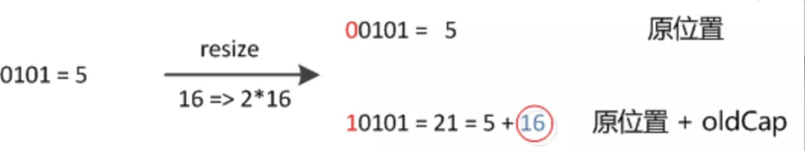
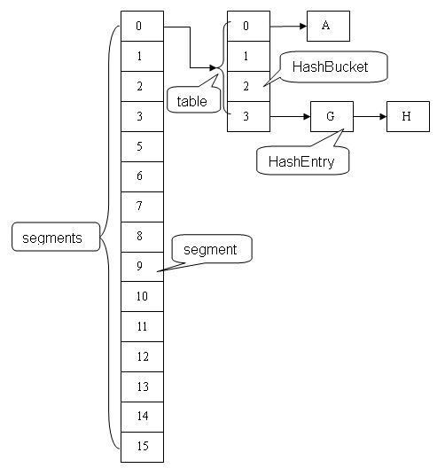

# 面试宝典 - Java

```
1.Java 泛型
2.Java 代理
	2.1.代理模式
	2.2.三种代理模式
		2.2.1.静态代理
		2.2.2.动态代理
		2.2.3.Cglib 代理
3.Java 反射
	3.1.用途
	3.2.反射原理
	3.3.创建类实例的三种方式
	3.4.反射机制的相关类
	3.5.在 Java 反射中 Class.forName 和 ClassLoader 的区别
4.Java 注解
	4.1.元注解
	4.2.注解的属性
	4.3.JDK 提供的注解
	4.4.注解作用与应用
5.Collection 与 Collections
6.ArrayList 与 LinkedList
	6.1.ArrayList 与 LinkedList 的区别
7.String、StringBuffer 与 StringBuilder 的区别
	7.1.区别
	7.2.总结
8.Queue 的 add 与 offer 的区别
	8.1.add() 和 offer() 区别
	8.2.poll() 和 remove() 区别
	8.3.element() 和 peek() 区别
9.List 的 remove 问题
	9.1.问题
	9.2.解决方法
10.Map
	10.1.HashMap
		10.1.1.put() 方法
			HashMap 的数组长度为什么一定要保持为 2 的次幂？
		10.1.2.get()
		10.1.3.JDK 1.7 和 JDK 1.8 HashMap 的区别
		10.1.4.总结
	10.2.HashMap 和 HashTable 的区别
		10.2.1.HashMap、HashTable、ConcurrentHashMap
		10.2.2.HashTable 和 HashMap 区别
		10.2.3.能否让 HashMap 同步
	10.3.ConcurrentHashMap
		10.3.1.ConcurrentHashMap 为什么高效？
		10.3.2.ConcurrentHashMap 与 HashMap 等区别
		10.3.3.JDK 1.7 版本的 ConcurrentHashMap 的实现原理
			10.3.3.1. Segment(分段锁)-减少锁的粒度
			10.3.3.2.内部结构
			10.3.3.3.该结构的优劣势
		10.3.4.JDK 1.8 版本的 ConcurrentHashMap 的实现原理
		10.3.5.ReentrantLock 与 Synchronized 有什么区别
		10.3.6.JDK 1.7 和 JDK 1.8 的 ConcurrentHashMap 总结
	10.4. JDK 1.7 ConcurrentHashMap 的源码分析 *（未整理）
	10.5. JDK 1.8 ConcurrentHashMap 的源码分析 *（未整理）
11. 线程
	11.1. Executor、Executors、ExecutorService 知识
		11.1.1. Executor vs ExecutorService vs Executors
		11.1.2. 自定义线程池
		11.1.3. 比较 Executor 和 new Thread()
	11.2. AtomicBoolean
		11.2.1. 为什么使用 AtomicBoolean?
		11.2.2. AtomicBoolean 的源码分析
		11.2.3. CAS 原理
		11.2.4. unsafe 的知识
	11.3. 同步的知识
		11.3.1.内存模型的相关概念
		11.3.2.并发编程中的三个概念
			11.3.2.1.原子性
			11.3.2.2.可见性
			11.3.2.3.有序性
		11.3.3.Java 内存模型（JMM）
		11.3.4.Java 语言本身对原子性、一致性以及有序性提供的保证
			11.3.4.1.原子性
			11.3.4.2.可见性
			11.3.4.3.有序性
		11.3.5.锁的互斥与可见性
	11.4.volatile 知识
		11.4.1.volatile 定义
		11.4.2.volatile 的内存语义
		11.4.3.volatile 的特性
		11.4.4.volatile 的原理和实现机制
			11.4.4.1.lock 指令
			11.4.4.2.缓存一致性
			11.4.4.3.volatile 禁止重排序
		11.4.5.volatile 与 synchronized
		11.4.6.volatile 的使用条件
		11.4.7.开销较低的读写锁策略（使用volatile实现）
		11.4.8.双重检查（double-cheched）(安全的单例模式)
	11.5.synchronized 知识
		11.5.1.synchronized 的三种使用方式
		11.5.2.synchornized 的使用案例
		11.5.3.synchornized 关键字底层原理
		11.5.4.JDK 1.6 之后的底层优化
		11.5.5.synchornized 和 ReentrantLock 的对比
		11.5.6.synchronized 的优势
		11.5.7.应用场景
	11.6. Condition 知识
		11.6.1. Condition 与 Object 监视器对比
		11.6.2.Condition api *（未整理）
		11.6.3.Condition 具体实现分析 *（未整理）
		11.6.4.Condition 使用示例 *（未整理）
	11.7. 锁的知识
		11.7.1. AQS
		11.7.2. CAS
		11.7.3. 乐观锁 VS 悲观锁
			11.7.3.1. 乐观锁
			11.7.3.2. 悲观锁
			11.7.3.3. 悲观锁与乐观锁的调用
		11.7.4.自旋锁 vs 适应性自旋锁
		11.7.5.无锁 vs 偏向锁 vs 轻量级锁 vs 重量级锁
			11.7.5.1.无锁
			11.7.5.2.偏向锁
			11.7.5.3.轻量级锁
			11.7.5.4.重量级锁
		11.7.6.公平锁 vs 飞公平锁
			11.7.6.1.Java 中的公平锁和非公平锁
		11.7.7.可重入锁 vs 非可重入锁
			11.7.7.1.Java 中的可重入锁
		11.7.8.独享锁 vs 共享锁
			11.7.8.1.Java 中的独享锁和共享锁
		11.7.9.互斥锁/读写锁
		11.7.10.分段锁
		11.7.11.锁粗化/锁消除
	11.8.Java 中常见的锁
	11.9.死锁
		11.9.1.Java 死锁产生的四个必要条件
		11.9.2.解决死锁的方法
			11.9.2.1.死锁预防
			11.9.2.2.死锁避免
			11.9.2.3.死锁检测
	11.10.使用 synchronized、wait、notifyAll 实现生产者-消费者模式
	11.11.使用信号量实现生产者-消费者模式 *（未整理）
	11.12.使用管程实现生产者-消费者模式*（未整理）
	11.13.哲学家就餐问题
	11.14.读者写者问题
12.JVM
	12.1.JVM 运行时数据区
		12.1.1.程序计数器
		12.1.2.Java 虚拟机栈
		12.1.3.本地方法栈
		12.1.4.Java 堆
		12.1.5.方法区
		12.1.6.运行时常量池
		12.1.7.直接内存
	12.2.什么情况下会发生栈内存溢出
	12.3.JVM 的内存结构，Eden 和 Survivor 比例
		12.3.1.为什么会有年轻代
		12.3.2.年轻代中的 GC
		12.3.3.有关年轻代的 JVM 参数
	12.4.JVM 内存为什么要分成新生代、老年代、持久代。新生代中为什么要分为 Eden 和 Survivor。
	12.5.JVM 中一次完整的 GC 流程是怎么样的，对象如何晋升到老年代，说说你知道的几种主要的 JVM 参数。
	12.6.讲下 CMS 和 G1，包括原理、流程、优缺点*
	12.7.垃圾回收算法的实现原理
		12.7.1.哪些内存需要回收？
		12.7.2.引用计数算法
			12.7.2.1.算法分析
			12.7.2.2.优缺点
		12.7.3.可达性分析算法
		12.7.4.Java 中的引用
		12.7.5.对象死亡（被回收）前的最后一次挣扎
		12.7.6.方法区如何判断是否需要回收
	12.8.常用的垃圾手机算法
		12.8.1.标记-清除算法
		12.8.2.标记-复制算法
		12.8.3.标记-整理算法
		12.8.4.分代收集算法
			12.8.4.1.年轻代（Young Generation）的回收算法
			12.8.4.2.年老代（Old Generation）的回收算法
			12.8.4.3.持久代（Permanent Generation）的回收算法
	12.9.常见的垃圾收集器
	12.10.GC 是什么时候触发的
		12.10.1.Scavenge GC
		12.10.2.Full GC
	12.11.当出现了内存溢出，你怎么排错
		12.11.1.年老代堆空间被占满
		12.11.2.持久代被占满
		12.11.3.堆栈溢出
		12.11.4.线程堆栈满
		12.11.5.系统内存被占满
	12.12.JVM 内存模型的相关知识了解多少，比如重排序、内存屏障、happen-before、主内存、工作内存等
		12.12.1.并发编程模型的分类
		12.12.2.Java 内存模型的抽象
		12.12.3.重排序
		12.12.4.处理器重排序与内存屏障指令
		12.12.5.happens-before
		12.12.6.什么是 Memory Barrier(内存屏障)？
		12.12.7.抽象结构
13.简单说说你了解的类加载器，可以打破双亲委派吗？怎么打破 *（打破未整理）
	13.1.类的加载过程
	13.2.类的初始化
	13.3.类的加载
	13.4.加载器
14.讲讲 JAVA 的反射机制
15.Java 类加载的方式
	15.1.三种类加载方式
	15.2.三者的区别
	15.3.Class.forName 与 ClassLoader.loadClass 区别
16.Java 对象的创建过程
	16.1.类加载检查
	16.2.分配内存
	16.3.初始化零值
	16.4.设置对象信息
	16.5.构造函数
17.线上应用的 JVM 参数有哪些？
18.g1 和 CMS 区别，吞吐量优先和响应优先的垃圾收集器选择
19.怎么打出线程栈信息
20.类加载机制		
```


## 1. Java 泛型

　　Java 泛型（generic）是 JDK 5 中引入的一个新特性，泛型提供了编译时类型安全检测机制，该机制允许程序员在编译时检测非法的类型。使用泛型机制编写的程序代码要比那些杂乱地使用 Object 变量，然后再进行强制类型转换地代码具有更好的安全性和可读性。泛型对于集合类尤其有用，例如，ArrayList 就是一个无处不在的集合类。

　　泛型的本质是参数化类型，也就是所操作的数据类型被指定为一个参数。

　　参数化类型就是将类型由原来的具体的类型参数化，类似于方法中的变量参数，此时类型也定义成参数形式（可以称之为类型形参）。

　　在使用 / 调用时传入具体的类型（类型实参）。

　　泛型的本质是为了参数化类型，在不创建新的类型情况下，通过泛型指定的不同类型来控制形参具体限制的类型。

　　操作的数据类型被指定为一个参数，这种参数类型可以用在类、接口和方法中，分别被称为泛型类、泛型接口、泛型方法。

* 泛型的特性：泛型只在编译阶段有效。

  在编译之后程序会采取去泛型化的措施。也就是说 Java 中的泛型，只在编译阶段有效。在编译过程中，正确检验泛型结果后，会将泛型的相关信息擦除，并且在对象进入和离开方法的边界处添加类型检查和类型转换的方法。也就是说，泛型信息不会进入到运行时阶段。

  对此总结成一句话：泛型类型在逻辑上看成是多个不同的类型，实际上都是相同的数据结构。

```java
List<String> stringArrayList = new ArrayList<String>();
List<Integer> integerArrayList = new ArrayList<Integer>();

Class classStringArrayList = stringArrayList.getClass();
Class classIntegerArrayList = integerArrayList.getClass();

if(classStringArrayList.equals(classIntegerArrayList)){
    Log.d("泛型测试","类型相同"); // 输出 泛型测试：类型相同
}
```

## 2. Java 代理

### 2.1. 代理模式

　　代理（Proxy）是一种设计模式。提供了间接对目标对象进行访问的方式，即通过代理对象访问目标对象。这样做的好处是：可以在目标对象实现的基础上，增强额外的功能操作，即扩展目标对象的功能。

　　这就符合了设计模式的开闭原则，即在对既有代码不改动的情况下进行功能的扩展。

　　这里使用到编程的一个思想：不要随意去修改别人已经写好的代码或者方法，如果需修改，可以通过代理的方式来扩展该方法。

　　代理模式的关键点是：代理对象与目标对象。代理对象是对目标对象的扩展，并会调用目标对象。

### 2.2. 三种代理模式

　　三种代理模式：静态代理、动态代理、Cglib 代理。

#### 2.2.1. 静态代理

　　静态代理在使用时，需要定义接口或者父类，被代理对象与代理对象一起实现相同的接口或者是继承相同的父类。

　　需要注意的是：代理对象与目标对象要实现相同的接口，然后通过调用相同的方法来调用目标对象的方法。

　　在使用静态代理时，被代理对象与代理对象需要一起实现相同的接口或者是继承相同的父类，因此要定义一个接口或抽象类。

* 代码示例

接口：IUserDao.java

```java
/**
 * 接口
 */
public interface IUserDao {
    void save();
}
```

目标对象：UserDao.java

```java
/**
 * 接口实现
 * 目标对象
 */
public class UserDao implements IUserDao{
    @Override
    public void save() {
        System.out.println("----已经保存数据！----");
    }
}
```

代理对象：UserDaoProxy.java

```java
/**
 * 代理对象，静态代理
 */
public class UserDaoProxy implements IUserDao{
    // 接收保存目标对象
    private IUserDao target;
    public UserDaoProxy(IUserDao target){
        this.target = target;
    }

    @Override
    public void save(){
        System.out.println("开始事务...");
        target.save(); // 执行目标对象的方法
        System.out.println("提交事务...");
    }
}
```

测试类：

```java
    public static void main(String[] args) {
        // 目标对象
        UserDao target = new UserDao();
        //代理对象，把目标对象传给代理对象，建立代理关系
        UserDaoProxy proxy = new UserDaoProxy(target);
        proxy.save(); // 执行的是代理的方法
    }
```

* 静态代理总结

1. 优点：可以做到不修改目标对象的功能前提下，对目标功能扩展。
2. 缺点：因为代理对象需要与目标对象实现一样的接口，所以会有很多代理类，类太多。同时，一旦接口增加方法，目标对象与代理对象都要维护。

#### 2.2.2. 动态代理

　　动态代理的主要特点就是能够在程序运行时 JVM 才为被代理对象生成代理对象。

　　动态代理有以下特点：

1. 代理对象，不需要实现接口。
2. 代理对象的生成，是利用 JDK 的 API，动态的在内存中构建代理对象，需要执行创建代理对象/目标对象实现的接口的类型。
3. 动态代理也叫做：JDK 代理、接口代理。

　　常说的动态代理也叫做 JDK 代理也是一种接口代理，JDK 中生成代理对象的代理类就是 Proxy，所在包是 java.lang.reflect。

　　JDK 实现代理只需要使用 Proxy 的 newProxyInstance 方法，该方法需要接收三个参数，完整的写法是：

```java
static Object newProxyInstance(ClassLoader loader, Class<?>[] interfaces,InvocationHandler h )
```

　　注意该方法是在 Proxy 类中是静态方法，且接收的三个参数依次为：

1. ClassLoader load：指定当前目标对象使用类加载器，获取类加载器的方法是固定的。
2. Class< ? >[] interface：目标对象实现的接口的类型，使用泛型方式确认类型。
3. InvocationHandler h：事件处理，执行目标对象的方法时，会触发事件处理器的方法，会把当前执行目标对象的方法作为参数传入。

* 代码实现

```java
/**
 * 创建动态代理对象
 * 动态代理不需要实现接口，但是需要指定接口类型
 */
public class ProxyFactory {

    // 维护一个目标对象
    private Object target;

    public ProxyFactory(Object target) {
        this.target = target;
    }

    // 给目标对象生成代理对象
    public Object getProxyInstance() {
        return Proxy.newProxyInstance(
                target.getClass().getClassLoader(),
                target.getClass().getInterfaces(),
                new InvocationHandler() {
                    @Override
                    public Object invoke(Object proxy, Method method, Object[] args) throws Throwable {
                        System.out.println("开始事务...");
                        Object returnValue = method.invoke(target, args);
                        System.out.println("提交事务...");
                        return returnValue;
                    }
                }
        );
    }
}
```

* 动态代理总结

　　代理对象不需要实现接口，但是目标对象一定要实现接口，否则不能用动态代理，因此这也算是这种方式的缺陷。

#### 2.2.3. Cglib 代理

　　上面的静态代理和动态代理模式有个共同点就是都是要求目标对象是实现一个接口的目标对象，然而并不是任何对象都会实现一个接口，有时候目标对象只是一个单独的对象，并没有实现任何的接口，这个时候就可以使用继承以目标对象子类的方式来实现代理，这种方法就叫做：Cglib 代理。

　　Cglib 代理，也叫做子类代理，它是在内存中构建一个子类对象从而实现对目标对象功能的扩展。

1. JDK 的动态代理有一个限制，就是使用动态代理的对象必须实现一个或多个接口，如果想代理没有实现接口的类，就可以使用 Cglib 实现。
2. Cglib 是一个强大的高性能的代码生成包，它可以在运行期扩展 java 类与实现 java 接口。它广泛的被许多 AOP 的框架使用，例如 Spring AOP 和 synaop，为他们提供方法的 interception（拦截）。
3. Cglib 包的底层是通过使用一个字节码处理框架 ASM 来转换字节码并生成新的类。不鼓励直接使用 ASM，因为他要求必须对 JVM 内部接口包括 class 文件的格式和指令集都很熟悉。

　　Cglib 子类代理实现方法：

1. 需要引入 cglib 的 jar 文件。
2. 引入功能包后，就可以在内存中动态创建子类。
3. 代理的类不能为 final，否则报错。
4. 目标对象的方法如果为 final static，那么就不会被拦截，即不会执行目标对象额外的业务方法。

　　在 Spring 的 AOP 编程中：如果加入容器的目标对象有实现接口，用 JDK 代理，如果目标对象没有实现接口，用 Cglib 代理。

## 3. Java 反射

　　Java 中创建对象大概有这几种方式：

1. 使用 new 关键字：这是最常见的也是最简单的创建对象的方式。
2. 使用 Clone 的方法：无论何时调用一个对象的 clone 方法，JVM 就会创建一个新的对象，将前面的对象的内容全部拷贝进去。
3. 使用反序列化：当序列化和反序列化一个对象，JVM 会创建一个单独的对象。

　　上边是 Java 中常见的创建对象的三种方式，其实除了上面的三种还有反射。

　　Java 反射机制是在运行状态中，对于任意一个类，都能够知道这个类的所有属性和方法，对于任意一个对象，都能够调用它的任意方法和属性，这种动态获取信息以及动态调用对象方法的功能称为 Java 语言的反射机制。

　　反射就是把 Java 类中各个部分，映射成一个个的 Java 对象，拿到这些对象后可以做一些事情。

### 3.1. 用途

　　在日常的第三方应用开发过程中，经常会遇到某个类的某个成员变量、方法或是属性是私有的或是只对系统应用开放，这时候就可以利用 Java 的反射机制通过反射来获取所需的私有成员或方法。当然，也不是所有的都适合反射。有的类会在最终返回结果的地方对应用的权限进行校验，对于没有权限的应用返回值是没有意义的缺省值，否则返回实际值，这种就起到保护用户的隐私目的，这样通过反射得到的结果与预期不符。

　　一般来说反射是用来做框架的，或者说可以做一些抽象度比较高的底层代码，反射在日常的开发中用到的不多，但是搞懂了反射以后，可以帮助理解框架的一些原理，反射是框架设计的灵魂。

### 3.2. 反射原理

　　要想通过反射获取一个类的信息，首先要获取该类对应的 Class 类实例，Class 类的实例代表了正在运行中的 Java 应用的类和接口。Class 类没有公共的构造方法，Class 类对象是在二进制字节流（一般是 .class 文件，也可通过网络或 zip 包等路径获取）被 JVM 加载时，通过调用类加载器的 defineClass() 方法来构建的。

　　《 深入理解 Java 虚拟机 》一文中介绍，类从被加载到虚拟机内存中开始，到卸载出内存位置，它的整个生命周期包括：加载、连接、初始化、使用、卸载。而 JVM 在加载阶段要完成的 3 件事情中正好有 Class 对象的生成：

1. 通过一个类的全限定名来获取定义此类的二进制字节流。
2. 将这个字节流所代表的静态存储结构转换为方法区的运行时数据结构。
3. 在内存中生成一个代表这个类的 java.lang.Class 对象，作为方法区这个类的各种数据的访问入口。

### 3.3. 创建类实例的三种方式

1. Book.class
2. book1.getClass()
3. Class.forName("Book")

### 3.4. 反射机制的相关类

　　与 Java 反射相关的类如下：

| 类名           | 用途                                               |
| -------------- | -------------------------------------------------- |
| Class 类       | 代表类的实体，在运行的 Java 应用程序中表示类和接口 |
| Field 类       | 代表类的成员变量（成员变量也称为类的属性）         |
| Method 类      | 代表类的方法                                       |
| Constructor 类 | 代表类的构造方法                                   |

**Class 类**

　　一般写的代码是存储在后缀名是 .java 的文件里的，但是被编译后，最终真正去执行的是编译后的 .class 文件。Java 是面向对象的语言，一切皆对象，所以 java 认为这些编译后的 class 文件，这种事物也是一种对象，它也给抽象成了一种类，这个类就是 Class。

　　Class 代表类的实体，在运行的 Java 应用程序中表示类和接口。在这个类中提供了很多有用的方法。

**Field 类**

　　Field 代表类的成员变量（成员变量也称为类的属性）。

**Method 类**

　　Method 代表类的方法。

**Constructor 类**

　　Constructor 代表类的构造方法。

### 3.5. 在 Java 反射中 Class.forName 和 ClassLoader 的区别

**Java 类加载过程**


1. 装载：通过类的全限定名获取二进制字节流，将二进制字节流转换成方法区中的运行时数据结构，在内存中生成 Java.lang.class 对象。

2. 链接：执行下面的校验、准备和解析步骤，其中解析步骤是可以选择的。

* 校验：检查导入类或接口的二进制数据的正确性（文件格式验证、元数据验证、字节码验证、符号引用验证）。
* 准备：给类的静态变量分配并初始化存储空间；
* 解析：将常量池中的符号引用转成直接引用。

3. 初始化：激活类的静态变量的初始化 Java 代码和静态 Java 代码块，并初始化程序员设置的变量值。

**分析 Class.forName() 和 ClassLoader**

　　在 java 中 Class.forName() 和 ClassLoader.loadClass() 都可以对类进行加载。ClassLoader 就是遵循双亲委派模型最终调用启动类加载器的类加载器，实现的功能是 “ 通过一个类的全限定名来获取此类的二进制字节流 ”，获取到二进制流后放到 JVM 中。

　　Class.forName() 方法实际上也是调用的 ClassLoader 来实现的。

**Class.forName 和  ClassLoader 的区别**

1. Class.forName 加载类时将类进行了初始化。
2. ClassLoader 的 loadClass 并没有对类进行初始化，只是把类加载到了虚拟机中。

## 4. Java 注解

　　注解其实就是代码里的特殊标记，它可以用来替代配置文件，也就是说，传统方式通过配置文件告诉类如何运行，有了注解技术后，开发人员可以通过注解告诉类如何运行，可以减少项目的配置文件，使代码看起来更优雅。在 Java 技术里注解的典型应用是：可以通过反射技术去得到类里面的注解，以决定怎么去运行类。

　　注解可以提供便捷性、易于维护修改，但耦合度高。

### 4.1. 元注解

元注解顾名思义可以理解为注解的注解，或者说元注解是一种基本注解，它是作用在注解的定义上，方便使用注解实现想要的功能。

　　元注解一般用于指定某个注解生命周期以及作用目标等信息。

　　元注解分别有 @Retension、@Target、@Document、@Inherited 和 @Repeatable（JDK 1.8 加入）五种。

* @Retension：表示注解存在阶段是保留在源码（编译期）、字节码（类加载）或者运行期（JVM 中运行），即这个注解的存活时间。
* @Target：使用 @Target 元注解标识注解作用的范围，可以是类、方法、方法参数变量等，同样也是通过枚举类 ElementType 表达作用类型，指定了注解运用的地方。
* @Document：它的作用是能够将注解中的元素包含到 Javadoc 中去。
* @Inherited：一个被 @Inherited 注解了的注解修饰了一个父类，如果它的子类没有被其他注解修饰，则它的子类也继承了父类的注解。
* @Repeatable：说明被这个元注解修饰的注解可以同时作用一个对象多次，但是每次作用注解又可以代表不同的含义。

### 4.2. 注解的属性

注解的属性其实和类中定义的变量有异曲同工之处，只是注解中的变量都是成员变量（属性），并且注解中是没有方法的，只有成员变量，变量名就是使用注解括号中对应的参数名，变量类型是注解括号中对应参数类型。而 @Repeateable 注解中的变量的类型则是对应 Annotation（接口）的泛型 Class。

* 注解的本质就是一个继承了 Annotation 接口的接口。
* 注解属性类型可以有以下列出的类型：基本数据类型、String、枚举类型、注解类型、Class 类型、以上类型的一维数组类型。
* AnnotationInvocationHandler 是 JAVA 中专门用来处理注解的 Handler。

整个反射注解的工作原理：

1. 首先，通过键值对的形式可以为注解属性赋值，像这样：@Hello（value = "hello"）
2. 接着，用注解修饰某个元素，编译器将扫描每个类或者方法上的注解，会做一个基本的检查，比如这个注解是否允许作用在当前位置，最后会将注解信息写入元素的属性表。
3. 然后，当进行反射的时候，虚拟机将所有生命周期在 RUNTIME 的注解取出来放到一个 map 中，并创建一个 AnnotationInvocationHandler 实例，把这个 map 传递给它。
4. 最后，虚拟机将采用 JDK 动态代理机制生成一个目标注解的代理类，并初始化好处理器。

### 4.3. JDK 提供的注解

* @Override：用来描述当前方法是一个重写的方法，在编译阶段对方法进行检查。
* @Deprecated：用来描述当前方法是一个过时的方法。
* @SuppressWarning：对程序中的警告去除。
* @SafeVarargs：参数安全类型注解。目的是提醒开发者不要用参数做一些不安全的操作，它的存在会组织编译器产生 unchecked 这样的警告。
* @FunctionalInterface：函数式接口注解，这个是 Java 1.8 版本引入的新特性。

### 4.4. 注解作用与应用

　　Java 注解用于为 Java 代码提供元数据。作为元数据，注解不直接影响代码执行，但也有一些类型的注解实际上可以用于这一目的。

　　它存活的时间、作用的区域都可以由用户方便设置。

​		作为一个 Android 开发者，平常所使用的第三方框架 ButterKnife、Retrofit2、Dagger2 等都有注解的应用，如果要了解这些框架的原理，则注解的基础只是则是必不可少的。

* 注解的作用

  注解是一系列元数据，它提供数据用来解释程序代码，但是注解并非是所解释的代码本身的一部分。注解对于代码的运行效果没有直接影响。

  1. 提供信息给编译器：编译器可以利用注解来检查出错误或者警告信息，打印出日志。
  2. 编译阶段时的处理：软件工具可以用来利用注解信息来自动生成代码、文档或做其他相应的自动处理。
  3. 运行时处理：某些注解可以在程序运行的时候接受代码的提取，自动做相应的操作。
  4. 注解能够提供原数据，转账例子中处理获取注解值的过程是开发者直接写的注解提取逻辑，处理提取和处理 Annotation 的代码统称为 APT（Annotation Processing Tool）。

## 5. Collection 与 Collections

* Collection：供了对集合对象进行基本操作的通用接口方法。Collection 接口在 Java 类库中有很多具体的实现。Collection 接口的意义是为各种具体的集合提供了最大化的统一操作方式。

  Collection 是 List、Set 的父类。

* Collections：一个 util 包下的工具类，其类不能被实例化，提供了许多实用的 static 方法。

  　常用的方法有：

  1. Collections.sort  对集合排序（需要实现 int compareTo）

  2. Collections.synchronizedMap   返回一个线程安全的 map

  3. Collections.binarySearch   二分查找一个元素

  4. Collections.shuffle   对集合进行随机排序（就是指每次排序后都不同）

## 6. ArrayList 与 LinkedList

* ArrayList：底层是基于动态数组，根据下标随机访问数组元素的效率高，向数组尾部添加元素的效率高；但是，删除数组中的数据以及向数组中间添加数据效率低，因为需要移动数组。
* LinkedList：基于链表的动态数组，数据添加删除效率高，只需要改变指针指向即可，但是访问数据的平均效率低，需要对链表进行遍历。

### 6.1. ArrayList 与 LinkedList 的区别

1. ArrayList 是基于动态数组的数据结构，LinkedList 是基于链表的数据结构。（LinkedList 是双向链表，有 next 也有 previous）。

2. 对于随机访问 get 和 set，ArrayList 要优于 LinkedList，因为 LinkedList 要移动指针。

   ArrayList 是线性表（数组），get() 直接读取第几个下标，复杂度 O(1)。

   LinkedList 是链表的操作，get() 获取第几个元素，依次遍历，复杂度O(n)。

3. 对于新增和删除操作 add 和 remove，LinkedList 比较占优势，因为 ArrayList 要移动数据。

   ArrayList：add(E) 添加元素，直接在后面添加，复杂度 O(1)；
   add(index,E) 添加元素，在第几个元素后面插入，后面的元素需要向后移动，复杂度 O(n)；remove() 删除元素，后面的元素需要逐个移动，复杂度 O(n)。

   LinkedList：add(E) 添加到末尾，复杂度0(1)；add(index,E) 添加第几个元素后，需要先查找到第几个元素，直接指针指向操作，复杂度 O(n)；remove() 删除元素，直接指针指向操作，复杂度 O(1)。

## 7. String、StringBuffer 与 StringBuilder 的区别

　　String、StringBuilder 与 StringBuffer 都是 Java 用来处理字符串的类，并且都是 final 类，不允许被继承。

### 7.1. 区别

　　区别主要在于两个方面，即运行速度和线程安全两个方面。

**运行速度**

　　运行速度，也可以说是执行速度。这三者的运行速度从快到慢是：StringBuilder > StringBuffer > String。

　　String 运行速度最慢的原因与 String 的特性有关。String 是字符串常量，即 String 对象一旦创建之后该对象不可更改。对 String 进行操作就是一个不断创建新的对象并将旧的对象回收的过程，这导致效率低，并且会创建大量的内存，所以执行速度很慢。

　　而 StringBuilder 和 StringBuffer 的对象是变量，对变量进行操作就是直接对该对象进行更改，而不进行创建和回收操作，不会创建新的未使用对象，所以速度比 String 快很多。

　　而 StringBuilder 比 StringBuffer 快的原因是，StringBuffer 是需要同步的，所以执行速度慢。

**线程安全**

　　在线程安全上，StringBuilder 是线程不安全的，而 StringBuffer 是线程安全的。

　　如果一个 StringBuffer 对象在字符串缓冲区被多个线程使用时，StringBuffer 中很多方法带有 synchronized 关键字，所以可以保证线程是安全的，但 StringBuilder 的方法则没有该关键字，所以不能保证线程安全，有可能会出现一些错误的操作。所以如果要进行的操作是多线程的，那么就要使用 StringBuffer，但是在单线程的情况下，还是建议使用速度比较快的 StringBuilder。

**其他区别**

* 实现接口

　　StringBuffer 与 StringBuilder 实现了 Serializable 和 CharSequare 两个接口，String 除了这两个接口，还实现了 Comparable< String > 接口，所以 String 的实例可以通过 compareTo 方法进行比较，而 StringBuffer 与 StringBuilder 不行。

* 初始化

　　String 可以给字符空赋值，而 StringBuffer 和 StringBuilder 是不可以给字符赋 null 的。

### 7.2. 总结

1. **String：**适用于少量的字符串操作的情况。
2. **StringBuilder：**适用单线程下在字符缓冲区进行大量操作的情况。
3. **StringBuffer：**使用多线程下在字符缓冲区进行大量操作的情况。

## 8. Queue 的 add 与 offer 的区别

### 8.1. add() 和 offer() 区别

add() 和 offer()都是向[队列](https://so.csdn.net/so/search?q=队列&spm=1001.2101.3001.7020)中添加一个元素。一些队列有大小限制，因此如果想在一个满的队列中加入一个新项，调用 add() 方法就会抛出一个 unchecked 异常，而调用 offer() 方法会返回 false。因此就可以在程序中进行有效的判断！

### 8.2. poll() 和 remove() 区别

remove() 和 poll() 方法都是从队列中删除第一个元素。如果队列元素为空，调用 remove() 的行为与 Collection 接口的版本相似会抛出异常，但是新的 poll() 方法在用空集合调用时只是返回 null。因此新的方法更适合容易出现异常条件的情况。

### 8.3. element() 和 peek() 区别

element() 和 peek() 用于在队列的头部查询元素。与 remove() 方法类似，在队列为空时， element() 抛出一个异常，而 peek() 返回 null。

## 9. List 的 remove 问题

### 9.1. 问题

循环时，删除某个元素后，因为删除元素后，后面的元素都往前移动了一位，而你的索引+1，所以实际访问的元素相对于删除的元素中间间隔了一位。

* 使用for循环不进行额外处理时（**错误**）

```java
//错误的方法
for(int i=0;i<list.size();i++) {
	if(list.get(i)%2==0) {
		list.remove(i);
	}
}
```

* 使用 foreach 循环（**错误**）

```java
for(Integer i:list) {
    if(i%2==0) {
     	list.remove(i);
    }
}
```

上面的两种情况都会抛出异常：java.util.ConcurrentModificationException。

### 9.2. 解决方法

* 使用 for 循环，并且同时改变索引；（**正确**）

```java
//正确
for(int i=0;i<list.size();i++) {
	if(list.get(i)%2==0) {
		list.remove(i);
		i--;//在元素被移除掉后，进行索引后移
	}
}
```

* 使用 for 循环，倒序进行；（**正确**）

```java
//正确
for(int i=list.size()-1;i>=0;i--) {
	if(list.get(i)%2==0) {
		list.remove(i);
	}
}
```

* 使用 while 循环，删除了元素，索引便不 +1，在没删除元素时索引 +1（**正确**）

```java
//正确
int i=0;
while(i<list.size()) {
	if(list.get(i)%2==0) {
		list.remove(i);
	}else {
		i++;
	}
}
```

* 使用迭代器方法（**正确,推荐**）

  只能使用**迭代器的** remove() 方法，使用**列表的** remove() 方法是错误的

```java
//正确，并且推荐的方法
Iterator<Integer> itr = list.iterator();
while(itr.hasNext()) {
	if(itr.next()%2 ==0)
		itr.remove();
}
```

## 10. Map * 

### 10.1. HashMap

HashMap 由数组 + 链表组成，数组是 HashMap 的主体，链表则是主要为了解决哈希冲突的。

HashMap 继承 AbstractMap，并且实现 Map、Cloneable、Serializable 接口。

HashMap 的主干是一个 Entry 数组。Entry 是 HashMap 的基本组成单元，每一个 Entry 包含一个 key-value 键值对。 

```java
    /**
     HashMap 的主干是一个 HashMapEnter 数组，初始值是空数组，数组的长度必须是 2 的倍数。
     */
   transient Entry<K,V>[] table = (Entry<K,V>[]) EMPTY_TABLE;

    /**
     映射表包含的 key-value 映射的数量。
     */
    transient int size;

    /**
    阈值，当 table == {} 时，该值为初始容量（初始容量默认为 16）；当 table 被填充了，也就是为 table 分配内存空间后，threshold 一般为 capacity * loadFactory。HashMap 在进行扩容时需要参考 threshold。capacity 是指定的表大小的最小 2 的幂次方整数，必然是 2 的整数。
    */
    int threshold;

    /** 
    负载因子，代表了 table 的填充度是多少，默认是 0.75。
    */
    final float loadFactor;
```

HashMap 有 4 个构造函数，无参构造函数和一个 initialCapacity 参数的构造函数都会调用 HashMap(int initialCapacity, float loadFactor) 这个构造函数。还有一个构造函数的参数是 Map。

```java
    public HashMap(int initialCapacity, float loadFactor) { 
    		// 当指定的初始容量 < 0 时抛出 IllegalArgumentException 异常
       	if (initialCapacity < 0)
            throw new IllegalArgumentException("Illegal initial capacity: " +
                                               initialCapacity);
        // 当指定的初始容量 > MAX_CAPACITY 时，就让初始容量 = MAX_CAPACITY
        if (initialCapacity > MAXIMUM_CAPACITY)
            initialCapacity = MAXIMUM_CAPACITY;
        // 当负载因子小于等于 0 或者不是数字时，抛出 IllegalArgumentException 异常
        if (loadFactor <= 0 || Float.isNaN(loadFactor))
            throw new IllegalArgumentException("Illegal load factor: " +
                                               loadFactor);

        this.loadFactor = loadFactor;
        // 设置 threshold 初始为 initialCapacity。
        threshold = initialCapacity;
        init();//空方法
        
    }
```

#### 10.1.1. put() 方法

```java
    public V put(K key, V value) {
    		// 如果 table 数组为空数组{}，进行数组填充（为 table 分配实际内存空间），参数为 threshold
        if (table == EMPTY_TABLE) {
						// 初始化映射数组
            inflateTable(threshold); // 3.2 解析方法
        }
				// 允许 key 为 null，如果 key 为 null，存储位置为 table[0] 或 table[0] 的冲突链
        if (key == null)
            return putForNullKey(value);
				// 对 key 的 hashcode 进行进一步计算得到 hash 数值，确保散列均匀
        int hash = hash(key); // 4.1 解析方法
				// 获取存储数据的数组下标
        int i = indexFor(hash, table.length); // 4.2 解析方法
				// 如果已经有 key 对应的数据，则覆盖，并返回旧的 value
        for (Entry<K,V> e = table[i]; e != null; e = e.next) {
            Object k;
            if (e.hash == hash && ((k = e.key) == key || key.equals(k))) {
                V oldValue = e.value;
                e.value = value;
                e.recordAccess(this);
                return oldValue;
            }
        }
				// 保证并发访问时，若 HashMap 内部结构发生变化，快速响应失败
        modCount++;
				// 创建新的 HashMapEntry 结构，插入到合适的位置
        addEntry(hash, key, value, i); //4.3 解析方法
        return null;
    }
```

在 put 方法中，如果数组还是空的，则会调用 inflateTable() 方法初始化数组，所以在除去 map 参数的构造方法外，其他的构造方法会在 put() 方法中初始化数据。

*  hash(Object k) 方法

```java
   // 对 key 的 hashcode 进一步进行计算以及二进制位的调整等来保证最终获取的存储位置尽量分布均匀
   final int hash(Object k) {
        int h = hashSeed;
        if (0 != h && k instanceof String) {
            return sun.misc.Hashing.stringHash32((String) k); // 4.1.1 解析方法
        }
        h ^= k.hashCode();
 
        h ^= (h >>> 20) ^ (h >>> 12);
        return h ^ (h >>> 7) ^ (h >>> 4);
    }
```

HashMap 的 hash() 方法对 key 的 hashCode() 继续进行了一些运算，这样是为了保证最终的哈希位置尽可能分布均匀。

* indexFor(int h, int length) 方法

```java
    static int indexFor(int h, int length) {
				// 下标是 hash & (数组长度-1)
        return h & (length-1);
    }
```

　　h & (length-1) 保证获取的 index 一定在数组范围内。位运算对计算机来说，性能更高一些（HashMap 中有大量位运算）。

　　所以最终存储位置确认流程为：


*  addEnter() 方法

```java
    void addEntry(int hash, K key, V value, int bucketIndex) {
    		// 如果 size 超过了阈值，则将数组的大小扩充为当前的两倍，也就是扩容
        if ((size >= threshold) && (null != table[bucketIndex])) {
            // 数组被扩大为原来的二倍
            resize(2 * table.length); // 4.3.1 解析方法
            hash = (null != key) ? hash(key) : 0;
            bucketIndex = indexFor(hash, table.length); // 4.2 解析方法
        }

        createEntry(hash, key, value, bucketIndex); // 3.3.1.1 解析方法
    }
```

当 HashMap 的 size 大于或等于 threshold ，就要进行 resize，也就是扩容。

```java
    // 数组扩容后，重新调整位置
    void transfer(Entry[] newTable, boolean rehash) {
        int newCapacity = newTable.length;
        // for 循环中的代码，逐个遍历链表，重新计算索引位置，将老数组数据复制到新数组中去（数组不存储实际数据，所以仅仅是拷贝引用而已）
        for (Entry<K,V> e : table) {
            while(null != e) {
                Entry<K,V> next = e.next;
                if (rehash) {
                    e.hash = null == e.key ? 0 : hash(e.key);
                }
                int i = indexFor(e.hash, newCapacity);
                // 将当前 entry 的 next 链指向新的索引位置，newTable[i] 有可能为空，有可能也是个 entry 链，如果是 entry 链，直接在链表头部插入
                e.next = newTable[i];
                newTable[i] = e;
                e = next;
            }
        }
    }
```

　　这个方法将老数组中的数据逐个链表的遍历，扔到新的扩容后的数组中，数组索引的计算是通过对 key 的 hashCode 进行 hash 运算后，再通过和 length-1 进行位运算得到最终数组索引位置。

　　当发生哈希冲突并且 size 大于阈值的时候，需要进行数组扩容，扩容时，需要新建一个长度为之前数组 **2** 倍的新数组，然后将当前的 Entry 数组中的元素全部传输过去，扩容后的新数组长度为之前的 2 倍，所以**扩容相对来说是个耗资源的操作**。

##### HashMap 的数组长度为什么一定要保持为 2 的次幂？

1. 扩容后减少数组的移动

将 HashMap 的数组长度保持为 2 的次幂，在扩容后，与之前的 length-1 相比，只有最高位的一位差异，这样在通过 h & (length-1) 的时候，只要 h 对应的最高位的一位的差异位为 0 ，就能保证得到的新的数组索引和老数组索引一致（减少了之前已经散列好的老数组的数据位置重新调换。）

2. 使索引更加均匀

数组长度保持 2 的次幂，length-1 的低位都为 1，会使得获得的数组索引 index 更加均匀。高位不会对结果产生影响，但是对于 h  的低位部分，任何一位的变化都会对结果产生影响。

#### 10.1.2. get() 方法

```java
    public V get(Object key) {
        // 如果 key 为 null，则直接去 tab[0] 处去检索即可。
        if (key == null)
            return getForNullKey();
        Entry<K,V> entry = getEntry(key); // 5.1 解析方法

        return null == entry ? null : entry.getValue();
    }
```

get 方法通过 key 值返回对应 value，如果 key 为 null，则直接去 table[0] 处检索，如果不为 null，则调用 getEntry(key) 获取。

* getEntry(Object key) 方法

```java
    final Entry<K,V> getEntry(Object key) {
        if (size == 0) {
            return null;
        }
        // 通过 key 的 hashCode 值计算 hash 值
        int hash = (key == null) ? 0 : sun.misc.Hashing.singleWordWangJenkinsHash(key); // 5.2 解析方法
				// 循环遍历下标下面的链表
        // indexFor (hash&length-1) 获取最终数组索引，然后遍历链表，通过 equals 方法比对找出对应记录
        for (HashMapEntry<K,V> e = table[indexFor(hash, table.length)];
             e != null;
             e = e.next) {
            Object k;
						//注意这里的判断，hash 要相同，key 值也要相同才会返回 value。
            if (e.hash == hash &&
                ((k = e.key) == key || (key != null && key.equals(k))))
                return e;
        }
        return null;
    }
```

getEntry 方法，先通过 key 计算得到 hash 值，然后调用 indexFor 得到 key 对应哈希表的下标，然后遍历哈希表对应的 key 的 Entry 链表，如果 e 的 hash 相同并且 key 值也相同，则返回 e，否则就是没找到，返回 null。

HashMapEntry 结构的 hash 值是将 key 的 hashCode() 值进行一系列的位移操作作为 hash 值的。

在根据 key 值获取对应的值时，判断时需要 hash 值相同，并且 key 值相同才判断为是同一个 key 值，为什么除了判断 key 值相同还要保证 hash 值相同，这是因为如果传入的 key 对象重写了 equals 方法却没有重写 hashCode ，而恰巧此对象定位到这个数组位置，如果仅仅用 equals 判断可能是相等的，但其 hashCode 和当前对象时不一致的，这种情况，根据 Object 的 hashCode 的约定，不能返回当前对象，而应该返回 null。

#### 10.1.3. JDK 1.7 和 JDK 1.8 HashMap 的区别

1. **JDK 1.8 是数组 + 链表 + 树的结构，JDK 是 数组 + 链表的结构。**

   JDK 1.8 在 JDK 1.7 在基础上增加了红黑树来进行优化，即当链表超过 **TREEIFY_THRESHOLD（默认为 8）** 时，将链表转换为红黑树，利用红黑树快速增删改查的特点提高 HashMap 的性能，其中会用到红黑树的插入、删除、查找等算法。当小于 **UNTREEIFY_THRESHOLD(默认为6)** 时，又会转回链表以达到性能均衡。

   ```java
       // Java 1.8 put 方法的具体实现
       final V putVal(int hash, K key, V value, boolean onlyIfAbsent,
                      boolean evict) {
           Node<K,V>[] tab; Node<K,V> p; int n, i;
           // 如果 table 为空或者长度为 0，则 resize()
           if ((tab = table) == null || (n = tab.length) == 0)
               n = (tab = resize()).length;
           // 确定插入 table 的位置，算法是 （n-1）&hash，在 n 为 2 的幂时，相当于取模操作。
           // 找到 key 值对应的槽并且是第一个，直接加入
           if ((p = tab[i = (n - 1) & hash]) == null)
               tab[i] = newNode(hash, key, value, null);
           // 在 table 的 i 位置发生碰撞，有两种情况：
         	// 1.key 值是一样的，替换 value 值
           // 2.key 值不一样的有两种处理方式：
         	//   2.1. 存储在 i 位置的链表；
         	//   2.2. 存储在红黑树中
           else {
               Node<K,V> e; K k;
               // 第一个 node 的 hash 值即为要加入元素的 hash
               if (p.hash == hash &&
                   ((k = p.key) == key || (key != null && key.equals(k))))
                   e = p;
               // 2.2 如果节点是树节点
               else if (p instanceof TreeNode)
                   e = ((TreeNode<K,V>)p).putTreeVal(this, tab, hash, key, value);
               else {
               	// 2.1 不是 TreeNode，即为链表，遍历链表
                   for (int binCount = 0; ; ++binCount) {
                 			// 链表的尾端也没有找到 key 值相同的节点，则生成一个新的 node
                 			// 并且判断链表的结点个数是不是到达转换成红黑树的上限，达到则转换成红黑树
                       if ((e = p.next) == null) {
                       	// 将新数据插入到链表的最末端，尾插法
                           p.next = newNode(hash, key, value, null);
                           // TODO 新添加一个数据之后，如果数据的数量已经超过了或者等于 TREEIFY_THRESHOLD - 1 就会将链表转换成红黑树
                           //static final int TREEIFY_THRESHOLD = 8;
                           if (binCount >= TREEIFY_THRESHOLD - 1) // -1 for 1st
                               treeifyBin(tab, hash);
                           break;
                       }
                       if (e.hash == hash &&
                           ((k = e.key) == key || (key != null && key.equals(k))))
                           break;
                       p = e;
                   }
               }
               // 如果 e 不为空就替换旧的 oldValue 值
               if (e != null) { // existing mapping for key
                   V oldValue = e.value;
                   if (!onlyIfAbsent || oldValue == null)
                       e.value = value;
                   afterNodeAccess(e);
                   return oldValue;
               }
           }
           ++modCount;
         	// 扩容
           if (++size > threshold)
               resize();
           afterNodeInsertion(evict);
           return null;
       }
   ```

　　hash 冲突发生的几种情况：

(1) 两节点 key 值相同（hash 值一定相同），导致冲突；

(2) 两节点 key 值不同，由于 hash 函数的局限性导致 hash 值相同，冲突；

(3) 两节点 key 值不同，hash 值不同，但是 hash 值对数组长度取模后相同（hash&(length-1)），冲突。

2. **hash() 方法不同**

```java
// JDK 1.8
		static final int hash(Object key) {
        int h;
        return (key == null) ? 0 : (h = key.hashCode()) ^ (h >>> 16);
    }
```

```java
	 // JDK 1.7
	 // 对 key 的 hashcode 进一步进行计算以及二进制位的调整等来保证最终获取的存储位置尽量分布均匀
   final int hash(Object k) {
        int h = hashSeed;
        if (0 != h && k instanceof String) {
            return sun.misc.Hashing.stringHash32((String) k); // 4.1.1 解析方法
        }
        h ^= k.hashCode();
 
        h ^= (h >>> 20) ^ (h >>> 12);
        return h ^ (h >>> 7) ^ (h >>> 4);
    }
```

　　JDK 1.8 的 hash() 方法可以将 hashCode 的高位和低位的值进行混合做异或运算，而且混合后，低位的信息中加入了高位的信息，这样高位的信息被保留了下来。掺杂的元素多了，那么生成的 hash 值的随机性会增大。

　　JDK 1.7 的 hash() 方法是将 key 的 hashCode 值进行了一系列的位移运算获取的 hash 值。

3. **插入的方式不同**

JDK 1.7 采用的是头插法，而 JDK 1.8 及之后使用的都是尾插法。这是因为 JDK 1.7 是用单链表进行的纵向延伸，采用头插法能够提高插入的效率，但是也会容易出现逆序且环形链表死循环问题。在 JDK 1.8 之后是因为加入了红黑树使用尾插法，能够避免出现逆序且链表死循环的问题。

4. **扩容后数据存储位置的计算方式不同**

　　在 JDK 1.7 的时候是直接用 hash 值和需要扩容的二进制数进行 & 运算（hash 值 & length-1）。

　　而在 JDK 1.8 的时候直接使用了 JDK 1.7 计算的规律，就是扩容前的原始位置 + 扩容的大小值 = JDK 1.8 的计算方式，而不再是 JDK 1.7 的那种异或的方法。凡是这种方式就相当于只需要判断 Hash 值的新增参加运算的位是 0 还是 1 就直接迅速计算出扩容后的存储方式。

JDK 1.8 的 resize() 方法：

```java
    final Node<K,V>[] resize() {
        // 保存当前 table
        Node<K,V>[] oldTab = table;
        // 保存当前 table 的容量
        int oldCap = (oldTab == null) ? 0 : oldTab.length;
        // 保存当前阈值
        int oldThr = threshold;
        // 初始化新的 table 容量和阈值
        int newCap, newThr = 0;
        // 1. resize() 函数在 size > threshold 时被调用。oldCap 大于 0 表示原来的 table 表非空，oldCap 为原表的大小，oldThr(threashold) 为 oldCap * load_factor
        if (oldCap > 0) {
            // 若旧 table 容量已超过最大容量，更新阈值为 Integer.MAX_VALUE(最大整形值)，这样以后就不会自动扩容了。
            if (oldCap >= MAXIMUM_CAPACITY) {
                threshold = Integer.MAX_VALUE;
                return oldTab;
            }
            // 容量翻倍，使用左移，效率更高
            else if ((newCap = oldCap << 1) < MAXIMUM_CAPACITY &&
                     oldCap >= DEFAULT_INITIAL_CAPACITY)
                // 阈值翻倍
                newThr = oldThr << 1; // 阈值*2
        }
        // 2.resize() 函数在 table 为空被调用。oldCap 小于等于 0 且 oldThr 大于 0 ，代表用户创建了一个 HashMap，但是使用的构造函数为 HashMap(int initialCapacity,float loadFactor)或 Hash(int initialCapacoty) 或 HashMap（Map<? extends K,? extends v> m） 导致 oldTab 为 null，oldCap 为 0，oldThr 为用户指定的 HashMap 的初始容量。
        else if (oldThr > 0) // 使用旧值初始化容量
        	// 当 table 没初始化时，threashold 持有初始容量。
            newCap = oldThr;
        // 3. resize() 函数在 table 为空被调用。oldCap 小于等于 0 且 oldThr 等于 0 ，用户调用 HashMap() 构造函数创建的 HashMap，所有值均采用默认值。
        else {               // zero initial threshold signifies using defaults
            newCap = DEFAULT_INITIAL_CAPACITY;
            newThr = (int)(DEFAULT_LOAD_FACTOR * DEFAULT_INITIAL_CAPACITY);
        }
        // 新阈值为 0
        if (newThr == 0) {
            float ft = (float)newCap * loadFactor;
            newThr = (newCap < MAXIMUM_CAPACITY && ft < (float)MAXIMUM_CAPACITY ?
                      (int)ft : Integer.MAX_VALUE);
        }
        threshold = newThr;

        @SuppressWarnings({"rawtypes","unchecked"})
        // 初始化 table
        Node<K,V>[] newTab = (Node<K,V>[])new Node[newCap];
        table = newTab;
        if (oldTab != null) {
            // 把 oldTab 中的节点 reHash 到 newTab 中去
            for (int j = 0; j < oldCap; ++j) {
                Node<K,V> e;
                if ((e = oldTab[j]) != null) {
                    oldTab[j] = null;
                    // 若节点是单个节点，直接在 newTab 中进行重定位
                    if (e.next == null)
                        newTab[e.hash & (newCap - 1)] = e;
                    // 若节点是 ThreeNode 节点，要进行红黑树的 reHash 操作
                    else if (e instanceof TreeNode)
                        ((TreeNode<K,V>)e).split(this, newTab, j, oldCap);
                    else { // preserve order 如果节点是链表节点
                        Node<K,V> loHead = null, loTail = null;
                        Node<K,V> hiHead = null, hiTail = null;
                        Node<K,V> next;
                        // 将同一桶中的元素根据（e.hash & oldCap）是否为 0 进行分割，分成不同的链表，重新 rehash
                        do {
                            next = e.next;
                            // 根据算法，e.hash & oldCap 判断节点位置 rehash 后是否发生改变
                            // 最高位 == 0，这是索引不变的链表
                            if ((e.hash & oldCap ) == 0) {
                                if (loTail == null)
                                    loHead = e;
                                else
                                    loTail.next = e;
                                loTail = e;
                            }
                            // 最高位 == 1（这是索引发生改变的链表）
                            else {
                                // TODO 重新创建高位链表
                                if (hiTail == null)
                                    hiHead = e;
                                else
                                    hiTail.next = e;
                                hiTail = e;
                            }
                        } while ((e = next) != null);

                        if (loTail != null) { // 原 bucket 位置为尾指针不为空（即还有 node）
                            loTail.next = null; // 链表最后有个 null
                            newTab[j] = loHead; // 链表头指针放在新桶的相同下表 j 处
                        }
      
                        if (hiTail != null) {
                            hiTail.next = null;
                            // rehash 后节点新的位置一定为原来基础上加上 oldCap。
                            newTab[j + oldCap] = hiHead; 
                        }
                    }
                }
            }
        }
        return newTab;
    }
```

长度扩展为原来的 2 倍，使用的是 2 次幂的扩展，所以，元素的位置要么是在原位置，要么是在原位置再移动 2 次幂的位置。

元素在重新计算 hash 之后，因为 n 变为 2 倍，那么 n-1 的二进制的高位就多了 1 bit，因此新的 index 就会发生下面变化：



因此，扩容的时候，只需要看原来的 hash 值新增的那个 bit 是 1 还是 0 就好了，是 0 的话索引没变，是 1 的话索引变成->原索引+ oldCap。

5. **将 capacity 设置为 2 的次幂的方式不同**

JDK 1.7 采用的是 roundUpToPowerOf2(int number) 方法：

```java
    private static int roundUpToPowerOf2(int number) {
        int rounded = number >= MAXIMUM_CAPACITY
                ? MAXIMUM_CAPACITY
                : (rounded = Integer.highestOneBit(number)) != 0
                    ? (Integer.bitCount(number) > 1) ? rounded << 1 : rounded
                    : 1;

        return rounded;
    }
```

　　Integer.highestOneBit(number) 返回的是数值的最高位数值，例如 0010 1101 返回的则是 0010 0000，而 Integer.bitCount(number) 返回的是二进制中为 1 的数量，如果最高位数值不为 0 ，并且二进制中 1 的数量也是大于 1 的，那么会返回 rounded << 1 的高一位数值。

　　所以 capacity 一定是 2 的倍数。

JDK 1.8 的是调用 tableSizeFor(int cap) 方法来返回一个比给定整数大且最接近的 2 的幂次方整数的：

```java
    static final int tableSizeFor(int cap) {
    		// 为了防止 cap 已经是 2 的幂次
        int n = cap - 1;
        n |= n >>> 1;
        n |= n >>> 2;
        n |= n >>> 4;
        n |= n >>> 8;
        n |= n >>> 16;
        return (n < 0) ? 1 : (n >= MAXIMUM_CAPACITY) ? MAXIMUM_CAPACITY : n + 1;
    }
```

#### 10.1.4. 总结

1. HashMap 不是线程安全的。
2. HashMap 在 JDK 1.7 的时候结构是数组 + 链表，在 JDK 1.8 的时候结构是 数组 + 链表 + 树。
3. HashMap 的数组长度达到阈值时，会将当前数组的容量扩容到之前数组容量的 2 倍，将之前的数据重新存储到新的结构中。
4. 在 HashMap 引起哈希冲突的原因有三个：key 值，计算后的 hash 值，hash & (length-1) 的值。
5. 如果将一个自定义的类作为 key 值，重写 equals() 方法的同时也要重写 hashCode() 方法。
6. 为何 HashMap 的数组容量要是 2 的次幂？a.扩容后减少数组数据的移动；b.使索引更加均匀，hash 数值低位的每一位都对索引产生影响。

### 10.2. HashMap 和 HashTable 的区别

#### 10.2.1. HashMap、HashTable、ConcurrentHashMap

**HashMap 简介**

* 底层数组 + 链表实现，可以存储 null 键和 null 值，线程不安全。
* 初始 size 为 16，扩容：newSize = oldSize*2，size 一定为 2 的 n 次幂。
* 扩容针对整个 Map，每次扩容后，原来数组中的元素一次重新计算存放位置，并重新插入。
* 插入元素后才判断该不该扩容，有可能无效扩容（插入后如果扩容，如果没有再次插入，就会产生无效扩容）
* 为了降低哈希冲突的概率，默认当 HashMap 中的键值对达到 Entry 数组大小的 75% 时，即会触发扩容操作，为了减少链表长度，元素分配更均匀。因此，如果预估容量是 100，即需要设定 100/0.75 = 134 的数组大小。
* 计算 index 方法：index = hash & (tab.lenght-1)。
* 哈希冲突：若干 key 的哈希值按数组大小取模后，如果落在同一个数组下标上，将组成一条 Entry 链，对 key 的查找需要遍历 Entry 链上的每个元素执行 equals() 比较。
* 空间换时间：如果希望加快 key 查找的时间，还可以进一步降低加载因子，加大初始大小，以降低哈希冲突的概率。

**HashTable 简介**

* 底层数组 + 链表实现，无论 key 还是 value 都不能为 null，线程安全，实现线程安全的方式是在修改数据时锁住整个 HashTable，效率低，ConcurrentHashMap 做了相关优化。
* 初始 size 为 11，扩容：newSize = oldSize*2+1。
* 计算 index 的方法：index = (hash & Ox7FFFFFFFF) % tab.lenght。

**ConcurrentHashMap**

* 底层采用分段的数组 + 链表实现，线程安全。
* 通过把整个 Map 分为 N 个 Segment，可以提供相同的线程安全，但是效率提升 N 倍，默认提升 16 倍。（读操作不加锁，由于 HashEntry 的 value 变量是 volatile 的，也能保证读取到最新的值。）
* HashTable 的 synchronzied 是针对整个 Hash 表的，即每次锁住整张表让线程独占，ConcurrentHashMap 允许多个修改操作并发执行，其关键在于使用了锁分离技术。
* 有些方法需要跨段，比如 size() 和 containsValue()，它们可能需要锁定整个表而不仅仅是某个段，这需要按顺序锁定所有段，操作完毕后，又按顺序释放所有段的锁。
* 扩容：段内扩容（段内元素超过该段对应 Entry 数组长度的 75% 触发扩容，不会对整个 Map 进行扩容），插入前检查需不需要扩容，有效避免无效扩容。

#### 10.2.2. HashTable 和 HashMap 区别

1. **继承的父类不同**

HashTable 继承自 Dictionary 类，而 HashMap 继承自 AbstractMap 类。但二者都实现了 Map 接口。

2. **线程安全性不同**

javadoc 中关于 HashMap 的一段描述如下：此实现不是同步的。如果多个线程同时访问一个哈希映射，而其中至少一个线程从结构上修改了该映射，则它必须保持外部同步。

HashTable 中的方法是 synchronized 的，而 HashMap 中的方法在缺省情况下是非 synchronized 的。在多线程并发的环境下，可以直接使用 HashTable，不需要自己为它的方法实现同步，而使用 HashMap 时就必须要自己增加同步处理。（结构上的修改是指添加或删除一个或多个映射关系的任何操作；仅改变与实例已经包含的键关联的值不是结构上的修改。）这一般通过对自然封装该映射的对象进行同步操作来完成。如果不存在这样的对象，则应该使用 Collections.synchronziedMap 方法来 “ 包装 ” 该映射。最好在创建时完成这一操作，以防止对映射进行意外的非同步访问，如下所示：

```java
Map m = Collections.synchronizedMap(new HashMap(...));
```

HashTable 线程安全很好理解，因为它每个方法中都加入了 synchronized。

3. **是否提供 contains 方法**

　　HashMap 把 HashTable 的 contains 方法去掉了，改成 containsValue 和 containsKey，因为 contains 方法容易让人引起误解。

　　HashTable 则保留了 contains、containsValue 和 containsKey 三个方法，其中 contains 和 containsValue 功能相同。

4. **key 和 value 是否允许 null 值**

其中 key 和 value 都是对象，并且不能包含重复 key，但可以包含重复的 value。

HashTable 中，key 和 value 都不允许出现 null 值。但是如果在 HashTable 中有类似 put(null,null) 的操作，编译同样可以通过，因为 key 和 value 都是 Object 类型，但运行时会抛出 NullPointerException 异常，这是 JDK 的规范规定的。

HashMap 中，null 可以作为键，这样的键只有一个；可以有一个或多个键所对应的值为 null。当 get() 方法返回 null 值时，可能是 HashMap 中没有该键，也可能是该键所对应的值为 null。因此，在 HashMap 中不能由 get() 方法来判断 HashMap 中是否存在某个键，而应该用 containsKey() 方法来判断。

5. **两个遍历方式的内部实现上不同**

　　HashTable、HashMap 都使用了 Iterator。而由于历史原因，HashTable 还使用了 Enumaration 的方式。

　　HashMap 的迭代器（Interator）是 fail-fast 迭代器，而 HashTable 的 Enumeration 迭代器不是 fail-fast 的。所以当有其他线程改变了 HashMap 的结构（增加或者移除元素），就会抛出 ConcurrentModificationException 异常，但迭代器本身的 remove() 方法移除元素则不会抛出 ConcurrentModificationException 异常，但这并不是一个一定发生的行为，要看 JVM。这条同样也是 Enumeration 和 Iterator 的区别。

6. **hash 值不同**

　　哈希值的使用不同，HashTable 直接使用对象的 hashCode，而 HashMap 重新计算 hash 值。

　　hashCode 是 jdk 根据对象的地址或者字符串或者数字算出来的 int 类型的数值。

　　HashTable 计算 hash 值，直接用 key 的 hashCode()，而 HashMap 重新计算了 key 的 hash 值，HashTable 在求 hash 值对应的位置索引时，用取模运算，而 HashMap 在求位置索引时，则用与运算，且这里一般先用 hash&0x7FFFFFFF 后，再对 length 取模，&0x7FFFFFFF 的目的是为了将负的 hash 值转化为正值，因为 hash 值有可能为负数，而 &0x7FFFFFFF 后，只有符号位改变，而后面的位都不变。

7. **内部实现使用的数组初始化和扩容方式不同**

　　HashTable 在不指定容量的情况下的默认容量为 11，而 HashMap 为 16，HashTable 不要求底层数组的容量一定要为 2 的整数次幂，而 HashMap 则要求一定为 2 的整数次幂。

　　HashTable 扩容时，将容量变为原来的 2 倍加 1，而 HashMap 扩容时，将容量变为原来的 2 倍。

7. **其他**

　　由于 HashTable 是线程安全的也是 synchronized，所以在单线程环境下它比 HashMap 要慢。如果不需要同步，只需要单一线程，那么使用 HashMap 性能要好过 HashTable。

　　HashMap 不能保证随着时间的推移 Map 中的元素次序是不变的。

#### 10.2.3. 能否让 HashMap 同步

HashMap 可以通过下面的语句进行同步：

```java
Map m = Collections.synchronizeMap(hashMap);
```

### 10.3. ConcurrentHashMap * 

　　ConcurrentHashMap（简称 chm）是 JDK 1.5 新引入的 java.util.concurrent 包的成员，作为 HashTable 的替代。为什么呢，HashTable 采用了同步整个方法的结构，虽然实现了线程安全但是性能也就大大降低了，而 HashMap 在并发情况下会很容易出错。所以就有了安全并且在多线程中使用的 ConcurrentHashMap。

　　ConcurrentHashMap 是线程安全并且高效的一种容器。

#### 10.3.1. ConcurrentHashMap 为什么高效？

HashTable 低效主要是因为所有访问 HashTable 的线程都争夺一把锁。如果容器有很多把锁，每一把锁控制容器中的一部分数据，那么当多个线程访问容器里的不同部分的数据时，线程之前就不会存在锁的竞争，这样就可以有效的提高并发的访问效率。

这也正是 ConcurrentHashMap 使用的分段锁技术。将 ConcurrentHashMap 容器的数据分段存储，每一段数据存储一部分数据，当线程占用其中一段数据时，其他线程可正常访问其他段数据。

#### 10.3.2. ConcurrentHashMap 与 HashMap 等区别

* **HashMap**

HashMap 是线程不安全的，在多线程环境下，使用 HashMap 进行 put 操作会引起死循环，导致 CPU 利用率接近 100%，所以在并发情况下不能使用 HashMap。至于为什么会引起死循环，是因为 HashMap 的 Entry 链表在并发环境下可能会形成环状链表（扩容时可能造成），导致 get 操作时，cpu 空转，所以，在并发环境中使用 HashMap 是非常危险的。

* **HashTable**

　　HashTable 和 HashMap 的实现原理几乎一样，差别无非是：

1. HashTable 不允许 key 和 value 为 null。
2. HashTable 是线程安全的。

但是 HashTable 线程安全的策略实现代价却太大了，get/put 所有相关操作都是 synchronized 的，这相当于给整个哈希表加了一把大锁。

多线程访问时候，只要有一个线程访问或操作该对象，那其他线程只能阻塞，相当于将所有的操作串行化，在竞争激烈的并发场景中性能就会非常差。

* **ConcurrentHashMap**

主要就是为了应对 HashMap 在并发环境下不安全而诞生的。

HashTable 访问效率低下的原因，就是因为所有的线程在竞争同一把锁。如果容器中有多把锁，不同的锁锁定不同的位置，这样线程间就不会存在锁的竞争，这样就可以有效的提高并发访问效率，这就是 ConcurrentHashMap 所使用的锁分段技术。将数据一段一段的存储，然后为每一段都配一把锁，当一个线程只是占用其中的一个数据段时，其他段的数据也能被其他线程访问。

#### 10.3.3. JDK 1.7 版本的 ConcurrentHashMap 的实现原理



* 在 JDK 1.7 中 ConcurrentHashMap 采用了数组 + Segment + 分段锁的方式实现。其中 Segment 继承于 ReentrantLock，所以它是一种可重入锁（ReentrantLock）。
* Segment 在其中扮演锁的角色，HashEntry 用于存储数据。
* 核心数据如 value 以及链表都是 volatile 修饰的，保证了获取时的可见性。
* ConcurrentHashMap 采用了非常精妙的 “ 分段锁 ” 策略，ConcurrentHashMap 的主干是个 Segment 数组。
* 一个 ConcurrentHashMap 包括一个 Segment 数组，Segment 就是一个子哈希表，一个 Segment 元素包括一个 HashEntry 数组，HashEntry 是一种链表式的结构，每一个 Segment 维护着 HashEntry 数组中的元素。
* 并发环境下，对于不同 Segment 的数据进行操作是不用考虑锁竞争的。所以，对于同一个 Segment 的操作才需考虑线程同步，不同的 Segment 则无需考虑。
* 写操作的时候可以只对元素所在的 Segment 进行加锁即可，不会影响到其他的 Segment，这样，在最理想的情况下，ConcurrentHashMap 可以最高同时支持 Segment 数量大小的写操作（刚好这些写操作都非常平均的分布在所有的 Segment 上）。
* 使用 ConcurrentHashMap 的时候有时候会遇到跨段的问题，跨段的时候（size()、containValue()），可能需要锁定部分段或者全段，当操作结束之后，又会按照顺序进行释放每一段的锁。注意是按照顺序解锁的。
* 得到一个元素需要进行两次 hash 操作，第一次得到 Segment，第二次得到 HashEntry 中的链表头部，这样做会使得 hash 的过程比普通的 HashMap 要长。

##### 10.3.3.1.Segment(分段锁) - 减少锁的粒度

ConcurrentHashMap 中的分段锁称为 Segment ，它即类似于 HashMap 的结构，即内部拥有一个 Entry 数组，数组中的每个元素又是一个链表。同时 Segment 又是一个 ReentrantLock（Segment 继承了 ReentrantLock）。

##### 10.3.3.2. 内部结构

ConcurrentHashMap 使用分段锁技术，将数据分成一段一段的存储，然后给每一段数据配一把锁，当一个线程占用锁访问其中一个段数据的时候，其他段的数据也能被其他线程访问，能够实现真正的并发访问。

ConcurrentHashMap 的内部结构图：


从上面的结构可以了解到，ConcurrentHashMap 定位一个元素的过程需要进行两次 Hash 操作。

第一次 Hash 定位到 Segment，第二次 Hash 定位到元素所在的链表的头部。

##### 10.3.3.3. 该结构的优劣势

**坏处**是这一种结构的带来的副作用是 Hash 的过程要比普通的 HashMap 要长。

**好处**是写操作的时候可以只对元素所在的 Segment 进行加锁即可，不会影响到其他的 Segment，这样，在最理想的情况下，ConcurrentHashMap 可以最高同时支持 Segment 数量大小的写操作（刚好这些写操作都非常平均地分布在所有的 Segment 上）。

每当一个线程占用锁访问一个 segment 时，不会影响到其他的 Segment。所以，通过这一种结构，ConcurrentHashMap 的并发能力可以大大的提高。

#### 10.3.4. JDK 1.8 版本的 ConcurrentHashMap 的实现原理

JDK 8 中 ConcurrentHashMap 参考了 JDK 8 HashMap 的实现，采用了数组 + 链表 + 红黑树的实现方式来设计，内部大量采用 CAS 操作。

JDK 1.8 的实现已经抛弃了 Segment 分段锁机制，利用 CAS + Synchronized 来保证并发更新的安装。数据结构采用：数组 + 链表 + 红黑树。

JDK 8 中彻底放弃了 Segment 转而采用的是 Node，其设计思想也不再是 JDK 1.7 中的分段锁思想。

Node：保存 key、value 及 key 的 hash 值的数据结构。其中 value 和 next 都用 volatile 修饰，保证并发的可见性。

```java
class Node<K,V> implements Map.Entry<K,V> {
    final int hash;
    final K key;
    volatile V val;
    volatile Node<K,V> next;
    Node(int hash, K key, V val, Node<K,V> next) {
            this.hash = hash;
            this.key = key;
            this.val = val;
            this.next = next;
     }
}
```

JDK 1.8 中的 Node 节点，其中的 val 和 next 都通过可见性修饰。

JDK 1.8 ConcurrentHashMap 结构基本上和 JDK 1.8 的 HashMap 一样，不过保证线程安全性。

在 JDK 1.8 中 ConcurrentHashMap 的结构，由于引入了红黑树，使得 ConcurrentHashMap 的实现非常复杂，红黑树是一种性能非常好的二叉查找树，其查找性能为 O(logN)，但是其实现过程也非常复杂，而且可读性也非常差。

JDK 1.8 中 ConcurrentHashMap 在链表的长度大于某个阈值的时候会把链表转换成红黑树进一步提供其查找性能。

#### 10.3.5. ReentrantLock 与 Synchronized 有什么区别

* **synchronized 是一个同步锁 synchronized(this)**

同步锁，当一个线程 A 访问资源的代码同步块的时候，A 线程就会持续持有当前锁的状态，如果其他线程 B、C 也要访问资源的代码同步块的时候将会收到阻塞，因此需要排队等待 A 线程释放锁的状态。

但是注意的是，当一个线程 B、C 只是不能访问 A 线程资源的代码同步块，仍然可以访问其他的非资源同步块。

* **ReentrantLock 可重入锁  通常有两类：公平性、非公平性。**
  * 公平性锁：根据线程请求锁的顺序依次获得锁，当一个线程 A 访问资源的期间，线程 A 获得锁资源，此时内部存在一个计数器 num+1，在访问期间，线程 B、C 请求资源时，发现 A 线程在持有当前资源，因此在后面生成节点排队（B 处于待唤醒状态），假如此时 A 线程再次请求资源时，不需要再次排队，可以直接再次获取当前资源（内部计数器+1，num=2），当 A 线程释放所有锁的时候（num = 0），此时会唤醒 B 线程进行锁的操作，C 线程同理。
  * 非公平性：当 A 线程已经释放锁之后，准备唤醒线程 B 获取资源的时候，此时线程 C 获取请求，此时会出现竞争，线程 B 没有竞争过 C 线程，因此，C 会优先获得资源，B 继续睡眠。
* synchronzied 是一个非公平锁。非公平性会比公平性锁的效率要高很多，原因是不需要通知等待。
* ReentrantLock 提供了 new Condition 可以获得多个 Condition 对象，可以简单的实现比较复杂的线程同步的功能。通过 await()、signal() 以实现。
* ReentrantLock 提供可以中断锁的一个方法 lock.lockInterruptibly() 方法。
* Jdk 1.8 synchronzied 和 ReentrantLock 比较的话，官方比较建议用 synchronized。

#### 10.3.6. JDK 1.7 和 JDK 1.8 的 ConcurrentHashMap 总结

可以看出 JDK 1.8 版本的 ConcurrentHashMap 的数据结构已经接近 HashMap，相对而言，ConcurrentHashMap 只是增加了同步的操作来控制并发，从 JDK 1.7 版本的 ReentrantLock + Segment + HashEntry，到 JDK 1.8 版本中 synchronized + CAS + HashEntry + 红黑树。

1. 数据结构：JDK 1.8 取消了数组+链表的数据结构，取而代之的是数组 + 链表 + 红黑树的结构。
2. 保证线程安全机制：JDK 1.7 采用 segment 的分段锁机制实现线程安全，其中 segment 继承自 ReentrantLock。JDK 1.8 采用 CAS + Synchronized 保证线程安全。JDK 1.8 的实现依然使用分段锁，不过分段的不再是 Segment，而是 Node。
3. 锁的粒度：原来是对需要进行数据操作的 Segment 加锁，现调整为每个数组元素加锁（Node）。
4. 链表转化为红黑树：定位节点的 hash 算法简化会带来弊端，hash 冲突加剧，因此在 JDK 1.8 链表节点数量大于 8 时，会将链表转换为红黑树进行存储。
5. 查询时间复杂度：从原来的遍历链表 O(n)，JDK 1.8  变成遍历红黑树 O(logN)。

### 10.4. * JDK1.7ConcurrentHashMap的源码分析

### 10.5.* JDK1.8ConcurrentHashMap的源码分析

## 11. 线程

### 11.1. Executor、Executors、ExecutorService 知识

　　Executor 框架是 Java 5 中引入的，其内部使用了线程池机制，它在 java.util.cocurrent 包中，通过该框架来控制线程的启动、执行和关闭，可以简化并发编程的操作。因此，在 java 5 之后，通过 Executor 来启动线程比使用 Thread 的 start 方法更好，除了更易管理，效率更好（用线程池实现，节约开销）外，还有关键的一点：有助于避免 this 逃逸问题 -- 如果在构造器中启动一个线程，因为另一个任务可能会在构造器结束之前开始执行，此时可能会访问到初始化了一半的对象用 Executor 在构造器中。Executor 作为灵活且强大的异步执行框架，其支持多种不同类型的任务执行策略，提供了一种标准的方法将任务的提交过程和执行过程解耦开发，基于生产者-消费者模式，其提交任务的线程相当于生产者，执行任务的线程相当于消费者，并用 Runnable 来表示任务，Executor 的实现还提供了对生命周期的支持，以及统计信息收集、应用程序管理机制和性能监视等机制。

* Executor 的 UML 图（常用的几个接口和子类）


　　Executor 框架包括：线程池、Executor、Executors、ExecutorService、CompletionService、Future、Callable 等。

* **Executor 和 ExecutorService**

　　Executor：一个接口，其定义了一个接收 Runnable 对象的方法 executor，其方法签名为 executor(Runnable command)，该方法接收一个 Runable 实例，它用来执行一个任务，任务即一个实现了 Runnable 接口的类，一般来说，Runnable 任务开辟在新线程中的使用方法为：new Thread(new RunnableTask()).start()，但在 Executor 中，可以使用 Executor 而不用显示地创建线程：executor.execute(new RunnableTask());(异步处理)。

　　ExecutorService：是一个比 Executor 使用更广泛的子类接口，其提供了生命周期管理的方法，返回 Future 对象，以及可跟踪一个或多个异步任务执行状况返回 Future 的方法；可以调用 ExecutorService 的 shutdowm() 方法来平滑地关闭 ExecutorService，调用该方法后，将导致 ExecutorService 停止接收任何新的任务且等待已经提交的任务执行完成（已经提交的任务会分两类：一类是已经在执行的，另一类是还没有开始执行的），当所有已经提交的任务完毕后将会关闭 ExecutorService。因此一般用该接口来实现和管理多线程。

　　通过 ExecutorService.submit() 方法返回的 Future 对象，可以调用 isDone() 方法查询 Future 是否已经完成。当任务完成时，它具有一个结果，可以调用 get() 方法来获取该结果。也可以不用 isDone() 进行检查就直接调用 get() 获取结果，在这种情况下，get() 将阻塞，直到结果准备就绪，还可以取消任务的执行。Future 提供了 cancel() 方法用来取消执行 pending 中的任务。

* **Executors 类：主要用于提供线程池相关的操作**

　　Executor 类，提供了一系列工厂方法用于创建线程池，返回的线程池都实现了 ExecutorService 接口。

1. public static ExecutorService newFiexedThreadPool(int Threads) 创建固定数目线程的线程池。
2. public static ExecutorService newCachedThreadPool()：创建一个可缓存的线程池，调用 execute 将重用以前构造的线程（如果线程可用）。如果没有可用的线程，则创建一个新线程并添加到池中。终止并从缓存中移除那些已有 60 秒钟未被使用的线程。
3. public static ExecutorService newSingleThreadExecutor()：创建一个单线程化的 Executor。
4. public static ScheduledExecutorService newScheduledThreadPool(int corePoolSize)：创建一个支持定时及周期性的任务执行的线程池，多数情况下可用来替代 Timer 类。

| 方法                        | 解释                                                         |
| --------------------------- | ------------------------------------------------------------ |
| newCachedThreadPool()       | 缓存型池子，先查看池中有没有以前建立的线程，如果有，就 reuse。如果没有，就建一个新的线程加入池中。<br /><br />缓存型池子通常用于执行一个生存期很短的异步型任务。因此在一些面向连接的 daemon 型 SERVER 中用得不多。但对于生存期短的异步任务，它是 Executor 的首选。<br /><br />能 reuse 的线程，必须是 timeout IDLE 内的池中线程，缺省 timeout 是 60s，超过这个 IDLE（空闲） 时长，线程实例将被终止及移出池。<br />注意，放入 ChachedThreadPool 的线程不必担心其结果，超过 TIMEOUT 不活动，其会自动被终止。 |
| newFixedThreadPool(int)     | newFixedThreadPool 与 cacheThreadPool 差不多，也是能 reuse 就用，但不能随时建新的线程。<br />其独特之处：任意时间点，最多只能有固定数目的活动线程存在，此时如果有新的线程要建立，只能放在另外的队列中等待，直到当前的线程中某个线程终止直接被移出池子。<br />和 cacheThreadPool 不同，FixedThreadPool 没有 IDLE 机制（可能也有，但既然文档没提，肯定非常长，类似依赖上层的 TCP 或 UDP IDLE 机制之类的），所以 FixedThreadPool 多数针对一些很稳定很固定的正规并发线程，多用于服务器。<br />从方法的源代码看，cache 池和 fixed 池调用的是同一个底层池，只不过参数不同：fixed 池线程数固定，并且是 0 秒 IDLE（无 IDLE）；cache 池线程数支持 0-Integer.MAX_VALUE（显然完全没考虑主机的资源承受能力），60 秒 IDLE。 |
| newScheduledThreadPool(int) | 调度型线程池。<br />这个池子里的线程可以按 schedule 依次 delay 执行，或周期执行。 |
| SingleThreadExecutor()      | 单例线程，任意时间池中只能有一个线程。<br />用的是和 cache 池和 fixed 池相同的底层池，但线程数目是 1，0 秒 IDLE（无 IDLE）。 |

#### 11.1.1. Executor VS ExecutorService VS Executors

　　这三者均是 Executor 框架中的一部分。以下是这三者间的区别：

* Executor 和 ExecutorService 这两个接口主要的区别是：ExecutorService 接口继承了 Executor 接口，是 Executor 的子接口。
* Executor 和 ExecutorService 第二个区别是：Executor 接口定义了 execute() 方法用来接收一个 Runnable 接口的对象，而 ExecutorService 接口中的 submit() 方法可以接受 Runnable 和 Callable 接口的对象。 Executor 中的 execute() 方法不返回任何结果，而 ExecutorService 中的 submit() 方法可以通过一个 Future 对象返回运算结果。
* Executor 和 ExecutorService 接口第三个区别是除了允许客户端提交一个任务，ExecutorService 还提供用来控制线程池的方法。比如：调用 shutDown() 方法终止线程池。
* Executors 类提供工厂方法用来创建不同类型的线程池。比如：newSingleThreadExecutor() 创建一个只有一个线程的线程池，newFixedThreadPool(int numOfThreads) 来创建固定线程数的线程池，newCachedThreadPool() 可以根据需要创建新的线程，但如果已有线程是空闲的会重用已有线程。

#### 11.1.2. 自定义线程池

　　自定义线程池，可以用 ThreadPoolExecutor 类创建，它有多个构造方法来创建线程池，用该类很容易实现自定义的线程池。

　　ThreadPoolExecutor 类的构造方法中各个参数的函数：

```java
public ThreadPoolExecutor(int corePoolSize,
                     int maximumPoolSize,
                     long keepAliveTime,
                     TimeUnit unit,
                     BlockingQueue<Runnable> workQueue);
```

coorPoolSize：线程池中所保存的核心线程数，包括空闲线程。

maximumPoolSize：池中允许的最大线程数。

keepAliveTime：线程池中的空闲线程所能持续的最长时间。

unit：持续时间的单位。

workQueue：任务执行前保存任务的队列，仅保存由 execute 方法提交的 Runnable 任务。

　　当试图通过 excute 方法将一个 Runnable 任务添加到线程池中时，按照如下顺序来处理：

1. 如果线程池中的线程数量少于 corePoolSize，即使线程池中有空闲线程，也会创建一个新的线程来执行新添加的任务；
2. 如果线程池中的线程数量大于等于 corePoolSize，但缓冲队列 workQueue 未满，则将新添加的任务放到 workQueue 中，按照 FIFO（先进先出）的原则依次等待执行（线程池中有线程空闲出来后依次将缓冲队列中的任务交付给空闲的线程执行）；
3. 如果线程池中的线程数量大于等于 corePoolSize，且缓冲队列 workQueue 已满，但线程池中的线程数量小于 maximumPoolSize，则会创建新的线程来处理新添加的任务；
4. 如果线程池中的线程数量等于了 maxmumPoolSize，有 4 种处理方式（该构造方法调用了含有 5 个参数的构造方法，并将最后一个构造方法设置为 RejectedExecutionHandler 类型，它在处理线程溢出时有 4 种方式）。

　　总结起来，也就是说，当有新的任务要处理时，先看线程池中的线程数量是否大于 corePoolSize，再看缓冲队列 workQueue 是否满，最后看线程池中的线程数量是否大于 maxmumPoolSize。

　　另外，当线程池中的线程数量大于 corePoolSize 时，如果里面有线程的空闲时间超过了 keepAliveTime，就将其移除线程池，这样，可以动态地调整线程池中线程的数量。

**newChachedThreadPool() 方法**

```java
public static ExecutorService newCachedThreadPool() {
   	return new ThreadPoolExecutor(0, Integer.MAX_VALUE,
                 60L, TimeUnit.SECONDS,
                 new SynchronousQueue<Runnable>());
    }
```

　　newCacheThreadPool() 方法调用的 ThreadPoolExecutor 的构造方法中：将 corePoolSize 设定为 0 ，而将 maximumPoolSize 设定为了 Integer 的最大值，线程空闲超过 60 秒，将会从线程池中移除。由于核心线程数为 0 ，因此每次添加任务，都会先从线程池中找空闲线程，如果没有就会创建一个线程来执行新的任务，并将该线程加入到线程池中，而最大允许的线程数为 Integer 的最大值，因此这个线程池理论上可以不断扩大。

**newFixedThreadPool(int nThreads) 方法**

```java
public static ExecutorService newFixedThreadPool(int nThreads) {
	return new ThreadPoolExecutor(nThreads, nThreads,
                  0L, TimeUnit.MILLISECONDS,
                  new LinkedBlockingQueue<Runnable>());
    }
```

　　newFixedThreadPool() 方法调用的 ThreadPoolExector 的构造方法中，将 corePoolSize 和 maximumPoolSize 都设定为了 nThreads，这样便实现了线程池的大小的固定，不会动态地扩大，另外，keepAliveTime 设定为了 0 ，也就是说线程只要空闲下来，就会被移除线程池。

**几种排队的策略**

1. 直接提交。缓冲队列采用 synchronousQueue，它将任务直接交给线程处理而不保持它们。如果不存在可用于立即运行任务的线程（即线程池中的线程都在工作），则试图把任务加入缓冲队列将会失败，因此会构建一个新的线程来处理新添加的任务，并将其加入到线程池中。直接提交通常要求无界 maximumPoolSizes（integer.MAX_VALUE）以避免拒绝新提交的任务。newCachedThreadPool 采用的便是这种策略。
2. 无界队列。使用无界队列（典型的便是采用预定义容量的 LinkedBlockingQueue，理论上时该缓冲队列可以对无限多的任务排队）将导致在所有 corePoolSize 线程都工作的情况下将新任务加入到缓冲队列中。这样，创建的线程就不会超过 corePoolSize ，也因此，maximumPoolSize 的值就无效了。当每个任务完全独立于其他任务，即任务执行互不影响时，适合于使用无界队列。newFixedThreadPool 采用的便是这种策略。
3. 有界队列。当使用有限的 maximumPoolSIze 时，有界队列（一般缓冲队列使用 ArrayBlockingQueue，并制定队列的最大长度）有助于防止资源耗尽，但是可能较难调整和控制，队列大小和最大池大小需要互相折衷，需要设定合理的参数。

#### 11.1.3. 比较 Executor 和 new Thread()

　　new Thread 的弊端如下：

1. 每次 new Thread 新建对象性能差。
2. 线程缺乏统一管理，可能无限制新建线程，相互之间竞争，极可能占用过多系统资源导致死机或 oom。
3. 缺乏更多功能，如定时执行、定期执行、线程中断。

相比 new Thread，Java 提供的四种线程池的好处在于：

1. 重用存在的线程，减少对象创建、消亡的开销，性能佳。
2. 可有效控制最大并发线程数，提高系统资源的使用率，同时避免过多资源竞争，避免阻塞。
3. 提供定时执行、定期执行、单线程、并发控制等功能。

### 11.2. AtomicBoolean

#### 11.2.1. 为什么使用 AtomicBoolean？

　　平时一般使用的 boolean 来表示布尔变量，但是在多线程框架下 boolean 是非线程安全的。

　　**boolean 非线程安全原因**：对于 boolean 变量主要有两个值，true 和 false。但是 true 和 false 是两个不同的常量对象，使用 synchronized 关键字时锁住的只是常量 true 或者常量 false。并没有锁住 boolean 变量。

　　使用 AutomicBoolean 类就可以解决 boolean 非线程安全的问题。

#### 11.2.2. AtomicBoolean 的源码分析

　　在使用时，是通过调用 AtomicBoolean 的 compareAndSet(boolean expect， boolean update) 方法进行同步的。接下来查看该方法的代码：

```java
    public final boolean compareAndSet(boolean expect, boolean update) {
        int e = expect ? 1 : 0;
        int u = update ? 1 : 0;
        return unsafe.compareAndSwapInt(this, valueOffset, e, u);
    }
```

　　在 compareAndSet() 方法里面调用了 unsafe 的 compareAndSwapInt 方法，也就是使用了 CAS 机制。expect 和 update 的意思是现在的 boolean 如果不是 except 那就不更新，如果是我们预期的 except，那就更新，更新的值就是 update，也就是 CAS 原理。

　　在源码中还会发现，boolean 其实转换成了 int 类型，1 表示 true，0 表示 false。

#### 11.2.3. CAS 原理

　　比较和交换（Compare And Swap）是用于实现多线程同步的原子指令。它将内存位置的内容与给定值进行比较，只有在相同的情况下，将该内存位置的内容修改为新的给定值，这是作为单个原子操作完成的，原则性保证新值基于最新信息计算。如果该值在同一时间被另一个线程更新，则写入将失败。操作结果必须说明是否进行替换，这可以通过一个简单的布尔响应（这个变体通常称为比较和设置），或通过返回从内存位置读取的值来完成。

　　**ABA 问题：**CAS 可以有效的提升并发的效率，但同时也会引入 ABA 问题。如线程 1 从内存 X 中取出 A，这时候另一个线程 2 也从内存 X 中取出 A ，并且线程 2 进行了一些操作将内存 X 中的值变成了 B，然后线程 2 又将内存 X 中的数据变成 A，这时候线程 1 进行 CAS 操作发现内存 X 中仍然是 A ，然后线程 1 操作成功。虽然线程 1 的 CAS 操作成功，但是整个过程就是有问题的。比如链表的头在变化了两次后恢复了原值，但是不代表链表没有变化。所以 Java 中提供了 **AtomicStampedReference** / **AtomicMarkableReference** 来处理会发生 ABA 问题的场景，主要是在对象中额外再增加一个标记来标识对象是否有过变更。

#### 11.2.4. unsafe的知识

　　Unsafe 类在 jdk 源码的多个类中用到，这个类提供了一些绕开 JVM 的更底层功能，基于它的实现可以提供效率。但是它所分配的内存需要手动 free（不被 GC 回收）。Unsafe 类，提供了 JNI 某些功能的简单替代：确保高效性的同时，使事情变得更简单。

　　这类使属于 sun.* API 中的类，并且它不是 J2ES 中真正的一部分，因此可能会找不到任何的官方文档。

　　Unsafe API 的大部分方法都是 native 实现，它由 105 个方法组成，主要包括以下几类：

　　（1）Info 相关。主要返回某些低级别的内存信息：addressSize()、pageSize()。
　　（2）Object 相关。主要提供 Object 和它的域操作方法：allocateInstance()、objectFieldOffset()。
　　（3）Class 相关。主要提供 Class 和它的静态操纵方法：staticFieldOffset()、defineClass()、defineAnonymousClass()、ensureClassInitialized()。
　　（4）Arrays 相关。数据操纵方法：arrayBaseOffset()、arrayIndexScale()。
　　（5）Synchronization 相关。主要提供低级别同步原语（如基于 CPU 的 CAS(Compare-And-Swap)原语）：monitorEnter()、tryMonitorEnter()、monitorExit()、**compareAndSwapInt()**、putOrderedInt()。
　　（6）Memory 相关。直接内存访问方法（绕过 JVM 堆直接操纵本地内存）：allocateMemory()、copyMemory()、getAddress()、getInt()、putInt()。

　　Unsafe 分配的内存，不受 Integer.MAX_VALUE 的限制，并且分配到非堆内存，使用它时，需要非常谨慎：忘记手动回收时，会产生内存泄漏；非法的地址访问时，会导致 JVM 崩溃。在需要分配大的连续区域、实时编程（不能容忍 JVM 延迟）时，可以使用它。java.nio 使用这一技术。

　　通过使用 Unsafe.compareAndSwap() 可以用来实现高效的无锁数据结构。

　　Unsafe 的 compareAndSwap() 方法最终会对应到 cpu 的对应原语，因此，它的效率非常高。

### 11.3. 同步的知识

#### 11.3.1. 内存模型的相关概念

　　计算机在执行程序时，每条指令都是在 CPU 中执行的，而执行指令过程中，势必涉及到数据的读写和写入。

　　由于程序运行过程中的临时数据是存放在主存（物理内存）当中的，而 CPU 执行速度很快，而从内存读取数据和向内存写入数据的过程跟 CPU 执行指令的速度比起来要慢的多，因此如果任何时候对数据的操作都要通过和主内存的交互来执行，会大大降低指令执行的速度。因此在 CPU 里面就有了高速缓存。

　　也就是，当程序在运行过程中，会将运算需要的数据从主存复制一份到 CPU 的高速缓存当中，那么 CPU 进行计算时就可以直接从它的高速缓存读取数据和向其中写入数据，当运算结束之后，再将高速缓存中的数据刷新到主内存当中。

　　如果一个变量在多个 CPU 中都存在缓存（一般在多线程编程时才会出现），那么就可能存在缓存不一致的问题。

　　为了解决缓存不一致性问题，通常来说有以下 2 中解决方法：

1. 通过在总线加 LOCK # 锁的方式

   在早期的 CPU 当中，是通过在总线上加 LOCK# 锁的形式来解决缓存不一致的问题。因为 CPU 和 其他部件进行通信都是通过总线来进行的，如果对总线加 LOCK# 锁的话，也就是说阻塞了其他 CPU 对其他部件访问（如内存），从而使得只能有一个 CPU 能使用这个变量的内存。这样虽然解决了缓存不一致的问题，但是由于在锁住总线期间，其他 CPU 无法访问内存，导致效率低下。

2. 通过缓存一致性协议

   由于总线加 LOCK# 锁导致效率低下，然后就出现了缓存一致性协议。最出名的就是 Intel 的 MESI 协议，MESI 协议保证了每个缓存中使用的共享变量的副本是一致的。

   缓存一致性核心的思想是：当 CPU 写数据时，如果发现操作的变量是共享变量，即在其他 CPU 也存在该变量的副本，会发出信号通知其他 CPU 将该变量的缓存行置为无效状态，因此当其他 CPU 需要读取这个变量时，发现自己缓存中缓存该变量的缓存行是无效的，那么它就会从内存重新读取。

   

　　这两种方式都是硬件层面上提供的方式。

#### 11.3.2. 并发编程中的三个概念

##### 11.3.2.1. 原子性

　　原子性：即一个操作或者多个操作要么全部执行并且执行的过程不会被任何因素打断，要不就都不执行。

　　原子性是拒绝多线程操作的，不论是多核还是单核，具有原子性的量，同一时刻只能有一个线程来对它进行操作。简而言之，在整个操作过程中不会被线程调度器中断的操作，都可认为是原子性。

　　而非原子性操作都会存在线程安全问题，需要使用同步技术来让它变成一个原子操作。

##### 11.3.2.2. 可见性

　　可见性是指当多个线程访问同一个变量时，一个线程修改了这个变量的值，其他线程能够立即看达到修改的值。

##### 11.3.2.3. 有序性

　　有序性：即程序执行的顺序按照代码的先后顺序执行。

　　Java 内存模型中的有序性可以总结为：如果在本线程内观察，所有操作都是有序的，如果在一个线程中观察另一个线程，所有操作都是无序的。

　　破坏有序性的原因：处理器为了提高程序运行效率，可能会对输入代码进行指令重排序优化，它不保证程序中各个语句的执行先后顺序同代码中的顺序一致，但是它会保证程序最终执行结果和代码顺序执行的结果是一致的，。

　　而指令重排序不会影响单个线程的执行，但是会影响到线程并发执行的正确性。

　　要想并发程序正确地执行，必须要保证原子性、可见性以及有序性。要是有一个没有被保证，就有可能会导致程序运行不正确。

#### 11.3.3. Java 内存模型（JMM）

　　在 Java 虚拟机规范中试图定义一种 Java 内存模型（Java Memory Model，JMM）来屏蔽各个硬件平台和操作系统的内存访问差异，以实现让 Java 程序在各个平台下都能达到一致的内存访问效果。

　　JMM 定义了线程和主内存之间的抽象关系：Java 内存模型规定所有的变量都是存在主存当中（类似于物理内存）。每个线程都有自己的工作内存（类似于高速缓冲）。线程对变量的所有操作都必须在工作内存中进行，而不能直接对主存进行操作，并且每个线程不能访问其他线程的工作内存。

　　注意，为了获得较好的执行性能，Java 内存模型并没有限制执行引擎使用处理器的寄存器或者高速缓存来提升指令执行速度，也没有限制编译器对指令进行重排序。也就是说，在 java 内存模型中，也会存在缓存一致性问题和指令重排序的问题。

#### 11.3.4. Java 语言本身对原子性、一致性以及有序性提供的保证

##### 11.3.4.1. 原子性

　　Java 中的原子性操作包括：

1. 基本类型的读取和赋值操作，且赋值必须是数字赋值给变量，变量之间的相互赋值不是原子性操作。
2. 所有引用 reference 的赋值操作。
3. Java.concurrent.Atomic.* 包中所有类的一切操作，比如：AtomicInteger、AtomicLong、AtomicReference 等。

　　Java 内存模型只保证了上面的操作是原子性操作，如果要实现更大范围的原子性，可以通过 synchronized 和 Lock 来实现。由于 synchronized 和 Lock 能够保证任一时刻只有一个线程执行该代码块，那么自然就不存在原子性问题了，从而保证了原子性。 

##### 11.3.4.2. 可见性

　　在多线程环境中，一个线程对共享变量的操作对其他线程是不可见的。Java 提供了 volatile 关键字来保证可见性。

　　当一个共享变量被 volatile 修饰时，表示线程本地内存无效，当一个线程修改共享变量后，它会保证修改的值会立即被更新到主存，当有其他线程需要读取时，它会去内存中读取新值。

　　而普通的共享变量不能保证可见性，因为普通共享变量被修改之后，什么时候被写入主存是不确定的，当其他线程去读取时，此时内存中可能还是原来的旧值，因此无法保证可见性。i

　　另外，通过 synchronized 和 Lock 也能够保证可见性，synchronized 和 Lock 能保证同一时刻只有一个线程获取锁然后执行同步代码，并且在释放锁之前会将变量的修改刷新到主内存中，因此可以保证可见性。 final 也是保证可见性的。

##### 11.3.4.3. 有序性

 　　在 Java 内存模型中，允许编译器和处理器对指令进行重排序，但是重排序过程不会影响到单线程程序的执行，却会影响到多线程并发执行的正确性。

　　在 Java 里面，可以通过 volatile 关键字来保证一定的 “ 有序性 ”，因为 volatile 其本身包含 “ 禁止指令重排序 ” 的语义。另外可以通过 synchronized 和 Lock 来保证有序性，很显然，synchronized 和 Lock 保证每个时刻只有一个线程执行同步代码，相当于是让线程顺序执行同步代码，自然就保证了有序性。

　　Java 内存模型具备一些先天的 “ 有序性 ”，既不需要通过任何手段就能够得到保证的有序性，这个通常也称为 happends-before 原则（先行发生原则）。如果两个操作的执行次序无法从 happends-before 原则推导出来，那么就不能保证它们的有序性，虚拟机可以随意对它们进行重排序。

　　happends-before 原则（先行发生原则）：

* 程序次序规则：一个线程内，按照代码顺序，书写在前面的操作先行发生于书写在后面的操作。
* 锁定规则：一个 unLock 操作先行发生于后面对同一个锁的 lock 操作。
* volatile 变量规则：对一个变量的写操作先行发生于后面对这个变量的读操作。
* 传递规则：如果操作 A 先行发生于操作 B，而操作 B 又先行发生于操作 C，则可以得出操作 A 先行发生于操作 C。
* 线程启动规则：Thread 对象的 start() 方法先行发生于此线程的每一个动作。
* 线程中断规则：对线程 interrupt() 方法的调用先行发生于被中断线程的代码检测到中断事件的发生。
* 线程终结规则：线程中所有的操作都先行发生于线程的终止检测，可以通过 Thread.join() 方法结束、Thread.isAlive() 的返回值手段检测到线程已经终止执行。
* 对象终结规则：一个对象的初始化完成先行发生于它的 finalize() 方法的开始。

#### 11.3.5. 锁的互斥与可见性

　　锁提供了两种主要特性：**互斥**（mutual exclusion）和**可见性**（visibility）。

1. 互斥即一次只允许一个线程持有某个特定的锁，一次就只有一个线程能够使用该共享锁。

2. 可见性必须确保释放锁之前对共享数据做出的更改对于随后获得该锁的另一个线程是可见的。也即当一条线程改变了共享变量的值，新值对于其他线程来说是可以立即得知的。

   如果没有同步机制提供的这种可见性保证，线程看到的共享变量可能是修改前的值或不一致的值，这将引发许多严重问题。

### 11.4. volatile 知识

#### 11.4.1. volatile 定义

　　Java 语言规范第三版中对 volatile 的定义如下：java 编程语言允许线程访问共享变量，为了确保共享变量能被准确和一致的更新，线程应该确保通过排他锁单独获得这个变量。Java 语言提供了 volatile，在某些情况下比锁更加方便。如果一个字段被声明成 volatile，java 线程内存模型确保所有线程看到这个变量的值是一致的。

　　volatile 是一个类型修饰符，volatile 的作用是作为指令关键字，确保本条指令不会因编译器的优化而忽略。

　　一旦一个共享变量（类的成员变量、类的静态成员变量）被 volatile 修饰之后，那么就具备了两层语义：

1. 保证了不同线程对这个变量进行操作时的可见性，即一个线程修改了某个变量的值，那新值对其他线程来说是立即可见的。
2. 禁止进行指令重排序。

#### 11.4.2. volatile 的内存语义

　　happends-before （先行发生原则）对 volatile 的定义：volatile 变量的写，先发生于后续对这个变量的读。

　　所以 volatile 的内存含义：

1. 当写一个 volatile 变量时，JMM（Java 内存模型） 会把该线程对应的本地内存中的共享变量值刷新到主内存。
2. 当读一个 volatile 变量时，JMM（Java 内存模型）会把该线程对应的本地内存置为无效，接下来将从主内存中读取共享变量，并更新本地内存的值。

#### 11.4.3. volatile 的特性

* **可见性**：对一个 volatile 的变量的读，总是能看到任意线程对这个变量最后的写入。在写一个 volatile 变量时，JMM 会把该线程本地内存中的变量强制刷新到住内存中去，即一个线程修改了某个变量的值，这新值对其他线程来说是立即可见的。

* **单个读或者写具有原子性**：对于单个 volatile 变量的读或者写具有原子性，复合操作不具有（如 i++）。

* **互斥性**：同一时刻只允许一个线程对变量进行操作（互斥锁的特点）， volatile 写操作会导致其他线程中的缓存无效。

* **有序性**：禁止指令重排序。

  重排序是指编译器和处理器为了优化程序性能而对指令序列进行排序的一种手段。

  重排序需要遵守一定规则：

  * 重排序操作不会对存在数据依赖关系的操作进行重排序。
  * 重排序是为了优化性能，但是不管怎么重排序，单线程下程序的执行结果不能被改变。

#### 11.4.4. volatile 的原理和实现机制

　　为了提高处理速度，处理器不直接和内存进行通信，而是先将系统内存的数据读到内部缓存后再进行操作，但操作完不知道何时会写到系统内存。

　　如果对声明了 volatile 的变量进行写操作，JVM 就会向处理器发送一条 lock 前缀的指令，将这个变量所在缓存行的数据写回到系统内存。

　　为了保证各个处理器的缓存是一致的，实现了缓存一致性协议（MESI），每个处理器通过嗅探在总线上传播的数据来检查自己缓存的值是不是过期了，当处理器发现自己缓存行对应的内存地址被修改，就会将当前处理器的缓存行设置为无效状态，当处理器对这个数据进行修改操作的时候，如果发现本地缓存失效，会重新从系统内存中把数据读到处理器缓存里，既可以获取当前最新值。

　　volatile 变量通过这样的机制就使得每个线程都能获得该变量的最新值

##### 11.4.4.1. lock 指令

　　《深入理解 Java 虚拟机》的一段话：“ 观察加入 volatile 关键字和没有加入 volatile 关键字时所生成的汇编代码发现，加入 volatile 关键字时，会多出一个 lock 前缀指令 ”。

　　lock 前缀指令实际上相当于一个内存屏障。内存屏障，又称内存栅栏，是一个 CPU 指令。

　　lock 前缀的指令在多核处理器下会引发两件事情：

1. 将当前处理器缓存行的数据写回到系统内存。
2. 写回内存的操作会使在其他 CPU 里缓存了该内存地址的数据无效。

　　在 Pentium 和早期的 IA-32 处理器中，lock 前缀会使处理器执行当前指令时产生一个 LOCK# 信号，会对总线进行锁定，其他 CPU 对内存的读写请求都会被阻塞，直到锁释放。因为锁总线的开销比较大，锁总线期间其他 CPU 没法访问内存。后来的处理器，加锁操作是由高速缓存锁代替总线锁来处理。

　　这种场景多缓存的数据一致通过缓存一致性协议（MESI）来保证。

##### 11.4.4.2. 缓存一致性

　　缓存是分段（line）的，一个段对应一块存储空间，称之为缓存行，它是 CPU 缓存中可分配的最小存储单元，大小 32 字节、64 字节、128 字节不等，这与 CPU 架构有关，通常来说是 64 字节。

　　LOCK# 因为锁总线效率太低，因此使用了多组缓存。

　　为了使其行为看起来如同一组缓存那样，因而设计了缓存一致性协议。

　　缓存一致性协议有很多，但是日常处理的大多数计算机设备都属于 “ 嗅探 ” 协议。

　　所有内存的传输都发生在一条共享的总线上，而所有的处理器都能看到这条总线。

　　缓存本身是独立的，但是内存是共享资源，所有的内存访问都要经过仲裁（同一个指令周期中，只有一个 CPU 缓存可以读写内存）。

　　CPU 缓存不仅仅在做内存传输的时候才与总线打交道，而是不停的嗅探总线上发生的数据交换，跟踪其他缓存在做什么。

　　当一个缓存代表它所属的处理器去读写内存时，其他处理器都会得到通知，它们以此来使自己的缓存保持同步。

　　只要某个处理器写内存，其他处理器马上知道这块内存在它们的缓存段中已经失效。

##### 11.4.4.3. volatile 禁止重排序

**volatile 禁止重排序的语义实现**

　　在程序运行时，为了提高执行性能，JMM 在不改变正确语义的前提下，会允许编译器和处理器对指令进行重排序，JMM 为了保证在不同的编译器和 CPU 上有相同的结果，会在生成指令序列时在适当的位置插入特定类型的内存屏障指令来禁止特定类型的编译器重排序和处理器重排序，告诉编译器和 CPU：不管什么指令都不能和这条 Memory Barrier 指令重排序。

　　内存屏障会提供 3 个功能：

1. 它确保指令重排序时不会把其后面的指令排到内存屏障之前的位置，也不会把前面的指令排到内存屏障的后面；即在执行到内存屏障这句指令时，在它前面的操作已经全部完成。
2. 它会强制将对缓存的修改操作立即写入主存。
3. 如果是写操作，它会导致其他 CPU 中对应的缓存行无效。

　　而为了实现 volatile 的内存语义，编译器在生成字节码时，就会在指令序列中插入内存屏障来禁止特定类型的处理器重排序。

**volatile 禁止重排序的意思**

　　volatile 关键字禁止指令重排序有两层意思：

1. 当程序执行到 volatile 变量的读操作或者写操作时，在其前面的操作更改肯定全部已经进行，且结果已经对后面的操作可见，在其后面的操作肯定还没有进行。
2. 在进行指令优化时，不能将在对 volatile 变量访问的语句放在其后面执行，也不能把 volatile 变量后面的语句放到其前面执行。

**volatile 重排序规则**

　　从表中归纳：

* 当第一个操作是 volatile 读时，不管第二个操作是什么，都不能重排序。确保 volatile 读之后的操作不会被重排序到 volatile 读之前。
* 当第二个操作是 volatile 写时，不管第一个操作是什么，都不能重排序。确保 volatile 写之前的操作不会背重排序到 volatile 写之后。
* 当第一个操作是 volatile 写，第二个操作是 volatile 读时，不能重排序。

　　对于编译器来说，发现一个最优布置来最小化插入屏障的总数几乎是不可能的，为此，JMM 采取了保守的策略。volatile 指令序列中插入内存屏障：

* 在每个 volatile 写操作的前面插入一个 StoreStore 屏障。
* 在每个 volatile 写操作的后面插入一个 StoreLoad 屏障。
* 在每个 volatile 读操作的后面插入一个 LoadLoad 屏障。
* 在每个 volatile 读操作的后面插入一个 LoadStore 屏障。

　　volatile 写是在前面和后面分别插入内存屏障，而 volatile 读操作是在后面插入两个内存屏障。

* StoreStore 屏障：禁止上面的普通写和下面的 volatile 写重排序。
* StoreLoad 屏障：防止上面的 volatile 写于下面可能有的 volatile 读/写重排序。
* LoadLoad 屏障：禁止下面所有的普通读操作和上面的 volatile 读重排序。
* LoadStore 屏障：禁止下面所有的普通写操作和上面的 voaltile 读重排序。

**volatile 写内存屏障**

　　StoreStore 屏障：可以保证在 volatile 写之前，其前面的所有普通写操作已经对任意处理器可见了。

　　StoreLoad 屏障：将 volatile 写操作刷新到内存。

　　由此达到，volatile 写立马刷新到主内存的效果。

**volatile 读内存屏障**

　　LoadLoad 屏障：保障后续是读操作时，volatile 读装载到内存数据。

　　LoadStore 屏障：保障后续是写操作时，volatile 读装载到内存数据。

　　由此达到，volatile 读从主内存中读取共享变量，并更新本地内存的值。

#### 11.4.5. volatile 与 synchronized

　　synchronized 关键字是防止多个线程同时执行一段代码，但是这样会影响程序执行效率，而 volatile 关键字在某些情况下性能要优于 synchronzied，但是要注意 volatile 关键字是无法替代 synchronized 关键字的，因为 volatile 关键字无法保证操作的原子性。

　　相比于 synchronized （synchronized 通常称为重量级锁），volatile 更轻量级（也被称为轻量级的 synchronzied），因为它不会引起线程的阻塞从而导致上下文的切换和调度，但是 volatile 比 synchronized 的同步性较差。

#### 11.4.6. volatile 的使用条件

　　通常来说，使用 volatile 必须具备以下 2 个条件：

1. 对变量的写操作不依赖于当前值或能够保证只有单线程改变变量的值。

   如 i++ 操作（包括读取变量的初始值、进行加 1 操作、写入工作内存三个操作），变量的写操作依赖当前值，所以不能保证线程安全。可以通过使用 synchronized、Lock、AtomicInteger 来解决 i++ 同步的问题。

   可见性只能保证每次读取的是最新的值，但是 volatile 没办法保证对变量的操作的原子性。

2. 该变量没有包含在具体其他变量的不变式中

   如 i < value ，即使 i 变量声明为 volatile，但是 value 可能在运行判断的时候发生变化，所以也不能保证线程安全。

　　实际上，这些条件表明，可以被写入 volatile 变量的这些有效值独立于任何程序的状态，包括变量的当前状态，也就是保证操作是原子性操作，才能保证使用 volatile 关键字的程序在并发时能够正确执行。

#### 11.4.7. 开销较低的 读 - 写 锁策略（使用 volatile 实现）

　　volatile 的功能还不足以实现计数器，因为 ++x 实际上是三种操作（读、添加、存储）的简单组合，如果多个线程凑巧试图同时对 volatile 计数器执行增量操作，那么它的更新值有可能会丢失。

　　当读远多于写，结合使用内部锁和 volatile 变量来减少同步的开销。

　　利用 volatile 保证读取操作的可见性；利用 synchronized 保证复合操作的原子性。

　　如果更新不频繁的话，该方法可实现更好的性能，因为读路径的开销仅仅涉及 volatile 读操作，这通常要优于一个无竞争的锁获取的开销。

```java
public class Counter {
	private volatile int value;
	//利用 volatile 保证读取操作的可见性，读取时无需加锁
	public int getValue() {
		return value;
	}
	//使用 synchronized 加锁
	public synchronized int increment(){
		return value++;
	}
}
```

#### 11.4.8. 双重检查（double - checked）（安全的单例模式）

　　线程安全的单例模式实现方式就是双重检查。

```java
//基于 volatile 的解决方案
public class SafeDoubleCheckSingleton {
	//通过 volatile 声明，实现线程安全的延迟初始化
	private volatile static SafeDoubleCheckSingleton singleton;
	private SafeDoubleCheckSingleton(){}
	public static SafeDoubleCheckSingleton getInstance(){
		if (singleton == null){
			synchronized(SafeDoubleCheckSingleton.class){
				if (singleton == null){
					//原理利用 volatile 在于 禁止 “初始化对象” 和 “设置 singleton 指向内存空间” 的重排序
					singleton = new SafeDoubleCheckSingleton();
				}
			}
		}
        return singleton;
	}
	
}
```

　　在多线程环境中，如果没有对对象声明为 volatile，将可能出现以下情况，其他线程可能得到的是 null，而不是完成初始化的对象。

　　也推荐单例模式的懒加载优雅写法 Initialization on Demand Holder(IODH)：

```java
public class Singleton {  
    static class SingletonHolder {  
        static Singleton instance = new Singleton();  
    }  
      
    public static Singleton getInstance(){  
        return SingletonHolder.instance;  
    }  
}
```

### 11.5. synchronized 知识

#### 11.5.1. synchronized 的三种使用方式

1. **修饰实例方法**

　　修饰实例方法，作用于当前对象实例加锁，进入同步代码前要获取当前对象**实例**的锁。

2. **修饰静态方法**

　　作用于当前类对象加锁，进入同步代码前要获得当前**类对象**的锁。也就是给当前类加锁，会作用于类的所有对象实例，因为静态成员不属于任何一个实例对象，是类成员（static 表明这是该类的一个静态资源，不管 new 了多少个对象，只有一份，所以对该类的所有对象都加了锁）。

　　所以如果一个线程 A 调用一个实例对象的非静态 synchronized 方法，而线程 B 需要调用这个实例对象所属类的静态 synchronized 方法，是允许的，不会发生互斥现象，因为访问静态 synchronized 方法占用的锁是当前类的锁，而访问非静态 synchronized 方法占用的锁是当前实例对象锁。

3. **修饰代码块**

　　指定加锁对象，对给定对象加锁，进入同步代码库前要获得给定对象的锁。

　　和 synchronized 方法一样，synchronized (this) 代码块也是锁定当前对象的。而 synchronized 关键字加到 static 静态方法和 synchronized(class) 代码块上都是是给 Class 类上锁。

　　尽量不要使用 synchronized(String a)，因为 JVM 中，字符串常量具有缓冲功能。 

#### 11.5.2. synchronized 的使用案例

* 同一个类中的 synchronized 方法与普通方法之间互斥吗？不互斥

* 同一个类中 synchronized 方法可以调用其他的 synchronized 方法吗？可以

  synchronized 是可重入锁，可以理解为同一个线程在已经持有该锁的情况下，可以再次获取锁，并且会在某个状态量上做 +1 操作。

* 子类同步方法 synchronized 方法可以调用父类的 synchronized 方法吗？可以

* 静态同步方法和非静态同步方法互斥吗？不

  同步静态方法的锁是所在类的 Class 对象，而同步普通方法的锁是 this 对象，两个的锁不同，所以不会互斥。

#### 11.5.3. synchronized 关键字底层原理

　　synchronized 关键字底层原理属于 JVM 层面。

**synchronized 同步语句块的情况**

```java
public class SyncrhonziedDemo {
	public void method(){
		synchronized (this) {
			System.out.println("synchronized 代码块");
		}
	}
}
```

　　synchronized 同步语句块的实现使用的是 monitorenter 和 monitorexit 指令，其中 monitorenter 指令指向同步代码块的开始位置，monitorexit 指令则指向同步代码块的结束位置。

　　当执行 monitorenter 指令时，线程试图获取锁也是获取 monitor（monitor 对象存在于每个 Java 对象的对象头中，synchronized 锁便是通过这种方式获取锁的，也是为什么 Java 中任意对象可以作为锁的原因）的持有权。

　　当计数器为 0 则可以成功获取，获取后将锁计数器加 1。

　　相应的在执行 monitorexit 指令后，将锁计数器减 1 ，表明当前锁被释放。

　　如果获取对象锁失败，那当前线程就要阻塞等待，直到锁被另外一个线程释放为止。

**synchronized 修饰方法的情况**

```java
public class SynchronizedDemo2 {
	public synchronized void method() {
		System.out.println("synchronized 方法");
	}
}
```

　　synchronized 修饰的方法并没有 monitorenter 指令和 monitorexit 指令，取而代之的是 ACC_SYNCHRONIZED 标识，该标识指明了该方法是一个同步方法，JVM 通过该 ACC_SYNCHRONIZED 访问标志来辨别一个方法是否声明为同步方法，从而执行相应的同步调用。

#### 11.5.4. JDK 1.6 之后的底层优化

　　在 Java 早期版本中，synchronized 属于重量级锁，效率低下，因为监视器锁（monitor）是依赖于底层的操作系统的 Mutex Lock 来实现的，Java 的线程是映射到操作系统的原生线程之上的。如果要挂起或者唤醒一个线程，都需要操作系统完成，而操作系统实现线程之间的切换时需要从用户态转换到内核态，这个状态之间的转换需要相对比较长的时间，时间成本相对较高，这也是为什么早期的 synchronized 效率低的原因。

　　在 Java 6 之后 Java 官方从 JVM 层面对 synchronized 做了较大优化，所以现在的 synchronized 锁效率也优化的很不错了。而 JDK 1.6 对锁的优化，增加了自旋锁、适应性自旋锁、锁消除、锁粗化、偏向锁、轻量级锁等技术来减少锁操作的开销。

　　锁主要存在四种状态，依次是：无锁状态、偏向锁状态、轻量级锁状态、重量级锁状态，它们会随着竞争的激烈而逐渐升级。注意锁可以升级不可降级，这种策略是为了提高获得锁和释放锁的效率。

#### 11.5.5. synchronized 和 ReentrantLock 的对比

1. **两者都是可重入锁**

　　synchronized 和 ReentrantLock 都是可重入锁。

　　” 可重入锁 “ 概念是：自己可以再次获取自己的内部锁。比如一个线程获得了某个对象的锁，此时这个对象锁还没有释放，当其再次想要获取这个对象的锁的时候还是可以获取的，如果不可锁重入的话，就会造成死锁。同一个线程每次获取锁，锁的计数器都自增 1 ，所以要等到锁的计数器下降为 0 时才能释放锁。

2. **synchronized 依赖于 JVM 而 ReentrantLock 依赖于 API**

　　synchronized 是依赖于 JVM 实现的，虚拟机团队在 JDK 1.6 为 synchronized 关键字进行了很多优化，但是这些优化都是在虚拟机里面实现的，并没有直接暴露出来。

　　ReentrantLock 是 JDK 层面实现的（也就是 API 层面，需要 lock() 和 unlock() 方法配合 try/finally 语句块来完成），所以可以通过查看源代码来查看它的具体实现。

3. **ReentrantLock 比 synchronized 增加了一些高级功能**

　　相比 synchronized ，ReentrantLock增加了一些高级功能。主要来说有三点：1. 等待可中断；2.可实现公平锁；3.可实现选择性通知（锁可以绑定多个条件）。

* ReentrantLock 提供了一种能够中断等待锁的线程的机制。

  通过 lock.lockInterruptibly() 来实现这个机制。也就是说正在等待的线程可以选择放弃等待，改为处理其他事情。

* ReentrantLock 可以指定是公平锁还是非公平锁。

  而 synchronized 只能是非公平锁。所谓的公平锁就是先等待的线程先获得锁。

  ReentrantLock 默认情况下是非公平的，可以通过 ReentrantLock 类的 ReentrantLock (boolean fair) 构造方法来指定是否是公平的。

* synchronized 关键字与 wait() 和 notify/notifyAll() 方法结合可以实现等待 / 通知机制，ReentrantLock 类当然也可以实现，但是需要借助于 Condition 接口与 newCondition() 方法。

  Condition 是 JDK 1.5 后才有的，它具有很好的灵活性，比如可以实现多路通知功能也就是在一个 Lock 对象中可以创建多个 Condition 实例（即对象监视器），线程对象可以注册在指定的 Condition 中，从而可以有选择性的进行线程通知，在调度线程上更加灵活。

  在使用 notify/notifyAll() 方法进行通知时，被通知的线程是由 JVM 选择的，用 ReentrantLock 类结合 Condition 实例可以实现 ” 选择性通知 “，这个功能非常重要，而且是 Condition 接口默认提供的。

  而 synchronized 关键字就相当于整个 Lock 对象中只有一个 Condition 实例，所有的线程这样会造成很大的效率问题，而 Condition 实例的 singalAll() 方法只会唤醒注册在该 Condition 实例上的所有等待线程。

　　如果想使用上述功能，那么选择 ReentrantLock 是一个不错的选择。

4. **性能已不是选择标准**

　　在 JDK 1.6 之前，synchronized 的性能是比 ReentrantLock 差很多。具体表示为 synchronized 关键字吞吐量随线程数的增加，下降得非常严重。而 ReentrantLock 基本保持一个比较稳定的水平。但是在 JDK 1.6 之后 JVM 团队对 synchronized 关键字做了很多优化，所以 JDK 1.6 之后，synchronized 和 ReentrantLock 的性能基本是持平了。

　　在 JDK 1.6 之后，性能已经不是选择 synchronized 和 ReentrantLock 的影响因素了。而且虚拟机在未来的性能改进中会更偏向于原生的 synchronized，所以还是提倡在 synchronized 能满足需求的情况下，优先考虑使用 synchronized 关键来进行同步，优化后的 synchronized 和 ReentrantLock 一样，在很多地方都是用到了 CAS 操作。

**第2种答案**

**ReentrantLock**

* ReentrantLock 是 JDK 方法，需要手动声明加锁和释放锁，因此语法相对复杂些，如果忘记释放锁容易导致死锁。
* ReentrantLock 具有更好的细粒度，可以在 ReentrantLock 里面设置内部 Condition 类，可以实现分组唤醒需要唤醒的线程。
* ReentrantLock 能实现非公平锁和公平锁。

**synchronized**

* synchronized 语法上简洁方便。
* synchronized 是 JVM 方法，由编辑器保证加锁和释放锁。
* sunchronized 只能实现非公平锁。

**第3种答案**

1. **中断等待**

　　ReentrantLock 拥有 synchronized 相同的并发性和内存语义，此外还多了锁投票，定时锁等待和中断锁等候。

　　线程 A 和 B 都要获取对象 O 的锁定，假设 A 获取了对象 O 锁，B 将等待 A 释放对 O 的锁定。

* 如果使用 synchronized，如果 A 不释放，B 将一直等下去，不能被中断。
* 如果使用 ReentrantLock，如果 A 不释放，可以使 B 在等待了足够长的时间以后，中断等待，而干别的事情。

ReentrantLock 获取锁定有三种方式

（1）lock()，如果获取了锁立即返回，如果别的线程持有锁，当前线程则一直处于休眠状态，直到获取锁。

（2）tryLock()，如果获取了锁立即返回 true，如果别的线程正持有锁，立即返回 false。

（3）tryLock(long timeout, TimeUnit unit)，如果获取了锁立即返回 true，如果别的线程正持有锁，会等待参数给定的时间，在等待的过程中，如果获取了锁，就返回 true，如果等待超时，返回 false。

（4）lockInterruptibly：如果获取了锁立即返回，如果没有获取锁，当前线程处于休眠状态，直到获取锁定，或者当前线程被别的线程中断。

2. **可实现公平锁**

　　对于 Java ReentrantLock 而言，通过构造函数指定该锁是否是公平锁，默认是非公平锁。非公平锁的优点在于吞吐量比公平锁大。

3. **锁绑定多个条件**

　　锁绑定多个条件是指一个 ReentrantLock 对象可以同时绑定多个 Condition 对象，而在 synchronized 中，锁对象的 wait() 和 notify() 或 notifyAll() 方法可以实现一个隐含的条件，如果要和多于一个的条件关联的时候，就不得不额外地添加一个锁，而 ReentrantLock 则无须这样做，只需要多次调用 newCondition() 方法即可。

#### 11.5.6. synchronized 的优势

　　synchronized 是在 JVM 层面上实现的，不但可以通过一些监控工具监控 synchronized 的锁定，而且在代码执行时出现异常，JVM 会自动释放锁，但是使用 Lock （ReentrantLock、ReentrantReadWriteLock ）则不行，Lock 是通过代码实现的，要保证锁一定会被释放，就必须将 unLock() 放到 finally{} 中。

#### 11.5.7. 应用场景

　　在资源竞争不是很激烈的情况下，synchronized 的性能要优于 ReentrantLock，但是在资源竞争很激烈的情况下，synchronized 的性能会下降几十倍，但是 ReentrantLock 的性能能维持常态。

### 11.6. Condition 知识

　　在 Java 中，对于任意一个 java 对象，它都拥有一组定义在 java.lang.Object 上监视器方法，包括 wait()、wait(long timeout)、notify()、notifyAll()，这些方法配合 synchronized 关键字一起使用可以实现等待/通知模式。

　　同样，Condition 接口也提供了类似 Object 监视器的方法，通过与 Lock 配合来实现等待/通知模式。

#### 11.6.1. Condition 与 Object 监视器对比

　　为了更好的了解 Condition 的特性，来对比一下两者的使用以及功能特性：

| 对比项                                             | Object 监视器                  | Condition                                                    |
| -------------------------------------------------- | ------------------------------ | ------------------------------------------------------------ |
| 前置条件                                           | 获取对象的锁                   | 调用 Lock.lock 获取锁，调用 Lock.newCondition 获取 Condition 对象 |
| 调用方式                                           | 直接调用，比如 object.notify() | 直接调用，比如 condition.await()                             |
| 等待队列的个数                                     | 一个                           | 多个                                                         |
| 当前线程释放锁进入等待状态                         | 支持                           | 支持                                                         |
| 当前线程释放锁进入等待状态，在等待状态中不响应中断 | 不支持                         | 支持                                                         |
| 当前线程释放锁并进入超时等待状态                   | 支持                           | 支持                                                         |
| 当前线程释放锁并进入等待状态直到将来的某个时间点   | 不支持                         | 支持                                                         |
| 唤醒等待队列中的一个线程                           | 支持                           | 支持                                                         |
| 唤醒等待队列中的全部线程                           | 支持                           | 支持                                                         |

#### 11.6.2. Condition api * 

#### 11.6.3. Condition 具体实现分析 * 

#### 11.6.4.Condition 使用示例 * 


### 11.7. 锁的知识

#### 11.7.1. AQS

　　AbstractQueuedSynchronzied 抽象对象式的同步器，AQS 定义了一套多线程访问共享资源的同步器框架，许多同步类实现都依赖于它，如常用的 ReentrantLock/Semaphore/CountDownLatch 等。

　　AQS 维护了一个 volatile int state（代表共享资源）和一个 FIFO 线程等待队列（多线程争用资源被阻塞时会进入此队列）。

　　state 的访问方式有三种：

```java
getState()
setState()
compareAndSetState()
```

　　AQS 定义两种资源共享方式：Exclusive（独占，只有一个线程能执行，如 ReentrantLock）和 Share（共享，多个线程可同时执行，如 Semaphore/CountDownLatch）。

　　不同的自定义同步器争用共享资源的方式也不同。自定义同步器在实现时只需要实现共享资源 state 的获取与释放方式即可，至于具体线程等待队列的维护（如获取资源失败入队/唤醒出队等），AQS 已经在顶层实现好了。自定义同步器实现时主要实现以下几种方法：

```java
isHeldExclusively()：该线程是否正在独占资源。只有用到 condition 才需要去实现它。
tryAquire(int)：独占方式。尝试获取资源，成功则返回 true，失败则返回 false.
tryRelease(int)：独占方式。尝试释放资源，成功则返回 true，失败则返回 false。
tryAcquireShared(int)：共享方式。尝试获取资源。负数表示失败；0 表示成功，但没有剩余可用资源；正数表示成功，且有剩余资源。
tryReleaseShared(int)：共享方式。尝试释放资源，如果释放后允许唤醒后续等待节点返回 true，否则返回 false。
```

　　以 ReentrantLock 为例，state 初始化为 0，表示未锁定状态。A 线程 lock() 时，会调用 tryAcquire() 独占该锁并将 state+1。此后，其他线程再 tryAcquire() 时就会失败，直到 A 线程 unlock() 到 state = 0 （即释放锁）为止，其他线程才有机会获取该锁。当然，释放锁之前，A 线程自己是可以重复获取此锁的（state 会累加），这就是可重入的概念。但要注意，获取多少次就要释放多少次，这样才能保证 state 是能回到零态的。

　　再以 CountDownLatch 为例，任务分为 N 个子线程去执行，state 初始化为 N（注意 N 要与线程个数一致）。这 N 个子线程是并行执行的，每个子线程执行完后 countDown() 一次，state 会 CAS 减一。等到所有子线程都执行完后（即 state = 0），会 unpark() 主调用线程，然后主调用线程就会 await() 函数返回，继续后余动作。

　　一般来说，自定义同步器要么是独占方法，要么是共享方式，它们只需实现 tryAcquire-tryRelease、tryAcquireShared-tryReleaseShared 中的一种即可。但 AQS 也支持自定义同步器同时实现独占和共享两种方式，如 ReentrantReadWriteLock。

#### 11.7.2. CAS

　　CAS 全称 Compare And Swap（比较与交换），是一种无锁算法，在不使用锁（没有线程被阻塞）的情况下实现多线程之间的变量同步。

　　CAS 是乐观锁技术，当多个线程尝试使用 CAS 同时更新同一个变量时，只有其中一个线程能更新变量的值，而其他线程都失败，失败的线程并不会被挂起，而是被告知这次竞争中失败，并可以再次尝试。java.util.concurrent 包中的原子类就是通过 CAS 来实现了乐观锁。

　　CAS 操作中包含三个操作数：

1. 需要读写的内存位置（V）
2. 进行比较的预期原值（A）
3. 拟写入的新值（B）

　　当且仅当内存位置 V 的值与预期原值 A 相匹配，那么处理器会自动将该位置值更新为新值 B（“比较 + 更新” 整体是一个原子操作），否则处理器不做任何操作。一般情况下，“ 更新 ” 是一个不断重试的操作。无论哪种情况，它都会在 CAS 指令之前返回该位置的值（在 CAS 的一些特殊情况下将仅返回 CAS 是否成功，而不提取当前值）。CAS 有效地说明了 “ 我认为位置 V 应该包含值 A；如果包含该值，则将 B 放到这个位置；否则，不要更改该位置，只告诉这个位置现在的值即可”。这其实和乐观锁的冲突检查 + 数据更新的原理是一样的。

#### 11.7.3. 乐观锁 VS 悲观锁

　　乐观锁与悲观锁是一种广义上的概念，并不是特指某两种类型的锁，是人们定义出来的概念或思想，主要是体现了看待线程并发同步的不同角度。在 Java 和数据库中都有此概念对应的实际应用。


　　根据从上面的概念描述可以发现：

* 悲观锁适合写操作多的场景，先加锁可以保证写操作时数据正确。
* 乐观锁适合读操作多的场景，不加锁的特点能够使其读操作的性能大幅提升，提高吞吐量。

##### 11.7.3.1. 乐观锁

　　乐观锁：顾名思义，就是很乐观，乐观锁总是认为不存在并发问题，每次去拿数据的时候都认为别人不会修改，所以不会上锁，但是在更新的时候会判断一下之前有没有去更新这个数据。如果这个数据没有被更新，当前线程将自己修改的数据成功写入。如果数据已经被其他线程更新，则根据不同的实现方式执行不同的操作（例如报错或者自动重试）。

　　乐观锁在 Java 中的使用，是无锁编程，常常采用的是 CAS 算法，在 Java 中 java.util.concurrent.atomic 包下面的原子变量类就是使用了乐观锁的一种实现方式 CAS(Compare and Swap 比较并交换)实现的，通过 CAS 自旋实现原子操作的更新。

　　在更新时会判断线程在这之前有没有对数据进行修改，一般会使用 “ 数据版本机制 ” 或 “ CAS操作 ” 来实现。

##### 11.7.3.2. 悲观锁

　　悲观锁：对于同一个数据的并发操作，总是假设最坏的情况，每次去拿数据的时候都认为别人会修改，因此在获取数据的时候会先加锁，确保数据不会被别的线程修改，这样别人想拿这个数据就会阻塞直到它拿到锁。Java 中，synchronized 关键字和 Lock 的实现类都是悲观锁。

　　在对任意记录进行修改前，先尝试为该记录加上排他锁（exclusive locking）。

　　如果加锁失败，说明该记录正在被修改，那么当前查询可能要等待或者抛出异常。具体响应方式由开发者根据实际需要决定。

　　如果成功加锁，那么就可以对记录做修改，事务完成后就会解锁了。

　　期间如果有其他对该记录做修改或加排他锁的操作，都会等待解锁或直接抛出异常。

　　悲观锁在 Java 中的使用，就是利用各种锁。

##### 11.7.3.3. 悲观锁与乐观锁的调用

```java
    // --------悲观锁的调用方式--------
    // synchronized
    public synchronized void testMethod() {
        // 操作同步资源
    }

    //ReentrantLock
    private ReentrantLock lock = new ReentrantLock();// 需要保证多个线程使用同一个锁

    public void modifyPublicResources() {
        lock.lock();
        // 操作同步资源。
        lock.unlock();
    }

    // --------乐观锁的调用方式--------
    private AtomicInteger atomicInteger = new AtomicInteger(); // 需要保证多个线程使用同一个 AtomicInteger

    public void increment() {
        atomicInteger.incrementAndGet(); // 执行自增1
    }
```

　　通过调用方式示例，可以发现悲观锁基本都是在显示的锁定之后再操作同步资源，而乐观锁则直接去操作同步资源。而乐观锁之所以可以做到不锁定同步资源也可以正确的实现线程同步，是因为 CAS 在当前内存值 V 等于比较的值 A 值，才会通过原子操作将 V 更新为新值 B，如果不相等，则自旋重试。　

#### 11.7.4. 自旋锁 VS 适应性自旋锁

在 Java 中，自旋锁是指尝试获取锁的线程不会立即阻塞，而是采用自旋的方式去尝试获取锁，这样的好处是减少线程上下文切换的消耗，缺点是循环会消耗 CPU。

自旋锁的实现原理同样也是 CAS，AtomicInteger 中调用 unsafe 进行自增操作的源码中的 do-while 循环就是一个自旋操作，如果修改数值失败则通过循环来执行自旋，直至修改成功。

自适应意味着自旋的时间（次数）不再固定，而是由前一次在同一个锁上的自旋时间及锁的拥有者的状态来决定。如果在同一个锁对象上，自旋等待刚刚成功获得过锁，并且持有锁的线程正在运行中，那么虚拟机就会认为这次自旋也是很有可能再次成功，进而它将允许自旋等待持续相对更长的时间。如果对于某个锁，自旋很少成功获得过，那在以后尝试这个锁时将可能省略掉自旋过程，直接阻塞线程，避免浪费处理器资源。

在自旋锁中，另有三种常见的锁形式：TicketLock、CLHlock 和 MCSlock。 

#### 11.7.5. 无锁 vs 偏向锁 vs 轻量级锁 vs 重量级锁

这四种锁是指锁的状态，专门针对 synchronized  的。

在 Java 5 通过引入锁升级的机制来实现高效 synchronized 。这三种锁的状态是通过对象监视器在对象头中的字段来表明的。 

Monitor 是线程私有的数据结构，每一个线程都有一个可用 monitor record 列表，同时还有一个全局的可用列表。每一个被锁住的对象都会和一个 monitor 关联，同时 monitor 中有一个 Owner 字段存放拥有该锁的线程的唯一标识，标识该锁被这个线程占用。

synchronized 通过 Monitor 来实现线程同步，Monitor 是依赖于底层的操作系统的 Mytex Lock（互斥锁）来实现的线程同步。

目前锁一共有 4 种状态，级别从低到高依次是：无锁、偏向锁、轻量级锁和重量级锁。锁状态只能升级不能降级。

##### 11.7.5.1. 无锁

无锁没有对资源进行锁定，所有的线程都能访问并修改同一个资源，但同时只有一个线程能修改成功。

无锁的特点就是修改操作在循环内进行，线程会不断的尝试修改共享资源。如果没有冲突就修改成功并退出，否则就会继续循环尝试。如果有多个线程修改同一个值，必定会有一个线程能修改成功，而其他修改失败的线程会不断重试直到修改成功。无锁无法全面代替有锁，但无锁在某些场合下的性能是非常高的。

##### 11.7.5.2. 偏向锁

偏向锁是指一段同步代码一直被一个线程所访问，那么该线程会自动获取锁，降低获取锁的代价。

当一个线程访问同步代码块并获取锁时，会在 Mark Word 里存储锁偏向的线程 ID。在线程进入和退出同步块时不再通过 CAS 操作来加锁和解锁，而是检测 Mark Word 里是否存储着指向当前线程的偏向锁。引入偏向锁是为了在无多线程竞争的情况下尽量减少不必要的轻量级锁执行路径，因为轻量级锁的获取及释放依赖多次 CAS 原子指令，而偏向锁只需要在置换 ThreadID 的时候依赖多次 CAS 原子指令，而偏向锁只需要在置换 ThreadID 的时候依赖一次 CAS 原子指令即可。

##### 11.7.5.3. 轻量级锁

轻量级锁是指锁是偏向锁的时候，被另外的线程所访问，偏向锁就会升级为轻量级锁，其他线程会通过自旋的形式尝试获取锁，不会阻塞，从而提高性能。

若当前只有一个等待线程，则该线程通过自旋进行等待。但是当自旋超过一定的次数，或者一个线程在持有锁，一个在自旋，又有第三个来访问时，轻量级锁升级为重量级锁。

##### 11.7.5.4. 重量级锁

重量级锁是指当锁升级为重量级锁时，锁标志的状态值变为 "10"，此时 Mark Word 中存储的是指向重量级锁的指针，此时等待锁的线程都会进入阻塞状态。

重量级锁是指当锁为轻量级锁的时候，另一个线程虽然是自旋，但自旋不会一直持续下去，当自旋一定次数的时候，还没有获取到锁，就会进入阻塞，该锁膨胀为重量级锁。重量级锁会让它申请的线程进入阻塞，性能降低。

综上，偏向锁通过对比 Mark Word 解决加锁问题，避免执行 CAS 操作。而轻量级锁通过用 CAS 操作和自旋来解决加锁问题，避免线程阻塞和唤醒而影响性能。重量级锁是将除了拥有锁的线程以外的线程都阻塞。

#### 11.7.6. 公平锁 vs 非公平锁

**公平锁**是指多个线程按照申请锁的顺序来获取锁，线程直接进入队列中排队，队列中的第一个线程才会获得锁。

公平锁的优点是等待锁的线程不会饿死。

公平锁的缺点是整体吞吐效率相对非公平锁要低，等待队列中除了第一个线程以外的所有线程都会阻塞，CPU 唤醒阻塞线程的开销比非公平锁大。

**非公平锁**是多个线程加锁时直接尝试获取锁，获取不到才会到等待队列的队尾等待，所以并不是按照申请锁的顺序。但如果此时锁刚好可用，那么这个线程可以无需阻塞直接获取到锁，所以非公平锁有可能出现后申请锁的线程先获取锁的场景。也有可能会造成优先级反转或者饥饿现象。

非公平锁的优点是可以减少唤醒线程的开销，整体的吞吐效率高，因为线程有机率不阻塞直接获得锁，CPU 不必唤醒所有线程。

非公平锁的缺点是处于等待队列中的线程可能会饿死，或者等很久才会获得锁。有可能会造成优先级反转或者饥饿现象。

##### 11.7.6.1. Java 中的公平锁和非公平锁

对于 Java ReentrantLock 而言，通过构造函数指定该锁是否是公平锁，默认是非公平锁。非公平锁的有点在于吞吐量比公平锁大。

对于 synchronzied 而言，也是一种非公平锁。由于其并不像 ReentrantLock 是通过 AQS 的来实现线程调度，所以并没有任何方法使其变成公平锁。

ReentrantLock 的公平锁就是通过同步队列来实现多个线程按照申请锁的顺序来获取锁，从而实现公平的特性。非公平锁加锁时不考虑排队等待问题，直接尝试获取锁，所以存在后申请却先获得锁的情况。

#### 11.7.7. 可重入锁 vs 非可重入锁

可重入锁又名递归锁，是指在同一个线程在外层方法获取锁的时候，在进入该线程的内层方法会自动获取锁（前提锁对象得是同一个对象或者 class），不会因为之前已经获取过还没释放而阻塞。

Java 中 ReentrantLock 和 synchronized 都是可重入锁，可重入锁的一个优点是可一定程度避免死锁。

##### 11.7.7.1. Java 中的可重入锁

 ReentrantLock 和 synchronized 都是重入锁。

 ReentrantLock 和 NonTrrntrantLock 都继承父类 AQS，其父亲 AQS 中维护了一个同步状态 status 来计数重入次数，status 初始值为 0。

当线程尝试获取锁时，可重入锁先尝试获取并更新 status 值，如果 status == 0 表示没有其他线程在执行同步代码，则把 status 置为 1，当前线程开始执行。如果 status != 0 ，则判断当前线程是否是获取到这个锁的线程，如果是的话执行 status+1，且当前线程可以再次获取锁。而非可重入锁时直接去获取并尝试更新当前 status 的值，如果 status != 0 的话会导致其获取锁失败，当前线程阻塞。

释放锁时，可重入锁同样先获取当前 status 的值，在当前线程是持有锁的线程的前提下。如果 status-1 == 0，则表示当前线程所有重复获取锁的操作都已经执行完毕，然后该线程才能真正释放锁，而非可重入锁则是在确定当前线程是持有锁的线程之后，直接将 status 置为 0，将锁释放。

#### 11.7.8. 独享锁 vs 共享锁

独享锁和共享锁同样是一种概念。

**独享锁**也叫排他锁，是指该锁一次只能被一个线程所持有。如果线程 T 对数据 A 加上排他锁后，则其他线程不能再对 A 加任何类型的锁。获得排他锁的线程既能读取数据又能修改数据。JDK 中的 synchronzied 和 JUC 中 Lock 的实现类就是互斥锁。

**共享锁**是指该锁可被多个线程所持有。如果线程 T 对数据 A 加上共享锁后，则其他线程只能对 A 再加共享锁，不能加排他锁。获得共享锁的线程只能读数据，不能修改数据。

独享锁与共享锁也是通过 AQS 来实现的，通过实现不同的方法，来实现独享或者共享。

##### 11.7.8.1.Java 中的独享锁和共享锁

对于 Java ReentrantLock 而言，其是独享锁。但是对于 Lock 的另一个实现类 ReadWriteLock，其读锁是共享锁，其写锁是独享锁。

对于 synchronized 而言，当然是独享锁。

读锁的共享锁可保证并发读是非常高效的，读写、写读、写写的过程是互斥的。

#### 11.7.9. 互斥锁 / 读写锁

上面的独享锁/共享锁是一种广义的说法，互斥锁/读写锁就是具体的实现。

互斥锁在 Java 中的具体实现就是 ReentrantLock。

读写锁在 Java 中的具体实现就是 ReentrantReadWriteLock。

#### 11.7.10. 分段锁

分段锁其实是一种锁的设计，并不是具体的一种锁，对于 ConcurrentHashMap 而言，其并发的实现就是通过分段锁的形式来实现高效的并发操作。

以 ConcurrentHashMap 来说一下分段锁的含义以及设计思想，ConcurrentHashMap 中的分段锁称为 Segment（JDK 1.7），它即类似于 HashMap（JDK 7 和 JDK 8 中 HashMap 的实现）的结构，即内部拥有一个 Entry 数组，数组中的每个元素又是一个链表；同时 segment 又是一个 ReentrantLock（Segment 继承了 ReentrantLock）。

当需要 put 元素的时候，并不是对整个 hashmap 进行加锁，而是先通过 hashCode 来知道它要放在哪一个分段中，然后对这个分段进行加锁，所以当多线程 put 的时候，只要不是放在一个分段中，就实现了真正的并行的插入。

但是，在统计 size 的时候，可就是获取 hashmap 全局信息的时候，就需要获取所有的分段锁才能统计。

分段锁的设计目的是细化锁的粒度，当操作不需要更新整个数组的时候，就仅仅针对数组中的一项进行加锁操作。

#### 11.7.11. 锁粗化/锁消除

**锁消除**是指虚拟机即时编译器在运行时，对一些代码上要求同步但是被检测到不可能存在共享数据竞争的锁进行消除。

锁消除的主要判定依据来源于逃逸分析的数据支持，如果判断在一段代码中，堆上的所有数据都不会逃逸出去从而被其他线程访问到，那就可以把它们当做栈上数据对待，认为它们是线程私有的，同步加锁自然就无须进行。

**锁粗化**：如果一系列的连续操作都对同一个对象反复加锁和解锁，甚至加锁操作是出现在循环体中的，那即使没有线程竞争，频繁地进行互斥同步操作也会导致不必要地性能损耗。如果虚拟机探测到有这样一串零碎地操作都对同一个对象加锁，将会把加锁同步的范围扩展（粗化）到整个操作序列的外部。

锁粗化和锁消除其实设计原理都差不多，都是为了减少没必要的加锁。

### 11.8. Java 中常见的锁 

1. synchronized：可重入、非公平、独占锁。
2. ReentrantLock：既可以构造公平锁又可以构造非公平锁，默认为非公平锁，可重入锁、独占锁。
3. ReentrantReadWriteLock：读写锁的性能都会比排他锁要好，因为大多数场景读是多于写的。在读多于写的情况下，读写锁能够提供比排他锁更好的并发性和吞吐量。Java 并发包提供读写锁的实现是 ReentrantReadWriteLock。

　　ReentrantReadriteLock 的特性：

| 特性       | 说明                                                         |
| ---------- | ------------------------------------------------------------ |
| 公平性选择 | 支持非公平（默认）和公平的锁获取方式，吞吐量还是非公平优于公平。 |
| 重进入     | 该锁支持重进入，以读写线程为例：读线程在获取了读锁之后，能够再次获取读锁。而写线程在获取了写锁之后能够再次获取写锁，同时也可以获取读锁。 |
| 锁降级     | 遵循获取写锁、获取读锁在释放写锁的次序，写锁能够降级成为读锁 |

　　总结

* synchronized，它就是一个：非公平、悲观、独享、互斥、可重入的重量级锁。
* ReentrantLock，它是一个默认非公平但可实现公平的、悲观、独享、互斥、可重入的重量级锁。
* ReentrantReadWriteLock，它是一个默认非公平但可实现公平的、悲观、写独享、读共享、读写互斥、可重入的重量级锁。

### 11.9.死锁

　　死锁是指多个进程同时阻塞，并循环等待彼此占用的资源而无限期的僵持等待下去的局面，这样程序不可能正常终止。

　　造成死锁的原因是：

1. 系统提供的资源太少了，远不能满足并发进程对资源的需求。
2. 进程推进顺序不合适，互相占用彼此需要的资源，同时请求对方占用的资源，这往往是因为程序设计不合理。

#### 11.9.1.java 死锁产生的四个必要条件

1. 互斥条件：即当资源被一个线程使用时，别的线程不能被使用。即某个资源在一段时间内只能由一个进程占用，不能同时被两个或两个以上的进程占用。
2. 不可抢占条件：进程所获得的资源在未使用完毕之前，资源请求者不能强制从资源占用者手中夺取资源，资源只能由资源占用者主动释放。
3. 请求和保持条件：占用且等待，即当资源请求者在请求其他资源的同时保持对原有资源的占用。
4. 循环等待条件：即存在一个等待队列，P1 占用 P2 的资源，P2 占用 P3 的资源，P3 占用 P1 的资源。这样就形成了一个等待环路。也就是若干个进程形成环形链，每个都占用对方申请的下一个资源。

　　当上述四个条件都成立的时候，便形成死锁。当然，死锁的情况下如果打破上述任何一个条件，便可让死锁消失。

#### 11.9.2.解决死锁的方法

　　为使系统不发生死锁，必须设法破坏产生死锁的四个必要条件之一，或者允许死锁产生，但当死锁发生时能检测出死锁，并有能力实现恢复。

　　一般有死锁的预防、死锁避免、死锁检测与死锁解除三种方法。

1. 死锁预防：破坏导致死锁必要条件中的任意一个就可以预防死锁。

   例如，要求用户申请资源时一次性申请所需要的全部资源，这就破坏了保持和等待的条件；将资源分层，得到上一层资源后，才能够申请下一层资源，它破坏了环路等待条件。

   预防通常会降低系统的效率。

2. 死锁避免：避免是指进程在每次申请资源时判断这些操作是否安全。

   例如，使用银行家算法。一个小城镇的银行家，他向一群客户分别承诺了一定的贷款额度，算法要做的是判断对请求的满足是否会进入不安全状态，如果是，就拒绝请求；否则予以分配。

   死锁避免算法的执行会增加系统的开销。

3. 死锁检测：死锁预防和避免都是事前措施，而死锁的检测则是判断系统是否处于死锁状态，如果是，则执行死锁解除策略。

4. 死锁解除：这是与死锁检测结合使用的，它使用的方式就是剥夺，即将某进程所拥有的资源强行回收，分配给其他的进程。

　　很多时候实际锁的交叉可能涉及很多个，要想很好的避免只能认真仔细检查，一旦在一个同步方法中，或者说在一个锁的保护的范围中，调用了其他对象的方法时，就要十分的小心：

1. 如果其他对象的这个方法会消耗比较长的时间，那么就会导致锁被持有了很长的时间。
2. 如果其他对象的这个方法是一个同步方法，那么就要注意避免发生死锁的可能性了。

　　总之是尽量避免在一个同步方法中调用其他对象的延时方法和同步方法。

##### 11.9.2.1.死锁预防

* 打破互斥条件：允许进程同时访问资源（有些资源就是不可以同时访问的，无实用价值）。
* 打破不可抢占条件：比如给进程设置优先级，高优先级的可以抢占资源（实现困难，降低系统性能）。
* 打破请求和保持条件：实行资源预分配策略，即进程在运行前一次性的向系统申请它所需要的全部资源（不可预测资源的实用、利用率低、降低并发性）。
* 破坏循环等待条件：采用这种策略，即把资源事先分类编号，按号分配，使进程在申请、占用资源时不会形成环路。所有进程对资源的请求必须严格按资源序号递增的顺序提出（限制和编号实现困难，增加系统开销，有些资源暂时不用也需要先申请，增加了进程对资源的占用时间）。

##### 11.9.2.2.死锁避免

　　允许进程动态的申请资源，但系统在进行资源分配前，应先计算此次资源分配的安全性。若此次分配不会导致系统进入不安全状态，则将资源分配给进程，否则，让进程等待。

　　所谓安全状态，是指系统能按某种进程推进顺序，为每个进程分配其所需要的资源，直至满足每个进程对资源的最大需求，是每个进程都可以顺序的完成。此时 P1P2P3... 为安全序列，如果系统无法找到一个安全序列，则称系统处于不安全状态。

　　并非所有的不安全状态都是死锁状态，但当系统进入不安全状态后，便可能进入死锁状态，反之，只要系统处于安全状态，系统便可以避免进入死锁状态。

　　银行家算法是著名的死锁避免算法。

##### 11.9.2.3.死锁检测

　　不试图阻止死锁，而是当检测到死锁发生时，采取措施进行恢复。

##### 11.9.2.4.死锁解除

1. 资源剥夺法。挂起某些死锁进程，并抢占它的资源，将这些资源分配给其他的死锁进程。但应防止被挂起的进程长时间得不到资源时，而处于资源匮乏的状态。
2. 资源撤销法。强制撤销一个或一部分进程并剥夺这些进程的资源，撤销的原则可以按进程的优先级和撤销进程代价的高低进行。
3. 进程回退法。让一个或多个进程回退到足以回避死锁的地步，进程回退时资源被释放而不是被剥夺。要求系统保持进程的历史信息，设置还原点。

### 11.10.使用 synchronized\wait、notifyAll 实现生产者-消费者模式

　　对于任何一种模式，在实现之前都应该明确这种模式对线程同步及互斥的要求。对于生产者-消费者模式，有如下同步及互斥要求：

1. 线程互斥要求
   * 生产者之间是互斥的，即同时只能有一个生产者进行生产
   * 消费者之间是互斥的，即同时只能有一个消费者进行消费
   * 生产者消费者之间是互斥的，也即生产者消费者不能同时进行生产和消费
2. 线程同步要求
   * 容器满时，生产者进行等待。
   * 容器空时，消费者进行等待。

　　有了上述需求，就可以选择互斥及同步工具了。对于互斥，采用 synchornized 关键字，对于线程同步，采用 wait()、notifyAll()。

```java
/**
 * 使用 synchronized, wait(), notifyAll() 实现生产者-消费者模式
 */
public class syncTest {

    public static void main(String[] args) {
      	// 仓库
        Cache cache = new Cache(10);
        Producer p = new Producer(cache);
        Consumer c = new Consumer(cache);
        int producerCount = 4,consumerCount = 4;
      	// 4 个生产者
        for (int i = 0; i<producerCount;i++){
            new Thread(p).start();
        }
      	// 4 个消费者
        for (int i = 0; i<consumerCount;i++){
            new Thread(c).start();
        }
    }

    public static class Consumer implements Runnable {
        private Cache cache; // 仓库
        public Consumer(Cache cache){
            this.cache = cache;
        }

        @Override
        public void run() {
            while (true){
              	// 消费
                cache.consume();
                try {
                    Thread.sleep(100);
                } catch (InterruptedException e){
                    e.printStackTrace();
                }
            }
        }
    }

    public static class Producer implements Runnable {
        private Cache cache; // 仓库
        public Producer(Cache cache){
            this.cache = cache;
        }

        @Override
        public void run() {
            while (true){
              	// 生产
                cache.produce();
                try {
                    Thread.sleep(100);
                } catch (InterruptedException e){
                    e.printStackTrace();
                }
            }
        }
    }

    public static class Cache {
        private final static int MAX_SIZE = 10; // 最多容纳 10 个产品
        private int cacheSize = 0; // 当前产品的数量

        public Cache() {
            cacheSize = 0;
        }

        public Cache(int size) {
            cacheSize = size;
        }

      	// 生产
        public void produce() {
            synchronized (this) {
                while (cacheSize >= MAX_SIZE) { // 生产时，库存已满则等待
                    try {
                        System.out.println("缓存已满，生产者需要等待");
                        wait();
                    } catch (InterruptedException e) {
                        e.printStackTrace();
                    }
                }
                cacheSize++;
                System.out.println("生产了一个产品。当前产品数量为：" + cacheSize);
              	// 生产之后，唤醒等待的消费者
                notifyAll();
            }
        }

      	// 消费
        public void consume() {
            synchronized (this) {
              	// 如果库存为空，则等待
                while (cacheSize <= 0) {
                    try {
                        System.out.println("缓存为空，消费者需要等待");
                        wait();
                    } catch (InterruptedException e) {
                        e.printStackTrace();
                    }
                }
                cacheSize--;
                System.out.println("消费了一个产品。当前产品数量为：" + cacheSize);
                // 消费之后，唤醒等待的生产者。
              	notifyAll();
            }
        }
    }
    
}
```

### 11.11. 使用信号量实现生产者-消费者模式 *

### 11.12. 使用管程实现生产者-消费者模式 *

### 11.13.哲学家就餐问题

　　哲学家就餐问题是 1965 年由 Dijkstra 提出的一种线程同步的问题。

　　问题描述：一圆桌前坐着 5 位哲学家，两个人中间有一只筷子，桌子中央有面条，哲学家思考问题，当饿了的时候拿起左右两只筷子吃饭，并且一次只能拿起一根筷子，必须拿到两只筷子才能吃饭。

　　如果所有哲学家同时拿起左手边的筷子，那么所有哲学家都在等待其他哲学家吃完并释放自己手中的筷子，导致死锁。

　　解决办法：

1. 添加一个服务生，只有当经过服务生同意之后才能拿筷子，服务生负责避免死锁产生。
2. 每个哲学家必须确定自己左右手的筷子都可用的时候，同时拿起两只筷子进餐，吃完之后同时放下两只筷子。
3. 规定每个哲学家拿筷子时必须拿序号小的那只，这样最后一位未拿到筷子的哲学家只剩下序号大的那只筷子，不能拿起，剩下的这只筷子就可以被其他哲学家使用，避免了死锁。这种情况不能很好的利用资源。

代码实现：实现第 2 种方案

```java
/**
 * 每个哲学家相当于一个线程
 */
public class Philosopher extends Thread {
    private String name;
    private Fork fork;

    public Philosopher(String name, Fork fork) {
        super(name);
        this.name = name;
        this.fork = fork;
    }

    @Override
    public void run() {
        while (true) {
            thinking();
            fork.takeFork();
            eating();
            fork.putFork();
        }
    }

    public void eating() {
        System.out.println("I am Eating:" + name);
        try {
            sleep(1000); // 模拟吃饭，占用一段时间资源
        } catch (InterruptedException e) {
            e.printStackTrace();
        }
    }

    public void thinking() {
        System.out.println("I am Thinking:" + name);
        try {
            sleep(1000); // 模拟思考
        } catch (InterruptedException e) {
            e.printStackTrace();
        }
    }
·		// 筷子
    public static class Fork {
        // 6 只筷子，初始为都未被用
        private boolean[] used = {false, false, false, false, false, false};

        public synchronized void takeFork() {
            String name = Thread.currentThread().getName();
            int i = Integer.parseInt(name);
          	// 左边的筷子可用或者右边的筷子可用
            while (used[i] || used[(i + 1) % 5]) {
                try {
                    wait();// 如果左右手有一只正被使用，等待
                } catch (InterruptedException e) {
                    e.printStackTrace();
                }
            }
          	// 两边的筷子都可用
            used[i] = true;
            used[(i + 1 % 5)] = true;
        }

        /**
         * 必须同时释放左右手的筷子
         */
        public synchronized void putFork() {
            String name = Thread.currentThread().getName();
            int i = Integer.parseInt(name);
            used[i] = false;
            used[(i + 1) % 5] = false;
            notifyAll(); // 唤醒其他线程
        }
    }

    public static void main(String[] args) {
        Fork fork = new Fork();
        new Philosopher("0",fork).start();
        new Philosopher("1",fork).start();
        new Philosopher("2",fork).start();
        new Philosopher("3",fork).start();
        new Philosopher("4",fork).start();
    }
}
```

　　分析：上述解决方案解决了死锁问题。可以看到最多只能有两条相邻的 eating 结果，因为每个时刻最多能够满足两个人同时进餐，且两人座位不相邻。

### 11.14. 读者写者问题

　　这是一个非常经典的题目，题目大意如下：有一个写者很多读者，多个读者可以同时读文件，但写者在写文件时不允许有读者在读文件，同样有读者读时也不能写。

　　允许多个进程同时对数据进行读操作，但是不允许读和写以及写和写操作同时发生。

　　一个整形变量 count 记录在对数据进行读操作的进程数量，一个互斥量 count_mutex 用于对 count 加锁，一个互斥量 data_mutex 用于对读写的数据加锁。思路：

　　利用 java.util.concurrent.locks.ReentrantReadWriteLock（读写锁）。

　　写者写文件时持有写锁，此时只能有唯一一个写者写文件，且读者不能读文件。

　　读者读文件时持有读锁，此时多个读者可以同时读取文件，但写者不能写文件。

```java
/**
 * 读者写者问题
 */
public class ReaderWriter {

    public static void main(String[] args) {
        // 一个读写锁
        ReentrantReadWriteLock lock = new ReentrantReadWriteLock();
        for (int i = 0; i < 10; i++) {
            // 10 个读者
            new Thread(new Reader(lock)).start();
        }
        // 1 个写者
        new Thread(new Writer(lock)).start();
    }
    
    public static class Reader implements Runnable {
        private ReentrantReadWriteLock lock;

        public Reader(ReentrantReadWriteLock lock) {
            this.lock = lock;
        }

        @Override
        public void run() {
            while (true) {
                try {
                  	// 读锁锁住
                    lock.readLock().lock();
                    System.out.println(Thread.currentThread().getName() + " reading");
                    TimeUnit.SECONDS.sleep(3);
                } catch (InterruptedException e) {
                    e.printStackTrace();
                } finally {
                  	// 读锁解锁
                    lock.readLock().unlock();
                }
            }
        }
    }

    public static class Writer implements Runnable {
        private ReentrantReadWriteLock lock;

        public Writer(ReentrantReadWriteLock lock) {
            this.lock = lock;
        }

        @Override
        public void run() {
            while (true) {
                try {
                    Thread.sleep(1000L);
                } catch (InterruptedException e) {
                    e.printStackTrace();
                }
                try {
                  	// 写锁锁住
                    lock.writeLock().lock();
                    System.out.println(Thread.currentThread().getName() + " writing");
                    TimeUnit.SECONDS.sleep(10);
                } catch (InterruptedException e) {
                    e.printStackTrace();
                } finally {
                  	// 写锁释放
                    lock.writeLock().unlock();
                }
            }
        }
    }
}
```


## 12.JVM

### 12.1.Jvm 运行时数据区

　　Java 虚拟机在执行 Java 程序的过程中会把它所管理的内存划分为若干个不同的数据区域。这些区域都有各自的用途，以及创建和销毁的时间，有的区域随着虚拟机进程的启动而存在，有的区域则是依赖用户线程的启动和结束而建立和销毁。根据《 Java 虚拟机规范（第 2 版）》的规定，Java 虚拟机所管理的内存将会包括以下几个运行时数据区域：


#### 12.1.1.程序计数器

　　程序计数器（Program Counter Register）是一块较小的内存空间，它可以看作是当前线程所执行的字节码的行号指示器。在虚拟机的概念模型里，字节码解释器工作时就是通过改变这个计数器的值来选取下一条需要执行的字节码指令，分支、循环、跳转、异常处理、线程恢复等基础功能都需要依赖这个计数器来完成。

　　由于 Java 虚拟机的多线程是通过线程轮流切换、分配处理器执行时间的方式来实现的，在任何一个确定的时刻，一个处理器（对于多核处理器来说是一个内核）都只会执行一条线程中的指令。因此，为了线程切换后能恢复到正确的执行位置，每条线程都需要有一个独立的程序计数器，各个线程之间计数器互不影响、独立存储，我们称这类内存区域为 “ 线程私有 ” 的内存。

　　如果线程正在执行的是一个 Java 方法，这个计数器记录的是正在执行的虚拟机字节码指令的地址；如果正在执行的是本地（Native）方法，这个计数器值则应为空（Undefined）。此内存区域是唯一一个在 《 Java 虚拟机规范 》中没有规定任何 OutOfMemoryError 情况的区域。

#### 12.1.2.java 虚拟机栈

　　与程序计数器一样，Java 虚拟机栈（Java Virtual Machine Stack）也是线程私有的，它的生命周期与线程相同。虚拟机栈描述的是 Java 方法执行的线程内存模型：每个方法被执行的时候，Java 虚拟机都会同步创建一个栈帧（Stack Frame）用于存储局部变量表、操作数栈、动态连接、方法出口等信息。每一个方法被调用直至执行完毕的过程，就对应着一个栈帧在虚拟机栈中从入栈到出栈的过程。

　　局部变量表存放了编译器可知的各种 Java 虚拟机基本数据类型（boolean、byte、char、short、int、float、long、double）、对象引用（reference 类型，它并不等同于对象本身，可能是一个指向对象起始地址的引用指针，也可能是指向一个代表对象的句柄或者其他与此对象相关的位置）和 returnAddress 类型（指向了一条字节码指令的地址）。

　　这些数据类型在局部变量表中的存储空间以局部变量槽（Slot）来表示，其中 64 位长度的 long 和 double 类型的数据会占用两个变量槽，其余的数据类型只占用一个。局部变量表所需的内存空间在编译期间完成分配，当进入一个方法时，这个方法需要在栈帧中分配多大的局部变量空间是完全确定的，在方法运行期间不会改变局部变量表的大小。请注意，这里的 “ 大小 ” 是指变量槽的数量，虚拟机真正使用多大的内存空间（譬如按照 1 个变量槽占用 32 个比特、64 个比特或者更多）来实现一个变量槽，这是完全由具体的虚拟机实现自行决定的事情。

　　在 《 Java 虚拟机规范 》中，对这个内存区域规定了两类异常状态：如果线程请求的栈深度大于虚拟机所允许的深度，将抛出 StackOverflowError 异常；如果 Java 虚拟机栈容量可以动态扩展，当栈扩展时无法申请到足够的内存会抛出 OutOfMemory 异常。

#### 12.1.3.本地方法栈

　　本地方法栈（Native Method Stacks）与虚拟机栈所发挥的作用是非常相似的，其区别只是虚拟机栈为虚拟机执行 Java 方法（也就是字节码）服务，而本地方法栈则是为虚拟机使用到的本地（Native）方法服务。

　　《 Java 虚拟机规范》对本地方法栈中方法使用的语言、使用方式与数据结构并没有任何强制规定，因此具体的虚拟机可以根据需要自由实现它，甚至有的 Java 虚拟机（譬如 Hot-Spot 虚拟机）直接就把本地方法栈和虚拟机栈合二为一。与虚拟机栈一样，本地方法栈也会在栈深度溢出或者栈扩展失败时分别抛出 StackOverflowError 和 OutOfMemoryError 异常。

#### 12.1.4.Java 堆

　　对于 Java 应用程序来说，Java 堆（Java Heap）是虚拟机所管理的内存中最大的一块。

　　Java 堆是被所有线程共享的一块内存区域，在虚拟机启动时创建。

　　此内存区域的唯一目的就是存放对象实例，Java 世界里 “ 几乎 ” 所有的对象实例都在这里分配内存。

　　在《 Java 虚拟机规范》中对 Java 堆的描述是：“ 所有的对象实例以及数组都应当在堆上分配 ”，但是随着 Java 语言的发展，现在已经能看到些许迹象表明日后可能出现值类型的支持，即使只考虑现在，由于即时编译技术的进步，尤其是逃逸分析技术的日渐强大，栈上分配、标量替换优化手段已经导致一些微妙的变化悄然发生，所以说 Java 对象实例都分配在堆上也渐渐变得不是那么绝对了。

　　Java 堆是垃圾收集器管理的内存区域，因此一些资料中它也被称作 “ GC 堆 ”。

　　如果从分配内存的角度看，所有线程共享的 Java 堆中可以划分出多个线程私有的分配缓冲区（Thread Local Allocation Buffer，TLAB），以提升对象分配时的效率。 

　　不过无论从什么角度，无论如何划分，都不会改变 Java 堆中存储内容的共性，无论是哪个区域，存储的都只能是对象的实例，将 Java 堆细分的目的只是为了更好地回收内存，或者更快地分配内存。 

　　根据《 Java 虚拟机规范》的规定，Java 堆可以处于物理上不连续的内存空间中，但在逻辑上它应该被视为连续的。但对于大对象（典型的如数组对象），多数虚拟机实现出于实现简单、存储高效的考虑，很可能会要求连续的内存空间。

　　Java 堆既可以被实现成固定大小的，也可以是可扩展的，不过当前主流的 Java 虚拟机都是按照可扩展来实现的（通过参数 -Xmx 和 -Xms 设定）。

　　如果在 Java 堆中没有内存完成实例分配，并且堆也无法再扩展时，Java 虚拟机将会抛出 OutOfMemoryError 异常。

#### 12.1.5.方法区

　　方法区（Method Area）与 Java 堆一样，是各个线程共享的内存区域，它用于存储已被虚拟机加载的类型信息、常量、静态变量、即时编译器编译后的代码缓存等数据。

　　原则上如何实现方法区属于虚拟机实现细节，不受《 Java 虚拟机规范》管束，并不要求统一。 

　　《 Java 虚拟机规范》对方法区的约束是非常宽松的，除了和 Java 堆一样不需要连续的内存和可以选择固定大小或者可扩展外，甚至还可以选择不实现垃圾收集。

　　相对而言，垃圾收集行为在这个区域的确是比较少出现的，但并非数据进入了方法区就如永久代的名字一样 “ 永久 ” 存在了。这区域的内存回收目标主要是针对常量池的回收和对类型的卸载，一般来说这个区域的回收效果比较难令人满意，尤其是类型的卸载，条件相当苛刻，但是这部分区域的回收有时又确实是必要的。

　　根据《 Java 虚拟机规范》的规定，如果方法区无法满足新的内存分配需求时，将抛出 OutOfMemoryError 异常。

#### 12.1.6.运行时常量池

　　运行时常量池（Runtime Constant Pool）是方法区的一部分。 

　　Class 文件中除了有类的版本、字段、方法、接口等描述信息外，还有一项信息是常量池表（Constant Pool Table），用于存放编译期生成的各种字面量与符号引用，这部分内容将在类加载后存放到**方法区的运行时常量池**中。 

　　Java 虚拟机对于 Class 文件每一部分（自然也包括常量池）的格式都有严格规定，如每一个字节用于存储哪种数据都必须符合规范上的要求才会被虚拟机认可、加载和执行，但对于运行时常量池，《 Java 虚拟机规范》并没有做任何细节的要求，不同提供商实现的虚拟机可以按照自己的需要来实现这个内存区域，不过一般来说，除了保存 Class 文件中描述的符号引用外，还会把由符号引用翻译出来的直接引用也存储在运行时常量池中。

　　运行时常量池相对于 Class 文件常量池的另外一个重要特征是**具备动态性**，Java 语言并不要求常量一定只有编译期才能产生，也就是说，并非预置入 Class 文件中常量池的内容才能进入方法区运行时常量池，运行期间也可以将新的常量放入池中，这种特性被开发人员利用得比较多的便是 String 类的 intern() 方法。

　　既然运行时常量池是方法区的一部分，自然受到方法区内存的限制，当常量池无法再申请到内存时会抛出 OutOfMemoryError 异常。 

#### 12.1.7.直接内存

　　直接内存（Direct Memory）并不是虚拟机运行时数据区的一部分，也不是《 Java 虚拟机规范》中定义的内存区域。但是这部分内存也被频繁地使用，而且也可能导致 OutOfMemoryError 异常出现。

　　在 JDK 1.4 中新加入了 NIO（New Input/Output）类，引入了一种基于通道（Channel）与缓冲区（Buffer）的 I/O 方式，它可以使用 Native 函数库直接分配堆外内存，然后通过一个存储在 Java 堆里面的 DirectByteBuffer 对象作为这块内存的引用进行操作。这样能在一些场景中显著提高性能，因为避免了在 Java 堆和 Native 堆中来回复制数据。

　　显然，本机直接内存的分配不会受到 Java 堆大小的限制，但是，既然是内存，则肯定还是会受到本机总内存（包括物理内存、SWAP 分区或者分页文件）大小以及处理器寻址空间的限制，一般服务器管理员配置虚拟机参数时，会根据实际内存去设置 -Xmx 等参数信息，但经常忽略掉直接内存，使得各个内存区域总和大于物理内存限制（包括物理的和操作系统级的限制），从而导致动态扩展时出现 OutOfMemoryError 异常。

### 12.2.什么情况下会发生栈内存溢出

　　如果线程请求的栈深度大于虚拟机所允许的深度，将抛出StackOverflowError 异常。 如果虚拟机在动态扩展栈时无法申请到足够的内存空间，则抛出 OutOfMemoryError 异常。

　　StackOverflowError 异常：Java 虚拟机栈，本地方法栈 。

　　递归可能会引起栈溢出。

### 12.3.JVM 的内存结构，Eden 和 Survivor 比例。

#### 12.3.1.为什么会有年轻代

  其实不分代完全可以，分代的唯一理由就是优化 GC 性能。如果没有分代，那所有的对象都在一块，GC 的时候要找到哪些对象没用，这样就会对堆的所有区域进行扫描。而很多对象都是朝生夕死的，如果分代的话，把新创建的对象放到某一地方，当 GC 的时候先把这块存 “ 朝生夕死 ” 对象的区域进行回收，这样就会腾出很大的空间出来。

#### 12.3.2.年轻代中的 GC

  HotSpot JVM把年轻代分为了三部分：1个 Eden 区和 2个 Survivor 区（分别叫 from 和 to），默认比例为 8：1。一般情况下，新创建的对象都会被分配到 Eden 区 ( 一些大对象特殊处理 )，这些对象经过第一次 Minor GC 后，如果仍然存活，将会被移到 Survivor 区。对象在 Survivor 区中每熬过一次 Minor GC，年龄就会增加 1 岁，当它的年龄增加到一定程度时，就会被移动到年老代中。

  因为年轻代中的对象基本都是朝生夕死的 ( 80% 以上 )，所以在年轻代的垃圾回收算法使用的是复制算法，复制算法的基本思想就是将内存分为两块，每次只用其中一块，当这一块内存用完，就将还活着的对象复制到另外一块上面。复制算法不会产生内存碎片。

  在 GC 开始的时候，对象只会存在于 Eden 区和名为 “From” 的 Survivor 区，Survivor 区 “To” 是空的。紧接着进行 GC，Eden 区中所有存活的对象都会被复制到 “To”，而在 “From” 区中，仍存活的对象会根据他们的年龄值来决定去向。年龄达到一定值 ( 年龄阈值，可以通过-XX:MaxTenuringThreshold 来设置 ) 的对象会被移动到年老代中，没有达到阈值的对象会被复制到 “To” 区域。经过这次 GC 后，Eden 区和 From 区已经被清空。这个时候，“From” 和 “To” 会交换他们的角色，也就是新的 “To” 就是上次 GC 前的 “From”，新的 “From” 就是上次 GC 前的 “To”。不管怎样，都会保证名为 To 的 Survivor 区域是空的。Minor GC 会一直重复这样的过程，直到 “To” 区被填满，“To” 区被填满之后，会将所有对象移动到年老代中。

#### 12.3.3.有关年轻代的 JVM 参数

1. -XX:NewSize 和 -XX:MaxNewSize

  用于设置年轻代的大小，建议设为整个堆大小的 1/3 或者 1/4，两个值设为一样大。

2. -XX:SurvivorRatio

  用于设置 Eden 和其中一个 Survivor 的比值，这个值也比较重要。

3. -XX:+PrintTenuringDistribution

  这个参数用于显示每次 Minor GC 时 Survivor 区中各个年龄段的对象的大小。

4. -XX:InitialTenuringThreshol 和 -XX:MaxTenuringThreshold

  用于设置晋升到老年代的对象年龄的最小值和最大值，每个对象在坚持过一次 Minor GC 之后，年龄就加 1。

### 12.4.JVM 内存为什么要分成新生代、老年代、持久代。新生代中为什么要分为 Eden 和 Survivor。

  分代的唯一理由就是优化 GC 性能。如果没有分代，那所有的对象都在一块，GC 的时候要找到哪些对象没用，这样就会对堆的所有区域进行扫描。而很多对象都是朝生夕死的，如果分代的话，把新创建的对象放到某一地方，当 GC 的时候先把这块存 “ 朝生夕死 ” 对象的区域进行回收，这样就会腾出很大的空间出来。

  因为年轻代中的对象基本都是朝生夕死的 ( 80% 以上 )，所以在年轻代的垃圾回收算法使用的是复制算法，复制算法的基本思想就是将内存分为两块，每次只用其中一块，当这一块内存用完，就将还活着的对象复制到另外一块上面。复制算法不会产生内存碎片。

  如果只有 1 个 Survivor 区，那当 Eden 区满了之后，就会复制对象到 Survivor 区，容易产生内存碎片化，严重影响性能。所以使用 2 个 Survivor 区，始终保持有一个空的 Survivor 区，可以避免内存碎片化。

  Survivor 减少被送到老年代的对象，进而减少 Full GC 的发生， Survivor 的预筛选保证，只有经历多次 Minor GC 还能在新生代中存活的对象，才会被送到老年代。

### 12.5.JVM 中一次完整的 GC 流程是怎么样的，对象如何晋升到老年代，说说你知道的几种主要的 JVM 参数。

  对象优先在新生代区中分配，若没有足够空间，Minor GC； 

  大对象（需要大量连续内存空间）直接进入老年代；长期存活的对象进入老年代。如果对象在新生代出生并经过第一次 MGC 后仍然存活，年龄 +1，若年龄超过一定限制（15），则被晋升到老年态。

  对象诞生即新生代->eden，在进行 minor gc 过程中，如果依旧存活，移动到 from，变成 Survivor，进行标记代数，如此检查一定次数后，晋升为老年代。

### 12.6.讲下 cms 和 G1，包括原理、流程、优缺点。*

### 12.7.垃圾回收算法的实现原理

#### 12.7.1.哪些内存需要回收？

  JVM 的内存结构包括五大区域：程序计数器、虚拟机栈、本地方法栈、堆区、方法区。其中程序计数器、虚拟机栈、本地方法栈 3 个区域随线程而生、随线程而灭，因此这几个区域的内存分配和回收都具备确定性，就不需要过多考虑回收的问题，因为方法结束或者线程结束时，内存自然就跟随着回收了。而 Java 堆区和方法区则不一样，这部分内存的分配和回收是动态的，正是垃圾收集器所需关注的部分。

  垃圾收集器在对堆区和方法区进行回收前，首先要确定这些区域的对象哪些可以被回收，哪些暂时还不能回收，这就要用到判断对象是否存活的算法。

#### 12.7.2.引用计数算法

##### 12.7.2.1.算法分析

  引用计数是垃圾收集器中的早期策略。在这种方法中，堆中每个对象实例都有一个引用计数。当一个对象被创建时，就将该对象实例分配给一个变量，该变量计数设置为 1。当任何其它变量被赋值为这个对象的引用时，计数加 1（a = b,则 b 引用的对象实例的计数器 +1），但当一个对象实例的某个引用超过了生命周期或者被设置为一个新值时，对象实例的引用计数器减 1。任何引用计数器为 0 的对象实例可以被当作垃圾收集。当一个对象实例被垃圾收集时，它引用的任何对象实例的引用计数器减 1。

##### 12.7.2.2.优缺点

  **优点**：引用计数收集器可以很快的执行，交织在程序运行中。对程序需要不被长时间打断的实时环境比较有利。

  **缺点**：无法检测出循环引用。如父对象有一个对子对象的引用，子对象反过来引用父对象。这样，他们的引用计数永远不可能为 0。

#### 12.7.3.可达性分析算法

  程序把所有的引用关系看作一张图，从一个节点 GC ROOT 开始，寻找对应的引用节点，找到这个节点以后，继续寻找这个节点的引用节点，当所有的引用节点寻找完毕之后，剩余的节点则被认为是没有被引用到的节点，即无用的节点，无用的节点将会被判定为是可回收的对象。

  在 Java 语言中，可作为 GC Roots 的对象包括下面几种：

1. 虚拟机栈中引用的对象（栈帧中的本地变量表）；
2. 方法区中类静态属性引用的对象；
3. 方法区中常量引用的对象；
4. 本地方法栈中 JNI（Native方法）引用的对象。

####  12.7.4.Java 中的引用

  无论是通过引用计数算法判断对象的引用数量，还是通过可达性分析算法判断对象的引用链是否可达，判定对象是否存活都与 “ 引用 ” 有关。在 Java 语言中，将引用又分为强引用、软引用、弱引用、虚引用4种，这四种引用强度依次逐渐减弱。

- 强引用

  在程序代码中普遍存在的，类似 `Object obj = new Object()` 这类引用，只要强引用还存在，垃圾收集器永远不会回收掉被引用的对象。

- 软引用

  用来描述一些还有用但并非必须的对象。对于软引用关联着的对象，在系统将要发生内存溢出异常之前，将会把这些对象列进回收范围之中进行第二次回收。如果这次回收后还没有足够的内存，才会抛出内存溢出异常。

- 弱引用

  也是用来描述非必需对象的，但是它的强度比软引用更弱一些，被弱引用关联的对象只能生存到下一次垃圾收集发生之前。当垃圾收集器工作时，无论当前内存是否足够，都会回收掉只被弱引用关联的对象。

- 虚引用

  也叫幽灵引用或幻影引用（名字真会取，很魔幻的样子），是最弱的一种引用关系。一个对象是否有虚引用的存在，完全不会对其生存时间构成影响，也无法通过虚引用来取得一个对象实例。它的作用是能在这个对象被收集器回收时收到一个系统通知。

#### 12.7.5.对象死亡（被回收）前的最后一次挣扎

  即使在可达性分析算法中不可达的对象，也并非是 “ 非死不可 ”，这时候它们暂时处于 “ 缓刑 ” 阶段，要真正宣告一个对象死亡，至少要经历两次标记过程。

  **第一次标记**：如果对象在进行可达性分析后发现没有与 GC Roots 相连接的引用链，那它将会被第一次标记；

  **第二次标记**：第一次标记后接着会进行一次筛选，筛选的条件是此对象是否有必要执行`finalize()`方法。在`finalize()`方法中没有重新与引用链建立关联关系的，将被进行第二次标记。

  第二次标记成功的对象将真的会被回收，如果对象在 `finalize()` 方法中重新与引用链建立了关联关系，那么将会逃离本次回收，继续存活。

#### 12.7.6.方法区如何判断是否需要回收

  方法区存储内容是否需要回收的判断可就不一样了。方法区主要回收的内容有：废弃常量和无用的类。对于废弃常量也可通过引用的可达性来判断，但是对于无用的类则需要同时满足下面 3 个条件：

- 该类所有的实例都已经被回收，也就是 Java 堆中不存在该类的任何实例；
- 加载该类的`ClassLoader`已经被回收；
- 该类对应的`java.lang.Class`对象没有在任何地方被引用，无法在任何地方通过反射访问该类的方法。

### 12.8.常用的垃圾收集算法

#### 12.8.1.标记-清除算法

  标记-清除算法采用从根集合（GC Roots）进行扫描，对存活的对象进行标记，标记完毕后，再扫描整个空间中未被标记的对象，进行回收，如下图所示。标记-清除算法不需要进行对象的移动，只需对不存活的对象进行处理，在存活对象比较多的情况下极为高效，但由于标记-清除算法直接回收不存活的对象，因此会造成内存碎片。


#### 12.8.2.标记-复制算法

  复制算法的提出是为了克服句柄的开销和解决内存碎片的问题。它开始时把堆分成 一个对象面和多个空闲面， 程序从对象面为对象分配空间，当对象满了，基于 copying 算法的垃圾收集就从根集合（GC Roots）中扫描活动对象，并将每个活动对象复制到空闲面(使得活动对象所占的内存之间没有空闲洞)，这样空闲面变成了对象面，原来的对象面变成了空闲面，程序会在新的对象面中分配内存。


#### 12.8.3.标记-整理算法

  标记-整理算法采用标记-清除算法一样的方式进行对象的标记，但在清除时不同，在回收不存活的对象占用的空间后，会将所有的存活对象往左端空闲空间移动，并更新对应的指针。标记-整理算法是在标记-清除算法的基础上，又进行了对象的移动，因此成本更高，但是却解决了内存碎片的问题。具体流程见下图：


#### 12.8.4.分代收集算法

  分代收集算法是目前大部分 JVM 的垃圾收集器采用的算法。它的核心思想是根据对象存活的生命周期将内存划分为若干个不同的区域。一般情况下将堆区划分为老年代（Tenured Generation）和新生代（Young Generation），在堆区之外还有一个代就是永久代（Permanet Generation）。老年代的特点是每次垃圾收集时只有少量对象需要被回收，而新生代的特点是每次垃圾回收时都有大量的对象需要被回收，那么就可以根据不同代的特点采取最适合的收集算法。


##### 12.8.4.1.年轻代（Young Generation）的回收算法

1. 所有新生成的对象首先都是放在年轻代的。年轻代的目标就是尽可能快速的收集掉那些生命周期短的对象。

2. 新生代内存按照 8:1:1 的比例分为一个 eden 区和两个 survivor (survivor0,survivor1) 区。一个 Eden 区，两个 Survivor 区(一般而言)。大部分对象在 Eden 区中生成。回收时先将 eden 区存活对象复制到一个 survivor0 区，然后清空 eden 区，当这个 survivor0 区也存放满了时，则将 eden 区和 survivor0 区存活对象复制到另一个 survivor1 区，然后清空 eden 和这个 survivor0 区，此时 survivor0 区是空的，然后将 survivor0 区和 survivor1 区交换，即保持 survivor1 区为空， 如此往复。

3. 当 survivor1 区不足以存放 eden 和 survivor0 的存活对象时，就将存活对象直接存放到老年代。若是老年代也满了就会触发一次 Full GC，也就是新生代、老年代都进行回收。

  若 Servivor 及 Old 区仍然无法存放从 Eden 复制过来的部分对象，导致 JVM 无法在 Eden 区为新对象创建内存区域，则出现 " Out of memroy 错误"。

4. 新生代发生的 GC 也叫做 Minor GC，MinorGC 发生频率比较高(不一定等 Eden 区满了才触发)。

##### 12.8.4.2.年老代（Old Generation）的回收算法

1. 在年轻代中经历了 N 次垃圾回收后仍然存活的对象，就会被放到年老代中。因此，可以认为年老代中存放的都是一些生命周期较长的对象。
2. 内存比新生代也大很多 ( 大概比例是 1:2 )，当老年代内存满时触发 Major GC 即 Full GC，Full GC 发生频率比较低，老年代对象存活时间比较长，存活率标记高。

##### 12.8.4.3.持久代（Permanent Generation）的回收算法

  用于存放静态文件，如 Java 类、方法等。持久代对垃圾回收没有显著影响，但是有些应用可能动态生成或者调用一些 class，例如 Hibernate 等，在这种时候需要设置一个比较大的持久代空间来存放这些运行过程中新增的类。持久代也称方法区。

### 12.9.常见的垃圾收集器

  下面一张图是 HotSpot 虚拟机包含的所有收集器，图是借用过来滴：


- Serial 收集器（复制算法)
  新生代单线程收集器，标记和清理都是单线程，优点是简单高效。是 client 级别默认的 GC 方式，可以通过`-XX:+UseSerialGC`来强制指定。
- Serial Old 收集器 ( 标记 - 整理算法 )
  老年代单线程收集器，Serial 收集器的老年代版本。
- ParNew 收集器 ( 停止-复制算法 )　
  新生代收集器，可以认为是 Serial 收集器的多线程版本，在多核 CPU 环境下有着比 Serial 更好的表现。
- Parallel Scavenge收集器 ( 停止-复制算法 )
  并行收集器，追求高吞吐量，高效利用 CPU。吞吐量一般为 99%， 吞吐量= 用户线程时间 / ( 用户线程时间+ GC 线程时间 )。适合后台应用等对交互相应要求不高的场景。是 server 级别默认采用的 GC 方式，可用`-XX:+UseParallelGC`来强制指定，用`-XX:ParallelGCThreads=4`来指定线程数。
- Parallel Old 收集器 ( 停止-复制算法 )
  Parallel Scavenge 收集器的老年代版本，并行收集器，吞吐量优先。
- CMS(Concurrent Mark Sweep) 收集器（标记-清理算法）
  高并发、低停顿，追求最短 GC 回收停顿时间，cpu 占用比较高，响应时间快，停顿时间短，多核 cpu 追求高响应时间的选择。

### 12.10.GC 是什么时候触发的

  由于对象进行了分代处理，因此垃圾回收区域、时间也不一样。GC 有两种类型：Scavenge GC 和 Full GC。

#### 12.10.1.Scavenge GC

  一般情况下，当新对象生成，并且在 Eden 申请空间失败时，就会触发 Scavenge GC，对 Eden 区域进行 GC，清除非存活对象，并且把尚且存活的对象移动到 Survivor 区。然后整理 Survivor 的两个区。这种方式的 GC 是对年轻代的 Eden 区进行，不会影响到年老代。因为大部分对象都是从 Eden 区开始的，同时 Eden 区不会分配的很大，所以 Eden 区的 GC 会频繁进行。因而，一般在这里需要使用速度快、效率高的算法，使 Eden 去能尽快空闲出来。

#### 12.10.2.Full GC

  对整个堆进行整理，包括 Young、Tenured 和 Perm。Full GC 因为需要对整个堆进行回收，所以比 Scavenge GC 要慢，因此应该尽可能减少 Full GC 的次数。在对 JVM 调优的过程中，很大一部分工作就是对于 Full GC 的调节。有如下原因可能导致 Full GC：

a) 年老代（Tenured）被写满；

b) 持久代（Perm）被写满；

c) System.gc() 被显示调用；

d) 上一次 GC 之后 Heap 的各域分配策略动态变化；

### 12.11.当出现了内存溢出，你怎么排错

　　内存泄漏一般可以理解为系统资源（各方面的资源，堆、栈、线程等）在错误使用的情况下，导致使用完毕的资源无法回收（或没有回收），从而导致新的资源分配请求无法完成，引起系统错误。`整个JVM内存大小=年轻代大小 + 年老代大小 + 持久代大小`，目前来说，常遇到的泄漏问题如下：

#### 12.11.1.年老代堆空间被占满

```
 年老代堆空间被占满
 异常： java.lang.OutOfMemoryError: Java heap space
```

　　这是最典型的内存泄漏方式，简单说就是所有堆空间都被无法回收的垃圾对象占满，虚拟机无法再在分配新空间。

1. 这种情况一般来说是因为内存泄漏或者内存不足造成的。某些情况因为长期的无法释放对象，运行时间长了以后导致对象数量增多，从而导致的内存泄漏。
2. 另外一种就是因为系统的原因，大并发加上大对象，`Survivor Space`区域内存不够，大量的对象进入到了老年代，然而老年代的内存也不足时，从而产生了 Full GC，但是这个时候 Full GC 也无法回收。这个时候就会产生`java.lang.OutOfMemoryError: Java heap space`

　　解决方案如下：

1. 代码内的内存泄漏可以通过一些分析工具进行分析，然后找出泄漏点进行改善。
2. 第二种原因导致的 OutOfMemoryError 可以通过，优化代码和增加`Survivor Space`等方式去优化。

#### 12.11.2.持久代被占满

```
持久代被占满
异常：java.lang.OutOfMemoryError: PermGen space
```

　　Perm 空间被占满。无法为新的 class 分配存储空间而引发的异常。这个异常以前是没有的，但是在 Java 反射大量使用的今天这个异常比较常见了。主要原因就是大量动态反射生成的类不断被加载，最终导致 Perm 区被占满。 解决方案：

1. 增加持久代的空间 -XX:MaxPermSize=100M。
2. 如果有自定义类加载的需要排查下自己的代码问题。

#### 12.11.3.堆栈溢出

```
堆栈溢出
异常：java.lang.StackOverflowError
```

　　一般就是递归没返回，或者循环调用造成。

#### 12.11.4.线程堆栈满

```
线程堆栈满
异常：Fatal: Stack size too small
```

　　java 中一个线程的空间大小是有限制的。JDK5.0 以后这个值是 1M。与这个线程相关的数据将会保存在其中。但是当线程空间满了以后，将会出现上面异常。 解决：增加线程栈大小 -Xss2m，但这个配置无法解决根本问题，还要看代码部分是否有造成泄漏的部分。

#### 12.11.5.系统内存被占满

```
系统内存被占满
异常：java.lang.OutOfMemoryError: unable to create new native thread
```

　　这个异常是由于操作系统没有足够的资源来产生这个线程造成的。系统创建线程时，除了要在 Java 堆中分配内存外，操作系统本身也需要分配资源来创建线程。因此，当线程数量大到一定程度以后，堆中或许还有空间，但是操作系统分配不出资源来了，就出现这个异常了。 分配给 Java 虚拟机的内存愈多，系统剩余的资源就越少，因此，当系统内存固定时，分配给 Java 虚拟机的内存越多，那么，系统总共能够产生的线程也就越少，两者成反比的关系。同时，可以通过修改 -Xss 来减少分配给单个线程的空间，也可以增加系统总共内生产的线程数。 解决：

```
1. 重新设计系统减少线程数量。
2. 线程数量不能减少的情况下，通过-Xss减小单个线程大小。以便能生产更多的线程。
```

### 12.12.JVM 内存模型的相关知识了解多少，比如重排序、内存屏障、happen-before、主内存、工作内存等。

　　内存屏障：为了保障执行顺序和可见性的一条 cpu 指令。

　　重排序：为了提高性能，编译器和处理器会对执行进行重排序。

　　happen-before：操作间执行的顺序关系。有些操作先发生。

　　主内存：共享变量存储的区域即是主内存。

　　工作内存：每个线程 copy 的本地内存，存储了该线程以读/写共享变量的副本。

#### 12.12.1.并发编程模型的分类

　　在并发编程中，需要处理两个关键问题：线程之间如何通信及线程之间如何同步（这里的线程是指并发执行的活动实体）。通信是指线程之间以何种机制来交换信息。在命令式编程中，线程之间的通信机制有两种：共享内存和消息传递。

　　在共享内存的并发模型里，线程之间共享程序的公共状态，线程之间通过写-读内存中的公共状态来隐式进行通信。在消息传递的并发模型里，线程之间没有公共状态，线程之间必须通过明确的发送消息来显式进行通信。

　　同步是指程序用于控制不同线程之间操作发生相对顺序的机制。在共享内存并发模型里，同步是显式进行的。程序员必须显式指定某个方法或某段代码需要在线程之间互斥执行。在消息传递的并发模型里，由于消息的发送必须在消息的接收之前，因此同步是隐式进行的。

　　Java 的并发采用的是共享内存模型，Java 线程之间的通信总是隐式进行，整个通信过程对程序员完全透明。如果编写多线程程序的 Java 程序员不理解隐式进行的线程之间通信的工作机制，很可能会遇到各种奇怪的内存可见性问题。

####  12.12.2.Java 内存模型的抽象

　　在 java 中，所有实例域、静态域和数组元素存储在堆内存中，堆内存在线程之间共享（本文使用 “ 共享变量 ” 这个术语代指实例域，静态域和数组元素）。局部变量（Local variables），方法定义参数（ java 语言规范称之为 formal method parameters）和异常处理器参数（exception handler parameters）不会在线程之间共享，它们不会有内存可见性问题，也不受内存模型的影响。

　　Java 线程之间的通信由 Java 内存模型（本文简称为 JMM）控制，JMM 决定一个线程对共享变量的写入何时对另一个线程可见。从抽象的角度来看，JMM 定义了线程和主内存之间的抽象关系：线程之间的共享变量存储在主内存（main memory）中，每个线程都有一个私有的本地内存（local memory），本地内存中存储了该线程以读/写共享变量的副本。本地内存是 JMM 的一个抽象概念，并不真实存在。它涵盖了缓存、写缓冲区、寄存器以及其他的硬件和编译器优化。

　　Java 内存模型的抽象示意图如下：


　　从上图来看，线程 A 与线程 B 之间如要通信的话，必须要经历下面 2 个步骤：

1. 首先，线程 A 把本地内存 A 中更新过的共享变量刷新到主内存中去。
2. 然后，线程 B 到主内存中去读取线程 A 之前已更新过的共享变量。
   下面通过示意图来说明这两个步骤：


如上图所示，本地内存 A 和 B 有主内存中共享变量 x 的副本。假设初始时，这三个内存中的 x 值都为 0。线程 A 在执行时，把更新后的 x 值（假设值为 1）临时存放在自己的本地内存 A 中。当线程 A 和线程 B 需要通信时，线程 A 首先会把自己本地内存中修改后的 x 值刷新到主内存中，此时主内存中的 x 值变为了 1。随后，线程 B 到主内存中去读取线程 A 更新后的 x 值，此时线程 B 的本地内存的 x 值也变为了 1。

从整体来看，这两个步骤实质上是线程 A 在向线程 B 发送消息，而且这个通信过程必须要经过主内存。JMM 通过控制主内存与每个线程的本地内存之间的交互，来为 java 程序员提供内存可见性保证。

#### 12.12.3.重排序

　　在执行程序时为了提高性能，编译器和处理器常常会对指令做重排序。

　　重排序分三种类型：

1. 编译器优化的重排序。编译器在不改变单线程程序语义的前提下，可以重新安排语句的执行顺序。

2. 指令级并行的重排序。现代处理器采用了指令级并行技术（Instruction-Level Parallelism， ILP）来将多条指令重叠执行。如果不存在数据依赖性，处理器可以改变语句对应机器指令的执行顺序。

3. 内存系统的重排序。由于处理器使用缓存和读 / 写缓冲区，这使得加载和存储操作看上去可能是在乱序执行。

   从 java 源代码到最终实际执行的指令序列，会分别经历下面三种重排序：
   [](http://ifeve.com/wp-content/uploads/2013/01/331.png)
   上述的 1 属于编译器重排序，2 和 3 属于处理器重排序。这些重排序都可能会导致多线程程序出现内存可见性问题。对于编译器，JMM 的编译器重排序规则会禁止特定类型的编译器重排序（ 不是所有的编译器重排序都要禁止 ）。对于处理器重排序，JMM 的处理器重排序规则会要求 java 编译器在生成指令序列时，插入特定类型的内存屏障（memory barriers，intel称之为memory fence）指令，通过内存屏障指令来禁止特定类型的处理器重排序（ 不是所有的处理器重排序都要禁止 ）。

   JMM 属于语言级的内存模型，它确保在不同的编译器和不同的处理器平台之上，通过禁止特定类型的编译器重排序和处理器重排序，为程序员提供一致的内存可见性保证。

#### 12.12.4.处理器重排序与内存屏障指令

　　现代的处理器使用写缓冲区来临时保存向内存写入的数据。写缓冲区可以保证指令流水线持续运行，它可以避免由于处理器停顿下来等待向内存写入数据而产生的延迟。同时，通过以批处理的方式刷新写缓冲区，以及合并写缓冲区中对同一内存地址的多次写，可以减少对内存总线的占用。虽然写缓冲区有这么多好处，但每个处理器上的写缓冲区，仅仅对它所在的处理器可见。这个特性会对内存操作的执行顺序产生重要的影响：处理器对内存的读/写操作的执行顺序，不一定与内存实际发生的读/写操作顺序一致！为了具体说明，请看下面示例：

| Processor A                                             | Processor B             |
| ------------------------------------------------------- | ----------------------- |
| a = 1; //A1 x = b; //A2                                 | b = 2; //B1 y = a; //B2 |
| 初始状态：a = b = 0 处理器允许执行后得到结果：x = y = 0 |                         |

　　假设处理器 A 和处理器 B 按程序的顺序并行执行内存访问，最终却可能得到 x = y = 0 的结果。具体的原因如下图所示：


这里处理器 A 和处理器 B 可以同时把共享变量写入自己的写缓冲区（A1，B1），然后从内存中读取另一个共享变量（A2，B2），最后才把自己写缓存区中保存的脏数据刷新到内存中（A3，B3）。当以这种时序执行时，程序就可以得到 x = y = 0 的结果。

从内存操作实际发生的顺序来看，直到处理器 A 执行 A3 来刷新自己的写缓存区，写操作 A1 才算真正执行了。虽然处理器 A 执行内存操作的顺序为：A1->A2，但内存操作实际发生的顺序却是：A2->A1。此时，处理器 A 的内存操作顺序被重排序了（处理器 B 的情况和处理器 A 一样）。

这里的关键是，由于写缓冲区仅对自己的处理器可见，它会导致处理器执行内存操作的顺序可能会与内存实际的操作执行顺序不一致。由于现代的处理器都会使用写缓冲区，因此现代的处理器都会允许对写-读操作重排序。

为了保证内存可见性，java 编译器在生成指令序列的适当位置会插入内存屏障指令来禁止特定类型的处理器重排序。JMM 把内存屏障指令分为下列四类：

| 屏障类型            | 指令示例                   | 说明                                                         |
| ------------------- | -------------------------- | ------------------------------------------------------------ |
| LoadLoad Barriers   | Load1; LoadLoad; Load2     | 确保 Load1 数据的装载，之前于 Load2 及所有后续装载指令的装载。 |
| StoreStore Barriers | Store1; StoreStore; Store2 | 确保 Store1 数据对其他处理器可见（刷新到内存），之前于 Store2 及所有后续存储指令的存储。 |
| LoadStore Barriers  | Load1; LoadStore; Store2   | 确保 Load1 数据装载，之前于 Store2及所有后续的存储指令刷新到内存。 |
| StoreLoad Barriers  | Store1; StoreLoad; Load2   | 确保 Store1 数据对其他处理器变得可见（指刷新到内存），之前于 Load2及所有后续装载指令的装载。StoreLoad Barriers 会使该屏障之前的所有内存访问指令（存储和装载指令）完成之后，才执行该屏障之后的内存访问指令。 |

　　StoreLoad Barriers 是一个 “ 全能型 ” 的屏障，它同时具有其他三个屏障的效果。现代的多处理器大都支持该屏障（其他类型的屏障不一定被所有处理器支持）。执行该屏障开销会很昂贵，因为当前处理器通常要把写缓冲区中的数据全部刷新到内存中（buffer fully flush）。

#### 12.12.5.happens-before

　　从 JDK5 开始，java 使用新的 JSR -133 内存模型。JSR-133 使用 happens-before 的概念来阐述操作之间的内存可见性。在 JMM 中，如果一个操作执行的结果需要对另一个操作可见，那么这两个操作之间必须要存在 happens-before 关系。这里提到的两个操作既可以是在一个线程之内，也可以是在不同线程之间。

　　与程序员密切相关的 happens-before 规则如下：

- 程序顺序规则：一个线程中的每个操作，happens- before 于该线程中的任意后续操作。
- 监视器锁规则：对一个监视器锁的解锁，happens- before 于随后对这个监视器锁的加锁。
- volatile 变量规则：对一个 volatile 域的写，happens- before 于任意后续对这个 volatile 域的读。
- 传递性：如果 A happens- before B，且 B happens- before C，那么 A happens- before C。

　　注意，两个操作之间具有 happens-before 关系，并不意味着前一个操作必须要在后一个操作之前执行！happens-before 仅仅要求前一个操作（执行的结果）对后一个操作可见，且前一个操作按顺序排在第二个操作之前（the first is visible to and ordered before the second）。

　　happens-before 与 JMM 的关系如下图所示：


　　如上图所示，一个 happens-before 规则通常对应于多个编译器和处理器重排序规则。对于 java 程序员来说，happens-before 规则简单易懂，它避免 java 程序员为了理解 JMM 提供的内存可见性保证而去学习复杂的重排序规则以及这些规则的具体实现。

#### 12.12.6.什么是 Memory Barrier（内存屏障）？

内存屏障，又称内存栅栏，是一个 CPU 指令，基本上它是一条这样的指令：

1. 保证特定操作的执行顺序。
2. 影响某些数据（或则是某条指令的执行结果）的内存可见性。

　　编译器和 CPU 能够重排序指令，保证最终相同的结果，尝试优化性能。插入一条 Memory Barrier 会告诉编译器和 CPU：不管什么指令都不能和这条 Memory Barrier 指令重排序。

　　Memory Barrier 所做的另外一件事是强制刷出各种 CPU cache，如一个 Write-Barrier（写入屏障）将刷出所有在 Barrier 之前写入 cache 的数据，因此，任何 CPU 上的线程都能读取到这些数据的最新版本。

如果写入一个 volatile 变量 a，可以保证：

1. 一个线程写入变量 a 后，任何线程访问该变量都会拿到最新值。
2. 在写入变量 a 之前的写入操作，其更新的数据对于其他线程也是可见的。因为 Memory Barrier 会刷出 cache 中的所有先前的写入。

#### 12.12.7.抽象结构

java 线程之间的通信由 java 内存模型（JMM）控制，JMM 决定一个线程对共享变量（实例域、静态域和数组）的写入何时对其它线程可见。

从抽象的角度来看，JMM 定义了线程和主内存 Main Memory（堆内存）之间的抽象关系：线程之间的共享变量存储在主内存中，每个线程都有自己的本地内存 Local Memory（只是一个抽象概念，物理上不存在），存储了该线程的共享变量副本。

所以，线程 A 和线程 B 之前需要通信的话，必须经过一下两个步骤：

1. 线程 A 把本地内存中更新过的共享变量刷新到主内存中。
2. 线程 B 到主内存中读取线程 A 之前更新过的共享变量。

## 13.简单说说你了解的类加载器，可以打破双亲委派吗，怎么打破

### 13.1.类的加载过程

　　JVM 将类加载过程分为三个步骤：装载（Load），链接（Link）和初始化(Initialize)，链接又分为三个步骤。

1) 装载：查找并加载类的二进制数据；

2) 链接：

> 验证：确保被加载类的正确性；
>
> 准备：为类的静态变量分配内存，并将其初始化为默认值；
>
> 解析：把类中的符号引用转换为直接引用；

3) 初始化：为类的静态变量赋予正确的初始值；

　　那为什么要有验证这一步骤呢？首先如果由编译器生成的 class 文件，它肯定是符合 JVM 字节码格式的，但是万一有高手自己写一个 class 文件，让 JVM 加载并运行，用于恶意用途，就不妙了，因此这个 class 文件要先过验证这一关，不符合的话不会让它继续执行的，也是为了安全考虑吧。

　　准备阶段和初始化阶段看似有点矛盾，其实是不矛盾的，如果类中有语句：private static int a = 10，它的执行过程是这样的，首先字节码文件被加载到内存后，先进行链接的验证这一步骤，验证通过后准备阶段，给 a 分配内存，因为变量 a 是 static 的，所以此时 a 等于 int 类型的默认初始值 0，即 a=0，然后到解析（后面在说），到初始化这一步骤时，才把 a 的真正的值 10 赋给 a，此时 a=10。

### 13.2.类的初始化

　　类什么时候才被初始化：

> 1）创建类的实例，也就是 new 一个对象

> 2）访问某个类或接口的静态变量，或者对该静态变量赋值
>
> 3）调用类的静态方法
>
> 4）反射（Class.forName("com.lyj.load")）

> 5）初始化一个类的子类（会首先初始化子类的父类）
>
> 6）JVM 启动时标明的启动类，即文件名和类名相同的那个类

　　只有这 6 种情况才会导致类的类的初始化。

　　类的初始化步骤：

1. 如果这个类还没有被加载和链接，那先进行加载和链接
2. 假如这个类存在直接父类，并且这个类还没有被初始化（注意：在一个类加载器中，类只能初始化一次），那就初始化直接的父类（不适用于接口）
3. 加入类中存在初始化语句（如 static 变量和 static 块），那就依次执行这些初始化语句。

### 13.3.类的加载

　　类的加载指的是将类的 .class 文件中的二进制数据读入到内存中，将其放在运行时数据区的方法区内，然后在堆区创建一个这个类的 java.lang.Class 对象，用来封装类在方法区类的对象。

　　类的加载的最终产品是位于堆区中的 Class 对象。

　　Class 对象封装了类在方法区内的数据结构，并且向 Java 程序员提供了访问方法区内的数据结构的接口。

　　加载类的方式有以下几种：

>  1）从本地系统直接加载
>
>  2）通过网络下载 .class 文件
>
>  3）从 zip，jar 等归档文件中加载 .class 文件
>
>  4）从专有数据库中提取 .class 文件
>
>  5）将 Java 源文件动态编译为 .class 文件（服务器）

### 13.4.加载器

　　JVM 的类加载是通过 ClassLoader 及其子类来完成的，类的层次关系和加载顺序可以由下图来描述：

1）Bootstrap ClassLoader

　　负责加载 $JAVA_HOME 中 jre/lib/rt.jar 里所有的 class，由 C++ 实现，不是 ClassLoader 子类。

2）Extension ClassLoader

　　负责加载 java 平台中扩展功能的一些 jar 包，包括 $JAVA_HOME 中 jre/lib/*.jar 或 -Djava.ext.dirs 指定目录下的 jar 包。

3）App ClassLoader

　　负责加载 classpath 中指定的 jar 包及目录中 class。

4）Custom ClassLoader

　　属于应用程序根据自身需要自定义的 ClassLoader，如 tomcat、jboss 都会根据 j2ee 规范自行实现 ClassLoader。

　　加载过程中会先检查类是否被已加载，检查顺序是自底向上，从 Custom ClassLoader 到 BootStrap ClassLoader 逐层检查，只要某个 classloader 已加载就视为已加载此类，保证此类只所有 ClassLoader 加载一次。而加载的顺序是自顶向下，也就是由上层来逐层尝试加载此类。

## 14.讲讲 JAVA 的反射机制。

　　Java 程序在运行状态可以动态的获取类的所有属性和方法，并实例化该类，调用方法的功能。

1. JAVA 反射机制是在运行状态中，对于任意一个类，都能够知道这个类的所有属性和方法。
2. 对于任意一个对象，都能够调用它的任意方法和属性。
3. 这种动态获取信息以及动态调用对象方法的功能称为 java 语言的反射机制。

## 15.Java 类加载的方式

### 15.1.三种类加载方式

1. 由 new 关键字创建一个类的实例（静态加载）

   在由运行时刻用 new 方法载入

   如：Dog dog ＝ new Dog（）；

2. 调用 Class.forName() 方法
   通过反射加载类型，并创建对象实例
   如：Class clazz ＝ Class.forName（“Dog”）；
   Object dog ＝clazz.newInstance（）；

3. 调用某个 ClassLoader 实例的 loadClass() 方法
   通过该 ClassLoader 实例的 loadClass() 方法载入。应用程序可以通过继承 ClassLoader 实现自己的类装载器。
   如：Class clazz ＝ ClassLoader.loadClass（“Dog”）；
   Object dog ＝clazz.newInstance（）；

### 15.2. 三者的区别

　　1 和 2 使用的类加载器是相同的，都是当前类加载器。（即：this.getClass.getClassLoader）。
　　3 由用户指定类加载器。如果需要在当前类路径以外寻找类，则只能采用第 3 种方式。第 3 种方式加载的类与当前类分属不同的命名空间。
　　另外：1 是静态加载，2、3 是动态加载。

　　两个异常(exception)：

- 静态加载的时候如果在运行环境中找不到要初始化的类，抛出的是 NoClassDefFoundError，它在 JAVA 的异常体系中是一个 Error。
- 动态态加载的时候如果在运行环境中找不到要初始化的类，抛出的是 ClassNotFoundException，它在 JAVA 的异常体系中是一个 checked 异常。

### 15.3.Class.forName与ClassLoader.loadClass 区别

　　Class 的装载包括 3 个步骤：加载（loading）、连接（link）、初始化（initialize）。

　　Class.forName(className) 实际上是调用 Class.forName(className, true, this.getClass().getClassLoader())。第二个参数，是指 Class 被 loading 后是不是必须被初始化。
ClassLoader.loadClass(className) 实际上调用的是 ClassLoader.loadClass(name, false)，第二个参数指 Class 是否被 link。

　　Class.forName(className) 装载的 class 已经被初始化，而 ClassLoader.loadClass(className) 装载的 class 还没有被 link。一般情况下，这两个方法效果一样，都能装载 Class。但如果程序依赖于 Class 是否被初始化，就必须用 Class.forName(name) 了。

　　对于相同的类，JVM 最多会载入一次。但如果同一个 class 文件被不同的 ClassLoader 载入，那么载入后的两个类是完全不同的。因为已被加载的类由该类的类加载器实例与该类的全路径名的组合标识。设有 packagename.A Class ，分别被类加载器 CL1 和 CL2 加载，所以系统中有两个不同的 java.lang.Class 实例： <CL1, packagename.A> 和 <CL2, packagename.A>。

## 16.Java 对象的创建过程

　　对象的创建过程：类加载检查、分配内存、初始化零值、设置对象信息、执行构造函数。

### 16.1.类加载检查

　　当 Java 虚拟机遇到一条字节码 new 指令时，首先将去检查这个指令的参数是否能在常量池中定位到一个类的符号引用，并且检查这个符号引用代表的类是否已被加载、解析和初始化过。

　　如果没有，那必须先执行相应的类加载过程。

### 16.2.分配内存

　　在类加载检查通过后，接下来虚拟机将为新生对象分配内存。

　　对象所需内存的大小在类加载完成后便可完全确定，为对象分配空间的任务实际上便等同于把一块确定大小的内存块从 Java 堆中划分出来。

　　假设 Java 堆中内存是绝对规整的，所有被使用过的内存都被放在一边，空闲的内存被放在另一边，中间放着一个指针作为分界点的指示器，那所分配内存就仅仅是把那个指针向空闲空间方向挪动一段与对象大小相等的距离，这种分配方式称为 “ **指针碰撞** ”（Bump The Pointer）。

　　但如果 Java 堆中的内存并不是规整的，已被使用的内存和空闲的内存相互交错在一起，那就没有办法简单地进行指针碰撞了，虚拟机就必须维护一个列表，记录上哪些内存块是可用的，在分配的时候从列表中找到一块足够大的空间划分给对象实例，并更新列表上的记录，这种分配方式称为 “ **空闲列表** ”（Free List）。

　　选择哪种分配方式由 Java 堆是否规整决定，而 Java 堆是否规整又由所采用的垃圾收集器是否带有空间压缩整理（Compact）的能力决定。

　　因此，当使用 Serial、ParNew 等带压缩整理过程的收集器时，系统采用的分配算法是指针碰撞，既简单又高效；而当使用 CMS 这种基于清除（Sweep）算法的收集器时，理论上就只能采用较为复杂的空闲列表来分配内存。

　　除如何划分可用空间外，还有另外一个问题：对象创建在虚拟机中是非常频繁的行为，即使仅仅修改一个指针所指向的位置，在并发情况下也并不是线程安全的。解决这个问题有两种可选方案：

1. 一种是对分配内存空间的动作进行同步处理

   实际上虚拟机是采用 CAS 配上失败重试的方式保证更新操作的原子性；

2. 另外一种是把内存分配的动作按照线程划分在不同的空间之中进行，即每个线程在 Java 堆中预先分配一小块内存，称为**本地线程分配缓冲**（Thread Local Allocation Buffer，TLAB）。

   哪个线程要分配内存，就在哪个线程的本地缓冲区中分配，只有本地缓冲区用完了，分配新的缓存区时才需要同步锁定。

   虚拟机是否使用 TLAB（本地线程分配缓冲），可以通过 -XX：+/-UseTLAB 参数来设定。

### 16.3.初始化零值

　　内存分配完成之后，虚拟机必须将分配到的内存空间（但不包括对象头）都初始化为零值，如果使用了 TLAB（本地线程分配缓冲） 的话，这一项工作也可以提前至 TLAB（本地线程分配缓冲） 分配时顺便进行。这步操作保证了对象的实例字段在 Java 代码中可以不赋初始值就直接使用，使程序能访问到这些字段的数据类型所对应的零值。

### 16.4.设置对象信息

　　接下来，Java 虚拟机还要对对象进行必要的设置，例如这个对象是哪个类的实例、如何才能找到类的元数据信息、对象的哈希码（实际上对象的哈希码会延后到真正调用 Object::hashCode() 方法时才计算）、对象的 GC 分代年龄等信息。

　　这些信息存放在对象的对象头（ObjectHeader）之中。

　　根据虚拟机当前运行状态的不同，如是否启用偏向锁等，对象头会有不同的设置方式。

### 16.5.构造函数

　　从虚拟机的视角来看，一个新的对象已经产生了。但是从 Java 程序的视角看来，对象创建才刚刚开始——构造函数，即 Class 文件中的 < init >() 方法还没有执行，所有的字段都为默认的零值，对象需要的其他资源和状态信息也还没有按照预定的意图构造好。

　　一般来说（由字节码流中 new 指令后面是否跟随 invokespecial 指令所决定，Java 编译器会在遇到 new 关键字的地方同时生成这两条字节码指令，但如果直接通过其他方式产生的则不一定如此），new 指令之后会接着执行 < init >() 方法，按照程序员的意愿对对象进行初始化，这样一个真正可用的对象才算完全被构造出来。

## 17.线上应用的 JVM 参数有哪些？

　　-Xms：设置堆的最小值。

　　-Xmx：设置堆的最大值。

　　-XX：+HeapDumpOnOutOfMemoryError 让虚拟机在出现内存溢出异常的时候 Dump 出当前的内存堆转储快照以便进行事后分析。

　　-Xss：设置栈容量。

 　　-XX：+/-UseTLAB：虚拟机是否使用 TLAB（本地线程分配缓冲）

 　　+XX：CompactFields：设置为 true，那子类之中较窄的变量也允许插入父类变量的空隙之中，以节省出一点点空间。

 　　-XX:PermSize：表示非堆区初始内存分配大小，其缩写为permanent size（持久化内存）。

 　　-XX:MaxPermSize：表示对非堆区分配的内存的最大上限。

 　　-XX:+HeapDumpOnOutOfMemoryError：当堆内存空间溢出时输出堆的内存快照。

 　　-Dfile.encoding：文件编码。

```groovy
# gradle.properties
org.gradle.jvmargs=-Xmx4096m -XX:MaxPermSize=4096m -XX:+HeapDumpOnOutOfMemoryError -Dfile.encoding=UTF-8
```

## 18.gl 和 cms 区别，吞吐量优先和响应优先的垃圾收集器选择。

　　Cms 是以获取最短回收停顿时间为目标的收集器。基于标记-清除算法实现。比较占用 cpu 资源，切易造成碎片。

　　G1 是面向服务端的垃圾收集器，是 jdk9 默认的收集器，基于标记-整理算法实现。可利用多核、多 cpu，保留分代，实现可预测停顿，可控。

## 19.怎么打出线程栈信息

　　Linux下：

1. 第一步：在终端运行 Java 程序

2. 第二步：通过命令 pidof java 找到已经启动的 java 进程的ID，选择需要查看的 java 程序的进程ID

3. 第三步：使用命令 kill -3 <java进行的 pid> 打印出 java 程序的线程堆栈信息

4. 第四步：通常情况下运行的项目可能会比较大，那么这个时候打印的堆栈信息可能会有几千到几万行，为了方便查看，往往需要将输出内容进行重定向。
   使用 linux 下的重定向命令方式即可：例如： demo.sh > run.log 2>&1 将输出信息重定向到 run.log中。

   注：在操作系统中，0 1 2 分别对应着不同的含义， 如下：
   0 ： 标准输入，即：C 中的stdin ， java 中的 System.in
   1 ： 标准输出， 即：C 中的stdout ，java 中的 System.out
   2 ： 错误输出， 即：C 中的stderr ， java 中的 System.err

　　使用命令：kill -3 {pid}，可以打印指定线程的堆栈信息到 tomcat 的 catalina.out 日志中。在性能测试过程中，可以观察响应时间的曲线，如果突然出现波峰则抓取当前时间点 tomcat 线程的堆栈信息供后续分析。

## 20.类加载机制

双亲委派机制，子类在加载类的时候会将类交给父类区加载，只有在父类无法加载的时候，才会交给子类去加载。

## 21.深入理解 Java 虚拟机

### 21.1.第一章

　　Java 能获得广泛的认可，除了因为它拥有一门结构严谨、面向对象的编程语言之外，还有许多不可忽略的优点：

1. 它摆脱了硬件平台的束缚，实现了 “ 一次编写，到处运行 ” 的理想；
2. 它提供了一种相对安全的内存管理和访问机制，避免了绝大部分的内存泄漏和指针越界问题；
3. 它实现了热点代码检测和运行时编译及优化，这使得 Java 应用能随着运行时间的增加而获得更高的性能；
4. 它有一套完善的应用程序接口，还有无数的来自商业机构和开源社区的第三方类库来帮助实现各种各样的功能......。

Java 所带来的的这些好处让程序的开发效率得到了很大的提升。

把 Java 程序设计语言、Java 虚拟机、Java API 类库这三部分统称为 JDK(Java Development Kit)，JDK 是用于支持 Java 程序开发的最小环境。

### 21.2.第二章

　　Java 虚拟机在执行 Java 程序的过程中会把它所管理的内存划分为若干个不同的数据区域。这些区域都有各自的用途，以及创建和销毁的时间，有的区域随着虚拟机进程的启动而存在，有的区域则是依赖用户线程的启动和结束而建立和销毁。根据《 Java 虚拟机规范（第 2 版）》的规定，Java 虚拟机所管理的内存将会包括以下几个运行时数据区域：


* 程序计数器

  程序计数器（Program Counter Register）是一块较小的内存空间，它可以看作是当前线程所执行的字节码的行号指示器。在虚拟机的概念模型里，字节码解释器工作时就是通过改变这个计数器的值来选取下一条需要执行的字节码指令，分支、循环、跳转、异常处理、线程恢复等基础功能都需要依赖这个计数器来完成。

  由于 Java 虚拟机的多线程是通过线程轮流切换、分配处理器执行时间的方式来实现的，在任何一个确定的时刻，一个处理器（对于多核处理器来说是一个内核）都只会执行一条线程中的指令。因此，为了线程切换后能恢复到正确的执行位置，每条线程都需要有一个独立的程序计数器，各个线程之间计数器互不影响、独立存储，我们称这类内存区域为 “ 线程私有 ” 的内存。

  如果线程正在执行的是一个 Java 方法，这个计数器记录的是正在执行的虚拟机字节码指令的地址；如果正在执行的是本地（Native）方法，这个计数器值则应为空（Undefined）。此内存区域是唯一一个在 《 Java 虚拟机规范 》中没有规定任何 OutOfMemoryError 情况的区域。

* Java 虚拟机栈

  与程序计数器一样，Java 虚拟机栈（Java Virtual Machine Stack）也是线程私有的，它的生命周期与线程相同。虚拟机栈描述的是 Java 方法执行的线程内存模型：每个方法被执行的时候，Java 虚拟机都会同步创建一个栈帧（Stack Frame）用于存储局部变量表、操作数栈、动态连接、方法出口等信息。每一个方法被调用直至执行完毕的过程，就对应着一个栈帧在虚拟机栈中从入栈到出栈的过程。

  局部变量表存放了编译器可知的各种 Java 虚拟机基本数据类型（boolean、byte、char、short、int、float、long、double）、对象引用（reference 类型，它并不等同于对象本身，可能是一个指向对象起始地址的引用指针，也可能是指向一个代表对象的句柄或者其他与此对象相关的位置）和 returnAddress 类型（指向了一条字节码指令的地址）。

  这些数据类型在局部变量表中的存储空间以局部变量槽（Slot）来表示，其中 64 位长度的 long 和 double 类型的数据会占用两个变量槽，其余的数据类型只占用一个。局部变量表所需的内存空间在编译期间完成分配，当进入一个方法时，这个方法需要在栈帧中分配多大的局部变量空间是完全确定的，在方法运行期间不会改变局部变量表的大小。请注意，这里的 “ 大小 ” 是指变量槽的数量，虚拟机真正使用多大的内存空间（譬如按照 1 个变量槽占用 32 个比特、64 个比特或者更多）来实现一个变量槽，这是完全由具体的虚拟机实现自行决定的事情。

  在 《 Java 虚拟机规范 》中，对这个内存区域规定了两类异常状态：如果线程请求的栈深度大于虚拟机所允许的深度，将抛出 StackOverflowError 异常；如果 Java 虚拟机栈容量可以动态扩展，当栈扩展时无法申请到足够的内存会抛出 OutOfMemory 异常。

* 本地方法栈

  本地方法栈（Native Method Stacks）与虚拟机栈所发挥的作用是非常相似的，其区别只是虚拟机栈为虚拟机执行 Java 方法（也就是字节码）服务，而本地方法栈则是为虚拟机使用到的本地（Native）方法服务。

  《 Java 虚拟机规范》对本地方法栈中方法使用的语言、使用方式与数据结构并没有任何强制规定，因此具体的虚拟机可以根据需要自由实现它，甚至有的 Java 虚拟机（譬如 Hot-Spot 虚拟机）直接就把本地方法栈和虚拟机栈合二为一。与虚拟机栈一样，本地方法栈也会在栈深度溢出或者栈扩展失败时分别抛出 StackOverflowError 和 OutOfMemoryError 异常。

* Java 堆

  对于 Java 应用程序来说，Java 堆（Java Heap）是虚拟机所管理的内存中最大的一块。

  Java 堆是被所有线程共享的一块内存区域，在虚拟机启动时创建。

  此内存区域的唯一目的就是存放对象实例，Java 世界里 “ 几乎 ” 所有的对象实例都在这里分配内存。

  Java 堆是垃圾收集器管理的内存区域，因此一些资料中它也被称作 “ GC 堆 ”。

  如果从分配内存的角度看，所有线程共享的 Java 堆中可以划分出多个线程私有的分配缓冲区（Thread Local Allocation Buffer，TLAB），以提升对象分配时的效率。 

  根据《 Java 虚拟机规范》的规定，Java 堆可以处于物理上不连续的内存空间中，但在逻辑上它应该被视为连续的。但对于大对象（典型的如数组对象），多数虚拟机实现出于实现简单、存储高效的考虑，很可能会要求连续的内存空间。

  Java 堆既可以被实现成固定大小的，也可以是可扩展的，不过当前主流的 Java 虚拟机都是按照可扩展来实现的（通过参数 -Xmx 和 -Xms 设定）。

  如果在 Java 堆中没有内存完成实例分配，并且堆也无法再扩展时，Java 虚拟机将会抛出 OutOfMemoryError 异常。

* 方法区

  方法区（Method Area）与 Java 堆一样，是各个线程共享的内存区域，它用于存储已被虚拟机加载的类型信息、常量、静态变量、即时编译器编译后的代码缓存等数据。

  相对而言，垃圾收集行为在这个区域的确是比较少出现的，但并非数据进入了方法区就如永久代的名字一样 “ 永久 ” 存在了。这区域的内存回收目标主要是针对常量池的回收和对类型的卸载，一般来说这个区域的回收效果比较难令人满意，尤其是类型的卸载，条件相当苛刻，但是这部分区域的回收有时又确实是必要的。

  根据《 Java 虚拟机规范》的规定，如果方法区无法满足新的内存分配需求时，将抛出 OutOfMemoryError 异常。

* 运行时常量池 

  运行时常量池（Runtime Constant Pool）是方法区的一部分。 

  Class 文件中除了有类的版本、字段、方法、接口等描述信息外，还有一项信息是常量池表（Constant Pool Table），用于存放编译期生成的各种字面量与符号引用，这部分内容将在类加载后存放到**方法区的运行时常量池**中。 

  运行时常量池相对于 Class 文件常量池的另外一个重要特征是**具备动态性**，Java 语言并不要求常量一定只有编译期才能产生，也就是说，并非预置入 Class 文件中常量池的内容才能进入方法区运行时常量池，运行期间也可以将新的常量放入池中，这种特性被开发人员利用得比较多的便是 String 类的 intern() 方法。

  既然运行时常量池是方法区的一部分，自然受到方法区内存的限制，当常量池无法再申请到内存时会抛出 OutOfMemoryError 异常。 

* 直接内存

  直接内存（Direct Memory）并不是虚拟机运行时数据区的一部分，也不是《 Java 虚拟机规范》中定义的内存区域。但是这部分内存也被频繁地使用，而且也可能导致 OutOfMemoryError 异常出现。

  在 JDK 1.4 中新加入了 NIO（New Input/Output）类，引入了一种基于通道（Channel）与缓冲区（Buffer）的 I/O 方式，它可以使用 Native 函数库直接分配堆外内存，然后通过一个存储在 Java 堆里面的 DirectByteBuffer 对象作为这块内存的引用进行操作。这样能在一些场景中显著提高性能，因为避免了在 Java 堆和 Native 堆中来回复制数据。

  显然，本机直接内存的分配不会受到 Java 堆大小的限制，但是，既然是内存，则肯定还是会受到本机总内存（包括物理内存、SWAP 分区或者分页文件）大小以及处理器寻址空间的限制，一般服务器管理员配置虚拟机参数时，会根据实际内存去设置 -Xmx 等参数信息，但经常忽略掉直接内存，使得各个内存区域总和大于物理内存限制（包括物理的和操作系统级的限制），从而导致动态扩展时出现 OutOfMemoryError 异常。

  

对象的创建过程：类加载检查、分配内存、初始化零值、设置对象信息、执行构造函数。


