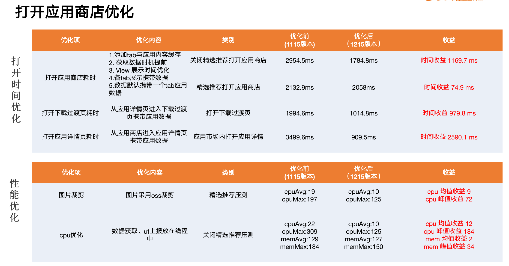
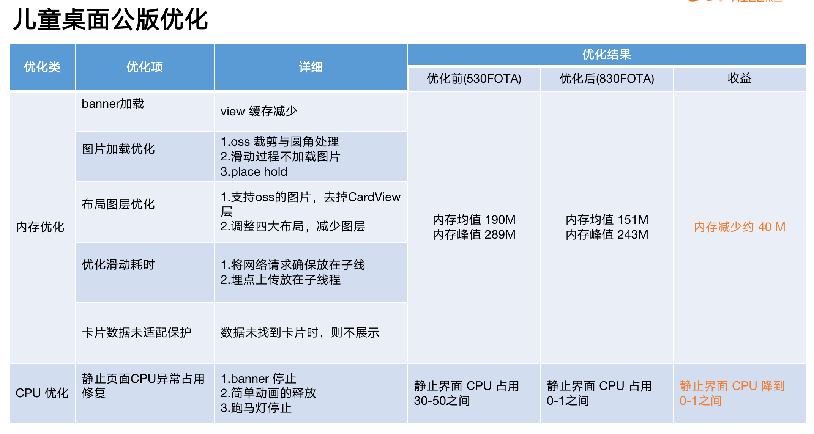

#  面试宝典 - 项目

## 电子书包

### 题目展示架构图

简单工厂模式：创建题目。

装饰器模式：题目+我的答案+正确答案

观察者模式：用户答题后，如果判断为可以提交，则提交按钮的状态置为可点击。

改进方向：单题的单选题和试卷的单选题可以抽出一个基类，从简单工厂模式转为抽象工厂模式。

## AI 跟拍

### 视频拍摄架构图

## 应用商店

### 应用安装

应用提供了预装和用户手动安装两种方式，都是通过静默安装来进行安装的。

* sdk <= O(27)

  如果 sdk 版本小于等于 O(27)，则通过反射调用 PackageManager 的 installPackage 方法安装应用，Packagelnstaller 是安卓系统底层用于 apk 安装的管理类，只有系统级别的应用，才能使用这个类的功能。

* sdk > O(27)

  9 以上的版本是使用 Packagelnstaller 进行安装的。 

### 空间清理

空间清理主要是对非系统应用的内存进行清理。

清除缓存反射调用接口：PackageManager.deleteApplicationCacheFiles。

它会清除以下项目：

1. 清除data/data/{package_name}/cache/下的所有文件。
2. 清除data/data/{package_name}/code_cache/下的所有文件。
3. 清除mnt/sdcard/Android/data/{package_name}/下的 cache 文件夹。

### 打开优化

打开应用商店优化分为两部分：一部分是打开事件的优化，另一部分是性能优化。

## 儿童桌面公版

### 优化

